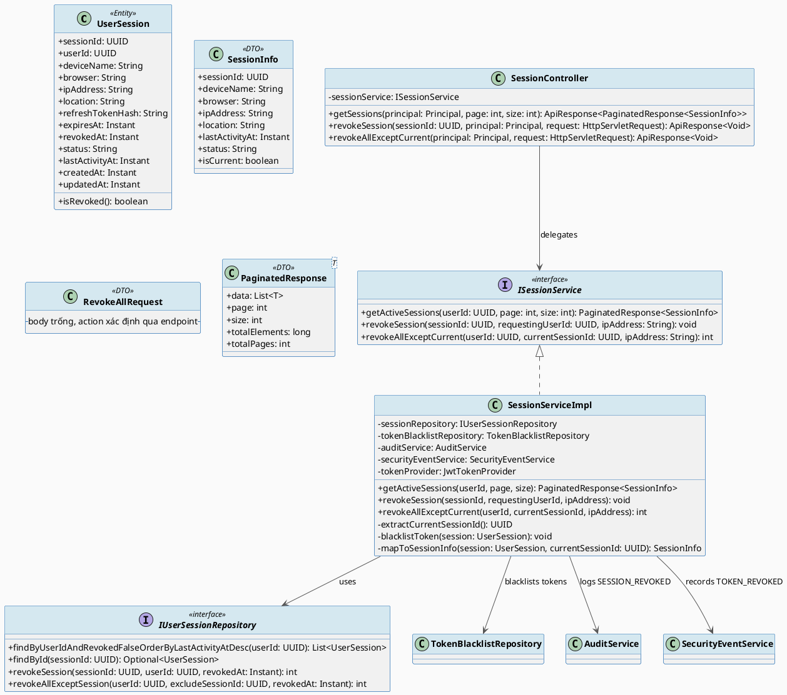
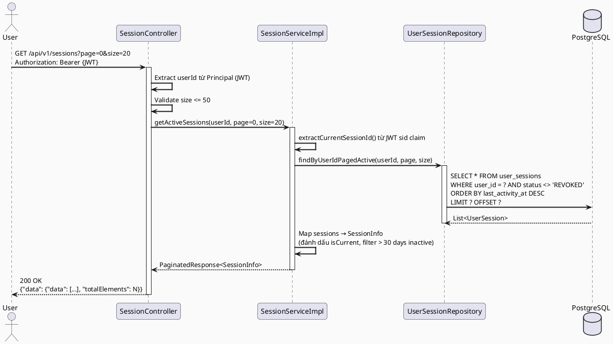
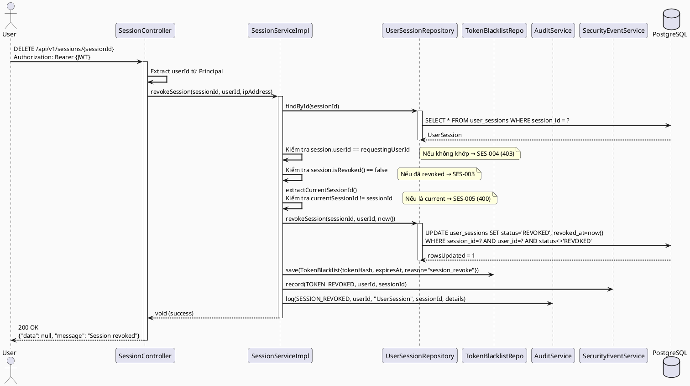
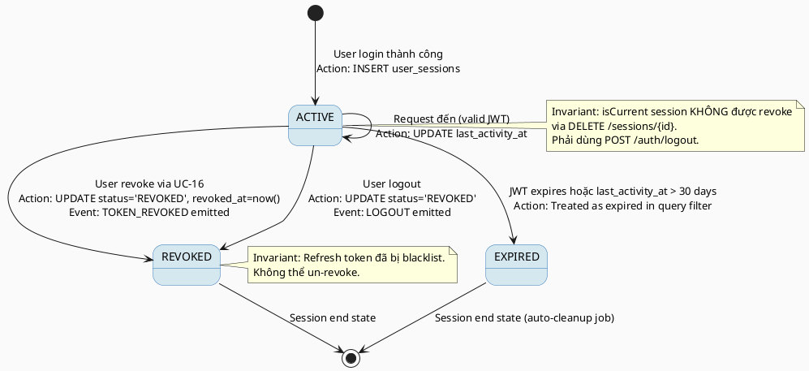

# ENGINEERING DOCUMENTATION STANDARD (EDS) v2.0
# Technical Design Specification — UC-16 Manage Own Sessions

| Field              | Value                             |
| ------------------ | --------------------------------- |
| **Document ID**    | `CB-SES-IMP-001`                  |
| **Version**        | `1.0`                             |
| **Date**           | `2026-06-26`                      |
| **Status**         | `Approved`                        |
| **Document Owner** | `PhuongNT`                        |
| **Author**         | `AI Agent`                        |
| **Reviewed by**    | `[Tech Lead]`                     |
| **DPO Sign-off**   | `[ ] Pending`                     |
| **Approved by**    | `[Principal Architect]`           |
| **Last Review**    | `2026-06-26`                      |
| **Based on EDS**   | `v2.0`                            |

---

## CHANGELOG

| Ngày       | Người thực hiện | Nội dung thay đổi                                          |
| ---------- | --------------- | ---------------------------------------------------------- |
| 2026-06-26 | AI Agent        | Tạo tài liệu lần đầu cho UC-16 Manage Own Sessions        |

---

## MỤC LỤC

1. [Tổng quan Module](#1-tổng-quan-module)
2. [Ma trận Truy vết (Traceability Matrix)](#2-ma-trận-truy-vết-traceability-matrix)
3. [Architecture Decision Records (ADR)](#3-architecture-decision-records-adr)
4. [Non-Functional Requirements & SLA](#4-non-functional-requirements--sla)
5. [Static Modeling (Mô hình Tĩnh)](#5-static-modeling-mô-hình-tĩnh)
6. [Dynamic Modeling (Mô hình Động)](#6-dynamic-modeling-mô-hình-động)
7. [Domain Event Catalog](#7-domain-event-catalog)
8. [Interface Specification (Đặc tả Giao diện)](#8-interface-specification-đặc-tả-giao-diện)
9. [API Specification](#9-api-specification)
10. [Bảng mã lỗi (Error Codes)](#10-bảng-mã-lỗi-error-codes)
11. [Quy trình Triển khai (Step-by-Step)](#11-quy-trình-triển-khai-step-by-step)
12. [Rollback & Incident Runbook](#12-rollback--incident-runbook)
13. [Kịch bản Kiểm thử Chi tiết](#13-kịch-bản-kiểm-thử-chi-tiết)
14. [Phương pháp Xác minh](#14-phương-pháp-xác-minh)
15. [Mẫu thử thực tế (API Verification Samples)](#15-mẫu-thử-thực-tế-api-verification-samples)
16. [Bảng tổng hợp phân quyền (Authorization Matrix)](#16-bảng-tổng-hợp-phân-quyền-authorization-matrix)
17. [AI Prompt Constraints (CASE 2.0)](#17-ai-prompt-constraints-case-20)

---

## 1. Tổng quan Module

> UC-16 cho phép người dùng đã xác thực xem danh sách các phiên đăng nhập đang hoạt động của chính họ (device info, IP, last active) và thu hồi (revoke) từng phiên hoặc tất cả phiên ngoại trừ phiên hiện tại. Module này đã có implementation cơ bản trong `identity.controller.SessionController` và `identity.service.impl.SessionServiceImpl`. UC-16 hoàn thiện và chuẩn hóa theo EDS v2.0: thêm pagination (max 50), enforce 30-day auto-expiry, bổ sung `revoke-all-except-current` endpoint, và đảm bảo `SecurityEventType.TOKEN_REVOKED` được ghi đúng.

| Field                     | Value                                                                            |
| ------------------------- | -------------------------------------------------------------------------------- |
| **Module Name**           | `Manage Own Sessions`                                                            |
| **Bounded Context**       | `auth` (session sub-domain)                                                      |
| **UC ID**                 | `UC-16`                                                                          |
| **SRS Reference**         | `3.1.1.16`                                                                       |
| **Platform**              | `Mobile App (Flutter) + Web App (React)`                                         |
| **Data Classification**   | `Internal`                                                                       |
| **Compliance Scope**      | `PDPA Luật 91/2025 Điều 7 (quyền thu hồi quyền truy cập); GDPR Art. 7.3`        |
| **Upstream Dependencies** | `security (JWT Auth, JwtTokenProvider)`, `audit (AuditService, SecurityEventService)` |
| **Downstream Consumers**  | `security (token validation — blacklist lookup)`                                 |

---

## 2. Ma trận Truy vết (Traceability Matrix)

| Requirement ID   | Loại          | Mô tả yêu cầu                                                              | Thành phần Code                                                         | Compliance Target             | ADR liên quan |
| ---------------- | ------------- | --------------------------------------------------------------------------- | ----------------------------------------------------------------------- | ----------------------------- | ------------- |
| UC-16            | User Story    | Người dùng xem và quản lý phiên đăng nhập của chính mình                   | `SessionController`, `SessionService`                                   | PDPA Điều 7                   | ADR-003       |
| BR-PRIVACY       | Business Rule | Người dùng chỉ được xem/thu hồi session của chính mình                     | `SessionServiceImpl.revokeSession()` — kiểm tra `session.userId == requestingUserId` | PDPA Điều 7 | ADR-003 |
| BR-SES-CURRENT   | Business Rule | Không được revoke session hiện tại qua flow này — phải dùng Logout          | `SessionServiceImpl.revokeSession()` — kiểm tra `currentSessionId != sessionId` | — | ADR-004 |
| BR-SES-EXPIRE    | Business Rule | Session > 30 ngày không active được coi là expired                          | `SessionServiceImpl.getActiveSessions()` — filter `lastActivityAt < now - 30d` | — | — |
| BR-SES-PAGINATION| Business Rule | Danh sách session phân trang, tối đa 50 bản ghi/lần                         | `SessionController.getSessions()` — `@RequestParam page, size` (max 50)| — | ADR-003 |
| BR-SES-TOKEN     | Business Rule | Revoke session phải invalidate refresh token (ghi vào TokenBlacklist)       | `SessionServiceImpl.revokeSession()` → `TokenBlacklistRepository.save()` | GDPR Art. 7.3 | — |
| BR-SES-AUDIT     | Business Rule | Revoke session phải ghi `SecurityEventType.TOKEN_REVOKED`                   | `SessionServiceImpl` → `SecurityEventService.record(TOKEN_REVOKED)`     | PDPA Điều 7   | ADR-004       |
| SRS-3.1.1.16     | Functional    | Người dùng thấy device name, IP, last active, trạng thái cho mỗi session    | `SessionInfo` DTO                                                        | —             | —             |

---

## 3. Architecture Decision Records (ADR)

### ADR-003 — Pagination và max 50 sessions

| Field        | Value                          |
| ------------ | ------------------------------ |
| **Status**   | `Accepted`                     |
| **Deciders** | `PhuongNT — Tech Lead`         |
| **Date**     | `2026-06-26`                   |

#### Bối cảnh (Context)
`SessionServiceImpl.getActiveSessions()` hiện tại trả về `List<SessionInfo>` không có pagination — có thể trả về rất nhiều sessions nếu user login nhiều thiết bị. Cần giới hạn để bảo vệ performance và không lộ quá nhiều metadata.

#### Các phương án đã xem xét (Options Considered)

| Phương án | Mô tả                                          | Ưu điểm                       | Nhược điểm                         |
| --------- | ---------------------------------------------- | ----------------------------- | ---------------------------------- |
| A         | Giới hạn cứng: trả về max 50 records mới nhất  | Đơn giản, không thay đổi API  | Không flexible cho power users     |
| B         | Pagination chuẩn: `page`, `size` (max 50/page) | Flexible, theo RESTful chuẩn  | Phải sửa API contract + DTO        |

#### Quyết định (Decision)
Chọn **Phương án B**: thêm pagination chuẩn. `GET /api/v1/sessions?page=0&size=20`. Max `size = 50` được enforce tại service layer. Trả về `PaginatedResponse<SessionInfo>` (đã có sẵn trong codebase).

#### Hệ quả (Consequences)

**Tích cực:**
- API chuẩn hơn; client control được số lượng records.
- Không trả về toàn bộ session history.

**Tiêu cực / Trade-offs:**
- Breaking change nếu mobile client đã gọi `GET /api/v1/sessions` và expect `List` — cần versioning hoặc backward compat.

**Compliance Impact:**
- Data minimization (GDPR Art. 5.1(c)): không expose toàn bộ session history.

---

### ADR-004 — Revoke current session phải dùng Logout endpoint

| Field        | Value                          |
| ------------ | ------------------------------ |
| **Status**   | `Accepted`                     |
| **Deciders** | `PhuongNT — Tech Lead`         |
| **Date**     | `2026-06-26`                   |

#### Bối cảnh (Context)
Nếu user có thể revoke session hiện tại qua `DELETE /api/v1/sessions/{sessionId}`, JWT vẫn còn hiệu lực (access token không bị invalidate ngay) nhưng session bị xóa — tạo ra trạng thái không nhất quán. Cần tách luồng.

#### Các phương án đã xem xét (Options Considered)

| Phương án | Mô tả                                               | Ưu điểm                    | Nhược điểm                                  |
| --------- | --------------------------------------------------- | -------------------------- | ------------------------------------------- |
| A         | Cho phép revoke current session, blacklist access token ngay | Đầy đủ nhất           | Phức tạp; phải blacklist access token (short-lived) |
| B         | Block revoke current session; redirect sang /logout | Đơn giản; nhất quán với UX | User cần biết dùng Logout                   |

#### Quyết định (Decision)
Chọn **Phương án B**: `SessionServiceImpl.revokeSession()` detect current session qua `sid` JWT claim và throw `IllegalArgumentException("Please use Logout...")` → Controller map sang `SES-004`. Implementation này đã có sẵn — cần chuẩn hóa error code.

#### Hệ quả (Consequences)

**Tích cực:**
- Tránh trạng thái không nhất quán giữa JWT access token và session.

**Tiêu cực / Trade-offs:**
- UX: user phải biết phân biệt "revoke session" vs "logout". UI phải hiển thị rõ.

**Compliance Impact:**
- Không ảnh hưởng compliance — Logout flow xử lý revoke current session đúng cách.

---

## 4. Non-Functional Requirements & SLA

### 4.1. Performance & Availability

| Category     | Requirement                         | Target SLA  | Measurement Method  | Compliance Basis |
| ------------ | ----------------------------------- | ----------- | ------------------- | ---------------- |
| Latency      | GET /sessions API response (p99)    | `< 300ms`   | k6 load test        | —                |
| Availability | Uptime (monthly)                    | `99.9%`     | Uptime monitor      | —                |
| Throughput   | Concurrent read req/s               | `500 req/s` | Load test           | —                |
| Throughput   | Concurrent revoke req/s             | `50 req/s`  | Load test           | —                |

### 4.2. Data Integrity & Retention

| Category    | Requirement                                   | Target         | Verification Method      | Compliance Basis  |
| ----------- | --------------------------------------------- | -------------- | ------------------------ | ----------------- |
| Durability  | TokenBlacklist entry không bị mất khi revoke  | RPO = 0        | Transaction log          | GDPR Art. 5.1(f)  |
| Retention   | Audit log SESSION_REVOKED                     | 7 năm          | DB backup policy         | GDPR Art. 5.1(e)  |
| Consistency | Session revoke ↔ TokenBlacklist atomic        | 100%           | `@Transactional` rollback| PDPA Điều 7       |

### 4.3. Security

| Category                  | Requirement                        | Target      | Verification Method    | Compliance Basis |
| ------------------------- | ---------------------------------- | ----------- | ---------------------- | ---------------- |
| Own-resource enforcement  | Chỉ xem/revoke session của mình    | 100%        | Auth Matrix (§16)      | PDPA Điều 7      |
| Token invalidation        | Revoke blacklists refresh token    | Immediate   | TokenBlacklist check   | GDPR Art. 7.3    |
| Encryption in transit     | Tất cả endpoint                    | TLS 1.3+    | SSL Labs scan          | GDPR Art. 32     |
| IP Address logging        | IP được mask trong logs (last octet)| Comply      | Log audit              | GDPR Art. 5.1(c) |

### 4.4. Scalability & Capacity Planning

> Dự kiến: 10,000 users; mỗi user trung bình 3 sessions; 30,000 session rows. `user_sessions` đã có index trên `user_id`. Revoke-all operation max 50 rows per user — không cần batch job ở M3 Alpha.

---

## 5. Static Modeling (Mô hình Tĩnh)

### 5.1. Class Diagram (PlantUML)



### 5.2. Data Structure (PostgreSQL DDL)

```sql
-- Bảng user_sessions đã tồn tại từ V1__init_schema.sql
-- Cần bổ sung 2 thay đổi trong V5__session_enhancements.sql:

-- 1. Thêm columns: browser, location, last_activity_at (nếu chưa có)
-- Kiểm tra V1: user_sessions có: session_id, created_at, device_name, expires_at,
--   ip_address, refresh_token_hash, revoked_at, status, updated_at, user_id
-- Thiếu: browser, location, last_activity_at

-- Migration V5__session_enhancements.sql:
ALTER TABLE public.user_sessions
    ADD COLUMN IF NOT EXISTS browser         VARCHAR(100),
    ADD COLUMN IF NOT EXISTS location        VARCHAR(150),
    ADD COLUMN IF NOT EXISTS last_activity_at TIMESTAMPTZ;

-- 2. Thêm query method: revoke-all-except
-- (Không cần DDL — chỉ cần custom @Query trong Repository)

-- 3. Index hỗ trợ pagination + revoke-all query
CREATE INDEX IF NOT EXISTS idx_user_sessions_user_revoked_activity
    ON public.user_sessions (user_id, status, last_activity_at DESC)
    WHERE status <> 'REVOKED';

-- 4. Tham chiếu: token_blacklist (đã tồn tại theo code, cần verify schema)
-- TokenBlacklist entity tại: identity/entity/TokenBlacklist.java
-- Table: token_blacklist (token_hash, expires_at, revoked_at, reason)
```

---

## 6. Dynamic Modeling (Mô hình Động)

### 6.1. Sequence Diagram — List Sessions Happy Path



### 6.2. Sequence Diagram — Revoke Single Session



### 6.3. Sequence Diagram — Error Path (Revoke Current Session)

```plantuml
@startuml UC16_RevokeCurrentSession_ErrorPath
skinparam sequenceArrowThickness 2
skinparam roundcorner 10
skinparam backgroundColor #FAFAFA

actor       "User"              as Client
participant "SessionController" as Controller
participant "SessionServiceImpl"as Service

Client -> Controller : DELETE /api/v1/sessions/{currentSessionId}\nAuthorization: Bearer {JWT}
activate Controller

Controller -> Service : revokeSession(currentSessionId, userId, ip)
activate Service

Service -> Service : extractCurrentSessionId() từ JWT sid\n== currentSessionId → match!
Service -> Service : throw IllegalArgumentException("Please use Logout...")
Service --> Controller : IllegalArgumentException
deactivate Service

Controller -> Controller : catch → SES-005
Controller --> Client : 400 Bad Request\n{"error": {"code": "SES-005", "message": "Dùng Logout để đăng xuất thiết bị này"}}
deactivate Controller

@enduml
```

### 6.4. State Machine — Session lifecycle



> **Invariant bất biến:**
> - Session đã REVOKED không thể chuyển về ACTIVE.
> - Khi revoke → `token_blacklist` PHẢI có entry tương ứng trong cùng transaction.
> - `isCurrent = true` → không thể revoke qua `DELETE /sessions/{id}`.

---

## 7. Domain Event Catalog

### 7.1. Events Published (Phát ra)

| Event Name                  | Trigger                                  | Publisher            | Subscriber(s)                          | Payload Schema              | Async? |
| --------------------------- | ---------------------------------------- | -------------------- | -------------------------------------- | --------------------------- | ------ |
| `TOKEN_REVOKED` (SecurityEvent) | Revoke session thành công           | `SessionServiceImpl` | `SecurityEventService`, `AuditService` | `SecurityEvent.java`        | No     |
| `SESSION_REVOKED` (AuditLog)| Revoke session hoặc revoke-all thành công| `SessionServiceImpl` | `AuditService`                         | `AuditLog.java`             | No     |

### 7.2. Events Consumed (Tiêu thụ)

| Event Name | Source | Handler | Action thực hiện |
| ---------- | ------ | ------- | ---------------- |
| _(Không có)_ | — | — | — |

### 7.3. Payload Schema

```java
// SecurityEvent.java (đã có tại audit/entity/SecurityEvent.java)
// SecurityEventType.TOKEN_REVOKED được dùng khi revoke session
// Payload structure:
public class SecurityEvent {
    private UUID eventId;
    private SecurityEventType eventType;  // TOKEN_REVOKED
    private UUID userId;
    private String ipAddress;
    private String userAgent;
    private String details;
    private Instant occurredAt;
}

// AuditLog domain event cho SESSION_REVOKED:
// action: AuditAction.SESSION_REVOKED
// entityType: "UserSession"
// entityId: sessionId.toString()
// description: "Session revoked by user from IP: {ipAddress}"
```

---

## 8. Interface Specification (Đặc tả Giao diện)

### 8.1. Service Interface

```java
// ISessionService.java — ENHANCED (extends existing SessionService)
// @version 2.0 (V1: getActiveSessions, revokeSession, logout, updateLastActivity, getCurrentSession)
// Package: com.carebridge.backend.identity.service

/**
 * Dịch vụ quản lý phiên đăng nhập của người dùng.
 * V2.0 thêm: pagination cho getActiveSessions, revokeAllExceptCurrent.
 * Mọi operation đều enforce own-resource: userId từ JWT phải == session owner.
 */
public interface ISessionService {

    /**
     * Lấy danh sách sessions đang active của người dùng (có phân trang).
     * @param userId    ID người dùng từ JWT
     * @param page      Trang (0-indexed)
     * @param size      Số bản ghi mỗi trang (max 50, enforce tại service)
     * @return          PaginatedResponse<SessionInfo>
     */
    PaginatedResponse<SessionInfo> getActiveSessionsPaged(UUID userId, int page, int size);

    /**
     * Thu hồi một session cụ thể (không thể là current session).
     * @param sessionId         Session cần thu hồi
     * @param requestingUserId  userId từ JWT
     * @param ipAddress         IP của request (cho audit)
     * @throws AuthorizationException [SES-004] Khi cố thu hồi session của người khác
     * @throws ValidationException    [SES-005] Khi cố thu hồi current session
     * @throws ResourceNotFoundException [SES-003] Khi session không tồn tại
     */
    void revokeSession(UUID sessionId, UUID requestingUserId, String ipAddress);

    /**
     * Thu hồi tất cả sessions ngoại trừ current session.
     * @param userId            userId từ JWT
     * @param currentSessionId  Session ID hiện tại (không được thu hồi)
     * @param ipAddress         IP của request (cho audit)
     * @return                  Số sessions đã thu hồi
     */
    int revokeAllExceptCurrent(UUID userId, UUID currentSessionId, String ipAddress);
}
```

### 8.2. Repository Interface

```java
// IUserSessionRepository.java — ENHANCED
// @version 2.0
// Package: com.carebridge.backend.identity.repository
// Extends: JpaRepository<UserSession, UUID>

public interface IUserSessionRepository extends JpaRepository<UserSession, UUID> {

    /**
     * Lấy sessions chưa revoked, sắp xếp theo last_activity_at mới nhất.
     * Dùng cho getActiveSessions (non-paginated — legacy).
     */
    List<UserSession> findByUserIdAndRevokedFalseOrderByLastActivityAtDesc(UUID userId);

    /**
     * Lấy sessions chưa revoked với phân trang.
     */
    Page<UserSession> findByUserIdAndRevokedFalseOrderByLastActivityAtDesc(UUID userId, Pageable pageable);

    /**
     * Revoke một session cụ thể (atomic UPDATE với WHERE clause).
     * @return số rows bị ảnh hưởng (0 nếu race condition)
     */
    @Modifying
    @Query("UPDATE UserSession s SET s.revokedAt = :revokedAt, s.status = 'REVOKED' " +
           "WHERE s.sessionId = :sessionId AND s.userId = :userId AND s.revokedAt IS NULL")
    int revokeSession(@Param("sessionId") UUID sessionId,
                      @Param("userId") UUID userId,
                      @Param("revokedAt") Instant revokedAt);

    /**
     * Revoke tất cả sessions của user, ngoại trừ session hiện tại.
     * @return số rows bị ảnh hưởng
     */
    @Modifying
    @Query("UPDATE UserSession s SET s.revokedAt = :revokedAt, s.status = 'REVOKED' " +
           "WHERE s.userId = :userId AND s.sessionId <> :excludeSessionId AND s.revokedAt IS NULL")
    int revokeAllExceptSession(@Param("userId") UUID userId,
                               @Param("excludeSessionId") UUID excludeSessionId,
                               @Param("revokedAt") Instant revokedAt);

    /**
     * Tìm session theo refresh token hash (cho logout flow).
     */
    Optional<UserSession> findByRefreshTokenHashAndRevokedFalse(String refreshTokenHash);
}
```

---

## 9. API Specification

### 9.1. Endpoints Table

| Method   | Path                               | Auth Level  | Required Roles                                           | Rate Limit | Idempotent? |
| -------- | ---------------------------------- | ----------- | -------------------------------------------------------- | ---------- | ----------- |
| `GET`    | `/api/v1/sessions`                 | JWT Bearer  | `ROLE_MOTHER`, `ROLE_EXPERT`, `ROLE_ADMIN`               | 60/min     | Yes         |
| `DELETE` | `/api/v1/sessions/{sessionId}`     | JWT Bearer  | `ROLE_MOTHER`, `ROLE_EXPERT`, `ROLE_ADMIN`               | 30/min     | Yes         |
| `DELETE` | `/api/v1/sessions`                 | JWT Bearer  | `ROLE_MOTHER`, `ROLE_EXPERT`, `ROLE_ADMIN`               | 10/min     | Yes         |

### 9.2. Request / Response Schemas

#### `GET /api/v1/sessions?page=0&size=20` — Lấy danh sách sessions

**Response — 200 OK:**
```json
{
  "data": {
    "data": [
      {
        "sessionId": "550e8400-e29b-41d4-a716-446655440000",
        "deviceName": "iPhone 14 Pro",
        "browser": "Safari/17.0",
        "ipAddress": "192.168.1.1",
        "location": "Hà Nội, VN",
        "lastActivityAt": "2026-06-26T08:00:00.000Z",
        "status": "active",
        "isCurrent": true
      },
      {
        "sessionId": "660e8400-e29b-41d4-a716-446655440001",
        "deviceName": "Chrome on Windows",
        "browser": "Chrome/125.0",
        "ipAddress": "10.0.0.5",
        "location": "TP. Hồ Chí Minh, VN",
        "lastActivityAt": "2026-06-20T10:00:00.000Z",
        "status": "active",
        "isCurrent": false
      }
    ],
    "page": 0,
    "size": 20,
    "totalElements": 2,
    "totalPages": 1
  }
}
```

**Query Params:**
- `page` (default: 0): trang hiện tại (0-indexed)
- `size` (default: 20, max: 50): số bản ghi mỗi trang

**Response — 400 (size > 50):**
```json
{
  "error": { "code": "SES-001", "message": "Kích thước trang tối đa là 50" }
}
```

#### `DELETE /api/v1/sessions/{sessionId}` — Thu hồi một session

**Response — 200 OK:**
```json
{
  "data": null,
  "message": "Session đã được thu hồi thành công"
}
```

**Response — 400 (revoke current session):**
```json
{
  "error": {
    "code": "SES-005",
    "message": "Không thể thu hồi phiên hiện tại. Hãy dùng chức năng Đăng xuất."
  }
}
```

**Response — 404 (session not found):**
```json
{
  "error": { "code": "SES-003", "message": "Không tìm thấy phiên đăng nhập" }
}
```

#### `DELETE /api/v1/sessions` — Thu hồi tất cả sessions ngoại trừ current

**Response — 200 OK:**
```json
{
  "data": { "revokedCount": 3 },
  "message": "3 phiên đăng nhập đã được thu hồi"
}
```

---

## 10. Bảng mã lỗi (Error Codes)

> Tiền tố mã lỗi: `SES-` cho Session module.

| Code      | HTTP Status | Message (EN)                                  | Message (VI)                                              | Trigger Condition                                             |
| --------- | ----------- | --------------------------------------------- | --------------------------------------------------------- | ------------------------------------------------------------- |
| `SES-001` | 400         | Page size exceeds maximum (50)                | Kích thước trang tối đa là 50                            | `size` param > 50 trong GET /sessions                        |
| `SES-002` | 400         | Session already revoked                       | Phiên đăng nhập đã bị thu hồi trước đó                  | Cố revoke session đã bị revoked                              |
| `SES-003` | 404         | Session not found                             | Không tìm thấy phiên đăng nhập                           | `sessionId` không tồn tại hoặc không thuộc user này          |
| `SES-004` | 403         | Cannot revoke another user's session          | Không có quyền thu hồi phiên của người khác              | Session owner != requestingUserId                             |
| `SES-005` | 400         | Cannot revoke current session via this flow   | Không thể thu hồi phiên hiện tại. Hãy dùng Đăng xuất.   | sessionId == currentSessionId (từ JWT sid)                    |
| `SES-006` | 409         | Concurrent revoke conflict                    | Xung đột khi thu hồi phiên — thử lại                    | Race condition: `UPDATE` trả về 0 rows                        |
| `SES-007` | 500         | Internal error during session revoke          | Lỗi hệ thống khi thu hồi phiên                           | DB error hoặc TokenBlacklist service lỗi                     |

---

## 11. Quy trình Triển khai (Step-by-Step)

### 11.1. Prerequisites

- [ ] ADR-003 và ADR-004 đã được Accepted (xem §3)
- [ ] Blueprint đã được Principal Architect approve
- [ ] Verify `user_sessions` schema có đủ columns: `browser`, `location`, `last_activity_at`
- [ ] Môi trường staging đã sẵn sàng

### 11.2. Pre-Migration Checklist

- [ ] Backup DB: `pg_dump -h [host] -U [user] carebridge > backup_ses_20260626.sql`
- [ ] Migration `V5__session_enhancements.sql` đã test trên staging ≥ 24 giờ
- [ ] Rollback script đã test trên staging

### 11.3. Implementation Steps

#### Chặng 1 — Flyway Migration (nếu cần)

```sql
-- File: src/main/resources/db/migration/V5__session_enhancements.sql
-- Kiểm tra và thêm columns thiếu vào user_sessions

ALTER TABLE public.user_sessions
    ADD COLUMN IF NOT EXISTS browser          VARCHAR(100),
    ADD COLUMN IF NOT EXISTS location         VARCHAR(150),
    ADD COLUMN IF NOT EXISTS last_activity_at  TIMESTAMPTZ;

CREATE INDEX IF NOT EXISTS idx_user_sessions_user_revoked_activity
    ON public.user_sessions (user_id, status, last_activity_at DESC)
    WHERE status <> 'REVOKED';
```

#### Chặng 2 — Cập nhật `IUserSessionRepository`

```java
// Thêm 2 methods vào UserSessionRepository:
// 1. findByUserIdAndRevokedFalse(..., Pageable pageable) — Page<UserSession>
// 2. revokeAllExceptSession(@Param("userId"), @Param("excludeSessionId"), @Param("revokedAt"))
// (Xem §8.2 interface spec)
```

#### Chặng 3 — Cập nhật `SessionServiceImpl`

```java
// 1. Sửa getActiveSessions() → getActiveSessionsPaged() với pagination
// 2. Thêm revokeAllExceptCurrent()
// 3. Đảm bảo SecurityEventService.record(TOKEN_REVOKED) được gọi khi revoke
// 4. Enforce max size = 50 tại service layer
```

#### Chặng 4 — Cập nhật `SessionController`

```java
// 1. Sửa GET /sessions để nhận @RequestParam page, size
// 2. Thêm DELETE /sessions (revoke-all-except-current)
// 3. Chuẩn hóa error code mapping: SES-003, SES-004, SES-005
```

#### Chặng 5 — Verification sau deploy

```bash
# List sessions
curl -X GET "https://[host]/api/v1/sessions?page=0&size=10" \
  -H "Authorization: Bearer $TOKEN"
# Expected: 200 OK với PaginatedResponse

# Revoke specific session
curl -X DELETE "https://[host]/api/v1/sessions/{sessionId}" \
  -H "Authorization: Bearer $TOKEN"
# Expected: 200 OK

# Revoke current session (must fail)
curl -X DELETE "https://[host]/api/v1/sessions/{currentSessionId}" \
  -H "Authorization: Bearer $TOKEN"
# Expected: 400 + SES-005

# Revoke all except current
curl -X DELETE "https://[host]/api/v1/sessions" \
  -H "Authorization: Bearer $TOKEN"
# Expected: 200 OK với revokedCount
```

### 11.4. Deployment Checklist

- [ ] Migration `V5__session_enhancements.sql` chạy thành công
- [ ] GET /sessions trả về PaginatedResponse với `totalElements`
- [ ] DELETE /sessions/{id} thu hồi session đúng và blacklist token
- [ ] DELETE /sessions/{currentId} → 400 + `SES-005`
- [ ] DELETE /sessions → revoke tất cả sessions ngoài current
- [ ] `SecurityEventService.record(TOKEN_REVOKED, ...)` được gọi sau mỗi revoke
- [ ] Audit log có record `SESSION_REVOKED`

---

## 12. Rollback & Incident Runbook

### 12.1. Điều kiện kích hoạt Rollback

| Điều kiện                                  | Ngưỡng                    | Người quyết định     |
| ------------------------------------------ | ------------------------- | -------------------- |
| Error rate tăng đột biến                   | > 5% trong 5 phút         | On-call Engineer     |
| Latency p99 vượt ngưỡng                    | > 600ms                   | On-call Engineer     |
| Session revoke không blacklist token       | Bất kỳ case nào           | Tech Lead — CRITICAL |
| Audit log ngừng hoạt động                  | > 1 phút                  | On-call Engineer     |
| User có thể revoke session của người khác  | Bất kỳ case nào           | Tech Lead — CRITICAL |

### 12.2. Rollback Procedure

```bash
# Bước 1: Re-deploy phiên bản cũ
kubectl rollout undo deployment/carebridge-api

# Bước 2: Verify rollback thành công
kubectl rollout status deployment/carebridge-api
curl -X GET https://[host]/api/v1/health
# Expected: {"status": "ok"}

# Bước 3: Rollback migration nếu cần (chỉ khi chưa có data)
# ALTER TABLE user_sessions DROP COLUMN IF EXISTS browser;
# ALTER TABLE user_sessions DROP COLUMN IF EXISTS location;
# ALTER TABLE user_sessions DROP COLUMN IF EXISTS last_activity_at;

# Bước 4: Verify session list hoạt động
curl -X GET "https://[host]/api/v1/sessions" -H "Authorization: Bearer $TOKEN"
```

### 12.3. Notification Protocol

| Thời điểm          | Người nhận    | Kênh             | Template                                          |
| ------------------ | ------------- | ---------------- | ------------------------------------------------- |
| Ngay khi phát hiện | On-call team  | Slack `#incident`| "🚨 [SES] UC-16 incident detected: [mô tả]"      |
| Trong 30 phút      | DPO           | Email            | Bắt buộc nếu session data bị lộ (PDPA Điều 7)   |
| Trong 72 giờ       | DPA           | Email            | Bắt buộc nếu có data breach (GDPR Art. 33)        |

### 12.4. Post-Incident Review (PIR)

> Bắt buộc hoàn thành PIR trong vòng **48 giờ** sau khi incident được resolve.

**PIR Template:**
- **Timeline:** Diễn biến theo thứ tự thời gian
- **Root Cause:** 5 Whys
- **Impact:** Số sessions bị ảnh hưởng, tokens không được blacklist?
- **Remediation:** Bước đã thực hiện
- **Prevention:** Action items

---

## 13. Kịch bản Kiểm thử Chi tiết

### 13.1. Unit Tests

#### TC-UNIT-001 — Lấy danh sách sessions phân trang

```gherkin
Feature: Manage Own Sessions — List
  Background:
    Given test data classification: SYNTHETIC
    And user có userId="user-ses-001" đã xác thực với JWT hợp lệ

  Scenario: Lấy sessions thành công với phân trang
    Given user có 5 active sessions trong DB
    When getActiveSessionsPaged("user-ses-001", page=0, size=3) được gọi
    Then trả về PaginatedResponse với data.size() = 3
    And totalElements = 5
    And totalPages = 2
    And session có lastActivityAt gần nhất nhất được trả về đầu tiên

  Scenario: size > 50 → SES-001
    When getActiveSessionsPaged("user-ses-001", page=0, size=100) được gọi
    Then ValidationException("SES-001") được throw
```

#### TC-UNIT-002 — Revoke session thành công

```gherkin
  Scenario: Revoke session hợp lệ (không phải current)
    Given session "ses-002" thuộc user "user-ses-001", đang active
    And current session ID là "ses-001" (khác "ses-002")
    When revokeSession("ses-002", "user-ses-001", "127.0.0.1") được gọi
    Then sessionRepository.revokeSession("ses-002", ...) được gọi 1 lần
    And tokenBlacklistRepository.save(...) được gọi 1 lần
    And securityEventService.record(TOKEN_REVOKED, ...) được gọi 1 lần
    And auditService.log(SESSION_REVOKED, ...) được gọi 1 lần
```

#### TC-UNIT-003 — Revoke current session → SES-005

```gherkin
  Scenario: Cố revoke current session → lỗi
    Given current session ID = "ses-001" (từ JWT sid claim)
    When revokeSession("ses-001", "user-ses-001", "127.0.0.1") được gọi
    Then IllegalArgumentException("Please use Logout...") được throw
    And sessionRepository.revokeSession() KHÔNG được gọi
    And tokenBlacklistRepository.save() KHÔNG được gọi
```

### 13.2. Integration Tests

#### TC-INT-001 — Revoke-all-except-current

```gherkin
  Scenario: Revoke all sessions except current
    Given test data classification: SYNTHETIC
    And database có user "user-ses-int-001" với 4 sessions: ses-A (current), ses-B, ses-C, ses-D
    When revokeAllExceptCurrent("user-ses-int-001", currentSessionId="ses-A", ip="127.0.0.1") được gọi
    Then sessions ses-B, ses-C, ses-D bị revoke trong DB (status = 'REVOKED')
    And ses-A vẫn active
    And token_blacklist có 3 entries mới
    And audit_logs có record SESSION_REVOKED với count = 3
```

### 13.3. E2E / Security Tests

#### TC-E2E-001 — Revoke session của người khác → 403

```gherkin
  Scenario: Unauthorized revoke — cố revoke session của user khác
    Given test data classification: SYNTHETIC
    And user A (user-ses-001) đã đăng nhập
    And user B (user-ses-002) có session "ses-B-001"
    When user A gọi DELETE /api/v1/sessions/ses-B-001 với JWT của A
    Then response status là 403
    And response.error.code = "SES-004"
    And ses-B-001 vẫn active trong DB

  Scenario: Revoke all without JWT → 401
    When DELETE /api/v1/sessions được gọi không có Authorization header
    Then response status là 401
```

---

## 14. Phương pháp Xác minh

### 14.1. Database Inspection

```sql
-- Verify session bị revoke đúng
SELECT session_id, status, revoked_at, user_id
FROM user_sessions
WHERE session_id = '{revokedSessionId}';
-- Expected: status = 'REVOKED', revoked_at IS NOT NULL

-- Verify token blacklist có entry
SELECT token_hash, expires_at, reason, revoked_at
FROM token_blacklist
WHERE reason = 'session_revoke'
ORDER BY revoked_at DESC
LIMIT 5;

-- Verify audit log
SELECT id, action, user_id, entity_type, entity_id, created_at
FROM audit_logs
WHERE action = 'SESSION_REVOKED' AND user_id = '{userId}'
ORDER BY created_at DESC;

-- Verify revoke-all: chỉ non-current sessions bị revoke
SELECT session_id, status, revoked_at
FROM user_sessions
WHERE user_id = '{userId}'
ORDER BY created_at DESC;
```

### 14.2. Log / Audit Verification

```bash
# Verify TOKEN_REVOKED security event
kubectl logs -l app=carebridge-api | grep "TOKEN_REVOKED" | tail -5

# Verify không có refresh token value trong logs (chỉ hash)
kubectl logs -l app=carebridge-api | grep -i "refreshToken\|refresh_token"
# Expected: chỉ có log với 'tokenHash' không phải giá trị raw token
```

### 14.3. Tool-based Verification

```bash
# Verify revoked session token bị reject
REVOKED_TOKEN="..."  # refresh token của session đã revoke
curl -X POST https://[host]/api/v1/auth/refresh \
  -H "Content-Type: application/json" \
  -d "{\"refreshToken\": \"$REVOKED_TOKEN\"}"
# Expected: 401 Unauthorized (token bị blacklist)
```

---

## 15. Mẫu thử thực tế (API Verification Samples)

### 15.1. Happy Path

```bash
# Lấy JWT
TOKEN=$(curl -s -X POST https://[host]/api/v1/auth/login \
  -H "Content-Type: application/json" \
  -d '{"email":"test@example.com","password":"TestPass123!"}' | jq -r '.data.accessToken')

# List sessions (paginated)
curl -X GET "https://[host]/api/v1/sessions?page=0&size=10" \
  -H "Authorization: Bearer $TOKEN" \
  -H "X-Correlation-Id: $(uuidgen)"
```

**Expected Response (200):**
```json
{
  "data": {
    "data": [{"sessionId": "...", "isCurrent": true, "status": "active", ...}],
    "page": 0,
    "size": 10,
    "totalElements": 1,
    "totalPages": 1
  }
}
```

```bash
# Revoke all except current
curl -X DELETE "https://[host]/api/v1/sessions" \
  -H "Authorization: Bearer $TOKEN"
```

**Expected Response (200):**
```json
{ "data": {"revokedCount": 2}, "message": "2 phiên đăng nhập đã được thu hồi" }
```

### 15.2. Error Paths

```bash
# Revoke current session → SES-005
CURRENT_SESSION_ID=$(...)
curl -X DELETE "https://[host]/api/v1/sessions/$CURRENT_SESSION_ID" \
  -H "Authorization: Bearer $TOKEN"
```

**Expected Response (400):**
```json
{
  "error": {
    "code": "SES-005",
    "message": "Không thể thu hồi phiên hiện tại. Hãy dùng chức năng Đăng xuất."
  }
}
```

---

## 16. Bảng tổng hợp phân quyền (Authorization Matrix)

| Endpoint                          | `GUEST` | `ROLE_MOTHER` | `ROLE_EXPERT` | `ROLE_ADMIN` | `ROLE_SYSTEM` |
| --------------------------------- | ------- | ------------- | ------------- | ------------ | ------------- |
| `GET /api/v1/sessions`            | ❌      | ✅ Own        | ✅ Own        | ✅ Any       | ✅ Any        |
| `DELETE /api/v1/sessions/{id}`    | ❌      | ✅ Own        | ✅ Own        | ✅ Any       | ✅ Any        |
| `DELETE /api/v1/sessions`         | ❌      | ✅ Own        | ✅ Own        | ✅ Any       | ✅ Any        |
| `GET /api/v1/audit` (sessions)    | ❌      | ❌            | ❌            | ✅           | ✅            |

**Chú thích:**
- ✅ = Được phép
- ❌ = Bị từ chối (403 Forbidden)
- `Own` = Chỉ được thao tác với sessions của chính mình (userId từ JWT == session.userId)
- `Any` = ADMIN/SYSTEM có thể thao tác bất kỳ user's sessions

---

## 17. AI Prompt Constraints (CASE 2.0)

### 17.1 Constraint Summary Table

| # | Constraint | Source (ADR/BR) | Last Verified |
| - | ---------- | --------------- | ------------- |
| C1 | `userId` PHẢI lấy từ JWT Principal, KHÔNG được lấy từ path param hay request body | `BR-PRIVACY` | `2026-06-26` |
| C2 | `revokeSession()` PHẢI kiểm tra `session.userId == requestingUserId` trước khi UPDATE | `BR-PRIVACY` | `2026-06-26` |
| C3 | Không được revoke current session qua `DELETE /sessions/{id}` — detect bằng `sid` JWT claim | `ADR-004` | `2026-06-26` |
| C4 | Sau khi revoke thành công, PHẢI gọi `tokenBlacklistRepository.save()` trong cùng `@Transactional` | `BR-SES-TOKEN` | `2026-06-26` |
| C5 | `SecurityEventService.record(SecurityEventType.TOKEN_REVOKED, ...)` PHẢI được gọi mỗi khi revoke | `BR-SES-AUDIT` | `2026-06-26` |
| C6 | `size` parameter PHẢI được enforce max = 50 tại service layer, không chỉ ở controller | `ADR-003` | `2026-06-26` |
| C7 | `revokeAllExceptCurrent` PHẢI dùng atomic `UPDATE ... WHERE session_id <> excludeId` — không fetch-and-revoke từng cái | `ADR-003` | `2026-06-26` |

### 17.2 Constraint Injection Block

```
[CONSTRAINT BLOCK — Module: Session — UC-16 Manage Own Sessions]
Theo TDS CB-SES-IMP-001 và các ADR liên quan:

1. (C1) userId PHẢI lấy từ JWT Principal trong SecurityContext. KHÔNG nhận userId từ client.
2. (C2) revokeSession() PHẢI verify session.userId == requestingUserId trước khi bất kỳ thao tác ghi nào.
3. (C3) Detect current session bằng `sid` claim trong JWT (dùng JwtAuthenticationToken.getSessionId()). Nếu match → throw error SES-005, không tiếp tục revoke.
4. (C4) tokenBlacklistRepository.save() PHẢI được gọi trong cùng @Transactional với sessionRepository.revokeSession(). Nếu một trong hai fail → rollback cả hai.
5. (C5) SecurityEventService.record(TOKEN_REVOKED, ...) PHẢI được gọi sau mỗi successful revoke (single hoặc bulk).
6. (C6) Service layer PHẢI enforce: nếu size > 50 → throw ValidationException("SES-001"). Controller không đủ.
7. (C7) revokeAllExceptCurrent() PHẢI dùng single UPDATE query (bulk revoke), không iterate từng session.

[CONTEXT BLOCK]
- Bounded Context: auth (session sub-domain)
- Data Classification: Internal
- Compliance: PDPA Luật 91/2025 Điều 7; GDPR Art. 7.3
- Existing code: SessionServiceImpl.java, UserSessionRepository.java, JwtAuthenticationToken.java
- Error codes: §10 Error Codes Table (prefix SES-)
- Auth matrix: §16 Authorization Matrix

[TASK BLOCK]
Enhance UC-16 Manage Own Sessions thỏa mãn constraints C1–C7.
Output phải tuân thủ §8 Interface Specification.
Tests phải cover §13 Test Scenarios.
```

### 17.3 Constraint Quality Checklist

- [x] Mỗi constraint traceable về ADR hoặc BR cụ thể
- [x] Không có constraint generic
- [x] Mỗi constraint có `Last Verified` date ≤ 2 sprints
- [x] Constraint block có ≥ 3 constraints (có 7)
- [x] Constraint block reference §8 Interface
- [x] Constraint block reference §16 Auth Matrix

### 17.4 Anti-Pattern Detection

| AP-ID     | Anti-Pattern           | Dấu hiệu                                                           | Hành động                           |
| --------- | ---------------------- | ------------------------------------------------------------------ | ----------------------------------- |
| AP-AI-001 | Unconstrained Gen      | Code không verify session ownership                                | Reject — C2 bị vi phạm             |
| AP-AI-003 | Implicit Decision      | Code fetch all sessions rồi revoke từng cái thay vì bulk UPDATE    | Reject — C7 bị vi phạm             |
| AP-AI-005 | Hallucinated Contract  | Code import `SessionManager` không tồn tại trong codebase          | Reject — verify contract existence  |

---

## PHỤ LỤC

### A. Glossary

| Thuật ngữ         | Định nghĩa                                                                         |
| ----------------- | ---------------------------------------------------------------------------------- |
| Current Session   | Session tương ứng với JWT access token đang dùng trong request (identify qua `sid` claim) |
| TOKEN_REVOKED     | `SecurityEventType` enum value — ghi lại khi refresh token bị invalidate          |
| Revoke-all        | Thu hồi tất cả sessions của user, ngoại trừ current session                        |
| Token Blacklist   | Bảng `token_blacklist` lưu hash của refresh tokens đã bị revoke                    |
| sid claim         | JWT claim `sid` (session ID) — link JWT với `user_sessions.session_id`             |

### B. Tài liệu tham chiếu

| Document | Link / Path |
| -------- | ----------- |
| SessionController (existing) | `05_Development/CareBridgeAPI/src/main/java/com/carebridge/backend/identity/controller/SessionController.java` |
| SessionServiceImpl (existing) | `05_Development/CareBridgeAPI/src/main/java/com/carebridge/backend/identity/service/impl/SessionServiceImpl.java` |
| UserSessionRepository | `05_Development/CareBridgeAPI/src/main/java/com/carebridge/backend/identity/repository/UserSessionRepository.java` |
| SecurityEventType | `05_Development/CareBridgeAPI/src/main/java/com/carebridge/backend/audit/entity/SecurityEventType.java` |
| V1 Init Schema (user_sessions) | `05_Development/CareBridgeAPI/src/main/resources/db/migration/V1__init_schema.sql` |
| GDPR Art. 7.3 | https://gdpr-info.eu/art-7-gdpr/ |
