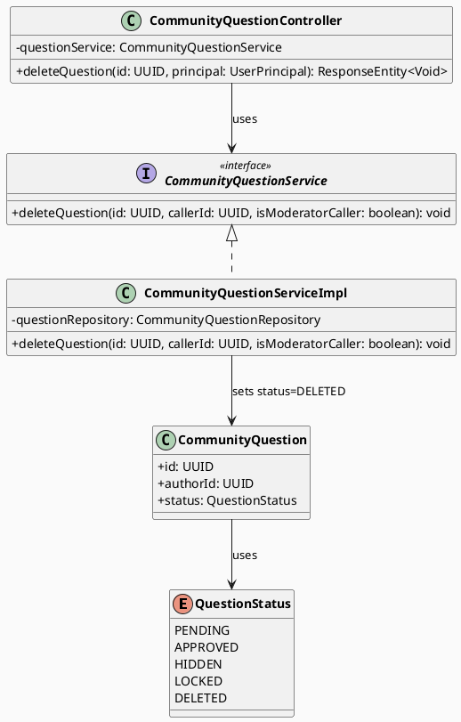
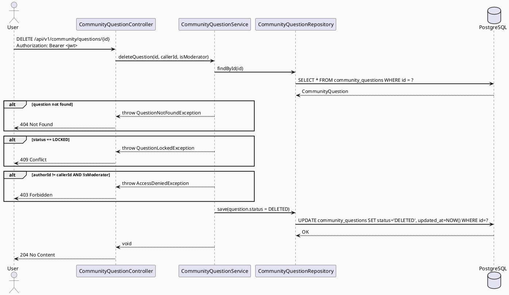

# ENGINEERING DOCUMENTATION STANDARD (EDS) v2.0
# Technical Design Specification — UC-170 Delete Community Post

| Field              | Value                                       |
| ------------------ | ------------------------------------------- |
| **Document ID**    | `CB-COMMUNITY-IMP-006`                      |
| **Version**        | `1.0`                                       |
| **Date**           | `2026-07-01`                                |
| **Status**         | `Draft`                                     |
| **Document Owner** | `HuyND`                                     |
| **Author**         | `AI Agent — Winston (System Architect)`     |
| **Reviewed by**    | `[ ] HuyND — Pending`                       |
| **DPO Sign-off**   | `[ ] Pending`                               |
| **Approved by**    | `[ ] Pending`                               |
| **Last Review**    | `2026-07-01`                                |
| **Based on EDS**   | `v2.0`                                      |

---

## CHANGELOG

| Ngày       | Người thực hiện                     | Nội dung thay đổi                                       |
| ---------- | ----------------------------------- | ------------------------------------------------------- |
| 2026-07-01 | AI Agent — Winston (System Architect) | Tạo tài liệu lần đầu cho UC-170 Delete Community Post |

---

## MỤC LỤC

1. [Tổng quan Module](#1-tổng-quan-module)
2. [Ma trận Truy vết (Traceability Matrix)](#2-ma-trận-truy-vết-traceability-matrix)
3. [Architecture Decision Records (ADR)](#3-architecture-decision-records-adr)
4. [Non-Functional Requirements & SLA](#4-non-functional-requirements--sla)
5. [Static Modeling (Mô hình Tĩnh)](#5-static-modeling-mô-hình-tĩnh)
6. [Dynamic Modeling (Mô hình Động)](#6-dynamic-modeling-mô-hình-động)
7. [Domain Event Catalog](#7-domain-event-catalog)
8. [Interface Specification (Đặc tả Giao diện)](#8-interface-specification-đặc-tả-giao-diện)
9. [API Specification](#9-api-specification)
10. [Bảng mã lỗi (Error Codes)](#10-bảng-mã-lỗi-error-codes)
11. [Quy trình Triển khai (Step-by-Step)](#11-quy-trình-triển-khai-step-by-step)
12. [Rollback & Incident Runbook](#12-rollback--incident-runbook)
13. [Kịch bản Kiểm thử Chi tiết](#13-kịch-bản-kiểm-thử-chi-tiết)
14. [Phương pháp Xác minh](#14-phương-pháp-xác-minh)
15. [Mẫu thử thực tế (API Verification Samples)](#15-mẫu-thử-thực-tế-api-verification-samples)
16. [Bảng tổng hợp phân quyền (Authorization Matrix)](#16-bảng-tổng-hợp-phân-quyền-authorization-matrix)
17. [AI Prompt Constraints (CASE 2.0)](#17-ai-prompt-constraints-case-20)

---

## 1. Tổng quan Module

| Field                     | Value                                                                  |
| ------------------------- | ---------------------------------------------------------------------- |
| **Module Name**           | `DeleteCommunityPost`                                                  |
| **Bounded Context**       | `community`                                                            |
| **UC ID**                 | `UC-170`                                                               |
| **SRS Reference**         | `3.3.8.3`                                                              |
| **Primary Actor**         | `Authenticated User (any role) — owner of post`                       |
| **Platform**              | `Mobile App (Flutter) + Backend (Spring Boot)`                        |
| **Data Classification**   | `Internal`                                                             |
| **Compliance Scope**      | `BR-RBAC`                                                              |
| **Upstream Dependencies** | `security (JWT), community (CommunityQuestion entity)`                |
| **Downstream Consumers**  | `community feed (UC-198), community search (UC-162)`                  |

**Mô tả:** Cho phép người dùng xóa (mềm) bài đăng câu hỏi của chính mình trong cộng đồng, với điều kiện bài đăng không bị khóa (`status != LOCKED`). Xóa mềm bằng cách chuyển `status = DELETED`. Bài đăng bị xóa mềm sẽ không hiển thị trên feed và search nhưng vẫn tồn tại trong DB để audit.

**Current state:** Endpoint `DELETE /api/v1/community/questions/{id}` chưa tồn tại trong `CommunityQuestionController`. Cần thêm endpoint mới.

**Migration dependency:** Cần migration `V20260701000002__add_deleted_status_community.sql` để thêm `DELETED` vào CHECK constraint của `community_questions` (và `community_answers` cho UC-201).

---

## 2. Ma trận Truy vết (Traceability Matrix)

| Requirement ID | Loại          | Mô tả yêu cầu                                                              | Thành phần Code                                             | Compliance Target | ADR liên quan |
| -------------- | ------------- | -------------------------------------------------------------------------- | ----------------------------------------------------------- | ----------------- | ------------- |
| UC-170         | Use Case      | User xóa bài đăng của chính mình                                           | `CommunityQuestionController.deleteQuestion()`             | BR-RBAC           | ADR-COM-170-1 |
| BR-RBAC        | Business Rule | Chỉ author của post mới được xóa; MODERATOR bypass ownership               | `CommunityQuestionService.deleteQuestion()` ownership check | RBAC              | ADR-COM-170-1 |
| BR-COM-170-1   | Business Rule | Không được xóa post có status = LOCKED                                     | `CommunityQuestionService.deleteQuestion()` status guard    | Data integrity    | ADR-COM-170-1 |
| BR-COM-170-2   | Business Rule | Xóa mềm: status chuyển sang DELETED, không xóa vật lý                     | `QuestionStatus.DELETED` enum + service                     | Audit trail       | ADR-COM-170-2 |
| BR-COM-170-3   | Business Rule | DELETED posts không hiển thị trên feed/search                             | Feed & Search services filter `status != DELETED`           | Data integrity    | ADR-COM-170-2 |

---

## 3. Architecture Decision Records (ADR)

### ADR-COM-170-1 — Ownership check: author-only delete with MODERATOR bypass

| Field      | Value        |
| ---------- | ------------ |
| **Status** | `Accepted`   |
| **Date**   | `2026-07-01` |

#### Bối cảnh (Context)
UC-170 yêu cầu chỉ tác giả mới được xóa post của mình. Tuy nhiên, MODERATOR cần khả năng xóa nội dung vi phạm. Security config đã cho phép tất cả `/api/v1/**` yêu cầu authentication.

#### Quyết định (Decision)
Service layer kiểm tra ownership: `question.authorId == jwt.userId` **OR** caller có role `MODERATOR`. Nếu không thỏa mãn → `403 Forbidden`.

#### Hệ quả (Consequences)
**Tích cực:** Single endpoint phục vụ cả user delete và moderator moderation action.
**Trade-offs:** Service cần đọc question từ DB trước khi kiểm tra ownership → thêm 1 DB read.

---

### ADR-COM-170-2 — Soft delete: DELETED status thay vì HIDDEN

| Field      | Value        |
| ---------- | ------------ |
| **Status** | `Accepted`   |
| **Date**   | `2026-07-01` |

#### Bối cảnh (Context)
Status `HIDDEN` đã được dùng bởi moderators để ẩn nội dung vi phạm. Nếu dùng `HIDDEN` cho cả soft-delete của author, không thể phân biệt "user deleted" vs "moderator hidden" — ảnh hưởng đến moderation queue và khả năng audit.

#### Các phương án đã xem xét (Options Considered)

| Phương án | Mô tả | Ưu điểm | Nhược điểm |
|-----------|-------|----------|------------|
| A | Reuse `HIDDEN` | Không cần migration | Không phân biệt được author-delete vs mod-hide |
| B | Thêm `DELETED` status (user decision) | Phân biệt rõ ràng, audit tốt hơn | Cần migration để alter CHECK constraint |
| C | Thêm cột `deleted_at TIMESTAMPTZ` | Flexible, giữ status nguyên | Cần migration + thêm cột |

#### Quyết định (Decision)
**Phương án B — Thêm `DELETED` status** vì đây là lựa chọn của user/stakeholder (confirmed 2026-07-01). Cần migration để DROP và ADD lại CHECK constraint trên cả `community_questions` và `community_answers`.

#### Hệ quả (Consequences)
**Tích cực:** Phân biệt rõ ràng author-delete vs moderator-hide; audit trail chính xác.
**Trade-offs:** Cần migration `V20260701000002__add_deleted_status_community.sql`.
**Schema sync:** V1__init_schema.sql không được sửa — migration mới là authoritative.

---

## 4. Non-Functional Requirements & SLA

### 4.1. Performance & Availability

| Category  | Requirement              | Target SLA  |
| --------- | ------------------------ | ----------- |
| Latency   | DELETE API (p99)         | `< 200ms`   |
| Integrity | Soft-delete atomic       | 100%        |

### 4.2. Security

| Category      | Requirement                        | Verification                 |
| ------------- | ---------------------------------- | ---------------------------- |
| Authorization | Owner-only or MODERATOR            | Service-level ownership test |
| Status guard  | Reject delete when status = LOCKED | Unit test — locked post case |

---

## 5. Static Modeling (Mô hình Tĩnh)

### 5.1. Planned File Paths

| File | Change Type | Notes |
|------|-------------|-------|
| `community/entity/QuestionStatus.java` | Modify | Add `DELETED` value |
| `community/controller/CommunityQuestionController.java` | Modify | Add `DELETE /{id}` endpoint |
| `community/service/CommunityQuestionService.java` | Modify | Add `deleteQuestion(id, callerId, isModeratorCaller)` |
| `community/service/CommunityQuestionServiceImpl.java` | Modify | Implement deleteQuestion |
| `community/repository/CommunityQuestionRepository.java` | Modify | Optional: add `existsByIdAndAuthorId` |
| `db/migration/V20260701000002__add_deleted_status_community.sql` | Create | Alter CHECK constraints for both tables |

### 5.2. Class Diagram (PlantUML)



### 5.3. Schema / Migration Delta

**Migration required:** `V20260701000002__add_deleted_status_community.sql`

```sql
-- UC-170 + UC-201: Add DELETED soft-delete status to community tables
-- Alters existing CHECK constraints on community_questions and community_answers

ALTER TABLE community_questions
  DROP CONSTRAINT community_questions_status_check;

ALTER TABLE community_questions
  ADD CONSTRAINT community_questions_status_check
  CHECK (status IN ('PENDING', 'APPROVED', 'HIDDEN', 'LOCKED', 'DELETED'));

ALTER TABLE community_answers
  DROP CONSTRAINT community_answers_status_check;

ALTER TABLE community_answers
  ADD CONSTRAINT community_answers_status_check
  CHECK (status IN ('PENDING', 'APPROVED', 'HIDDEN', 'DELETED'));
```

**Java enum updates (not via migration):**
- `QuestionStatus.java`: add `DELETED`
- `AnswerStatus.java`: add `DELETED` (shared with UC-201)

---

## 6. Dynamic Modeling (Mô hình Động)

### 6.1. Sequence Diagram — Delete Question (Happy Path)



### 6.2. State Machine — QuestionStatus Transitions

```
PENDING ──→ APPROVED ──→ LOCKED  (moderator actions)
PENDING ──→ HIDDEN              (moderator action)
APPROVED ──→ HIDDEN             (moderator action)
PENDING ──→ DELETED             (author UC-170 / moderator)
APPROVED ──→ DELETED            (author UC-170 / moderator)
HIDDEN ──→ DELETED              (moderator only — author cannot delete HIDDEN)
LOCKED ──X→ DELETED             (BLOCKED — cannot delete locked post)
```

---

## 7. Domain Event Catalog

| Event | Publisher | Consumer | Payload | Trigger |
|-------|-----------|----------|---------|---------|
| `QuestionDeleted` | `CommunityQuestionServiceImpl` | (future: feed cache invalidation) | `{questionId, authorId, deletedAt}` | Post soft-deleted |

> **MVP note:** Event publishing is out of scope for this sprint. Feed/search filters will query DB directly by `status != DELETED`.

---

## 8. Interface Specification (Đặc tả Giao diện)

```java
// CommunityQuestionService interface addition
package com.carebridge.backend.community.service;

import java.util.UUID;

public interface CommunityQuestionService {
    // ... existing methods ...

    /**
     * Soft-deletes a community question by setting status = DELETED.
     * @throws QuestionNotFoundException if question does not exist
     * @throws QuestionLockedException if question.status == LOCKED
     * @throws AccessDeniedException if caller is not owner and not MODERATOR
     */
    void deleteQuestion(UUID questionId, UUID callerId, boolean isModeratorCaller);
}
```

---

## 9. API Specification

### DELETE /api/v1/community/questions/{id}

| Field           | Value                                              |
| --------------- | -------------------------------------------------- |
| **Method**      | `DELETE`                                           |
| **Path**        | `/api/v1/community/questions/{id}`                 |
| **Auth**        | `Bearer JWT` (required)                            |
| **Roles**       | Any authenticated user (ownership enforced in svc) |
| **Idempotency** | Yes — deleting already-DELETED question returns 204 |

**Path Parameters:**

| Parameter | Type   | Required | Description          |
| --------- | ------ | -------- | -------------------- |
| `id`      | `UUID` | Yes      | ID of the question   |

**Request Body:** None

**Success Response:** `204 No Content`

**Error Responses:**

| HTTP Status | Error Code                | Condition                           |
| ----------- | ------------------------- | ----------------------------------- |
| `401`       | `AUTH_REQUIRED`           | No JWT token                        |
| `403`       | `FORBIDDEN`               | Caller is not owner and not MODERATOR |
| `404`       | `QUESTION_NOT_FOUND`      | Question ID does not exist          |
| `409`       | `QUESTION_LOCKED`         | Question status == LOCKED           |

---

## 10. Bảng mã lỗi (Error Codes)

| Error Code            | HTTP Status | Message (EN)                          | Condition              |
| --------------------- | ----------- | ------------------------------------- | ---------------------- |
| `QUESTION_NOT_FOUND`  | `404`       | Community question not found          | No row with given UUID |
| `QUESTION_LOCKED`     | `409`       | Cannot delete a locked question       | status = LOCKED        |
| `FORBIDDEN`           | `403`       | You do not own this question          | Not owner / not mod    |

---

## 11. Quy trình Triển khai (Step-by-Step)

1. **Migration:** Create and apply `V20260701000002__add_deleted_status_community.sql`
2. **Enum:** Add `DELETED` to `QuestionStatus.java` (and `AnswerStatus.java` for UC-201)
3. **Service interface:** Add `deleteQuestion()` to `CommunityQuestionService`
4. **Service impl:** Implement in `CommunityQuestionServiceImpl` with ownership + status guard
5. **Controller:** Add `@DeleteMapping("/{id}")` to `CommunityQuestionController`
6. **Security config:** Verify `DELETE /api/v1/community/questions/**` is covered by existing authenticated rule
7. **Feed/Search filters:** Verify existing queries already filter `status != DELETED` (or add filter if not)
8. **Tests:** Write unit + integration tests as per Test-Spec
9. **Mobile:** Add `deleteQuestion(id)` to `community_service.dart`

---

## 12. Rollback & Incident Runbook

### Rollback Procedure

```sql
-- Revert: remove DELETED from CHECK constraints
ALTER TABLE community_questions DROP CONSTRAINT community_questions_status_check;
ALTER TABLE community_questions ADD CONSTRAINT community_questions_status_check
  CHECK (status IN ('PENDING', 'APPROVED', 'HIDDEN', 'LOCKED'));

ALTER TABLE community_answers DROP CONSTRAINT community_answers_status_check;
ALTER TABLE community_answers ADD CONSTRAINT community_answers_status_check
  CHECK (status IN ('PENDING', 'APPROVED', 'HIDDEN'));
```

> **Note:** Any rows with `status = 'DELETED'` must be updated before re-adding the old constraint.

### Incident Triggers
- Deleted posts still visible on feed → verify `status != 'DELETED'` filter in feed/search query
- 500 on delete → verify migration was applied and enum was updated

---

## 13. Kịch bản Kiểm thử Chi tiết

> Detailed test cases are in `UC170_DeleteCommunityPost_Test-Spec.md`.

| TC ID    | Scenario                                    | Expected Result |
| -------- | ------------------------------------------- | --------------- |
| TC-170-1 | Author deletes own APPROVED question        | 204, status=DELETED |
| TC-170-2 | Author deletes own PENDING question         | 204, status=DELETED |
| TC-170-3 | Attempt delete LOCKED question              | 409 Conflict    |
| TC-170-4 | Non-owner attempts delete                   | 403 Forbidden   |
| TC-170-5 | MODERATOR deletes other user's question     | 204, status=DELETED |
| TC-170-6 | Delete non-existent question ID             | 404 Not Found   |
| TC-170-7 | Unauthenticated request                     | 401 Unauthorized |
| TC-170-8 | Already-DELETED question (idempotency)      | 204 No Content  |

---

## 14. Phương pháp Xác minh

| Verification Method   | Tool                     | Target                          |
| --------------------- | ------------------------ | ------------------------------- |
| Unit test (service)   | JUnit 5 + Mockito        | Ownership check, status guard   |
| Controller test       | @WebMvcTest + MockMvc    | HTTP 204/403/404/409 responses  |
| Integration test      | Testcontainers + @SpringBootTest | Migration applied, DB state |
| Mobile widget test    | flutter_test             | Delete confirmation dialog      |

---

## 15. Mẫu thử thực tế (API Verification Samples)

```bash
# Happy path — delete own question
curl -X DELETE http://localhost:8080/api/v1/community/questions/{id} \
  -H "Authorization: Bearer $MOTHER_TOKEN"
# Expected: 204 No Content

# Attempt delete locked question
curl -X DELETE http://localhost:8080/api/v1/community/questions/{locked_id} \
  -H "Authorization: Bearer $MOTHER_TOKEN"
# Expected: 409 Conflict {"code":"QUESTION_LOCKED","message":"Cannot delete a locked question"}
```

---

## 16. Bảng tổng hợp phân quyền (Authorization Matrix)

| Role             | DELETE own question | DELETE other's question | Notes                          |
| ---------------- | ------------------- | ----------------------- | ------------------------------ |
| `MOTHER`         | ✅ Yes              | ❌ No → 403             | Ownership enforced in service  |
| `EXPERT`         | ✅ Yes              | ❌ No → 403             |                                |
| `PARTNER`        | ✅ Yes              | ❌ No → 403             |                                |
| `FAMILY`         | ✅ Yes              | ❌ No → 403             |                                |
| `MODERATOR`      | ✅ Yes              | ✅ Yes (bypass)         | Moderation authority           |
| `SYSTEM_ADMIN`   | ✅ Yes              | ✅ Yes (bypass)         |                                |
| `CONTENT_ADMIN`  | ✅ Yes              | ❌ No → 403             |                                |
| Unauthenticated  | ❌ No → 401         | ❌ No → 401             |                                |

---

## 17. AI Prompt Constraints (CASE 2.0)

### Constraint Summary Table

| ID   | Constraint                                          | Source                  |
| ---- | --------------------------------------------------- | ----------------------- |
| C1   | Never auto-approve this TDS                         | EDS v2.0 §1             |
| C2   | Soft-delete only — no physical DELETE from DB       | BR-COM-170-2, ADR-COM-170-2 |
| C3   | Ownership check must happen before status update    | BR-RBAC                 |
| C4   | Status guard (no delete when LOCKED) before ownership | BR-COM-170-1          |
| C5   | Java enum and DB CHECK constraint must stay in sync | ADR-COM-170-2           |

### Anti-Pattern Detection

| AP-ID | Anti-Pattern                        | Signal                            | Check | Gate  |
| ----- | ----------------------------------- | --------------------------------- | ----- | ----- |
| AP-1  | Hard delete (physical DELETE SQL)   | `repository.delete()` call        | [ ]   | CG-2  |
| AP-2  | No ownership check                  | Service skips `authorId` compare  | [ ]   | CG-2  |
| AP-3  | LOCKED status not guarded           | Missing status guard in service   | [ ]   | CG-1  |
| AP-4  | Migration skipped                   | No new migration file             | [ ]   | CG-4  |
