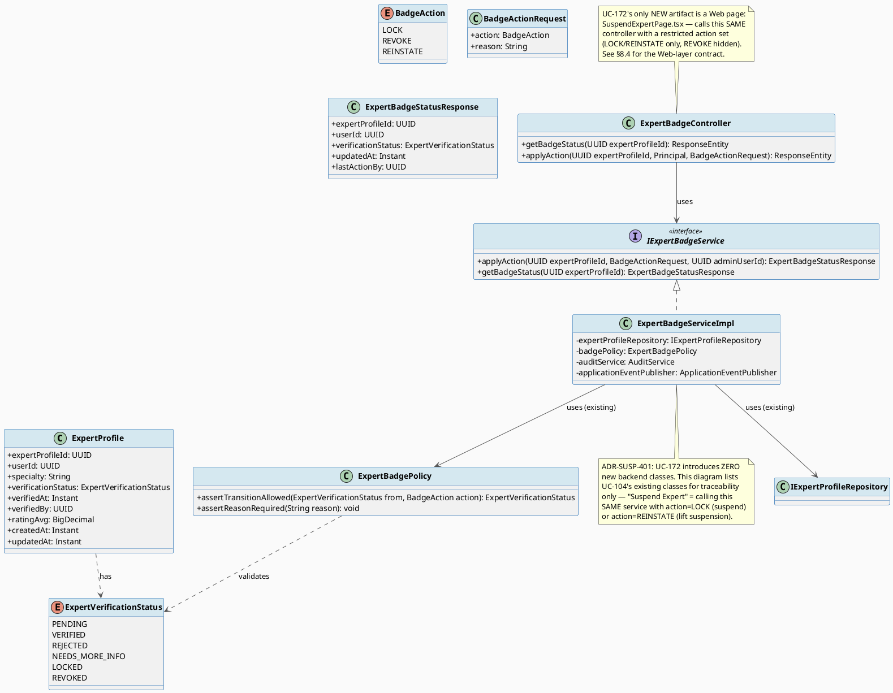
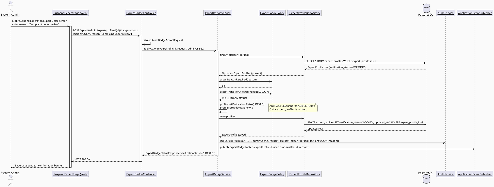
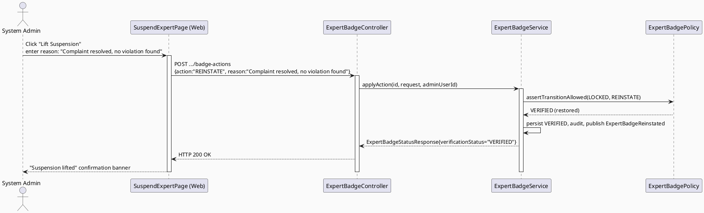
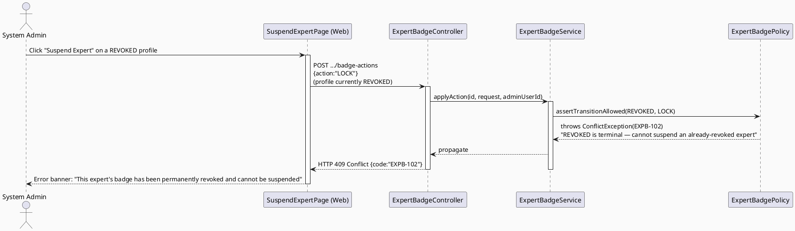
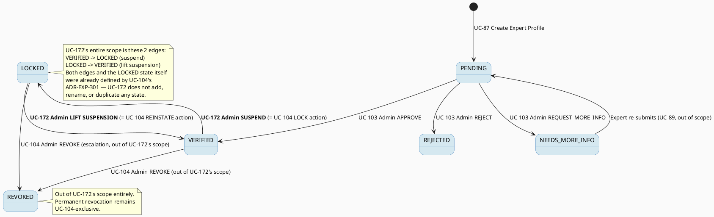

# ENGINEERING DOCUMENTATION STANDARD (EDS) v2.0
# UC-172 Suspend Expert — Technical Design Specification

| Field | Value |
|-------|-------|
| **Document ID** | `CB-EXPGOV-IMP-172` |
| **Version** | `1.0` |
| **Date** | `2026-07-03` |
| **Status** | `Draft` |
| **Document Owner** | `TV4-Lâm` |
| **Author** | `AI Agent (Technical Architect)` |
| **Reviewed by** | `[ ] Pending` |
| **DPO Sign-off** | `[ ] Pending` *(module writes a sanction against an identifiable expert user; also affects consultation-adjacent visibility)* |
| **Approved by** | `[ ] Pending` |
| **Last Review** | `2026-07-03` |
| **Based on EDS** | `v2.0` |

---

## CHANGELOG

| Ngày | Người thực hiện | Nội dung thay đổi |
|------|-----------------|-------------------|
| 2026-07-03 | AI Agent | Khởi tạo TDS cho UC-172, reconciled với UC-104's `ExpertVerificationStatus` state machine (không tạo state mới — reuse `LOCKED`) |

---

## MỤC LỤC

1. [Tổng quan Module](#1-tổng-quan-module)
2. [Ma trận Truy vết (Traceability Matrix)](#2-ma-trận-truy-vết-traceability-matrix)
3. [Architecture Decision Records (ADR)](#3-architecture-decision-records-adr)
4. [Non-Functional Requirements & SLA](#4-non-functional-requirements--sla)
5. [Static Modeling](#5-static-modeling-mô-hình-tĩnh)
6. [Dynamic Modeling](#6-dynamic-modeling-mô-hình-động)
7. [Domain Event Catalog](#7-domain-event-catalog)
8. [Interface Specification](#8-interface-specification-đặc-tả-giao-diện)
9. [API Specification](#9-api-specification)
10. [Bảng mã lỗi (Error Codes)](#10-bảng-mã-lỗi-error-codes)
11. [Quy trình Triển khai (Step-by-Step)](#11-quy-trình-triển-khai-step-by-step)
12. [Rollback & Incident Runbook](#12-rollback--incident-runbook)
13. [Kịch bản Kiểm thử Chi tiết](#13-kịch-bản-kiểm-thử-chi-tiết)
14. [Phương pháp Xác minh](#14-phương-pháp-xác-minh)
15. [Mẫu thử thực tế (API Verification Samples)](#15-mẫu-thử-thực-tế-api-verification-samples)
16. [Bảng tổng hợp phân quyền (Authorization Matrix)](#16-bảng-tổng-hợp-phân-quyền-authorization-matrix)
17. [AI Prompt Constraints (CASE 2.0)](#17-ai-prompt-constraints-case-20)
18. [Open Items / Research Gate](#18-open-items--research-gate)

---

## 1. Tổng quan Module

| Field | Value |
|-------|-------|
| **Module Name** | `SuspendExpert` |
| **Bounded Context** | `expert` (backend package `com.carebridge.backend.expert`, admin-facing sub-slice; shares `expert_profiles` table + `ExpertVerificationStatus` enum with UC-103/UC-104) |
| **Function ID / UC** | `3.2.4.1 Suspend Expert` / `UC-172` |
| **Primary Actor** | System Admin |
| **Secondary Actors** | None (SRS §3.2.4.1, line 1584) |
| **Platform** | Web — Admin Portal (React + TypeScript + Vite) |
| **Priority** | High (SRS Table 94) |
| **Frequency of Use** | Occasional (SRS Table 94) |
| **Sprint / Owner** | Sprint 3 "Consultation Lifecycle, Expert Governance, And Location Visibility" — TV4-Lâm (per `function-spec-task-allocation.md`, line 574) |
| **Data Classification** | `PII` (sanction record against an identifiable expert user) |
| **Compliance Scope** | `PDPA` |
| **Upstream Dependencies** | UC-103 Verify Expert Profile (profile must reach `VERIFIED` before it is eligible for suspension); UC-104 Revoke Expert Badge (this UC **reuses** the `ExpertVerificationStatus` enum and the `LOCKED`/`REINSTATE` edges UC-104 already defined — see ADR-SUSP-401); `auth` (JWT → admin `userId`); `audit` (`AuditService`) |
| **Downstream Consumers** | UC-80/UC-81 View Expert Directory/Profile (must stop surfacing a suspended expert as bookable — out of scope to modify here, informational only), UC-75 Book Private Consultation (must reject new bookings against a non-`VERIFIED` expert — out of scope, informational only), UC-112 View Expert Dashboard (aggregates suspended/locked counts), UC-173 Renew Expert Verification (a suspended expert who resolves the underlying issue via document renewal is one path back to `VERIFIED`, though UC-173's action itself does not directly write `verification_status` — see UC-173 TDS) |

**Mô tả (SRS):** "Temporarily suspends expert privileges, consultation access, or public visibility after violations, serious complaints, or invalid documents." (SRS §3.2.4.1, line 1586)

---

### 1.1 — Relationship to UC-104 Revoke Expert Badge (mandatory reconciliation)

> **This section exists because the task instruction explicitly requires reconciling UC-172 with UC-104's already-modeled state machine before any new design decision is made. See ADR-SUSP-401 for the full analysis.**

UC-104's TDS (`CB-EXPGOV-IMP-104`) already defines a `LOCKED` state on `ExpertVerificationStatus`, described in its own ADR-EXP-301 as: *"temporarily locks... e.g., document expiry pending renewal"*, reversible via a `REINSTATE` action back to `VERIFIED`. UC-172's SRS wording — *"Temporarily suspends... after violations, serious complaints, or invalid documents"* — describes the **same outcome** (a reversible, temporary loss of expert privileges) using the word "suspend" instead of "lock." Both UCs are owned by the same sprint/owner (TV4-Lâm, Sprint 3) and sit in the same bounded context.

**Conclusion (ADR-SUSP-401): UC-172 does NOT introduce a new state.** "Suspend" in UC-172's SRS wording maps 1:1 onto UC-104's existing `LOCKED` state and its `LOCK`/`REINSTATE` transition edges (`VERIFIED → LOCKED`, `LOCKED → VERIFIED`). UC-172 is the **System-Admin-facing suspend/reinstate workflow surface**; UC-104 is the broader badge-sanction surface that also covers the separate, permanent `REVOKE` action. UC-172 implements **only the LOCK and REINSTATE actions** of `ExpertBadgePolicy` — it explicitly does **not** implement `REVOKE` (that action remains exclusively UC-104's, described there as "confirmed rule violation," a stronger, permanent sanction than SRS UC-172's "temporarily suspends" wording supports).

Concretely: UC-172 reuses UC-104's `ExpertBadgeServiceImpl.applyAction()`, `ExpertBadgePolicy`, `BadgeActionRequest`/`BadgeAction` DTOs, `ExpertVerificationStatus` enum, error codes (`EXPB-1xx`), and domain events (`ExpertBadgeLocked`, `ExpertBadgeReinstated`) as-is — **no new Java class, enum value, or endpoint path is introduced by this UC's own initiative.** The only new artifact this UC's Draft state proposes is a **dedicated admin UI surface** (`SuspendExpertPage.tsx`) that calls the SAME `POST .../badge-actions` endpoint with `action: "LOCK"` (to suspend) or `action: "REINSTATE"` (to lift a suspension), presented with SRS-UC-172-specific copy ("Suspend"/"Reinstate") instead of UC-104's generic "Lock"/"Reinstate" admin panel. See §18 OI-1 for the Open Item on whether Product wants ONE unified admin panel (UC-104's) or two separate UI entry points (UC-104 generic + UC-172 suspend-specific) that both call the identical backend contract.

---

## 2. Ma trận Truy vết (Traceability Matrix)

| Requirement ID | Loại (BR/ADR/US) | Mô tả yêu cầu | Thành phần Code | Compliance Target | ADR liên quan |
|----------------|------------------|---------------|-----------------|-------------------|---------------|
| UC-172 (SRS §3.2.4.1, dòng 1579-1598) | User Story | System Admin temporarily suspends expert privileges/access/visibility after violations, complaints, or invalid documents | `ExpertBadgeController.POST /api/v1/admin/expert-profiles/{id}/badge-actions` (REUSED from UC-104, see ADR-SUSP-401) | — | ADR-SUSP-401 |
| BR-RBAC | Business Rule | Users may access only functions allowed by their role and permission scope | `@PreAuthorize("hasRole('SYSTEM_ADMIN')")` on reused endpoint | — | ADR-SUSP-403 |
| BR-SAFETY | Business Rule | Medical guidance must be non-diagnostic, escalation-aware, and red-flag safe | N/A — this UC does not generate medical guidance; inherited from SRS common Business Rules field, no code component | — | — |
| BR-CONSULTATION | Business Rule | Booking, payment, dispute, refund, and pricing actions must keep an auditable lifecycle state | `ExpertBadgeServiceImpl.applyAction()` — prospective-only write (inherited ADR-EXP-304 from UC-104) | BR-CONSULTATION | ADR-SUSP-402 |
| PRE-3 (SRS common preconditions) | Precondition | Actor authenticated with required role | Spring Security filter chain + `SecurityUtils.requireCurrentUserId()` | — | ADR-SUSP-403 |
| PRE-4 (SRS common preconditions) | Precondition | Required reference data exists when the UC processes an existing record | `findById()` 404 guard; `VERIFIED`-only precondition guard (via `ExpertBadgePolicy`) | — | ADR-SUSP-401 |
| POST-2 (SRS common postconditions) | Postcondition | Related records/statuses/notifications updated when applicable | `ExpertProfile.verificationStatus` update to `LOCKED` (suspend) / `VERIFIED` (reinstate); `notification` module notifies expert | — | ADR-SUSP-401 |
| POST-3 (SRS common postconditions) | Postcondition | Sensitive actions recorded for audit, safety, or privacy review | `AuditService.log(EXPERT_VERIFICATION, ...)`; `ExpertBadgeLocked`/`ExpertBadgeReinstated` domain events (REUSED from UC-104) | PDPA | ADR-SUSP-402 |
| E1 (SRS Exceptions) | Exception | Access denied when unauthenticated/unauthorized/out-of-scope | 401/403 responses, `EXPB-1xx` codes (REUSED) | — | ADR-SUSP-403 |
| E2 (SRS Exceptions) | Exception | Invalid/missing/conflicting data rejected with field-level message | Bean Validation + state-machine guard (REUSED `ExpertBadgePolicy`) | — | ADR-SUSP-401 |
| ADR-SUSP-401 | Decision | UC-172 "suspend" = UC-104's `LOCKED` state; UC-172 implements ONLY the `LOCK`/`REINSTATE` actions of the already-defined `ExpertBadgePolicy`; `REVOKE` remains UC-104-exclusive | `ExpertVerificationStatus` (unchanged, shared), `ExpertBadgePolicy` (unchanged, reused) | — | — |
| ADR-SUSP-402 | Decision | Suspension is prospective only — does NOT retroactively alter past completed `consultation_bookings`/`expert_reviews` (inherits UC-104's ADR-EXP-304 verbatim) | `ExpertBadgeServiceImpl.applyAction()` (REUSED, unchanged) | BR-CONSULTATION | — |
| ADR-SUSP-403 | Decision | SYSTEM_ADMIN-only; no MODERATOR access (SRS Primary Actor field states "System Admin" only, identical boundary to UC-104) | `@PreAuthorize` (REUSED), §16 Authorization Matrix | — | — |
| ADR-SUSP-404 | Decision | UC-172 adds a dedicated Admin Portal UI surface (`SuspendExpertPage.tsx`) calling the existing UC-104 endpoint with SRS-172-specific copy; no new backend contract | `SuspendExpertPage.tsx`, `services/expertBadgeApi.ts` (REUSED from UC-104's `adminExpertGovernance` feature slice) | — | — |

---

## 3. Architecture Decision Records (ADR)

### ADR-SUSP-401 — "Suspend" (UC-172) is UC-104's `LOCKED` state; no new state, no new enum value

| Field | Value |
|-------|-------|
| **Status** | `Accepted` |
| **Deciders** | `AI Agent (Technical Architect role)` |
| **Date** | `2026-07-03` |
| **Supersedes** | None — extends UC-104's ADR-EXP-301 by reference, does not replace it |

#### Bối cảnh (Context)
The task instruction requires explicit reconciliation between UC-172 (Suspend Expert) and UC-104 (Revoke Expert Badge), whose TDS was drafted in the same prior batch and already models a `LOCKED`/`REVOKED`/`REINSTATE` state machine on the shared `ExpertVerificationStatus` enum. SRS wording comparison:

- UC-104 (§3.2.2.6): *"Temporarily locks or revokes an expert badge when rules are violated or documents expire."*
- UC-172 (§3.2.4.1): *"Temporarily suspends expert privileges, consultation access, or public visibility after violations, serious complaints, or invalid documents."*

Both describe a **temporary, reversible** sanction triggered by **violations or invalid/expired documents**. There is no textual signal in either SRS entry that these are two independently tracked mechanisms (e.g., no separate "suspension" column, no separate "suspension reason" field named anywhere in the SRS, no cross-reference implying UC-172 is scoped to consultation-visibility only while UC-104 is scoped to badge-only). Both UCs share the same primary actor (System Admin), same platform (Admin Portal), same bounded context (`expert`), and same sprint owner (TV4-Lâm).

#### Các phương án đã xem xét (Options Considered)

| Phương án | Mô tả | Ưu điểm | Nhược điểm |
|-----------|-------|----------|------------|
| A | Treat UC-172 as fully independent: new `SUSPENDED` enum value, new state machine, new service class, new endpoint | Gives UC-172 a "clean" dedicated surface | **Silently duplicates UC-104's already-Accepted `LOCKED` semantics** — the task instruction explicitly forbids this; would create two enum values (`LOCKED` vs `SUSPENDED`) meaning the exact same thing on the exact same column, violating single-source-of-truth and risking query/reporting drift (e.g., UC-112 Dashboard would need to count both) |
| B | UC-172 = UC-104's `LOCKED` state, reusing `ExpertBadgePolicy`/`ExpertBadgeServiceImpl`/`ExpertVerificationStatus` as-is; UC-172 exposes ONLY `LOCK`+`REINSTATE`, never `REVOKE` | No duplication; single enum/state machine remains the one source of truth (as already Accepted in UC-104 ADR-EXP-301); UC-172's SRS scope (temporary suspend, not permanent revoke) maps cleanly onto the subset of UC-104's transitions that are reversible | UC-172 has no "SRS-native" Java class of its own on the backend — its TDS is largely a **UI-surface + policy-scope specification** on top of UC-104's already-Accepted backend; must be explicit about this to avoid reviewer confusion that "nothing was built" |
| C | UC-172 = a *new*, third state (`SUSPENDED`) distinct from `LOCKED`, positioned as "more severe than LOCKED, less severe than REVOKED" | Could capture a nuance if Product intends 3 distinct severities | No SRS evidence for a 3-tier severity model; SRS UC-172 wording ("temporarily... after violations... invalid documents") is textually near-identical to UC-104's `LOCKED` wording — inventing a 3rd tier the SRS never names would be unsupported requirement invention, violating the "never invent requirements" rule |

#### Quyết định (Decision)
Chọn **Phương án B**. UC-172 "Suspend Expert" is implemented as a **restricted-scope UI/API surface over UC-104's already-Accepted state machine**:
- Backend: **zero new classes**. UC-172 reuses `ExpertVerificationStatus` (unchanged 6-value enum), `ExpertBadgePolicy.assertTransitionAllowed()` (unchanged 4-edge transition table), `ExpertBadgeServiceImpl.applyAction()` (unchanged), `BadgeActionRequest`/`BadgeAction`/`ExpertBadgeStatusResponse` DTOs (unchanged), `ExpertBadgeController` (unchanged, same 2 endpoints), error codes `EXPB-101`–`EXPB-105` (unchanged), domain events `ExpertBadgeLocked`/`ExpertBadgeReinstated` (unchanged; `ExpertBadgeRevoked` exists but is out of UC-172's scope).
- UC-172's OWN scope is the **action subset** the "Suspend Expert" SRS description supports: `LOCK` (= suspend) and `REINSTATE` (= lift suspension) only. `REVOKE` (permanent) is explicitly **out of scope** for UC-172 — it remains UC-104-exclusive, matching UC-104's stronger wording ("confirmed rule violation... permanent").
- New artifact: a dedicated Admin Portal page `SuspendExpertPage.tsx` presenting SRS-172 terminology ("Suspend"/"Lift Suspension") but calling the identical `POST /api/v1/admin/expert-profiles/{id}/badge-actions` contract with `action: "LOCK"` / `action: "REINSTATE"`.

**Explicit non-goal:** This ADR does NOT redefine, rename, or add to `ExpertVerificationStatus`. Any implementer who creates a `SUSPENDED` enum value or a parallel `SuspendedExpert`/`ExpertSuspensionServiceImpl` class is violating this ADR (see §17.4 AP-AI-008).

#### Hệ quả (Consequences)

**Tích cực:** No duplicate state machine; UC-112 Dashboard, UC-80/81 Directory, and any future reporting query `verification_status IN ('LOCKED','REVOKED')` exactly once, with no risk of missing a parallel `SUSPENDED` value; UC-172 ships with ZERO new backend risk surface (100% of backend logic already reviewed under UC-104's ADRs).

**Tiêu cực / Trade-offs:** UC-172's TDS is unusually "thin" on backend novelty compared to a typical EDS module — this is intentional and must be called out explicitly to reviewers so it is not mistaken for incomplete analysis. If Product later decides UC-172 genuinely needs a *distinct* audit trail from UC-104 (e.g., separate reporting for "consultation-visibility suspensions" vs "badge locks"), that would require a NEW ADR superseding this one, and is flagged as Open Item OI-2.

**Compliance Impact:** PDPA — no new PII field introduced; audit trail continues to flow through the single existing `AuditAction.EXPERT_VERIFICATION` log stream, avoiding audit-trail fragmentation across two nominally-different-but-semantically-identical sanction types.

---

### ADR-SUSP-402 — Suspension is prospective only (inherits UC-104's ADR-EXP-304)

| Field | Value |
|-------|-------|
| **Status** | `Accepted` |
| **Date** | `2026-07-03` |

#### Bối cảnh (Context)
Same research question as UC-104's ADR-EXP-304 (RG-4 equivalent for this UC): does suspending an expert retroactively affect past completed `consultation_bookings`/`expert_reviews`? Since UC-172 is a restricted-scope surface over UC-104's `applyAction()` (ADR-SUSP-401), this question was already answered once at the shared-implementation level.

#### Quyết định (Decision)
**Prospective-only**, inherited verbatim from UC-104's ADR-EXP-304: `ExpertBadgeServiceImpl.applyAction()` (the SAME method UC-172 calls) writes ONLY `expert_profiles`. It never writes to `consultation_bookings`, `consultation_sessions`, `expert_reviews`, `payment_transactions`, `commission_records`. This is not re-decided by UC-172 — it is a structural consequence of ADR-SUSP-401's reuse decision.

#### Hệ quả (Consequences)

**Tích cực:** Zero additional risk analysis needed — the guarantee already holds because the code path is identical.

**Tiêu cực / Trade-offs:** Same as UC-104's OI-3 (users browsing old consultation history still see the since-suspended expert's original name/rating unchanged) — carried forward as this UC's Open Item OI-3, not re-litigated.

**Compliance Impact:** PDPA — no unexpected retroactive mutation; BR-CONSULTATION — auditable lifecycle of past bookings preserved unchanged.

---

### ADR-SUSP-403 — SYSTEM_ADMIN-only authorization, no MODERATOR access

| Field | Value |
|-------|-------|
| **Status** | `Accepted` |
| **Date** | `2026-07-03` |

#### Bối cảnh (Context)
SRS Table 94 "Primary Actor" field states exactly "System Admin" with "Secondary Actors: None" (SRS §3.2.4.1, line 1584). Identical boundary reasoning to UC-103's ADR-EXP-203 and UC-104's ADR-EXP-303.

#### Quyết định (Decision)
No new `@PreAuthorize` annotation is introduced — UC-172 calls the SAME `ExpertBadgeController` endpoints, which already carry `@PreAuthorize("hasRole('SYSTEM_ADMIN')")` from UC-104. This ADR exists to make explicit, for UC-172's own traceability matrix, that the authorization boundary is unchanged and intentional (not simply "inherited by accident").

#### Hệ quả (Consequences)
**Tích cực:** Matches SRS exactly; zero new authorization surface to review.
**Tiêu cực / Trade-offs:** None beyond UC-103/UC-104's already-documented trade-off (their OI-4/OI-4 respectively).

---

### ADR-SUSP-404 — Dedicated Admin Portal "Suspend Expert" UI surface, same backend contract

| Field | Value |
|-------|-------|
| **Status** | `Accepted` |
| **Date** | `2026-07-03` |

#### Bối cảnh (Context)
Even though the backend is 100% reused (ADR-SUSP-401), the SRS explicitly names UC-172 as a distinct use case with its own trigger ("The System Admin selects or initiates Suspend Expert from the relevant CareBridge screen or workflow") — implying a discoverable, SRS-named UI entry point exists, not merely that UC-104's existing badge-action panel is silently reused with no UC-172-specific presentation.

#### Quyết định (Decision)
Add a new Admin Portal page/route `SuspendExpertPage.tsx` (or a "Suspend" quick-action button on the Expert Directory / Expert Detail screen that opens the SAME `BadgeActionRequest` form pre-scoped to `LOCK`/`REINSTATE` only, hiding the `REVOKE` option that UC-104's generic panel exposes). This is a thin presentation-layer addition; it calls `expertBadgeApi.ts` (already defined by UC-104, in `05_Development/CareBridgeWebApp/src/features/adminExpertGovernance/`) without modification.

#### Hệ quả (Consequences)
**Tích cực:** SRS's explicit UC-172 trigger/entry-point requirement is satisfied; the specific UI restricts the admin to only the "suspend" semantics (no accidental permanent REVOKE from a "suspend" workflow) — arguably a UX safety improvement over exposing all 3 actions in one generic panel.
**Tiêu cực / Trade-offs:** Two Admin Portal UI entry points now exist for overlapping backend actions (UC-104's generic badge panel and UC-172's suspend-specific panel) — flagged as Open Item OI-1 for Product/UX to confirm whether both should coexist or whether UC-104's panel should simply be relabeled/merged into this one screen in a future consolidation pass.

---

## 4. Non-Functional Requirements & SLA

### 4.1. Performance & Availability

| Category | Requirement | Target SLA | Measurement Method | Compliance Basis |
|----------|-------------|------------|---------------------|------------------|
| Latency | `POST .../badge-actions` (p99, reused from UC-104) | `< 300ms` | Manual timing / future k6 | — |
| Availability | Uptime (monthly) | `99.9%` | Uptime monitor | — |

### 4.2. Data Integrity & Retention

| Category | Requirement | Target | Verification Method | Compliance Basis |
|----------|-------------|--------|---------------------|------------------|
| Durability | Zero record loss on suspend/reinstate action | RPO = 0 | Transaction-scoped JPA save (inherited from UC-104) | PDPA data integrity |
| Consistency | `verification_status` transitions only via allowed edges, restricted to `LOCK`/`REINSTATE` subset for this UI surface | 100% | Unit test on policy scope; UI restricts to 2 of 3 `BadgeAction` values | ADR-SUSP-401 |
| Non-retroactivity | `consultation_bookings`/`expert_reviews`/`payment_transactions` rows NEVER written by a suspend/reinstate action | 100% | Integration test asserting zero writes (inherited UC-104 guarantee) | ADR-SUSP-402 |
| Auditability | Every suspend/reinstate action has a matching `AuditService` log entry | 100% | Integration test asserting audit row exists | ADR-SUSP-402 |

### 4.3. Security

| Category | Requirement | Target | Verification Method | Compliance Basis |
|----------|-------------|--------|---------------------|------------------|
| Access control | Role-based | `SYSTEM_ADMIN` only | `@PreAuthorize` (reused) + E2E role matrix tests | BR-RBAC, ADR-SUSP-403 |
| Input validation | Reject invalid transitions/missing reason; reject `REVOKE` from this UI surface's intended flow | 100% | Bean Validation + policy tests + frontend action-set restriction | ADR-SUSP-401 |
| Idempotency | Re-suspending an already-`LOCKED` profile is rejected (no valid `LOCK` edge from `LOCKED`), not silently re-applied | 100% | `EXPB-102` conflict test (inherited) | ADR-SUSP-401 |

### 4.4. Scalability & Capacity Planning
Expected load: low (bounded by number of `VERIFIED` experts requiring suspension review, expected very low in near term). No special scaling strategy needed — shares connection pooling and rate limits already configured for UC-104's endpoints.

---

## 5. Static Modeling (Mô hình Tĩnh)

### 5.1. Class Diagram (PlantUML)



### 5.2. Data Structure (Flyway SQL Migration)

**No schema migration required.** UC-172 reuses `expert_profiles.verification_status varchar(30)` and the existing 6-value `ExpertVerificationStatus` enum exactly as defined by UC-103/UC-104 (`V1__init_schema.sql` lines 786-800). No new column, table, or constraint is introduced. `expert_credentials`, `consultation_bookings`, `expert_reviews`, `payment_transactions`, `commission_records` are read-verified as **untouched** by this UC (ADR-SUSP-402, inherited).

Reference (existing, unchanged):
```sql
-- From V1__init_schema.sql, lines 786-800 (source of truth — read-only reference)
CREATE TABLE public.expert_profiles (
    expert_profile_id   uuid         NOT NULL DEFAULT gen_random_uuid(),
    user_id             uuid         NOT NULL,
    specialty           varchar(100),
    professional_title  varchar(150),
    experience_years    smallint,
    workplace           varchar(200),
    consultation_scope  text,
    verification_status varchar(30)  NOT NULL DEFAULT 'PENDING',
    verified_at         timestamptz,
    verified_by         uuid,
    rating_avg          numeric,
    created_at          timestamptz  NOT NULL DEFAULT now(),
    updated_at          timestamptz  NOT NULL DEFAULT now()
);
-- PK: expert_profile_id (line 1404-1405); UNIQUE: user_id (line 1523-1524)
-- INDEX: idx_expert_profiles_verification_status (line 1631) — this UC's read
-- queries (e.g., "list all LOCKED/suspended experts") reuse this existing index.
```

> **No migration slot is reserved for this UC** — UC-172 makes zero schema changes. If Product later requires a UC-172-specific "suspension reason category" or "suspension review-date" field distinct from UC-104's generic `reason` text (Open Item OI-2), that would require a NEW migration under this UC's assigned range **`V20260706090100`** (second slot in the reserved `090000` range for this batch's UC-172/UC-173 pair; no collision with the `100000`/`110000`/`120000`/`130000` ranges reserved for sibling agents, nor with the confirmed highest existing migration `V20260629000002`). **Not created in this Draft TDS.**

---

## 6. Dynamic Modeling (Mô hình Động)

### 6.1. Sequence Diagram — Happy Path: Suspend (LOCK) an expert (PlantUML)



### 6.2. Sequence Diagram — Alt Path: Lift Suspension (REINSTATE) (PlantUML)



### 6.3. Sequence Diagram — Error Path: Suspend a non-VERIFIED profile (PlantUML)



### 6.4. State Machine — `ExpertVerificationStatus`, UC-172's scope highlighted (PlantUML)



**Invariant bất biến (kế thừa từ UC-104, không thay đổi):**
- `LOCK` (suspend) is only valid from `VERIFIED` — never from `PENDING`/`REJECTED`/`NEEDS_MORE_INFO`/`REVOKED`.
- `REINSTATE` (lift suspension) is only valid from `LOCKED` — never from `REVOKED` (terminal) or any UC-103 state.
- UC-172's UI/API surface never issues a `REVOKE` action — that remains UC-104-exclusive.
- No transition ever deletes an `expert_profiles` row, nor writes to `consultation_bookings`/`expert_reviews`/`payment_transactions`/`commission_records` (ADR-SUSP-402).

---

## 7. Domain Event Catalog

### 7.1. Events Published (Phát ra)

| Event Name | Trigger | Publisher | Subscriber(s) | Payload Schema | Async? |
|------------|---------|-----------|---------------|----------------|--------|
| `ExpertBadgeLocked` *(REUSED from UC-104 — this UC's "Suspend" action publishes this event, no new event type)* | Successful suspend (LOCK) action via UC-172's UI surface | `ExpertBadgeServiceImpl` (shared with UC-104) | `AuditService` (log), `notification` module (out of scope — notifies expert), UC-80/81 read models (out of scope consumer, informational) | `ExpertBadgeLocked.java` (unchanged) | No |
| `ExpertBadgeReinstated` *(REUSED from UC-104 — this UC's "Lift Suspension" action publishes this event)* | Successful reinstate action via UC-172's UI surface | `ExpertBadgeServiceImpl` (shared) | `AuditService`, `notification` module | `ExpertBadgeReinstated.java` (unchanged) | No |

> **Naming note (Open Item OI-4):** the task instruction names `ExpertSuspended`/`ExpertReinstated` as expected event names for this UC. Per ADR-SUSP-401 (reuse, no duplication), this TDS deliberately does **not** introduce `ExpertSuspended` as a second, redundant event alongside UC-104's already-Accepted `ExpertBadgeLocked` — doing so would mean two distinct event classes fire for the identical underlying transition (`VERIFIED → LOCKED`), which downstream consumers (`notification`, audit) would need to handle twice. This is flagged explicitly as Open Item OI-4 for Product/Tech Lead: if a semantically distinct `ExpertSuspended` event is genuinely required (e.g., because `notification` needs UC-172-specific copy different from a generic "badge locked" message), the recommended approach is renaming `ExpertBadgeLocked`→`ExpertSuspended`/`ExpertBadgeReinstated`→`ExpertReinstated` globally (impacts UC-104), NOT adding a second parallel event pair — that decision is out of scope for this Draft and requires Tech Lead sign-off before either UC-104 or UC-172 code is written.

### 7.2. Events Consumed (Tiêu thụ)

None — this UC does not consume domain events from other modules.

### 7.3. Payload Schema

Unchanged from UC-104 (`ExpertBadgeLocked.java` / `ExpertBadgeReinstated.java`, package `com.carebridge.backend.expert.event`):

```java
// ExpertBadgeLocked.java / ExpertBadgeReinstated.java (REUSED, unmodified by this UC)
public record ExpertBadgeLocked(
    UUID    eventId,
    String  eventType,        // "ExpertBadgeLocked" | "ExpertBadgeReinstated"
    Instant occurredAt,
    String  version,          // "1.0"
    Payload payload,
    Metadata metadata
) implements ApplicationEvent {

    public record Payload(
        UUID expertProfileId,
        UUID expertUserId,
        String reason,
        ExpertVerificationStatus previousStatus,
        ExpertVerificationStatus newStatus
    ) {}

    public record Metadata(
        UUID   correlationId,
        String causedBy        // adminUserId of the deciding System Admin
    ) {}
}
```

---

## 8. Interface Specification (Đặc tả Giao diện)

### 8.1. Service Interface (REUSED from UC-104 — unchanged, shown for traceability)

```java
// BadgeActionRequest.java — Input DTO (REUSED, unmodified)
public class BadgeActionRequest {
    @NotNull
    private BadgeAction action;   // UC-172's UI surface only ever sends LOCK | REINSTATE

    @NotBlank
    @Size(max = 2000)
    private String reason;
}

// BadgeAction.java — Enum (REUSED, unmodified)
public enum BadgeAction {
    LOCK,
    REVOKE,      // Not offered by UC-172's UI, but the enum itself is not restricted at the type level
    REINSTATE
}

// IExpertBadgeService.java — Service Contract (REUSED, unmodified)
public interface IExpertBadgeService {
    ExpertBadgeStatusResponse applyAction(UUID expertProfileId, BadgeActionRequest request, UUID adminUserId);
    ExpertBadgeStatusResponse getBadgeStatus(UUID expertProfileId);
}
```

### 8.2. Repository Interface

Unchanged — `IExpertProfileRepository` (REUSED from UC-103/UC-104).

### 8.3. Policy

Unchanged — `ExpertBadgePolicy` (REUSED from UC-104). UC-172 does not add a policy class; it constrains which `BadgeAction` values its OWN frontend ever sends (§8.4).

### 8.4. Web Layer Contract (NEW — this UC's only new artifact)

```ts
// models/suspendExpert.ts — NEW file
// UC-172 restricts the shared badgeActionRequestSchema (from UC-104's models/expertBadge.ts)
// to only the 2 actions this UC's SRS scope supports.
import { badgeActionRequestSchema } from '../adminExpertGovernance/models/expertBadge'; // REUSED import, no redefinition
import { z } from 'zod';

export const suspendActionSchema = z.enum(['LOCK', 'REINSTATE']); // subset of BadgeAction

export const suspendExpertRequestSchema = badgeActionRequestSchema.extend({
  action: suspendActionSchema,
});

export type SuspendExpertRequest = z.infer<typeof suspendExpertRequestSchema>;
```

```ts
// services/suspendExpertApi.ts — NEW file, thin wrapper — calls REUSED expertBadgeApi.ts
import { getBadgeStatus, applyBadgeAction } from '../adminExpertGovernance/services/expertBadgeApi'; // REUSED, no new HTTP client logic

export const getExpertSuspensionStatus = getBadgeStatus;   // re-exported, no new endpoint
export const applySuspendAction = applyBadgeAction;         // re-exported, no new endpoint
```

---

## 9. API Specification

### 9.1. Endpoints Table

> **No new endpoint is introduced.** UC-172 reuses UC-104's 2 endpoints verbatim. Table repeated here for this UC's own traceability completeness.

| Method | Path | Auth Level | Required Roles | Rate Limit | Idempotent? |
|--------|------|------------|----------------|------------|-------------|
| `GET` | `/api/v1/admin/expert-profiles/{expertProfileId}/badge-status` | JWT Bearer | `SYSTEM_ADMIN` | 300/min | Yes |
| `POST` | `/api/v1/admin/expert-profiles/{expertProfileId}/badge-actions` | JWT Bearer | `SYSTEM_ADMIN` | 30/min | No *(each call attempts a state transition)* |

### 9.2. Request / Response Schemas

#### `POST /api/v1/admin/expert-profiles/{id}/badge-actions` — Suspend (action=LOCK)

**Request Body:**
```json
{
  "action": "LOCK",
  "reason": "Nhận được khiếu nại nghiêm trọng từ người dùng, tạm đình chỉ để xác minh."
}
```

**Response — 200 OK (Happy Path):**
```json
{
  "success": true,
  "data": {
    "expertProfileId": "550e8400-e29b-41d4-a716-446655440000",
    "userId": "9c858901-8a57-4791-81fe-4c455b099bc9",
    "verificationStatus": "LOCKED",
    "updatedAt": "2026-07-03T10:15:00.000Z",
    "lastActionBy": "11111111-1111-1111-1111-111111111111"
  },
  "message": "Badge action applied",
  "timestamp": "2026-07-03T10:15:00.000Z"
}
```

#### `POST /api/v1/admin/expert-profiles/{id}/badge-actions` — Lift Suspension (action=REINSTATE)

**Request Body:**
```json
{
  "action": "REINSTATE",
  "reason": "Đã xác minh không có vi phạm, khôi phục quyền tư vấn."
}
```

**Response — 200 OK:**
```json
{
  "success": true,
  "data": { "verificationStatus": "VERIFIED", "...": "..." },
  "message": "Badge action applied"
}
```

**Response — 409 Conflict (suspend an already-REVOKED profile):**
```json
{
  "success": false,
  "error": { "code": "EXPB-102", "message": "Expert profile is not in a state that allows this badge action" }
}
```

**Response — 400 Bad Request (missing reason):**
```json
{
  "success": false,
  "error": { "code": "EXPB-101", "message": "Reason is required for badge actions" }
}
```

---

## 10. Bảng mã lỗi (Error Codes)

> **No new error codes are introduced.** UC-172 reuses UC-104's `EXPB-1xx` codes verbatim.

| Code | HTTP Status | Message (EN) | Message (VI) | Trigger Condition |
|------|-------------|--------------|--------------|-------------------|
| `EXPB-101` | 400 | Reason required for this badge action | Bắt buộc nhập lý do cho hành động này | `reason` blank/missing on LOCK (suspend) or REINSTATE (lift suspension) |
| `EXPB-102` | 409 | Invalid badge state transition | Trạng thái hiện tại không cho phép hành động này | Profile's current status has no outgoing edge for the requested action (e.g., suspending an already-`LOCKED` or `REVOKED` profile) |
| `EXPB-103` | 403 | Access denied | Không đủ quyền | Caller lacks `SYSTEM_ADMIN` role |
| `EXPB-104` | 404 | Expert profile not found | Không tìm thấy hồ sơ chuyên gia | `expertProfileId` does not exist |
| `EXPB-105` | 500 | Internal error | Lỗi hệ thống | Unexpected failure |

---

## 11. Quy trình Triển khai (Step-by-Step)

### 11.1. Prerequisites

- [ ] UC-104's `ExpertBadgeController`/`ExpertBadgeServiceImpl`/`ExpertBadgePolicy` implemented FIRST (this UC adds zero backend code, only a UI surface calling the existing contract)
- [ ] ADR-SUSP-401 through -404 reviewed and Accepted (§3)
- [ ] At least one `expert_profiles` row with `verification_status='VERIFIED'` exists for manual testing

### 11.2. Pre-Migration Checklist

**N/A — no migration required for this UC** (§5.2).

### 11.3. Implementation Steps

#### Chặng 1 — Verify UC-104 backend exists and is unmodified

No new backend file is created. Verify `ExpertBadgeController`, `ExpertBadgeServiceImpl`, `ExpertBadgePolicy`, `ExpertVerificationStatus` (6 values), `BadgeAction`, `BadgeActionRequest` already exist per UC-104's TDS `§11.3`. If UC-104 has not yet been implemented, this UC is BLOCKED (hard dependency).

#### Chặng 2 — Web feature (React + TypeScript)

Files under `05_Development/CareBridgeWebApp/src/features/adminExpertGovernance/` (SAME feature slice as UC-104, new files only):
- `models/suspendExpert.ts` — per §8.4.
- `services/suspendExpertApi.ts` — per §8.4 (re-export wrapper, no new HTTP logic).
- `pages/SuspendExpertPage.tsx` — Suspend/Lift-Suspension action form (react-hook-form + Zod resolver + TanStack Query `useMutation`), restricted to `LOCK`/`REINSTATE` only; UC-104's generic `REVOKE` button is NOT rendered on this page.

```tsx
// pages/SuspendExpertPage.tsx (excerpt — illustrative, not final implementation)
// Renders only when verificationStatus is 'VERIFIED' (show "Suspend") or 'LOCKED' (show "Lift Suspension").
// Never renders a "Revoke" control — that remains exclusively on UC-104's badge-action panel.
```

#### Chặng 3 — Verification sau deploy

```bash
curl -X GET https://[host]/api/v1/health
# Expected: {"status": "ok"}
```

### 11.4. Deployment Checklist

- [ ] `./mvnw clean package` succeeds (no backend changes expected to fail — regression check only)
- [ ] `./mvnw test` green (UC-104's existing tests must still pass — UC-172 makes no backend edits)
- [ ] `npm run build` (web) succeeds
- [ ] `npm run test:run` (web, Vitest) green, including new `SuspendExpertPage` tests
- [ ] Manual smoke: SYSTEM_ADMIN logs in, suspends a `VERIFIED` expert via the NEW UC-172 page, confirms `LOCKED`, lifts suspension, confirms `VERIFIED`
- [ ] Confirm the UC-172 page NEVER exposes a "Revoke" action

---

## 12. Rollback & Incident Runbook

### 12.1. Điều kiện kích hoạt Rollback (Trigger Conditions)

| Điều kiện | Ngưỡng | Người quyết định |
|-----------|--------|------------------|
| Error rate tăng đột biến trên endpoint dùng chung với UC-104 | > 5% trong 5 phút | On-call Engineer |
| UC-172's UI surface exposes a `REVOKE` action (scope violation, ADR-SUSP-401) | Bất kỳ case nào | Tech Lead — **UX/scope defect, P1** |
| Non-SYSTEM_ADMIN successfully suspends an expert (canary alert) | Bất kỳ case nào | Tech Lead + DPO — **P0 security incident** |

### 12.2. Rollback Procedure

```bash
# No migration to revert (zero backend/schema changes). Revert UI-only code:
git checkout -- 05_Development/CareBridgeWebApp/src/features/adminExpertGovernance/pages/SuspendExpertPage.tsx
git checkout -- 05_Development/CareBridgeWebApp/src/features/adminExpertGovernance/models/suspendExpert.ts
git checkout -- 05_Development/CareBridgeWebApp/src/features/adminExpertGovernance/services/suspendExpertApi.ts
kubectl rollout undo deployment/carebridge-web
kubectl rollout status deployment/carebridge-web
curl -X GET https://[host]/api/v1/health
```

### 12.3. Notification Protocol

| Thời điểm | Người nhận | Kênh | Template |
|-----------|------------|------|----------|
| Ngay khi phát hiện unauthorized suspend action bug | On-call + DPO | Slack `#incident` + Email | "🚨 UC-172 suspend authorization bypass — P0" |
| Trong 30 phút | DPO | Email | Bắt buộc — PDPA |

### 12.4. Post-Incident Review (PIR)
Bắt buộc trong 48 giờ. Root cause phải trace lại UC-104's ADR-EXP-303/ADR-EXP-304 (vì backend là dùng chung) hoặc ADR-SUSP-404 (nếu lỗi ở UI scope).

---

## 13. Kịch bản Kiểm thử Chi tiết

> Chi tiết đầy đủ nằm ở `UC172_SuspendExpert_Test-Spec.md`. Section này tóm tắt các nhóm scenario bắt buộc.

### 13.1. Unit Tests
- Suspend (LOCK) from `VERIFIED` → `LOCKED` (reused UC-104 policy edge, re-verified here for UC-172's own regression net).
- Lift suspension (REINSTATE) from `LOCKED` → `VERIFIED`.
- Suspend an already-`LOCKED`/`REVOKED` profile → `EXPB-102`.
- Missing reason on suspend/lift-suspension → `EXPB-101`.
- Frontend: `SuspendExpertPage` never renders a `REVOKE` control regardless of profile state.

### 13.2. Integration Tests
- DB row updated with correct `verification_status` via the SAME endpoint UC-104 already covers.
- Audit log entry created with `EXPERT_VERIFICATION` action, `action: "LOCK"` or `action: "REINSTATE"` in payload.
- Seeded past `consultation_bookings`/`expert_reviews` remain unchanged after a suspend action (ADR-SUSP-402).

### 13.3. E2E / Security Tests
- `SYSTEM_ADMIN` role → 200 for suspend/reinstate; `MODERATOR`/`EXPERT`/`MOTHER`/unauthenticated → 403/401 (identical matrix to UC-104).
- Full lifecycle via UC-172's UI: `VERIFIED` → `LOCKED` (suspend) → `VERIFIED` (lift) confirmed through the new page.

---

## 14. Phương pháp Xác minh

### 14.1. Database Inspection

```sql
-- Verify suspend/reinstate action applied correctly (same query as UC-104)
SELECT expert_profile_id, verification_status, verified_at, verified_by, updated_at
FROM expert_profiles
WHERE expert_profile_id = '<uuid>';
-- Expected: verification_status = 'LOCKED' after suspend, 'VERIFIED' after lift-suspension;
-- verified_at/verified_by IDENTICAL to pre-action snapshot.
```

### 14.2. Log / Audit Verification

```bash
kubectl logs -l app=carebridge-api | grep '"eventType":"ExpertBadgeLocked"\|"eventType":"ExpertBadgeReinstated"' | head -5
```

### 14.3. Tool-based Verification

```bash
echo "[JWT_TOKEN]" | cut -d'.' -f2 | base64 -d | jq .
```

---

## 15. Mẫu thử thực tế (API Verification Samples)

### 15.1. Happy Path

```bash
curl -X POST https://[host]/api/v1/admin/expert-profiles/<id>/badge-actions \
  -H "Authorization: Bearer <SYSTEM_ADMIN_JWT>" \
  -H "Content-Type: application/json" \
  -d '{"action": "LOCK", "reason": "Serious complaint under review"}'
```

**Expected Response (200):**
```json
{ "success": true, "data": { "verificationStatus": "LOCKED", "...": "..." }, "message": "Badge action applied" }
```

### 15.2. Error Paths

```bash
# Suspend an already-REVOKED profile -> 409
curl -X POST https://[host]/api/v1/admin/expert-profiles/<revoked-id>/badge-actions \
  -H "Authorization: Bearer <SYSTEM_ADMIN_JWT>" -d '{"action": "LOCK", "reason": "test"}'
```
**Expected Response (409):** `{"success": false, "error": {"code": "EXPB-102", ...}}`

```bash
# EXPERT role attempts to self-suspend -> 403
curl -X POST https://[host]/api/v1/admin/expert-profiles/<id>/badge-actions \
  -H "Authorization: Bearer <EXPERT_JWT>" -d '{"action": "LOCK", "reason": "test"}'
```
**Expected Response (403):** `{"success": false, "error": {"code": "EXPB-103", "message": "Access denied"}}`

---

## 16. Bảng tổng hợp phân quyền (Authorization Matrix)

| Endpoint | `GUEST` | `MOTHER`/`FAMILY` | `EXPERT` | `MODERATOR`/`CONTENT_ADMIN` | `SYSTEM_ADMIN` |
|----------|---------|--------|---------|-------|----------|
| `GET /api/v1/admin/expert-profiles/{id}/badge-status` (reused) | ❌ 401 | ❌ 403 | ❌ 403 | ❌ 403 | ✅ |
| `POST /api/v1/admin/expert-profiles/{id}/badge-actions` — action=LOCK (Suspend, this UC's scope) | ❌ 401 | ❌ 403 | ❌ 403 | ❌ 403 | ✅ |
| `POST /api/v1/admin/expert-profiles/{id}/badge-actions` — action=REINSTATE (Lift Suspension, this UC's scope) | ❌ 401 | ❌ 403 | ❌ 403 | ❌ 403 | ✅ |

**Chú thích:**
- ✅ = Được phép | ❌ = Bị từ chối
- Per ADR-SUSP-403 (inherited from UC-104's ADR-EXP-303), MODERATOR is explicitly **not** granted access — matches SRS Table 94 Primary Actor field exactly ("System Admin", Secondary Actors: "None").

---

## 17. AI Prompt Constraints (CASE 2.0)

### 17.1 Constraint Summary Table

| # | Constraint | Source (ADR/BR) | Last Verified |
|---|-----------|-----------------|---------------|
| C1 | UC-172 MUST NOT introduce a new `ExpertVerificationStatus` enum value (e.g., `SUSPENDED`) — "suspend" = the EXISTING `LOCKED` value | ADR-SUSP-401 | 2026-07-03 |
| C2 | UC-172 MUST NOT introduce a new backend service/controller/policy class — it calls UC-104's EXISTING `ExpertBadgeController`/`ExpertBadgeServiceImpl`/`ExpertBadgePolicy` verbatim | ADR-SUSP-401 | 2026-07-03 |
| C3 | UC-172's frontend MUST restrict the offered actions to `LOCK` and `REINSTATE` only — the `REVOKE` action/button MUST NEVER appear on `SuspendExpertPage.tsx` | ADR-SUSP-401 | 2026-07-03 |
| C4 | `hasRole('SYSTEM_ADMIN')` required via the EXISTING `@PreAuthorize` on UC-104's endpoints — NO new authorization annotation is added, NO MODERATOR access | BR-RBAC, ADR-SUSP-403 | 2026-07-03 |
| C5 | `reason` is REQUIRED (non-blank) for both `LOCK`(suspend) and `REINSTATE`(lift suspension), enforced by the EXISTING `ExpertBadgePolicy.assertReasonRequired()` — no relaxed validation for UC-172's UI | ADR-SUSP-401 (inherits ADR-EXP-302) | 2026-07-03 |
| C6 | UC-172 MUST NOT read or write `consultation_bookings`, `consultation_sessions`, `expert_reviews`, `payment_transactions`, `commission_records` — inherited from UC-104's `applyAction()`, which UC-172 calls unmodified | ADR-SUSP-402 | 2026-07-03 |
| C7 | No new Flyway migration is created for this UC — schema is final as-is | §5.2 | 2026-07-03 |
| C8 | No new domain event class is created for this UC — `ExpertBadgeLocked`/`ExpertBadgeReinstated` (UC-104's existing events) are reused; do NOT introduce a parallel `ExpertSuspended` event without Tech Lead sign-off (see §18 OI-4) | §7.1 | 2026-07-03 |

### 17.2 Constraint Injection Block (Copy-Paste vào AI Prompt)

```
[CONSTRAINT BLOCK — Module: SuspendExpert (CB-EXPGOV-IMP-172)]
Theo TDS CB-EXPGOV-IMP-172 và các ADR liên quan:

1. (C1 — ADR-SUSP-401) KHÔNG tạo enum value mới (vd: SUSPENDED). "Suspend" = LOCKED (đã có từ UC-104).
2. (C2 — ADR-SUSP-401) KHÔNG tạo class backend mới. Gọi lại ExpertBadgeController/ExpertBadgeServiceImpl/ExpertBadgePolicy CÓ SẴN từ UC-104.
3. (C3 — ADR-SUSP-401) Frontend CHỈ hiển thị action LOCK và REINSTATE — TUYỆT ĐỐI KHÔNG hiển thị nút REVOKE trên SuspendExpertPage.tsx.
4. (C4 — BR-RBAC/ADR-SUSP-403) Dùng lại @PreAuthorize("hasRole('SYSTEM_ADMIN')") CÓ SẴN — KHÔNG thêm annotation mới, KHÔNG cho MODERATOR truy cập.
5. (C5 — ADR-SUSP-401) reason BẮT BUỘC cho cả LOCK và REINSTATE — dùng lại ExpertBadgePolicy.assertReasonRequired() CÓ SẴN.
6. (C6 — ADR-SUSP-402) KHÔNG đọc/ghi consultation_bookings, consultation_sessions, expert_reviews, payment_transactions, commission_records.
7. (C7) KHÔNG tạo Flyway migration mới.
8. (C8) KHÔNG tạo domain event mới (ExpertSuspended) — dùng lại ExpertBadgeLocked/ExpertBadgeReinstated CÓ SẴN, trừ khi Tech Lead đã duyệt đổi tên (xem OI-4).

[CONTEXT BLOCK]
- Bounded Context: expert
- Data Classification: PII
- Compliance: PDPA
- Existing interfaces: UC-104 TDS §8 Service Interface (REUSED) + this TDS §8.4 Web Layer (NEW)
- Error codes: EXPB-101 to EXPB-105 (REUSED from UC-104, §10)
- Auth matrix: §16

[TASK BLOCK]
Implement SuspendExpertPage.tsx (Web only) thỏa mãn constraints trên.
KHÔNG viết code backend mới — verify UC-104 backend tồn tại và gọi lại nguyên vẹn.
Output phải tuân thủ §8.4 Web Layer Contract.
Tests phải cover §13 Test Scenarios (đầy đủ tại Test-Spec), ĐẶC BIỆT test C3 (REVOKE never exposed).
```

### 17.3 Constraint Quality Checklist

- [x] Mỗi constraint traceable về ADR hoặc BR cụ thể
- [x] Không có constraint generic
- [x] Constraint block có ≥ 5 constraints cụ thể (8 constraints)
- [x] Reference §8 Interface
- [x] Reference §16 Auth Matrix

### 17.4 Anti-Pattern Detection (cho AI-Generated Code từ Block này)

| AP-ID | Anti-Pattern | Dấu hiệu | Hành động |
|-------|-------------|-----------|----------|
| AP-AI-001 | Unconstrained Gen | Code không reference `ExpertBadgePolicy`/UC-104 contract cho transition logic | Reject — inject lại constraints |
| AP-AI-003 | Implicit Decision | Code cho phép MODERATOR gọi suspend | Reject — CRITICAL, ADR-SUSP-403 violation |
| AP-AI-005 | Hallucinated Contract | Code dùng enum values khác 6 giá trị đã định, hoặc tạo enum riêng cho UC-172 | Reject — MUST reuse UC-103/UC-104's `ExpertVerificationStatus` class exactly |
| AP-AI-008 *(custom)* | State Machine Duplication | Code tạo `SUSPENDED` enum value, `ExpertSuspensionServiceImpl`, `SuspendExpertPolicy`, hoặc bất kỳ class/state song song với UC-104's đã Accepted state machine | **Reject — CRITICAL, ADR-SUSP-401 violation.** Đây là anti-pattern nghiêm trọng nhất của UC này. |
| AP-AI-009 *(custom)* | Scope Creep — REVOKE Exposure | `SuspendExpertPage.tsx` renders a "Revoke" button/action | Reject — C3 violation, permanent revocation is UC-104-exclusive |

---

## 18. Open Items / Research Gate

> Các mục dưới đây KHÔNG được tự ý quyết định — cần Product Owner / Tech Lead xác nhận trước khi implement nếu ảnh hưởng.

| ID | Open Item | Impact if unresolved | Recommendation (non-binding) |
|----|-----------|----------------------|-------------------------------|
| OI-1 | Two Admin Portal UI entry points now exist for overlapping backend actions: UC-104's generic badge-action panel (Lock/Revoke/Reinstate) and UC-172's suspend-specific panel (Suspend/Lift Suspension only). | Admin UX may be confusing (two ways to "lock" an expert with different labels); potential for inconsistent copy/reason-prompt wording between the two screens. | Recommend Product/UX decide: either (a) keep both as this Draft proposes, with UC-172's page as the "safer, restricted" quick action and UC-104's as the "full" admin panel, or (b) consolidate into a single panel that conditionally shows Revoke only to admins who explicitly opt into "advanced" mode. Not resolved here. |
| OI-2 | UC-172's `reason` field is the SAME free-text field as UC-104's — no structured "suspension category" (e.g., "Document Expiry" vs "Complaint" vs "Rule Violation") or "review-by date" exists, though SRS UC-172 names 3 distinct triggers ("violations, serious complaints, or invalid documents"). | Admins cannot filter/report suspensions by trigger category without parsing free text; no reminder mechanism exists for a suspension review date. | If Product needs structured categorization/review-date, that requires a NEW ADR + migration (reserved slot `V20260706090100`, not created in this Draft). Recommend treating free-text `reason` as sufficient for MVP, revisit post-launch. |
| OI-3 | Same as UC-104's OI-3: end-users browsing OLD consultation history still see a since-suspended expert's original name/rating with no "suspended" indicator (prospective-only, ADR-SUSP-402). | Users may be confused seeing a "verified-looking" past consultation with a now-suspended expert. | Shared with UC-104 TDS OI-3; not blocking for UC-172's own scope. |
| OI-4 | Task instruction names `ExpertSuspended`/`ExpertReinstated` as the expected domain events for this UC, but this TDS deliberately reuses UC-104's `ExpertBadgeLocked`/`ExpertBadgeReinstated` (ADR-SUSP-401, no duplication). | If a downstream consumer (e.g., `notification`) genuinely needs UC-172-specific event semantics/copy distinct from a generic "badge locked" message, the current design cannot express that without either (a) renaming UC-104's events globally, or (b) violating the no-duplication ADR. | Recommend Tech Lead decide, before implementation: keep `ExpertBadgeLocked`/`ExpertBadgeReinstated` as the canonical names (this Draft's default), OR approve a global rename to `ExpertSuspended`/`ExpertReinstated` that also updates UC-104's TDS/code (cross-cutting change, out of this Draft's authority to unilaterally decide). |
| OI-5 | Error code prefix `EXPB-` (reused from UC-104) is used by this UC too — no UC-172-specific prefix exists, consistent with the no-duplication decision, but inconsistent with the general "one prefix per UC" convention seen elsewhere (e.g., UC-103's `EXPV-`). | Minor — a reviewer scanning error codes cannot immediately tell from the prefix alone which UC a suspend-related error originated from (both UC-104 and UC-172 use `EXPB-102`). | Acceptable given ADR-SUSP-401's reuse decision; flag as informational only, not a defect. |

---

## PHỤ LỤC

### A. Glossary (Thuật ngữ)

| Thuật ngữ | Định nghĩa |
|-----------|------------|
| Suspend | UC-172's SRS term for a temporary sanction; maps 1:1 to UC-104's `LOCK` action / `LOCKED` state |
| Lift Suspension | UC-172's SRS-aligned term for restoring a suspended expert; maps 1:1 to UC-104's `REINSTATE` action |
| `ExpertVerificationStatus` | Enum trạng thái dùng chung UC-103/104/112/172: PENDING, VERIFIED, REJECTED, NEEDS_MORE_INFO, LOCKED, REVOKED |
| Prospective-only | Nguyên tắc kế thừa ADR-EXP-304/ADR-SUSP-402: hành động sanction chỉ ảnh hưởng tương lai |
| PDPA | Nghị định bảo vệ dữ liệu cá nhân Việt Nam |

### B. Tài liệu tham chiếu

| Document | Link / Path |
|----------|-------------|
| SRS UC-172 | `02_Requirements/SRS/3_Functional_Specification.md` §3.2.4.1 (dòng 1579-1598) |
| Real DB schema | `05_Development/CareBridgeAPI/src/main/resources/db/migration/V1__init_schema.sql` (lines 786-800) |
| Task allocation | `04_Implement/implement_artifacts/function-spec-task-allocation.md` (TV4-Lâm, Sprint 3, line 574) |
| UC104 TDS (state machine source, reused verbatim) | `04_Implement/UC104_RevokeExpertBadge/UC104_RevokeExpertBadge_TDS.md` |
| UC103 TDS (shared enum origin) | `04_Implement/UC103_VerifyExpertProfile/UC103_VerifyExpertProfile_TDS.md` |
| UC88 TDS (prior-batch schema corroboration) | `04_Implement/UC88_UpdateExpertProfile/UC88_UpdateExpertProfile_TDS.md` |
| AuditService contract | `05_Development/CareBridgeAPI/src/main/java/com/carebridge/backend/audit/service/AuditService.java` |
| EDS v2.0 Template | `08_References/Template/PHASE-3_TDS.md` |

---

*EDS v2.1 — Tích hợp CASE 2.0 AI Prompt Constraints (§17).*
*Status: Draft — pending Tech Lead / TV4-Lâm review, especially §18 Open Items (OI-1 through OI-5) and ADR-SUSP-401's reconciliation decision.*
