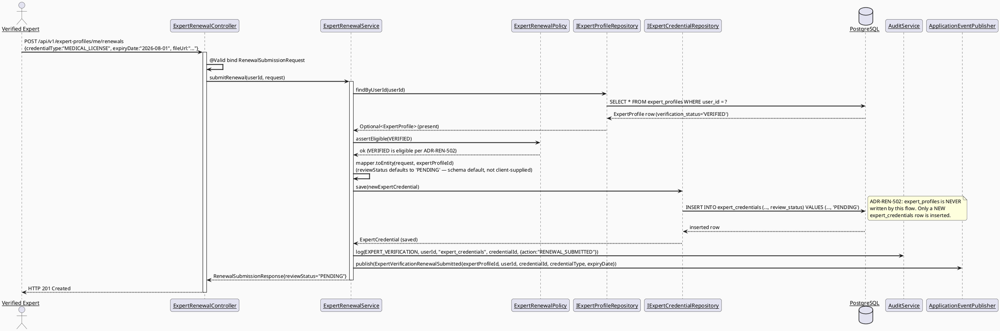
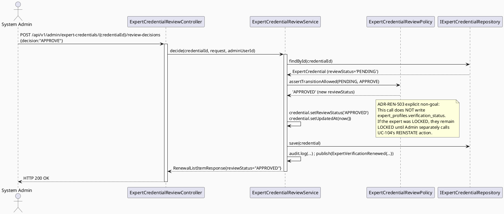
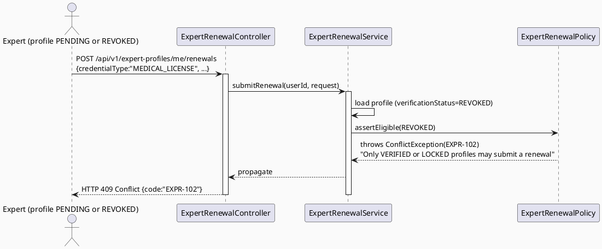
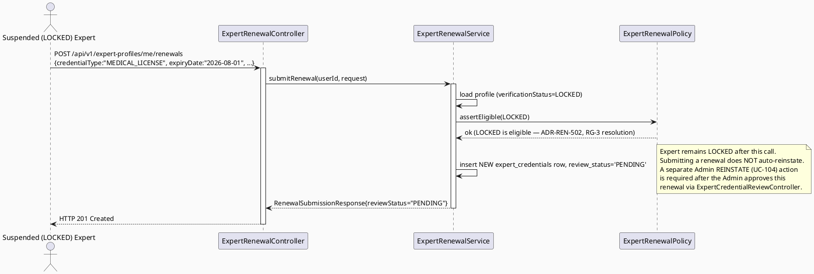
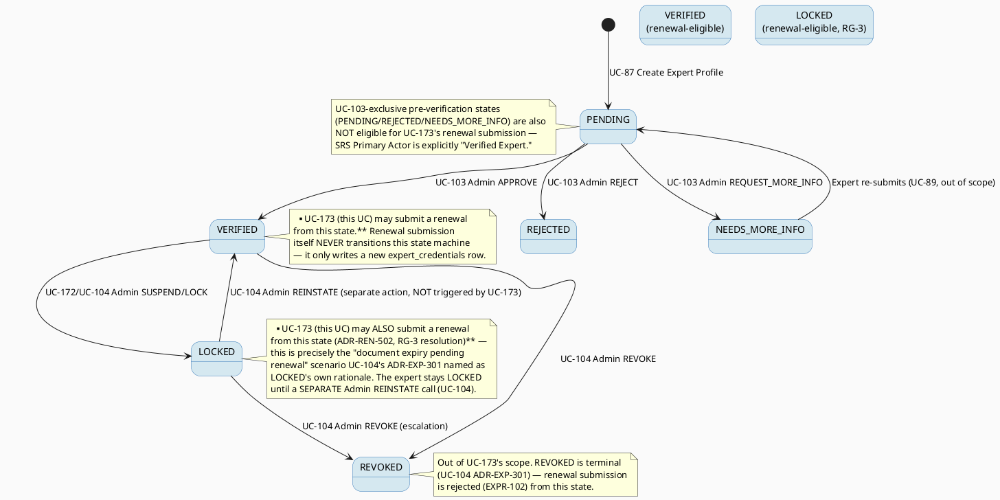

# ENGINEERING DOCUMENTATION STANDARD (EDS) v2.0
# UC-173 Renew Expert Verification — Technical Design Specification

| Field | Value |
|-------|-------|
| **Document ID** | `CB-EXPGOV-IMP-173` |
| **Version** | `1.0` |
| **Date** | `2026-07-03` |
| **Status** | `Draft` |
| **Document Owner** | `TV4-Lâm` |
| **Author** | `AI Agent (Technical Architect)` |
| **Reviewed by** | `[ ] Pending` |
| **DPO Sign-off** | `[ ] Pending` *(module accepts a Verified Expert's re-submitted PII-bearing credential documents)* |
| **Approved by** | `[ ] Pending` |
| **Last Review** | `2026-07-03` |
| **Based on EDS** | `v2.0` |

---

## CHANGELOG

| Ngày | Người thực hiện | Nội dung thay đổi |
|------|-----------------|-------------------|
| 2026-07-03 | AI Agent | Khởi tạo TDS cho UC-173, đồng bộ với schema thật `V1__init_schema.sql` (`expert_credentials`), reconciled với UC-172's `LOCKED`/`REINSTATE` state machine (RG-3) và UC-103's admin review pattern (RG-6) |

---

## MỤC LỤC

1. [Tổng quan Module](#1-tổng-quan-module)
2. [Ma trận Truy vết (Traceability Matrix)](#2-ma-trận-truy-vết-traceability-matrix)
3. [Architecture Decision Records (ADR)](#3-architecture-decision-records-adr)
4. [Non-Functional Requirements & SLA](#4-non-functional-requirements--sla)
5. [Static Modeling](#5-static-modeling-mô-hình-tĩnh)
6. [Dynamic Modeling](#6-dynamic-modeling-mô-hình-động)
7. [Domain Event Catalog](#7-domain-event-catalog)
8. [Interface Specification](#8-interface-specification-đặc-tả-giao-diện)
9. [API Specification](#9-api-specification)
10. [Bảng mã lỗi (Error Codes)](#10-bảng-mã-lỗi-error-codes)
11. [Quy trình Triển khai (Step-by-Step)](#11-quy-trình-triển-khai-step-by-step)
12. [Rollback & Incident Runbook](#12-rollback--incident-runbook)
13. [Kịch bản Kiểm thử Chi tiết](#13-kịch-bản-kiểm-thử-chi-tiết)
14. [Phương pháp Xác minh](#14-phương-pháp-xác-minh)
15. [Mẫu thử thực tế (API Verification Samples)](#15-mẫu-thử-thực-tế-api-verification-samples)
16. [Bảng tổng hợp phân quyền (Authorization Matrix)](#16-bảng-tổng-hợp-phân-quyền-authorization-matrix)
17. [AI Prompt Constraints (CASE 2.0)](#17-ai-prompt-constraints-case-20)
18. [Open Items / Research Gate](#18-open-items--research-gate)

---

## 1. Tổng quan Module

| Field | Value |
|-------|-------|
| **Module Name** | `RenewExpertVerification` |
| **Bounded Context** | `expert` (backend package `com.carebridge.backend.expert`, expert-facing self-service sub-slice; shares `expert_profiles`/`expert_credentials` tables with UC-87/88/89/103/104/172) |
| **Function ID / UC** | `3.2.4.2 Renew Expert Verification` / `UC-173` |
| **Primary Actor** | Verified Expert |
| **Secondary Actors** | None (SRS §3.2.4.2, line 1605) |
| **Platform** | Expert Portal / Expert App (SRS §3.2.4.2, line 1616 — this TDS targets Web Expert Portal, React + TypeScript + Vite, consistent with UC-88's Expert-facing feature slice; Mobile/Flutter parity is Open Item OI-6) |
| **Priority** | High (SRS Table 95) |
| **Frequency of Use** | Regular (SRS Table 95) |
| **Sprint / Owner** | Sprint 3 "Consultation Lifecycle, Expert Governance, And Location Visibility" — TV4-Lâm (per `function-spec-task-allocation.md`, line 575, alongside UC-172 line 574) |
| **Data Classification** | `PII` (re-submitted professional credential documents belonging to an identifiable expert) |
| **Compliance Scope** | `PDPA` |
| **Upstream Dependencies** | UC-103 Verify Expert Profile (this UC reuses its admin-review vocabulary/pattern for the renewal decision step — see ADR-REN-503); UC-172 Suspend Expert / UC-104 Revoke Expert Badge (this UC's precondition guard is reconciled against their `LOCKED`/`REVOKED` states — see ADR-REN-502); `auth` (JWT → expert `userId`); `audit` (`AuditService`) |
| **Downstream Consumers** | UC-80/UC-81 View Expert Directory/Profile (read `expert_credentials.expiry_date`/`review_status` — out of scope to modify here, informational only), UC-112 View Expert Dashboard (may surface upcoming-expiry counts — out of scope, informational only) |

**Mô tả (SRS):** "Submits updated documents before verification expiry and tracks renewal results." (SRS §3.2.4.2, line 1607)

**Vị trí trong vòng đời hồ sơ chuyên gia:** UC-87 (out of scope) creates `expert_profiles`; UC-89 (out of scope) uploads the initial `expert_credentials` rows; UC-103 (Admin) approves them, setting `expert_profiles.verification_status = VERIFIED`; UC-172/UC-104 (Admin) may sanction a `VERIFIED` profile to `LOCKED`/`REVOKED`. UC-173 (tài liệu này) is the **only** SRS-defined self-service path for an already-`VERIFIED` expert to proactively submit **new/updated** credential documents — typically because an existing `expert_credentials.expiry_date` is approaching — so an Admin can review them before the credential lapses. UC-173 does **not** itself decide the outcome ("tracks renewal results" — SRS line 1607) — the actual accept/reject decision on the renewal submission is performed by the Admin through the SAME review vocabulary UC-103 already established (`APPROVE`/`REJECT`/`REQUEST_MORE_INFO`), reused here rather than re-invented (ADR-REN-503).

---

## 2. Ma trận Truy vết (Traceability Matrix)

| Requirement ID | Loại (BR/ADR/US) | Mô tả yêu cầu | Thành phần Code | Compliance Target | ADR liên quan |
|----------------|------------------|---------------|-----------------|-------------------|---------------|
| UC-173 (SRS §3.2.4.2, dòng 1600-1619) | User Story | Verified Expert submits updated documents before verification expiry; system tracks renewal results | `ExpertRenewalController.POST /api/v1/expert-profiles/me/renewals`, `GET /api/v1/expert-profiles/me/renewals` | — | ADR-REN-501 |
| BR-RBAC | Business Rule | Users may access only functions allowed by their role and permission scope | `@PreAuthorize("hasRole('EXPERT')")` + ownership check (self-service, own profile only) | — | ADR-REN-504 |
| PRE-3 (SRS common preconditions) | Precondition | Actor authenticated with required role | Spring Security filter chain + `SecurityUtils.requireCurrentUserId()` | — | ADR-REN-504 |
| PRE-4 (SRS common preconditions) | Precondition | Required reference data exists when the UC processes an existing record | `findByUserId()` 404 guard (`expert_profiles`); `VERIFIED`/`LOCKED`-only precondition guard (via `ExpertRenewalPolicy`) | — | ADR-REN-502 |
| POST-2 (SRS common postconditions) | Postcondition | Related records/statuses/notifications updated when applicable | New `expert_credentials` row(s) with `review_status='PENDING'` per renewal submission; `notification` module notifies expert of submission receipt and, later, of the Admin decision | — | ADR-REN-501 |
| POST-3 (SRS common postconditions) | Postcondition | Sensitive actions recorded for audit, safety, or privacy review | `AuditService.log(EXPERT_VERIFICATION, ...)`; `ExpertVerificationRenewalSubmitted`/`ExpertVerificationRenewed`/`ExpertVerificationRenewalRejected` domain events | PDPA | ADR-REN-501 |
| E1 (SRS Exceptions) | Exception | Access denied when unauthenticated/unauthorized/out-of-scope | 401/403 responses, `EXPR-1xx` codes | — | ADR-REN-504 |
| E2 (SRS Exceptions) | Exception | Invalid, missing, expired, or conflicting data rejected with field-level message | Bean Validation on `RenewalSubmissionRequest`; `ExpertRenewalPolicy.assertEligible()` guard | — | ADR-REN-502 |
| ADR-REN-501 | Decision | Renewal submission = new `expert_credentials` row(s) per document, `review_status='PENDING'`; NO dedicated renewal-attempt-history table (schema has no such table — reuse existing column) | `ExpertCredential` entity (existing, reused), `ExpertRenewalServiceImpl.submitRenewal()` | — | — |
| ADR-REN-502 | Decision | Renewal is submittable only from `VERIFIED` or `LOCKED` `expert_profiles.verification_status`; `REVOKED`/`PENDING`/`REJECTED`/`NEEDS_MORE_INFO` are rejected. A `LOCKED` (suspended, per UC-172) expert MAY submit a renewal (it does not itself lift the suspension — Admin REINSTATE, UC-104, remains the only path back to `VERIFIED`) | `ExpertRenewalPolicy.assertEligible()` | — | — |
| ADR-REN-503 | Decision | Admin decision on a renewal submission reuses UC-103's `VerificationDecisionAction` vocabulary (`APPROVE`/`REJECT`/`REQUEST_MORE_INFO`) applied at the `expert_credentials.review_status` level; approving a renewal does NOT itself change `expert_profiles.verification_status` for an already-`VERIFIED` expert (no state to re-enter) — see §3 for the `LOCKED` interaction nuance | `ExpertCredentialReviewController` (NEW, admin-facing, mirrors UC-103's shape) | — | — |
| ADR-REN-504 | Decision | EXPERT-only self-service, own profile only; no admin-override submission path in this UC | `@PreAuthorize("hasRole('EXPERT')")`, §16 Authorization Matrix | — | — |
| BR-SAFETY | Business Rule | Medical guidance must be non-diagnostic, escalation-aware, and red-flag safe | N/A — this UC does not generate medical guidance; inherited from SRS common Business Rules field, no code component | — | — |

---

## 3. Architecture Decision Records (ADR)

### ADR-REN-501 — Renewal submission model: reuse `expert_credentials`, no dedicated renewal-history table

| Field | Value |
|-------|-------|
| **Status** | `Accepted` |
| **Deciders** | `AI Agent (Technical Architect role)` |
| **Date** | `2026-07-03` |

#### Bối cảnh (Context)
RG-6 (task instruction) asks whether "renewal results" tracking (SRS line 1607: "...and tracks renewal results") reuses `expert_credentials.review_status` (new row per renewal submission) or needs a dedicated renewal-attempt table. Full read of `V1__init_schema.sql` (lines 802-815, confirmed no other renewal/credential-history table exists anywhere in `db/migration/`) shows `expert_credentials` already has exactly the columns a renewal submission needs: `credential_type`, `credential_number`, `issuer`, `issued_date`, `expiry_date`, `file_url`, `review_status varchar(30) DEFAULT 'PENDING'`, `review_note`, `created_at`, `updated_at`. There is **no** `is_latest`/`supersedes_credential_id`/`renewal_of` column and **no** DB CHECK constraint on `review_status` (confirmed via lines 1799-1809, same as UC-103's finding for `expert_profiles`). The table's shape is already "append rows over time, most recent `created_at` per `credential_type` is the current one" — which is structurally a renewal-attempt history already, just without an explicit foreign key linking a renewal row back to the credential it renews.

#### Các phương án đã xem xét (Options Considered)

| Phương án | Mô tả | Ưu điểm | Nhược điểm |
|-----------|-------|----------|------------|
| A | New dedicated `expert_verification_renewals` table (renewal_id, expert_profile_id, submitted_at, status, decided_by, decided_at, note) | Explicit single-purpose table; clean "one row per renewal attempt" semantics; easy to query "pending renewals" without filtering `expert_credentials` by date | Requires a new Flyway migration on a Draft-status UC; duplicates most of `expert_credentials`' columns; CareBridge's "smallest scoped change" delivery rule and the schema's existing append-friendly `expert_credentials` shape argue against introducing a second overlapping table |
| B | Reuse `expert_credentials` as-is: a renewal submission inserts ONE NEW ROW per submitted document (same `credential_type`, new `issued_date`/`expiry_date`/`file_url`), `review_status='PENDING'`. "Latest" credential per type = the row with the max `created_at` for that `(expert_profile_id, credential_type)` pair (query-time, no new column). Admin reviews/decides on that specific new row via the SAME `review_status` field UC-89 (out of scope) already established | Zero schema migration; reuses the exact mechanism UC-89 already uses for the FIRST submission — a renewal is structurally "submit credentials again," which is literally what SRS line 1607 says ("submits updated documents"); "tracks renewal results" = the `review_status` lifecycle of that new row, exactly analogous to how UC-103 already "tracks verification results" via `expert_profiles.verification_status` | No explicit `renewal_of`/`is_latest` marker — determining "the current credential of this type" requires a `MAX(created_at)` query rather than a boolean flag; acceptable per Option B's own scope, flagged as Open Item OI-1 for a future indexed "current credential" view if query performance becomes a concern |
| C | Add a nullable `renewal_of_credential_id UUID` self-referencing FK column to `expert_credentials` via new migration, keeping single-table reuse but adding explicit lineage | Explicit lineage without a second table; smaller migration than Option A | Still a schema change on a Draft-status UC when Option B achieves the same functional outcome with zero migration; the SRS UC-173 wording does not require displaying "which credential a renewal supersedes" as a user-facing feature — deferred as Open Item OI-1, not built now |

#### Quyết định (Decision)
Chọn **Phương án B**. `POST /api/v1/expert-profiles/me/renewals` inserts one **new** `expert_credentials` row per submitted document, using the EXISTING columns exactly as UC-89's (out of scope) initial-submission flow would, with `review_status` defaulting to `'PENDING'` (schema default, no override). No new table, no new column, no new migration for the submission side of this UC. "Tracks renewal results" (SRS) is satisfied because:
1. `GET /api/v1/expert-profiles/me/renewals` (NEW, this UC) lists the expert's own `expert_credentials` rows ordered by `created_at DESC`, so the expert can see the `review_status` (`PENDING`/`APPROVED`/`REJECTED`) of each submission attempt — this **is** the renewal-results tracking the SRS names.
2. Domain events (§7) fire on submission and on Admin decision, giving an auditable, timestamped trail without inventing a parallel history table.

**Explicit non-goal:** This ADR does NOT introduce a `renewal_attempts`/`expert_verification_renewals` table, nor a `SUSPENDED`-style new enum on `expert_credentials.review_status` beyond the 3 values UC-103's `VerificationDecisionAction` vocabulary already supports when reused for credential-level decisions (§ADR-REN-503).

#### Hệ quả (Consequences)

**Tích cực:** Zero migration; renewal submission uses the exact same persistence shape as the original UC-89 submission (no divergent code path for "first submission" vs "renewal"); UC-112 Dashboard/reporting queries `expert_credentials` exactly once for both initial and renewal credentials.

**Tiêu cực / Trade-offs:** Without an explicit `renewal_of`/`is_latest` marker, any UI or report that needs "the current active credential per type" must compute `MAX(created_at)` per `(expert_profile_id, credential_type)` — acceptable for the expected low submission volume per expert, flagged as Open Item OI-1 for a future indexed view if this becomes a bottleneck.

**Compliance Impact:** PDPA — no new PII-bearing table introduced; the renewal document is subject to the exact same review/retention posture as the original credential upload (out of scope of this UC to redefine).

---

### ADR-REN-502 — Renewal eligibility: `VERIFIED` or `LOCKED` only; reconciliation with UC-172's suspend state machine (RG-3)

| Field | Value |
|-------|-------|
| **Status** | `Accepted` |
| **Date** | `2026-07-03` |
| **Supersedes** | None — extends UC-172's ADR-SUSP-401 by reference, does not replace it |

#### Bối cảnh (Context)
RG-3 (task instruction) requires explicit reconciliation with UC-172's already-Accepted suspend mechanism: **can a `LOCKED` (suspended) expert submit a renewal, or must they first be reinstated?** UC-172's TDS (`CB-EXPGOV-IMP-172`) §6.4 state machine (reused verbatim from UC-104's ADR-EXP-301) defines exactly two ways OUT of `LOCKED`: `LOCKED → VERIFIED` via Admin `REINSTATE` action, and `LOCKED → REVOKED` via Admin `REVOKE` (escalation). **Neither edge is triggered by an expert action** — UC-172/UC-104 both explicitly scope `LOCK`/`REVOKE`/`REINSTATE` as System-Admin-only actions (ADR-SUSP-403, ADR-EXP-303). UC-173's SRS wording ("Verified Expert submits updated documents... before verification expiry") does not name `LOCKED` at all — but UC-172's own ADR-SUSP-401 explicitly gives the *reason* an expert might be `LOCKED` as "e.g., document expiry pending renewal" (UC-104 ADR-EXP-301 §Options B), which is **precisely** the scenario UC-173 exists to remedy. If UC-173 refused submissions from a `LOCKED` expert, there would be **no SRS-supported path at all** for a document-expiry-suspended expert to ever submit the very renewal that resolves their suspension — a dead end contradicting the explicit rationale UC-172/UC-104 gave for the `LOCKED` state's existence.

#### Các phương án đã xem xét (Options Considered)

| Phương án | Mô tả | Ưu điểm | Nhược điểm |
|-----------|-------|----------|------------|
| A | Renewal submittable ONLY from `VERIFIED` — a `LOCKED` expert must first be reinstated by an Admin (UC-104 `REINSTATE`) before they can submit renewal documents | Simplest guard (matches UC-103's own "act only from one precondition state" pattern) | Creates the dead-end described above: UC-104 `REINSTATE` itself requires a reason and Admin judgment call — if the Admin's own note says "reinstate once documents are renewed," but the expert cannot submit documents while `LOCKED`, no actor can break the cycle. This directly contradicts UC-172/UC-104's own stated rationale for why `LOCKED` exists ("document expiry pending renewal") |
| B | Renewal submittable from `VERIFIED` **or** `LOCKED`. Submitting a renewal while `LOCKED` does NOT itself change `expert_profiles.verification_status` — the expert remains `LOCKED` until an Admin explicitly reviews the renewal AND separately issues a `REINSTATE` action (UC-104, unchanged, Admin-only) after judging the new documents sufficient | Closes the dead-end from Option A while respecting ADR-SUSP-403/ADR-EXP-303's Admin-only authority over the `verification_status` state machine — UC-173 never writes `verification_status`, only `expert_credentials`, so no new actor gains the power to self-reinstate | Two-step recovery (expert submits renewal, THEN admin separately reinstates) is slightly more friction than a hypothetical auto-reinstate-on-approval design; deliberately chosen anyway because auto-reinstate would let this UC indirectly perform an action ADR-SUSP-403/ADR-EXP-303 reserve exclusively for System Admin — flagged Open Item OI-2 for Product to confirm this friction is acceptable UX |
| C | Renewal submittable from any non-`REVOKED` state (`PENDING`/`REJECTED`/`NEEDS_MORE_INFO` too) | Maximally permissive | SRS UC-173's Primary Actor is explicitly "**Verified** Expert" (not "any Expert") — `PENDING`/`REJECTED`/`NEEDS_MORE_INFO` are UC-103's exclusive pre-verification state space (per UC-103 ADR-EXP-201); allowing renewal submission from those states would blur UC-173 (a post-verification maintenance action) with UC-89's (out of scope) initial submission flow, and contradicts the SRS Primary Actor field |

#### Quyết định (Decision)
Chọn **Phương án B**. `ExpertRenewalPolicy.assertEligible(ExpertVerificationStatus current)` allows renewal submission when `current` is `VERIFIED` **or** `LOCKED`; rejects (`EXPR-102`) for `PENDING`, `REJECTED`, `NEEDS_MORE_INFO`, `REVOKED`.

- `REVOKED` is explicitly excluded: UC-104's ADR-EXP-301 marks `REVOKED` as terminal with "no reinstate path in this UC" — allowing a `REVOKED` expert to submit renewal documents would imply a recovery path that UC-104's Accepted state machine does not support. If Product later wants a `REVOKED`-expert re-application flow, that is a new UC (UC-104 §18 OI-1), not silently added here.
- **UC-173 never writes `expert_profiles.verification_status`.** It writes only `expert_credentials` rows. This is the concrete mechanism by which ADR-SUSP-401/ADR-SUSP-403 (UC-172) and ADR-EXP-301/ADR-EXP-303 (UC-104) remain uncontradicted: the badge/sanction state machine's write authority stays 100% with UC-103 (verify)/UC-104+UC-172 (sanction/reinstate); UC-173 only feeds NEW evidence (credential rows) for an Admin to later act on via those EXISTING, unmodified mechanisms.

#### Hệ quả (Consequences)

**Tích cực:** Closes the dead-end scenario UC-172/UC-104 itself named as the primary reason `LOCKED` exists; zero authority creep — UC-173 cannot self-reinstate or self-verify under any input, structurally (no code path writes `verification_status`).

**Tiêu cực / Trade-offs:** A `LOCKED` expert who submits a renewal and is approved by the Admin at the `expert_credentials` level is STILL `LOCKED` until a SEPARATE Admin `REINSTATE` action (UC-104) is issued — this two-step flow is not spelled out anywhere in SRS UC-173/UC-172, flagged as Open Item OI-2 for Product/Tech Lead confirmation of the intended admin workflow (e.g., should the UC-103-style renewal-review screen show a "Reinstate this expert" shortcut button that calls UC-104's EXISTING `REINSTATE` endpoint, to reduce Admin clicks? Recommended but not mandated by this Draft).

**Compliance Impact:** PDPA — no new write authority over a sanction-bearing field is introduced; BR-RBAC — Admin-only control over `verification_status` transitions (ADR-SUSP-403/ADR-EXP-303) remains fully intact.

---

### ADR-REN-503 — Renewal decision reuses UC-103's review vocabulary at the `expert_credentials` level

| Field | Value |
|-------|-------|
| **Status** | `Accepted` |
| **Date** | `2026-07-03` |

#### Bối cảnh (Context)
SRS UC-173 says the system "tracks renewal results" but does not name who decides the result or what vocabulary is used. UC-103's TDS already defines a `VerificationDecisionAction` enum (`APPROVE`/`REJECT`/`REQUEST_MORE_INFO`) and an `ExpertVerificationPolicy` state-machine pattern for `expert_profiles.verification_status`; that same 3-outcome vocabulary is the natural fit for deciding a single `expert_credentials` row's `review_status`, since `expert_credentials.review_status` already defaults to the same conceptual states (`PENDING` → terminal-ish outcome) that UC-103 modeled for `expert_profiles`.

#### Các phương án đã xem xét (Options Considered)

| Phương án | Mô tả | Ưu điểm | Nhược điểm |
|-----------|-------|----------|------------|
| A | Invent a new, UC-173-specific decision vocabulary/enum for renewal review | "Clean" dedicated surface | Duplicates UC-103's already-Accepted `VerificationDecisionAction` semantics for what is functionally the identical decision (approve/reject/ask-for-more) applied to a different row; violates cross-UC naming consistency the sibling TDS documents established |
| B | Reuse UC-103's `VerificationDecisionAction` enum (`APPROVE`/`REJECT`/`REQUEST_MORE_INFO`) verbatim, applied to `expert_credentials.review_status` via a NEW `ExpertCredentialReviewPolicy`/`ExpertCredentialReviewServiceImpl` (new classes, since the entity being decided on — `ExpertCredential`, not `ExpertProfile` — differs from UC-103's) | No vocabulary duplication; Admin reviewers see the same APPROVE/REJECT/REQUEST_MORE_INFO 3-button pattern across both UC-103 (profile-level) and this UC's renewal queue (credential-level), reducing cognitive load; `review_status` values (`PENDING`/`APPROVED`/`REJECTED`) map 1:1 | New service/policy/controller classes ARE required here (unlike UC-172's pure reuse) because the target entity differs — flagged explicitly so this is not mistaken for a missed reuse opportunity |

#### Quyết định (Decision)
Chọn **Phương án B**. Introduce `ExpertCredentialReviewPolicy`/`ExpertCredentialReviewServiceImpl`/`ExpertCredentialReviewController` (NEW classes, admin-facing, `com.carebridge.backend.expert` package) that apply UC-103's EXISTING `VerificationDecisionAction` enum (`APPROVE`/`REJECT`/`REQUEST_MORE_INFO`, imported unchanged from UC-103's entity package — no redefinition) to a single `expert_credentials` row, writing `review_status` (`'APPROVED'`/`'REJECTED'`/back to `'PENDING'` is not a valid target — `REQUEST_MORE_INFO` maps to `review_status='PENDING'` with `review_note` populated, since the schema's `review_status` has no dedicated "needs more info" value distinct from `PENDING`; see §5.1 for the value-mapping table). Approving a renewal credential does **not** itself write `expert_profiles.verification_status` — see ADR-REN-502's explicit non-goal.

#### Hệ quả (Consequences)

**Tích cực:** Vocabulary consistency with UC-103 for Admin reviewers; the renewal-review admin screen (§11.3) can visually/behaviorally mirror UC-103's existing verification-queue screen, minimizing new UX patterns to learn.

**Tiêu cực / Trade-offs:** `expert_credentials.review_status varchar(30)` only supports 3 practical values (`PENDING`/`APPROVED`/`REJECTED`) — there is no schema-level 4th value for "needs more info," so `REQUEST_MORE_INFO` is modeled as `review_status` staying `'PENDING'` with `review_note` set (a re-request, not a new terminal state) — flagged as Open Item OI-3 for Product/DPO confirmation this UX (reviewer sees "still pending" rather than a distinct "needs more info" chip) is acceptable, or whether a future migration should add a dedicated value.

**Compliance Impact:** PDPA — reviewer identity and reason are captured on every decision via `AuditService`, matching UC-103's existing audit posture for credential-adjacent PII decisions.

---

### ADR-REN-504 — EXPERT-only self-service submission, own profile only

| Field | Value |
|-------|-------|
| **Status** | `Accepted` |
| **Date** | `2026-07-03` |

#### Bối cảnh (Context)
SRS Table 95 "Primary Actor" field states exactly "Verified Expert" with "Secondary Actors: None" (SRS §3.2.4.2, line 1605). This mirrors UC-88's `/me`-scoped ownership pattern (ADR-EXP-101) rather than UC-103/UC-104/UC-172's Admin-only pattern, since UC-173's actor is the Expert, not an Admin.

#### Quyết định (Decision)
`POST /api/v1/expert-profiles/me/renewals` and `GET /api/v1/expert-profiles/me/renewals` are scoped to `/me` (no `{id}` path parameter for another expert's profile — structurally prevents cross-account submission, identical reasoning to UC-88's §6.4 design note). `@PreAuthorize("hasRole('EXPERT')")`; `ExpertRenewalOwnershipPolicy.assertOwnedBy()` retained as defense-in-depth (mirrors UC-88's `ExpertProfileOwnershipPolicy`). The renewal-**review** endpoints (`ExpertCredentialReviewController`, ADR-REN-503) are separately `@PreAuthorize("hasRole('SYSTEM_ADMIN')")`, matching UC-103's authorization boundary — no MODERATOR access to either the submission or the review side (no SRS statement grants it).

#### Hệ quả (Consequences)
**Tích cực:** Matches SRS Primary Actor field exactly for both actors involved (Expert submits, Admin reviews); consistent with UC-88's proven `/me`-scoping pattern and UC-103's proven Admin-only review pattern — no new authorization philosophy introduced.
**Tiêu cực / Trade-offs:** None beyond UC-88's/UC-103's already-documented trade-offs (their respective Open Items apply here too).

---

## 4. Non-Functional Requirements & SLA

### 4.1. Performance & Availability

| Category | Requirement | Target SLA | Measurement Method | Compliance Basis |
|----------|-------------|------------|---------------------|------------------|
| Latency | `POST /api/v1/expert-profiles/me/renewals` (p99) | `< 500ms` (file metadata write; actual file upload assumed handled by existing `uploaded_files`/file-storage flow, out of scope) | Manual timing / future k6 | — |
| Latency | `GET /api/v1/expert-profiles/me/renewals` (p99) | `< 300ms` | Manual timing | — |
| Availability | Uptime (monthly) | `99.9%` | Uptime monitor | — |

### 4.2. Data Integrity & Retention

| Category | Requirement | Target | Verification Method | Compliance Basis |
|----------|-------------|--------|---------------------|------------------|
| Durability | Zero record loss on renewal submission | RPO = 0 | Transaction-scoped JPA save | PDPA data integrity |
| Consistency | Renewal submission never writes `expert_profiles.verification_status` (ADR-REN-502 non-goal) | 100% | Integration test asserting zero writes to `expert_profiles` from `submitRenewal()` | ADR-REN-502 |
| Consistency | Renewal submission only accepted when current status ∈ {`VERIFIED`, `LOCKED`} | 100% | Unit test on `ExpertRenewalPolicy.assertEligible()` | ADR-REN-502 |
| Auditability | Every submission and every Admin decision has a matching `AuditService` log entry | 100% | Integration test asserting audit row exists for both actions | ADR-REN-501, ADR-REN-503 |

### 4.3. Security

| Category | Requirement | Target | Verification Method | Compliance Basis |
|----------|-------------|--------|---------------------|------------------|
| Access control | Submission: `EXPERT`, own profile only | 100% enforced | Unit + E2E ownership tests | BR-RBAC, ADR-REN-504 |
| Access control | Review: `SYSTEM_ADMIN` only, no MODERATOR | 100% enforced | E2E role matrix tests | BR-RBAC, ADR-REN-503 |
| Input validation | Reject renewal submission when current status is ineligible, or file metadata malformed | 100% | Bean Validation + policy tests | ADR-REN-502 |
| Mass-assignment protection | `RenewalSubmissionRequest` cannot set `review_status`/`expert_profile_id`/`credential_id` directly — server-assigns `PENDING`/ownership/UUID | 100% | Tampering test (mirrors UC-88's EXP-TC-006 pattern) | ADR-REN-504 |

### 4.4. Scalability & Capacity Planning
Expected load: low-to-moderate (bounded by number of `VERIFIED`/`LOCKED` experts with credentials approaching `expiry_date`, expected low tens per week in near term). No special scaling strategy needed beyond standard connection pooling already configured for the modular monolith.

---

## 5. Static Modeling (Mô hình Tĩnh)

### 5.1. Class Diagram (PlantUML)

```plantuml
@startuml RenewExpertVerification_ClassDiagram
skinparam classAttributeIconSize 0
skinparam classFontStyle bold
skinparam backgroundColor #FAFAFA
skinparam ArrowColor #555555
skinparam ClassBorderColor #2E75B6
skinparam ClassHeaderBackgroundColor #D5E8F0

' === ENTITIES (existing tables, shared with UC-89/UC-103/UC-104/UC-172 — UNCHANGED) ===
class ExpertProfile {
  + expertProfileId: UUID
  + userId: UUID
  + verificationStatus: ExpertVerificationStatus
  + verifiedAt: Instant
  + verifiedBy: UUID
  + createdAt: Instant
  + updatedAt: Instant
}

class ExpertCredential {
  + credentialId: UUID
  + expertProfileId: UUID
  + credentialType: String
  + credentialNumber: String
  + issuer: String
  + issuedDate: LocalDate
  + expiryDate: LocalDate
  + fileUrl: String
  + reviewStatus: String
  + reviewNote: String
  + createdAt: Instant
  + updatedAt: Instant
}

' === SHARED ENUM (UNCHANGED — canonical across UC-103/104/112/172/173, NOT modified by this UC) ===
enum ExpertVerificationStatus {
  PENDING
  VERIFIED
  REJECTED
  NEEDS_MORE_INFO
  LOCKED
  REVOKED
}

' === SHARED ENUM (REUSED verbatim from UC-103 — imported, not redefined) ===
enum VerificationDecisionAction {
  APPROVE
  REJECT
  REQUEST_MORE_INFO
}

' === DTOs (NEW — submission side) ===
class RenewalSubmissionRequest {
  + credentialType: String
  + credentialNumber: String
  + issuer: String
  + issuedDate: LocalDate
  + expiryDate: LocalDate
  + fileUrl: String
  ' No reviewStatus/expertProfileId/credentialId field — server-assigned (ADR-REN-504)
}

class RenewalSubmissionResponse {
  + credentialId: UUID
  + expertProfileId: UUID
  + credentialType: String
  + reviewStatus: String
  + expiryDate: LocalDate
  + createdAt: Instant
}

class RenewalListItemResponse {
  + credentialId: UUID
  + credentialType: String
  + reviewStatus: String
  + reviewNote: String
  + expiryDate: LocalDate
  + submittedAt: Instant
}

' === DTOs (NEW — admin review side, mirrors UC-103's shape) ===
class RenewalReviewDecisionRequest {
  + decision: VerificationDecisionAction
  + note: String
}

class RenewalReviewQueueItemResponse {
  + credentialId: UUID
  + expertProfileId: UUID
  + expertFullName: String
  + credentialType: String
  + expiryDate: LocalDate
  + reviewStatus: String
  + submittedAt: Instant
}

' === SERVICE (NEW — submission side) ===
interface IExpertRenewalService <<interface>> {
  + submitRenewal(UUID userId, RenewalSubmissionRequest): RenewalSubmissionResponse
  + listMyRenewals(UUID userId): List<RenewalListItemResponse>
}

class ExpertRenewalServiceImpl implements IExpertRenewalService {
  - expertProfileRepository: IExpertProfileRepository
  - expertCredentialRepository: IExpertCredentialRepository
  - renewalPolicy: ExpertRenewalPolicy
  - renewalMapper: ExpertRenewalMapper
  - auditService: AuditService
  - applicationEventPublisher: ApplicationEventPublisher
}

' === SERVICE (NEW — admin review side) ===
interface IExpertCredentialReviewService <<interface>> {
  + listQueue(String reviewStatusFilter, Pageable): Page<RenewalReviewQueueItemResponse>
  + decide(UUID credentialId, RenewalReviewDecisionRequest, UUID adminUserId): RenewalListItemResponse
}

class ExpertCredentialReviewServiceImpl implements IExpertCredentialReviewService {
  - expertCredentialRepository: IExpertCredentialRepository
  - reviewPolicy: ExpertCredentialReviewPolicy
  - auditService: AuditService
  - applicationEventPublisher: ApplicationEventPublisher
}

' === POLICY (NEW) ===
class ExpertRenewalPolicy {
  + assertEligible(ExpertVerificationStatus current): void
}

class ExpertCredentialReviewPolicy {
  + assertTransitionAllowed(String currentReviewStatus, VerificationDecisionAction action): String
  + assertNoteRequiredIfNeeded(VerificationDecisionAction action, String note): void
}

' === MAPPER (NEW) ===
class ExpertRenewalMapper {
  + toEntity(RenewalSubmissionRequest src, UUID expertProfileId): ExpertCredential
  + toSubmissionResponse(ExpertCredential entity): RenewalSubmissionResponse
  + toListItem(ExpertCredential entity): RenewalListItemResponse
}

' === CONTROLLERS (NEW) ===
class ExpertRenewalController {
  + submitRenewal(Principal, RenewalSubmissionRequest): ResponseEntity
  + listMyRenewals(Principal): ResponseEntity
}

class ExpertCredentialReviewController {
  + listQueue(String status, Pageable): ResponseEntity
  + decide(UUID credentialId, Principal, RenewalReviewDecisionRequest): ResponseEntity
}

note bottom of ExpertRenewalServiceImpl
  ADR-REN-502: submitRenewal() NEVER writes
  expert_profiles.verification_status.
  Only expert_credentials rows are written.
  Eligibility read-check: current status
  MUST be VERIFIED or LOCKED (ADR-REN-502).
end note

note bottom of ExpertCredentialReviewServiceImpl
  ADR-REN-503: decide() writes ONLY
  expert_credentials.review_status/review_note.
  Does NOT write expert_profiles.verification_status —
  reinstating a LOCKED expert remains UC-104's
  REINSTATE action exclusively (Admin-initiated,
  separate call, out of this UC's write scope).
end note

ExpertRenewalController --> IExpertRenewalService : uses
ExpertRenewalServiceImpl --> IExpertProfileRepository : uses (existing)
ExpertRenewalServiceImpl --> IExpertCredentialRepository : uses (existing)
ExpertRenewalServiceImpl --> ExpertRenewalPolicy : uses
ExpertRenewalServiceImpl --> ExpertRenewalMapper : uses
ExpertCredentialReviewController --> IExpertCredentialReviewService : uses
ExpertCredentialReviewServiceImpl --> IExpertCredentialRepository : uses (existing)
ExpertCredentialReviewServiceImpl --> ExpertCredentialReviewPolicy : uses
ExpertRenewalPolicy ..> ExpertVerificationStatus : validates
ExpertCredentialReviewPolicy ..> VerificationDecisionAction : validates (REUSED from UC-103)
ExpertCredential ..> ExpertProfile : belongs to

@enduml
```



### 5.2. Data Structure (Flyway SQL Migration)

**No schema migration required.** `expert_credentials` (`V1__init_schema.sql` lines 802-815) already has every column this UC's submission and review flows need: `credential_type`, `credential_number`, `issuer`, `issued_date`, `expiry_date`, `file_url`, `review_status varchar(30) DEFAULT 'PENDING'`, `review_note`. `expert_profiles.verification_status` (lines 786-800) is read-only from this UC's perspective (ADR-REN-502 eligibility check) — never written. Full `db/migration/` directory inspected — no renewal-attempt-history table, no `is_latest`/`renewal_of` column, no DB CHECK constraint on `expert_credentials.review_status` exists anywhere.

Reference (existing, unchanged):
```sql
-- From V1__init_schema.sql, lines 802-815 (source of truth — read-only reference)
CREATE TABLE public.expert_credentials (
    credential_id     uuid        NOT NULL DEFAULT gen_random_uuid(),
    expert_profile_id uuid        NOT NULL,
    credential_type   varchar(50) NOT NULL,
    credential_number varchar(100),
    issuer            varchar(200),
    issued_date       date,
    expiry_date       date,
    file_url          text,
    review_status     varchar(30) NOT NULL DEFAULT 'PENDING',
    review_note       text,
    created_at        timestamptz NOT NULL DEFAULT now(),
    updated_at        timestamptz NOT NULL DEFAULT now()
);
-- PK: credential_id (line 1407-1408)
-- FK: expert_profile_id -> expert_profiles(expert_profile_id) (line 1805-1806)
-- INDEX: idx_expert_credentials_expert_profile_id (line 1632)
-- NOTE: no is_latest / renewal_of / supersedes_credential_id column exists.
-- "Current" credential of a given type = MAX(created_at) row for
-- (expert_profile_id, credential_type) — query-time derivation (ADR-REN-501).

-- From V1__init_schema.sql, lines 786-800 (read-only reference — NEVER written by this UC)
CREATE TABLE public.expert_profiles (
    expert_profile_id   uuid         NOT NULL DEFAULT gen_random_uuid(),
    user_id             uuid         NOT NULL,
    verification_status varchar(30)  NOT NULL DEFAULT 'PENDING',
    verified_at         timestamptz,
    verified_by         uuid,
    created_at          timestamptz  NOT NULL DEFAULT now(),
    updated_at          timestamptz  NOT NULL DEFAULT now()
);
-- INDEX: idx_expert_profiles_verification_status (line 1631) — this UC's
-- eligibility read query (VERIFIED/LOCKED check) benefits from this existing index.
```

> **If a future decision requires an explicit renewal-lineage marker** (Open Item OI-1 — e.g., `renewal_of_credential_id`/`is_latest` on `expert_credentials`), that would be introduced under migration version **`V20260706090200`** (this batch's third reserved slot, after UC-172's `V20260706090100`; increments the same `090000` sub-range by `00100`; no collision with the `100000`/`110000`/`120000`/`130000` ranges reserved for sibling agents, nor with the confirmed highest existing migration `V20260629000002`). **Not created in this Draft TDS** since no genuine schema gap blocks the SRS-required behavior (RG-6 resolved: reuse, no gap).

---

## 6. Dynamic Modeling (Mô hình Động)

### 6.1. Sequence Diagram — Happy Path: Expert submits a renewal (PlantUML)



### 6.2. Sequence Diagram — Alt Path: Admin approves the renewal (PlantUML)



### 6.3. Sequence Diagram — Error Path: Submission rejected — ineligible profile state (PlantUML)



### 6.4. Sequence Diagram — Alt Path: LOCKED expert submits renewal (RG-3 scenario) (PlantUML)



### 6.5. State Machine — Renewal submission eligibility over `ExpertVerificationStatus` (UC-173's read-only view) (PlantUML)



**Invariant bất biến:**
- Renewal submission (`POST .../renewals`) is only valid when `expert_profiles.verification_status` ∈ {`VERIFIED`, `LOCKED`} — never from `PENDING`/`REJECTED`/`NEEDS_MORE_INFO`/`REVOKED` (ADR-REN-502).
- `ExpertRenewalServiceImpl.submitRenewal()` and `ExpertCredentialReviewServiceImpl.decide()` NEVER write `expert_profiles.verification_status`, under any input — this is the concrete enforcement of "UC-173 cannot self-reinstate" (RG-3 resolution).
- No transition ever deletes an `expert_credentials` row (append-only per renewal submission, consistent with UC-89's out-of-scope initial-submission convention).
- `ExpertVerificationStatus` enum remains EXACTLY the 6 values UC-103/UC-104/UC-172 already defined — UC-173 introduces zero new values (mirrors UC-172's own regression guard, §13.1).

---

## 7. Domain Event Catalog

### 7.1. Events Published (Phát ra)

| Event Name | Trigger | Publisher | Subscriber(s) | Payload Schema | Async? |
|------------|---------|-----------|---------------|----------------|--------|
| `ExpertVerificationRenewalSubmitted` | Successful renewal document submission | `ExpertRenewalServiceImpl` | `AuditService` (log), `notification` module (out of scope — notifies expert of receipt), Admin renewal-review queue (read model, on-demand query) | `ExpertVerificationRenewalSubmitted.java` | No |
| `ExpertVerificationRenewed` | Admin APPROVE decision on a renewal credential | `ExpertCredentialReviewServiceImpl` | `AuditService`, `notification` module (notifies expert of approval — does NOT imply reinstatement if the expert was `LOCKED`, see ADR-REN-502) | `ExpertVerificationRenewed.java` | No |
| `ExpertVerificationExpired` | *(NOT published by this UC — see §18 OI-4)* | — | — | — | — |
| `ExpertVerificationRenewalRejected` | Admin REJECT or REQUEST_MORE_INFO decision on a renewal credential | `ExpertCredentialReviewServiceImpl` | `AuditService`, `notification` module | `ExpertVerificationRenewalRejected.java` | No |

> **Naming note on `ExpertVerificationExpired` (Open Item OI-4):** the task instruction names `ExpertVerificationExpired` as an expected domain event for this UC. Full schema/migration review (§5.2, §RG-6) found **no scheduled-job infrastructure, no cron/reminder table, and no existing mechanism anywhere in `db/migration/` that detects an approaching or passed `expert_credentials.expiry_date`** and fires a system-initiated event. SRS UC-173's own Trigger field ("The Verified Expert selects or initiates Renew Expert Verification...") describes an **expert-initiated** action, not a system-scheduled one — there is no SRS UC anywhere in §3.2.4 that specifies an automatic expiry-detection job. Publishing `ExpertVerificationExpired` would require inventing a scheduled-task mechanism (e.g., a daily `@Scheduled` job scanning `expert_credentials.expiry_date < now()`) that is not supported by any read requirement in this UC's SRS entry or by the schema (no `last_expiry_check_at`/`reminder_sent_at` column exists). Per the Research Gate instruction ("mark Open if underspecified rather than inventing a mechanism not supported by the schema"), this TDS does **NOT** implement `ExpertVerificationExpired` or any scheduled reminder job. It is flagged as Open Item OI-4 for Product/Tech Lead: if an automatic expiry-detection/reminder feature is required, it should be scoped as a **new UC** (e.g., "Notify Expert of Approaching Credential Expiry") with its own SRS entry, ADR, and migration for the scheduling state it would need — not silently bundled into UC-173's expert-initiated submission flow.

### 7.2. Events Consumed (Tiêu thụ)

None — this UC does not consume domain events from other modules.

### 7.3. Payload Schema

```java
// ExpertVerificationRenewalSubmitted.java
package com.carebridge.backend.expert.event;

public record ExpertVerificationRenewalSubmitted(
    UUID    eventId,
    String  eventType,        // "ExpertVerificationRenewalSubmitted"
    Instant occurredAt,
    String  version,          // "1.0"
    Payload payload,
    Metadata metadata
) implements ApplicationEvent {

    public record Payload(
        UUID   expertProfileId,
        UUID   expertUserId,
        UUID   credentialId,
        String credentialType,
        LocalDate expiryDate,
        ExpertVerificationStatus profileStatusAtSubmission  // VERIFIED | LOCKED (ADR-REN-502)
    ) {}

    public record Metadata(
        UUID   correlationId,
        String causedBy        // expertUserId (self-service)
    ) {}
}

// ExpertVerificationRenewed.java / ExpertVerificationRenewalRejected.java
// (identical payload shape, only eventType differs)
public record ExpertVerificationRenewed(
    UUID    eventId,
    String  eventType,        // "ExpertVerificationRenewed" | "ExpertVerificationRenewalRejected"
    Instant occurredAt,
    String  version,          // "1.0"
    Payload payload,
    Metadata metadata
) implements ApplicationEvent {

    public record Payload(
        UUID   credentialId,
        UUID   expertProfileId,
        UUID   expertUserId,
        String reviewNote,                 // nullable for APPROVE
        String previousReviewStatus,       // "PENDING"
        String newReviewStatus             // "APPROVED" | "REJECTED"
    ) {}

    public record Metadata(
        UUID   correlationId,
        String causedBy        // adminUserId of the deciding System Admin
    ) {}
}
```

---

## 8. Interface Specification (Đặc tả Giao diện)

### 8.1. Service Interface — Submission side (NEW)

```java
// RenewalSubmissionRequest.java — Input DTO
// @version 1.0
public class RenewalSubmissionRequest {
    @NotBlank
    @Size(max = 50)
    private String credentialType;      // e.g. "MEDICAL_LICENSE" — free text, matches expert_credentials.credential_type shape (no enum in schema)

    @Size(max = 100)
    private String credentialNumber;    // optional

    @Size(max = 200)
    private String issuer;              // optional

    private LocalDate issuedDate;       // optional

    @NotNull
    private LocalDate expiryDate;       // required — the whole point of a "renewal" is a new expiry

    @NotBlank
    private String fileUrl;             // required — reuses existing file-upload flow (out of scope), URL only

    // NOTE: NO reviewStatus / expertProfileId / credentialId field exists on this DTO.
    // Server sets reviewStatus='PENDING' (schema default) and derives expertProfileId
    // from the JWT-authenticated userId (ADR-REN-504) — never client-supplied.
}

// RenewalSubmissionResponse.java — Output DTO
public class RenewalSubmissionResponse {
    private UUID credentialId;
    private UUID expertProfileId;
    private String credentialType;
    private String reviewStatus;        // "PENDING"
    private LocalDate expiryDate;
    private Instant createdAt;
}

// RenewalListItemResponse.java — Output DTO
public class RenewalListItemResponse {
    private UUID credentialId;
    private String credentialType;
    private String reviewStatus;        // "PENDING" | "APPROVED" | "REJECTED"
    private String reviewNote;
    private LocalDate expiryDate;
    private Instant submittedAt;        // = expert_credentials.created_at
}

// IExpertRenewalService.java — Service Contract
// @version 1.0
public interface IExpertRenewalService {
    /**
     * Submits a renewal credential document for the caller's own expert profile.
     * @throws NotFoundException (EXPR-104) if the caller has no expert_profiles row
     * @throws ConflictException (EXPR-102) if current verificationStatus is not VERIFIED or LOCKED (ADR-REN-502)
     * @throws ValidationException (EXPR-101) on Bean Validation failure
     */
    RenewalSubmissionResponse submitRenewal(UUID userId, RenewalSubmissionRequest request);

    /**
     * Lists the caller's own renewal submissions (all expert_credentials rows), most recent first.
     * @throws NotFoundException (EXPR-104) if the caller has no expert_profiles row
     */
    List<RenewalListItemResponse> listMyRenewals(UUID userId);
}
```

### 8.2. Service Interface — Admin review side (NEW, mirrors UC-103's shape per ADR-REN-503)

```java
// RenewalReviewDecisionRequest.java — Input DTO
// @version 1.0
public class RenewalReviewDecisionRequest {
    @NotNull
    private VerificationDecisionAction decision;   // REUSED from UC-103's entity package — APPROVE | REJECT | REQUEST_MORE_INFO

    @Size(max = 2000)
    private String note;   // required (non-blank) when decision != APPROVE — same rule as UC-103's ADR-EXP-202
}

// RenewalReviewQueueItemResponse.java — Output DTO
public class RenewalReviewQueueItemResponse {
    private UUID credentialId;
    private UUID expertProfileId;
    private String expertFullName;      // joined from users table via expert_profiles.user_id (read-only projection)
    private String credentialType;
    private LocalDate expiryDate;
    private String reviewStatus;
    private Instant submittedAt;
}

// IExpertCredentialReviewService.java — Service Contract
// @version 1.0
public interface IExpertCredentialReviewService {
    /**
     * Lists renewal-submitted credentials awaiting/having received Admin review.
     */
    Page<RenewalReviewQueueItemResponse> listQueue(String reviewStatusFilter, Pageable pageable);

    /**
     * Applies an Admin decision to a single renewal credential row.
     * Does NOT write expert_profiles.verification_status under any input (ADR-REN-503 explicit non-goal).
     * @throws NotFoundException (EXPR-105) if credentialId does not exist
     * @throws ConflictException (EXPR-103) if the credential's reviewStatus is not 'PENDING'
     * @throws ValidationException (EXPR-101) if note required and blank
     */
    RenewalListItemResponse decide(UUID credentialId, RenewalReviewDecisionRequest request, UUID adminUserId);
}
```

### 8.3. Repository Interface

```java
// IExpertCredentialRepository.java — EXTENDED (existing interface from UC-103, add methods needed by this UC)
// @version 1.1
public interface IExpertCredentialRepository extends JpaRepository<ExpertCredential, UUID> {

    List<ExpertCredential> findByExpertProfileId(UUID expertProfileId);   // EXISTING (UC-103)

    List<ExpertCredential> findByExpertProfileIdOrderByCreatedAtDesc(UUID expertProfileId);   // NEW — this UC's "list my renewals" (ADR-REN-501)

    Page<ExpertCredential> findByReviewStatus(String reviewStatus, Pageable pageable);          // NEW — this UC's Admin renewal queue

    // No delete() exposed — expert_credentials rows are append-only per this UC and UC-89 (out of scope).
}

// IExpertProfileRepository.java — REUSED unchanged (UC-103/104/172)
public interface IExpertProfileRepository extends JpaRepository<ExpertProfile, UUID> {
    Optional<ExpertProfile> findByUserId(UUID userId);   // used for ADR-REN-502 eligibility read
    // No new method needed — this UC never writes ExpertProfile.
}
```

### 8.4. Policy / Mapper (NEW)

```java
// ExpertRenewalPolicy.java
// @version 1.0
@Component
public class ExpertRenewalPolicy {

    private static final Set<ExpertVerificationStatus> ELIGIBLE_STATUSES =
        EnumSet.of(ExpertVerificationStatus.VERIFIED, ExpertVerificationStatus.LOCKED); // ADR-REN-502

    public void assertEligible(ExpertVerificationStatus current) {
        if (!ELIGIBLE_STATUSES.contains(current)) {
            throw new ConflictException("EXPR-102");
        }
    }
}

// ExpertCredentialReviewPolicy.java
// @version 1.0
@Component
public class ExpertCredentialReviewPolicy {

    public String assertTransitionAllowed(String currentReviewStatus, VerificationDecisionAction action) {
        if (!"PENDING".equals(currentReviewStatus)) {
            throw new ConflictException("EXPR-103");
        }
        return switch (action) {
            case APPROVE -> "APPROVED";
            case REJECT -> "REJECTED";
            case REQUEST_MORE_INFO -> "PENDING"; // ADR-REN-503: no dedicated 4th schema value; stays PENDING with reviewNote set
        };
    }

    public void assertNoteRequiredIfNeeded(VerificationDecisionAction action, String note) {
        boolean noteRequired = action == VerificationDecisionAction.REJECT
            || action == VerificationDecisionAction.REQUEST_MORE_INFO;
        if (noteRequired && (note == null || note.isBlank())) {
            throw new ValidationException("EXPR-101");
        }
    }
}

// ExpertRenewalMapper.java
// @version 1.0
@Component
public class ExpertRenewalMapper {
    public ExpertCredential toEntity(RenewalSubmissionRequest src, UUID expertProfileId) {
        ExpertCredential entity = new ExpertCredential();
        entity.setExpertProfileId(expertProfileId);
        entity.setCredentialType(src.getCredentialType());
        entity.setCredentialNumber(src.getCredentialNumber());
        entity.setIssuer(src.getIssuer());
        entity.setIssuedDate(src.getIssuedDate());
        entity.setExpiryDate(src.getExpiryDate());
        entity.setFileUrl(src.getFileUrl());
        // reviewStatus intentionally NOT set — schema default 'PENDING' applies (ADR-REN-501)
        return entity;
    }

    public RenewalSubmissionResponse toSubmissionResponse(ExpertCredential entity) { /* maps entity -> DTO */ }
    public RenewalListItemResponse toListItem(ExpertCredential entity) { /* maps entity -> DTO */ }
}

// ExpertRenewalOwnershipPolicy.java — mirrors UC-88's ExpertProfileOwnershipPolicy
// @version 1.0
@Component
public class ExpertRenewalOwnershipPolicy {
    public void assertOwnedBy(ExpertProfile profile, UUID userId) {
        if (!profile.getUserId().equals(userId)) {
            throw new ForbiddenException("EXPR-106");
        }
    }
}
```

---

## 9. API Specification

### 9.1. Endpoints Table

| Method | Path | Auth Level | Required Roles | Rate Limit | Idempotent? |
|--------|------|------------|----------------|------------|-------------|
| `POST` | `/api/v1/expert-profiles/me/renewals` | JWT Bearer | `EXPERT` | 30/min | No *(each call inserts a new row)* |
| `GET` | `/api/v1/expert-profiles/me/renewals` | JWT Bearer | `EXPERT` | 300/min | Yes |
| `GET` | `/api/v1/admin/expert-credentials/renewals?status={status}` | JWT Bearer | `SYSTEM_ADMIN` | 300/min | Yes |
| `POST` | `/api/v1/admin/expert-credentials/{credentialId}/review-decisions` | JWT Bearer | `SYSTEM_ADMIN` | 60/min | No *(each call attempts a review-status transition)* |

### 9.2. Request / Response Schemas

#### `POST /api/v1/expert-profiles/me/renewals` — Submit renewal

**Request Body:**
```json
{
  "credentialType": "MEDICAL_LICENSE",
  "credentialNumber": "VN-MED-2026-00123",
  "issuer": "Bộ Y Tế",
  "issuedDate": "2021-08-01",
  "expiryDate": "2026-08-01",
  "fileUrl": "https://storage.carebridge.dev/credentials/renewed-license.pdf"
}
```

**Response — 201 Created (Happy Path):**
```json
{
  "success": true,
  "data": {
    "credentialId": "8a1b2c3d-0000-0000-0000-000000000001",
    "expertProfileId": "550e8400-e29b-41d4-a716-446655440000",
    "credentialType": "MEDICAL_LICENSE",
    "reviewStatus": "PENDING",
    "expiryDate": "2026-08-01",
    "createdAt": "2026-07-03T10:15:00.000Z"
  },
  "message": "Renewal submitted, pending review",
  "timestamp": "2026-07-03T10:15:00.000Z"
}
```

**Response — 409 Conflict (profile not eligible, e.g. REVOKED):**
```json
{
  "success": false,
  "error": { "code": "EXPR-102", "message": "Only VERIFIED or LOCKED profiles may submit a renewal" }
}
```

**Response — 400 Bad Request (missing expiryDate):**
```json
{
  "success": false,
  "error": { "code": "EXPR-101", "message": "Validation failed", "details": [{ "field": "expiryDate", "message": "must not be null" }] }
}
```

#### `GET /api/v1/expert-profiles/me/renewals` — Track renewal results (SRS-named behavior)

**Response — 200 OK:**
```json
{
  "success": true,
  "data": [
    { "credentialId": "8a1b2c3d-0000-0000-0000-000000000001", "credentialType": "MEDICAL_LICENSE", "reviewStatus": "PENDING", "reviewNote": null, "expiryDate": "2026-08-01", "submittedAt": "2026-07-03T10:15:00.000Z" },
    { "credentialId": "8a1b2c3d-0000-0000-0000-000000000000", "credentialType": "MEDICAL_LICENSE", "reviewStatus": "APPROVED", "reviewNote": null, "expiryDate": "2025-08-01", "submittedAt": "2025-06-01T09:00:00.000Z" }
  ],
  "message": null,
  "timestamp": "2026-07-03T10:15:00.000Z"
}
```

#### `POST /api/v1/admin/expert-credentials/{credentialId}/review-decisions` — Admin decides

**Request Body:**
```json
{ "decision": "REJECT", "note": "Ảnh chứng chỉ bị mờ, vui lòng chụp lại rõ nét hơn." }
```

**Response — 200 OK:**
```json
{
  "success": true,
  "data": { "credentialId": "8a1b2c3d-0000-0000-0000-000000000001", "reviewStatus": "REJECTED", "reviewNote": "Ảnh chứng chỉ bị mờ, vui lòng chụp lại rõ nét hơn." },
  "message": "Renewal review decision recorded"
}
```

**Response — 409 Conflict (already decided):**
```json
{
  "success": false,
  "error": { "code": "EXPR-103", "message": "This credential has already been reviewed" }
}
```

---

## 10. Bảng mã lỗi (Error Codes)

| Code | HTTP Status | Message (EN) | Message (VI) | Trigger Condition |
|------|-------------|--------------|--------------|-------------------|
| `EXPR-101` | 400 | Validation failed / note required | Dữ liệu không hợp lệ hoặc thiếu ghi chú bắt buộc | Bean Validation violation on submission; or `note` blank for REJECT/REQUEST_MORE_INFO on review |
| `EXPR-102` | 409 | Profile not eligible for renewal | Hồ sơ hiện không đủ điều kiện gia hạn | `expert_profiles.verification_status` is not `VERIFIED`/`LOCKED` (ADR-REN-502) |
| `EXPR-103` | 409 | Credential already reviewed | Chứng chỉ này đã được xét duyệt | `expert_credentials.review_status` is not `PENDING` when Admin attempts a decision |
| `EXPR-104` | 404 | Expert profile not found | Không tìm thấy hồ sơ chuyên gia | Caller has no `expert_profiles` row (UC-87 not completed) |
| `EXPR-105` | 404 | Credential not found | Không tìm thấy chứng chỉ | `credentialId` does not exist in `expert_credentials` |
| `EXPR-106` | 403 | Access denied | Không đủ quyền | Caller lacks `EXPERT` role (submission) / `SYSTEM_ADMIN` role (review); or ownership mismatch |
| `EXPR-107` | 500 | Internal error | Lỗi hệ thống | Unexpected failure (DB, mapping) |

> **Note:** Codes use a new `EXPR-` prefix (Expert Renewal) distinct from UC-88's `EXP-`, UC-103's `EXPV-`, UC-104/UC-172's `EXPB-`, to avoid collision while all four modules coexist under the same `expert` bounded context. Follow-up unification is a shared Open Item with UC-103/UC-104 TDS OI-5/OI-5 (informational only, not a defect).

---

## 11. Quy trình Triển khai (Step-by-Step)

### 11.1. Prerequisites

- [ ] ADR-REN-501 through -504 reviewed and Accepted (§3)
- [ ] UC-103's `VerificationDecisionAction` enum and `ExpertVerificationStatus` enum already exist (this UC imports/reuses both, does not redefine)
- [ ] UC-104's `REINSTATE` action exists and is unmodified (this UC's `LOCKED`-eligibility path assumes it as the SEPARATE Admin recovery step, per ADR-REN-502)
- [ ] At least one `expert_profiles` row with `verification_status='VERIFIED'` and one with `'LOCKED'` exist for manual testing (or seed directly in integration tests)
- [ ] `com.carebridge.backend.expert` package skeleton exists (confirmed — reused from UC-88/103/104)

### 11.2. Pre-Migration Checklist

**N/A — no migration required for this UC** (§5.2). Skip straight to implementation steps.

### 11.3. Implementation Steps

#### Chặng 1 — Policy, Mapper (submission side)

Files: `expert/policy/ExpertRenewalPolicy.java`, `expert/policy/ExpertRenewalOwnershipPolicy.java`, `expert/mapper/ExpertRenewalMapper.java` — per §8.4.

#### Chặng 2 — Service, Controller (submission side)

File: `expert/service/impl/ExpertRenewalServiceImpl.java`

```java
@Override
@Transactional
public RenewalSubmissionResponse submitRenewal(UUID userId, RenewalSubmissionRequest request) {
    ExpertProfile profile = expertProfileRepository.findByUserId(userId)
        .orElseThrow(() -> new NotFoundException("EXPR-104"));

    renewalPolicy.assertEligible(profile.getVerificationStatus()); // ADR-REN-502: VERIFIED or LOCKED only

    ExpertCredential credential = renewalMapper.toEntity(request, profile.getExpertProfileId());
    ExpertCredential saved = expertCredentialRepository.save(credential);
    // NOTE: profile itself is NEVER saved/mutated here (ADR-REN-502 explicit non-goal)

    auditService.log(AuditAction.EXPERT_VERIFICATION, userId, "expert_credentials",
        saved.getCredentialId().toString(), Map.of("action", "RENEWAL_SUBMITTED", "credentialType", request.getCredentialType()));

    applicationEventPublisher.publishEvent(new ExpertVerificationRenewalSubmitted(/* ... */));

    return renewalMapper.toSubmissionResponse(saved);
}
```

> ⚠️ `submitRenewal()` MUST NOT inject or call `expertProfileRepository.save(...)` anywhere in its body — this is the concrete enforcement of ADR-REN-502's non-goal (verified by a custom anti-pattern check, §17.4 AP-AI-010).

File: `expert/controller/ExpertRenewalController.java`

```java
@RestController
@RequestMapping("/api/v1/expert-profiles/me/renewals")
@RequiredArgsConstructor
public class ExpertRenewalController {

    private final IExpertRenewalService expertRenewalService;

    @PostMapping
    @PreAuthorize("hasRole('EXPERT')")
    public ResponseEntity<ApiResponse<RenewalSubmissionResponse>> submitRenewal(
            Principal principal, @Valid @RequestBody RenewalSubmissionRequest request) {
        UUID userId = SecurityUtils.requireCurrentUserId(principal);
        RenewalSubmissionResponse response = expertRenewalService.submitRenewal(userId, request);
        return ResponseEntity.status(HttpStatus.CREATED).body(ApiResponse.success(response, "Renewal submitted, pending review"));
    }

    @GetMapping
    @PreAuthorize("hasRole('EXPERT')")
    public ResponseEntity<ApiResponse<List<RenewalListItemResponse>>> listMyRenewals(Principal principal) {
        UUID userId = SecurityUtils.requireCurrentUserId(principal);
        return ResponseEntity.ok(ApiResponse.success(expertRenewalService.listMyRenewals(userId)));
    }
}
```

#### Chặng 3 — Policy, Service, Controller (Admin review side)

Files: `expert/policy/ExpertCredentialReviewPolicy.java`, `expert/service/impl/ExpertCredentialReviewServiceImpl.java`, `expert/controller/ExpertCredentialReviewController.java` — per §8.2/§8.4, `@PreAuthorize("hasRole('SYSTEM_ADMIN')")` on both endpoints.

#### Chặng 4 — Web feature (React + TypeScript, Expert Portal)

Files under `05_Development/CareBridgeWebApp/src/features/expert/` (SAME feature slice as UC-88):
- `models/expertRenewal.ts` — `RenewalSubmissionRequest`/`RenewalListItemResponse` TS types + Zod schema mirroring §8.1 validation bounds.
- `services/expertRenewalApi.ts` — `submitRenewal(data)`, `getMyRenewals()` via `apiClient` (pattern matches UC-88's `expertProfileApi.ts`).
- `pages/ExpertRenewalSubmitPage.tsx` — submission form (react-hook-form + Zod resolver + TanStack Query `useMutation`), routed e.g. `/expert/verification/renew`.
- `pages/ExpertRenewalHistoryPage.tsx` — "tracks renewal results" list view (TanStack Query `useQuery`), showing `reviewStatus`/`reviewNote` per submission.

Admin-facing files under `05_Development/CareBridgeWebApp/src/features/adminExpertGovernance/` (SAME feature slice as UC-103/104/172):
- `models/expertRenewalReview.ts`, `services/expertRenewalReviewApi.ts`, `pages/ExpertRenewalReviewQueuePage.tsx` (mirrors UC-103's `ExpertVerificationQueuePage`-style screen, per ADR-REN-503).

#### Chặng 5 — Verification sau deploy

```bash
curl -X GET https://[host]/api/v1/health
# Expected: {"status": "ok"}
```

### 11.4. Deployment Checklist

- [ ] `./mvnw clean package` succeeds
- [ ] `./mvnw test` green
- [ ] `npm run build` (web) succeeds
- [ ] `npm run test:run` (web, Vitest) green
- [ ] Manual smoke: EXPERT (VERIFIED) submits renewal → `PENDING`; EXPERT (LOCKED) submits renewal → `PENDING`, profile remains `LOCKED`; SYSTEM_ADMIN approves → `APPROVED`, `expert_profiles.verification_status` UNCHANGED
- [ ] Confirm `expert_profiles.verification_status` is never mutated by any endpoint in this UC (`git diff`/DB spot check, §14.1)

---

## 12. Rollback & Incident Runbook

### 12.1. Điều kiện kích hoạt Rollback (Trigger Conditions)

| Điều kiện | Ngưỡng | Người quyết định |
|-----------|--------|------------------|
| Error rate tăng đột biến | > 5% trong 5 phút | On-call Engineer |
| `expert_profiles.verification_status` bị thay đổi qua bất kỳ endpoint nào của UC này (canary alert) | Bất kỳ case nào | Tech Lead + DPO — **P0 security incident** (ADR-REN-502 violation) |
| Non-owner submits a renewal for another expert's profile | Bất kỳ case nào | Tech Lead + DPO — **P0 security incident** |

### 12.2. Rollback Procedure

```bash
# No migration to revert (application-layer only feature). Revert code:
git checkout -- 05_Development/CareBridgeAPI/src/main/java/com/carebridge/backend/expert/service/impl/ExpertRenewalServiceImpl.java
git checkout -- 05_Development/CareBridgeAPI/src/main/java/com/carebridge/backend/expert/service/impl/ExpertCredentialReviewServiceImpl.java
git checkout -- 05_Development/CareBridgeAPI/src/main/java/com/carebridge/backend/expert/controller/ExpertRenewalController.java
git checkout -- 05_Development/CareBridgeAPI/src/main/java/com/carebridge/backend/expert/controller/ExpertCredentialReviewController.java
git checkout -- 05_Development/CareBridgeWebApp/src/features/expert/pages/ExpertRenewalSubmitPage.tsx
git checkout -- 05_Development/CareBridgeWebApp/src/features/expert/pages/ExpertRenewalHistoryPage.tsx
git checkout -- 05_Development/CareBridgeWebApp/src/features/adminExpertGovernance/pages/ExpertRenewalReviewQueuePage.tsx
kubectl rollout undo deployment/carebridge-api
kubectl rollout undo deployment/carebridge-web
kubectl rollout status deployment/carebridge-api
curl -X GET https://[host]/api/v1/health
```

### 12.3. Notification Protocol

| Thời điểm | Người nhận | Kênh | Template |
|-----------|------------|------|----------|
| Ngay khi phát hiện `verification_status` bị ghi sai qua UC-173 | On-call + DPO | Slack `#incident` + Email | "🚨 UC-173 verification_status tampering detected — P0" |
| Trong 30 phút | DPO | Email | Bắt buộc — PDPA |

### 12.4. Post-Incident Review (PIR)
Bắt buộc trong 48 giờ. Root cause phải trace lại §ADR-REN-502 nếu liên quan đến `verification_status` mutation, hoặc §ADR-REN-504 nếu liên quan đến cross-account submission.

---

## 13. Kịch bản Kiểm thử Chi tiết

> Chi tiết đầy đủ nằm ở `UC173_RenewExpertVerification_Test-Spec.md`. Section này tóm tắt các nhóm scenario bắt buộc.

### 13.1. Unit Tests
- Happy path: submit renewal from `VERIFIED` → new `expert_credentials` row, `review_status='PENDING'`.
- Happy path: submit renewal from `LOCKED` → same result, profile status untouched (RG-3 regression guard).
- Ineligible states rejected: `PENDING`/`REJECTED`/`NEEDS_MORE_INFO`/`REVOKED` → `EXPR-102`.
- Admin decide APPROVE/REJECT/REQUEST_MORE_INFO on a `PENDING` credential; re-deciding an already-decided credential → `EXPR-103`.
- **Structural guard**: `ExpertRenewalServiceImpl`/`ExpertCredentialReviewServiceImpl` never call `expertProfileRepository.save(...)`.

### 13.2. Integration Tests
- DB row inserted with correct values; `expert_profiles.verification_status` byte-for-byte unchanged after submission AND after review decision.
- `ExpertVerificationRenewalSubmitted`/`ExpertVerificationRenewed`/`ExpertVerificationRenewalRejected` events emitted with correct payload.
- Full flow: LOCKED expert submits → Admin approves credential → profile STILL `LOCKED` → separate UC-104 `REINSTATE` call → profile `VERIFIED` (proves the two-step recovery design, ADR-REN-502).

### 13.3. E2E / Security Tests
- `EXPERT` role → 201 for own-profile submission; `MOTHER`/`FAMILY`/`SYSTEM_ADMIN`(without EXPERT role)/unauthenticated → 403/401 on submission endpoint.
- `SYSTEM_ADMIN` role → 200 for review decision; `EXPERT`/`MODERATOR`/unauthenticated → 403/401 on review endpoint.
- Cross-account submission structurally impossible (`/me` scoping, mirrors UC-88 §6.4 design note).

---

## 14. Phương pháp Xác minh

### 14.1. Database Inspection

```sql
-- Verify renewal submission applied correctly and expert_profiles untouched
SELECT credential_id, expert_profile_id, credential_type, review_status, expiry_date, created_at
FROM expert_credentials
WHERE expert_profile_id = '<uuid>'
ORDER BY created_at DESC;

SELECT expert_profile_id, verification_status, verified_at, verified_by, updated_at
FROM expert_profiles
WHERE expert_profile_id = '<uuid>';
-- Expected: verification_status/verified_at/verified_by/updated_at IDENTICAL to pre-submission
-- and pre-review-decision snapshot, for ANY renewal submission or Admin decision (ADR-REN-502/503).
```

### 14.2. Log / Audit Verification

```bash
kubectl logs -l app=carebridge-api | grep '"eventType":"ExpertVerificationRenewalSubmitted"\|"eventType":"ExpertVerificationRenewed"\|"eventType":"ExpertVerificationRenewalRejected"' | head -5
```

### 14.3. Tool-based Verification

```bash
echo "[JWT_TOKEN]" | cut -d'.' -f2 | base64 -d | jq .
```

---

## 15. Mẫu thử thực tế (API Verification Samples)

### 15.1. Happy Path

```bash
curl -X POST https://[host]/api/v1/expert-profiles/me/renewals \
  -H "Authorization: Bearer <EXPERT_JWT>" \
  -H "Content-Type: application/json" \
  -d '{"credentialType":"MEDICAL_LICENSE","expiryDate":"2026-08-01","fileUrl":"https://storage.carebridge.dev/renewed.pdf"}'
```

**Expected Response (201):**
```json
{ "success": true, "data": { "reviewStatus": "PENDING", "...": "..." }, "message": "Renewal submitted, pending review" }
```

### 15.2. Error Paths

```bash
# REVOKED profile attempts renewal -> 409
curl -X POST https://[host]/api/v1/expert-profiles/me/renewals \
  -H "Authorization: Bearer <REVOKED_EXPERT_JWT>" -d '{"credentialType":"MEDICAL_LICENSE","expiryDate":"2026-08-01","fileUrl":"x"}'
```
**Expected Response (409):** `{"success": false, "error": {"code": "EXPR-102", ...}}`

```bash
# MOTHER role -> 403
curl -X POST https://[host]/api/v1/expert-profiles/me/renewals -H "Authorization: Bearer <MOTHER_JWT>" -d '{}'
```
**Expected Response (403):** `{"success": false, "error": {"code": "EXPR-106", "message": "Access denied"}}`

---

## 16. Bảng tổng hợp phân quyền (Authorization Matrix)

| Endpoint | `GUEST` | `MOTHER`/`FAMILY` | `EXPERT` (not owner*) | `EXPERT` (owner) | `MODERATOR`/`CONTENT_ADMIN` | `SYSTEM_ADMIN` |
|----------|---------|--------|---------|-------|-------|----------|
| `POST /api/v1/expert-profiles/me/renewals` | ❌ 401 | ❌ 403 | N/A** | ✅ | ❌ 403 | ❌ 403 |
| `GET /api/v1/expert-profiles/me/renewals` | ❌ 401 | ❌ 403 | N/A** | ✅ | ❌ 403 | ❌ 403 |
| `GET /api/v1/admin/expert-credentials/renewals` | ❌ 401 | ❌ 403 | ❌ 403 | ❌ 403 | ❌ 403 | ✅ |
| `POST /api/v1/admin/expert-credentials/{id}/review-decisions` | ❌ 401 | ❌ 403 | ❌ 403 | ❌ 403 | ❌ 403 | ✅ |

\* *"not owner" is not a reachable state for `/me`-scoped endpoints — included only to document intent, mirrors UC-88 §16.*
\** *N/A — the `/me` endpoints always resolve to the caller's own profile.*

**Chú thích:**
- ✅ = Được phép | ❌ = Bị từ chối
- Per ADR-REN-503/504, MODERATOR is explicitly **not** granted access to either submission or review — matches SRS Table 95 Primary Actor field exactly ("Verified Expert", Secondary Actors: "None") and SRS UC-103's precedent for the Admin review side.

---

## 17. AI Prompt Constraints (CASE 2.0)

### 17.1 Constraint Summary Table

| # | Constraint | Source (ADR/BR) | Last Verified |
|---|-----------|-----------------|---------------|
| C1 | `ExpertRenewalServiceImpl.submitRenewal()` and `ExpertCredentialReviewServiceImpl.decide()` MUST NEVER call `expertProfileRepository.save(...)` or otherwise write `expert_profiles.verification_status` under any input | ADR-REN-502, ADR-REN-503 | 2026-07-03 |
| C2 | Renewal submission eligibility MUST accept exactly `VERIFIED` and `LOCKED`; MUST reject `PENDING`/`REJECTED`/`NEEDS_MORE_INFO`/`REVOKED` with `EXPR-102` | ADR-REN-502 | 2026-07-03 |
| C3 | `VerificationDecisionAction` enum MUST be imported/reused from UC-103's EXISTING `com.carebridge.backend.expert.entity` package — NEVER redefine a parallel enum for renewal review decisions | ADR-REN-503 | 2026-07-03 |
| C4 | `RenewalSubmissionRequest` MUST NOT declare a field/setter for `reviewStatus`, `expertProfileId`, or `credentialId` — these are server-assigned, never client-writable | ADR-REN-501, ADR-REN-504 | 2026-07-03 |
| C5 | `userId` MUST be extracted from JWT `Principal` via `SecurityUtils.requireCurrentUserId()`, NEVER from request body or path param, for the submission endpoints | ADR-REN-504 | 2026-07-03 |
| C6 | `hasRole('EXPERT')` required on submission endpoints; `hasRole('SYSTEM_ADMIN')` required on review endpoints — no MODERATOR access to either | BR-RBAC, ADR-REN-504 | 2026-07-03 |
| C7 | No new Flyway migration is created for this UC — `expert_credentials`/`expert_profiles` schema is final as-is (ADR-REN-501) | §5.2 | 2026-07-03 |
| C8 | No `@Scheduled`/cron job or `ExpertVerificationExpired` event is implemented by this UC — see §18 OI-4; if attempted, this is an unauthorized scope expansion | §7.1 | 2026-07-03 |
| C9 | `ExpertVerificationStatus` enum MUST remain EXACTLY the 6 values already defined by UC-103/UC-104/UC-172 — this UC never adds, removes, or renames a value | §6.5 | 2026-07-03 |

### 17.2 Constraint Injection Block (Copy-Paste vào AI Prompt)

```
[CONSTRAINT BLOCK — Module: RenewExpertVerification (CB-EXPGOV-IMP-173)]
Theo TDS CB-EXPGOV-IMP-173 và các ADR liên quan:

1. (C1 — ADR-REN-502/503) submitRenewal() và decide() TUYỆT ĐỐI KHÔNG được ghi expert_profiles.verification_status — chỉ ghi expert_credentials.
2. (C2 — ADR-REN-502) Renewal chỉ được nộp khi verification_status là VERIFIED hoặc LOCKED — các trạng thái khác reject EXPR-102.
3. (C3 — ADR-REN-503) Dùng lại VerificationDecisionAction enum CÓ SẴN từ UC-103 — KHÔNG tạo enum song song.
4. (C4 — ADR-REN-501/504) RenewalSubmissionRequest KHÔNG được có field reviewStatus/expertProfileId/credentialId.
5. (C5 — ADR-REN-504) userId PHẢI lấy từ JWT Principal qua SecurityUtils.requireCurrentUserId().
6. (C6 — BR-RBAC/ADR-REN-504) EXPERT cho submission endpoints, SYSTEM_ADMIN cho review endpoints — KHÔNG cho MODERATOR truy cập.
7. (C7) KHÔNG tạo Flyway migration mới.
8. (C8) KHÔNG tạo scheduled job/cron hoặc event ExpertVerificationExpired — xem OI-4, đây là scope ngoài UC này.
9. (C9) ExpertVerificationStatus PHẢI giữ đúng 6 giá trị đã có — KHÔNG thêm/sửa/xoá giá trị nào.

[CONTEXT BLOCK]
- Bounded Context: expert
- Data Classification: PII
- Compliance: PDPA
- Existing interfaces: §8 Service Interface (NEW classes) + UC-103's VerificationDecisionAction (REUSED)
- Error codes: EXPR-101 to EXPR-107 (§10)
- Auth matrix: §16

[TASK BLOCK]
Implement ExpertRenewalServiceImpl.submitRenewal()/listMyRenewals() và ExpertCredentialReviewServiceImpl.decide()/listQueue() thỏa mãn constraints trên.
Output phải tuân thủ §8 Interface Specification.
Tests phải cover §13 Test Scenarios (đầy đủ tại Test-Spec).
```

### 17.3 Constraint Quality Checklist

- [x] Mỗi constraint traceable về ADR hoặc BR cụ thể
- [x] Không có constraint generic
- [x] Constraint block có ≥ 5 constraints cụ thể (9 constraints)
- [x] Reference §8 Interface
- [x] Reference §16 Auth Matrix

### 17.4 Anti-Pattern Detection (cho AI-Generated Code từ Block này)

| AP-ID | Anti-Pattern | Dấu hiệu | Hành động |
|-------|-------------|-----------|----------|
| AP-AI-001 | Unconstrained Gen | Code không reference eligibility policy nào (C2) | Reject — inject lại constraints |
| AP-AI-003 | Implicit Decision | Code cho phép MODERATOR gọi review endpoint | Reject — CRITICAL, ADR-REN-503/504 violation |
| AP-AI-005 | Hallucinated Contract | Code tự tạo `RenewalDecisionAction` thay vì dùng `VerificationDecisionAction` CÓ SẴN | Reject — MUST reuse UC-103's enum exactly |
| AP-AI-010 *(custom)* | Unauthorized State-Machine Write | Code trong `ExpertRenewalServiceImpl`/`ExpertCredentialReviewServiceImpl` gọi `expertProfileRepository.save(...)` hoặc set `verificationStatus` | **Reject — CRITICAL, ADR-REN-502/503 violation.** Đây là anti-pattern nghiêm trọng nhất của UC này — vi phạm ranh giới quyền hạn với UC-104's REINSTATE. |
| AP-AI-011 *(custom)* | Unscoped Automation | Code thêm `@Scheduled` job hoặc publish `ExpertVerificationExpired` mà chưa có Tech Lead sign-off | Reject — C8 violation, xem OI-4 |

---

## 18. Open Items / Research Gate

> Các mục dưới đây KHÔNG được tự ý quyết định — cần Product Owner / Tech Lead xác nhận trước khi implement nếu ảnh hưởng.

| ID | Open Item | Impact if unresolved | Recommendation (non-binding) |
|----|-----------|----------------------|-------------------------------|
| OI-1 | No explicit `renewal_of_credential_id`/`is_latest` lineage marker exists on `expert_credentials` (ADR-REN-501 Option B trade-off). "Current" credential per type is derived at query time via `MAX(created_at)`. | Admin/reporting UIs needing "the current active credential per type" must compute this at query time rather than reading a flag; acceptable at expected low volume but could become a minor query-complexity cost as data grows. | Ship as query-time derivation for MVP (reserved migration slot `V20260706090200` if a future ADR decides lineage tracking is needed); revisit if reporting/UX needs surface a concrete requirement. |
| OI-2 | RG-3 resolution (ADR-REN-502) allows a `LOCKED` expert to submit renewal documents, but approving those documents does NOT auto-reinstate — a SEPARATE Admin `REINSTATE` (UC-104) action is still required. This two-step flow is not spelled out anywhere in SRS UC-172/UC-173. | Admin UX may involve extra clicks (approve renewal, then separately reinstate); if unclear to Admins, a `LOCKED` expert's approved renewal could sit un-reinstated. | Recommend the renewal-review admin screen (§11.3 Chặng 4) show a "Reinstate this expert" shortcut button that calls UC-104's EXISTING `REINSTATE` endpoint when the reviewed expert's profile is `LOCKED` — a UI convenience only, no new backend authority. Not mandated by this Draft; flagged for Product/UX confirmation. |
| OI-3 | `expert_credentials.review_status varchar(30)` has no dedicated "needs more info" value distinct from `PENDING` (ADR-REN-503) — `REQUEST_MORE_INFO` re-uses `PENDING` with `reviewNote` populated. | Expert-facing renewal history (`GET .../renewals`) cannot visually distinguish "never yet reviewed" from "reviewer asked for more info" without reading `reviewNote` text. | Acceptable for MVP (matches the literal schema); if Product wants a distinct 4th value, that requires a schema-level ADR + migration, out of this Draft's scope. |
| OI-4 | Task instruction names `ExpertVerificationExpired` as an expected domain event, but no scheduled-job/cron infrastructure or expiry-detection mechanism exists anywhere in the schema or codebase, and no SRS UC in §3.2.4 specifies an automatic expiry-detection feature. | If Product genuinely wants proactive expiry reminders/auto-flagging, no path currently exists to notify an expert BEFORE they manually initiate UC-173 — the SRS's own "before verification expiry" phrasing implies the expert must self-track their `expiry_date`. | This TDS deliberately does NOT invent a scheduled job (per the Research Gate instruction to mark Open rather than invent an unsupported mechanism). Recommend a future, separately-scoped UC (e.g., "UC-XXX Notify Expert of Approaching Credential Expiry") with its own SRS entry, ADR for the scheduling mechanism, and migration for any `reminder_sent_at`-style tracking column it would need. Not resolved here. |
| OI-5 | Error code prefix `EXPR-` (new, this UC) sits alongside UC-88's `EXP-`, UC-103's `EXPV-`, UC-104/UC-172's `EXPB-` — four distinct prefixes now coexist under the same `expert` bounded context, consistent with the "one prefix per UC" convention UC-103/UC-104 already noted as a shared Open Item. | Minor — a reviewer scanning error codes across the `expert` context sees 4 different prefixes for closely related concerns. | Acceptable; flagged as informational only, consistent with UC-103/UC-104's own OI-5. Recommend a future prefix-unification pass across all `expert`-context UCs if this becomes a maintenance friction point. |
| OI-6 | SRS UC-173's "Other Information" field names BOTH "Expert Portal" and "Expert App" as the platform (SRS line 1616), unlike UC-172's Web-only "Admin Portal" designation. This TDS scopes implementation to Web (Expert Portal), consistent with UC-88's existing Expert-facing Web feature slice. | If Product intends Mobile (Flutter) parity for renewal submission, no Flutter screen/service is scoped in this Draft — Mobile experts would have no way to renew from the app. | Recommend confirming with Product/Tech Lead whether Mobile parity is required for this Sprint; if yes, a companion Flutter screen (`05_Development/CareBridgeMobileApp/`) calling the SAME `POST /api/v1/expert-profiles/me/renewals` REST contract (§9) should be scoped as a follow-up task using this TDS's API contract as-is (no backend change needed for Mobile parity — only a new Flutter UI layer). Not built in this Draft. |

---

## PHỤ LỤC

### A. Glossary (Thuật ngữ)

| Thuật ngữ | Định nghĩa |
|-----------|------------|
| Renewal | Việc Verified Expert nộp lại tài liệu chứng chỉ (mới/cập nhật) trước khi tài liệu hiện tại hết hạn |
| `expert_credentials` renewal row | Một row MỚI trong `expert_credentials`, cùng `expert_profile_id`, `review_status='PENDING'` mặc định |
| Renewal-eligible state | `VERIFIED` hoặc `LOCKED` — 2 trạng thái `verification_status` được phép nộp renewal (ADR-REN-502) |
| `ExpertVerificationStatus` | Enum trạng thái dùng chung UC-103/104/112/172/173: PENDING, VERIFIED, REJECTED, NEEDS_MORE_INFO, LOCKED, REVOKED — KHÔNG thay đổi bởi UC-173 |
| Two-step recovery | Renewal approval (UC-173, credential-level) KHÔNG tự động reinstate; cần Admin REINSTATE (UC-104) riêng biệt |
| PDPA | Nghị định bảo vệ dữ liệu cá nhân Việt Nam |

### B. Tài liệu tham chiếu

| Document | Link / Path |
|----------|-------------|
| SRS UC-173 | `02_Requirements/SRS/3_Functional_Specification.md` §3.2.4.2 (dòng 1600-1619) |
| Real DB schema | `05_Development/CareBridgeAPI/src/main/resources/db/migration/V1__init_schema.sql` (lines 786-800 `expert_profiles`, 802-815 `expert_credentials`) |
| Task allocation | `04_Implement/implement_artifacts/function-spec-task-allocation.md` (TV4-Lâm, Sprint 3, line 575) |
| UC172 TDS (RG-3 reconciliation source — LOCKED/REINSTATE state machine) | `04_Implement/UC172_SuspendExpert/UC172_SuspendExpert_TDS.md` |
| UC104 TDS (state machine origin, REINSTATE action) | `04_Implement/UC104_RevokeExpertBadge/UC104_RevokeExpertBadge_TDS.md` |
| UC103 TDS (VerificationDecisionAction vocabulary, reused per ADR-REN-503) | `04_Implement/UC103_VerifyExpertProfile/UC103_VerifyExpertProfile_TDS.md` |
| UC88 TDS (real schema corroboration, `/me`-scoping pattern) | `04_Implement/UC88_UpdateExpertProfile/UC88_UpdateExpertProfile_TDS.md` |
| AuditService contract | `05_Development/CareBridgeAPI/src/main/java/com/carebridge/backend/audit/service/AuditService.java` |
| EDS v2.0 Template | `08_References/Template/PHASE-3_TDS.md` |

---

*EDS v2.1 — Tích hợp CASE 2.0 AI Prompt Constraints (§17).*
*Status: Draft — pending Tech Lead / TV4-Lâm review, especially §18 Open Items (OI-1 through OI-6) and ADR-REN-502's two-step recovery design (RG-3 resolution).*
