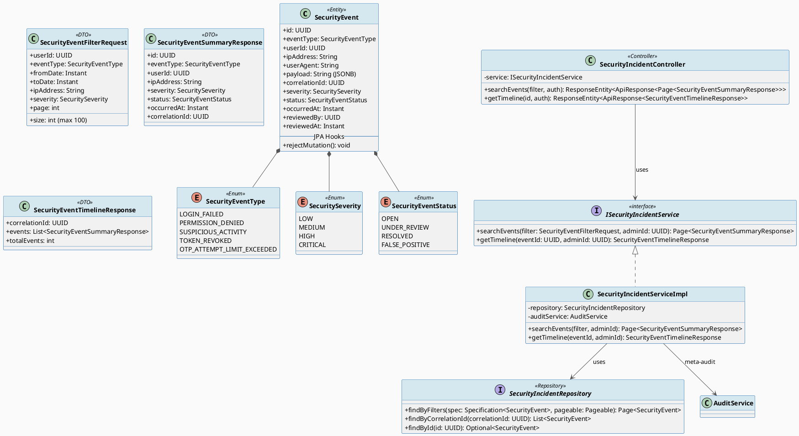
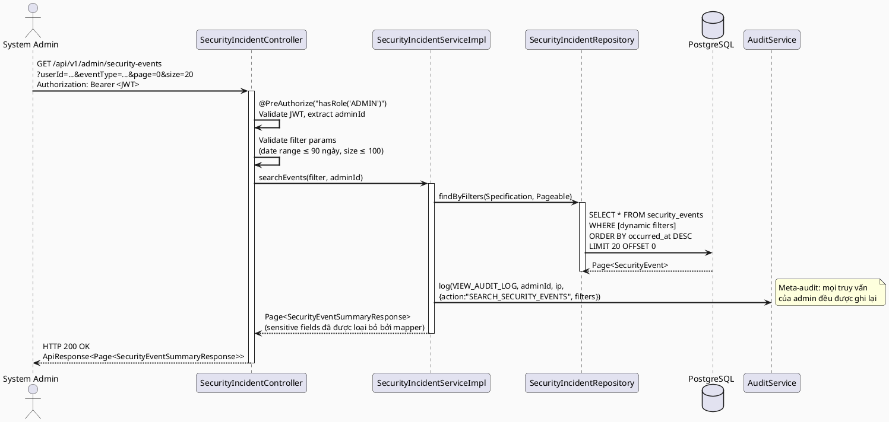
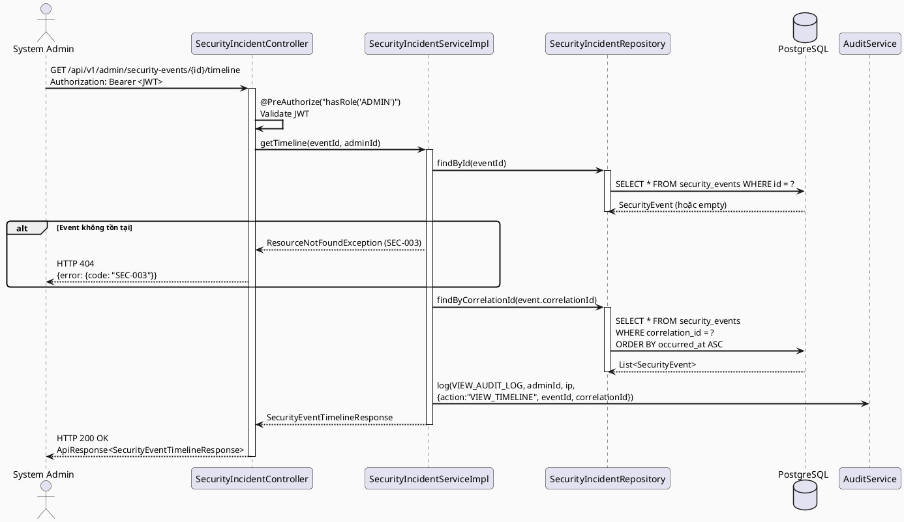
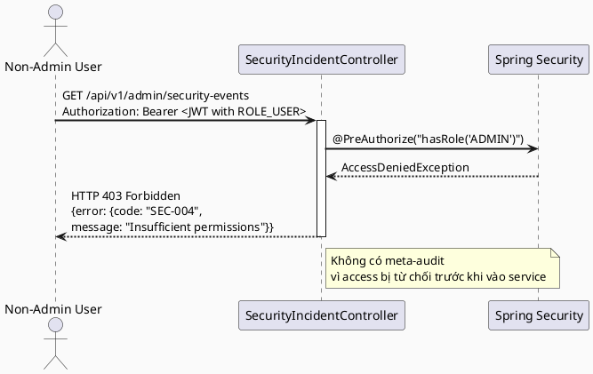

# ENGINEERING DOCUMENTATION STANDARD (EDS) v2.0
# UC-174 — Investigate Security Incident (Điều tra Sự cố Bảo mật)

| Field | Value |
|-------|-------|
| **Document ID** | `CB-SEC-IMP-001` |
| **Version** | `1.0` |
| **Date** | `2026-06-26` |
| **Status** | `Draft` |
| **Document Owner** | `PhuongNT` |
| **Author** | `AI Agent` |
| **Reviewed by** | `[Tech Lead]` |
| **DPO Sign-off** | `[ ] Pending` |
| **Approved by** | `[Principal Architect]` |
| **Last Review** | `2026-06-26` |
| **Based on EDS** | `v2.0` |

---

## CHANGELOG

> **Policy 4.4 — Immutable History:** Không bao giờ xóa thông tin cũ. Mọi thay đổi phải ghi vào bảng này.

| Ngày | Người thực hiện | Nội dung thay đổi |
|------|-----------------|-------------------|
| 2026-06-26 | AI Agent | Tạo tài liệu lần đầu cho UC-174 Investigate Security Incident |

---

## MỤC LỤC

1. [Tổng quan Module](#1-tổng-quan-module)
2. [Ma trận Truy vết (Traceability Matrix)](#2-ma-trận-truy-vết-traceability-matrix)
3. [Architecture Decision Records (ADR)](#3-architecture-decision-records-adr)
4. [Non-Functional Requirements & SLA](#4-non-functional-requirements--sla)
5. [Static Modeling (Mô hình Tĩnh)](#5-static-modeling-mô-hình-tĩnh)
6. [Dynamic Modeling (Mô hình Động)](#6-dynamic-modeling-mô-hình-động)
7. [Domain Event Catalog](#7-domain-event-catalog)
8. [Interface Specification (Đặc tả Giao diện)](#8-interface-specification-đặc-tả-giao-diện)
9. [API Specification](#9-api-specification)
10. [Bảng mã lỗi (Error Codes)](#10-bảng-mã-lỗi-error-codes)
11. [Quy trình Triển khai (Step-by-Step)](#11-quy-trình-triển-khai-step-by-step)
12. [Rollback & Incident Runbook](#12-rollback--incident-runbook)
13. [Kịch bản Kiểm thử Chi tiết](#13-kịch-bản-kiểm-thử-chi-tiết)
14. [Phương pháp Xác minh](#14-phương-pháp-xác-minh)
15. [Mẫu thử thực tế (API Verification Samples)](#15-mẫu-thử-thực-tế-api-verification-samples)
16. [Bảng tổng hợp phân quyền (Authorization Matrix)](#16-bảng-tổng-hợp-phân-quyền-authorization-matrix)
17. [AI Prompt Constraints (CASE 2.0)](#17-ai-prompt-constraints-case-20)

---

## 1. Tổng quan Module

> Module này cung cấp khả năng tìm kiếm, lọc và điều tra các sự cố bảo mật trong hệ thống CareBridge. System Admin có thể tra cứu toàn bộ nhật ký bảo mật theo nhiều tiêu chí khác nhau và xem timeline chi tiết của một sự cố theo `correlationId`.

| Field | Value |
|-------|-------|
| **Module Name** | `SecurityIncidentInvestigation` |
| **Use Case** | `UC-174` |
| **Bounded Context** | `audit` (security sub-domain) |
| **Package** | `com.carebridge.backend.audit` |
| **Data Classification** | `Confidential` |
| **Compliance Scope** | `GDPR Art. 32, PDPA` |
| **Primary Actor** | `System Admin (ROLE_ADMIN)` |
| **Platform** | `Admin Portal (web only)` |
| **Upstream Dependencies** | `IAM (JWT Auth), SecurityEventRepository` |
| **Downstream Consumers** | `UC-175 ReviewSecurityEvent, AdminDashboard` |

**Phạm vi nghiệp vụ:**
- Tìm kiếm và lọc sự kiện bảo mật theo: `userId`, `eventType`, `dateRange`, `ipAddress`, `severity`
- Xem timeline đầy đủ các sự kiện liên quan theo `correlationId`
- Toàn bộ thao tác tra cứu của admin đều được ghi nhận vào audit log (meta-audit)
- Tuyệt đối không cho phép xóa hoặc sửa đổi security events (append-only log)
- Các trường nhạy cảm (mật khẩu, token) không bao giờ xuất hiện trong response

---

## 2. Ma trận Truy vết (Traceability Matrix)

> **Policy:** Không viết code nếu không biết code đó phục vụ Rule nào.

| Requirement ID | Loại | Mô tả yêu cầu | Thành phần Code | Compliance Target | ADR liên quan |
|----------------|------|---------------|-----------------|-------------------|---------------|
| BR-SEC-001 | Business Rule | Chỉ ROLE_ADMIN mới được truy cập security events | `SecurityIncidentController` + `@PreAuthorize("hasRole('ADMIN')")` | GDPR Art. 25 | ADR-174-001 |
| BR-SEC-002 | Business Rule | Kết quả phân trang, tối đa 100 bản ghi mỗi trang | `SecurityIncidentService.searchEvents()` + `Pageable` | — | ADR-174-001 |
| BR-SEC-003 | Business Rule | Tất cả truy vấn admin đều được meta-audit | `SecurityIncidentService` → `AuditService.log()` | GDPR Art. 32 | ADR-174-001 |
| BR-SEC-004 | Business Rule | Security events không được sửa/xóa (append-only) | `SecurityEvent.@PreUpdate/@PreRemove` | GDPR Art. 5.1(e) | ADR-174-002 |
| BR-SEC-005 | Business Rule | Events > 7 năm được archive, không xóa | `SecurityEventArchiveJob` | GDPR Art. 5.1(e) | ADR-174-002 |
| BR-SEC-006 | Business Rule | Không expose trường nhạy cảm (hash, token) trong response | `SecurityEventResponseDto` mapper — exclude sensitive fields | GDPR Art. 5.1(c) | ADR-174-002 |
| BR-SEC-007 | Business Rule | Timeline theo correlationId hiển thị tất cả events liên quan | `SecurityIncidentRepository.findByCorrelationId()` | — | — |
| US-174-001 | User Story | Admin lọc events theo userId, eventType, dateRange, IP, severity | `GET /api/v1/admin/security-events` query params | — | — |
| US-174-002 | User Story | Admin xem timeline sự cố theo correlationId | `GET /api/v1/admin/security-events/{id}/timeline` | — | — |
| ADR-174-002 | Decision | Append-only audit log — không bao giờ xóa, chỉ archive | `SecurityEvent` entity + Flyway migration | GDPR Art. 5.1(e) | — |

---

## 3. Architecture Decision Records (ADR)

### ADR-174-001 — Sử dụng Pagination bắt buộc với giới hạn 100 bản ghi cho Security Event Query

| Field | Value |
|-------|-------|
| **Status** | `Accepted` |
| **Deciders** | `PhuongNT (Dev), [Tech Lead], [Principal Architect]` |
| **Date** | `2026-06-26` |
| **Supersedes** | `N/A` |

#### Bối cảnh (Context)
Bảng `security_events` có thể chứa hàng triệu bản ghi sau thời gian dài vận hành. Các truy vấn không giới hạn sẽ gây nghẽn cổ chai database, tăng thời gian response, và có nguy cơ DoS nội bộ khi admin thực hiện nhiều query đồng thời.

#### Các phương án đã xem xét

| Phương án | Mô tả | Ưu điểm | Nhược điểm |
|-----------|-------|----------|------------|
| A | Pagination bắt buộc, max 100/page | + Bảo vệ DB; + Nhất quán với chuẩn API hiện có | - Admin phải làm nhiều request nếu muốn xem toàn bộ |
| B | Không giới hạn, export CSV | + Admin xem được toàn bộ 1 lần | - Nguy cơ timeout/OOM; - Khó kiểm soát PII export |
| C | Cursor-based pagination | + Hiệu suất cao với dataset lớn | - Phức tạp hơn; - Khó hỗ trợ sort linh hoạt |

#### Quyết định (Decision)
Chọn **Phương án A** — Pagination bắt buộc với `page/size`, `maxSize = 100`. Sử dụng `Spring Data Pageable` kế thừa từ chuẩn hiện có trong `AuditController`.

#### Hệ quả (Consequences)

**Tích cực:**
- Bảo vệ database khỏi các query nặng
- Response time ổn định, đạt SLA p99 < 500ms
- Nhất quán với API pattern hiện có trong codebase

**Tiêu cực / Trade-offs:**
- Admin phải phân trang thủ công khi trace toàn bộ sự cố — giảm thiểu bằng cách cung cấp `timeline` endpoint riêng theo `correlationId`

**Compliance Impact:**
- Pagination giúp giảm thiểu rủi ro bulk PII export không được kiểm soát (GDPR Art. 25 — Data minimisation)

---

### ADR-174-002 — Append-Only Audit Log: Không bao giờ xóa Security Events, chỉ Archive

| Field | Value |
|-------|-------|
| **Status** | `Accepted` |
| **Deciders** | `PhuongNT (Dev), [Tech Lead], [DPO]` |
| **Date** | `2026-06-26` |
| **Supersedes** | `N/A` |

#### Bối cảnh (Context)
Security events là bằng chứng pháp lý quan trọng trong trường hợp xảy ra vi phạm bảo mật hoặc tranh chấp. GDPR Art. 5.1(e) và các quy định nội bộ yêu cầu lưu giữ audit trail tối thiểu 7 năm. Nếu cho phép DELETE, dữ liệu kiểm toán có thể bị xóa cố ý hoặc vô tình, vô hiệu hóa khả năng điều tra.

#### Các phương án đã xem xét

| Phương án | Mô tả | Ưu điểm | Nhược điểm |
|-----------|-------|----------|------------|
| A | Append-only: cấm UPDATE/DELETE qua JPA hooks | + Tuân thủ pháp lý; + Đơn giản, minh bạch | - Không thể sửa lỗi nhập liệu — giải quyết bằng cách thêm bản ghi correction |
| B | Soft-delete: thêm cờ `deleted_at` | + Linh hoạt hơn | - Dữ liệu vẫn có thể bị "ẩn" khỏi query thông thường; - Rủi ro pháp lý |
| C | Cho phép xóa với super-admin role | + Linh hoạt tối đa | - Không thể đảm bảo integrity audit trail; - Vi phạm GDPR Art. 5.1(e) |

#### Quyết định (Decision)
Chọn **Phương án A** — Append-only hoàn toàn. Thực thi qua `@PreUpdate`/`@PreRemove` JPA lifecycle hooks trong entity `SecurityEvent` (kế thừa pattern từ `AuditLog.rejectMutation()`). Events > 7 năm được move sang bảng `security_events_archive` bởi scheduled job.

#### Hệ quả (Consequences)

**Tích cực:**
- Đảm bảo toàn vẹn audit trail tuyệt đối
- Tuân thủ GDPR Art. 5.1(e) — storage limitation
- Bằng chứng pháp lý không thể bị can thiệp

**Tiêu cực / Trade-offs:**
- Không thể sửa security event đã ghi — giảm thiểu bằng cách đảm bảo validation chặt chẽ trước khi ghi
- Bảng ngày càng lớn — giải quyết bằng archive job định kỳ

**Compliance Impact:**
- Trực tiếp thỏa mãn GDPR Art. 5.1(e) — "storage limitation"
- Hỗ trợ GDPR Art. 33 — khả năng báo cáo vi phạm dữ liệu trong 72 giờ

---

## 4. Non-Functional Requirements & SLA

### 4.1. Performance & Availability

| Category | Requirement | Target SLA | Measurement Method | Compliance Basis |
|----------|-------------|------------|---------------------|------------------|
| Latency | API response (p99) — filter query | `< 500ms` | k6 load test trên 1M rows | — |
| Latency | API response (p99) — timeline query | `< 300ms` | k6 load test | — |
| Availability | Uptime (monthly) | `99.9%` | Uptime monitor | — |
| Throughput | Concurrent admin requests | `50 req/s` | Load test | — |

### 4.2. Data Integrity & Retention

| Category | Requirement | Target | Verification Method | Compliance Basis |
|----------|-------------|--------|---------------------|------------------|
| Durability | Zero security event loss | RPO = 0 | Transaction log + PostgreSQL WAL | GDPR Art. 5.1(f) |
| Retention | Security event retention | 7 năm (active) + archive | DB policy + archive job | GDPR Art. 5.1(e) |
| Immutability | Không có UPDATE/DELETE trên security_events | 100% | `@PreUpdate/@PreRemove` throw + DB test | ADR-174-002 |
| Meta-audit | 100% admin queries được audit | 100% | Reconciliation query | GDPR Art. 32 |

### 4.3. Security

| Category | Requirement | Target | Verification Method | Compliance Basis |
|----------|-------------|--------|---------------------|------------------|
| Encryption in transit | Tất cả endpoints | TLS 1.3+ | SSL Labs scan | GDPR Art. 32 |
| Access control | ROLE_ADMIN only | Least privilege | Auth Matrix (§16) | GDPR Art. 25 |
| Sensitive field exclusion | password_hash, tokens không trong response | 100% | Response schema test | GDPR Art. 5.1(c) |
| Rate limiting | Chống admin query abuse | 60 req/min/user | API gateway config | — |

### 4.4. Scalability & Capacity Planning

> Dự kiến: 10,000 security events/ngày, ~3.65M/năm. Partition bảng theo năm sau 12 tháng. Index trên `(event_type, occurred_at)` và `(user_id, occurred_at)` là bắt buộc.

---

## 5. Static Modeling (Mô hình Tĩnh)

### 5.1. Class Diagram (PlantUML)



### 5.2. Data Structure (PostgreSQL DDL)

> **Lưu ý:** Sử dụng PostgreSQL DDL thuần túy, không dùng Prisma. Flyway migration: `V2__security_events_enhanced.sql`.

```sql
-- ============================================================================
-- V2__security_events_enhanced.sql
-- Mở rộng bảng security_events hiện có và thêm bảng security_event_notes
-- ============================================================================

-- Thêm các cột mới vào bảng security_events hiện có
ALTER TABLE public.security_events
    ADD COLUMN IF NOT EXISTS user_agent        VARCHAR(500),
    ADD COLUMN IF NOT EXISTS payload           JSONB,
    ADD COLUMN IF NOT EXISTS correlation_id    UUID,
    ADD COLUMN IF NOT EXISTS severity          VARCHAR(20) NOT NULL DEFAULT 'MEDIUM'
                                               CONSTRAINT chk_severity CHECK (severity IN ('LOW','MEDIUM','HIGH','CRITICAL')),
    ADD COLUMN IF NOT EXISTS status            VARCHAR(20) NOT NULL DEFAULT 'OPEN'
                                               CONSTRAINT chk_status CHECK (status IN ('OPEN','UNDER_REVIEW','RESOLVED','FALSE_POSITIVE')),
    ADD COLUMN IF NOT EXISTS reviewed_by       UUID REFERENCES public.users(user_id),
    ADD COLUMN IF NOT EXISTS reviewed_at       TIMESTAMP(6) WITH TIME ZONE;

-- Đổi tên cột timestamp → occurred_at để đồng bộ với ERD
ALTER TABLE public.security_events
    RENAME COLUMN timestamp TO occurred_at;

-- Đổi kiểu PK từ BIGINT sang UUID để đồng bộ với chuẩn CareBridge
-- (Thực hiện qua bảng mới nếu migration phức tạp — xem rollback §12)
ALTER TABLE public.security_events
    ALTER COLUMN id SET DEFAULT gen_random_uuid();

-- ============================================================================
-- BẢNG: security_event_notes (append-only review notes)
-- ============================================================================
CREATE TABLE public.security_event_notes (
    note_id        UUID PRIMARY KEY DEFAULT gen_random_uuid(),
    event_id       UUID NOT NULL REFERENCES public.security_events(id) ON DELETE RESTRICT,
    author_id      UUID NOT NULL REFERENCES public.users(user_id),
    note_text      TEXT NOT NULL,
    created_at     TIMESTAMP(6) WITH TIME ZONE NOT NULL DEFAULT NOW(),
    -- Không có updated_at — append-only, immutable
    CONSTRAINT chk_note_text_not_empty CHECK (char_length(trim(note_text)) > 0)
);

-- ============================================================================
-- INDEXES
-- ============================================================================
CREATE INDEX IF NOT EXISTS idx_security_events_user_id
    ON public.security_events (user_id, occurred_at DESC);

CREATE INDEX IF NOT EXISTS idx_security_events_event_type
    ON public.security_events (event_type, occurred_at DESC);

CREATE INDEX IF NOT EXISTS idx_security_events_correlation_id
    ON public.security_events (correlation_id);

CREATE INDEX IF NOT EXISTS idx_security_events_ip_address
    ON public.security_events (ip_address);

CREATE INDEX IF NOT EXISTS idx_security_events_status_severity
    ON public.security_events (status, severity);

CREATE INDEX IF NOT EXISTS idx_security_event_notes_event_id
    ON public.security_event_notes (event_id, created_at DESC);

-- ============================================================================
-- ROW LEVEL SECURITY (tuỳ chọn — chỉ ROLE_ADMIN đọc được)
-- ============================================================================
-- ALTER TABLE public.security_events ENABLE ROW LEVEL SECURITY;
-- (Kích hoạt khi chuyển sang multi-tenant nếu cần)

COMMENT ON TABLE public.security_events IS
    'Append-only security event log. No UPDATE/DELETE allowed. Archive after 7 years.';
COMMENT ON TABLE public.security_event_notes IS
    'Append-only review notes for security events. Immutable history.';
```

---

## 6. Dynamic Modeling (Mô hình Động)

### 6.1. Sequence Diagram — Happy Path: Search Security Events



### 6.2. Sequence Diagram — Happy Path: Get Timeline



### 6.3. Sequence Diagram — Error Path: Non-Admin Access



---

## 7. Domain Event Catalog

### 7.1. Events Published (Phát ra)

| Event Name | Trigger | Publisher | Subscriber(s) | Payload Schema | Async? |
|------------|---------|-----------|---------------|----------------|--------|
| `SecurityIncidentQueried` | Admin tìm kiếm security events | `SecurityIncidentServiceImpl` | `AuditService` | Xem 7.3 | No (synchronous meta-audit) |

### 7.2. Events Consumed (Tiêu thụ)

| Event Name | Source | Handler | Action thực hiện |
|------------|--------|---------|------------------|
| N/A | — | — | UC-174 chỉ đọc dữ liệu, không subscribe event từ module khác |

### 7.3. Payload Schema

```java
// SecurityIncidentQueried — ghi vào audit_logs
// Payload được serialize thành JSON và lưu vào audit_logs.new_value_json

public record SecurityIncidentQueriedPayload(
    String action,          // "SEARCH_SECURITY_EVENTS" | "VIEW_TIMELINE"
    UUID adminId,           // ID của admin thực hiện truy vấn
    String ipAddress,       // IP của admin
    Map<String, Object> appliedFilters,  // Các filter đã áp dụng
    int resultCount,        // Số kết quả trả về
    Instant queriedAt       // Thời điểm thực hiện truy vấn
)
```

---

## 8. Interface Specification (Đặc tả Giao diện)

> **Policy (EDS v2.0):** Mỗi interface phải khai báo `@version`. Mọi breaking change phải tạo ADR mới.

### 8.1. Service Interface

```java
package com.carebridge.backend.audit.service;

/**
 * Đặc tả dịch vụ điều tra sự cố bảo mật.
 * @version 1.0
 * @since CB-SEC-IMP-001
 */
public interface ISecurityIncidentService {

    /**
     * Tìm kiếm và lọc security events theo nhiều tiêu chí.
     * Tự động ghi meta-audit cho mọi lần gọi.
     *
     * @param filter  Các tham số lọc (nullable fields = bỏ qua filter đó)
     * @param adminId UUID của admin đang thực hiện truy vấn (từ JWT)
     * @param pageable Pagination params (max size = 100 enforce tại service layer)
     * @return Trang kết quả SecurityEventSummaryResponse
     * @throws AuthorizationException (SEC-004) khi không có quyền ADMIN
     */
    org.springframework.data.domain.Page<
        com.carebridge.backend.audit.dto.response.SecurityEventSummaryResponse>
    searchEvents(
        com.carebridge.backend.audit.dto.request.SecurityEventFilterRequest filter,
        java.util.UUID adminId,
        org.springframework.data.domain.Pageable pageable
    );

    /**
     * Lấy timeline đầy đủ của sự cố bảo mật theo correlationId của event gốc.
     * Tự động ghi meta-audit.
     *
     * @param eventId  UUID của security event muốn xem timeline
     * @param adminId  UUID của admin đang truy vấn
     * @return SecurityEventTimelineResponse chứa toàn bộ events cùng correlationId
     * @throws ResourceNotFoundException (SEC-003) khi eventId không tồn tại
     * @throws AuthorizationException (SEC-004) khi không có quyền ADMIN
     */
    com.carebridge.backend.audit.dto.response.SecurityEventTimelineResponse
    getTimeline(java.util.UUID eventId, java.util.UUID adminId);
}
```

### 8.2. Repository Interface

```java
package com.carebridge.backend.audit.repository;

import com.carebridge.backend.audit.entity.SecurityEvent;
import org.springframework.data.domain.Page;
import org.springframework.data.domain.Pageable;
import org.springframework.data.jpa.domain.Specification;
import org.springframework.data.jpa.repository.JpaRepository;
import org.springframework.data.jpa.repository.JpaSpecificationExecutor;
import org.springframework.stereotype.Repository;
import java.util.List;
import java.util.UUID;

/**
 * Repository cho SecurityEvent — KHÔNG có phương thức DELETE.
 * Append-only theo ADR-174-002.
 * @version 1.0
 */
@Repository
public interface SecurityIncidentRepository
    extends JpaRepository<SecurityEvent, UUID>,
            JpaSpecificationExecutor<SecurityEvent> {

    /**
     * Lấy toàn bộ events cùng correlationId, sắp xếp theo thời gian tăng dần.
     */
    List<SecurityEvent> findByCorrelationIdOrderByOccurredAtAsc(UUID correlationId);

    // Lưu ý: Không khai báo deleteById() hoặc bất kỳ method delete nào.
    // deleteById() từ JpaRepository bị vô hiệu hóa qua @PreRemove ở entity.
}
```

---

## 9. API Specification

### 9.1. Endpoints Table

| Method | Path | Auth Level | Required Roles | Rate Limit | Idempotent? |
|--------|------|------------|----------------|------------|-------------|
| `GET` | `/api/v1/admin/security-events` | JWT Bearer | `ROLE_ADMIN` | 60/min | Yes |
| `GET` | `/api/v1/admin/security-events/{id}/timeline` | JWT Bearer | `ROLE_ADMIN` | 60/min | Yes |

### 9.2. Request / Response Schemas

#### `GET /api/v1/admin/security-events` — Tìm kiếm Security Events

**Query Parameters:**

| Param | Type | Required | Mô tả | Constraint |
|-------|------|----------|-------|------------|
| `userId` | UUID | No | Lọc theo userId | Valid UUID format |
| `eventType` | String (Enum) | No | Lọc theo loại sự kiện | Giá trị hợp lệ trong SecurityEventType |
| `fromDate` | ISO 8601 DateTime | No | Từ ngày | Phải ≤ toDate |
| `toDate` | ISO 8601 DateTime | No | Đến ngày | Phải ≥ fromDate |
| `ipAddress` | String | No | Lọc theo IP address | IPv4 hoặc IPv6 format |
| `severity` | String (Enum) | No | Lọc theo mức độ nghiêm trọng | LOW/MEDIUM/HIGH/CRITICAL |
| `page` | int | No | Số trang (0-based) | Default: 0 |
| `size` | int | No | Kích thước trang | Default: 20, Max: 100 |

**Response — 200 OK (Happy Path):**
```json
{
  "success": true,
  "data": {
    "content": [
      {
        "id": "550e8400-e29b-41d4-a716-446655440001",
        "eventType": "LOGIN_FAILED",
        "userId": "550e8400-e29b-41d4-a716-446655440002",
        "ipAddress": "192.168.1.100",
        "severity": "MEDIUM",
        "status": "OPEN",
        "occurredAt": "2026-06-26T10:00:00.000Z",
        "correlationId": "550e8400-e29b-41d4-a716-446655440003"
      }
    ],
    "page": 0,
    "size": 20,
    "totalElements": 150,
    "totalPages": 8
  }
}
```

**Response — 400 Bad Request (Invalid Filter):**
```json
{
  "success": false,
  "error": {
    "code": "SEC-001",
    "message": "Tham số lọc không hợp lệ",
    "details": [
      { "field": "fromDate", "message": "fromDate phải nhỏ hơn hoặc bằng toDate" }
    ]
  }
}
```

**Response — 403 Forbidden:**
```json
{
  "success": false,
  "error": {
    "code": "SEC-004",
    "message": "Không đủ quyền truy cập"
  }
}
```

#### `GET /api/v1/admin/security-events/{id}/timeline` — Xem Timeline Sự cố

**Path Parameters:**
- `id` (UUID): ID của security event gốc muốn xem timeline

**Response — 200 OK:**
```json
{
  "success": true,
  "data": {
    "correlationId": "550e8400-e29b-41d4-a716-446655440003",
    "totalEvents": 5,
    "events": [
      {
        "id": "550e8400-e29b-41d4-a716-446655440001",
        "eventType": "LOGIN_FAILED",
        "userId": "550e8400-e29b-41d4-a716-446655440002",
        "ipAddress": "192.168.1.100",
        "severity": "MEDIUM",
        "status": "OPEN",
        "occurredAt": "2026-06-26T10:00:00.000Z",
        "correlationId": "550e8400-e29b-41d4-a716-446655440003"
      }
    ]
  }
}
```

**Response — 404 Not Found:**
```json
{
  "success": false,
  "error": {
    "code": "SEC-003",
    "message": "Không tìm thấy security event với ID đã cho"
  }
}
```

---

## 10. Bảng mã lỗi (Error Codes)

| Code | HTTP Status | Message (EN) | Message (VI) | Trigger Condition |
|------|-------------|--------------|--------------|-------------------|
| `SEC-001` | 400 | Invalid filter parameters | Tham số lọc không hợp lệ | fromDate > toDate; eventType không hợp lệ; size > 100 |
| `SEC-002` | 400 | Invalid UUID format | Định dạng UUID không hợp lệ | userId hoặc id không phải UUID hợp lệ |
| `SEC-003` | 404 | Security event not found | Không tìm thấy sự kiện bảo mật | ID không tồn tại trong DB |
| `SEC-004` | 403 | Insufficient permissions | Không đủ quyền truy cập | Người dùng không có ROLE_ADMIN |
| `SEC-005` | 401 | Authentication required | Yêu cầu xác thực | Không có hoặc JWT không hợp lệ |
| `SEC-006` | 500 | Security audit query failed | Lỗi truy vấn nhật ký bảo mật | Lỗi DB không mong đợi khi query |

---

## 11. Quy trình Triển khai (Step-by-Step)

### 11.1. Prerequisites

- [ ] ADR-174-001 và ADR-174-002 đã được Accepted
- [ ] DPO đã sign-off (module xử lý Confidential data)
- [ ] Principal Architect đã approve blueprint
- [ ] Môi trường staging đã sẵn sàng và có dữ liệu test synthetic

### 11.2. Pre-Migration Checklist

- [ ] Đã backup DB production: `pg_dump -h [host] -U [user] carebridge > backup_20260626.sql`
- [ ] Migration V2 đã chạy thành công trên staging ≥ 24 giờ
- [ ] Rollback script đã được test trên staging (xem §12)
- [ ] Verify bảng `security_events` hiện có dữ liệu: `SELECT COUNT(*) FROM security_events;`

### 11.3. Implementation Steps

#### Chặng 1 — Flyway Migration

```bash
# Đặt file migration vào đúng vị trí
# Path: src/main/resources/db/migration/V2__security_events_enhanced.sql
# Chạy migration qua Maven:
./mvnw flyway:migrate -pl 05_Development/CareBridgeAPI
```

> ⚠️ **Chú ý:** Migration ALTER TABLE trên `security_events` có thể lock table ngắn. Chạy trong giờ thấp tải.

#### Chặng 2 — Cập nhật Entity SecurityEvent

Cập nhật `com.carebridge.backend.audit.entity.SecurityEvent` để thêm các field mới (`userAgent`, `payload`, `correlationId`, `severity`, `status`, `reviewedBy`, `reviewedAt`) và thêm `@PreUpdate`/`@PreRemove` hooks.

#### Chặng 3 — Tạo các lớp mới

Thứ tự tạo:
1. `SecuritySeverity` enum
2. `SecurityEventStatus` enum
3. `SecurityEventNote` entity
4. `SecurityEventFilterRequest` DTO
5. `SecurityEventSummaryResponse` DTO
6. `SecurityEventTimelineResponse` DTO
7. `SecurityEventMapper` (dùng MapStruct)
8. `SecurityIncidentRepository` interface (extends `JpaSpecificationExecutor`)
9. `ISecurityIncidentService` interface
10. `SecurityIncidentServiceImpl` implementation
11. `SecurityIncidentController`

#### Chặng 4 — Verification sau deploy

```bash
# Health check
curl -X GET https://[host]/api/v1/health
# Expected: {"status": "ok"}

# Test endpoint với valid admin JWT
curl -X GET "https://[host]/api/v1/admin/security-events?page=0&size=5" \
  -H "Authorization: Bearer [ADMIN_JWT]"
# Expected: HTTP 200

# Verify meta-audit được ghi
# Chạy SQL verify (xem §14)
```

### 11.4. Deployment Checklist

- [ ] Migration V2 chạy thành công (Flyway schema_history có entry V2)
- [ ] Health check trả về 200
- [ ] Error rate < 1% trong 10 phút đầu
- [ ] Thử GET `/api/v1/admin/security-events` với non-admin → nhận 403
- [ ] Meta-audit log đang ghi khi admin query (kiểm tra bảng `audit_logs`)
- [ ] Thông báo DPO về deploy (module Confidential data)

---

## 12. Rollback & Incident Runbook

### 12.1. Điều kiện kích hoạt Rollback

| Điều kiện | Ngưỡng | Người quyết định |
|-----------|--------|------------------|
| Error rate tăng đột biến | > 5% trong 5 phút | On-call Engineer |
| Latency p99 vượt ngưỡng | > 1000ms (2x baseline) | On-call Engineer |
| Migration thất bại hoặc data corruption | Bất kỳ case nào | Tech Lead + DPO |
| Security event bị xóa/sửa đổi | Bất kỳ case nào | Tech Lead + DPO + CEO |

### 12.2. Rollback Procedure

```bash
# Bước 1: Revert Flyway migration V2
# Chạy script rollback (phải chuẩn bị trước khi deploy):
psql -h [host] -U [user] -d carebridge -c "
  ALTER TABLE public.security_events
    DROP COLUMN IF EXISTS user_agent,
    DROP COLUMN IF EXISTS payload,
    DROP COLUMN IF EXISTS correlation_id,
    DROP COLUMN IF EXISTS severity,
    DROP COLUMN IF EXISTS status,
    DROP COLUMN IF EXISTS reviewed_by,
    DROP COLUMN IF EXISTS reviewed_at;
  DROP TABLE IF EXISTS public.security_event_notes;
  ALTER TABLE public.security_events RENAME COLUMN occurred_at TO timestamp;
"

# Bước 2: Re-deploy phiên bản cũ
# (qua CI/CD pipeline hoặc kubectl rollout undo)

# Bước 3: Verify rollback
curl -X GET https://[host]/api/v1/health
# Expected: {"status": "ok"}

# Bước 4: Verify security_events table structure
psql -h [host] -U [user] -d carebridge -c "\d security_events"
```

### 12.3. Notification Protocol

| Thời điểm | Người nhận | Kênh | Template |
|-----------|------------|------|----------|
| Ngay khi phát hiện | On-call team | Slack `#incident` | "INCIDENT [SEC-AUDIT]: security event query anomaly detected" |
| Trong 30 phút | DPO | Email | Bắt buộc nếu security data bị ảnh hưởng |
| Trong 72 giờ | DPA | Email | Bắt buộc nếu có khả năng data breach |

### 12.4. Post-Incident Review (PIR)

> Bắt buộc hoàn thành PIR document trong vòng **48 giờ** sau khi incident được resolve.

- **Timeline:** Diễn biến từng bước
- **Root Cause:** 5 Whys analysis
- **Impact:** Số admin affected, thời gian downtime, có security data exposure không?
- **Remediation:** Các bước đã thực hiện
- **Prevention:** Action items

---

## 13. Kịch bản Kiểm thử Chi tiết

> **Policy:** Mọi test scenario phải dùng dữ liệu SYNTHETIC. Tuyệt đối không dùng Production PII.

### 13.1. Unit Tests

#### TC-UNIT-174-001 — Tìm kiếm thành công với filter hợp lệ

```gherkin
Feature: SearchSecurityEvents — Happy Path
  Background:
    Given test data classification: SYNTHETIC
    And database có 50 security events synthetic
    And admin user có ROLE_ADMIN với JWT hợp lệ

  Scenario: Admin tìm kiếm theo eventType thành công
    Given filter: eventType=LOGIN_FAILED, page=0, size=20
    When SecurityIncidentServiceImpl.searchEvents() được gọi
    Then kết quả trả về Page<SecurityEventSummaryResponse>
    And tất cả events trong kết quả có eventType=LOGIN_FAILED
    And response không chứa trường password_hash hoặc token
    And AuditService.log() được gọi 1 lần với action=VIEW_AUDIT_LOG

  Scenario: Filter với khoảng ngày hợp lệ
    Given filter: fromDate=2026-06-01, toDate=2026-06-26
    When searchEvents() được gọi
    Then tất cả events có occurredAt trong khoảng [fromDate, toDate]
```

**Hàm được test:** `SecurityIncidentServiceImpl.searchEvents()`
**Invariant kiểm tra:** Response không chứa sensitive fields; meta-audit luôn được ghi

#### TC-UNIT-174-002 — Phân trang đúng giới hạn

```gherkin
  Scenario: Size vượt quá 100 bị reject tại service layer
    Given filter với size=200
    When searchEvents() được gọi
    Then service enforce size=100 (không throw exception, tự clamp)
    And Page trả về có size ≤ 100

  Scenario: Phân trang trả về đúng trang thứ 2
    Given database có 50 records LOGIN_FAILED
    And filter: eventType=LOGIN_FAILED, page=1, size=20
    When searchEvents() được gọi
    Then kết quả có 20 records (records 21-40)
    And totalElements=50, totalPages=3
```

### 13.2. Integration Tests

#### TC-INT-174-001 — Meta-audit được ghi vào database

```gherkin
  Scenario: Admin query security events → audit_logs phải có entry
    Given test data classification: SYNTHETIC
    And database đang chạy (Testcontainers PostgreSQL)
    And admin JWT hợp lệ cho user adminId="test-admin-uuid"
    When GET /api/v1/admin/security-events?page=0&size=5 được gọi
    Then response status là 200
    And bảng audit_logs có 1 bản ghi mới với:
      | actor_user_id | "test-admin-uuid"         |
      | action        | VIEW_AUDIT_LOG            |
      | entity_type   | SECURITY_EVENT_QUERY      |
```

### 13.3. E2E / Security Tests

#### TC-E2E-174-001 — Non-admin bị từ chối truy cập

```gherkin
  Scenario: User thường (ROLE_USER) cố truy cập security events
    Given test data classification: SYNTHETIC
    And user có ROLE_USER với JWT hợp lệ
    When GET /api/v1/admin/security-events được gọi với JWT đó
    Then response status là 403
    And response body chứa error code "SEC-004"
    And audit_logs KHÔNG có entry mới (access bị chặn trước service)

  Scenario: Request không có JWT
    Given không có Authorization header
    When GET /api/v1/admin/security-events được gọi
    Then response status là 401
    And response body chứa error code "SEC-005"
```

#### TC-SEC-174-001 — Sensitive fields không xuất hiện trong response

```gherkin
  Scenario: Response không được chứa password/token fields
    Given security_events table có dữ liệu synthetic với payload JSONB
    And payload chứa trường "attempted_password_hash"
    When admin GET /api/v1/admin/security-events
    Then response body không chứa chuỗi "password"
    And response body không chứa chuỗi "token"
    And response body không chứa chuỗi "hash"
```

---

## 14. Phương pháp Xác minh

### 14.1. Database Inspection

```sql
-- Verify meta-audit được ghi sau khi admin query
SELECT audit_log_id, actor_user_id, action, entity_type, created_at
FROM audit_logs
WHERE action = 'VIEW_AUDIT_LOG'
  AND entity_type = 'SECURITY_EVENT_QUERY'
ORDER BY created_at DESC
LIMIT 10;

-- Verify security_events là append-only (không có UPDATE nào)
-- Nếu có hàng nào trả về, đó là vi phạm nghiêm trọng
SELECT schemaname, tablename, n_tup_upd, n_tup_del
FROM pg_stat_user_tables
WHERE tablename = 'security_events';
-- Expected: n_tup_upd = 0, n_tup_del = 0

-- Verify indexes tồn tại sau migration
SELECT indexname, indexdef
FROM pg_indexes
WHERE tablename = 'security_events'
  AND indexname LIKE 'idx_security_events_%';

-- Verify sensitive fields không có trong view/materialized view
SELECT column_name
FROM information_schema.columns
WHERE table_name = 'security_events'
  AND column_name IN ('password_hash', 'raw_token', 'secret');
-- Expected: 0 rows
```

### 14.2. Log / Audit Verification

```bash
# Kiểm tra meta-audit log khi admin query
kubectl logs -l app=carebridge-api | grep '"action":"VIEW_AUDIT_LOG"' | grep '"entityType":"SECURITY_EVENT_QUERY"' | tail -5

# Verify không có PII nhạy cảm trong application log
kubectl logs -l app=carebridge-api | grep -iE "password|secret|token_value|hash" | grep -v "audit"
# Expected: No dangerous output

# Verify TLS
openssl s_client -connect [host]:443 -tls1_3 2>&1 | grep "Protocol"
# Expected: Protocol : TLSv1.3
```

### 14.3. Flyway Migration Verification

```bash
# Verify migration V2 đã chạy thành công
./mvnw flyway:info -pl 05_Development/CareBridgeAPI | grep V2
# Expected: V2 | security_events_enhanced | Success | ...

# Verify table structure sau migration
psql -h [host] -U [user] -d carebridge -c "\d+ security_events"
# Expected: Có đủ cột: user_agent, payload, correlation_id, severity, status, reviewed_by, reviewed_at
```

---

## 15. Mẫu thử thực tế (API Verification Samples)

### 15.1. Happy Path — Tìm kiếm Security Events

```bash
# Tìm kiếm tất cả LOGIN_FAILED events trong 24 giờ qua
curl -X GET "https://[host]/api/v1/admin/security-events?eventType=LOGIN_FAILED&fromDate=2026-06-25T00:00:00Z&toDate=2026-06-26T23:59:59Z&page=0&size=20" \
  -H "Authorization: Bearer [ADMIN_JWT]" \
  -H "X-Correlation-Id: $(uuidgen)"
```

**Expected Response (200):**
```json
{
  "success": true,
  "data": {
    "content": [...],
    "page": 0,
    "size": 20,
    "totalElements": 42,
    "totalPages": 3
  }
}
```

### 15.2. Happy Path — Xem Timeline

```bash
curl -X GET "https://[host]/api/v1/admin/security-events/550e8400-e29b-41d4-a716-446655440001/timeline" \
  -H "Authorization: Bearer [ADMIN_JWT]"
```

### 15.3. Error Paths

```bash
# fromDate > toDate → 400
curl -X GET "https://[host]/api/v1/admin/security-events?fromDate=2026-06-26T00:00:00Z&toDate=2026-06-25T00:00:00Z" \
  -H "Authorization: Bearer [ADMIN_JWT]"
```

**Expected (400):**
```json
{
  "success": false,
  "error": {
    "code": "SEC-001",
    "message": "Tham số lọc không hợp lệ",
    "details": [{ "field": "fromDate", "message": "fromDate phải nhỏ hơn hoặc bằng toDate" }]
  }
}
```

```bash
# Non-admin JWT → 403
curl -X GET "https://[host]/api/v1/admin/security-events" \
  -H "Authorization: Bearer [USER_JWT]"
```

**Expected (403):**
```json
{
  "success": false,
  "error": { "code": "SEC-004", "message": "Không đủ quyền truy cập" }
}
```

---

## 16. Bảng tổng hợp phân quyền (Authorization Matrix)

> **Nguyên tắc Least Privilege:** Chỉ ROLE_ADMIN mới có quyền truy cập bất kỳ endpoint nào trong module này.

| Endpoint | `GUEST` | `ROLE_USER` | `ROLE_EXPERT` | `ROLE_PARTNER` | `ROLE_ADMIN` | `ROLE_SYSTEM` |
|----------|---------|-------------|---------------|----------------|--------------|---------------|
| `GET /api/v1/admin/security-events` | ❌ | ❌ | ❌ | ❌ | ✅ | ❌ |
| `GET /api/v1/admin/security-events/{id}/timeline` | ❌ | ❌ | ❌ | ❌ | ✅ | ❌ |

**Chú thích:**
- ✅ = Được phép truy cập đầy đủ
- ❌ = Bị từ chối (HTTP 403 hoặc 401)
- `ROLE_SYSTEM` không được phép truy cập Admin Portal endpoints
- Không có endpoint nào cho phép truy cập public (GUEST)
- Tất cả endpoint đều yêu cầu JWT Bearer token hợp lệ (401 nếu thiếu)

**Enforcement mechanism:** `@PreAuthorize("hasRole('ADMIN')")` tại controller level, kết hợp Spring Security filter chain.

---

## 17. AI Prompt Constraints (CASE 2.0)

> ⭐⭐ **Section cốt lõi — CASE 2.0.**
> Đoạn text trong section này được **inject trực tiếp** vào AI prompt khi implement module.

### 17.1 Constraint Summary Table

| # | Constraint | Source (ADR/BR) | Last Verified |
|---|-----------|-----------------|---------------|
| C1 | Chỉ ROLE_ADMIN mới truy cập được. Dùng `@PreAuthorize("hasRole('ADMIN')")` tại controller. Không tự phát minh cơ chế auth khác. | `ADR-174-001`, `BR-SEC-001` | `2026-06-26` |
| C2 | KHÔNG BAO GIỜ thêm phương thức `delete`, `update`, hoặc `remove` vào `SecurityIncidentRepository` hoặc bất kỳ repository nào thao tác với `security_events`. Append-only là bất biến tuyệt đối. | `ADR-174-002`, `BR-SEC-004` | `2026-06-26` |
| C3 | KHÔNG BAO GIỜ expose các trường: `passwordHash`, `rawToken`, `secretKey`, `otpCode`, `sessionSecret` trong bất kỳ DTO response nào. Mapper phải explicitly exclude các trường này. | `BR-SEC-006` | `2026-06-26` |
| C4 | Mọi lần gọi `searchEvents()` hoặc `getTimeline()` PHẢI ghi meta-audit vào `audit_logs` thông qua `AuditService.log()` với action `VIEW_AUDIT_LOG`. Không được bỏ qua bước này dù có exception. | `BR-SEC-003` | `2026-06-26` |
| C5 | Page size PHẢI được clamp tại `Math.min(requestedSize, 100)` tại service layer. Không tin vào client để tự giới hạn. | `ADR-174-001`, `BR-SEC-002` | `2026-06-26` |
| C6 | AdminId PHẢI được lấy từ JWT SecurityContext, KHÔNG được lấy từ request body hoặc query param. Dùng `SecurityContextHolder.getContext().getAuthentication()`. | `BR-SEC-001` | `2026-06-26` |
| C7 | Dùng `JpaSpecificationExecutor` cho dynamic filtering — KHÔNG dùng raw JPQL string nối chuỗi (SQL injection risk). | `ADR-174-001` | `2026-06-26` |

### 17.2 Constraint Injection Block (Copy-Paste vào AI Prompt)

```
[CONSTRAINT BLOCK — Module: SecurityIncidentInvestigation (UC-174)]
Theo TDS CB-SEC-IMP-001 và các ADR liên quan:

1. (C1) Chỉ ROLE_ADMIN được truy cập. Dùng @PreAuthorize("hasRole('ADMIN')") tại controller.
2. (C2) KHÔNG thêm delete/update vào SecurityIncidentRepository. Append-only tuyệt đối (ADR-174-002).
3. (C3) Mapper PHẢI exclude: passwordHash, rawToken, secretKey, otpCode, sessionSecret khỏi mọi response DTO.
4. (C4) Mọi searchEvents/getTimeline call PHẢI ghi meta-audit qua AuditService.log(VIEW_AUDIT_LOG).
5. (C5) Page size clamp tại service: Math.min(size, 100). Không tin client.
6. (C6) AdminId từ JWT SecurityContext, KHÔNG từ request param.
7. (C7) Dùng JpaSpecificationExecutor cho dynamic filter, không string-concat JPQL.

[CONTEXT BLOCK]
- Package: com.carebridge.backend.audit
- Bounded Context: audit (security sub-domain)
- Data Classification: Confidential
- Compliance: GDPR Art. 32, PDPA
- Existing: SecurityEvent entity, SecurityEventType enum, AuditService
- Error codes: §10 (tiền tố SEC-)
- Auth matrix: §16 — ROLE_ADMIN only

[TASK BLOCK]
Implement ISecurityIncidentService và SecurityIncidentController thỏa mãn constraints trên.
Output phải tuân thủ §8 Interface Specification.
Tests phải cover §13 Test Scenarios (tối thiểu TC-UNIT-174-001, TC-UNIT-174-002, TC-INT-174-001, TC-E2E-174-001, TC-SEC-174-001).
```

### 17.3 Constraint Quality Checklist

- [x] Mỗi constraint traceable về ADR hoặc BR cụ thể
- [x] Không có constraint generic (tất cả đều actionable)
- [x] Mỗi constraint có `Last Verified` date (2026-06-26 ≤ 2 sprints)
- [x] Constraint block có 7 constraints cụ thể (> 3 yêu cầu tối thiểu)
- [x] Constraint block reference §8 Interface
- [x] Constraint block reference §16 Auth Matrix

### 17.4 Anti-Pattern Detection

| AP-ID | Anti-Pattern | Dấu hiệu | Hành động |
|-------|-------------|-----------|----------|
| AP-AI-001 | Unconstrained Gen | Code không check ROLE_ADMIN | Reject — inject C1 lại |
| AP-AI-002 | Delete allowed | Code có `deleteById` hoặc `DELETE` query | Reject ngay — vi phạm ADR-174-002 |
| AP-AI-003 | Sensitive field leak | Response DTO có trường `token`/`password`/`hash` | Reject — inject C3 lại |
| AP-AI-004 | No meta-audit | Service không gọi AuditService | Reject — inject C4 lại |
| AP-AI-005 | AdminId from request | Code dùng `@RequestParam adminId` thay vì SecurityContext | Reject — inject C6 lại |
| AP-AI-006 | String-concat JPQL | Code dùng `"WHERE " + filter` | Reject — inject C7, dùng Specification |

---

## PHỤ LỤC

### A. Glossary

| Thuật ngữ | Định nghĩa |
|-----------|------------|
| Security Event | Sự kiện bảo mật được ghi nhận bởi hệ thống (login fail, permission denied, v.v.) |
| Meta-audit | Audit của chính hoạt động audit — ghi lại khi admin xem audit logs |
| Append-only | Chiến lược lưu trữ chỉ cho phép INSERT, nghiêm cấm UPDATE/DELETE |
| correlationId | UUID dùng để nhóm các events liên quan thành một incident |
| Severity | Mức độ nghiêm trọng: LOW / MEDIUM / HIGH / CRITICAL |
| DPO | Data Protection Officer |
| GDPR Art. 5.1(e) | Nguyên tắc "storage limitation" — không lưu dữ liệu lâu hơn cần thiết |
| GDPR Art. 32 | Yêu cầu bảo mật kỹ thuật và tổ chức phù hợp |

### B. Tài liệu tham chiếu

| Document | Link / Path |
|----------|-------------|
| UC-174 Requirements | `02_Requirements/SRS/` |
| UC-175 TDS (liên quan) | `04_Implement/UC175_ReviewSecurityEvent/UC175_ReviewSecurityEvent_TDS.md` |
| AuditLog Entity (pattern) | `05_Development/CareBridgeAPI/src/main/java/com/carebridge/backend/audit/entity/AuditLog.java` |
| SecurityEvent Entity | `05_Development/CareBridgeAPI/src/main/java/com/carebridge/backend/audit/entity/SecurityEvent.java` |
| Flyway Migration V1 | `05_Development/CareBridgeAPI/src/main/resources/db/migration/V1__init_schema.sql` |
| CASE 2.0 Methodology | `08_References/` |
