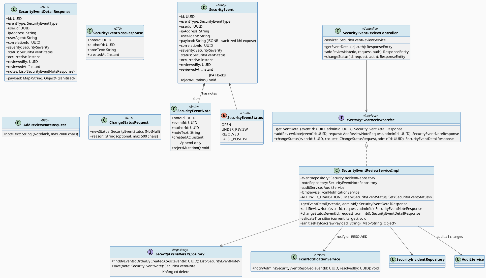
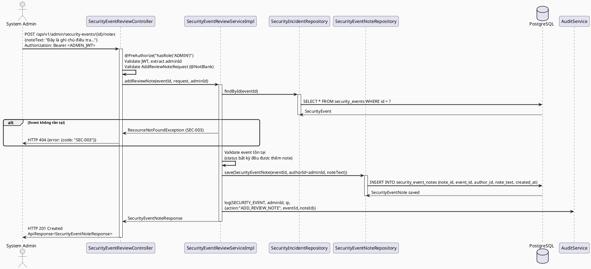
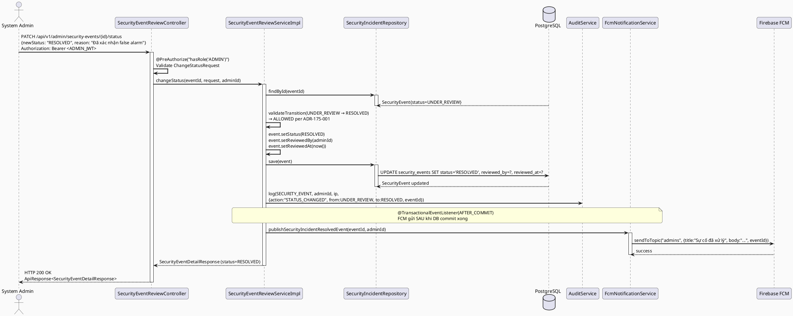
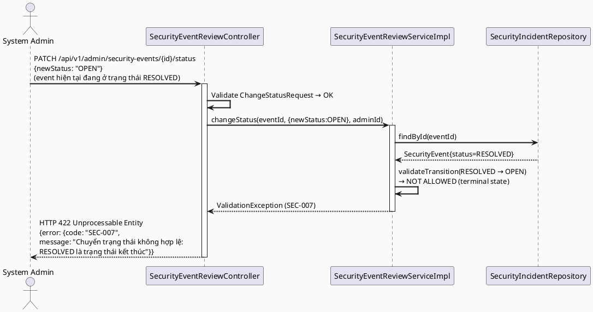
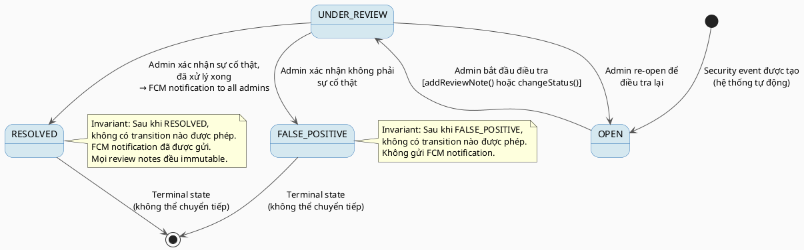

# ENGINEERING DOCUMENTATION STANDARD (EDS) v2.0
# UC-175 — Review Security Event (Xét duyệt Sự kiện Bảo mật)

| Field | Value |
|-------|-------|
| **Document ID** | `CB-SEC-IMP-002` |
| **Version** | `1.0` |
| **Date** | `2026-06-26` |
| **Status** | `Approved` |
| **Document Owner** | `PhuongNT` |
| **Author** | `AI Agent` |
| **Reviewed by** | `[Tech Lead]` |
| **DPO Sign-off** | `[ ] Pending` |
| **Approved by** | `[Principal Architect]` |
| **Last Review** | `2026-06-26` |
| **Based on EDS** | `v2.0` |

---

## CHANGELOG

> **Policy 4.4 — Immutable History:** Không bao giờ xóa thông tin cũ. Mọi thay đổi phải ghi vào bảng này.

| Ngày | Người thực hiện | Nội dung thay đổi |
|------|-----------------|-------------------|
| 2026-06-26 | AI Agent | Tạo tài liệu lần đầu cho UC-175 Review Security Event |

---

## MỤC LỤC

1. [Tổng quan Module](#1-tổng-quan-module)
2. [Ma trận Truy vết (Traceability Matrix)](#2-ma-trận-truy-vết-traceability-matrix)
3. [Architecture Decision Records (ADR)](#3-architecture-decision-records-adr)
4. [Non-Functional Requirements & SLA](#4-non-functional-requirements--sla)
5. [Static Modeling (Mô hình Tĩnh)](#5-static-modeling-mô-hình-tĩnh)
6. [Dynamic Modeling (Mô hình Động)](#6-dynamic-modeling-mô-hình-động)
7. [Domain Event Catalog](#7-domain-event-catalog)
8. [Interface Specification (Đặc tả Giao diện)](#8-interface-specification-đặc-tả-giao-diện)
9. [API Specification](#9-api-specification)
10. [Bảng mã lỗi (Error Codes)](#10-bảng-mã-lỗi-error-codes)
11. [Quy trình Triển khai (Step-by-Step)](#11-quy-trình-triển-khai-step-by-step)
12. [Rollback & Incident Runbook](#12-rollback--incident-runbook)
13. [Kịch bản Kiểm thử Chi tiết](#13-kịch-bản-kiểm-thử-chi-tiết)
14. [Phương pháp Xác minh](#14-phương-pháp-xác-minh)
15. [Mẫu thử thực tế (API Verification Samples)](#15-mẫu-thử-thực-tế-api-verification-samples)
16. [Bảng tổng hợp phân quyền (Authorization Matrix)](#16-bảng-tổng-hợp-phân-quyền-authorization-matrix)
17. [AI Prompt Constraints (CASE 2.0)](#17-ai-prompt-constraints-case-20)

---

## 1. Tổng quan Module

> Module này cho phép System Admin xem chi tiết một security event và thực hiện review: thêm ghi chú điều tra (review note) và thay đổi trạng thái điều tra. Khi sự cố được đánh dấu RESOLVED, thông báo FCM được gửi đến toàn bộ admin. Toàn bộ lịch sử review là immutable (append-only).

| Field | Value |
|-------|-------|
| **Module Name** | `SecurityEventReview` |
| **Use Case** | `UC-175` |
| **Bounded Context** | `audit` (security sub-domain) |
| **Package** | `com.carebridge.backend.audit` |
| **Data Classification** | `Confidential` |
| **Compliance Scope** | `GDPR Art. 32, PDPA` |
| **Primary Actor** | `System Admin (ROLE_ADMIN)` |
| **Secondary Actor** | `Firebase Cloud Messaging (FCM)` |
| **Platform** | `Admin Portal (web only)` |
| **Upstream Dependencies** | `IAM (JWT Auth), UC-174 (SecurityEvent data), Firebase FCM` |
| **Downstream Consumers** | `AdminDashboard, FCM notification pipeline` |

**Phạm vi nghiệp vụ:**
- Xem chi tiết đầy đủ của một security event (payload sanitized, reviewer notes history)
- Thêm review note (append-only, immutable) vào security event
- Thay đổi trạng thái: `OPEN → UNDER_REVIEW → RESOLVED | FALSE_POSITIVE`; cho phép `UNDER_REVIEW → OPEN` (re-open)
- Khi status chuyển sang `RESOLVED`, gửi FCM notification đến tất cả admin
- Mọi thay đổi trạng thái được ghi vào audit log
- Không thể xóa review notes

---

## 2. Ma trận Truy vết (Traceability Matrix)

| Requirement ID | Loại | Mô tả yêu cầu | Thành phần Code | Compliance Target | ADR liên quan |
|----------------|------|---------------|-----------------|-------------------|---------------|
| BR-REV-001 | Business Rule | Chỉ ROLE_ADMIN mới được review security events | `SecurityEventReviewController` + `@PreAuthorize("hasRole('ADMIN')")` | GDPR Art. 25 | ADR-175-001 |
| BR-REV-002 | Business Rule | Status transitions được kiểm soát chặt theo state machine | `SecurityEventReviewServiceImpl.changeStatus()` | — | ADR-175-001 |
| BR-REV-003 | Business Rule | Review notes là append-only, không thể sửa/xóa | `SecurityEventNote` entity + `@PreUpdate/@PreRemove` | GDPR Art. 5.1(e) | ADR-175-002 |
| BR-REV-004 | Business Rule | Khi status = RESOLVED, gửi FCM notification đến admins | `FcmNotificationService.notifyAdmins()` | — | ADR-175-002 |
| BR-REV-005 | Business Rule | Mọi status change được audit | `AuditService.log(AuditAction.SECURITY_EVENT)` | GDPR Art. 32 | — |
| BR-REV-006 | Business Rule | Sensitive fields không xuất hiện trong response detail | `SecurityEventDetailResponse` mapper | GDPR Art. 5.1(c) | — |
| BR-REV-007 | Business Rule | Event detail hiển thị payload đã được sanitize | `SecurityEventDetailMapper.sanitizePayload()` | — | — |
| BR-REV-008 | Business Rule | Reviewer notes history hiển thị đầy đủ theo thứ tự thời gian | `SecurityEventNote` list trong response | — | — |
| US-175-001 | User Story | Admin xem chi tiết 1 security event | `GET /api/v1/admin/security-events/{id}` | — | — |
| US-175-002 | User Story | Admin thêm review note | `POST /api/v1/admin/security-events/{id}/notes` | — | — |
| US-175-003 | User Story | Admin đổi status sự cố | `PATCH /api/v1/admin/security-events/{id}/status` | — | — |
| ADR-175-001 | Decision | State machine cho security event status | `SecurityEventStatus` enum + validation | — | — |
| ADR-175-002 | Decision | FCM notification khi RESOLVED | `FcmNotificationService` | — | — |

---

## 3. Architecture Decision Records (ADR)

### ADR-175-001 — State Machine cho Security Event Review Status

| Field | Value |
|-------|-------|
| **Status** | `Accepted` |
| **Deciders** | `PhuongNT (Dev), [Tech Lead], [Principal Architect]` |
| **Date** | `2026-06-26` |
| **Supersedes** | `N/A` |

#### Bối cảnh (Context)
Security event review là một quy trình có trạng thái: sự cố cần được xác nhận, điều tra, và đóng lại (resolved hoặc false positive). Nếu không có state machine rõ ràng, admin có thể nhảy cóc trạng thái tùy tiện, làm mất tính nhất quán của audit trail. Đặc biệt, không thể "undone" một RESOLVED event vì nó sẽ kích hoạt FCM notification — cần kiểm soát chặt.

#### Các phương án đã xem xét

| Phương án | Mô tả | Ưu điểm | Nhược điểm |
|-----------|-------|----------|------------|
| A | State machine tường minh với allowed transitions map | + Rõ ràng, dễ test; + Enforce tại service layer; + Dễ audit | - Cần maintain transitions map |
| B | Không có state machine — admin tự đặt status tùy ý | + Linh hoạt tối đa | - Không audit được flow; - FCM có thể bị gửi nhiều lần; - Khó điều tra sau sự cố |
| C | Spring State Machine framework | + Mạnh mẽ, có built-in audit | - Over-engineering cho use case này; - Thêm dependency |

#### Quyết định (Decision)
Chọn **Phương án A** — State machine đơn giản được encode trong `Map<SecurityEventStatus, Set<SecurityEventStatus>> ALLOWED_TRANSITIONS` tại `SecurityEventReviewServiceImpl`. Validate tại service layer trước khi persist.

**Allowed transitions:**
```
OPEN          → UNDER_REVIEW
UNDER_REVIEW  → RESOLVED
UNDER_REVIEW  → FALSE_POSITIVE
UNDER_REVIEW  → OPEN         (re-open)
RESOLVED      → (không có)   # Terminal state
FALSE_POSITIVE → (không có)  # Terminal state
```

#### Hệ quả (Consequences)

**Tích cực:**
- Audit trail nhất quán — không thể "unresolved" một sự cố đã đóng
- FCM notification chỉ gửi đúng 1 lần khi RESOLVED (idempotency qua terminal state)
- Dễ test và verify

**Tiêu cực / Trade-offs:**
- RESOLVED và FALSE_POSITIVE là terminal states — nếu sai thì cần tạo security event mới để điều tra lại. Giải thích trong runbook.

**Compliance Impact:**
- Terminal states đảm bảo audit trail có điểm kết thúc rõ ràng (GDPR Art. 32 — accountability)

---

### ADR-175-002 — FCM Notification Khi Security Event RESOLVED

| Field | Value |
|-------|-------|
| **Status** | `Accepted` |
| **Deciders** | `PhuongNT (Dev), [Tech Lead]` |
| **Date** | `2026-06-26` |
| **Supersedes** | `N/A` |

#### Bối cảnh (Context)
Khi một sự cố bảo mật được giải quyết (RESOLVED), các admin khác cần biết ngay để cập nhật quy trình ứng phó. Firebase Cloud Messaging (FCM) đã là integration hiện có trong CareBridge cho mobile notifications. Cần quyết định: gửi notification đồng bộ (trong cùng transaction) hay bất đồng bộ.

#### Các phương án đã xem xét

| Phương án | Mô tả | Ưu điểm | Nhược điểm |
|-----------|-------|----------|------------|
| A | Gửi FCM đồng bộ sau khi commit transaction | + Đơn giản; + Đảm bảo chỉ gửi khi DB đã commit | - Nếu FCM fail, transaction đã commit nhưng notification không được gửi |
| B | Gửi FCM bất đồng bộ qua Spring @Async sau commit | + Không block main thread; + FCM fail không ảnh hưởng status change | - Cần error handling và retry logic cho async |
| C | Event-driven: publish domain event, consumer gửi FCM | + Decoupled; + Retry dễ | - Over-engineering; - Cần message broker |

#### Quyết định (Decision)
Chọn **Phương án B** — Gửi FCM bất đồng bộ qua `@Async` sau khi DB transaction commit thành công. Sử dụng `@TransactionalEventListener(phase = TransactionPhase.AFTER_COMMIT)` để đảm bảo FCM chỉ gọi sau khi status change đã được persist.

#### Hệ quả (Consequences)

**Tích cực:**
- FCM failure không làm rollback status change (status RESOLVED vẫn được lưu)
- Không block HTTP response thread
- Clean separation: status change và notification là hai concerns riêng biệt

**Tiêu cực / Trade-offs:**
- Notification có thể trễ hoặc mất nếu FCM service down — giảm thiểu bằng retry trong `FcmNotificationService`
- Admin có thể không nhận được notification ngay lập tức — acceptable trade-off

**Compliance Impact:**
- Không ảnh hưởng trực tiếp đến compliance; notification là best-effort

---

## 4. Non-Functional Requirements & SLA

### 4.1. Performance & Availability

| Category | Requirement | Target SLA | Measurement Method | Compliance Basis |
|----------|-------------|------------|---------------------|------------------|
| Latency | GET event detail (p99) | `< 200ms` | k6 load test | — |
| Latency | POST note (p99) | `< 300ms` | k6 load test | — |
| Latency | PATCH status (p99) | `< 300ms` | k6 load test | — |
| Availability | Uptime (monthly) | `99.9%` | Uptime monitor | — |
| FCM notification | Delivery latency | `< 5 phút` (best-effort) | FCM delivery report | — |

### 4.2. Data Integrity & Retention

| Category | Requirement | Target | Verification Method | Compliance Basis |
|----------|-------------|--------|---------------------|------------------|
| Note immutability | Review notes không thể UPDATE/DELETE | 100% | `@PreUpdate/@PreRemove` throw + DB test | GDPR Art. 5.1(e) |
| Status history | Mọi status change được audit | 100% | Reconciliation query | GDPR Art. 32 |
| FCM idempotency | Notification RESOLVED chỉ gửi 1 lần | 100% (terminal state) | Integration test | ADR-175-001 |
| Retention | Review notes retention | 7 năm | DB backup policy | GDPR Art. 5.1(e) |

### 4.3. Security

| Category | Requirement | Target | Verification Method | Compliance Basis |
|----------|-------------|--------|---------------------|------------------|
| Access control | ROLE_ADMIN only | Least privilege | Auth Matrix (§16) | GDPR Art. 25 |
| Payload sanitization | Sensitive fields stripped from detail view | 100% | Response schema test | GDPR Art. 5.1(c) |
| Note content | Review notes không được chứa PII không cần thiết | Validation | Content check | GDPR Art. 5.1(c) |
| Rate limiting | Chống spam status changes | 30 PATCH/min/user | API gateway | — |

### 4.4. Scalability

> Dự kiến: 100 status changes/ngày, 500 review notes/ngày. Scale dọc là đủ cho tải này. FCM batch notification khi có > 10 admin.

---

## 5. Static Modeling (Mô hình Tĩnh)

### 5.1. Class Diagram (PlantUML)



### 5.2. Data Structure (PostgreSQL DDL)

> Bảng `security_events` và `security_event_notes` đã được định nghĩa trong migration V2 (CB-SEC-IMP-001 §5.2). UC-175 sử dụng cùng schema đó — không cần migration riêng.

```sql
-- ============================================================================
-- Không có migration mới cho UC-175.
-- UC-175 sử dụng schema từ V2__security_events_enhanced.sql (CB-SEC-IMP-001).
-- Bảng đã đủ: security_events (có status, reviewed_by, reviewed_at)
--              security_event_notes (append-only)
-- ============================================================================

-- Verify trước khi implement UC-175:
SELECT column_name, data_type
FROM information_schema.columns
WHERE table_name = 'security_events'
  AND column_name IN ('status', 'reviewed_by', 'reviewed_at', 'payload', 'user_agent');
-- Expected: 5 rows

SELECT table_name FROM information_schema.tables
WHERE table_name = 'security_event_notes';
-- Expected: 1 row

-- State transition tracking — thêm index cho status query
CREATE INDEX IF NOT EXISTS idx_security_events_status_occurred
    ON public.security_events (status, occurred_at DESC);
```

---

## 6. Dynamic Modeling (Mô hình Động)

### 6.1. Sequence Diagram — Happy Path: Add Review Note



### 6.2. Sequence Diagram — Happy Path: Change Status to RESOLVED (+ FCM)



### 6.3. Sequence Diagram — Error Path: Invalid Status Transition



### 6.4. State Machine — Security Event Status



> **Invariant bất biến:**
> 1. `RESOLVED` và `FALSE_POSITIVE` là terminal states — không có transition nào được phép từ 2 state này
> 2. Review notes là immutable sau khi tạo — `@PreUpdate`/`@PreRemove` throw exception
> 3. `reviewedBy` và `reviewedAt` chỉ được set khi chuyển sang `RESOLVED` hoặc `FALSE_POSITIVE`

---

## 7. Domain Event Catalog

### 7.1. Events Published (Phát ra)

| Event Name | Trigger | Publisher | Subscriber(s) | Payload Schema | Async? |
|------------|---------|-----------|---------------|----------------|--------|
| `SecurityEventReviewed` | Admin thêm review note | `SecurityEventReviewServiceImpl` | `AuditService` | Xem 7.3 | No |
| `SecurityIncidentResolved` | Admin đổi status → RESOLVED | `SecurityEventReviewServiceImpl` | `FcmNotificationService`, `AuditService` | Xem 7.3 | Yes (FCM via @TransactionalEventListener) |

### 7.2. Events Consumed (Tiêu thụ)

| Event Name | Source | Handler | Action thực hiện |
|------------|--------|---------|------------------|
| N/A | — | — | UC-175 không consume events từ module khác |

### 7.3. Payload Schema

```java
// SecurityEventReviewed — ghi vào audit_logs
public record SecurityEventReviewedPayload(
    String action,        // "ADD_REVIEW_NOTE" | "STATUS_CHANGED"
    UUID eventId,         // ID của security event được review
    UUID reviewerId,      // Admin thực hiện review
    String noteId,        // ID của note (nếu action = ADD_REVIEW_NOTE)
    String fromStatus,    // Status trước (nếu action = STATUS_CHANGED)
    String toStatus,      // Status sau (nếu action = STATUS_CHANGED)
    String reason,        // Lý do (optional)
    Instant occurredAt    // Thời điểm thực hiện
)

// SecurityIncidentResolved — publish qua Spring ApplicationEvent
public record SecurityIncidentResolvedEvent(
    UUID eventId,         // ID của security event đã resolved
    UUID resolvedBy,      // Admin đã resolve
    Instant resolvedAt,   // Thời điểm resolve
    String correlationId  // Để FCM message có thể deep-link đến incident
)
```

---

## 8. Interface Specification (Đặc tả Giao diện)

### 8.1. Service Interface

```java
package com.carebridge.backend.audit.service;

import com.carebridge.backend.audit.dto.request.AddReviewNoteRequest;
import com.carebridge.backend.audit.dto.request.ChangeStatusRequest;
import com.carebridge.backend.audit.dto.response.SecurityEventDetailResponse;
import com.carebridge.backend.audit.dto.response.SecurityEventNoteResponse;
import java.util.UUID;

/**
 * Đặc tả dịch vụ xét duyệt sự kiện bảo mật.
 * @version 1.0
 * @since CB-SEC-IMP-002
 */
public interface ISecurityEventReviewService {

    /**
     * Lấy chi tiết đầy đủ một security event bao gồm reviewer notes history.
     * Payload được sanitize — không chứa sensitive fields.
     * Ghi meta-audit tự động.
     *
     * @param eventId  UUID của security event
     * @param adminId  UUID của admin đang xem (từ JWT)
     * @return SecurityEventDetailResponse với payload sanitized và notes list
     * @throws ResourceNotFoundException (SEC-003) khi eventId không tồn tại
     * @throws AuthorizationException (SEC-004) khi không có ROLE_ADMIN
     */
    SecurityEventDetailResponse getEventDetail(UUID eventId, UUID adminId);

    /**
     * Thêm review note vào security event (append-only, immutable sau khi tạo).
     * Note có thể được thêm ở bất kỳ status nào.
     *
     * @param eventId  UUID của security event
     * @param request  Nội dung ghi chú (NotBlank, max 2000 chars)
     * @param adminId  UUID của admin viết note (từ JWT)
     * @return SecurityEventNoteResponse — note đã được tạo
     * @throws ResourceNotFoundException (SEC-003) khi eventId không tồn tại
     * @throws ValidationException (SEC-001) khi noteText trống hoặc quá dài
     */
    SecurityEventNoteResponse addReviewNote(UUID eventId, AddReviewNoteRequest request, UUID adminId);

    /**
     * Thay đổi trạng thái review của security event theo state machine (ADR-175-001).
     * Nếu newStatus = RESOLVED, phát sự kiện SecurityIncidentResolvedEvent để gửi FCM.
     * Mọi status change được audit.
     *
     * @param eventId  UUID của security event
     * @param request  Status mới và lý do (optional)
     * @param adminId  UUID của admin thực hiện (từ JWT)
     * @return SecurityEventDetailResponse với status đã được cập nhật
     * @throws ResourceNotFoundException (SEC-003) khi eventId không tồn tại
     * @throws ValidationException (SEC-007) khi transition không hợp lệ theo state machine
     */
    SecurityEventDetailResponse changeStatus(UUID eventId, ChangeStatusRequest request, UUID adminId);
}
```

### 8.2. Repository Interfaces

```java
package com.carebridge.backend.audit.repository;

import com.carebridge.backend.audit.entity.SecurityEventNote;
import java.util.List;
import java.util.UUID;
import org.springframework.data.jpa.repository.JpaRepository;
import org.springframework.stereotype.Repository;

/**
 * Repository cho SecurityEventNote — KHÔNG có phương thức DELETE.
 * Append-only theo ADR-175-002 (kế thừa pattern từ ADR-174-002).
 * @version 1.0
 */
@Repository
public interface SecurityEventNoteRepository extends JpaRepository<SecurityEventNote, UUID> {

    /**
     * Lấy tất cả notes của một event, sắp xếp theo thời gian tăng dần.
     */
    List<SecurityEventNote> findByEventIdOrderByCreatedAtAsc(UUID eventId);

    // Lưu ý: Không có deleteById() hoặc bất kỳ method delete nào.
    // @PreRemove ở entity sẽ throw UnsupportedOperationException nếu bị gọi.
}
```

---

## 9. API Specification

### 9.1. Endpoints Table

| Method | Path | Auth Level | Required Roles | Rate Limit | Idempotent? |
|--------|------|------------|----------------|------------|-------------|
| `GET` | `/api/v1/admin/security-events/{id}` | JWT Bearer | `ROLE_ADMIN` | 120/min | Yes |
| `POST` | `/api/v1/admin/security-events/{id}/notes` | JWT Bearer | `ROLE_ADMIN` | 30/min | No |
| `PATCH` | `/api/v1/admin/security-events/{id}/status` | JWT Bearer | `ROLE_ADMIN` | 30/min | No |

### 9.2. Request / Response Schemas

#### `GET /api/v1/admin/security-events/{id}` — Xem Chi tiết Security Event

**Response — 200 OK:**
```json
{
  "success": true,
  "data": {
    "id": "550e8400-e29b-41d4-a716-446655440001",
    "eventType": "SUSPICIOUS_ACTIVITY",
    "userId": "550e8400-e29b-41d4-a716-446655440002",
    "ipAddress": "192.168.1.100",
    "userAgent": "Mozilla/5.0 (Windows NT 10.0; Win64; x64) ...",
    "payload": {
      "requestPath": "/api/v1/health-records",
      "requestMethod": "GET",
      "responseStatus": 403
    },
    "correlationId": "550e8400-e29b-41d4-a716-446655440003",
    "severity": "HIGH",
    "status": "UNDER_REVIEW",
    "occurredAt": "2026-06-26T10:00:00.000Z",
    "reviewedBy": "550e8400-e29b-41d4-a716-446655440004",
    "reviewedAt": "2026-06-26T10:30:00.000Z",
    "notes": [
      {
        "noteId": "550e8400-e29b-41d4-a716-446655440005",
        "authorId": "550e8400-e29b-41d4-a716-446655440004",
        "noteText": "Đang điều tra IP này có dấu hiệu brute-force",
        "createdAt": "2026-06-26T10:30:00.000Z"
      }
    ]
  }
}
```

**Response — 404 Not Found:**
```json
{
  "success": false,
  "error": { "code": "SEC-003", "message": "Không tìm thấy sự kiện bảo mật" }
}
```

#### `POST /api/v1/admin/security-events/{id}/notes` — Thêm Review Note

**Request Body:**
```json
{
  "noteText": "Đã xác nhận IP 192.168.1.100 đến từ mạng nội bộ, không phải tấn công bên ngoài."
}
```

**Validation:**
- `noteText`: Bắt buộc (`@NotBlank`), độ dài tối đa 2000 ký tự

**Response — 201 Created:**
```json
{
  "success": true,
  "data": {
    "noteId": "550e8400-e29b-41d4-a716-446655440006",
    "authorId": "550e8400-e29b-41d4-a716-446655440004",
    "noteText": "Đã xác nhận IP 192.168.1.100 đến từ mạng nội bộ...",
    "createdAt": "2026-06-26T11:00:00.000Z"
  }
}
```

**Response — 400 (Validation Error):**
```json
{
  "success": false,
  "error": {
    "code": "SEC-001",
    "message": "Dữ liệu không hợp lệ",
    "details": [{ "field": "noteText", "message": "noteText không được để trống" }]
  }
}
```

#### `PATCH /api/v1/admin/security-events/{id}/status` — Đổi Status

**Request Body:**
```json
{
  "newStatus": "RESOLVED",
  "reason": "Xác nhận là sự cố từ nội bộ, đã xử lý bằng cách block IP tạm thời"
}
```

**Validation:**
- `newStatus`: Bắt buộc (`@NotNull`), phải là giá trị hợp lệ trong `SecurityEventStatus`
- `reason`: Tùy chọn, tối đa 500 ký tự

**Response — 200 OK:**
```json
{
  "success": true,
  "data": {
    "id": "550e8400-e29b-41d4-a716-446655440001",
    "status": "RESOLVED",
    "reviewedBy": "550e8400-e29b-41d4-a716-446655440004",
    "reviewedAt": "2026-06-26T12:00:00.000Z",
    "notes": [...]
  }
}
```

**Response — 422 Unprocessable Entity (Invalid Transition):**
```json
{
  "success": false,
  "error": {
    "code": "SEC-007",
    "message": "Chuyển trạng thái không hợp lệ: RESOLVED là trạng thái kết thúc, không thể chuyển tiếp"
  }
}
```

---

## 10. Bảng mã lỗi (Error Codes)

> Tiền tố `SEC-` dùng chung với UC-174. Các mã lỗi UC-175 bắt đầu từ `SEC-007`.

| Code | HTTP Status | Message (EN) | Message (VI) | Trigger Condition |
|------|-------------|--------------|--------------|-------------------|
| `SEC-001` | 400 | Validation failed | Dữ liệu không hợp lệ | noteText trống; newStatus null |
| `SEC-003` | 404 | Security event not found | Không tìm thấy sự kiện bảo mật | eventId không tồn tại |
| `SEC-004` | 403 | Insufficient permissions | Không đủ quyền truy cập | Không có ROLE_ADMIN |
| `SEC-005` | 401 | Authentication required | Yêu cầu xác thực | Không có JWT hoặc JWT invalid |
| `SEC-006` | 500 | Internal server error | Lỗi hệ thống | DB error không mong đợi |
| `SEC-007` | 422 | Invalid status transition | Chuyển trạng thái không hợp lệ | Transition không nằm trong ALLOWED_TRANSITIONS map |
| `SEC-008` | 500 | FCM notification failed | Gửi thông báo thất bại | FCM service unavailable (non-blocking, log only) |

> **Lưu ý SEC-008:** FCM failure KHÔNG làm rollback status change. Chỉ log warning và retry. HTTP response vẫn là 200.

---

## 11. Quy trình Triển khai (Step-by-Step)

### 11.1. Prerequisites

- [ ] CB-SEC-IMP-001 (UC-174) đã được implement và test pass
- [ ] Migration V2 (`V2__security_events_enhanced.sql`) đã apply thành công
- [ ] Firebase FCM credentials đã cấu hình trong application.yml (`firebase.credentials-path`)
- [ ] ADR-175-001 và ADR-175-002 đã được Accepted

### 11.2. Pre-Deploy Checklist

- [ ] Verify bảng `security_event_notes` tồn tại (từ migration V2)
- [ ] Verify `security_events` có cột `status`, `reviewed_by`, `reviewed_at`
- [ ] Test FCM connectivity từ staging environment
- [ ] Rollback script cho `security_event_notes` đã sẵn sàng

### 11.3. Implementation Steps

#### Chặng 1 — Tạo Entity và Repository

Thứ tự:
1. Cập nhật `SecurityEvent` entity — thêm `@OneToMany notes` relationship (lazy loading)
2. Tạo `SecurityEventNote` entity với `@PreUpdate`/`@PreRemove` hooks
3. Tạo `SecurityEventNoteRepository`

#### Chặng 2 — Tạo DTOs và Mapper

Thứ tự:
1. `AddReviewNoteRequest` DTO
2. `ChangeStatusRequest` DTO
3. `SecurityEventNoteResponse` DTO
4. `SecurityEventDetailResponse` DTO (extend từ SummaryResponse + notes list)
5. `SecurityEventDetailMapper` (với `sanitizePayload()` method)

#### Chặng 3 — Implement Service

```java
// ALLOWED_TRANSITIONS map trong SecurityEventReviewServiceImpl
private static final Map<SecurityEventStatus, Set<SecurityEventStatus>> ALLOWED_TRANSITIONS =
    Map.of(
        SecurityEventStatus.OPEN,          Set.of(SecurityEventStatus.UNDER_REVIEW),
        SecurityEventStatus.UNDER_REVIEW,  Set.of(
            SecurityEventStatus.RESOLVED,
            SecurityEventStatus.FALSE_POSITIVE,
            SecurityEventStatus.OPEN
        )
        // RESOLVED và FALSE_POSITIVE KHÔNG có entry → terminal states
    );
```

#### Chặng 4 — Tạo Controller và Wire FCM

```java
// Trong SecurityEventReviewServiceImpl.changeStatus():
// Sau khi save, nếu newStatus == RESOLVED:
applicationEventPublisher.publishEvent(
    new SecurityIncidentResolvedEvent(eventId, adminId, Instant.now(), event.getCorrelationId().toString())
);
// FcmNotificationService listen qua @TransactionalEventListener(AFTER_COMMIT)
```

#### Chặng 5 — Verification sau deploy

```bash
# Test GET detail
curl -X GET "https://[host]/api/v1/admin/security-events/[valid-uuid]" \
  -H "Authorization: Bearer [ADMIN_JWT]"

# Test POST note
curl -X POST "https://[host]/api/v1/admin/security-events/[valid-uuid]/notes" \
  -H "Authorization: Bearer [ADMIN_JWT]" \
  -H "Content-Type: application/json" \
  -d '{"noteText": "Test note from deploy verification"}'

# Test PATCH status (OPEN → UNDER_REVIEW)
curl -X PATCH "https://[host]/api/v1/admin/security-events/[valid-uuid]/status" \
  -H "Authorization: Bearer [ADMIN_JWT]" \
  -H "Content-Type: application/json" \
  -d '{"newStatus": "UNDER_REVIEW"}'
```

### 11.4. Deployment Checklist

- [ ] `GET /api/v1/admin/security-events/{id}` trả về 200 với notes list
- [ ] `POST notes` trả về 201 và note xuất hiện trong DB
- [ ] Invalid transition trả về 422 với SEC-007
- [ ] FCM được gọi khi status = RESOLVED (check application log)
- [ ] Status change xuất hiện trong `audit_logs`

---

## 12. Rollback & Incident Runbook

### 12.1. Điều kiện kích hoạt Rollback

| Điều kiện | Ngưỡng | Người quyết định |
|-----------|--------|------------------|
| Status change không được persist | Bất kỳ case nào | Tech Lead |
| FCM gửi notification sai event | Bất kỳ case nào | Tech Lead |
| Review notes bị xóa hoặc sửa | Bất kỳ case nào | Tech Lead + DPO |
| Terminal state bị bypass | Bất kỳ case nào | Tech Lead + DPO |

### 12.2. Rollback Procedure

```bash
# Bước 1: Disable UC-175 endpoints qua feature flag (nếu có)
# Hoặc revert deployment:

# Bước 2: Verify data integrity
psql -h [host] -U [user] -d carebridge -c "
SELECT n_tup_upd, n_tup_del
FROM pg_stat_user_tables
WHERE tablename = 'security_event_notes';
-- Expected: n_tup_upd = 0, n_tup_del = 0
"

# Bước 3: Re-deploy phiên bản cũ (chỉ UC-175, không revert V2 migration)
# V2 migration không cần rollback vì UC-174 vẫn cần nó

# Bước 4: Notify DPO nếu có note bị xóa (vi phạm GDPR)
```

### 12.3. Runbook: Terminal State Bypass

> Nếu phát hiện một RESOLVED event bị chuyển sang status khác (vi phạm ADR-175-001):

```sql
-- Kiểm tra integrity
SELECT id, status, reviewed_by, reviewed_at, updated_at
FROM security_events
WHERE status NOT IN ('OPEN', 'UNDER_REVIEW', 'RESOLVED', 'FALSE_POSITIVE');
-- Expected: 0 rows

-- Kiểm tra audit trail cho event bị nghi ngờ
SELECT * FROM audit_logs
WHERE entity_id = '[suspect-event-uuid]'
ORDER BY created_at ASC;
```

### 12.4. Notification Protocol

| Thời điểm | Người nhận | Kênh | Template |
|-----------|------------|------|----------|
| Phát hiện integrity violation | On-call team + DPO | Slack + Email | "CRITICAL: security_event_notes integrity violation detected" |
| FCM failure kéo dài > 30 phút | On-call team | Slack | "WARNING: FCM notification failing for security events" |

---

## 13. Kịch bản Kiểm thử Chi tiết

### 13.1. Unit Tests

#### TC-UNIT-175-001 — Xem chi tiết event thành công

```gherkin
Feature: GetEventDetail — Happy Path
  Background:
    Given test data classification: SYNTHETIC
    And SecurityEvent synthetic tồn tại với id="test-event-uuid-01"
    And event có 2 review notes
    And admin có ROLE_ADMIN

  Scenario: Admin xem chi tiết event đầy đủ
    Given eventId="test-event-uuid-01"
    When SecurityEventReviewServiceImpl.getEventDetail() được gọi
    Then response chứa đầy đủ: id, eventType, userId, ipAddress, severity, status
    And response.notes có 2 phần tử, sắp xếp theo createdAt ASC
    And response.payload KHÔNG chứa "password" hoặc "token"
    And AuditService.log() được gọi 1 lần với action VIEW_AUDIT_LOG
```

#### TC-UNIT-175-002 — Thêm review note thành công

```gherkin
  Scenario: Admin thêm note vào event đang OPEN
    Given event tồn tại với status=OPEN
    And noteText = "Ghi chú điều tra synthetic"
    When addReviewNote() được gọi
    Then SecurityEventNote được persist vào DB
    And response.noteText = "Ghi chú điều tra synthetic"
    And response.authorId = adminId
    And AuditService.log() được gọi với action SECURITY_EVENT
```

#### TC-UNIT-175-003 — Status transition hợp lệ (OPEN → UNDER_REVIEW)

```gherkin
  Scenario: Admin chuyển OPEN sang UNDER_REVIEW
    Given event tồn tại với status=OPEN
    And request.newStatus = UNDER_REVIEW
    When changeStatus() được gọi
    Then event.status = UNDER_REVIEW
    And event.reviewedBy = adminId
    And FCM KHÔNG được gọi (chỉ gọi khi RESOLVED)
    And AuditService.log() được gọi với SECURITY_EVENT
```

#### TC-UNIT-175-004 — Status transition không hợp lệ (RESOLVED → OPEN)

```gherkin
  Scenario: Admin cố chuyển RESOLVED về OPEN (terminal state violation)
    Given event tồn tại với status=RESOLVED
    And request.newStatus = OPEN
    When changeStatus() được gọi
    Then ValidationException được throw với mã SEC-007
    And event.status vẫn là RESOLVED (không thay đổi)
    And FCM KHÔNG được gọi
    And AuditService.log() KHÔNG được gọi (lỗi trước khi persist)
```

### 13.2. Integration Tests

#### TC-INT-175-001 — Status RESOLVED kích hoạt FCM notification

```gherkin
  Scenario: Admin resolve event → FCM phải được gọi sau commit
    Given test data classification: SYNTHETIC
    And PostgreSQL Testcontainers running + Migration V2 applied
    And FcmNotificationService mock
    And event với id="test-event-uuid-02", status=UNDER_REVIEW
    When PATCH /api/v1/admin/security-events/test-event-uuid-02/status
         body: {newStatus: "RESOLVED"}
    Then response HTTP 200
    And database.security_events.status = "RESOLVED"
    And database.security_events.reviewed_by = adminId
    And FcmNotificationService.notifyAdminsSecurityEventResolved() được gọi 1 lần
    And audit_logs có entry với action=SECURITY_EVENT, entityId="test-event-uuid-02"
```

### 13.3. Security / E2E Tests

#### TC-SEC-175-001 — Non-admin bị từ chối (403)

```gherkin
  Scenario: User thường cố xem/review security event
    Given user có ROLE_USER (không có ROLE_ADMIN)
    When GET /api/v1/admin/security-events/{id}
    Then HTTP 403 với error code SEC-004

    When POST /api/v1/admin/security-events/{id}/notes
    Then HTTP 403 với error code SEC-004

    When PATCH /api/v1/admin/security-events/{id}/status
    Then HTTP 403 với error code SEC-004
```

#### TC-SEC-175-002 — Review note immutability (không thể UPDATE/DELETE)

```gherkin
  Scenario: Cố gắng xóa review note qua JPA
    Given SecurityEventNote đã tồn tại trong DB
    When repository.deleteById(noteId) được gọi trực tiếp (bypass controller)
    Then UnsupportedOperationException được throw từ @PreRemove hook
    And note vẫn tồn tại trong DB
```

---

## 14. Phương pháp Xác minh

### 14.1. Database Inspection

```sql
-- Verify review note không thể bị xóa (count phải ổn định)
SELECT COUNT(*) FROM security_event_notes
WHERE event_id = '[test-event-uuid]';

-- Verify status transition được persist đúng
SELECT id, status, reviewed_by, reviewed_at
FROM security_events
WHERE id = '[test-event-uuid]';

-- Verify audit trail đầy đủ cho status changes
SELECT audit_log_id, action, new_value_json, created_at
FROM audit_logs
WHERE entity_id = '[test-event-uuid]'
  AND action = 'SECURITY_EVENT'
ORDER BY created_at ASC;

-- Verify terminal state integrity (không có event nào ở trạng thái không hợp lệ)
SELECT id, status FROM security_events
WHERE status NOT IN ('OPEN', 'UNDER_REVIEW', 'RESOLVED', 'FALSE_POSITIVE');
-- Expected: 0 rows

-- Verify note immutability via pg_stat
SELECT n_tup_upd, n_tup_del
FROM pg_stat_user_tables
WHERE tablename = 'security_event_notes';
-- Expected: n_tup_upd = 0, n_tup_del = 0
```

### 14.2. Log / Audit Verification

```bash
# Verify FCM được gọi khi RESOLVED
kubectl logs -l app=carebridge-api | grep '"SecurityIncidentResolved"' | tail -5

# Verify FCM failure không làm rollback (error log nhưng status đã thay đổi)
kubectl logs -l app=carebridge-api | grep '"FCM notification failed"'
# Nếu có log này, verify DB vẫn có status=RESOLVED:
psql -c "SELECT status FROM security_events WHERE id='[uuid]';"

# Verify không có PII trong application log
kubectl logs -l app=carebridge-api | grep -iE "password|secret|token_value" | grep -v "WARN\|DEBUG"
# Expected: No dangerous output
```

### 14.3. FCM Notification Verification

```bash
# Verify FCM message format (từ Firebase Console delivery report)
# Hoặc dùng FCM HTTP v1 API debug:
curl -X POST "https://fcm.googleapis.com/v1/projects/[project-id]/messages:send" \
  -H "Authorization: Bearer [FCM_ACCESS_TOKEN]" \
  -H "Content-Type: application/json" \
  -d '{
    "message": {
      "topic": "admins",
      "notification": {
        "title": "[TEST] Security Incident Resolved",
        "body": "Event [uuid] has been resolved"
      }
    }
  }'
# Expected: {"name": "projects/.../messages/..."}
```

---

## 15. Mẫu thử thực tế (API Verification Samples)

### 15.1. View Event Detail

```bash
curl -X GET "https://[host]/api/v1/admin/security-events/550e8400-e29b-41d4-a716-446655440001" \
  -H "Authorization: Bearer [ADMIN_JWT]" \
  -H "X-Correlation-Id: $(uuidgen)"
```

### 15.2. Add Review Note

```bash
curl -X POST "https://[host]/api/v1/admin/security-events/550e8400-e29b-41d4-a716-446655440001/notes" \
  -H "Authorization: Bearer [ADMIN_JWT]" \
  -H "Content-Type: application/json" \
  -H "X-Correlation-Id: $(uuidgen)" \
  -d '{"noteText": "Bắt đầu điều tra. IP có pattern brute-force tương tự alert tuần trước."}'
```

**Expected (201):**
```json
{
  "success": true,
  "data": {
    "noteId": "new-uuid-here",
    "authorId": "admin-uuid",
    "noteText": "Bắt đầu điều tra...",
    "createdAt": "2026-06-26T12:00:00.000Z"
  }
}
```

### 15.3. Change Status — Valid Transition

```bash
curl -X PATCH "https://[host]/api/v1/admin/security-events/550e8400-e29b-41d4-a716-446655440001/status" \
  -H "Authorization: Bearer [ADMIN_JWT]" \
  -H "Content-Type: application/json" \
  -d '{"newStatus": "UNDER_REVIEW", "reason": "Đang điều tra thêm"}'
```

### 15.4. Invalid Transition (422)

```bash
# Cố chuyển RESOLVED về OPEN
curl -X PATCH "https://[host]/api/v1/admin/security-events/[resolved-event-uuid]/status" \
  -H "Authorization: Bearer [ADMIN_JWT]" \
  -H "Content-Type: application/json" \
  -d '{"newStatus": "OPEN"}'
```

**Expected (422):**
```json
{
  "success": false,
  "error": {
    "code": "SEC-007",
    "message": "Chuyển trạng thái không hợp lệ: RESOLVED là trạng thái kết thúc"
  }
}
```

---

## 16. Bảng tổng hợp phân quyền (Authorization Matrix)

> **Nguyên tắc Least Privilege:** Chỉ ROLE_ADMIN mới có quyền truy cập. Không có exception.

| Endpoint | `GUEST` | `ROLE_USER` | `ROLE_EXPERT` | `ROLE_PARTNER` | `ROLE_ADMIN` | `ROLE_SYSTEM` |
|----------|---------|-------------|---------------|----------------|--------------|---------------|
| `GET /api/v1/admin/security-events/{id}` | ❌ | ❌ | ❌ | ❌ | ✅ | ❌ |
| `POST /api/v1/admin/security-events/{id}/notes` | ❌ | ❌ | ❌ | ❌ | ✅ | ❌ |
| `PATCH /api/v1/admin/security-events/{id}/status` | ❌ | ❌ | ❌ | ❌ | ✅ | ❌ |
| `DELETE` (bất kỳ) | ❌ | ❌ | ❌ | ❌ | ❌ | ❌ |

**Chú thích:**
- ✅ = Được phép
- ❌ = Bị từ chối (HTTP 403 hoặc 401)
- **Không có endpoint DELETE nào** — tuyệt đối không implement endpoint xóa security events hoặc notes
- `ROLE_SYSTEM` không được phép truy cập Admin Portal endpoints (chỉ dùng internal system calls)
- Tất cả endpoint yêu cầu JWT Bearer token hợp lệ (401 nếu thiếu)

**Enforcement mechanism:**
1. `@PreAuthorize("hasRole('ADMIN')")` tại controller — ngăn cấp quyền
2. `@PreUpdate`/`@PreRemove` JPA hooks tại entity — ngăn mutation qua bất kỳ path nào
3. Không có method `delete` hoặc `update` trong `SecurityEventNoteRepository`

---

## 17. AI Prompt Constraints (CASE 2.0)

> ⭐⭐ **Section cốt lõi — CASE 2.0.**

### 17.1 Constraint Summary Table

| # | Constraint | Source (ADR/BR) | Last Verified |
|---|-----------|-----------------|---------------|
| C1 | Chỉ ROLE_ADMIN được truy cập. `@PreAuthorize("hasRole('ADMIN')")` tại tất cả 3 endpoints. | `BR-REV-001` | `2026-06-26` |
| C2 | KHÔNG BAO GIỜ thêm phương thức DELETE, removeNote, deleteNote vào bất kỳ repository nào liên quan đến security events hoặc notes. Append-only là bất biến tuyệt đối. | `BR-REV-003`, `ADR-175-002` | `2026-06-26` |
| C3 | State machine PHẢI được validate tại service layer trước khi persist. Sử dụng `ALLOWED_TRANSITIONS` map. RESOLVED và FALSE_POSITIVE là terminal states — không có transition nào từ 2 state này. | `ADR-175-001`, `BR-REV-002` | `2026-06-26` |
| C4 | FCM notification PHẢI được gửi qua `@TransactionalEventListener(AFTER_COMMIT)` — KHÔNG trong cùng transaction với DB write. FCM failure KHÔNG được làm rollback status change. | `ADR-175-002`, `BR-REV-004` | `2026-06-26` |
| C5 | Mọi status change PHẢI ghi audit log qua `AuditService.log()` với `AuditAction.SECURITY_EVENT`. | `BR-REV-005` | `2026-06-26` |
| C6 | `sanitizePayload()` PHẢI loại bỏ các key nhạy cảm: `password`, `token`, `hash`, `secret`, `key`, `credential` trước khi đưa vào response. | `BR-REV-006`, `BR-REV-007` | `2026-06-26` |
| C7 | AdminId PHẢI được lấy từ JWT SecurityContext, KHÔNG từ request body. | `BR-REV-001` | `2026-06-26` |
| C8 | `SecurityEventNote` entity PHẢI có `@PreUpdate` và `@PreRemove` hooks throw `UnsupportedOperationException`, giống pattern của `AuditLog`. | `BR-REV-003` | `2026-06-26` |

### 17.2 Constraint Injection Block

```
[CONSTRAINT BLOCK — Module: SecurityEventReview (UC-175)]
Theo TDS CB-SEC-IMP-002 và các ADR liên quan:

1. (C1) Tất cả 3 endpoints: @PreAuthorize("hasRole('ADMIN')"). Không có exception.
2. (C2) KHÔNG implement DELETE, removeNote, deleteNote ở bất kỳ đâu. Append-only tuyệt đối.
3. (C3) State machine tại service: ALLOWED_TRANSITIONS map. RESOLVED và FALSE_POSITIVE là terminal states.
4. (C4) FCM gửi qua @TransactionalEventListener(AFTER_COMMIT). FCM failure không rollback DB.
5. (C5) Mọi status change ghi AuditService.log(SECURITY_EVENT). Không bỏ qua.
6. (C6) sanitizePayload() phải strip: password, token, hash, secret, key, credential.
7. (C7) AdminId từ JWT SecurityContext, không từ request body.
8. (C8) SecurityEventNote có @PreUpdate/@PreRemove throw UnsupportedOperationException.

[CONTEXT BLOCK]
- Package: com.carebridge.backend.audit
- Bounded Context: audit (security sub-domain)
- Data Classification: Confidential
- FCM integration: Firebase (đã có trong project)
- Existing: SecurityEvent entity (CB-SEC-IMP-001), AuditService, AuditLog pattern
- Error codes: §10 (tiền tố SEC-)
- Auth matrix: §16 — ROLE_ADMIN only, no DELETE endpoint

[TASK BLOCK]
Implement ISecurityEventReviewService và SecurityEventReviewController thỏa mãn constraints trên.
Output phải tuân thủ §8 Interface Specification.
Tests phải cover §13 Test Scenarios (tối thiểu TC-UNIT-175-001 đến TC-UNIT-175-004, TC-INT-175-001, TC-SEC-175-001, TC-SEC-175-002).
```

### 17.3 Constraint Quality Checklist

- [x] Mỗi constraint traceable về ADR hoặc BR cụ thể
- [x] Không có constraint generic
- [x] Mỗi constraint có `Last Verified` date ≤ 2 sprints
- [x] Constraint block có 8 constraints cụ thể
- [x] Constraint block reference §8 Interface Specification
- [x] Constraint block reference §16 Authorization Matrix

### 17.4 Anti-Pattern Detection

| AP-ID | Anti-Pattern | Dấu hiệu | Hành động |
|-------|-------------|-----------|----------|
| AP-AI-001 | No RBAC | Endpoints không có `@PreAuthorize` | Reject — inject C1 |
| AP-AI-002 | Note deletion | `deleteNote()` hoặc `DELETE /notes/{id}` endpoint | Reject ngay — vi phạm BR-REV-003 |
| AP-AI-003 | Free transition | Không có ALLOWED_TRANSITIONS validation | Reject — inject C3 |
| AP-AI-004 | Sync FCM | FCM gọi trong main transaction (không phải AFTER_COMMIT) | Reject — inject C4 |
| AP-AI-005 | No audit | Status change không gọi AuditService | Reject — inject C5 |
| AP-AI-006 | Payload leak | sanitizePayload() bỏ sót sensitive key | Reject — inject C6, expand key list |
| AP-AI-007 | AdminId spoofing | `@RequestBody` hoặc `@RequestParam` chứa adminId | Reject — inject C7 |

---

## PHỤ LỤC

### A. Glossary

| Thuật ngữ | Định nghĩa |
|-----------|------------|
| Review Note | Ghi chú điều tra của admin, append-only, immutable sau khi tạo |
| Status Transition | Sự chuyển đổi trạng thái review của security event theo state machine |
| Terminal State | Trạng thái kết thúc không thể chuyển tiếp (RESOLVED, FALSE_POSITIVE) |
| FCM | Firebase Cloud Messaging — dịch vụ gửi push notification |
| Sanitized Payload | Payload đã được loại bỏ các field nhạy cảm trước khi expose qua API |
| @TransactionalEventListener | Spring annotation đảm bảo listener chạy sau khi DB transaction commit |
| Append-only | Chỉ INSERT, nghiêm cấm UPDATE/DELETE |

### B. Tài liệu tham chiếu

| Document | Link / Path |
|----------|-------------|
| UC-174 TDS (liên quan) | `04_Implement/UC174_InvestigateSecurityIncident/UC174_InvestigateSecurityIncident_TDS.md` |
| AuditLog Entity (pattern cho @PreRemove) | `05_Development/CareBridgeAPI/src/main/java/com/carebridge/backend/audit/entity/AuditLog.java` |
| SecurityEvent Entity | `05_Development/CareBridgeAPI/src/main/java/com/carebridge/backend/audit/entity/SecurityEvent.java` |
| Migration V2 | `05_Development/CareBridgeAPI/src/main/resources/db/migration/V2__security_events_enhanced.sql` |
| ADR-175-001 | §3 của tài liệu này |
| ADR-175-002 | §3 của tài liệu này |
