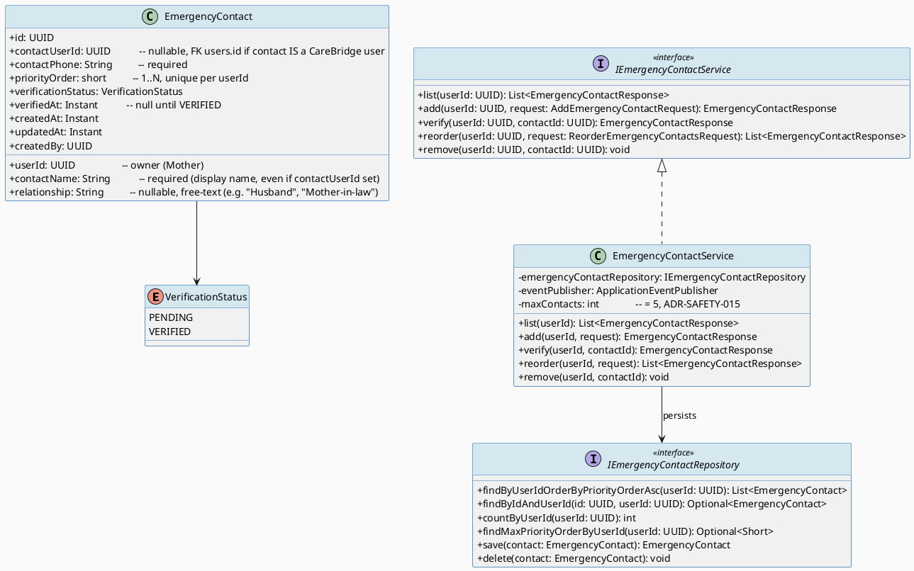
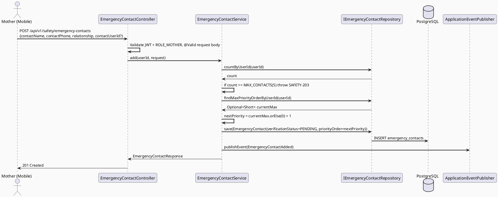
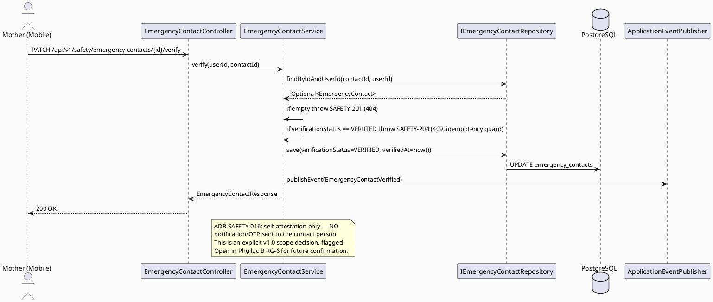
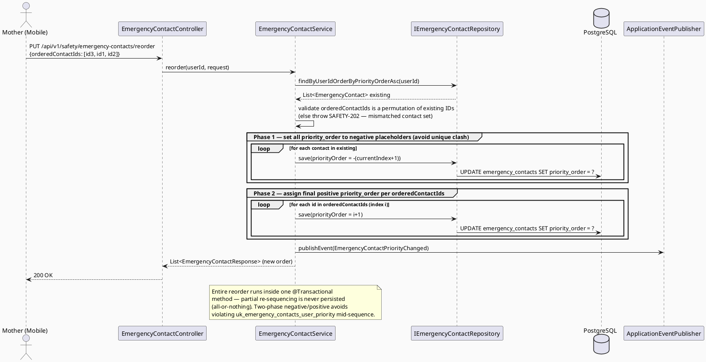
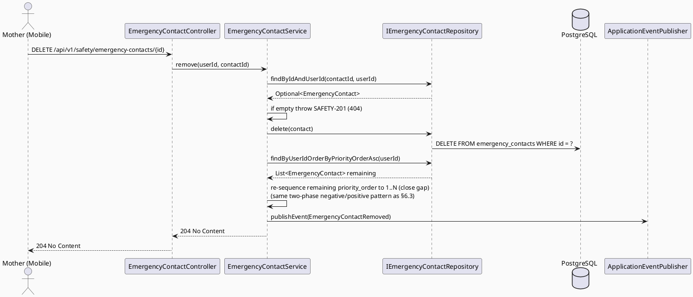
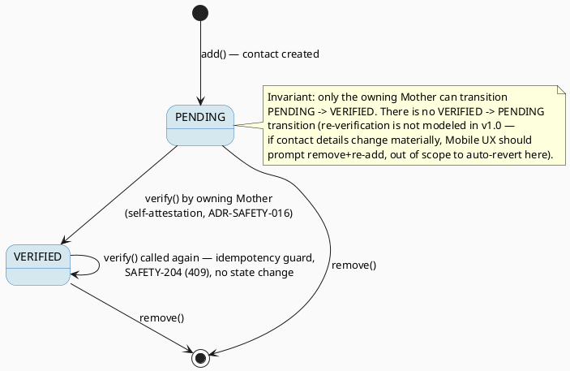

# ENGINEERING DOCUMENTATION STANDARD (EDS) v2.0
# UC176 — Configure Emergency Contact

| Field | Value |
|-------|-------|
| **Document ID** | `CB-SAFETY-IMP-010` |
| **Version** | `1.0` |
| **Date** | `2026-07-03` |
| **Status** | `Draft` |
| **Document Owner** | `TV5 - Chương` |
| **Author** | `AI Agent — Technical Architect` |
| **Reviewed by** | `[ ] Pending` |
| **DPO Sign-off** | `[ ] Pending` *(bắt buộc — module lưu trữ danh tính/số điện thoại của bên thứ ba, có thể không phải user CareBridge)* |
| **Approved by** | `[ ] Pending` |
| **Last Review** | `2026-07-03` |
| **Based on EDS** | `v2.0` |

---

## CHANGELOG

| Ngày | Người thực hiện | Nội dung thay đổi |
|------|-----------------|-------------------|
| 2026-07-03 | AI Agent — Technical Architect | Tạo tài liệu lần đầu — TDS cho UC176 Configure Emergency Contact |

---

## MỤC LỤC

1. [Tổng quan Module](#1-tổng-quan-module)
2. [Ma trận Truy vết (Traceability Matrix)](#2-ma-trận-truy-vết-traceability-matrix)
3. [Architecture Decision Records (ADR)](#3-architecture-decision-records-adr)
4. [Non-Functional Requirements & SLA](#4-non-functional-requirements--sla)
5. [Static Modeling (Mô hình Tĩnh)](#5-static-modeling-mô-hình-tĩnh)
6. [Dynamic Modeling (Mô hình Động)](#6-dynamic-modeling-mô-hình-động)
7. [Domain Event Catalog](#7-domain-event-catalog)
8. [Interface Specification (Đặc tả Giao diện)](#8-interface-specification-đặc-tả-giao-diện)
9. [API Specification](#9-api-specification)
10. [Bảng mã lỗi (Error Codes)](#10-bảng-mã-lỗi-error-codes)
11. [Quy trình Triển khai (Step-by-Step)](#11-quy-trình-triển-khai-step-by-step)
12. [Rollback & Incident Runbook](#12-rollback--incident-runbook)
13. [Kịch bản Kiểm thử Chi tiết](#13-kịch-bản-kiểm-thử-chi-tiết)
14. [Phương pháp Xác minh](#14-phương-pháp-xác-minh)
15. [Mẫu thử thực tế (API Verification Samples)](#15-mẫu-thử-thực-tế-api-verification-samples)
16. [Bảng tổng hợp phân quyền (Authorization Matrix)](#16-bảng-tổng-hợp-phân-quyền-authorization-matrix)
17. [AI Prompt Constraints (CASE 2.0)](#17-ai-prompt-constraints-case-20)

---

## 1. Tổng quan Module

> UC176 cho phép Mother quản lý **danh sách nhiều** người nhận cảnh báo khẩn cấp (emergency contacts) — thêm, xác nhận ("verify"), sắp xếp thứ tự ưu tiên, và xoá. Đây là **genuine schema gap**: bảng hiện có `safety_monitoring_config` (`V20260627000005__create_safety_monitoring_config.sql`) chỉ có các cột cấu hình fall-detection (`fall_detection_enabled`, `sensitivity_level`, `emergency_auto_alert`, `countdown_seconds` — thêm bởi UC137) và **không có bất kỳ cột nào biểu diễn "emergency contact"** (không có `emergency_contact_user_id` hay tương đương trong migration thực tế — đã kiểm tra toàn bộ `db/migration/`). Do đó **không có cột nào để "deprecate"** — đây không phải một trường hợp mở rộng/thay thế 1 cột đơn, mà là tạo mới hoàn toàn 1 bảng con `emergency_contacts` (1-Mother-to-many-contacts) vì SRS §3.3.4.10 yêu cầu rõ "adds, **verifies**, **prioritizes**, or removes" — các động từ số nhiều/thứ tự này không thể biểu diễn bằng 1 FK đơn.
>
> **Quan hệ với luồng gửi cảnh báo thực tế (UC138 Send Emergency Alert):** Cảnh báo khẩn cấp hiện tại (`FamilyAlertService.sendAlert()`, xem UC138 TDS `CB-SAFETY-IMP-006`) lấy danh sách người nhận qua `FamilyMemberPort.getFamilyFcmTokens(userId)` — tra cứu **care-group/family membership** (domain `family`/`care-group`, thuộc TV2-Bách), **không phải** qua cấu hình `emergency_contact_user_id` nào trên `safety_monitoring_config`. UC176 tạo ra một **nguồn dữ liệu ưu tiên riêng** (`emergency_contacts`, sở hữu bởi Mother, do chính Mother cấu hình — có thể trùng hoặc không trùng với care-group family members) mà **UC138 hiện tại KHÔNG đọc**. Đây là gap tích hợp thật sự cần được ghi nhận rõ — xem RG-3 và ADR-SAFETY-014 bên dưới. TDS này **KHÔNG sửa UC138** (spec riêng, đã Draft, ngoài phạm vi "smallest scoped change" của UC176) — chỉ định nghĩa contract mới và flag dependency tường minh.

| Field | Value |
|-------|-------|
| **Module Name** | `Configure Emergency Contact` |
| **Bounded Context** | `safety` (extends existing package `com.carebridge.backend.safety`) |
| **Data Classification** | `Sensitive-PII` *(tên/số điện thoại người thứ ba, có thể không phải user CareBridge; liên kết an toàn tính mạng)* |
| **Compliance Scope** | `PDPA / Luật 91/2025` |
| **Upstream Dependencies** | `IAM (JWT ROLE_MOTHER)`, `safety_monitoring_config` (đã tồn tại, KHÔNG sửa đổi), Firebase Cloud Messaging (secondary actor SRS) |
| **Downstream Consumers** | `UC138 Send Emergency Alert` (potential future consumer — xem RG-3/ADR-SAFETY-014, KHÔNG wired trong scope TDS này), `UC141 Open Emergency Support from Safety Alert` (đã flag UC176 làm nguồn cấu hình hotline tiềm năng ở RG-6 residual — KHÔNG wired trong scope TDS này) |

---

## 2. Ma trận Truy vết (Traceability Matrix)

| Requirement ID | Loại (BR/ADR/US) | Mô tả yêu cầu | Thành phần Code | Compliance Target | ADR liên quan |
|----------------|------------------|---------------|-----------------|-------------------|---------------|
| SRS-3.3.4.10 | User Story | Mother thêm, xác nhận, sắp xếp ưu tiên, hoặc xoá emergency contact | `EmergencyContactController`, `EmergencyContactService` | — | ADR-SAFETY-014 |
| BR-RBAC | Business Rule | Mother chỉ quản lý được emergency contacts của chính mình (`user_id` sở hữu) | `EmergencyContactService.*()` (mọi method) | BR-RBAC | ADR-SAFETY-015 |
| BR-SAFETY | Business Rule | Việc verify/prioritize/remove KHÔNG được làm gián đoạn khả năng gửi alert hiện có của UC138 nếu UC176 chưa tích hợp — hệ thống hiện tại vẫn phải tiếp tục hoạt động qua `FamilyMemberPort` không đổi | `EmergencyContactService` (không side-effect ngoài bảng mới) | BR-SAFETY | ADR-SAFETY-014 |
| RG-3 (Open — flagged, không sửa UC138 trong TDS này) | Research Gap | UC138 hiện đọc recipient qua `FamilyMemberPort` (care-group), KHÔNG đọc `emergency_contacts` mới — cần UC138 update riêng để hợp nhất 2 nguồn (hoặc thay thế) | `FamilyAlertService.sendAlert()` (UC138, ngoài phạm vi sửa của TDS này) | — | ADR-SAFETY-014 |
| RG-6 | Research Gap | "Verify" nghĩa là gửi xác nhận (SMS/notification/OTP) tới chính người liên hệ (có thể không phải CareBridge user), hay chỉ là Mother tự đánh dấu "đã xác nhận đúng thông tin"? SRS không mô tả cơ chế cụ thể | `EmergencyContactService.verify()` | — | ADR-SAFETY-016 |

---

## 3. Architecture Decision Records (ADR)

### ADR-SAFETY-014 — New `emergency_contacts` table; explicit non-integration with UC138 in this TDS (schema gap, cross-document dependency)

| Field | Value |
|-------|-------|
| **Status** | `Accepted` |
| **Deciders** | `AI Agent — Technical Architect` |
| **Date** | `2026-07-03` |
| **Supersedes** | `—` |

#### Bối cảnh (Context)
SRS §3.3.4.10 mô tả rõ 4 hành động số nhiều/có thứ tự: "adds, verifies, **prioritizes**, or removes alert recipients". Kiểm tra trực tiếp `V20260627000005__create_safety_monitoring_config.sql` (5 cột: `id, user_id, fall_detection_enabled, sensitivity_level, emergency_auto_alert, updated_at, updated_by` + `countdown_seconds` thêm bởi UC137 `V20260705090000`) xác nhận: **không có cột `emergency_contact_user_id` hay bất kỳ cột liên hệ khẩn cấp nào trên bảng này, ở bất kỳ migration nào đã áp dụng**. Đây không phải một cột cần "deprecate" — nó chưa từng tồn tại trong schema thực tế. Đồng thời, `FamilyAlertService.sendAlert()` (UC138, `com.carebridge.backend.emergency`) lấy recipient qua `FamilyMemberPort.getFamilyFcmTokens(userId)` — một cổng trừu tượng hiện là **stub luôn trả `List.of()`** (xác nhận trong UC138 TDS §11.1 "Known pre-existing gap"), độc lập hoàn toàn với bất kỳ cấu hình nào Mother có thể thiết lập qua UC176.

#### Các phương án đã xem xét (Options Considered)

| Phương án | Mô tả | Ưu điểm | Nhược điểm |
|-----------|-------|----------|------------|
| A | Thêm 1 cột `emergency_contact_user_id` (FK `users.id`, nullable) vào `safety_monitoring_config`, chỉ hỗ trợ 1 contact | Đơn giản nhất, tái sử dụng bảng hiện có | KHÔNG đáp ứng SRS — không thể "prioritize" hay lưu nhiều contact, không thể lưu contact không phải CareBridge user (chỉ external name/phone) |
| B | Tạo bảng mới `emergency_contacts` (1 Mother → nhiều contacts), hỗ trợ cả CareBridge user (`contact_user_id` optional FK) lẫn external contact (`contact_name`/`contact_phone` free-text), có `priority_order` và `verification_status`. Đồng thời **cập nhật UC138 để đọc bảng này** trong CÙNG TDS | Đáp ứng đầy đủ SRS, nhất quán use case | Vi phạm "smallest scoped change" (CLAUDE.md) — UC138 đã có TDS/Test-Spec riêng (Draft), sửa nó trong phạm vi UC176 sẽ làm 2 tài liệu ra khỏi đồng bộ nếu UC138 review độc lập; rủi ro side-effect ngoài scope được giao |
| C | Tạo bảng mới `emergency_contacts` như phương án B, nhưng **KHÔNG sửa UC138** trong TDS này — chỉ định nghĩa contract UC176 độc lập, và ghi rõ dependency cần một PR/TDS riêng cho UC138 (cập nhật `FamilyAlertService` hoặc `FamilyMemberPort` để đọc `emergency_contacts` khi có priority contact được VERIFIED) | Đáp ứng SRS đầy đủ cho phạm vi UC176; giữ nguyên "smallest scoped change"; UC138 vẫn hoạt động y hệt hiện tại (không có regression); dependency được flag tường minh, có thể lên kế hoạch PR riêng | Cho đến khi UC138 được cập nhật, `emergency_contacts` mà Mother cấu hình **không ảnh hưởng luồng gửi alert thực tế** — chỉ là dữ liệu cấu hình "chờ tích hợp" (documented trade-off, không phải bug) |

#### Quyết định (Decision)
Chọn **Phương án C**. Tạo bảng mới `emergency_contacts` qua migration `V20260706120000__create_emergency_contacts.sql` (xem §5.2 cho SQL đầy đủ). TDS này triển khai đầy đủ CRUD + verify + reorder cho Mother tự quản lý danh sách của mình, nhưng **không đấu nối** (wire) vào `FamilyAlertService.sendAlert()` — đó là phạm vi của một cập nhật riêng cho UC138 (xem RG-3, flagged là Open item, không tạo ADR/code trong file UC138 từ TDS này). Không có cột nào trên `safety_monitoring_config` bị "deprecate" vì không có cột tương ứng để bắt đầu — bảng này giữ nguyên schema, chỉ được tham chiếu gián tiếp qua `user_id` chung (không có FK trực tiếp giữa `emergency_contacts` và `safety_monitoring_config`, cả hai đều FK độc lập tới `users.id`/domain user).

#### Hệ quả (Consequences)

**Tích cực:**
- Đáp ứng đầy đủ 4 hành động SRS (add/verify/prioritize/remove) với thiết kế schema hợp lý (multi-row, ordered, verifiable)
- Không phá vỡ hoặc side-effect ngoài phạm vi UC138 đã Draft
- Hỗ trợ cả CareBridge user contact lẫn external (non-user) contact — đúng tinh thần "alert recipients" có thể là bất kỳ ai, không chỉ care-group member

**Tiêu cực / Trade-offs:**
- **Cross-document dependency thật sự chưa đóng**: cho đến khi có một TDS/PR cập nhật UC138 (hoặc `FamilyMemberPort`) để đọc `emergency_contacts`, tính năng UC176 là "cấu hình treo" — Mother có thể thêm/verify/prioritize contact nhưng UC138 vẫn dùng `FamilyMemberPort` (care-group) không đổi. Đây LÀ MỘT OPEN ITEM BẮT BUỘC PHẢI THEO DÕI (xem Phụ lục B RG-3), không phải lỗi thiết kế của TDS này.

**Compliance Impact:**
- PII mới: tên/số điện thoại người thứ ba có thể không phải CareBridge user — cần DPO sign-off trước khi go-live (xem header). Retention/xoá theo yêu cầu chủ thể dữ liệu cần xử lý ở tầng policy (§Phụ lục B Open item bổ sung).

---

### ADR-SAFETY-015 — Priority ordering via integer `priority_order` column with compaction-on-write (no gaps)

| Field | Value |
|-------|-------|
| **Status** | `Accepted` |
| **Deciders** | `AI Agent — Technical Architect` |
| **Date** | `2026-07-03` |

#### Bối cảnh (Context)
SRS yêu cầu "prioritizes" — Mother cần sắp xếp thứ tự các contact (ai được thông báo/liên hệ trước). Cần một cơ chế lưu thứ tự ổn định, dễ reorder qua API (thường là drag-and-drop trên mobile UI), và tránh race-condition khi nhiều request PATCH đồng thời.

#### Các phương án đã xem xét (Options Considered)

| Phương án | Mô tả | Ưu điểm | Nhược điểm |
|-----------|-------|----------|------------|
| A | Linked-list (mỗi contact có `next_contact_id`) | Reorder O(1) tại 1 điểm | Phức tạp khi query "lấy theo thứ tự", dễ lỗi khi broken chain |
| B | Cột `priority_order INTEGER` liên tục (1..N) mỗi Mother, full re-sequencing (compaction) mỗi lần reorder — toàn bộ danh sách được ghi lại trong 1 transaction | Đơn giản, `ORDER BY priority_order` trực tiếp, không có gap/trùng số, dễ audit | Ghi lại N rows mỗi lần reorder (chấp nhận được vì max-contacts nhỏ — xem giới hạn dưới) |

#### Quyết định (Decision)
Chọn **Phương án B**. `priority_order` là `SMALLINT NOT NULL`, duy nhất trong phạm vi `(user_id)` qua `UNIQUE (user_id, priority_order)`. Endpoint `PUT /api/v1/safety/emergency-contacts/reorder` nhận **toàn bộ danh sách ID theo thứ tự mới**, service thực hiện re-sequence 1..N trong 1 `@Transactional` (xoá unique tạm thời bằng cách set âm trước rồi set lại dương — xem §6 sequence — để tránh vi phạm unique constraint giữa các bước ghi trung gian). Khi thêm contact mới, `priority_order` mặc định = `MAX(priority_order) + 1` cho Mother đó (thêm vào cuối danh sách). **Giới hạn tối đa 5 contacts / Mother** (`MAX_CONTACTS = 5`, giá trị đề xuất dựa trên UX thông thường của safety app tương tự — KHÔNG có con số cụ thể nào trong SRS, đánh dấu **Open** cần Product Owner xác nhận, xem Phụ lục B) — vượt giới hạn trả lỗi `SAFETY-203`.

#### Hệ quả (Consequences)

**Tích cực:** Đơn giản, ORDER BY trực tiếp, dễ test boundary (đầy danh sách, reorder rỗng, reorder 1 phần tử).

**Tiêu cực / Trade-offs:** Reorder toàn bộ danh sách tốn nhiều write hơn linked-list, nhưng chấp nhận được với N ≤ 5.

**Compliance Impact:** Không.

---

### ADR-SAFETY-016 — Verification semantics: Mother self-attestation only (no OTP-to-contact in v1.0) — resolves RG-6 partially

| Field | Value |
|-------|-------|
| **Status** | `Accepted` |
| **Deciders** | `AI Agent — Technical Architect` |
| **Date** | `2026-07-03` |

#### Bối cảnh (Context)
SRS §3.3.4.10 chỉ viết "verifies" mà không mô tả cơ chế. Có 2 khả năng: (a) gửi mã OTP/xác nhận SMS/push tới chính người liên hệ (nếu là CareBridge user, qua FCM; nếu external, cần SMS provider — **không có SMS provider nào được tích hợp trong codebase hiện tại**, chỉ có Gmail SMTP và FCM theo CLAUDE.md Stack), hoặc (b) Mother tự đánh dấu "tôi xác nhận thông tin liên hệ này chính xác" (self-attestation, không có xác nhận từ phía người được thêm).

#### Các phương án đã xem xét (Options Considered)

| Phương án | Mô tả | Ưu điểm | Nhược điểm |
|-----------|-------|----------|------------|
| A | OTP-to-contact: gửi mã xác nhận tới `contact_phone` (SMS) hoặc `contact_user_id` (FCM push nếu là CareBridge user), yêu cầu người liên hệ xác nhận trước khi `verification_status = VERIFIED` | Đảm bảo người liên hệ thực sự đồng ý/biết được thêm — đúng tinh thần "consent" | KHÔNG có SMS provider trong stack hiện tại (chỉ Gmail SMTP + FCM theo CLAUDE.md) — out of scope để thêm 1 integration mới không được yêu cầu; SRS không đề cập bất kỳ consent-from-contact flow nào; risk over-engineering một cơ chế không có cơ sở rõ ràng trong SRS |
| B | Self-attestation: Mother gọi `PATCH .../verify` để tự đánh dấu contact là "đã xác nhận đúng thông tin" (không có bước xác nhận từ phía contact) | Khớp với secondary actor SRS duy nhất là Firebase Cloud Messaging (không phải SMS) — phù hợp giả định rằng "verify" chỉ là bước UX xác nhận dữ liệu nhập đúng, tương tự pattern "confirm your entry" phổ biến; không cần integration mới; giữ scope tối thiểu | Không đảm bảo người liên hệ thực sự biết/đồng ý được liệt kê làm emergency contact — rủi ro về consent nếu contact là external (non-CareBridge user); cần Legal/DPO review riêng cho luồng này |

#### Quyết định (Decision)
Chọn **Phương án B (self-attestation)** làm baseline v1.0, vì: (1) SRS không mô tả cơ chế OTP-to-contact nào, (2) secondary actor duy nhất là FCM (không phải SMS provider), (3) không có bằng chứng trong codebase về consent-from-third-party flow. `EmergencyContactService.verify(contactId, userId)` chuyển `verification_status` từ `PENDING` → `VERIFIED`, ghi `verified_at = now()`, **không gửi bất kỳ notification nào tới contact**. **Đây LÀ MỘT GIẢ ĐỊNH CẦN XÁC NHẬN THÊM** — đánh dấu **Open** trong Phụ lục B (RG-6). Nếu Product Owner xác nhận cần OTP-to-contact thật sự (đặc biệt cho external contact), cần một ADR/TDS bổ sung (bao gồm chọn SMS provider — thay đổi stack, cần approval theo CLAUDE.md Architecture rule "không giới thiệu dependency/infrastructure mới mà không được approval").

#### Hệ quả (Consequences)

**Tích cực:** Không thêm dependency mới; verify là instant, không phụ thuộc network/external service; giữ nguyên phạm vi SRS tối thiểu.

**Tiêu cực / Trade-offs:** Nếu Product Owner thực sự muốn OTP-to-contact, đây là breaking-change cần TDS bổ sung — flagged rõ để tránh implement sai giả định.

**Compliance Impact:** external contact (không phải CareBridge user) được lưu tên/SĐT mà không có bước xác nhận từ chính họ — cần DPO đánh giá cơ sở pháp lý xử lý dữ liệu bên thứ ba (thường là "legitimate interest" cho mục đích an toàn khẩn cấp theo PDPA, nhưng cần xác nhận chính thức, không tự ý kết luận trong TDS này).

---

## 4. Non-Functional Requirements & SLA

### 4.1. Performance & Availability

| Category | Requirement | Target SLA | Measurement Method | Compliance Basis |
|----------|-------------|------------|---------------------|------------------|
| Latency | `POST/PATCH/DELETE /emergency-contacts` API response (p99) | `< 300ms` | k6 load test | — |
| Latency | `PUT /emergency-contacts/reorder` (max 5 rows re-sequenced) | `< 400ms` | k6 load test | — |
| Availability | Endpoint uptime | `99.9%` | Uptime monitor | — |

### 4.2. Data Integrity & Retention

| Category | Requirement | Target | Verification Method | Compliance Basis |
|----------|-------------|--------|---------------------|------------------|
| Uniqueness | `(user_id, priority_order)` không trùng | 100% | DB unique constraint | — |
| Consistency | Xoá 1 contact không để lại "gap" ảnh hưởng tới `priority_order` của các contact còn lại (re-sequence tự động) | 100% | Reconciliation query (§14) | — |
| Max limit | Tối đa `MAX_CONTACTS = 5` / Mother | 100% enforced ở service layer | Unit test boundary | — |
| Retention | Emergency contact bị xoá bởi Mother → hard delete (không phải soft-delete) vì đây là dữ liệu cấu hình do chính chủ thể quản lý, không phải audit trail an toàn tính mạng (khác với `imu_safety_events`) | Ngay lập tức | DB verification | PDPA (right to erasure phù hợp cho dữ liệu do actor tự quản lý) |

### 4.3. Security

| Category | Requirement | Target | Verification Method | Compliance Basis |
|----------|-------------|--------|---------------------|------------------|
| Access control | Mother chỉ CRUD được contact của chính mình (`user_id` sở hữu) | Least privilege, IDOR-safe | Auth Matrix (§16) + ownership test | BR-RBAC |
| PII minimization | `contact_phone` không log ở mức INFO | Log audit | PDPA |

---

## 5. Static Modeling (Mô hình Tĩnh)

### 5.1. Class Diagram (PlantUML)



### 5.2. Data Structure (Flyway SQL Migration)

**Logic Issue resolved:** task brief hypothesized a table named `safety_monitoring_settings` with a single `emergency_contact_user_id` FK; the real table is `safety_monitoring_config` (`V20260627000005`) and it has **no emergency-contact column at all** (checked all applied migrations under `db/migration/`). There is nothing to deprecate on that table. This TDS creates a genuinely new child table `emergency_contacts`, independent of `safety_monitoring_config` (both reference the owning user independently, no FK between the two tables).

Tạo file: `src/main/resources/db/migration/V20260706120000__create_emergency_contacts.sql`

```sql
-- === SAFETY: CONFIGURE EMERGENCY CONTACT (UC176) ===

CREATE TABLE emergency_contacts (
  id                   UUID          PRIMARY KEY DEFAULT gen_random_uuid(),
  user_id              UUID          NOT NULL,                    -- owner (Mother) — no FK to users table (consistent with emergency_sessions.user_id pattern, no cross-schema FK enforced)
  contact_user_id      UUID,                                       -- nullable — set only if the contact is itself a CareBridge user
  contact_name         VARCHAR(150)  NOT NULL,
  contact_phone        VARCHAR(30)   NOT NULL,
  relationship         VARCHAR(50),                                -- optional free-text, e.g. "Husband", "Sister"
  priority_order       SMALLINT      NOT NULL,
  verification_status  VARCHAR(20)   NOT NULL DEFAULT 'PENDING',
  verified_at          TIMESTAMPTZ,
  created_at           TIMESTAMPTZ   NOT NULL DEFAULT NOW(),
  updated_at           TIMESTAMPTZ   NOT NULL DEFAULT NOW(),
  created_by           UUID          NOT NULL,

  CONSTRAINT uk_emergency_contacts_user_priority UNIQUE (user_id, priority_order),
  CONSTRAINT chk_emergency_contact_verification CHECK (verification_status IN ('PENDING', 'VERIFIED'))
);

CREATE INDEX idx_emergency_contacts_user_id ON emergency_contacts(user_id);
CREATE INDEX idx_emergency_contacts_contact_user_id ON emergency_contacts(contact_user_id) WHERE contact_user_id IS NOT NULL;
```

> **Application-layer enforcement (not DB constraint):** `MAX_CONTACTS = 5` per `user_id` is enforced in `EmergencyContactService.add()` (a DB-level `CHECK`/trigger for "count per group" is avoided per project convention — no triggers observed elsewhere in `db/migration/`). Reorder uses a **negative-then-positive two-phase update** inside one `@Transactional` block to avoid violating `uk_emergency_contacts_user_priority` mid-sequence (see §6.3 sequence diagram).

> **Not modified:** `safety_monitoring_config` — zero columns added, zero columns deprecated. No FK exists between `emergency_contacts` and `safety_monitoring_config`; both independently reference the same conceptual `user_id`.

---

## 6. Dynamic Modeling (Mô hình Động)

### 6.1. Sequence Diagram — Add Emergency Contact (Happy Path)



### 6.2. Sequence Diagram — Verify Emergency Contact (self-attestation, ADR-SAFETY-016)



### 6.3. Sequence Diagram — Reorder (Priority Change, two-phase to avoid unique-constraint violation)



### 6.4. Sequence Diagram — Remove Emergency Contact (with re-sequencing)



### 6.5. State Machine — EmergencyContact.verificationStatus



> **⚠️ Invariant:** `priority_order` luôn liên tục (1..N, không có gap) sau MỌI thao tác add/remove/reorder thành công trong phạm vi 1 `user_id`.

---

## 7. Domain Event Catalog

### 7.1. Events Published (Phát ra)

| Event Name | Trigger | Publisher | Subscriber(s) | Payload Schema | Async? |
|------------|---------|-----------|---------------|----------------|--------|
| `EmergencyContactAdded` | Mother thêm 1 contact mới thành công | `EmergencyContactService` | *(none currently — future UC138 integration, see RG-3)* | `EmergencyContactAdded.java` (§7.3) | Yes |
| `EmergencyContactVerified` | Mother tự xác nhận contact (self-attestation) | `EmergencyContactService` | *(none currently)* | `EmergencyContactVerified.java` (§7.3) | Yes |
| `EmergencyContactPriorityChanged` | Mother reorder danh sách contact | `EmergencyContactService` | *(none currently)* | `EmergencyContactPriorityChanged.java` (§7.3) | Yes |
| `EmergencyContactRemoved` | Mother xoá 1 contact | `EmergencyContactService` | *(none currently)* | `EmergencyContactRemoved.java` (§7.3) | Yes |

> **Không có subscriber nào hiện tại** — đây là điểm ghi nhận tường minh của RG-3/ADR-SAFETY-014: cho đến khi UC138 (`FamilyAlertService`/`FamilyMemberPort`) được cập nhật trong một TDS/PR riêng để lắng nghe các event này (hoặc đọc trực tiếp `emergency_contacts` tại thời điểm gửi alert), các event này chỉ phục vụ audit/future-integration, KHÔNG ảnh hưởng luồng gửi alert hiện tại.

### 7.2. Events Consumed (Tiêu thụ)

_Không có._ UC176 không lắng nghe event nào từ module khác — mọi thao tác được kích hoạt trực tiếp qua API do Mother gọi.

### 7.3. Payload Schema

```java
// EmergencyContactAdded.java
public record EmergencyContactAdded(
    UUID    eventId,
    UUID    contactId,
    UUID    userId,
    String  contactName,
    short   priorityOrder,
    Instant occurredAt
) {}

// EmergencyContactVerified.java
public record EmergencyContactVerified(
    UUID    eventId,
    UUID    contactId,
    UUID    userId,
    Instant verifiedAt
) {}

// EmergencyContactPriorityChanged.java
public record EmergencyContactPriorityChanged(
    UUID       eventId,
    UUID       userId,
    List<UUID> newOrderContactIds,   // ordered list, index 0 = highest priority
    Instant    occurredAt
) {}

// EmergencyContactRemoved.java
public record EmergencyContactRemoved(
    UUID    eventId,
    UUID    contactId,
    UUID    userId,
    Instant occurredAt
) {}
```

---

## 8. Interface Specification (Đặc tả Giao diện)

### 8.1. Service Interface

```java
// AddEmergencyContactRequest.java — Input DTO
// @version 1.0
public class AddEmergencyContactRequest {
    @NotBlank
    @Size(max = 150)
    private String contactName;

    @NotBlank
    @Size(max = 30)
    private String contactPhone;

    @Size(max = 50)
    private String relationship;      // optional

    private UUID contactUserId;       // optional — set if contact is a CareBridge user
}

// ReorderEmergencyContactsRequest.java — Input DTO
// @version 1.0
public class ReorderEmergencyContactsRequest {
    @NotEmpty
    private List<UUID> orderedContactIds; // must be a permutation of caller's existing contact IDs
}

// EmergencyContactResponse.java — Output DTO
public class EmergencyContactResponse {
    private UUID id;
    private String contactName;
    private String contactPhone;
    private String relationship;
    private UUID contactUserId;         // nullable
    private short priorityOrder;
    private String verificationStatus;  // "PENDING" | "VERIFIED"
    private Instant verifiedAt;         // nullable
    private Instant createdAt;
}

// IEmergencyContactService.java — Service Contract
// @version 1.0
public interface IEmergencyContactService {

    /** Returns all contacts for the owning Mother, ordered by priorityOrder ascending. */
    List<EmergencyContactResponse> list(UUID userId);

    /**
     * Adds a new emergency contact at the end of the priority list.
     * @throws SafetyException (SAFETY-203) if userId already has MAX_CONTACTS(5) contacts
     */
    EmergencyContactResponse add(UUID userId, AddEmergencyContactRequest request);

    /**
     * Self-attestation verify (ADR-SAFETY-016) — Mother confirms the contact info is correct.
     * @throws SafetyException (SAFETY-201) if contact not found or not owned by userId
     * @throws SafetyException (SAFETY-204) if contact already VERIFIED (idempotency guard)
     */
    EmergencyContactResponse verify(UUID userId, UUID contactId);

    /**
     * Re-sequences the full priority order for userId's contacts in one transaction.
     * @throws SafetyException (SAFETY-202) if orderedContactIds is not an exact permutation
     *         of the caller's existing contact IDs
     */
    List<EmergencyContactResponse> reorder(UUID userId, ReorderEmergencyContactsRequest request);

    /**
     * Removes a contact and re-sequences remaining contacts to close the priority gap.
     * @throws SafetyException (SAFETY-201) if contact not found or not owned by userId
     */
    void remove(UUID userId, UUID contactId);
}
```

### 8.2. Repository Interface

```java
// IEmergencyContactRepository.java
// @version 1.0
public interface IEmergencyContactRepository extends JpaRepository<EmergencyContact, UUID> {

    List<EmergencyContact> findByUserIdOrderByPriorityOrderAsc(UUID userId);

    Optional<EmergencyContact> findByIdAndUserId(UUID id, UUID userId);

    long countByUserId(UUID userId);

    @Query("SELECT MAX(c.priorityOrder) FROM EmergencyContact c WHERE c.userId = :userId")
    Optional<Short> findMaxPriorityOrderByUserId(@Param("userId") UUID userId);
}
```

---

## 9. API Specification

### 9.1. Endpoints Table

| Method | Path | Auth Level | Required Roles | Rate Limit | Idempotent? |
|--------|------|------------|----------------|------------|-------------|
| `GET` | `/api/v1/safety/emergency-contacts` | JWT Bearer | `ROLE_MOTHER` | 60/min | Yes |
| `POST` | `/api/v1/safety/emergency-contacts` | JWT Bearer | `ROLE_MOTHER` | 20/min | No |
| `PATCH` | `/api/v1/safety/emergency-contacts/{id}/verify` | JWT Bearer | `ROLE_MOTHER` | 30/min | Yes (2nd call → SAFETY-204) |
| `PUT` | `/api/v1/safety/emergency-contacts/reorder` | JWT Bearer | `ROLE_MOTHER` | 20/min | Yes |
| `DELETE` | `/api/v1/safety/emergency-contacts/{id}` | JWT Bearer | `ROLE_MOTHER` | 20/min | Yes (2nd call → SAFETY-201) |

### 9.2. Request / Response Schemas

**POST /api/v1/safety/emergency-contacts — Request:**
```json
{
  "contactName": "Nguyen Van A",
  "contactPhone": "+84901234567",
  "relationship": "Husband",
  "contactUserId": null
}
```

**POST — Response (201):**
```json
{
  "id": "uuid-v4",
  "contactName": "Nguyen Van A",
  "contactPhone": "+84901234567",
  "relationship": "Husband",
  "contactUserId": null,
  "priorityOrder": 1,
  "verificationStatus": "PENDING",
  "verifiedAt": null,
  "createdAt": "2026-07-03T08:00:00.000Z"
}
```

**POST — Response (409 max contacts exceeded):**
```json
{
  "error": {
    "code": "SAFETY-203",
    "message": "Maximum number of emergency contacts (5) reached"
  }
}
```

**PUT /api/v1/safety/emergency-contacts/reorder — Request:**
```json
{
  "orderedContactIds": ["uuid-3", "uuid-1", "uuid-2"]
}
```

**PUT — Response (200):**
```json
[
  { "id": "uuid-3", "priorityOrder": 1, "...": "..." },
  { "id": "uuid-1", "priorityOrder": 2, "...": "..." },
  { "id": "uuid-2", "priorityOrder": 3, "...": "..." }
]
```

**PATCH .../verify — Response (200):**
```json
{
  "id": "uuid-v4",
  "verificationStatus": "VERIFIED",
  "verifiedAt": "2026-07-03T08:05:00.000Z"
}
```

---

## 10. Bảng mã lỗi (Error Codes)

> **Namespace note:** `SAFETY-004/009/010/011` đã dùng bởi UC137; `SAFETY-104/105` đã dùng bởi UC141. UC176 dùng dải mã mới `SAFETY-20x` để tránh trùng lặp trong toàn bộ bounded context `safety`.

| Code | HTTP Status | Message (EN) | Message (VI) | Trigger Condition |
|------|-------------|--------------|--------------|-------------------|
| `SAFETY-201` | 404 | Emergency contact not found | Không tìm thấy liên hệ khẩn cấp | `contactId` không tồn tại hoặc không thuộc `userId` |
| `SAFETY-202` | 400 | Reorder list does not match existing contacts | Danh sách sắp xếp không khớp với danh sách hiện có | `orderedContactIds` không phải hoán vị chính xác của các contact hiện có của Mother |
| `SAFETY-203` | 409 | Maximum number of emergency contacts reached | Đã đạt số lượng liên hệ khẩn cấp tối đa | `countByUserId(userId) >= 5` khi gọi `add()` |
| `SAFETY-204` | 409 | Emergency contact already verified | Liên hệ khẩn cấp đã được xác nhận | Gọi `verify()` lần 2 trên contact đã `VERIFIED` |
| `SAFETY-205` | 403 | Insufficient permissions | Không đủ quyền | `userId` không sở hữu contact (IDOR guard) — dùng chung ở `verify()`/`remove()` khi `findByIdAndUserId` rỗng nhưng ID tồn tại cho user khác (phân biệt 404 thật vs 403 tuỳ chính sách information-disclosure; TDS này chọn trả 404 đồng nhất cho cả 2 trường hợp để tránh lộ thông tin tồn tại của ID — xem AP-AI-004) |

---

## 11. Quy trình Triển khai (Step-by-Step)

### 11.1. Prerequisites

- [ ] ADR-SAFETY-014/015/016 Accepted
- [ ] DPO sign-off (bảng mới lưu PII bên thứ ba, có thể ngoài CareBridge user)
- [ ] Product Owner xác nhận `MAX_CONTACTS = 5` (đề xuất, chưa confirmed — xem Phụ lục B)
- [ ] Product Owner xác nhận cơ chế "verify" là self-attestation (ADR-SAFETY-016), không phải OTP-to-contact (xem Phụ lục B RG-6)

### 11.2. Pre-Migration Checklist

- [ ] Đã backup DB
- [ ] `V20260706120000` migration reviewed — pure additive table, không đụng `safety_monitoring_config` hay bất kỳ bảng nào khác
- [ ] Xác nhận version `V20260706120000` không trùng với các migration đang chạy song song (task brief chỉ định dải `090000`/`100000`/`110000`/`130000` dành cho 4 agent khác — `120000` không trùng)

### 11.3. Implementation Steps

#### Chặng 1 — Migration V20260706120000
```bash
./mvnw flyway:migrate
```

#### Chặng 2 — Entity `EmergencyContact` + `IEmergencyContactRepository` (package `com.carebridge.backend.safety`)

#### Chặng 3 — `EmergencyContactService` (add/verify/reorder/remove) + `EmergencyContactMapper`

#### Chặng 4 — `EmergencyContactController` (5 endpoints, §9)

#### Chặng 5 — Domain events (`EmergencyContactAdded/Verified/PriorityChanged/Removed`) — published, no consumers wired yet (RG-3)

### 11.4. Deployment Checklist

- [ ] Migration V20260706120000 thành công
- [ ] `safety_monitoring_config` không bị thay đổi (schema diff = 0)
- [ ] Reorder two-phase transaction verified không vi phạm unique constraint dưới concurrent test
- [ ] Max-contacts boundary (5) verified qua integration test

---

## 12. Rollback & Incident Runbook

### 12.1. Điều kiện kích hoạt Rollback

| Điều kiện | Ngưỡng | Người quyết định |
|-----------|--------|------------------|
| Reorder gây trùng `priority_order` (vi phạm unique constraint không được catch) | Bất kỳ case nào | On-call Engineer |
| Mother xem được contact của Mother khác (IDOR) | Bất kỳ case nào | Tech Lead + DPO ngay lập tức |
| Migration thất bại / lock bảng khác | > 5 phút | On-call Engineer |

### 12.2. Rollback Procedure

```bash
psql -h $DB_HOST -U $DB_USER -d carebridge \
  -c "DROP TABLE IF EXISTS emergency_contacts CASCADE;"
psql -h $DB_HOST -U $DB_USER -d carebridge \
  -c "DELETE FROM flyway_schema_history WHERE version = '20260706120000';"
kubectl rollout undo deployment/carebridge-api
```

### 12.3. PDPA Incident: Third-party PII exposure

```
IMMEDIATE ACTIONS (within 1 hour):
1. DPO notification
2. Audit access logs for emergency_contacts table
3. Determine scope of exposure (which userIds/contacts affected)
4. Report per PDPA §37 within 72h if third-party PII was exposed
```

### 12.4. Post-Incident Review (PIR)

- **Timeline / Root Cause / Impact / Remediation / Prevention**

---

## 13. Kịch bản Kiểm thử Chi tiết

> Chi tiết đầy đủ tại `UC176_ConfigureEmergencyContact_Test-Spec.md`. Tóm tắt scope dưới đây.

### 13.1. Unit Tests (tóm tắt — xem Test-Spec cho Gherkin đầy đủ)

- Add contact — happy path, priority auto-assigned to end of list
- Add contact — max contacts (5) boundary → SAFETY-203
- Verify contact — happy path (PENDING → VERIFIED)
- Verify contact — already verified → SAFETY-204 (idempotency)
- Verify contact — non-owner → 404/SAFETY-201 (no IDOR leak)
- Reorder — full permutation happy path
- Reorder — mismatched ID set → SAFETY-202
- Reorder — concurrent reorder does not violate unique constraint (two-phase verified)
- Remove contact — re-sequencing closes gap correctly
- Remove contact — non-existent/non-owned → SAFETY-201

### 13.2. Integration Tests (tóm tắt)

- Full CRUD + reorder via Testcontainers PostgreSQL, verify DB state after each step
- Ownership isolation — Mother A cannot see/verify/reorder/remove Mother B's contacts

---

## 14. Phương pháp Xác minh

```sql
-- Verify no priority_order gaps or duplicates per user
SELECT user_id, array_agg(priority_order ORDER BY priority_order) AS orders
FROM emergency_contacts
GROUP BY user_id
HAVING array_agg(priority_order ORDER BY priority_order) <> (
  SELECT array_agg(g) FROM generate_series(1, COUNT(*)) AS g
);
-- Expected: 0 rows (every Mother's contacts are numbered 1..N contiguously)

-- Verify max contacts enforced
SELECT user_id, COUNT(*) FROM emergency_contacts GROUP BY user_id HAVING COUNT(*) > 5;
-- Expected: 0 rows

-- Verify safety_monitoring_config untouched by this migration
SELECT column_name FROM information_schema.columns
WHERE table_name = 'safety_monitoring_config'
ORDER BY column_name;
-- Expected: same column set as before V20260706120000 (id, user_id, fall_detection_enabled,
-- sensitivity_level, emergency_auto_alert, updated_at, updated_by, countdown_seconds)
```

---

## 15. Mẫu thử thực tế (API Verification Samples)

```bash
# Add emergency contact
curl -X POST https://$HOST/api/v1/safety/emergency-contacts \
  -H "Authorization: Bearer $MOTHER_JWT" \
  -H "Content-Type: application/json" \
  -d '{"contactName":"Nguyen Van A","contactPhone":"+84901234567","relationship":"Husband"}'

# Verify (self-attestation)
curl -X PATCH https://$HOST/api/v1/safety/emergency-contacts/$CONTACT_ID/verify \
  -H "Authorization: Bearer $MOTHER_JWT"

# Reorder
curl -X PUT https://$HOST/api/v1/safety/emergency-contacts/reorder \
  -H "Authorization: Bearer $MOTHER_JWT" \
  -H "Content-Type: application/json" \
  -d '{"orderedContactIds":["uuid-3","uuid-1","uuid-2"]}'

# Remove
curl -X DELETE https://$HOST/api/v1/safety/emergency-contacts/$CONTACT_ID \
  -H "Authorization: Bearer $MOTHER_JWT"
```

---

## 16. Bảng tổng hợp phân quyền (Authorization Matrix)

| Endpoint | `GUEST` | `ROLE_MOTHER` | `ROLE_PARTNER` | `ROLE_EXPERT` | `ROLE_FAMILY` | `ROLE_ADMIN` |
|----------|---------|---------------|----------------|---------------|---------------|--------------|
| `GET /api/v1/safety/emergency-contacts` | ❌ | ✅ Own | ❌ | ❌ | ❌ | ❌ |
| `POST /api/v1/safety/emergency-contacts` | ❌ | ✅ Own | ❌ | ❌ | ❌ | ❌ |
| `PATCH /api/v1/safety/emergency-contacts/{id}/verify` | ❌ | ✅ Own | ❌ | ❌ | ❌ | ❌ |
| `PUT /api/v1/safety/emergency-contacts/reorder` | ❌ | ✅ Own | ❌ | ❌ | ❌ | ❌ |
| `DELETE /api/v1/safety/emergency-contacts/{id}` | ❌ | ✅ Own | ❌ | ❌ | ❌ | ❌ |

---

## 17. AI Prompt Constraints (CASE 2.0)

### 17.1 Constraint Summary Table

| # | Constraint | Source (ADR/BR) | Last Verified |
|---|-----------|-----------------|---------------|
| C1 | New table `emergency_contacts` only — do NOT add/modify any column on `safety_monitoring_config` (no column exists there to deprecate) | `ADR-SAFETY-014` | `2026-07-03` |
| C2 | Only the owning Mother (`userId` match) may add/verify/reorder/remove her own contacts — else 404/403 (no IDOR leak of another Mother's contact existence) | `BR-RBAC / ADR-SAFETY-014` | `2026-07-03` |
| C3 | `verify()` is self-attestation only — do NOT implement OTP/SMS/notification-to-contact in this scope | `ADR-SAFETY-016` | `2026-07-03` |
| C4 | `priority_order` must remain contiguous (1..N) after every add/remove/reorder — use two-phase negative/positive update for reorder to avoid unique constraint violation | `ADR-SAFETY-015` | `2026-07-03` |
| C5 | Max 5 contacts per Mother, enforced in service layer (not DB trigger) — `SAFETY-203` on exceed | `ADR-SAFETY-015` | `2026-07-03` |
| C6 | Do NOT wire these events/this table into `FamilyAlertService`/`FamilyMemberPort` (UC138) in this scope — that is a separate, not-yet-approved follow-up (see RG-3) | `ADR-SAFETY-014` | `2026-07-03` |

### 17.2 Constraint Injection Block

```
[CONSTRAINT BLOCK — Module: Configure Emergency Contact — CB-SAFETY-IMP-010]

1. New table emergency_contacts only — never touch safety_monitoring_config columns (ADR-SAFETY-014)
2. Ownership enforced on every operation — userId must match emergency_contacts.user_id, else 404 (BR-RBAC)
3. verify() is self-attestation only — no OTP/SMS/push sent to the contact (ADR-SAFETY-016)
4. priority_order must stay contiguous 1..N — use two-phase negative/positive reorder transaction (ADR-SAFETY-015)
5. Enforce MAX_CONTACTS=5 in service layer — SAFETY-203 on exceed (ADR-SAFETY-015)
6. Do NOT wire this table/events into FamilyAlertService or FamilyMemberPort (UC138) — cross-document dependency flagged as Open, out of scope here (RG-3)

[CONTEXT BLOCK] Bounded Context: safety | Sensitive-PII | PDPA | BR-RBAC | BR-SAFETY
[TASK BLOCK] Implement EmergencyContactService.add()/verify()/reorder()/remove() + EmergencyContactController + V20260706120000 migration
```

### 17.3 Constraint Quality Checklist

- [x] Constraints traceable
- [x] Không generic — đặc thù UC176
- [x] Last Verified ≤ 2 sprints
- [x] ≥ 3 constraints (có 6)
- [x] Reference §8 và §16

### 17.4 Anti-Pattern Detection

| AP-ID | Anti-Pattern | Dấu hiệu | Hành động |
|-------|-------------|-----------|----------|
| AP-AI-001 | Column bolt-on | Migration adds `emergency_contact_user_id` to `safety_monitoring_config` instead of new table | **BLOCK** — C1 / ADR-SAFETY-014 |
| AP-AI-002 | RBAC bypass | `verify()`/`remove()`/`reorder()` skip `findByIdAndUserId` ownership check | **BLOCK** — C2 |
| AP-AI-003 | Unrequested OTP integration | Code adds SMS provider/OTP-to-contact flow not in ADR-SAFETY-016 | **BLOCK** — C3, also violates CLAUDE.md "no new dependency without approval" |
| AP-AI-004 | Priority gap/duplicate | Reorder/remove leaves non-contiguous or duplicate `priority_order` | **BLOCK** — C4 |
| AP-AI-005 | Silent UC138 wiring | Code modifies `FamilyAlertService`/`FamilyMemberPort` files as part of this task | **BLOCK** — C6, out of scope, requires separate approved TDS |

---

## PHỤ LỤC

### A. Glossary

| Thuật ngữ | Định nghĩa |
|-----------|------------|
| Emergency Contact | Người được Mother cấu hình để nhận cảnh báo khẩn cấp — có thể là CareBridge user hoặc người ngoài hệ thống |
| Self-attestation | Mother tự xác nhận thông tin liên hệ đúng, không có bước xác nhận ngược từ phía người liên hệ (ADR-SAFETY-016) |
| Priority Order | Thứ tự ưu tiên liên hệ khi có sự kiện khẩn cấp — số nhỏ hơn = ưu tiên cao hơn |

### B. Research Gates (Open Items)

| ID | Câu hỏi mở | Trạng thái | Ghi chú |
|----|-----------|-----------|---------|
| RG-3 | UC138 (`FamilyAlertService.sendAlert()`) hiện đọc recipient qua `FamilyMemberPort` (care-group, TV2-Bách domain), KHÔNG đọc `emergency_contacts` (UC176, TV5-Chương domain, table mới). Cần một TDS/PR riêng để quyết định: (a) `FamilyMemberPort` được mở rộng để hợp nhất 2 nguồn, hay (b) `FamilyAlertService` gọi thêm `IEmergencyContactRepository` trực tiếp, hay (c) `emergency_contacts` VERIFIED+priority=1 override care-group list hoàn toàn. | **Open — flagged as cross-document dependency, NOT implemented in this TDS** | Không sửa UC138's TDS/code trong phạm vi UC176 theo nguyên tắc "smallest scoped change". Cần Product Owner/TV2+TV5 quyết định thứ tự ưu tiên giữa 2 nguồn trước khi viết ADR tích hợp. |
| RG-6 | "Verifies" nghĩa là gì theo đúng ý SRS: self-attestation (đã chọn baseline, ADR-SAFETY-016) hay xác nhận từ chính người liên hệ (OTP-to-contact)? SRS §3.3.4.10 không mô tả cơ chế cụ thể. | **Open — baseline decision made (self-attestation), needs Product Owner confirmation** | Nếu cần OTP-to-contact thật, đây là breaking change cần TDS bổ sung + có thể cần thêm SMS provider (dependency mới, cần approval theo CLAUDE.md). |
| Open (mới) | `MAX_CONTACTS = 5` là giá trị đề xuất của TDS này, KHÔNG có cơ sở nào trong SRS. Cần Product Owner xác nhận con số chính xác. | **Open** | Nếu con số khác, chỉ cần đổi hằng số `maxContacts` trong `EmergencyContactService` — không cần đổi schema. |
| Open (mới) | UC141 TDS (RG-6 residual) đã đề cập UC176 như nguồn cấu hình hotline tiềm năng thay vì hardcode "115". TDS UC176 này KHÔNG implement liên kết đó (ngoài phạm vi — `emergency_contacts` là danh bạ liên hệ cá nhân, không phải hotline y tế công cộng cố định). Cần làm rõ với TV5-Chương liệu đây có phải cùng 1 khái niệm hay 2 khái niệm khác nhau (contact cá nhân vs hotline quốc gia). | **Open** | Ghi nhận để tránh nhầm lẫn giữa 2 TDS khi review chéo. |

### C. Tài liệu tham chiếu

| Document | Link / Path |
|----------|-------------|
| SRS UC-176 | `02_Requirements/SRS/3_Functional_Specification.md §3.3.4.10` (dòng 3508-3527) |
| UC137 TDS (schema reconciliation source) | `04_Implement/UC137_ConfirmSafetyCheck/UC137_ConfirmSafetyCheck_TDS.md` |
| UC138 TDS (recipient-determination logic, dependency target) | `04_Implement/UC138_SendEmergencyAlert/UC138_SendEmergencyAlert_TDS.md` |
| UC141 TDS (downstream consumer context, hotline RG-6 residual) | `04_Implement/UC141_OpenEmergencySupportFromSafetyAlert/UC141_OpenEmergencySupportFromSafetyAlert_TDS.md` |
| Existing safety package | `05_Development/CareBridgeAPI/src/main/java/com/carebridge/backend/safety/` |
| Actual DB schema | `05_Development/CareBridgeAPI/src/main/resources/db/migration/V1__init_schema.sql`, `V20260627000005__create_safety_monitoring_config.sql`, `V20260705090000__create_safety_check_prompts.sql` (UC137, adds `countdown_seconds`) |
| Function spec task allocation | `04_Implement/implement_artifacts/function-spec-task-allocation.md` (dòng 437, 628 — UC176 ownership TV5-Chương, Sprint 2 + Sprint 3) |
| EDS v2.0 Template | `08_References/Template/PHASE-3_TDS.md` |
