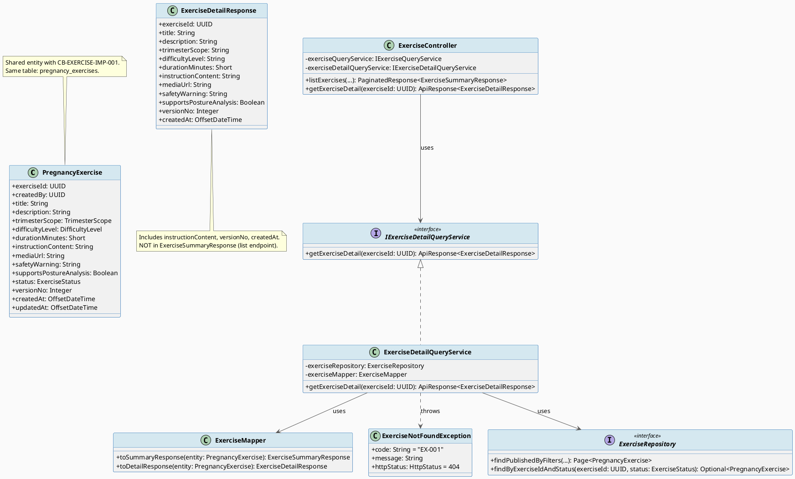
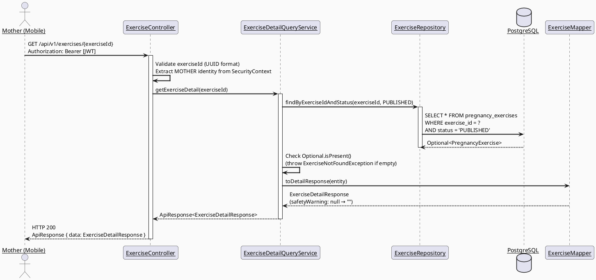
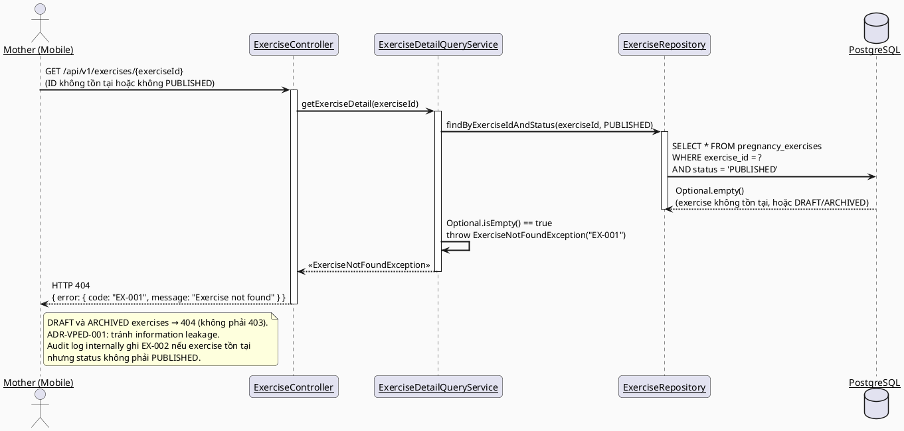
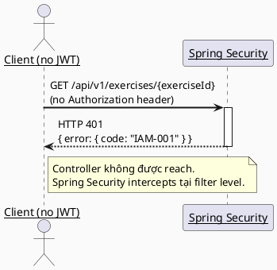

# ENGINEERING DOCUMENTATION STANDARD (EDS) v2.0
# SRS 3.3.2.3 — View Pregnancy Exercise Detail — Technical Design Specification

| Field | Value |
|-------|-------|
| **Document ID** | `CB-EXERCISE-IMP-002` |
| **Version** | `1.0` |
| **Date** | `2026-06-27` |
| **Status** | `Implemented` |
| **Document Owner** | `PhuongNT` |
| **Author** | `AI Agent — Developer` |
| **Reviewed by** | `[ ] Pending` |
| **DPO Sign-off** | `[ ] Pending` |
| **Approved by** | `[ ] Pending` |
| **Last Review** | `2026-06-27` |
| **Based on EDS** | `v2.0` |

---

## CHANGELOG

> **Policy 4.4 — Immutable History:** Không bao giờ xóa thông tin cũ. Mọi thay đổi phải ghi vào bảng này.

| Ngày | Người thực hiện | Nội dung thay đổi |
|------|-----------------|-------------------|
| 2026-06-27 | AI Agent — Developer | Tạo tài liệu lần đầu — Tách từ CB-EXERCISE-IMP-001 v1.1. Spec riêng cho SRS 3.3.2.3 View Pregnancy Exercise Detail. |
| 2026-06-27 | AI Agent — Developer | Phase 3: Implementation — 16/16 tests PASS. Red Gate verified → Green Gate PASS. |

---

## MỤC LỤC

1. [Tổng quan Module](#1-tổng-quan-module)
2. [Ma trận Truy vết (Traceability Matrix)](#2-ma-trận-truy-vết-traceability-matrix)
3. [Architecture Decision Records (ADR)](#3-architecture-decision-records-adr)
4. [Non-Functional Requirements & SLA](#4-non-functional-requirements--sla)
5. [Static Modeling (Mô hình Tĩnh)](#5-static-modeling-mô-hình-tĩnh)
6. [Dynamic Modeling (Mô hình Động)](#6-dynamic-modeling-mô-hình-động)
7. [Domain Event Catalog](#7-domain-event-catalog)
8. [Interface Specification (Đặc tả Giao diện)](#8-interface-specification-đặc-tả-giao-diện)
9. [API Specification](#9-api-specification)
10. [Bảng mã lỗi (Error Codes)](#10-bảng-mã-lỗi-error-codes)
11. [Quy trình Triển khai (Step-by-Step)](#11-quy-trình-triển-khai-step-by-step)
12. [Rollback & Incident Runbook](#12-rollback--incident-runbook)
13. [Kịch bản Kiểm thử Chi tiết](#13-kịch-bản-kiểm-thử-chi-tiết)
14. [Phương pháp Xác minh](#14-phương-pháp-xác-minh)
15. [Mẫu thử thực tế (API Verification Samples)](#15-mẫu-thử-thực-tế-api-verification-samples)
16. [Bảng tổng hợp phân quyền (Authorization Matrix)](#16-bảng-tổng-hợp-phân-quyền-authorization-matrix)
17. [AI Prompt Constraints (CASE 2.0)](#17-ai-prompt-constraints-case-20)

---

## 1. Tổng quan Module

> Cho phép Mother xem toàn bộ nội dung chi tiết của một bài tập thai kỳ cụ thể, bao gồm hướng dẫn đầy đủ, cảnh báo an toàn, thông tin media.
> SRS 3.3.2.3: "View Pregnancy Exercise Detail — Mother views the full detail of a selected exercise including instruction content and safety warnings."
>
> **Quan hệ với UC29 (CB-EXERCISE-IMP-001):** Module này là downstream của UC29 (list/select). Mother chọn bài tập từ danh sách (UC29) → navigates to detail screen (module này) → bắt đầu pre-exercise safety check (UC30).

| Field | Value |
|-------|-------|
| **Module Name** | `View Pregnancy Exercise Detail` |
| **Bounded Context** | `exercise` |
| **Data Classification** | `Internal` |
| **Compliance Scope** | `BR-RBAC, BR-PRIVACY, BR-SAFETY` |
| **Upstream Dependencies** | `IAM (authentication), pregnancy_exercises table (V1 migration), CB-EXERCISE-IMP-001 (shared entity/enum/repository)` |
| **Downstream Consumers** | `UC30 — Complete Pre-exercise Safety Check (SRS 3.3.2.4)` |

**Phạm vi chức năng:**
- `GET /api/v1/exercises/{exerciseId}` — trả về toàn bộ thông tin chi tiết của một bài tập bao gồm `instruction_content`.
- Chỉ bài tập có `status = PUBLISHED` mới được trả về. DRAFT và ARCHIVED → 404 (không leak thông tin).
- `safetyWarning` luôn hiển thị nổi bật, không bao giờ null trong response.
- Actor: **Mother**. Platform: **Mobile App**.
- ❌ Danh sách bài tập (GET /api/v1/exercises) → thuộc `CB-EXERCISE-IMP-001` (SRS 3.3.2.1).
- ❌ Bắt đầu session bài tập → thuộc UC30 (SRS 3.3.2.4 + 3.3.2.5).

---

## 2. Ma trận Truy vết (Traceability Matrix)

| Requirement ID | Loại (BR/ADR/US) | Mô tả yêu cầu | Thành phần Code | Compliance Target | ADR liên quan |
|----------------|------------------|---------------|-----------------|-------------------|---------------|
| BR-EXERCISE-001 | Business Rule | Chỉ bài tập PUBLISHED mới accessible cho Mother | `ExerciseRepository.findByExerciseIdAndStatus()`, `ExerciseDetailQueryService.getExerciseDetail()` | BR-SAFETY | ADR-VPED-001 |
| BR-EXERCISE-003 | Business Rule | `safetyWarning` luôn hiển thị, không bao giờ null trong response | `ExerciseDetailResponse`, `ExerciseMapper.toDetailResponse()` | BR-SAFETY | — |
| BR-EXERCISE-005 | Business Rule | DRAFT/ARCHIVED exercise phải trả về 404 (không leak thông tin về sự tồn tại) | `ExerciseDetailQueryService.getExerciseDetail()` | BR-PRIVACY | ADR-VPED-001 |
| US-EXERCISE-002 | User Story | Mother xem chi tiết bài tập bao gồm hướng dẫn đầy đủ (instruction_content) | `ExerciseController.GET /api/v1/exercises/{exerciseId}` | — | — |
| ADR-VPED-001 | Decision | Detail endpoint trả về 404 cho cả "not found" và "not PUBLISHED" để tránh information leakage | `ExerciseDetailQueryService` | BR-PRIVACY | — |

---

## 3. Architecture Decision Records (ADR)

### ADR-VPED-001 — Return 404 for Both Not-Found and Non-PUBLISHED Exercises

| Field | Value |
|-------|-------|
| **Status** | `Accepted` |
| **Deciders** | `PhuongNT — Developer, AI Agent` |
| **Date** | `2026-06-27` |

#### Bối cảnh (Context)
> Khi Mother request GET /api/v1/exercises/{exerciseId}, exercise có thể: (1) không tồn tại, (2) DRAFT, (3) ARCHIVED, (4) PUBLISHED. Việc trả về 403 cho DRAFT/ARCHIVED sẽ tiết lộ rằng exercise tồn tại nhưng không accessible — đây là information leakage.

#### Các phương án đã xem xét (Options Considered)

| Phương án | Mô tả | Ưu điểm | Nhược điểm |
|-----------|-------|----------|------------|
| A | Trả về 404 cho cả "not found" và "not PUBLISHED" | + Không leak thông tin về DRAFT exercises | - Admin/expert có thể nhầm lẫn khi debug |
| B | Trả về 403 cho DRAFT/ARCHIVED, 404 cho not found | + Phân biệt rõ error type | - Information leakage — tiết lộ exercise tồn tại |

#### Quyết định (Decision)
> Chọn **Phương án A**: trả về 404 với code `EX-001` cho mọi trường hợp exercise không accessible. Internally log error code `EX-002` để phân biệt khi audit. Mother không cần biết exercise tồn tại ở DRAFT state.

#### Hệ quả (Consequences)

**Tích cực:**
- Không leak thông tin về DRAFT/ARCHIVED content
- Đơn giản hóa client error handling (chỉ cần handle 404)

**Tiêu cực / Trade-offs:**
- Admin/dev cần check audit logs để phân biệt "không tồn tại" vs "tồn tại nhưng không PUBLISHED". Giảm thiểu: audit log ghi `EX-002` internally.

**Compliance Impact:**
- BR-PRIVACY: không expose thông tin về unpublished content.

---

### ADR-VPED-002 — ExerciseDetailResponse Includes instructionContent; Not in Summary

| Field | Value |
|-------|-------|
| **Status** | `Accepted` |
| **Deciders** | `PhuongNT — Developer, AI Agent` |
| **Date** | `2026-06-27` |

#### Bối cảnh (Context)
> `instruction_content` là text dài, không nên trả về trong list endpoint (tốn bandwidth). Chỉ trả về trong detail endpoint.

#### Quyết định (Decision)
> `ExerciseDetailResponse` bao gồm `instructionContent`, `versionNo`, `createdAt` — những fields không có trong `ExerciseSummaryResponse` (CB-EXERCISE-IMP-001). Hai DTO riêng biệt, hai mapper methods riêng biệt.

#### Hệ quả (Consequences)

**Tích cực:**
- List endpoint nhẹ hơn, nhanh hơn
- Detail endpoint cung cấp đầy đủ context cho Mother

**Tiêu cực / Trade-offs:**
- Phải maintain hai DTO. Giảm thiểu: cả hai share cùng mapper class `ExerciseMapper`.

**Compliance Impact:**
- Không ảnh hưởng compliance.

---

## 4. Non-Functional Requirements & SLA

### 4.1. Performance & Availability

| Category | Requirement | Target SLA | Measurement Method | Compliance Basis |
|----------|-------------|------------|---------------------|------------------|
| Latency | GET /api/v1/exercises/{id} (p99) | `< 150ms` | k6 load test | — |
| Availability | Uptime (monthly) | `99.9%` | Uptime monitor | — |
| Throughput | Concurrent requests | `300 req/s` | Load test | — |

### 4.2. Data Integrity & Retention

| Category | Requirement | Target | Verification Method | Compliance Basis |
|----------|-------------|--------|---------------------|------------------|
| Consistency | Only PUBLISHED exercise detail accessible | 100% | Integration test | BR-EXERCISE-001 |
| Safety | safetyWarning never null | 100% | Unit test | BR-EXERCISE-003 |

### 4.3. Security

| Category | Requirement | Target | Verification Method | Compliance Basis |
|----------|-------------|--------|---------------------|------------------|
| Authentication | JWT required | 100% | Security test | BR-RBAC |
| Authorization | MOTHER role required | Least privilege | Auth Matrix (§16) | BR-RBAC |
| Information Leakage | DRAFT/ARCHIVED → 404 (not 403) | 100% | Security test | BR-PRIVACY, ADR-VPED-001 |
| Encryption in transit | All endpoints | TLS 1.3+ | SSL Labs scan | BR-PRIVACY |

### 4.4. Scalability & Capacity Planning

> Read-heavy workload, single record lookup by PK. Index on `exercise_id` (PK) handles scale well. Caching: optional Spring Cache với TTL 10 min cho exercise detail (catalog data changes infrequently).

---

## 5. Static Modeling (Mô hình Tĩnh)

### 5.1. Class Diagram (PlantUML)



### 5.2. Data Structure (Existing V1 Migration)

> Schema đã tồn tại trong V1 migration. Không cần tạo migration mới.
> Tham chiếu: `05_Development/CareBridgeAPI/src/main/resources/db/migration/V1__init_schema.sql`

```sql
-- === PREGNANCY EXERCISES TABLE (shared — existing) ===
-- Bảng đã tạo trong V1 migration, shared với UC29 (CB-EXERCISE-IMP-001)
-- Không cần thêm column hay index mới cho detail endpoint.
-- Detail query lookup theo PK (exercise_id) — sử dụng PRIMARY KEY index có sẵn.

-- Existing table reference:
-- public.pregnancy_exercises (
--   exercise_id uuid PRIMARY KEY DEFAULT gen_random_uuid(),
--   instruction_content text,     -- Key field for detail view
--   safety_warning text,          -- ALWAYS shown, mapped null → "" in response
--   status varchar(20) NOT NULL DEFAULT 'DRAFT',
--   ...
-- )

-- No new migration needed for CB-EXERCISE-IMP-002.
```

---

## 6. Dynamic Modeling (Mô hình Động)

### 6.1. Sequence Diagram — Happy Path: Get Exercise Detail



### 6.2. Sequence Diagram — Error Path: Exercise Not Found / Not PUBLISHED



### 6.3. Sequence Diagram — Error Path: Unauthenticated



---

## 7. Domain Event Catalog

### 7.1. Events Published (Phát ra)

> CB-EXERCISE-IMP-002 là read-only. Không publish domain events.

| Event Name | Trigger | Publisher | Subscriber(s) | Payload Schema | Async? |
|------------|---------|-----------|---------------|----------------|--------|
| _(none)_ | — | — | — | — | — |

### 7.2. Events Consumed (Tiêu thụ)

> Module này không consume events. Đọc trực tiếp từ `pregnancy_exercises` table.

| Event Name | Source | Handler | Action thực hiện |
|------------|--------|---------|------------------|
| _(none)_ | — | — | — |

---

## 8. Interface Specification (Đặc tả Giao diện)

### 8.1. Service Interface

```java
// ExerciseDetailResponse.java — Full detail DTO
// @version 1.0
public class ExerciseDetailResponse {
    private UUID exerciseId;                 // Primary key
    private String title;                    // Exercise title, not null
    private String description;             // Short description
    private String trimesterScope;          // FIRST, SECOND, THIRD, ALL
    private String difficultyLevel;         // EASY, MEDIUM, HARD
    private Short durationMinutes;          // Estimated duration
    private String instructionContent;      // FULL instruction text — KEY differentiator from Summary
    private String mediaUrl;                // URL to instructional media
    private String safetyWarning;           // Always included — empty string if none, NEVER null
    private Boolean supportsPostureAnalysis; // Whether posture analysis is available (UC30)
    private Integer versionNo;              // Version of the exercise content
    private OffsetDateTime createdAt;       // When exercise was created
    // getters / setters
}

// IExerciseDetailQueryService.java — Service Contract
// @version 1.0
public interface IExerciseDetailQueryService {
    /**
     * Get full detail of a single published exercise.
     * Returns 404 for both "not found" and "not PUBLISHED" cases (ADR-VPED-001).
     * @param exerciseId UUID of the exercise
     * @return full exercise detail wrapped in ApiResponse
     * @throws ExerciseNotFoundException (EX-001) when exercise not found or not PUBLISHED
     */
    ApiResponse<ExerciseDetailResponse> getExerciseDetail(UUID exerciseId);
}
```

### 8.2. Repository Interface (Extended — shared with UC29)

```java
// ExerciseRepository.java — extended with detail query
// @version 1.1 (adds findByExerciseIdAndStatus to existing UC29 repository)
public interface ExerciseRepository extends JpaRepository<PregnancyExercise, UUID> {

    // Existing (CB-EXERCISE-IMP-001):
    Page<PregnancyExercise> findPublishedByFilters(
        ExerciseStatus status, TrimesterScope trimester,
        DifficultyLevel difficulty, Pageable pageable);

    // New for CB-EXERCISE-IMP-002:
    /**
     * Find a single exercise by ID and status.
     * Used to enforce PUBLISHED-only access in detail endpoint.
     * Returns Optional.empty() for both "not found" and "not PUBLISHED" — caller maps both to EX-001 (ADR-VPED-001).
     */
    Optional<PregnancyExercise> findByExerciseIdAndStatus(
        UUID exerciseId, ExerciseStatus status);
}
```

### 8.3. Mapper Extension (shared ExerciseMapper)

```java
// ExerciseMapper.java — extended with toDetailResponse
// @version 1.1
public class ExerciseMapper {

    // Existing (CB-EXERCISE-IMP-001):
    public ExerciseSummaryResponse toSummaryResponse(PregnancyExercise entity) { ... }

    // New for CB-EXERCISE-IMP-002:
    /**
     * Convert entity to full detail DTO.
     * safetyWarning null → "" (BR-EXERCISE-003).
     * instructionContent can be null if expert hasn't filled it yet.
     */
    public ExerciseDetailResponse toDetailResponse(PregnancyExercise entity) {
        ExerciseDetailResponse response = new ExerciseDetailResponse();
        response.setExerciseId(entity.getExerciseId());
        response.setTitle(entity.getTitle());
        response.setDescription(entity.getDescription());
        response.setTrimesterScope(entity.getTrimesterScope() != null
            ? entity.getTrimesterScope().name() : null);
        response.setDifficultyLevel(entity.getDifficultyLevel() != null
            ? entity.getDifficultyLevel().name() : null);
        response.setDurationMinutes(entity.getDurationMinutes());
        response.setInstructionContent(entity.getInstructionContent());
        response.setMediaUrl(entity.getMediaUrl());
        // BR-EXERCISE-003: safetyWarning NEVER null in response
        response.setSafetyWarning(
            entity.getSafetyWarning() != null ? entity.getSafetyWarning() : "");
        response.setSupportsPostureAnalysis(entity.getSupportsPostureAnalysis());
        response.setVersionNo(entity.getVersionNo());
        response.setCreatedAt(entity.getCreatedAt());
        return response;
    }
}
```

---

## 9. API Specification

### 9.1. Endpoints Table

| Method | Path | Auth Level | Required Roles | Rate Limit | Idempotent? |
|--------|------|------------|----------------|------------|-------------|
| `GET` | `/api/v1/exercises/{exerciseId}` | JWT Bearer | `MOTHER` | 300/min | Yes |

> **Note:** `GET /api/v1/exercises` (list) thuộc `CB-EXERCISE-IMP-001` (SRS 3.3.2.1).

### 9.2. Request / Response Schemas

#### `GET /api/v1/exercises/{exerciseId}` — Chi tiết bài tập

**Path Parameters:**

| Parameter | Type | Required | Description |
|-----------|------|----------|-------------|
| `exerciseId` | UUID | Yes | Exercise primary key từ list endpoint |

**Response — 200 OK (Happy Path):**
```json
{
  "data": {
    "exerciseId": "550e8400-e29b-41d4-a716-446655440001",
    "title": "Prenatal Yoga - First Trimester",
    "description": "Gentle yoga poses suitable for early pregnancy",
    "trimesterScope": "FIRST",
    "difficultyLevel": "EASY",
    "durationMinutes": 20,
    "instructionContent": "Step 1: Start in a comfortable seated position on a yoga mat. Keep your back straight and legs crossed...\nStep 2: Inhale deeply and raise both arms above your head...",
    "mediaUrl": "https://cdn.carebridge.com/exercises/prenatal-yoga-t1.mp4",
    "safetyWarning": "Stop immediately if you feel dizzy, experience pain, or notice unusual fetal movement. Consult your doctor before starting any exercise program.",
    "supportsPostureAnalysis": true,
    "versionNo": 1,
    "createdAt": "2026-06-01T10:00:00.000Z"
  }
}
```

**Response — 404 Not Found (Exercise not found OR not PUBLISHED):**
```json
{
  "error": {
    "code": "EX-001",
    "message": "Exercise not found"
  }
}
```

**Response — 400 Bad Request (Invalid UUID format):**
```json
{
  "error": {
    "code": "EX-003",
    "message": "Invalid exercise ID format",
    "details": [{ "field": "exerciseId", "message": "Must be a valid UUID" }]
  }
}
```

**Response — 401 Unauthorized (No JWT):**
```json
{
  "error": {
    "code": "IAM-001",
    "message": "Authentication required"
  }
}
```

**Response — 403 Forbidden (Wrong role):**
```json
{
  "error": {
    "code": "IAM-002",
    "message": "Insufficient permissions"
  }
}
```

---

## 10. Bảng mã lỗi (Error Codes)

| Code | HTTP Status | Message (EN) | Message (VI) | Trigger Condition |
|------|-------------|--------------|--------------|-------------------|
| `EX-001` | 404 | Exercise not found | Không tìm thấy bài tập | exerciseId không tồn tại hoặc status không phải PUBLISHED |
| `EX-002` | _(internal only)_ | Exercise exists but not accessible | _(logged internally, not returned to client)_ | Exercise tồn tại nhưng DRAFT/ARCHIVED — audit log only (ADR-VPED-001) |
| `EX-003` | 400 | Invalid exercise ID format | Định dạng ID không hợp lệ | exerciseId không phải UUID hợp lệ |
| `IAM-001` | 401 | Authentication required | Yêu cầu xác thực | Không có JWT hoặc JWT expired |
| `IAM-002` | 403 | Insufficient permissions | Không đủ quyền | User không có MOTHER role |

> **Security note:** `EX-002` là internal audit code, không bao giờ trả về cho client. Client chỉ thấy `EX-001` (404) để tránh information leakage (ADR-VPED-001).

---

## 11. Quy trình Triển khai (Step-by-Step)

### 11.1. Prerequisites

- [ ] `CB-EXERCISE-IMP-001` (UC29) đã implement và pass tests (shared entity/enum/repository phải tồn tại)
- [ ] V1 migration với `pregnancy_exercises` table đã chạy thành công
- [ ] Package `com.carebridge.backend.exercise` đã tồn tại

### 11.2. Pre-Migration Checklist

> Không cần migration mới cho CB-EXERCISE-IMP-002. Sử dụng schema hiện có.

- [x] pregnancy_exercises table đã tồn tại từ V1 migration
- [x] exercise_id là PRIMARY KEY — đủ cho lookup by ID
- [ ] `ExerciseRepository.findByExerciseIdAndStatus()` chưa tồn tại → cần thêm method vào shared repository

### 11.3. Implementation Steps

#### Chặng 1 — Extend Repository (shared với UC29)

Thêm method vào `ExerciseRepository.java`:
```java
Optional<PregnancyExercise> findByExerciseIdAndStatus(UUID exerciseId, ExerciseStatus status);
```

> ⚠️ **Chú ý:** Đây là shared repository với UC29. Phải coordinate với UC29 implementation để tránh conflict.

#### Chặng 2 — Extend Mapper

Thêm method `toDetailResponse()` vào `ExerciseMapper.java`:
- Map null `safetyWarning` → `""` (BR-EXERCISE-003)
- Include `instructionContent`, `versionNo`, `createdAt`

#### Chặng 3 — Create Detail Service

Tạo trong `com.carebridge.backend.exercise.service`:
- `IExerciseDetailQueryService.java` — interface
- `ExerciseDetailQueryService.java` — implementation
  - Call `exerciseRepository.findByExerciseIdAndStatus(exerciseId, PUBLISHED)`
  - Throw `ExerciseNotFoundException` nếu empty
  - Map entity → `ExerciseDetailResponse`

#### Chặng 4 — Extend Controller

Thêm method vào `ExerciseController.java`:
```java
@GetMapping("/{exerciseId}")
public ResponseEntity<ApiResponse<ExerciseDetailResponse>> getExerciseDetail(
    @PathVariable UUID exerciseId) {
    return ResponseEntity.ok(exerciseDetailQueryService.getExerciseDetail(exerciseId));
}
```

> Controller chỉ validate UUID path variable và delegate. Không có business logic.

#### Chặng 5 — Verification sau deploy

```bash
# Smoke test — get exercise detail
curl -X GET "https://[host]/api/v1/exercises/[VALID_PUBLISHED_ID]" \
  -H "Authorization: Bearer [JWT_TOKEN]"
# Expected: 200 với full detail including instructionContent

# Verify 404 cho non-existent
curl -X GET "https://[host]/api/v1/exercises/00000000-0000-0000-0000-000000000000" \
  -H "Authorization: Bearer [JWT_TOKEN]"
# Expected: 404 với EX-001
```

### 11.4. Deployment Checklist

- [ ] Build thành công: `./mvnw clean package`
- [ ] Unit tests pass: `./mvnw test`
- [ ] Integration tests pass: `./mvnw verify`
- [ ] Detail endpoint trả về 200 với `instructionContent` populated
- [ ] DRAFT/ARCHIVED exercises trả về 404 (không phải 403)

---

## 12. Rollback & Incident Runbook

### 12.1. Điều kiện kích hoạt Rollback

| Điều kiện | Ngưỡng | Người quyết định |
|-----------|--------|------------------|
| Error rate tăng đột biến | > 5% trong 5 phút | On-call Engineer |
| Latency p99 vượt ngưỡng | > 2x baseline (>300ms) | On-call Engineer |
| DRAFT exercises accessible (403 → thay vì 404) | Bất kỳ case nào | Tech Lead |

### 12.2. Rollback Procedure

```bash
# CB-EXERCISE-IMP-002 là read-only — rollback low risk
# Bước 1: Revert deployment
kubectl rollout undo deployment/carebridge-api

# Bước 2: Verify rollback
kubectl rollout status deployment/carebridge-api
curl -X GET https://[host]/api/v1/health

# No DB migration to revert
```

### 12.3. Notification Protocol

| Thời điểm | Người nhận | Kênh | Template |
|-----------|------------|------|----------|
| Ngay khi phát hiện | On-call team | Slack #incident | "EXERCISE detail module incident: [description]" |

### 12.4. Post-Incident Review (PIR)

> Standard PIR process. Low data risk vì detail endpoint không expose PII — chỉ exercise catalog content.

---

## 13. Kịch bản Kiểm thử Chi tiết

> **Policy (EDS v2.0 — Test Data):** Mọi test scenario phải dùng `SYNTHETIC` data.

### 13.1. Unit Tests

#### TC-UNIT-001 — ExerciseDetailQueryService.getExerciseDetail — Happy Path

```gherkin
Feature: Get pregnancy exercise detail
  Background:
    Given test data classification: SYNTHETIC
    And ExerciseRepository is mocked

  Scenario: Valid PUBLISHED exercise ID returns full detail
    Given repository returns PUBLISHED exercise with safetyWarning = "Stop if dizzy"
    And exercise has instructionContent = "Step 1: ..."
    When getExerciseDetail(exerciseId) is called
    Then result contains ExerciseDetailResponse
    And result.instructionContent = "Step 1: ..."
    And result.safetyWarning = "Stop if dizzy"
    And result.versionNo is not null
    And result.createdAt is not null

  Scenario: DB safetyWarning is null → response safetyWarning is empty string
    Given repository returns PUBLISHED exercise with safetyWarning = null
    When getExerciseDetail(exerciseId) is called
    Then result.safetyWarning = "" (empty string, not null)
```

**Hàm được test:** `ExerciseDetailQueryService.getExerciseDetail()`
**Invariant kiểm tra:** instructionContent present; safetyWarning never null

#### TC-UNIT-002 — ExerciseDetailQueryService.getExerciseDetail — Not Found

```gherkin
  Scenario: Non-existent exercise ID → ExerciseNotFoundException
    Given repository returns Optional.empty() for given exerciseId
    When getExerciseDetail(nonExistentId) is called
    Then ExerciseNotFoundException thrown
    And exception.code = "EX-001"

  Scenario: DRAFT exercise → same 404 as not found (ADR-VPED-001)
    Given repository returns Optional.empty()
    (because findByExerciseIdAndStatus(id, PUBLISHED) excludes DRAFT)
    When getExerciseDetail(draftExerciseId) is called
    Then ExerciseNotFoundException thrown with code EX-001
    (not 403 — information leakage prevention)
```

**Hàm được test:** `ExerciseDetailQueryService.getExerciseDetail()`
**Invariant kiểm tra:** ADR-VPED-001 — DRAFT exercise không distinguishable từ "not found"

### 13.2. Integration Tests

#### TC-INT-001 — Full detail flow with real DB

```gherkin
  Scenario: PUBLISHED exercise detail returned successfully
    Given test data classification: SYNTHETIC
    And database contains 1 PUBLISHED exercise with:
      | field             | value                          |
      | title             | "Prenatal Yoga T1"             |
      | instructionContent| "Step 1: ..."                  |
      | safetyWarning     | "Stop if dizzy"                |
      | status            | PUBLISHED                      |
    When GET /api/v1/exercises/{exerciseId} with valid MOTHER JWT
    Then response status is 200
    And response.data.instructionContent = "Step 1: ..."
    And response.data.safetyWarning = "Stop if dizzy"
    And response.data.versionNo is not null

  Scenario: DRAFT exercise returns 404
    Given database contains 1 DRAFT exercise
    When GET /api/v1/exercises/{draftExerciseId} with valid MOTHER JWT
    Then response status is 404
    And response.error.code = "EX-001"
    (NOT 403 — ADR-VPED-001)
```

**External dependencies:** PostgreSQL (Testcontainers)
**Mock strategy:** `@Testcontainers` với Flyway migration

### 13.3. E2E / Security Tests

#### TC-E2E-001 — No JWT → 401

```gherkin
  Scenario: Unauthenticated access blocked
    When GET /api/v1/exercises/{exerciseId} without Authorization header
    Then response status is 401
    And response.error.code = "IAM-001"
```

#### TC-E2E-002 — ARCHIVED exercise → 404 (information leakage prevention)

```gherkin
  Scenario: ARCHIVED exercise returns 404, not 403
    Given database contains 1 ARCHIVED exercise
    When GET /api/v1/exercises/{archivedId} with valid MOTHER JWT
    Then response status is 404
    And response.error.code = "EX-001"
    And response does NOT indicate the exercise exists
```

---

## 14. Phương pháp Xác minh

### 14.1. Database Inspection

```sql
-- Verify exercise detail retrieval
SELECT exercise_id, title, instruction_content, safety_warning, status, version_no
FROM pregnancy_exercises
WHERE exercise_id = '[test-uuid]'
  AND status = 'PUBLISHED';

-- Verify DRAFT exercise exists but is hidden via API
SELECT exercise_id, status
FROM pregnancy_exercises
WHERE exercise_id = '[draft-uuid]';
-- Expected: 1 row với status=DRAFT
-- But GET /api/v1/exercises/{draft-uuid} → 404 (ADR-VPED-001)

-- Verify no PII in exercise detail
SELECT instruction_content
FROM pregnancy_exercises
WHERE instruction_content ILIKE '%tên%' OR instruction_content ILIKE '%name%';
-- Expected: Generic exercise instructions, not personal data
```

### 14.2. Log / Audit Verification

```bash
# Verify EX-002 internal audit log when DRAFT accessed
kubectl logs -l app=carebridge-api | grep '"code":"EX-002"'
# Expected: entries when DRAFT exercise is accessed (not visible to client)

# Verify no PII in logs
kubectl logs -l app=carebridge-api | grep -i "password\|secret\|ssn"
# Expected: no output
```

### 14.3. Tool-based Verification

```bash
# Verify JWT required
curl -X GET "https://[host]/api/v1/exercises/[VALID_UUID]"
# Expected: 401

# Verify valid PUBLISHED exercise
curl -X GET "https://[host]/api/v1/exercises/[PUBLISHED_UUID]" \
  -H "Authorization: Bearer [MOTHER_JWT]"
# Expected: 200 với instructionContent populated

# Verify DRAFT returns 404 (not 403)
curl -X GET "https://[host]/api/v1/exercises/[DRAFT_UUID]" \
  -H "Authorization: Bearer [MOTHER_JWT]"
# Expected: 404 với EX-001 (not 403)
```

---

## 15. Mẫu thử thực tế (API Verification Samples)

### 15.1. Happy Path

```bash
# Get exercise detail
curl -X GET "https://[host]/api/v1/exercises/550e8400-e29b-41d4-a716-446655440001" \
  -H "Authorization: Bearer [JWT_TOKEN]" \
  -H "X-Correlation-Id: $(uuidgen)"
```

**Expected Response (200):**
```json
{
  "data": {
    "exerciseId": "550e8400-e29b-41d4-a716-446655440001",
    "title": "Prenatal Yoga - First Trimester",
    "description": "Gentle yoga poses suitable for early pregnancy",
    "trimesterScope": "FIRST",
    "difficultyLevel": "EASY",
    "durationMinutes": 20,
    "instructionContent": "Step 1: Start in a comfortable seated position...",
    "mediaUrl": "https://cdn.carebridge.com/exercises/prenatal-yoga-t1.mp4",
    "safetyWarning": "Stop immediately if you feel dizzy or experience pain.",
    "supportsPostureAnalysis": true,
    "versionNo": 1,
    "createdAt": "2026-06-01T10:00:00.000Z"
  }
}
```

### 15.2. Error Paths

```bash
# Non-existent ID → 404
curl -X GET "https://[host]/api/v1/exercises/00000000-0000-0000-0000-000000000000" \
  -H "Authorization: Bearer [JWT_TOKEN]"
```

**Expected Response (404):**
```json
{
  "error": {
    "code": "EX-001",
    "message": "Exercise not found"
  }
}
```

```bash
# No JWT → 401
curl -X GET "https://[host]/api/v1/exercises/550e8400-e29b-41d4-a716-446655440001"
```

**Expected Response (401):**
```json
{
  "error": {
    "code": "IAM-001",
    "message": "Authentication required"
  }
}
```

---

## 16. Bảng tổng hợp phân quyền (Authorization Matrix)

| Endpoint | `GUEST` | `MOTHER` | `EXPERT` | `ADMIN` | `SYSTEM` |
|----------|---------|----------|----------|---------|----------|
| `GET /api/v1/exercises/{exerciseId}` | ❌ | ✅ Own/Published | ❌ | ✅ | ✅ |

**Chú thích:**
- ✅ = Được phép (chỉ với PUBLISHED exercises)
- ❌ = Bị từ chối (401 nếu không có JWT; 403 nếu sai role)
- DRAFT/ARCHIVED exercises → 404 cho tất cả roles (ADR-VPED-001: no information leakage)

---

## 17. AI Prompt Constraints (CASE 2.0)

### 17.1 Constraint Summary Table

| # | Constraint | Source (ADR/BR) | Last Verified |
|---|-----------|-----------------|---------------|
| C1 | `findByExerciseIdAndStatus(exerciseId, PUBLISHED)` — không bao giờ fetch exercise rồi check status trong Java. Status filter PHẢI nằm trong repository query. | `BR-EXERCISE-001`, `ADR-VPED-001` | `2026-06-27` |
| C2 | DRAFT và ARCHIVED exercises → throw `ExerciseNotFoundException(EX-001)`. KHÔNG trả về 403. Ghi `EX-002` vào audit log internally nếu exercise tồn tại nhưng không PUBLISHED. | `ADR-VPED-001`, `BR-PRIVACY` | `2026-06-27` |
| C3 | `safetyWarning` trong `ExerciseDetailResponse` KHÔNG BAO GIỜ null. Mapper PHẢI convert null DB value → `""`. | `BR-EXERCISE-003` | `2026-06-27` |
| C4 | `instructionContent` phải có trong `ExerciseDetailResponse`. Không dùng `ExerciseSummaryResponse` cho detail endpoint. | `ADR-VPED-002`, `US-EXERCISE-002` | `2026-06-27` |
| C5 | Identity của Mother lấy từ JWT token (Spring Security context). Không nhận `userId` từ request body hoặc query param. | `BR-RBAC` | `2026-06-27` |
| C6 | Controller chỉ validate UUID path variable và delegate. Không có business logic trong Controller. Response phải là `ApiResponse<ExerciseDetailResponse>`. | `CLAUDE.md Architecture Rules` | `2026-06-27` |
| C7 | Module này KHÔNG sở hữu session start, safety check, hay posture analysis. Các chức năng đó thuộc UC30 (SRS 3.3.2.4+). | `ADR-EXERCISE-003` | `2026-06-27` |

### 17.2 Constraint Injection Block

```
[CONSTRAINT BLOCK — Module: View Pregnancy Exercise Detail (CB-EXERCISE-IMP-002)]
Theo TDS CB-EXERCISE-IMP-002 v1.0 và các ADR liên quan:

1. Repository query PHẢI include status=PUBLISHED filter. Không fetch-all và filter trong Java.
2. DRAFT/ARCHIVED → 404 với EX-001. KHÔNG dùng 403. Log EX-002 internally (ADR-VPED-001).
3. safetyWarning KHÔNG BAO GIỜ null. Convert null → "" trong mapper (BR-EXERCISE-003).
4. ExerciseDetailResponse PHẢI bao gồm instructionContent (ADR-VPED-002).
5. userId từ SecurityContext. Không từ request params.
6. Controller không có business logic. Response: ApiResponse<ExerciseDetailResponse>.
7. Không có session-start, safety-check, posture-analysis trong module này.

[CONTEXT BLOCK]
- Bounded Context: exercise
- Data Classification: Internal
- Compliance: BR-RBAC, BR-SAFETY, BR-PRIVACY
- Upstream: CB-EXERCISE-IMP-001 (shared entity/enum/repository)
- Existing interfaces: §8 Service Interface + §8.2 Repository Interface
- Error codes: §10 Error Codes Table
- Auth matrix: §16 Authorization Matrix

[TASK BLOCK]
Implement getExerciseDetail() thỏa mãn constraints trên.
Output phải tuân thủ §8 Interface Specification.
Tests phải cover §13 Test Scenarios.
```

### 17.3 Constraint Quality Checklist

- [x] Mỗi constraint traceable về ADR hoặc BR cụ thể
- [x] Không có constraint generic
- [x] Mỗi constraint có Last Verified date ≤ 2 sprints
- [x] Constraint block có ≥ 3 constraints cụ thể
- [x] Constraint block reference §8 Interface
- [x] Constraint block reference §16 Auth Matrix

### 17.4 Anti-Pattern Detection

| AP-ID | Anti-Pattern | Dấu hiệu | Hành động |
|-------|-------------|-----------|----------|
| AP-AI-001 | Unconstrained Gen | Code không match bất kỳ constraint C1-C7 nào | Reject — inject lại constraints |
| AP-AI-003 | Implicit Decision | Code trả về 403 cho DRAFT (không có ADR cho phép) | Reject — ADR-VPED-001 quy định 404 |
| AP-AI-005 | Hallucinated Contract | Code import `ExerciseSessionService` hoặc safety check logic | Reject — đó thuộc UC30 |

---

## PHỤ LỤC

### A. Glossary

| Thuật ngữ | Định nghĩa |
|-----------|------------|
| PUBLISHED | Exercise status visible và accessible cho Mother |
| DRAFT | Exercise chưa approved/published — không accessible qua API |
| ARCHIVED | Exercise đã bị ẩn — không accessible qua API |
| instructionContent | Full step-by-step instructions text — chỉ có trong ExerciseDetailResponse |
| ExerciseDetailResponse | Full detail DTO — phân biệt với ExerciseSummaryResponse (list DTO) |
| Information Leakage | Việc tiết lộ sự tồn tại của resource bị ẩn qua HTTP status code khác nhau |
| ADR-VPED-001 | Quyết định: DRAFT/ARCHIVED → 404 (không phải 403) để tránh information leakage |

### B. Tài liệu tham chiếu

| Document | Path |
|----------|------|
| SRS 3.3.2.3 | `01_Requirements/SRS/Report3_Software Requirement Specification.docx.md` |
| UC29 List spec (CB-EXERCISE-IMP-001) | `04_Implement/UC29_ViewAndSelectPregnancyExercise/` |
| UC30 Safety check spec | `04_Implement/UC30_AnalyzeExercisePosture/` |
| V1 Schema | `05_Development/CareBridgeAPI/src/main/resources/db/migration/V1__init_schema.sql` |
| Function spec allocation | `04_Implement/implement_artifacts/function-spec-task-allocation.md` |
