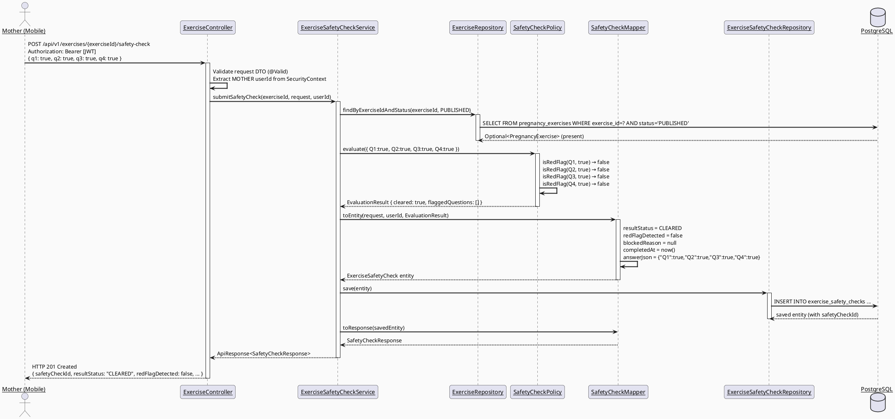
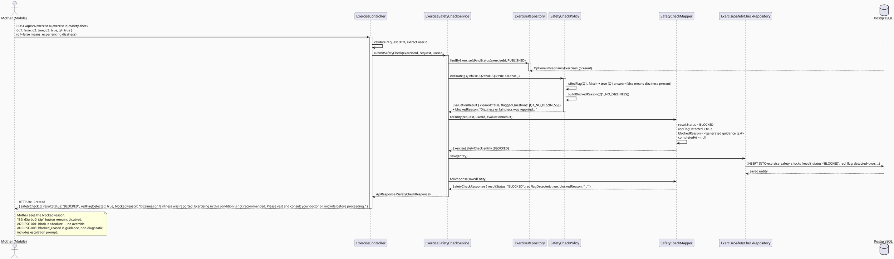
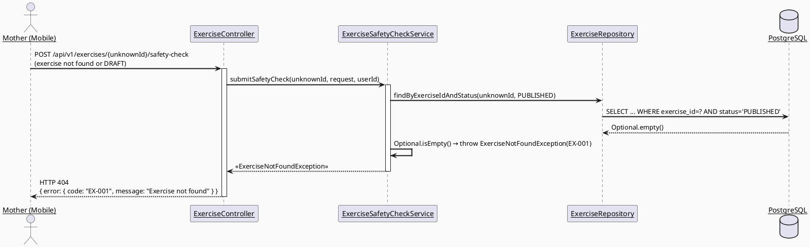
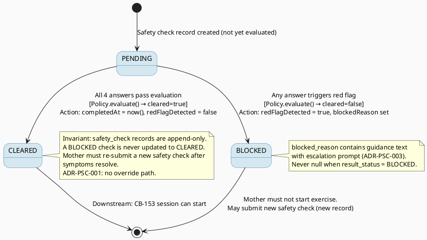

# ENGINEERING DOCUMENTATION STANDARD (EDS) v2.0
# SRS 3.3.2.4 — Complete Pre-exercise Safety Check — Technical Design Specification

| Field | Value |
|-------|-------|
| **Document ID** | `CB-EXERCISE-IMP-003` |
| **Version** | `1.0` |
| **Date** | `2026-06-28` |
| **Status** | `Implemented` |
| **Document Owner** | `PhuongNT` |
| **Author** | `AI Agent — Developer` |
| **Reviewed by** | `[ ] Pending` |
| **DPO Sign-off** | `[ ] Pending` |
| **Approved by** | `[ ] Pending` |
| **Last Review** | `2026-06-28` |
| **Based on EDS** | `v2.0` |

---

## CHANGELOG

> **Policy 4.4 — Immutable History:** Never delete old information. All changes must be recorded in this table.

| Date | Author | Change Description |
|------|--------|--------------------|
| 2026-06-28 | AI Agent — Developer | Initial document creation — TDS for SRS 3.3.2.4 Complete Pre-exercise Safety Check (UC-178). |

---

## TABLE OF CONTENTS

1. [Module Overview](#1-module-overview)
2. [Traceability Matrix](#2-traceability-matrix)
3. [Architecture Decision Records (ADR)](#3-architecture-decision-records-adr)
4. [Non-Functional Requirements & SLA](#4-non-functional-requirements--sla)
5. [Static Modeling](#5-static-modeling)
6. [Dynamic Modeling](#6-dynamic-modeling)
7. [Domain Event Catalog](#7-domain-event-catalog)
8. [Interface Specification](#8-interface-specification)
9. [API Specification](#9-api-specification)
10. [Error Codes](#10-error-codes)
11. [Deployment Steps](#11-deployment-steps)
12. [Rollback & Incident Runbook](#12-rollback--incident-runbook)
13. [Test Scenarios Reference](#13-test-scenarios-reference)
14. [Verification Methods](#14-verification-methods)
15. [API Verification Samples](#15-api-verification-samples)
16. [Authorization Matrix](#16-authorization-matrix)
17. [AI Prompt Constraints (CASE 2.0)](#17-ai-prompt-constraints-case-20)

---

## 1. Module Overview

> Allows a Mother to submit a pre-exercise safety questionnaire before starting a pregnancy exercise session. The system evaluates answers against four evidence-based red-flag criteria. If any red flag is detected, the exercise is blocked and a safe reason is communicated. If all criteria pass, a CLEARED safety check record is created that gates exercise session start.
>
> **SRS 3.3.2.4:** "Complete Pre-exercise Safety Check — Mother answers safety questions before starting. System blocks continuation when warning signs are present."
>
> **Relation to adjacent modules:**
> - **Upstream:** UC-177 `CB-EXERCISE-IMP-002` (View Exercise Detail) — Mother navigates here from the exercise detail screen.
> - **Downstream:** CB-153 (Start Exercise Session) — Session creation MUST reference a CLEARED `safety_check_id` from this module.

| Field | Value |
|-------|-------|
| **Module Name** | `Complete Pre-exercise Safety Check` |
| **Bounded Context** | `exercise` |
| **Data Classification** | `Sensitive-PII` (answers relate to physical pregnancy health status) |
| **Compliance Scope** | `BR-RBAC, BR-SAFETY, PDPA` |
| **Upstream Dependencies** | `IAM (authentication, MOTHER role), pregnancy_exercises table (V1 migration), CB-EXERCISE-IMP-002 (exercise accessible), exercise_sessions table (V1 migration — downstream gate)` |
| **Downstream Consumers** | `CB-153 — Start Exercise Session (must provide CLEARED safety_check_id)` |

**Functional Scope:**

- `POST /api/v1/exercises/{exerciseId}/safety-check` — Submit 4 safety check answers and optional notes. Returns safety check result (CLEARED or BLOCKED).
- `GET /api/v1/exercises/{exerciseId}/safety-check/latest` — Retrieve latest safety check for an exercise/user pair (for resuming flow on app restart).
- If **any** answer indicates a red flag: `result_status = 'BLOCKED'`, `red_flag_detected = true`, `blocked_reason` populated with specific guidance.
- If all 4 answers pass: `result_status = 'CLEARED'`, `completed_at` set to current time.
- A CLEARED safety check is the gate for starting an exercise session. Session creation without a CLEARED check must be rejected by the session module.
- Actor: **Mother**. Platform: **Mobile App + Backend**.
- ❌ Starting the exercise session itself → belongs to CB-153.
- ❌ Posture analysis during exercise → belongs to UC-30.
- ❌ Creating or editing exercises → belongs to Expert/Admin modules.

---

## 2. Traceability Matrix

| Requirement ID | Type (BR/ADR/US) | Requirement Description | Code Component | Compliance Target | Related ADR |
|----------------|------------------|-------------------------|----------------|-------------------|-------------|
| BR-SAFETY-001 | Business Rule | AI/system guidance must be non-diagnostic; blocked_reason must never claim to diagnose or prescribe treatment | `SafetyCheckPolicy.buildBlockedReason()` | BR-SAFETY | ADR-PSC-003 |
| BR-SAFETY-002 | Business Rule | Any red flag detected MUST block continuation — no override allowed by Mother | `ExerciseSafetyCheckService.evaluate()` | BR-SAFETY | ADR-PSC-001 |
| BR-SAFETY-003 | Business Rule | Red-flag blocked reason must include escalation guidance (e.g., "contact your doctor or midwife") | `SafetyCheckPolicy.buildBlockedReason()` | BR-SAFETY | ADR-PSC-003 |
| BR-RBAC-001 | Business Rule | Only authenticated Mothers can submit safety checks; userId from JWT only | `ExerciseSafetyCheckService`, `ExerciseController` | BR-RBAC | ADR-PSC-002 |
| BR-SAFETY-004 | Business Rule | A CLEARED safety check is required before an exercise session can start | Interface contract documented in §8 | BR-SAFETY | ADR-PSC-001 |
| BR-EXERCISE-001 | Business Rule | Only exercises with status=PUBLISHED can have a safety check submitted against them | `ExerciseSafetyCheckService.submit()` | BR-SAFETY | ADR-PSC-002 |
| US-EXERCISE-003 | User Story | Mother submits 4 health check answers before exercise; system shows CLEARED or BLOCKED result | `POST /api/v1/exercises/{exerciseId}/safety-check` | — | — |
| US-EXERCISE-004 | User Story | Mother cannot start exercise if any safety check answer indicates a red flag | BLOCKED result status + blocked_reason in response | — | — |
| ADR-PSC-001 | Decision | Any red flag blocks; CLEARED is mandatory gate for session start | `ExerciseSafetyCheckService.evaluate()` | BR-SAFETY | — |
| ADR-PSC-002 | Decision | userId sourced exclusively from JWT SecurityContext | All service methods | BR-RBAC | — |
| ADR-PSC-003 | Decision | blocked_reason text is guidance-only, non-diagnostic, always includes escalation prompt | `SafetyCheckPolicy` | BR-SAFETY | — |

---

## 3. Architecture Decision Records (ADR)

### ADR-PSC-001 — Any Red Flag Blocks Completely; No Partial Clearance

| Field | Value |
|-------|-------|
| **Status** | `Accepted` |
| **Deciders** | `PhuongNT — Developer, AI Agent` |
| **Date** | `2026-06-28` |

#### Context
> A pregnant woman may answer that she has one red-flag symptom (e.g., dizziness) but check "OK" for the other three. The question is whether the system should allow exercise for the non-flagged items or block entirely.

#### Options Considered

| Option | Description | Pros | Cons |
|--------|-------------|------|------|
| A | Block entirely if ANY answer is a red flag | + Maximum safety; consistent with obstetric conservative exercise guidance | - May frustrate users with minor transient symptoms |
| B | Allow exercise if 3+ of 4 answers pass | + More flexible UX | - Medically unsafe; dizziness alone is a contraindication to vigorous exercise in pregnancy |

#### Decision
> Choose **Option A**: `result_status = 'BLOCKED'` if `any` of the 4 evaluations returns a red flag. The `blocked_reason` will identify which specific items triggered the block, providing actionable guidance without diagnosing. CLEARED requires all 4 answers to pass.

#### Consequences

**Positive:**
- Maximum safety for mother and fetus.
- Unambiguous logic: no partial states, no edge cases in session-start gate.
- Aligns with BR-SAFETY conservative exercise guidance for pregnant women.

**Negative / Trade-offs:**
- A Mother who forgets to check one item despite feeling well must re-submit all checks. Mitigated by: the mobile UI already enforces that all 4 checkboxes must be ticked before the submit button is enabled (see `_allChecked` in existing `PreExerciseSafetyCheckScreen`).

**Compliance Impact:**
- BR-SAFETY: conservative approach required for health guidance system targeting pregnant mothers.

---

### ADR-PSC-002 — Submitted Answers Stored as JSONB; Questions Are Static Enum Constants

| Field | Value |
|-------|-------|
| **Status** | `Accepted` |
| **Deciders** | `PhuongNT — Developer, AI Agent` |
| **Date** | `2026-06-28` |

#### Context
> The `answer_json` column in `exercise_safety_checks` is JSONB. Choices: (A) store full question text + answer in JSON, (B) store only answer codes keyed to static enum question IDs, (C) store boolean array. The question text is already known from the mobile UI constants — storing redundant question text inflates payload and risks version drift.

#### Options Considered

| Option | Description | Pros | Cons |
|--------|-------------|------|------|
| A | Store full question text + boolean answer per question | + Self-describing record | - Text duplication; version drift if question text changes |
| B | Store `{ "Q1": true, "Q2": false, "Q3": true, "Q4": true }` keyed by static enum | + Compact; version stable (question text in code, not DB) | - Need code to interpret keys |
| C | Store boolean array `[true, false, true, true]` | + Compact | - Index-based coupling; fragile if questions reorder |

#### Decision
> Choose **Option B**: store `answer_json` as `{ "Q1": boolean, "Q2": boolean, "Q3": boolean, "Q4": boolean }` where each key maps to a static `SafetyQuestion` enum constant defining the question text and the red-flag evaluation rule.

#### Consequences

**Positive:**
- Compact storage; single source of truth for question text in `SafetyQuestion` enum.
- Audit record is human-readable when joined with question definitions.

**Negative / Trade-offs:**
- If a question is removed or reordered, old records will have stale keys. Mitigated by: append-only question enum — only add new questions, never reorder or remove existing ones.

**Compliance Impact:**
- PDPA: answer_json stores health status data classified as Sensitive-PII — must not appear in logs.

---

### ADR-PSC-003 — blocked_reason Is Guidance Text; Non-Diagnostic; Must Include Escalation Prompt

| Field | Value |
|-------|-------|
| **Status** | `Accepted` |
| **Deciders** | `PhuongNT — Developer, AI Agent` |
| **Date** | `2026-06-28` |

#### Context
> When a safety check is BLOCKED, the Mother needs to understand why and what to do next. The system cannot diagnose or prescribe. BR-SAFETY mandates escalation-aware guidance.

#### Options Considered

| Option | Description | Pros | Cons |
|--------|-------------|------|------|
| A | Generic message: "You did not pass. Please see a doctor." | + Safe, non-diagnostic | - Not actionable; doesn't identify which symptom triggered the block |
| B | Specific: "Dizziness detected. Exercising while dizzy is unsafe. Contact your doctor or midwife before proceeding." | + Actionable; identifies the concern; includes escalation prompt; non-diagnostic | - Slightly more text per response |

#### Decision
> Choose **Option B**: `blocked_reason` is generated by `SafetyCheckPolicy.buildBlockedReason()` per triggered question. The text must: (1) name the concern (the checked symptom), (2) state that exercise is not recommended, (3) include "consult your doctor or midwife" escalation. The text MUST NOT use diagnostic language ("you have", "you are suffering from", "this means").

#### Consequences

**Positive:**
- Actionable safety guidance for Mother.
- Escalation-aware: always prompts healthcare contact.
- Compliant with BR-SAFETY AI/system guidance constraints.

**Negative / Trade-offs:**
- Slightly longer response payload. Mitigated by: `blocked_reason` is bounded text, not generated by AI — it is pre-authored constant guidance text per question.

**Compliance Impact:**
- BR-SAFETY: system must never diagnose; text reviewed for diagnostic language at design time.

---

### ADR-PSC-004 — exercise_safety_checks Table Already Exists in V1; No New Migration Needed

| Field | Value |
|-------|-------|
| **Status** | `Accepted` |
| **Deciders** | `PhuongNT — Developer, AI Agent` |
| **Date** | `2026-06-28` |

#### Context
> The `exercise_safety_checks` table is defined in `V1__init_schema.sql` with all required columns. No new migration is necessary.

#### Decision
> No new Flyway migration for CB-EXERCISE-IMP-003. All persistence uses the `exercise_safety_checks` table from V1.

#### Consequences

**Positive:**
- No migration risk; no rollback complexity for the schema layer.

**Negative / Trade-offs:**
- None. The V1 schema covers all required columns.

---

## 4. Non-Functional Requirements & SLA

### 4.1. Performance & Availability

| Category | Requirement | Target SLA | Measurement Method | Compliance Basis |
|----------|-------------|------------|---------------------|------------------|
| Latency | POST safety-check (p99) | `< 300ms` | k6 load test | — |
| Latency | GET safety-check/latest (p99) | `< 150ms` | k6 load test | — |
| Availability | Uptime (monthly) | `99.9%` | Uptime monitor | — |
| Throughput | Concurrent submission requests | `200 req/s` | Load test | — |

### 4.2. Data Integrity & Retention

| Category | Requirement | Target | Verification Method | Compliance Basis |
|----------|-------------|--------|---------------------|------------------|
| Durability | Safety check records never deleted | Append-only (no DELETE on safety_checks) | Integration test | PDPA |
| Consistency | BLOCKED checks never gate session start | 100% — downstream module must verify CLEARED status | Contract review | BR-SAFETY |
| Audit | safety check submission logged | 100% of submissions | Log verification | PDPA |
| Completeness | answer_json always persisted with all 4 answers | 100% | Integration test | BR-SAFETY |

### 4.3. Security

| Category | Requirement | Target | Verification Method | Compliance Basis |
|----------|-------------|--------|---------------------|------------------|
| Authentication | JWT required for all endpoints | 100% | Security test | BR-RBAC |
| Authorization | MOTHER role required | Least privilege | Auth Matrix (§16) | BR-RBAC |
| User isolation | Mother can only submit/view own safety checks | 100% — userId from JWT only | Security test | BR-RBAC, PDPA |
| PII protection | answer_json must NOT appear in application logs | 100% | Log audit | PDPA |
| Encryption in transit | All endpoints | TLS 1.3+ | SSL Labs scan | PDPA |

### 4.4. Scalability & Capacity Planning

> Safety check records are written at exercise-start frequency. Estimated: 500 active mothers × 2 checks/day = 1000 records/day. The `exercise_safety_checks` table has a PK index on `safety_check_id` and implicit FK-based lookup on `(exercise_id, user_id)`. For the `GET /latest` query, an index on `(exercise_id, user_id, created_at DESC)` is required for performance — this is a composite query not covered by PK alone. However, since V1 table has no such index, and V1 must not be modified (Flyway rule), this index is added via a new migration `V{n}__add_safety_check_index.sql` (see §5.2).

> **Correction per §5.2 analysis:** The `exercise_safety_checks` table in V1 has no secondary indexes beyond PK. An additional index is required for the `GET /latest` query. A new Flyway migration adds this index only — no column additions.

---

## 5. Static Modeling

### 5.1. Class Diagram (PlantUML)

```plantuml
@startuml PSC_ClassDiagram
skinparam classAttributeIconSize 0
skinparam classFontStyle bold
skinparam backgroundColor #FAFAFA
skinparam ArrowColor #555555
skinparam ClassBorderColor #2E75B6
skinparam ClassHeaderBackgroundColor #D5E8F0

' === ENTITY ===
class ExerciseSafetyCheck {
  + safetyCheckId: UUID
  + exerciseId: UUID
  + journeyId: UUID
  + userId: UUID
  + answerJson: Map<String, Boolean>
  + redFlagDetected: Boolean
  + resultStatus: SafetyCheckStatus
  + blockedReason: String
  + completedAt: OffsetDateTime
  + createdAt: OffsetDateTime
}

note top of ExerciseSafetyCheck
  Mapped from exercise_safety_checks (V1 schema).
  result_status: PENDING | CLEARED | BLOCKED
  answerJson: { "Q1": bool, "Q2": bool, "Q3": bool, "Q4": bool }
  ADR-PSC-002
end note

' === ENUMS ===
enum SafetyCheckStatus {
  PENDING
  CLEARED
  BLOCKED
}

enum SafetyQuestion {
  Q1_NO_DIZZINESS
  Q2_NO_CONTRACTIONS
  Q3_NO_BLEEDING
  Q4_HYDRATED_AND_FED
}

note right of SafetyQuestion
  Q1: No dizziness or faintness in the past 24 hours
  Q2: No abnormal uterine contractions or abdominal pain
  Q3: No bleeding or amniotic fluid leakage
  Q4: Adequately hydrated and have had a light snack
  Each question has redFlagCondition: answer == false
end note

' === POLICY ===
class SafetyCheckPolicy {
  + evaluate(answers: Map<SafetyQuestion, Boolean>): EvaluationResult
  + buildBlockedReason(flaggedQuestions: List<SafetyQuestion>): String
  - isRedFlag(question: SafetyQuestion, answer: Boolean): Boolean
}

note right of SafetyCheckPolicy
  BR-SAFETY-001: non-diagnostic guidance only.
  BR-SAFETY-003: escalation prompt mandatory.
  ADR-PSC-003.
end note

class EvaluationResult {
  + cleared: Boolean
  + flaggedQuestions: List<SafetyQuestion>
}

' === DTOs ===
class SubmitSafetyCheckRequest {
  + exerciseId: UUID
  + journeyId: UUID (optional)
  + q1NoDizziness: Boolean
  + q2NoContractions: Boolean
  + q3NoBleeding: Boolean
  + q4HydratedAndFed: Boolean
  + notes: String (optional)
}

class SafetyCheckResponse {
  + safetyCheckId: UUID
  + exerciseId: UUID
  + resultStatus: String
  + redFlagDetected: Boolean
  + blockedReason: String
  + completedAt: OffsetDateTime
  + createdAt: OffsetDateTime
}

' === SERVICE ===
interface IExerciseSafetyCheckService <<interface>> {
  + submitSafetyCheck(exerciseId: UUID, request: SubmitSafetyCheckRequest, userId: UUID): ApiResponse<SafetyCheckResponse>
  + getLatestSafetyCheck(exerciseId: UUID, userId: UUID): ApiResponse<SafetyCheckResponse>
}

class ExerciseSafetyCheckService implements IExerciseSafetyCheckService {
  - safetyCheckRepository: ExerciseSafetyCheckRepository
  - exerciseRepository: ExerciseRepository
  - safetyCheckMapper: SafetyCheckMapper
  - safetyCheckPolicy: SafetyCheckPolicy
  + submitSafetyCheck(exerciseId: UUID, request: SubmitSafetyCheckRequest, userId: UUID): ApiResponse<SafetyCheckResponse>
  + getLatestSafetyCheck(exerciseId: UUID, userId: UUID): ApiResponse<SafetyCheckResponse>
}

' === MAPPER ===
class SafetyCheckMapper {
  + toEntity(request: SubmitSafetyCheckRequest, userId: UUID, result: EvaluationResult): ExerciseSafetyCheck
  + toResponse(entity: ExerciseSafetyCheck): SafetyCheckResponse
  - answersToJson(request: SubmitSafetyCheckRequest): Map<String, Boolean>
}

' === EXCEPTION ===
class SafetyCheckException {
  + code: String
  + message: String
  + httpStatus: HttpStatus
}

' === REPOSITORY ===
interface ExerciseSafetyCheckRepository <<interface>> {
  + save(entity: ExerciseSafetyCheck): ExerciseSafetyCheck
  + findTopByExerciseIdAndUserIdOrderByCreatedAtDesc(exerciseId: UUID, userId: UUID): Optional<ExerciseSafetyCheck>
  + findBySafetyCheckId(id: UUID): Optional<ExerciseSafetyCheck>
}

' === CONTROLLER (extends ExerciseController) ===
class ExerciseController {
  - safetyCheckService: IExerciseSafetyCheckService
  + submitSafetyCheck(exerciseId: UUID, request: SubmitSafetyCheckRequest): ResponseEntity<ApiResponse<SafetyCheckResponse>>
  + getLatestSafetyCheck(exerciseId: UUID): ResponseEntity<ApiResponse<SafetyCheckResponse>>
}

' === RELATIONSHIPS ===
ExerciseController --> IExerciseSafetyCheckService : uses
ExerciseSafetyCheckService --> ExerciseSafetyCheckRepository : uses
ExerciseSafetyCheckService --> ExerciseRepository : uses (verify PUBLISHED)
ExerciseSafetyCheckService --> SafetyCheckPolicy : uses
ExerciseSafetyCheckService --> SafetyCheckMapper : uses
ExerciseSafetyCheckService ..> SafetyCheckException : throws
SafetyCheckPolicy --> SafetyQuestion : evaluates
SafetyCheckPolicy --> EvaluationResult : produces
ExerciseSafetyCheck --> SafetyCheckStatus : status
SafetyCheckMapper --> ExerciseSafetyCheck : produces

@enduml
```



### 5.2. Data Structure

> **CareBridge rule:** The `exercise_safety_checks` table already exists in `V1__init_schema.sql`. No new table is needed.
> However, the `GET /latest` query requires `(exercise_id, user_id, created_at DESC)` index that does not exist in V1.
> A new migration adds this performance index only.

**No new migration required for table structure.**

A new migration is needed for the query performance index:

```sql
-- === EXERCISE SAFETY CHECK — QUERY INDEX ===
-- File: src/main/resources/db/migration/V{n}__add_safety_check_query_index.sql
-- Purpose: Support GET /latest endpoint query performance
-- No column additions — table structure unchanged from V1.

CREATE INDEX IF NOT EXISTS idx_safety_checks_exercise_user_created
    ON public.exercise_safety_checks (exercise_id, user_id, created_at DESC);

-- Note: safety_check_id is already a PK with implicit index.
-- This composite index covers the most frequent lookup pattern:
--   WHERE exercise_id = ? AND user_id = ? ORDER BY created_at DESC LIMIT 1
```

**Existing V1 table reference (for context):**
```sql
-- From V1__init_schema.sql (DO NOT MODIFY — reference only):
CREATE TABLE public.exercise_safety_checks (
    safety_check_id   uuid        NOT NULL DEFAULT gen_random_uuid(),
    exercise_id       uuid        NOT NULL,
    journey_id        uuid,
    user_id           uuid        NOT NULL,
    answer_json       jsonb,
    red_flag_detected boolean     NOT NULL DEFAULT false,
    result_status     varchar(20) NOT NULL DEFAULT 'PENDING',
    blocked_reason    text,
    completed_at      timestamptz,
    created_at        timestamptz NOT NULL DEFAULT now()
);
-- Existing PK: PRIMARY KEY (safety_check_id) [inferred]
-- No FK constraints defined in V1 (loose coupling).
```

---

## 6. Dynamic Modeling

### 6.1. Sequence Diagram — Happy Path: All Checks Passed (CLEARED)



### 6.2. Sequence Diagram — Blocked Path: Red Flag Detected



### 6.3. Sequence Diagram — Error Path: Exercise Not Found or Not PUBLISHED



### 6.4. State Machine — Safety Check Result Status



> **Invariants (never violated):**
> 1. A `BLOCKED` safety check record is never mutated to `CLEARED`.
> 2. `blocked_reason` is never null when `result_status = 'BLOCKED'`.
> 3. `completed_at` is always set when `result_status = 'CLEARED'`, always null when `BLOCKED`.
> 4. `red_flag_detected = true` always co-occurs with `result_status = 'BLOCKED'`.

---

## 7. Domain Event Catalog

### 7.1. Events Published

| Event Name | Trigger | Publisher | Subscriber(s) | Payload Schema | Async? |
|------------|---------|-----------|---------------|----------------|--------|
| `ExerciseSafetyCheckCleared` | `result_status = CLEARED` set | `ExerciseSafetyCheckService` | `CB-153 Session Start` (future — for audit/gate verification) | See §7.3 | No (synchronous response — downstream verifies via API) |
| `ExerciseSafetyCheckBlocked` | `result_status = BLOCKED` set | `ExerciseSafetyCheckService` | Notification module (future — optional alert to healthcare provider) | See §7.3 | No (MVP: logged only) |

### 7.2. Events Consumed

| Event Name | Source | Handler | Action |
|------------|--------|---------|--------|
| _(none)_ | — | — | Module does not consume upstream events. Reads `pregnancy_exercises` table directly. |

### 7.3. Payload Schema

```java
// ExerciseSafetyCheckCleared.java
public record ExerciseSafetyCheckCleared(
    UUID    eventId,          // UUID.randomUUID() — for deduplication
    String  eventType,        // "ExerciseSafetyCheckCleared"
    Instant occurredAt,       // Instant.now()
    String  version,          // "1.0"
    Payload payload,
    Metadata metadata
) {
    public record Payload(
        UUID safetyCheckId,   // Primary key of the cleared safety check
        UUID exerciseId,      // The exercise this check is for
        UUID userId,          // The Mother's user ID
        UUID journeyId        // Optional — pregnancy journey context
    ) {}

    public record Metadata(
        UUID   correlationId, // For request tracing
        String causedBy       // userId of the Mother
    ) {}
}
```

---

## 8. Interface Specification

### 8.1. Request DTOs

```java
// SubmitSafetyCheckRequest.java
// @version 1.0
public class SubmitSafetyCheckRequest {

    @NotNull(message = "q1NoDizziness is required")
    private Boolean q1NoDizziness;       // true = no dizziness; false = dizziness present (RED FLAG)

    @NotNull(message = "q2NoContractions is required")
    private Boolean q2NoContractions;    // true = no contractions; false = contractions present (RED FLAG)

    @NotNull(message = "q3NoBleeding is required")
    private Boolean q3NoBleeding;        // true = no bleeding/fluid; false = bleeding/fluid present (RED FLAG)

    @NotNull(message = "q4HydratedAndFed is required")
    private Boolean q4HydratedAndFed;    // true = hydrated and snacked; false = not prepared (RED FLAG)

    private UUID journeyId;              // Optional — pregnancy journey context for the session

    @Size(max = 500, message = "Notes must not exceed 500 characters")
    private String notes;                // Optional — Mother's additional observations (stored in answer_json.notes)

    // getters / setters / @Valid annotations
}
```

### 8.2. Response DTO

```java
// SafetyCheckResponse.java
// @version 1.0
public class SafetyCheckResponse {
    private UUID safetyCheckId;          // Persisted PK — used by CB-153 as session gate key
    private UUID exerciseId;             // Exercise this check is for
    private String resultStatus;         // "CLEARED" or "BLOCKED" (PENDING is internal only)
    private Boolean redFlagDetected;     // true if BLOCKED
    private String blockedReason;        // Guidance text (non-null if BLOCKED, null if CLEARED)
    private OffsetDateTime completedAt;  // Set if CLEARED, null if BLOCKED
    private OffsetDateTime createdAt;    // Timestamp of submission
    // getters / setters
}
```

### 8.3. Service Interface

```java
// IExerciseSafetyCheckService.java
// @version 1.0
public interface IExerciseSafetyCheckService {

    /**
     * Submit a pre-exercise safety check for the given exercise.
     * Evaluates 4 safety questions and returns CLEARED or BLOCKED result.
     * Records are always persisted regardless of outcome (audit trail).
     *
     * @param exerciseId target exercise (must be PUBLISHED — EX-001 if not)
     * @param request    4 boolean answers + optional notes
     * @param userId     authenticated Mother's user ID (from JWT — BR-RBAC-001)
     * @return ApiResponse<SafetyCheckResponse> — HTTP 201 with safetyCheckId
     * @throws ExerciseNotFoundException (EX-001) if exercise not found or not PUBLISHED
     * @throws SafetyCheckSubmissionException (PSC-001) if request validation fails
     */
    ApiResponse<SafetyCheckResponse> submitSafetyCheck(
        UUID exerciseId,
        SubmitSafetyCheckRequest request,
        UUID userId
    );

    /**
     * Get the most recent safety check for the given exercise/user pair.
     * Used by the mobile app to restore state after navigation or app restart.
     *
     * @param exerciseId target exercise
     * @param userId     authenticated Mother's user ID (from JWT)
     * @return ApiResponse<SafetyCheckResponse>
     * @throws SafetyCheckNotFoundException (PSC-002) if no safety check exists for this pair
     */
    ApiResponse<SafetyCheckResponse> getLatestSafetyCheck(UUID exerciseId, UUID userId);
}
```

### 8.4. Repository Interface

```java
// ExerciseSafetyCheckRepository.java
// @version 1.0
public interface ExerciseSafetyCheckRepository
        extends JpaRepository<ExerciseSafetyCheck, UUID> {

    /**
     * Find the most recent safety check for a given exercise+user pair.
     * Requires idx_safety_checks_exercise_user_created index (§5.2 migration).
     * Returns Optional.empty() if no record exists (Mother has never submitted for this exercise).
     */
    Optional<ExerciseSafetyCheck> findTopByExerciseIdAndUserIdOrderByCreatedAtDesc(
        UUID exerciseId, UUID userId);

    // Note: No delete method — records are append-only (PDPA audit requirement).
}
```

### 8.5. SafetyCheckPolicy Interface

```java
// SafetyCheckPolicy.java
// @version 1.0
// @domain-rule BR-SAFETY-001, BR-SAFETY-002, BR-SAFETY-003, ADR-PSC-003
public class SafetyCheckPolicy {

    /**
     * Evaluate 4 safety answers against red-flag criteria.
     * A red flag occurs when the Mother's answer indicates a symptom is PRESENT.
     * Q1: answer=false means dizziness IS present → red flag
     * Q2: answer=false means contractions ARE present → red flag
     * Q3: answer=false means bleeding/fluid IS present → red flag
     * Q4: answer=false means NOT hydrated/fed → red flag
     *
     * @param answers map of SafetyQuestion → Boolean (true = symptom absent = safe)
     * @return EvaluationResult with cleared flag and list of flagged questions
     */
    public EvaluationResult evaluate(Map<SafetyQuestion, Boolean> answers) { ... }

    /**
     * Build a non-diagnostic, escalation-aware blocked reason string.
     * Must mention which symptom(s) triggered the block.
     * Must include "consult your doctor or midwife" guidance.
     * Must NOT use diagnostic language ("you have [condition]", "you are suffering from").
     *
     * @param flaggedQuestions list of questions that returned red-flag evaluation
     * @return non-null, non-empty guidance text (ADR-PSC-003)
     */
    public String buildBlockedReason(List<SafetyQuestion> flaggedQuestions) { ... }
}
```

---

## 9. API Specification

### 9.1. Endpoints Table

| Method | Path | Auth Level | Required Roles | Rate Limit | Idempotent? |
|--------|------|------------|----------------|------------|-------------|
| `POST` | `/api/v1/exercises/{exerciseId}/safety-check` | JWT Bearer | `MOTHER` | 30/min | No (creates new record each call) |
| `GET` | `/api/v1/exercises/{exerciseId}/safety-check/latest` | JWT Bearer | `MOTHER` | 120/min | Yes |

### 9.2. Request / Response Schemas

#### `POST /api/v1/exercises/{exerciseId}/safety-check` — Submit Safety Check

**Path Parameters:**

| Parameter | Type | Required | Description |
|-----------|------|----------|-------------|
| `exerciseId` | UUID | Yes | Exercise to perform safety check for |

**Request Body:**
```json
{
  "q1NoDizziness": true,
  "q2NoContractions": true,
  "q3NoBleeding": true,
  "q4HydratedAndFed": true,
  "journeyId": "550e8400-e29b-41d4-a716-446655440002",
  "notes": "Feeling good, had a light meal 30 minutes ago."
}
```

**Field Rules:**
- `q1NoDizziness`: **required**, boolean. `true` = no dizziness (safe). `false` = dizziness present → RED FLAG.
- `q2NoContractions`: **required**, boolean. `true` = no abnormal contractions (safe). `false` → RED FLAG.
- `q3NoBleeding`: **required**, boolean. `true` = no bleeding or amniotic fluid leakage (safe). `false` → RED FLAG.
- `q4HydratedAndFed`: **required**, boolean. `true` = hydrated and had a light snack (safe). `false` → RED FLAG.
- `journeyId`: optional UUID — links safety check to a pregnancy journey.
- `notes`: optional string, max 500 chars — Mother's additional observations.

**Response — 201 Created (Happy Path — CLEARED):**
```json
{
  "data": {
    "safetyCheckId": "a1b2c3d4-e5f6-7890-abcd-ef1234567890",
    "exerciseId": "550e8400-e29b-41d4-a716-446655440001",
    "resultStatus": "CLEARED",
    "redFlagDetected": false,
    "blockedReason": null,
    "completedAt": "2026-06-28T08:30:00.000Z",
    "createdAt": "2026-06-28T08:30:00.000Z"
  }
}
```

**Response — 201 Created (BLOCKED — red flag detected):**
```json
{
  "data": {
    "safetyCheckId": "b2c3d4e5-f6a7-8901-bcde-f12345678901",
    "exerciseId": "550e8400-e29b-41d4-a716-446655440001",
    "resultStatus": "BLOCKED",
    "redFlagDetected": true,
    "blockedReason": "Dizziness or faintness was reported. It is not recommended to exercise while experiencing dizziness as it may indicate reduced blood flow. Please rest and consult your doctor or midwife before proceeding with physical activity.",
    "completedAt": null,
    "createdAt": "2026-06-28T08:31:00.000Z"
  }
}
```

> **Note:** Both CLEARED and BLOCKED results return HTTP 201. The BLOCKED result still represents a successfully processed submission — the safety check record was created and stored. The mobile app reads `resultStatus` to determine whether to enable session start.

**Response — 400 Bad Request (Missing required answer):**
```json
{
  "error": {
    "code": "PSC-001",
    "message": "Safety check validation failed",
    "details": [
      { "field": "q1NoDizziness", "message": "q1NoDizziness is required" }
    ]
  }
}
```

**Response — 404 Not Found (Exercise not found or not PUBLISHED):**
```json
{
  "error": {
    "code": "EX-001",
    "message": "Exercise not found"
  }
}
```

**Response — 401 Unauthorized:**
```json
{
  "error": {
    "code": "IAM-001",
    "message": "Authentication required"
  }
}
```

**Response — 403 Forbidden (wrong role):**
```json
{
  "error": {
    "code": "IAM-002",
    "message": "Insufficient permissions"
  }
}
```

---

#### `GET /api/v1/exercises/{exerciseId}/safety-check/latest` — Get Latest Safety Check

**Path Parameters:**

| Parameter | Type | Required | Description |
|-----------|------|----------|-------------|
| `exerciseId` | UUID | Yes | Exercise to query latest check for |

**Response — 200 OK:**
```json
{
  "data": {
    "safetyCheckId": "a1b2c3d4-e5f6-7890-abcd-ef1234567890",
    "exerciseId": "550e8400-e29b-41d4-a716-446655440001",
    "resultStatus": "CLEARED",
    "redFlagDetected": false,
    "blockedReason": null,
    "completedAt": "2026-06-28T08:30:00.000Z",
    "createdAt": "2026-06-28T08:30:00.000Z"
  }
}
```

**Response — 404 Not Found (No safety check exists for this exercise/user):**
```json
{
  "error": {
    "code": "PSC-002",
    "message": "No safety check found for this exercise"
  }
}
```

---

## 10. Error Codes

| Code | HTTP Status | Message (EN) | Trigger Condition |
|------|-------------|--------------|-------------------|
| `PSC-001` | 400 | Safety check validation failed | One or more required answer fields (q1–q4) are missing or not boolean |
| `PSC-002` | 404 | No safety check found for this exercise | GET /latest called but no record exists for exercise+user pair |
| `PSC-003` | 500 | Safety check could not be persisted | DB write failure (transient) |
| `EX-001` | 404 | Exercise not found | `exerciseId` not found or not PUBLISHED (shared with CB-EXERCISE-IMP-002) |
| `EX-003` | 400 | Invalid exercise ID format | `exerciseId` path variable is not a valid UUID |
| `IAM-001` | 401 | Authentication required | Missing or expired JWT |
| `IAM-002` | 403 | Insufficient permissions | User does not have MOTHER role |

> **Security note:** BLOCKED result returns HTTP 201 (not 4xx) because the submission was accepted and processed successfully. `resultStatus = "BLOCKED"` in the response body signals the Mother that she cannot proceed. This distinction is important — a 4xx for BLOCKED would be a UX anti-pattern (the request was valid; the outcome is safety-guided).

---

## 11. Deployment Steps

### 11.1. Prerequisites

- [ ] `CB-EXERCISE-IMP-002` (UC-177 View Exercise Detail) implemented and tests passing — shared `ExerciseRepository` and `ExerciseNotFoundException` must exist.
- [ ] V1 migration with `exercise_safety_checks` table already applied.
- [ ] Package `com.carebridge.backend.exercise` exists with existing controller, entity, repository layers.

### 11.2. Pre-Migration Checklist

- [x] `exercise_safety_checks` table exists from V1 migration — no structural migration needed.
- [ ] New migration `V{n}__add_safety_check_query_index.sql` ready for the composite index (§5.2).
- [ ] Migration tested on staging ≥ 24 hours before production deploy.
- [ ] Index creation is online (PostgreSQL `CREATE INDEX IF NOT EXISTS` on small table — low risk).

### 11.3. Implementation Steps

#### Stage 1 — Add Query Index Migration

Create: `src/main/resources/db/migration/V{n}__add_safety_check_query_index.sql`

Content (from §5.2):
```sql
CREATE INDEX IF NOT EXISTS idx_safety_checks_exercise_user_created
    ON public.exercise_safety_checks (exercise_id, user_id, created_at DESC);
```

Run migration:
```bash
./mvnw flyway:migrate
```

#### Stage 2 — Create Entity: ExerciseSafetyCheck

Create in `com.carebridge.backend.exercise.entity`:
- `ExerciseSafetyCheck.java` — JPA entity mapping `exercise_safety_checks` table.
- `SafetyCheckStatus.java` — enum: `PENDING`, `CLEARED`, `BLOCKED`.
- `SafetyQuestion.java` — enum: `Q1_NO_DIZZINESS`, `Q2_NO_CONTRACTIONS`, `Q3_NO_BLEEDING`, `Q4_HYDRATED_AND_FED`.

#### Stage 3 — Create Policy: SafetyCheckPolicy

Create in `com.carebridge.backend.exercise.policy`:
- `SafetyCheckPolicy.java` — evaluation logic and blocked_reason text generation.
- Pre-authored `blocked_reason` text constants per question (non-diagnostic, escalation-aware).

#### Stage 4 — Create DTOs and Mapper

Create in `com.carebridge.backend.exercise.dto`:
- `SubmitSafetyCheckRequest.java` — @Valid annotated request DTO.
- `SafetyCheckResponse.java` — response DTO.

Create in `com.carebridge.backend.exercise.mapper`:
- `SafetyCheckMapper.java` — entity ↔ DTO mapping with JSONB serialization.

#### Stage 5 — Create Repository

Create in `com.carebridge.backend.exercise.repository`:
- `ExerciseSafetyCheckRepository.java` — JpaRepository with `findTopByExerciseIdAndUserIdOrderByCreatedAtDesc`.

#### Stage 6 — Create Service

Create in `com.carebridge.backend.exercise.service`:
- `IExerciseSafetyCheckService.java` — interface (§8.3).
- `ExerciseSafetyCheckService.java` — implementation. Inject `ExerciseSafetyCheckRepository`, `ExerciseRepository`, `SafetyCheckMapper`, `SafetyCheckPolicy`.

#### Stage 7 — Extend Controller

Add to `ExerciseController.java`:
```java
@PostMapping("/{exerciseId}/safety-check")
@PreAuthorize("hasAnyRole('MOTHER', 'ADMIN', 'SYSTEM')")
public ResponseEntity<ApiResponse<SafetyCheckResponse>> submitSafetyCheck(
        @PathVariable UUID exerciseId,
        @RequestBody @Valid SubmitSafetyCheckRequest request) {
    UUID userId = extractUserIdFromSecurityContext();
    return ResponseEntity.status(HttpStatus.CREATED)
            .body(safetyCheckService.submitSafetyCheck(exerciseId, request, userId));
}

@GetMapping("/{exerciseId}/safety-check/latest")
@PreAuthorize("hasAnyRole('MOTHER', 'ADMIN', 'SYSTEM')")
public ResponseEntity<ApiResponse<SafetyCheckResponse>> getLatestSafetyCheck(
        @PathVariable UUID exerciseId) {
    UUID userId = extractUserIdFromSecurityContext();
    return ResponseEntity.ok(safetyCheckService.getLatestSafetyCheck(exerciseId, userId));
}
```

> Controller extracts userId from `SecurityContextHolder`. No userId in request body or query params (BR-RBAC-001, ADR-PSC-002).

#### Stage 8 — Connect Mobile App

Update `pre_exercise_safety_check_screen.dart`:
- Replace `Navigator.of(context).pop(true)` with an API call to `POST /api/v1/exercises/{exerciseId}/safety-check`.
- Pass `exerciseId` (UUID) as a required constructor parameter.
- Display `blockedReason` text to Mother when `resultStatus = "BLOCKED"`.
- On CLEARED: pass `safetyCheckId` to the next screen (CB-153 session start).

#### Stage 9 — Verification After Deploy

```bash
# Health check
curl -X GET https://[host]/api/v1/health
# Expected: {"status": "ok"}

# Submit cleared check
curl -X POST "https://[host]/api/v1/exercises/[PUBLISHED_UUID]/safety-check" \
  -H "Authorization: Bearer [MOTHER_JWT]" \
  -H "Content-Type: application/json" \
  -d '{"q1NoDizziness":true,"q2NoContractions":true,"q3NoBleeding":true,"q4HydratedAndFed":true}'
# Expected: 201 with resultStatus="CLEARED"
```

### 11.4. Deployment Checklist

- [ ] Migration `V{n}__add_safety_check_query_index.sql` ran successfully.
- [ ] Health check endpoint returns 200.
- [ ] `POST /safety-check` returns 201 with CLEARED for all-true answers.
- [ ] `POST /safety-check` returns 201 with BLOCKED for any false answer.
- [ ] `blockedReason` is non-null and non-diagnostic when BLOCKED.
- [ ] `answer_json` NOT present in application logs.
- [ ] `GET /safety-check/latest` returns 200 after submission.
- [ ] Error rate < 1% in first 10 minutes.

---

## 12. Rollback & Incident Runbook

### 12.1. Rollback Trigger Conditions

| Condition | Threshold | Decision Owner |
|-----------|-----------|----------------|
| Error rate spike | > 5% in 5 minutes | On-call Engineer |
| Latency p99 exceeds threshold | > 2x baseline (>600ms) | On-call Engineer |
| `answer_json` appearing in logs (PII leak) | Any occurrence | Tech Lead + DPO |
| BLOCKED safety check permits session start | Any occurrence | Tech Lead |
| `blockedReason` contains diagnostic language | Any occurrence | Tech Lead |

### 12.2. Rollback Procedure

```bash
# Step 1: Revert deployment
kubectl rollout undo deployment/carebridge-api

# Step 2: Verify rollback
kubectl rollout status deployment/carebridge-api
curl -X GET https://[host]/api/v1/health

# Step 3: Revert migration index (safe — no data loss, index only)
psql -h $DB_HOST -U $DB_USER -d $DB_NAME \
  -c "DROP INDEX IF EXISTS idx_safety_checks_exercise_user_created;"
psql -h $DB_HOST -U $DB_USER -d $DB_NAME \
  -c "DELETE FROM flyway_schema_history WHERE version = '{n}';"

# Step 4: Smoke test previous version
./mvnw test -pl 05_Development/CareBridgeAPI
```

> **Note:** The `exercise_safety_checks` table data is append-only — submitted records are NOT rolled back. Only the application code and the query index are reverted.

### 12.3. Notification Protocol

| Timing | Recipients | Channel | Template |
|--------|-----------|---------|----------|
| Immediately | On-call team | Slack `#incident` | "SAFETY-CHECK incident: [description]" |
| Within 30 min | DPO | Email | **Required** if `answer_json` (health data) leaked — PDPA Art. 37 |
| Within 72 hours | Data Protection Authority | Email | Required if personal health data breach confirmed |

### 12.4. Post-Incident Review (PIR)

> Complete PIR within 48 hours. Due to Sensitive-PII classification (health status answers), any data incident requires DPO involvement and authority notification per PDPA.

---

## 13. Test Scenarios Reference

> Full test specifications in `04_Implement/UC178_CompletePreExerciseSafetyCheck/UC178_CompletePreExerciseSafetyCheck_Test-Spec.md`

| Scenario | Type | TC ID |
|----------|------|-------|
| All 4 answers true → CLEARED | Unit | PSC-TC-001 |
| Q1 false → BLOCKED, non-diagnostic reason | Unit | PSC-TC-002 |
| Q3 false → BLOCKED (bleeding red flag) | Unit | PSC-TC-003 |
| Multiple red flags → single BLOCKED | Unit | PSC-TC-004 |
| blockedReason includes "doctor or midwife" | Unit | PSC-TC-005 |
| blockedReason does NOT contain diagnostic language | Unit | PSC-TC-006 |
| Exercise not PUBLISHED → 404 EX-001 | Unit | PSC-TC-007 |
| Missing q1 → 400 PSC-001 | Unit | PSC-TC-008 |
| Full flow: submit + verify DB | Integration | PSC-TC-INT-001 |
| GET /latest returns most recent check | Integration | PSC-TC-INT-002 |
| No JWT → 401 | Security | PSC-TC-SEC-001 |
| Non-MOTHER role → 403 | Security | PSC-TC-SEC-002 |
| answer_json absent from logs | Security | PSC-TC-SEC-003 |
| Cannot access other user's safety check | Security | PSC-TC-SEC-004 |
| Mobile: all checks → API call submitted | Widget | PSC-TC-MOB-001 |
| Mobile: BLOCKED shows blockedReason | Widget | PSC-TC-MOB-002 |

---

## 14. Verification Methods

### 14.1. Database Inspection

```sql
-- Verify CLEARED safety check was persisted
SELECT safety_check_id, exercise_id, user_id, result_status,
       red_flag_detected, blocked_reason, completed_at, created_at
FROM exercise_safety_checks
WHERE safety_check_id = '[test-uuid]';
-- Expected (CLEARED): result_status='CLEARED', red_flag_detected=false, blocked_reason=NULL, completed_at IS NOT NULL

-- Verify BLOCKED safety check was persisted
SELECT safety_check_id, result_status, red_flag_detected, blocked_reason, completed_at
FROM exercise_safety_checks
WHERE user_id = '[test-mother-uuid]'
ORDER BY created_at DESC
LIMIT 5;
-- Expected (BLOCKED): result_status='BLOCKED', red_flag_detected=true, blocked_reason IS NOT NULL, completed_at IS NULL

-- Verify answer_json structure
SELECT answer_json
FROM exercise_safety_checks
WHERE safety_check_id = '[test-uuid]';
-- Expected: {"Q1": true, "Q2": true, "Q3": true, "Q4": true}

-- Verify composite index exists
SELECT indexname, indexdef
FROM pg_indexes
WHERE tablename = 'exercise_safety_checks'
  AND indexname = 'idx_safety_checks_exercise_user_created';
-- Expected: 1 row

-- Verify append-only: no updates allowed
SELECT COUNT(*) FROM exercise_safety_checks WHERE safety_check_id = '[uuid]';
-- After submit: 1. Should never change.
```

### 14.2. Log / Audit Verification

```bash
# Verify answer_json does NOT appear in logs (PDPA — health data must not be logged)
kubectl logs -l app=carebridge-api | grep -i "answer_json\|q1Nodizz\|q2NoCont\|q3NoBleed\|q4Hydrat"
# Expected: NO output

# Verify blockedReason text does not contain diagnostic language
kubectl logs -l app=carebridge-api | grep -i "you have\|you are suffering\|diagnos\|prescri"
# Expected: NO output in safety-check related log lines

# Verify safety check submission events logged at INFO level
kubectl logs -l app=carebridge-api | grep '"event":"safety_check_submitted"'
# Expected: entries with safetyCheckId, resultStatus (NOT answer_json content)
```

### 14.3. Tool-based Verification

```bash
# Verify JWT required
curl -X POST "https://[host]/api/v1/exercises/[PUBLISHED_UUID]/safety-check" \
  -H "Content-Type: application/json" \
  -d '{"q1NoDizziness":true,"q2NoContractions":true,"q3NoBleeding":true,"q4HydratedAndFed":true}'
# Expected: 401

# Verify CLEARED path
curl -X POST "https://[host]/api/v1/exercises/[PUBLISHED_UUID]/safety-check" \
  -H "Authorization: Bearer [MOTHER_JWT]" \
  -H "Content-Type: application/json" \
  -d '{"q1NoDizziness":true,"q2NoContractions":true,"q3NoBleeding":true,"q4HydratedAndFed":true}'
# Expected: 201, resultStatus="CLEARED", completedAt not null

# Verify BLOCKED path (q1 false = dizziness present)
curl -X POST "https://[host]/api/v1/exercises/[PUBLISHED_UUID]/safety-check" \
  -H "Authorization: Bearer [MOTHER_JWT]" \
  -H "Content-Type: application/json" \
  -d '{"q1NoDizziness":false,"q2NoContractions":true,"q3NoBleeding":true,"q4HydratedAndFed":true}'
# Expected: 201, resultStatus="BLOCKED", redFlagDetected=true, blockedReason not null

# Verify GET /latest
curl -X GET "https://[host]/api/v1/exercises/[PUBLISHED_UUID]/safety-check/latest" \
  -H "Authorization: Bearer [MOTHER_JWT]"
# Expected: 200, returns most recent check
```

---

## 15. API Verification Samples

### 15.1. Happy Path — CLEARED

```bash
# Submit safety check — all clear
curl -X POST "https://[host]/api/v1/exercises/550e8400-e29b-41d4-a716-446655440001/safety-check" \
  -H "Authorization: Bearer [MOTHER_JWT]" \
  -H "Content-Type: application/json" \
  -H "X-Correlation-Id: $(uuidgen)" \
  -d '{
    "q1NoDizziness": true,
    "q2NoContractions": true,
    "q3NoBleeding": true,
    "q4HydratedAndFed": true,
    "notes": "Feeling good today."
  }'
```

**Expected Response (201 — CLEARED):**
```json
{
  "data": {
    "safetyCheckId": "a1b2c3d4-e5f6-7890-abcd-ef1234567890",
    "exerciseId": "550e8400-e29b-41d4-a716-446655440001",
    "resultStatus": "CLEARED",
    "redFlagDetected": false,
    "blockedReason": null,
    "completedAt": "2026-06-28T08:30:00.000Z",
    "createdAt": "2026-06-28T08:30:00.000Z"
  }
}
```

### 15.2. Error Paths

```bash
# Submit safety check — dizziness present (q1=false)
curl -X POST "https://[host]/api/v1/exercises/550e8400-e29b-41d4-a716-446655440001/safety-check" \
  -H "Authorization: Bearer [MOTHER_JWT]" \
  -H "Content-Type: application/json" \
  -d '{"q1NoDizziness":false,"q2NoContractions":true,"q3NoBleeding":true,"q4HydratedAndFed":true}'
```

**Expected Response (201 — BLOCKED):**
```json
{
  "data": {
    "safetyCheckId": "b2c3d4e5-f6a7-8901-bcde-f12345678901",
    "exerciseId": "550e8400-e29b-41d4-a716-446655440001",
    "resultStatus": "BLOCKED",
    "redFlagDetected": true,
    "blockedReason": "Dizziness or faintness was reported. It is not recommended to exercise while experiencing dizziness as it may indicate reduced blood flow. Please rest and consult your doctor or midwife before proceeding with physical activity.",
    "completedAt": null,
    "createdAt": "2026-06-28T08:31:00.000Z"
  }
}
```

```bash
# Missing required field → 400
curl -X POST "https://[host]/api/v1/exercises/[UUID]/safety-check" \
  -H "Authorization: Bearer [MOTHER_JWT]" \
  -H "Content-Type: application/json" \
  -d '{"q1NoDizziness":true,"q2NoContractions":true}'
```

**Expected Response (400):**
```json
{
  "error": {
    "code": "PSC-001",
    "message": "Safety check validation failed",
    "details": [
      { "field": "q3NoBleeding", "message": "q3NoBleeding is required" },
      { "field": "q4HydratedAndFed", "message": "q4HydratedAndFed is required" }
    ]
  }
}
```

```bash
# No JWT → 401
curl -X POST "https://[host]/api/v1/exercises/[UUID]/safety-check" \
  -H "Content-Type: application/json" \
  -d '{"q1NoDizziness":true,"q2NoContractions":true,"q3NoBleeding":true,"q4HydratedAndFed":true}'
```

**Expected Response (401):**
```json
{
  "error": {
    "code": "IAM-001",
    "message": "Authentication required"
  }
}
```

```bash
# GET /latest — no prior submission
curl -X GET "https://[host]/api/v1/exercises/[UUID]/safety-check/latest" \
  -H "Authorization: Bearer [MOTHER_JWT]"
```

**Expected Response (404):**
```json
{
  "error": {
    "code": "PSC-002",
    "message": "No safety check found for this exercise"
  }
}
```

---

## 16. Authorization Matrix

| Endpoint | `GUEST` | `MOTHER` | `EXPERT` | `ADMIN` | `SYSTEM` |
|----------|---------|----------|----------|---------|----------|
| `POST /api/v1/exercises/{exerciseId}/safety-check` | ❌ | ✅ Own | ❌ | ✅ | ✅ |
| `GET /api/v1/exercises/{exerciseId}/safety-check/latest` | ❌ | ✅ Own | ❌ | ✅ | ✅ |

**Notes:**
- ✅ = Permitted
- ❌ = Denied (401 if no JWT; 403 if wrong role)
- `Own` = Mother can only access safety checks where `user_id` matches her JWT subject. The system enforces this by extracting `userId` exclusively from JWT SecurityContext (ADR-PSC-002) — no `userId` parameter accepted in request.
- EXPERT cannot submit or view Mother's safety checks — these are personal health records.

---

## 17. AI Prompt Constraints (CASE 2.0)

### 17.1 Constraint Summary Table

| # | Constraint | Source (ADR/BR) | Last Verified |
|---|-----------|-----------------|---------------|
| C1 | `submitSafetyCheck()` MUST call `exerciseRepository.findByExerciseIdAndStatus(exerciseId, PUBLISHED)` first. Throw `ExerciseNotFoundException(EX-001)` if empty. | `BR-EXERCISE-001`, `ADR-PSC-002` | `2026-06-28` |
| C2 | ANY `false` answer triggers red flag. `result_status = 'BLOCKED'` when ANY of Q1–Q4 is false. ALL FOUR must be `true` for CLEARED. No partial clearance, no override. | `BR-SAFETY-002`, `ADR-PSC-001` | `2026-06-28` |
| C3 | `blocked_reason` MUST be pre-authored constant text. Must include "consult your doctor or midwife". Must NOT contain "you have [disease]" or "you are suffering from". Must NOT be generated dynamically by an AI/LLM at runtime. | `BR-SAFETY-001`, `BR-SAFETY-003`, `ADR-PSC-003` | `2026-06-28` |
| C4 | `userId` MUST come from `SecurityContextHolder.getContext().getAuthentication()`. NEVER accept userId from request body, query params, or path variable. | `BR-RBAC-001`, `ADR-PSC-002` | `2026-06-28` |
| C5 | `answer_json` (health data) MUST NOT appear in application logs or audit trail payloads. Log only `safetyCheckId` and `resultStatus`. | `PDPA`, `ADR-PSC-002` | `2026-06-28` |
| C6 | `ExerciseController` methods MUST NOT contain safety evaluation logic. Controller only validates DTO, extracts userId from SecurityContext, delegates to service. | `CLAUDE.md Architecture Rules` | `2026-06-28` |
| C7 | `SafetyCheckPolicy` is the ONLY class that performs red-flag evaluation. No red-flag logic in Service or Controller. Policy is a pure domain object (no @Service, no @Repository injected). | `CLAUDE.md Architecture Rules`, `ADR-PSC-001` | `2026-06-28` |
| C8 | Both CLEARED and BLOCKED submissions return HTTP 201. A BLOCKED result is a valid, processed response — not an error. Only truly invalid requests (missing fields, wrong auth) return 4xx. | `ADR-PSC-001`, `§9 API Spec` | `2026-06-28` |
| C9 | This module does NOT start an exercise session. It only creates the safety check record. Session start belongs to CB-153. `ExerciseSafetyCheckService` MUST NOT import or reference any session-start service or entity. | `§1 Scope boundaries` | `2026-06-28` |

### 17.2 Constraint Injection Block (Copy-Paste into AI Prompt)

```
[CONSTRAINT BLOCK — Module: Complete Pre-exercise Safety Check (CB-EXERCISE-IMP-003)]
Per TDS CB-EXERCISE-IMP-003 v1.0 and related ADRs:

1. [C1] Always call exerciseRepository.findByExerciseIdAndStatus(exerciseId, PUBLISHED) first. Throw ExerciseNotFoundException(EX-001) if empty. Never skip this check.
2. [C2] BLOCKED if ANY answer is false. CLEARED only if ALL FOUR answers are true. No partial clearance. No override (ADR-PSC-001, BR-SAFETY-002).
3. [C3] blocked_reason = pre-authored constant text. Include "consult your doctor or midwife". No diagnostic language ("you have...", "you are suffering..."). Never generated by LLM at runtime (BR-SAFETY-001, ADR-PSC-003).
4. [C4] userId from SecurityContextHolder ONLY. Never from request body, path variable, or query param (BR-RBAC-001).
5. [C5] answer_json MUST NOT appear in logs. Log only safetyCheckId + resultStatus (PDPA).
6. [C6] Controller: validate DTO + extract userId + delegate. NO safety logic in controller.
7. [C7] SafetyCheckPolicy is the ONLY class with red-flag evaluation. Pure domain object, no Spring beans injected.
8. [C8] CLEARED and BLOCKED both return HTTP 201. Only malformed/unauthorized requests return 4xx.
9. [C9] Do NOT import or reference session-start services. This module ends at SafetyCheckResponse. CB-153 is downstream.

[CONTEXT BLOCK]
- Bounded Context: exercise
- Data Classification: Sensitive-PII (health status answers)
- Compliance: BR-RBAC, BR-SAFETY, PDPA
- Upstream: CB-EXERCISE-IMP-002 (shared ExerciseRepository, ExerciseNotFoundException)
- Existing interfaces: §8 Service Interface + §8.4 Repository Interface
- Error codes: §10 Error Codes Table
- Auth matrix: §16 Authorization Matrix

[TASK BLOCK]
Implement submitSafetyCheck() and getLatestSafetyCheck() satisfying all constraints above.
Output must conform to §8 Interface Specification.
Tests must cover §13 Test Scenarios.
```

### 17.3 Constraint Quality Checklist

- [x] Each constraint traceable to a specific ADR or BR
- [x] No generic constraints ("use best practices" → rejected)
- [x] Each constraint has a Last Verified date ≤ 2 sprints
- [x] Constraint block has ≥ 3 specific constraints (has 9)
- [x] Constraint block references §8 Interface Specification
- [x] Constraint block references §16 Authorization Matrix

### 17.4 Anti-Pattern Detection

| AP-ID | Anti-Pattern | Indicator | Action |
|-------|-------------|-----------|--------|
| AP-AI-001 | Unconstrained Gen | Code does not reference any C1–C9 constraint | Reject — re-inject constraint block |
| AP-AI-002 | Green-from-Birth | Safety check tests PASS with empty/throw stub | Reject — rewrite with Props Isolation Pattern |
| AP-AI-003 | Implicit Decision | Code allows BLOCKED override or partial clearance (no ADR for this) | Reject — ADR-PSC-001 prohibits any override |
| AP-AI-004 | Layer Violation | Red-flag logic in Controller or Service (should be in SafetyCheckPolicy only) | Reject — C7 mandates Policy isolation |
| AP-AI-005 | Hallucinated Contract | Code imports `ExerciseSessionService`, `PostureAnalysisService`, or CB-153 classes | Reject — C9 prohibits cross-module coupling |
| AP-AI-006 | PII Logging | Code logs `answerJson`, `q1NoDizziness`, or other health answers | Reject — C5, PDPA violation |

---

## APPENDIX

### A. Glossary

| Term | Definition |
|------|------------|
| Red Flag | A health indicator (answer=false) that mandates blocking exercise continuation for safety |
| CLEARED | Safety check result where all 4 questions pass; gates session start |
| BLOCKED | Safety check result where ≥ 1 question indicates a red flag; blocks session start |
| blocked_reason | Pre-authored guidance text shown to Mother when BLOCKED; non-diagnostic; includes escalation prompt |
| SafetyCheckPolicy | Domain class containing all red-flag evaluation logic and blocked_reason text generation |
| answer_json | JSONB column storing `{ "Q1": bool, "Q2": bool, "Q3": bool, "Q4": bool }` — classified as Sensitive-PII |
| Sensitive-PII | Personally Identifiable Information of a sensitive nature (health data) — highest data protection level |
| DPO | Data Protection Officer |
| Escalation Prompt | Mandatory phrase in blocked_reason: "consult your doctor or midwife" |
| PDPA | Personal Data Protection Act — governs health data handling |

### B. Reference Documents

| Document | Path |
|----------|------|
| SRS 3.3.2.4 | `01_Requirements/SRS/Report3_Software Requirement Specification.docx.md` |
| UC-177 Detail spec (CB-EXERCISE-IMP-002) | `04_Implement/UC177_ViewPregnancyExerciseDetail/` |
| UC-178 Test-Spec | `04_Implement/UC178_CompletePreExerciseSafetyCheck/UC178_CompletePreExerciseSafetyCheck_Test-Spec.md` |
| V1 Schema | `05_Development/CareBridgeAPI/src/main/resources/db/migration/V1__init_schema.sql` |
| Mobile safety check screen | `05_Development/CareBridgeMobileApp/lib/features/exercise/screens/pre_exercise_safety_check_screen.dart` |
| CASE 2.0 Methodology | `vii_reports/FPT-EDU-REP-METH-002_CASE_AI_METHODOLOGY_v1.1.md` |
