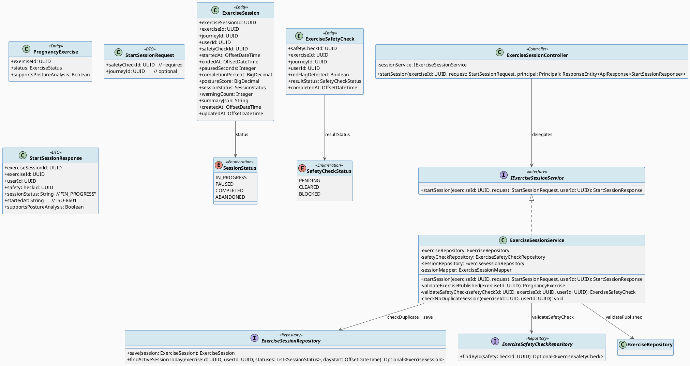
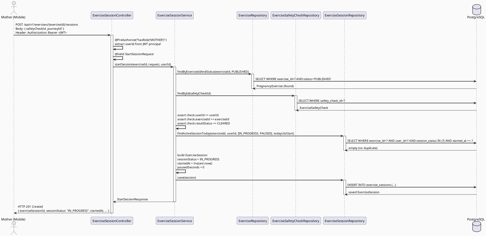
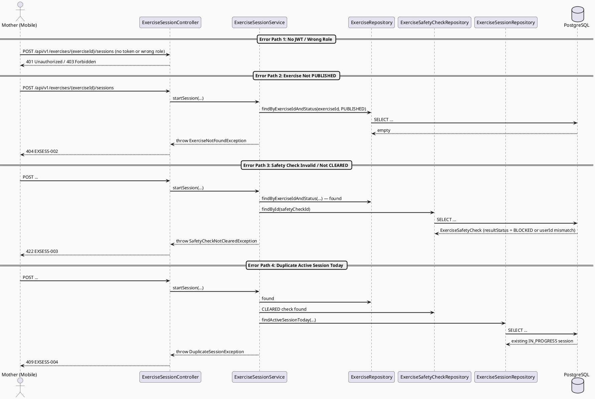
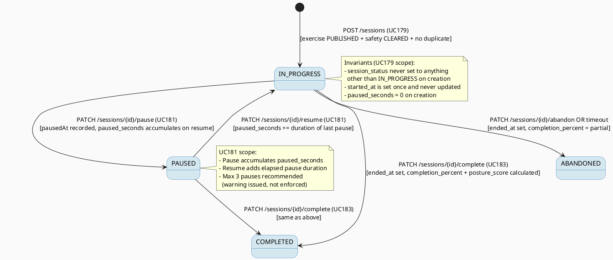

# ENGINEERING DOCUMENTATION STANDARD (EDS) v2.0
# SRS 3.3.2.5 — Start Exercise Session — Technical Design Specification

| Field | Value |
|-------|-------|
| **Document ID** | `CB-EXERCISE-IMP-003` |
| **Version** | `1.0` |
| **Date** | `2026-06-28` |
| **Status** | `Implemented` |
| **Document Owner** | `PhuongNT` |
| **Author** | `AI Agent — Developer` |
| **Reviewed by** | `[ ] Pending` |
| **DPO Sign-off** | `[ ] Pending` |
| **Approved by** | `[ ] Pending` |
| **Last Review** | `2026-06-28` |
| **Based on EDS** | `v2.0` |

---

## CHANGELOG

> **Policy 4.4 — Immutable History:** Never delete old information. All changes must be recorded in this table.

| Date | Author | Change Description |
|------|--------|--------------------|
| 2026-06-28 | AI Agent — Developer | Initial document creation — TDS for SRS 3.3.2.5 Start Exercise Session |

---

## TABLE OF CONTENTS

1. [Module Overview](#1-module-overview)
2. [Traceability Matrix](#2-traceability-matrix)
3. [Architecture Decision Records (ADR)](#3-architecture-decision-records-adr)
4. [Non-Functional Requirements & SLA](#4-non-functional-requirements--sla)
5. [Static Modeling](#5-static-modeling)
6. [Dynamic Modeling](#6-dynamic-modeling)
7. [Domain Event Catalog](#7-domain-event-catalog)
8. [Interface Specification](#8-interface-specification)
9. [API Specification](#9-api-specification)
10. [Error Codes](#10-error-codes)
11. [Deployment Steps](#11-deployment-steps)
12. [Rollback & Incident Runbook](#12-rollback--incident-runbook)
13. [Detailed Test Scenarios](#13-detailed-test-scenarios)
14. [Verification Methods](#14-verification-methods)
15. [API Verification Samples](#15-api-verification-samples)
16. [Authorization Matrix](#16-authorization-matrix)
17. [AI Prompt Constraints (CASE 2.0)](#17-ai-prompt-constraints-case-20)

---

## 1. Module Overview

> Creates an exercise session record after the Mother selects an exercise and the pre-exercise safety check passes. This is the entry point for the exercise execution flow.
>
> **SRS 3.3.2.5:** "Start Exercise Session — After the safety check passes (SRS 3.3.2.4), the system creates an exercise_session record and begins tracking timing and posture."
>
> **Relationship with adjacent UCs:**
> - **Upstream:** UC177 (View Exercise Detail, SRS 3.3.2.3) — Mother selects the exercise → UC30 (Complete Pre-exercise Safety Check, SRS 3.3.2.4) — safety gate must be CLEARED.
> - **Downstream (same session):** UC181 (Pause/Resume, SRS 3.3.2.7), UC30/UC183 (Complete Session, SRS 3.3.2.9).
> - **State machine owner:** The `exercise_sessions` table and `session_status` column are authoritative. No client-side state is trusted.

| Field | Value |
|-------|-------|
| **Module Name** | `Start Exercise Session` |
| **Bounded Context** | `exercise` |
| **Data Classification** | `Internal` |
| **Compliance Scope** | `BR-RBAC, BR-SAFETY` |
| **Upstream Dependencies** | `IAM (authentication/JWT), pregnancy_exercises (V1 migration), exercise_safety_checks (V1 migration), CB-EXERCISE-IMP-001/002 (shared entity/repo/mapper)` |
| **Downstream Consumers** | `UC181 — Pause/Resume Exercise Session (SRS 3.3.2.7), Posture Analysis (SRS 3.3.2.6), Session Completion (SRS 3.3.2.9)` |

**Functional Scope:**
- `POST /api/v1/exercises/{exerciseId}/sessions` — creates an `exercise_sessions` record with `session_status = IN_PROGRESS`.
- Validates that the exercise has `status = PUBLISHED`.
- Validates that a `safety_check_id` is provided and the referenced `exercise_safety_checks` record has `result_status = CLEARED` for the same user.
- Rejects if there is an existing `IN_PROGRESS` or `PAUSED` session for the same `(user_id, exercise_id)` pair today (UTC).
- Returns the created session including `exercise_session_id`, `started_at`, and `session_status`.
- Actor: **Mother**. Platform: **Mobile App + Backend**.
- ❌ Posture analysis during session → out of scope (SRS 3.3.2.6).
- ❌ Pause/resume logic → belongs to UC181 (CB-EXERCISE-IMP-004).
- ❌ Session completion → belongs to UC183.

---

## 2. Traceability Matrix

| Requirement ID | Type (BR/ADR/US) | Requirement Description | Code Component | Compliance Target | Related ADR |
|----------------|------------------|------------------------|----------------|-------------------|-------------|
| BR-SESSION-001 | Business Rule | Exercise must have `status = PUBLISHED` before a session can start | `ExerciseSessionService.startSession()`, `ExerciseRepository.findByExerciseIdAndStatus()` | BR-SAFETY | ADR-SES-001 |
| BR-SESSION-002 | Business Rule | `safety_check_id` must reference a `CLEARED` safety check belonging to the same user and exercise | `ExerciseSessionService.validateSafetyCheck()`, `ExerciseSafetyCheckRepository.findById()` | BR-SAFETY | ADR-SES-002 |
| BR-SESSION-003 | Business Rule | At most one active (IN_PROGRESS or PAUSED) session per (user_id, exercise_id) per UTC day | `ExerciseSessionRepository.findActiveSessionToday()`, `ExerciseSessionService.checkDuplicateSession()` | BR-SAFETY | ADR-SES-003 |
| BR-RBAC-001 | Business Rule | Only authenticated Mother role may create a session | `ExerciseSessionController` `@PreAuthorize("hasRole('MOTHER')")` | BR-RBAC | — |
| US-SESSION-001 | User Story | Mother starts a session and receives a session ID to track progress | `ExerciseSessionController.POST /api/v1/exercises/{exerciseId}/sessions` | — | — |
| ADR-SES-001 | Decision | Exercise status re-validated server-side at session start (not trusted from client) | `ExerciseSessionService` | BR-SAFETY | — |
| ADR-SES-002 | Decision | Safety check validated by `safety_check_id` (FK reference), not by client timestamp | `ExerciseSafetyCheckRepository` | BR-SAFETY | — |
| ADR-SES-003 | Decision | `paused_seconds` aggregated column used instead of separate pause-event rows | `exercise_sessions.paused_seconds` | — | ADR-SES-004 |
| ADR-SES-004 | Decision | Duplicate session check uses UTC-day window, not 24-hour rolling window | `ExerciseSessionRepository` | BR-SAFETY | — |

---

## 3. Architecture Decision Records (ADR)

### ADR-SES-001 — Re-validate Exercise Status Server-Side at Session Start

| Field | Value |
|-------|-------|
| **Status** | `Accepted` |
| **Deciders** | `PhuongNT — Developer, AI Agent` |
| **Date** | `2026-06-28` |
| **Supersedes** | `—` |

#### Context
The mobile client already displays only PUBLISHED exercises (UC29/CB-EXERCISE-IMP-001). However, an exercise could be transitioned to DRAFT or ARCHIVED between when the Mother viewed it and when she taps "Start". Trusting the client state creates a safety gap.

#### Options Considered

| Option | Description | Pros | Cons |
|--------|-------------|------|------|
| A | Re-query exercise by ID + status at session creation time | Correct, simple, stateless | One extra DB read per session start |
| B | Trust client-provided exercise status | Zero extra read | Incorrect — exercise may have changed state |

#### Decision
Choose **Option A** — re-query `pregnancy_exercises` by `exercise_id AND status = 'PUBLISHED'` inside `ExerciseSessionService.startSession()`. If not found, return `EXSESS-002 (404)`.

#### Consequences

**Positive:**
- Eliminates race condition where exercise is archived between listing and session start.
- Consistent with BR-SAFETY policy.

**Negative / Trade-offs:**
- One additional DB read per session start. Acceptable at expected session-start volume (< 100/min).

**Compliance Impact:**
- Required by BR-SAFETY: AI/system provides guidance only; must not allow unsafe exercise initiation.

---

### ADR-SES-002 — Validate Safety Check by FK Reference, Not Client Timestamp

| Field | Value |
|-------|-------|
| **Status** | `Accepted` |
| **Deciders** | `PhuongNT — Developer, AI Agent` |
| **Date** | `2026-06-28` |

#### Context
The client submits a `safetyCheckId` to assert that a pre-exercise safety check was completed. The server must verify this FK reference points to a real, CLEARED check for the same user and exercise — not merely that a timestamp exists or that the client claims completion.

#### Options Considered

| Option | Description | Pros | Cons |
|--------|-------------|------|------|
| A | Validate `safety_check_id` FK → check `user_id`, `exercise_id`, `result_status = CLEARED` | Tamper-proof | Requires DB lookup |
| B | Validate by timestamp alone (check completed within last N hours) | Simple | Client can forge timestamp; PII exposure risk |
| C | Skip safety check validation (assume client completed it) | Zero latency | Violates BR-SAFETY — unsafe for pregnant users |

#### Decision
Choose **Option A** — look up the `exercise_safety_checks` record by `safety_check_id`, verify `user_id` matches JWT subject, `exercise_id` matches path param, and `result_status = CLEARED`. Reject with `EXSESS-003` otherwise.

#### Consequences

**Positive:**
- Tamper-proof safety gate for a healthcare-critical flow.
- `red_flag_detected = true` records are never accepted (CLEARED status requires no red flag).

**Negative / Trade-offs:**
- Additional DB read. Acceptable for safety-critical path.

**Compliance Impact:**
- Directly enforces BR-SAFETY: system must not initiate exercise for users with red-flagged safety checks.

---

### ADR-SES-003 — Duplicate Session Check (UTC-Day Window)

| Field | Value |
|-------|-------|
| **Status** | `Accepted` |
| **Deciders** | `PhuongNT — Developer, AI Agent` |
| **Date** | `2026-06-28` |

#### Context
A Mother may accidentally tap "Start" twice or navigate back and restart. Multiple simultaneous IN_PROGRESS sessions for the same exercise would produce incoherent posture score data. A deduplication gate is required.

#### Options Considered

| Option | Description | Pros | Cons |
|--------|-------------|------|------|
| A | UTC-day window: reject if IN_PROGRESS or PAUSED session exists for same (user_id, exercise_id) on today's UTC date | Predictable for users; aligns with daily exercise tracking patterns | UTC midnight may be unexpected for late-night timezones |
| B | 24-hour rolling window | More user-intuitive (no midnight reset) | Complex query; harder to test deterministically |

#### Decision
Choose **Option A** — UTC-day window. Query: `started_at >= CURRENT_DATE AND session_status IN ('IN_PROGRESS', 'PAUSED')`. Return `EXSESS-004 (409)` if a duplicate is found.

#### Consequences

**Positive:**
- Deterministic, easy to test. Aligns with existing daily log patterns (baby logs, health metrics).

**Negative / Trade-offs:**
- UTC midnight may reset availability for users in late timezones. Document in user-facing help text.

---

### ADR-SES-004 — Aggregate `paused_seconds` in Session Row (Not Event Log)

| Field | Value |
|-------|-------|
| **Status** | `Accepted` |
| **Deciders** | `PhuongNT — Developer, AI Agent` |
| **Date** | `2026-06-28` |

#### Context
Two design options exist for tracking pause/resume timing: (1) a separate `exercise_pause_events` table with individual pause-start / pause-end timestamps, or (2) an aggregated `paused_seconds` column on `exercise_sessions` updated on each resume.

The existing V1 schema uses Option 2: `paused_seconds integer NOT NULL DEFAULT 0`. No new migration is required.

#### Options Considered

| Option | Description | Pros | Cons |
|--------|-------------|------|------|
| A | `paused_seconds` column on `exercise_sessions` (current schema) | No migration needed; simple arithmetic for net active time | Loses granular pause history |
| B | Separate `exercise_pause_events` table | Full audit trail of each pause | Requires new migration; over-engineered for MVP |

#### Decision
Choose **Option A** — honor the existing V1 schema. `paused_seconds` is accumulated on each resume event (UC181). Net active time = `(ended_at - started_at) - INTERVAL '{{paused_seconds}} seconds'`.

#### Consequences

**Positive:**
- No Flyway migration needed. Consistent with V1 schema oracle.

**Negative / Trade-offs:**
- No granular pause history. Acceptable at MVP stage — can be added via migration in a future sprint if analytics require it.

---

## 4. Non-Functional Requirements & SLA

### 4.1. Performance & Availability

| Category | Requirement | Target SLA | Measurement Method | Compliance Basis |
|----------|-------------|------------|---------------------|------------------|
| Latency | API response (p99) for POST /sessions | `< 400ms` | k6 load test | — |
| Availability | Uptime (monthly) | `99.9%` | Uptime monitor | — |
| Throughput | Concurrent session-start requests | `100 req/s` | Load test | — |
| DB connection | Session creation transaction | `< 100ms` | APM trace | — |

### 4.2. Data Integrity & Retention

| Category | Requirement | Target | Verification Method | Compliance Basis |
|----------|-------------|--------|---------------------|------------------|
| Durability | Zero session record loss on commit | RPO = 0 | Transaction log | — |
| Idempotency | Duplicate prevention per UTC-day window | 409 on duplicate | Integration test | ADR-SES-003 |
| FK integrity | `safety_check_id` must reference valid row | DB constraint + service check | Unit test | BR-SAFETY |

### 4.3. Security

| Category | Requirement | Target | Verification Method | Compliance Basis |
|----------|-------------|--------|---------------------|------------------|
| Authentication | JWT Bearer required on all endpoints | 401 without token | Auth test | BR-RBAC |
| Authorization | Only MOTHER role may start sessions | 403 for other roles | Auth test | BR-RBAC |
| Encryption in transit | All endpoints | TLS 1.3+ | SSL Labs scan | — |
| Safety gate | Red-flagged safety check must never create session | `EXSESS-003` returned | Unit + integration test | BR-SAFETY |

### 4.4. Scalability & Capacity Planning

> Expected load: ~500 active mothers in pilot, peak ~50 concurrent session starts during morning exercise hour. Solution: stateless service, horizontal scaling behind load balancer. No caching needed for write path.

---

## 5. Static Modeling

### 5.1. Class Diagram (PlantUML)



### 5.2. Data Structure

> **No new migration required.** The `exercise_sessions` and `exercise_safety_checks` tables already exist in `V1__init_schema.sql`. The oracle source is:
> `05_Development/CareBridgeAPI/src/main/resources/db/migration/V1__init_schema.sql`

Key columns used by UC179:

```sql
-- exercise_sessions (already in V1)
exercise_session_id uuid        PRIMARY KEY DEFAULT gen_random_uuid(),
exercise_id         uuid        NOT NULL,   -- FK to pregnancy_exercises
journey_id          uuid,                   -- optional FK to mother_journeys
user_id             uuid        NOT NULL,   -- FK to users (JWT subject)
safety_check_id     uuid,                   -- FK to exercise_safety_checks (validated)
started_at          timestamptz NOT NULL,   -- set to NOW() on create
paused_seconds      integer     NOT NULL DEFAULT 0,
session_status      varchar(20) NOT NULL DEFAULT 'IN_PROGRESS',
warning_count       integer     NOT NULL DEFAULT 0,
created_at          timestamptz NOT NULL DEFAULT now(),
updated_at          timestamptz NOT NULL DEFAULT now()
```

---

## 6. Dynamic Modeling

### 6.1. Sequence Diagram — Happy Path (PlantUML)



### 6.2. Sequence Diagram — Error Paths (PlantUML)



### 6.3. State Machine — exercise_sessions.session_status



---

## 7. Domain Event Catalog

### 7.1. Events Published

| Event Name | Trigger | Publisher | Subscriber(s) | Payload Schema | Async? |
|------------|---------|-----------|---------------|----------------|--------|
| `ExerciseSessionStarted` | Successful POST /sessions (201 Created) | `ExerciseSessionService` | Notification Service (future), Analytics (future) | See §7.3 | No (synchronous for MVP; async via Spring Events in future) |

### 7.2. Events Consumed

| Event Name | Source | Handler | Action |
|------------|--------|---------|--------|
| _(none for this UC)_ | — | — | — |

### 7.3. Payload Schema

```java
// ExerciseSessionStarted.java
public record ExerciseSessionStarted(
    UUID    eventId,        // UUID.randomUUID() — for deduplication
    String  eventType,      // "ExerciseSessionStarted"
    Instant occurredAt,     // Instant.now()
    String  version,        // "1.0"
    Payload payload,
    Metadata metadata
) {
    public record Payload(
        UUID    exerciseSessionId,
        UUID    exerciseId,
        UUID    userId,
        UUID    safetyCheckId,
        Instant startedAt,
        String  sessionStatus    // "IN_PROGRESS"
    ) {}

    public record Metadata(
        UUID   correlationId,    // X-Correlation-Id header value
        String causedBy          // userId (JWT subject)
    ) {}
}
```

---

## 8. Interface Specification

> **Policy (EDS v2.0):** All interfaces declare `@version`. Breaking changes require a new ADR.

### 8.1. Service Interface

```java
// StartSessionRequest.java — @version 1.0
public class StartSessionRequest {
    @NotNull(message = "safetyCheckId is required")
    private UUID safetyCheckId;

    private UUID journeyId;   // optional — links session to a pregnancy journey

    // getters / setters
}

// StartSessionResponse.java — @version 1.0
public class StartSessionResponse {
    private UUID    exerciseSessionId;
    private UUID    exerciseId;
    private UUID    userId;
    private UUID    safetyCheckId;
    private UUID    journeyId;
    private String  sessionStatus;          // "IN_PROGRESS"
    private String  startedAt;              // ISO-8601 UTC
    private Boolean supportsPostureAnalysis;// from pregnancy_exercises
    // getters / setters
}

// IExerciseSessionService.java — @version 1.0
public interface IExerciseSessionService {

    /**
     * Creates an IN_PROGRESS exercise session after validating exercise status,
     * safety check clearance, and duplicate-session guard.
     *
     * @param exerciseId    UUID from path variable
     * @param request       StartSessionRequest (safetyCheckId required)
     * @param userId        UUID extracted from JWT principal
     * @return              StartSessionResponse with exerciseSessionId and startedAt
     * @throws ExerciseNotFoundException        (EXSESS-002) if exercise not found or not PUBLISHED
     * @throws SafetyCheckNotClearedException   (EXSESS-003) if safety check invalid or not CLEARED
     * @throws DuplicateSessionException        (EXSESS-004) if active session already exists today
     */
    StartSessionResponse startSession(UUID exerciseId, StartSessionRequest request, UUID userId);
}
```

### 8.2. Repository Interface

```java
// ExerciseSessionRepository.java — @version 1.0
public interface ExerciseSessionRepository extends JpaRepository<ExerciseSession, UUID> {

    /**
     * Find an active (IN_PROGRESS or PAUSED) session for a given (user, exercise) pair
     * started on or after the given UTC-day boundary.
     */
    @Query("""
        SELECT s FROM ExerciseSession s
        WHERE s.exerciseId = :exerciseId
          AND s.userId = :userId
          AND s.sessionStatus IN :statuses
          AND s.startedAt >= :dayStart
    """)
    Optional<ExerciseSession> findActiveSessionToday(
        @Param("exerciseId") UUID exerciseId,
        @Param("userId") UUID userId,
        @Param("statuses") List<SessionStatus> statuses,
        @Param("dayStart") OffsetDateTime dayStart
    );
}

// ExerciseSafetyCheckRepository.java — @version 1.0
public interface ExerciseSafetyCheckRepository extends JpaRepository<ExerciseSafetyCheck, UUID> {
    // Inherits findById(UUID) from JpaRepository
}
```

### 8.3. Entity

```java
// ExerciseSession.java — @version 1.0
@Entity
@Table(name = "exercise_sessions")
@Getter @Setter @NoArgsConstructor @AllArgsConstructor
public class ExerciseSession {

    @Id
    @Column(name = "exercise_session_id")
    private UUID exerciseSessionId;

    @Column(name = "exercise_id", nullable = false)
    private UUID exerciseId;

    @Column(name = "journey_id")
    private UUID journeyId;

    @Column(name = "user_id", nullable = false)
    private UUID userId;

    @Column(name = "safety_check_id")
    private UUID safetyCheckId;

    @Column(name = "started_at", nullable = false)
    private OffsetDateTime startedAt;

    @Column(name = "ended_at")
    private OffsetDateTime endedAt;

    @Column(name = "paused_seconds", nullable = false)
    private Integer pausedSeconds = 0;

    @Column(name = "completion_percent")
    private BigDecimal completionPercent;

    @Column(name = "posture_score")
    private BigDecimal postureScore;

    @Enumerated(EnumType.STRING)
    @Column(name = "session_status", nullable = false, length = 20)
    private SessionStatus sessionStatus = SessionStatus.IN_PROGRESS;

    @Column(name = "warning_count", nullable = false)
    private Integer warningCount = 0;

    @Column(name = "summary_json", columnDefinition = "jsonb")
    private String summaryJson;

    @Column(name = "created_at", nullable = false)
    private OffsetDateTime createdAt;

    @Column(name = "updated_at", nullable = false)
    private OffsetDateTime updatedAt;
}

// SessionStatus.java
public enum SessionStatus {
    IN_PROGRESS, PAUSED, COMPLETED, ABANDONED
}
```

---

## 9. API Specification

### 9.1. Endpoints Table

| Method | Path | Auth Level | Required Roles | Rate Limit | Idempotent? |
|--------|------|------------|----------------|------------|-------------|
| `POST` | `/api/v1/exercises/{exerciseId}/sessions` | JWT Bearer | `MOTHER` | 30/min per user | No |

### 9.2. Request / Response Schemas

#### `POST /api/v1/exercises/{exerciseId}/sessions` — Start Session

**Path Parameter:**
- `exerciseId` (UUID, required) — the exercise to start

**Request Body:**
```json
{
  "safetyCheckId": "a1b2c3d4-e5f6-7890-abcd-ef1234567890",
  "journeyId": "f0e1d2c3-b4a5-9687-8765-0123456789ab"
}
```

**Response — 201 Created (Happy Path):**
```json
{
  "data": {
    "exerciseSessionId": "550e8400-e29b-41d4-a716-446655440001",
    "exerciseId": "550e8400-e29b-41d4-a716-446655440000",
    "userId": "550e8400-e29b-41d4-a716-446655440010",
    "safetyCheckId": "a1b2c3d4-e5f6-7890-abcd-ef1234567890",
    "journeyId": "f0e1d2c3-b4a5-9687-8765-0123456789ab",
    "sessionStatus": "IN_PROGRESS",
    "startedAt": "2026-06-28T07:00:00.000Z",
    "supportsPostureAnalysis": true
  }
}
```

**Response — 400 Bad Request (Validation Error):**
```json
{
  "error": {
    "code": "EXSESS-001",
    "message": "Validation failed",
    "details": [
      { "field": "safetyCheckId", "message": "safetyCheckId is required" }
    ]
  }
}
```

**Response — 404 Not Found (Exercise Not Published):**
```json
{
  "error": {
    "code": "EXSESS-002",
    "message": "Exercise not found or not available for starting a session"
  }
}
```

**Response — 422 Unprocessable Entity (Safety Check Not Cleared):**
```json
{
  "error": {
    "code": "EXSESS-003",
    "message": "Safety check is not cleared. Please complete the pre-exercise safety check before starting."
  }
}
```

**Response — 409 Conflict (Duplicate Session):**
```json
{
  "error": {
    "code": "EXSESS-004",
    "message": "An active or paused session already exists for this exercise today. Please complete or abandon it first."
  }
}
```

**Response — 401 Unauthorized:**
```json
{
  "error": {
    "code": "IAM-001",
    "message": "Authentication required"
  }
}
```

**Response — 403 Forbidden:**
```json
{
  "error": {
    "code": "IAM-002",
    "message": "Insufficient permissions. Only MOTHER role can start exercise sessions."
  }
}
```

---

## 10. Error Codes

| Code | HTTP Status | Message (EN) | Trigger Condition |
|------|-------------|--------------|-------------------|
| `EXSESS-001` | 400 | Validation failed | `safetyCheckId` is null or malformed UUID |
| `EXSESS-002` | 404 | Exercise not found or not available | Exercise does not exist OR `status != PUBLISHED` |
| `EXSESS-003` | 422 | Safety check is not cleared | `resultStatus != CLEARED`, or userId/exerciseId mismatch on safety check, or safetyCheckId not found |
| `EXSESS-004` | 409 | Duplicate active session today | IN_PROGRESS or PAUSED session already exists for same (user, exercise) today (UTC) |
| `EXSESS-005` | 500 | Internal error during session creation | Unexpected DB error or constraint violation |
| `IAM-001` | 401 | Authentication required | Missing or expired JWT |
| `IAM-002` | 403 | Insufficient permissions | Authenticated user does not have `MOTHER` role |

---

## 11. Deployment Steps

### 11.1. Prerequisites

- [ ] ADR-SES-001 through ADR-SES-004 Accepted
- [ ] Blueprint reviewed by Principal Architect
- [ ] Staging environment available with V1 migration applied

### 11.2. Pre-Implementation Checklist

- [ ] Confirm `exercise_sessions` table exists in staging DB with `session_status` default `'IN_PROGRESS'`
- [ ] Confirm `exercise_safety_checks` table exists with `result_status` column
- [ ] Confirm existing `ExerciseRepository` and `ExerciseSafetyCheckRepository` can be reused or extended

### 11.3. Implementation Steps

#### Step 1 — No New Migration Needed

The `exercise_sessions` table already exists in `V1__init_schema.sql`. Confirm by running:

```bash
psql $DATABASE_URL -c "\d exercise_sessions"
```

#### Step 2 — Add Entity, Enum, Repository

Create:
- `exercise/entity/ExerciseSession.java`
- `exercise/entity/SessionStatus.java`
- `exercise/entity/ExerciseSafetyCheck.java`
- `exercise/repository/ExerciseSessionRepository.java`
- `exercise/repository/ExerciseSafetyCheckRepository.java`

#### Step 3 — Add DTOs, Exceptions, Mapper

Create:
- `exercise/dto/request/StartSessionRequest.java`
- `exercise/dto/response/StartSessionResponse.java`
- `exercise/exception/SafetyCheckNotClearedException.java`
- `exercise/exception/DuplicateSessionException.java`
- `exercise/mapper/ExerciseSessionMapper.java`

#### Step 4 — Add Service

Create:
- `exercise/service/IExerciseSessionService.java`
- `exercise/service/ExerciseSessionServiceImpl.java`

#### Step 5 — Add Controller Endpoint

Extend `ExerciseSessionController.java` (new file):
```java
@PostMapping("/{exerciseId}/sessions")
@PreAuthorize("hasRole('MOTHER')")
public ResponseEntity<ApiResponse<StartSessionResponse>> startSession(
        @PathVariable UUID exerciseId,
        @Valid @RequestBody StartSessionRequest request,
        @AuthenticationPrincipal JwtUserDetails principal) {
    StartSessionResponse response = sessionService.startSession(exerciseId, request, principal.getUserId());
    return ResponseEntity.status(HttpStatus.CREATED)
            .body(ApiResponse.success(response));
}
```

#### Step 6 — Register Exception Handlers

In the existing `GlobalExceptionHandler`:
- Map `SafetyCheckNotClearedException` → 422 `EXSESS-003`
- Map `DuplicateSessionException` → 409 `EXSESS-004`

#### Step 7 — Verification After Deploy

```bash
# Health check
curl -X GET http://localhost:8080/api/v1/health
# Expected: {"status": "ok"}

# Run tests
./mvnw test -pl CareBridgeAPI -Dtest="ExerciseSession*"
```

### 11.4. Deployment Checklist

- [ ] `./mvnw clean package` succeeds (no compilation errors)
- [ ] `./mvnw test` — all tests pass
- [ ] Health check endpoint returns 200
- [ ] Error rate < 1% in first 10 minutes
- [ ] Logs show no PII in plaintext

---

## 12. Rollback & Incident Runbook

### 12.1. Rollback Trigger Conditions

| Condition | Threshold | Decision Maker |
|-----------|-----------|----------------|
| Error rate spikes | > 5% in 5 minutes | On-call Engineer |
| Latency p99 exceeds | > 2× baseline | On-call Engineer |
| Sessions created with wrong status | Any case | Tech Lead |
| Sessions created despite blocked safety check | Any case | Tech Lead + DPO |

### 12.2. Rollback Procedure

No DB migration to rollback (table exists in V1). Rollback is code-only:

```bash
# Step 1: Re-deploy previous backend version
kubectl rollout undo deployment/carebridge-api

# Step 2: Verify rollback
kubectl rollout status deployment/carebridge-api
curl -X GET http://localhost:8080/api/v1/health

# Step 3: Smoke test
curl -X POST http://localhost:8080/api/v1/exercises/{exerciseId}/sessions \
  -H "Authorization: Bearer <VALID_MOTHER_TOKEN>" \
  -H "Content-Type: application/json" \
  -d '{"safetyCheckId": "<valid-cleared-check-id>"}'
# Expected: 201 or 409 (if duplicate exists)

# Step 4: Revert code files
git checkout -- 05_Development/CareBridgeAPI/src/main/java/com/carebridge/backend/exercise/
```

### 12.3. Notification Protocol

| Timing | Recipients | Channel | Template |
|--------|------------|---------|----------|
| Immediately on detection | On-call team | Slack `#incident` | "INCIDENT [carebridge-api]: Exercise session start failure rate > 5%" |
| Within 30 minutes | Tech Lead | Direct message | Summarize impact |

### 12.4. Post-Incident Review (PIR)

Complete PIR document within 48 hours:
- **Timeline:** Step-by-step chronology
- **Root Cause:** 5 Whys analysis
- **Impact:** Number of affected mothers, sessions not created
- **Remediation:** Steps taken
- **Prevention:** Action items

---

## 13. Detailed Test Scenarios

> **Policy (EDS v2.0 — Test Data):** All test scenarios use `SYNTHETIC` data classification. No real PII ever used.

### 13.1. Unit Tests

#### TC-UNIT-001 — Happy Path: Valid exercise + cleared safety check + no duplicate

```gherkin
Feature: Start Exercise Session
  Background:
    Given test data classification: SYNTHETIC
    And userId = UUID("00000000-0000-0000-0000-000000000010")
    And exerciseId = UUID("00000000-0000-0000-0000-000000000001")
    And safetyCheckId = UUID("00000000-0000-0000-0000-000000000020")

  Scenario: Successful session creation
    Given exercise is PUBLISHED
    And safety check exists with resultStatus = CLEARED, userId matches, exerciseId matches
    And no active session exists today for (user, exercise)
    When startSession(exerciseId, request{safetyCheckId}, userId) is called
    Then a new ExerciseSession is saved
    And sessionStatus = IN_PROGRESS
    And startedAt = Instant.now()
    And pausedSeconds = 0
    And response.exerciseSessionId is not null
```

**Function under test:** `ExerciseSessionServiceImpl.startSession()`
**Invariant:** `sessionStatus` must be `IN_PROGRESS` on creation; `pausedSeconds` must be 0.

#### TC-UNIT-002 — Exercise Not PUBLISHED

```gherkin
  Scenario: Exercise is not PUBLISHED
    Given exerciseRepository.findByExerciseIdAndStatus(exerciseId, PUBLISHED) returns empty
    When startSession(exerciseId, request, userId) is called
    Then ExerciseNotFoundException is thrown
    And error code EXSESS-002 is returned
    And no session is saved to DB
```

#### TC-UNIT-003 — Safety Check Not Found

```gherkin
  Scenario: Safety check ID does not exist
    Given exercise is PUBLISHED
    And safetyCheckRepository.findById(safetyCheckId) returns empty
    When startSession(exerciseId, request, userId) is called
    Then SafetyCheckNotClearedException is thrown (EXSESS-003)
    And no session is saved
```

#### TC-UNIT-004 — Safety Check Belongs to Different User

```gherkin
  Scenario: Safety check userId does not match JWT userId
    Given exercise is PUBLISHED
    And safety check exists with userId = "DIFFERENT_USER_ID"
    When startSession(exerciseId, request, userId) is called
    Then SafetyCheckNotClearedException is thrown (EXSESS-003)
```

#### TC-UNIT-005 — Safety Check Result Is BLOCKED (Red Flag)

```gherkin
  Scenario: Safety check has resultStatus = BLOCKED
    Given exercise is PUBLISHED
    And safety check exists with resultStatus = BLOCKED, userId matches, exerciseId matches
    When startSession(exerciseId, request, userId) is called
    Then SafetyCheckNotClearedException is thrown (EXSESS-003)
    And no session is saved
```

#### TC-UNIT-006 — Duplicate Active Session Today

```gherkin
  Scenario: User already has IN_PROGRESS session today
    Given exercise is PUBLISHED
    And safety check is CLEARED
    And sessionRepository.findActiveSessionToday returns existing IN_PROGRESS session
    When startSession(exerciseId, request, userId) is called
    Then DuplicateSessionException is thrown (EXSESS-004)
    And no new session is saved
```

### 13.2. Integration Tests

#### TC-INT-001 — Full Session Start Flow with Testcontainers

```gherkin
  Scenario: Full stack integration — session created in DB
    Given test data classification: SYNTHETIC
    And PostgreSQL Testcontainer running with V1 Flyway migration applied
    And a PUBLISHED exercise seeded in pregnancy_exercises
    And a CLEARED safety_check seeded in exercise_safety_checks (matching user + exercise)
    And authenticated as MOTHER with JWT for userId
    When POST /api/v1/exercises/{exerciseId}/sessions is called with valid body
    Then response status is 201
    And response body contains exerciseSessionId (non-null UUID)
    And response body contains sessionStatus = "IN_PROGRESS"
    And DB contains 1 row in exercise_sessions with session_status = 'IN_PROGRESS'
    And DB row has paused_seconds = 0
    And DB row has started_at <= NOW()
```

### 13.3. Controller (WebMvcTest) Tests

#### TC-CTRL-001 — Missing safetyCheckId → 400

```gherkin
  Scenario: Request body missing safetyCheckId
    Given authenticated as MOTHER
    When POST /api/v1/exercises/{exerciseId}/sessions with empty body {}
    Then response status is 400
    And response error code is EXSESS-001
    And details array contains field "safetyCheckId"
```

#### TC-CTRL-002 — No JWT → 401

```gherkin
  Scenario: Request without Authorization header
    When POST /api/v1/exercises/{exerciseId}/sessions without Authorization header
    Then response status is 401
```

#### TC-CTRL-003 — Wrong Role → 403

```gherkin
  Scenario: Authenticated as ADMIN (not MOTHER)
    Given authenticated as ADMIN
    When POST /api/v1/exercises/{exerciseId}/sessions with valid body
    Then response status is 403
```

---

## 14. Verification Methods

### 14.1. Database Inspection

```sql
-- Verify session was created with correct defaults
SELECT exercise_session_id, exercise_id, user_id, session_status, started_at, paused_seconds
FROM exercise_sessions
WHERE user_id = '<test-user-id>'
ORDER BY created_at DESC
LIMIT 1;
-- Expected: session_status = 'IN_PROGRESS', paused_seconds = 0

-- Verify safety check CLEARED state was not modified
SELECT safety_check_id, result_status, completed_at
FROM exercise_safety_checks
WHERE safety_check_id = '<test-safety-check-id>';
-- Expected: result_status unchanged (CLEARED), no modification to the check record

-- Verify no duplicate session guard bypass
SELECT COUNT(*) FROM exercise_sessions
WHERE user_id = '<test-user-id>'
  AND exercise_id = '<test-exercise-id>'
  AND session_status IN ('IN_PROGRESS', 'PAUSED')
  AND DATE(started_at AT TIME ZONE 'UTC') = CURRENT_DATE;
-- Expected: 1 (exactly one active session today)
```

### 14.2. Log Verification

```bash
# Verify session creation logged without PII
kubectl logs -l app=carebridge-api | grep "ExerciseSessionStarted" | head -5

# Verify no sensitive data in logs
kubectl logs -l app=carebridge-api | grep -i "safety_answer\|red_flag\|blocked_reason"
# Expected: No output
```

---

## 15. API Verification Samples

### 15.1. Happy Path

```bash
# POST — Start Exercise Session
curl -X POST http://localhost:8080/api/v1/exercises/550e8400-e29b-41d4-a716-446655440000/sessions \
  -H "Authorization: Bearer <VALID_MOTHER_JWT>" \
  -H "Content-Type: application/json" \
  -H "X-Correlation-Id: $(uuidgen)" \
  -d '{
    "safetyCheckId": "a1b2c3d4-e5f6-7890-abcd-ef1234567890",
    "journeyId": "f0e1d2c3-b4a5-9687-8765-0123456789ab"
  }'
```

**Expected Response (201):**
```json
{
  "data": {
    "exerciseSessionId": "NEW-UUID",
    "exerciseId": "550e8400-e29b-41d4-a716-446655440000",
    "userId": "USER-UUID",
    "safetyCheckId": "a1b2c3d4-e5f6-7890-abcd-ef1234567890",
    "journeyId": "f0e1d2c3-b4a5-9687-8765-0123456789ab",
    "sessionStatus": "IN_PROGRESS",
    "startedAt": "2026-06-28T07:00:00.000Z",
    "supportsPostureAnalysis": true
  }
}
```

### 15.2. Error Paths

```bash
# Missing safetyCheckId → 400
curl -X POST http://localhost:8080/api/v1/exercises/EXERCISE-UUID/sessions \
  -H "Authorization: Bearer <TOKEN>" \
  -H "Content-Type: application/json" \
  -d '{}'
```

```bash
# Safety check not cleared → 422
curl -X POST http://localhost:8080/api/v1/exercises/EXERCISE-UUID/sessions \
  -H "Authorization: Bearer <TOKEN>" \
  -H "Content-Type: application/json" \
  -d '{"safetyCheckId": "BLOCKED-CHECK-UUID"}'
```

```bash
# Duplicate session → 409
# (Call the endpoint a second time with same exerciseId for same user on same day)
curl -X POST http://localhost:8080/api/v1/exercises/EXERCISE-UUID/sessions \
  -H "Authorization: Bearer <TOKEN>" \
  -H "Content-Type: application/json" \
  -d '{"safetyCheckId": "CLEARED-CHECK-UUID"}'
```

---

## 16. Authorization Matrix

> **Least Privilege Principle:** Each role has only the minimum permissions required.

| Endpoint | `GUEST` | `MOTHER` | `EXPERT` | `ADMIN` | `SYSTEM` |
|----------|---------|----------|----------|---------|----------|
| `POST /api/v1/exercises/{exerciseId}/sessions` | ❌ | ✅ Own | ❌ | ❌ | ✅ |
| `GET /api/v1/exercises/{exerciseId}/sessions` *(future)* | ❌ | ✅ Own | ❌ | ✅ All | ✅ All |

**Notes:**
- ✅ = Permitted
- ❌ = Rejected (403 Forbidden)
- `Own` = Only the authenticated user's own sessions
- MOTHER role is verified via `@PreAuthorize("hasRole('MOTHER')")` — the JWT `sub` claim is used as `userId`

---

## 17. AI Prompt Constraints (CASE 2.0)

### 17.1 Constraint Summary Table

| # | Constraint | Source (ADR/BR) | Last Verified |
|---|-----------|-----------------|---------------|
| C1 | Service MUST re-query exercise by `exerciseId AND status='PUBLISHED'` at session start time — do NOT trust client-provided exercise status | `ADR-SES-001` | `2026-06-28` |
| C2 | Service MUST validate `safetyCheckId` FK: look up `exercise_safety_checks` and assert `userId == JWT sub`, `exerciseId matches path param`, `resultStatus == CLEARED` — do NOT skip this gate | `ADR-SES-002, BR-SAFETY` | `2026-06-28` |
| C3 | Duplicate session check MUST use UTC-day window (`started_at >= CURRENT_DATE`) and statuses `IN_PROGRESS` + `PAUSED` — throw `DuplicateSessionException (EXSESS-004)` on match | `ADR-SES-003` | `2026-06-28` |
| C4 | Controller MUST extract `userId` from `@AuthenticationPrincipal JwtUserDetails` — NEVER accept userId from request body | `BR-RBAC` | `2026-06-28` |
| C5 | No business logic in Controller — all validation and business rules go in `ExerciseSessionServiceImpl` | `CLAUDE.md Architecture Rules` | `2026-06-28` |
| C6 | `sessionStatus` MUST be `IN_PROGRESS` and `pausedSeconds` MUST be `0` when the session is created — never set other initial values | `ADR-SES-004, V1 schema` | `2026-06-28` |
| C7 | `paused_seconds` is an aggregate column (not an event log) — do NOT create a separate pause-events table | `ADR-SES-004` | `2026-06-28` |

### 17.2 Constraint Injection Block (Copy-Paste into AI Prompt)

```
[CONSTRAINT BLOCK — Module: UC179 Start Exercise Session — CB-EXERCISE-IMP-003]
Per TDS CB-EXERCISE-IMP-003 and related ADRs:

1. (C1) Re-query exercise by exerciseId AND status='PUBLISHED' in ExerciseSessionServiceImpl.startSession() — reject with EXSESS-002 if not found.
2. (C2) Validate safetyCheckId FK: findById → assert userId==JWT sub, exerciseId matches, resultStatus==CLEARED — reject with EXSESS-003 otherwise.
3. (C3) Check for active session today using UTC-day window (started_at >= CURRENT_DATE, status IN [IN_PROGRESS, PAUSED]) — reject with EXSESS-004 on duplicate.
4. (C4) Extract userId from @AuthenticationPrincipal JwtUserDetails.getUserId() — never from request body.
5. (C5) Controller only: @Valid input binding + @PreAuthorize("hasRole('MOTHER')") + delegate to IExerciseSessionService.
6. (C6) New ExerciseSession created with sessionStatus=IN_PROGRESS, pausedSeconds=0, startedAt=OffsetDateTime.now(ZoneOffset.UTC).
7. (C7) No new Flyway migration needed — exercise_sessions table exists in V1__init_schema.sql.

[CONTEXT BLOCK]
- Bounded Context: exercise
- Data Classification: Internal
- Compliance: BR-RBAC, BR-SAFETY
- Existing interfaces: §8 Service Interface + §8.2 Repository Interface
- Error codes: §10 Error Codes Table
- Auth matrix: §16 Authorization Matrix

[TASK BLOCK]
Implement ExerciseSessionServiceImpl.startSession() satisfying constraints above.
Output must conform to §8 Interface Specification.
Tests must cover §13 Test Scenarios.
```

### 17.3 Constraint Quality Checklist

- [x] Each constraint traceable to an ADR or BR
- [x] No generic constraints (no "use best practices")
- [x] Each constraint has `Last Verified` date (2026-06-28 — within 2 sprints)
- [x] Constraint block has ≥ 3 specific constraints (7 defined)
- [x] Constraint block references §8 Interface
- [x] Constraint block references §16 Auth Matrix

### 17.4 Anti-Pattern Detection

| AP-ID | Anti-Pattern | Warning Sign | Action |
|-------|-------------|--------------|--------|
| AP-AI-001 | Unconstrained Gen | Code does not validate exercise status or safety check | Reject — re-inject C1 and C2 |
| AP-AI-003 | Implicit Decision | Code creates a separate pause_events table | Reject — reference ADR-SES-004 |
| AP-AI-005 | Hallucinated Contract | Code imports `ExerciseSafetyCheckService` (does not exist in §8) | Reject — only `ExerciseSafetyCheckRepository` is in the interface spec |

---

## APPENDIX

### A. Glossary

| Term | Definition |
|------|------------|
| Safety Check | A pre-exercise questionnaire result stored in `exercise_safety_checks`. Must have `result_status = CLEARED` before a session can start. |
| Red Flag | A `red_flag_detected = true` value in `exercise_safety_checks`, indicating a contraindication. A red-flagged check can never produce a CLEARED status. |
| UTC-day window | The time range from `CURRENT_DATE 00:00:00 UTC` to `CURRENT_DATE 23:59:59 UTC`. Used for duplicate session detection (ADR-SES-003). |
| paused_seconds | Aggregate column on `exercise_sessions` tracking total accumulated pause time. Updated on each resume (UC181), not on pause. |
| IN_PROGRESS | Initial `session_status` of a newly created exercise session. Transitional states managed by UC181 (PAUSED/IN_PROGRESS) and UC183 (COMPLETED). |

### B. Reference Documents

| Document | Path |
|----------|------|
| V1 Schema (primary oracle) | `05_Development/CareBridgeAPI/src/main/resources/db/migration/V1__init_schema.sql` |
| Exercise Domain TDS (list) | `04_Implement/UC29_ViewAndSelectPregnancyExercise/UC29_ViewAndSelectPregnancyExercise_TDS.md` |
| Exercise Domain TDS (detail) | `04_Implement/UC177_ViewPregnancyExerciseDetail/UC177_ViewPregnancyExerciseDetail_TDS.md` |
| UC181 Pause/Resume TDS | `04_Implement/UC181_PauseOrResumeExerciseSession/UC181_PauseOrResumeExerciseSession_TDS.md` |
| EDS v2.0 Template | `08_References/Template/PHASE-3_TDS.md` |
| TDD Template | `08_References/Template/PHASE-4_Test-Spec.md` |

---

*EDS v2.0 — CB-EXERCISE-IMP-003 — UC179 Start Exercise Session*
*Status: Draft — awaiting review and approval before implementation.*
