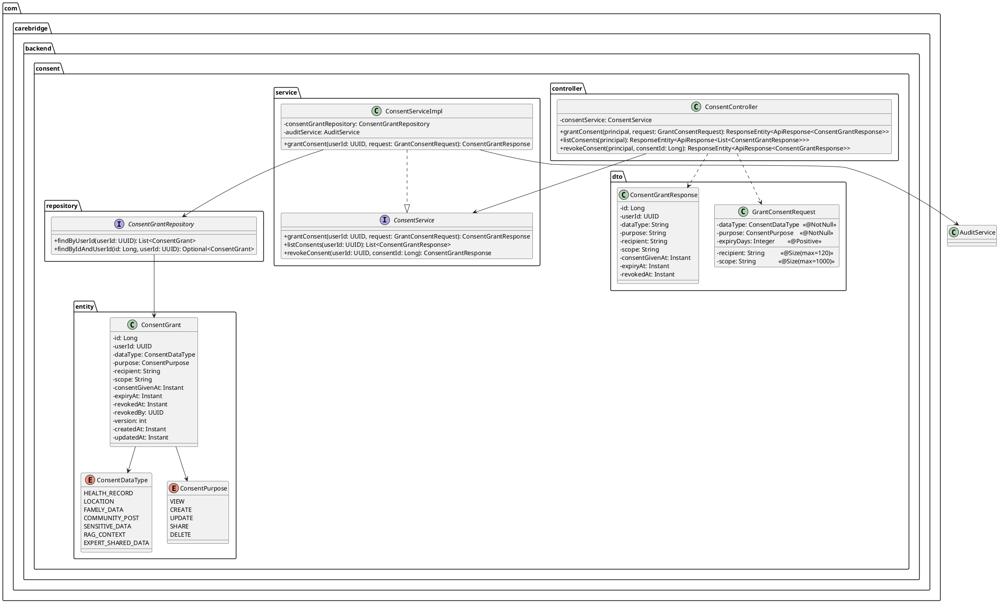
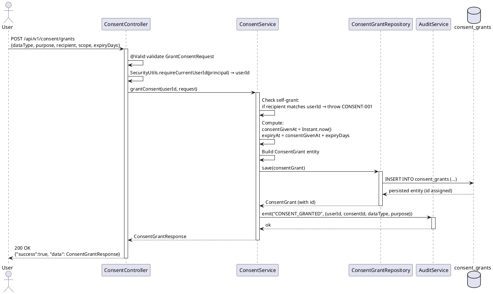
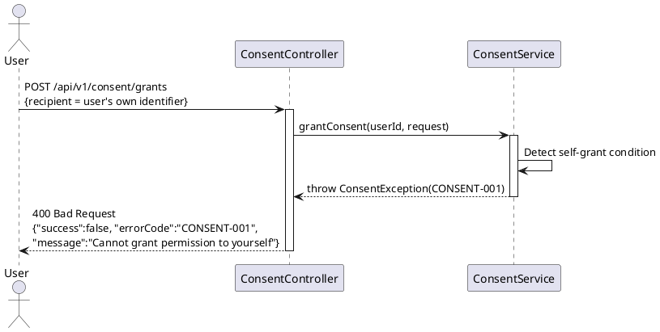
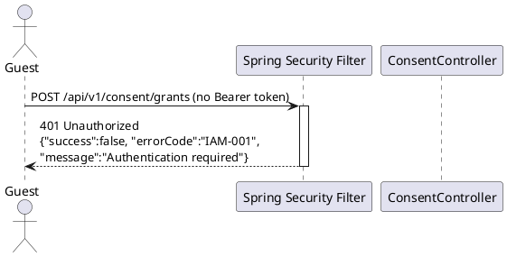

# UC17 — Grant Data Permission: Technical Design Specification

| Field            | Value                              |
|------------------|------------------------------------|
| Document ID      | CB-CONSENT-IMP-017                 |
| Version          | 1.0                                |
| Date             | 2026-06-26                         |
| Status           | Draft                              |
| Document Owner   | PhuongNT                           |
| Author           | AI Agent                           |
| Based on EDS     | v2.0                               |
| SRS Reference    | 3.1.1.17                           |
| Bounded Context  | consent                            |

---

## 1. Tổng Quan (Overview)

### 1.1 Feature Summary

UC-17 **Grant Data Permission** cho phép người dùng đã xác thực (ROLE_MOTHER hoặc ROLE_EXPERT) cấp quyền truy cập dữ liệu cho một bên nhận (recipient) cụ thể, với kiểm soát theo phạm vi (scope), mục đích (purpose), và thời hạn (expiry).

- **Bounded Context**: `consent`
- **SRS Reference**: §3.1.1.17
- **Actors**: User (ROLE_MOTHER, ROLE_EXPERT)
- **Compliance**: PDPA Vietnam, GDPR Art. 7

### 1.2 Business Context

Người dùng cần khả năng:
1. Chỉ định loại dữ liệu nào được chia sẻ (`dataType`)
2. Xác định mục đích chia sẻ (`purpose`)
3. Giới hạn người nhận (`recipient`)
4. Thiết lập phạm vi chi tiết (`scope`)
5. Kiểm soát thời hạn (`expiryDays`)

Sau khi consent được cấp, hệ thống phải phát sự kiện audit `CONSENT_GRANTED` để đảm bảo tuân thủ PDPA và GDPR.

### 1.3 Status: Existing Implementation

> **Lưu ý quan trọng**: Endpoint và logic nghiệp vụ đã được triển khai đầy đủ trong package `consent`. TDS này ghi lại thiết kế hiện có, không yêu cầu triển khai mới.

---

## 2. Traceability

### 2.1 Business Rules

| Rule ID          | Description                                                                 |
|------------------|-----------------------------------------------------------------------------|
| BR-CONSENT-001   | Người dùng không thể cấp quyền cho chính mình (self-grant forbidden)       |
| BR-CONSENT-002   | `expiryDays` phải nằm trong khoảng [1, 365]                                 |
| BR-CONSENT-003   | Mỗi lần cấp quyền thành công phải phát audit event `CONSENT_GRANTED`       |
| BR-RBAC          | Chỉ ROLE_MOTHER và ROLE_EXPERT mới có thể gọi endpoint này                 |
| BR-PRIVACY       | Dữ liệu sức khỏe và gia đình phải tuân theo consent, purpose, minimum-necessary |

### 2.2 SRS Mapping

| SRS ID       | Requirement                                  | Implemented By                      |
|--------------|----------------------------------------------|-------------------------------------|
| UC-17        | Grant Data Permission                        | `ConsentController.grantConsent()`  |
| UC-17-FR-01  | Validate dataType enum                       | Bean Validation + `@NotNull`        |
| UC-17-FR-02  | Validate purpose enum                        | Bean Validation + `@NotNull`        |
| UC-17-FR-03  | Compute expiryAt server-side                 | `ConsentService.grantConsent()`     |
| UC-17-FR-04  | Emit CONSENT_GRANTED audit                   | `AuditService.emit()`               |

### 2.3 Compliance Mapping

| Standard       | Clause          | Requirement                                     | Implementation                    |
|----------------|-----------------|-------------------------------------------------|-----------------------------------|
| PDPA Vietnam   | Art. 11         | Explicit consent with defined purpose           | `purpose` field, audit log        |
| PDPA Vietnam   | Art. 17         | Data retention ≤ purpose duration              | `expiryAt` field                  |
| GDPR           | Art. 7          | Freely given, specific, informed consent        | `scope`, `purpose`, `recipient`   |
| PDPA Vietnam   | —               | Audit retention 5 years                        | `consent_grants` table + audit    |

---

## 3. Architectural Decision Records (ADRs)

### ADR-CONSENT-017-001: consent_grants Table Over data_permissions

**Context**: Hai bảng tồn tại trong schema: `consent_grants` và `data_permissions`.

**Decision**: Sử dụng `consent_grants` làm implementation chính.

**Rationale**:
- `consent_grants` có đủ các cột tuân thủ GDPR: `consent_given_at`, `expiry_at`, `revoked_at`, `revoked_by`
- `data_permissions` thiếu audit trail và compliance fields
- Migration Flyway đã áp dụng cho `consent_grants`

**Status**: Accepted

---

### ADR-CONSENT-017-002: Soft Expiry via expiryAt Field

**Context**: Cần cơ chế kiểm soát thời hạn consent.

**Decision**: Sử dụng `expiry_at` timestamp thay vì xóa cứng (hard delete).

**Rationale**:
- Audit trail đầy đủ cho compliance
- Cho phép truy vấn lịch sử consent
- Tương thích với GDPR right of access

**Status**: Accepted

---

### ADR-CONSENT-017-003: Version Field for Optimistic Locking

**Context**: Concurrent updates có thể gây race condition trên consent record.

**Decision**: Sử dụng `version` field (default=1) cho optimistic locking JPA.

**Rationale**:
- Ngăn lost update khi nhiều thread cùng sửa một consent
- Spring Data JPA hỗ trợ `@Version` annotation

**Status**: Accepted

---

## 4. Non-Functional Requirements (NFR)

| NFR ID       | Category       | Requirement                                           | Target                    |
|--------------|----------------|-------------------------------------------------------|---------------------------|
| NFR-PERF-001 | Performance    | P95 latency cho POST /consent/grants                 | < 200ms                   |
| NFR-SEC-001  | Security       | JWT authentication bắt buộc                          | 401 nếu thiếu token       |
| NFR-SEC-002  | Authorization  | ROLE_MOTHER hoặc ROLE_EXPERT mới có quyền            | 403 nếu sai role          |
| NFR-COMP-001 | Compliance     | Audit record lưu tối thiểu 5 năm                     | PDPA Vietnam requirement  |
| NFR-COMP-002 | Compliance     | Consent data không được dùng ngoài `purpose` khai báo| Policy enforcement        |
| NFR-REL-001  | Reliability    | Idempotency — duplicate grant → 409                  | CONSENT-003 error code    |

---

## 5. Static Modeling

### 5.1 Class Diagram



### 5.2 Entity–Table Mapping

| Entity Field      | DB Column          | Type               | Constraints                     |
|-------------------|--------------------|--------------------|---------------------------------|
| id                | id                 | bigint             | PK, identity                    |
| userId            | user_id            | uuid               | NOT NULL, FK users.id           |
| dataType          | data_type          | varchar(60)        | NOT NULL, CHECK enum values     |
| purpose           | purpose            | varchar(60)        | NOT NULL, CHECK enum values     |
| recipient         | recipient          | varchar(120)       | nullable                        |
| scope             | scope_text         | text               | nullable                        |
| consentGivenAt    | consent_given_at   | timestamptz        | NOT NULL                        |
| expiryAt          | expiry_at          | timestamptz        | NOT NULL                        |
| revokedAt         | revoked_at         | timestamptz        | nullable                        |
| revokedBy         | revoked_by         | uuid               | nullable                        |
| version           | version            | int                | DEFAULT 1                       |
| createdAt         | created_at         | timestamptz        | auto-managed                    |
| updatedAt         | updated_at         | timestamptz        | auto-managed                    |

---

## 6. Dynamic Modeling

### 6.1 Happy Path Sequence



### 6.2 Error Path — Self-Grant



### 6.3 Error Path — No JWT



---

## 7. Domain Events

### 7.1 ConsentGranted Event

```json
{
  "eventType": "CONSENT_GRANTED",
  "occurredAt": "2026-06-26T10:30:00Z",
  "payload": {
    "consentId": 42,
    "userId": "550e8400-e29b-41d4-a716-446655440000",
    "dataType": "HEALTH_RECORD",
    "purpose": "VIEW",
    "recipient": "dr.nguyen@hospital.vn",
    "expiryAt": "2026-07-26T10:30:00Z"
  },
  "metadata": {
    "source": "consent-service",
    "version": "1.0",
    "correlationId": "req-abc-123"
  }
}
```

### 7.2 Audit Log Record

| Field        | Value                                         |
|--------------|-----------------------------------------------|
| Action       | `CONSENT_GRANTED`                             |
| ActorId      | userId (from JWT)                             |
| ResourceType | `ConsentGrant`                                |
| ResourceId   | consentId (Long)                              |
| Timestamp    | `consentGivenAt`                              |
| Details      | dataType, purpose, recipient, expiryAt        |

---

## 8. Interface Definitions

### 8.1 ConsentService Interface

```java
package com.carebridge.backend.consent.service;

import com.carebridge.backend.consent.dto.ConsentGrantResponse;
import com.carebridge.backend.consent.dto.GrantConsentRequest;
import java.util.List;
import java.util.UUID;

public interface ConsentService {

    /**
     * Grants data access permission for the authenticated user.
     *
     * @param userId  The authenticated user's UUID (from JWT, via SecurityUtils)
     * @param request The validated grant consent request
     * @return ConsentGrantResponse with all persisted fields including computed expiryAt
     * @throws ConsentException CONSENT-001 if self-grant detected
     * @throws ConsentException CONSENT-003 if duplicate active grant exists
     */
    ConsentGrantResponse grantConsent(UUID userId, GrantConsentRequest request);

    /**
     * Lists all consent grants for the authenticated user.
     *
     * @param userId The authenticated user's UUID
     * @return List of all grants (active and revoked) for audit visibility
     */
    List<ConsentGrantResponse> listConsents(UUID userId);

    /**
     * Revokes a previously granted consent.
     *
     * @param userId    The authenticated user's UUID
     * @param consentId The consent grant ID to revoke
     * @return Updated ConsentGrantResponse with revokedAt populated
     * @throws ConsentException CONSENT-011 if not found or not owned by userId
     * @throws ConsentException CONSENT-012 if already revoked
     */
    ConsentGrantResponse revokeConsent(UUID userId, Long consentId);
}
```

### 8.2 GrantConsentRequest DTO

```java
package com.carebridge.backend.consent.dto;

import com.carebridge.backend.consent.entity.ConsentDataType;
import com.carebridge.backend.consent.entity.ConsentPurpose;
import jakarta.validation.constraints.NotNull;
import jakarta.validation.constraints.Positive;
import jakarta.validation.constraints.Size;

public class GrantConsentRequest {

    @NotNull(message = "dataType is required")
    private ConsentDataType dataType;

    @NotNull(message = "purpose is required")
    private ConsentPurpose purpose;

    @Size(max = 120, message = "recipient must not exceed 120 characters")
    private String recipient;

    @Size(max = 1000, message = "scope must not exceed 1000 characters")
    private String scope;

    @Positive(message = "expiryDays must be a positive integer")
    private Integer expiryDays;

    // getters, setters, builder
}
```

---

## 9. API Specification

### 9.1 Endpoint

| Property    | Value                            |
|-------------|----------------------------------|
| Method      | `POST`                           |
| Path        | `/api/v1/consent/grants`         |
| Auth        | Bearer JWT (required)            |
| Content-Type| `application/json`               |

### 9.2 Request Body

```json
{
  "dataType": "HEALTH_RECORD",
  "purpose": "VIEW",
  "recipient": "dr.nguyen@hospital.vn",
  "scope": "Access to maternal health records for pregnancy monitoring",
  "expiryDays": 30
}
```

**Field validation rules:**

| Field       | Type              | Required | Constraints                                              |
|-------------|-------------------|----------|----------------------------------------------------------|
| dataType    | ConsentDataType   | Yes      | HEALTH_RECORD, LOCATION, FAMILY_DATA, COMMUNITY_POST, SENSITIVE_DATA, RAG_CONTEXT, EXPERT_SHARED_DATA |
| purpose     | ConsentPurpose    | Yes      | VIEW, CREATE, UPDATE, SHARE, DELETE                      |
| recipient   | String            | No       | max 120 characters                                       |
| scope       | String            | No       | max 1000 characters                                      |
| expiryDays  | Integer           | No       | positive integer (1-365 recommended per BR-CONSENT-002)  |

### 9.3 Response — Success (200 OK)

```json
{
  "success": true,
  "data": {
    "id": 42,
    "userId": "550e8400-e29b-41d4-a716-446655440000",
    "dataType": "HEALTH_RECORD",
    "purpose": "VIEW",
    "recipient": "dr.nguyen@hospital.vn",
    "scope": "Access to maternal health records for pregnancy monitoring",
    "consentGivenAt": "2026-06-26T10:30:00Z",
    "expiryAt": "2026-07-26T10:30:00Z",
    "revokedAt": null
  },
  "message": "Consent granted successfully"
}
```

### 9.4 Response — Error Responses

**400 Bad Request — Self-Grant (CONSENT-001)**
```json
{
  "success": false,
  "errorCode": "CONSENT-001",
  "message": "Cannot grant data permission to yourself"
}
```

**400 Bad Request — Invalid expiryDays (CONSENT-002)**
```json
{
  "success": false,
  "errorCode": "CONSENT-002",
  "message": "expiryDays must be a positive integer between 1 and 365"
}
```

**409 Conflict — Duplicate Active Grant (CONSENT-003)**
```json
{
  "success": false,
  "errorCode": "CONSENT-003",
  "message": "An active consent grant already exists for this recipient and data type"
}
```

**401 Unauthorized (IAM-001)**
```json
{
  "success": false,
  "errorCode": "IAM-001",
  "message": "Authentication required"
}
```

**400 Bad Request — Invalid Enum (Bean Validation)**
```json
{
  "success": false,
  "errorCode": "VALIDATION_ERROR",
  "message": "dataType must be one of: HEALTH_RECORD, LOCATION, FAMILY_DATA, COMMUNITY_POST, SENSITIVE_DATA, RAG_CONTEXT, EXPERT_SHARED_DATA"
}
```

---

## 10. Error Codes

| Error Code   | HTTP Status | Trigger Condition                                         | Recovery                              |
|--------------|-------------|-----------------------------------------------------------|---------------------------------------|
| CONSENT-001  | 400         | `recipient` matches authenticated user's own identity     | Use a different recipient             |
| CONSENT-002  | 400         | `expiryDays` is zero, negative, or out of range [1-365]  | Provide valid expiryDays              |
| CONSENT-003  | 409         | Active consent for same user+recipient+dataType exists    | Revoke existing grant first           |
| IAM-001      | 401         | No JWT token or expired/invalid token                    | Re-authenticate                       |
| VALIDATION_ERROR | 400    | Bean validation failure (e.g., invalid enum value)        | Fix request payload                   |

---

## 11. Implementation Documentation

> **Status**: Existing implementation — no new code required.

### 11.1 Package Structure

```
com.carebridge.backend.consent/
├── controller/
│   └── ConsentController.java          # @PostMapping → grantConsent()
├── service/
│   ├── ConsentService.java             # Interface
│   └── ConsentServiceImpl.java         # Business logic
├── repository/
│   └── ConsentGrantRepository.java     # JPA repository
├── entity/
│   ├── ConsentGrant.java               # @Entity, @Table("consent_grants")
│   ├── ConsentDataType.java            # Enum
│   └── ConsentPurpose.java             # Enum
├── dto/
│   ├── GrantConsentRequest.java        # @Valid request body
│   └── ConsentGrantResponse.java       # Response DTO
└── mapper/
    └── ConsentMapper.java              # Entity ↔ DTO mapping
```

### 11.2 Key Implementation Steps (Already Implemented)

1. **Controller Layer**:
   - `@PostMapping` on `/api/v1/consent/grants`
   - Extracts `userId` via `SecurityUtils.requireCurrentUserId(principal)`
   - Calls `consentService.grantConsent(userId, request)`
   - Returns `ApiResponse<ConsentGrantResponse>`

2. **Service Layer**:
   - Validates BR-CONSENT-001: self-grant check
   - Computes `consentGivenAt = Instant.now()`
   - Computes `expiryAt = consentGivenAt.plus(expiryDays, ChronoUnit.DAYS)`
   - Sets `version = 1` (default)
   - Saves via `ConsentGrantRepository.save()`
   - Emits `AuditService.emit("CONSENT_GRANTED", ...)`
   - Maps entity to `ConsentGrantResponse`

3. **Repository Layer**:
   - Standard Spring Data JPA `JpaRepository<ConsentGrant, Long>`
   - `findByUserId(UUID userId)` for listing
   - `findByIdAndUserId(Long id, UUID userId)` for ownership check

4. **Database Migration**:
   - No new migration needed — `consent_grants` table already created
   - CHECK constraints on `data_type` and `purpose` already in place

### 11.3 Transaction Boundary

```
@Transactional on ConsentServiceImpl.grantConsent()
  ├── save(ConsentGrant)              ← within transaction
  └── auditService.emit(...)         ← after commit (if async) or within (if sync)
```

---

## 12. Rollback Plan

> Since the consent endpoint is already implemented, rollback applies to future code changes only.

| Scenario                       | Rollback Action                                                     |
|--------------------------------|---------------------------------------------------------------------|
| Bug introduced in service layer| Revert commit via `git revert <commit-sha>`                         |
| Controller regression          | Revert controller changes, redeploy previous artifact               |
| Audit emission broken          | Fix `AuditService` call without rollback (non-transactional side)   |
| No DB migration to rollback    | `consent_grants` table and Flyway migration remain unchanged        |

---

## 13. Test Scenarios Summary

Detailed test cases are in `UC17_GrantDataPermission_Test-Spec.md`.

| Test Case ID            | Description                                    | Expected Result       |
|-------------------------|------------------------------------------------|-----------------------|
| CONSENT-TC-017-001      | Happy path — valid grant                       | 200, DB row created   |
| CONSENT-TC-017-002      | Self-grant (recipient = own identity)          | 400 CONSENT-001       |
| CONSENT-TC-017-003      | expiryDays = 0                                 | 400 CONSENT-002       |
| CONSENT-TC-017-004      | Invalid dataType enum value                    | 400 VALIDATION_ERROR  |
| CONSENT-TC-017-005      | No JWT token                                   | 401 IAM-001           |
| CONSENT-TC-017-INT-001  | Integration — verify DB row fields             | Row matches request   |

---

## 14. Verification

### 14.1 SQL Verification Queries

**Verify grant was created:**
```sql
-- Check that consent record exists with correct fields
SELECT
    id,
    user_id,
    data_type,
    purpose,
    recipient,
    scope_text,
    consent_given_at,
    expiry_at,
    revoked_at,
    version
FROM consent_grants
WHERE user_id = '550e8400-e29b-41d4-a716-446655440000'
ORDER BY created_at DESC
LIMIT 5;
```

**Verify expiryAt computation (expiryDays=30):**
```sql
-- expiryAt should be exactly consentGivenAt + 30 days
SELECT
    id,
    consent_given_at,
    expiry_at,
    (expiry_at - consent_given_at) AS duration
FROM consent_grants
WHERE id = 42;
-- Expected: duration = '30 days'
```

**Verify no self-grant exists:**
```sql
-- Should return 0 rows (self-grant must be blocked at service layer)
SELECT COUNT(*) FROM consent_grants
WHERE user_id = recipient::uuid;
-- Note: only applicable if recipient stores UUID; string comparison may differ
```

**Verify audit log:**
```sql
-- Check audit_logs (or equivalent audit table)
SELECT * FROM audit_logs
WHERE action = 'CONSENT_GRANTED'
  AND resource_id = '42'
ORDER BY created_at DESC
LIMIT 1;
```

---

## 15. API Sample — cURL Examples

### 15.1 Grant Consent (Happy Path)

```bash
curl -X POST "https://api.carebridge.vn/api/v1/consent/grants" \
  -H "Authorization: Bearer <JWT_TOKEN>" \
  -H "Content-Type: application/json" \
  -d '{
    "dataType": "HEALTH_RECORD",
    "purpose": "VIEW",
    "recipient": "dr.nguyen@hospital.vn",
    "scope": "Pregnancy monitoring records Q2 2026",
    "expiryDays": 30
  }'
```

**Expected Response:**
```json
{
  "success": true,
  "data": {
    "id": 42,
    "userId": "550e8400-e29b-41d4-a716-446655440000",
    "dataType": "HEALTH_RECORD",
    "purpose": "VIEW",
    "recipient": "dr.nguyen@hospital.vn",
    "scope": "Pregnancy monitoring records Q2 2026",
    "consentGivenAt": "2026-06-26T10:30:00Z",
    "expiryAt": "2026-07-26T10:30:00Z",
    "revokedAt": null
  }
}
```

### 15.2 Self-Grant (Error Case)

```bash
curl -X POST "https://api.carebridge.vn/api/v1/consent/grants" \
  -H "Authorization: Bearer <JWT_TOKEN>" \
  -H "Content-Type: application/json" \
  -d '{
    "dataType": "HEALTH_RECORD",
    "purpose": "VIEW",
    "recipient": "my.own@email.com"
  }'
# Expected: 400 CONSENT-001 (if recipient matches authenticated user's email)
```

### 15.3 Missing JWT (Error Case)

```bash
curl -X POST "https://api.carebridge.vn/api/v1/consent/grants" \
  -H "Content-Type: application/json" \
  -d '{"dataType":"HEALTH_RECORD","purpose":"VIEW"}'
# Expected: 401 IAM-001
```

---

## 16. Authorization Matrix

| Role         | Own Grants | Other Users' Grants | Notes                                |
|--------------|------------|---------------------|--------------------------------------|
| ROLE_MOTHER  | ✅ Allowed  | ❌ Forbidden         | Can only grant own data access       |
| ROLE_EXPERT  | ✅ Allowed  | ❌ Forbidden         | Can grant access to expert data      |
| ROLE_ADMIN   | ❌ Forbidden| ❌ Forbidden         | Admin uses separate admin endpoints  |
| GUEST        | ❌ Forbidden| ❌ Forbidden         | 401 Unauthorized                     |

**Security Implementation:**
- `@PreAuthorize("hasAnyRole('MOTHER', 'EXPERT')")` or equivalent Spring Security configuration
- `SecurityUtils.requireCurrentUserId(principal)` extracts userId — prevents users from granting on behalf of others

---

## 17. CASE 2.0 Constraints

| Constraint ID | Description                                                                           | Enforcement Point                    |
|---------------|---------------------------------------------------------------------------------------|--------------------------------------|
| C1            | User cannot grant permission to themselves (self-grant forbidden)                     | `ConsentServiceImpl.grantConsent()`  |
| C2            | `expiryAt` MUST be computed as `consentGivenAt + expiryDays` (server-side, not client)| Service layer, never from request    |
| C3            | `CONSENT_GRANTED` audit event MUST be emitted after every successful grant            | `AuditService.emit()` post-save      |
| C4            | `data_type` MUST match one of the 7 valid enum values in the CHECK constraint         | Bean Validation + DB constraint      |
| C5            | `expiryDays` MUST be in range [1, 365] per BR-CONSENT-002                            | `@Positive` + service validation     |
| C6            | Duplicate active grant for same user+recipient+dataType MUST return 409               | `ConsentServiceImpl` dedup check     |

---

*End of UC17_GrantDataPermission_TDS.md — Document ID: CB-CONSENT-IMP-017 — Version 1.0*
