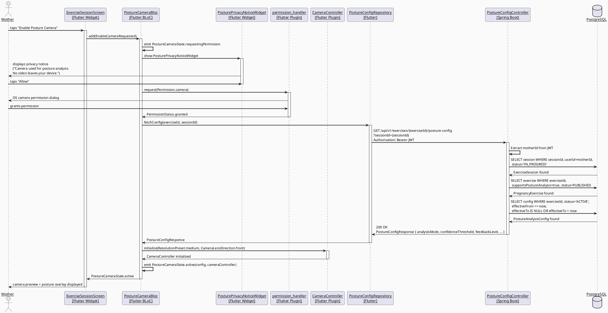
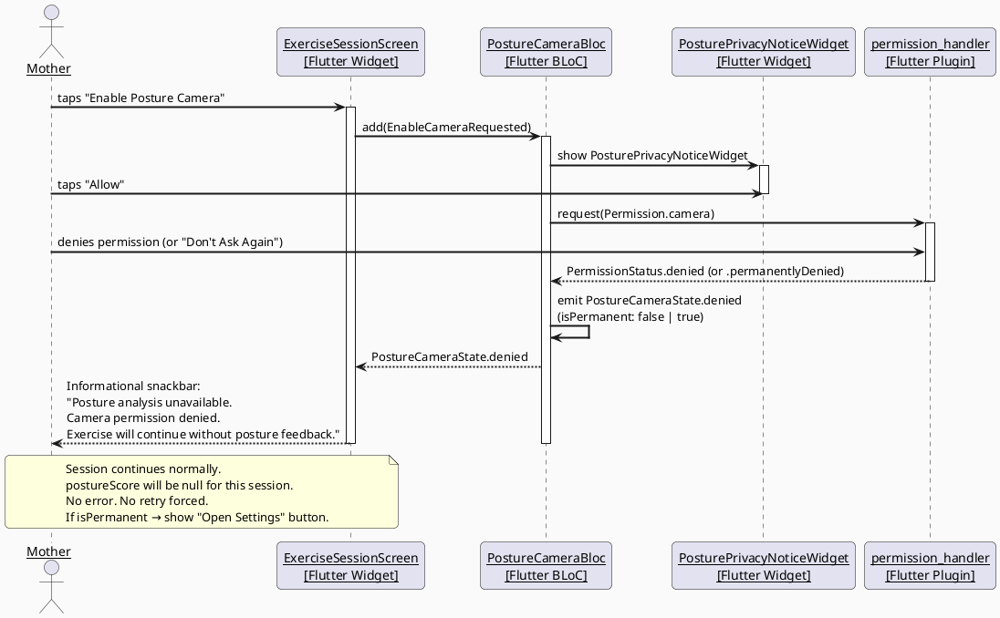
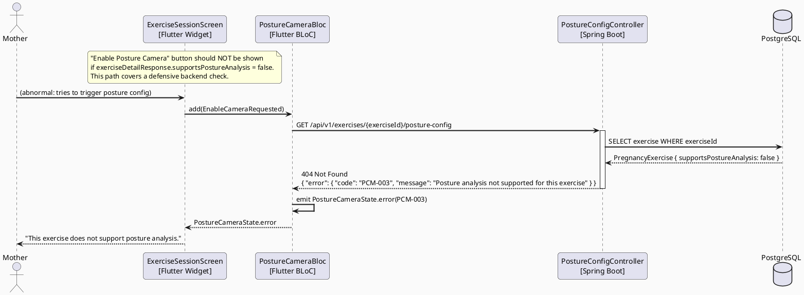
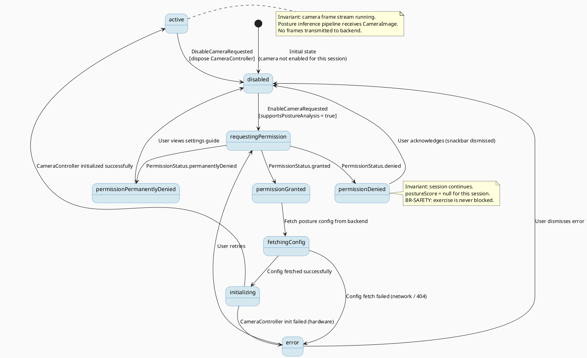

# ENGINEERING DOCUMENTATION STANDARD (EDS) v2.0
# UC180 — Enable Posture Camera — Technical Design Specification

| Field | Value |
|-------|-------|
| **Document ID** | `CB-EXERCISE-IMP-006` |
| **Version** | `1.0` |
| **Date** | `2026-06-28` |
| **Status** | `Implemented` |
| **Document Owner** | `PhuongNT` |
| **Author** | `AI Agent — Developer` |
| **Reviewed by** | `[ ] Pending` |
| **DPO Sign-off** | `[ ] Pending — camera usage involves BR-PRIVACY gate` |
| **Approved by** | `[ ] Pending` |
| **Last Review** | `2026-06-28` |
| **Based on EDS** | `v2.0` |

---

## CHANGELOG

> **Policy 4.4 — Immutable History:** Never delete old information. All changes must be recorded in this table.

| Date | Author | Change Description |
|------|--------|--------------------|
| 2026-06-28 | AI Agent — Developer | Initial document creation — TDS for UC180 Enable Posture Camera (SRS 3.3.2.6) |

---

## TABLE OF CONTENTS

1. [Module Overview](#1-module-overview)
2. [Traceability Matrix](#2-traceability-matrix)
3. [Architecture Decision Records (ADR)](#3-architecture-decision-records-adr)
4. [Non-Functional Requirements & SLA](#4-non-functional-requirements--sla)
5. [Static Modeling](#5-static-modeling)
6. [Dynamic Modeling](#6-dynamic-modeling)
7. [Domain Event Catalog](#7-domain-event-catalog)
8. [Interface Specification](#8-interface-specification)
9. [API Specification](#9-api-specification)
10. [Error Codes](#10-error-codes)
11. [Deployment Steps](#11-deployment-steps)
12. [Rollback & Incident Runbook](#12-rollback--incident-runbook)
13. [Detailed Test Scenarios](#13-detailed-test-scenarios)
14. [Verification Methods](#14-verification-methods)
15. [API Verification Samples](#15-api-verification-samples)
16. [Authorization Matrix](#16-authorization-matrix)
17. [AI Prompt Constraints (CASE 2.0)](#17-ai-prompt-constraints-case-20)

---

## 1. Module Overview

> Enables the device camera for posture analysis during pregnancy exercise sessions when the selected exercise supports posture analysis and the Mother grants camera permission.
> SRS 3.3.2.6: "Enable Posture Camera — Requests permission and enables the camera when posture analysis is supported and chosen by the Mother."

| Field | Value |
|-------|-------|
| **Module Name** | `Enable Posture Camera` |
| **Bounded Context** | `exercise` |
| **Data Classification** | `Internal` |
| **Compliance Scope** | `BR-RBAC, BR-PRIVACY, BR-SAFETY` |
| **Upstream Dependencies** | `UC29 (exercise selection), UC177 (view exercise detail), UC30 (analyze posture), IAM (authentication), pregnancy_exercises table, posture_analysis_configs table, exercise_sessions table` |
| **Downstream Consumers** | `UC30 — Analyze Exercise Posture (receives posture feedback events from device after camera is active)` |

**Functional Scope:**

UC180 covers the following responsibilities within the exercise posture lifecycle:

1. **Backend:** `GET /api/v1/exercises/{exerciseId}/posture-config` — Return the active posture analysis configuration for a given exercise. Only exercises with `supports_posture_analysis = true` have a config. The config drives the client's analysis mode (RULE_BASED or ML_BASED), confidence threshold, and feedback level.

2. **Mobile (Flutter):** Permission gate — request `camera` permission via `permission_handler`. Display explicit privacy notice before the request. Handle granted / denied / permanently-denied states gracefully. If denied, the session continues without posture analysis (non-blocking).

3. **Mobile (Flutter):** Camera initialization — initialize `CameraController` after permission is granted. Wire the live camera preview to the posture analysis pipeline (landmark extraction). The actual inference/ML step belongs to UC30 (out of scope here).

4. **Mobile (Flutter):** State management — expose `PostureCameraState` (disabled / requesting / active / denied) to the exercise session screen so the UI reacts correctly.

**Actors:**
- **Mother** (primary) — decides whether to enable posture camera.
- **Smartwatch/Wearable Device** (secondary) — may supply heart rate/accelerometer data alongside camera, but camera permission is independent.

**Platform:** Mobile App (Flutter) + Backend (Spring Boot).

**Explicit Out-of-Scope (belongs to UC30):**
- Actual body landmark / ML inference
- Sending posture keypoints to the backend (`POST /exercises/sessions/{sessionId}/posture-events`)
- Posture score aggregation

**Privacy Architecture:**
- Camera frames are processed locally on-device via CameraImage stream — no video is transmitted to the backend.
- Only inference results (keypoint summary JSON, posture code, confidence score) are ever sent to the backend by UC30.
- Mother must be shown an explicit privacy notice before the camera permission dialog.

---

## 2. Traceability Matrix

| Requirement ID | Type (BR/ADR/US) | Requirement Description | Code Component | Compliance Target | Related ADR |
|----------------|------------------|------------------------|----------------|-------------------|-------------|
| BR-POSTURE-CAM-001 | Business Rule | Camera only enabled if `pregnancy_exercises.supports_posture_analysis = true` | `PostureConfigService.getActiveConfig()` | BR-SAFETY | ADR-EXERCISE-006-001 |
| BR-POSTURE-CAM-002 | Business Rule | Camera permission must be explicitly requested; deny is non-fatal | `PostureCameraBloc / PermissionHandler` | BR-PRIVACY | ADR-EXERCISE-006-002 |
| BR-POSTURE-CAM-003 | Business Rule | Privacy notice displayed before permission dialog | `PosturePrivacyNoticeWidget` | BR-PRIVACY | ADR-EXERCISE-006-002 |
| BR-POSTURE-CAM-004 | Business Rule | Camera frames never transmitted to backend | Architecture boundary | BR-PRIVACY | ADR-EXERCISE-006-003 |
| BR-POSTURE-CAM-005 | Business Rule | Exercise session continues without posture analysis if camera denied | `PostureCameraBloc` state machine | BR-SAFETY | ADR-EXERCISE-006-002 |
| BR-POSTURE-CAM-006 | Business Rule | Config endpoint requires active exercise session (session_status = IN_PROGRESS) | `PostureConfigService.getActiveConfig()` | BR-RBAC | ADR-EXERCISE-006-001 |
| BR-POSTURE-CAM-007 | Business Rule | Only MOTHER role can request posture config for their own session | `ExerciseSessionController` `@PreAuthorize` | BR-RBAC | — |
| US-CAM-001 | User Story | Mother sees privacy notice about camera usage before granting permission | `PosturePrivacyNoticeWidget` | — | ADR-EXERCISE-006-002 |
| US-CAM-002 | User Story | Mother taps "Enable Camera" → permission dialog → camera preview starts | `PostureCameraBloc` | — | — |
| US-CAM-003 | User Story | Mother denies camera → sees informational message, exercise continues | `PostureCameraBloc` deny state | — | — |
| US-CAM-004 | User Story | Mother can toggle camera off after enabling it during a session | `PostureCameraBloc` | — | — |
| ADR-EXERCISE-006-001 | Decision | Backend provides posture config; client decides camera enablement | `PostureConfigController` | — | — |
| ADR-EXERCISE-006-002 | Decision | Permission deny is non-blocking — session continues without analysis | `PostureCameraBloc` | — | — |
| ADR-EXERCISE-006-003 | Decision | All video/frame data stays on device; only keypoints sent to backend | Architecture | PDPA / BR-PRIVACY | — |

---

## 3. Architecture Decision Records (ADR)

### ADR-EXERCISE-006-001 — Backend Provides Posture Config; Client Decides Camera

| Field | Value |
|-------|-------|
| **Status** | `Accepted` |
| **Deciders** | `AI Agent — Developer` |
| **Date** | `2026-06-28` |
| **Supersedes** | `—` |

#### Context
The client needs to know which analysis mode to use (RULE_BASED vs ML_BASED), the confidence threshold, and feedback granularity. This config must come from the backend to allow expert-configured personalization without app releases. The client cannot hardcode these values.

#### Options Considered

| Option | Description | Pros | Cons |
|--------|-------------|------|------|
| A | Client fetches posture config before starting camera | + Config server-driven; supports personalization without app release. + Single source of truth. | - One extra API call per session |
| B | Posture config embedded in exercise detail response (GET /exercises/{id}) | + Fewer round-trips | - Config may be stale if changed between detail load and session start. Cannot scope config to an active session. |
| C | Client hardcodes all config | + Zero latency | - Not configurable; cannot be adjusted per-exercise or per-user |

#### Decision
Choose **Option A** — `GET /api/v1/exercises/{exerciseId}/posture-config` is a separate call made after session start and before camera activation. Config is session-scoped (tied to an IN_PROGRESS exercise session for the requesting user).

#### Consequences

**Positive:**
- Config can be updated by admins without a mobile release.
- Config is only returned for exercises that actually support posture analysis (`supports_posture_analysis = true`), giving a clean 404 for unsupported exercises.

**Negative / Trade-offs:**
- One extra network call per camera activation — acceptable given this happens once per session (≤ 60 min sessions). Add 500ms timeout on the mobile client; if call fails, fall back to default RULE_BASED config locally.

**Compliance Impact:**
- None (config data is not PII; it is `Internal` classification).

---

### ADR-EXERCISE-006-002 — Camera Permission Deny is Non-Blocking

| Field | Value |
|-------|-------|
| **Status** | `Accepted` |
| **Deciders** | `AI Agent — Developer` |
| **Date** | `2026-06-28` |
| **Supersedes** | `—` |

#### Context
Pregnant mothers should never be prevented from exercising safely due to a technical permission. Posture analysis is an enhancement, not a prerequisite for exercise. If the user denies camera permission, the session must proceed normally.

#### Options Considered

| Option | Description | Pros | Cons |
|--------|-------------|------|------|
| A | Deny → session continues without posture feedback | + Non-blocking; safety-first. + PDPA-friendly (no forced consent). | - Mother loses posture guidance |
| B | Deny → cannot start exercise | - Blocks access to exercise. Violates BR-SAFETY (never delay safe activity). | — |

#### Decision
Choose **Option A**. Camera deny → `PostureCameraState.denied` → UI shows informational snackbar → session proceeds with `posture_score = null`.

#### Consequences

**Positive:**
- Compliant with BR-SAFETY (exercise access is never blocked).
- Compliant with BR-PRIVACY (no forced consent).
- PDPA-aligned: permission is freely revocable.

**Negative / Trade-offs:**
- Mother's session will not have posture feedback. This is surfaced clearly in the UI as "Posture analysis unavailable — camera permission denied."

**Compliance Impact:**
- BR-PRIVACY compliance: consent is voluntary, not coerced.

---

### ADR-EXERCISE-006-003 — Camera Frames Stay On-Device; Only Keypoints Sent

| Field | Value |
|-------|-------|
| **Status** | `Accepted` |
| **Deciders** | `AI Agent — Developer` |
| **Date** | `2026-06-28` |
| **Supersedes** | `—` |

#### Context
Transmitting live video of a pregnant mother to the backend would constitute sensitive biometric data transmission under PDPA. This creates storage, encryption, and consent scope obligations that are disproportionate to the benefit.

#### Options Considered

| Option | Description | Pros | Cons |
|--------|-------------|------|------|
| A | On-device inference only; send keypoint JSON to backend | + No biometric video leaves device. + PDPA-minimal data principle. | - Inference must run on device (compute cost) |
| B | Stream video to backend for server-side inference | + Potentially better accuracy with server GPU | - Massive PDPA/privacy exposure. Requires explicit biometric consent. Out of scope. |

#### Decision
**Option A** is mandatory. `CameraImage` stream → on-device landmark extraction → only `PostureFeedbackEvent` (keypoints summary, posture code, confidence score) sent to backend via UC30.

#### Consequences

**Positive:**
- No biometric video stored or transmitted. PDPA minimal data principle satisfied.
- Explicitly disclosed in privacy notice (BR-PRIVACY-003).

**Negative / Trade-offs:**
- Device must be powerful enough to run inference. Flutter's `camera` plugin gives raw `CameraImage` bytes that are passed to the inference engine (out of scope for UC180).

**Compliance Impact:**
- PDPA / BR-PRIVACY: camera data is processed locally. Only non-biometric inference results (coded posture labels + confidence scores) are transmitted.

---

## 4. Non-Functional Requirements & SLA

### 4.1. Performance & Availability

| Category | Requirement | Target SLA | Measurement Method | Compliance Basis |
|----------|-------------|------------|---------------------|------------------|
| Latency | `GET /posture-config` API response (p99) | `< 200ms` | k6 load test | — |
| Availability | Backend endpoint uptime (monthly) | `99.9%` | Uptime monitor | — |
| Camera Init | Time from permission grant to camera preview start | `< 1500ms` | Flutter integration test stopwatch | — |
| Permission Dialog | Time from tap to OS permission dialog | `< 300ms` | Flutter widget test | — |

### 4.2. Data Integrity & Retention

| Category | Requirement | Target | Verification Method | Compliance Basis |
|----------|-------------|--------|---------------------|------------------|
| Config Freshness | posture_analysis_configs returned must be ACTIVE and effective_to is null or future | 100% | Unit test | — |
| Session Binding | Config returned only for sessions owned by authenticated Mother | 100% | Integration test | BR-RBAC |
| No Video Persistence | Camera frames never written to disk or network buffer | Zero tolerance | Code review / architecture review | BR-PRIVACY |

### 4.3. Security

| Category | Requirement | Target | Verification Method | Compliance Basis |
|----------|-------------|--------|---------------------|------------------|
| Auth | `GET /posture-config` requires valid JWT with MOTHER role | 100% | Spring Security test | BR-RBAC |
| Ownership | Requesting Mother must own the exercise session | 100% | Unit + integration test | BR-RBAC |
| No PII in logs | No camera frames, no keypoints logged in backend logs | Zero tolerance | Log review | BR-PRIVACY |
| TLS | All backend endpoints served over TLS 1.2+ | 100% | SSL Labs scan | — |

### 4.4. Scalability & Capacity Planning

> Posture config endpoint is read-only and stateless. Expected load: ~500 concurrent exercise sessions at peak. Each session calls the endpoint once per session start. Config records are small (`< 2KB`). Response can be cached in the mobile client for the duration of the session (no repeated calls needed).

---

## 5. Static Modeling

### 5.1. Class Diagram (PlantUML)

```plantuml
@startuml UC180_EnablePostureCamera_ClassDiagram
skinparam classAttributeIconSize 0
skinparam classFontStyle bold
skinparam backgroundColor #FAFAFA
skinparam ArrowColor #555555
skinparam ClassBorderColor #2E75B6
skinparam ClassHeaderBackgroundColor #D5E8F0

' === BACKEND ENTITIES (existing tables — no migration) ===
class PregnancyExercise <<Entity>> {
  + exerciseId: UUID
  + title: String
  + supportsPostureAnalysis: Boolean
  + status: ExerciseStatus
  ' ... other fields as per V1__init_schema.sql
}

class PostureAnalysisConfig <<Entity>> {
  + postureConfigId: UUID
  + exerciseId: UUID
  + configuredBy: UUID
  + analysisMode: String  ' RULE_BASED | ML_BASED
  + ruleOrModelVersion: String
  + confidenceThreshold: BigDecimal
  + feedbackLevel: String  ' MINIMAL | STANDARD | DETAILED
  + configJson: String     ' JSONB
  + effectiveFrom: OffsetDateTime
  + effectiveTo: OffsetDateTime
  + status: String         ' ACTIVE | INACTIVE
  + createdAt: OffsetDateTime
  + updatedAt: OffsetDateTime
}

class ExerciseSession <<Entity>> {
  + exerciseSessionId: UUID
  + exerciseId: UUID
  + userId: UUID
  + sessionStatus: String  ' IN_PROGRESS | COMPLETED | ABORTED
  + postureScore: BigDecimal
  + warningCount: Integer
  + summaryJson: String
}

' === BACKEND SERVICE LAYER ===
interface IPostureConfigService <<interface>> {
  + getActiveConfig(exerciseId: UUID, sessionId: UUID, motherId: UUID): PostureConfigResponse
}

class PostureConfigServiceImpl implements IPostureConfigService {
  - exerciseRepository: ExerciseRepository
  - postureConfigRepository: PostureAnalysisConfigRepository
  - exerciseSessionRepository: ExerciseSessionRepository
  + getActiveConfig(exerciseId: UUID, sessionId: UUID, motherId: UUID): PostureConfigResponse
}

interface PostureAnalysisConfigRepository <<Repository>> {
  + findActiveConfigForExercise(exerciseId: UUID, now: OffsetDateTime): Optional<PostureAnalysisConfig>
}

interface ExerciseSessionRepository <<Repository>> {
  + findBySessionIdAndUserIdAndStatus(sessionId: UUID, userId: UUID, status: String): Optional<ExerciseSession>
}

' === BACKEND CONTROLLER ===
class PostureConfigController <<Controller>> {
  - postureConfigService: IPostureConfigService
  + getPostureConfig(exerciseId, sessionId, principal): ResponseEntity<ApiResponse<PostureConfigResponse>>
}

' === BACKEND DTO ===
class PostureConfigResponse <<DTO>> {
  + exerciseId: UUID
  + postureConfigId: UUID
  + analysisMode: String
  + ruleOrModelVersion: String
  + confidenceThreshold: Double
  + feedbackLevel: String
  + configJson: Map<String, Object>
}

' === MOBILE (FLUTTER) ===
class PostureCameraBloc <<BLoC>> {
  - permissionHandler: PermissionHandler
  - cameraController: CameraController
  - postureConfigRepository: PostureConfigRepository
  + state: PostureCameraState
  + add(event: PostureCameraEvent): void
}

class PostureCameraState <<ValueObject>> {
  ' States: disabled | requestingPermission | permissionDenied
  '         | permissionPermanentlyDenied | initializing | active | error
}

class PostureCameraEvent <<ValueObject>> {
  ' Events: EnableCameraRequested | PermissionGranted | PermissionDenied
  '         | CameraInitialized | DisableCameraRequested | CameraError
}

class PosturePrivacyNoticeWidget <<Widget>> {
  + onAccepted: VoidCallback
  + onDeclined: VoidCallback
}

class PostureConfigRepository <<MobileRepository>> {
  - apiClient: ApiClient
  + fetchConfig(exerciseId: UUID, sessionId: UUID): Future<PostureConfigResponse>
}

' === RELATIONSHIPS ===
PostureConfigController --> IPostureConfigService : uses
PostureConfigServiceImpl --> PostureAnalysisConfigRepository : queries
PostureConfigServiceImpl --> ExerciseSessionRepository : validates ownership
PostureConfigServiceImpl --> ExerciseRepository : checks supportsPostureAnalysis
PostureAnalysisConfig ..> PostureAnalysisConfigRepository
ExerciseSession ..> ExerciseSessionRepository
PregnancyExercise ..> ExerciseRepository

PostureCameraBloc --> PostureConfigRepository : fetches config
PostureCameraBloc --> PostureCameraState : emits
PostureCameraBloc --> PostureCameraEvent : receives
PosturePrivacyNoticeWidget ..> PostureCameraBloc : triggers EnableCameraRequested

@enduml
```



### 5.2. Data Structure — No Migration Required

> **CareBridge rule:** No new tables are required for UC180. All required tables (`pregnancy_exercises`, `posture_analysis_configs`, `exercise_sessions`) already exist in `V1__init_schema.sql`. This UC only reads from `posture_analysis_configs` and validates against `exercise_sessions`.

**Relevant existing tables (read-only for this UC):**

```sql
-- From V1__init_schema.sql — used for supportsPostureAnalysis check
-- pregnancy_exercises.supports_posture_analysis BOOLEAN NOT NULL DEFAULT false

-- From V1__init_schema.sql — provides analysis config
-- posture_analysis_configs: analysisMode, confidenceThreshold, feedbackLevel, effectiveFrom, effectiveTo, status

-- From V1__init_schema.sql — used for ownership validation
-- exercise_sessions: exerciseSessionId, exerciseId, userId (implicit via context), sessionStatus
```

**No Flyway migration needed for UC180.**

---

## 6. Dynamic Modeling

### 6.1. Sequence Diagram — Happy Path: Camera Permission Granted (PlantUML)



### 6.2. Sequence Diagram — Error Path: Camera Permission Denied (PlantUML)



### 6.3. Sequence Diagram — Error Path: Exercise Does Not Support Posture Analysis (PlantUML)



### 6.4. State Machine — PostureCameraState (PlantUML)



> **State Invariants:**
> - The `disabled` state is always safe to enter. CameraController is always disposed on exit from `active`.
> - The `active` state MUST always dispose the CameraController when leaving (via DisableCameraRequested, session end, or app lifecycle pause).
> - Permission is never requested more than once per session without explicit user action.

---

## 7. Domain Event Catalog

### 7.1. Events Published (Backend)

| Event Name | Trigger | Publisher | Subscriber(s) | Payload Schema | Async? |
|------------|---------|-----------|---------------|----------------|--------|
| `PostureCameraConfigFetched` | Mother requests posture config | `PostureConfigServiceImpl` | `AuditService` (internal audit log only) | See §7.3 | No (synchronous audit log) |

> Note: UC180 does not emit posture feedback events — those belong to UC30. This module only emits an audit trace of config access.

### 7.2. Events Consumed (Backend)

| Event Name | Source | Handler | Action Performed |
|------------|--------|---------|-----------------|
| _(none)_ | — | — | UC180 is purely request-driven; no async event consumption |

### 7.3. Payload Schema

```java
// PostureCameraConfigFetchedEvent.java
// Published internally to AuditService when posture config is successfully fetched.
public record PostureCameraConfigFetchedEvent(
    UUID    eventId,       // UUID.randomUUID()
    String  eventType,     // "PostureCameraConfigFetched"
    Instant occurredAt,    // Instant.now()
    String  version,       // "1.0"
    Payload payload,
    Metadata metadata
) {
    public record Payload(
        UUID exerciseId,
        UUID postureConfigId,
        UUID sessionId,
        String analysisMode       // RULE_BASED | ML_BASED
    ) {}

    public record Metadata(
        UUID   correlationId,     // from X-Correlation-Id header
        String causedBy           // motherId (UUID as String)
    ) {}
}
```

---

## 8. Interface Specification

> **Policy (EDS v2.0):** Each interface must declare `@version`. Breaking changes require a new ADR.

### 8.1. Service Interface (Backend)

```java
// PostureConfigResponse.java — Output DTO
// @version 1.0
public class PostureConfigResponse {
    private UUID exerciseId;
    private UUID postureConfigId;
    private String analysisMode;           // "RULE_BASED" | "ML_BASED"
    private String ruleOrModelVersion;     // e.g., "v1.2.0-rules"
    private Double confidenceThreshold;    // e.g., 0.75
    private String feedbackLevel;          // "MINIMAL" | "STANDARD" | "DETAILED"
    private Map<String, Object> configJson; // extended parameters (nullable)
    // getters / setters
}

// IPostureConfigService.java — Service Contract
// @version 1.0
public interface IPostureConfigService {
    /**
     * Returns the active posture analysis configuration for a given exercise,
     * validated against an active exercise session owned by the requesting mother.
     *
     * @throws ResourceNotFoundException (PCM-003) if exercise does not support posture analysis
     *         or no active config exists
     * @throws ResourceNotFoundException (PCM-004) if session not found or not IN_PROGRESS
     *         or not owned by requesting mother
     * @throws AuthorizationException (PCM-005) if caller does not have MOTHER role
     */
    PostureConfigResponse getActiveConfig(UUID exerciseId, UUID sessionId, UUID motherId);
}
```

### 8.2. Repository Interface (Backend)

```java
// PostureAnalysisConfigRepository.java
// @version 1.0
public interface PostureAnalysisConfigRepository
        extends JpaRepository<PostureAnalysisConfig, UUID> {

    /**
     * Find the ACTIVE config for the given exercise that is currently effective.
     * effectiveFrom <= now AND (effectiveTo IS NULL OR effectiveTo > now)
     */
    @Query("""
        SELECT c FROM PostureAnalysisConfig c
        WHERE c.exerciseId = :exerciseId
          AND c.status = 'ACTIVE'
          AND c.effectiveFrom <= :now
          AND (c.effectiveTo IS NULL OR c.effectiveTo > :now)
        ORDER BY c.effectiveFrom DESC
        LIMIT 1
        """)
    Optional<PostureAnalysisConfig> findActiveConfigForExercise(
            @Param("exerciseId") UUID exerciseId,
            @Param("now") OffsetDateTime now);
}

// ExerciseSessionRepository additions (if not already present in UC30):
// @version 1.0
public interface ExerciseSessionRepository
        extends JpaRepository<ExerciseSession, UUID> {

    Optional<ExerciseSession> findByExerciseSessionIdAndUserIdAndSessionStatus(
            UUID exerciseSessionId, UUID userId, String sessionStatus);
}
```

### 8.3. Mobile (Flutter) Interfaces

```dart
// posture_camera_state.dart
// @version 1.0
abstract class PostureCameraState extends Equatable {
  const PostureCameraState();
}

class PostureCameraDisabled extends PostureCameraState { ... }
class PostureCameraRequestingPermission extends PostureCameraState { ... }
class PostureCameraPermissionDenied extends PostureCameraState {
  final bool isPermanent;
  const PostureCameraPermissionDenied({required this.isPermanent});
  ...
}
class PostureCameraFetchingConfig extends PostureCameraState { ... }
class PostureCameraInitializing extends PostureCameraState { ... }
class PostureCameraActive extends PostureCameraState {
  final CameraController controller;
  final PostureConfigModel config;
  ...
}
class PostureCameraError extends PostureCameraState {
  final String errorCode;
  final String message;
  ...
}

// posture_camera_event.dart
// @version 1.0
abstract class PostureCameraEvent extends Equatable {
  const PostureCameraEvent();
}
class EnableCameraRequested extends PostureCameraEvent { ... }
class PermissionGranted extends PostureCameraEvent { ... }
class PermissionDenied extends PostureCameraEvent {
  final bool isPermanent;
  ...
}
class ConfigFetched extends PostureCameraEvent {
  final PostureConfigModel config;
  ...
}
class CameraInitialized extends PostureCameraEvent {
  final CameraController controller;
  ...
}
class DisableCameraRequested extends PostureCameraEvent { ... }
class CameraError extends PostureCameraEvent {
  final String errorCode;
  final String message;
  ...
}

// posture_config_repository.dart (mobile)
// @version 1.0
abstract class IPostureConfigRepository {
  Future<PostureConfigModel> fetchConfig({
    required String exerciseId,
    required String sessionId,
  });
}
```

---

## 9. API Specification

### 9.1. Endpoints Table

| Method | Path | Auth Level | Required Roles | Rate Limit | Idempotent? |
|--------|------|------------|----------------|------------|-------------|
| `GET` | `/api/v1/exercises/{exerciseId}/posture-config` | JWT Bearer | `MOTHER` | 60/min | Yes |

### 9.2. Request / Response Schemas

#### `GET /api/v1/exercises/{exerciseId}/posture-config`

**Query Parameters:**

| Parameter | Type | Required | Description |
|-----------|------|----------|-------------|
| `sessionId` | UUID | Yes | The active exercise session ID. Must be IN_PROGRESS and owned by the requesting Mother. |

**Request Headers:**

| Header | Value |
|--------|-------|
| `Authorization` | `Bearer <JWT>` (MOTHER role required) |
| `X-Correlation-Id` | `<UUID>` (optional, for tracing) |

**Response — 200 OK (Happy Path):**
```json
{
  "data": {
    "exerciseId": "550e8400-e29b-41d4-a716-446655440001",
    "postureConfigId": "550e8400-e29b-41d4-a716-446655440002",
    "analysisMode": "RULE_BASED",
    "ruleOrModelVersion": "v1.2.0-rules",
    "confidenceThreshold": 0.75,
    "feedbackLevel": "STANDARD",
    "configJson": {
      "maxWarningsPerMinute": 3,
      "highlightColor": "#FF6B35"
    }
  },
  "timestamp": "2026-06-28T10:00:00.000Z"
}
```

**Response — 404 Not Found (exercise does not support posture analysis):**
```json
{
  "error": {
    "code": "PCM-003",
    "message": "Posture analysis is not supported for this exercise",
    "details": []
  }
}
```

**Response — 404 Not Found (session not found / not IN_PROGRESS / not owned by caller):**
```json
{
  "error": {
    "code": "PCM-004",
    "message": "Active exercise session not found",
    "details": []
  }
}
```

**Response — 401 Unauthorized:**
```json
{
  "error": {
    "code": "IAM-001",
    "message": "Authentication required"
  }
}
```

**Response — 403 Forbidden (caller lacks MOTHER role):**
```json
{
  "error": {
    "code": "PCM-005",
    "message": "Insufficient permissions"
  }
}
```

---

## 10. Error Codes

> Error code prefix: `PCM-` (Posture Camera Module)

| Code | HTTP Status | Message (EN) | Trigger Condition |
|------|-------------|--------------|-------------------|
| `PCM-001` | 400 | Validation failed — sessionId is required | `sessionId` query param missing or invalid UUID format |
| `PCM-002` | 400 | Validation failed — exerciseId is invalid | `exerciseId` path variable is not a valid UUID |
| `PCM-003` | 404 | Posture analysis not supported for this exercise | `pregnancy_exercises.supports_posture_analysis = false` OR no ACTIVE config in `posture_analysis_configs` |
| `PCM-004` | 404 | Active exercise session not found | No `exercise_sessions` row matching `(sessionId, userId, status=IN_PROGRESS)` |
| `PCM-005` | 403 | Insufficient permissions | Caller role is not `MOTHER` |
| `PCM-006` | 500 | Internal error — failed to retrieve posture configuration | Unexpected DB error or unhandled exception |

**Mobile-only error codes (not HTTP, used in PostureCameraState.error):**

| Code | Trigger Condition |
|------|-------------------|
| `PCM-M-001` | Camera hardware unavailable on device |
| `PCM-M-002` | CameraController initialization timeout |
| `PCM-M-003` | Network error fetching posture config (offline) — fallback to default RULE_BASED |

---

## 11. Deployment Steps

### 11.1. Prerequisites

- [ ] UC29 (View/Select Pregnancy Exercise) is deployed — `pregnancy_exercises` table is populated with `supports_posture_analysis` flags.
- [ ] UC30 (Analyze Exercise Posture) TDS approved — `posture_analysis_configs` and `exercise_sessions` tables exist in the DB (created by UC30 migration).
- [ ] JWT configuration (`JWT_SECRET`) is set in `.env`.
- [ ] Mobile app: `permission_handler: ^11.x.x` and `camera: ^0.11.x` are in `pubspec.yaml`.

### 11.2. Pre-Deployment Checklist

- [ ] No database migration needed for UC180 — verify that `posture_analysis_configs` and `exercise_sessions` tables exist:
  ```sql
  SELECT table_name FROM information_schema.tables
  WHERE table_name IN ('posture_analysis_configs', 'exercise_sessions', 'pregnancy_exercises');
  -- Expected: 3 rows
  ```
- [ ] Seed at least one `posture_analysis_configs` record with `status = 'ACTIVE'` for a test exercise.
- [ ] Verify `permission_handler` Android/iOS permissions manifest entries are in place.
- [ ] Review `PosturePrivacyNoticeWidget` copy with DPO before shipping.

### 11.3. Implementation Steps

#### Stage 1 — Backend: PostureConfig Endpoint

**1.1** Create `PostureAnalysisConfig` entity under `com.carebridge.backend.exercise.entity`:
```java
@Entity
@Table(name = "posture_analysis_configs")
public class PostureAnalysisConfig { ... }
```
> ⚠️ Note: This entity may already be created as part of UC30 implementation. If UC30 is already implemented, skip entity/repository creation and only add the new service method and controller endpoint.

**1.2** Create or extend `PostureAnalysisConfigRepository`.

**1.3** Create `IPostureConfigService` and `PostureConfigServiceImpl` under `com.carebridge.backend.exercise.service`.

**1.4** Add endpoint to `ExerciseController` (or create a new `PostureConfigController` — prefer extending existing controller to minimize class proliferation):
```java
@GetMapping("/{exerciseId}/posture-config")
@PreAuthorize("hasRole('MOTHER')")
public ResponseEntity<ApiResponse<PostureConfigResponse>> getPostureConfig(
        @PathVariable UUID exerciseId,
        @RequestParam UUID sessionId,
        @AuthenticationPrincipal UserPrincipal principal) {
    return ResponseEntity.ok(
        ApiResponse.success(
            postureConfigService.getActiveConfig(exerciseId, sessionId, principal.getId())));
}
```

#### Stage 2 — Mobile: Permission + Camera BLoC

**2.1** Add `permission_handler` and `camera` to `pubspec.yaml` (if not already present from UC30).

**2.2** Update Android `AndroidManifest.xml`:
```xml
<uses-permission android:name="android.permission.CAMERA" />
```

**2.3** Update iOS `Info.plist`:
```xml
<key>NSCameraUsageDescription</key>
<string>CareBridge uses the camera to analyze your exercise posture and provide real-time feedback. No video is recorded or transmitted.</string>
```

**2.4** Implement `PostureCameraBloc`, `PostureCameraState`, `PostureCameraEvent`.

**2.5** Implement `PosturePrivacyNoticeWidget` with DPO-approved copy.

**2.6** Integrate into `ExerciseSessionScreen` — show "Enable Posture Camera" toggle only if `exerciseDetail.supportsPostureAnalysis == true`.

#### Stage 3 — Verification After Deploy

```bash
# Backend health check
curl -X GET https://[host]/api/v1/health
# Expected: {"status": "ok"}

# Test posture config endpoint (replace tokens)
curl -X GET "https://[host]/api/v1/exercises/{exerciseId}/posture-config?sessionId={sessionId}" \
  -H "Authorization: Bearer [MOTHER_JWT]"
# Expected: 200 with posture config or 404 if exercise not supported
```

### 11.4. Deployment Checklist

- [ ] Backend: `./mvnw clean package` builds without error
- [ ] Backend: All unit tests green (`./mvnw test`)
- [ ] Mobile: `flutter test` passes all widget tests
- [ ] Mobile: Android/iOS camera permission manifest entries verified
- [ ] Privacy notice copy reviewed by DPO
- [ ] Endpoint accessible behind auth (401 without JWT)
- [ ] 404 returned for exercise without posture support

---

## 12. Rollback & Incident Runbook

### 12.1. Rollback Trigger Conditions

| Condition | Threshold | Decision Maker |
|-----------|-----------|----------------|
| Error rate on `/posture-config` endpoint | > 5% in 5 minutes | On-call Engineer |
| Camera crash loop on mobile (ANR/crash rate) | > 1% of sessions | Mobile Engineer |
| Privacy notice not displayed (UI regression) | Any confirmed case | Tech Lead + DPO |
| Unexpected video data in network traffic | Any confirmed case | Tech Lead + DPO |

### 12.2. Rollback Procedure

```bash
# Backend: No migration was applied for UC180 — simple code rollback only
# Step 1: Revert backend to previous version
kubectl rollout undo deployment/carebridge-backend

# Step 2: Verify health
kubectl rollout status deployment/carebridge-backend
curl -X GET https://[host]/api/v1/health

# Mobile: Push hotfix build disabling the "Enable Posture Camera" toggle
# Feature flag: set POSTURE_CAMERA_ENABLED=false in app config if feature flag system exists
# Otherwise: release a patched APK with the toggle removed
```

> **No database rollback required** — UC180 adds no new tables or columns.

### 12.3. Notification Protocol

| Timing | Recipients | Channel | Template |
|--------|-----------|---------|----------|
| Immediately on detection | On-call team | Slack `#incident` | "🚨 UC180 Posture Camera incident: [description]" |
| Within 30 min | DPO | Email | Required if privacy notice failure confirmed (BR-PRIVACY breach) |
| Within 72 hours | DPA | Email | Required if any camera data confirmed transmitted to backend (PDPA violation) |

### 12.4. Post-Incident Review (PIR)

> Complete PIR within 48 hours of resolution.

**PIR Checklist:**
- **Timeline:** Step-by-step sequence of events
- **Root Cause:** 5 Whys analysis
- **Impact:** Number of affected users, duration, any privacy exposure
- **Remediation:** Steps taken to fix
- **Prevention:** Action items to prevent recurrence

---

## 13. Detailed Test Scenarios

> **Test Data Policy:** All test scenarios use SYNTHETIC data only. No real user PII.

### 13.1. Unit Tests (Backend)

#### TC-UNIT-001 — getActiveConfig returns config for supported exercise with IN_PROGRESS session

```gherkin
Feature: Posture Config Retrieval
  Background:
    Given test data classification: SYNTHETIC
    And exercise "ex-001" exists with supports_posture_analysis = true, status = PUBLISHED
    And posture_analysis_configs has an ACTIVE record for "ex-001", effectiveFrom = now - 1h
    And exercise_sessions has a record (sessionId="sess-001", exerciseId="ex-001", userId="mother-001", sessionStatus=IN_PROGRESS)

  Scenario: Happy path — config returned
    Given authenticated mother with userId = "mother-001"
    When PostureConfigService.getActiveConfig("ex-001", "sess-001", "mother-001") is called
    Then returns PostureConfigResponse with analysisMode, confidenceThreshold, feedbackLevel populated
    And postureConfigId matches the ACTIVE config record
```

#### TC-UNIT-002 — getActiveConfig returns 404 for exercise without posture support

```gherkin
  Scenario: Exercise does not support posture analysis
    Given exercise "ex-002" exists with supports_posture_analysis = false
    When PostureConfigService.getActiveConfig("ex-002", "sess-002", "mother-001") is called
    Then throws ResourceNotFoundException with code PCM-003
```

#### TC-UNIT-003 — getActiveConfig returns 404 when session not owned by caller

```gherkin
  Scenario: Session belongs to different mother
    Given session "sess-003" belongs to userId = "mother-999"
    When PostureConfigService.getActiveConfig("ex-001", "sess-003", "mother-001") is called
    Then throws ResourceNotFoundException with code PCM-004
```

#### TC-UNIT-004 — getActiveConfig returns 404 when session is COMPLETED

```gherkin
  Scenario: Session already completed
    Given session "sess-004" has sessionStatus = COMPLETED
    When PostureConfigService.getActiveConfig("ex-001", "sess-004", "mother-001") is called
    Then throws ResourceNotFoundException with code PCM-004
```

#### TC-UNIT-005 — getActiveConfig returns 404 when no ACTIVE config exists

```gherkin
  Scenario: No active posture config for exercise
    Given exercise "ex-001" has supports_posture_analysis = true
    And NO records in posture_analysis_configs with status = ACTIVE for "ex-001"
    When PostureConfigService.getActiveConfig("ex-001", "sess-001", "mother-001") is called
    Then throws ResourceNotFoundException with code PCM-003
```

### 13.2. Integration Tests (Backend)

#### TC-INT-001 — Full API flow: authenticated Mother retrieves posture config for active session

```gherkin
  Scenario: Full round-trip GET /posture-config
    Given test data classification: SYNTHETIC
    And PostgreSQL Testcontainer running with Flyway migrations applied
    And seed: pregnancy_exercises (ex-001, supportsPostureAnalysis=true, PUBLISHED)
    And seed: exercise_sessions (sess-001, ex-001, mother-001, IN_PROGRESS)
    And seed: posture_analysis_configs (ex-001, ACTIVE, effectiveFrom=now-1h, analysisMode=RULE_BASED)
    And JWT for mother-001 with role MOTHER
    When GET /api/v1/exercises/ex-001/posture-config?sessionId=sess-001 is called with JWT
    Then response status is 200
    And response body contains analysisMode = "RULE_BASED"
    And response body contains postureConfigId matching seeded config
```

#### TC-INT-002 — Unauthenticated request rejected

```gherkin
  Scenario: No JWT
    When GET /api/v1/exercises/ex-001/posture-config?sessionId=sess-001 is called without Authorization header
    Then response status is 401
```

#### TC-INT-003 — Wrong role (ADMIN) rejected

```gherkin
  Scenario: ADMIN role cannot call posture config
    Given JWT for admin-001 with role ADMIN
    When GET /api/v1/exercises/ex-001/posture-config?sessionId=sess-001 is called
    Then response status is 403
    And response body contains error code PCM-005
```

### 13.3. Mobile Widget Tests (Flutter)

#### TC-MOB-001 — PostureCameraBloc: EnableCameraRequested → granted → active

```gherkin
  Scenario: Full camera enable happy path
    Given PostureCameraBloc with mock permission handler (returns granted)
    And mock PostureConfigRepository (returns valid PostureConfigModel)
    And mock CameraController (initializes successfully)
    When EnableCameraRequested event is added
    Then bloc emits [requestingPermission, fetchingConfig, initializing, active] in order
    And final state is PostureCameraActive with non-null controller and config
```

#### TC-MOB-002 — PostureCameraBloc: Permission denied → denied state (session continues)

```gherkin
  Scenario: Camera permission denied
    Given PostureCameraBloc with mock permission handler (returns denied)
    When EnableCameraRequested event is added
    Then bloc emits [requestingPermission, permissionDenied]
    And final state is PostureCameraPermissionDenied(isPermanent: false)
    And CameraController is never initialized
    And PostureConfigRepository.fetchConfig is never called
```

#### TC-MOB-003 — PostureCameraBloc: Permission permanently denied → permanent denied state

```gherkin
  Scenario: Camera permission permanently denied
    Given mock permission handler returns permanentlyDenied
    When EnableCameraRequested event is added
    Then final state is PostureCameraPermissionDenied(isPermanent: true)
```

#### TC-MOB-004 — PostureCameraBloc: Config fetch fails → error state with fallback

```gherkin
  Scenario: Network error fetching posture config
    Given permission granted
    And mock PostureConfigRepository throws NetworkException
    When EnableCameraRequested event is added
    Then bloc emits [..., fetchingConfig, error]
    And error state has errorCode = "PCM-M-003"
    And CameraController is never initialized
```

#### TC-MOB-005 — PosturePrivacyNoticeWidget: onDeclined → no permission request made

```gherkin
  Scenario: Mother declines privacy notice
    Given PosturePrivacyNoticeWidget rendered
    When "Decline" is tapped
    Then onDeclined callback is called
    And permission_handler.request is never called
    And PostureCameraBloc remains in disabled state
```

#### TC-MOB-006 — ExerciseSessionScreen: Camera toggle not shown when supportsPostureAnalysis = false

```gherkin
  Scenario: Exercise does not support posture analysis
    Given ExerciseSessionScreen with exercise { supportsPostureAnalysis: false }
    Then "Enable Posture Camera" button is NOT present in widget tree
```

#### TC-MOB-007 — CameraController dispose on session end

```gherkin
  Scenario: Camera disposed when session ends
    Given PostureCameraBloc in active state with initialized CameraController
    When DisableCameraRequested event is added
    Then CameraController.dispose() is called exactly once
    And final state is PostureCameraDisabled
```

#### TC-MOB-008 — No camera frames transmitted to network layer

```gherkin
  Scenario: Privacy — verify no video upload
    Given PostureCameraBloc in active state
    And mock HTTP client monitoring all outbound requests
    When camera produces 100 CameraImage frames
    Then mock HTTP client records zero requests with multipart/form-data or video content-type
    And mock HTTP client records zero requests with byte arrays > 10KB body
```

---

## 14. Verification Methods

### 14.1. Database Inspection

```sql
-- Verify posture_analysis_configs has ACTIVE record for exercise
SELECT posture_config_id, exercise_id, analysis_mode, confidence_threshold,
       feedback_level, status, effective_from, effective_to
FROM posture_analysis_configs
WHERE exercise_id = '<exerciseId>'
  AND status = 'ACTIVE'
  AND effective_from <= NOW()
  AND (effective_to IS NULL OR effective_to > NOW());

-- Verify exercise_sessions is IN_PROGRESS for mother
SELECT exercise_session_id, exercise_id, session_status
FROM exercise_sessions
WHERE exercise_session_id = '<sessionId>'
  AND session_status = 'IN_PROGRESS';

-- Verify pregnancy_exercises supports_posture_analysis flag
SELECT exercise_id, title, supports_posture_analysis, status
FROM pregnancy_exercises
WHERE exercise_id = '<exerciseId>';
```

### 14.2. Log / Audit Verification

```bash
# Verify posture config access is audited (backend logs)
kubectl logs -l app=carebridge-backend | grep '"eventType":"PostureCameraConfigFetched"' | head -5

# Verify no camera frame data in any backend log
kubectl logs -l app=carebridge-backend | grep -i "cameraImage\|frame\|video\|base64"
# Expected: no output (zero matches)

# Verify no PII in backend logs
kubectl logs -l app=carebridge-backend | grep -i "password\|secret\|ssn\|birthdate"
# Expected: no output
```

### 14.3. Mobile Privacy Verification

```bash
# Flutter test to verify no video data in HTTP calls
flutter test test/posture_camera/privacy_test.dart

# Verify Android camera permission declared
grep -i "CAMERA" android/app/src/main/AndroidManifest.xml
# Expected: android.permission.CAMERA present

# Verify iOS camera description present
grep -A1 "NSCameraUsageDescription" ios/Runner/Info.plist
# Expected: privacy description string present
```

---

## 15. API Verification Samples

### 15.1. Happy Path

```bash
# GET posture config for active session
curl -X GET "https://[host]/api/v1/exercises/550e8400-e29b-41d4-a716-446655440001/posture-config?sessionId=550e8400-e29b-41d4-a716-446655440010" \
  -H "Authorization: Bearer [MOTHER_JWT_TOKEN]" \
  -H "Content-Type: application/json" \
  -H "X-Correlation-Id: $(uuidgen)"
```

**Expected Response (200):**
```json
{
  "data": {
    "exerciseId": "550e8400-e29b-41d4-a716-446655440001",
    "postureConfigId": "550e8400-e29b-41d4-a716-446655440002",
    "analysisMode": "RULE_BASED",
    "ruleOrModelVersion": "v1.2.0-rules",
    "confidenceThreshold": 0.75,
    "feedbackLevel": "STANDARD",
    "configJson": {
      "maxWarningsPerMinute": 3
    }
  },
  "timestamp": "2026-06-28T10:00:00.000Z"
}
```

### 15.2. Error Paths

```bash
# Missing sessionId → 400
curl -X GET "https://[host]/api/v1/exercises/550e8400-e29b-41d4-a716-446655440001/posture-config" \
  -H "Authorization: Bearer [MOTHER_JWT_TOKEN]"
```

**Expected Response (400):**
```json
{
  "error": {
    "code": "PCM-001",
    "message": "Validation failed — sessionId is required",
    "details": [{ "field": "sessionId", "message": "sessionId is required" }]
  }
}
```

```bash
# No JWT → 401
curl -X GET "https://[host]/api/v1/exercises/550e8400-e29b-41d4-a716-446655440001/posture-config?sessionId=550e8400-e29b-41d4-a716-446655440010"
```

**Expected Response (401):**
```json
{
  "error": {
    "code": "IAM-001",
    "message": "Authentication required"
  }
}
```

```bash
# Exercise does not support posture analysis → 404
curl -X GET "https://[host]/api/v1/exercises/550e8400-e29b-41d4-a716-000000000000/posture-config?sessionId=550e8400-e29b-41d4-a716-446655440010" \
  -H "Authorization: Bearer [MOTHER_JWT_TOKEN]"
```

**Expected Response (404):**
```json
{
  "error": {
    "code": "PCM-003",
    "message": "Posture analysis is not supported for this exercise"
  }
}
```

---

## 16. Authorization Matrix

> **Principle of Least Privilege:** Each role has only the minimum permissions required.

| Endpoint | `GUEST` | `MOTHER` | `ADMIN` | `EXPERT` | `SYSTEM` |
|----------|---------|----------|---------|---------|---------|
| `GET /api/v1/exercises/{id}/posture-config` | ❌ | ✅ Own sessions only | ❌ | ❌ | ✅ |

**Notes:**
- ✅ = Permitted
- ❌ = Denied (403)
- `Own sessions only` = Mother can only fetch config for sessions where `exercise_sessions.user_id` matches the authenticated Mother's user ID.
- ADMIN does NOT have access to posture config endpoint — this is intentional. ADMIN manages exercise content, not run posture sessions.
- EXPERT does NOT have access — experts do not participate in posture analysis sessions in the current architecture.

---

## 17. AI Prompt Constraints (CASE 2.0)

> **CASE 2.0 Core Section.** Text in this section is injected directly into AI prompts during implementation.

### 17.1 Constraint Summary Table

| # | Constraint | Source (ADR/BR) | Last Verified |
|---|-----------|-----------------|---------------|
| C1 | Camera frames MUST NOT be transmitted to the backend. Only keypoint inference results (from UC30) are sent. Any code that uploads raw `CameraImage` bytes or video streams to an HTTP endpoint is a blocking violation. | `ADR-EXERCISE-006-003`, `BR-PRIVACY` | `2026-06-28` |
| C2 | `PosturePrivacyNoticeWidget` MUST be displayed and explicitly accepted by the Mother BEFORE `permission_handler.request(Permission.camera)` is called. | `ADR-EXERCISE-006-002`, `BR-PRIVACY` | `2026-06-28` |
| C3 | Camera permission denial MUST result in `PostureCameraState.denied` and the exercise session MUST continue normally. The denial is NON-FATAL and MUST NOT throw an exception or block the session. | `ADR-EXERCISE-006-002`, `BR-SAFETY` | `2026-06-28` |
| C4 | `GET /api/v1/exercises/{exerciseId}/posture-config` MUST be guarded with `@PreAuthorize("hasRole('MOTHER')")`. The service MUST validate that the provided `sessionId` is IN_PROGRESS and owned by the authenticated mother before returning config. | `BR-RBAC`, `ADR-EXERCISE-006-001` | `2026-06-28` |
| C5 | The "Enable Posture Camera" UI toggle MUST NOT be rendered if `pregnancyExercise.supportsPostureAnalysis == false`. Backend MUST return 404 (PCM-003) for such exercises. Defense in depth: both layers enforce this. | `BR-POSTURE-CAM-001`, `ADR-EXERCISE-006-001` | `2026-06-28` |
| C6 | `CameraController.dispose()` MUST be called when `DisableCameraRequested` event is processed, or when the exercise session ends, or when the app lifecycle goes to background. Memory/camera resource leak is a blocking bug. | `ADR-EXERCISE-006-002` | `2026-06-28` |
| C7 | Controller layer MUST NOT contain business logic. All session ownership checks, `supportsPostureAnalysis` validation, and config eligibility checks belong in `PostureConfigServiceImpl`. Controller only validates request format, calls service, maps response. | `CLAUDE.md — Architecture` | `2026-06-28` |

### 17.2 Constraint Injection Block (Copy-Paste into AI Prompt)

```
[CONSTRAINT BLOCK — Module: UC180 Enable Posture Camera]
Per TDS CB-EXERCISE-IMP-006 and related ADRs:

1. C1: Camera frames MUST NOT be transmitted to backend. Only posture inference keypoint JSON (from UC30) is ever sent. Uploading CameraImage bytes or video to any HTTP endpoint = blocking violation.
2. C2: PosturePrivacyNoticeWidget MUST be shown and accepted by Mother BEFORE permission_handler.request(Permission.camera) is invoked.
3. C3: Permission denial → PostureCameraState.denied → session continues. Denial is NON-FATAL. Never throw / never block session.
4. C4: Backend endpoint @PreAuthorize("hasRole('MOTHER')"). Service validates sessionId is IN_PROGRESS and owned by caller before returning config.
5. C5: "Enable Posture Camera" UI button hidden when supportsPostureAnalysis=false. Backend returns 404 PCM-003 for unsupported exercises.
6. C6: CameraController.dispose() on DisableCameraRequested, session end, or app background. No leaks.
7. C7: Controller = validation + mapping only. All business logic in PostureConfigServiceImpl.

[CONTEXT BLOCK]
- Bounded Context: exercise
- Data Classification: Internal
- Compliance: BR-RBAC, BR-PRIVACY, BR-SAFETY
- Existing interfaces: §8 Service Interface + §8.2 Repository Interface + §8.3 Mobile Interfaces
- Error codes: §10 Error Codes Table (PCM-001 through PCM-006, PCM-M-001 through PCM-M-003)
- Auth matrix: §16 Authorization Matrix
- No DB migration required

[TASK BLOCK]
Implement PostureConfigServiceImpl (backend) and PostureCameraBloc (mobile) satisfying constraints C1-C7.
Output must conform to §8 Interface Specification.
Tests must cover §13 Test Scenarios (TC-UNIT-001 through TC-MOB-008).
```

### 17.3 Constraint Quality Checklist

- [x] Each constraint is traceable to an ADR or BR
- [x] No generic constraints ("use best practices" → rejected)
- [x] Each constraint has a `Last Verified` date within 2 sprints
- [x] Constraint block has ≥ 3 specific constraints (7 defined)
- [x] Constraint block references §8 Interface (not invented by AI)
- [x] Constraint block references §16 Auth Matrix

### 17.4 Anti-Pattern Detection

| AP-ID | Anti-Pattern | Risk Signal | Action |
|-------|-------------|------------|--------|
| AP-AI-001 | Unconstrained Generation | Code uploads `CameraImage` to backend | Reject — C1 violation |
| AP-AI-001 | Unconstrained Generation | Permission request without privacy notice | Reject — C2 violation |
| AP-AI-002 | Green-from-Birth | Mobile bloc tests pass without implementation | Reject — run Red Gate §5.1 |
| AP-AI-003 | Implicit Decision | Business logic placed in Controller | Reject — C7 + CLAUDE.md architecture |
| AP-AI-005 | Hallucinated Contract | Service imports non-existent `CameraStreamService` | Reject — verify against §8 |

---

## APPENDIX

### A. Glossary

| Term | Definition |
|------|------------|
| Posture Analysis | Process of detecting body keypoints via camera and evaluating exercise form |
| CameraImage | Flutter `camera` plugin's raw frame object — not transmitted to backend |
| BLoC | Business Logic Component — Flutter state management pattern |
| permission_handler | Flutter plugin (`pub.dev/permission_handler`) for requesting device permissions |
| RULE_BASED | Posture analysis using hard-coded geometric rules on keypoints |
| ML_BASED | Posture analysis using a trained ML model for keypoint evaluation |
| Keypoint Summary | Subset of body landmark coordinates + confidence scores sent to backend |
| IN_PROGRESS | `exercise_sessions.session_status` value indicating an active, ongoing session |
| BR-PRIVACY | CareBridge business rule requiring minimal data collection and user consent |
| BR-SAFETY | CareBridge business rule ensuring maternal safety is never compromised |
| BR-RBAC | CareBridge role-based access control rule |
| DPO | Data Protection Officer |
| PDPA | Personal Data Protection Act (Thailand) — applicable to healthcare data |

### B. Reference Documents

| Document | Path |
|----------|------|
| UC29 TDS (View/Select Exercise) | `04_Implement/UC29_ViewAndSelectPregnancyExercise/UC29_ViewAndSelectPregnancyExercise_TDS.md` |
| UC30 TDS (Analyze Exercise Posture) | `04_Implement/UC30_AnalyzeExercisePosture/UC30_AnalyzeExercisePosture_TDS.md` |
| UC177 TDS (View Exercise Detail) | `04_Implement/UC177_ViewPregnancyExerciseDetail/UC177_ViewPregnancyExerciseDetail_TDS.md` |
| V1 Schema (source of truth) | `05_Development/CareBridgeAPI/src/main/resources/db/migration/V1__init_schema.sql` |
| Flutter camera plugin | `https://pub.dev/packages/camera` |
| Flutter permission_handler | `https://pub.dev/packages/permission_handler` |
| CASE 2.0 Methodology | `vii_reports/FPT-EDU-REP-METH-002_CASE_AI_METHODOLOGY_v1.1.md` |

---

*EDS v2.0 — Integrated CASE 2.0 AI Prompt Constraints (§17).*
*Sections marked ⭐ are EDS v2.0 additions. Sections marked ⭐⭐ are CASE 2.0 additions.*
