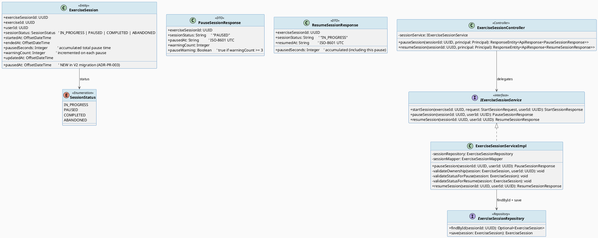
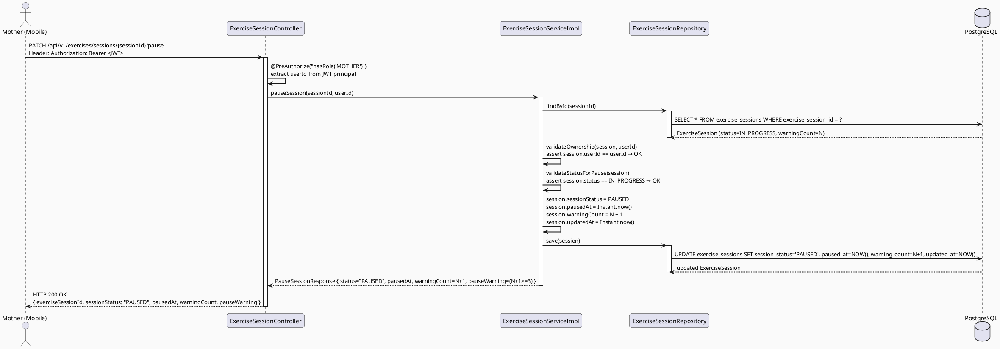
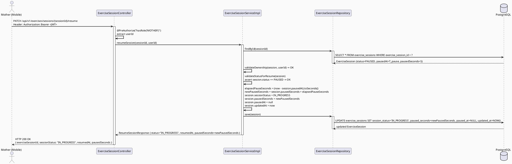
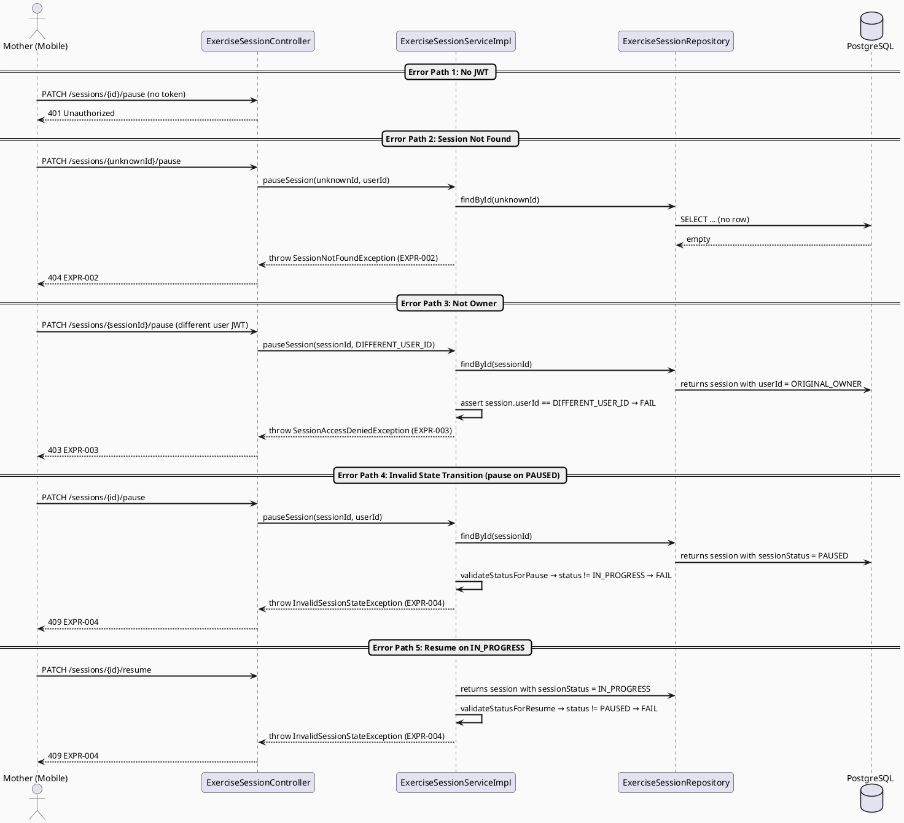
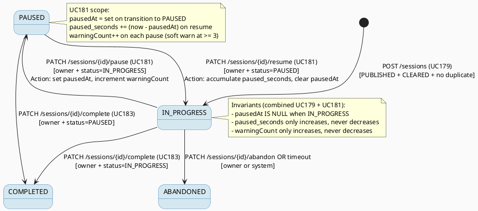

# ENGINEERING DOCUMENTATION STANDARD (EDS) v2.0
# SRS 3.3.2.7 — Pause or Resume Exercise Session — Technical Design Specification

| Field | Value |
|-------|-------|
| **Document ID** | `CB-EXERCISE-IMP-004` |
| **Version** | `1.0` |
| **Date** | `2026-06-28` |
| **Status** | `Implemented` |
| **Document Owner** | `PhuongNT` |
| **Author** | `AI Agent — Developer` |
| **Reviewed by** | `[ ] Pending` |
| **DPO Sign-off** | `[ ] Pending` |
| **Approved by** | `[ ] Pending` |
| **Last Review** | `2026-06-28` |
| **Based on EDS** | `v2.0` |

---

## CHANGELOG

> **Policy 4.4 — Immutable History:** Never delete old information. All changes must be recorded in this table.

| Date | Author | Change Description |
|------|--------|--------------------|
| 2026-06-28 | AI Agent — Developer | Initial document creation — TDS for SRS 3.3.2.7 Pause or Resume Exercise Session |

---

## TABLE OF CONTENTS

1. [Module Overview](#1-module-overview)
2. [Traceability Matrix](#2-traceability-matrix)
3. [Architecture Decision Records (ADR)](#3-architecture-decision-records-adr)
4. [Non-Functional Requirements & SLA](#4-non-functional-requirements--sla)
5. [Static Modeling](#5-static-modeling)
6. [Dynamic Modeling](#6-dynamic-modeling)
7. [Domain Event Catalog](#7-domain-event-catalog)
8. [Interface Specification](#8-interface-specification)
9. [API Specification](#9-api-specification)
10. [Error Codes](#10-error-codes)
11. [Deployment Steps](#11-deployment-steps)
12. [Rollback & Incident Runbook](#12-rollback--incident-runbook)
13. [Detailed Test Scenarios](#13-detailed-test-scenarios)
14. [Verification Methods](#14-verification-methods)
15. [API Verification Samples](#15-api-verification-samples)
16. [Authorization Matrix](#16-authorization-matrix)
17. [AI Prompt Constraints (CASE 2.0)](#17-ai-prompt-constraints-case-20)

---

## 1. Module Overview

> Allows the Mother to pause and resume timing and posture feedback during an active exercise session. Pause transitions `session_status` from `IN_PROGRESS` to `PAUSED`. Resume transitions it back to `IN_PROGRESS` and records the elapsed pause duration into the `paused_seconds` aggregate column.
>
> **SRS 3.3.2.7:** "Pause or Resume Exercise Session — Mother can pause and resume the timing and posture feedback during an exercise session."
>
> **Relationship with adjacent UCs:**
> - **Upstream:** UC179 (Start Exercise Session, SRS 3.3.2.5) — must have a session with `session_status = IN_PROGRESS` to pause.
> - **Sibling:** Posture Analysis (SRS 3.3.2.6) — pausing suspends posture feedback; resuming restores it.
> - **Downstream:** UC183 (Complete Session, SRS 3.3.2.9) — session can be completed from either IN_PROGRESS or PAUSED state.
> - **State machine owner:** The `exercise_sessions` table is authoritative; `session_status` must be validated server-side before each transition.

| Field | Value |
|-------|-------|
| **Module Name** | `Pause or Resume Exercise Session` |
| **Bounded Context** | `exercise` |
| **Data Classification** | `Internal` |
| **Compliance Scope** | `BR-RBAC, BR-SAFETY` |
| **Upstream Dependencies** | `IAM (authentication/JWT), exercise_sessions (V1 migration), CB-EXERCISE-IMP-003 (session entity/repo)` |
| **Downstream Consumers** | `UC183 — Complete Session (SRS 3.3.2.9), Posture Analysis (SRS 3.3.2.6)` |

**Functional Scope:**
- `PATCH /api/v1/exercises/sessions/{sessionId}/pause` — transitions `IN_PROGRESS → PAUSED`, records `pausedAt` timestamp in memory (used by subsequent resume to calculate elapsed pause).
- `PATCH /api/v1/exercises/sessions/{sessionId}/resume` — transitions `PAUSED → IN_PROGRESS`, calculates elapsed pause seconds from `pausedAt` (or `updated_at`), and accumulates into `paused_seconds`.
- Ownership check: only the session's owner (`user_id == JWT sub`) may pause or resume.
- State guard: pause only valid from `IN_PROGRESS`; resume only valid from `PAUSED`.
- Recommended limit: warn (not block) after 3 pauses per session; `warning_count` incremented on each pause.
- Actor: **Mother**. Platform: **Mobile App + Backend**.
- ❌ Session creation → belongs to UC179 (CB-EXERCISE-IMP-003).
- ❌ Session completion → belongs to UC183.
- ❌ Posture analysis start/stop → belongs to SRS 3.3.2.6.

---

## 2. Traceability Matrix

| Requirement ID | Type (BR/ADR/US) | Requirement Description | Code Component | Compliance Target | Related ADR |
|----------------|------------------|------------------------|----------------|-------------------|-------------|
| BR-SESSION-010 | Business Rule | Pause is only valid when `session_status = IN_PROGRESS` | `ExerciseSessionService.pauseSession()` — state guard | BR-SAFETY | ADR-PR-001 |
| BR-SESSION-011 | Business Rule | Resume is only valid when `session_status = PAUSED` | `ExerciseSessionService.resumeSession()` — state guard | BR-SAFETY | ADR-PR-001 |
| BR-SESSION-012 | Business Rule | Only the session owner (user_id == JWT sub) may pause/resume | `ExerciseSessionService` — ownership check | BR-RBAC | ADR-PR-002 |
| BR-SESSION-013 | Business Rule | `paused_seconds` is accumulated on resume using elapsed time since last pause (via `updated_at`) | `ExerciseSessionService.resumeSession()` | — | ADR-PR-003 |
| BR-SESSION-014 | Business Rule | `warning_count` is incremented by 1 on each pause; no hard block but client receives a flag when count ≥ 3 | `ExerciseSessionService.pauseSession()` | BR-SAFETY | ADR-PR-004 |
| BR-RBAC-001 | Business Rule | Only authenticated MOTHER role may pause/resume sessions | `ExerciseSessionController` `@PreAuthorize("hasRole('MOTHER')")` | BR-RBAC | — |
| US-SESSION-002 | User Story | Mother pauses session to attend to urgent need and resumes later | `ExerciseSessionController.PATCH /sessions/{sessionId}/pause` + `/resume` | — | — |
| ADR-PR-001 | Decision | State transitions are validated server-side against current DB status — client state is never trusted | `ExerciseSessionService` | BR-SAFETY | — |
| ADR-PR-002 | Decision | Session ownership verified by comparing `session.user_id` against JWT `sub` | `ExerciseSessionService` | BR-RBAC | — |
| ADR-PR-003 | Decision | `updated_at` used as the implicit pause-start timestamp; `paused_seconds += (now - updated_at)` on resume | `exercise_sessions.updated_at` + `exercise_sessions.paused_seconds` | — | — |
| ADR-PR-004 | Decision | 3-pause threshold is a soft warning (not a hard block) — warning_count is incremented and returned in response | `exercise_sessions.warning_count` | BR-SAFETY | — |

---

## 3. Architecture Decision Records (ADR)

### ADR-PR-001 — Server-Side State Validation for Pause/Resume Transitions

| Field | Value |
|-------|-------|
| **Status** | `Accepted` |
| **Deciders** | `PhuongNT — Developer, AI Agent` |
| **Date** | `2026-06-28` |

#### Context
The mobile client maintains a local timer UI, but the authoritative session state is in the database. A client could issue a pause request when the session is already PAUSED (e.g., due to network retry or UI bug). Without server-side validation, the state machine would be corrupted.

#### Options Considered

| Option | Description | Pros | Cons |
|--------|-------------|------|------|
| A | Re-load `session_status` from DB before each transition | Correct; tamper-proof | One extra DB read per pause/resume |
| B | Trust client-provided current status | Zero extra read | Vulnerable to client state corruption; unsafe for health app |

#### Decision
Choose **Option A** — load the session from DB by `sessionId`, verify the current `session_status` matches the expected pre-transition state (`IN_PROGRESS` for pause, `PAUSED` for resume). Reject with appropriate error code otherwise.

#### Consequences

**Positive:**
- State machine is always consistent with DB truth.
- Prevents accidental double-pause or double-resume from client retries.

**Negative / Trade-offs:**
- One extra DB read per pause/resume call. Acceptable for the safety-critical healthcare context.

**Compliance Impact:**
- Required by BR-SAFETY: system must maintain exercise session integrity for pregnant users.

---

### ADR-PR-002 — Session Ownership Check via JWT Subject

| Field | Value |
|-------|-------|
| **Status** | `Accepted` |
| **Deciders** | `PhuongNT — Developer, AI Agent` |
| **Date** | `2026-06-28` |

#### Context
The `sessionId` is a UUID exposed in the API path. A malicious or mistaken client could attempt to pause another user's session by guessing or knowing a sessionId.

#### Options Considered

| Option | Description | Pros | Cons |
|--------|-------------|------|------|
| A | Verify `session.userId == JWT sub` before any mutation | Secure; prevents cross-user manipulation | One ownership check per request |
| B | Trust that the client only calls with their own sessionId | Simpler | Insecure — IDOR vulnerability |

#### Decision
Choose **Option A** — after loading the session, assert `session.getUserId().equals(userId)`. Reject with `EXPR-003 (403)` if mismatched.

#### Consequences

**Positive:**
- Prevents IDOR (Insecure Direct Object Reference) attacks.
- Aligns with BR-RBAC and standard API security practices.

**Negative / Trade-offs:**
- None significant.

---

### ADR-PR-003 — Use `updated_at` as Implicit Pause-Start Timestamp

| Field | Value |
|-------|-------|
| **Status** | `Accepted` |
| **Deciders** | `PhuongNT — Developer, AI Agent` |
| **Date** | `2026-06-28` |

#### Context
The V1 schema does not have a dedicated `paused_at` column on `exercise_sessions`. Options are:
1. Use `updated_at` (set on pause) as the pause-start timestamp; calculate elapsed seconds on resume.
2. Add a `paused_at` column via new migration.
3. Keep a separate `exercise_pause_events` table (already rejected in ADR-SES-004 for UC179).

#### Options Considered

| Option | Description | Pros | Cons |
|--------|-------------|------|------|
| A | Use `updated_at` as implicit pause-start; calculate `paused_seconds += (now - updated_at)` on resume | No migration needed; simpler | `updated_at` may be written by other processes; semantically overloaded |
| B | Add `paused_at timestamptz` column via new migration | Explicit; clean semantics | Requires Flyway migration |
| C | Client sends `pausedAt` timestamp; server trusts it | Zero extra column | Insecure — client can forge timestamp |

#### Decision
Choose **Option B** — add a `paused_at` column via a new Flyway migration (`V2__add_paused_at_to_exercise_sessions.sql`). This is the cleanest approach and avoids semantic overloading of `updated_at`.

> **Exception to No-Migration Default:** While UC179 required no migration, UC181 adds `paused_at` because the V1 schema lacks an explicit pause timestamp. This is a minimal, targeted migration.

Migration file: `V2__add_paused_at_to_exercise_sessions.sql`

```sql
ALTER TABLE exercise_sessions
    ADD COLUMN paused_at timestamptz;
```

On pause: set `paused_at = NOW()`.
On resume: `paused_seconds += EXTRACT(EPOCH FROM (NOW() - paused_at))::integer`, then set `paused_at = NULL`.

#### Consequences

**Positive:**
- Explicit, semantically correct column.
- No risk of `updated_at` being overwritten by other processes.
- Resume calculation is deterministic and readable.

**Negative / Trade-offs:**
- Requires one small Flyway migration. Tested on staging before production deploy.

---

### ADR-PR-004 — Soft Warning at 3 Pauses (Not Hard Block)

| Field | Value |
|-------|-------|
| **Status** | `Accepted` |
| **Deciders** | `PhuongNT — Developer, AI Agent` |
| **Date** | `2026-06-28` |

#### Context
Excessive pausing may indicate the Mother is fatigued or in an unsafe environment, which is relevant for the healthcare safety goal. The question is whether to hard-block after 3 pauses or soft-warn.

#### Options Considered

| Option | Description | Pros | Cons |
|--------|-------------|------|------|
| A | Hard block after 3 pauses (reject PATCH /pause) | Enforces session integrity | Overly restrictive; may frustrate users for legitimate needs (e.g., bathroom break) |
| B | Soft warning — increment `warning_count`, return `pauseWarning: true` when ≥ 3 | Respects user autonomy; maintains health safety awareness | Warning only; no enforcement |

#### Decision
Choose **Option B** — `warning_count` is incremented on each pause. When `warning_count >= 3`, the response includes `"pauseWarning": true`. The mobile client displays a recommendation to rest or complete the session. No hard block.

#### Consequences

**Positive:**
- Respects user autonomy (important for pregnant mothers in varying physical states).
- Health guidance is surfaced without interrupting the session.

**Negative / Trade-offs:**
- No hard enforcement. Acceptable — AI/SYSTEM provides guidance only; never blocks safety-motivated actions.

---

## 4. Non-Functional Requirements & SLA

### 4.1. Performance & Availability

| Category | Requirement | Target SLA | Measurement Method | Compliance Basis |
|----------|-------------|------------|---------------------|------------------|
| Latency | PATCH /pause and /resume (p99) | `< 300ms` | k6 load test | — |
| Availability | Uptime (monthly) | `99.9%` | Uptime monitor | — |
| Throughput | Concurrent pause/resume requests | `100 req/s` | Load test | — |

### 4.2. Data Integrity & Retention

| Category | Requirement | Target | Verification Method | Compliance Basis |
|----------|-------------|--------|---------------------|------------------|
| State consistency | `session_status` always reflects last successful transition | 100% | Integration test | ADR-PR-001 |
| `paused_seconds` accuracy | Accumulated pause time within ±1 second of actual | ±1s | Unit test with fixed clock | ADR-PR-003 |
| `warning_count` monotonicity | Never decremented; increments only on pause | 100% | Unit test | ADR-PR-004 |

### 4.3. Security

| Category | Requirement | Target | Verification Method | Compliance Basis |
|----------|-------------|--------|---------------------|------------------|
| Authentication | JWT Bearer required | 401 without token | Auth test | BR-RBAC |
| Authorization | Only session owner can pause/resume | 403 for non-owner | Auth test | ADR-PR-002 |
| IDOR prevention | sessionId in path does not grant cross-user access | 403 on mismatch | Security test | ADR-PR-002 |

### 4.4. Scalability & Capacity Planning

> Same session volume as UC179. Pause/resume requests are stateless server-side (no in-memory pause timer on server). Horizontal scaling applies.

---

## 5. Static Modeling

### 5.1. Class Diagram (PlantUML)



### 5.2. Data Structure

> **New migration required** for the `paused_at` column (ADR-PR-003). Oracle source for existing columns: `V1__init_schema.sql`.

Create: `src/main/resources/db/migration/V2__add_paused_at_to_exercise_sessions.sql`

```sql
-- === UC181 PAUSE/RESUME SUPPORT ===
-- Adds explicit pause-start timestamp to exercise_sessions.
-- Needed because V1 does not have a dedicated paused_at column.
-- updated_at would be semantically overloaded (ADR-PR-003).

ALTER TABLE public.exercise_sessions
    ADD COLUMN paused_at timestamptz;

COMMENT ON COLUMN public.exercise_sessions.paused_at IS
    'Timestamp when the current pause started. NULL when session is IN_PROGRESS. '
    'Set on PATCH /pause, cleared on PATCH /resume. Used to calculate elapsed paused_seconds on resume.';
```

---

## 6. Dynamic Modeling

### 6.1. Sequence Diagram — Pause Happy Path (PlantUML)



### 6.2. Sequence Diagram — Resume Happy Path (PlantUML)



### 6.3. Sequence Diagram — Error Paths (PlantUML)



### 6.4. State Machine — Complete exercise_sessions.session_status FSM



---

## 7. Domain Event Catalog

### 7.1. Events Published

| Event Name | Trigger | Publisher | Subscriber(s) | Payload Schema | Async? |
|------------|---------|-----------|---------------|----------------|--------|
| `ExerciseSessionPaused` | Successful PATCH /pause (200 OK) | `ExerciseSessionServiceImpl` | Posture Analysis Service (suspend feedback), Analytics (future) | See §7.3 | No (MVP) |
| `ExerciseSessionResumed` | Successful PATCH /resume (200 OK) | `ExerciseSessionServiceImpl` | Posture Analysis Service (resume feedback), Analytics (future) | See §7.3 | No (MVP) |

### 7.2. Events Consumed

| Event Name | Source | Handler | Action |
|------------|--------|---------|--------|
| _(none for this UC)_ | — | — | — |

### 7.3. Payload Schemas

```java
// ExerciseSessionPaused.java
public record ExerciseSessionPaused(
    UUID    eventId,
    String  eventType,      // "ExerciseSessionPaused"
    Instant occurredAt,
    String  version,        // "1.0"
    Payload payload,
    Metadata metadata
) {
    public record Payload(
        UUID    exerciseSessionId,
        UUID    exerciseId,
        UUID    userId,
        Instant pausedAt,
        Integer warningCount,
        Boolean pauseWarning    // warningCount >= 3
    ) {}

    public record Metadata(
        UUID   correlationId,
        String causedBy
    ) {}
}

// ExerciseSessionResumed.java
public record ExerciseSessionResumed(
    UUID    eventId,
    String  eventType,      // "ExerciseSessionResumed"
    Instant occurredAt,
    String  version,        // "1.0"
    Payload payload,
    Metadata metadata
) {
    public record Payload(
        UUID    exerciseSessionId,
        UUID    exerciseId,
        UUID    userId,
        Instant resumedAt,
        Integer pausedSeconds   // accumulated total after this resume
    ) {}

    public record Metadata(
        UUID   correlationId,
        String causedBy
    ) {}
}
```

---

## 8. Interface Specification

> **Policy (EDS v2.0):** All interfaces declare `@version`. Breaking changes require a new ADR.

### 8.1. Service Interface (Extension of IExerciseSessionService)

```java
// PauseSessionResponse.java — @version 1.0
public class PauseSessionResponse {
    private UUID    exerciseSessionId;
    private String  sessionStatus;      // "PAUSED"
    private String  pausedAt;           // ISO-8601 UTC
    private Integer warningCount;
    private Boolean pauseWarning;       // true if warningCount >= 3
    // getters / setters
}

// ResumeSessionResponse.java — @version 1.0
public class ResumeSessionResponse {
    private UUID    exerciseSessionId;
    private String  sessionStatus;      // "IN_PROGRESS"
    private String  resumedAt;          // ISO-8601 UTC
    private Integer pausedSeconds;      // accumulated total
    // getters / setters
}

// IExerciseSessionService.java — @version 1.1 (extends v1.0 from UC179)
public interface IExerciseSessionService {

    // UC179:
    StartSessionResponse startSession(UUID exerciseId, StartSessionRequest request, UUID userId);

    /**
     * Transitions session from IN_PROGRESS → PAUSED.
     * Records pausedAt timestamp and increments warningCount.
     *
     * @param sessionId UUID from path variable
     * @param userId    UUID from JWT principal (ownership check)
     * @return          PauseSessionResponse with updated state and warning flag
     * @throws SessionNotFoundException      (EXPR-002) if session not found
     * @throws SessionAccessDeniedException  (EXPR-003) if userId != session.userId
     * @throws InvalidSessionStateException  (EXPR-004) if session not IN_PROGRESS
     */
    PauseSessionResponse pauseSession(UUID sessionId, UUID userId);

    /**
     * Transitions session from PAUSED → IN_PROGRESS.
     * Calculates elapsed pause duration and accumulates into paused_seconds.
     * Clears pausedAt column.
     *
     * @param sessionId UUID from path variable
     * @param userId    UUID from JWT principal (ownership check)
     * @return          ResumeSessionResponse with accumulated pausedSeconds
     * @throws SessionNotFoundException      (EXPR-002) if session not found
     * @throws SessionAccessDeniedException  (EXPR-003) if userId != session.userId
     * @throws InvalidSessionStateException  (EXPR-004) if session not PAUSED
     */
    ResumeSessionResponse resumeSession(UUID sessionId, UUID userId);
}
```

### 8.2. Repository Interface (Reused from UC179)

```java
// ExerciseSessionRepository.java — @version 1.1 (no new methods needed for UC181)
// findById(UUID) from JpaRepository is sufficient for pause/resume.
// save(ExerciseSession) from JpaRepository is used for state update.
public interface ExerciseSessionRepository extends JpaRepository<ExerciseSession, UUID> {
    // findActiveSessionToday() from UC179 (CB-EXERCISE-IMP-003) — not used in UC181
}
```

### 8.3. Entity Update (V2 migration field)

```java
// ExerciseSession.java — add pausedAt field (V2 migration)
@Column(name = "paused_at")
private OffsetDateTime pausedAt;   // null when IN_PROGRESS; set on pause; cleared on resume
```

---

## 9. API Specification

### 9.1. Endpoints Table

| Method | Path | Auth Level | Required Roles | Rate Limit | Idempotent? |
|--------|------|------------|----------------|------------|-------------|
| `PATCH` | `/api/v1/exercises/sessions/{sessionId}/pause` | JWT Bearer | `MOTHER` | 60/min per user | No (state machine) |
| `PATCH` | `/api/v1/exercises/sessions/{sessionId}/resume` | JWT Bearer | `MOTHER` | 60/min per user | No (state machine) |

### 9.2. Request / Response Schemas

#### `PATCH /api/v1/exercises/sessions/{sessionId}/pause`

**Path Parameter:**
- `sessionId` (UUID, required) — the session to pause

**Request Body:** _(none — state transition requires no payload)_

**Response — 200 OK (Happy Path):**
```json
{
  "data": {
    "exerciseSessionId": "550e8400-e29b-41d4-a716-446655440001",
    "sessionStatus": "PAUSED",
    "pausedAt": "2026-06-28T07:15:00.000Z",
    "warningCount": 1,
    "pauseWarning": false
  }
}
```

**Response — 200 OK (Third Pause — Warning):**
```json
{
  "data": {
    "exerciseSessionId": "550e8400-e29b-41d4-a716-446655440001",
    "sessionStatus": "PAUSED",
    "pausedAt": "2026-06-28T07:30:00.000Z",
    "warningCount": 3,
    "pauseWarning": true
  }
}
```

**Response — 404 Not Found:**
```json
{
  "error": {
    "code": "EXPR-002",
    "message": "Exercise session not found"
  }
}
```

**Response — 403 Forbidden (Not Owner):**
```json
{
  "error": {
    "code": "EXPR-003",
    "message": "Access denied. You can only pause your own exercise session."
  }
}
```

**Response — 409 Conflict (Invalid State):**
```json
{
  "error": {
    "code": "EXPR-004",
    "message": "Cannot pause session: current status is PAUSED. Session must be IN_PROGRESS to pause."
  }
}
```

---

#### `PATCH /api/v1/exercises/sessions/{sessionId}/resume`

**Path Parameter:**
- `sessionId` (UUID, required) — the session to resume

**Request Body:** _(none)_

**Response — 200 OK (Happy Path):**
```json
{
  "data": {
    "exerciseSessionId": "550e8400-e29b-41d4-a716-446655440001",
    "sessionStatus": "IN_PROGRESS",
    "resumedAt": "2026-06-28T07:20:00.000Z",
    "pausedSeconds": 300
  }
}
```

**Response — 409 Conflict (Invalid State — resume on IN_PROGRESS):**
```json
{
  "error": {
    "code": "EXPR-004",
    "message": "Cannot resume session: current status is IN_PROGRESS. Session must be PAUSED to resume."
  }
}
```

---

## 10. Error Codes

| Code | HTTP Status | Message (EN) | Trigger Condition |
|------|-------------|--------------|-------------------|
| `EXPR-001` | 400 | Validation failed | Malformed UUID in path parameter |
| `EXPR-002` | 404 | Exercise session not found | `sessionId` does not exist in DB |
| `EXPR-003` | 403 | Access denied | `session.userId != JWT sub` — IDOR prevention |
| `EXPR-004` | 409 | Invalid session state for this transition | Pause on non-IN_PROGRESS, or resume on non-PAUSED |
| `EXPR-005` | 500 | Internal error during pause/resume | Unexpected DB error |
| `IAM-001` | 401 | Authentication required | Missing or expired JWT |
| `IAM-002` | 403 | Insufficient permissions | Authenticated user does not have `MOTHER` role |

---

## 11. Deployment Steps

### 11.1. Prerequisites

- [ ] UC179 (CB-EXERCISE-IMP-003) fully deployed and tests passing
- [ ] ADR-PR-001 through ADR-PR-004 Accepted
- [ ] Staging environment running V1 migration

### 11.2. Pre-Migration Checklist

- [ ] V2 migration script reviewed and tested on local dev DB
- [ ] `exercise_sessions` table confirmed in staging (V1 applied)
- [ ] DB backup before V2 migration: `pg_dump $DB_NAME > backup_before_v2.sql`
- [ ] V2 migration ran successfully on staging ≥ 24 hours before production

### 11.3. Implementation Steps

#### Step 1 — Run V2 Flyway Migration

Create `src/main/resources/db/migration/V2__add_paused_at_to_exercise_sessions.sql` (see §5.2).

```bash
./mvnw flyway:migrate
```

> ⚠️ Note: `ALTER TABLE ADD COLUMN` on PostgreSQL does not lock the table for reads on PostgreSQL 11+. Safe for production.

#### Step 2 — Update ExerciseSession Entity

Add `@Column(name = "paused_at") private OffsetDateTime pausedAt;` to `ExerciseSession.java`.

#### Step 3 — Add DTOs and Exceptions

Create:
- `exercise/dto/response/PauseSessionResponse.java`
- `exercise/dto/response/ResumeSessionResponse.java`
- `exercise/exception/SessionNotFoundException.java`
- `exercise/exception/SessionAccessDeniedException.java`
- `exercise/exception/InvalidSessionStateException.java`

#### Step 4 — Extend Service

Extend `IExerciseSessionService` and `ExerciseSessionServiceImpl` with `pauseSession()` and `resumeSession()` methods (see §8.1).

#### Step 5 — Add Controller Endpoints

In `ExerciseSessionController.java`:
```java
@PatchMapping("/sessions/{sessionId}/pause")
@PreAuthorize("hasRole('MOTHER')")
public ResponseEntity<ApiResponse<PauseSessionResponse>> pauseSession(
        @PathVariable UUID sessionId,
        @AuthenticationPrincipal JwtUserDetails principal) {
    return ResponseEntity.ok(
            ApiResponse.success(sessionService.pauseSession(sessionId, principal.getUserId())));
}

@PatchMapping("/sessions/{sessionId}/resume")
@PreAuthorize("hasRole('MOTHER')")
public ResponseEntity<ApiResponse<ResumeSessionResponse>> resumeSession(
        @PathVariable UUID sessionId,
        @AuthenticationPrincipal JwtUserDetails principal) {
    return ResponseEntity.ok(
            ApiResponse.success(sessionService.resumeSession(sessionId, principal.getUserId())));
}
```

#### Step 6 — Register Exception Handlers

In `GlobalExceptionHandler`:
- Map `SessionNotFoundException` → 404 `EXPR-002`
- Map `SessionAccessDeniedException` → 403 `EXPR-003`
- Map `InvalidSessionStateException` → 409 `EXPR-004`

#### Step 7 — Verification After Deploy

```bash
# Flyway migration applied
./mvnw flyway:info

# Check new column exists
psql $DATABASE_URL -c "\d exercise_sessions" | grep paused_at

# Run tests
./mvnw test -pl CareBridgeAPI -Dtest="ExerciseSession*"
```

### 11.4. Deployment Checklist

- [ ] V2 migration applied without errors
- [ ] `paused_at` column visible in `\d exercise_sessions`
- [ ] Health check returns 200
- [ ] `./mvnw test` green
- [ ] Error rate < 1% in first 10 minutes

---

## 12. Rollback & Incident Runbook

### 12.1. Rollback Trigger Conditions

| Condition | Threshold | Decision Maker |
|-----------|-----------|----------------|
| Error rate spikes | > 5% in 5 minutes | On-call Engineer |
| `paused_seconds` calculated incorrectly | Any case | Tech Lead |
| `session_status` stuck in wrong state | Any case | Tech Lead |
| V2 migration failure | Any error | On-call Engineer |

### 12.2. Rollback Procedure

```bash
# Step 1: Revert code — re-deploy previous backend version
kubectl rollout undo deployment/carebridge-api

# Step 2: Revert V2 migration (if needed — DESTRUCTIVE, staging only without DBA review)
psql $DATABASE_URL \
  -c "ALTER TABLE exercise_sessions DROP COLUMN IF EXISTS paused_at;"
psql $DATABASE_URL \
  -c "DELETE FROM flyway_schema_history WHERE version = '2';"

# Step 3: Verify rollback
kubectl rollout status deployment/carebridge-api
curl -X GET http://localhost:8080/api/v1/health

# Step 4: Revert source files
git checkout -- 05_Development/CareBridgeAPI/src/main/java/com/carebridge/backend/exercise/
git checkout -- 05_Development/CareBridgeAPI/src/main/resources/db/migration/V2__add_paused_at_to_exercise_sessions.sql
```

> ⚠️ **Dropping `paused_at` in production requires DBA approval and a data-impact assessment.** Only sessions in PAUSED state with `paused_at` set would be affected; those sessions would need manual review.

### 12.3. Notification Protocol

| Timing | Recipients | Channel | Template |
|--------|------------|---------|----------|
| Immediately | On-call team | Slack `#incident` | "INCIDENT [carebridge-api]: Exercise pause/resume failure > 5%" |
| Within 30 min | Tech Lead | Direct message | Summarize impact |

---

## 13. Detailed Test Scenarios

> All test scenarios use `SYNTHETIC` data classification. No real PII.

### 13.1. Unit Tests (Pause)

#### TC-UNIT-PAUSE-001 — Happy Path: Pause IN_PROGRESS Session

```gherkin
Feature: Pause Exercise Session
  Background:
    Given test data classification: SYNTHETIC
    And sessionId = SESS_ID_1, userId = USER_ID_1
    And session in DB: { sessionStatus=IN_PROGRESS, pausedSeconds=0, warningCount=0 }

  Scenario: Successful pause
    When pauseSession(SESS_ID_1, USER_ID_1) is called
    Then session is saved with sessionStatus = PAUSED
    And pausedAt is set to approximately now (within 1 second)
    And warningCount = 1
    And response.pauseWarning = false
```

#### TC-UNIT-PAUSE-002 — Third Pause: Warning Flag

```gherkin
  Scenario: Third pause triggers warning
    Given session warningCount = 2
    When pauseSession(SESS_ID_1, USER_ID_1) is called
    Then warningCount = 3
    And response.pauseWarning = true
    And sessionStatus = PAUSED (not blocked)
```

#### TC-UNIT-PAUSE-003 — Pause on Already-Paused Session → EXPR-004

```gherkin
  Scenario: Pause when already PAUSED
    Given session.sessionStatus = PAUSED
    When pauseSession(SESS_ID_1, USER_ID_1) is called
    Then InvalidSessionStateException thrown (EXPR-004)
    And save() never called
```

#### TC-UNIT-PAUSE-004 — Pause by Non-Owner → EXPR-003

```gherkin
  Scenario: Pause session owned by different user
    Given session.userId = USER_ID_1
    When pauseSession(SESS_ID_1, DIFFERENT_USER_ID) is called
    Then SessionAccessDeniedException thrown (EXPR-003)
    And save() never called
```

### 13.2. Unit Tests (Resume)

#### TC-UNIT-RESUME-001 — Happy Path: Resume PAUSED Session with Correct paused_seconds

```gherkin
Feature: Resume Exercise Session
  Background:
    Given session { sessionStatus=PAUSED, pausedSeconds=100, pausedAt=5_MINUTES_AGO }

  Scenario: Successful resume accumulates paused_seconds
    When resumeSession(SESS_ID_1, USER_ID_1) is called
    Then session saved with sessionStatus = IN_PROGRESS
    And pausedAt = null
    And pausedSeconds = 100 + 300 (= 400, ±2 seconds tolerance)
    And response.pausedSeconds = 400 (approximately)
```

**Implementation Note:** Use a fixed `Clock` in tests (Spring `@TestConfiguration Clock`) to make elapsed time deterministic.

#### TC-UNIT-RESUME-002 — Resume on IN_PROGRESS Session → EXPR-004

```gherkin
  Scenario: Resume when session is IN_PROGRESS
    Given session.sessionStatus = IN_PROGRESS
    When resumeSession(SESS_ID_1, USER_ID_1) is called
    Then InvalidSessionStateException thrown (EXPR-004)
```

#### TC-UNIT-RESUME-003 — Resume by Non-Owner → EXPR-003

```gherkin
  Scenario: Resume session owned by different user
    Given session.userId = USER_ID_1
    When resumeSession(SESS_ID_1, DIFFERENT_USER_ID) is called
    Then SessionAccessDeniedException thrown (EXPR-003)
```

#### TC-UNIT-RESUME-004 — Session Not Found → EXPR-002

```gherkin
  Scenario: Resume non-existent session
    Given sessionRepository.findById(UNKNOWN_ID) returns empty
    When resumeSession(UNKNOWN_ID, USER_ID_1) is called
    Then SessionNotFoundException thrown (EXPR-002)
```

### 13.3. Integration Tests

#### TC-INT-PAUSE-001 — Full Pause Flow: DB State After Pause

```gherkin
  Scenario: DB state verified after pause
    Given seeded: IN_PROGRESS session for USER_ID_1
    When PATCH /api/v1/exercises/sessions/{SESS_ID_1}/pause as MOTHER
    Then response 200, sessionStatus = "PAUSED", warningCount = 1
    And DB: session_status = 'PAUSED', paused_at IS NOT NULL, warning_count = 1
```

#### TC-INT-RESUME-001 — Full Resume Flow: paused_seconds Accumulated in DB

```gherkin
  Scenario: paused_seconds accumulated after pause + resume cycle
    Given seeded: PAUSED session with paused_at = 5 minutes ago, paused_seconds = 0
    When PATCH /api/v1/exercises/sessions/{SESS_ID_1}/resume as MOTHER
    Then response 200, sessionStatus = "IN_PROGRESS", pausedSeconds ~= 300
    And DB: session_status = 'IN_PROGRESS', paused_at IS NULL, paused_seconds = ~300
```

#### TC-INT-PR-002 — Full Pause-Resume Cycle: Two Pauses

```gherkin
  Scenario: Two-pause cycle — both paused_seconds accumulate
    Given seeded: IN_PROGRESS session
    When PATCH /pause → PATCH /resume (after 60s) → PATCH /pause → PATCH /resume (after 120s)
    Then final pausedSeconds ~= 180 (60 + 120)
    And final warningCount = 2
    And final sessionStatus = IN_PROGRESS
```

---

## 14. Verification Methods

### 14.1. Database Inspection

```sql
-- Verify state after pause
SELECT exercise_session_id, session_status, paused_at, paused_seconds, warning_count
FROM exercise_sessions
WHERE exercise_session_id = '<session-id>';
-- Expected after pause: session_status='PAUSED', paused_at IS NOT NULL, warning_count > 0

-- Verify state after resume
SELECT exercise_session_id, session_status, paused_at, paused_seconds
FROM exercise_sessions
WHERE exercise_session_id = '<session-id>';
-- Expected after resume: session_status='IN_PROGRESS', paused_at IS NULL, paused_seconds > 0

-- Verify paused_seconds only increases (invariant)
SELECT paused_seconds FROM exercise_sessions
WHERE exercise_session_id = '<session-id>';
-- Re-run after multiple pause/resume cycles — value should only increase
```

### 14.2. Log Verification

```bash
# Check pause/resume events logged
kubectl logs -l app=carebridge-api | grep -E "ExerciseSessionPaused|ExerciseSessionResumed" | head -5

# Verify no PII in logs
kubectl logs -l app=carebridge-api | grep -i "answer_json\|blocked_reason"
# Expected: No output
```

---

## 15. API Verification Samples

### 15.1. Happy Path — Pause

```bash
# PATCH — Pause active session
curl -X PATCH http://localhost:8080/api/v1/exercises/sessions/SESSION-UUID/pause \
  -H "Authorization: Bearer <VALID_MOTHER_JWT>" \
  -H "X-Correlation-Id: $(uuidgen)"
```

**Expected Response (200):**
```json
{
  "data": {
    "exerciseSessionId": "SESSION-UUID",
    "sessionStatus": "PAUSED",
    "pausedAt": "2026-06-28T07:15:00.000Z",
    "warningCount": 1,
    "pauseWarning": false
  }
}
```

### 15.2. Happy Path — Resume

```bash
# PATCH — Resume paused session
curl -X PATCH http://localhost:8080/api/v1/exercises/sessions/SESSION-UUID/resume \
  -H "Authorization: Bearer <VALID_MOTHER_JWT>" \
  -H "X-Correlation-Id: $(uuidgen)"
```

**Expected Response (200):**
```json
{
  "data": {
    "exerciseSessionId": "SESSION-UUID",
    "sessionStatus": "IN_PROGRESS",
    "resumedAt": "2026-06-28T07:20:00.000Z",
    "pausedSeconds": 300
  }
}
```

### 15.3. Error Paths

```bash
# Pause already-paused session → 409
curl -X PATCH http://localhost:8080/api/v1/exercises/sessions/SESSION-UUID/pause \
  -H "Authorization: Bearer <TOKEN>"
# (Second pause without resume in between)
```

```bash
# Resume in-progress session → 409
curl -X PATCH http://localhost:8080/api/v1/exercises/sessions/SESSION-UUID/resume \
  -H "Authorization: Bearer <TOKEN>"
# (No prior pause)
```

```bash
# Pause another user's session → 403
curl -X PATCH http://localhost:8080/api/v1/exercises/sessions/OTHER_SESSION_UUID/pause \
  -H "Authorization: Bearer <DIFFERENT_USER_TOKEN>"
```

---

## 16. Authorization Matrix

| Endpoint | `GUEST` | `MOTHER` | `EXPERT` | `ADMIN` | `SYSTEM` |
|----------|---------|----------|----------|---------|----------|
| `PATCH /api/v1/exercises/sessions/{sessionId}/pause` | ❌ | ✅ Own | ❌ | ❌ | ✅ |
| `PATCH /api/v1/exercises/sessions/{sessionId}/resume` | ❌ | ✅ Own | ❌ | ❌ | ✅ |

**Notes:**
- `Own` = `session.userId == JWT sub` verified in service (ADR-PR-002)
- ADMIN is intentionally denied to prevent administrative bypass of safety flows
- SYSTEM allowed for automated session management (e.g., timeout handling)

---

## 17. AI Prompt Constraints (CASE 2.0)

### 17.1 Constraint Summary Table

| # | Constraint | Source (ADR/BR) | Last Verified |
|---|-----------|-----------------|---------------|
| C1 | Service MUST load session from DB by `sessionId` and validate current `session_status` before any transition — do NOT trust client-provided status | `ADR-PR-001` | `2026-06-28` |
| C2 | Service MUST verify `session.userId == userId` (from JWT) before any mutation — reject with EXPR-003 if mismatch | `ADR-PR-002, BR-RBAC` | `2026-06-28` |
| C3 | Pause: set `pausedAt = OffsetDateTime.now(ZoneOffset.UTC)`, increment `warningCount`, set `sessionStatus = PAUSED` — do NOT calculate paused_seconds on pause | `ADR-PR-003` | `2026-06-28` |
| C4 | Resume: `paused_seconds += (now - session.pausedAt).toSeconds()`, set `sessionStatus = IN_PROGRESS`, set `pausedAt = null` — calculation in service, not in DB function | `ADR-PR-003` | `2026-06-28` |
| C5 | `warning_count >= 3` triggers `pauseWarning = true` in response (soft warning, NOT a hard block) — session is still paused successfully | `ADR-PR-004, BR-SAFETY` | `2026-06-28` |
| C6 | Controller MUST extract `userId` from `@AuthenticationPrincipal JwtUserDetails` — NEVER accept userId from request body or path | `BR-RBAC` | `2026-06-28` |
| C7 | `paused_at` column used for pause timestamp — NOT `updated_at` — requires V2 Flyway migration | `ADR-PR-003` | `2026-06-28` |

### 17.2 Constraint Injection Block (Copy-Paste into AI Prompt)

```
[CONSTRAINT BLOCK — Module: UC181 Pause/Resume Exercise Session — CB-EXERCISE-IMP-004]
Per TDS CB-EXERCISE-IMP-004 and related ADRs:

1. (C1) Load session via findById(sessionId) — validate sessionStatus is IN_PROGRESS (pause) or PAUSED (resume) — throw InvalidSessionStateException (EXPR-004) otherwise.
2. (C2) Assert session.getUserId().equals(userId from JWT) — throw SessionAccessDeniedException (EXPR-003) on mismatch — prevents IDOR.
3. (C3) On pause: session.setPausedAt(OffsetDateTime.now(ZoneOffset.UTC)); session.setWarningCount(session.getWarningCount() + 1); session.setSessionStatus(PAUSED); — do NOT touch paused_seconds.
4. (C4) On resume: elapsed = ChronoUnit.SECONDS.between(session.getPausedAt(), OffsetDateTime.now(ZoneOffset.UTC)); session.setPausedSeconds(session.getPausedSeconds() + (int)elapsed); session.setPausedAt(null); session.setSessionStatus(IN_PROGRESS);
5. (C5) PauseSessionResponse.pauseWarning = (session.getWarningCount() >= 3) — warning only, session is still PAUSED after the call.
6. (C6) Controller: no request body for PATCH /pause or PATCH /resume — only @PathVariable sessionId and @AuthenticationPrincipal JwtUserDetails.
7. (C7) V2 migration adds paused_at column — add ExerciseSession.pausedAt field with @Column(name = "paused_at").

[CONTEXT BLOCK]
- Bounded Context: exercise
- Data Classification: Internal
- Compliance: BR-RBAC, BR-SAFETY
- Existing interfaces: §8 Service Interface + §8.2 Repository Interface
- Error codes: §10 Error Codes Table
- Auth matrix: §16 Authorization Matrix

[TASK BLOCK]
Implement ExerciseSessionServiceImpl.pauseSession() and resumeSession() satisfying constraints above.
Output must conform to §8 Interface Specification.
Tests must cover §13 Test Scenarios.
```

### 17.3 Constraint Quality Checklist

- [x] Each constraint traceable to an ADR or BR
- [x] No generic constraints
- [x] Each constraint has `Last Verified` date (2026-06-28 — within 2 sprints)
- [x] Constraint block has ≥ 3 specific constraints (7 defined)
- [x] Constraint block references §8 Interface
- [x] Constraint block references §16 Auth Matrix

### 17.4 Anti-Pattern Detection

| AP-ID | Anti-Pattern | Warning Sign | Action |
|-------|-------------|--------------|--------|
| AP-AI-001 | Unconstrained Gen | Code does not validate state machine transition or ownership | Reject — re-inject C1 and C2 |
| AP-AI-003 | Implicit Decision | Code creates a separate `pause_events` table for tracking pauses | Reject — reference ADR-PR-003 and ADR-SES-004 |
| AP-AI-005 | Hallucinated Contract | Code uses `updated_at` as pause timestamp instead of `paused_at` | Reject — C7 specifies `paused_at` via V2 migration |

---

## APPENDIX

### A. Glossary

| Term | Definition |
|------|------------|
| `paused_at` | Column added by V2 migration. Records the timestamp when the current pause started. Set to `NULL` when session is IN_PROGRESS. |
| `paused_seconds` | Aggregate column accumulating total time spent in PAUSED state across all pause/resume cycles. Only increases; never decreases. |
| `warning_count` | Counter of total pauses in this session. Soft warning threshold: ≥ 3. Never decremented. |
| `pauseWarning` | Response field — `true` when `warning_count >= 3`. Client should display rest recommendation. |
| Soft Warning | A warning returned in the API response (and shown in UI) without blocking the operation. Contrast with hard block. |
| IDOR | Insecure Direct Object Reference — attack where an attacker accesses another user's resource by guessing a UUID. Prevented by ownership check in ADR-PR-002. |
| State Machine | The `session_status` FSM: `IN_PROGRESS ↔ PAUSED`, `IN_PROGRESS/PAUSED → COMPLETED/ABANDONED`. UC181 owns the pause/resume transitions only. |

### B. Reference Documents

| Document | Path |
|----------|------|
| V1 Schema (primary oracle) | `05_Development/CareBridgeAPI/src/main/resources/db/migration/V1__init_schema.sql` |
| UC179 TDS (session start) | `04_Implement/UC179_StartExerciseSession/UC179_StartExerciseSession_TDS.md` |
| UC179 Test-Spec | `04_Implement/UC179_StartExerciseSession/UC179_StartExerciseSession_Test-Spec.md` |
| EDS v2.0 Template | `08_References/Template/PHASE-3_TDS.md` |
| TDD Template | `08_References/Template/PHASE-4_Test-Spec.md` |

---

*EDS v2.0 — CB-EXERCISE-IMP-004 — UC181 Pause or Resume Exercise Session*
*Status: Draft — awaiting review and approval before implementation.*
