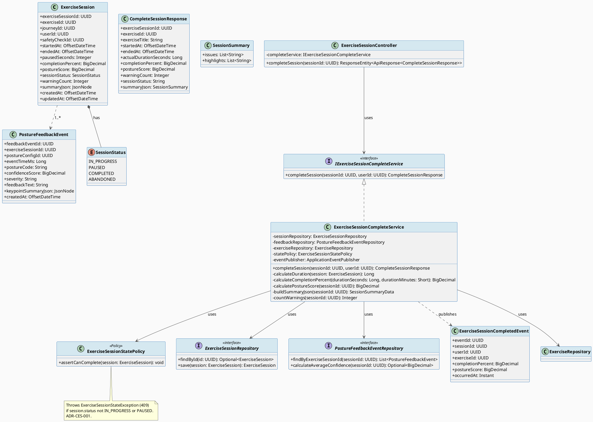
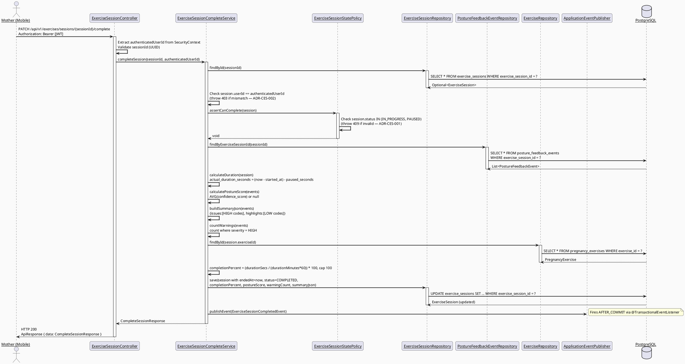
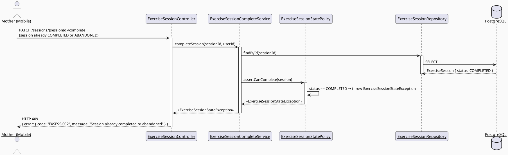
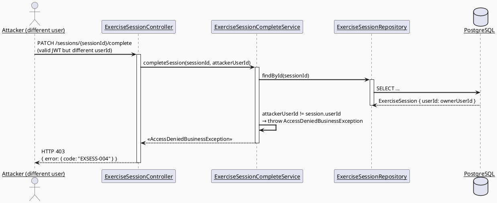
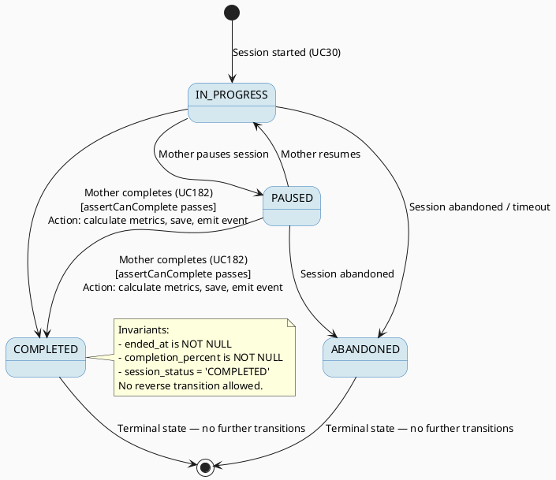

# ENGINEERING DOCUMENTATION STANDARD (EDS) v2.0
# SRS 3.3.2.8 — Complete Exercise Session — Technical Design Specification

| Field | Value |
|-------|-------|
| **Document ID** | `CB-EXERCISE-IMP-005` |
| **Version** | `1.0` |
| **Date** | `2026-06-28` |
| **Status** | `Implemented` |
| **Document Owner** | `PhuongNT` |
| **Author** | `AI Agent — Developer` |
| **Reviewed by** | `[ ] Pending` |
| **DPO Sign-off** | `[ ] Pending` |
| **Approved by** | `[ ] Pending` |
| **Last Review** | `2026-06-28` |
| **Based on EDS** | `v2.0` |

---

## CHANGELOG

> **Policy 4.4 — Immutable History:** Never delete old information. All changes must be recorded in this table.

| Date | Author | Change Description |
|------|--------|--------------------|
| 2026-06-28 | AI Agent — Developer | Initial document creation — TDS for SRS 3.3.2.8 Complete Exercise Session (UC182). |

---

## TABLE OF CONTENTS

1. [Module Overview](#1-module-overview)
2. [Traceability Matrix](#2-traceability-matrix)
3. [Architecture Decision Records (ADR)](#3-architecture-decision-records-adr)
4. [Non-Functional Requirements & SLA](#4-non-functional-requirements--sla)
5. [Static Modeling](#5-static-modeling)
6. [Dynamic Modeling](#6-dynamic-modeling)
7. [Domain Event Catalog](#7-domain-event-catalog)
8. [Interface Specification](#8-interface-specification)
9. [API Specification](#9-api-specification)
10. [Error Codes](#10-error-codes)
11. [Deployment Procedure](#11-deployment-procedure)
12. [Rollback & Incident Runbook](#12-rollback--incident-runbook)
13. [Detailed Test Scenarios](#13-detailed-test-scenarios)
14. [Verification Methods](#14-verification-methods)
15. [API Verification Samples](#15-api-verification-samples)
16. [Authorization Matrix](#16-authorization-matrix)
17. [AI Prompt Constraints (CASE 2.0)](#17-ai-prompt-constraints-case-20)

---

## 1. Module Overview

> Allows the Mother to end an active exercise session. On completion, the system calculates duration, builds a posture summary, and emits a domain event so downstream consumers (notification service) can act.
> SRS 3.3.2.8: "Complete Exercise Session — Mother ends the exercise session; system saves duration, completion status, posture score summary, and common issues."

| Field | Value |
|-------|-------|
| **Module Name** | `Complete Exercise Session` |
| **Bounded Context** | `exercise` |
| **Data Classification** | `Internal` |
| **Compliance Scope** | `BR-RBAC, BR-SAFETY, BR-PRIVACY` |
| **Upstream Dependencies** | `IAM (authentication), exercise_sessions table (V1 migration), posture_feedback_events table (V1 migration), pregnancy_exercises table (V1 migration)` |
| **Downstream Consumers** | `Notification Service (ExerciseSessionCompleted event), UC183 — View Exercise Session Result (SRS 3.3.2.9)` |

**Functional Scope:**
- `PATCH /api/v1/exercises/sessions/{sessionId}/complete` — transitions `IN_PROGRESS` or `PAUSED` session to `COMPLETED`, calculates metrics, returns session result.
- State machine: only `IN_PROGRESS` → `COMPLETED` and `PAUSED` → `COMPLETED` are valid. Attempting to complete an already `COMPLETED` or `ABANDONED` session returns 409.
- Duration calculation: `actual_duration_seconds = (ended_at - started_at).toSeconds() - paused_seconds`.
- Completion percent: `completion_percent = (actual_duration_seconds / (durationMinutes * 60)) * 100`, capped at 100.
- Posture score: `AVG(confidence_score)` from `posture_feedback_events` WHERE `exercise_session_id = sessionId`. If no events exist, posture_score = null.
- Summary JSON: `{ "issues": [posture_codes with severity = 'HIGH'], "highlights": [posture_codes with severity = 'LOW'] }`.
- Only the session owner (user_id == authenticated user) may complete a session.
- Emits `ExerciseSessionCompleted` Spring application event (synchronous) for downstream processing.
- ❌ Starting a session → UC30 (SRS 3.3.2.4).
- ❌ Viewing results after completion → UC183 (SRS 3.3.2.9).

---

## 2. Traceability Matrix

| Requirement ID | Type (BR/ADR/US) | Description | Code Component | Compliance Target | Related ADR |
|----------------|------------------|-------------|----------------|-------------------|-------------|
| BR-EXSESS-001 | Business Rule | Only IN_PROGRESS or PAUSED sessions can be completed | `ExerciseSessionService.completeSession()`, `ExerciseSessionStatePolicy` | BR-SAFETY | ADR-CES-001 |
| BR-EXSESS-002 | Business Rule | Only session owner (user_id) can complete a session | `ExerciseSessionService.completeSession()` | BR-RBAC | ADR-CES-002 |
| BR-EXSESS-003 | Business Rule | actual_duration_seconds = (ended_at − started_at) − paused_seconds | `ExerciseSessionService.calculateDuration()` | — | — |
| BR-EXSESS-004 | Business Rule | completion_percent = (actual_duration_seconds / (durationMinutes × 60)) × 100, capped at 100.00 | `ExerciseSessionService.calculateCompletionPercent()` | — | — |
| BR-EXSESS-005 | Business Rule | posture_score = AVG(confidence_score) from posture_feedback_events for this session | `ExerciseSessionService.calculatePostureScore()` | BR-SAFETY | — |
| BR-EXSESS-006 | Business Rule | summary_json.issues = posture_codes where severity = HIGH; summary_json.highlights = posture_codes where severity = LOW | `ExerciseSessionService.buildSummaryJson()` | BR-SAFETY | ADR-CES-003 |
| BR-EXSESS-007 | Business Rule | Emit ExerciseSessionCompleted event on successful completion | `ExerciseSessionService.completeSession()`, `ExerciseSessionCompletedEvent` | — | ADR-CES-004 |
| US-EXSESS-001 | User Story | Mother ends session; system saves duration, completion status, posture score, and issues | `ExerciseSessionController.PATCH /sessions/{id}/complete` | — | — |
| ADR-CES-001 | Decision | State guard in policy class; reject invalid transitions with 409 | `ExerciseSessionStatePolicy` | BR-SAFETY | — |
| ADR-CES-002 | Decision | Owner check before any mutation; throw 403 if user_id mismatch | `ExerciseSessionService` | BR-RBAC | — |

---

## 3. Architecture Decision Records (ADR)

### ADR-CES-001 — State Guard in Dedicated Policy Class

| Field | Value |
|-------|-------|
| **Status** | `Accepted` |
| **Deciders** | `PhuongNT — Developer, AI Agent` |
| **Date** | `2026-06-28` |
| **Supersedes** | — |

#### Context
The session has a well-defined state machine (IN_PROGRESS → COMPLETED, PAUSED → COMPLETED, invalid transitions → rejected). This logic could live in the Service or be scattered across the controller. Centralizing it in a Policy class makes it reusable and independently testable.

#### Options Considered

| Option | Description | Pros | Cons |
|--------|-------------|------|------|
| A | Inline state check inside `ExerciseSessionService` | + Less indirection | - Hard to test in isolation; duplicated if more transitions added |
| B | Dedicated `ExerciseSessionStatePolicy` class | + SRP, independently testable, matches CareBridge architecture (policy package) | - Extra class |

#### Decision
Choose **Option B**: `ExerciseSessionStatePolicy.assertCanComplete(session)` throws `ExerciseSessionStateException` (409) if session is not IN_PROGRESS or PAUSED.

#### Consequences

**Positive:**
- Policy logic tested in isolation without mocking repositories.
- Consistent with CareBridge package style (`policy` layer exists for healthcare safety rules).

**Negative / Trade-offs:**
- One extra class per domain; acceptable for healthcare safety rules.

**Compliance Impact:**
- BR-SAFETY: state guard prevents double-completion and invalid transitions.

---

### ADR-CES-002 — Owner Authorization Before Mutation

| Field | Value |
|-------|-------|
| **Status** | `Accepted` |
| **Deciders** | `PhuongNT — Developer, AI Agent` |
| **Date** | `2026-06-28` |

#### Context
`exercise_sessions` has a `user_id` column that must be verified against the authenticated user before any mutation. Failing to do so would allow one user to complete another user's session.

#### Decision
`ExerciseSessionService.completeSession()` extracts `authenticatedUserId` from Spring SecurityContext and compares it to `session.getUserId()`. If mismatch → throw `AccessDeniedBusinessException` (403).

#### Consequences

**Positive:**
- Defense-in-depth: even if `@PreAuthorize` is misconfigured, the service layer rejects unauthorized access.

**Negative / Trade-offs:**
- Slight coupling between service and SecurityContext; acceptable pattern used elsewhere in CareBridge (e.g., ConsentService).

**Compliance Impact:**
- BR-RBAC: only session owner may mutate their own session.

---

### ADR-CES-003 — Summary JSON Schema: issues (HIGH) and highlights (LOW)

| Field | Value |
|-------|-------|
| **Status** | `Accepted` |
| **Deciders** | `PhuongNT — Developer, AI Agent` |
| **Date** | `2026-06-28` |

#### Context
The `summary_json` column (JSONB) stores aggregated posture feedback. The schema must be defined upfront because downstream consumers (UC183, notification) will parse it.

#### Decision
`summary_json = { "issues": ["<posture_code>", ...], "highlights": ["<posture_code>", ...] }`.
- `issues` = distinct posture_codes from events where `severity = 'HIGH'`.
- `highlights` = distinct posture_codes from events where `severity = 'LOW'`.
- MEDIUM severity events are counted in `warning_count` only, not in summary_json.
- Stored as a Jackson `ObjectNode` serialized to JSONB via `@JdbcTypeCode(SqlTypes.JSON)`.

#### Consequences

**Positive:**
- Consistent schema for UC183 and notification consumers.
- Distinct posture_codes prevent duplicate entries.

**Negative / Trade-offs:**
- MEDIUM severity omitted from summary_json keys; teams must document this convention.

---

### ADR-CES-004 — Synchronous Spring Application Event for ExerciseSessionCompleted

| Field | Value |
|-------|-------|
| **Status** | `Accepted` |
| **Deciders** | `PhuongNT — Developer, AI Agent` |
| **Date** | `2026-06-28` |

#### Context
Downstream consumers (notification service) need to react to session completion. Options: synchronous Spring `ApplicationEvent` vs. async message broker (Kafka/RabbitMQ).

#### Options Considered

| Option | Description | Pros | Cons |
|--------|-------------|------|------|
| A | Spring `ApplicationEventPublisher` (synchronous) | + No new infrastructure; existing pattern in CareBridge | - Listener failure rolls back the transaction if not @Async |
| B | Kafka/RabbitMQ async message | + Decoupled, retry-able | - New infrastructure (not approved per CLAUDE.md) |

#### Decision
Choose **Option A**: `ApplicationEventPublisher.publishEvent(new ExerciseSessionCompletedEvent(...))`. Listener annotated with `@Async` and `@TransactionalEventListener(phase = AFTER_COMMIT)` to avoid rollback coupling.

#### Consequences

**Positive:**
- No new infrastructure required.
- `@TransactionalEventListener(AFTER_COMMIT)` ensures event fires only if DB commit succeeds.

**Negative / Trade-offs:**
- Listener failure after commit is non-transactional; must implement idempotent listener or dead-letter handling separately.

---

## 4. Non-Functional Requirements & SLA

### 4.1. Performance & Availability

| Category | Requirement | Target SLA | Measurement Method | Compliance Basis |
|----------|-------------|------------|---------------------|------------------|
| Latency | PATCH complete (p99) | `< 300ms` | k6 load test | — |
| Availability | Uptime (monthly) | `99.9%` | Uptime monitor | — |
| Throughput | Concurrent requests | `200 req/s` | Load test | — |

### 4.2. Data Integrity & Retention

| Category | Requirement | Target | Verification Method | Compliance Basis |
|----------|-------------|--------|---------------------|------------------|
| Durability | Session record updated atomically | RPO = 0 | `@Transactional` | BR-SAFETY |
| Consistency | posture_score derived from posture_feedback_events | 100% | Unit test + DB assertion | BR-EXSESS-005 |
| State integrity | No double-completion | 100% | State machine test | ADR-CES-001 |

### 4.3. Security

| Category | Requirement | Target | Verification Method | Compliance Basis |
|----------|-------------|--------|---------------------|------------------|
| Authentication | JWT required | 100% | Security test | BR-RBAC |
| Authorization | Session owner only | Least privilege | Auth Matrix (§16) | BR-RBAC, ADR-CES-002 |
| Encryption in transit | TLS 1.3+ | All endpoints | SSL Labs scan | BR-PRIVACY |

### 4.4. Scalability & Capacity Planning

> Write endpoint — one PATCH per session lifetime. Low frequency per user. Posture score calculation involves an aggregation query on `posture_feedback_events` (one index scan on `exercise_session_id`). Scale: horizontal application tier; DB index on `posture_feedback_events(exercise_session_id)` already defined via V1 migration.

---

## 5. Static Modeling

### 5.1. Class Diagram (PlantUML)



### 5.2. Data Structure (Existing V1 Migration)

> Schema already exists in V1 migration. No new migration required.
> Reference: `05_Development/CareBridgeAPI/src/main/resources/db/migration/V1__init_schema.sql`

```sql
-- === EXERCISE_SESSIONS TABLE (existing — V1 migration) ===
-- All columns used by UC182 complete action:

-- exercise_session_id  uuid PRIMARY KEY      — session identifier
-- exercise_id          uuid NOT NULL          — FK to pregnancy_exercises
-- user_id              uuid NOT NULL          — owner (BR-EXSESS-002)
-- started_at           timestamptz NOT NULL   — used in duration calc (BR-EXSESS-003)
-- ended_at             timestamptz            — set to NOW() on complete
-- paused_seconds       integer NOT NULL DEFAULT 0  — subtracted from duration
-- completion_percent   numeric                — calculated and stored (BR-EXSESS-004)
-- posture_score        numeric                — AVG(confidence_score) (BR-EXSESS-005)
-- session_status       varchar(20) NOT NULL   — transitioned to COMPLETED
-- warning_count        integer NOT NULL DEFAULT 0  — count of HIGH severity events
-- summary_json         jsonb                  — {issues:[...], highlights:[...]} (ADR-CES-003)
-- updated_at           timestamptz NOT NULL   — refreshed on complete

-- === POSTURE_FEEDBACK_EVENTS TABLE (existing — V1 migration) ===
-- All columns read by UC182 aggregation:

-- feedback_event_id    uuid PRIMARY KEY
-- exercise_session_id  uuid NOT NULL          — FK, indexed
-- confidence_score     numeric                — used in AVG() for posture_score
-- severity             varchar(20)            — 'HIGH' → issues, 'LOW' → highlights
-- posture_code         varchar(80)            — stored in summary_json arrays

-- No new migration needed for CB-EXERCISE-IMP-005.
```

---

## 6. Dynamic Modeling

### 6.1. Sequence Diagram — Happy Path: Complete Session



### 6.2. Sequence Diagram — Error Path: Invalid State (Already COMPLETED)



### 6.3. Sequence Diagram — Error Path: Unauthorized (Wrong Owner)



### 6.4. State Machine — Exercise Session Status



> **State Invariants (never violate):**
> - A COMPLETED session cannot transition to any other status.
> - An ABANDONED session cannot be completed.
> - `ended_at` must be set to `now()` atomically with `session_status = 'COMPLETED'`.

---

## 7. Domain Event Catalog

### 7.1. Events Published

| Event Name | Trigger | Publisher | Subscriber(s) | Payload Schema | Async? |
|------------|---------|-----------|---------------|----------------|--------|
| `ExerciseSessionCompleted` | Successful PATCH /complete | `ExerciseSessionCompleteService` | `NotificationEventListener` | See §7.3 | Yes (`@TransactionalEventListener(AFTER_COMMIT)` + `@Async`) |

### 7.2. Events Consumed

| Event Name | Source | Handler | Action |
|------------|--------|---------|--------|
| _(none)_ | — | — | — |

### 7.3. Payload Schema

```java
// ExerciseSessionCompletedEvent.java
// package: com.carebridge.backend.exercise.event
public record ExerciseSessionCompletedEvent(
    UUID    eventId,           // UUID.randomUUID() — for deduplication
    String  eventType,         // "ExerciseSessionCompleted"
    Instant occurredAt,        // Instant.now()
    String  version,           // "1.0"
    Payload payload,
    Metadata metadata
) {
    public record Payload(
        UUID       sessionId,          // exercise_session_id
        UUID       userId,             // session owner
        UUID       exerciseId,         // linked exercise
        BigDecimal completionPercent,  // calculated completion %
        BigDecimal postureScore,       // null if no posture data
        Integer    warningCount,       // count of HIGH severity events
        Instant    endedAt             // when session was completed
    ) {}

    public record Metadata(
        UUID   correlationId, // HTTP request correlation ID
        String causedBy       // userId as String
    ) {}
}
```

---

## 8. Interface Specification

### 8.1. Service Interface

```java
// CompleteSessionResponse.java — Output DTO
// @version 1.0
// package: com.carebridge.backend.exercise.dto.response
public class CompleteSessionResponse {
    private UUID exerciseSessionId;         // session primary key
    private UUID exerciseId;               // linked exercise
    private String exerciseTitle;          // fetched from pregnancy_exercises
    private OffsetDateTime startedAt;      // original start time
    private OffsetDateTime endedAt;        // set to now() on complete
    private Long actualDurationSeconds;    // (endedAt − startedAt) − pausedSeconds
    private BigDecimal completionPercent;  // capped at 100.00
    private BigDecimal postureScore;       // null if no posture events
    private Integer warningCount;          // count of HIGH severity events
    private String sessionStatus;          // always "COMPLETED"
    private SessionSummaryDto summaryJson; // {issues:[...], highlights:[...]}
    // getters / setters
}

// SessionSummaryDto.java
// package: com.carebridge.backend.exercise.dto.response
public class SessionSummaryDto {
    private List<String> issues;      // distinct posture_codes where severity = HIGH
    private List<String> highlights;  // distinct posture_codes where severity = LOW
    // getters / setters
}

// IExerciseSessionCompleteService.java — Service Contract
// @version 1.0
// package: com.carebridge.backend.exercise.service
public interface IExerciseSessionCompleteService {
    /**
     * Completes an exercise session: calculates metrics, saves, emits event.
     * @param sessionId UUID of the session to complete
     * @param authenticatedUserId UUID extracted from JWT (SecurityContext)
     * @return CompleteSessionResponse with calculated metrics
     * @throws ResourceNotFoundException (EXSESS-001) when session not found
     * @throws AccessDeniedBusinessException (EXSESS-004) when user is not the session owner
     * @throws ExerciseSessionStateException (EXSESS-002) when session not IN_PROGRESS or PAUSED
     */
    CompleteSessionResponse completeSession(UUID sessionId, UUID authenticatedUserId);
}
```

### 8.2. Repository Interfaces

```java
// ExerciseSessionRepository.java
// @version 1.0
// package: com.carebridge.backend.exercise.repository
public interface ExerciseSessionRepository extends JpaRepository<ExerciseSession, UUID> {

    Optional<ExerciseSession> findByExerciseSessionId(UUID exerciseSessionId);

    // Inherited from JpaRepository:
    // ExerciseSession save(ExerciseSession session);
}

// PostureFeedbackEventRepository.java
// @version 1.0
// package: com.carebridge.backend.exercise.repository
public interface PostureFeedbackEventRepository extends JpaRepository<PostureFeedbackEvent, UUID> {

    List<PostureFeedbackEvent> findByExerciseSessionId(UUID exerciseSessionId);

    /**
     * Calculate average confidence score for posture score calculation (BR-EXSESS-005).
     * Returns Optional.empty() if no events exist for this session.
     */
    @Query("SELECT AVG(e.confidenceScore) FROM PostureFeedbackEvent e WHERE e.exerciseSessionId = :sessionId")
    Optional<BigDecimal> calculateAverageConfidence(@Param("sessionId") UUID sessionId);
}
```

### 8.3. Policy Class

```java
// ExerciseSessionStatePolicy.java
// @version 1.0
// package: com.carebridge.backend.exercise.policy
@Component
public class ExerciseSessionStatePolicy {

    /**
     * Assert that a session can be completed.
     * Valid pre-states: IN_PROGRESS, PAUSED.
     * Throws ExerciseSessionStateException (409) for COMPLETED or ABANDONED.
     * ADR-CES-001.
     */
    public void assertCanComplete(ExerciseSession session) {
        SessionStatus status = session.getSessionStatus();
        if (status != SessionStatus.IN_PROGRESS && status != SessionStatus.PAUSED) {
            throw new ExerciseSessionStateException(
                "EXSESS-002",
                "Session cannot be completed: current status is " + status.name()
            );
        }
    }
}
```

### 8.4. Entity (New)

```java
// ExerciseSession.java
// @version 1.0
// package: com.carebridge.backend.exercise.entity
@Entity
@Table(name = "exercise_sessions")
@Getter @Setter @NoArgsConstructor @AllArgsConstructor
public class ExerciseSession {

    @Id
    @Column(name = "exercise_session_id")
    private UUID exerciseSessionId;

    @Column(name = "exercise_id", nullable = false)
    private UUID exerciseId;

    @Column(name = "journey_id")
    private UUID journeyId;

    @Column(name = "user_id", nullable = false)
    private UUID userId;

    @Column(name = "safety_check_id")
    private UUID safetyCheckId;

    @Column(name = "started_at", nullable = false)
    private OffsetDateTime startedAt;

    @Column(name = "ended_at")
    private OffsetDateTime endedAt;

    @Column(name = "paused_seconds", nullable = false)
    private Integer pausedSeconds = 0;

    @Column(name = "completion_percent", precision = 5, scale = 2)
    private BigDecimal completionPercent;

    @Column(name = "posture_score", precision = 5, scale = 2)
    private BigDecimal postureScore;

    @Enumerated(EnumType.STRING)
    @Column(name = "session_status", nullable = false, length = 20)
    private SessionStatus sessionStatus;

    @Column(name = "warning_count", nullable = false)
    private Integer warningCount = 0;

    @JdbcTypeCode(SqlTypes.JSON)
    @Column(name = "summary_json", columnDefinition = "jsonb")
    private JsonNode summaryJson;

    @Column(name = "created_at", nullable = false)
    private OffsetDateTime createdAt;

    @Column(name = "updated_at", nullable = false)
    private OffsetDateTime updatedAt;
}
```

---

## 9. API Specification

### 9.1. Endpoints Table

| Method | Path | Auth Level | Required Roles | Rate Limit | Idempotent? |
|--------|------|------------|----------------|------------|-------------|
| `PATCH` | `/api/v1/exercises/sessions/{sessionId}/complete` | JWT Bearer | `MOTHER` | 30/min | No (state mutation) |

> **Note:** No request body required. All inputs come from the session record and the authenticated user.

### 9.2. Request / Response Schemas

#### `PATCH /api/v1/exercises/sessions/{sessionId}/complete`

**Path Parameters:**

| Parameter | Type | Required | Description |
|-----------|------|----------|-------------|
| `sessionId` | UUID | Yes | exercise_session_id to complete |

**Request Body:** None

**Response — 200 OK (Happy Path):**
```json
{
  "data": {
    "exerciseSessionId": "550e8400-e29b-41d4-a716-446655440010",
    "exerciseId": "550e8400-e29b-41d4-a716-446655440001",
    "exerciseTitle": "Prenatal Yoga - First Trimester",
    "startedAt": "2026-06-28T09:00:00.000Z",
    "endedAt": "2026-06-28T09:22:00.000Z",
    "actualDurationSeconds": 1260,
    "completionPercent": 105.00,
    "postureScore": 82.50,
    "warningCount": 2,
    "sessionStatus": "COMPLETED",
    "summaryJson": {
      "issues": ["BACK_CURVED", "KNEE_MISALIGNED"],
      "highlights": ["BREATHING_CORRECT"]
    }
  }
}
```

> **Note on completionPercent:** Value can exceed 100 if the mother exercises longer than the planned duration. Front-end should display as "100%" but the raw value is stored for analytics. The value is capped at 100.00 when stored.

**Response — 404 Not Found (Session not found):**
```json
{
  "error": {
    "code": "EXSESS-001",
    "message": "Exercise session not found"
  }
}
```

**Response — 409 Conflict (Already completed or abandoned):**
```json
{
  "error": {
    "code": "EXSESS-002",
    "message": "Session cannot be completed: current status is COMPLETED"
  }
}
```

**Response — 403 Forbidden (Not the session owner):**
```json
{
  "error": {
    "code": "EXSESS-004",
    "message": "Access denied: you are not the owner of this session"
  }
}
```

**Response — 401 Unauthorized (No JWT):**
```json
{
  "error": {
    "code": "IAM-001",
    "message": "Authentication required"
  }
}
```

---

## 10. Error Codes

| Code | HTTP Status | Message (EN) | Message (VI) | Trigger Condition |
|------|-------------|--------------|--------------|-------------------|
| `EXSESS-001` | 404 | Exercise session not found | Không tìm thấy phiên tập luyện | sessionId does not exist in exercise_sessions |
| `EXSESS-002` | 409 | Session cannot be completed: current status is {status} | Không thể hoàn thành phiên: trạng thái hiện tại là {status} | session.status is COMPLETED or ABANDONED (ADR-CES-001) |
| `EXSESS-003` | 400 | Invalid session ID format | Định dạng session ID không hợp lệ | sessionId path variable is not a valid UUID |
| `EXSESS-004` | 403 | Access denied: you are not the owner of this session | Không có quyền: bạn không phải chủ sở hữu phiên này | authenticated userId != session.userId (ADR-CES-002) |
| `EXSESS-005` | 500 | Internal error during session completion | Lỗi nội bộ khi hoàn thành phiên | Unexpected exception during metric calculation or DB write |
| `IAM-001` | 401 | Authentication required | Yêu cầu xác thực | Missing or expired JWT |
| `IAM-002` | 403 | Insufficient permissions | Không đủ quyền | User does not have MOTHER role |

---

## 11. Deployment Procedure

### 11.1. Prerequisites

- [ ] `CB-EXERCISE-IMP-001` (UC29) implemented — shared `ExerciseRepository` and `PregnancyExercise` entity must exist.
- [ ] `CB-EXERCISE-IMP-002` (UC177) implemented — `ExerciseController` at `/api/v1/exercises` must exist.
- [ ] V1 migration with `exercise_sessions` and `posture_feedback_events` tables already applied.
- [ ] Package `com.carebridge.backend.exercise` with entity, repository, service, controller, policy sub-packages exists.

### 11.2. Pre-Migration Checklist

> No new Flyway migration required. All tables exist in V1.

- [x] `exercise_sessions` table exists in V1 migration.
- [x] `posture_feedback_events` table exists in V1 migration.
- [x] `pregnancy_exercises` table exists in V1 migration (for exercise title lookup).
- [ ] Verify column names match Java entity field mappings (snake_case ↔ camelCase).

### 11.3. Implementation Steps

#### Lane 1 — New Entities

Create `ExerciseSession.java` and `PostureFeedbackEvent.java` in `com.carebridge.backend.exercise.entity`.
Create `SessionStatus.java` enum: `IN_PROGRESS, PAUSED, COMPLETED, ABANDONED`.

#### Lane 2 — New Repositories

Create `ExerciseSessionRepository.java` and `PostureFeedbackEventRepository.java` in `com.carebridge.backend.exercise.repository`.

#### Lane 3 — Policy Class

Create `ExerciseSessionStatePolicy.java` in `com.carebridge.backend.exercise.policy` (see §8.3).

#### Lane 4 — DTOs and Event

Create `CompleteSessionResponse.java`, `SessionSummaryDto.java` in `com.carebridge.backend.exercise.dto.response`.
Create `ExerciseSessionCompletedEvent.java` in `com.carebridge.backend.exercise.event`.

#### Lane 5 — Service Implementation

Create `IExerciseSessionCompleteService.java` interface and `ExerciseSessionCompleteService.java` implementation in `com.carebridge.backend.exercise.service`.

Key calculation order inside `completeSession()`:
1. Load session from repository → throw EXSESS-001 if absent.
2. Check `session.userId == authenticatedUserId` → throw EXSESS-004 if mismatch.
3. Call `statePolicy.assertCanComplete(session)` → throws EXSESS-002 if invalid.
4. Set `session.endedAt = OffsetDateTime.now()`.
5. Load `List<PostureFeedbackEvent>` for this session.
6. Calculate `actualDurationSeconds`.
7. Calculate `completionPercent` (cap at 100).
8. Calculate `postureScore` (null if no events).
9. Build `summaryJson`.
10. Set `warningCount` = count of HIGH severity events.
11. Set `session.sessionStatus = COMPLETED`, `session.updatedAt = now()`.
12. Call `sessionRepository.save(session)`.
13. Publish `ExerciseSessionCompletedEvent`.
14. Map to `CompleteSessionResponse` and return.

#### Lane 6 — Controller Extension

Add `PATCH /sessions/{sessionId}/complete` to `ExerciseSessionController.java` (new controller under `/api/v1/exercises/sessions`).

```java
@PatchMapping("/{sessionId}/complete")
@PreAuthorize("hasRole('MOTHER')")
public ResponseEntity<ApiResponse<CompleteSessionResponse>> completeSession(
    @PathVariable UUID sessionId) {
    UUID userId = SecurityUtils.getCurrentUserId();
    return ResponseEntity.ok(
        ApiResponse.success(completeService.completeSession(sessionId, userId)));
}
```

#### Lane 7 — Verification After Deploy

```bash
# Health check
curl -X GET https://[host]/api/v1/health
# Expected: {"status": "ok"}

# Smoke test: complete a session
curl -X PATCH https://[host]/api/v1/exercises/sessions/[SESSION_ID]/complete \
  -H "Authorization: Bearer [MOTHER_JWT]"
# Expected: 200 with CompleteSessionResponse
```

### 11.4. Deployment Checklist

- [ ] Build successful: `./mvnw clean package`
- [ ] Unit tests pass: `./mvnw test`
- [ ] Integration tests pass: `./mvnw verify`
- [ ] Health check endpoint returns 200
- [ ] Error rate < 1% in first 10 minutes
- [ ] ExerciseSessionCompleted event is logged by listener

---

## 12. Rollback & Incident Runbook

### 12.1. Rollback Trigger Conditions

| Condition | Threshold | Decision Maker |
|-----------|-----------|----------------|
| Error rate spike | > 5% in 5 minutes | On-call Engineer |
| Latency p99 exceeds threshold | > 2x baseline (> 600ms) | On-call Engineer |
| Data inconsistency (session stuck IN_PROGRESS) | Any case | Tech Lead |
| Event listener failure causing notification loss | Any case | Tech Lead |

### 12.2. Rollback Procedure

```bash
# Step 1: Revert application deployment (no DB migration to revert)
kubectl rollout undo deployment/carebridge-api

# Step 2: Verify rollback
kubectl rollout status deployment/carebridge-api
curl -X GET https://[host]/api/v1/health

# Step 3: Fix sessions stuck in IN_PROGRESS (if needed)
psql -h $DB_HOST -U $DB_USER -d $DB_NAME \
  -c "SELECT exercise_session_id, session_status, started_at
      FROM exercise_sessions
      WHERE session_status = 'IN_PROGRESS'
      AND started_at < NOW() - INTERVAL '2 hours';"
# Review and manually resolve via admin tooling — DO NOT batch-update without Tech Lead approval
```

### 12.3. Notification Protocol

| Time | Recipients | Channel | Template |
|------|------------|---------|---------|
| Immediately | On-call team | Slack `#incident` | "EXSESS complete endpoint incident: [description]" |

### 12.4. Post-Incident Review (PIR)

> Complete PIR within 48 hours of incident resolution. Focus: calculation errors (posture score, duration), state machine violations, event listener failures.

---

## 13. Detailed Test Scenarios

> **Policy (EDS v2.0 — Test Data):** All test scenarios must use `SYNTHETIC` data. Never use real PII.

### 13.1. Unit Tests

#### TC-UNIT-001 — ExerciseSessionStatePolicy.assertCanComplete — Valid States

```gherkin
Feature: Exercise session state validation
  Background:
    Given test data classification: SYNTHETIC
    And ExerciseSessionStatePolicy is instantiated

  Scenario: IN_PROGRESS session can be completed
    Given session with status = IN_PROGRESS
    When assertCanComplete(session) is called
    Then no exception is thrown

  Scenario: PAUSED session can be completed
    Given session with status = PAUSED
    When assertCanComplete(session) is called
    Then no exception is thrown
```

**Function under test:** `ExerciseSessionStatePolicy.assertCanComplete()`
**Invariant:** IN_PROGRESS and PAUSED are the only valid pre-states

#### TC-UNIT-002 — ExerciseSessionStatePolicy.assertCanComplete — Invalid States

```gherkin
  Scenario: COMPLETED session cannot be completed again
    Given session with status = COMPLETED
    When assertCanComplete(session) is called
    Then ExerciseSessionStateException is thrown
    And exception.code = "EXSESS-002"

  Scenario: ABANDONED session cannot be completed
    Given session with status = ABANDONED
    When assertCanComplete(session) is called
    Then ExerciseSessionStateException is thrown
    And exception.code = "EXSESS-002"
```

**Function under test:** `ExerciseSessionStatePolicy.assertCanComplete()`
**Invariant:** ADR-CES-001 — state guard prevents invalid transitions

#### TC-UNIT-003 — Duration Calculation (BR-EXSESS-003)

```gherkin
  Scenario: Duration with no pause
    Given startedAt = T+0, endedAt = T+1200s, pausedSeconds = 0
    When calculateDuration() is called
    Then actualDurationSeconds = 1200

  Scenario: Duration with pause time subtracted
    Given startedAt = T+0, endedAt = T+1500s, pausedSeconds = 300
    When calculateDuration() is called
    Then actualDurationSeconds = 1200

  Scenario: Duration with zero elapsed time (edge case)
    Given startedAt = endedAt, pausedSeconds = 0
    When calculateDuration() is called
    Then actualDurationSeconds = 0
```

**Function under test:** `ExerciseSessionCompleteService.calculateDuration()`
**Oracle Source:** BR-EXSESS-003

#### TC-UNIT-004 — Completion Percent Calculation (BR-EXSESS-004)

```gherkin
  Scenario: Exactly at planned duration → 100%
    Given actualDurationSeconds = 1200, durationMinutes = 20
    When calculateCompletionPercent() is called
    Then completionPercent = 100.00

  Scenario: Half the planned duration → 50%
    Given actualDurationSeconds = 600, durationMinutes = 20
    When calculateCompletionPercent() is called
    Then completionPercent = 50.00

  Scenario: Exceeded planned duration → capped at 100%
    Given actualDurationSeconds = 1500, durationMinutes = 20
    When calculateCompletionPercent() is called
    Then completionPercent = 100.00 (capped, not 125.00)
```

**Function under test:** `ExerciseSessionCompleteService.calculateCompletionPercent()`
**Oracle Source:** BR-EXSESS-004

#### TC-UNIT-005 — Posture Score (BR-EXSESS-005)

```gherkin
  Scenario: Two events with confidence_score 80 and 90 → postureScore = 85.00
    Given posture_feedback_events: [{confidence_score: 80}, {confidence_score: 90}]
    When calculatePostureScore() is called
    Then postureScore = 85.00

  Scenario: No posture events → postureScore = null
    Given posture_feedback_events = [] (empty)
    When calculatePostureScore() is called
    Then postureScore = null
```

**Function under test:** `ExerciseSessionCompleteService.calculatePostureScore()`
**Oracle Source:** BR-EXSESS-005

#### TC-UNIT-006 — Summary JSON (ADR-CES-003)

```gherkin
  Scenario: Summary built from feedback events
    Given posture_feedback_events:
      | posture_code       | severity |
      | BACK_CURVED        | HIGH     |
      | KNEE_MISALIGNED    | HIGH     |
      | BACK_CURVED        | HIGH     |  ← duplicate, should be distinct
      | BREATHING_CORRECT  | LOW      |
      | ARM_POSITION_OFF   | MEDIUM   |  ← not in summary_json
    When buildSummaryJson() is called
    Then summaryJson.issues = ["BACK_CURVED", "KNEE_MISALIGNED"] (distinct, ordered)
    And summaryJson.highlights = ["BREATHING_CORRECT"]
    And ARM_POSITION_OFF not in issues or highlights

  Scenario: No feedback events → empty summary
    Given posture_feedback_events = []
    When buildSummaryJson() is called
    Then summaryJson.issues = []
    And summaryJson.highlights = []
```

**Function under test:** `ExerciseSessionCompleteService.buildSummaryJson()`
**Oracle Source:** ADR-CES-003, BR-EXSESS-006

#### TC-UNIT-007 — Owner Authorization Check (ADR-CES-002)

```gherkin
  Scenario: Authenticated user is the session owner
    Given session.userId = UUID-A
    And authenticatedUserId = UUID-A
    When completeSession() proceeds past owner check
    Then no AccessDeniedBusinessException is thrown

  Scenario: Authenticated user is NOT the session owner
    Given session.userId = UUID-A
    And authenticatedUserId = UUID-B (different user)
    When completeSession() is called
    Then AccessDeniedBusinessException is thrown
    And exception maps to HTTP 403 with code EXSESS-004
```

**Function under test:** `ExerciseSessionCompleteService.completeSession()` (owner check branch)
**Oracle Source:** ADR-CES-002, BR-EXSESS-002

### 13.2. Integration Tests

#### TC-INT-001 — Full Complete Flow with Real DB

```gherkin
  Scenario: Happy path — complete IN_PROGRESS session
    Given test data classification: SYNTHETIC
    And PostgreSQL Testcontainers running
    And database contains:
      | table                   | data                                                         |
      | pregnancy_exercises     | { exercise_id: EX-001, duration_minutes: 20, status: PUBLISHED } |
      | exercise_sessions       | { session_id: SESS-001, exercise_id: EX-001, user_id: USER-001, started_at: T-1200s, paused_seconds: 0, session_status: IN_PROGRESS } |
      | posture_feedback_events | [{ session_id: SESS-001, confidence_score: 80, severity: HIGH, posture_code: BACK_CURVED }, { session_id: SESS-001, confidence_score: 90, severity: LOW, posture_code: BREATHING_CORRECT }] |
    When PATCH /api/v1/exercises/sessions/SESS-001/complete with MOTHER JWT (sub: USER-001)
    Then response status is 200
    And response.data.sessionStatus = "COMPLETED"
    And response.data.actualDurationSeconds ≈ 1200
    And response.data.completionPercent = 100.00
    And response.data.postureScore = 85.00
    And response.data.warningCount = 1
    And response.data.summaryJson.issues = ["BACK_CURVED"]
    And response.data.summaryJson.highlights = ["BREATHING_CORRECT"]
    And DB: exercise_sessions.session_status = 'COMPLETED'
    And DB: exercise_sessions.ended_at IS NOT NULL
```

**External dependencies:** PostgreSQL (Testcontainers), Flyway migration auto-applied
**Mock strategy:** `@SpringBootTest` + `@Testcontainers`

#### TC-INT-002 — No Posture Events — postureScore null

```gherkin
  Scenario: Session with no posture feedback events
    Given exercise_sessions: { SESS-002, status: IN_PROGRESS }
    And posture_feedback_events: (none for SESS-002)
    When PATCH /sessions/SESS-002/complete with owner JWT
    Then response.data.postureScore = null
    And response.data.summaryJson.issues = []
    And response.data.summaryJson.highlights = []
    And DB: exercise_sessions.posture_score IS NULL
```

### 13.3. E2E / Security Tests

#### TC-E2E-001 — No JWT → 401

```gherkin
  Scenario: Unauthenticated access blocked
    When PATCH /api/v1/exercises/sessions/{sessionId}/complete without Authorization header
    Then response status is 401
    And response.error.code = "IAM-001"
```

#### TC-E2E-002 — Wrong Owner → 403

```gherkin
  Scenario: Different user tries to complete another user's session
    Given session owned by USER-001
    And attacker JWT with sub = USER-002
    When PATCH /sessions/{sessionId}/complete with attacker JWT
    Then response status is 403
    And response.error.code = "EXSESS-004"
```

#### TC-E2E-003 — COMPLETED Session → 409

```gherkin
  Scenario: Attempting to complete an already completed session
    Given session with status = COMPLETED
    When PATCH /sessions/{sessionId}/complete with owner JWT
    Then response status is 409
    And response.error.code = "EXSESS-002"
```

#### TC-E2E-004 — ABANDONED Session → 409

```gherkin
  Scenario: Attempting to complete an abandoned session
    Given session with status = ABANDONED
    When PATCH /sessions/{sessionId}/complete with owner JWT
    Then response status is 409
    And response.error.code = "EXSESS-002"
```

---

## 14. Verification Methods

### 14.1. Database Inspection

```sql
-- Verify session updated to COMPLETED
SELECT exercise_session_id, session_status, ended_at, completion_percent,
       posture_score, warning_count, summary_json, updated_at
FROM exercise_sessions
WHERE exercise_session_id = '[test-session-uuid]';
-- Expected: session_status = 'COMPLETED', ended_at NOT NULL, updated_at refreshed

-- Verify summary_json structure
SELECT summary_json->'issues' AS issues, summary_json->'highlights' AS highlights
FROM exercise_sessions
WHERE exercise_session_id = '[test-session-uuid]';

-- Verify posture_score is AVG of confidence_score
SELECT AVG(confidence_score) AS expected_posture_score
FROM posture_feedback_events
WHERE exercise_session_id = '[test-session-uuid]';

-- Verify no session stuck in IN_PROGRESS after completion
SELECT COUNT(*) FROM exercise_sessions
WHERE exercise_session_id = '[test-session-uuid]'
  AND session_status = 'IN_PROGRESS';
-- Expected: 0
```

### 14.2. Log / Audit Verification

```bash
# Verify ExerciseSessionCompleted event logged
kubectl logs -l app=carebridge-api | grep '"eventType":"ExerciseSessionCompleted"' | head -5

# Verify no PII in logs
kubectl logs -l app=carebridge-api | grep -i "password\|secret\|ssn\|creditCard"
# Expected: No output

# Verify warning_count matches HIGH severity event count
kubectl logs -l app=carebridge-api | grep 'EXSESS' | head -10
```

### 14.3. Tool-based Verification

```bash
# Verify JWT role required
curl -X PATCH https://[host]/api/v1/exercises/sessions/[SESSION_ID]/complete
# Expected: 401

# Verify valid complete
curl -X PATCH https://[host]/api/v1/exercises/sessions/[SESSION_ID]/complete \
  -H "Authorization: Bearer [MOTHER_JWT]"
# Expected: 200 with CompleteSessionResponse

# Verify TLS
openssl s_client -connect [host]:443 -tls1_3 2>&1 | grep "Protocol"
# Expected: Protocol : TLSv1.3
```

---

## 15. API Verification Samples

### 15.1. Happy Path

```bash
# Complete an IN_PROGRESS session
curl -X PATCH "https://[host]/api/v1/exercises/sessions/550e8400-e29b-41d4-a716-446655440010/complete" \
  -H "Authorization: Bearer [MOTHER_JWT]" \
  -H "X-Correlation-Id: $(uuidgen)"
```

**Expected Response (200):**
```json
{
  "data": {
    "exerciseSessionId": "550e8400-e29b-41d4-a716-446655440010",
    "exerciseId": "550e8400-e29b-41d4-a716-446655440001",
    "exerciseTitle": "Prenatal Yoga - First Trimester",
    "startedAt": "2026-06-28T09:00:00.000Z",
    "endedAt": "2026-06-28T09:22:00.000Z",
    "actualDurationSeconds": 1260,
    "completionPercent": 100.00,
    "postureScore": 82.50,
    "warningCount": 2,
    "sessionStatus": "COMPLETED",
    "summaryJson": {
      "issues": ["BACK_CURVED", "KNEE_MISALIGNED"],
      "highlights": ["BREATHING_CORRECT"]
    }
  }
}
```

### 15.2. Error Paths

```bash
# Already COMPLETED → 409
curl -X PATCH "https://[host]/api/v1/exercises/sessions/[COMPLETED_SESSION_ID]/complete" \
  -H "Authorization: Bearer [MOTHER_JWT]"
```

**Expected Response (409):**
```json
{
  "error": {
    "code": "EXSESS-002",
    "message": "Session cannot be completed: current status is COMPLETED"
  }
}
```

```bash
# Session not found → 404
curl -X PATCH "https://[host]/api/v1/exercises/sessions/00000000-0000-0000-0000-000000000000/complete" \
  -H "Authorization: Bearer [MOTHER_JWT]"
```

**Expected Response (404):**
```json
{
  "error": {
    "code": "EXSESS-001",
    "message": "Exercise session not found"
  }
}
```

---

## 16. Authorization Matrix

| Endpoint | `GUEST` | `MOTHER` | `EXPERT` | `ADMIN` | `SYSTEM` |
|----------|---------|----------|----------|---------|----------|
| `PATCH /api/v1/exercises/sessions/{id}/complete` | ❌ | ✅ Own session only | ❌ | ❌ | ❌ |

**Notes:**
- ✅ = Permitted (only for the session's owning user — `session.userId == authenticatedUserId`)
- ❌ = Denied (401 if no JWT; 403 if wrong role or wrong owner)
- ADMIN does NOT have complete rights on other users' sessions — this is a personal health action.

---

## 17. AI Prompt Constraints (CASE 2.0)

### 17.1 Constraint Summary Table

| # | Constraint | Source (ADR/BR) | Last Verified |
|---|-----------|-----------------|---------------|
| C1 | State guard MUST be in `ExerciseSessionStatePolicy.assertCanComplete()`. Do NOT inline state checks in Service. Throw `ExerciseSessionStateException` (409) for COMPLETED or ABANDONED status. | `ADR-CES-001`, `BR-EXSESS-001` | `2026-06-28` |
| C2 | Owner check MUST happen BEFORE state check. Compare `session.userId` with `authenticatedUserId` from SecurityContext (NOT from request params). Throw `AccessDeniedBusinessException` (403) on mismatch. | `ADR-CES-002`, `BR-EXSESS-002` | `2026-06-28` |
| C3 | Duration = `(endedAt - startedAt).toSeconds() - pausedSeconds`. Completion percent = `(duration / (durationMinutes * 60)) * 100`, stored value capped at 100.00. | `BR-EXSESS-003`, `BR-EXSESS-004` | `2026-06-28` |
| C4 | posture_score = `AVG(confidence_score)` from `posture_feedback_events` for this session. If no events, posture_score = null. Do NOT substitute 0 for null. | `BR-EXSESS-005` | `2026-06-28` |
| C5 | `summary_json.issues` = DISTINCT posture_codes where severity = 'HIGH'. `summary_json.highlights` = DISTINCT posture_codes where severity = 'LOW'. MEDIUM severity NOT included in summary_json (counted in warning_count only). | `ADR-CES-003`, `BR-EXSESS-006` | `2026-06-28` |
| C6 | Event MUST be published AFTER_COMMIT using `@TransactionalEventListener(phase = AFTER_COMMIT)`. Use Spring `ApplicationEventPublisher`. Do NOT use Kafka, RabbitMQ, or any new infrastructure. | `ADR-CES-004`, `BR-EXSESS-007` | `2026-06-28` |
| C7 | Controller must NOT contain any business logic. It only validates the UUID path variable, extracts userId from SecurityContext, and delegates to `IExerciseSessionCompleteService`. | `CLAUDE.md Architecture Rules` | `2026-06-28` |

### 17.2 Constraint Injection Block

```
[CONSTRAINT BLOCK — Module: Complete Exercise Session (CB-EXERCISE-IMP-005)]
Per TDS CB-EXERCISE-IMP-005 v1.0 and related ADRs:

1. State guard in ExerciseSessionStatePolicy.assertCanComplete(). Throw ExerciseSessionStateException (409) for COMPLETED/ABANDONED. ADR-CES-001.
2. Owner check (session.userId vs authenticatedUserId from SecurityContext) BEFORE state check. 403 on mismatch. ADR-CES-002.
3. actualDurationSeconds = (endedAt − startedAt).toSeconds() − pausedSeconds. completionPercent = (duration / (durationMinutes*60)) * 100, cap at 100.00. BR-EXSESS-003, BR-EXSESS-004.
4. postureScore = AVG(confidence_score) from posture_feedback_events. null if no events (do NOT use 0). BR-EXSESS-005.
5. summary_json.issues = DISTINCT HIGH severity posture_codes. summary_json.highlights = DISTINCT LOW severity posture_codes. MEDIUM not in summary. ADR-CES-003.
6. Publish ExerciseSessionCompletedEvent via ApplicationEventPublisher with @TransactionalEventListener(AFTER_COMMIT). No message broker. ADR-CES-004.
7. Controller = validation + delegation only. No business logic. userId from SecurityContext.

[CONTEXT BLOCK]
- Bounded Context: exercise
- Data Classification: Internal
- Compliance: BR-RBAC, BR-SAFETY, BR-PRIVACY
- No new Flyway migration needed — all tables in V1
- Existing interfaces: §8 Service Interface + §8.2 Repository Interface
- Error codes: §10 Error Codes Table
- Auth matrix: §16 Authorization Matrix

[TASK BLOCK]
Implement completeSession() satisfying all constraints above.
Output must follow §8 Interface Specification.
Tests must cover §13 Test Scenarios.
```

### 17.3 Constraint Quality Checklist

- [x] Each constraint is traceable to a specific ADR or BR
- [x] No generic constraints ("use best practices" → rejected)
- [x] Each constraint has Last Verified date ≤ 2 sprints
- [x] Constraint block has ≥ 3 specific constraints (7 defined)
- [x] Constraint block references §8 Interface
- [x] Constraint block references §16 Auth Matrix

### 17.4 Anti-Pattern Detection

| AP-ID | Anti-Pattern | Indicator | Action |
|-------|-------------|-----------|--------|
| AP-AI-001 | Unconstrained Gen | Code doesn't match any constraint C1-C7 | Reject — re-inject constraints |
| AP-AI-003 | Implicit Decision | Code substitutes 0 for null posture_score without ADR | Reject — null is correct (BR-EXSESS-005) |
| AP-AI-005 | Hallucinated Contract | Code imports Kafka, RabbitMQ, or messaging infrastructure | Reject — use ApplicationEventPublisher only (ADR-CES-004) |

---

## APPENDIX

### A. Glossary

| Term | Definition |
|------|------------|
| `IN_PROGRESS` | Session status when exercise is actively being performed |
| `PAUSED` | Session status when exercise is temporarily halted |
| `COMPLETED` | Terminal session status after successful completion (UC182) |
| `ABANDONED` | Terminal session status for sessions that were not completed |
| `actual_duration_seconds` | Effective exercise time excluding paused time |
| `completion_percent` | Ratio of actual duration to planned duration, capped at 100 |
| `posture_score` | Average posture confidence score (0–100) from wearable/camera feedback |
| `summary_json` | JSONB column storing {issues: [...], highlights: [...]} |
| `ExerciseSessionCompleted` | Domain event emitted after successful session completion |
| `ExerciseSessionStatePolicy` | Policy class enforcing valid state machine transitions |

### B. Reference Documents

| Document | Path |
|----------|------|
| SRS 3.3.2.8 | `01_Requirements/SRS/Report3_Software Requirement Specification.docx.md` |
| UC29 / UC30 exercise spec | `04_Implement/UC29_ViewAndSelectPregnancyExercise/`, `04_Implement/UC30_AnalyzeExercisePosture/` |
| UC183 View Result spec | `04_Implement/UC183_ViewExerciseSessionResult/` |
| V1 Schema | `05_Development/CareBridgeAPI/src/main/resources/db/migration/V1__init_schema.sql` |
| CB-EXERCISE-IMP-001 | `04_Implement/UC29_ViewAndSelectPregnancyExercise/` |
| CB-EXERCISE-IMP-002 | `04_Implement/UC177_ViewPregnancyExerciseDetail/` |
