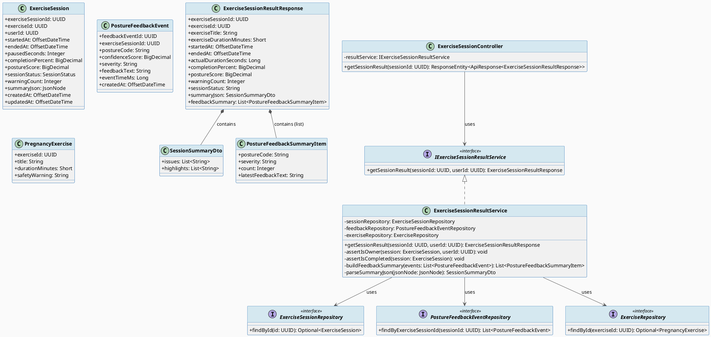
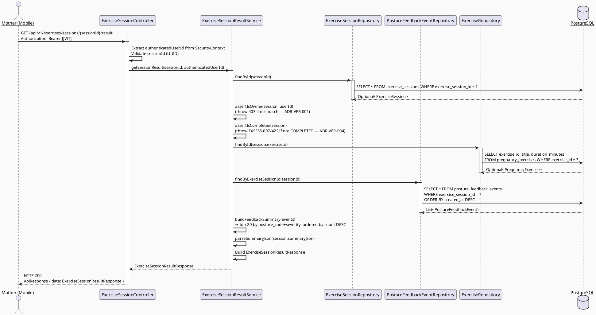
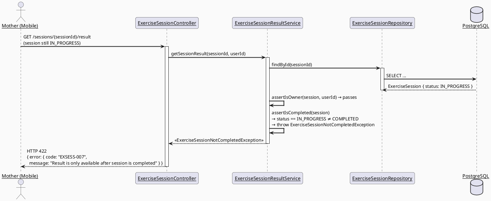
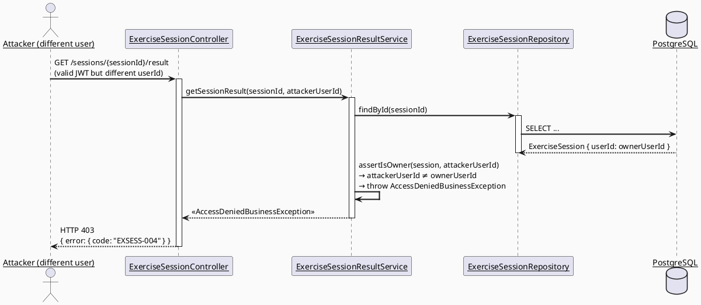

# ENGINEERING DOCUMENTATION STANDARD (EDS) v2.0
# SRS 3.3.2.9 — View Exercise Session Result — Technical Design Specification

| Field | Value |
|-------|-------|
| **Document ID** | `CB-EXERCISE-IMP-006` |
| **Version** | `1.0` |
| **Date** | `2026-06-28` |
| **Status** | `Implemented` |
| **Document Owner** | `PhuongNT` |
| **Author** | `AI Agent — Developer` |
| **Reviewed by** | `[ ] Pending` |
| **DPO Sign-off** | `[ ] Pending` |
| **Approved by** | `[ ] Pending` |
| **Last Review** | `2026-06-28` |
| **Based on EDS** | `v2.0` |

---

## CHANGELOG

> **Policy 4.4 — Immutable History:** Never delete old information. All changes must be recorded in this table.

| Date | Author | Change Description |
|------|--------|--------------------|
| 2026-06-28 | AI Agent — Developer | Initial document creation — TDS for SRS 3.3.2.9 View Exercise Session Result (UC183). |

---

## TABLE OF CONTENTS

1. [Module Overview](#1-module-overview)
2. [Traceability Matrix](#2-traceability-matrix)
3. [Architecture Decision Records (ADR)](#3-architecture-decision-records-adr)
4. [Non-Functional Requirements & SLA](#4-non-functional-requirements--sla)
5. [Static Modeling](#5-static-modeling)
6. [Dynamic Modeling](#6-dynamic-modeling)
7. [Domain Event Catalog](#7-domain-event-catalog)
8. [Interface Specification](#8-interface-specification)
9. [API Specification](#9-api-specification)
10. [Error Codes](#10-error-codes)
11. [Deployment Procedure](#11-deployment-procedure)
12. [Rollback & Incident Runbook](#12-rollback--incident-runbook)
13. [Detailed Test Scenarios](#13-detailed-test-scenarios)
14. [Verification Methods](#14-verification-methods)
15. [API Verification Samples](#15-api-verification-samples)
16. [Authorization Matrix](#16-authorization-matrix)
17. [AI Prompt Constraints (CASE 2.0)](#17-ai-prompt-constraints-case-20)

---

## 1. Module Overview

> Allows the Mother to view the full post-session result after exercise completion, including exercise name, actual duration, completion level, posture score, warnings, and a breakdown of detected posture issues and highlights.
> SRS 3.3.2.9: "View Exercise Session Result — Mother views post-session results including duration, completion level, posture score, and warnings."
>
> **Relationship with UC182 (CB-EXERCISE-IMP-005):** This module is the immediate downstream of UC182. Mother completes session (UC182) → navigates to result screen (this module). The data displayed here is computed and persisted by UC182; this module only reads it.

| Field | Value |
|-------|-------|
| **Module Name** | `View Exercise Session Result` |
| **Bounded Context** | `exercise` |
| **Data Classification** | `Internal` |
| **Compliance Scope** | `BR-RBAC, BR-SAFETY, BR-PRIVACY` |
| **Upstream Dependencies** | `IAM (authentication), exercise_sessions table (V1 migration, populated by UC182), posture_feedback_events table (V1 migration), pregnancy_exercises table (V1 migration)` |
| **Downstream Consumers** | `Mobile App result screen (read-only display)` |

**Functional Scope:**
- `GET /api/v1/exercises/sessions/{sessionId}/result` — returns the full result view of a completed session.
- Result includes: exercise name, start time, end time, actual duration, completion percent, posture score, warning count, summary_json (issues and highlights), and posture feedback event summary.
- Only the session owner (`session.userId == authenticatedUserId`) may view the result.
- Sessions that are not COMPLETED return a specific error (EXSESS-007) guiding the client appropriately.
- ❌ Completing a session → UC182 (SRS 3.3.2.8).
- ❌ Starting a session → UC30 (SRS 3.3.2.4).
- ❌ Listing exercise sessions → a separate endpoint (out of scope for this TDS).

---

## 2. Traceability Matrix

| Requirement ID | Type (BR/ADR/US) | Description | Code Component | Compliance Target | Related ADR |
|----------------|------------------|-------------|----------------|-------------------|-------------|
| BR-EXRES-001 | Business Rule | Only the session owner may view the result | `ExerciseSessionResultService.getSessionResult()` | BR-RBAC | ADR-VER-001 |
| BR-EXRES-002 | Business Rule | Result endpoint returns data from the exercise_sessions record populated by UC182 | `ExerciseSessionResultRepository.findBySessionId()` | — | — |
| BR-EXRES-003 | Business Rule | Include exercise title (fetched from pregnancy_exercises) | `ExerciseSessionResultService.getSessionResult()` | — | ADR-VER-002 |
| BR-EXRES-004 | Business Rule | Include posture feedback event summary (top-N events per severity) | `PostureFeedbackEventRepository.findByExerciseSessionId()` | BR-SAFETY | ADR-VER-003 |
| BR-EXRES-005 | Business Rule | Attempting to view result of non-COMPLETED session returns EXSESS-007 | `ExerciseSessionResultService.assertIsCompleted()` | BR-SAFETY | ADR-VER-004 |
| US-EXRES-001 | User Story | Mother views post-session results including duration, completion level, posture score, warnings | `ExerciseSessionController.GET /sessions/{id}/result` | — | — |
| ADR-VER-001 | Decision | Owner check in service layer; 403 on mismatch | `ExerciseSessionResultService` | BR-RBAC | — |
| ADR-VER-004 | Decision | Non-COMPLETED sessions return EXSESS-007 (not 403 or 404) to guide client | `ExerciseSessionResultService` | BR-SAFETY | — |

---

## 3. Architecture Decision Records (ADR)

### ADR-VER-001 — Owner-Only Access Enforced at Service Layer

| Field | Value |
|-------|-------|
| **Status** | `Accepted` |
| **Deciders** | `PhuongNT — Developer, AI Agent` |
| **Date** | `2026-06-28` |

#### Context
Session results contain the Mother's personal health and exercise performance data. Even though the data is classified as Internal (not Sensitive-PII), it is personal to the user and must not be cross-readable. The same pattern is used in CB-EXERCISE-IMP-005 (UC182 owner check).

#### Decision
`ExerciseSessionResultService.getSessionResult()` compares `session.userId` with `authenticatedUserId` extracted from Spring SecurityContext. Mismatch → throw `AccessDeniedBusinessException` (403, EXSESS-004).

#### Consequences

**Positive:**
- Defense-in-depth; consistent with UC182 pattern.
- Independent of `@PreAuthorize` role checks.

**Negative / Trade-offs:**
- Slight coupling to SecurityContext; acceptable given existing CareBridge pattern.

**Compliance Impact:**
- BR-RBAC: personal exercise result not visible to other users.

---

### ADR-VER-002 — Exercise Title Fetched via JOIN / Separate Query (Not Stored in session)

| Field | Value |
|-------|-------|
| **Status** | `Accepted` |
| **Deciders** | `PhuongNT — Developer, AI Agent` |
| **Date** | `2026-06-28` |

#### Context
The `exercise_sessions` table stores `exercise_id` as a FK but does not denormalize the exercise title. The Mother needs to see the exercise name on the result screen. Two approaches: (A) JOIN on `pregnancy_exercises` at query time, or (B) denormalize title into `exercise_sessions` at creation time.

#### Options Considered

| Option | Description | Pros | Cons |
|--------|-------------|------|------|
| A | JOIN with pregnancy_exercises on each GET | + Always fresh title (if exercise is renamed) | - Extra query or JOIN |
| B | Store title in exercise_sessions when session starts | + No JOIN; simpler | - Stale data if exercise renamed; requires schema change |

#### Decision
Choose **Option A**: Service fetches `PregnancyExercise` by `session.exerciseId` and includes the title. Uses existing `ExerciseRepository.findById()`. Since the result screen is low-frequency (one view per session), the extra query is acceptable.

#### Consequences

**Positive:**
- Always reflects the current exercise title.
- No schema migration required.

**Negative / Trade-offs:**
- One extra SELECT per result view. Mitigated by: exercise catalog is small and changes infrequently; can add Spring Cache @Cacheable later.

---

### ADR-VER-003 — Posture Feedback Summary: Return Top-N Events per Severity

| Field | Value |
|-------|-------|
| **Status** | `Accepted` |
| **Deciders** | `PhuongNT — Developer, AI Agent` |
| **Date** | `2026-06-28` |

#### Context
A session may have hundreds of `posture_feedback_events`. Returning all events would be too large for a mobile result screen. The Mother needs a meaningful but bounded summary.

#### Decision
Return all events grouped by severity and posture_code. In the response, include: a `feedbackSummary` list where each entry is `{ postureCode, severity, count, feedbackText (most recent) }`. Limit to top-20 distinct posture_code+severity combinations ordered by count DESC. The full `summary_json` (issues/highlights arrays) from `exercise_sessions` is also returned.

#### Consequences

**Positive:**
- Bounded response size regardless of session length.
- Most impactful posture issues appear first.

**Negative / Trade-offs:**
- Small events may be omitted from feedback summary; they are still counted in `warning_count` on the session record.

---

### ADR-VER-004 — Non-COMPLETED Session Returns EXSESS-007 (Not 404)

| Field | Value |
|-------|-------|
| **Status** | `Accepted` |
| **Deciders** | `PhuongNT — Developer, AI Agent` |
| **Date** | `2026-06-28` |

#### Context
The Mother may navigate to the result screen while the session is still `IN_PROGRESS` or `PAUSED` (e.g., by deep-linking). Returning 404 would be misleading because the session exists. Returning the partial data would be incorrect because `completionPercent` and `postureScore` are only computed on completion.

#### Decision
If `session.sessionStatus != COMPLETED`, throw a dedicated exception that maps to `EXSESS-007` (422 Unprocessable Entity). The error message explicitly tells the client "result is only available after session is completed."

#### Consequences

**Positive:**
- Client can distinguish "session not found" (404) from "session not yet completed" (422).
- Prevents client from displaying partial/incorrect metrics.

**Negative / Trade-offs:**
- Requires client to handle 422 appropriately (navigate back to exercise screen).

**Compliance Impact:**
- BR-SAFETY: avoids displaying misleading partial health metrics to the Mother.

---

## 4. Non-Functional Requirements & SLA

### 4.1. Performance & Availability

| Category | Requirement | Target SLA | Measurement Method | Compliance Basis |
|----------|-------------|------------|---------------------|------------------|
| Latency | GET result (p99) | `< 200ms` | k6 load test | — |
| Availability | Uptime (monthly) | `99.9%` | Uptime monitor | — |
| Throughput | Concurrent requests | `300 req/s` (frequent use) | Load test | — |
| Frequency | Usage pattern | Frequent (after every session) | Analytics | SRS 3.3.2.9 (Frequency: Frequent) |

### 4.2. Data Integrity & Retention

| Category | Requirement | Target | Verification Method | Compliance Basis |
|----------|-------------|--------|---------------------|------------------|
| Consistency | Data shown = data persisted by UC182 | 100% | Integration test | BR-EXRES-002 |
| Read-only | No mutation in this endpoint | 100% | Code review | — |

### 4.3. Security

| Category | Requirement | Target | Verification Method | Compliance Basis |
|----------|-------------|--------|---------------------|------------------|
| Authentication | JWT required | 100% | Security test | BR-RBAC |
| Authorization | Session owner only | Least privilege | Auth Matrix (§16) | BR-RBAC, ADR-VER-001 |
| Cross-user access | Blocked at service layer | 100% | Security test TC-E2E-002 | ADR-VER-001 |
| Encryption in transit | TLS 1.3+ | All endpoints | SSL Labs scan | BR-PRIVACY |

### 4.4. Scalability & Capacity Planning

> Read-heavy, high-frequency endpoint. Two DB reads per request: (1) `exercise_sessions` by PK, (2) `pregnancy_exercises` by PK, plus (3) `posture_feedback_events` by FK (indexed). All lookups use primary key or indexed FK — scales well horizontally. Add Spring Cache `@Cacheable` on session result if read traffic grows significantly (TTL: 5 minutes).

---

## 5. Static Modeling

### 5.1. Class Diagram (PlantUML)



### 5.2. Data Structure (Existing V1 Migration)

> Schema already exists in V1 migration. No new migration required.
> Reference: `05_Development/CareBridgeAPI/src/main/resources/db/migration/V1__init_schema.sql`

```sql
-- === EXERCISE_SESSIONS TABLE (existing — V1 migration) ===
-- All columns read by UC183:

-- exercise_session_id  uuid PRIMARY KEY      — session identifier (path param)
-- exercise_id          uuid NOT NULL          — FK → pregnancy_exercises (for title)
-- user_id              uuid NOT NULL          — owner check (ADR-VER-001)
-- started_at           timestamptz NOT NULL   — displayed in result
-- ended_at             timestamptz            — NOT NULL when status = COMPLETED
-- paused_seconds       integer NOT NULL       — used to compute actualDurationSeconds
-- completion_percent   numeric                — pre-computed by UC182
-- posture_score        numeric                — pre-computed by UC182 (null if no events)
-- session_status       varchar(20) NOT NULL   — must be COMPLETED (ADR-VER-004)
-- warning_count        integer NOT NULL       — pre-computed by UC182
-- summary_json         jsonb                  — {issues:[...], highlights:[...]}

-- === POSTURE_FEEDBACK_EVENTS TABLE (existing — V1 migration) ===
-- Columns read for feedback summary (ADR-VER-003):

-- feedback_event_id    uuid PRIMARY KEY
-- exercise_session_id  uuid NOT NULL (FK, indexed)
-- posture_code         varchar(80)
-- severity             varchar(20)
-- feedback_text        text
-- confidence_score     numeric
-- event_time_ms        bigint
-- created_at           timestamptz

-- No new migration needed for CB-EXERCISE-IMP-006.
```

---

## 6. Dynamic Modeling

### 6.1. Sequence Diagram — Happy Path: Get Session Result



### 6.2. Sequence Diagram — Error Path: Session Not Completed



### 6.3. Sequence Diagram — Error Path: Cross-User Access Attempt



---

## 7. Domain Event Catalog

### 7.1. Events Published

> CB-EXERCISE-IMP-006 is read-only. No domain events published.

| Event Name | Trigger | Publisher | Subscriber(s) | Payload Schema | Async? |
|------------|---------|-----------|---------------|----------------|--------|
| _(none)_ | — | — | — | — | — |

### 7.2. Events Consumed

> This module does not consume events. It reads directly from `exercise_sessions` and `posture_feedback_events` tables.

| Event Name | Source | Handler | Action |
|------------|--------|---------|--------|
| _(none)_ | — | — | — |

---

## 8. Interface Specification

### 8.1. Service Interface

```java
// PostureFeedbackSummaryItem.java
// @version 1.0
// package: com.carebridge.backend.exercise.dto.response
public class PostureFeedbackSummaryItem {
    private String postureCode;         // e.g., "BACK_CURVED"
    private String severity;            // "HIGH", "MEDIUM", "LOW"
    private Integer count;              // number of events with this postureCode+severity
    private String latestFeedbackText;  // feedback_text of the most recent event (nullable)
    // getters / setters
}

// ExerciseSessionResultResponse.java
// @version 1.0
// package: com.carebridge.backend.exercise.dto.response
public class ExerciseSessionResultResponse {
    private UUID exerciseSessionId;                         // session primary key
    private UUID exerciseId;                               // linked exercise
    private String exerciseTitle;                          // from pregnancy_exercises.title
    private Short exerciseDurationMinutes;                 // planned duration from exercise record
    private OffsetDateTime startedAt;                      // when session started
    private OffsetDateTime endedAt;                        // when session was completed (not null)
    private Long actualDurationSeconds;                    // (endedAt − startedAt) − pausedSeconds
    private BigDecimal completionPercent;                  // pre-computed by UC182, max 100.00
    private BigDecimal postureScore;                       // pre-computed by UC182, null if no events
    private Integer warningCount;                          // count of HIGH severity events
    private String sessionStatus;                          // always "COMPLETED" for valid result
    private SessionSummaryDto summaryJson;                 // {issues:[...], highlights:[...]}
    private List<PostureFeedbackSummaryItem> feedbackSummary; // top-20 grouped feedback events
    // getters / setters
}

// SessionSummaryDto.java — reused from UC182
// @version 1.0
// package: com.carebridge.backend.exercise.dto.response
public class SessionSummaryDto {
    private List<String> issues;      // distinct posture_codes where severity = HIGH
    private List<String> highlights;  // distinct posture_codes where severity = LOW
    // getters / setters
}

// IExerciseSessionResultService.java — Service Contract
// @version 1.0
// package: com.carebridge.backend.exercise.service
public interface IExerciseSessionResultService {
    /**
     * Retrieves the full result of a completed exercise session.
     * @param sessionId UUID of the session
     * @param authenticatedUserId UUID extracted from JWT (SecurityContext)
     * @return ExerciseSessionResultResponse with full result data
     * @throws ResourceNotFoundException (EXSESS-001) when session not found
     * @throws AccessDeniedBusinessException (EXSESS-004) when user is not the session owner
     * @throws ExerciseSessionNotCompletedException (EXSESS-007) when session is not COMPLETED
     */
    ExerciseSessionResultResponse getSessionResult(UUID sessionId, UUID authenticatedUserId);
}
```

### 8.2. Repository Interfaces (Shared with UC182)

```java
// ExerciseSessionRepository.java — shared, already defined in CB-EXERCISE-IMP-005
// Reuse: findById(UUID) — inherited from JpaRepository

// PostureFeedbackEventRepository.java — shared, already defined in CB-EXERCISE-IMP-005
// Reuse: findByExerciseSessionId(UUID sessionId)

// ExerciseRepository.java — shared, already exists from CB-EXERCISE-IMP-001
// Reuse: findById(UUID exerciseId) — inherited from JpaRepository
```

### 8.3. Exception — ExerciseSessionNotCompletedException

```java
// ExerciseSessionNotCompletedException.java
// @version 1.0
// package: com.carebridge.backend.exercise.exception
public class ExerciseSessionNotCompletedException extends RuntimeException {
    private final String code = "EXSESS-007";
    private final HttpStatus httpStatus = HttpStatus.UNPROCESSABLE_ENTITY; // 422

    public ExerciseSessionNotCompletedException(String currentStatus) {
        super("Result is only available after session is completed. Current status: " + currentStatus);
    }

    public String getCode() { return code; }
    public HttpStatus getHttpStatus() { return httpStatus; }
}
```

### 8.4. Service Implementation Contract

```java
// ExerciseSessionResultService.java — key methods
// package: com.carebridge.backend.exercise.service

// assertIsOwner: throws AccessDeniedBusinessException (403) if userId mismatch
private void assertIsOwner(ExerciseSession session, UUID authenticatedUserId) {
    if (!session.getUserId().equals(authenticatedUserId)) {
        throw new AccessDeniedBusinessException("EXSESS-004",
            "Access denied: you are not the owner of this session");
    }
}

// assertIsCompleted: throws ExerciseSessionNotCompletedException (422) if not COMPLETED
private void assertIsCompleted(ExerciseSession session) {
    if (session.getSessionStatus() != SessionStatus.COMPLETED) {
        throw new ExerciseSessionNotCompletedException(session.getSessionStatus().name());
    }
}

// buildFeedbackSummary: groups events by postureCode+severity, counts, top-20 by count DESC
private List<PostureFeedbackSummaryItem> buildFeedbackSummary(
    List<PostureFeedbackEvent> events) {
    // Group by (postureCode, severity) → count + latestFeedbackText
    // Sort by count DESC
    // Limit to 20 entries
    // Return as List<PostureFeedbackSummaryItem>
}
```

---

## 9. API Specification

### 9.1. Endpoints Table

| Method | Path | Auth Level | Required Roles | Rate Limit | Idempotent? |
|--------|------|------------|----------------|------------|-------------|
| `GET` | `/api/v1/exercises/sessions/{sessionId}/result` | JWT Bearer | `MOTHER` | 300/min | Yes |

### 9.2. Request / Response Schemas

#### `GET /api/v1/exercises/sessions/{sessionId}/result`

**Path Parameters:**

| Parameter | Type | Required | Description |
|-----------|------|----------|-------------|
| `sessionId` | UUID | Yes | exercise_session_id to retrieve results for |

**Request Body:** None

**Response — 200 OK (Happy Path):**
```json
{
  "data": {
    "exerciseSessionId": "550e8400-e29b-41d4-a716-446655440010",
    "exerciseId": "550e8400-e29b-41d4-a716-446655440001",
    "exerciseTitle": "Prenatal Yoga - First Trimester",
    "exerciseDurationMinutes": 20,
    "startedAt": "2026-06-28T09:00:00.000Z",
    "endedAt": "2026-06-28T09:22:00.000Z",
    "actualDurationSeconds": 1260,
    "completionPercent": 100.00,
    "postureScore": 82.50,
    "warningCount": 2,
    "sessionStatus": "COMPLETED",
    "summaryJson": {
      "issues": ["BACK_CURVED", "KNEE_MISALIGNED"],
      "highlights": ["BREATHING_CORRECT"]
    },
    "feedbackSummary": [
      {
        "postureCode": "BACK_CURVED",
        "severity": "HIGH",
        "count": 5,
        "latestFeedbackText": "Keep your back straight. Slightly straighten your spine."
      },
      {
        "postureCode": "KNEE_MISALIGNED",
        "severity": "HIGH",
        "count": 2,
        "latestFeedbackText": "Ensure your knees align over your second toe."
      },
      {
        "postureCode": "BREATHING_CORRECT",
        "severity": "LOW",
        "count": 8,
        "latestFeedbackText": "Great breathing rhythm! Keep it up."
      }
    ]
  }
}
```

**Response — 404 Not Found (Session not found):**
```json
{
  "error": {
    "code": "EXSESS-001",
    "message": "Exercise session not found"
  }
}
```

**Response — 422 Unprocessable Entity (Session not yet completed):**
```json
{
  "error": {
    "code": "EXSESS-007",
    "message": "Result is only available after session is completed. Current status: IN_PROGRESS"
  }
}
```

**Response — 403 Forbidden (Not the session owner):**
```json
{
  "error": {
    "code": "EXSESS-004",
    "message": "Access denied: you are not the owner of this session"
  }
}
```

**Response — 401 Unauthorized (No JWT):**
```json
{
  "error": {
    "code": "IAM-001",
    "message": "Authentication required"
  }
}
```

---

## 10. Error Codes

| Code | HTTP Status | Message (EN) | Message (VI) | Trigger Condition |
|------|-------------|--------------|--------------|-------------------|
| `EXSESS-001` | 404 | Exercise session not found | Không tìm thấy phiên tập luyện | sessionId does not exist in exercise_sessions |
| `EXSESS-003` | 400 | Invalid session ID format | Định dạng session ID không hợp lệ | sessionId path variable is not a valid UUID |
| `EXSESS-004` | 403 | Access denied: you are not the owner of this session | Không có quyền: bạn không phải chủ sở hữu phiên này | authenticated userId != session.userId (ADR-VER-001) |
| `EXSESS-007` | 422 | Result is only available after session is completed | Kết quả chỉ có sau khi hoàn thành phiên tập | session.sessionStatus != COMPLETED (ADR-VER-004) |
| `EXSESS-008` | 500 | Internal error retrieving session result | Lỗi nội bộ khi tải kết quả phiên | Unexpected exception during data retrieval or mapping |
| `IAM-001` | 401 | Authentication required | Yêu cầu xác thực | Missing or expired JWT |
| `IAM-002` | 403 | Insufficient permissions | Không đủ quyền | User does not have MOTHER role |

---

## 11. Deployment Procedure

### 11.1. Prerequisites

- [ ] `CB-EXERCISE-IMP-005` (UC182) implemented — `ExerciseSession` entity, `ExerciseSessionRepository`, `PostureFeedbackEventRepository`, `ExerciseSessionController` (at `/api/v1/exercises/sessions`) must exist.
- [ ] V1 migration with `exercise_sessions` and `posture_feedback_events` tables already applied and populated by UC182.
- [ ] `ExerciseRepository` exists from CB-EXERCISE-IMP-001.

### 11.2. Pre-Migration Checklist

> No new Flyway migration required.

- [x] `exercise_sessions` table with all result columns exists in V1 migration.
- [x] `posture_feedback_events` table exists in V1 migration.
- [x] `pregnancy_exercises` table exists (for title lookup).

### 11.3. Implementation Steps

#### Lane 1 — New Exception Class

Create `ExerciseSessionNotCompletedException.java` in `com.carebridge.backend.exercise.exception` (see §8.3).

#### Lane 2 — New DTOs

Create `ExerciseSessionResultResponse.java` and `PostureFeedbackSummaryItem.java` in `com.carebridge.backend.exercise.dto.response`.
Reuse `SessionSummaryDto.java` from CB-EXERCISE-IMP-005 (if already created; create if not).

#### Lane 3 — Service Implementation

Create `IExerciseSessionResultService.java` interface and `ExerciseSessionResultService.java` implementation in `com.carebridge.backend.exercise.service`.

Key logic inside `getSessionResult()`:
1. Load session from `ExerciseSessionRepository.findById(sessionId)` → throw EXSESS-001 if absent.
2. Call `assertIsOwner(session, authenticatedUserId)` → throw EXSESS-004 if mismatch.
3. Call `assertIsCompleted(session)` → throw EXSESS-007 if not COMPLETED.
4. Load `PregnancyExercise` via `ExerciseRepository.findById(session.exerciseId)` → throw EXSESS-001 if absent (data integrity issue).
5. Load `List<PostureFeedbackEvent>` via `PostureFeedbackEventRepository.findByExerciseSessionId(sessionId)`.
6. Build `feedbackSummary` (group by postureCode+severity, count, latestFeedbackText, top-20 by count DESC).
7. Parse `session.summaryJson` into `SessionSummaryDto`.
8. Calculate `actualDurationSeconds = (session.endedAt - session.startedAt).toSeconds() - session.pausedSeconds`.
9. Map to `ExerciseSessionResultResponse` and return.

#### Lane 4 — Controller Extension

Add `GET /sessions/{sessionId}/result` to `ExerciseSessionController.java`:

```java
@GetMapping("/{sessionId}/result")
@PreAuthorize("hasRole('MOTHER')")
public ResponseEntity<ApiResponse<ExerciseSessionResultResponse>> getSessionResult(
    @PathVariable UUID sessionId) {
    UUID userId = SecurityUtils.getCurrentUserId();
    return ResponseEntity.ok(
        ApiResponse.success(resultService.getSessionResult(sessionId, userId)));
}
```

#### Lane 5 — Verification After Deploy

```bash
# Health check
curl -X GET https://[host]/api/v1/health
# Expected: {"status": "ok"}

# Smoke test: get session result
curl -X GET "https://[host]/api/v1/exercises/sessions/[COMPLETED_SESSION_ID]/result" \
  -H "Authorization: Bearer [MOTHER_JWT]"
# Expected: 200 with ExerciseSessionResultResponse

# Smoke test: non-completed session
curl -X GET "https://[host]/api/v1/exercises/sessions/[IN_PROGRESS_SESSION_ID]/result" \
  -H "Authorization: Bearer [MOTHER_JWT]"
# Expected: 422 with EXSESS-007
```

### 11.4. Deployment Checklist

- [ ] Build successful: `./mvnw clean package`
- [ ] Unit tests pass: `./mvnw test`
- [ ] Integration tests pass: `./mvnw verify`
- [ ] GET result returns 200 with all fields populated for a COMPLETED session
- [ ] IN_PROGRESS session returns 422 (not 404, not 403)
- [ ] Cross-user access returns 403

---

## 12. Rollback & Incident Runbook

### 12.1. Rollback Trigger Conditions

| Condition | Threshold | Decision Maker |
|-----------|-----------|----------------|
| Error rate spike | > 5% in 5 minutes | On-call Engineer |
| Latency p99 exceeds threshold | > 2x baseline (> 400ms) | On-call Engineer |
| Cross-user data leakage | Any confirmed case | Tech Lead + DPO |

### 12.2. Rollback Procedure

```bash
# Step 1: Revert application deployment (no DB migration to revert)
kubectl rollout undo deployment/carebridge-api

# Step 2: Verify rollback
kubectl rollout status deployment/carebridge-api
curl -X GET https://[host]/api/v1/health

# No DB migration to revert — this is a read-only endpoint.
```

### 12.3. Notification Protocol

| Time | Recipients | Channel | Template |
|------|------------|---------|---------|
| Immediately | On-call team | Slack `#incident` | "EXSESS result endpoint incident: [description]" |
| Within 30 min | DPO (if cross-user data leakage confirmed) | Email | GDPR Art. 33 notification template |

### 12.4. Post-Incident Review (PIR)

> Complete PIR within 48 hours. For data leakage incidents: identify affected sessions and users, scope of exposure, remediation steps.

---

## 13. Detailed Test Scenarios

> **Policy (EDS v2.0 — Test Data):** All test scenarios must use `SYNTHETIC` data. Never use real PII.

### 13.1. Unit Tests

#### TC-UNIT-001 — assertIsOwner: Owner Match

```gherkin
Feature: Session result access control
  Background:
    Given test data classification: SYNTHETIC

  Scenario: Authenticated user is the session owner — no exception
    Given session.userId = UUID-A
    And authenticatedUserId = UUID-A
    When assertIsOwner(session, UUID-A) is called
    Then no exception is thrown
```

**Function under test:** `ExerciseSessionResultService.assertIsOwner()`
**Oracle Source:** ADR-VER-001

#### TC-UNIT-002 — assertIsOwner: Owner Mismatch

```gherkin
  Scenario: Different user tries to access session result
    Given session.userId = UUID-A
    And authenticatedUserId = UUID-B
    When assertIsOwner(session, UUID-B) is called
    Then AccessDeniedBusinessException is thrown
    And exception maps to HTTP 403 with code EXSESS-004
```

**Function under test:** `ExerciseSessionResultService.assertIsOwner()`
**Oracle Source:** ADR-VER-001, BR-EXRES-001

#### TC-UNIT-003 — assertIsCompleted: Valid State

```gherkin
  Scenario: COMPLETED session passes validation
    Given session.sessionStatus = COMPLETED
    When assertIsCompleted(session) is called
    Then no exception is thrown
```

**Function under test:** `ExerciseSessionResultService.assertIsCompleted()`
**Oracle Source:** ADR-VER-004, BR-EXRES-005

#### TC-UNIT-004 — assertIsCompleted: Non-Completed States

```gherkin
  Scenario: IN_PROGRESS session → 422
    Given session.sessionStatus = IN_PROGRESS
    When assertIsCompleted(session) is called
    Then ExerciseSessionNotCompletedException is thrown
    And exception.code = "EXSESS-007"
    And exception.message contains "IN_PROGRESS"

  Scenario: PAUSED session → 422
    Given session.sessionStatus = PAUSED
    When assertIsCompleted(session) is called
    Then ExerciseSessionNotCompletedException is thrown
    And exception.code = "EXSESS-007"

  Scenario: ABANDONED session → 422
    Given session.sessionStatus = ABANDONED
    When assertIsCompleted(session) is called
    Then ExerciseSessionNotCompletedException is thrown
    And exception.code = "EXSESS-007"
```

**Function under test:** `ExerciseSessionResultService.assertIsCompleted()`
**Oracle Source:** ADR-VER-004

#### TC-UNIT-005 — buildFeedbackSummary: Grouping and Ordering

```gherkin
  Scenario: Events grouped by postureCode+severity, ordered by count DESC
    Given posture_feedback_events:
      | postureCode      | severity | feedbackText               |
      | BACK_CURVED      | HIGH     | "Keep back straight"       |
      | BACK_CURVED      | HIGH     | "Straighten spine"         |
      | BACK_CURVED      | HIGH     | "Keep back straight"       |  ← 3 HIGH events
      | BREATHING_CORRECT| LOW      | "Great breathing!"         |
      | KNEE_MISALIGNED  | HIGH     | "Align knees"              |
      | ARM_POSITION_OFF | MEDIUM   | "Adjust arms"              |
    When buildFeedbackSummary(events) is called
    Then result has 4 entries (BACK_CURVED/HIGH, BREATHING_CORRECT/LOW, KNEE_MISALIGNED/HIGH, ARM_POSITION_OFF/MEDIUM)
    And result[0].postureCode = "BACK_CURVED", result[0].count = 3 (highest count first)
    And result[0].latestFeedbackText = "Keep back straight" (most recent)
    And result size <= 20

  Scenario: Empty event list → empty feedbackSummary
    Given posture_feedback_events = []
    When buildFeedbackSummary([]) is called
    Then result = []
```

**Function under test:** `ExerciseSessionResultService.buildFeedbackSummary()`
**Oracle Source:** ADR-VER-003

#### TC-UNIT-006 — parseSummaryJson: Valid and Missing

```gherkin
  Scenario: Valid summary_json parsed correctly
    Given session.summaryJson = {"issues": ["BACK_CURVED"], "highlights": ["BREATHING_CORRECT"]}
    When parseSummaryJson(jsonNode) is called
    Then result.issues = ["BACK_CURVED"]
    And result.highlights = ["BREATHING_CORRECT"]

  Scenario: Null summary_json → empty SessionSummaryDto
    Given session.summaryJson = null
    When parseSummaryJson(null) is called
    Then result.issues = []
    And result.highlights = []
```

**Function under test:** `ExerciseSessionResultService.parseSummaryJson()`
**Oracle Source:** ADR-CES-003 (from UC182 TDS)

#### TC-UNIT-007 — actualDurationSeconds Calculation

```gherkin
  Scenario: Duration from session fields
    Given session.startedAt = T+0, session.endedAt = T+1260s, session.pausedSeconds = 60
    When getSessionResult() calculates actualDurationSeconds
    Then actualDurationSeconds = 1200
```

**Oracle Source:** BR-EXSESS-003 (from UC182 TDS)

### 13.2. Integration Tests

#### TC-INT-001 — Full Result Retrieval with Real DB

```gherkin
  Scenario: COMPLETED session result returned successfully
    Given test data classification: SYNTHETIC
    And PostgreSQL Testcontainers running
    And database contains:
      | table                   | data                                                              |
      | pregnancy_exercises     | { exercise_id: EX-001, title: "Prenatal Yoga T1", duration_minutes: 20 } |
      | exercise_sessions       | { session_id: SESS-001, exercise_id: EX-001, user_id: USER-001, started_at: T-1260s, ended_at: T, paused_seconds: 60, session_status: COMPLETED, completion_percent: 100.00, posture_score: 85.00, warning_count: 2, summary_json: {"issues":["BACK_CURVED"],"highlights":["BREATHING_CORRECT"]} } |
      | posture_feedback_events | [{ session_id: SESS-001, posture_code: "BACK_CURVED", severity: "HIGH", count: 3, feedback_text: "Keep back straight" }] |
    When GET /api/v1/exercises/sessions/SESS-001/result with MOTHER JWT (sub: USER-001)
    Then response status is 200
    And response.data.exerciseTitle = "Prenatal Yoga T1"
    And response.data.exerciseDurationMinutes = 20
    And response.data.actualDurationSeconds = 1200
    And response.data.completionPercent = 100.00
    And response.data.postureScore = 85.00
    And response.data.warningCount = 2
    And response.data.summaryJson.issues = ["BACK_CURVED"]
    And response.data.summaryJson.highlights = ["BREATHING_CORRECT"]
    And response.data.feedbackSummary[0].postureCode = "BACK_CURVED"
    And response.data.feedbackSummary[0].severity = "HIGH"
```

**External dependencies:** PostgreSQL (Testcontainers), Flyway migration auto-applied
**Mock strategy:** `@SpringBootTest` + `@Testcontainers`

#### TC-INT-002 — No Posture Events — Null postureScore, Empty Summary

```gherkin
  Scenario: Session with no posture feedback events
    Given exercise_sessions: { SESS-002, status: COMPLETED, posture_score: null, summary_json: {"issues":[],"highlights":[]} }
    And posture_feedback_events: (none for SESS-002)
    When GET /sessions/SESS-002/result with owner JWT
    Then response.data.postureScore = null
    And response.data.feedbackSummary = []
    And response.data.summaryJson.issues = []
    And response.data.summaryJson.highlights = []
```

#### TC-INT-003 — IN_PROGRESS Session Returns 422

```gherkin
  Scenario: Attempt to view result of an in-progress session
    Given exercise_sessions: { SESS-003, status: IN_PROGRESS }
    When GET /sessions/SESS-003/result with owner JWT
    Then response status is 422
    And response.error.code = "EXSESS-007"
    And response.error.message contains "IN_PROGRESS"
```

### 13.3. E2E / Security Tests

#### TC-E2E-001 — No JWT → 401

```gherkin
  Scenario: Unauthenticated access blocked
    When GET /api/v1/exercises/sessions/{sessionId}/result without Authorization header
    Then response status is 401
    And response.error.code = "IAM-001"
```

#### TC-E2E-002 — Cross-User Access → 403

```gherkin
  Scenario: User B cannot view User A's session result
    Given session SESS-004 owned by USER-001 (COMPLETED)
    And attacker JWT with sub = USER-002
    When GET /sessions/SESS-004/result with attacker JWT
    Then response status is 403
    And response.error.code = "EXSESS-004"
    And response does NOT contain session data
```

#### TC-E2E-003 — Session Not Found → 404

```gherkin
  Scenario: Non-existent session ID returns 404
    When GET /sessions/00000000-0000-0000-0000-000000000000/result with valid MOTHER JWT
    Then response status is 404
    And response.error.code = "EXSESS-001"
```

#### TC-E2E-004 — PAUSED Session → 422

```gherkin
  Scenario: PAUSED session cannot show result
    Given session SESS-005 with status = PAUSED, owned by USER-001
    When GET /sessions/SESS-005/result with USER-001 JWT
    Then response status is 422
    And response.error.code = "EXSESS-007"
```

#### TC-E2E-005 — feedbackSummary Bounded at 20 Entries

```gherkin
  Scenario: Session with 30 distinct posture_code+severity combinations
    Given 30 distinct postureCode+severity pairs in posture_feedback_events for SESS-006
    When GET /sessions/SESS-006/result with owner JWT
    Then response.data.feedbackSummary.size() = 20 (not 30)
    And entries are ordered by count DESC
```

---

## 14. Verification Methods

### 14.1. Database Inspection

```sql
-- Verify session exists and is COMPLETED
SELECT exercise_session_id, session_status, completion_percent, posture_score,
       warning_count, summary_json, ended_at
FROM exercise_sessions
WHERE exercise_session_id = '[test-session-uuid]';
-- Expected: session_status = 'COMPLETED', ended_at NOT NULL

-- Verify exercise title retrieved correctly
SELECT e.title, e.duration_minutes
FROM pregnancy_exercises e
JOIN exercise_sessions s ON s.exercise_id = e.exercise_id
WHERE s.exercise_session_id = '[test-session-uuid]';

-- Verify posture feedback events for summary
SELECT posture_code, severity, COUNT(*) as event_count,
       MAX(feedback_text) as latest_feedback
FROM posture_feedback_events
WHERE exercise_session_id = '[test-session-uuid]'
GROUP BY posture_code, severity
ORDER BY event_count DESC
LIMIT 20;

-- Verify no cross-user access: session owner
SELECT user_id FROM exercise_sessions
WHERE exercise_session_id = '[test-session-uuid]';
-- Verify this matches the JWT sub claim in tests
```

### 14.2. Log / Audit Verification

```bash
# Verify no PII in logs
kubectl logs -l app=carebridge-api | grep -i "password\|secret\|ssn"
# Expected: No output

# Verify 403 logged for cross-user access attempt
kubectl logs -l app=carebridge-api | grep 'EXSESS-004' | head -5

# Verify 422 for non-completed session
kubectl logs -l app=carebridge-api | grep 'EXSESS-007' | head -5
```

### 14.3. Tool-based Verification

```bash
# Verify JWT required
curl -X GET "https://[host]/api/v1/exercises/sessions/[SESSION_ID]/result"
# Expected: 401

# Verify completed session result
curl -X GET "https://[host]/api/v1/exercises/sessions/[COMPLETED_SESSION_ID]/result" \
  -H "Authorization: Bearer [MOTHER_JWT]"
# Expected: 200 with ExerciseSessionResultResponse

# Verify IN_PROGRESS returns 422
curl -X GET "https://[host]/api/v1/exercises/sessions/[IN_PROGRESS_SESSION_ID]/result" \
  -H "Authorization: Bearer [MOTHER_JWT]"
# Expected: 422 with EXSESS-007

# Verify TLS
openssl s_client -connect [host]:443 -tls1_3 2>&1 | grep "Protocol"
# Expected: Protocol : TLSv1.3
```

---

## 15. API Verification Samples

### 15.1. Happy Path

```bash
# Get session result for a completed session
curl -X GET "https://[host]/api/v1/exercises/sessions/550e8400-e29b-41d4-a716-446655440010/result" \
  -H "Authorization: Bearer [MOTHER_JWT]" \
  -H "X-Correlation-Id: $(uuidgen)"
```

**Expected Response (200):**
```json
{
  "data": {
    "exerciseSessionId": "550e8400-e29b-41d4-a716-446655440010",
    "exerciseId": "550e8400-e29b-41d4-a716-446655440001",
    "exerciseTitle": "Prenatal Yoga - First Trimester",
    "exerciseDurationMinutes": 20,
    "startedAt": "2026-06-28T09:00:00.000Z",
    "endedAt": "2026-06-28T09:22:00.000Z",
    "actualDurationSeconds": 1260,
    "completionPercent": 100.00,
    "postureScore": 82.50,
    "warningCount": 2,
    "sessionStatus": "COMPLETED",
    "summaryJson": {
      "issues": ["BACK_CURVED", "KNEE_MISALIGNED"],
      "highlights": ["BREATHING_CORRECT"]
    },
    "feedbackSummary": [
      {
        "postureCode": "BACK_CURVED",
        "severity": "HIGH",
        "count": 5,
        "latestFeedbackText": "Keep your back straight."
      },
      {
        "postureCode": "KNEE_MISALIGNED",
        "severity": "HIGH",
        "count": 2,
        "latestFeedbackText": "Ensure your knees align over your second toe."
      },
      {
        "postureCode": "BREATHING_CORRECT",
        "severity": "LOW",
        "count": 8,
        "latestFeedbackText": "Great breathing rhythm! Keep it up."
      }
    ]
  }
}
```

### 15.2. Error Paths

```bash
# Session not yet completed → 422
curl -X GET "https://[host]/api/v1/exercises/sessions/[IN_PROGRESS_SESSION_ID]/result" \
  -H "Authorization: Bearer [MOTHER_JWT]"
```

**Expected Response (422):**
```json
{
  "error": {
    "code": "EXSESS-007",
    "message": "Result is only available after session is completed. Current status: IN_PROGRESS"
  }
}
```

```bash
# Not the session owner → 403
curl -X GET "https://[host]/api/v1/exercises/sessions/[OTHER_USER_SESSION_ID]/result" \
  -H "Authorization: Bearer [DIFFERENT_USER_JWT]"
```

**Expected Response (403):**
```json
{
  "error": {
    "code": "EXSESS-004",
    "message": "Access denied: you are not the owner of this session"
  }
}
```

```bash
# Session not found → 404
curl -X GET "https://[host]/api/v1/exercises/sessions/00000000-0000-0000-0000-000000000000/result" \
  -H "Authorization: Bearer [MOTHER_JWT]"
```

**Expected Response (404):**
```json
{
  "error": {
    "code": "EXSESS-001",
    "message": "Exercise session not found"
  }
}
```

---

## 16. Authorization Matrix

| Endpoint | `GUEST` | `MOTHER` | `EXPERT` | `ADMIN` | `SYSTEM` |
|----------|---------|----------|----------|---------|----------|
| `GET /api/v1/exercises/sessions/{id}/result` | ❌ | ✅ Own session only | ❌ | ❌ | ❌ |

**Notes:**
- ✅ = Permitted (only for the session's owning user — `session.userId == authenticatedUserId`)
- ❌ = Denied (401 if no JWT; 403 if wrong role or wrong owner)
- ADMIN does NOT have access to personal exercise session results — personal health data.
- Unauthenticated users receive 401; wrong-role users receive 403; wrong-owner users receive 403 (EXSESS-004).

---

## 17. AI Prompt Constraints (CASE 2.0)

### 17.1 Constraint Summary Table

| # | Constraint | Source (ADR/BR) | Last Verified |
|---|-----------|-----------------|---------------|
| C1 | Owner check (`session.userId == authenticatedUserId`) MUST happen before completeness check. Use SecurityContext — not request params. Throw `AccessDeniedBusinessException` (403, EXSESS-004) on mismatch. | `ADR-VER-001`, `BR-EXRES-001` | `2026-06-28` |
| C2 | Completeness check: if `session.sessionStatus != COMPLETED`, throw `ExerciseSessionNotCompletedException` (422, EXSESS-007). Do NOT return 404 or 403 for non-completed sessions. | `ADR-VER-004`, `BR-EXRES-005` | `2026-06-28` |
| C3 | Exercise title fetched via `ExerciseRepository.findById(session.exerciseId)`. Do NOT denormalize or hardcode the title. | `ADR-VER-002`, `BR-EXRES-003` | `2026-06-28` |
| C4 | `feedbackSummary` = grouped `posture_feedback_events` by (postureCode, severity), ordered by count DESC, limited to top-20. `latestFeedbackText` = most recent event's `feedback_text`. | `ADR-VER-003`, `BR-EXRES-004` | `2026-06-28` |
| C5 | This is a read-only endpoint. Do NOT modify any DB record or publish any event. | `CB-EXERCISE-IMP-006 scope` | `2026-06-28` |
| C6 | `postureScore` is pre-computed by UC182 and read directly from `exercise_sessions.posture_score`. Do NOT recalculate from `posture_feedback_events` in this service. | `BR-EXRES-002` | `2026-06-28` |
| C7 | Controller must NOT contain any business logic. Extract userId from SecurityContext, validate UUID path variable, delegate to `IExerciseSessionResultService`. | `CLAUDE.md Architecture Rules` | `2026-06-28` |

### 17.2 Constraint Injection Block

```
[CONSTRAINT BLOCK — Module: View Exercise Session Result (CB-EXERCISE-IMP-006)]
Per TDS CB-EXERCISE-IMP-006 v1.0 and related ADRs:

1. Owner check (session.userId vs authenticatedUserId from SecurityContext) BEFORE completeness check. 403 / EXSESS-004 on mismatch. ADR-VER-001.
2. Non-COMPLETED session → 422 / EXSESS-007. NOT 404 or 403. ADR-VER-004.
3. Fetch exercise title via ExerciseRepository.findById(session.exerciseId). No denormalization. ADR-VER-002.
4. feedbackSummary = group posture_feedback_events by (postureCode, severity), count, latestFeedbackText, top-20 by count DESC. ADR-VER-003.
5. READ-ONLY. No DB mutations. No event publishing.
6. postureScore is read from exercise_sessions.posture_score (pre-computed by UC182). Do NOT recalculate.
7. Controller = validation + delegation only. userId from SecurityContext.

[CONTEXT BLOCK]
- Bounded Context: exercise
- Data Classification: Internal
- Compliance: BR-RBAC, BR-SAFETY, BR-PRIVACY
- Upstream: CB-EXERCISE-IMP-005 (UC182) populates exercise_sessions data
- No new Flyway migration needed — all tables in V1
- Existing interfaces: §8 Service Interface + §8.2 Repository Interfaces
- Error codes: §10 Error Codes Table
- Auth matrix: §16 Authorization Matrix

[TASK BLOCK]
Implement getSessionResult() satisfying all constraints above.
Output must follow §8 Interface Specification.
Tests must cover §13 Test Scenarios.
```

### 17.3 Constraint Quality Checklist

- [x] Each constraint is traceable to a specific ADR or BR
- [x] No generic constraints ("use best practices" → rejected)
- [x] Each constraint has Last Verified date ≤ 2 sprints
- [x] Constraint block has ≥ 3 specific constraints (7 defined)
- [x] Constraint block references §8 Interface
- [x] Constraint block references §16 Auth Matrix

### 17.4 Anti-Pattern Detection

| AP-ID | Anti-Pattern | Indicator | Action |
|-------|-------------|-----------|--------|
| AP-AI-001 | Unconstrained Gen | Code doesn't match any constraint C1-C7 | Reject — re-inject constraints |
| AP-AI-003 | Implicit Decision | Code returns 404 for non-completed sessions without ADR backing | Reject — ADR-VER-004 requires 422/EXSESS-007 |
| AP-AI-004 | Layer Violation | Controller contains grouping logic for feedbackSummary | Reject — business logic belongs in Service |
| AP-AI-005 | Hallucinated Contract | Code recalculates postureScore from posture_feedback_events | Reject — read from exercise_sessions.posture_score (C6) |

---

## APPENDIX

### A. Glossary

| Term | Definition |
|------|------------|
| `COMPLETED` | Terminal session status indicating exercise was successfully finished |
| `actualDurationSeconds` | Effective exercise time: (endedAt − startedAt) in seconds minus pausedSeconds |
| `completionPercent` | Ratio of actual duration to planned duration, capped at 100.00, pre-computed by UC182 |
| `postureScore` | Average posture confidence score (0–100), pre-computed by UC182, null if no events |
| `summary_json` | JSONB column storing `{issues:[...], highlights:[...]}` computed by UC182 |
| `feedbackSummary` | Grouped posture feedback events: top-20 by (postureCode, severity) count DESC |
| `EXSESS-007` | Error code for accessing result of a non-COMPLETED session (422 Unprocessable Entity) |
| `ExerciseSessionNotCompletedException` | Exception thrown when session is not COMPLETED at result retrieval |

### B. Reference Documents

| Document | Path |
|----------|------|
| SRS 3.3.2.9 | `01_Requirements/SRS/Report3_Software Requirement Specification.docx.md` |
| UC182 Complete Session TDS | `04_Implement/UC182_CompleteExerciseSession/UC182_CompleteExerciseSession_TDS.md` |
| UC29 / UC30 exercise specs | `04_Implement/UC29_ViewAndSelectPregnancyExercise/`, `04_Implement/UC30_AnalyzeExercisePosture/` |
| V1 Schema | `05_Development/CareBridgeAPI/src/main/resources/db/migration/V1__init_schema.sql` |
| CB-EXERCISE-IMP-001 | `04_Implement/UC29_ViewAndSelectPregnancyExercise/` |
| CB-EXERCISE-IMP-005 | `04_Implement/UC182_CompleteExerciseSession/` |
