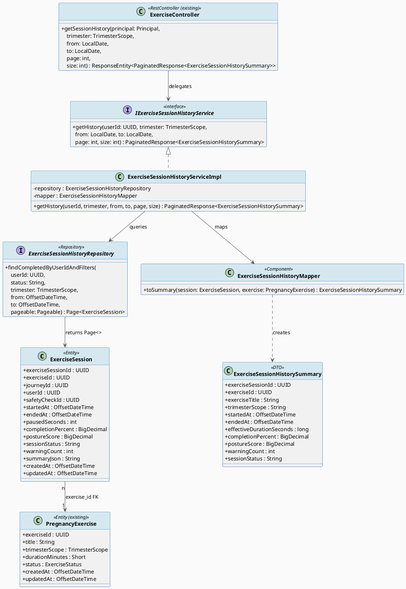
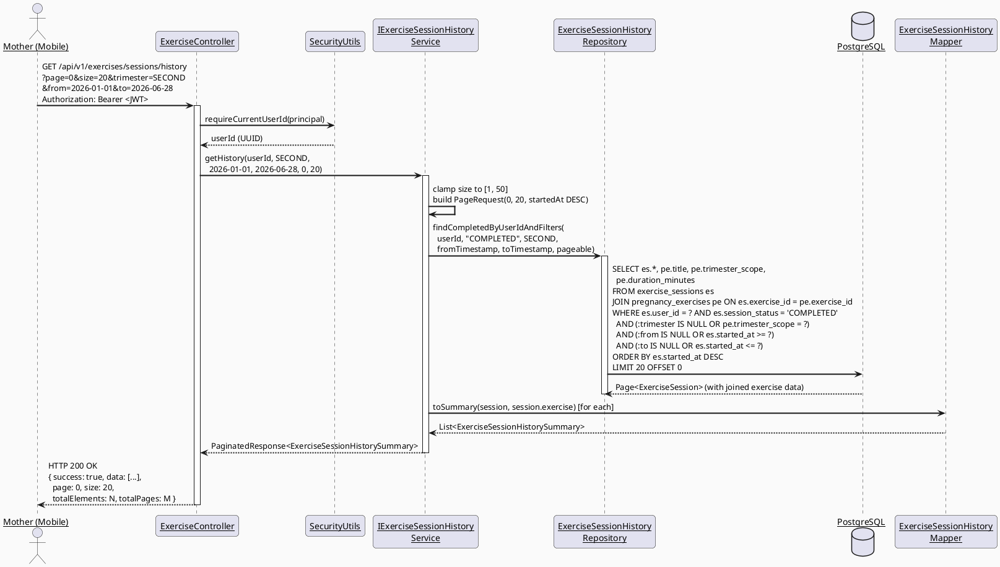
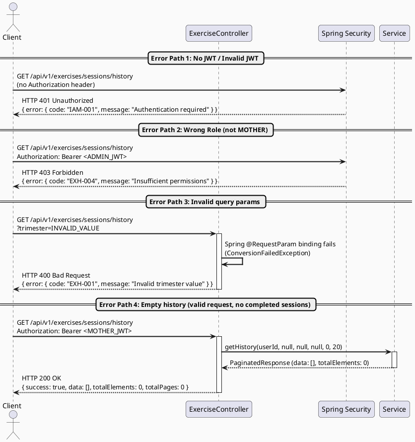

# ENGINEERING DOCUMENTATION STANDARD (EDS) v2.0
# Technical Design Specification — UC184 View Pregnancy Exercise History

| Field | Value |
|-------|-------|
| **Document ID** | `CB-EXERCISE-IMP-184` |
| **Version** | `1.0` |
| **Date** | `2026-06-28` |
| **Status** | `Implemented` |
| **Document Owner** | `AI Agent` |
| **Author** | `AI Agent — Tech Lead Role` |
| **Reviewed by** | `[ ] Pending` |
| **DPO Sign-off** | `[ ] Pending — module reads Internal data only; PII scope is user_id (UUID, not plain PII)` |
| **Approved by** | `[ ] Pending — Principal Architect` |
| **Last Review** | `2026-06-28` |
| **Based on EDS** | `v2.0` |

---

## CHANGELOG

> **Policy 4.4 — Immutable History:** Never delete old entries. All changes must be recorded here.

| Date | Author | Change Description |
|------|--------|--------------------|
| 2026-06-28 | AI Agent | Initial document creation for UC-184 |

---

## TABLE OF CONTENTS

1. [Module Overview](#1-module-overview)
2. [Traceability Matrix](#2-traceability-matrix)
3. [Architecture Decision Records (ADR)](#3-architecture-decision-records-adr)
4. [Non-Functional Requirements & SLA](#4-non-functional-requirements--sla)
5. [Static Modeling](#5-static-modeling)
6. [Dynamic Modeling](#6-dynamic-modeling)
7. [Domain Event Catalog](#7-domain-event-catalog)
8. [Interface Specification](#8-interface-specification)
9. [API Specification](#9-api-specification)
10. [Error Codes](#10-error-codes)
11. [Deployment Steps](#11-deployment-steps)
12. [Rollback & Incident Runbook](#12-rollback--incident-runbook)
13. [Test Scenarios](#13-test-scenarios)
14. [Verification Methods](#14-verification-methods)
15. [API Verification Samples](#15-api-verification-samples)
16. [Authorization Matrix](#16-authorization-matrix)
17. [AI Prompt Constraints (CASE 2.0)](#17-ai-prompt-constraints-case-20)

---

## 1. Module Overview

This module exposes a paginated, filterable read-only endpoint that allows an authenticated **Mother** to retrieve her completed pregnancy exercise sessions. Each record in the result is a joined projection of `exercise_sessions` and `pregnancy_exercises`, surfacing the exercise name, session date, effective duration, completion percentage, posture score, and warning count. The results are ordered by `started_at DESC` and grouped by calendar month on the mobile client for improved UX.

| Field | Value |
|-------|-------|
| **Module Name** | `ExerciseSessionHistory` |
| **Bounded Context** | `Exercise` |
| **Function ID** | `3.3.2.10` |
| **UC** | `UC-184 View Pregnancy Exercise History` |
| **Actor** | `Mother` |
| **Platform** | `Mobile App (Flutter) + Backend (Spring Boot)` |
| **Priority** | `Medium` |
| **Data Classification** | `Internal` |
| **Compliance Scope** | `BR-RBAC` |
| **Upstream Dependencies** | `IAM (JWT auth)`, `exercise_sessions table`, `pregnancy_exercises table` |
| **Downstream Consumers** | `Mobile App — Exercise History Screen` |

---

## 2. Traceability Matrix

| Requirement ID | Type | Description | Code Component | Compliance Target | Related ADR |
|----------------|------|-------------|----------------|-------------------|-------------|
| `UC-184` | User Story | Mother views paginated list of completed exercise sessions | `ExerciseController.getSessionHistory()` | BR-RBAC | ADR-001 |
| `BR-RBAC-001` | Business Rule | Only authenticated Mother with ROLE_MOTHER may access own session history | `@PreAuthorize("hasRole('MOTHER')")` | BR-RBAC | ADR-001 |
| `BR-RBAC-002` | Business Rule | Mother can only retrieve sessions where `user_id = currentUserId` | `ExerciseSessionHistoryServiceImpl` (WHERE clause) | BR-RBAC | ADR-001 |
| `FR-184-001` | Functional | Return only `session_status = 'COMPLETED'` sessions | `ExerciseSessionHistoryRepository.findCompletedByUserIdAndFilters()` | — | ADR-002 |
| `FR-184-002` | Functional | Support filter by `trimesterScope`, `from` date, `to` date | `ExerciseSessionHistoryRepository` JPQL query params | — | ADR-002 |
| `FR-184-003` | Functional | Response includes: exercise title, started_at, effective_duration, completion_percent, posture_score, warning_count | `ExerciseSessionHistorySummary` DTO | — | ADR-002 |
| `FR-184-004` | Functional | Paginated by `started_at DESC`, default page=0 size=20 | `PageRequest.of(page, clampedSize, Sort.by("startedAt").descending())` | — | ADR-003 |
| `NFR-184-001` | NFR | p99 response time under load < 500ms for page 0, size 20 | DB index on `(user_id, session_status, started_at)` + query optimization | — | ADR-003 |
| `ADR-001` | Decision | Use Spring Security `@PreAuthorize` + `Principal` injection for ownership check | `ExerciseController`, `ExerciseSessionHistoryServiceImpl` | BR-RBAC | ADR-001 |
| `ADR-002` | Decision | Use JPQL JOIN FETCH with optional filters to prevent N+1 | `ExerciseSessionHistoryRepository` | — | ADR-002 |
| `ADR-003` | Decision | Paginate via Spring Data `Pageable`; clamp size to [1, 50] | `ExerciseSessionHistoryServiceImpl` | — | ADR-003 |

---

## 3. Architecture Decision Records (ADR)

### ADR-001 — Ownership Enforcement via Principal Injection

| Field | Value |
|-------|-------|
| **Status** | `Accepted` |
| **Deciders** | `AI Agent — Tech Lead` |
| **Date** | `2026-06-28` |
| **Supersedes** | `—` |

#### Context

The `exercise_sessions` table records sessions for all users. An authenticated Mother must only ever see her own history. Without explicit ownership filtering, a malicious or misconfigured request could expose another user's session data (IDOR vulnerability). BR-RBAC mandates strict user-scoped data access.

#### Options Considered

| Option | Description | Pros | Cons |
|--------|-------------|------|------|
| A | Inject `Principal` into controller; pass `userId` to service; service passes to repository WHERE clause | Clear ownership at every layer; traceable; consistent with existing pattern in `SecurityUtils.requireCurrentUserId()` | Slightly more boilerplate in controller signature |
| B | Use Spring Data `@Query` with SpEL `#{authentication.principal.name}` | Less controller code | Hidden security logic inside repository annotation; hard to test in isolation; anti-pattern per architecture rules |

#### Decision

Choose **Option A**. Controller injects `java.security.Principal`, calls `SecurityUtils.requireCurrentUserId(principal)` to get the `UUID`, passes it to the service method. The service hands the UUID to the repository as a `@Param`. This is consistent with the established pattern across the codebase.

#### Consequences

**Positive:**
- Ownership check is explicit, testable, and visible at each layer.
- Consistent with existing `SecurityUtils` usage across the project.

**Negative / Trade-offs:**
- Controller method signature includes `Principal` — must be accounted for in `@WebMvcTest` stubs.

**Compliance Impact:**
- Prevents IDOR (CWE-639). Satisfies BR-RBAC requirement for user-scoped data access.

---

### ADR-002 — JPQL JOIN FETCH to Prevent N+1

| Field | Value |
|-------|-------|
| **Status** | `Accepted` |
| **Deciders** | `AI Agent — Tech Lead` |
| **Date** | `2026-06-28` |

#### Context

`ExerciseSession` records reference `PregnancyExercise` via `exercise_id` FK. Naively loading a page of 20 sessions and then fetching the associated exercise per row would result in 1 + 20 = 21 SQL queries (classic N+1 problem). Because the endpoint is high-frequency (listed as "Frequent"), N+1 is an unacceptable performance risk.

#### Options Considered

| Option | Description | Pros | Cons |
|--------|-------------|------|------|
| A | `@ManyToOne(fetch = FetchType.EAGER)` on `ExerciseSession.exercise` entity field | Simple; Hibernate handles the join | EAGER loading on entity affects all queries for that entity globally — too invasive |
| B | JPQL `JOIN FETCH` in a custom `@Query` on the repository | Targeted; only applies to this query; no entity-level side effects; existing pattern in `ExerciseRepository` | Slightly more verbose JPQL |
| C | Use DTO projection with `@Query` selecting specific fields in a record/interface | Avoids loading full entity objects; best performance | Requires a separate projection interface or record type; more moving parts |

#### Decision

Choose **Option B**. Write a custom JPQL query in `ExerciseSessionHistoryRepository` using `JOIN FETCH` on the `PregnancyExercise` association. This prevents N+1 without altering entity fetch defaults. The mapper then projects the joined entity pair into the response DTO. This mirrors the pattern already used in `ExerciseRepository`.

#### Consequences

**Positive:**
- Single SQL query per page fetch; no N+1.
- Query is explicit, readable, and testable.

**Negative / Trade-offs:**
- Requires `ExerciseSession` entity to have a `@ManyToOne` JPA relationship to `PregnancyExercise`. If no JPA relationship exists, the query must use a bi-partite `JOIN` with a DTO projection interface instead.
- Pagination with `JOIN FETCH` in Hibernate can trigger the `HHH90003004` "cannot simultaneously fetch multiple bags" warning — must verify no `@OneToMany` bag collections are also eagerly fetched on the same query.

**Compliance Impact:**
- None directly; improves reliability of the endpoint under load.

---

### ADR-003 — Pagination Strategy

| Field | Value |
|-------|-------|
| **Status** | `Accepted` |
| **Deciders** | `AI Agent — Tech Lead` |
| **Date** | `2026-06-28` |

#### Context

A Mother's exercise history could grow to hundreds or thousands of sessions over a pregnancy journey. Returning all records in a single response would degrade performance and exceed mobile bandwidth budgets. Cursor-based pagination is more robust but significantly more complex to implement and was not chosen for other list endpoints in this project.

#### Options Considered

| Option | Description | Pros | Cons |
|--------|-------------|------|------|
| A | Offset-based pagination via Spring Data `Pageable` | Simple; consistent with existing endpoints (`ExerciseQueryServiceImpl`); `PaginatedResponse<T>` wrapper already exists | Performance degrades at very large offsets (acceptable for this use case where history is bounded per user) |
| B | Cursor-based pagination | Better performance at deep pages | High implementation complexity; inconsistent with existing codebase patterns |

#### Decision

Choose **Option A**. Use Spring Data `PageRequest.of(page, clampedSize, Sort.by("startedAt").descending())`. Page size clamped to [1, 50] — consistent with `ExerciseQueryServiceImpl.listPublishedExercises()`. Wrap result in existing `PaginatedResponse<ExerciseSessionHistorySummary>`.

#### Consequences

**Positive:**
- Consistent API contract with existing paginated endpoints.
- `PaginatedResponse<T>` already tested and in production.

**Negative / Trade-offs:**
- Offset pagination is inefficient at large page numbers. Mitigated because per-user session history is bounded and the index on `(user_id, session_status, started_at)` keeps the query cost low.

---

## 4. Non-Functional Requirements & SLA

### 4.1. Performance & Availability

| Category | Requirement | Target SLA | Measurement Method | Compliance Basis |
|----------|-------------|------------|---------------------|------------------|
| Latency | API response (p99) for page 0, size 20 | `< 500ms` | Manual k6 load test | — |
| Latency | API response (p50) typical | `< 150ms` | Manual timing in staging | — |
| Availability | Uptime (monthly) | `99.5%` (shared with platform) | Uptime monitor | — |
| Throughput | Concurrent requests (peak) | `100 req/s` for this endpoint | Load test | — |

### 4.2. Data Integrity & Retention

| Category | Requirement | Target | Verification Method | Compliance Basis |
|----------|-------------|--------|---------------------|------------------|
| Read accuracy | History must reflect actual completed sessions only | 100% filter on `session_status = 'COMPLETED'` | Integration test + SQL assertion | FR-184-001 |
| Data ownership | Mother only sees own records | 100% — WHERE `user_id = :userId` | Integration test + security test | BR-RBAC |

### 4.3. Security

| Category | Requirement | Target | Verification Method | Compliance Basis |
|----------|-------------|--------|---------------------|------------------|
| Authentication | JWT Bearer token required | All requests | `@PreAuthorize` on controller | BR-RBAC |
| Authorization | ROLE_MOTHER required | All requests | `@PreAuthorize("hasRole('MOTHER')")` | BR-RBAC |
| Data isolation | user_id scoping on all queries | 100% — no cross-user data | Security integration test | BR-RBAC |
| Encryption in transit | TLS 1.3+ | All API calls | SSL Labs scan | Standard |

### 4.4. Scalability & Capacity Planning

Expected load: Up to 1,000 active mothers per day, each viewing history up to 10 times/day = ~10,000 requests/day. Peak load ~100 requests/minute. The index `idx_exercise_sessions_user_id` on `user_id` already exists in `V1__init_schema.sql`. A composite index on `(user_id, session_status, started_at DESC)` should be added via a new Flyway migration to optimize the filtered paginated query.

> **Note:** No new migration needed for the table itself — `exercise_sessions` and `pregnancy_exercises` already exist in `V1__init_schema.sql`. A new migration `V{n}__add_exercise_session_history_index.sql` is recommended (but optional if query plan is acceptable without it — verify with `EXPLAIN ANALYZE` on staging).

---

## 5. Static Modeling

### 5.1. Class Diagram (PlantUML)



### 5.2. Data Structure

**No new migration required.** Both `exercise_sessions` and `pregnancy_exercises` tables are defined in `V1__init_schema.sql`. Existing indexes:
- `idx_exercise_sessions_user_id` on `exercise_sessions(user_id)` — already present
- `idx_exercise_sessions_exercise_id` on `exercise_sessions(exercise_id)` — already present

**Recommended (optional) composite index migration** for query performance:

File: `src/main/resources/db/migration/V{n}__add_exercise_session_history_composite_index.sql`

```sql
-- === EXERCISE SESSION HISTORY — PERFORMANCE INDEX ===
-- Composite index to optimize the paginated history query:
--   WHERE user_id = ? AND session_status = 'COMPLETED' ORDER BY started_at DESC
-- Covers the three most selective predicates in a single B-tree scan.

CREATE INDEX IF NOT EXISTS idx_exercise_sessions_user_status_started
    ON public.exercise_sessions (user_id, session_status, started_at DESC);
```

> **Note:** Only apply this migration if `EXPLAIN ANALYZE` on staging shows a seq scan penalty. The existing `idx_exercise_sessions_user_id` may be sufficient for the current data volumes.

---

## 6. Dynamic Modeling

### 6.1. Sequence Diagram — Happy Path (PlantUML)



### 6.2. Sequence Diagram — Error Paths (PlantUML)



### 6.3. State Machine

This is a read-only query endpoint. No state transitions are triggered. Session state (`IN_PROGRESS`, `PAUSED`, `COMPLETED`, `ABANDONED`) is managed by UC-182 (CompleteExerciseSession). This module only reads `session_status = 'COMPLETED'` records.

---

## 7. Domain Event Catalog

This module is **read-only**. It does not publish or consume any domain events. No `@TransactionalEventListener` or Spring Application Events are involved.

### 7.1. Events Published

| Event Name | Trigger | Publisher | Subscriber(s) | Payload Schema | Async? |
|------------|---------|-----------|---------------|----------------|--------|
| — | — | — | — | — | — |

### 7.2. Events Consumed

| Event Name | Source | Handler | Action |
|------------|--------|---------|--------|
| — | — | — | — |

---

## 8. Interface Specification

> **Policy (EDS v2.0):** All interfaces declare `@version`. Breaking changes require a new ADR.

### 8.1. DTO — ExerciseSessionHistorySummary

```java
// ExerciseSessionHistorySummary.java
// @version 1.0
package com.carebridge.backend.exercise.dto;

import java.math.BigDecimal;
import java.time.OffsetDateTime;
import java.util.UUID;
import lombok.AllArgsConstructor;
import lombok.Builder;
import lombok.Getter;
import lombok.NoArgsConstructor;
import lombok.Setter;

@Getter
@Setter
@Builder
@NoArgsConstructor
@AllArgsConstructor
public class ExerciseSessionHistorySummary {

    private UUID exerciseSessionId;     // exercise_sessions.exercise_session_id
    private UUID exerciseId;            // exercise_sessions.exercise_id
    private String exerciseTitle;       // pregnancy_exercises.title (joined)
    private String trimesterScope;      // pregnancy_exercises.trimester_scope (joined)
    private OffsetDateTime startedAt;   // exercise_sessions.started_at
    private OffsetDateTime endedAt;     // exercise_sessions.ended_at (nullable)
    private long effectiveDurationSeconds; // (endedAt - startedAt) in seconds - pausedSeconds
    private BigDecimal completionPercent;  // exercise_sessions.completion_percent
    private BigDecimal postureScore;       // exercise_sessions.posture_score (nullable)
    private int warningCount;              // exercise_sessions.warning_count
    private String sessionStatus;          // always "COMPLETED" in this context
}
```

### 8.2. Service Interface

```java
// IExerciseSessionHistoryService.java
// @version 1.0
package com.carebridge.backend.exercise.service;

import com.carebridge.backend.common.response.PaginatedResponse;
import com.carebridge.backend.exercise.dto.ExerciseSessionHistorySummary;
import com.carebridge.backend.exercise.entity.TrimesterScope;
import java.time.LocalDate;
import java.util.UUID;

public interface IExerciseSessionHistoryService {

    /**
     * Retrieves paginated completed exercise session history for the authenticated Mother.
     *
     * @param userId    UUID of the authenticated Mother (from JWT — must match exercise_sessions.user_id)
     * @param trimester optional filter by pregnancy_exercises.trimester_scope
     * @param from      optional filter: sessions started on or after this date (inclusive)
     * @param to        optional filter: sessions started on or before this date (inclusive)
     * @param page      zero-based page index
     * @param size      page size, clamped to [1, 50]
     * @return PaginatedResponse containing ExerciseSessionHistorySummary items sorted by startedAt DESC
     * @throws com.carebridge.backend.common.exception.AuthenticationException (EXH-401) when userId is null
     */
    PaginatedResponse<ExerciseSessionHistorySummary> getHistory(
            UUID userId,
            TrimesterScope trimester,
            LocalDate from,
            LocalDate to,
            int page,
            int size);
}
```

### 8.3. Repository Interface

```java
// ExerciseSessionHistoryRepository.java
// @version 1.0
package com.carebridge.backend.exercise.repository;

import com.carebridge.backend.exercise.entity.ExerciseSession;
import com.carebridge.backend.exercise.entity.TrimesterScope;
import java.time.OffsetDateTime;
import java.util.UUID;
import org.springframework.data.domain.Page;
import org.springframework.data.domain.Pageable;
import org.springframework.data.jpa.repository.JpaRepository;
import org.springframework.data.jpa.repository.Query;
import org.springframework.data.repository.query.Param;
import org.springframework.stereotype.Repository;

@Repository
public interface ExerciseSessionHistoryRepository extends JpaRepository<ExerciseSession, UUID> {

    /**
     * Returns a paginated page of COMPLETED sessions for a given user,
     * optionally filtered by trimester scope and date range.
     * Uses JOIN FETCH to prevent N+1 queries (ADR-002).
     *
     * @param userId    the Mother's user_id — ownership filter (BR-RBAC-002)
     * @param status    must be "COMPLETED" — callers must not vary this (FR-184-001)
     * @param trimester optional trimester filter; null = no filter
     * @param from      optional lower bound on started_at; null = no lower bound
     * @param to        optional upper bound on started_at; null = no upper bound
     * @param pageable  Spring Data pageable with Sort by startedAt DESC (ADR-003)
     */
    @Query("SELECT es FROM ExerciseSession es "
         + "JOIN FETCH es.exercise e "
         + "WHERE es.userId = :userId "
         + "AND es.sessionStatus = :status "
         + "AND (:trimester IS NULL OR e.trimesterScope = :trimester) "
         + "AND (:from IS NULL OR es.startedAt >= :from) "
         + "AND (:to IS NULL OR es.startedAt <= :to) "
         + "ORDER BY es.startedAt DESC")
    Page<ExerciseSession> findCompletedByUserIdAndFilters(
            @Param("userId")    UUID userId,
            @Param("status")    String status,
            @Param("trimester") TrimesterScope trimester,
            @Param("from")      OffsetDateTime from,
            @Param("to")        OffsetDateTime to,
            Pageable pageable);
}
```

> **Note on ExerciseSession entity:** The `ExerciseSession` entity class must be created (it does not yet exist as a JPA entity). It maps to the `exercise_sessions` table. It must declare `@ManyToOne(fetch = FetchType.LAZY) @JoinColumn(name = "exercise_id") private PregnancyExercise exercise;` to support the `JOIN FETCH` in the repository query.

### 8.4. Mapper

```java
// ExerciseSessionHistoryMapper.java
// @version 1.0
package com.carebridge.backend.exercise.mapper;

import com.carebridge.backend.exercise.dto.ExerciseSessionHistorySummary;
import com.carebridge.backend.exercise.entity.ExerciseSession;
import java.time.temporal.ChronoUnit;
import org.springframework.stereotype.Component;

@Component
public class ExerciseSessionHistoryMapper {

    /**
     * Maps a fully-joined ExerciseSession (with exercise loaded) to the history summary DTO.
     * Computes effectiveDurationSeconds = (endedAt - startedAt) in seconds - pausedSeconds.
     * If endedAt is null, effectiveDurationSeconds = 0 (should not occur for COMPLETED sessions).
     */
    public ExerciseSessionHistorySummary toSummary(ExerciseSession session) {
        long rawSeconds = (session.getEndedAt() != null)
                ? ChronoUnit.SECONDS.between(session.getStartedAt(), session.getEndedAt())
                : 0L;
        long effectiveSeconds = Math.max(0L, rawSeconds - session.getPausedSeconds());

        return ExerciseSessionHistorySummary.builder()
                .exerciseSessionId(session.getExerciseSessionId())
                .exerciseId(session.getExerciseId())
                .exerciseTitle(session.getExercise().getTitle())
                .trimesterScope(session.getExercise().getTrimesterScope() != null
                        ? session.getExercise().getTrimesterScope().name() : null)
                .startedAt(session.getStartedAt())
                .endedAt(session.getEndedAt())
                .effectiveDurationSeconds(effectiveSeconds)
                .completionPercent(session.getCompletionPercent())
                .postureScore(session.getPostureScore())
                .warningCount(session.getWarningCount())
                .sessionStatus(session.getSessionStatus())
                .build();
    }
}
```

---

## 9. API Specification

### 9.1. Endpoints Table

| Method | Path | Auth Level | Required Roles | Rate Limit | Idempotent? |
|--------|------|------------|----------------|------------|-------------|
| `GET` | `/api/v1/exercises/sessions/history` | JWT Bearer | `ROLE_MOTHER` | 300/min | Yes |

### 9.2. Request / Response Schema

#### `GET /api/v1/exercises/sessions/history`

**Query Parameters:**

| Parameter | Type | Required | Default | Constraints | Description |
|-----------|------|----------|---------|-------------|-------------|
| `page` | integer | No | `0` | >= 0 | Zero-based page index |
| `size` | integer | No | `20` | Clamped to [1, 50] | Page size |
| `trimester` | string (enum) | No | null | `FIRST`, `SECOND`, `THIRD`, `ALL` | Filter by trimester scope of the exercise |
| `from` | string (ISO date) | No | null | `yyyy-MM-dd` | Sessions started on or after this date (inclusive) |
| `to` | string (ISO date) | No | null | `yyyy-MM-dd` | Sessions started on or before this date (inclusive) |

**Request Headers:**
```
Authorization: Bearer <JWT_TOKEN>
Content-Type: application/json
```

**Response — 200 OK (Happy Path):**
```json
{
  "success": true,
  "data": [
    {
      "exerciseSessionId": "a1b2c3d4-e5f6-7890-abcd-ef1234567890",
      "exerciseId": "b2c3d4e5-f6a7-8901-bcde-f12345678901",
      "exerciseTitle": "Prenatal Yoga — Hip Opener",
      "trimesterScope": "SECOND",
      "startedAt": "2026-06-20T08:30:00+07:00",
      "endedAt": "2026-06-20T09:00:00+07:00",
      "effectiveDurationSeconds": 1740,
      "completionPercent": 95.5,
      "postureScore": 87.3,
      "warningCount": 1,
      "sessionStatus": "COMPLETED"
    }
  ],
  "timestamp": "2026-06-28T10:00:00.000Z",
  "error": null,
  "page": 0,
  "size": 20,
  "totalElements": 1,
  "totalPages": 1
}
```

**Response — 200 OK (Empty History):**
```json
{
  "success": true,
  "data": [],
  "timestamp": "2026-06-28T10:00:00.000Z",
  "error": null,
  "page": 0,
  "size": 20,
  "totalElements": 0,
  "totalPages": 0
}
```

**Response — 400 Bad Request (Invalid trimester enum):**
```json
{
  "success": false,
  "data": null,
  "timestamp": "2026-06-28T10:00:00.000Z",
  "error": {
    "code": "EXH-001",
    "message": "Invalid parameter: trimester must be one of FIRST, SECOND, THIRD, ALL",
    "details": [
      { "field": "trimester", "message": "Invalid enum value: INVALID_VALUE" }
    ]
  }
}
```

**Response — 401 Unauthorized:**
```json
{
  "success": false,
  "data": null,
  "error": {
    "code": "IAM-001",
    "message": "Authentication required"
  }
}
```

**Response — 403 Forbidden (wrong role):**
```json
{
  "success": false,
  "data": null,
  "error": {
    "code": "EXH-004",
    "message": "Insufficient permissions"
  }
}
```

---

## 10. Error Codes

> Error code prefix: `EXH-` (Exercise History module)

| Code | HTTP Status | Message (EN) | Trigger Condition |
|------|-------------|--------------|-------------------|
| `EXH-001` | 400 | Invalid query parameter | `trimester` not in `{FIRST, SECOND, THIRD, ALL}`, or `from`/`to` not in `yyyy-MM-dd` format, or `page` < 0 |
| `EXH-002` | 400 | Date range invalid: `from` must not be after `to` | `from` date > `to` date in request |
| `EXH-004` | 403 | Insufficient permissions | Caller does not have `ROLE_MOTHER` |
| `EXH-005` | 500 | Internal server error while retrieving exercise history | Unexpected exception in service or repository layer |
| `IAM-001` | 401 | Authentication required | No or invalid JWT token in Authorization header |

> **Note:** An empty history is NOT an error. It returns HTTP 200 with `data: []` and `totalElements: 0`.

---

## 11. Deployment Steps

### 11.1. Prerequisites

- [ ] ADR-001, ADR-002, ADR-003 reviewed and accepted
- [ ] `exercise_sessions` and `pregnancy_exercises` tables confirmed present on target DB (from V1 migration)
- [ ] Staging environment available and API accessible
- [ ] No pending Flyway migration conflicts on target environment

### 11.2. Pre-Migration Checklist

> The optional composite index migration is the only DB change. No table DDL is added.

- [ ] Verify `V1__init_schema.sql` is already applied: `SELECT version FROM flyway_schema_history WHERE version = '1';`
- [ ] If applying optional composite index migration: backup DB first — `pg_dump -h $DB_HOST -U $DB_USER $DB_NAME > backup_$(date +%Y%m%d).sql`
- [ ] Confirm migration version number is the next available in the sequence: `SELECT MAX(CAST(version AS INTEGER)) FROM flyway_schema_history;`

### 11.3. Implementation Steps

#### Step 1 — (Optional) Apply composite index migration

```bash
# Only if performance testing shows seq scan on exercise_sessions for history queries
./mvnw flyway:migrate
# Verify: psql -c "\d exercise_sessions" | grep idx_exercise_sessions_user_status_started
```

#### Step 2 — Implement Java classes

Order of implementation (to satisfy compilation dependencies):

1. `ExerciseSession.java` — new JPA entity (maps `exercise_sessions` table)
2. `ExerciseSessionHistorySummary.java` — new DTO
3. `ExerciseSessionHistoryRepository.java` — new Spring Data repository
4. `ExerciseSessionHistoryMapper.java` — new mapper
5. `IExerciseSessionHistoryService.java` — new service interface
6. `ExerciseSessionHistoryServiceImpl.java` — new service implementation
7. `ExerciseController.java` — add `getSessionHistory()` method to existing controller

#### Step 3 — Compile verification

```bash
./mvnw compile 2>&1 | grep "error:"
# Expected: no output
```

#### Step 4 — Run tests

```bash
./mvnw test -pl 05_Development/CareBridgeAPI
# Expected: BUILD SUCCESS, no test failures
```

#### Step 5 — Verification after deploy

```bash
# Health check
curl -X GET http://localhost:8080/actuator/health
# Expected: {"status": "UP"}

# Quick smoke test (with valid MOTHER JWT)
curl -X GET "http://localhost:8080/api/v1/exercises/sessions/history?page=0&size=5" \
  -H "Authorization: Bearer <MOTHER_JWT>"
# Expected: HTTP 200, data array (may be empty), pagination metadata present
```

### 11.4. Deployment Checklist

- [ ] `./mvnw compile` succeeds with zero errors
- [ ] `./mvnw test` passes all unit and integration tests
- [ ] Health check endpoint returns 200
- [ ] Smoke test against staging returns valid paginated response
- [ ] Error rate < 1% in first 10 minutes post-deploy

---

## 12. Rollback & Incident Runbook

### 12.1. Rollback Trigger Conditions

| Condition | Threshold | Decision Maker |
|-----------|-----------|----------------|
| API error rate increase | > 5% in 5 minutes post-deploy | On-call Engineer |
| p99 latency exceeds SLA | > 1000ms (2x SLA) | On-call Engineer |
| Cross-user data returned | Any confirmed case | Tech Lead — immediate rollback |
| `exercise_sessions` data corruption | Any INSERT/UPDATE detected from this read-only endpoint | Tech Lead + DPO |

### 12.2. Rollback Procedure

```bash
# Step 1: Revert Java code (no new migration was applied in typical deploy)
git revert <commit-hash-of-feature>
# OR: re-deploy previous Docker image tag

# Step 2: If optional composite index was applied, remove it
psql -h $DB_HOST -U $DB_USER -d $DB_NAME \
  -c "DROP INDEX IF EXISTS idx_exercise_sessions_user_status_started;"
# Then remove the flyway history entry
psql -h $DB_HOST -U $DB_USER -d $DB_NAME \
  -c "DELETE FROM flyway_schema_history WHERE script LIKE '%add_exercise_session_history_composite_index%';"

# Step 3: Re-deploy previous artifact
# kubectl rollout undo deployment/carebridge-api
# OR: run previous Maven artifact

# Step 4: Verify rollback
curl -X GET http://localhost:8080/api/v1/exercises/sessions/history \
  -H "Authorization: Bearer <MOTHER_JWT>"
# Expected after rollback: 404 Not Found (endpoint no longer exists)

# Step 5: Verify existing endpoints still operational
curl -X GET http://localhost:8080/api/v1/exercises \
  -H "Authorization: Bearer <MOTHER_JWT>"
# Expected: HTTP 200 (existing exercise list endpoint unaffected)
```

### 12.3. Notification Protocol

| Timing | Recipient | Channel | Template |
|--------|-----------|---------|----------|
| Immediately on incident | On-call team | Slack `#incident` | "[EXH] UC-184 incident detected: {description}" |
| Within 30 minutes | Tech Lead | Direct message | Summary + rollback status |
| Post-incident | All team | `#dev` channel | PIR summary |

### 12.4. Post-Incident Review

Complete PIR within 48 hours of resolution covering: timeline, root cause (5 Whys), impact scope, remediation steps, and prevention action items.

---

## 13. Test Scenarios

> Full test case specifications are in `UC184_ViewPregnancyExerciseHistory_Test-Spec.md`.

### 13.1. Unit Tests (key scenarios)

| TC ID | Scenario | Expected |
|-------|----------|----------|
| EXH-TC-001 | Service returns paginated history for valid userId | `PaginatedResponse` with correct data and pagination metadata |
| EXH-TC-002 | Service clamps page size > 50 to 50 | Repository called with `PageRequest(page, 50)` |
| EXH-TC-003 | Service clamps page size < 1 to 1 | Repository called with `PageRequest(page, 1)` |
| EXH-TC-004 | Service passes `from`/`to` as `OffsetDateTime` at day boundaries | Repository called with `from` = start of day, `to` = end of day |
| EXH-TC-005 | Mapper computes `effectiveDurationSeconds` correctly | `(endedAt - startedAt) - pausedSeconds` in seconds |
| EXH-TC-006 | Mapper handles null `postureScore` | `postureScore = null` in DTO |
| EXH-TC-007 | Mapper handles null `endedAt` | `effectiveDurationSeconds = 0` |

### 13.2. Integration Tests (key scenarios)

| TC ID | Scenario | Expected |
|-------|----------|----------|
| EXH-TC-INT-001 | Full flow: seed COMPLETED sessions, call endpoint, assert response | HTTP 200, data matches seeded records |
| EXH-TC-INT-002 | Filter by trimester: only SECOND trimester sessions returned | Records with non-SECOND exercises excluded |
| EXH-TC-INT-003 | Filter by date range | Only sessions within range returned |
| EXH-TC-INT-004 | No completed sessions exist for user | HTTP 200, `data: []`, `totalElements: 0` |
| EXH-TC-INT-005 | IN_PROGRESS sessions are excluded | Only COMPLETED sessions appear in result |

### 13.3. Security Tests

| TC ID | Scenario | Expected |
|-------|----------|----------|
| EXH-TC-SEC-001 | Request without JWT | HTTP 401 |
| EXH-TC-SEC-002 | Request with ADMIN JWT (not MOTHER) | HTTP 403 |
| EXH-TC-SEC-003 | Mother A's JWT cannot see Mother B's sessions | HTTP 200 but data only contains Mother A's records |
| EXH-TC-SEC-004 | SQL injection in `from` param | HTTP 400 (Spring type conversion rejects before query) |

---

## 14. Verification Methods

### 14.1. Database Inspection

```sql
-- Verify exercise_sessions table exists
SELECT table_name FROM information_schema.tables
WHERE table_schema = 'public' AND table_name = 'exercise_sessions';

-- Verify existing indexes
SELECT indexname FROM pg_indexes
WHERE tablename = 'exercise_sessions';
-- Expected: idx_exercise_sessions_user_id, idx_exercise_sessions_exercise_id

-- Verify COMPLETED session data (replace UUID with test user's ID)
SELECT es.exercise_session_id, es.session_status, es.started_at,
       pe.title AS exercise_title
FROM exercise_sessions es
JOIN pregnancy_exercises pe ON es.exercise_id = pe.exercise_id
WHERE es.user_id = '<test_user_uuid>'
  AND es.session_status = 'COMPLETED'
ORDER BY es.started_at DESC
LIMIT 5;

-- Verify no IN_PROGRESS sessions leak into results
SELECT COUNT(*) FROM exercise_sessions
WHERE user_id = '<test_user_uuid>'
  AND session_status != 'COMPLETED';
-- Should be excluded from API response — verify API data count matches SQL COMPLETED count
```

### 14.2. Log Verification

```bash
# Check for unexpected errors after deployment
grep -i "ERROR\|WARN" ./logs/carebridge-api.log | tail -20

# Verify no PII (raw names, phone numbers) in logs
grep -i "phone\|password\|secret" ./logs/carebridge-api.log
# Expected: No output
```

### 14.3. Tool-based Verification

```bash
# Verify JWT contains ROLE_MOTHER claim
echo "<JWT_TOKEN>" | cut -d'.' -f2 | base64 -d | python3 -m json.tool | grep "role"
# Expected: "ROLE_MOTHER" or authorities containing MOTHER

# Verify TLS in production
openssl s_client -connect api.carebridge.vn:443 -tls1_3 2>&1 | grep "Protocol"
# Expected: Protocol : TLSv1.3
```

---

## 15. API Verification Samples

### 15.1. Happy Path

```bash
# Get first page of exercise history (no filters)
curl -X GET "http://localhost:8080/api/v1/exercises/sessions/history?page=0&size=10" \
  -H "Authorization: Bearer <MOTHER_JWT>" \
  -H "Content-Type: application/json"
```

**Expected Response (200):**
```json
{
  "success": true,
  "data": [
    {
      "exerciseSessionId": "a1b2c3d4-e5f6-7890-abcd-ef1234567890",
      "exerciseId": "b2c3d4e5-f6a7-8901-bcde-f12345678901",
      "exerciseTitle": "Prenatal Yoga — Hip Opener",
      "trimesterScope": "SECOND",
      "startedAt": "2026-06-20T08:30:00+07:00",
      "endedAt": "2026-06-20T09:00:00+07:00",
      "effectiveDurationSeconds": 1740,
      "completionPercent": 95.5,
      "postureScore": 87.3,
      "warningCount": 1,
      "sessionStatus": "COMPLETED"
    }
  ],
  "page": 0,
  "size": 10,
  "totalElements": 1,
  "totalPages": 1
}
```

```bash
# Get history filtered by trimester and date range
curl -X GET "http://localhost:8080/api/v1/exercises/sessions/history?trimester=SECOND&from=2026-01-01&to=2026-06-28" \
  -H "Authorization: Bearer <MOTHER_JWT>"
```

### 15.2. Error Paths

```bash
# Missing JWT → 401
curl -X GET "http://localhost:8080/api/v1/exercises/sessions/history"
```

**Expected Response (401):**
```json
{
  "success": false,
  "error": { "code": "IAM-001", "message": "Authentication required" }
}
```

```bash
# Invalid trimester value → 400
curl -X GET "http://localhost:8080/api/v1/exercises/sessions/history?trimester=INVALID" \
  -H "Authorization: Bearer <MOTHER_JWT>"
```

**Expected Response (400):**
```json
{
  "success": false,
  "error": {
    "code": "EXH-001",
    "message": "Invalid parameter: trimester must be one of FIRST, SECOND, THIRD, ALL"
  }
}
```

```bash
# Admin JWT (not MOTHER) → 403
curl -X GET "http://localhost:8080/api/v1/exercises/sessions/history" \
  -H "Authorization: Bearer <ADMIN_JWT>"
```

**Expected Response (403):**
```json
{
  "success": false,
  "error": { "code": "EXH-004", "message": "Insufficient permissions" }
}
```

---

## 16. Authorization Matrix

> Principle of **Least Privilege**: Each role has only the minimum permissions required.

| Endpoint | `GUEST` (no auth) | `MOTHER` | `EXPERT` | `ADMIN` | `SYSTEM` |
|----------|-------------------|----------|----------|---------|----------|
| `GET /api/v1/exercises/sessions/history` | 401 | Own sessions only | 403 | 403 | 403 |

**Notes:**
- `MOTHER` — can only access sessions where `exercise_sessions.user_id = their own JWT sub`. Cross-user access is rejected at the WHERE clause level (BR-RBAC-002).
- `EXPERT`, `ADMIN`, `SYSTEM` — this endpoint is Mother-only per UC-184 scope. Admin access to session history would require a separate admin-scoped endpoint if needed in future.
- No write operations exist on this endpoint — read-only (HTTP GET, idempotent).

---

## 17. AI Prompt Constraints (CASE 2.0)

### 17.1. Constraint Summary Table

| # | Constraint | Source | Last Verified |
|---|-----------|--------|---------------|
| C1 | Controller must inject `java.security.Principal` and call `SecurityUtils.requireCurrentUserId(principal)` to extract the Mother's `userId`; pass it explicitly to the service method — never extract user identity inside the service or repository | `ADR-001`, `BR-RBAC-002` | `2026-06-28` |
| C2 | Repository query MUST include `AND es.userId = :userId` to enforce data ownership — omitting this WHERE clause is a critical IDOR vulnerability | `ADR-001`, `BR-RBAC-002` | `2026-06-28` |
| C3 | Repository query MUST filter `AND es.sessionStatus = 'COMPLETED'` — never expose IN_PROGRESS, PAUSED, or ABANDONED sessions | `FR-184-001` | `2026-06-28` |
| C4 | Use JPQL `JOIN FETCH es.exercise e` in the repository query — do NOT use `FetchType.EAGER` on the entity, do NOT use separate exercise lookups inside a loop (N+1 anti-pattern) | `ADR-002` | `2026-06-28` |
| C5 | Page size must be clamped to `[1, 50]` in the service: `int clampedSize = Math.min(Math.max(size, 1), 50)` — consistent with `ExerciseQueryServiceImpl.listPublishedExercises()` | `ADR-003` | `2026-06-28` |
| C6 | Controller method must be annotated `@PreAuthorize("hasRole('MOTHER')")` — no other roles are permitted on this endpoint per UC-184 scope | `BR-RBAC`, `§16 Auth Matrix` | `2026-06-28` |
| C7 | `ExerciseSessionHistoryServiceImpl` must be `@Transactional(readOnly = true)` — this is a read-only endpoint; no write operations are permitted | `FR-184-001`, `ADR-003` | `2026-06-28` |
| C8 | The `effectiveDurationSeconds` field in `ExerciseSessionHistorySummary` is computed in the Mapper as `max(0, (endedAt - startedAt).seconds - pausedSeconds)` — never expose raw timestamps only; always compute effective duration | `§8.1 DTO spec` | `2026-06-28` |

### 17.2. Constraint Injection Block

```
[CONSTRAINT BLOCK — Module: ExerciseSessionHistory]
Per TDS CB-EXERCISE-IMP-184 and referenced ADRs:

1. (C1) Inject Principal in controller. Call SecurityUtils.requireCurrentUserId(principal) to get userId. Pass userId to service. Service passes to repository as @Param. Never infer userId inside service or repository layer.
2. (C2) Repository MUST include WHERE es.userId = :userId. Omitting this is an IDOR vulnerability (CWE-639).
3. (C3) Repository MUST include AND es.sessionStatus = 'COMPLETED'. Never return IN_PROGRESS, PAUSED, or ABANDONED sessions.
4. (C4) Use JPQL JOIN FETCH es.exercise. Do NOT use FetchType.EAGER on entity. Do NOT fetch exercises per session in a loop.
5. (C5) Clamp page size in service: clampedSize = Math.min(Math.max(size, 1), 50).
6. (C6) Controller endpoint annotated @PreAuthorize("hasRole('MOTHER')") only.
7. (C7) Service class annotated @Transactional(readOnly = true).
8. (C8) Mapper computes effectiveDurationSeconds = max(0, (endedAt-startedAt).seconds - pausedSeconds).

[CONTEXT BLOCK]
- Bounded Context: Exercise
- Data Classification: Internal
- Compliance: BR-RBAC
- Existing interfaces: §8 Interface Specification
- Error codes: §10 Error Codes Table
- Auth matrix: §16 Authorization Matrix

[TASK BLOCK]
Implement ExerciseSessionHistory feature satisfying all constraints above.
Output must conform to §8 Interface Specification.
Tests must cover §13 Test Scenarios.
```

### 17.3. Constraint Quality Checklist

- [x] Every constraint is traceable to an ADR or business rule
- [x] No generic constraints (e.g., "use best practices" is not present)
- [x] All constraints have `Last Verified` dates within current sprint
- [x] Constraint block contains 8 specific, actionable constraints
- [x] Constraint block references §8 Interface Specification
- [x] Constraint block references §16 Authorization Matrix

### 17.4. Anti-Pattern Detection

| AP-ID | Anti-Pattern | Sign | Action |
|-------|-------------|------|--------|
| AP-AI-001 | Unconstrained Generation | Code does not reference constraints C1-C8 | Reject — re-inject constraints |
| AP-AI-003 | Implicit Decision | Code uses `FetchType.EAGER` on `ExerciseSession.exercise` without ADR | Reject — enforce ADR-002 |
| AP-AI-005 | Hallucinated Contract | Code imports `ExerciseSessionRepository` (wrong name) or a non-existent service | Reject — verify class names match §8 |

---

## Appendix A — Glossary

| Term | Definition |
|------|------------|
| COMPLETED | Value of `exercise_sessions.session_status` indicating the session was successfully finished by the Mother |
| effectiveDurationSeconds | Computed field: `(endedAt - startedAt)` in seconds minus `paused_seconds`. Represents actual active exercise time. |
| PII | Personally Identifiable Information. `user_id` is a UUID reference — not plain PII. No name/phone/email is stored or returned by this endpoint. |
| IDOR | Insecure Direct Object Reference (CWE-639) — vulnerability where ownership is not enforced in the query |
| N+1 | Query anti-pattern where N child records trigger N additional SELECT statements |
| BR-RBAC | Business Rule — Role-Based Access Control. Governs which roles can perform which operations. |
| TrimesterScope | Enum: `FIRST`, `SECOND`, `THIRD`, `ALL` — pregnancy stage the exercise is designed for |

## Appendix B — Reference Documents

| Document | Path |
|----------|------|
| Database Schema | `05_Development/CareBridgeAPI/src/main/resources/db/migration/V1__init_schema.sql` |
| Existing ExerciseController | `05_Development/CareBridgeAPI/src/main/java/com/carebridge/backend/exercise/controller/ExerciseController.java` |
| ExerciseRepository (pattern reference) | `05_Development/CareBridgeAPI/src/main/java/com/carebridge/backend/exercise/repository/ExerciseRepository.java` |
| ExerciseQueryServiceImpl (pattern reference) | `05_Development/CareBridgeAPI/src/main/java/com/carebridge/backend/exercise/service/ExerciseQueryServiceImpl.java` |
| PaginatedResponse | `05_Development/CareBridgeAPI/src/main/java/com/carebridge/backend/common/response/PaginatedResponse.java` |
| SecurityUtils | `05_Development/CareBridgeAPI/src/main/java/com/carebridge/backend/common/util/SecurityUtils.java` |

---

*EDS v2.0 — CASE 2.0 AI Prompt Constraints integrated (§17).*
*Status: Draft — awaiting Principal Architect review and approval.*
