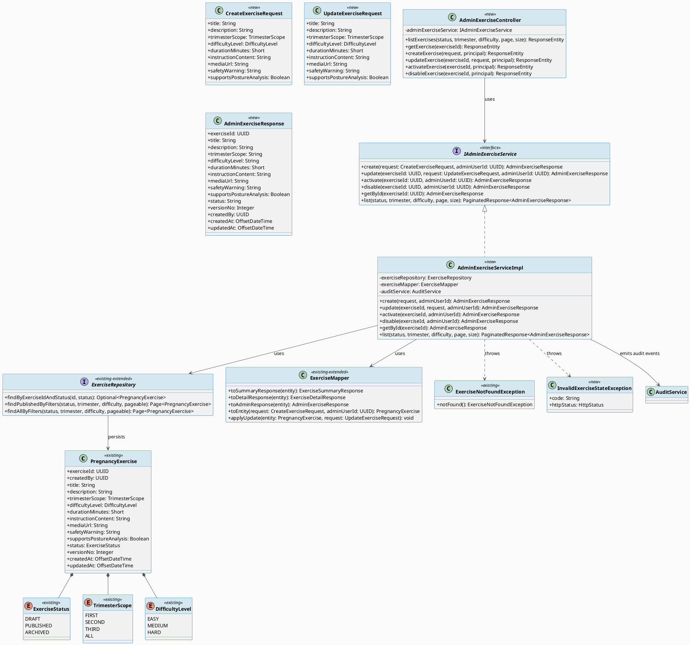
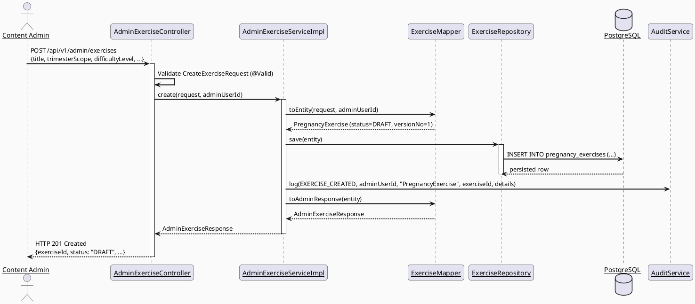
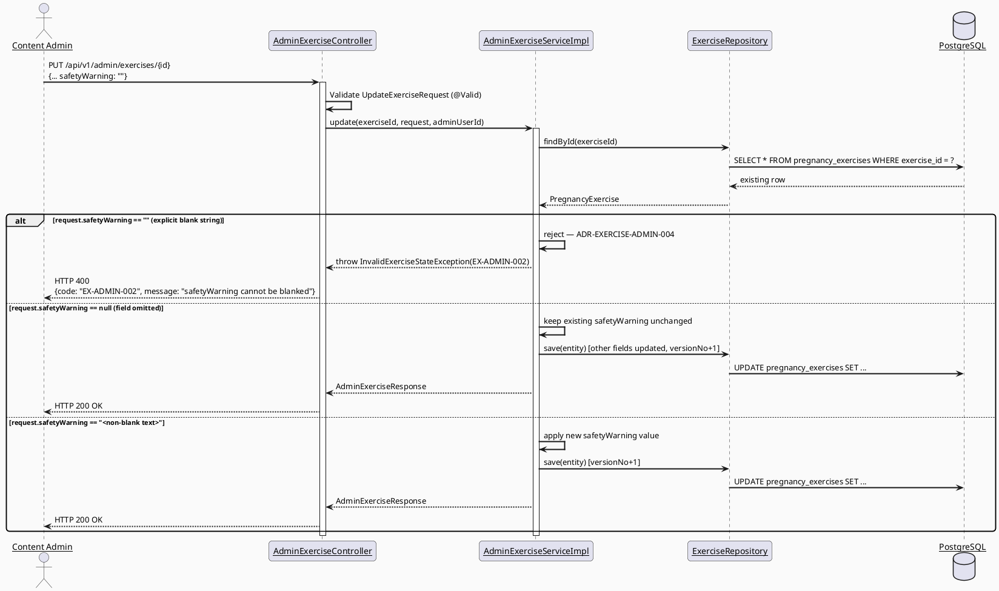
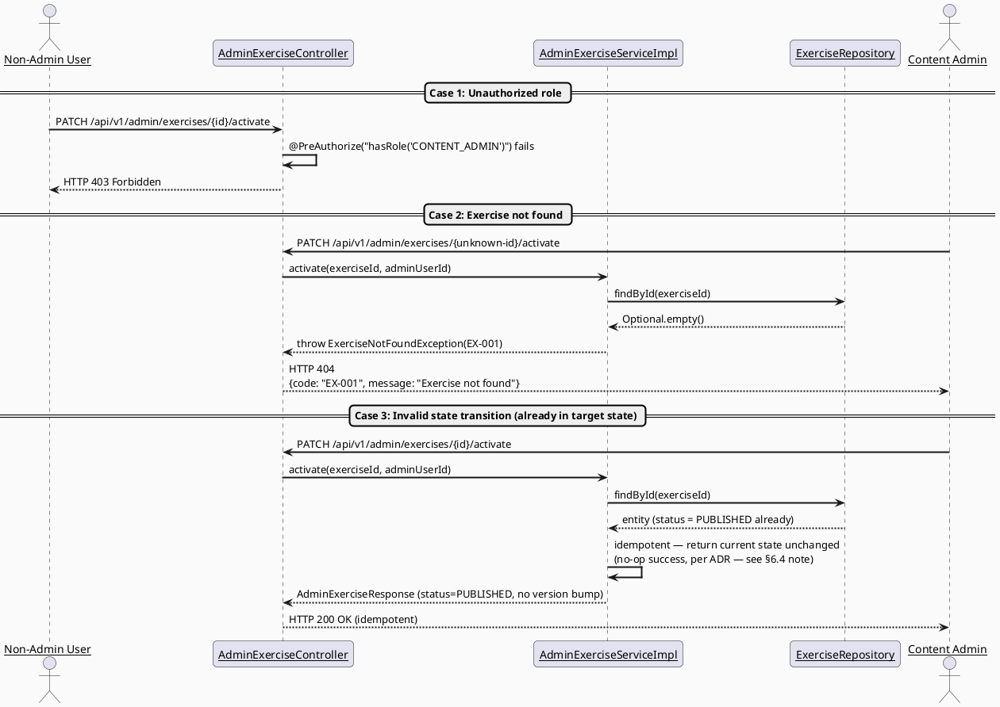
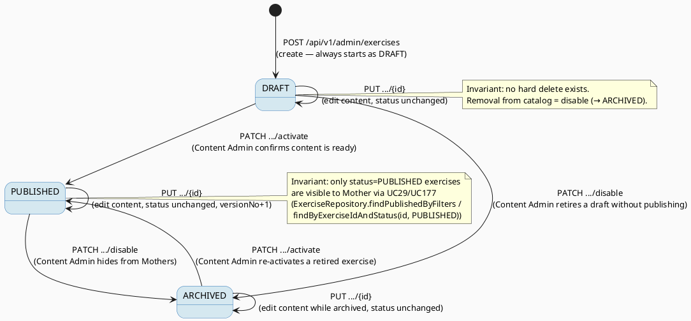

# ENGINEERING DOCUMENTATION STANDARD (EDS) v2.0
# UC185 — Manage Pregnancy Exercises — Technical Design Specification

| Field | Value |
|-------|-------|
| **Document ID** | `CB-EXERCISE-IMP-ADMIN-001` |
| **Version** | `1.0` |
| **Date** | `2026-07-03` |
| **Status** | `Draft` |
| **Document Owner** | `PhuongNT (TV1)` |
| **Author** | `AI Agent` |
| **Reviewed by** | `[ ] Pending` |
| **DPO Sign-off** | `N/A — no PII processed` |
| **Approved by** | `[ ] Pending` |
| **Last Review** | `2026-07-03` |
| **Based on EDS** | `v2.0` |

---

## CHANGELOG

> **Policy 4.4 — Immutable History:** Không bao giờ xóa thông tin cũ. Mọi thay đổi phải ghi vào bảng này.

| Ngày | Người thực hiện | Nội dung thay đổi |
|------|-----------------|-------------------|
| 2026-07-03 | AI Agent | Tạo tài liệu lần đầu — TDS cho UC185 Manage Pregnancy Exercises (Content Admin CRUD/activate/disable) |

---

## MỤC LỤC

1. [Tổng quan Module](#1-tổng-quan-module)
2. [Ma trận Truy vết (Traceability Matrix)](#2-ma-trận-truy-vết-traceability-matrix)
3. [Architecture Decision Records (ADR)](#3-architecture-decision-records-adr)
4. [Non-Functional Requirements & SLA](#4-non-functional-requirements--sla)
5. [Static Modeling (Mô hình Tĩnh)](#5-static-modeling-mô-hình-tĩnh)
6. [Dynamic Modeling (Mô hình Động)](#6-dynamic-modeling-mô-hình-động)
7. [Domain Event Catalog](#7-domain-event-catalog)
8. [Interface Specification (Đặc tả Giao diện)](#8-interface-specification-đặc-tả-giao-diện)
9. [API Specification](#9-api-specification)
10. [Bảng mã lỗi (Error Codes)](#10-bảng-mã-lỗi-error-codes)
11. [Quy trình Triển khai (Step-by-Step)](#11-quy-trình-triển-khai-step-by-step)
12. [Rollback & Incident Runbook](#12-rollback--incident-runbook)
13. [Kịch bản Kiểm thử Chi tiết](#13-kịch-bản-kiểm-thử-chi-tiết)
14. [Phương pháp Xác minh](#14-phương-pháp-xác-minh)
15. [Mẫu thử thực tế (API Verification Samples)](#15-mẫu-thử-thực-tế-api-verification-samples)
16. [Bảng tổng hợp phân quyền (Authorization Matrix)](#16-bảng-tổng-hợp-phân-quyền-authorization-matrix)
17. [AI Prompt Constraints (CASE 2.0)](#17-ai-prompt-constraints-case-20)

---

## 1. Tổng quan Module

> SRS §3.2.6.1 (UC-185, line 1667-1686): "Creates, updates, activates, or disables exercises and configures trimester, difficulty, duration, instructions, and warnings." Primary Actor: **Content Admin**. Platform: **Admin Portal (Web)**. Priority: **Medium**. Business Rule: **BR-RBAC**.
>
> This is the **write side (admin CRUD)** of the pregnancy exercise catalog. The **read side already exists** and is implemented/consumed by:
> - UC29 — View and Select Pregnancy Exercise (Mother, mobile, `GET /api/v1/exercises`)
> - UC177 — View Pregnancy Exercise Detail (Mother, mobile, `GET /api/v1/exercises/{id}`)
> - UC178/179/180/181/182/183/184 — Safety check, session lifecycle, posture, history (Mother, mobile)
>
> UC185 does **not** duplicate the existing `PregnancyExercise` JPA entity, `ExerciseRepository`, or `ExerciseMapper` — it **extends** them with admin-only write operations (create, update, activate, disable) behind a new `/api/v1/admin/exercises` controller, guarded by `CONTENT_ADMIN` role.

| Field | Value |
|-------|-------|
| **Module Name** | `Manage Pregnancy Exercises (Admin CRUD)` |
| **Bounded Context** | `exercise` |
| **Data Classification** | `Internal` (curated content, no PII) |
| **Compliance Scope** | `N/A` (no PII/consent data processed by this admin CRUD) |
| **Upstream Dependencies** | `IAM (authentication/RBAC)`, `pregnancy_exercises` table (`V1__init_schema.sql`), `AuditService` |
| **Downstream Consumers** | `UC29 — View and Select Pregnancy Exercise`, `UC177 — View Pregnancy Exercise Detail`, `UC178 — Complete Pre-Exercise Safety Check` (reads `safety_warning`), `UC186 — Manage Posture Analysis Configuration` (references `exercise_id`) |

**Existing code reused (RG-3 confirmed — NOT duplicated):**

| Component | Path | Reuse Type |
|-----------|------|-----------|
| `PregnancyExercise` entity | `exercise/entity/PregnancyExercise.java` | Reused as-is (no new fields required) |
| `TrimesterScope`, `DifficultyLevel`, `ExerciseStatus` enums | `exercise/entity/*.java` | Reused as-is |
| `ExerciseRepository` | `exercise/repository/ExerciseRepository.java` | **Extended** — new admin query methods added (see §8.2) |
| `ExerciseMapper` | `exercise/mapper/ExerciseMapper.java` | **Extended** — new admin response/request mapping methods added |
| `ExerciseNotFoundException` | `exercise/exception/ExerciseNotFoundException.java` | Reused as-is |
| `AuditService` / `AuditAction` | `audit/service/AuditService.java`, `audit/entity/AuditAction.java` | Reused; 4 new `AuditAction` enum constants added (no schema change — enum is Java-level, `audit_logs.action` column is `varchar(80)`) |

**Phạm vi (In-Scope):**
- `POST /api/v1/admin/exercises` — create a new exercise (defaults to `DRAFT` status).
- `PUT /api/v1/admin/exercises/{exerciseId}` — update exercise content fields (title, description, trimester, difficulty, duration, instructions, media URL, safety warning, posture-analysis flag).
- `PATCH /api/v1/admin/exercises/{exerciseId}/activate` — transition `DRAFT`/`ARCHIVED` → `PUBLISHED`.
- `PATCH /api/v1/admin/exercises/{exerciseId}/disable` — transition `PUBLISHED`/`DRAFT` → `ARCHIVED`.
- `GET /api/v1/admin/exercises` — list all exercises (any status) with filters, for the admin management screen.
- `GET /api/v1/admin/exercises/{exerciseId}` — get single exercise (any status) for the admin edit screen.

**Out-of-Scope:**
- Hard delete of exercises (not supported — catalog is append/status-only per ADR-EXERCISE-ADMIN-002).
- Posture analysis configuration (mode, model version, thresholds) — belongs to UC186 `Manage Posture Analysis Configuration`.
- Mother-facing read endpoints (`GET /api/v1/exercises`, `GET /api/v1/exercises/{id}`) — already implemented under UC29/UC177, unchanged by this feature.
- Media file upload/storage pipeline — `media_url` is accepted as a plain string field; actual file upload mechanism is out of scope (`Open` — no existing admin media upload utility found; assumed external URL entry for MVP, consistent with `mediaUrl: text` column with no FK to a file table).

---

## 2. Ma trận Truy vết (Traceability Matrix)

| Requirement ID | Loại (BR/ADR/US) | Mô tả yêu cầu | Thành phần Code | Compliance Target | ADR liên quan |
|----------------|------------------|---------------|-----------------|-------------------|---------------|
| BR-RBAC | Business Rule | Users may access only functions allowed by their role and permission scope | `AdminExerciseController` `@PreAuthorize("hasRole('CONTENT_ADMIN')")` | BR-RBAC | ADR-EXERCISE-ADMIN-001 |
| UC-185 Normal Flow Step 3-4 | Use Case | Content Admin creates/updates/activates/disables exercises, configuring trimester, difficulty, duration, instructions, warnings | `AdminExerciseService.create/update/activate/disable()` | — | ADR-EXERCISE-ADMIN-002 |
| UC-185 Exception E2 | Use Case | Invalid, missing, expired, or conflicting data is rejected with field-level message | `CreateExerciseRequest`/`UpdateExerciseRequest` Bean Validation | — | — |
| UC-185 Exception E1 | Use Case | Access denied when actor is unauthenticated/unauthorized/out of scope | `AdminExerciseController` `@PreAuthorize`, `SecurityConfig` | BR-RBAC | ADR-EXERCISE-ADMIN-001 |
| UC-185 Postcondition POST-3 | Use Case | Sensitive actions are recorded for audit review where required | `AdminExerciseServiceImpl` → `AuditService.log(EXERCISE_*)` | Audit trail | ADR-EXERCISE-ADMIN-003 |
| CASE 2.0 Safety Constraint | Project Rule (this task) | `warnings` (safety_warning) field must never be silently blanked/removed without explicit confirmation | `UpdateExerciseRequest` validation + `AdminExerciseServiceImpl.update()` | BR-SAFETY (adjacent) | ADR-EXERCISE-ADMIN-004 |
| US-EXERCISE-ADMIN-001 | User Story | Content Admin views all exercises (any status) for management | `AdminExerciseController.GET /api/v1/admin/exercises` | — | — |
| US-EXERCISE-ADMIN-002 | User Story | Content Admin creates a new exercise as DRAFT | `AdminExerciseController.POST /api/v1/admin/exercises` | — | ADR-EXERCISE-ADMIN-002 |
| US-EXERCISE-ADMIN-003 | User Story | Content Admin activates a DRAFT/ARCHIVED exercise to make it visible to Mothers | `AdminExerciseController.PATCH .../activate` | — | ADR-EXERCISE-ADMIN-002 |
| US-EXERCISE-ADMIN-004 | User Story | Content Admin disables a PUBLISHED/DRAFT exercise to hide it from Mothers | `AdminExerciseController.PATCH .../disable` | — | ADR-EXERCISE-ADMIN-002 |

---

## 3. Architecture Decision Records (ADR)

### ADR-EXERCISE-ADMIN-001 — Reuse Existing `Role.CONTENT_ADMIN` for Authorization (No New Role)

| Field | Value |
|-------|-------|
| **Status** | `Accepted` |
| **Deciders** | `PhuongNT — Developer, AI Agent` |
| **Date** | `2026-07-03` |

#### Bối cảnh (Context)
SRS UC-185 assigns Primary Actor "Content Admin" and Business Rule BR-RBAC. `Role.CONTENT_ADMIN` already exists in `security/rbac/Role.java` and is already used by `AdminContentController` (`/api/v1/admin/content`) with `@PreAuthorize("hasRole('CONTENT_ADMIN')")`.

#### Các phương án đã xem xét (Options Considered)

| Phương án | Mô tả | Ưu điểm | Nhược điểm |
|-----------|-------|----------|------------|
| A | Reuse `Role.CONTENT_ADMIN` at controller class level | + No RBAC schema change, + consistent with `AdminContentController` precedent | - None material |
| B | Introduce new granular `Role.EXERCISE_ADMIN` | + Finer-grained permission | - New role requires schema/enum change, over-engineered for current scope, no requirement basis in SRS |

#### Quyết định (Decision)
Chọn **Phương án A**. `CONTENT_ADMIN` is the actor named in SRS UC-185 and BR-RBAC does not call for a sub-role. Mirrors `AdminContentController` convention exactly.

#### Hệ quả (Consequences)

**Tích cực:**
- Zero RBAC/schema changes required.
- Consistent authorization pattern across admin content-management controllers.

**Tiêu cực / Trade-offs:**
- `CONTENT_ADMIN` is coarse-grained (same role manages both community content and exercises). Accepted — matches existing precedent, no SRS requirement for separation.

**Compliance Impact:** None — least-privilege still enforced at role level (BR-RBAC).

---

### ADR-EXERCISE-ADMIN-002 — Status-Based Activate/Disable Using Existing `ExerciseStatus` Enum (No New Migration)

| Field | Value |
|-------|-------|
| **Status** | `Accepted` |
| **Deciders** | `PhuongNT — Developer, AI Agent` |
| **Date** | `2026-07-03` |

#### Bối cảnh (Context)
UC-185 requires "activates, or disables exercises". The `pregnancy_exercises.status` column (`varchar(20) NOT NULL DEFAULT 'DRAFT'`) already exists in `V1__init_schema.sql`, and the Java enum `ExerciseStatus { DRAFT, PUBLISHED, ARCHIVED }` already exists and is already consumed by the read-side (`ExerciseRepository.findByExerciseIdAndStatus`, `findPublishedByFilters` filter on `status = PUBLISHED`). No lookup/reference table exists or is needed — `trimester_scope`, `difficulty_level`, and `status` are all simple `varchar` columns backed by Java enums (RG-6 confirmed).

#### Các phương án đã xem xét (Options Considered)

| Phương án | Mô tả | Ưu điểm | Nhược điểm |
|-----------|-------|----------|------------|
| A | Map "activate" → `status = PUBLISHED`, "disable" → `status = ARCHIVED`, reusing existing enum/column | + Zero migration, + read-side (UC29) already filters on `status = PUBLISHED` so activate/disable takes effect immediately, + consistent with existing `DRAFT` default | - "Disable" and "archive" are semantically merged into one state (accepted trade-off) |
| B | Add a separate boolean `is_active` column alongside `status` | + Explicit binary flag | - Redundant with existing 3-state `status` enum, - requires new migration + dual-state synchronization logic, - no requirement basis |

#### Quyết định (Decision)
Chọn **Phương án A**. No schema change required. `activate` transitions status to `PUBLISHED`; `disable` transitions status to `ARCHIVED`. This is fully consistent with the existing read-side query (`findPublishedByFilters` only returns `status = PUBLISHED`), so disabling an exercise via UC185 immediately and correctly hides it from Mothers in UC29 without any additional wiring.

#### Hệ quả (Consequences)

**Tích cực:**
- Zero migration risk; no `V{n}__` file needed for this decision.
- Immediate consistency with already-implemented read-side filtering logic.

**Tiêu cực / Trade-offs:**
- Re-activating an `ARCHIVED` exercise and "un-drafting" a `DRAFT` exercise both use the same `activate` action (`→ PUBLISHED`). Acceptable per SRS wording ("activates... exercises" — no distinct terminology for draft-publish vs. re-activate).

**Compliance Impact:** None.

---

### ADR-EXERCISE-ADMIN-003 — Audit Every Mutation via Existing `AuditService` (New Enum Constants Only)

| Field | Value |
|-------|-------|
| **Status** | `Accepted` |
| **Deciders** | `PhuongNT — Developer, AI Agent` |
| **Date** | `2026-07-03` |

#### Bối cảnh (Context)
UC-185 Postcondition POST-3: "Sensitive actions are recorded for audit, safety, or privacy review where required." `AuditService.log(AuditAction, UUID, String, String, Object)` already exists and is called by `AdminContentServiceImpl` for `CONTENT_CREATED`. `audit_logs.action` is `varchar(80)` — no schema change needed to add new logical actions, only new `AuditAction` Java enum constants.

#### Các phương án đã xem xét (Options Considered)

| Phương án | Mô tả | Ưu điểm | Nhược điểm |
|-----------|-------|----------|------------|
| A | Add 4 new `AuditAction` enum constants (`EXERCISE_CREATED`, `EXERCISE_UPDATED`, `EXERCISE_ACTIVATED`, `EXERCISE_DISABLED`) and call `AuditService.log(...)` in each service method | + Reuses existing audit pipeline/table, + zero migration, + consistent with `AdminContentServiceImpl` | - None material |
| B | Reuse generic `MODERATION_ACTION` for all 4 mutations | + No enum change | - Loses granularity for audit search/filter by action type, weakens traceability of which specific mutation occurred |

#### Quyết định (Decision)
Chọn **Phương án A** for traceability granularity, consistent with the project's existing pattern of one `AuditAction` constant per meaningful state-changing event (see `COMMUNITY_QUESTION_CREATED`, `COMMUNITY_QUESTION_EDITED`, etc.).

#### Hệ quả (Consequences)

**Tích cực:**
- Full audit trail distinguishing create vs. update vs. activate vs. disable.
- No schema/migration risk (`action` column already `varchar(80)`, enum names fit within length).

**Tiêu cực / Trade-offs:** None material.

**Compliance Impact:** Strengthens BR-RBAC/audit posture; no negative compliance impact.

---

### ADR-EXERCISE-ADMIN-004 — Safety Warning Field Cannot Be Silently Blanked on Update

| Field | Value |
|-------|-------|
| **Status** | `Accepted` |
| **Deciders** | `PhuongNT — Developer, AI Agent` |
| **Date** | `2026-07-03` |

#### Bối cảnh (Context)
`pregnancy_exercises.safety_warning` (`text`, nullable) is displayed prominently to Mothers per existing `ExerciseMapper.toSummaryResponse()` (`.safetyWarning(entity.getSafetyWarning() != null ? entity.getSafetyWarning() : "")` — already defaults null to empty string rather than omitting the field). UC-185 lets Content Admin "configure... warnings" via `PUT` update. A full-replace `PUT` risks an admin accidentally submitting a request without `safetyWarning`, silently wiping existing safety content relied upon by the exercise safety-check flow (UC178) and exercise listing (UC29). This is a content-safety adjacency, even though UC-185 itself only carries BR-RBAC (not BR-SAFETY) as its formal business rule.

#### Các phương án đã xem xét (Options Considered)

| Phương án | Mô tả | Ưu điểm | Nhược điểm |
|-----------|-------|----------|------------|
| A | `UpdateExerciseRequest.safetyWarning` is a required, non-blank field (Bean Validation `@NotBlank` at DTO level) whenever it is present in the request; a `null`/omitted field in JSON is treated as "no change" (partial-update semantics for this field only), while an explicit empty string `""` is rejected with `EX-ADMIN-002` | + Prevents accidental silent removal, + admin must take an explicit, deliberate action (cannot be achieved by omission), + keeps `PUT` simple (still full-replace for all other fields) | - Slightly asymmetric semantics vs. other fields (accepted, documented) |
| B | Full-replace `PUT` semantics identical to all other fields (missing/blank `safetyWarning` silently clears it) | + Simpler, uniform semantics | - Violates the health-safety-content protection intent of this task; a warning is the kind of content that should never disappear by accident |

#### Quyết định (Decision)
Chọn **Phương án A**. `safetyWarning` uses "if present, must be non-blank; if absent, unchanged" semantics. This is the **only** field in `UpdateExerciseRequest` with this rule; all others are standard full-replace `PUT` fields (matching the template's `PUT` contract). This constraint is injected into the AI Prompt Constraint Block (§17) as a hard rule.

#### Hệ quả (Consequences)

**Tích cực:**
- Protects safety-relevant content from silent data loss, consistent with the project's overall health/safety caution posture (CLAUDE.md: "enforce existing RBAC, consent scope/expiry, and audit requirements").

**Tiêu cực / Trade-offs:**
- Admin who genuinely wants to clear a warning must use a distinct explicit mechanism — **not implemented in this MVP scope** (`Open`: no "explicit clear" endpoint defined; if a genuine business need arises, a future `DELETE .../safety-warning` or a `clearSafetyWarning: true` flag would be added under a new ADR).

**Compliance Impact:** None formal (BR-SAFETY not in UC-185's Business Rules field), but aligns with CareBridge's general safety-content-preservation posture.

---

## 4. Non-Functional Requirements & SLA

### 4.1. Performance & Availability

| Category | Requirement | Target SLA | Measurement Method | Compliance Basis |
|----------|-------------|------------|---------------------|------------------|
| Latency | Admin CRUD API response (p99) | `< 500ms` | Manual timing / future k6 test | — |
| Availability | Admin Portal API uptime | Best-effort (aligned with overall backend uptime) | — | — |

### 4.2. Data Integrity & Retention

| Category | Requirement | Target | Verification Method | Compliance Basis |
|----------|-------------|--------|---------------------|------------------|
| Consistency | `status` transitions never bypass valid state set (`DRAFT`/`PUBLISHED`/`ARCHIVED`) | 100% | Enum-typed column + service-level validation | — |
| Optimistic concurrency | `version_no` incremented on every `update()` call | Always +1 per successful update | Integration test assertion | — |
| Audit completeness | Every create/update/activate/disable call produces exactly 1 `audit_logs` row | 100% | Integration test assertion | — |

### 4.3. Security

| Category | Requirement | Target | Verification Method | Compliance Basis |
|----------|-------------|--------|---------------------|------------------|
| Access control | Role-based, `CONTENT_ADMIN` only for all mutation endpoints | Least privilege | Auth Matrix (§16) + Security tests | BR-RBAC |
| Input validation | All request DTOs validated via Bean Validation before reaching service layer | 100% of fields | Unit + integration tests | — |
| Injection safety | JPA parameterized queries only (no string-concatenated SQL) | 100% | Code review + existing `ExerciseRepository` pattern | — |

### 4.4. Scalability & Capacity Planning

> Pregnancy exercise catalog is a small curated dataset (expected: tens to low hundreds of exercises, consistent with ADR-EXERCISE-001 in UC29's TDS which characterizes it as "not thousands"). No special scaling strategy required; standard JPA pagination (already used by `ExerciseRepository.findPublishedByFilters`) is reused for the admin list endpoint.

---

## 5. Static Modeling (Mô hình Tĩnh)

### 5.1. Class Diagram (PlantUML)



### 5.2. Data Structure — Schema Impact Analysis (No New Migration Required)

> **CareBridge rule:** `V1__init_schema.sql` is the primary source of truth. This section documents the exact existing schema and confirms no gap.

**Existing table (`V1__init_schema.sql`, lines 1196-1212) — verified, unchanged:**

```sql
CREATE TABLE public.pregnancy_exercises (
    exercise_id               uuid         NOT NULL DEFAULT gen_random_uuid(),
    created_by                uuid         NOT NULL,
    title                     varchar(255) NOT NULL,
    description               text,
    trimester_scope           varchar(50),
    difficulty_level          varchar(30),
    duration_minutes          smallint,
    instruction_content       text,
    media_url                 text,
    safety_warning            text,
    supports_posture_analysis boolean      NOT NULL DEFAULT false,
    status                    varchar(20)  NOT NULL DEFAULT 'DRAFT',
    version_no                integer      NOT NULL DEFAULT 1,
    created_at                timestamptz  NOT NULL DEFAULT now(),
    updated_at                timestamptz  NOT NULL DEFAULT now()
);
```

**RG-6 verdict (confirmed by reading `PregnancyExercise.java`, `TrimesterScope.java`, `DifficultyLevel.java`, `ExerciseStatus.java`):**
- `trimester_scope` → simple `varchar(50)` column mapped to Java enum `TrimesterScope { FIRST, SECOND, THIRD, ALL }`. **Not** a lookup/reference table FK.
- `difficulty_level` → simple `varchar(30)` column mapped to Java enum `DifficultyLevel { EASY, MEDIUM, HARD }`. **Not** an FK.
- `status` → simple `varchar(20)` column mapped to Java enum `ExerciseStatus { DRAFT, PUBLISHED, ARCHIVED }`. Already supports the activate (`→ PUBLISHED`) / disable (`→ ARCHIVED`) requirement — **no new column needed** (see ADR-EXERCISE-ADMIN-002).
- `duration_minutes` → `smallint`, simple scalar (no lookup table).

**Migration decision: NO new Flyway migration required.** The table already has full column and status support for this feature's needs. `exercise_id` has `DEFAULT gen_random_uuid()` at the DB level, but the JPA entity's `@Id` field `exerciseId` has no `@GeneratedValue` — creation flow must explicitly set `UUID.randomUUID()` in the mapper (matches existing convention observed elsewhere in the codebase; e.g., `AdminContentServiceImpl` sets IDs via mapper, not DB default, to keep the ID available for the audit log call before the `save()` returns).

**Sync action for `V1__init_schema.sql`:** None — no columns are being added or altered. This TDS is purely additive at the application layer (new controller/service/DTOs), reusing the existing table and entity.

**Audit table (existing, unchanged — `audit_logs`, `V1__init_schema.sql` line 31):**
```sql
CREATE TABLE public.audit_logs (
    audit_log_id uuid NOT NULL,
    action character varying(80) NOT NULL,
    actor_user_id uuid,
    created_at timestamp(6) with time zone NOT NULL,
    entity_id uuid,
    entity_type character varying(100),
    ip_address character varying(80),
    new_value_json jsonb,
    old_value_json jsonb,
    ...
);
```
New `AuditAction` enum constants (`EXERCISE_CREATED`, `EXERCISE_UPDATED`, `EXERCISE_ACTIVATED`, `EXERCISE_DISABLED`) are Java-level additions to `audit/entity/AuditAction.java` — `action` column is `varchar(80)`, all new constant names fit well within length. No migration needed.

> **New file paths introduced by this feature (all under existing `exercise` bounded context — no new package created):**
> - `exercise/controller/AdminExerciseController.java` (new)
> - `exercise/service/IAdminExerciseService.java` (new)
> - `exercise/service/impl/AdminExerciseServiceImpl.java` (new)
> - `exercise/dto/CreateExerciseRequest.java` (new)
> - `exercise/dto/UpdateExerciseRequest.java` (new)
> - `exercise/dto/AdminExerciseResponse.java` (new)
> - `exercise/exception/InvalidExerciseStateException.java` (new)
> - `exercise/repository/ExerciseRepository.java` (extended — add `findAllByFilters`)
> - `exercise/mapper/ExerciseMapper.java` (extended — add `toAdminResponse`, `toEntity`, `applyUpdate`)
> - `audit/entity/AuditAction.java` (extended — add 4 constants)

---

## 6. Dynamic Modeling (Mô hình Động)

### 6.1. Sequence Diagram — Create Exercise (Happy Path)



### 6.2. Sequence Diagram — Update Exercise (Safety Warning Protection Path)



### 6.3. Sequence Diagram — Error Path (Unauthorized / Not Found / Bad Transition)



> **Note on Case 3:** `activate`/`disable` are treated as **idempotent** state-setting operations (calling `activate` on an already-`PUBLISHED` exercise returns 200 with unchanged state, not an error). This follows the API contract convention `Idempotent: Yes` for `PATCH` state-transition endpoints (§9.1) and avoids forcing the Admin Portal UI to pre-check current state before every click.

### 6.4. State Machine



> **⚠️ Invariant bất biến:**
> 1. No transition ever deletes a row — `pregnancy_exercises` rows are never hard-deleted by this feature (append/status-only, consistent with ADR-EXERCISE-ADMIN-002).
> 2. Only `status = PUBLISHED` is visible to the Mother-facing read side (already enforced by existing `ExerciseRepository.findPublishedByFilters` / `findByExerciseIdAndStatus`, unchanged by this TDS).
> 3. Every state transition and content update must increment `version_no` by exactly 1 (except idempotent no-op activate/disable calls, which do not increment).

---

## 7. Domain Event Catalog

> Events are represented as `AuditAction` records persisted to `audit_logs` (existing infrastructure — see ADR-EXERCISE-ADMIN-003). CareBridge's `exercise` module does not currently use a separate async domain-event bus; audit log entries serve as the durable, queryable event record for this scope.

### 7.1. Events Published (Phát ra)

| Event Name | Trigger | Publisher | Subscriber(s) | Payload Schema | Async? |
|------------|---------|-----------|---------------|----------------|--------|
| `PregnancyExerciseCreated` (`AuditAction.EXERCISE_CREATED`) | `POST /api/v1/admin/exercises` succeeds | `AdminExerciseServiceImpl.create()` | `audit_logs` table (via `AuditService`) | §7.3 | No (synchronous, same transaction) |
| `PregnancyExerciseUpdated` (`AuditAction.EXERCISE_UPDATED`) | `PUT /api/v1/admin/exercises/{id}` succeeds | `AdminExerciseServiceImpl.update()` | `audit_logs` table | §7.3 | No |
| `PregnancyExerciseActivated` (`AuditAction.EXERCISE_ACTIVATED`) | `PATCH .../activate` transitions status to `PUBLISHED` | `AdminExerciseServiceImpl.activate()` | `audit_logs` table | §7.3 | No |
| `PregnancyExerciseDisabled` (`AuditAction.EXERCISE_DISABLED`) | `PATCH .../disable` transitions status to `ARCHIVED` | `AdminExerciseServiceImpl.disable()` | `audit_logs` table | §7.3 | No |

### 7.2. Events Consumed (Tiêu thụ)

> This feature does not consume any events. `Not applicable`.

### 7.3. Payload Schema

```java
// Persisted via AuditService.log(AuditAction, UUID, String, String, Object)
// Represented as audit_logs row: action, actor_user_id, entity_type="PregnancyExercise",
// entity_id=<exerciseId>, new_value_json=<details>, created_at=now()

// Logical event shape (not a separate Java record class — reuses existing AuditService signature):
// AuditService.log(
//     AuditAction.EXERCISE_CREATED | EXERCISE_UPDATED | EXERCISE_ACTIVATED | EXERCISE_DISABLED,
//     adminUserId,                       // actor_user_id
//     "PregnancyExercise",               // entity_type
//     exerciseId.toString(),             // entity_id
//     detailsObject                      // new_value_json — e.g. { "title": ..., "status": ..., "versionNo": ... }
// );
```

---

## 8. Interface Specification (Đặc tả Giao diện)

### 8.1. Service Interface

```java
// CreateExerciseRequest.java — Input DTO
// @version 1.0
public class CreateExerciseRequest {
    @NotBlank @Size(max = 255)
    private String title;                      // required
    private String description;                 // optional
    @NotNull
    private TrimesterScope trimesterScope;       // required — FIRST/SECOND/THIRD/ALL
    @NotNull
    private DifficultyLevel difficultyLevel;      // required — EASY/MEDIUM/HARD
    @NotNull @Min(1) @Max(180)
    private Short durationMinutes;               // required — bounds per BR-EXERCISE-DURATION (see §17)
    private String instructionContent;           // optional (text)
    private String mediaUrl;                     // optional
    @NotBlank
    private String safetyWarning;                // required on create (cannot create without a warning)
    @NotNull
    private Boolean supportsPostureAnalysis;      // required
    // getters / setters / @Valid annotations
}

// UpdateExerciseRequest.java — Input DTO
// @version 1.0
public class UpdateExerciseRequest {
    @NotBlank @Size(max = 255)
    private String title;
    private String description;
    @NotNull
    private TrimesterScope trimesterScope;
    @NotNull
    private DifficultyLevel difficultyLevel;
    @NotNull @Min(1) @Max(180)
    private Short durationMinutes;
    private String instructionContent;
    private String mediaUrl;
    private String safetyWarning;                 // NULLABLE by design (ADR-EXERCISE-ADMIN-004):
                                                    // null = unchanged, "" = rejected (EX-ADMIN-002), non-blank = applied
    @NotNull
    private Boolean supportsPostureAnalysis;
    // getters / setters / @Valid annotations
}

// AdminExerciseResponse.java — Output DTO
public class AdminExerciseResponse {
    private UUID exerciseId;
    private String title;
    private String description;
    private String trimesterScope;
    private String difficultyLevel;
    private Short durationMinutes;
    private String instructionContent;
    private String mediaUrl;
    private String safetyWarning;
    private Boolean supportsPostureAnalysis;
    private String status;
    private Integer versionNo;
    private UUID createdBy;
    private OffsetDateTime createdAt;
    private OffsetDateTime updatedAt;
    // getters / setters
}

// IAdminExerciseService.java — Service Contract
// @version 1.0
public interface IAdminExerciseService {
    /**
     * Creates a new pregnancy exercise with status=DRAFT.
     * @throws jakarta.validation.ConstraintViolationException on invalid input (handled by @Valid at controller)
     */
    AdminExerciseResponse create(CreateExerciseRequest request, UUID adminUserId);

    /**
     * Updates exercise content fields. Does not change status.
     * @throws ExerciseNotFoundException (EX-001) if exerciseId does not exist
     * @throws InvalidExerciseStateException (EX-ADMIN-002) if safetyWarning is explicitly blank ("")
     */
    AdminExerciseResponse update(UUID exerciseId, UpdateExerciseRequest request, UUID adminUserId);

    /**
     * Transitions exercise status to PUBLISHED. Idempotent if already PUBLISHED.
     * @throws ExerciseNotFoundException (EX-001) if exerciseId does not exist
     */
    AdminExerciseResponse activate(UUID exerciseId, UUID adminUserId);

    /**
     * Transitions exercise status to ARCHIVED. Idempotent if already ARCHIVED.
     * @throws ExerciseNotFoundException (EX-001) if exerciseId does not exist
     */
    AdminExerciseResponse disable(UUID exerciseId, UUID adminUserId);

    /**
     * Retrieves a single exercise regardless of status (admin view).
     * @throws ExerciseNotFoundException (EX-001) if exerciseId does not exist
     */
    AdminExerciseResponse getById(UUID exerciseId);

    /**
     * Lists all exercises regardless of status, with optional filters, for the admin management screen.
     */
    PaginatedResponse<AdminExerciseResponse> list(
            ExerciseStatus status, TrimesterScope trimester, DifficultyLevel difficulty, int page, int size);
}
```

### 8.2. Repository Interface (Extension of Existing `ExerciseRepository`)

```java
// ExerciseRepository.java — EXTENDED (existing file, add method below existing methods)
// @version 1.1
public interface ExerciseRepository extends JpaRepository<PregnancyExercise, UUID> {

    // --- EXISTING (unchanged, reused by UC29/UC177) ---
    Optional<PregnancyExercise> findByExerciseIdAndStatus(UUID exerciseId, ExerciseStatus status);

    Page<PregnancyExercise> findPublishedByFilters(
            ExerciseStatus status, TrimesterScope trimester, DifficultyLevel difficulty, Pageable pageable);

    // --- NEW (UC185 admin list — status filter is OPTIONAL, unlike the Mother-facing query) ---
    @Query("SELECT e FROM PregnancyExercise e WHERE "
         + "(:status IS NULL OR e.status = :status) "
         + "AND (:trimester IS NULL OR e.trimesterScope = :trimester) "
         + "AND (:difficulty IS NULL OR e.difficultyLevel = :difficulty) "
         + "ORDER BY e.createdAt DESC")
    Page<PregnancyExercise> findAllByFilters(
            @Param("status") ExerciseStatus status,
            @Param("trimester") TrimesterScope trimester,
            @Param("difficulty") DifficultyLevel difficulty,
            Pageable pageable);

    // findById(UUID) inherited from JpaRepository — used directly by AdminExerciseServiceImpl
    // Note: no delete() method added — hard delete out of scope (ADR-EXERCISE-ADMIN-002)
}
```

---

## 9. API Specification

### 9.1. Endpoints Table

| Method | Path | Auth Level | Required Roles | Rate Limit | Idempotent? |
|--------|------|------------|----------------|------------|-------------|
| `GET` | `/api/v1/admin/exercises` | JWT Bearer | `CONTENT_ADMIN` | 300/min | Yes |
| `GET` | `/api/v1/admin/exercises/{exerciseId}` | JWT Bearer | `CONTENT_ADMIN` | 300/min | Yes |
| `POST` | `/api/v1/admin/exercises` | JWT Bearer | `CONTENT_ADMIN` | 60/min | No |
| `PUT` | `/api/v1/admin/exercises/{exerciseId}` | JWT Bearer | `CONTENT_ADMIN` | 60/min | Yes |
| `PATCH` | `/api/v1/admin/exercises/{exerciseId}/activate` | JWT Bearer | `CONTENT_ADMIN` | 60/min | Yes |
| `PATCH` | `/api/v1/admin/exercises/{exerciseId}/disable` | JWT Bearer | `CONTENT_ADMIN` | 60/min | Yes |

### 9.2. Request / Response Schemas

#### `POST /api/v1/admin/exercises` — Create

**Request Body:**
```json
{
  "title": "Pelvic Tilt Stretch",
  "description": "Gentle stretch to relieve lower back tension.",
  "trimesterScope": "SECOND",
  "difficultyLevel": "EASY",
  "durationMinutes": 10,
  "instructionContent": "1. Kneel on all fours...\n2. Arch and round your back slowly...",
  "mediaUrl": "https://cdn.carebridge.dev/exercises/pelvic-tilt.mp4",
  "safetyWarning": "Stop immediately if you feel dizziness or sharp pain.",
  "supportsPostureAnalysis": true
}
```

**Response — 201 Created (Happy Path):**
```json
{
  "success": true,
  "data": {
    "exerciseId": "550e8400-e29b-41d4-a716-446655440000",
    "title": "Pelvic Tilt Stretch",
    "description": "Gentle stretch to relieve lower back tension.",
    "trimesterScope": "SECOND",
    "difficultyLevel": "EASY",
    "durationMinutes": 10,
    "instructionContent": "1. Kneel on all fours...\n2. Arch and round your back slowly...",
    "mediaUrl": "https://cdn.carebridge.dev/exercises/pelvic-tilt.mp4",
    "safetyWarning": "Stop immediately if you feel dizziness or sharp pain.",
    "supportsPostureAnalysis": true,
    "status": "DRAFT",
    "versionNo": 1,
    "createdBy": "6ba7b810-9dad-11d1-80b4-00c04fd430c8",
    "createdAt": "2026-07-03T08:00:00.000Z",
    "updatedAt": "2026-07-03T08:00:00.000Z"
  },
  "message": "Exercise created successfully"
}
```

**Response — 400 Bad Request (Validation Error):**
```json
{
  "error": {
    "code": "EX-ADMIN-001",
    "message": "Validation failed",
    "details": [
      { "field": "durationMinutes", "message": "durationMinutes must be between 1 and 180" },
      { "field": "safetyWarning", "message": "safetyWarning is required" }
    ]
  }
}
```

#### `PUT /api/v1/admin/exercises/{exerciseId}` — Update

**Request Body:**
```json
{
  "title": "Pelvic Tilt Stretch (Updated)",
  "description": "Gentle stretch to relieve lower back tension. Revised instructions.",
  "trimesterScope": "SECOND",
  "difficultyLevel": "EASY",
  "durationMinutes": 12,
  "instructionContent": "1. Kneel on all fours...\n2. Arch and round your back slowly (revised)...",
  "mediaUrl": "https://cdn.carebridge.dev/exercises/pelvic-tilt-v2.mp4",
  "safetyWarning": null,
  "supportsPostureAnalysis": true
}
```
> `safetyWarning: null` (or field omitted entirely) means "leave the existing safety warning unchanged" (ADR-EXERCISE-ADMIN-004).

**Response — 200 OK:**
```json
{
  "success": true,
  "data": {
    "exerciseId": "550e8400-e29b-41d4-a716-446655440000",
    "title": "Pelvic Tilt Stretch (Updated)",
    "safetyWarning": "Stop immediately if you feel dizziness or sharp pain.",
    "status": "DRAFT",
    "versionNo": 2,
    "updatedAt": "2026-07-03T09:00:00.000Z"
  },
  "message": "Exercise updated successfully"
}
```

**Response — 400 Bad Request (Attempt to blank safetyWarning):**
```json
{
  "error": {
    "code": "EX-ADMIN-002",
    "message": "safetyWarning cannot be set to an empty value; omit the field to leave it unchanged",
    "details": [{ "field": "safetyWarning", "message": "must not be blank if provided" }]
  }
}
```

#### `PATCH /api/v1/admin/exercises/{exerciseId}/activate` — Activate

**Request Body:** _(empty)_

**Response — 200 OK:**
```json
{
  "success": true,
  "data": {
    "exerciseId": "550e8400-e29b-41d4-a716-446655440000",
    "status": "PUBLISHED",
    "versionNo": 2,
    "updatedAt": "2026-07-03T09:05:00.000Z"
  },
  "message": "Exercise activated successfully"
}
```

#### `PATCH /api/v1/admin/exercises/{exerciseId}/disable` — Disable

**Request Body:** _(empty)_

**Response — 200 OK:**
```json
{
  "success": true,
  "data": {
    "exerciseId": "550e8400-e29b-41d4-a716-446655440000",
    "status": "ARCHIVED",
    "versionNo": 2,
    "updatedAt": "2026-07-03T09:10:00.000Z"
  },
  "message": "Exercise disabled successfully"
}
```

**Response — 404 Not Found (any endpoint, unknown exerciseId):**
```json
{
  "error": {
    "code": "EX-001",
    "message": "Exercise not found"
  }
}
```

**Response — 403 Forbidden (non-CONTENT_ADMIN role):**
```json
{
  "error": {
    "code": "IAM-003",
    "message": "Insufficient permissions"
  }
}
```

---

## 10. Bảng mã lỗi (Error Codes)

> Prefix `EX-` reused from existing `ExerciseNotFoundException` (`EX-001`). New admin-specific codes use `EX-ADMIN-` prefix to distinguish write-side errors from read-side errors without colliding with existing `EX-001`.

| Code | HTTP Status | Message (EN) | Message (VI) | Trigger Condition |
|------|-------------|--------------|--------------|-------------------|
| `EX-001` | 404 | Exercise not found | Không tìm thấy bài tập | `exerciseId` does not exist in `pregnancy_exercises` (reused from existing exception) |
| `EX-ADMIN-001` | 400 | Validation failed | Dữ liệu không hợp lệ | Bean Validation failure on `CreateExerciseRequest`/`UpdateExerciseRequest` (e.g. missing title, durationMinutes out of 1-180 range) |
| `EX-ADMIN-002` | 400 | safetyWarning cannot be blanked | Không thể xóa trắng cảnh báo an toàn | `UpdateExerciseRequest.safetyWarning == ""` (explicit empty string) per ADR-EXERCISE-ADMIN-004 |
| `EX-ADMIN-003` | 403 | Insufficient permissions | Không đủ quyền | Caller role is not `CONTENT_ADMIN` (surfaced as generic `IAM-003` by Spring Security `@PreAuthorize`, listed here for completeness of this module's error surface) |
| `EX-ADMIN-004` | 500 | Internal error | Lỗi hệ thống | Unexpected persistence/server failure |

---

## 11. Quy trình Triển khai (Step-by-Step)

### 11.1. Prerequisites

- [x] ADR-EXERCISE-ADMIN-001 through 004 Accepted (§3)
- [x] No DPO sign-off required — Data Classification `Internal`, no PII
- [ ] TDS + Test-Spec reviewed and approved by PhuongNT
- [x] No new migration — staging readiness N/A for schema

### 11.2. Pre-Migration Checklist

> **N/A — no new Flyway migration in this TDS.** `pregnancy_exercises` table already exists with full column support (§5.2).

### 11.3. Implementation Steps

#### Chặng 1 — Extend `AuditAction` enum

Add 4 constants to `audit/entity/AuditAction.java`: `EXERCISE_CREATED`, `EXERCISE_UPDATED`, `EXERCISE_ACTIVATED`, `EXERCISE_DISABLED`.

#### Chặng 2 — Extend `ExerciseRepository` and `ExerciseMapper`

Add `findAllByFilters(...)` to `ExerciseRepository`; add `toAdminResponse()`, `toEntity()`, `applyUpdate()` to `ExerciseMapper`.

#### Chặng 3 — Create DTOs, exception, service, controller

Create `CreateExerciseRequest`, `UpdateExerciseRequest`, `AdminExerciseResponse`, `InvalidExerciseStateException`, `IAdminExerciseService`, `AdminExerciseServiceImpl`, `AdminExerciseController` per §8/§9.

#### Chặng 4 — Verification sau deploy

```bash
curl -X GET https://[host]/api/v1/admin/exercises \
  -H "Authorization: Bearer [CONTENT_ADMIN_JWT]"
# Expected: 200 with paginated list (possibly empty)
```

### 11.4. Deployment Checklist

- [ ] `./mvnw test` green for new `exercise` admin classes
- [ ] `AdminExerciseController` endpoints return correct status codes for happy/error paths
- [ ] Audit log rows generated correctly for all 4 mutation types
- [ ] No PII/secret in logs (N/A data class, but still verified)

---

## 12. Rollback & Incident Runbook

### 12.1. Điều kiện kích hoạt Rollback (Trigger Conditions)

| Điều kiện | Ngưỡng | Người quyết định |
|-----------|--------|------------------|
| Error rate tăng đột biến trên `/api/v1/admin/exercises*` | > 5% trong 5 phút | On-call Engineer |
| Mother-facing `GET /api/v1/exercises` bị ảnh hưởng bởi thay đổi này | Bất kỳ regression nào | Tech Lead |
| Audit log ngừng ghi cho exercise mutations | > 1 phút | On-call Engineer |

### 12.2. Rollback Procedure

```bash
# No migration to revert (schema unchanged).
# Revert application code only:
git checkout -- src/main/java/com/carebridge/backend/exercise/controller/AdminExerciseController.java
git checkout -- src/main/java/com/carebridge/backend/exercise/service/IAdminExerciseService.java
git checkout -- src/main/java/com/carebridge/backend/exercise/service/impl/AdminExerciseServiceImpl.java
git checkout -- src/main/java/com/carebridge/backend/exercise/dto/CreateExerciseRequest.java
git checkout -- src/main/java/com/carebridge/backend/exercise/dto/UpdateExerciseRequest.java
git checkout -- src/main/java/com/carebridge/backend/exercise/dto/AdminExerciseResponse.java
git checkout -- src/main/java/com/carebridge/backend/exercise/exception/InvalidExerciseStateException.java
# Revert extensions (careful — these files are shared with UC29/UC177, revert only the added methods)
git diff src/main/java/com/carebridge/backend/exercise/repository/ExerciseRepository.java
git diff src/main/java/com/carebridge/backend/exercise/mapper/ExerciseMapper.java
git diff src/main/java/com/carebridge/backend/audit/entity/AuditAction.java

# Redeploy previous artifact
kubectl rollout undo deployment/carebridge-api  # (or equivalent per actual deploy target)
```

### 12.3. Notification Protocol

| Thời điểm | Người nhận | Kênh | Template |
|-----------|------------|------|----------|
| Ngay khi phát hiện | On-call team | Team chat channel | "Incident detected on Admin Exercise CRUD: [mô tả]" |
| Trong 30 phút | Tech Lead (PhuongNT) | Direct message | Summary + impact on UC29/UC177 read-side |

### 12.4. Post-Incident Review (PIR)

> Bắt buộc hoàn thành PIR document trong vòng 48 giờ sau khi incident được resolve, theo format chuẩn của dự án (Timeline / Root Cause / Impact / Remediation / Prevention).

---

## 13. Kịch bản Kiểm thử Chi tiết

> Chi tiết đầy đủ nằm trong `UC185_ManagePregnancyExercises_Test-Spec.md`. Section này chỉ tóm tắt phạm vi.

- **Unit tests:** `AdminExerciseServiceImpl` — create/update/activate/disable logic, safety-warning guard, idempotent state transitions, version increment.
- **Integration tests:** `AdminExerciseController` + real `ExerciseRepository` against Testcontainers PostgreSQL — full CRUD lifecycle, audit log row assertions.
- **Security tests:** Role-based access denial for non-`CONTENT_ADMIN` roles (Mother, Expert, System Admin, unauthenticated).
- **Web component tests:** Admin Portal exercise management form (Vitest) — validation messages, safety-warning-blank rejection UX.

---

## 14. Phương pháp Xác minh

### 14.1. Database Inspection

```sql
-- Verify exercise created with correct defaults
SELECT exercise_id, status, version_no, created_by, created_at
FROM pregnancy_exercises
WHERE exercise_id = '[uuid]';

-- Verify safety_warning was NOT blanked on partial update
SELECT exercise_id, safety_warning, version_no
FROM pregnancy_exercises
WHERE exercise_id = '[uuid]';

-- Verify audit trail completeness for a given exercise
SELECT action, actor_user_id, entity_id, created_at
FROM audit_logs
WHERE entity_type = 'PregnancyExercise' AND entity_id = '[uuid]'
ORDER BY created_at ASC;
```

### 14.2. Log / Audit Verification

```bash
# Verify audit log entries generated for each mutation type
grep '"action":"EXERCISE_CREATED"' app.log | head -5
grep '"action":"EXERCISE_ACTIVATED"' app.log | head -5
```

### 14.3. Tool-based Verification

```bash
# Verify JWT role claim carries CONTENT_ADMIN before testing endpoints
echo "[JWT_TOKEN]" | cut -d'.' -f2 | base64 -d | jq .
```

---

## 15. Mẫu thử thực tế (API Verification Samples)

### 15.1. Happy Path

```bash
curl -X POST http://localhost:8080/api/v1/admin/exercises \
  -H "Authorization: Bearer [CONTENT_ADMIN_JWT]" \
  -H "Content-Type: application/json" \
  -d '{
    "title": "Pelvic Tilt Stretch",
    "trimesterScope": "SECOND",
    "difficultyLevel": "EASY",
    "durationMinutes": 10,
    "safetyWarning": "Stop immediately if you feel dizziness or sharp pain.",
    "supportsPostureAnalysis": true
  }'
```

**Expected Response (201):** see §9.2.

### 15.2. Error Paths

```bash
# Missing required field → 400
curl -X POST http://localhost:8080/api/v1/admin/exercises \
  -H "Authorization: Bearer [CONTENT_ADMIN_JWT]" \
  -H "Content-Type: application/json" \
  -d '{}'
```

**Expected Response (400):** `EX-ADMIN-001`.

```bash
# No JWT → 401
curl -X GET http://localhost:8080/api/v1/admin/exercises
```

**Expected Response (401):**
```json
{ "error": { "code": "IAM-001", "message": "Authentication required" } }
```

```bash
# Wrong role (Mother JWT) → 403
curl -X POST http://localhost:8080/api/v1/admin/exercises \
  -H "Authorization: Bearer [MOTHER_JWT]" -H "Content-Type: application/json" -d '{}'
```

**Expected Response (403):** `IAM-003` / `EX-ADMIN-003`.

---

## 16. Bảng tổng hợp phân quyền (Authorization Matrix)

| Endpoint | `MOTHER` | `FAMILY` | `EXPERT` | `MODERATOR` | `CONTENT_ADMIN` | `SYSTEM_ADMIN` | `PARTNER` |
|----------|----------|----------|----------|--------------|------------------|-----------------|-----------|
| `GET /api/v1/admin/exercises` | ❌ | ❌ | ❌ | ❌ | ✅ | ❌ | ❌ |
| `GET /api/v1/admin/exercises/{id}` | ❌ | ❌ | ❌ | ❌ | ✅ | ❌ | ❌ |
| `POST /api/v1/admin/exercises` | ❌ | ❌ | ❌ | ❌ | ✅ | ❌ | ❌ |
| `PUT /api/v1/admin/exercises/{id}` | ❌ | ❌ | ❌ | ❌ | ✅ | ❌ | ❌ |
| `PATCH /api/v1/admin/exercises/{id}/activate` | ❌ | ❌ | ❌ | ❌ | ✅ | ❌ | ❌ |
| `PATCH /api/v1/admin/exercises/{id}/disable` | ❌ | ❌ | ❌ | ❌ | ✅ | ❌ | ❌ |
| `GET /api/v1/exercises` (existing, unchanged, UC29) | ✅ | ❌ | ❌ | ❌ | ❌ | ✅ | ❌ |

**Chú thích:**
- ✅ = Được phép; ❌ = Bị từ chối (403)
- **`SYSTEM_ADMIN` is deliberately excluded from admin exercise CRUD** — SRS UC-185 names only "Content Admin" as Primary Actor, with no Secondary Actor. This mirrors `AdminContentController`'s exclusive `CONTENT_ADMIN`-only pattern (no `SYSTEM_ADMIN` override). `Open` item flagged for user/architect confirmation if a break-glass `SYSTEM_ADMIN` override is desired later — not implemented in this MVP scope absent an explicit requirement.

---

## 17. AI Prompt Constraints (CASE 2.0)

### 17.1 Constraint Summary Table

| # | Constraint | Source (ADR/BR) | Last Verified |
|---|-----------|-----------------|---------------|
| C1 | Mutation endpoints (`POST`/`PUT`/`PATCH`) MUST be annotated `@PreAuthorize("hasRole('CONTENT_ADMIN')")` at controller class or method level — no other role may access | `ADR-EXERCISE-ADMIN-001`, BR-RBAC | `2026-07-03` |
| C2 | `UpdateExerciseRequest.safetyWarning` MUST use "null = unchanged, blank string = reject with EX-ADMIN-002" semantics — NEVER silently overwrite an existing non-null `safety_warning` with an empty/blank value | `ADR-EXERCISE-ADMIN-004` | `2026-07-03` |
| C3 | Reuse existing `PregnancyExercise` entity, `ExerciseRepository`, `ExerciseMapper`, `ExerciseNotFoundException` — do NOT create a duplicate entity or a second JPA mapping for `pregnancy_exercises` | RG-3 research finding, `03_Design/Architecture` modular-monolith rule | `2026-07-03` |
| C4 | `activate`/`disable` MUST be idempotent — calling activate on an already-`PUBLISHED` exercise (or disable on already-`ARCHIVED`) returns `200 OK` with unchanged state, not an error | `ADR-EXERCISE-ADMIN-002`, §9.1 `Idempotent: Yes` | `2026-07-03` |
| C5 | Every successful create/update/activate/disable call MUST call `AuditService.log(...)` with the corresponding new `AuditAction` constant before returning to the controller | `ADR-EXERCISE-ADMIN-003` | `2026-07-03` |
| C6 | No hard `DELETE` endpoint or repository `delete()` call may be added for `pregnancy_exercises` — removal from the Mother-facing catalog is achieved only via `disable` (status → `ARCHIVED`) | `ADR-EXERCISE-ADMIN-002` | `2026-07-03` |
| C7 | `durationMinutes` MUST be validated `1 <= value <= 180` at the DTO level (`@Min(1) @Max(180)`) — reject out-of-range values with `EX-ADMIN-001` before reaching the service layer | §8.1 DTO spec (derived from `smallint` column + reasonable exercise-duration domain bound; `Open` — exact business-approved bound not in SRS, flagged in Test-Spec §2 Logic Issues) | `2026-07-03` |

> ⚠️ **`Last Verified` > 2 sprints → constraint cần được re-verify trước khi inject.**

### 17.2 Constraint Injection Block (Copy-Paste vào AI Prompt)

```
[CONSTRAINT BLOCK — Module: Manage Pregnancy Exercises (Admin CRUD)]
Theo TDS CB-EXERCISE-IMP-ADMIN-001 và các ADR liên quan:

1. C1 — Mọi endpoint mutation phải @PreAuthorize("hasRole('CONTENT_ADMIN')"). Không role nào khác được truy cập.
2. C2 — UpdateExerciseRequest.safetyWarning: null = giữ nguyên, "" (blank) = reject EX-ADMIN-002. KHÔNG BAO GIỜ ghi đè safety_warning hiện có bằng giá trị rỗng một cách âm thầm.
3. C3 — Tái sử dụng PregnancyExercise entity, ExerciseRepository, ExerciseMapper, ExerciseNotFoundException đã tồn tại. KHÔNG tạo entity/mapping trùng lặp cho bảng pregnancy_exercises.
4. C4 — activate/disable phải idempotent (gọi lại trên state đích trả về 200, không lỗi).
5. C5 — Mọi create/update/activate/disable thành công phải gọi AuditService.log(...) với AuditAction tương ứng trước khi return.
6. C6 — Không thêm DELETE endpoint hay repository.delete() cho pregnancy_exercises.
7. C7 — durationMinutes validate 1-180 tại DTO level (@Min/@Max), reject với EX-ADMIN-001.

[CONTEXT BLOCK]
- Bounded Context: exercise
- Data Classification: Internal (no PII)
- Compliance: N/A (BR-RBAC only)
- Existing interfaces: §8 Service Interface + §8.2 Repository Interface (Extension)
- Error codes: §10 Error Codes Table (EX-001, EX-ADMIN-001..004)
- Auth matrix: §16 Authorization Matrix

[TASK BLOCK]
Implement AdminExerciseController + AdminExerciseServiceImpl + supporting DTOs thỏa mãn constraints trên.
Output phải tuân thủ §8 Interface Specification.
Tests phải cover §13 Test Scenarios (chi tiết trong Test-Spec).
```

### 17.3 Constraint Quality Checklist

- [x] Mỗi constraint traceable về ADR hoặc BR cụ thể
- [x] Không có constraint generic
- [x] Mỗi constraint có `Last Verified` date ≤ 2 sprints (2026-07-03, current sprint)
- [x] Constraint block có ≥ 3 constraints cụ thể (7 constraints)
- [x] Constraint block reference §8 Interface
- [x] Constraint block reference §16 Auth Matrix

### 17.4 Anti-Pattern Detection (cho AI-Generated Code từ Block này)

| AP-ID | Anti-Pattern | Dấu hiệu | Hành động |
|-------|-------------|-----------|----------|
| AP-AI-001 | Unconstrained Gen | Code không match bất kỳ constraint C1-C7 nào | Reject — inject lại constraints |
| AP-AI-003 | Implicit Decision | Code assume architecture không có trong §3 ADR (e.g. adds a delete endpoint, or a new lookup table) | Reject — viết ADR mới trước |
| AP-AI-005 | Hallucinated Contract | Code import service/type không có trong §8 (e.g. invents a `PregnancyExerciseV2` entity) | Reject — verify contract existence |

---

## PHỤ LỤC

### A. Glossary (Thuật ngữ)

| Thuật ngữ | Định nghĩa |
|-----------|------------|
| Content Admin | Actor role (`Role.CONTENT_ADMIN`) responsible for managing curated content, including pregnancy exercises |
| Trimester Scope | `TrimesterScope` enum — which pregnancy trimester(s) an exercise is intended for |
| Activate / Disable | Status transition operations mapping to `status = PUBLISHED` / `status = ARCHIVED` respectively (ADR-EXERCISE-ADMIN-002) |
| Idempotent state transition | Calling `activate`/`disable` on an exercise already in the target state succeeds without error or duplicate side effect |
| Red Gate | Gate xác minh test sensitivity — tests phải FAIL trước khi implement |

### B. Tài liệu tham chiếu

| Document | Link / Path |
|----------|-------------|
| SRS §3.2.6.1 Manage Pregnancy Exercises | `02_Requirements/SRS/3_Functional_Specification.md` (lines 1667-1686) |
| `pregnancy_exercises` schema | `05_Development/CareBridgeAPI/src/main/resources/db/migration/V1__init_schema.sql` (lines 1196-1212) |
| UC29 TDS (read-side precedent) | `04_Implement/UC29_ViewAndSelectPregnancyExercise/UC29_ViewAndSelectPregnancyExercise_TDS.md` |
| UC177 TDS (exercise detail read-side) | `04_Implement/UC177_ViewPregnancyExerciseDetail/UC177_ViewPregnancyExerciseDetail_TDS.md` |
| function-spec-task-allocation | `04_Implement/implement_artifacts/function-spec-task-allocation.md` |
| Existing admin content precedent | `05_Development/CareBridgeAPI/src/main/java/com/carebridge/backend/content/controller/AdminContentController.java` |
| CASE 2.0 Methodology | Project TDS/Test-Spec templates (`08_References/Template/`) |

---

*EDS v2.0 — CareBridge adaptation.*
*Sections đánh dấu ⭐ trong template gốc đã được populate với nội dung cụ thể của CareBridge (không giữ placeholder).*
