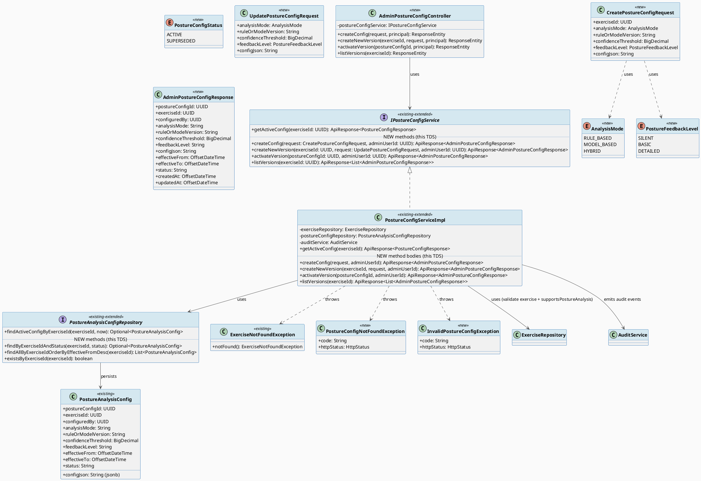
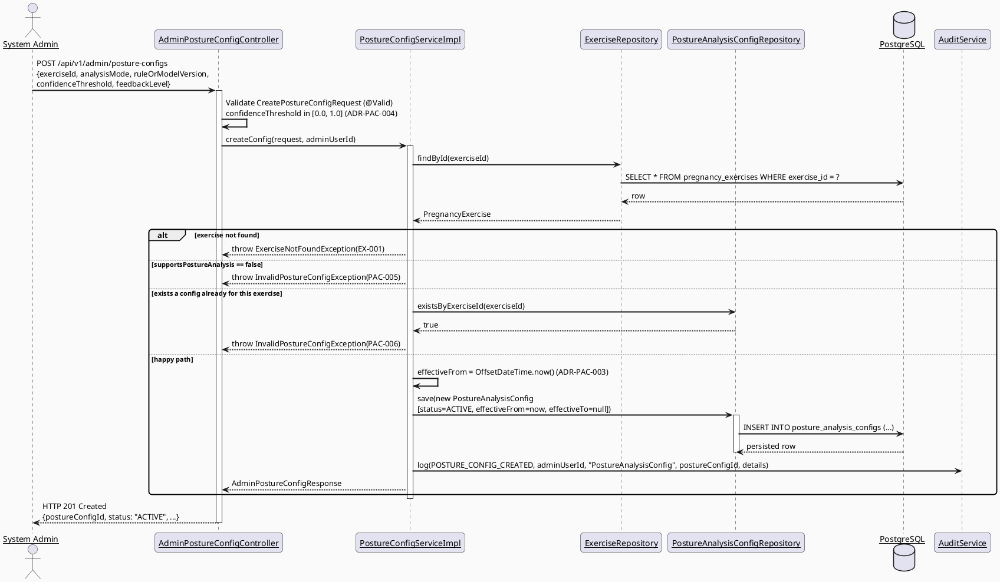
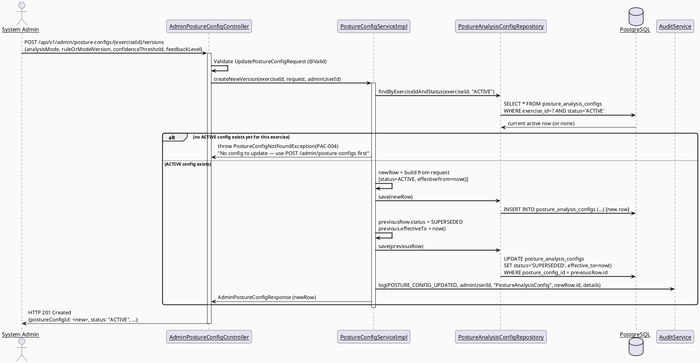
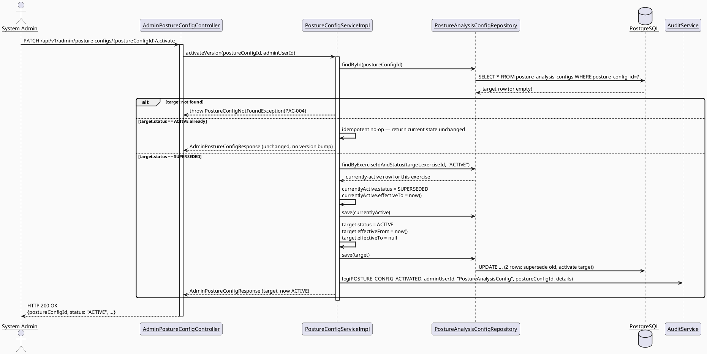
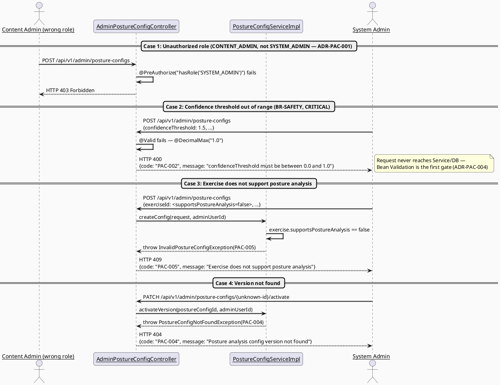
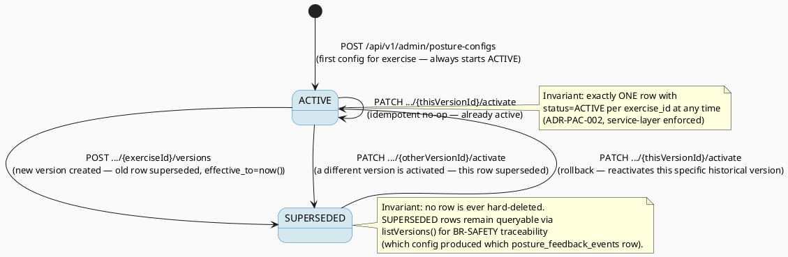

# ENGINEERING DOCUMENTATION STANDARD (EDS) v2.0
# UC186 — Manage Posture Analysis Configuration — Technical Design Specification

| Field | Value |
|-------|-------|
| **Document ID** | `CB-EXERCISE-IMP-ADMIN-002` |
| **Version** | `1.0` |
| **Date** | `2026-07-03` |
| **Status** | `Draft` |
| **Document Owner** | `PhuongNT (TV1)` |
| **Author** | `AI Agent` |
| **Reviewed by** | `[ ] Pending` |
| **DPO Sign-off** | `N/A — no PII processed (config data only, references exercise_id/configured_by, not mother health data)` |
| **Approved by** | `[ ] Pending` |
| **Last Review** | `2026-07-03` |
| **Based on EDS** | `v2.0` |

---

## CHANGELOG

| Ngày | Người thực hiện | Nội dung thay đổi |
|------|-----------------|-------------------|
| 2026-07-03 | AI Agent | Tạo tài liệu lần đầu — TDS cho UC186 Manage Posture Analysis Configuration (System Admin config CRUD + versioning/activation), extending existing `PostureConfigServiceImpl.getActiveConfig()` |

---

## MỤC LỤC

1. [Tổng quan Module](#1-tổng-quan-module)
2. [Ma trận Truy vết (Traceability Matrix)](#2-ma-trận-truy-vết-traceability-matrix)
3. [Architecture Decision Records (ADR)](#3-architecture-decision-records-adr)
4. [Non-Functional Requirements & SLA](#4-non-functional-requirements--sla)
5. [Static Modeling (Mô hình Tĩnh)](#5-static-modeling-mô-hình-tĩnh)
6. [Dynamic Modeling (Mô hình Động)](#6-dynamic-modeling-mô-hình-động)
7. [Domain Event Catalog](#7-domain-event-catalog)
8. [Interface Specification (Đặc tả Giao diện)](#8-interface-specification-đặc-tả-giao-diện)
9. [API Specification](#9-api-specification)
10. [Bảng mã lỗi (Error Codes)](#10-bảng-mã-lỗi-error-codes)
11. [Quy trình Triển khai (Step-by-Step)](#11-quy-trình-triển-khai-step-by-step)
12. [Rollback & Incident Runbook](#12-rollback--incident-runbook)
13. [Kịch bản Kiểm thử Chi tiết](#13-kịch-bản-kiểm-thử-chi-tiết)
14. [Phương pháp Xác minh](#14-phương-pháp-xác-minh)
15. [Mẫu thử thực tế (API Verification Samples)](#15-mẫu-thử-thực-tế-api-verification-samples)
16. [Bảng tổng hợp phân quyền (Authorization Matrix)](#16-bảng-tổng-hợp-phân-quyền-authorization-matrix)
17. [AI Prompt Constraints (CASE 2.0)](#17-ai-prompt-constraints-case-20)

---

## 1. Tổng quan Module

> SRS §3.2.6.2 (UC-186, line 1688-1707): "Manages analysis mode, rule or model version, confidence thresholds, and feedback levels for each exercise." Primary Actor: **System Admin**. Platform: **Admin Portal (Web)**. Priority: **Medium**. Business Rules: **BR-RBAC**, **BR-SAFETY**.
>
> This is the **write side (admin CRUD + versioning)** of posture analysis configuration. The **read side already exists** and is implemented/consumed by:
> - `PostureConfigServiceImpl.getActiveConfig(UUID exerciseId)` — returns the currently `ACTIVE` config for an exercise (Mother-facing, via `GET /api/v1/exercises/{exerciseId}/posture-config`, consumed by UC180 Enable Posture Camera).
>
> UC186 does **not** create a parallel service or entity. It **extends** the existing `IPostureConfigService` / `PostureConfigServiceImpl` (currently read-only, `getActiveConfig()` only) with admin-only write operations (create initial config, create new version, activate a version, list version history) behind a new `/api/v1/admin/posture-configs` controller, guarded by `SYSTEM_ADMIN` role — **not** `CONTENT_ADMIN` (see ADR-PAC-001, a deliberate deviation from sibling UC185's role choice, traced directly to the SRS Primary Actor field).
>
> This TDS is the sibling of `04_Implement/UC185_ManagePregnancyExercises/UC185_ManagePregnancyExercises_TDS.md` in the same SRS sub-section (§3.2.6 Pregnancy Exercise Management) and follows the same Admin Portal / package-by-domain conventions (`exercise` bounded context, no new package). Both UC185 and UC186 are currently **spec-only** (no `AdminExerciseController`/`AdminPostureConfigController` exists in the codebase yet); UC186's production code will be implemented only after this TDS + Test-Spec are marked `Approved`, per `implement-flow.md`.

| Field | Value |
|-------|-------|
| **Module Name** | `Manage Posture Analysis Configuration (Admin CRUD + Versioning)` |
| **Bounded Context** | `exercise` |
| **Data Classification** | `Internal` (curated AI/rule configuration, no PII — `configured_by` is an admin user reference, not a data subject) |
| **Compliance Scope** | `N/A` for PDPA/GDPR PII; **BR-SAFETY** applies (confidence-threshold correctness gates AI posture feedback shown to Mothers) |
| **Upstream Dependencies** | `IAM (authentication/RBAC)`, `pregnancy_exercises` table (via `exercise_id` FK), `users` table (via `configured_by` FK), `AuditService` |
| **Downstream Consumers** | `UC180 — Enable Posture Camera` / mobile posture-analysis session (reads `getActiveConfig()` — **unchanged** by this TDS), `posture_feedback_events` (downstream consumer of the config's `posture_config_id` during a live session — **not modified** by this TDS, only referenced for FK integrity) |

**Existing code reused (RG-3 confirmed — NOT duplicated):**

| Component | Path | Reuse Type |
|-----------|------|-----------|
| `PostureAnalysisConfig` entity | `exercise/entity/PostureAnalysisConfig.java` | Reused as-is (no new fields required — see §5.2 schema gap analysis) |
| `PostureAnalysisConfigRepository` | `exercise/repository/PostureAnalysisConfigRepository.java` | **Extended** — 3 new query methods added (see §8.2); existing `findActiveConfigByExerciseId` untouched |
| `IPostureConfigService` | `exercise/service/IPostureConfigService.java` | **Extended** — 4 new methods added; existing `getActiveConfig(UUID)` signature **unchanged** |
| `PostureConfigServiceImpl` | `exercise/service/impl/PostureConfigServiceImpl.java` | **Extended** — `getActiveConfig()` body untouched; 4 new method implementations added; class-level `@Transactional(readOnly = true)` moved to method-level so write methods can be `@Transactional` |
| `PostureConfigResponse` DTO | `exercise/dto/PostureConfigResponse.java` | Reused as-is for the existing Mother-facing read endpoint; **not** used for the new admin endpoints (admin needs `status`/`effectiveTo`/`configuredBy` — see new `AdminPostureConfigResponse`) |
| `ExerciseRepository` | `exercise/repository/ExerciseRepository.java` | Reused as-is — `findById` (inherited from `JpaRepository`) used to validate `exerciseId` exists and `supportsPostureAnalysis = true` before allowing config creation |
| `ExerciseNotFoundException` | `exercise/exception/ExerciseNotFoundException.java` | Reused as-is for "exercise not found" (`EX-001`) |
| `AuditService` / `AuditAction` | `audit/service/AuditService.java`, `audit/entity/AuditAction.java` | Reused; 3 new `AuditAction` enum constants added (no schema change — `audit_logs.action` is `varchar(80)`) |

**Confirmed existing method (RG-3, verbatim from source):**
```java
// PostureConfigServiceImpl.java — EXISTING, method body UNCHANGED by this TDS
@Override
public ApiResponse<PostureConfigResponse> getActiveConfig(UUID exerciseId) {
    // validates exercise exists + PUBLISHED + supportsPostureAnalysis=true
    // queries postureConfigRepository.findActiveConfigByExerciseId(exerciseId, now())
    // maps to PostureConfigResponse (minimal, Mother-facing fields only)
}
```

**Phạm vi (In-Scope):**
- `POST /api/v1/admin/posture-configs` — create the **first** posture analysis config for an exercise (fails `PAC-006` if one already exists — use the new-version endpoint instead).
- `POST /api/v1/admin/posture-configs/{exerciseId}/versions` — create a **new version** of the config (the "update" operation — see ADR-PAC-002 on the append-only versioning model); automatically supersedes the current `ACTIVE` version.
- `PATCH /api/v1/admin/posture-configs/{postureConfigId}/activate` — activate a specific existing version (e.g., roll back to a previously `SUPERSEDED` version); idempotent if already `ACTIVE`.
- `GET /api/v1/admin/posture-configs/{exerciseId}` — list the full version history for an exercise, for the admin management screen.

**Out-of-Scope:**
- Hard delete of any config version (append-only history, consistent with `pregnancy_exercises` catalog convention in UC185).
- Turning posture analysis on/off entirely for an exercise — that is `pregnancy_exercises.supports_posture_analysis`, owned by UC185 `Manage Pregnancy Exercises`, not this UC.
- Scheduling a config version to become active at a **future** timestamp (`effective_from` in the future while `status = ACTIVE`). See ADR-PAC-003 — `effective_from` is always system-set to "now" at create/activate time, not admin-supplied, to avoid a latent gap in the existing `findActiveConfigByExerciseId` query (Logic Issue L1, Test-Spec §2).
- `posture_feedback_events` write/read logic — that table is a downstream consumer of `posture_config_id` during a live posture-analysis session (owned by a different UC, likely UC183/UC184 session-result flows); this TDS only guarantees the FK target (`posture_analysis_configs.posture_config_id`) remains valid and immutable per row.
- Mother-facing read endpoint (`GET /api/v1/exercises/{exerciseId}/posture-config`) — already implemented, unchanged by this feature.

**RG-6 — Secondary Actors Relevance Determination:**
> SRS lists Secondary Actors as "VNPay Payment Gateway, Smartwatch/Wearable Device" for UC-186. **Determination: both are SRS-template boilerplate, not genuinely relevant to this UC.** Evidence: (1) the UC's own Description, Normal Flow, and Business Rules (BR-RBAC, BR-SAFETY) contain **zero** mention of payment or wearable-device data; (2) `posture_analysis_configs`/`posture_feedback_events` have no FK or column referencing a payment or device-telemetry table; (3) the *actually* device/wearable-relevant use case in this SRS area is `3.3.2.6 Enable Posture Camera` (camera, not a wearable) and `3.3.2.2 Analyze Exercise Posture` — both distinct UCs not requiring VNPay/Smartwatch either. Compare UC-238/UC-239 (`Consultation Pricing`) where VNPay is genuinely load-bearing (payment lifecycle). This TDS treats VNPay and Smartwatch/Wearable Device as **not applicable** to UC-186 and does not model any integration with either.

---

## 2. Ma trận Truy vết (Traceability Matrix)

| Requirement ID | Loại (BR/ADR/US) | Mô tả yêu cầu | Thành phần Code | Compliance Target | ADR liên quan |
|----------------|------------------|---------------|-----------------|-------------------|---------------|
| BR-RBAC | Business Rule | Users may access only functions allowed by their role and permission scope | `AdminPostureConfigController` `@PreAuthorize("hasRole('SYSTEM_ADMIN')")` | BR-RBAC | ADR-PAC-001 |
| BR-SAFETY | Business Rule | Medical/AI guidance must be non-diagnostic, escalation-aware, and red-flag safe | `confidenceThreshold` range validation `[0.0, 1.0]` in DTO + DB CHECK constraint | BR-SAFETY | ADR-PAC-004 |
| UC-186 Normal Flow Step 3-4 | Use Case | System Admin manages analysis mode, rule/model version, confidence thresholds, feedback levels per exercise | `PostureConfigServiceImpl.createConfig/createNewVersion/activateVersion()` | — | ADR-PAC-002 |
| UC-186 Exception E2 | Use Case | Invalid, missing, expired, or conflicting data is rejected with a field-level message | `CreatePostureConfigRequest`/`UpdatePostureConfigRequest` Bean Validation | BR-SAFETY | ADR-PAC-004 |
| UC-186 Exception E1 | Use Case | Access denied when actor is unauthenticated/unauthorized/out of scope | `AdminPostureConfigController` `@PreAuthorize`, `SecurityConfig` | BR-RBAC | ADR-PAC-001 |
| UC-186 Postcondition POST-3 | Use Case | Sensitive actions are recorded for audit review where required | `PostureConfigServiceImpl` → `AuditService.log(POSTURE_CONFIG_*)` | Audit trail | ADR-PAC-005 |
| "Rule or model version" (SRS Description) | Use Case | Track and switch between versions of analysis rules/models per exercise | Append-only `posture_analysis_configs` rows, `status` + `effective_from`/`effective_to` versioning | BR-SAFETY (traceability of which model produced feedback) | ADR-PAC-002 |
| RG-3 existing method | Traceability | `getActiveConfig(UUID)` — Mother-facing read, unchanged | `PostureConfigServiceImpl.getActiveConfig()` | — | — |
| US-PAC-ADMIN-001 | User Story | System Admin views version history for an exercise's posture config | `AdminPostureConfigController.GET /api/v1/admin/posture-configs/{exerciseId}` | — | — |
| US-PAC-ADMIN-002 | User Story | System Admin creates the first posture config for an exercise | `AdminPostureConfigController.POST /api/v1/admin/posture-configs` | — | ADR-PAC-002 |
| US-PAC-ADMIN-003 | User Story | System Admin creates a new version, superseding the current active one | `AdminPostureConfigController.POST .../{exerciseId}/versions` | — | ADR-PAC-002 |
| US-PAC-ADMIN-004 | User Story | System Admin activates (rolls back to) a specific prior version | `AdminPostureConfigController.PATCH .../{postureConfigId}/activate` | — | ADR-PAC-002 |

---

## 3. Architecture Decision Records (ADR)

### ADR-PAC-001 — Use `Role.SYSTEM_ADMIN` for Authorization (Deliberately Different from Sibling UC185's `CONTENT_ADMIN`)

| Field | Value |
|-------|-------|
| **Status** | `Accepted` |
| **Deciders** | `PhuongNT — Developer, AI Agent` |
| **Date** | `2026-07-03` |

#### Bối cảnh (Context)
SRS UC-186 explicitly names Primary Actor "**System Admin**", distinct from UC-185's "Content Admin". `Role.SYSTEM_ADMIN` already exists in `security/rbac/Role.java` and is already referenced in `ExerciseController` (`@PreAuthorize("hasAnyRole('MOTHER', 'SYSTEM_ADMIN', 'SYSTEM')")` on the Mother-facing read endpoints, for admin/ops troubleshooting access). No new role needed.

#### Các phương án đã xem xét (Options Considered)

| Phương án | Mô tả | Ưu điểm | Nhược điểm |
|-----------|-------|----------|------------|
| A | Reuse `Role.SYSTEM_ADMIN` at controller class level, matching SRS Primary Actor exactly | + Zero RBAC/schema change, + follows SRS literally, + posture-analysis thresholds are a system-safety/AI-tuning concern (closer to system configuration than content curation) | - None material |
| B | Reuse `Role.CONTENT_ADMIN` (same as UC185) for consistency with the sibling exercise-catalog admin screen | + Single admin persona manages the whole exercise feature area | - Contradicts the SRS Primary Actor field for UC-186 (explicitly "System Admin", not "Content Admin") — would be an unjustified deviation from source-of-truth |

#### Quyết định (Decision)
Chọn **Phương án A**. `SYSTEM_ADMIN` is the actor literally named in SRS UC-186. This intentionally diverges from UC185's `CONTENT_ADMIN` because the SRS itself assigns different actors to the two sibling UCs — confidence thresholds and model/rule versions are treated as a system-safety-tuning function, not a content-curation function.

#### Hệ quả (Consequences)

**Tích cực:**
- Matches SRS source of truth exactly; no invented role.
- Separates "what exercises exist / their content" (`CONTENT_ADMIN`, UC185) from "how AI posture feedback is tuned" (`SYSTEM_ADMIN`, UC186) — a reasonable least-privilege split given BR-SAFETY sensitivity of thresholds.

**Tiêu cực / Trade-offs:**
- A `CONTENT_ADMIN` who manages exercises cannot also tune posture config without also holding `SYSTEM_ADMIN` — accepted, matches SRS actor assignment; if this proves operationally awkward, a future ADR can introduce a narrower `AI_CONFIG_ADMIN` role.

**Compliance Impact:** None — least-privilege still enforced at role level (BR-RBAC).

---

### ADR-PAC-002 — Append-Only Versioning Model Using Existing `status` + `effective_from`/`effective_to` Columns (No New Migration for Versioning)

| Field | Value |
|-------|-------|
| **Status** | `Accepted` |
| **Deciders** | `PhuongNT — Developer, AI Agent` |
| **Date** | `2026-07-03` |

#### Bối cảnh (Context)
SRS UC-186 requires managing "analysis mode, rule or model version, confidence thresholds, and feedback levels for each exercise." The word "version" (`rule_or_model_version varchar(80)`) raises RG-6's open question: does this imply a history table (multiple configs per exercise, one active at a time), or a single mutable row?

**Schema evidence (`V1__init_schema.sql` lines 1245-1259, confirmed by reading the file directly):**
```sql
CREATE TABLE public.posture_analysis_configs (
    posture_config_id     uuid        NOT NULL DEFAULT gen_random_uuid(),
    exercise_id            uuid        NOT NULL,
    configured_by          uuid        NOT NULL,
    analysis_mode          varchar(30) NOT NULL,
    rule_or_model_version  varchar(80),
    confidence_threshold   numeric,
    feedback_level         varchar(30),
    config_json            jsonb,
    effective_from         timestamptz NOT NULL,
    effective_to           timestamptz,
    status                 varchar(20) NOT NULL DEFAULT 'ACTIVE',
    created_at              timestamptz NOT NULL DEFAULT now(),
    updated_at              timestamptz NOT NULL DEFAULT now()
);
```
There is **no unique constraint on `exercise_id`** — the table already supports **multiple rows per exercise**. `status` (free `varchar(20)`) plus `effective_from`/`effective_to` are exactly the shape of a slowly-changing-dimension / append-only version history. This confirms the versioning model **is already supported by the existing schema — no migration is needed for the versioning mechanism itself.**

#### Các phương án đã xem xét (Options Considered)

| Phương án | Mô tả | Ưu điểm | Nhược điểm |
|-----------|-------|----------|------------|
| A | Treat each `posture_analysis_configs` row as an immutable version. "Create" = first row (`status=ACTIVE`). "Update" = **insert a new row** (`status=ACTIVE`, `effective_from=now()`) and flip the previously active row to `status=SUPERSEDED, effective_to=now()` in the same transaction. "Activate" = flip a target (existing) row to `ACTIVE`/`effective_to=null` and supersede whatever was previously active. Existing rows are **never** `UPDATE`d in place except for the `status`/`effective_to` supersede flip. | + Zero migration for versioning, + full audit trail of every threshold/mode ever used (traceable to which config produced which `posture_feedback_events` row via FK), + matches the project's established append-only pattern (`pregnancy_exercises` never hard-deletes; UC239 "Update Consultation Price" already uses the identical "creates a new price version... without changing locked" pattern) | - Slightly more complex service logic (two-row transaction on update) — mitigated by keeping it inside one `@Transactional` service method |
| B | Single mutable row per exercise — `UPDATE ... SET analysis_mode=..., confidence_threshold=... WHERE exercise_id=...` | + Simpler service logic | - **Destroys history** — cannot answer "which model version produced this feedback event 2 weeks ago" (BR-SAFETY traceability need, since `posture_feedback_events.posture_config_id` FKs to a specific row); contradicts the explicit "rule or model **version**" wording in the SRS Description |

#### Quyết định (Decision)
Chọn **Phương án A**. This is the only interpretation consistent with (1) the SRS's explicit "version" language, (2) the absence of a unique constraint on `exercise_id` in the existing schema (a deliberate design allowance for multiple rows), and (3) the FK relationship from `posture_feedback_events.posture_config_id` — feedback events must be traceable to the exact config version active when they were generated, which is impossible under Option B once a threshold is edited.

#### Hệ quả (Consequences)

**Tích cực:**
- Zero migration risk for the versioning mechanism.
- Full BR-SAFETY traceability: any `posture_feedback_events` row can be traced to the exact `analysis_mode`/`confidence_threshold`/`rule_or_model_version` that produced it, even after later edits.
- Rollback support "for free" — `activate` on a `SUPERSEDED` row is a real, safe rollback.

**Tiêu cực / Trade-offs:**
- Table grows unbounded with edit history (accepted — same trade-off already accepted for `pregnancy_exercises`/`audit_logs`; row volume is low, bounded by number of exercises × number of admin edits, not user activity).
- Application-level invariant (**exactly one `ACTIVE` row per `exercise_id` at any time**) is enforced only in the service layer, not by a DB constraint (no partial unique index added — see Open item below).

**Compliance Impact:** None; strengthens BR-SAFETY auditability.

**Open item:** A DB-level partial unique index (`CREATE UNIQUE INDEX ... WHERE status = 'ACTIVE'`) would harden the "exactly one ACTIVE row per exercise" invariant against concurrent-write races. **Not added in this TDS** (no evidence of concurrent-admin-write requirement in SRS; single-admin-at-a-time is assumed for Admin Portal MVP). Flagged as a future hardening ADR if concurrent admin editing becomes a real requirement.

---

### ADR-PAC-003 — `effective_from` Is Always System-Set to "Now" (Not Admin-Supplied) — Closes a Latent Gap in the Existing Active-Config Query

| Field | Value |
|-------|-------|
| **Status** | `Accepted` |
| **Deciders** | `PhuongNT — Developer, AI Agent` |
| **Date** | `2026-07-03` |

#### Bối cảnh (Context)
The **existing** `findActiveConfigByExerciseId` query (`PostureAnalysisConfigRepository.java`, unchanged by this TDS) is:
```java
@Query("""
    SELECT c FROM PostureAnalysisConfig c
    WHERE c.exerciseId = :exerciseId
      AND c.status = 'ACTIVE'
      AND (c.effectiveTo IS NULL OR c.effectiveTo > :now)
    ORDER BY c.effectiveFrom DESC
""")
```
This query does **not** filter on `effectiveFrom <= :now`. If an admin were allowed to set a **future** `effective_from` while creating a row with `status = ACTIVE`, that not-yet-effective config would be returned as the active config to Mothers **immediately**, not at the intended future time — a BR-SAFETY-relevant correctness gap (Logic Issue L1, see Test-Spec §2).

#### Các phương án đã xem xét (Options Considered)

| Phương án | Mô tả | Ưu điểm | Nhược điểm |
|-----------|-------|----------|------------|
| A | `effective_from` is **always** set by the service to `OffsetDateTime.now()` at the moment a row transitions to `ACTIVE` (create, new-version, or activate). Request DTOs do **not** expose an `effectiveFrom` field. | + Closes the query gap without touching the existing (already-consumed) query, + zero migration, + matches "activate now" semantics implied by SRS ("manages... for each exercise", no scheduling language) | - No support for scheduling a future activation (out-of-scope per §1) |
| B | Accept an admin-supplied future `effective_from` and fix the read-side query to add `AND c.effectiveFrom <= :now` | + Enables scheduling | - Modifies an **existing, already-relied-upon** query used by the Mother-facing `getActiveConfig()` path — higher blast radius for a feature not requested by SRS; violates "smallest scoped change" (CLAUDE.md) |

#### Quyết định (Decision)
Chọn **Phương án A**. Scheduling is not an SRS requirement; the safest and smallest-scoped fix is to never allow a future `effective_from` to be created in the first place, leaving the existing Mother-facing query untouched.

#### Hệ quả (Consequences)

**Tích cực:** Eliminates a real correctness gap without touching existing, already-integrated read-side code.

**Tiêu cực / Trade-offs:** No "schedule for later" admin workflow (acceptable — not requested).

**Compliance Impact:** Positive — removes a scenario where an unintended config could silently become active early.

---

### ADR-PAC-004 — Confidence Threshold Must Be Bounded to `[0.0, 1.0]` at Both DTO and Database Level (BR-SAFETY)

| Field | Value |
|-------|-------|
| **Status** | `Accepted` |
| **Deciders** | `PhuongNT — Developer, AI Agent` |
| **Date** | `2026-07-03` |

#### Bối cảnh (Context)
`confidence_threshold numeric` has **no** range constraint in the existing schema (verified — `V1__init_schema.sql` line 1251, no `CHECK`). `confidence_threshold` gates whether AI posture feedback is surfaced to a pregnant Mother during a live exercise session — an out-of-range value (e.g., negative, or `> 1.0` for a probability-like threshold) could cause the downstream posture-detection pipeline (consumer of this config) to silently over- or under-trigger safety feedback. This is squarely BR-SAFETY ("medical guidance must be... escalation-aware, and red-flag safe" — SRS UC-186 Business Rules).

#### Các phương án đã xem xét (Options Considered)

| Phương án | Mô tả | Ưu điểm | Nhược điểm |
|-----------|-------|----------|------------|
| A | Enforce `[0.0, 1.0]` **only** at the DTO level (`@DecimalMin("0.0") @DecimalMax("1.0")` Bean Validation on `CreatePostureConfigRequest`/`UpdatePostureConfigRequest`) | + Simple, + zero migration | - Single point of failure — any future code path that persists a `PostureAnalysisConfig` without going through these two DTOs (e.g., a data migration script, a different service) bypasses the check entirely |
| B | Enforce at DTO level **and** add a DB `CHECK` constraint via a new Flyway migration (`V20260707130000__add_posture_config_confidence_threshold_check.sql`) as defense-in-depth | + Two independent gates — DTO catches the common case with a clean `400 PAC-002`, DB `CHECK` is the last-resort safety net that cannot be bypassed by any future code path, + directly satisfies the CASE 2.0 constraint in the task brief ("never silently accept out-of-range values") | - One small, additive, backward-compatible migration required (allows existing `NULL` values, since the column is nullable and no rows currently exist — verified no seed data references this table) |

#### Quyết định (Decision)
Chọn **Phương án B**. A genuine safety gap exists (no DB-level bound on a value that gates AI-generated feedback shown to pregnant users). Bean Validation is the primary, user-friendly gate (`400 PAC-002` with a field-level message); the DB `CHECK` constraint is the required BR-SAFETY defense-in-depth backstop. **Migration version:** `V20260707130000__add_posture_config_confidence_threshold_check.sql` (per task's assigned version range).

```sql
ALTER TABLE public.posture_analysis_configs
    ADD CONSTRAINT chk_posture_config_confidence_threshold
    CHECK (confidence_threshold IS NULL OR (confidence_threshold >= 0.0 AND confidence_threshold <= 1.0));
```

#### Hệ quả (Consequences)

**Tích cực:**
- Closes a real BR-SAFETY gap with a minimal, additive, non-destructive migration (no existing rows to violate the constraint — confirmed zero rows currently seeded/used for this table).
- Two-layer defense: clean `400` for the normal admin-mistake case; DB constraint for anything that bypasses the service layer.

**Tiêu cực / Trade-offs:**
- If the DB `CHECK` is ever hit directly (bypassing DTO validation), it currently surfaces as a generic `DataIntegrityViolationException` which `GlobalExceptionHandler` does not have a dedicated mapping for (falls through to the default `500` handler). **Open item:** not fixed in this TDS scope (should never be reachable through the documented API surface, since the service always goes through validated DTOs); flag for a future generic `DataIntegrityViolationException → 400` handler if desired project-wide.

**Compliance Impact:** Strengthens BR-SAFETY posture; no negative compliance impact.

---

### ADR-PAC-005 — Audit Every Mutation via Existing `AuditService` (New Enum Constants Only)

| Field | Value |
|-------|-------|
| **Status** | `Accepted` |
| **Deciders** | `PhuongNT — Developer, AI Agent` |
| **Date** | `2026-07-03` |

#### Bối cảnh (Context)
UC-186 Postcondition POST-3: "Sensitive actions are recorded for audit, safety, or privacy review where required." Given BR-SAFETY relevance, every config mutation (create/new-version/activate) must be independently auditable, mirroring ADR-EXERCISE-ADMIN-003 in the sibling UC185 TDS.

#### Các phương án đã xem xét (Options Considered)

| Phương án | Mô tả | Ưu điểm | Nhược điểm |
|-----------|-------|----------|------------|
| A | Add 3 new `AuditAction` enum constants (`POSTURE_CONFIG_CREATED`, `POSTURE_CONFIG_UPDATED`, `POSTURE_CONFIG_ACTIVATED`) and call `AuditService.log(...)` in each new service method | + Reuses existing audit pipeline/table, + zero migration, + granular BR-SAFETY audit trail distinguishing which admin changed which threshold when | - None material |
| B | Reuse generic `MODERATION_ACTION` | + No enum change | - Loses granularity; unacceptable for a BR-SAFETY-tagged config |

#### Quyết định (Decision)
Chọn **Phương án A**, consistent with ADR-EXERCISE-ADMIN-003's precedent and the project's one-constant-per-meaningful-event convention.

#### Hệ quả (Consequences)

**Tích cực:** Full audit trail for BR-SAFETY review of who changed AI posture-analysis parameters and when.

**Tiêu cực / Trade-offs:** None material.

**Compliance Impact:** Strengthens BR-RBAC/BR-SAFETY audit posture.

---

## 4. Non-Functional Requirements & SLA

### 4.1. Performance & Availability

| Category | Requirement | Target SLA | Measurement Method | Compliance Basis |
|----------|-------------|------------|---------------------|------------------|
| Latency | Admin config CRUD API response (p99) | `< 500ms` | Manual timing / future k6 test | — |
| Availability | Admin Portal API uptime | Best-effort (aligned with overall backend uptime) | — | — |
| Latency | `getActiveConfig()` (Mother-facing, existing, unchanged) | `< 300ms` (pre-existing target, session-blocking path for UC180) | Manual timing | — |

### 4.2. Data Integrity & Retention

| Category | Requirement | Target | Verification Method | Compliance Basis |
|----------|-------------|--------|---------------------|------------------|
| Consistency | Exactly one `status = 'ACTIVE'` row per `exercise_id` at any time | 100% (service-layer invariant, ADR-PAC-002) | Integration test assertion | BR-SAFETY |
| Range safety | `confidence_threshold` always within `[0.0, 1.0]` or `NULL` | 100% | DTO validation + DB `CHECK` (ADR-PAC-004) | BR-SAFETY |
| Append-only | No row is ever `UPDATE`d for its analysis parameters (`analysis_mode`, `rule_or_model_version`, `confidence_threshold`, `feedback_level`, `config_json`) after creation — only `status`/`effective_to` may flip during supersede | 100% | Code review + integration test | BR-SAFETY traceability |
| Audit completeness | Every create/new-version/activate call produces exactly 1 `audit_logs` row | 100% | Integration test assertion | — |

### 4.3. Security

| Category | Requirement | Target | Verification Method | Compliance Basis |
|----------|-------------|--------|---------------------|------------------|
| Access control | Role-based, `SYSTEM_ADMIN` only for all mutation + admin-list endpoints | Least privilege | Auth Matrix (§16) + Security tests | BR-RBAC |
| Input validation | All request DTOs validated via Bean Validation before reaching service layer | 100% of fields | Unit + integration tests | BR-SAFETY |
| Injection safety | JPA parameterized queries only (no string-concatenated SQL) | 100% | Code review + existing `PostureAnalysisConfigRepository` pattern | — |

### 4.4. Scalability & Capacity Planning

> Config version history is bounded by (number of exercises supporting posture analysis) × (number of admin edits over time) — a small, curated dataset (same order of magnitude as `pregnancy_exercises`, tens to low hundreds of rows). No special scaling strategy required.

---

## 5. Static Modeling (Mô hình Tĩnh)

### 5.1. Class Diagram (PlantUML)



### 5.2. Data Structure — Schema Impact Analysis (One Additive Migration for BR-SAFETY Defense-in-Depth)

> **CareBridge rule:** `V1__init_schema.sql` is the primary source of truth. This section documents the exact existing schema and the one confirmed gap.

**Existing table (`V1__init_schema.sql` lines 1245-1259), verified, unchanged:**
```sql
CREATE TABLE public.posture_analysis_configs (
    posture_config_id     uuid        NOT NULL DEFAULT gen_random_uuid(),
    exercise_id            uuid        NOT NULL,
    configured_by          uuid        NOT NULL,
    analysis_mode          varchar(30) NOT NULL,
    rule_or_model_version  varchar(80),
    confidence_threshold   numeric,
    feedback_level         varchar(30),
    config_json            jsonb,
    effective_from         timestamptz NOT NULL,
    effective_to           timestamptz,
    status                 varchar(20) NOT NULL DEFAULT 'ACTIVE',
    created_at              timestamptz NOT NULL DEFAULT now(),
    updated_at              timestamptz NOT NULL DEFAULT now()
);
-- FKs (lines 1979-1984):
-- posture_analysis_configs_exercise_id_fkey    → pregnancy_exercises(exercise_id)
-- posture_analysis_configs_configured_by_fkey  → users(user_id)
-- Index (line 1675): idx_posture_analysis_configs_exercise_id ON (exercise_id)
```

**RG-6 field-coverage verdict:** all four SRS-named "manage" fields — analysis mode (`analysis_mode`), rule/model version (`rule_or_model_version`), confidence thresholds (`confidence_threshold`), feedback levels (`feedback_level`) — have exact corresponding columns. **No column gap.**

**RG-6 versioning-model verdict:** `status` + `effective_from`/`effective_to`, plus the absence of a unique constraint on `exercise_id`, **already support** the append-only multi-version model (ADR-PAC-002). **No migration needed for versioning.**

**Genuine gap found — confirmed, one migration required (ADR-PAC-004):** `confidence_threshold numeric` has no range bound. Given this value gates AI-generated posture feedback shown to a pregnant Mother (BR-SAFETY), an unconstrained value is a real defense-in-depth gap, not merely a missing "nice to have."

**New migration:** `05_Development/CareBridgeAPI/src/main/resources/db/migration/V20260707130000__add_posture_config_confidence_threshold_check.sql`
```sql
-- === UC186 — Manage Posture Analysis Configuration ===
-- BR-SAFETY defense-in-depth: confidence_threshold must always be a valid
-- probability-like value in [0.0, 1.0] or NULL. Bean Validation on the admin
-- DTOs is the primary gate (400 PAC-002); this CHECK constraint is the
-- database-level backstop (ADR-PAC-004).

ALTER TABLE public.posture_analysis_configs
    ADD CONSTRAINT chk_posture_config_confidence_threshold
    CHECK (confidence_threshold IS NULL OR (confidence_threshold >= 0.0 AND confidence_threshold <= 1.0));
```
No existing rows are affected (zero rows currently seeded/referenced for `posture_analysis_configs` — confirmed via repo-wide search of `DevDataSeeder` and test fixtures).

**New file paths introduced by this feature (all under existing `exercise` bounded context — no new package created):**
- `exercise/entity/AnalysisMode.java` (new enum)
- `exercise/entity/PostureFeedbackLevel.java` (new enum)
- `exercise/entity/PostureConfigStatus.java` (new enum)
- `exercise/dto/CreatePostureConfigRequest.java` (new)
- `exercise/dto/UpdatePostureConfigRequest.java` (new)
- `exercise/dto/AdminPostureConfigResponse.java` (new)
- `exercise/exception/PostureConfigNotFoundException.java` (new)
- `exercise/exception/InvalidPostureConfigException.java` (new)
- `exercise/controller/AdminPostureConfigController.java` (new)
- `exercise/service/IPostureConfigService.java` (**extended** — add 4 method signatures below `getActiveConfig`)
- `exercise/service/impl/PostureConfigServiceImpl.java` (**extended** — add 4 method implementations; move `@Transactional(readOnly = true)` from class-level to method-level)
- `exercise/repository/PostureAnalysisConfigRepository.java` (**extended** — add 3 query methods)
- `audit/entity/AuditAction.java` (**extended** — add 3 constants: `POSTURE_CONFIG_CREATED`, `POSTURE_CONFIG_UPDATED`, `POSTURE_CONFIG_ACTIVATED`)
- `db/migration/V20260707130000__add_posture_config_confidence_threshold_check.sql` (**new** migration)
- Web (Admin Portal): `05_Development/CareBridgeWebApp/src/features/postureConfiguration/{models,services,components,pages}/` — this folder **already exists as an empty scaffold** (`.gitkeep` placeholders only, confirmed) — this TDS is the first feature to populate it.

---

## 6. Dynamic Modeling (Mô hình Động)

### 6.1. Sequence Diagram — Create Initial Config (Happy Path)



### 6.2. Sequence Diagram — Create New Version ("Update") with Auto-Supersede



### 6.3. Sequence Diagram — Activate a Specific Version (Rollback)



### 6.4. Sequence Diagram — Error Path (Unauthorized / Not Found / Threshold Out of Range)



### 6.5. State Machine



> **⚠️ Invariant bất biến:**
> 1. No row is ever hard-deleted or has its analysis parameters (`analysis_mode`, `rule_or_model_version`, `confidence_threshold`, `feedback_level`, `config_json`) mutated after creation — only `status`/`effective_to` change during a supersede (ADR-PAC-002).
> 2. Exactly one `status = 'ACTIVE'` row exists per `exercise_id` at any time (service-layer invariant; no DB partial-unique-index backstop in this TDS scope — see Open item in ADR-PAC-002).
> 3. `effective_from` is always system-set to "now" at the moment a row becomes `ACTIVE` — never admin-supplied (ADR-PAC-003).
> 4. `confidence_threshold` is always `NULL` or within `[0.0, 1.0]` (ADR-PAC-004, two-layer enforcement).

---

## 7. Domain Event Catalog

> Events are represented as `AuditAction` records persisted to `audit_logs` (existing infrastructure, ADR-PAC-005). No separate async domain-event bus is used, consistent with UC185's convention.

### 7.1. Events Published (Phát ra)

| Event Name | Trigger | Publisher | Subscriber(s) | Payload Schema | Async? |
|------------|---------|-----------|---------------|----------------|--------|
| `PostureAnalysisConfigCreated` (`AuditAction.POSTURE_CONFIG_CREATED`) | `POST /api/v1/admin/posture-configs` succeeds | `PostureConfigServiceImpl.createConfig()` | `audit_logs` table (via `AuditService`) | §7.3 | No (synchronous, same transaction) |
| `PostureAnalysisConfigUpdated` (`AuditAction.POSTURE_CONFIG_UPDATED`) | `POST .../{exerciseId}/versions` succeeds (new version created, old superseded) | `PostureConfigServiceImpl.createNewVersion()` | `audit_logs` table | §7.3 | No |
| `PostureAnalysisConfigActivated` (`AuditAction.POSTURE_CONFIG_ACTIVATED`) | `PATCH .../{postureConfigId}/activate` transitions a `SUPERSEDED` row to `ACTIVE` | `PostureConfigServiceImpl.activateVersion()` | `audit_logs` table | §7.3 | No |

### 7.2. Events Consumed (Tiêu thụ)

> This feature does not consume any events. `Not applicable`. (`posture_feedback_events` is a downstream *reader* of `posture_config_id` at session time, not an event source consumed by this UC.)

### 7.3. Payload Schema

```java
// Persisted via AuditService.log(AuditAction, UUID, String, String, Object)
// Represented as audit_logs row: action, actor_user_id, entity_type="PostureAnalysisConfig",
// entity_id=<postureConfigId>, new_value_json=<details>, created_at=now()

// Logical event shape (reuses existing AuditService signature, no new Java record class):
// AuditService.log(
//     AuditAction.POSTURE_CONFIG_CREATED | POSTURE_CONFIG_UPDATED | POSTURE_CONFIG_ACTIVATED,
//     adminUserId,                          // actor_user_id
//     "PostureAnalysisConfig",              // entity_type
//     postureConfigId.toString(),           // entity_id
//     detailsObject                         // new_value_json — e.g. { "exerciseId", "analysisMode",
//                                            //   "ruleOrModelVersion", "confidenceThreshold",
//                                            //   "feedbackLevel", "status", "supersededConfigId"? }
// );
```

---

## 8. Interface Specification (Đặc tả Giao diện)

### 8.1. Service Interface

```java
// AnalysisMode.java — new enum
public enum AnalysisMode {
    RULE_BASED, MODEL_BASED, HYBRID
}

// PostureFeedbackLevel.java — new enum
public enum PostureFeedbackLevel {
    SILENT, BASIC, DETAILED
}

// PostureConfigStatus.java — new enum
public enum PostureConfigStatus {
    ACTIVE, SUPERSEDED
}

// CreatePostureConfigRequest.java — Input DTO
// @version 1.0
public class CreatePostureConfigRequest {
    @NotNull
    private UUID exerciseId;                    // required — target exercise
    @NotNull
    private AnalysisMode analysisMode;           // required — RULE_BASED/MODEL_BASED/HYBRID
    @Size(max = 80)
    private String ruleOrModelVersion;            // optional free-text version tag, e.g. "rule-v1.2.0"
    @NotNull @DecimalMin("0.0") @DecimalMax("1.0")
    private BigDecimal confidenceThreshold;       // required — bounded [0.0, 1.0] (ADR-PAC-004, BR-SAFETY)
    private PostureFeedbackLevel feedbackLevel;   // optional — SILENT/BASIC/DETAILED
    private String configJson;                    // optional — free-form jsonb passthrough (model-specific tuning)
    // getters / setters / @Valid annotations
}

// UpdatePostureConfigRequest.java — Input DTO (used by the "new version" endpoint)
// @version 1.0
public class UpdatePostureConfigRequest {
    @NotNull
    private AnalysisMode analysisMode;
    @Size(max = 80)
    private String ruleOrModelVersion;
    @NotNull @DecimalMin("0.0") @DecimalMax("1.0")
    private BigDecimal confidenceThreshold;       // ADR-PAC-004
    private PostureFeedbackLevel feedbackLevel;
    private String configJson;
    // no exerciseId (path variable), no effectiveFrom (ADR-PAC-003 — system-set)
    // getters / setters / @Valid annotations
}

// AdminPostureConfigResponse.java — Output DTO
public class AdminPostureConfigResponse {
    private UUID postureConfigId;
    private UUID exerciseId;
    private UUID configuredBy;
    private String analysisMode;
    private String ruleOrModelVersion;
    private BigDecimal confidenceThreshold;
    private String feedbackLevel;
    private String configJson;
    private OffsetDateTime effectiveFrom;
    private OffsetDateTime effectiveTo;
    private String status;
    private OffsetDateTime createdAt;
    private OffsetDateTime updatedAt;
    // getters / setters
}

// IPostureConfigService.java — Service Contract (EXTENDED — existing file)
// @version 1.1
public interface IPostureConfigService {

    // --- EXISTING (unchanged, Mother-facing, consumed by UC180) ---
    ApiResponse<PostureConfigResponse> getActiveConfig(UUID exerciseId);

    // --- NEW (UC186 admin write side) ---
    /**
     * Creates the first posture analysis config for an exercise. Always status=ACTIVE.
     * @throws ExerciseNotFoundException (EX-001) if exerciseId does not exist
     * @throws InvalidPostureConfigException (PAC-005) if exercise.supportsPostureAnalysis == false
     * @throws InvalidPostureConfigException (PAC-006) if a config already exists for this exercise
     */
    ApiResponse<AdminPostureConfigResponse> createConfig(CreatePostureConfigRequest request, UUID adminUserId);

    /**
     * Creates a new version (supersedes the current ACTIVE row for this exercise).
     * @throws ExerciseNotFoundException (EX-001) if exerciseId does not exist
     * @throws PostureConfigNotFoundException (PAC-004) if no ACTIVE config exists yet (use createConfig first)
     */
    ApiResponse<AdminPostureConfigResponse> createNewVersion(
            UUID exerciseId, UpdatePostureConfigRequest request, UUID adminUserId);

    /**
     * Activates a specific existing version, superseding whatever was previously active
     * for the same exercise. Idempotent if the target is already ACTIVE.
     * @throws PostureConfigNotFoundException (PAC-004) if postureConfigId does not exist
     */
    ApiResponse<AdminPostureConfigResponse> activateVersion(UUID postureConfigId, UUID adminUserId);

    /**
     * Lists the full version history (ACTIVE + SUPERSEDED) for an exercise, newest first.
     * @throws ExerciseNotFoundException (EX-001) if exerciseId does not exist
     */
    ApiResponse<List<AdminPostureConfigResponse>> listVersions(UUID exerciseId);
}
```

### 8.2. Repository Interface (Extension of Existing `PostureAnalysisConfigRepository`)

```java
// PostureAnalysisConfigRepository.java — EXTENDED (existing file, add methods below existing one)
// @version 1.1
public interface PostureAnalysisConfigRepository extends JpaRepository<PostureAnalysisConfig, UUID> {

    // --- EXISTING (unchanged, used by getActiveConfig() / Mother-facing UC180) ---
    @Query("""
        SELECT c FROM PostureAnalysisConfig c
        WHERE c.exerciseId = :exerciseId
          AND c.status = 'ACTIVE'
          AND (c.effectiveTo IS NULL OR c.effectiveTo > :now)
        ORDER BY c.effectiveFrom DESC
    """)
    Optional<PostureAnalysisConfig> findActiveConfigByExerciseId(
            @Param("exerciseId") UUID exerciseId, @Param("now") OffsetDateTime now);

    // --- NEW (UC186 admin write side) ---

    /** Finds the current ACTIVE row for an exercise, regardless of effectiveTo window — used for supersede. */
    Optional<PostureAnalysisConfig> findByExerciseIdAndStatus(UUID exerciseId, String status);

    /** Full version history for the admin list screen, newest first. */
    List<PostureAnalysisConfig> findAllByExerciseIdOrderByEffectiveFromDesc(UUID exerciseId);

    /** Guards createConfig() — PAC-006 "already exists, use new-version endpoint" check. */
    boolean existsByExerciseId(UUID exerciseId);

    // findById(UUID) inherited from JpaRepository — used by activateVersion()
    // Note: no delete() method added — append-only, no hard delete (ADR-PAC-002)
}
```

---

## 9. API Specification

### 9.1. Endpoints Table

| Method | Path | Auth Level | Required Roles | Rate Limit | Idempotent? |
|--------|------|------------|----------------|------------|-------------|
| `GET` | `/api/v1/admin/posture-configs/{exerciseId}` | JWT Bearer | `SYSTEM_ADMIN` | 300/min | Yes |
| `POST` | `/api/v1/admin/posture-configs` | JWT Bearer | `SYSTEM_ADMIN` | 60/min | No |
| `POST` | `/api/v1/admin/posture-configs/{exerciseId}/versions` | JWT Bearer | `SYSTEM_ADMIN` | 60/min | No |
| `PATCH` | `/api/v1/admin/posture-configs/{postureConfigId}/activate` | JWT Bearer | `SYSTEM_ADMIN` | 60/min | Yes |
| `GET` | `/api/v1/exercises/{exerciseId}/posture-config` | JWT Bearer | `MOTHER, SYSTEM_ADMIN, SYSTEM` | 300/min | Yes | *(existing, unchanged — Mother-facing)* |

### 9.2. Request / Response Schemas

#### `POST /api/v1/admin/posture-configs` — Create Initial Config

**Request Body:**
```json
{
  "exerciseId": "550e8400-e29b-41d4-a716-446655440000",
  "analysisMode": "MODEL_BASED",
  "ruleOrModelVersion": "posenet-v2.1.0",
  "confidenceThreshold": 0.75,
  "feedbackLevel": "DETAILED",
  "configJson": "{\"keypointMinVisibility\":0.5}"
}
```

**Response — 201 Created (Happy Path):**
```json
{
  "success": true,
  "data": {
    "postureConfigId": "7c9e6679-7425-40de-944b-e07fc1f90ae7",
    "exerciseId": "550e8400-e29b-41d4-a716-446655440000",
    "configuredBy": "6ba7b810-9dad-11d1-80b4-00c04fd430c8",
    "analysisMode": "MODEL_BASED",
    "ruleOrModelVersion": "posenet-v2.1.0",
    "confidenceThreshold": 0.75,
    "feedbackLevel": "DETAILED",
    "configJson": "{\"keypointMinVisibility\":0.5}",
    "effectiveFrom": "2026-07-03T08:00:00.000Z",
    "effectiveTo": null,
    "status": "ACTIVE",
    "createdAt": "2026-07-03T08:00:00.000Z",
    "updatedAt": "2026-07-03T08:00:00.000Z"
  },
  "message": "Posture analysis config created successfully"
}
```

**Response — 400 Bad Request (Threshold Out of Range — BR-SAFETY, CRITICAL):**
```json
{
  "error": {
    "code": "PAC-002",
    "message": "Validation failed",
    "details": [
      { "field": "confidenceThreshold", "message": "confidenceThreshold must be between 0.0 and 1.0" }
    ]
  }
}
```

**Response — 409 Conflict (Config Already Exists):**
```json
{
  "error": {
    "code": "PAC-006",
    "message": "A posture analysis config already exists for this exercise. Use POST /api/v1/admin/posture-configs/{exerciseId}/versions to create a new version."
  }
}
```

#### `POST /api/v1/admin/posture-configs/{exerciseId}/versions` — Create New Version

**Request Body:**
```json
{
  "analysisMode": "HYBRID",
  "ruleOrModelVersion": "posenet-v2.2.0",
  "confidenceThreshold": 0.8,
  "feedbackLevel": "DETAILED",
  "configJson": "{\"keypointMinVisibility\":0.6}"
}
```

**Response — 201 Created:**
```json
{
  "success": true,
  "data": {
    "postureConfigId": "8d1f7789-8536-51ef-a55c-f18gd2g01bf8",
    "exerciseId": "550e8400-e29b-41d4-a716-446655440000",
    "ruleOrModelVersion": "posenet-v2.2.0",
    "confidenceThreshold": 0.8,
    "status": "ACTIVE",
    "effectiveFrom": "2026-07-03T09:00:00.000Z",
    "effectiveTo": null
  },
  "message": "New posture analysis config version created and activated"
}
```

#### `PATCH /api/v1/admin/posture-configs/{postureConfigId}/activate` — Activate Version

**Response — 200 OK:**
```json
{
  "success": true,
  "data": {
    "postureConfigId": "7c9e6679-7425-40de-944b-e07fc1f90ae7",
    "status": "ACTIVE",
    "effectiveFrom": "2026-07-03T10:00:00.000Z",
    "effectiveTo": null
  },
  "message": "Posture analysis config version activated"
}
```

#### `GET /api/v1/admin/posture-configs/{exerciseId}` — List Version History

**Response — 200 OK:**
```json
{
  "success": true,
  "data": [
    { "postureConfigId": "8d1f7789-...", "status": "ACTIVE", "ruleOrModelVersion": "posenet-v2.2.0", "effectiveFrom": "2026-07-03T09:00:00.000Z", "effectiveTo": null },
    { "postureConfigId": "7c9e6679-...", "status": "SUPERSEDED", "ruleOrModelVersion": "posenet-v2.1.0", "effectiveFrom": "2026-07-03T08:00:00.000Z", "effectiveTo": "2026-07-03T09:00:00.000Z" }
  ],
  "message": null
}
```

---

## 10. Bảng mã lỗi (Error Codes)

> Prefix `PAC-` (Posture Analysis Config) — distinct from UC185's `EX-ADMIN-` prefix to avoid collision. `EX-001` (exercise not found) is reused as-is from the existing `ExerciseNotFoundException`.

| Code | HTTP Status | Message (EN) | Message (VI) | Trigger Condition |
|------|-------------|--------------|--------------|-------------------|
| `EX-001` | 404 | Exercise not found | Không tìm thấy bài tập | `exerciseId` does not exist (reused from existing `ExerciseNotFoundException`) |
| `PAC-001` | 400 | Validation failed | Dữ liệu không hợp lệ | Missing/malformed required field in `CreatePostureConfigRequest`/`UpdatePostureConfigRequest` |
| `PAC-002` | 400 | confidenceThreshold must be between 0.0 and 1.0 | Ngưỡng tin cậy phải nằm trong khoảng 0.0 đến 1.0 | `confidenceThreshold` outside `[0.0, 1.0]` (BR-SAFETY, CRITICAL — ADR-PAC-004) |
| `PAC-004` | 404 | Posture analysis config version not found | Không tìm thấy phiên bản cấu hình | `postureConfigId` does not exist, or no `ACTIVE` config exists yet for `createNewVersion` |
| `PAC-005` | 409 | Exercise does not support posture analysis | Bài tập không hỗ trợ phân tích tư thế | `pregnancy_exercises.supports_posture_analysis == false` for the target exercise |
| `PAC-006` | 409 | Posture analysis config already exists for this exercise | Đã tồn tại cấu hình cho bài tập này | `createConfig()` called for an exercise that already has ≥1 config row — use the new-version endpoint |
| `IAM-001` | 401 | Authentication required | Yêu cầu xác thực | Missing/invalid JWT |
| *(none — Spring Security default)* | 403 | Forbidden | Không đủ quyền | Caller role is not `SYSTEM_ADMIN` |

---

## 11. Quy trình Triển khai (Step-by-Step)

### 11.1. Prerequisites

- [ ] This TDS and its Test-Spec are both `Approved` (per `implement-flow.md`)
- [ ] `04_Implement/UC185_ManagePregnancyExercises/UC185_ManagePregnancyExercises_TDS.md` reviewed for sibling convention consistency (done — §1, §3 of this TDS)
- [ ] Staging environment ready for Flyway migration `V20260707130000`

### 11.2. Pre-Migration Checklist

- [ ] Backup DB: `pg_dump -h $DB_HOST -U $DB_USER $DB_NAME > backup_YYYYMMDD.sql`
- [ ] Confirm zero existing rows in `posture_analysis_configs` violate the new `CHECK` constraint: `SELECT count(*) FROM posture_analysis_configs WHERE confidence_threshold < 0 OR confidence_threshold > 1;` — expect `0`
- [ ] Migration tested on staging ≥ 24h before production

### 11.3. Implementation Steps

#### Chặng 1 — Flyway migration

`src/main/resources/db/migration/V20260707130000__add_posture_config_confidence_threshold_check.sql` (see §5.2 for full content).

```bash
./mvnw flyway:migrate
```

#### Chặng 2 — Backend: enums, DTOs, exceptions, repository extension, service extension, controller

Add files listed in §5.2 "New file paths". Extend `IPostureConfigService`/`PostureConfigServiceImpl` without altering the existing `getActiveConfig()` method body.

#### Chặng 3 — Backend: `AuditAction` + `GlobalExceptionHandler` registration

Add 3 enum constants to `AuditAction.java`; register `@ExceptionHandler` entries for `PostureConfigNotFoundException` and `InvalidPostureConfigException` in `GlobalExceptionHandler.java` (mirrors the existing `ExerciseNotFoundException` handler pattern at line 193-198).

#### Chặng 4 — Web Admin Portal (`postureConfiguration` feature)

Populate the already-scaffolded `05_Development/CareBridgeWebApp/src/features/postureConfiguration/{models,services,components,pages}/` directory: API client (`services/postureConfigApi.ts`), TS models (`models/postureConfig.ts`), version-history list + create/new-version form components, admin page wired into the Admin Portal router.

#### Chặng 5 — Verification

```bash
curl -X GET https://[host]/api/v1/admin/posture-configs/{exerciseId} \
  -H "Authorization: Bearer [SYSTEM_ADMIN JWT]"
# Expected: 200, {"success": true, "data": [...]}
```

### 11.4. Deployment Checklist

- [ ] Migration `V20260707130000` applied successfully (`flyway_schema_history`)
- [ ] `./mvnw test` green
- [ ] Error rate < 1% in first 10 minutes post-deploy
- [ ] Audit log producing `POSTURE_CONFIG_*` entries on real admin actions

---

## 12. Rollback & Incident Runbook

### 12.1. Trigger Conditions

| Điều kiện | Ngưỡng | Người quyết định |
|-----------|--------|------------------|
| Error rate spike | > 5% in 5 min | On-call Engineer |
| A `posture_feedback_events` session begins referencing an out-of-range `confidence_threshold` config (indicates the CHECK/DTO gate was bypassed) | Any occurrence | Tech Lead |
| Two rows found `status=ACTIVE` for the same `exercise_id` (invariant violation) | Any occurrence | Tech Lead |

### 12.2. Rollback Procedure

```bash
# Revert migration (dev/staging only)
psql -h $DB_HOST -U $DB_USER -d $DB_NAME \
  -c "ALTER TABLE posture_analysis_configs DROP CONSTRAINT IF EXISTS chk_posture_config_confidence_threshold;"
psql -h $DB_HOST -U $DB_USER -d $DB_NAME \
  -c "DELETE FROM flyway_schema_history WHERE version = '20260707130000';"

# Revert implementation files
git checkout -- src/main/java/com/carebridge/backend/exercise/
git checkout -- src/main/resources/db/migration/V20260707130000__add_posture_config_confidence_threshold_check.sql
git checkout -- src/test/java/com/carebridge/backend/exercise/
```

### 12.3. Notification Protocol

| Thời điểm | Người nhận | Kênh |
|-----------|------------|------|
| Immediately on invariant violation (2 ACTIVE rows) | On-call + Tech Lead | Slack `#incident` |

### 12.4. Post-Incident Review (PIR)

Standard PIR within 48h of resolution: Timeline, Root Cause (5 Whys), Impact (how many exercises/sessions affected), Remediation, Prevention.

---

## 13. Kịch bản Kiểm thử Chi tiết

> See companion document `04_Implement/UC186_ManagePostureAnalysisConfiguration/UC186_ManagePostureAnalysisConfiguration_Test-Spec.md` for the full ISO 29119-3 test case specification (CRUD lifecycle, threshold boundary CRITICAL cases, versioning/activation logic, Red Gate stubs, integration + Web component tests).

---

## 14. Phương pháp Xác minh

### 14.1. Database Inspection

```sql
-- Verify exactly one ACTIVE row per exercise (invariant check)
SELECT exercise_id, count(*) FROM posture_analysis_configs
WHERE status = 'ACTIVE' GROUP BY exercise_id HAVING count(*) > 1;
-- Expected: 0 rows

-- Verify CHECK constraint exists
SELECT conname FROM pg_constraint WHERE conname = 'chk_posture_config_confidence_threshold';
-- Expected: 1 row

-- Verify no out-of-range values ever persisted
SELECT count(*) FROM posture_analysis_configs
WHERE confidence_threshold < 0 OR confidence_threshold > 1;
-- Expected: 0
```

### 14.2. Log / Audit Verification

```bash
kubectl logs -l app=carebridge-api | grep '"eventType":"POSTURE_CONFIG_' | head -5
```

### 14.3. Tool-based Verification

```bash
echo "[JWT_TOKEN]" | cut -d'.' -f2 | base64 -d | jq .
# Confirm role claim == SYSTEM_ADMIN for mutation-endpoint tests
```

---

## 15. Mẫu thử thực tế (API Verification Samples)

### 15.1. Happy Path

```bash
curl -X POST https://[host]/api/v1/admin/posture-configs \
  -H "Authorization: Bearer [SYSTEM_ADMIN_JWT]" \
  -H "Content-Type: application/json" \
  -d '{
    "exerciseId": "550e8400-e29b-41d4-a716-446655440000",
    "analysisMode": "MODEL_BASED",
    "ruleOrModelVersion": "posenet-v2.1.0",
    "confidenceThreshold": 0.75,
    "feedbackLevel": "DETAILED"
  }'
```

**Expected Response (201):** see §9.2.

### 15.2. Error Paths

```bash
# Threshold out of range → 400 PAC-002 (BR-SAFETY CRITICAL)
curl -X POST https://[host]/api/v1/admin/posture-configs \
  -H "Authorization: Bearer [SYSTEM_ADMIN_JWT]" -H "Content-Type: application/json" \
  -d '{"exerciseId":"550e8400-...","analysisMode":"MODEL_BASED","confidenceThreshold":1.5,"feedbackLevel":"DETAILED"}'
```
**Expected Response (400):** `{"error":{"code":"PAC-002","message":"Validation failed","details":[{"field":"confidenceThreshold","message":"confidenceThreshold must be between 0.0 and 1.0"}]}}`

```bash
# Wrong role (CONTENT_ADMIN) → 403
curl -X POST https://[host]/api/v1/admin/posture-configs \
  -H "Authorization: Bearer [CONTENT_ADMIN_JWT]" -H "Content-Type: application/json" -d '{}'
```
**Expected Response (403):** Forbidden (Spring Security default body)

---

## 16. Bảng tổng hợp phân quyền (Authorization Matrix)

| Endpoint | `MOTHER` | `CONTENT_ADMIN` | `SYSTEM_ADMIN` | `SYSTEM` |
|----------|----------|------------------|----------------|----------|
| `GET /api/v1/exercises/{exerciseId}/posture-config` *(existing, unchanged)* | ✅ | ❌ | ✅ | ✅ |
| `POST /api/v1/admin/posture-configs` | ❌ | ❌ | ✅ | ❌ |
| `POST /api/v1/admin/posture-configs/{exerciseId}/versions` | ❌ | ❌ | ✅ | ❌ |
| `PATCH /api/v1/admin/posture-configs/{postureConfigId}/activate` | ❌ | ❌ | ✅ | ❌ |
| `GET /api/v1/admin/posture-configs/{exerciseId}` | ❌ | ❌ | ✅ | ❌ |

**Chú thích:**
- ✅ = Được phép; ❌ = Bị từ chối (403)
- `CONTENT_ADMIN` is explicitly **denied** on all UC186 admin endpoints — this is the key ADR-PAC-001 test case distinguishing UC186 from sibling UC185 (which grants `CONTENT_ADMIN`, not `SYSTEM_ADMIN`).

---

## 17. AI Prompt Constraints (CASE 2.0)

### 17.1 Constraint Summary Table

| # | Constraint | Source (ADR/BR) | Last Verified |
|---|-----------|-----------------|---------------|
| C1 | Do NOT modify `PostureConfigServiceImpl.getActiveConfig()`'s existing body or `findActiveConfigByExerciseId()` query — only ADD new methods alongside them. | RG-3 / this TDS §1 | 2026-07-03 |
| C2 | `confidenceThreshold` MUST be validated `[0.0, 1.0]` at both DTO (`@DecimalMin`/`@DecimalMax`) and DB (`CHECK` constraint) layers — never accept an out-of-range value silently. | BR-SAFETY / ADR-PAC-004 | 2026-07-03 |
| C3 | All mutation endpoints (`create`, new-version, `activate`) use `@PreAuthorize("hasRole('SYSTEM_ADMIN')")` — NOT `CONTENT_ADMIN` (that is UC185's role). | BR-RBAC / ADR-PAC-001 | 2026-07-03 |
| C4 | "Update" MUST be implemented as inserting a NEW row + superseding the old one (append-only) — never `UPDATE` an existing row's analysis parameters in place. | ADR-PAC-002 | 2026-07-03 |
| C5 | `effectiveFrom` is always `OffsetDateTime.now()`, set by the service — never accepted from the request DTO. | ADR-PAC-003 | 2026-07-03 |
| C6 | Every create/new-version/activate call MUST call `AuditService.log(...)` with the corresponding new `AuditAction` constant, in the same transaction. | ADR-PAC-005 | 2026-07-03 |

### 17.2 Constraint Injection Block (Copy-Paste vào AI Prompt)

```
[CONSTRAINT BLOCK — Module: Manage Posture Analysis Configuration (UC186)]
Theo TDS CB-EXERCISE-IMP-ADMIN-002 và các ADR liên quan:

1. Do NOT touch PostureConfigServiceImpl.getActiveConfig() or findActiveConfigByExerciseId() — additive only.
2. confidenceThreshold must be validated [0.0, 1.0] at DTO (@DecimalMin/@DecimalMax) AND DB CHECK constraint level.
3. All new mutation endpoints require @PreAuthorize("hasRole('SYSTEM_ADMIN')") — not CONTENT_ADMIN.
4. "Update" = insert new row (status=ACTIVE) + set previous ACTIVE row to SUPERSEDED with effectiveTo=now(). Never mutate analysis parameters of an existing row in place.
5. effectiveFrom is always service-set to now() — never accepted from client input.

[CONTEXT BLOCK]
- Bounded Context: exercise
- Data Classification: Internal (no PII)
- Compliance: BR-RBAC, BR-SAFETY
- Existing interfaces: §8 Service Interface + §8.2 Repository Interface
- Error codes: §10 Error Codes Table
- Auth matrix: §16 Authorization Matrix

[TASK BLOCK]
Implement createConfig/createNewVersion/activateVersion/listVersions on IPostureConfigService +
PostureConfigServiceImpl satisfying constraints above. Output must follow §8 Interface Specification.
Tests must cover §13 Test Scenarios (Test-Spec document).
```

### 17.3 Constraint Quality Checklist

- [x] Mỗi constraint traceable về ADR hoặc BR cụ thể
- [x] Không có constraint generic
- [x] Mỗi constraint có `Last Verified` date ≤ 2 sprints (2026-07-03)
- [x] Constraint block có ≥ 3 constraints cụ thể (6 total)
- [x] Constraint block reference §8 Interface
- [x] Constraint block reference §16 Auth Matrix

### 17.4 Anti-Pattern Detection (cho AI-Generated Code từ Block này)

| AP-ID | Anti-Pattern | Dấu hiệu | Hành động |
|-------|-------------|-----------|----------|
| AP-AI-001 | Unconstrained Gen | Code không match bất kỳ constraint C1-C6 nào | Reject — inject lại constraints |
| AP-AI-003 | Implicit Decision | Code assume `CONTENT_ADMIN` role (copy-paste from UC185 without reading C3) | Reject — verify against ADR-PAC-001 |
| AP-AI-005 | Hallucinated Contract | Code imports a service/type not in §8, or mutates `getActiveConfig()` | Reject — verify contract existence + RG-3 |

---

## PHỤ LỤC

### A. Glossary

| Thuật ngữ | Định nghĩa |
|-----------|------------|
| Posture Analysis Config | A versioned row governing how the AI posture-detection pipeline evaluates a Mother's exercise posture for a given exercise |
| Append-only | Persistence strategy where existing rows' business fields are never mutated, only `status`/`effective_to` flip during supersede |
| Supersede | The act of setting a row's `status` to `SUPERSEDED` and `effective_to` to "now" when a newer/different version becomes `ACTIVE` |
| Rule/Model Version | Free-text tag (`rule_or_model_version`) identifying which posture-detection rule set or ML model produced feedback under this config |
| Red Gate | Gate xác minh test sensitivity — tests phải FAIL trước khi implement |

### B. Tài liệu tham chiếu

| Document | Link / Path |
|----------|-------------|
| SRS §3.2.6.2 UC-186 | `02_Requirements/SRS/3_Functional_Specification.md` (lines 1688-1707) |
| Sibling TDS UC-185 | `04_Implement/UC185_ManagePregnancyExercises/UC185_ManagePregnancyExercises_TDS.md` |
| Task allocation reference | `04_Implement/implement_artifacts/function-spec-task-allocation.md` (lines ~468, ~659) |
| Baseline schema | `05_Development/CareBridgeAPI/src/main/resources/db/migration/V1__init_schema.sql` |
| TDS Template | `08_References/Template/PHASE-3_TDS.md` |
| Test-Spec Template | `08_References/Template/PHASE-4_Test-Spec.md` |

---

*EDS v2.1 — UC186 Manage Posture Analysis Configuration.*
*Status: Draft — pending review and explicit "Approved" per `.claude/rules/implement-flow.md`. No production code has been written for this feature.*
