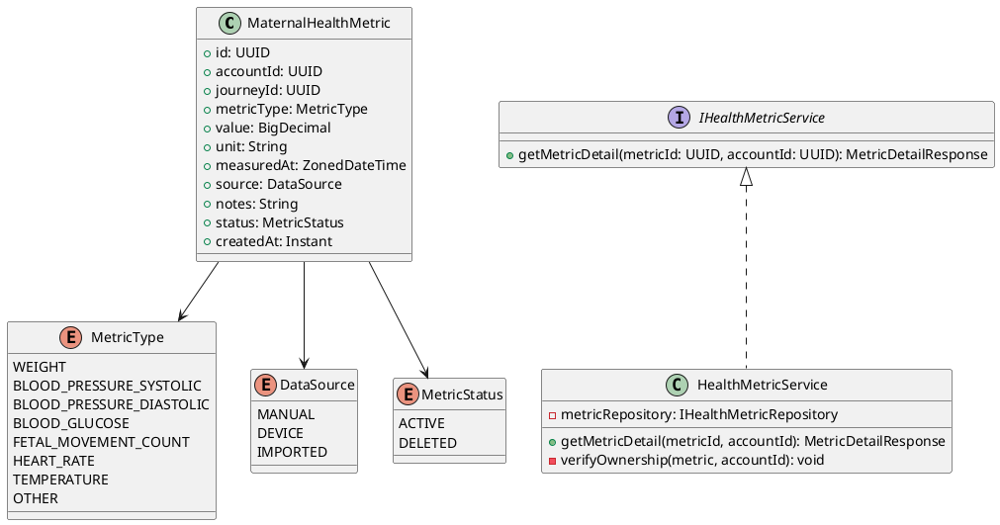
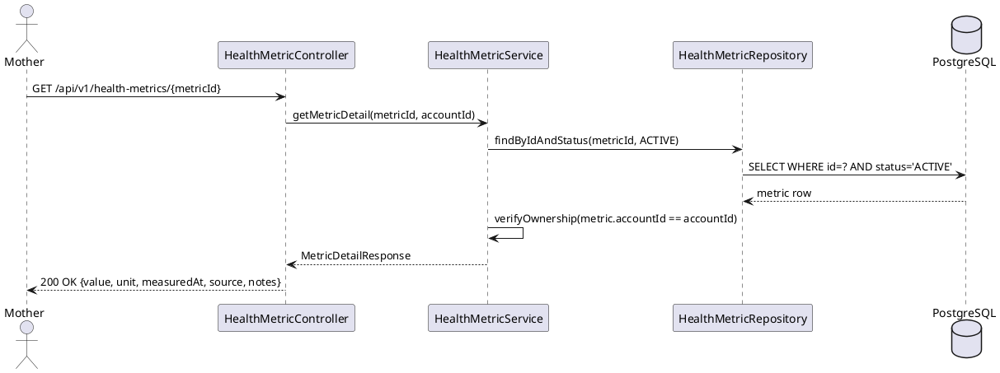
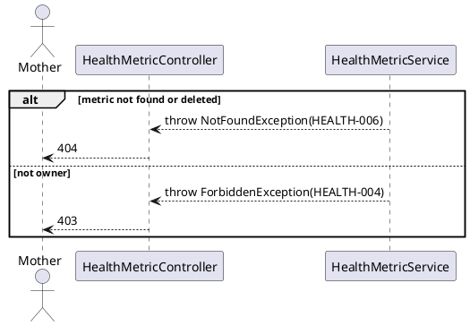

# ENGINEERING DOCUMENTATION STANDARD (EDS) v2.0
# Technical Design Specification — UC-187 View Maternal Health Metric Detail

| Field | Value |
|-------|-------|
| **Document ID** | `CB-HEALTH-IMP-002` |
| **Version** | `1.0` |
| **Date** | `2026-06-26` |
| **Status** | `Partially Implemented` |
| **Document Owner** | `PhuongNT` |
| **Author** | `AI Agent` |
| **Reviewed by** | `[Tech Lead]` |
| **DPO Sign-off** | `[ ] Pending` |
| **Approved by** | `[Principal Architect]` |
| **Last Review** | `2026-06-26` |
| **Based on EDS** | `v2.0` |

---

## CHANGELOG


| Ngày | Người thực hiện | Nội dung thay đổi |
|------|-----------------|-------------------|
| 2026-07-10 | AI Agent | Implementation status updated to Partially Implemented: targeted health backend tests PASS; full regression remains blocked by non-health Family/Exercise failures. |
| 2026-06-27 | AI Agent — Amelia (Dev Agent) | Implementation completed — service, controller, tests 🟢 GREEN (45/45) |
| 2026-06-26 | AI Agent | Tạo tài liệu lần đầu cho UC-187 View Maternal Health Metric Detail |

---

## MỤC LỤC

1. [Tổng quan Module](#1-tổng-quan-module)
2. [Ma trận Truy vết](#2-ma-trận-truy-vết)
3. [Architecture Decision Records](#3-architecture-decision-records)
4. [Non-Functional Requirements & SLA](#4-non-functional-requirements--sla)
5. [Static Modeling](#5-static-modeling)
6. [Dynamic Modeling](#6-dynamic-modeling)
7. [Domain Event Catalog](#7-domain-event-catalog)
8. [Interface Specification](#8-interface-specification)
9. [API Specification](#9-api-specification)
10. [Bảng mã lỗi](#10-bảng-mã-lỗi)
11. [Quy trình Triển khai](#11-quy-trình-triển-khai)
12. [Rollback & Incident Runbook](#12-rollback--incident-runbook)
13. [Kịch bản Kiểm thử](#13-kịch-bản-kiểm-thử)
14. [Phương pháp Xác minh](#14-phương-pháp-xác-minh)
15. [Mẫu thử thực tế](#15-mẫu-thử-thực-tế)
16. [Authorization Matrix](#16-authorization-matrix)
17. [AI Prompt Constraints](#17-ai-prompt-constraints-case-20)

---

## 1. Tổng quan Module

| Field | Value |
|-------|-------|
| **Module Name** | `ViewMaternalHealthMetricDetail` |
| **Bounded Context** | `health` |
| **UC ID** | `UC-187` |
| **SRS Reference** | `3.3.11.1` |
| **Primary Actor** | `Mother (ROLE_MOTHER)` |
| **Platform** | `Mobile App` |
| **Data Classification** | `Sensitive-PII` |
| **Compliance Scope** | `BR-RBAC, BR-PRIVACY, BR-SAFETY` |
| **Upstream Dependencies** | `auth, health (maternal_health_metrics table)` |
| **Downstream Consumers** | `health trend view, expert consultation` |

**Mô tả:** Hiển thị chi tiết một bản ghi sức khỏe mẹ bầu: giá trị đo (value), đơn vị (unit), timestamp, nguồn (manual/device), và ghi chú. Hệ thống KHÔNG được chẩn đoán hay đưa ra kết luận y tế từ số liệu này (BR-SAFETY).

---

## 2. Ma trận Truy vết

| Requirement ID | Loại | Mô tả | Thành phần Code | Compliance Target | ADR liên quan |
|----------------|------|-------|-----------------|-------------------|---------------|
| UC-187 | Use Case | Mother xem chi tiết maternal metric | `HealthMetricController.getMetricDetail()` | BR-RBAC | ADR-HEALTH-003 |
| BR-HEALTH-010 | Business Rule | Chỉ owner của metric mới xem được | `@PreAuthorize owner check` | BR-PRIVACY | ADR-HEALTH-003 |
| BR-SAFETY-001 | Business Rule | Response không chứa diagnosis/medical advice | Policy trong response mapping | BR-SAFETY | — |
| BR-HEALTH-011 | Business Rule | Metric đã soft-deleted không visible | `status = 'ACTIVE' filter` | Data Integrity | — |

---

## 3. Architecture Decision Records

### ADR-HEALTH-003 — Owner-only access cho health metrics

| Field | Value |
|-------|-------|
| **Status** | `Accepted` |
| **Date** | `2026-06-26` |

#### Quyết định
Maternal health metrics chứa sensitive health data. Chỉ `accountId` owner mới được đọc. Expert chỉ được xem nếu có consent share (future UC). Admin xem được tất cả cho moderation mục đích.

---

## 4. Non-Functional Requirements & SLA

| Category | Requirement | Target |
|----------|-------------|--------|
| Latency (p99) | GET response | `< 200ms` |
| Cache | Single record | No cache (PII) |

---

## 5. Static Modeling

### 5.1. Class Diagram



### 5.2. Data Structure (reference — assumed existing or new migration)

```sql
-- V26__create_maternal_health_metrics.sql (nếu chưa tồn tại)
CREATE TYPE metric_type_enum AS ENUM (
  'WEIGHT','BLOOD_PRESSURE_SYSTOLIC','BLOOD_PRESSURE_DIASTOLIC',
  'BLOOD_GLUCOSE','FETAL_MOVEMENT_COUNT','HEART_RATE','TEMPERATURE','OTHER'
);
CREATE TYPE data_source_enum AS ENUM ('MANUAL','DEVICE','IMPORTED');
CREATE TYPE metric_status_enum AS ENUM ('ACTIVE','DELETED');

CREATE TABLE maternal_health_metrics (
  id           UUID               PRIMARY KEY DEFAULT gen_random_uuid(),
  account_id   UUID               NOT NULL,
  journey_id   UUID,
  metric_type  metric_type_enum   NOT NULL,
  value        NUMERIC(10,4)      NOT NULL,
  unit         VARCHAR(20)        NOT NULL,
  measured_at  TIMESTAMPTZ        NOT NULL,
  source       data_source_enum   NOT NULL DEFAULT 'MANUAL',
  notes        TEXT,
  status       metric_status_enum NOT NULL DEFAULT 'ACTIVE',
  created_at   TIMESTAMPTZ        NOT NULL DEFAULT NOW(),
  created_by   UUID               NOT NULL,

  CONSTRAINT fk_metric_account FOREIGN KEY (account_id) REFERENCES accounts(id)
);

CREATE INDEX idx_metric_account_id ON maternal_health_metrics(account_id);
CREATE INDEX idx_metric_type ON maternal_health_metrics(metric_type);
CREATE INDEX idx_metric_measured_at ON maternal_health_metrics(measured_at DESC);
```

---

## 6. Dynamic Modeling

### 6.1. Sequence Diagram — Happy Path



### 6.2. Error Path — Not Found or Not Owner



---

## 7. Domain Event Catalog

No events published for read-only operations.

---

## 8. Interface Specification

```java
// MetricDetailResponse.java
public class MetricDetailResponse {
    private UUID id;
    private String metricType;
    private BigDecimal value;
    private String unit;
    private ZonedDateTime measuredAt;
    private String source;
    private String notes;
    private Instant createdAt;
    // NOTE: No diagnosis, no medical interpretation — BR-SAFETY
}

// IHealthMetricService.java
public interface IHealthMetricService {
    /**
     * @throws NotFoundException (HEALTH-006) when metric not found or deleted
     * @throws ForbiddenException (HEALTH-004) when caller is not owner
     */
    MetricDetailResponse getMetricDetail(UUID metricId, UUID accountId);
}
```

---

## 9. API Specification

| Method | Path | Auth Level | Required Roles | Rate Limit | Idempotent? |
|--------|------|------------|----------------|------------|-------------|
| `GET` | `/api/v1/health-metrics/{metricId}` | JWT Bearer | `ROLE_MOTHER` | 100/min | Yes |

**Response 200:**
```json
{
  "id": "uuid-v4",
  "metricType": "WEIGHT",
  "value": 65.5,
  "unit": "kg",
  "measuredAt": "2026-06-15T08:30:00+07:00",
  "source": "MANUAL",
  "notes": "Morning weight after breakfast"
}
```

---

## 10. Bảng mã lỗi

| Code | HTTP | Message (EN) | Trigger Condition |
|------|------|--------------|-------------------|
| `HEALTH-004` | 403 | Insufficient permissions | Caller not owner |
| `HEALTH-006` | 404 | Metric not found | ID not found or deleted |
| `HEALTH-007` | 500 | Internal error | DB error |

---

## 11. Quy trình Triển khai

1. Flyway `V26__create_maternal_health_metrics.sql` (nếu chưa tồn tại)
2. `MaternalHealthMetric` entity
3. `IHealthMetricRepository` với `findByIdAndStatus()`
4. `HealthMetricService.getMetricDetail()` với ownership check
5. `HealthMetricController.GET /api/v1/health-metrics/{id}`

---

## 12. Rollback & Incident Runbook

Đây là read-only endpoint — không cần DB rollback riêng. Schema rollback chỉ cần nếu migration V26 bị apply.

---

## 13. Kịch bản Kiểm thử

```gherkin
Feature: View Maternal Health Metric Detail
  Scenario: Happy path — owner views own metric
    Given Mother owns metric with id=X
    When GET /api/v1/health-metrics/X
    Then 200 with value, unit, measuredAt, source, notes
    And response does NOT contain diagnosis or medical advice

  Scenario: Metric not found → 404
    When GET /api/v1/health-metrics/non-existent-id
    Then response 404, error HEALTH-006

  Scenario: Another user's metric → 403
    Given metric belongs to different account
    When GET /api/v1/health-metrics/X
    Then response 403, error HEALTH-004

  Scenario: Deleted metric → 404
    Given metric has status DELETED
    When GET /api/v1/health-metrics/X
    Then response 404
```

---

## 14. Phương pháp Xác minh

```sql
SELECT id, metric_type, value, unit, measured_at, source, status
FROM maternal_health_metrics WHERE id = '[uuid]';
```

---

## 15. Mẫu thử thực tế

```bash
curl -X GET https://[host]/api/v1/health-metrics/[metricId] \
  -H "Authorization: Bearer [JWT_MOTHER_TOKEN]"
# Expected: 200 {metricType, value, unit, measuredAt}
```

---

## 16. Authorization Matrix

| Endpoint | `GUEST` | `MOTHER` | `EXPERT` | `ADMIN` |
|----------|---------|----------|----------|---------|
| `GET /api/v1/health-metrics/:id` | ❌ | ✅ Own | ❌ | ✅ All |

---

## 17. AI Prompt Constraints (CASE 2.0)

### 17.1 Constraint Summary Table

| # | Constraint | Source | Last Verified |
|---|-----------|--------|---------------|
| C1 | verifyOwnership() PHẢI throw 403 nếu caller != metric.accountId | ADR-HEALTH-003 | 2026-06-26 |
| C2 | Response KHÔNG được chứa bất kỳ diagnosis hay medical interpretation | BR-SAFETY | 2026-06-26 |
| C3 | Soft-deleted metrics (status=DELETED) phải trả về 404 | BR-HEALTH-011 | 2026-06-26 |
| C4 | accountId từ JWT — không từ URL path | BR-RBAC | 2026-06-26 |
| C5 | Read-only endpoint — không có side effects | — | 2026-06-26 |

### 17.2 Constraint Injection Block

```
[CONSTRAINT BLOCK — Module: ViewMaternalHealthMetricDetail (CB-HEALTH-IMP-002)]
1. verifyOwnership() PHẢI throw 403 nếu caller != metric.accountId — ADR-HEALTH-003
2. Response KHÔNG chứa diagnosis hay medical interpretation — BR-SAFETY
3. Soft-deleted metrics (status=DELETED) PHẢI trả về 404, KHÔNG trả data — BR-HEALTH-011
4. accountId từ JWT SecurityContext, KHÔNG từ URL path — BR-RBAC
5. Read-only endpoint — KHÔNG có side effects (no audit event, no DB write)

[CONTEXT BLOCK]
- Bounded Context: health
- Data Classification: Sensitive-PII
- Error codes: §10 Error Codes Table
- Auth matrix: §16 Authorization Matrix
```

### 17.3 Constraint Quality Checklist

- [x] Mỗi constraint traceable về ADR hoặc BR cụ thể
- [x] Không có constraint generic
- [x] Constraint block có ≥ 3 constraints cụ thể

### 17.4 Anti-Pattern Detection

| AP-ID | Anti-Pattern | Dấu hiệu | Hành động |
|-------|-------------|-----------|----------|
| AP-AI-001 | Unconstrained Gen | Code không match constraint C1-C5 | Reject — inject lại constraints |
| AP-AI-003 | Implicit Decision | Code assume architecture không có ADR | Reject — viết ADR trước |
| AP-AI-005 | Hallucinated Contract | Code import không có trong §8 | Reject — verify contract |

---

## PHỤ LỤC

### A. Glossary (Thuật ngữ)

| Thuật ngữ | Định nghĩa |
|-----------|------------|
| MaternalHealthMetric | Chỉ số sức khỏe thai phụ — cân nặng, huyết áp, đường huyết, v.v. |
| Soft Delete | Đánh dấu status=DELETED thay vì xóa vật lý — bảo toàn audit trail |
| Ownership Verification | Kiểm tra quyền sở hữu metric — chỉ owner mới được xem chi tiết |

### B. Tài liệu tham chiếu

| Document | Path |
|----------|------|
| EDS v2.0 Template | `08_References/Template/PHASE-3_TDS.md` |

---

*EDS v2.1 — Tích hợp CASE 2.0 AI Prompt Constraints (§17).*
