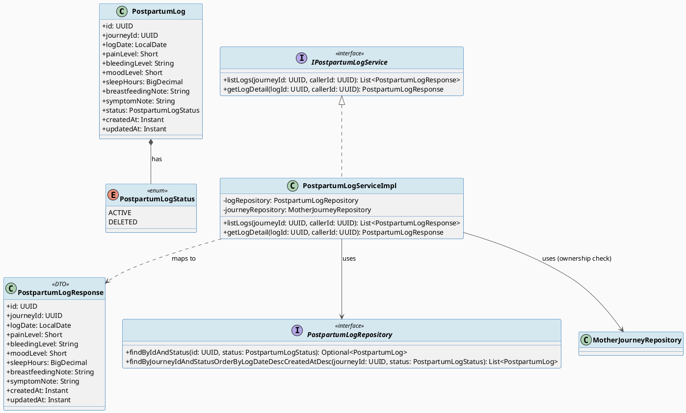
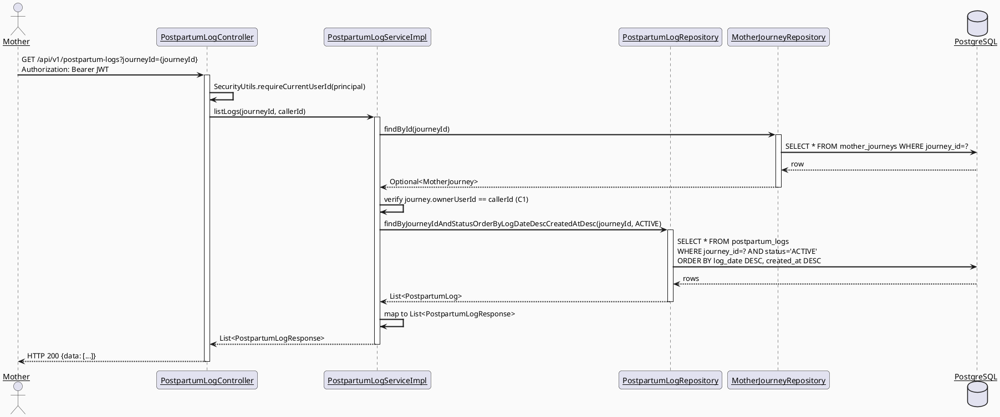
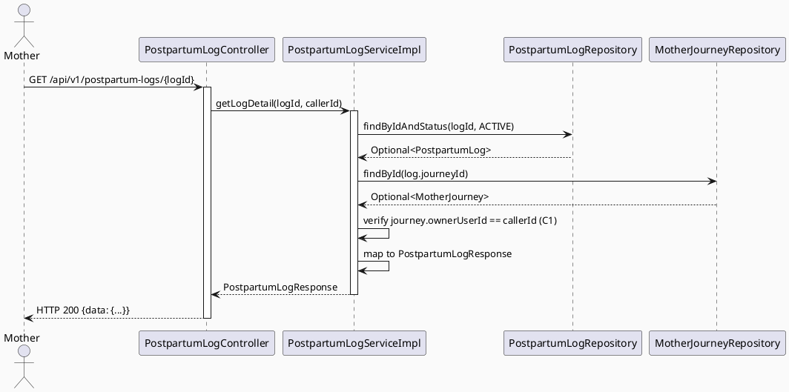
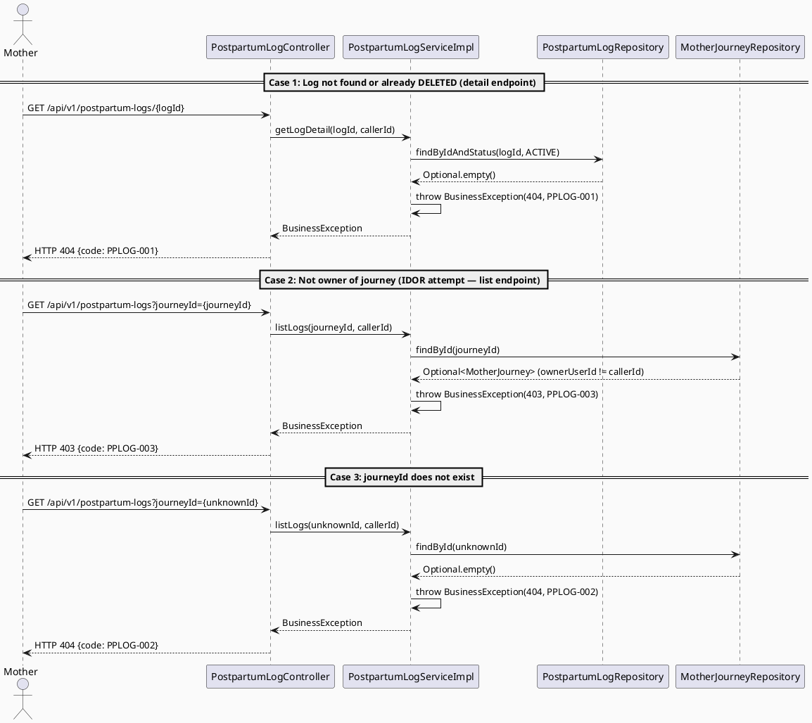
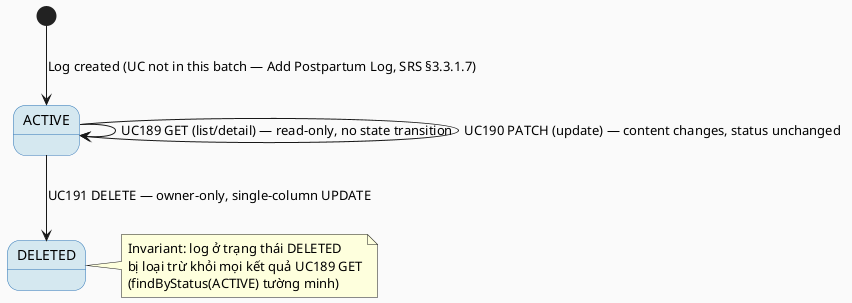

# ENGINEERING DOCUMENTATION STANDARD (EDS) v2.0
# UC189 — View Postpartum Logs

| Field | Value |
|-------|-------|
| **Document ID** | `CB-HEALTH-IMP-005` |
| **Version** | `1.0` |
| **Date** | `2026-07-03` |
| **Status** | `Draft` |
| **Document Owner** | `TV2-Bách` |
| **Author** | `AI Agent — Technical Architect` |
| **Reviewed by** | `[ ] Pending` |
| **DPO Sign-off** | `[ ] Pending` *(bắt buộc — module xử lý PII sức khỏe hậu sản)* |
| **Approved by** | `[ ] Pending` |
| **Last Review** | `2026-07-03` |
| **Based on EDS** | `v2.0` |

---

## CHANGELOG

| Ngày | Người thực hiện | Nội dung thay đổi |
|------|-----------------|-------------------|
| 2026-07-03 | AI Agent — Technical Architect | Tạo tài liệu lần đầu — TDS cho UC189 View Postpartum Logs (Draft) |

---

## MỤC LỤC

1. [Tổng quan Module](#1-tổng-quan-module)
2. [Ma trận Truy vết (Traceability Matrix)](#2-ma-trận-truy-vết-traceability-matrix)
3. [Architecture Decision Records (ADR)](#3-architecture-decision-records-adr)
4. [Non-Functional Requirements & SLA](#4-non-functional-requirements--sla)
5. [Static Modeling (Mô hình Tĩnh)](#5-static-modeling-mô-hình-tĩnh)
6. [Dynamic Modeling (Mô hình Động)](#6-dynamic-modeling-mô-hình-động)
7. [Domain Event Catalog](#7-domain-event-catalog)
8. [Interface Specification (Đặc tả Giao diện)](#8-interface-specification-đặc-tả-giao-diện)
9. [API Specification](#9-api-specification)
10. [Bảng mã lỗi (Error Codes)](#10-bảng-mã-lỗi-error-codes)
11. [Quy trình Triển khai (Step-by-Step)](#11-quy-trình-triển-khai-step-by-step)
12. [Rollback & Incident Runbook](#12-rollback--incident-runbook)
13. [Kịch bản Kiểm thử Chi tiết](#13-kịch-bản-kiểm-thử-chi-tiết)
14. [Phương pháp Xác minh](#14-phương-pháp-xác-minh)
15. [Mẫu thử thực tế (API Verification Samples)](#15-mẫu-thử-thực-tế-api-verification-samples)
16. [Bảng tổng hợp phân quyền (Authorization Matrix)](#16-bảng-tổng-hợp-phân-quyền-authorization-matrix)
17. [AI Prompt Constraints (CASE 2.0)](#17-ai-prompt-constraints-case-20)

---

## 1. Tổng quan Module

> UC189 cho phép Mother xem danh sách các `postpartum_logs` record thuộc journey hiện hành của mình theo thời gian (`log_date`), và xem chi tiết từng bản ghi. Đây là UC **nền móng (foundational)** cho cụm CRUD Postpartum Log: UC189 (View) → UC190 (Update) → UC191 (Delete). Toàn bộ entity/enum/repository mới được tạo trong UC189 sẽ được UC190 và UC191 **tái sử dụng hoàn toàn** — không entity/repository trùng lặp.

| Field | Value |
|-------|-------|
| **Module Name** | `View Postpartum Logs` |
| **Bounded Context** | `health` (mở rộng bounded context đã có từ UC187/UC188 — xem ADR-PPLOG-001 §3) |
| **Data Classification** | `Sensitive-PII` |
| **Compliance Scope** | `PDPA / Luật 91/2025` |
| **Upstream Dependencies** | `journey.MotherJourneyRepository` (ownership check), `IAM (JWT)` |
| **Downstream Consumers** | `UC190 UpdatePostpartumLog`, `UC191 DeletePostpartumLog` (tái sử dụng entity/repository của UC189), tương lai: trend/dashboard views hậu sản (out-of-scope hiện tại) |

**Nguồn gốc & phạm vi:**
- Function spec: `02_Requirements/SRS/3_Functional_Specification.md §3.3.11.3` (dòng 4068-4087), UC-189.
- Description gốc: "Displays postpartum recovery logs and details over time."
- **In-scope:**
  1. Liệt kê tất cả `postpartum_logs` (`status = ACTIVE`) thuộc 1 `journey_id`, sắp xếp theo `log_date DESC` (mới nhất trước — "over time" view).
  2. Xem chi tiết 1 bản ghi cụ thể theo `postpartum_log_id`.
  3. Verify ownership qua `journey.owner_user_id` cho cả 2 luồng trên (IDOR guard).
- **Out-of-scope:** Tạo mới log (Add Postpartum Log — SRS §3.3.1.7, thuộc UC khác, không nằm trong phạm vi TV2-Bách batch này); phân tích xu hướng / biểu đồ (trend charting) — chỉ trả dữ liệu thô; phân trang nâng cao (infinite scroll) — dùng `LIMIT` đơn giản, đánh dấu **Open** nếu volume lớn trong tương lai.

**Open Items:**
- **OPEN-189-01:** SRS không định nghĩa rõ giới hạn số lượng log trả về hoặc cơ chế phân trang (pagination). Quyết định tạm thời (§3 ADR-PPLOG-002): trả toàn bộ log ACTIVE của 1 journey, không phân trang, vì tần suất nhập log hậu sản thấp (thường ≤ 1 log/ngày, chu kỳ hậu sản ~6-8 tuần → tối đa ~60 record/journey). Cần Product Owner xác nhận nếu có yêu cầu phân trang trong sprint sau.

---

## 2. Ma trận Truy vết (Traceability Matrix)

| Requirement ID | Loại (BR/ADR/US) | Mô tả yêu cầu | Thành phần Code | Compliance Target | ADR liên quan |
|----------------|------------------|---------------|-----------------|-------------------|---------------|
| UC-189 (SRS §3.3.11.3) | User Story | Mother xem danh sách + chi tiết postpartum logs theo thời gian | `PostpartumLogController.GET /api/v1/postpartum-logs`, `GET /{logId}` | — | ADR-PPLOG-001 |
| PRE-3 / BR-RBAC | Business Rule | Chỉ Mother sở hữu journey mới xem được log của journey đó | `PostpartumLogServiceImpl.listLogs()` / `.getLogDetail()` | — | — |
| BR-PRIVACY | Business Rule | Truy cập dữ liệu sức khỏe hậu sản phải theo nguyên tắc minimum-necessary, không leak log đã xóa | `findByJourneyIdAndStatus(..., ACTIVE)` / `findByIdAndStatus(..., ACTIVE)` | PDPA | ADR-PPLOG-001 |
| BR-SAFETY | Business Rule | Dữ liệu hiển thị (pain/bleeding/mood) không kèm suy diễn chẩn đoán — chỉ trả raw values | `PostpartumLogResponse` (không có trường `riskLevel`/`diagnosis`) | — | — |
| E1 (Exceptions) | Exception Flow | Access denied khi không sở hữu journey | `PostpartumLogController` (403, `PPLOG-003`) | — | — |
| AF2 (Alternative Flow) | Alternative Flow | Không có log nào → trả empty list (không lỗi) | `PostpartumLogServiceImpl.listLogs()` (200, `[]`) | — | — |
| POST-3 | Postcondition | Sensitive read không bắt buộc audit log (nhất quán UC187 — xem ADR-PPLOG-003) | — | — | ADR-PPLOG-003 |

---

## 3. Architecture Decision Records (ADR)

### ADR-PPLOG-001 — Reuse `health` bounded context for `PostpartumLog` (không tạo package `postpartum` riêng)

| Field | Value |
|-------|-------|
| **Status** | `Accepted` |
| **Deciders** | `AI Agent — Technical Architect (TV2-Bách delegation)` |
| **Date** | `2026-07-03` |
| **Supersedes** | — |

#### Bối cảnh (Context)
`postpartum_logs` là dữ liệu sức khỏe hậu sản do Mother nhập, gắn với `mother_journeys` (FK `journey_id`) — giống hệt mô hình quan hệ của `maternal_health_metrics` (UC187/UC188). Cần quyết định: tạo package domain mới `com.carebridge.backend.postpartum`, hay mở rộng package `health` đã có (`com.carebridge.backend.health`).

#### Các phương án đã xem xét (Options Considered)

| Phương án | Mô tả | Ưu điểm | Nhược điểm |
|-----------|-------|----------|------------|
| A | Package mới `postpartum` (controller/service/repository/entity riêng) | Tách biệt rõ ràng theo entity | Trùng lặp wiring (SecurityUtils pattern, exception handling, ownership-check helper); vi phạm "smallest scoped change" (CLAUDE.md); vỡ tính nhất quán bounded-context "health" đã thiết lập ở UC187/UC188 |
| B | Mở rộng package `health` hiện có — thêm `PostpartumLogController/ServiceImpl/Repository/Entity` cùng cấp với `HealthMetricController` | Nhất quán bounded context, tái sử dụng convention đặt tên, tái sử dụng `MotherJourneyRepository` injection pattern đã kiểm chứng ở UC187/UC188, giảm thiểu code review surface | Package `health` phình to hơn theo thời gian (chấp nhận được — vẫn tách theo layer bên trong) |

#### Quyết định (Decision)
Chọn **Phương án B** — mở rộng `com.carebridge.backend.health`. Postpartum Log và Maternal Health Metric cùng thuộc miền nghiệp vụ "dữ liệu sức khỏe do Mother tự nhập trong Care Journey" (Bounded Context: `health`), cùng pattern ownership (`journeyId → MotherJourney.ownerUserId`), cùng compliance scope (PDPA/Sensitive-PII). Tách package riêng chỉ vì tên entity khác nhau là **over-engineering** so với CLAUDE.md's "smallest scoped change" rule.

#### Hệ quả (Consequences)

**Tích cực:**
- Tái sử dụng 100% pattern ownership-check, `SecurityUtils.requireCurrentUserId()`, `BusinessException` convention từ UC187/UC188.
- Package `health` trở thành nơi tập trung mọi "Mother self-entered health data" — dễ audit tổng thể cho DPO.

**Tiêu cực / Trade-offs:**
- Không có ranh giới module cứng giữa Metric và PostpartumLog — chấp nhận vì cả hai đều nhỏ, đơn giản (CRUD + ownership).

**Compliance Impact:**
- Không ảnh hưởng PDPA — ownership-check logic giống hệt pattern đã accepted ở UC188.

### ADR-PPLOG-002 — Không phân trang (no pagination) cho `GET /api/v1/postpartum-logs`

| Field | Value |
|-------|-------|
| **Status** | `Proposed` *(chờ Product Owner xác nhận — xem OPEN-189-01)* |
| **Deciders** | `AI Agent — Technical Architect` |
| **Date** | `2026-07-03` |

#### Bối cảnh (Context)
SRS §3.3.11.3 không đặc tả rõ hành vi khi số lượng log lớn. Frequency of Use là `Frequent` (Mother có thể vào xem thường xuyên), nhưng volume dữ liệu nhập (log hậu sản) là thấp.

#### Các phương án đã xem xét (Options Considered)

| Phương án | Mô tả | Ưu điểm | Nhược điểm |
|-----------|-------|----------|------------|
| A | Trả toàn bộ list, sort DESC theo `log_date`, không phân trang | Đơn giản, đủ dùng cho volume thấp (~60 record/journey max theo chu kỳ hậu sản 6-8 tuần) | Không scale nếu tương lai mở rộng chu kỳ theo dõi |
| B | `?page=&size=` cursor/offset pagination | Scale tốt hơn | Over-engineering cho volume thực tế hiện tại; thêm complexity không cần thiết |

#### Quyết định (Decision)
Chọn **Phương án A** cho phạm vi UC189 hiện tại — dữ liệu hậu sản có giới hạn thời gian theo dõi tự nhiên (postpartum period ~6-8 tuần). Đánh dấu **Open** để Product Owner xác nhận; nếu cần pagination, tạo ADR mới không phá vỡ contract hiện tại (backward-compatible bằng optional query params).

#### Hệ quả (Consequences)

**Tích cực:** Triển khai nhanh, đúng "smallest scoped change".

**Tiêu cực / Trade-offs:** Cần giám sát response size trong production; nếu > 200 record/journey xuất hiện bất thường (data quality issue), cần điều tra riêng — không phải use case chuẩn.

### ADR-PPLOG-003 — Không phát domain event cho luồng đọc (View/List)

| Field | Value |
|-------|-------|
| **Status** | `Accepted` |
| **Deciders** | `AI Agent — Technical Architect` |
| **Date** | `2026-07-03` |

#### Bối cảnh (Context)
POST-3 (SRS) nói "Sensitive actions are recorded for audit... where required". UC187 (View Maternal Health Metric Detail) — sibling read-only UC cùng bounded context — **không** phát event nào (`HealthMetricServiceImpl.getMetricDetail()` không gọi `eventPublisher`). Cần quyết định UC189 có nên khác biệt không.

#### Các phương án đã xem xét (Options Considered)

| Phương án | Mô tả | Ưu điểm | Nhược điểm |
|-----------|-------|----------|------------|
| A | Không publish event cho GET (list/detail) | Nhất quán tuyệt đối với UC187 | Không có audit trail cho hành vi "xem" |
| B | Publish `PostpartumLogViewed` cho mỗi lần GET | Đầy đủ audit trail | Volume event cao (Frequent usage), không nhất quán với UC187, chưa có consumer nào cần data này |

#### Quyết định (Decision)
Chọn **Phương án A** — nhất quán với pattern UC187 đã Accepted. HTTP access logs (do infra layer ghi, ngoài phạm vi application code) đã đủ cho audit truy cập ở mức "ai gọi API nào lúc nào". Nếu DPO yêu cầu audit trail chi tiết hơn cho hành vi xem dữ liệu sức khỏe, cần ADR riêng áp dụng đồng loạt cho cả UC187 và UC189 (không tạo ngoại lệ cục bộ).

#### Hệ quả (Consequences)

**Tích cực:** Nhất quán pattern toàn bounded context `health`; không tạo asymmetry khó giải thích khi audit.

**Tiêu cực / Trade-offs:** Nếu có yêu cầu compliance audit chi tiết hơn trong tương lai, cần refactor đồng loạt UC187 + UC189 — ghi nhận là technical debt được chấp nhận có chủ đích.

**Compliance Impact:** PDPA không bắt buộc audit mọi lượt đọc dữ liệu cá nhân của chính chủ sở hữu (self-access) — chỉ bắt buộc với truy cập bởi bên thứ ba/nhân viên hệ thống.

---

## 4. Non-Functional Requirements & SLA

### 4.1. Performance & Availability

| Category | Requirement | Target SLA | Measurement Method | Compliance Basis |
|----------|-------------|------------|---------------------|------------------|
| Latency | API response (p99) — list | `< 300ms` | k6 load test | — |
| Latency | API response (p99) — detail | `< 200ms` | k6 load test | — |
| Availability | Uptime (monthly) | `99.9%` | Uptime monitor | — |
| Throughput | Concurrent requests | `300 req/s` (Frequency of Use: Frequent) | Load test | — |

### 4.2. Data Integrity & Retention

| Category | Requirement | Target | Verification Method | Compliance Basis |
|----------|-------------|--------|---------------------|------------------|
| Consistency | List luôn loại trừ `status = DELETED` | 100% | Repository test | — |
| Correctness | Sort order `log_date DESC` ổn định (tie-break `created_at DESC`) | 100% | Unit test boundary | — |

### 4.3. Security

| Category | Requirement | Target | Verification Method | Compliance Basis |
|----------|-------------|--------|---------------------|------------------|
| Access control | Chỉ owner của journey mới GET được log của journey đó (IDOR guard) | 100% requests từ non-owner → 403 | Security test §13.3 | GDPR Art. 25 |
| Minimum necessary | Response không kèm field chẩn đoán/diễn giải y khoa | 100% | Contract test trên DTO | BR-SAFETY |
| Encryption in transit | Toàn bộ endpoint | TLS 1.3+ | SSL Labs scan | GDPR Art. 32 |

### 4.4. Scalability & Capacity Planning

> Tải dự kiến: `Frequent` (theo SRS) nhưng volume dữ liệu/journey nhỏ (§3 ADR-PPLOG-002). Dùng chung connection pool/service layer pattern với UC187/UC188. Không cần cache layer ở giai đoạn này — có thể bổ sung read-through cache nếu latency vượt SLA trong production.

---

## 5. Static Modeling (Mô hình Tĩnh)

### 5.1. Class Diagram (PlantUML)



### 5.2. Data Structure (Flyway SQL Migration)

> **GAP xác nhận:** Bảng `postpartum_logs` đã tồn tại từ `V1__init_schema.sql` (dòng 588-600) với các cột: `postpartum_log_id (PK, uuid)`, `journey_id (FK -> mother_journeys, NOT NULL)`, `log_date (date, NOT NULL)`, `pain_level (smallint, nullable)`, `bleeding_level (varchar(20), nullable)`, `mood_level (smallint, nullable)`, `sleep_hours (numeric, nullable)`, `breastfeeding_note (text, nullable)`, `symptom_note (text, nullable)`, `created_at`, `updated_at`. **KHÔNG có cột `status`** — cần migration mới để hỗ trợ soft-delete (dùng bởi UC191, nhưng phải được UC189 khai báo trước vì `PostpartumLogRepository.findByIdAndStatus`/`findByJourneyIdAndStatus` của UC189 phụ thuộc cột này để loại trừ log đã xóa khỏi kết quả xem).

```sql
-- V20260707091000__add_postpartum_log_status.sql
-- UC189/UC190/UC191: PostpartumLog soft-delete support
-- Mirrors ADR-HEALTH-004 pattern from UC187/UC188 (V20260627100200__add_maternal_metric_status.sql)
ALTER TABLE postpartum_logs
    ADD COLUMN IF NOT EXISTS status VARCHAR(20) NOT NULL DEFAULT 'ACTIVE';

CREATE INDEX IF NOT EXISTS idx_postpartum_logs_status ON postpartum_logs(status);
```

> **Quy tắc đặt tên:** Cột `status` dùng `VARCHAR(20)` snake_case, giá trị enum `ACTIVE|DELETED` — nhất quán 100% với `maternal_health_metrics.status` (UC187/UC188). Version `V20260707091000` nằm trong sub-range mới, không trùng với các version đã tồn tại (`V20260627xxxxxx`, `V20260628xxxxxx`, `V20260629xxxxxx`) và **không** dùng các range `100000`/`110000`/`120000`/`130000` đã được dự trữ cho batch khác.
> **Lưu ý triển khai (Phase 3 only):** Migration này **chưa được tạo file vật lý** — chỉ là đặc tả. File thực tế sẽ được tạo tại `05_Development/CareBridgeAPI/src/main/resources/db/migration/V20260707091000__add_postpartum_log_status.sql` khi TDS này được Approved và bước vào Phase 3 Implementation.

---

## 6. Dynamic Modeling (Mô hình Động)

### 6.1. Sequence Diagram — Happy Path: List Logs (PlantUML)



### 6.2. Sequence Diagram — Happy Path: Get Detail (PlantUML)



### 6.3. Sequence Diagram — Error Path (PlantUML)



### 6.4. State Machine



> **⚠️ Invariant bất biến:** UC189 (GET) không bao giờ thay đổi `status`. Chỉ UC191 (DELETE) mới transition `ACTIVE → DELETED`.

---

## 7. Domain Event Catalog

### 7.1. Events Published (Phát ra)

> **Không có** — theo ADR-PPLOG-003 (§3), luồng đọc (list/detail) không phát domain event, nhất quán với UC187.

| Event Name | Trigger | Publisher | Subscriber(s) | Payload Schema | Async? |
|------------|---------|-----------|---------------|----------------|--------|
| _(none)_ | — | — | — | — | — |

### 7.2. Events Consumed (Tiêu thụ)

| Event Name | Source | Handler | Action thực hiện |
|------------|--------|---------|------------------|
| _(none)_ | — | — | UC189 không tiêu thụ event từ module khác |

---

## 8. Interface Specification (Đặc tả Giao diện)

### 8.1. Service Interface

```java
// PostpartumLogResponse.java — Output DTO
// @version 1.0
public class PostpartumLogResponse {
    private UUID id;
    private UUID journeyId;
    private LocalDate logDate;
    private Short painLevel;          // nullable — 0-10 scale (Bean Validation applied on write path, not here)
    private String bleedingLevel;     // nullable — NONE|LIGHT|MODERATE|HEAVY (free-form varchar(20) at DB level)
    private Short moodLevel;          // nullable — 0-10 scale
    private BigDecimal sleepHours;    // nullable — 0-24
    private String breastfeedingNote; // nullable
    private String symptomNote;       // nullable
    private Instant createdAt;
    private Instant updatedAt;
    // getters / builder — no diagnosis/risk fields (BR-SAFETY minimum-necessary)
}

// IPostpartumLogService.java — Service Contract
// @version 1.0
public interface IPostpartumLogService {

    /**
     * UC189: Lists all ACTIVE postpartum logs for a journey, sorted by logDate DESC (most recent first).
     * @throws BusinessException (PPLOG-002/404) if journey does not exist
     * @throws BusinessException (PPLOG-003/403) if caller is not the journey owner
     */
    List<PostpartumLogResponse> listLogs(UUID journeyId, UUID callerId);

    /**
     * UC189: Returns detail for a single ACTIVE postpartum log.
     * @throws BusinessException (PPLOG-001/404) if not found or already deleted
     * @throws BusinessException (PPLOG-002/404) if parent journey missing (data integrity issue)
     * @throws BusinessException (PPLOG-003/403) if caller is not the journey owner
     */
    PostpartumLogResponse getLogDetail(UUID logId, UUID callerId);
}
```

### 8.2. Repository Interface

```java
// PostpartumLogRepository.java — new, created by UC189
// @version 1.0
public interface PostpartumLogRepository extends JpaRepository<PostpartumLog, UUID> {

    Optional<PostpartumLog> findByIdAndStatus(UUID id, PostpartumLogStatus status);

    List<PostpartumLog> findByJourneyIdAndStatusOrderByLogDateDescCreatedAtDesc(
            UUID journeyId, PostpartumLogStatus status);
    // save() inherited from JpaRepository — reused by UC190 (update) / UC191 (soft-delete)
}
```

---

## 9. API Specification

### 9.1. Endpoints Table

| Method | Path | Auth Level | Required Roles | Rate Limit | Idempotent? |
|--------|------|------------|----------------|------------|-------------|
| `GET` | `/api/v1/postpartum-logs?journeyId={journeyId}` | JWT Bearer | `MOTHER` | 300/min | Yes |
| `GET` | `/api/v1/postpartum-logs/{logId}` | JWT Bearer | `MOTHER` | 300/min | Yes |

### 9.2. Request / Response Schemas

#### `GET /api/v1/postpartum-logs?journeyId={journeyId}` — List logs

**Request Body:** none (query param `journeyId` required)

**Response — 200 OK (Happy Path):**
```json
{
  "data": [
    {
      "id": "550e8400-e29b-41d4-a716-446655440000",
      "journeyId": "5b3f...journey",
      "logDate": "2026-07-01",
      "painLevel": 3,
      "bleedingLevel": "LIGHT",
      "moodLevel": 6,
      "sleepHours": 5.5,
      "breastfeedingNote": "Đau khi cho bú bên trái",
      "symptomNote": "Không sốt",
      "createdAt": "2026-07-01T08:00:00.000Z",
      "updatedAt": "2026-07-01T08:00:00.000Z"
    }
  ]
}
```

**Response — 200 OK (Empty — AF2):**
```json
{ "data": [] }
```

**Response — 404 Not Found (journeyId does not exist):**
```json
{ "error": { "code": "PPLOG-002", "message": "Parent journey not found" } }
```

**Response — 403 Forbidden (not owner — IDOR guard):**
```json
{ "error": { "code": "PPLOG-003", "message": "Access denied to postpartum log" } }
```

#### `GET /api/v1/postpartum-logs/{logId}` — Get single log detail

**Response — 200 OK (Happy Path):** same shape as one item of the list array above.

**Response — 404 Not Found (deleted / never existed):**
```json
{ "error": { "code": "PPLOG-001", "message": "Postpartum log not found or deleted: {logId}" } }
```

---

## 10. Bảng mã lỗi (Error Codes)

> Tiền tố `PPLOG-` mới được thiết lập bởi UC189 — UC190/UC191 sẽ tái sử dụng cùng bảng mã lỗi này (không tạo prefix mới), nhất quán với cách UC188 tái sử dụng `METRIC-` từ UC187.

| Code | HTTP Status | Message (EN) | Message (VI) | Trigger Condition |
|------|-------------|--------------|--------------|-------------------|
| `PPLOG-001` | 404 | Postpartum log not found or deleted | Không tìm thấy hoặc đã bị xóa | `findByIdAndStatus(id, ACTIVE)` trả empty |
| `PPLOG-002` | 404 | Parent journey not found | Không tìm thấy hành trình liên kết | `journeyRepository.findById()` trả empty |
| `PPLOG-003` | 403 | Access denied to postpartum log | Không có quyền truy cập nhật ký hậu sản | `journey.ownerUserId != callerId` |
| `PPLOG-004` | 400 | Validation failed | Dữ liệu không hợp lệ | *(reserved cho UC190 — xem UC190 TDS §10)* |

---

## 11. Quy trình Triển khai (Step-by-Step)

### 11.1. Prerequisites

- [ ] ADR-PPLOG-001, ADR-PPLOG-003 đã Accepted; ADR-PPLOG-002 đã được Product Owner xác nhận (xem §3)
- [ ] DPO sign-off pending (module PII sức khỏe)
- [ ] TDS + Test-Spec approved bởi user (theo `implement-flow.md`)
- [ ] Migration `V20260707091000__add_postpartum_log_status.sql` đã chạy thành công trên staging trước khi deploy code

### 11.2. Pre-Migration Checklist

- [ ] Backup DB: `pg_dump -h $DB_HOST -U $DB_USER $DB_NAME > backup_YYYYMMDD.sql`
- [ ] Migration test trên staging: `ALTER TABLE postpartum_logs ADD COLUMN status ...` — verify không lock table lâu (bảng nhỏ, rủi ro thấp)
- [ ] Rollback script đã test trên staging (xem §12)

### 11.3. Implementation Steps

#### Chặng 1 — Flyway migration

```sql
-- V20260707091000__add_postpartum_log_status.sql (xem §5.2)
```

```bash
./mvnw flyway:migrate
```

#### Chặng 2 — Entity + Enum + Repository (mới)

```java
// PostpartumLog.java — entity mới, mirror MaternalHealthMetric pattern (@Entity, @Table("postpartum_logs"))
// PostpartumLogStatus.java — enum { ACTIVE, DELETED }
// PostpartumLogRepository.java — extends JpaRepository<PostpartumLog, UUID> (§8.2)
```

#### Chặng 3 — Service + Controller (mới)

```java
// IPostpartumLogService.java, PostpartumLogServiceImpl.java (§8.1)
// PostpartumLogController.java — @RequestMapping("/api/v1/postpartum-logs")
//   GET  ""          -> listLogs(journeyId, callerId)
//   GET  "/{logId}"  -> getLogDetail(logId, callerId)
```

Class-level `@Transactional(readOnly = true)` (toàn bộ UC189 là read-only).

#### Chặng 4 — Verification sau deploy

```bash
curl -X GET "https://[host]/api/v1/postpartum-logs?journeyId=[journeyId]" \
  -H "Authorization: Bearer [JWT_TOKEN]"
# Expected: 200, data: [...]
curl -X GET https://[host]/api/v1/postpartum-logs/[logId] \
  -H "Authorization: Bearer [JWT_TOKEN]"
# Expected: 200, data: {...}
```

### 11.4. Deployment Checklist

- [ ] `./mvnw test` xanh
- [ ] Health check 200
- [ ] Mobile: tạo `PostpartumLogService.listLogs()` / `.getLogDetail()` trong `05_Development/CareBridgeMobileApp/lib/features/healthRecords/services/` (mirror `health_metric_service.dart` pattern)
- [ ] Migration `V20260707091000` xuất hiện trong `flyway_schema_history`

---

## 12. Rollback & Incident Runbook

### 12.1. Điều kiện kích hoạt Rollback

| Điều kiện | Ngưỡng | Người quyết định |
|-----------|--------|------------------|
| Error rate tăng đột biến | > 5% trong 5 phút | On-call Engineer |
| Log của Mother A leak sang Mother B (IDOR) | Bất kỳ case nào | Tech Lead + DPO ngay lập tức |

### 12.2. Rollback Procedure

```bash
# Bước 1: Revert migration (nếu mới deploy)
psql -h $DB_HOST -U $DB_USER -d $DB_NAME \
  -c "ALTER TABLE postpartum_logs DROP COLUMN IF EXISTS status;"
psql -h $DB_HOST -U $DB_USER -d $DB_NAME \
  -c "DELETE FROM flyway_schema_history WHERE version = '20260707091000';"

# Bước 2: Re-deploy phiên bản cũ
kubectl rollout undo deployment/carebridge-api
kubectl rollout status deployment/carebridge-api
```

### 12.3. Notification Protocol

| Thời điểm | Người nhận | Kênh | Template |
|-----------|------------|------|----------|
| Ngay khi phát hiện | On-call team | Slack `#incident` | "🚨 UC189 incident: [mô tả]" |
| Trong 30 phút | DPO | Email | Bắt buộc — module PII |

### 12.4. Post-Incident Review (PIR)

> Bắt buộc hoàn thành PIR trong 48 giờ nếu có incident IDOR liên quan đến rò rỉ log hậu sản.

---

## 13. Kịch bản Kiểm thử Chi tiết

> Chi tiết đầy đủ nằm ở `UC189_ViewPostpartumLogs_Test-Spec.md`. Tóm tắt scope:

- Unit: `PostpartumLogServiceImpl.listLogs()` / `.getLogDetail()` — happy path, empty list (AF2), not-owner, journey-not-found, log-not-found/deleted.
- Integration: full GET flow qua Testcontainers PostgreSQL, verify sort order, verify DELETED log bị loại trừ.
- Security/E2E: IDOR — Mother B cố xem log/journey của Mother A → 403/404; unauthenticated → 401.

---

## 14. Phương pháp Xác minh

### 14.1. Database Inspection

```sql
-- Verify list excludes DELETED
SELECT postpartum_log_id, journey_id, log_date, status
FROM postpartum_logs
WHERE journey_id = '[uuid]'
ORDER BY log_date DESC, created_at DESC;
-- Expected: chỉ status='ACTIVE' xuất hiện
```

### 14.2. Log / Audit Verification

```bash
kubectl logs -l app=carebridge-api | grep '"path":"/api/v1/postpartum-logs"' | head -5
```

### 14.3. Tool-based Verification

```bash
echo "[JWT_TOKEN]" | cut -d'.' -f2 | base64 -d | jq .
```

---

## 15. Mẫu thử thực tế (API Verification Samples)

### 15.1. Happy Path

```bash
curl -X GET "https://[host]/api/v1/postpartum-logs?journeyId=5b3f0000-e29b-41d4-a716-446655440000" \
  -H "Authorization: Bearer [JWT_TOKEN]"
```

**Expected Response (200):** `{"data": [...]}`, sorted `log_date DESC`.

### 15.2. Error Paths

```bash
# Non-owner attempts list → 403
curl -X GET "https://[host]/api/v1/postpartum-logs?journeyId=[other-mother-journey-id]" \
  -H "Authorization: Bearer [JWT_TOKEN_MOTHER_B]"
```

**Expected Response (403):**
```json
{ "error": { "code": "PPLOG-003", "message": "Access denied to postpartum log" } }
```

```bash
# No JWT → 401
curl -X GET "https://[host]/api/v1/postpartum-logs?journeyId=[id]"
```

**Expected Response (401):**
```json
{ "error": { "code": "IAM-001", "message": "Authentication required" } }
```

---

## 16. Bảng tổng hợp phân quyền (Authorization Matrix)

| Endpoint | `GUEST` | `MOTHER` (own) | `MOTHER` (other's) | `FAMILY` | `SYSTEM_ADMIN` |
|----------|---------|-----------------|---------------------|----------|----------------|
| `GET /api/v1/postpartum-logs?journeyId=` | ❌ | ✅ Own | ❌ 403 | ❌ | ❌ (out of scope) |
| `GET /api/v1/postpartum-logs/{id}` | ❌ | ✅ Own | ❌ 403 | ❌ | ❌ |

**Chú thích:**
- ✅ = Được phép
- ❌ = Bị từ chối (403) hoặc không route tới (401 nếu unauthenticated)
- `Own` = Chỉ được phép với log/journey thuộc chính Mother đó (`journey.owner_user_id == callerId`)

---

## 17. AI Prompt Constraints (CASE 2.0)

### 17.1 Constraint Summary Table

| # | Constraint | Source (ADR/BR) | Last Verified |
|---|-----------|-----------------|---------------|
| C1 | Ownership resolved via `log.journeyId -> MotherJourney.ownerUserId == callerId`. KHÔNG có `owner_user_id` trực tiếp trên `postpartum_logs`. | ADR-PPLOG-001, BR-RBAC | 2026-07-03 |
| C2 | List/Detail PHẢI filter `status = ACTIVE` — dùng `findByJourneyIdAndStatus...`/`findByIdAndStatus`, KHÔNG dùng `findAll()`/`findById()` trần. | ADR-PPLOG-001, BR-PRIVACY | 2026-07-03 |
| C3 | Không phát domain event cho GET (list/detail) — nhất quán UC187. | ADR-PPLOG-003 | 2026-07-03 |
| C4 | Identity lấy từ `SecurityUtils.requireCurrentUserId(principal)` — không tự parse JWT trong Controller. | UC187/UC188 pattern | 2026-07-03 |
| C5 | Controller chỉ validate + map; toàn bộ ownership logic nằm trong `PostpartumLogServiceImpl`. | CLAUDE.md Architecture rules | 2026-07-03 |
| C6 | Response DTO (`PostpartumLogResponse`) KHÔNG được chứa trường chẩn đoán/diễn giải y khoa (`riskLevel`, `diagnosis`, ...). | BR-SAFETY | 2026-07-03 |

### 17.2 Constraint Injection Block (Copy-Paste vào AI Prompt)

```
[CONSTRAINT BLOCK — Module: View Postpartum Logs (UC189)]
Theo TDS CB-HEALTH-IMP-005 và các ADR liên quan:

1. Ownership qua log.journeyId -> MotherJourney.ownerUserId == callerId (KHÔNG có owner_user_id trực tiếp trên bảng postpartum_logs).
2. List/Detail phải filter status=ACTIVE — dùng findByJourneyIdAndStatus.../findByIdAndStatus, không findAll()/findById() trần.
3. Không publish domain event cho GET (nhất quán UC187).
4. Identity từ SecurityUtils.requireCurrentUserId(principal).
5. Controller chỉ validate/map; logic nằm ở Service.
6. Response DTO không chứa trường chẩn đoán/diễn giải y khoa.

[CONTEXT BLOCK]
- Bounded Context: health
- Data Classification: Sensitive-PII
- Compliance: PDPA / Luật 91/2025
- Existing interfaces: §8 Service Interface + §8.2 Repository Interface
- Error codes: §10 Error Codes Table (PPLOG-001/002/003)
- Auth matrix: §16 Authorization Matrix

[TASK BLOCK]
Implement listLogs()/getLogDetail() thỏa mãn constraints trên.
Output phải tuân thủ §8 Interface Specification.
Tests phải cover §13 Test Scenarios (xem Test-Spec).
```

### 17.3 Constraint Quality Checklist

- [x] Mỗi constraint traceable về ADR hoặc BR cụ thể
- [x] Không có constraint generic
- [x] Mỗi constraint có `Last Verified` date ≤ 2 sprints
- [x] Constraint block có ≥ 3 constraints cụ thể
- [x] Constraint block reference §8 Interface
- [x] Constraint block reference §16 Auth Matrix

### 17.4 Anti-Pattern Detection (cho AI-Generated Code từ Block này)

| AP-ID | Anti-Pattern | Dấu hiệu | Hành động |
|-------|-------------|-----------|----------|
| AP-AI-001 | Unconstrained Gen | Code không match C1-C6 | Reject — inject lại constraints |
| AP-AI-003 | Implicit Decision | Code assume `owner_user_id` tồn tại trực tiếp trên `postpartum_logs` | Reject — dùng journey join |
| AP-AI-005 | Hallucinated Contract | Code gọi `repository.findAll()` không filter status | Reject — dùng `findByStatus` variants |

---

## PHỤ LỤC

### A. Glossary (Thuật ngữ)

| Thuật ngữ | Định nghĩa |
|-----------|------------|
| Postpartum period | Giai đoạn hậu sản, thường kéo dài 6-8 tuần sau sinh |
| Soft-delete | Đánh dấu record là đã xóa qua cột `status` thay vì xóa vật lý khỏi DB |
| IDOR | Insecure Direct Object Reference — truy cập resource của người khác qua đoán ID |
| PII | Personally Identifiable Information |

### B. Tài liệu tham chiếu

| Document | Link / Path |
|----------|-------------|
| SRS §3.3.11.3 | `02_Requirements/SRS/3_Functional_Specification.md` (dòng 4068-4087) |
| UC187/UC188 TDS/code | `05_Development/CareBridgeAPI/src/main/java/com/carebridge/backend/health/`, `04_Implement/UC188_DeleteMaternalHealthMetric/UC188_DeleteMaternalHealthMetric_TDS.md` |
| Schema baseline | `05_Development/CareBridgeAPI/src/main/resources/db/migration/V1__init_schema.sql` (dòng 588-600), `V20260627100200__add_maternal_metric_status.sql` |
| Task allocation | `04_Implement/implement_artifacts/function-spec-task-allocation.md` (dòng 670-694) |

---

*EDS v2.1 — CASE 2.0 constraints applied. Status: Draft — pending user review/approval per `.claude/rules/implement-flow.md`.*
