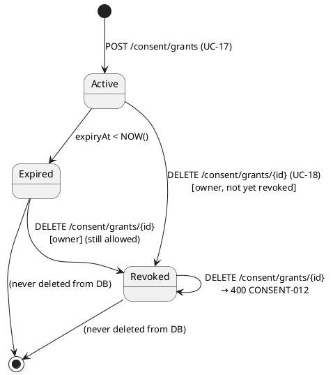
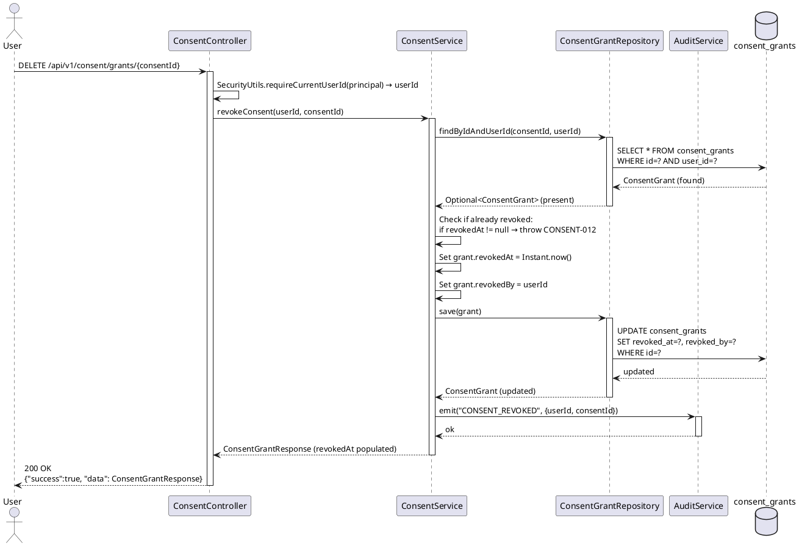
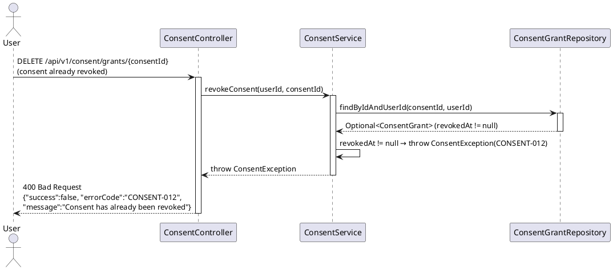
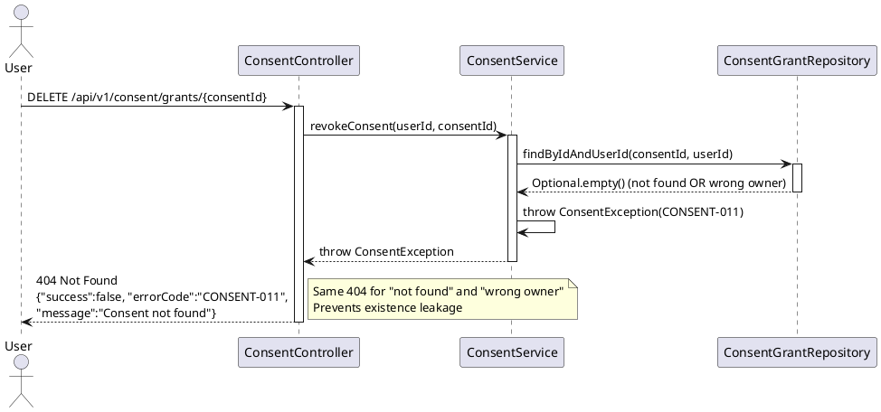

# UC18 — Revoke Data Permission: Technical Design Specification

| Field            | Value                              |
|------------------|------------------------------------|
| Document ID      | CB-CONSENT-IMP-018                 |
| Version          | 1.0                                |
| Date             | 2026-06-26                         |
| Status           | Implemented         |
| Document Owner   | PhuongNT                           |
| Author           | AI Agent                           |
| Based on EDS     | v2.0                               |
| SRS Reference    | 3.1.1.18                           |
| Bounded Context  | consent                            |

---

## 1. Tổng Quan (Overview)

### 1.1 Feature Summary

UC-18 **Revoke Data Permission** cho phép người dùng đã xác thực thu hồi một consent grant mà họ đã cấp trước đó. Hệ thống thực hiện **soft revoke** bằng cách set `revokedAt = NOW()` và `revokedBy = userId` trên record `ConsentGrant` hiện có — không xóa record khỏi database.

- **Bounded Context**: `consent`
- **SRS Reference**: §3.1.1.18
- **Actors**: User (authenticated, any role with consent ownership)
- **Compliance**: GDPR Art. 7 (right to withdraw consent)

### 1.2 Business Context

GDPR Article 7(3) quy định: *"The data subject shall have the right to withdraw his or her consent at any time."* Việc thu hồi phải:
1. Có hiệu lực ngay lập tức
2. Không xóa audit trail (soft revoke, không hard delete)
3. Chỉ được thực hiện bởi chủ sở hữu consent (không phải grantee)
4. Phát audit event `CONSENT_REVOKED`

### 1.3 Status: Existing Implementation

> **Lưu ý quan trọng**: Endpoint `DELETE /api/v1/consent/grants/{consentId}` và logic nghiệp vụ đã được triển khai đầy đủ. TDS này ghi lại thiết kế hiện có.

---

## 2. Traceability

### 2.1 Business Rules

| Rule ID          | Description                                                                            |
|------------------|----------------------------------------------------------------------------------------|
| BR-CONSENT-010   | Chỉ chủ sở hữu (userId == consent.userId) mới có thể revoke — grantee không thể revoke |
| BR-CONSENT-011   | Consent đã bị revoke (revokedAt IS NOT NULL) không thể revoke lại — 400 CONSENT-012   |
| BR-CONSENT-012   | Mỗi lần revoke thành công phải phát audit event `CONSENT_REVOKED`                     |
| BR-RBAC          | Người dùng phải authenticated; role không giới hạn nhưng phải là owner                |
| BR-PRIVACY       | Soft revoke giữ audit trail cho compliance — không xóa cứng                           |

### 2.2 SRS Mapping

| SRS ID       | Requirement                                  | Implemented By                        |
|--------------|----------------------------------------------|---------------------------------------|
| UC-18        | Revoke Data Permission                       | `ConsentController.revokeConsent()`   |
| UC-18-FR-01  | Verify ownership before revoke               | `ConsentService.revokeConsent()`      |
| UC-18-FR-02  | Check if already revoked                     | `ConsentService.revokeConsent()`      |
| UC-18-FR-03  | Set revokedAt = NOW(), revokedBy = userId    | Service layer mutation                |
| UC-18-FR-04  | Emit CONSENT_REVOKED audit                   | `AuditService.emit()`                 |

### 2.3 Compliance Mapping

| Standard       | Clause          | Requirement                                       | Implementation                       |
|----------------|-----------------|---------------------------------------------------|--------------------------------------|
| GDPR           | Art. 7(3)       | Right to withdraw consent at any time             | DELETE endpoint, immediate effect    |
| GDPR           | Art. 17         | Right to erasure (partial — soft delete here)     | `revokedAt` instead of hard delete   |
| PDPA Vietnam   | Art. 12         | Consent can be revoked; effect must be immediate  | `revokedAt = NOW()` persisted        |
| PDPA Vietnam   | Art. 17         | Audit records retained 5 years                   | Row remains in `consent_grants`      |

---

## 3. Architectural Decision Records (ADRs)

### ADR-CONSENT-018-001: Soft Revoke via revokedAt (Not Hard Delete)

**Context**: Khi revoke consent, cần lựa chọn giữa DELETE row và soft revoke.

**Decision**: Soft revoke — set `revokedAt = NOW()` và `revokedBy = userId`, giữ nguyên row trong DB.

**Rationale**:
- Audit trail bắt buộc theo PDPA (5 năm retention)
- Hard delete sẽ vi phạm compliance requirements
- `listConsents()` vẫn trả về revoked grants để user xem lịch sử
- `revokedBy` xác định ai thực hiện revoke cho audit

**Status**: Accepted

---

### ADR-CONSENT-018-002: Ownership Check Before Revoke

**Context**: Cần ngăn một user revoke consent của user khác.

**Decision**: `findByIdAndUserId(consentId, userId)` — nếu không tìm thấy (không tồn tại HOẶC không phải owner), trả về 404.

**Rationale**:
- Trả về cùng error code (404) cho "not found" và "not owned" để tránh rò rỉ thông tin (existence leakage)
- Phù hợp với security best practice: attacker không biết record có tồn tại hay không

**Status**: Accepted

---

### ADR-CONSENT-018-003: Idempotency — Already Revoked Returns 400

**Context**: Nếu user gọi DELETE trên consent đã revoked, hệ thống phản hồi thế nào?

**Decision**: Return 400 CONSENT-012 (not 200/204) nếu `revokedAt IS NOT NULL`.

**Rationale**:
- Idempotent 200 sẽ che giấu trạng thái thực sự của resource
- 400 thông báo rõ ràng rằng consent đã được revoked trước đó
- Audit log không bị nhân đôi cho cùng một revoke action

**Status**: Accepted

---

## 4. Non-Functional Requirements (NFR)

| NFR ID       | Category       | Requirement                                              | Target                    |
|--------------|----------------|----------------------------------------------------------|---------------------------|
| NFR-PERF-001 | Performance    | P95 latency cho DELETE /consent/grants/{id}             | < 200ms                   |
| NFR-SEC-001  | Security       | JWT authentication bắt buộc                             | 401 nếu thiếu token       |
| NFR-SEC-002  | Privacy        | "Not found" và "not owned" trả cùng error code 404      | Existence leakage prevented|
| NFR-COMP-001 | Compliance     | Soft revoke — không xóa row khỏi DB                    | Audit trail preserved      |
| NFR-COMP-002 | Compliance     | GDPR Art. 7(3) — revoke phải có hiệu lực ngay           | Transaction commits sync   |
| NFR-REL-001  | Reliability    | Đã revoked → 400 (không phải 200)                       | CONSENT-012 error code     |

---

## 5. Static Modeling

### 5.1 Class Diagram

```plantuml
@startuml UC18_ClassDiagram
skinparam classAttributeIconSize 0

package "com.carebridge.backend.consent.controller" {
  class ConsentController {
    - consentService: ConsentService
    + revokeConsent(principal, consentId: Long): ResponseEntity<ApiResponse<ConsentGrantResponse>>
  }
}

package "com.carebridge.backend.consent.service" {
  interface ConsentService {
    + revokeConsent(userId: UUID, consentId: Long): ConsentGrantResponse
  }
  class ConsentServiceImpl {
    - consentGrantRepository: ConsentGrantRepository
    - auditService: AuditService
    + revokeConsent(userId: UUID, consentId: Long): ConsentGrantResponse
  }
}

package "com.carebridge.backend.consent.entity" {
  class ConsentGrant {
    - id: Long
    - userId: UUID
    - revokedAt: Instant
    - revokedBy: UUID
    - version: int
    + isRevoked(): boolean
  }
}

package "com.carebridge.backend.consent.repository" {
  interface ConsentGrantRepository {
    + findByIdAndUserId(id: Long, userId: UUID): Optional<ConsentGrant>
  }
}

package "com.carebridge.backend.consent.dto" {
  class ConsentGrantResponse {
    - id: Long
    - userId: UUID
    - dataType: String
    - purpose: String
    - revokedAt: Instant
    - revokedBy: UUID
  }
}

ConsentController --> ConsentService
ConsentServiceImpl ..|> ConsentService
ConsentServiceImpl --> ConsentGrantRepository
ConsentServiceImpl --> AuditService
ConsentGrantRepository --> ConsentGrant
ConsentController ..> ConsentGrantResponse

note on link ConsentServiceImpl
  revokeConsent():
  1. findByIdAndUserId() → 404 if absent
  2. Check revokedAt != null → 400 CONSENT-012
  3. Set revokedAt = Instant.now()
  4. Set revokedBy = userId
  5. save()
  6. emit("CONSENT_REVOKED")
end note

@enduml
```

### 5.2 State Transition Diagram



---

## 6. Dynamic Modeling

### 6.1 Happy Path Sequence



### 6.2 Error Path — Already Revoked



### 6.3 Error Path — Not Found or Not Owned



---

## 7. Domain Events

### 7.1 ConsentRevoked Event

```json
{
  "eventType": "CONSENT_REVOKED",
  "occurredAt": "2026-06-26T14:00:00Z",
  "payload": {
    "consentId": 42,
    "userId": "550e8400-e29b-41d4-a716-446655440000",
    "revokedBy": "550e8400-e29b-41d4-a716-446655440000",
    "revokedAt": "2026-06-26T14:00:00Z",
    "dataType": "HEALTH_RECORD",
    "purpose": "VIEW",
    "recipient": "dr.nguyen@hospital.vn"
  },
  "metadata": {
    "source": "consent-service",
    "version": "1.0",
    "correlationId": "req-xyz-456"
  }
}
```

### 7.2 Audit Log Record

| Field        | Value                                         |
|--------------|-----------------------------------------------|
| Action       | `CONSENT_REVOKED`                             |
| ActorId      | userId (from JWT) = revokedBy                 |
| ResourceType | `ConsentGrant`                                |
| ResourceId   | consentId (Long)                              |
| Timestamp    | `revokedAt`                                   |
| Details      | dataType, purpose, recipient                  |

---

## 8. Interface Definitions

### 8.1 ConsentService — revokeConsent

```java
package com.carebridge.backend.consent.service;

import com.carebridge.backend.consent.dto.ConsentGrantResponse;
import java.util.UUID;

public interface ConsentService {

    /**
     * Revokes a previously granted data permission.
     *
     * Performs a soft revoke: sets revokedAt = Instant.now() and revokedBy = userId.
     * The record is NOT deleted from the database (required for PDPA audit trail).
     *
     * @param userId    The authenticated user's UUID (from JWT via SecurityUtils)
     * @param consentId The consent grant ID to revoke
     * @return Updated ConsentGrantResponse with revokedAt and revokedBy populated
     * @throws ConsentException CONSENT-011 (404) if consentId not found or not owned by userId
     * @throws ConsentException CONSENT-012 (400) if consent is already revoked
     */
    ConsentGrantResponse revokeConsent(UUID userId, Long consentId);
}
```

### 8.2 ConsentGrant Entity — Revoke Logic

```java
// Relevant fields and helper method on ConsentGrant entity

@Entity
@Table(name = "consent_grants")
public class ConsentGrant {

    @Id
    @GeneratedValue(strategy = GenerationType.IDENTITY)
    private Long id;

    @Column(name = "user_id", nullable = false)
    private UUID userId;

    @Column(name = "revoked_at")
    private Instant revokedAt;

    @Column(name = "revoked_by")
    private UUID revokedBy;

    @Version
    @Column(name = "version", nullable = false)
    private int version;

    /**
     * Returns true if this consent has been revoked.
     * Used by ConsentServiceImpl to enforce BR-CONSENT-011.
     */
    public boolean isRevoked() {
        return revokedAt != null;
    }
}
```

### 8.3 ConsentServiceImpl — revokeConsent Implementation Pattern

```java
@Override
@Transactional
public ConsentGrantResponse revokeConsent(UUID userId, Long consentId) {
    // Step 1: Ownership check — same 404 for not found and not owned (ADR-CONSENT-018-002)
    ConsentGrant grant = consentGrantRepository
        .findByIdAndUserId(consentId, userId)
        .orElseThrow(() -> new ConsentException("CONSENT-011", "Consent not found", HttpStatus.NOT_FOUND));

    // Step 2: Idempotency check — 400 if already revoked (ADR-CONSENT-018-003)
    if (grant.isRevoked()) {
        throw new ConsentException("CONSENT-012", "Consent has already been revoked", HttpStatus.BAD_REQUEST);
    }

    // Step 3: Soft revoke — set revokedAt and revokedBy
    grant.setRevokedAt(Instant.now());
    grant.setRevokedBy(userId);  // Always from JWT, never from request body

    // Step 4: Persist
    ConsentGrant saved = consentGrantRepository.save(grant);

    // Step 5: Emit audit event
    auditService.emit("CONSENT_REVOKED", Map.of(
        "consentId", consentId,
        "userId", userId,
        "dataType", saved.getDataType(),
        "purpose", saved.getPurpose()
    ));

    return consentMapper.toResponse(saved);
}
```

---

## 9. API Specification

### 9.1 Endpoint

| Property    | Value                                     |
|-------------|-------------------------------------------|
| Method      | `DELETE`                                  |
| Path        | `/api/v1/consent/grants/{consentId}`      |
| Auth        | Bearer JWT (required)                     |
| Path Param  | `consentId` — Long (consent grant ID)     |
| Request Body| None                                      |

### 9.2 Response — Success (200 OK)

```json
{
  "success": true,
  "data": {
    "id": 42,
    "userId": "550e8400-e29b-41d4-a716-446655440000",
    "dataType": "HEALTH_RECORD",
    "purpose": "VIEW",
    "recipient": "dr.nguyen@hospital.vn",
    "scope": "Pregnancy monitoring records Q2 2026",
    "consentGivenAt": "2026-06-01T10:30:00Z",
    "expiryAt": "2026-07-01T10:30:00Z",
    "revokedAt": "2026-06-26T14:00:00Z",
    "revokedBy": "550e8400-e29b-41d4-a716-446655440000"
  },
  "message": "Consent revoked successfully"
}
```

### 9.3 Response — Error Responses

**404 Not Found — Not Found or Not Owned (CONSENT-011)**
```json
{
  "success": false,
  "errorCode": "CONSENT-011",
  "message": "Consent not found"
}
```

**400 Bad Request — Already Revoked (CONSENT-012)**
```json
{
  "success": false,
  "errorCode": "CONSENT-012",
  "message": "Consent has already been revoked"
}
```

**401 Unauthorized (IAM-001)**
```json
{
  "success": false,
  "errorCode": "IAM-001",
  "message": "Authentication required"
}
```

---

## 10. Error Codes

| Error Code   | HTTP Status | Trigger Condition                                                | Recovery                           |
|--------------|-------------|------------------------------------------------------------------|------------------------------------|
| CONSENT-011  | 404         | `consentId` not found, OR found but `userId != consent.userId`  | Use correct consentId (own grants) |
| CONSENT-012  | 400         | `revokedAt IS NOT NULL` — consent already revoked               | No action needed; already revoked  |
| IAM-001      | 401         | No JWT token or expired/invalid token                            | Re-authenticate                    |

---

## 11. Implementation Documentation

> **Status**: Existing implementation — no new code required.

### 11.1 Package Structure

```
com.carebridge.backend.consent/
├── controller/
│   └── ConsentController.java          # @DeleteMapping("/{id}") → revokeConsent()
├── service/
│   ├── ConsentService.java             # Interface — revokeConsent(UUID, Long)
│   └── ConsentServiceImpl.java         # Business logic
├── repository/
│   └── ConsentGrantRepository.java     # findByIdAndUserId()
├── entity/
│   └── ConsentGrant.java               # revokedAt, revokedBy, isRevoked()
└── mapper/
    └── ConsentMapper.java              # toResponse() includes revokedAt, revokedBy
```

### 11.2 Key Implementation Steps (Already Implemented)

1. **Controller Layer**:
   - `@DeleteMapping("/{consentId}")` on `/api/v1/consent/grants`
   - Extracts `userId` via `SecurityUtils.requireCurrentUserId(principal)`
   - Calls `consentService.revokeConsent(userId, consentId)`
   - Returns `ApiResponse<ConsentGrantResponse>` with updated record

2. **Service Layer** (`@Transactional`):
   - `findByIdAndUserId(consentId, userId)` → 404 if absent (BR-CONSENT-010)
   - Check `grant.isRevoked()` → 400 CONSENT-012 if already revoked (BR-CONSENT-011)
   - `grant.setRevokedAt(Instant.now())` — server-side timestamp (CASE C2)
   - `grant.setRevokedBy(userId)` — from JWT, not request body (CASE C2)
   - `consentGrantRepository.save(grant)` — soft revoke persisted
   - `auditService.emit("CONSENT_REVOKED", ...)` (BR-CONSENT-012, CASE C3)

3. **Repository Layer**:
   - `findByIdAndUserId(Long id, UUID userId): Optional<ConsentGrant>` prevents unauthorized access

4. **Database**: No new migration required — `revoked_at` and `revoked_by` columns already exist

### 11.3 Transaction Boundary

```
@Transactional on ConsentServiceImpl.revokeConsent()
  ├── findByIdAndUserId()           ← read within transaction
  ├── check isRevoked()             ← in-memory check
  ├── mutate revokedAt, revokedBy   ← dirty state
  ├── save(grant)                   ← flush to DB within transaction
  └── auditService.emit(...)        ← after commit (if async) or within (if sync)
```

---

## 12. Rollback Plan

> Endpoint is already implemented. Rollback applies to future code changes only.

| Scenario                         | Rollback Action                                              |
|----------------------------------|--------------------------------------------------------------|
| Revoke sets wrong revokedBy      | Fix service layer, `git revert <commit-sha>`, redeploy       |
| Audit event not emitted          | Fix `AuditService` call; no DB migration to revert           |
| Ownership check bypassed (bug)   | Hotfix `findByIdAndUserId` query, redeploy immediately       |
| No DB migration to rollback      | `consent_grants` revoke columns are part of original schema  |

---

## 13. Test Scenarios Summary

Detailed test cases are in `UC18_RevokeDataPermission_Test-Spec.md`.

| Test Case ID            | Description                                   | Expected Result             |
|-------------------------|-----------------------------------------------|-----------------------------|
| CONSENT-TC-018-001      | Happy path — revoke own consent               | 200, revokedAt set in DB    |
| CONSENT-TC-018-002      | Revoke another user's consent                 | 404 CONSENT-011             |
| CONSENT-TC-018-003      | Revoke already-revoked consent                | 400 CONSENT-012             |
| CONSENT-TC-018-004      | Consent ID not found                          | 404 CONSENT-011             |
| CONSENT-TC-018-005      | No JWT token                                  | 401 IAM-001                 |
| CONSENT-TC-018-INT-001  | Integration — DB revokedAt, revokedBy verified | revokedAt IS NOT NULL       |

---

## 14. Verification

### 14.1 SQL Verification Queries

**Verify consent was soft-revoked:**
```sql
-- Check that revokedAt and revokedBy are set
SELECT
    id,
    user_id,
    data_type,
    purpose,
    revoked_at,
    revoked_by
FROM consent_grants
WHERE id = :consentId;
-- Expected: revoked_at IS NOT NULL, revoked_by = user_id of authenticated user
```

**Verify revokedBy is correct (matches JWT userId):**
```sql
SELECT
    cg.id,
    cg.user_id,
    cg.revoked_by,
    (cg.user_id = cg.revoked_by) AS self_revoked
FROM consent_grants cg
WHERE id = :consentId;
-- Expected: self_revoked = true (user revoked their own grant)
```

**Verify record was NOT hard deleted:**
```sql
-- Row must still exist after revoke (soft delete verification)
SELECT COUNT(*) FROM consent_grants WHERE id = :consentId;
-- Expected: 1 (not 0)
```

**Verify revoked grant still appears in list (history retention):**
```sql
-- listConsents() should return revoked grants too
SELECT id, revoked_at FROM consent_grants
WHERE user_id = :userId
ORDER BY created_at DESC;
-- Expected: includes revoked record with non-null revoked_at
```

**Verify audit log:**
```sql
SELECT action, actor_id, resource_type, resource_id, created_at
FROM audit_logs
WHERE action = 'CONSENT_REVOKED'
  AND resource_id = :consentId
ORDER BY created_at DESC
LIMIT 1;
```

---

## 15. API Sample — cURL Examples

### 15.1 Revoke Consent (Happy Path)

```bash
curl -X DELETE "https://api.carebridge.vn/api/v1/consent/grants/42" \
  -H "Authorization: Bearer <JWT_TOKEN>"
```

**Expected Response:**
```json
{
  "success": true,
  "data": {
    "id": 42,
    "userId": "550e8400-e29b-41d4-a716-446655440000",
    "dataType": "HEALTH_RECORD",
    "purpose": "VIEW",
    "recipient": "dr.nguyen@hospital.vn",
    "consentGivenAt": "2026-06-01T10:30:00Z",
    "expiryAt": "2026-07-01T10:30:00Z",
    "revokedAt": "2026-06-26T14:00:00Z",
    "revokedBy": "550e8400-e29b-41d4-a716-446655440000"
  }
}
```

### 15.2 Already Revoked (Error Case)

```bash
# Call DELETE again on same consent
curl -X DELETE "https://api.carebridge.vn/api/v1/consent/grants/42" \
  -H "Authorization: Bearer <JWT_TOKEN>"
# Expected: 400 CONSENT-012
```

### 15.3 Not Found / Wrong Owner (Error Case)

```bash
curl -X DELETE "https://api.carebridge.vn/api/v1/consent/grants/999" \
  -H "Authorization: Bearer <JWT_TOKEN>"
# Expected: 404 CONSENT-011 (whether 999 doesn't exist or belongs to another user)
```

### 15.4 No JWT (Error Case)

```bash
curl -X DELETE "https://api.carebridge.vn/api/v1/consent/grants/42"
# Expected: 401 IAM-001
```

---

## 16. Authorization Matrix

| Role         | Own Grants          | Other Users' Grants | Already Revoked | Notes                               |
|--------------|---------------------|---------------------|-----------------|-------------------------------------|
| Owner (any)  | ✅ Allowed           | ❌ 404 CONSENT-011   | ❌ 400 CONSENT-012 | Ownership checked via userId match |
| ROLE_ADMIN   | ❌ Not implemented   | ❌ Not implemented   | ❌               | No admin revoke endpoint in UC-18  |
| GUEST        | ❌ 401 IAM-001       | ❌ 401 IAM-001       | ❌               | Authentication required            |

**Security Implementation:**
- `findByIdAndUserId(consentId, userId)` enforces ownership
- Same 404 response for "not found" and "not owned" (prevents existence leakage)
- `revokedBy = userId` from JWT, never from request body

---

## 17. CASE 2.0 Constraints

| Constraint ID | Description                                                                            | Enforcement Point                    |
|---------------|----------------------------------------------------------------------------------------|--------------------------------------|
| C1            | Verify ownership: `findByIdAndUserId()` — same 404 for "not found" and "wrong owner"  | `ConsentGrantRepository` query       |
| C2            | Set BOTH `revokedAt = Instant.now()` AND `revokedBy = userId` (from JWT)              | `ConsentServiceImpl.revokeConsent()` |
| C3            | Emit `CONSENT_REVOKED` audit event after every successful soft revoke                 | `AuditService.emit()` post-save      |
| C4            | Idempotency: already revoked MUST return 400 CONSENT-012, not 200                    | `grant.isRevoked()` check pre-mutate |
| C5            | NEVER hard-delete the record — `revoked_at` set, row remains                          | No `DELETE FROM consent_grants`      |
| C6            | `listConsents()` must include revoked grants (for user history visibility)             | Repository query: no filter on revoked|

---

*End of UC18_RevokeDataPermission_TDS.md — Document ID: CB-CONSENT-IMP-018 — Version 1.0*
