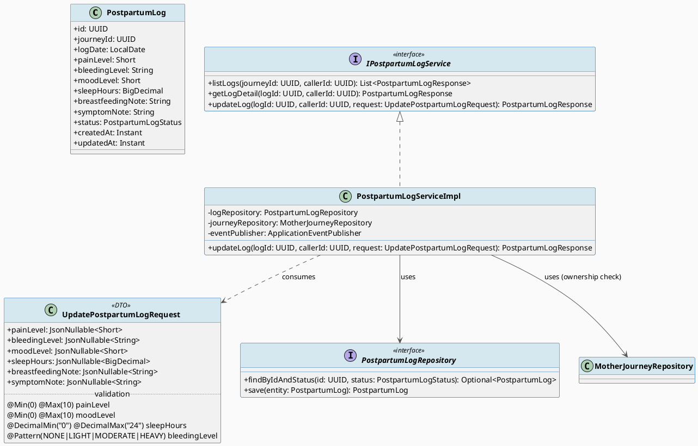
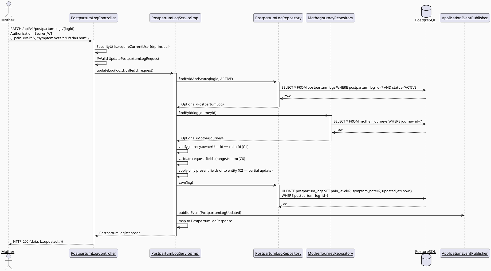
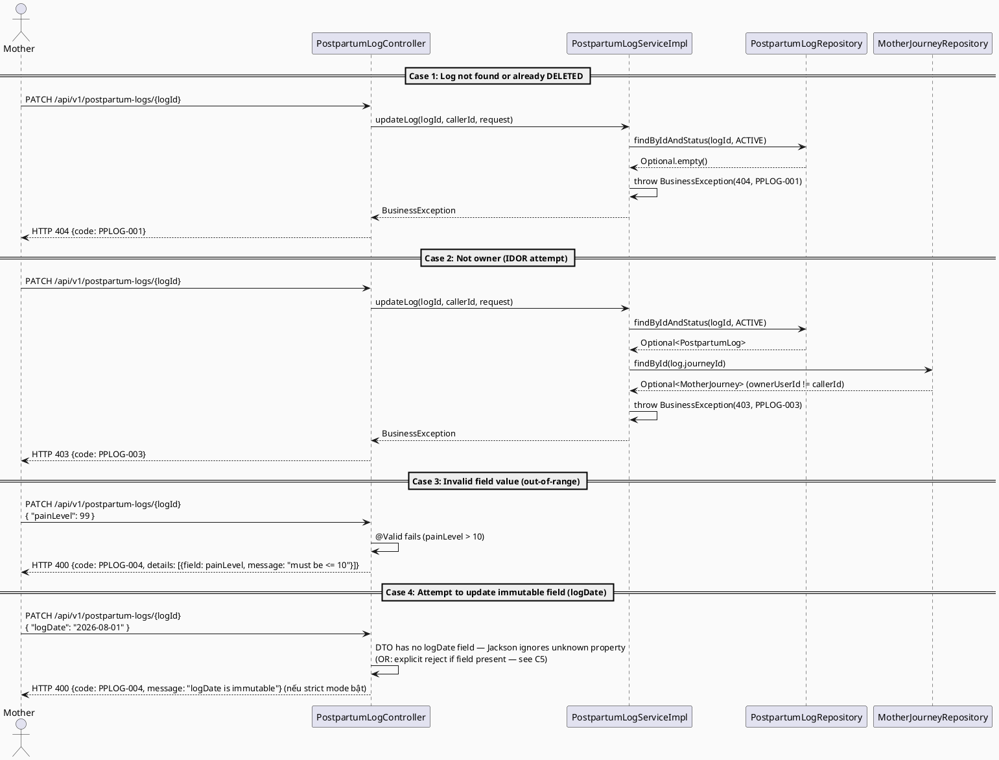
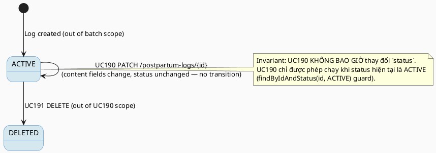

# ENGINEERING DOCUMENTATION STANDARD (EDS) v2.0
# UC190 — Update Postpartum Log

| Field | Value |
|-------|-------|
| **Document ID** | `CB-HEALTH-IMP-006` |
| **Version** | `1.0` |
| **Date** | `2026-07-03` |
| **Status** | `Partially Implemented` |
| **Document Owner** | `TV2-Bách` |
| **Author** | `AI Agent — Technical Architect` |
| **Reviewed by** | `[ ] Pending` |
| **DPO Sign-off** | `[ ] Pending` *(bắt buộc — module xử lý PII sức khỏe hậu sản)* |
| **Approved by** | `TV2-Bách` |
| **Last Review** | `2026-07-03` |
| **Based on EDS** | `v2.0` |

---

## CHANGELOG


| Ngày | Người thực hiện | Nội dung thay đổi |
|------|-----------------|-------------------|
| 2026-07-10 | AI Agent | Implementation status updated to Partially Implemented: targeted health backend tests PASS; full regression remains blocked by non-health Family/Exercise failures. |
| 2026-07-03 | AI Agent — Technical Architect | Tạo tài liệu lần đầu — TDS cho UC190 Update Postpartum Log (Draft) |

---

## MỤC LỤC

1. [Tổng quan Module](#1-tổng-quan-module)
2. [Ma trận Truy vết (Traceability Matrix)](#2-ma-trận-truy-vết-traceability-matrix)
3. [Architecture Decision Records (ADR)](#3-architecture-decision-records-adr)
4. [Non-Functional Requirements & SLA](#4-non-functional-requirements--sla)
5. [Static Modeling (Mô hình Tĩnh)](#5-static-modeling-mô-hình-tĩnh)
6. [Dynamic Modeling (Mô hình Động)](#6-dynamic-modeling-mô-hình-động)
7. [Domain Event Catalog](#7-domain-event-catalog)
8. [Interface Specification (Đặc tả Giao diện)](#8-interface-specification-đặc-tả-giao-diện)
9. [API Specification](#9-api-specification)
10. [Bảng mã lỗi (Error Codes)](#10-bảng-mã-lỗi-error-codes)
11. [Quy trình Triển khai (Step-by-Step)](#11-quy-trình-triển-khai-step-by-step)
12. [Rollback & Incident Runbook](#12-rollback--incident-runbook)
13. [Kịch bản Kiểm thử Chi tiết](#13-kịch-bản-kiểm-thử-chi-tiết)
14. [Phương pháp Xác minh](#14-phương-pháp-xác-minh)
15. [Mẫu thử thực tế (API Verification Samples)](#15-mẫu-thử-thực-tế-api-verification-samples)
16. [Bảng tổng hợp phân quyền (Authorization Matrix)](#16-bảng-tổng-hợp-phân-quyền-authorization-matrix)
17. [AI Prompt Constraints (CASE 2.0)](#17-ai-prompt-constraints-case-20)

---

## 1. Tổng quan Module

> UC190 cho phép Mother chỉnh sửa nội dung một `postpartum_logs` record do chính mình nhập (ví dụ: sửa lại `pain_level` nhập sai, bổ sung `symptom_note`). UC190 **tái sử dụng hoàn toàn** entity `PostpartumLog`, enum `PostpartumLogStatus`, và repository `PostpartumLogRepository` được tạo bởi UC189 (View Postpartum Logs). UC190 KHÔNG tạo bảng mới, KHÔNG tạo entity mới, KHÔNG cần migration bổ sung (đã có từ UC189 §5.2).

| Field | Value |
|-------|-------|
| **Module Name** | `Update Postpartum Log` |
| **Bounded Context** | `health` (dùng chung entity/repository với UC189) |
| **Data Classification** | `Sensitive-PII` |
| **Compliance Scope** | `PDPA / Luật 91/2025` |
| **Upstream Dependencies** | `UC189 View Postpartum Logs` (entity `PostpartumLog`, repository `PostpartumLogRepository`), `journey.MotherJourneyRepository` (ownership check), `IAM (JWT)` |
| **Downstream Consumers** | `UC189 View Postpartum Logs` (list/detail phải phản ánh giá trị mới ngay sau update — read-after-write consistency), audit trail |

**Nguồn gốc & phạm vi:**
- Function spec: `02_Requirements/SRS/3_Functional_Specification.md §3.3.11.4` (dòng 4089-4108), UC-190.
- Description gốc: "Updates Mother-entered postpartum log content."
- **In-scope:** Cập nhật một phần (partial update / PATCH semantics) các trường nội dung do Mother nhập: `pain_level`, `bleeding_level`, `mood_level`, `sleep_hours`, `breastfeeding_note`, `symptom_note`. Verify ownership qua `journey.owner_user_id`. Phát `PostpartumLogUpdated` event.
- **Out-of-scope:** Đổi `journey_id` (không cho phép — log không thể "chuyển" sang journey khác); khôi phục log đã `DELETED` (không có UC nào yêu cầu, restore là out-of-scope theo UC191); cập nhật hàng loạt (bulk update).

**Open Items:**
- ~~**OPEN-190-01**~~ **RESOLVED (2026-07-03):** SRS §3.3.11.4 KHÔNG đặc tả rõ liệu `log_date` có được phép sửa hay không. Product Owner đã xác nhận qua `AskUserQuestion`: `log_date` là **immutable sau khi tạo** (business rationale: `log_date` đóng vai trò business key theo ngày cho timeline hậu sản, dùng làm sort key ở UC189; cho phép đổi `log_date` có thể tạo nhầm lẫn thứ tự log hoặc trùng ngày với log khác). ADR-PPLOG-004 chuyển sang **Accepted** (§3).

---

## 2. Ma trận Truy vết (Traceability Matrix)

| Requirement ID | Loại (BR/ADR/US) | Mô tả yêu cầu | Thành phần Code | Compliance Target | ADR liên quan |
|----------------|------------------|---------------|-----------------|-------------------|---------------|
| UC-190 (SRS §3.3.11.4) | User Story | Mother updates content of a postpartum log she entered | `PostpartumLogController.PATCH /api/v1/postpartum-logs/{logId}` | — | ADR-PPLOG-004 |
| PRE-3 / BR-RBAC | Business Rule | Chỉ Mother sở hữu journey chứa log mới sửa được | `PostpartumLogServiceImpl.updateLog()` | — | — |
| BR-PRIVACY | Business Rule | Update chỉ áp dụng cho log `status = ACTIVE`; log đã xóa không sửa được | `findByIdAndStatus(id, ACTIVE)` trước khi update | PDPA | ADR-PPLOG-001 (kế thừa UC189) |
| E1 (Exceptions) | Exception Flow | Access denied khi không sở hữu record | `PostpartumLogController` (403, `PPLOG-003`) | — | — |
| E2 (Exceptions) | Exception Flow | Dữ liệu không hợp lệ (out-of-range, immutable field) bị reject | `PostpartumLogServiceImpl.updateLog()` (400, `PPLOG-004`) | — | ADR-PPLOG-004 |
| POST-3 | Postcondition | Sensitive action ghi log audit | `PostpartumLogUpdated` event → `AuditService` (nếu có consumer đăng ký) | — | — |

---

## 3. Architecture Decision Records (ADR)

### ADR-PPLOG-004 — `log_date` là immutable sau khi tạo; các field nội dung khác mutable via partial update

| Field | Value |
|-------|-------|
| **Status** | `Accepted` *(Product Owner xác nhận 2026-07-03 — chọn Phương án A qua `AskUserQuestion`)* |
| **Deciders** | `AI Agent — Technical Architect (TV2-Bách delegation)`, Product Owner |
| **Date** | `2026-07-03` |
| **Supersedes** | — |

#### Bối cảnh (Context)
SRS §3.3.11.4 chỉ ghi "Updates Mother-entered postpartum log content" — không liệt kê field nào được phép sửa, không nói rõ `log_date` có mutable hay không. Cần quyết định kỹ thuật để implement, nhưng quyết định này ảnh hưởng trực tiếp đến UX (Mother có sửa được ngày log không) và đến tính đúng đắn của sort order ở UC189.

#### Các phương án đã xem xét (Options Considered)

| Phương án | Mô tả | Ưu điểm | Nhược điểm |
|-----------|-------|----------|------------|
| A | `log_date` immutable — chỉ 6 field nội dung (`pain_level`, `bleeding_level`, `mood_level`, `sleep_hours`, `breastfeeding_note`, `symptom_note`) mutable | An toàn cho sort order/timeline UC189, tránh trùng lặp `log_date` gây nhầm lẫn, đơn giản hóa validation (không cần check unique-per-day) | Nếu Mother nhập sai ngày, phải xóa (UC191) và tạo lại (Add Postpartum Log — ngoài phạm vi batch này) thay vì sửa trực tiếp |
| B | Tất cả 7 field (bao gồm `log_date`) đều mutable | Linh hoạt hơn cho user, sửa lỗi nhập liệu dễ hơn | Rủi ro trùng `log_date` giữa 2 log của cùng 1 journey (không có UNIQUE constraint trong schema hiện tại để ngăn); có thể phá vỡ giả định "1 log gần đúng 1 ngày" của UI trend hậu sản tương lai |

#### Quyết định (Decision)
Chọn **Phương án A** — `log_date` immutable sau khi tạo. Product Owner đã xác nhận qua `AskUserQuestion` ngày 2026-07-03. **Trạng thái `Accepted`.**

#### Hệ quả (Consequences)

**Tích cực:**
- Giữ tính toàn vẹn sort-order/timeline của UC189.
- Validation đơn giản hơn (không cần duplicate-date check).

**Tiêu cực / Trade-offs:**
- Nếu Product Owner sau này cho phép sửa `log_date`, cần thêm business rule chống trùng ngày (hoặc chấp nhận trùng ngày là hợp lệ — cần làm rõ).
- Trải nghiệm Mother có thể kém hơn nếu nhập sai ngày (phải xóa + tạo lại).

**Compliance Impact:** Không ảnh hưởng PDPA trực tiếp — đây là quyết định UX/data-integrity, không phải compliance.

### ADR-PPLOG-005 — Partial update (PATCH) semantics: chỉ field được gửi trong request mới bị ghi đè

| Field | Value |
|-------|-------|
| **Status** | `Accepted` |
| **Deciders** | `AI Agent — Technical Architect` |
| **Date** | `2026-07-03` |

#### Bối cảnh (Context)
Cần quyết định semantics của update: full-replace (PUT — mọi field không gửi bị set về `null`) hay partial-update (PATCH — chỉ field có mặt trong JSON body mới bị ghi đè, field vắng mặt giữ nguyên giá trị cũ).

#### Các phương án đã xem xét (Options Considered)

| Phương án | Mô tả | Ưu điểm | Nhược điểm |
|-----------|-------|----------|------------|
| A | PUT full-replace | Đơn giản về mặt implementation (`mapper.updateEntity(dto, entity)` toàn bộ) | Client phải gửi lại toàn bộ 6 field mỗi lần sửa 1 field — dễ mất dữ liệu nếu client bug (gửi thiếu field → set null nhầm) |
| B | PATCH partial-update — dùng `Optional<T>`/nullable-aware DTO, chỉ field có key trong JSON mới update | An toàn hơn cho mobile UX (sửa 1 field không cần gửi lại 6 field khác), giảm rủi ro mất dữ liệu do client bug | Cần xử lý phân biệt "field không gửi" vs "field gửi giá trị null có chủ đích" (dùng Jackson `@JsonInclude`/`ObjectMapper.readerForUpdating` hoặc field-presence wrapper) |

#### Quyết định (Decision)
Chọn **Phương án B (PATCH)** — nhất quán với method HTTP đã dùng (`PATCH /api/v1/postpartum-logs/{logId}`), an toàn hơn cho mobile client, và đây là pattern chuẩn cho "update content" theo mô tả SRS (không phải "replace toàn bộ record").

#### Hệ quả (Consequences)

**Tích cực:** Mobile client (Flutter) chỉ cần gửi field đã đổi, giảm risk mất dữ liệu.

**Tiêu cực / Trade-offs:** Cần Jackson config (`ObjectMapper.readerForUpdating(entity).readValue(json)` hoặc field trong DTO wrap bằng `JsonNullable<T>`) — độ phức tạp code tăng nhẹ so với PUT. Team phải nhất quán pattern này cho các UC update khác trong `health` bounded context.

**Compliance Impact:** Giảm rủi ro data-loss ngoài ý muốn — tích cực cho tính toàn vẹn dữ liệu sức khỏe (PDPA Art. 5.1.d "accuracy").

---

## 4. Non-Functional Requirements & SLA

### 4.1. Performance & Availability

| Category | Requirement | Target SLA | Measurement Method | Compliance Basis |
|----------|-------------|------------|---------------------|------------------|
| Latency | API response (p99) | `< 300ms` | k6 load test | — |
| Availability | Uptime (monthly) | `99.9%` | Uptime monitor | — |
| Throughput | Concurrent requests | `100 req/s` (Frequency of Use: Regular) | Load test | — |

### 4.2. Data Integrity & Retention

| Category | Requirement | Target | Verification Method | Compliance Basis |
|----------|-------------|--------|---------------------|------------------|
| Consistency | Chỉ field gửi trong request body mới bị ghi đè (partial update) | 100% | Unit test §13 | ADR-PPLOG-005 |
| Immutability | `journey_id`, `postpartum_log_id`, `log_date` không đổi qua update | 100% | Unit test boundary (immutable-field attempt → 400) | ADR-PPLOG-004 |
| Accuracy | `updated_at` tự động cập nhật (`@UpdateTimestamp`) sau mọi write thành công | 100% | Integration test | PDPA Art. 5.1.d |

### 4.3. Security

| Category | Requirement | Target | Verification Method | Compliance Basis |
|----------|-------------|--------|---------------------|------------------|
| Access control | Chỉ owner của journey chứa log mới PATCH được (IDOR guard) | 100% requests từ non-owner → 403 | Security test §13.3 | GDPR Art. 25 |
| Input validation | `pain_level`/`mood_level` trong khoảng hợp lệ [0,10]; `sleep_hours` trong [0,24]; `bleeding_level` thuộc tập giá trị cho phép | 100% invalid input → 400 `PPLOG-004` | Unit test boundary | — |
| Encryption in transit | Toàn bộ endpoint | TLS 1.3+ | SSL Labs scan | GDPR Art. 32 |

### 4.4. Scalability & Capacity Planning

> Tải dự kiến: `Regular` (theo SRS) — thấp hơn UC189 (Frequent). Dùng chung connection pool/service layer với UC189.

---

## 5. Static Modeling (Mô hình Tĩnh)

### 5.1. Class Diagram (PlantUML)



### 5.2. Data Structure (Flyway SQL Migration)

> **No new migration required.** UC190 tái sử dụng bảng `postpartum_logs` + cột `status` được UC189 bổ sung qua `V20260707091000__add_postpartum_log_status.sql` (§5.2 của UC189 TDS). UC190 chỉ thực hiện `UPDATE` trên các cột nội dung hiện có (không có DDL mới).

```sql
-- Reference only — schema đã có sẵn (không migration mới cho UC190):
-- postpartum_logs.pain_level, bleeding_level, mood_level, sleep_hours,
-- breastfeeding_note, symptom_note (đã tồn tại từ V1__init_schema.sql dòng 588-600)
-- postpartum_logs.status (bổ sung bởi UC189's V20260707091000)
```

> **Quy tắc đặt tên:** Không có DDL mới cho UC190.

---

## 6. Dynamic Modeling (Mô hình Động)

### 6.1. Sequence Diagram — Happy Path (PlantUML)



### 6.2. Sequence Diagram — Error Path (PlantUML)



### 6.3. State Machine



> **⚠️ Invariant bất biến:** UC190 chỉ thao tác trên log ở trạng thái `ACTIVE`; không bao giờ update log `DELETED` (phải xóa guard `findByIdAndStatus(id, ACTIVE)` trước khi write).

---

## 7. Domain Event Catalog

### 7.1. Events Published (Phát ra)

| Event Name | Trigger | Publisher | Subscriber(s) | Payload Schema | Async? |
|------------|---------|-----------|---------------|----------------|--------|
| `PostpartumLogUpdated` | Update thành công (≥1 field content thay đổi) | `PostpartumLogServiceImpl` | Audit log consumer (nếu có) | `PostpartumLogUpdated.java` | No (đồng bộ, `ApplicationEventPublisher`) |

### 7.2. Events Consumed (Tiêu thụ)

| Event Name | Source | Handler | Action thực hiện |
|------------|--------|---------|------------------|
| _(none)_ | — | — | UC190 không tiêu thụ event từ module khác |

### 7.3. Payload Schema

```java
// PostpartumLogUpdated.java
public record PostpartumLogUpdated(
    UUID    eventId,
    String  eventType,        // "PostpartumLogUpdated"
    Instant occurredAt,
    String  version,          // "1.0"
    Payload payload,
    Metadata metadata
) {

    public record Payload(
        UUID logId,
        UUID journeyId,
        List<String> changedFields  // e.g. ["painLevel", "symptomNote"] — field names only, NOT values (BR-PRIVACY minimum-necessary)
    ) {}

    public record Metadata(
        UUID   correlationId,
        String causedBy        // callerId (Mother userId)
    ) {}
}
```

---

## 8. Interface Specification (Đặc tả Giao diện)

### 8.1. Service Interface

```java
// UpdatePostpartumLogRequest.java — Input DTO (partial update — PATCH semantics, ADR-PPLOG-005)
// @version 1.0
public class UpdatePostpartumLogRequest {

    @Min(0) @Max(10)
    private JsonNullable<Short> painLevel = JsonNullable.undefined();

    @Pattern(regexp = "NONE|LIGHT|MODERATE|HEAVY")
    private JsonNullable<String> bleedingLevel = JsonNullable.undefined();

    @Min(0) @Max(10)
    private JsonNullable<Short> moodLevel = JsonNullable.undefined();

    @DecimalMin("0.0") @DecimalMax("24.0")
    private JsonNullable<BigDecimal> sleepHours = JsonNullable.undefined();

    @Size(max = 2000)
    private JsonNullable<String> breastfeedingNote = JsonNullable.undefined();

    @Size(max = 2000)
    private JsonNullable<String> symptomNote = JsonNullable.undefined();

    // NOTE: `journeyId`, `id`, `logDate` KHÔNG có field tương ứng trong DTO này
    // — bất kỳ property lạ nào trong JSON body (vd: "logDate") sẽ bị Jackson
    // reject nếu @JsonIgnoreProperties(ignoreUnknown = false) được bật ở ObjectMapper level (C5).
}

// I PostpartumLogService.java — extended, existing interface
// @version 1.1
public interface IPostpartumLogService {

    List<PostpartumLogResponse> listLogs(UUID journeyId, UUID callerId);

    PostpartumLogResponse getLogDetail(UUID logId, UUID callerId);

    /**
     * UC190: Partially updates content fields of a Mother-entered postpartum log.
     * Only fields present (non-undefined) in `request` are applied.
     * @throws BusinessException (PPLOG-001/404) if not found or already deleted
     * @throws BusinessException (PPLOG-002/404) if parent journey missing
     * @throws BusinessException (PPLOG-003/403) if caller is not the journey owner
     * @throws BusinessException (PPLOG-004/400) if a field fails validation
     */
    PostpartumLogResponse updateLog(UUID logId, UUID callerId, UpdatePostpartumLogRequest request);
}
```

### 8.2. Repository Interface

```java
// PostpartumLogRepository.java — existing, no change needed (from UC189)
// @version 1.0
public interface PostpartumLogRepository extends JpaRepository<PostpartumLog, UUID> {

    Optional<PostpartumLog> findByIdAndStatus(UUID id, PostpartumLogStatus status);
    List<PostpartumLog> findByJourneyIdAndStatusOrderByLogDateDescCreatedAtDesc(UUID journeyId, PostpartumLogStatus status);
    // save() inherited from JpaRepository — used for partial-update writes (no new method required)
}
```

---

## 9. API Specification

### 9.1. Endpoints Table

| Method | Path | Auth Level | Required Roles | Rate Limit | Idempotent? |
|--------|------|------------|----------------|------------|-------------|
| `PATCH` | `/api/v1/postpartum-logs/{logId}` | JWT Bearer | `MOTHER` | 60/min | Yes (same body → same resulting state) |

### 9.2. Request / Response Schemas

#### `PATCH /api/v1/postpartum-logs/{logId}` — Partial update content

**Request Body (all fields optional — only send what changed):**
```json
{
  "painLevel": 5,
  "bleedingLevel": "MODERATE",
  "moodLevel": 7,
  "sleepHours": 6.0,
  "breastfeedingNote": "Đỡ đau hơn hôm nay",
  "symptomNote": "Không sốt"
}
```

**Response — 200 OK (Happy Path):**
```json
{
  "data": {
    "id": "550e8400-e29b-41d4-a716-446655440000",
    "journeyId": "5b3f...journey",
    "logDate": "2026-07-01",
    "painLevel": 5,
    "bleedingLevel": "MODERATE",
    "moodLevel": 7,
    "sleepHours": 6.0,
    "breastfeedingNote": "Đỡ đau hơn hôm nay",
    "symptomNote": "Không sốt",
    "createdAt": "2026-07-01T08:00:00.000Z",
    "updatedAt": "2026-07-03T10:15:00.000Z"
  }
}
```

**Response — 400 Bad Request (Validation Error):**
```json
{
  "error": {
    "code": "PPLOG-004",
    "message": "Validation failed",
    "details": [
      { "field": "painLevel", "message": "must be between 0 and 10" }
    ]
  }
}
```

**Response — 404 Not Found (already deleted / never existed):**
```json
{ "error": { "code": "PPLOG-001", "message": "Postpartum log not found or deleted: {logId}" } }
```

**Response — 403 Forbidden (not owner — IDOR guard):**
```json
{ "error": { "code": "PPLOG-003", "message": "Access denied to postpartum log" } }
```

---

## 10. Bảng mã lỗi (Error Codes)

> Tiền tố `PPLOG-` đã được thiết lập bởi UC189 — UC190 tái sử dụng mã lỗi hiện có, bổ sung ý nghĩa cho `PPLOG-004` (không tạo mã mới).

| Code | HTTP Status | Message (EN) | Message (VI) | Trigger Condition |
|------|-------------|--------------|--------------|-------------------|
| `PPLOG-001` | 404 | Postpartum log not found or deleted | Không tìm thấy hoặc đã bị xóa | `findByIdAndStatus(id, ACTIVE)` trả empty |
| `PPLOG-002` | 404 | Parent journey not found | Không tìm thấy hành trình liên kết | `journeyRepository.findById()` trả empty |
| `PPLOG-003` | 403 | Access denied to postpartum log | Không có quyền truy cập nhật ký hậu sản | `journey.ownerUserId != callerId` |
| `PPLOG-004` | 400 | Validation failed | Dữ liệu không hợp lệ | Bean Validation fail (out-of-range `painLevel`/`moodLevel`/`sleepHours`, invalid `bleedingLevel` enum) HOẶC attempt để update field immutable (`logDate`) khi strict-unknown-property mode bật |

---

## 11. Quy trình Triển khai (Step-by-Step)

### 11.1. Prerequisites

- [x] ADR-PPLOG-005 đã Accepted; ADR-PPLOG-004 đã được Product Owner xác nhận (Accepted 2026-07-03) (§3)
- [ ] DPO sign-off pending (module PII sức khỏe)
- [ ] TDS + Test-Spec approved bởi user (theo `implement-flow.md`)
- [ ] UC189 code (`PostpartumLog`, `PostpartumLogStatus`, `PostpartumLogRepository`, migration `V20260707091000`) đã tồn tại và pass test

### 11.2. Pre-Migration Checklist

- [ ] Không cần migration mới — N/A cho UC190 (tái sử dụng schema của UC189)

### 11.3. Implementation Steps

#### Chặng 1 — Extend Service Interface + Impl

```java
// IPostpartumLogService.java — add updateLog() signature (§8.1)
// PostpartumLogServiceImpl.java — implement updateLog():
//   1. findByIdAndStatus(logId, ACTIVE) -> orElseThrow(PPLOG-001)
//   2. journeyRepository.findById(journeyId) -> orElseThrow(PPLOG-002)
//   3. verify journey.ownerUserId == callerId -> else throw PPLOG-003
//   4. @Valid trên Controller đã chặn out-of-range trước khi vào Service (PPLOG-004)
//   5. apply chỉ field present trong request (JsonNullable.isPresent()) lên entity
//   6. logRepository.save(entity)
//   7. eventPublisher.publishEvent(new PostpartumLogUpdated(...)) — payload chỉ chứa tên field đổi, KHÔNG chứa giá trị (BR-PRIVACY)
```

Class giữ `@Transactional(readOnly = true)` cấp class (kế thừa từ UC189), override method-level `@Transactional` (không readOnly) cho `updateLog()`.

#### Chặng 2 — Extend Controller

```java
// PostpartumLogController.java — add:
@PatchMapping("/{logId}")
@PreAuthorize("hasRole('MOTHER')")
public ResponseEntity<ApiResponse<PostpartumLogResponse>> updateLog(
        @PathVariable UUID logId,
        @Valid @RequestBody UpdatePostpartumLogRequest request,
        Principal principal) {
    var callerId = SecurityUtils.requireCurrentUserId(principal);
    var response = postpartumLogService.updateLog(logId, callerId, request);
    return ResponseEntity.ok(ApiResponse.success(response));
}
```

#### Chặng 3 — Verification sau deploy

```bash
curl -X PATCH https://[host]/api/v1/postpartum-logs/[logId] \
  -H "Authorization: Bearer [JWT_TOKEN]" \
  -H "Content-Type: application/json" \
  -d '{"painLevel": 4}'
# Expected: 200, data.painLevel == 4, other fields unchanged
```

### 11.4. Deployment Checklist

- [ ] `./mvnw test` xanh
- [ ] Health check 200
- [ ] Mobile `PostpartumLogService.updateLog()` implemented in `05_Development/CareBridgeMobileApp/lib/features/healthRecords/services/postpartum_log_service.dart` (mirror `health_metric_service.dart` pattern, dùng `apiPatch`)
- [ ] Audit log sinh đúng `PostpartumLogUpdated` (chỉ chứa tên field, không chứa giá trị)

---

## 12. Rollback & Incident Runbook

### 12.1. Điều kiện kích hoạt Rollback

| Điều kiện | Ngưỡng | Người quyết định |
|-----------|--------|------------------|
| Error rate tăng đột biến | > 5% trong 5 phút | On-call Engineer |
| Dữ liệu bị ghi đè sai (data corruption từ partial-update bug) | Bất kỳ case nào | Tech Lead + DPO |

### 12.2. Rollback Procedure

```bash
# Không có migration mới — rollback chỉ cần revert code deploy
kubectl rollout undo deployment/carebridge-api
kubectl rollout status deployment/carebridge-api

# Nếu cần khôi phục dữ liệu bị ghi sai (chỉ dùng khi có sự cố, không qua API):
# CareBridge KHÔNG có bảng audit-history cho postpartum_logs trong scope hiện tại
# → khôi phục chỉ khả thi từ DB backup gần nhất (pg_dump snapshot), KHÔNG có field-level undo.
```

### 12.3. Notification Protocol

| Thời điểm | Người nhận | Kênh | Template |
|-----------|------------|------|----------|
| Ngay khi phát hiện | On-call team | Slack `#incident` | "🚨 UC190 incident: [mô tả]" |
| Trong 30 phút | DPO | Email | Bắt buộc — module PII |

### 12.4. Post-Incident Review (PIR)

> Bắt buộc hoàn thành PIR trong 48 giờ nếu có incident liên quan đến ghi sai dữ liệu sức khỏe hậu sản.

---

## 13. Kịch bản Kiểm thử Chi tiết

> Chi tiết đầy đủ nằm ở `UC190_UpdatePostpartumLog_Test-Spec.md`. Tóm tắt scope:

- Unit: `PostpartumLogServiceImpl.updateLog()` — happy path (single field, multi field), not-found, not-owner, out-of-range validation, immutable-field-attempt boundary.
- Integration: full PATCH flow qua Testcontainers PostgreSQL, verify chỉ field gửi bị đổi, field khác giữ nguyên, `updated_at` refresh.
- Security/E2E: IDOR — Mother B cố sửa log của Mother A → 403; unauthenticated → 401.

---

## 14. Phương pháp Xác minh

### 14.1. Database Inspection

```sql
-- Verify partial update: chỉ field gửi bị đổi
SELECT postpartum_log_id, pain_level, mood_level, sleep_hours, updated_at
FROM postpartum_logs
WHERE postpartum_log_id = '[uuid]';
-- Expected: pain_level = giá trị mới, mood_level/sleep_hours giữ nguyên nếu không gửi, updated_at mới hơn created_at
```

### 14.2. Log / Audit Verification

```bash
kubectl logs -l app=carebridge-api | grep '"eventType":"PostpartumLogUpdated"' | head -5
```

### 14.3. Tool-based Verification

```bash
echo "[JWT_TOKEN]" | cut -d'.' -f2 | base64 -d | jq .
```

---

## 15. Mẫu thử thực tế (API Verification Samples)

### 15.1. Happy Path

```bash
curl -X PATCH https://[host]/api/v1/postpartum-logs/550e8400-e29b-41d4-a716-446655440000 \
  -H "Authorization: Bearer [JWT_TOKEN]" \
  -H "Content-Type: application/json" \
  -d '{"painLevel": 4, "symptomNote": "Đã đỡ hơn"}'
```

**Expected Response (200):** `data.painLevel == 4`, `data.symptomNote == "Đã đỡ hơn"`, other fields unchanged.

### 15.2. Error Paths

```bash
# Out-of-range painLevel → 400
curl -X PATCH https://[host]/api/v1/postpartum-logs/[logId] \
  -H "Authorization: Bearer [JWT_TOKEN]" \
  -H "Content-Type: application/json" \
  -d '{"painLevel": 99}'
```

**Expected Response (400):**
```json
{ "error": { "code": "PPLOG-004", "message": "Validation failed", "details": [{ "field": "painLevel", "message": "must be between 0 and 10" }] } }
```

```bash
# Non-owner attempts update → 403
curl -X PATCH https://[host]/api/v1/postpartum-logs/[other-mother-log-id] \
  -H "Authorization: Bearer [JWT_TOKEN_MOTHER_B]" \
  -H "Content-Type: application/json" \
  -d '{"painLevel": 2}'
```

**Expected Response (403):**
```json
{ "error": { "code": "PPLOG-003", "message": "Access denied to postpartum log" } }
```

```bash
# No JWT → 401
curl -X PATCH https://[host]/api/v1/postpartum-logs/[id] -d '{"painLevel": 2}'
```

**Expected Response (401):**
```json
{ "error": { "code": "IAM-001", "message": "Authentication required" } }
```

---

## 16. Bảng tổng hợp phân quyền (Authorization Matrix)

| Endpoint | `GUEST` | `MOTHER` (own) | `MOTHER` (other's) | `FAMILY` | `SYSTEM_ADMIN` |
|----------|---------|-----------------|---------------------|----------|----------------|
| `PATCH /api/v1/postpartum-logs/{id}` | ❌ | ✅ Own | ❌ 403 | ❌ | ❌ |

**Chú thích:**
- ✅ = Được phép
- ❌ = Bị từ chối (403) hoặc không route tới (401 nếu unauthenticated)
- `Own` = Chỉ được phép với log thuộc journey của chính Mother đó (`journey.owner_user_id == callerId`)

---

## 17. AI Prompt Constraints (CASE 2.0)

### 17.1 Constraint Summary Table

| # | Constraint | Source (ADR/BR) | Last Verified |
|---|-----------|-----------------|---------------|
| C1 | Ownership resolved via `log.journeyId -> MotherJourney.ownerUserId == callerId`. KHÔNG có `owner_user_id` trực tiếp trên `postpartum_logs`. | ADR-PPLOG-001, BR-RBAC | 2026-07-03 |
| C2 | Update PHẢI là partial-update (PATCH semantics) — chỉ field present trong request mới bị ghi vào entity. KHÔNG override field vắng mặt về `null`. | ADR-PPLOG-005 | 2026-07-03 |
| C3 | Dùng `PostpartumLogRepository.findByIdAndStatus(id, ACTIVE)` trước khi update — không dùng `findById()` trần (tránh update nhầm log đã DELETED). | ADR-PPLOG-001, UC189 pattern | 2026-07-03 |
| C4 | Identity lấy từ `SecurityUtils.requireCurrentUserId(principal)` — không tự parse JWT trong Controller. | UC187/UC188/UC189 pattern | 2026-07-03 |
| C5 | `journey_id`, `id` (postpartum_log_id), `log_date` KHÔNG được có trong `UpdatePostpartumLogRequest` DTO — immutable field guard. `log_date` immutability đã Accepted (Product Owner xác nhận 2026-07-03). | ADR-PPLOG-004 (Accepted) | 2026-07-03 |
| C6 | `PostpartumLogUpdated` event payload CHỈ chứa tên field đã đổi (`changedFields: List<String>`), KHÔNG chứa giá trị cũ/mới (BR-PRIVACY minimum-necessary). | BR-PRIVACY | 2026-07-03 |
| C7 | Controller chỉ validate (`@Valid`) + map; toàn bộ ownership/partial-update logic nằm trong `PostpartumLogServiceImpl`. | CLAUDE.md Architecture rules | 2026-07-03 |

### 17.2 Constraint Injection Block (Copy-Paste vào AI Prompt)

```
[CONSTRAINT BLOCK — Module: Update Postpartum Log (UC190)]
Theo TDS CB-HEALTH-IMP-006 và các ADR liên quan:

1. Ownership qua log.journeyId -> MotherJourney.ownerUserId == callerId (KHÔNG có owner_user_id trực tiếp trên bảng postpartum_logs).
2. Update là partial-update (PATCH) — chỉ field present trong request mới ghi vào entity, KHÔNG set field vắng mặt về null.
3. Dùng findByIdAndStatus(id, ACTIVE) trước khi update — không findById() trần.
4. Identity từ SecurityUtils.requireCurrentUserId(principal).
5. journey_id/id/log_date KHÔNG có trong Request DTO — immutable field guard (log_date immutability đã Accepted).
6. Event payload PostpartumLogUpdated chỉ chứa tên field đổi, KHÔNG chứa giá trị.
7. Controller chỉ validate/map; logic nằm ở Service.

[CONTEXT BLOCK]
- Bounded Context: health
- Data Classification: Sensitive-PII
- Compliance: PDPA / Luật 91/2025
- Existing interfaces: §8 Service Interface + §8.2 Repository Interface
- Error codes: §10 Error Codes Table (PPLOG-001/002/003/004)
- Auth matrix: §16 Authorization Matrix

[TASK BLOCK]
Implement updateLog() thỏa mãn constraints trên.
Output phải tuân thủ §8 Interface Specification.
Tests phải cover §13 Test Scenarios (xem Test-Spec).
```

### 17.3 Constraint Quality Checklist

- [x] Mỗi constraint traceable về ADR hoặc BR cụ thể
- [x] Không có constraint generic
- [x] Mỗi constraint có `Last Verified` date ≤ 2 sprints
- [x] Constraint block có ≥ 3 constraints cụ thể
- [x] Constraint block reference §8 Interface
- [x] Constraint block reference §16 Auth Matrix

### 17.4 Anti-Pattern Detection (cho AI-Generated Code từ Block này)

| AP-ID | Anti-Pattern | Dấu hiệu | Hành động |
|-------|-------------|-----------|----------|
| AP-AI-001 | Unconstrained Gen | Code không match C1-C7 | Reject — inject lại constraints |
| AP-AI-003 | Implicit Decision | Code assume `owner_user_id` tồn tại trực tiếp trên `postpartum_logs` | Reject — dùng journey join |
| AP-AI-005 | Hallucinated Contract | Code cho phép update `logDate` hoặc `journeyId` qua DTO | Reject — DTO không có field đó |

---

## PHỤ LỤC

### A. Glossary (Thuật ngữ)

| Thuật ngữ | Định nghĩa |
|-----------|------------|
| Partial update (PATCH) | Chỉ field có mặt trong request body mới bị ghi đè, field vắng mặt giữ nguyên |
| JsonNullable<T> | Wrapper type phân biệt "field không gửi" vs "field gửi giá trị null có chủ đích" |
| Immutable field | Field không được phép thay đổi sau khi record được tạo |
| IDOR | Insecure Direct Object Reference |
| PII | Personally Identifiable Information |

### B. Tài liệu tham chiếu

| Document | Link / Path |
|----------|-------------|
| SRS §3.3.11.4 | `02_Requirements/SRS/3_Functional_Specification.md` (dòng 4089-4108) |
| UC189 TDS/code | `04_Implement/UC189_ViewPostpartumLogs/UC189_ViewPostpartumLogs_TDS.md`, `05_Development/CareBridgeAPI/src/main/java/com/carebridge/backend/health/` |
| UC188 sibling ADR pattern | `04_Implement/UC188_DeleteMaternalHealthMetric/UC188_DeleteMaternalHealthMetric_TDS.md` |
| Schema baseline | `05_Development/CareBridgeAPI/src/main/resources/db/migration/V1__init_schema.sql`, `V20260707091000__add_postpartum_log_status.sql` (từ UC189) |
| Task allocation | `04_Implement/implement_artifacts/function-spec-task-allocation.md` (dòng 670-694) |

---

*EDS v2.1 — CASE 2.0 constraints applied. Status: Draft — pending user review/approval per `.claude/rules/implement-flow.md`. ADR-PPLOG-004 (log_date immutability) confirmed Accepted by Product Owner 2026-07-03.*
