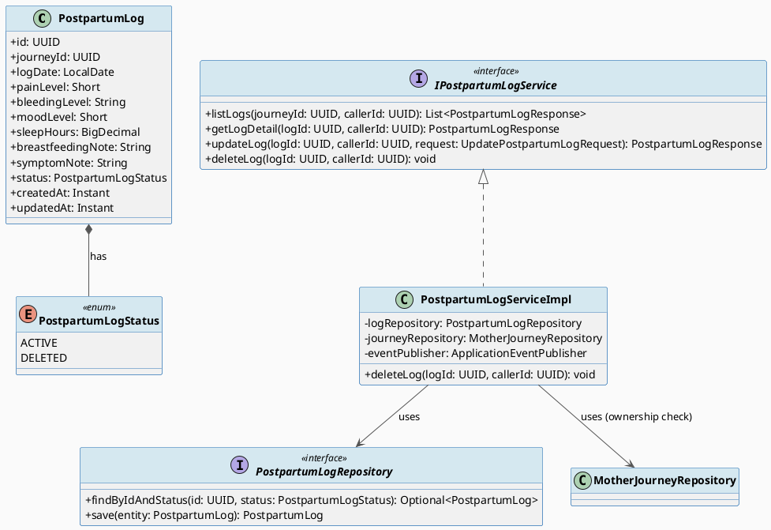
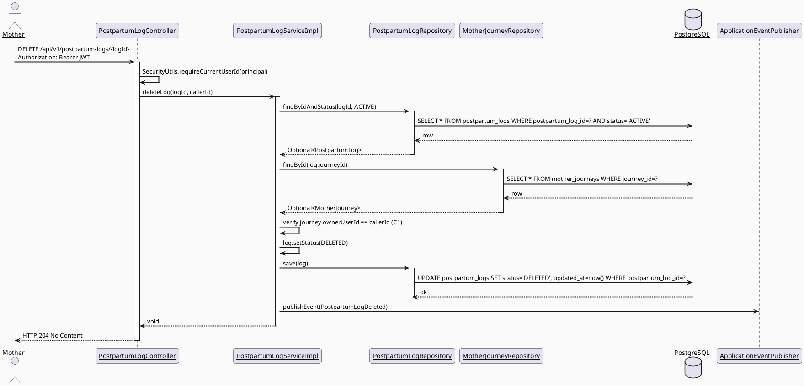
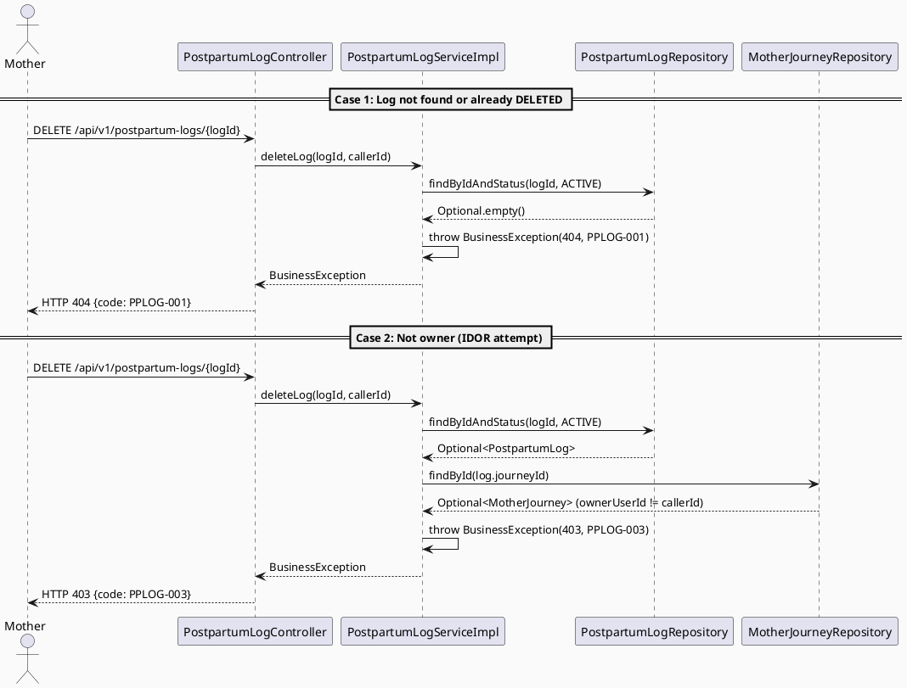
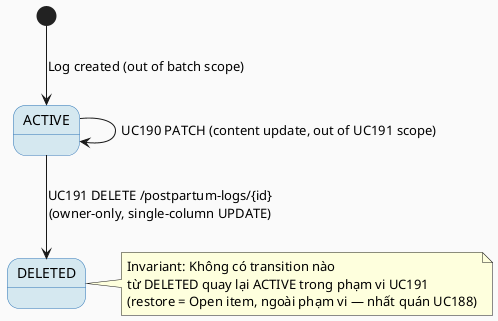

# ENGINEERING DOCUMENTATION STANDARD (EDS) v2.0
# UC191 — Delete Postpartum Log

| Field | Value |
|-------|-------|
| **Document ID** | `CB-HEALTH-IMP-007` |
| **Version** | `1.0` |
| **Date** | `2026-07-03` |
| **Status** | `Draft` |
| **Document Owner** | `TV2-Bách` |
| **Author** | `AI Agent — Technical Architect` |
| **Reviewed by** | `[ ] Pending` |
| **DPO Sign-off** | `[ ] Pending` *(bắt buộc — module xử lý PII sức khỏe hậu sản)* |
| **Approved by** | `[ ] Pending` |
| **Last Review** | `2026-07-03` |
| **Based on EDS** | `v2.0` |

---

## CHANGELOG

| Ngày | Người thực hiện | Nội dung thay đổi |
|------|-----------------|-------------------|
| 2026-07-03 | AI Agent — Technical Architect | Tạo tài liệu lần đầu — TDS cho UC191 Delete Postpartum Log (Draft) |

---

## MỤC LỤC

1. [Tổng quan Module](#1-tổng-quan-module)
2. [Ma trận Truy vết (Traceability Matrix)](#2-ma-trận-truy-vết-traceability-matrix)
3. [Architecture Decision Records (ADR)](#3-architecture-decision-records-adr)
4. [Non-Functional Requirements & SLA](#4-non-functional-requirements--sla)
5. [Static Modeling (Mô hình Tĩnh)](#5-static-modeling-mô-hình-tĩnh)
6. [Dynamic Modeling (Mô hình Động)](#6-dynamic-modeling-mô-hình-động)
7. [Domain Event Catalog](#7-domain-event-catalog)
8. [Interface Specification (Đặc tả Giao diện)](#8-interface-specification-đặc-tả-giao-diện)
9. [API Specification](#9-api-specification)
10. [Bảng mã lỗi (Error Codes)](#10-bảng-mã-lỗi-error-codes)
11. [Quy trình Triển khai (Step-by-Step)](#11-quy-trình-triển-khai-step-by-step)
12. [Rollback & Incident Runbook](#12-rollback--incident-runbook)
13. [Kịch bản Kiểm thử Chi tiết](#13-kịch-bản-kiểm-thử-chi-tiết)
14. [Phương pháp Xác minh](#14-phương-pháp-xác-minh)
15. [Mẫu thử thực tế (API Verification Samples)](#15-mẫu-thử-thực-tế-api-verification-samples)
16. [Bảng tổng hợp phân quyền (Authorization Matrix)](#16-bảng-tổng-hợp-phân-quyền-authorization-matrix)
17. [AI Prompt Constraints (CASE 2.0)](#17-ai-prompt-constraints-case-20)

---

## 1. Tổng quan Module

> UC191 cho phép Mother soft-delete một `postpartum_logs` record do chính mình nhập (nhập sai hoặc không còn cần). UC191 tái sử dụng **hoàn toàn** entity `PostpartumLog`, enum `PostpartumLogStatus`, và repository `PostpartumLogRepository` đã được tạo bởi UC189 (View Postpartum Logs) — mirror chính xác pattern UC188 (Delete Maternal Health Metric) đã Accepted. UC191 KHÔNG tạo bảng mới, KHÔNG tạo entity mới, KHÔNG cần migration bổ sung (đã có từ UC189).

| Field | Value |
|-------|-------|
| **Module Name** | `Delete Postpartum Log` |
| **Bounded Context** | `health` (dùng chung entity/repository với UC189/UC190) |
| **Data Classification** | `Sensitive-PII` |
| **Compliance Scope** | `PDPA / Luật 91/2025` |
| **Upstream Dependencies** | `UC189 View Postpartum Logs` (entity `PostpartumLog`, repository `PostpartumLogRepository`), `journey.MotherJourneyRepository` (ownership check), `IAM (JWT)` |
| **Downstream Consumers** | `UC189 View Postpartum Logs` (list/detail phải loại trừ log `DELETED` ngay sau delete — đã kiểm chứng bởi `PPLOG-TC-INT-002` trong UC189 Test-Spec), audit trail |

**Nguồn gốc & phạm vi:**
- Function spec: `02_Requirements/SRS/3_Functional_Specification.md §3.3.11.5` (dòng 4110-4129), UC-191.
- Description gốc: "Soft-deletes a Mother-entered postpartum log."
- **In-scope:** Chuyển trạng thái 1 `postpartum_logs` record từ `ACTIVE` → `DELETED` (soft-delete, không xóa vật lý), verify ownership qua `journey.owner_user_id`, phát `PostpartumLogDeleted` event.
- **Out-of-scope:** Xóa vĩnh viễn (hard delete) — không được hỗ trợ theo BR-PRIVACY (audit/retention); khôi phục (restore) log đã xóa — không có UC nào yêu cầu, đánh dấu **Open** (nhất quán với UC188's Open item cho `maternal_health_metrics`); xóa hàng loạt (bulk delete) — không có trong SRS.

---

## 2. Ma trận Truy vết (Traceability Matrix)

| Requirement ID | Loại (BR/ADR/US) | Mô tả yêu cầu | Thành phần Code | Compliance Target | ADR liên quan |
|----------------|------------------|---------------|-----------------|-------------------|---------------|
| UC-191 (SRS §3.3.11.5) | User Story | Mother soft-deletes a postpartum log she entered | `PostpartumLogController.DELETE /api/v1/postpartum-logs/{logId}` | — | ADR-PPLOG-006 |
| PRE-3 / BR-RBAC | Business Rule | Chỉ Mother sở hữu journey chứa log mới xóa được | `PostpartumLogServiceImpl.deleteLog()` | — | — |
| BR-PRIVACY | Business Rule | Xóa phải là soft-delete (giữ audit trail, không mất dữ liệu vật lý) | `PostpartumLog.status = DELETED` (single-column UPDATE, tái sử dụng `PostpartumLogStatus` enum) | PDPA | ADR-PPLOG-006 (kế thừa ADR-PPLOG-001/ADR-HEALTH-004) |
| E1 (Exceptions) | Exception Flow | Access denied khi không sở hữu record | `PostpartumLogController` (403, `PPLOG-003`) | — | — |
| E2 (Exceptions) | Exception Flow | Log không tồn tại hoặc đã bị xóa trước đó → 404, idempotent theo semantics của UC188/UC189 | `PostpartumLogServiceImpl.deleteLog()` (`PPLOG-001`) | — | ADR-PPLOG-007 |
| POST-3 | Postcondition | Sensitive action ghi log audit | `PostpartumLogDeleted` event → `AuditService` (nếu có consumer đăng ký) | — | — |

---

## 3. Architecture Decision Records (ADR)

### ADR-PPLOG-006 — Soft-delete pattern for `postpartum_logs` via `status` column (mirrors ADR-HEALTH-004)

| Field | Value |
|-------|-------|
| **Status** | `Accepted` |
| **Deciders** | `AI Agent — Technical Architect (TV2-Bách delegation)` |
| **Date** | `2026-07-03` |
| **Supersedes** | — |

#### Bối cảnh (Context)
UC189 đã thêm cột `status VARCHAR(20) NOT NULL DEFAULT 'ACTIVE'` vào `postpartum_logs` (migration `V20260707091000`) và enum `PostpartumLogStatus { ACTIVE, DELETED }`, cùng repository method `findByIdAndStatus(id, ACTIVE)`. UC191 cần một cơ chế xóa an toàn, có thể audit, không phá vỡ FK từ các bảng khác. Không có FK nào trỏ vào `postpartum_log_id` trong schema hiện tại (`V1__init_schema.sql`) — an toàn để soft-delete mà không cascade.

#### Các phương án đã xem xét (Options Considered)

| Phương án | Mô tả | Ưu điểm | Nhược điểm |
|-----------|-------|----------|------------|
| A | Hard DELETE row khỏi bảng | Đơn giản | Mất audit trail, vi phạm BR-PRIVACY, không thể khôi phục nếu Mother nhấn nhầm |
| B | Soft-delete: UPDATE `status = 'DELETED'` (tái sử dụng cột đã có từ UC189) | Nhất quán tuyệt đối với ADR-HEALTH-004 (UC187/UC188) và ADR-PPLOG-001 (UC189), không cần Flyway migration mới | Query mặc định phải luôn filter `status = ACTIVE` (rủi ro leak nếu quên filter) — đã giảm thiểu ở UC189 bằng repository method chuyên biệt |

#### Quyết định (Decision)
Chọn **Phương án B** — nhất quán tuyệt đối với pattern đã Accepted ở ADR-HEALTH-004 (UC188) và tái áp dụng nguyên vẹn cho `postpartum_logs`. Không cần Flyway migration mới (đã có từ UC189). Tuân thủ BR-PRIVACY.

#### Hệ quả (Consequences)

**Tích cực:**
- Tái sử dụng 100% entity/enum/repository hiện có từ UC189 — thay đổi code tối thiểu.
- Nhất quán pattern xuyên suốt UC187/UC188/UC189/UC190/UC191 (cùng convention `status: ACTIVE|DELETED`) — toàn bộ bounded context `health` dùng một mô hình soft-delete duy nhất.

**Tiêu cực / Trade-offs:**
- Giống hệt UC188: mọi query đọc phải filter `status = ACTIVE` tường minh.

**Compliance Impact:**
- PDPA: dữ liệu sức khỏe hậu sản không bị xóa vật lý ngay, đáp ứng yêu cầu lưu trữ tối thiểu cho audit.

### ADR-PPLOG-007 — Idempotent delete: repeated DELETE on already-DELETED log (mirrors ADR-HEALTH-005)

| Field | Value |
|-------|-------|
| **Status** | `Accepted` |
| **Deciders** | `AI Agent — Technical Architect` |
| **Date** | `2026-07-03` |

#### Bối cảnh (Context)
UC189 đã định nghĩa "DELETED log trả về 404" cho GET. UC191 cần quyết định hành vi khi Mother gọi DELETE hai lần trên cùng 1 log (network retry, double-tap UI) — quyết định này phải nhất quán với ADR-HEALTH-005 (UC188) để tránh asymmetry khó giải thích trong cùng bounded context.

#### Các phương án đã xem xét (Options Considered)

| Phương án | Mô tả | Ưu điểm | Nhược điểm |
|-----------|-------|----------|------------|
| A | DELETE lần 2 trả 404 (giống GET, giống UC188) | Nhất quán với UC188/UC189 semantics — "not found" cho mọi non-ACTIVE state | Client phải xử lý 404 như "already deleted" |
| B | DELETE lần 2 trả 200 (idempotent no-op) | An toàn hơn cho retry logic phía mobile | Không nhất quán với UC188 — tạo asymmetry giữa 2 UC delete cùng bounded context |

#### Quyết định (Decision)
Chọn **Phương án A** — trả `404 PPLOG-001` khi log không ACTIVE (đã DELETED hoặc không tồn tại), nhất quán tuyệt đối với `findByIdAndStatus(id, ACTIVE)` pattern và với quyết định đã Accepted ở ADR-HEALTH-005 (UC188). Mobile client coi 404 sau delete là thành công về mặt UX (idempotent ở tầng client) — pattern giống hệt `HealthMetricService.deleteMetric()` phía mobile.

#### Hệ quả (Consequences)

**Tích cực:** Một nguồn sự thật duy nhất cho "log có truy cập được không" trên toàn bounded context `health` — dùng chung `findByIdAndStatus`.

**Tiêu cực / Trade-offs:** Client phải biết diễn giải 404 sau DELETE là "đã xóa rồi", không phải lỗi thật — ghi rõ trong API spec §9 (giống UC188).

---

## 4. Non-Functional Requirements & SLA

### 4.1. Performance & Availability

| Category | Requirement | Target SLA | Measurement Method | Compliance Basis |
|----------|-------------|------------|---------------------|------------------|
| Latency | API response (p99) | `< 300ms` | k6 load test | — |
| Availability | Uptime (monthly) | `99.9%` | Uptime monitor | — |
| Throughput | Concurrent requests | `100 req/s` (thao tác Occasional-frequency) | Load test | — |

### 4.2. Data Integrity & Retention

| Category | Requirement | Target | Verification Method | Compliance Basis |
|----------|-------------|--------|---------------------|------------------|
| Durability | Zero record loss (soft-delete only) | RPO = 0, row luôn tồn tại vật lý | SQL query `SELECT * WHERE postpartum_log_id = X` sau delete | GDPR Art. 5.1(f) / PDPA |
| Retention | Log đã xóa vẫn giữ trong DB (không hard-delete) | Vô thời hạn cho đến khi có UC xóa vĩnh viễn riêng | DB inspection | PDPA |
| Consistency | `status` transition chỉ 1 chiều `ACTIVE → DELETED` trong phạm vi UC191 | 100% | Repository test | — |

### 4.3. Security

| Category | Requirement | Target | Verification Method | Compliance Basis |
|----------|-------------|--------|---------------------|------------------|
| Access control | Chỉ owner của journey chứa log mới DELETE được (IDOR guard) | 100% requests từ non-owner → 403 | Security test §13.3 | GDPR Art. 25 |
| Encryption in transit | Toàn bộ endpoint | TLS 1.3+ | SSL Labs scan | GDPR Art. 32 |

### 4.4. Scalability & Capacity Planning

> Tải dự kiến: thao tác `Occasional` (theo SRS Frequency of Use) — không yêu cầu scale đặc biệt. Dùng chung connection pool/service layer với UC189/UC190.

---

## 5. Static Modeling (Mô hình Tĩnh)

### 5.1. Class Diagram (PlantUML)



### 5.2. Data Structure (Flyway SQL Migration)

> **No new migration required.** `postpartum_logs.status` column already exists (migration `V20260707091000__add_postpartum_log_status.sql`, added by UC189). UC191 performs a single-column `UPDATE ... SET status = 'DELETED'` via JPA `save()` — no DDL change.

```sql
-- Reference only — schema already applied by UC189's migration:
-- ALTER TABLE postpartum_logs ADD COLUMN IF NOT EXISTS status VARCHAR(20) NOT NULL DEFAULT 'ACTIVE';
-- CREATE INDEX IF NOT EXISTS idx_postpartum_logs_status ON postpartum_logs(status);
```

> **Quy tắc đặt tên:** Không có DDL mới cho UC191.

---

## 6. Dynamic Modeling (Mô hình Động)

### 6.1. Sequence Diagram — Happy Path (PlantUML)



### 6.2. Sequence Diagram — Error Path (PlantUML)



### 6.3. State Machine



> **⚠️ Invariant bất biến:** `DELETED` là trạng thái chung cuộc trong phạm vi UC191. Không có endpoint restore. Row vật lý không bao giờ bị xóa (append-only ở tầng storage). Sau khi `DELETED`, UC190 (update) cũng KHÔNG còn tác động được lên record này (guard `findByIdAndStatus(id, ACTIVE)` chặn ở UC190).

---

## 7. Domain Event Catalog

### 7.1. Events Published (Phát ra)

| Event Name | Trigger | Publisher | Subscriber(s) | Payload Schema | Async? |
|------------|---------|-----------|---------------|----------------|--------|
| `PostpartumLogDeleted` | Soft-delete thành công (status → DELETED) | `PostpartumLogServiceImpl` | Audit log consumer (nếu có) | `PostpartumLogDeleted.java` | No (đồng bộ trong cùng transaction, Spring `ApplicationEventPublisher`) |

### 7.2. Events Consumed (Tiêu thụ)

| Event Name | Source | Handler | Action thực hiện |
|------------|--------|---------|------------------|
| _(none)_ | — | — | UC191 không tiêu thụ event từ module khác |

### 7.3. Payload Schema

```java
// PostpartumLogDeleted.java
public record PostpartumLogDeleted(
    UUID    eventId,          // UUID.randomUUID()
    String  eventType,        // "PostpartumLogDeleted"
    Instant occurredAt,       // Instant.now()
    String  version,          // "1.0"
    Payload payload,
    Metadata metadata
) {

    public record Payload(
        UUID logId,
        UUID journeyId,
        LocalDate logDate      // ngày của log bị xóa — no health values (BR-PRIVACY minimum-necessary)
    ) {}

    public record Metadata(
        UUID   correlationId,
        String causedBy        // callerId (Mother userId)
    ) {}
}
```

---

## 8. Interface Specification (Đặc tả Giao diện)

### 8.1. Service Interface

```java
// IPostpartumLogService.java — extended, existing interface
// @version 1.2
public interface IPostpartumLogService {

    List<PostpartumLogResponse> listLogs(UUID journeyId, UUID callerId);

    PostpartumLogResponse getLogDetail(UUID logId, UUID callerId);

    PostpartumLogResponse updateLog(UUID logId, UUID callerId, UpdatePostpartumLogRequest request);

    /**
     * UC191: Soft-deletes a Mother-entered postpartum log (status ACTIVE -> DELETED).
     * @throws BusinessException (PPLOG-001/404) if not found or already deleted
     * @throws BusinessException (PPLOG-002/404) if parent journey missing
     * @throws BusinessException (PPLOG-003/403) if caller is not the journey owner
     */
    void deleteLog(UUID logId, UUID callerId);
}
```

### 8.2. Repository Interface

```java
// PostpartumLogRepository.java — existing, no change needed (from UC189)
// @version 1.0
public interface PostpartumLogRepository extends JpaRepository<PostpartumLog, UUID> {

    Optional<PostpartumLog> findByIdAndStatus(UUID id, PostpartumLogStatus status);
    // save() inherited from JpaRepository — used for status transition (no new method required)
}
```

---

## 9. API Specification

### 9.1. Endpoints Table

| Method | Path | Auth Level | Required Roles | Rate Limit | Idempotent? |
|--------|------|------------|----------------|------------|-------------|
| `DELETE` | `/api/v1/postpartum-logs/{logId}` | JWT Bearer | `MOTHER` | 60/min | Yes (2nd call → 404, treated as already-deleted at client) |

### 9.2. Request / Response Schemas

#### `DELETE /api/v1/postpartum-logs/{logId}` — Soft-delete log

**Request Body:** none (path param `logId` only)

**Response — 204 No Content (Happy Path):**
```
(empty body)
```

**Response — 404 Not Found (already deleted / never existed):**
```json
{ "error": { "code": "PPLOG-001", "message": "Postpartum log not found or deleted: {logId}" } }
```

**Response — 403 Forbidden (not owner — IDOR guard):**
```json
{ "error": { "code": "PPLOG-003", "message": "Access denied to postpartum log" } }
```

---

## 10. Bảng mã lỗi (Error Codes)

> Tiền tố `PPLOG-` đã được thiết lập bởi UC189 — UC191 tái sử dụng mã lỗi hiện có, không tạo mã mới.

| Code | HTTP Status | Message (EN) | Message (VI) | Trigger Condition |
|------|-------------|--------------|--------------|-------------------|
| `PPLOG-001` | 404 | Postpartum log not found or deleted | Không tìm thấy hoặc đã bị xóa | `findByIdAndStatus(id, ACTIVE)` trả empty (không tồn tại hoặc đã DELETED) |
| `PPLOG-002` | 404 | Parent journey not found | Không tìm thấy hành trình liên kết | `journeyRepository.findById()` trả empty (data integrity issue) |
| `PPLOG-003` | 403 | Access denied to postpartum log | Không có quyền truy cập nhật ký hậu sản | `journey.ownerUserId != callerId` |

---

## 11. Quy trình Triển khai (Step-by-Step)

### 11.1. Prerequisites

- [ ] ADR-PPLOG-006, ADR-PPLOG-007 đã Accepted (xem §3)
- [ ] DPO sign-off pending (module PII sức khỏe)
- [ ] TDS + Test-Spec approved bởi user (theo `implement-flow.md`)
- [ ] UC189 code (`PostpartumLog`, `PostpartumLogStatus`, `PostpartumLogRepository`, migration `V20260707091000`) đã tồn tại và pass test

### 11.2. Pre-Migration Checklist

- [ ] Không cần migration mới — N/A cho UC191

### 11.3. Implementation Steps

#### Chặng 1 — Extend Service Interface + Impl

```java
// IPostpartumLogService.java — add deleteLog() signature (§8.1)
// PostpartumLogServiceImpl.java — implement deleteLog():
//   1. findByIdAndStatus(logId, ACTIVE) -> orElseThrow(PPLOG-001)
//   2. journeyRepository.findById(journeyId) -> orElseThrow(PPLOG-002)
//   3. verify journey.ownerUserId == callerId -> else throw PPLOG-003
//   4. log.setStatus(DELETED); logRepository.save(log)
//   5. eventPublisher.publishEvent(new PostpartumLogDeleted(...))
```

Class giữ `@Transactional(readOnly = true)` cấp class (kế thừa từ UC189/UC190), override method-level `@Transactional` (không readOnly) cho `deleteLog()`.

#### Chặng 2 — Extend Controller

```java
// PostpartumLogController.java — add:
@DeleteMapping("/{logId}")
@PreAuthorize("hasRole('MOTHER')")
public ResponseEntity<Void> deleteLog(@PathVariable UUID logId, Principal principal) {
    var callerId = SecurityUtils.requireCurrentUserId(principal);
    postpartumLogService.deleteLog(logId, callerId);
    return ResponseEntity.noContent().build();
}
```

#### Chặng 3 — Verification sau deploy

```bash
curl -X DELETE https://[host]/api/v1/postpartum-logs/[logId] \
  -H "Authorization: Bearer [JWT_TOKEN]"
# Expected: 204 No Content
curl -X GET https://[host]/api/v1/postpartum-logs/[logId] \
  -H "Authorization: Bearer [JWT_TOKEN]"
# Expected: 404 PPLOG-001 (confirms soft-delete visible to UC189's read path)
```

### 11.4. Deployment Checklist

- [ ] `./mvnw test` xanh
- [ ] Health check 200
- [ ] Mobile `PostpartumLogService.deleteLog()` implemented in `05_Development/CareBridgeMobileApp/lib/features/healthRecords/services/postpartum_log_service.dart` (mirror `health_metric_service.dart` UC188 pattern, dùng `apiDelete`)
- [ ] Audit log sinh đúng `PostpartumLogDeleted`

---

## 12. Rollback & Incident Runbook

### 12.1. Điều kiện kích hoạt Rollback

| Điều kiện | Ngưỡng | Người quyết định |
|-----------|--------|------------------|
| Error rate tăng đột biến | > 5% trong 5 phút | On-call Engineer |
| Log bị xóa nhầm hàng loạt (không do Mother chủ động) | Bất kỳ case nào | Tech Lead + DPO |

### 12.2. Rollback Procedure

```bash
# Không có migration mới — rollback chỉ cần revert code deploy
kubectl rollout undo deployment/carebridge-api
kubectl rollout status deployment/carebridge-api

# Nếu cần khôi phục dữ liệu (data-level, không qua API — chỉ dùng khi có sự cố):
psql -h $DB_HOST -U $DB_USER -d $DB_NAME \
  -c "UPDATE postpartum_logs SET status='ACTIVE' WHERE postpartum_log_id IN (...) AND updated_at > '[incident_start_ts]';"
```

### 12.3. Notification Protocol

| Thời điểm | Người nhận | Kênh | Template |
|-----------|------------|------|----------|
| Ngay khi phát hiện | On-call team | Slack `#incident` | "🚨 UC191 incident: [mô tả]" |
| Trong 30 phút | DPO | Email | Bắt buộc — module PII |

### 12.4. Post-Incident Review (PIR)

> Bắt buộc hoàn thành PIR trong 48 giờ nếu có incident liên quan đến xóa nhầm dữ liệu sức khỏe hậu sản.

---

## 13. Kịch bản Kiểm thử Chi tiết

> Chi tiết đầy đủ nằm ở `UC191_DeletePostpartumLog_Test-Spec.md`. Tóm tắt scope:

- Unit: `PostpartumLogServiceImpl.deleteLog()` — happy path, not-found, not-owner, already-deleted (idempotency).
- Integration: full DELETE flow qua Testcontainers PostgreSQL, verify row vẫn tồn tại vật lý với `status='DELETED'`, verify UC189 list/detail loại trừ log sau delete (cross-UC dependency check).
- Security/E2E: IDOR — Mother B cố xóa log của Mother A → 403; unauthenticated → 401.

---

## 14. Phương pháp Xác minh

### 14.1. Database Inspection

```sql
-- Verify soft-delete: row vẫn tồn tại, chỉ đổi status
SELECT postpartum_log_id, status, updated_at
FROM postpartum_logs
WHERE postpartum_log_id = '[uuid]';
-- Expected: status = 'DELETED', row vẫn tồn tại (không bị xóa vật lý)
```

### 14.2. Log / Audit Verification

```bash
kubectl logs -l app=carebridge-api | grep '"eventType":"PostpartumLogDeleted"' | head -5
```

### 14.3. Tool-based Verification

```bash
echo "[JWT_TOKEN]" | cut -d'.' -f2 | base64 -d | jq .
```

---

## 15. Mẫu thử thực tế (API Verification Samples)

### 15.1. Happy Path

```bash
curl -X DELETE https://[host]/api/v1/postpartum-logs/550e8400-e29b-41d4-a716-446655440000 \
  -H "Authorization: Bearer [JWT_TOKEN]"
```

**Expected Response (204):** empty body

### 15.2. Error Paths

```bash
# Non-owner attempts delete → 403
curl -X DELETE https://[host]/api/v1/postpartum-logs/[other-mother-log-id] \
  -H "Authorization: Bearer [JWT_TOKEN_MOTHER_B]"
```

**Expected Response (403):**
```json
{ "error": { "code": "PPLOG-003", "message": "Access denied to postpartum log" } }
```

```bash
# No JWT → 401
curl -X DELETE https://[host]/api/v1/postpartum-logs/[id]
```

**Expected Response (401):**
```json
{ "error": { "code": "IAM-001", "message": "Authentication required" } }
```

```bash
# Repeated delete (idempotent semantics) → 404 second time
curl -X DELETE https://[host]/api/v1/postpartum-logs/[already-deleted-id] \
  -H "Authorization: Bearer [JWT_TOKEN]"
```

**Expected Response (404):**
```json
{ "error": { "code": "PPLOG-001", "message": "Postpartum log not found or deleted: [id]" } }
```

---

## 16. Bảng tổng hợp phân quyền (Authorization Matrix)

| Endpoint | `GUEST` | `MOTHER` (own) | `MOTHER` (other's) | `FAMILY` | `SYSTEM_ADMIN` |
|----------|---------|-----------------|---------------------|----------|----------------|
| `DELETE /api/v1/postpartum-logs/{id}` | ❌ | ✅ Own | ❌ 403 | ❌ | ❌ |

**Chú thích:**
- ✅ = Được phép
- ❌ = Bị từ chối (403) hoặc không route tới (401 nếu unauthenticated)
- `Own` = Chỉ được phép với log thuộc journey của chính Mother đó (`journey.owner_user_id == callerId`)

---

## 17. AI Prompt Constraints (CASE 2.0)

### 17.1 Constraint Summary Table

| # | Constraint | Source (ADR/BR) | Last Verified |
|---|-----------|-----------------|---------------|
| C1 | Ownership resolved via `log.journeyId -> MotherJourney.ownerUserId == callerId`. KHÔNG có `owner_user_id` trực tiếp trên `postpartum_logs`. | ADR-PPLOG-006, BR-RBAC | 2026-07-03 |
| C2 | Delete PHẢI là soft-delete (`status = DELETED`) — KHÔNG được gọi `repository.delete()` hoặc `deleteById()`. | ADR-PPLOG-006, BR-PRIVACY | 2026-07-03 |
| C3 | Dùng `PostpartumLogRepository.findByIdAndStatus(id, ACTIVE)` — không dùng `findById()` trần. | UC189 pattern | 2026-07-03 |
| C4 | Identity lấy từ `SecurityUtils.requireCurrentUserId(principal)` — không tự parse JWT trong Controller. | UC187/UC188/UC189/UC190 pattern | 2026-07-03 |
| C5 | Controller chỉ validate + map; toàn bộ ownership/soft-delete logic nằm trong `PostpartumLogServiceImpl`. | CLAUDE.md Architecture rules | 2026-07-03 |
| C6 | `PostpartumLogDeleted` event payload KHÔNG chứa giá trị health (pain/bleeding/mood/sleep/notes) — chỉ `logId`, `journeyId`, `logDate`. | BR-PRIVACY, ADR-PPLOG-006 | 2026-07-03 |

### 17.2 Constraint Injection Block (Copy-Paste vào AI Prompt)

```
[CONSTRAINT BLOCK — Module: Delete Postpartum Log (UC191)]
Theo TDS CB-HEALTH-IMP-007 và các ADR liên quan:

1. Ownership qua log.journeyId -> MotherJourney.ownerUserId == callerId (KHÔNG có owner_user_id trực tiếp trên bảng postpartum_logs).
2. Delete là soft-delete (status=DELETED) — KHÔNG hard-delete.
3. Dùng findByIdAndStatus(id, ACTIVE) — không findById() trần.
4. Identity từ SecurityUtils.requireCurrentUserId(principal).
5. Controller chỉ validate/map; logic nằm ở Service.
6. Event payload PostpartumLogDeleted không chứa giá trị health, chỉ logId/journeyId/logDate.

[CONTEXT BLOCK]
- Bounded Context: health
- Data Classification: Sensitive-PII
- Compliance: PDPA / Luật 91/2025
- Existing interfaces: §8 Service Interface + §8.2 Repository Interface
- Error codes: §10 Error Codes Table (PPLOG-001/002/003 — reused from UC189)
- Auth matrix: §16 Authorization Matrix

[TASK BLOCK]
Implement deleteLog() thỏa mãn constraints trên.
Output phải tuân thủ §8 Interface Specification.
Tests phải cover §13 Test Scenarios (xem Test-Spec).
```

### 17.3 Constraint Quality Checklist

- [x] Mỗi constraint traceable về ADR hoặc BR cụ thể
- [x] Không có constraint generic
- [x] Mỗi constraint có `Last Verified` date ≤ 2 sprints
- [x] Constraint block có ≥ 3 constraints cụ thể
- [x] Constraint block reference §8 Interface
- [x] Constraint block reference §16 Auth Matrix

### 17.4 Anti-Pattern Detection (cho AI-Generated Code từ Block này)

| AP-ID | Anti-Pattern | Dấu hiệu | Hành động |
|-------|-------------|-----------|----------|
| AP-AI-001 | Unconstrained Gen | Code không match C1-C6 | Reject — inject lại constraints |
| AP-AI-003 | Implicit Decision | Code assume `owner_user_id` tồn tại trực tiếp trên `postpartum_logs` | Reject — dùng journey join |
| AP-AI-005 | Hallucinated Contract | Code gọi `logRepository.deleteById()` (vi phạm C2) | Reject — dùng `save()` với status=DELETED |

---

## PHỤ LỤC

### A. Glossary (Thuật ngữ)

| Thuật ngữ | Định nghĩa |
|-----------|------------|
| Soft-delete | Đánh dấu record là đã xóa qua cột `status` thay vì xóa vật lý khỏi DB |
| IDOR | Insecure Direct Object Reference — truy cập resource của người khác qua đoán ID |
| PII | Personally Identifiable Information |
| Idempotent delete | Gọi DELETE nhiều lần trên cùng resource cho kết quả nhất quán (404 sau lần đầu) |

### B. Tài liệu tham chiếu

| Document | Link / Path |
|----------|-------------|
| SRS §3.3.11.5 | `02_Requirements/SRS/3_Functional_Specification.md` (dòng 4110-4129) |
| UC189/UC190 TDS/code | `04_Implement/UC189_ViewPostpartumLogs/`, `04_Implement/UC190_UpdatePostpartumLog/`, `05_Development/CareBridgeAPI/src/main/java/com/carebridge/backend/health/` |
| UC188 sibling ADR pattern (soft-delete + idempotency) | `04_Implement/UC188_DeleteMaternalHealthMetric/UC188_DeleteMaternalHealthMetric_TDS.md` (ADR-HEALTH-004/005) |
| Schema baseline | `05_Development/CareBridgeAPI/src/main/resources/db/migration/V1__init_schema.sql`, `V20260707091000__add_postpartum_log_status.sql` (từ UC189) |
| Task allocation | `04_Implement/implement_artifacts/function-spec-task-allocation.md` (dòng 670-694) |

---

*EDS v2.1 — CASE 2.0 constraints applied. Status: Draft — pending user review/approval per `.claude/rules/implement-flow.md`.*
