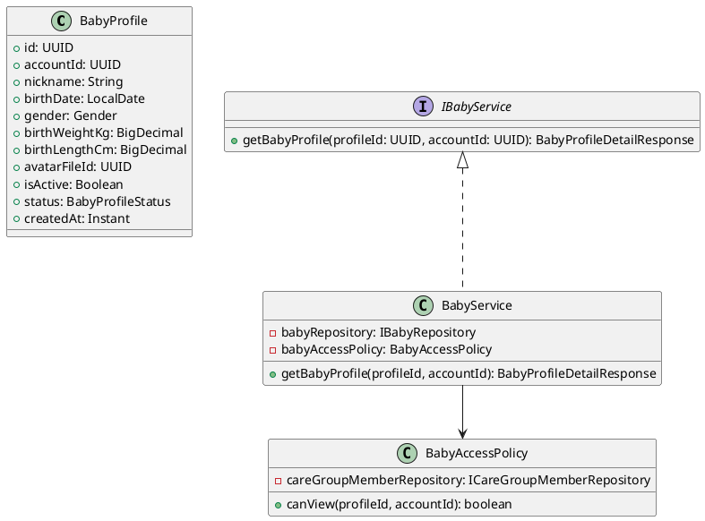
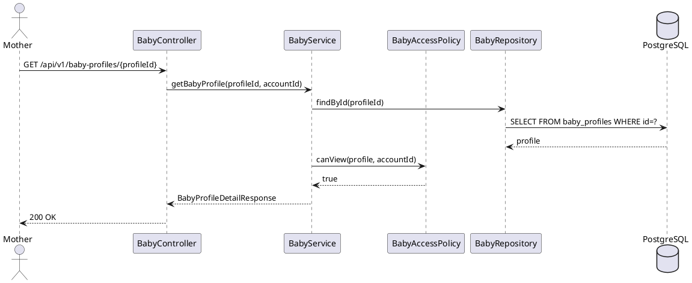

# ENGINEERING DOCUMENTATION STANDARD (EDS) v2.0
# Technical Design Specification — UC-192 View Baby Profile

| Field | Value |
|-------|-------|
| **Document ID** | `CB-BABY-IMP-002` |
| **Version** | `1.0` |
| **Date** | `2026-06-26` |
| **Status** | `Approved` |
| **Document Owner** | `PhuongNT` |
| **Author** | `AI Agent` |
| **Reviewed by** | `[Tech Lead]` |
| **DPO Sign-off** | `[ ] Pending` |
| **Approved by** | `[Principal Architect]` |
| **Last Review** | `2026-06-26` |
| **Based on EDS** | `v2.0` |

---

## CHANGELOG

| Ngày | Người thực hiện | Nội dung thay đổi |
|------|-----------------|-------------------|
| 2026-06-27 | AI Agent — Amelia (Dev Agent) | Implementation completed — service, controller, tests 🟢 GREEN (45/45) |
| 2026-06-26 | AI Agent | Tạo tài liệu lần đầu cho UC-192 View Baby Profile |

---

## MỤC LỤC

1. [Tổng quan Module](#1-tổng-quan-module)
2. [Ma trận Truy vết](#2-ma-trận-truy-vết)
3. [Architecture Decision Records](#3-architecture-decision-records)
4. [Non-Functional Requirements & SLA](#4-non-functional-requirements--sla)
5. [Static Modeling](#5-static-modeling)
6. [Dynamic Modeling](#6-dynamic-modeling)
7. [Interface Specification](#7-interface-specification)
8. [API Specification](#8-api-specification)
9. [API Specification (Detail)](#9-api-specification-detail)
10. [Bảng mã lỗi](#9-10-bảng-mã-lỗi)
11. [Kịch bản Kiểm thử](#11-kịch-bản-kiểm-thử)
12. [Authorization Matrix](#12-authorization-matrix)
13. [AI Prompt Constraints](#13-ai-prompt-constraints-case-20)
14. [Phương pháp Xác minh](#14-phương-pháp-xác-minh)
15. [Mẫu thử thực tế](#15-mẫu-thử-thực-tế)
16. [Authorization Matrix (Detail)](#16-authorization-matrix-detail)
17. [AI Prompt Constraints (Full)](#17-ai-prompt-constraints-case-20-full)

---

## 1. Tổng quan Module

| Field | Value |
|-------|-------|
| **Module Name** | `ViewBabyProfile` |
| **Bounded Context** | `baby` |
| **UC ID** | `UC-192` |
| **SRS Reference** | `3.3.12.1` |
| **Primary Actor** | `Mother (ROLE_MOTHER)` |
| **Platform** | `Mobile App` |
| **Data Classification** | `Sensitive-PII` |
| **Compliance Scope** | `BR-RBAC, BR-PRIVACY` |
| **Upstream Dependencies** | `auth, baby_profiles table` |
| **Downstream Consumers** | `baby daily log, vaccination, growth tracking` |

**Mô tả:** Hiển thị thông tin cơ bản và trạng thái theo dõi của một baby profile: nickname, ngày sinh, giới tính, cân nặng và chiều dài khi sinh, trạng thái (ACTIVE/ARCHIVED). Chỉ owner hoặc care group member có quyền xem.

---

## 2. Ma trận Truy vết

| Requirement ID | Loại | Mô tả | Thành phần Code | Compliance Target | ADR liên quan |
|----------------|------|-------|-----------------|-------------------|---------------|
| UC-192 | Use Case | Mother xem baby profile | `BabyController.getBabyProfile()` | BR-RBAC | ADR-BABY-003 |
| BR-BABY-010 | Business Rule | Chỉ account owner và care group members xem được | `BabyAccessPolicy.canView()` | BR-PRIVACY | ADR-BABY-003 |
| BR-BABY-011 | Business Rule | Archived profiles vẫn viewable nhưng có watermark | `status` trong response | Data Integrity | — |

---

## 3. Architecture Decision Records

### ADR-BABY-003 — Access Policy cho Baby Profile View

| Field | Value |
|-------|-------|
| **Status** | `Accepted` |
| **Date** | `2026-06-26` |

#### Quyết định
Baby profile có thể được xem bởi: (1) account owner, (2) care group members với invite_status=ACCEPTED. Expert không được xem trừ khi Mother chia sẻ qua consultation.

---

## 4. Non-Functional Requirements & SLA

| Category | Requirement | Target |
|----------|-------------|--------|
| Latency (p99) | GET response | `< 150ms` |
| Availability | Uptime | `99.9%` |

---

## 5. Static Modeling

### 5.1. Class Diagram



---

## 6. Dynamic Modeling

### 6.1. Sequence Diagram — Happy Path



---

## 7. Interface Specification

```java
// BabyProfileDetailResponse.java
public class BabyProfileDetailResponse {
    private UUID id;
    private String nickname;
    private LocalDate birthDate;
    private String gender;
    private BigDecimal birthWeightKg;
    private BigDecimal birthLengthCm;
    private String status;       // ACTIVE or ARCHIVED
    private boolean isActive;
    private Instant createdAt;
}

// IBabyService.java (addition to existing)
/**
 * @throws NotFoundException (BABY-004) when profile not found
 * @throws ForbiddenException (BABY-002) when caller lacks access
 */
BabyProfileDetailResponse getBabyProfile(UUID profileId, UUID accountId);
```

---

## 8. API Specification

| Method | Path | Auth Level | Required Roles | Rate Limit | Idempotent? |
|--------|------|------------|----------------|------------|-------------|
| `GET` | `/api/v1/baby-profiles/{profileId}` | JWT Bearer | `ROLE_MOTHER` | 100/min | Yes |

**Response 200:**
```json
{
  "id": "uuid-v4",
  "nickname": "Bean",
  "birthDate": "2026-01-15",
  "gender": "MALE",
  "birthWeightKg": 3.2,
  "birthLengthCm": 50.0,
  "status": "ACTIVE",
  "isActive": true,
  "createdAt": "2026-06-26T00:00:00.000Z"
}
```

---

## 9-10. Bảng mã lỗi

| Code | HTTP | Message (EN) | Trigger Condition |
|------|------|--------------|-------------------|
| `BABY-002` | 403 | Insufficient permissions | Caller lacks access rights |
| `BABY-004` | 404 | Baby profile not found | ID not found |
| `BABY-005` | 500 | Internal error | DB error |

---

## 11. Kịch bản Kiểm thử

```gherkin
Feature: View Baby Profile
  Scenario: Owner views own profile → 200
  Scenario: Care group member views profile → 200
  Scenario: Unrelated user views profile → 403
  Scenario: Non-existent profile → 404
  Scenario: Archived profile still viewable → 200 with status ARCHIVED
```

---

## 12. Authorization Matrix

| Endpoint | `GUEST` | `MOTHER (owner)` | `MOTHER (care member)` | `EXPERT` | `ADMIN` |
|----------|---------|------------------|------------------------|----------|---------|
| `GET /api/v1/baby-profiles/:id` | ❌ | ✅ | ✅ | ❌ | ✅ All |

---

## 9. API Specification (Detail)

### 9.1. Endpoints Table

| Method | Path | Auth Level | Required Roles | Rate Limit | Idempotent? |
|--------|------|------------|----------------|------------|-------------|
| `GET` | `/api/v1/baby-profiles/{profileId}` | JWT Bearer | `ROLE_MOTHER` | 100/min | Yes |

### 9.2. Request / Response Schemas

#### `GET /api/v1/baby-profiles/{profileId}`

**Request Headers:**
```
Authorization: Bearer <JWT_TOKEN>
```

**Response -- 200 OK (Owner or Care Group Member):**
```json
{
  "id": "uuid-v4",
  "nickname": "Bean",
  "birthDate": "2026-01-15",
  "gender": "MALE",
  "birthWeightKg": 3.2,
  "birthLengthCm": 50.0,
  "status": "ACTIVE",
  "isActive": true,
  "createdAt": "2026-06-26T00:00:00.000Z"
}
```

**Response -- 403 Forbidden (Not Owner/Member):**
```json
{
  "error": {
    "code": "BABY-002",
    "message": "Insufficient permissions to view this baby profile"
  }
}
```

**Response -- 404 Not Found:**
```json
{
  "error": {
    "code": "BABY-004",
    "message": "Baby profile not found"
  }
}
```

---

## 10. Bảng mã lỗi (Error Codes)

| Code | HTTP Status | Message (EN) | Message (VI) | Trigger Condition |
|------|-------------|--------------|--------------|-------------------|
| `BABY-002` | 403 | Insufficient permissions | Không đủ quyền truy cập | Caller is not owner and not care group member |
| `BABY-004` | 404 | Baby profile not found | Hồ sơ em bé không tồn tại | profileId not found in DB |
| `BABY-005` | 500 | Internal error | Lỗi hệ thống | Unexpected DB error |

---

## 13. Kịch bản Kiểm thử Chi tiết

> **Policy (EDS v2.0):** Mọi test scenario dùng dữ liệu `SYNTHETIC`.

```gherkin
Feature: View Baby Profile
  Background:
    Given test data classification: SYNTHETIC
    And MOTHER-001 là owner của BABY-001

  Scenario: Owner xem profile → 200
    When getBabyProfile(BABY-001, MOTHER-001)
    Then response 200 với nickname, birthDate, gender

  Scenario: Non-owner → 403
    Given MOTHER-002 KHÔNG phải owner
    When getBabyProfile(BABY-001, MOTHER-002)
    Then throws ForbiddenException BABY-002

  Scenario: Not found → 404
    When getBabyProfile(NONEXISTENT, MOTHER-001)
    Then throws NotFoundException BABY-004

  Scenario: Response không chứa diagnosis
    When getBabyProfile(BABY-001, MOTHER-001)
    Then response KHÔNG chứa "diagnosis", "prescription"
```

---

## 14. Phương pháp Xác minh

### 14.1. Database Inspection

```sql
-- Verify baby profile exists and belongs to caller
SELECT id, account_id, nickname, birth_date, gender, status
FROM baby_profiles WHERE id = '[profileId]';

-- Verify care group membership for non-owner access
SELECT cgm.member_role, cgm.invite_status
FROM care_group_members cgm
JOIN care_groups cg ON cg.id = cgm.group_id
WHERE cg.owner_account_id = (SELECT account_id FROM baby_profiles WHERE id = '[profileId]')
  AND cgm.member_account_id = '[callerId]'
  AND cgm.invite_status = 'ACCEPTED';
```

### 14.2. Access Policy Verification

```bash
# Verify owner access
curl -X GET https://[host]/api/v1/baby-profiles/[profileId] \
  -H "Authorization: Bearer [OWNER_JWT]"
# Expected: 200

# Verify non-owner, non-member access denied
curl -X GET https://[host]/api/v1/baby-profiles/[profileId] \
  -H "Authorization: Bearer [UNRELATED_USER_JWT]"
# Expected: 403
```

---

## 15. Mẫu thử thực tế (API Verification Samples)

### 15.1. Happy Path -- Owner

```bash
curl -X GET https://[host]/api/v1/baby-profiles/[profileId] \
  -H "Authorization: Bearer [JWT_MOTHER_TOKEN]"
# Expected: 200 {id, nickname, birthDate, gender, status}
```

### 15.2. Happy Path -- Care Group Member

```bash
curl -X GET https://[host]/api/v1/baby-profiles/[profileId] \
  -H "Authorization: Bearer [CARE_MEMBER_JWT]"
# Expected: 200 (same schema as owner)
```

### 15.3. Error Paths

```bash
# Unrelated user -> 403
curl -X GET https://[host]/api/v1/baby-profiles/[profileId] \
  -H "Authorization: Bearer [OTHER_USER_JWT]"

# Non-existent profile -> 404
curl -X GET https://[host]/api/v1/baby-profiles/non-existent-uuid \
  -H "Authorization: Bearer [JWT_MOTHER_TOKEN]"

# No JWT -> 401
curl -X GET https://[host]/api/v1/baby-profiles/[profileId]
```

---

## 16. Bảng tổng hợp phân quyền (Authorization Matrix Detail)

| Endpoint | `GUEST` | `MOTHER (owner)` | `MOTHER (care member)` | `EXPERT` | `ADMIN` |
|----------|---------|------------------|------------------------|----------|---------|
| `GET /api/v1/baby-profiles/{id}` | ❌ (401) | ✅ | ✅ (ACCEPTED only) | ❌ (403) | ✅ All |

**Chu thich:**
- Owner: account_id trong baby_profiles match JWT subject
- Care member: care_group_members.invite_status = ACCEPTED cho group cua owner
- Expert: khong co quyen xem truc tiep, chi qua consultation sharing

---

## 17. AI Prompt Constraints (CASE 2.0)

### 17.1 Constraint Summary Table

| # | Constraint | Source | Last Verified |
|---|-----------|--------|---------------|
| C1 | BabyAccessPolicy.canView() PHẢI check ownership AND care group membership | ADR-BABY-003 | 2026-06-26 |
| C2 | Archived profiles (status=ARCHIVED) vẫn trả về 200, không 404 | BR-BABY-011 | 2026-06-26 |
| C3 | accountId từ JWT — không từ URL | BR-RBAC | 2026-06-26 |
| C4 | Read-only endpoint — không side effects | — | 2026-06-26 |
| C5 | Response không chứa sensitive birth data ngoài scope | BR-PRIVACY | 2026-06-26 |

### 17.2 Constraint Injection Block

```
[CONSTRAINT BLOCK — Module: ViewBabyProfile (CB-BABY-IMP-002)]
1. BabyAccessPolicy.canView() PHẢI check: (a) account owner, HOẶC (b) care group member với invite_status=ACCEPTED — ADR-BABY-003
2. Archived profiles (status=ARCHIVED) vẫn trả về 200 với data — KHÔNG trả 404 — BR-BABY-011
3. accountId từ JWT SecurityContext, KHÔNG từ URL path parameter — BR-RBAC
4. Read-only endpoint — KHÔNG có side effects (no DB write, no audit event) — Design
5. Response KHÔNG chứa sensitive birth data ngoài scope (e.g., medical records, diagnosis) — BR-PRIVACY

[CONTEXT BLOCK]
- Bounded Context: baby
- Data Classification: Sensitive-PII
- Error codes: §10 Error Codes Table
- Auth matrix: §16 Authorization Matrix
```

### 17.3 Constraint Quality Checklist

- [x] Mỗi constraint traceable về ADR hoặc BR cụ thể
- [x] Không có constraint generic
- [x] Constraint block có ≥ 3 constraints cụ thể

### 17.4 Anti-Pattern Detection

| AP-ID | Anti-Pattern | Dấu hiệu | Hành động |
|-------|-------------|-----------|----------|
| AP-AI-001 | Unconstrained Gen | Code không match constraint C1-C5 | Reject — inject lại constraints |
| AP-AI-003 | Implicit Decision | Code assume architecture không có ADR | Reject — viết ADR trước |
| AP-AI-005 | Hallucinated Contract | Code import không có trong §7 | Reject — verify contract |

---

## PHỤ LỤC

### A. Glossary (Thuật ngữ)

| Thuật ngữ | Định nghĩa |
|-----------|------------|
| BabyAccessPolicy | Policy class kiểm tra quyền xem baby profile — check ownership và care group membership |
| CareGroupMember | Thành viên nhóm chăm sóc — có invite_status (PENDING, ACCEPTED, REJECTED) |
| PII Masking | Ẩn thông tin nhận dạng cá nhân trong API responses — áp dụng cho sensitive birth data |

### B. Tài liệu tham chiếu

| Document | Path |
|----------|------|
| EDS v2.0 Template | `08_References/Template/PHASE-3_TDS.md` |

---

*EDS v2.1 — Tích hợp CASE 2.0 AI Prompt Constraints (§17).*
