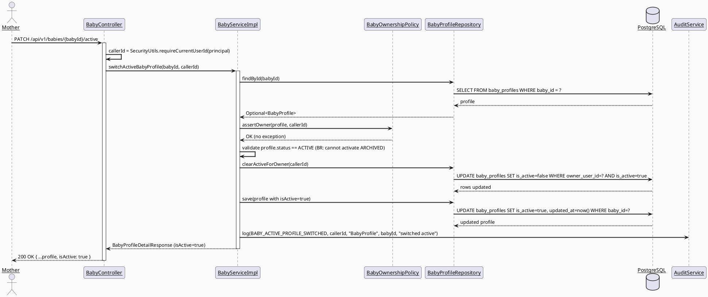
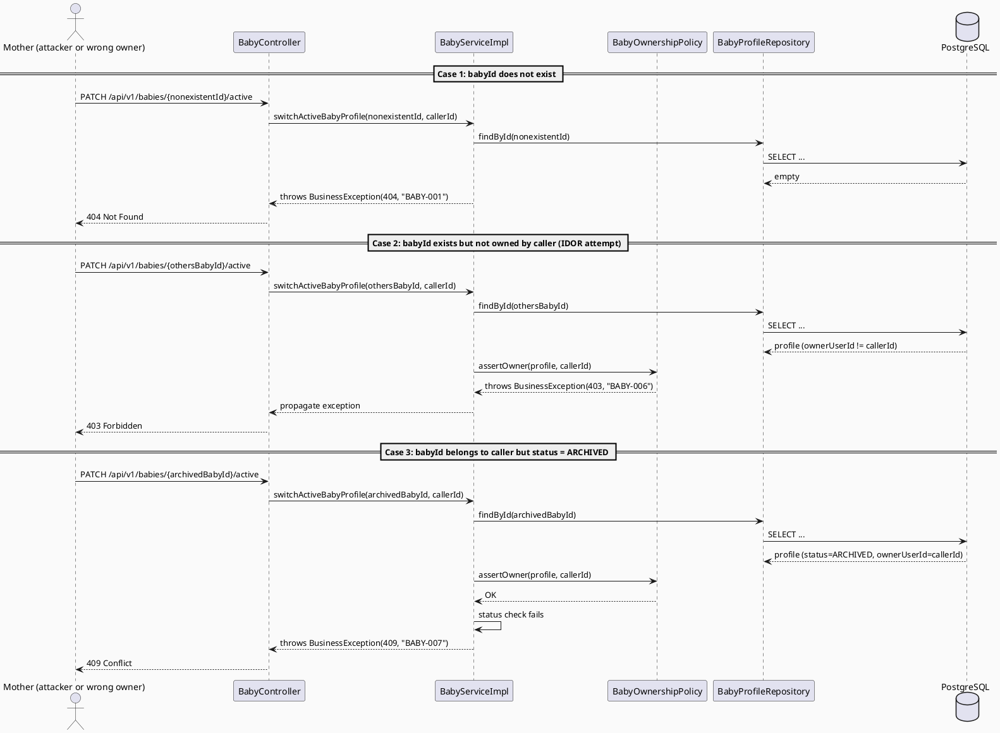
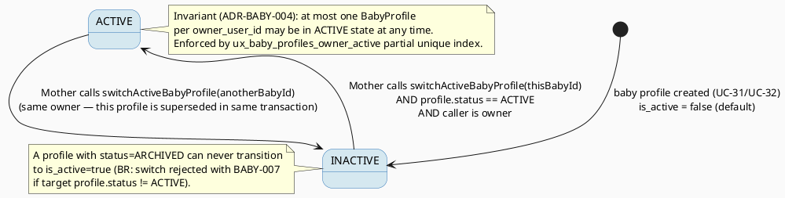

# ENGINEERING DOCUMENTATION STANDARD (EDS) v2.0
# Technical Design Specification — UC-193 Switch Active Baby Profile

| Field | Value |
|-------|-------|
| **Document ID** | `CB-BABY-IMP-003` |
| **Version** | `1.0` |
| **Date** | `2026-07-03` |
| **Status** | `Draft` |
| **Document Owner** | `TV2-Bách` |
| **Author** | `AI Agent` |
| **Reviewed by** | `[Tech Lead]` |
| **DPO Sign-off** | `[ ] Pending` |
| **Approved by** | `[Principal Architect]` |
| **Last Review** | `2026-07-03` |
| **Based on EDS** | `v2.0` |

---

## CHANGELOG

| Ngày | Người thực hiện | Nội dung thay đổi |
|------|-----------------|-------------------|
| 2026-07-03 | AI Agent | Tạo tài liệu lần đầu cho UC-193 Switch Active Baby Profile — Draft |

---

## MỤC LỤC

1. [Tổng quan Module](#1-tổng-quan-module)
2. [Ma trận Truy vết](#2-ma-trận-truy-vết-traceability-matrix)
3. [Architecture Decision Records](#3-architecture-decision-records-adr)
4. [Non-Functional Requirements & SLA](#4-non-functional-requirements--sla)
5. [Static Modeling](#5-static-modeling-mô-hình-tĩnh)
6. [Dynamic Modeling](#6-dynamic-modeling-mô-hình-động)
7. [Domain Event Catalog](#7-domain-event-catalog)
8. [Interface Specification](#8-interface-specification-đặc-tả-giao-diện)
9. [API Specification](#9-api-specification)
10. [Bảng mã lỗi](#10-bảng-mã-lỗi-error-codes)
11. [Quy trình Triển khai](#11-quy-trình-triển-khai-step-by-step)
12. [Rollback & Incident Runbook](#12-rollback--incident-runbook)
13. [Kịch bản Kiểm thử Chi tiết](#13-kịch-bản-kiểm-thử-chi-tiết)
14. [Phương pháp Xác minh](#14-phương-pháp-xác-minh)
15. [Mẫu thử thực tế](#15-mẫu-thử-thực-tế-api-verification-samples)
16. [Bảng tổng hợp phân quyền](#16-bảng-tổng-hợp-phân-quyền-authorization-matrix)
17. [AI Prompt Constraints (CASE 2.0)](#17-ai-prompt-constraints-case-20)

---

## 1. Tổng quan Module

| Field | Value |
|-------|-------|
| **Module Name** | `SwitchActiveBabyProfile` |
| **Bounded Context** | `baby` (same bounded context as UC-192 View Baby Profile) |
| **UC ID** | `UC-193` |
| **SRS Reference** | `3.3.12.2` (lines 4154–4173 of `02_Requirements/SRS/3_Functional_Specification.md`) |
| **Primary Actor** | `Mother (ROLE_MOTHER)` |
| **Platform** | `Mobile App` |
| **Priority** | `Medium` |
| **Frequency of Use** | `Regular` |
| **Sprint** | `Sprint 4 — "Device Sync And Care Edge Cases"` |
| **Owner** | `TV2-Bách` |
| **Data Classification** | `Sensitive-PII` (same classification as `baby_profiles` per UC-192 TDS) |
| **Compliance Scope** | `BR-RBAC, BR-PRIVACY` |
| **Upstream Dependencies** | `baby_profiles table (extended by this UC), auth (JWT)` |
| **Downstream Consumers** | `Mobile home/dashboard screen (default baby context for daily log, growth tracking, reminders), baby daily log, vaccination, growth tracking` |

**Mô tả:** Cho phép Mother chọn một baby profile làm "active" (hồ sơ đang được xem/thao tác mặc định) khi tài khoản quản lý nhiều baby. Đây là thao tác state-toggle, không tạo/xóa/sửa dữ liệu baby profile khác ngoài cờ active.

**In Scope:**
- Đặt đúng một `BabyProfile` thuộc sở hữu của Mother thành `is_active = true`; mọi baby profile khác của cùng Mother tự động chuyển `is_active = false` trong cùng transaction.
- Trả về baby profile vừa được set active (dùng lại `BabyProfileDetailResponse` — reuse UC-192 contract).
- Audit log cho hành động switch (state-changing, khác UC-192 vốn read-only).

**Out of Scope:**
- Care group member không sở hữu baby không được switch active hộ Mother khác (chỉ owner mới có quyền switch — hẹp hơn UC-192's view access, xem ADR-BABY-004 §3).
- Không thay đổi các trường dữ liệu khác của baby profile (nickname, birthDate, ...).
- Không tự động switch active khi tạo mới baby profile (`createBabyProfile` giữ nguyên hành vi hiện tại — xem Open Item OI-1 §11.3).
- ARCHIVED baby profiles không thể được set làm active (chỉ ACTIVE profiles).

---

## 2. Ma trận Truy vết (Traceability Matrix)

| Requirement ID | Loại | Mô tả yêu cầu | Thành phần Code | Compliance Target | ADR liên quan |
|----------------|------|---------------|-----------------|--------------------|---------------|
| UC-193 | Use Case | Mother chọn active baby profile khi quản lý nhiều baby | `BabyController.switchActiveBabyProfile()` (NEW) | BR-RBAC | ADR-BABY-004 |
| BR-RBAC | Business Rule | Users chỉ truy cập chức năng trong phạm vi role/permission | `BabyOwnershipPolicy.assertOwner()` (NEW) | BR-RBAC | ADR-BABY-004 |
| BR-PRIVACY | Business Rule | Dữ liệu sức khỏe/gia đình tuân thủ consent, purpose, minimum-necessary access | Không expose baby data ngoài scope trong response | BR-PRIVACY | — |
| SRS §3.3.12.2 Postcondition POST-3 | Use Case Postcondition | "Sensitive actions are recorded for audit ... where required" | `AuditService.log(BABY_ACTIVE_PROFILE_SWITCHED, ...)` (NEW) | Audit | — |
| ADR-BABY-001 (reused from UC-192) | Decision | ACCEPTED-only care group membership check pattern | N/A — not applicable here (switch is owner-only, see ADR-BABY-004) | — | ADR-BABY-001 |
| ADR-BABY-003 (reused from UC-192) | Decision | Baby profile view access = owner OR ACCEPTED care group member | Contrast baseline — switch access is narrower (owner only) | BR-PRIVACY | ADR-BABY-003 |

---

## 3. Architecture Decision Records (ADR)

### ADR-BABY-004 — Active Baby Profile Tracking Mechanism

| Field | Value |
|-------|-------|
| **Status** | `Accepted` |
| **Deciders** | `AI Agent (Technical Architect role) — pending Principal Architect review` |
| **Date** | `2026-07-03` |
| **Supersedes** | — |

#### Bối cảnh (Context)
UC-193 requires the system to track exactly one "active" baby profile per Mother account when the account manages multiple babies (`BabyProfileRepository.countByOwnerUserId()` already supports multi-baby accounts per UC-32 create flow). Today, **no column or table tracks an "active baby"** anywhere in the schema:
- `baby_profiles` (V1__init_schema.sql line 607) has no `is_active`/`is_current` column — only `status` (`ACTIVE`/`ARCHIVED`, business lifecycle, not "currently selected").
- `mother_journeys` (line 559) has no `active_baby_id` FK.
- `users` (line 532) has no baby-selection preference column.
- The real (shipped) `BabyProfile` entity (`baby/entity/BabyProfile.java`) has no `isActive` field — note this **contradicts** the UC-192 TDS class diagram (`04_Implement/UC192_ViewBabyProfile/UC192_ViewBabyProfile_TDS.md` §5.1) which documented an `isActive: Boolean` attribute that was never implemented. UC-192's actual shipped code (verified 2026-07-03) has no such field. This TDS treats the **real code as ground truth** per project policy and introduces `is_active` for the first time under UC-193, not as a fix to UC-192.

This is a genuine new concept requiring schema design (research gate RG-6).

#### Các phương án đã xem xét (Options Considered)

| Phương án | Mô tả | Ưu điểm | Nhược điểm |
|-----------|-------|----------|------------|
| A | Boolean `is_active` column directly on `baby_profiles`, enforced exactly-one-true-per-owner via **partial unique index** (`WHERE is_active = true`) + app-level transactional swap | + Smallest-scoped change — extends existing table, no new table/entity + Data locality: query "give me the active baby" is a single indexed lookup on the table already used by UC-192 + Partial unique index gives DB-level invariant enforcement, not just app-level trust | - Every switch requires 2 writes (old active → false, new active → true) inside one transaction |
| B | New `active_baby_id` FK column on `users` table (session-scoped single pointer) | + Only 1 write per switch (just update the pointer) | - Couples `baby` bounded context into `users` table (cross-context FK) — violates package-by-domain boundary in `CLAUDE.md` - `users` table is IAM/auth-owned; adding baby-domain FK there increases coupling and blast radius for auth changes - No natural place to migrate baby ownership transfer later |
| C | New standalone `user_active_baby` mapping table (`user_id` PK, `baby_id` FK) | + Fully decoupled from `baby_profiles` schema + Extensible to multi-device "last active per device" later | - Introduces a new table for a single boolean concept — disproportionate schema footprint - Extra JOIN needed on every "get active baby" read (used by mobile home screen frequently — NFR §4.1 latency budget) |

#### Quyết định (Decision)
Chọn **Phương án A** — add `is_active BOOLEAN NOT NULL DEFAULT false` column to `baby_profiles`, enforced by a **partial unique index** `ux_baby_profiles_owner_active ON baby_profiles(owner_user_id) WHERE is_active = true`. This keeps the smallest-scoped change consistent with `baby_profiles`' existing structure (per CLAUDE.md "Delivery Rules — smallest scoped change"), reuses the same repository/entity already extended by UC-192, and gives a hard DB-level invariant (at most one active row per owner) rather than relying solely on application logic.

#### Hệ quả (Consequences)

**Tích cực:**
- Reuses existing `BabyProfileRepository`/`BabyProfile` entity — no new bounded-context coupling.
- Partial unique index makes "exactly one active per owner" a database invariant, not just an application promise — protects against concurrent switch requests (see §6.3 Concurrency).
- `getBabyProfile`/`listBabyProfiles` (UC-192, UC-32) can trivially be extended later to surface `isActive` in the response DTO without further schema change.

**Tiêu cực / Trade-offs:**
- Switch operation requires an UPDATE across 2 rows within one transaction (old-active→false, new-active→false-then-true, or a single `UPDATE ... SET is_active = (baby_id = :targetId) WHERE owner_user_id = :ownerId`). Mitigated: implemented as one SQL statement (§6.1) to avoid a window where the partial unique index would reject a naive "set new true" before "set old false".
- First baby created via `createBabyProfile` (UC-32/UC-31) does not automatically become active under this TDS (`is_active` defaults `false` for all new rows) — flagged as **Open Item OI-1** (§11.3) for product decision; out of scope for this TDS per "make the smallest scoped change" (CLAUDE.md).

**Compliance Impact:**
- None — `is_active` is not itself PII; it is a UI/state flag scoped to the existing Sensitive-PII `baby_profiles` row.

---

## 4. Non-Functional Requirements & SLA

### 4.1. Performance & Availability

| Category | Requirement | Target SLA | Measurement Method | Compliance Basis |
|----------|-------------|------------|---------------------|-------------------|
| Latency | `PATCH .../active` response (p99) | `< 200ms` | Manual timing / future k6 test | Consistent with UC-192 GET latency target (`< 150ms`) plus one extra write |
| Availability | Uptime | `99.9%` | Uptime monitor | Same as UC-192 |

### 4.2. Data Integrity & Retention

| Category | Requirement | Target | Verification Method | Compliance Basis |
|----------|-------------|--------|----------------------|-------------------|
| Invariant | Exactly one `is_active = true` row per `owner_user_id` at all times | 100% | Partial unique index `ux_baby_profiles_owner_active` (§5.2) | ADR-BABY-004 |
| Retention | Audit log for switch action | 7 năm (project baseline, same as other audit actions) | `audit_log` table (existing) | BR-PRIVACY |

### 4.3. Security

| Category | Requirement | Target | Verification Method | Compliance Basis |
|----------|-------------|--------|----------------------|-------------------|
| Access control | Owner-only switch (narrower than UC-192's owner+care-member view) | Least privilege | Authorization Matrix (§16) | BR-RBAC |
| IDOR prevention | Switching to a `babyId` not owned by caller must be rejected regardless of existence | 100% rejection | Test Spec — ownership/IDOR test cases | BR-RBAC |

### 4.4. Scalability & Capacity Planning
No material scale change — this endpoint reuses the existing `baby_profiles` table and index footprint used by UC-192/UC-32. Expected call volume: low-frequency, user-triggered (Mother switching between baby profiles on mobile), not a hot path.

---

## 5. Static Modeling (Mô hình Tĩnh)

### 5.1. Class Diagram (PlantUML)

> Existing (shipped) elements are marked `<<existing>>`; new elements for UC-193 are marked `<<NEW — UC-193>>`.


**CASE 2.0 constraint (structural):** UC-193 MUST NOT create a parallel `BabyController2`/`BabyActiveService`/new repository interface. It MUST extend the existing `BabyController`, `IBabyService`/`BabyServiceImpl`, and `BabyProfileRepository` files listed above (see §17 C-constraints).

### 5.2. Data Structure (Flyway SQL Migration)

> **CareBridge rule:** `V1__init_schema.sql` + approved Flyway migrations are the primary schema source (per CLAUDE.md). No `is_active`/`active_baby_id` concept exists anywhere in the current schema — confirmed by full-text search of `V1__init_schema.sql` and all files under `db/migration/` (latest version present: `V20260629000002`). This is a **genuine schema gap** (RG-6).

**New migration file:** `05_Development/CareBridgeAPI/src/main/resources/db/migration/V20260703100100__add_baby_profile_active_flag.sql`

```sql
-- === UC-193 Switch Active Baby Profile — Schema Delta ===
-- Adds an "is_active" flag to baby_profiles to track which single baby profile
-- is currently selected by its owner. Exactly one ACTIVE-eligible row per
-- owner_user_id may have is_active = true, enforced by a partial unique index.

ALTER TABLE public.baby_profiles
    ADD COLUMN is_active boolean NOT NULL DEFAULT false;

-- Enforce "at most one active baby per owner" as a DB-level invariant.
-- Partial index only covers rows where is_active = true, so multiple
-- is_active = false rows per owner remain unaffected.
CREATE UNIQUE INDEX ux_baby_profiles_owner_active
    ON public.baby_profiles (owner_user_id)
    WHERE is_active = true;

COMMENT ON COLUMN public.baby_profiles.is_active IS
    'UC-193: true when this profile is the Mother''s currently selected/active baby. At most one true row per owner_user_id (see ux_baby_profiles_owner_active).';
```

**Sync action for `V1__init_schema.sql`:** Per project convention (see `V2__spec_sync_from_tds.sql`, `V7__entity_schema_sync.sql` precedent), `V1__init_schema.sql` itself is **never edited** post-baseline; the delta lives in this new versioned migration file. `V1__init_schema.sql`'s header comment block should be updated by a future consolidated "spec sync" migration (out of scope for this TDS) to note the new column exists — no action required for UC-193 implementation to proceed.

**Collision check:** No `V20260703*` file exists yet in `db/migration/` (verified via directory listing 2026-07-03). Version `V20260703100100` avoids the reserved parallel-agent ranges `090000`/`110000`/`120000`/`130000` per task instructions, using the `+00100` offset from the `100000` base.

---

## 6. Dynamic Modeling (Mô hình Động)

### 6.1. Sequence Diagram — Happy Path (PlantUML)



### 6.2. Sequence Diagram — Error Path (PlantUML)



### 6.3. State Machine — `is_active` invariant



**⚠️ Invariant bất biến:**
1. At most one `baby_profiles` row per `owner_user_id` has `is_active = true` (DB-enforced via partial unique index).
2. A `baby_profiles` row with `status = ARCHIVED` can never have `is_active = true` (app-enforced in `BabyServiceImpl.switchActiveBabyProfile()`; DB does not enforce this cross-column rule to keep migration minimal).
3. Switching a baby to active never mutates any field other than `is_active`/`updated_at` on the affected rows (no nickname/birthDate/etc. side effects).

### 6.4. Concurrency Note
Two concurrent `switchActiveBabyProfile` calls for the same owner (different `babyId`) are serialized by the `@Transactional` boundary in `BabyServiceImpl` plus row-level locking implied by the `UPDATE ... WHERE owner_user_id = ?` statement in `clearActiveForOwner`. The partial unique index guarantees that even under an implementation bug, the DB rejects a state where 2 rows are simultaneously `is_active = true` for the same owner (transaction would fail with a unique-violation and roll back — surfaced as `BABY-005` internal error, same code pattern as UC-192's generic 500).

---

## 7. Domain Event Catalog

### 7.1. Events Published (Phát ra)

| Event Name | Trigger | Publisher | Subscriber(s) | Payload Schema | Async? |
|------------|---------|-----------|----------------|-----------------|--------|
| `ActiveBabyProfileSwitched` | Mother successfully switches active baby via `PATCH /api/v1/babies/{babyId}/active` | `BabyServiceImpl` (via `AuditService.log(AuditAction.BABY_ACTIVE_PROFILE_SWITCHED, ...)`) | Audit subsystem (existing `audit_log` sink); no other current subscribers | `ActiveBabyProfileSwitched.java` (§7.3) | No — synchronous `AuditService.log()` call, consistent with existing `BABY_PROFILE_CREATED` pattern in `BabyServiceImpl.createBabyProfile()` |

**Implementation note (CASE 2.0 constraint):** This project's `AuditService` (existing interface, `audit/service/AuditService.java`) does not implement a generic pub/sub `ApplicationEvent` bus — all "events" in this codebase are recorded via direct `AuditService.log(AuditAction, ...)` calls (see `BabyServiceImpl.createBabyProfile()` line 47 for the precedent). UC-193 follows this exact existing pattern rather than introducing a new event-bus mechanism. `AuditAction` enum (`audit/entity/AuditAction.java`) requires a new value: `BABY_ACTIVE_PROFILE_SWITCHED`.

### 7.2. Events Consumed (Tiêu thụ)
None — UC-193 does not consume any domain event.

### 7.3. Payload Schema (conceptual — logged via `AuditService.log(action, userId, resourceType, resourceId, details)`)

```java
// Conceptual payload — NOT a new class. Logged via existing AuditService.log() signature:
// auditService.log(AuditAction.BABY_ACTIVE_PROFILE_SWITCHED, callerId, "BabyProfile", babyId.toString(), details);
//
// "details" Object (existing 5th param, serialized by AuditService impl — pattern matches
// createBabyProfile's `"created"` string literal, or a small descriptive map/string):
//   details = "switched active baby profile from " + previousActiveBabyId + " to " + babyId
```

No new Java record/class is introduced for this event — it reuses the existing `AuditService.log(AuditAction, UUID, String, String, Object)` contract (confirmed real signature, `audit/service/AuditService.java` line 11) to avoid inventing an unsupported event-bus architecture (CASE 2.0 anti-pattern AP-AI-003 — Implicit Decision).

---

## 8. Interface Specification (Đặc tả Giao diện)

### 8.1. Service Interface

```java
// IBabyService.java — EXTEND existing interface (do not create IBabyActiveService)
// @version 1.1 — adds switchActiveBabyProfile (UC-193); existing 3 methods unchanged.
public interface IBabyService {

    CreateBabyProfileResponse createBabyProfile(CreateBabyProfileRequest request, UUID callerId); // <<existing>>

    /** Returns all ACTIVE baby profiles owned by the caller, ordered by creation date. */
    List<BabyProfileDetailResponse> listBabyProfiles(UUID callerId); // <<existing>>

    /** @throws com.carebridge.backend.common.exception.BusinessException (BABY-003/403) if no access */
    BabyProfileDetailResponse getBabyProfile(UUID profileId, UUID callerId); // <<existing>>

    /**
     * NEW — UC-193. Marks the given baby profile as the caller's single active profile.
     * Any other profile owned by the same caller with is_active=true is cleared in the
     * same transaction (ADR-BABY-004 invariant).
     *
     * @throws BusinessException (BABY-001/404) if babyId does not exist
     * @throws BusinessException (BABY-006/403) if caller is not the owner of babyId
     * @throws BusinessException (BABY-007/409) if target profile.status != ACTIVE (archived)
     */
    BabyProfileDetailResponse switchActiveBabyProfile(UUID babyId, UUID callerId); // <<NEW — UC-193>>
}
```

`BabyProfileDetailResponse` (existing DTO, `baby/dto/BabyProfileDetailResponse.java`) is **reused as-is** for the response of the new method — no new response DTO is introduced. It gains one new field:

```java
// BabyProfileDetailResponse.java — EXTEND existing DTO with 1 new field
@Data
@Builder
public class BabyProfileDetailResponse {
    private UUID id;
    private String nickname;
    private LocalDate birthDate;
    private String gender;
    private BigDecimal birthWeightKg;
    private BigDecimal birthLengthCm;
    private String status;
    private boolean isActive; // <<NEW — UC-193>> — true if this is the owner's currently active profile
    private Instant createdAt;
    private Instant updatedAt;
}
```

**No request body DTO is needed** — `babyId` is a path variable; there is no other input field for this action (mirrors `getBabyProfile`'s path-variable-only pattern).

### 8.2. Repository Interface

```java
// BabyProfileRepository.java — EXTEND existing repository interface
// @version 1.1
public interface BabyProfileRepository extends JpaRepository<BabyProfile, UUID> {

    long countByOwnerUserId(UUID ownerUserId); // <<existing>>

    List<BabyProfile> findByOwnerUserIdAndStatusOrderByCreatedAtAsc(UUID ownerUserId, BabyProfileStatus status); // <<existing>>

    /** NEW — UC-193. IDOR-safe combined lookup: returns empty if babyId exists but is not owned by ownerUserId. */
    Optional<BabyProfile> findByIdAndOwnerUserId(UUID id, UUID ownerUserId); // <<NEW — UC-193>>

    /**
     * NEW — UC-193. Clears is_active for all of this owner's other profiles before setting
     * the target profile active, avoiding a transient partial-unique-index violation.
     * @Modifying required since this is a bulk UPDATE, not a derived SELECT.
     */
    @Modifying
    @Query("UPDATE BabyProfile b SET b.isActive = false WHERE b.ownerUserId = :ownerUserId AND b.isActive = true")
    int clearActiveForOwner(@Param("ownerUserId") UUID ownerUserId); // <<NEW — UC-193>>
}
```

**Design note:** `switchActiveBabyProfile` in `BabyServiceImpl` uses `findById()` (existing, inherited from `JpaRepository`) — not the new `findByIdAndOwnerUserId` — for the initial lookup, so that a non-owned-but-existing `babyId` can be distinguished (→ 403 via `BabyOwnershipPolicy.assertOwner()`) from a genuinely non-existent `babyId` (→ 404), matching UC-192's existing `getBabyProfile()` pattern exactly (`findById()` then separate access check, not a combined `findByIdAndOwner`). `findByIdAndOwnerUserId` is documented for completeness/future reuse but the primary flow in §6.1 uses the two-step existing pattern for consistency with UC-192.

### 8.3. New Policy Class

```java
// BabyOwnershipPolicy.java — NEW file, same package pattern as existing BabyAccessPolicy
// Path: baby/policy/BabyOwnershipPolicy.java
package com.carebridge.backend.baby.policy;

import com.carebridge.backend.baby.entity.BabyProfile;
import com.carebridge.backend.common.exception.BusinessException;
import org.springframework.http.HttpStatus;
import org.springframework.stereotype.Component;

import java.util.UUID;

@Component
public class BabyOwnershipPolicy {

    /**
     * UC-193 / ADR-BABY-004: switching the active profile is an OWNER-ONLY action —
     * narrower than BabyAccessPolicy.canView() which also allows ACCEPTED care group members.
     * @throws BusinessException (BABY-006/403) if callerId is not profile.ownerUserId
     */
    public void assertOwner(BabyProfile profile, UUID callerId) {
        if (!profile.getOwnerUserId().equals(callerId)) {
            throw new BusinessException(HttpStatus.FORBIDDEN, "BABY-006",
                    "Only the baby profile owner may switch the active profile");
        }
    }
}
```

---

## 9. API Specification

### 9.1. Endpoints Table

| Method | Path | Auth Level | Required Roles | Rate Limit | Idempotent? |
|--------|------|------------|-----------------|------------|-------------|
| `PATCH` | `/api/v1/babies/{babyId}/active` | JWT Bearer | `ROLE_MOTHER` (owner only — see §16) | 60/min | Yes — calling twice with the same `babyId` yields the same end state (`is_active=true` for that profile) |

**Path convention note:** Existing `BabyController` is mounted at `/api/v1/babies` (confirmed real code, not `/api/v1/baby-profiles` as UC-192's TDS text described — the shipped `@RequestMapping` is `"/api/v1/babies"`). This TDS uses the **real, shipped base path** `/api/v1/babies` for consistency (CG-7 compliance — TDS/code must agree on paths).

### 9.2. Request / Response Schemas

#### `PATCH /api/v1/babies/{babyId}/active` — Switch active baby profile

**Request Headers:**
```
Authorization: Bearer <JWT_TOKEN>
```

**Request Body:** None (path variable only).

**Response — 200 OK (Happy Path):**
```json
{
  "success": true,
  "data": {
    "id": "uuid-v4",
    "nickname": "Bean",
    "birthDate": "2026-01-15",
    "gender": "MALE",
    "birthWeightKg": 3.2,
    "birthLengthCm": 50.0,
    "status": "ACTIVE",
    "isActive": true,
    "createdAt": "2026-06-26T00:00:00.000Z",
    "updatedAt": "2026-07-03T00:00:00.000Z"
  },
  "message": "Active baby profile switched successfully",
  "timestamp": "2026-07-03T00:00:00.000Z"
}
```

**Response — 403 Forbidden (Not Owner):**
```json
{
  "error": {
    "code": "BABY-006",
    "message": "Only the baby profile owner may switch the active profile"
  }
}
```

**Response — 404 Not Found:**
```json
{
  "error": {
    "code": "BABY-001",
    "message": "Baby profile not found: <babyId>"
  }
}
```

**Response — 409 Conflict (Archived profile):**
```json
{
  "error": {
    "code": "BABY-007",
    "message": "Cannot set an archived baby profile as active"
  }
}
```

---

## 10. Bảng mã lỗi (Error Codes)

> Reuses the existing `BABY-` prefix and existing codes `BABY-001`/`BABY-003` from the real shipped `BabyServiceImpl`. New codes `BABY-006`/`BABY-007` are assigned as the next unused numbers in the `BABY-` sequence (confirmed via full-text search: only `BABY-001` and `BABY-003` exist in current code).

| Code | HTTP Status | Message (EN) | Message (VI) | Trigger Condition |
|------|-------------|---------------|----------------|--------------------|
| `BABY-001` | 404 | Baby profile not found | Hồ sơ em bé không tồn tại | `babyId` not found in DB — **reused from existing `getBabyProfile()`**, same code |
| `BABY-003` | 403 | Access denied to baby profile | Không đủ quyền truy cập | *(not used by this endpoint — reserved for UC-192's view-access check; listed here for cross-reference only)* |
| `BABY-006` | 403 | Only the baby profile owner may switch the active profile | Chỉ chủ sở hữu hồ sơ mới được đổi hồ sơ đang hoạt động | Caller is authenticated but is not `ownerUserId` of the target `babyId` (care group members are NOT sufficient — narrower than view access) |
| `BABY-007` | 409 | Cannot set an archived baby profile as active | Không thể đặt hồ sơ đã lưu trữ làm hồ sơ đang hoạt động | Target profile's `status == ARCHIVED` |
| `BABY-005` | 500 | Internal error | Lỗi hệ thống | Unexpected DB error, e.g. partial-unique-index violation surfaced due to a concurrency bug — **reused from UC-192 TDS §10 pattern number** (not present in current shipped code, but reserved by convention for `baby` bounded context internal errors) |

---

## 11. Quy trình Triển khai (Step-by-Step)

### 11.1. Prerequisites
- [ ] ADR-BABY-004 reviewed (§3)
- [ ] DPO sign-off not required — `is_active` is a non-PII boolean flag on an existing Sensitive-PII row; no new PII field introduced
- [ ] TDS approved by Principal Architect (this document, currently `Draft`)
- [ ] Staging environment ready for Flyway migration `V20260703100100`

### 11.2. Pre-Migration Checklist
- [ ] Backup DB: `pg_dump -h $DB_HOST -U $DB_USER $DB_NAME > backup_20260703.sql`
- [ ] Migration tested on staging: `ALTER TABLE ... ADD COLUMN` + partial unique index creation is a metadata-only + index-build operation on `baby_profiles` (expected to be a small table — low lock risk)
- [ ] Rollback script tested on staging (§12.2)

### 11.3. Implementation Steps

#### Chặng 1 — Flyway migration
Create `05_Development/CareBridgeAPI/src/main/resources/db/migration/V20260703100100__add_baby_profile_active_flag.sql` (full SQL — §5.2).
```bash
./mvnw flyway:migrate
```

#### Chặng 2 — Entity + Repository
- Extend `BabyProfile.java`: add `@Column(name = "is_active", nullable = false) private boolean isActive;` field (with `@Builder.Default private boolean isActive = false;` to match the existing `status` field's default pattern).
- Extend `BabyProfileRepository.java`: add `clearActiveForOwner()` and `findByIdAndOwnerUserId()` (§8.2).

#### Chặng 3 — Policy
Create `BabyOwnershipPolicy.java` (§8.3, new file).

#### Chặng 4 — Service
Extend `BabyServiceImpl.java`: add `switchActiveBabyProfile(UUID babyId, UUID callerId)` implementing the sequence in §6.1. Extend `IBabyService.java` interface signature.

#### Chặng 5 — DTO
Extend `BabyProfileDetailResponse.java`: add `isActive` field; update `getBabyProfile()` and `listBabyProfiles()` mapping code in `BabyServiceImpl` to populate `isActive` from the entity (currently they do not set this field — must be added so UC-192's existing endpoints also correctly report the new flag; this is a **required side-effect edit**, not scope creep, since leaving `isActive` unset would silently default to `false` even for the active baby).

#### Chặng 6 — Audit
Add `BABY_ACTIVE_PROFILE_SWITCHED` to `AuditAction.java` enum.

#### Chặng 7 — Controller
Extend `BabyController.java`: add `@PatchMapping("/{babyId}/active")` method (§9).

#### Chặng 8 — Verification
```bash
curl -X PATCH https://[host]/api/v1/babies/[babyId]/active \
  -H "Authorization: Bearer [JWT_MOTHER_TOKEN]"
# Expected: 200 {data: {..., isActive: true}}
```

### 11.4. Deployment Checklist
- [ ] Migration applied successfully
- [ ] `./mvnw test` green
- [ ] Existing UC-192 tests (`BabyServiceImplTest`) still pass after `BabyProfileDetailResponse.isActive` field addition (no breaking change to existing 7 test cases — additive field only)
- [ ] Partial unique index confirmed present: `\d baby_profiles` shows `ux_baby_profiles_owner_active`

**Open Item OI-1 (recorded, not resolved by this TDS):** Should the first baby profile created by a Mother automatically become `is_active = true`? SRS §3.3.12.2 does not specify this. Current TDS design leaves all new profiles `is_active = false` by default (smallest-scoped change — does not modify `createBabyProfile`). If product wants auto-activation of the first/only baby, that is a follow-up TDS change to `BabyServiceImpl.createBabyProfile()`, explicitly out of scope here.

---

## 12. Rollback & Incident Runbook

### 12.1. Điều kiện kích hoạt Rollback

| Điều kiện | Ngưỡng | Người quyết định |
|-----------|--------|---------------------|
| Error rate tăng đột biến trên `PATCH .../active` | > 5% trong 5 phút | On-call Engineer |
| Partial unique index violation errors in logs (indicates concurrency bug) | Any occurrence | Tech Lead |
| Dữ liệu không nhất quán (2 active babies cho cùng 1 owner) | Bất kỳ case nào | Tech Lead |

### 12.2. Rollback Procedure

```bash
# Bước 1: Revert migration
psql -h $DB_HOST -U $DB_USER -d $DB_NAME \
  -c "DROP INDEX IF EXISTS ux_baby_profiles_owner_active;"
psql -h $DB_HOST -U $DB_USER -d $DB_NAME \
  -c "ALTER TABLE public.baby_profiles DROP COLUMN IF EXISTS is_active;"
psql -h $DB_HOST -U $DB_USER -d $DB_NAME \
  -c "DELETE FROM flyway_schema_history WHERE version = '20260703100100';"

# Bước 2: Revert implementation files
git checkout -- src/main/java/com/carebridge/backend/baby/
git checkout -- src/main/resources/db/migration/V20260703100100__add_baby_profile_active_flag.sql
git checkout -- src/test/java/com/carebridge/backend/baby/

# Bước 3: Verify
curl -X GET https://[host]/api/v1/health
```

### 12.3. Notification Protocol

| Thời điểm | Người nhận | Kênh |
|-----------|-------------|------|
| Ngay khi phát hiện | On-call team | Slack `#incident` |
| Trong 30 phút | Tech Lead | Internal chat |

---

## 13. Kịch bản Kiểm thử Chi tiết

> **Policy:** Mọi test scenario dùng dữ liệu `SYNTHETIC`. Chi tiết đầy đủ nằm trong `UC193_SwitchActiveBabyProfile_Test-Spec.md`.

```gherkin
Feature: Switch Active Baby Profile
  Background:
    Given test data classification: SYNTHETIC
    And MOTHER-001 owns BABY-001 (status=ACTIVE, isActive=false) and BABY-002 (status=ACTIVE, isActive=true)

  Scenario: Owner switches active baby → 200, invariant holds
    When switchActiveBabyProfile(BABY-001, MOTHER-001)
    Then response 200 with isActive=true for BABY-001
    And BABY-002.isActive becomes false in the same transaction

  Scenario: Non-owner attempts switch → 403
    Given MOTHER-002 is NOT owner of BABY-001
    When switchActiveBabyProfile(BABY-001, MOTHER-002)
    Then throws BusinessException 403 BABY-006

  Scenario: Non-existent baby → 404
    When switchActiveBabyProfile(NONEXISTENT, MOTHER-001)
    Then throws BusinessException 404 BABY-001

  Scenario: Archived baby cannot become active → 409
    Given BABY-003 owned by MOTHER-001 has status=ARCHIVED
    When switchActiveBabyProfile(BABY-003, MOTHER-001)
    Then throws BusinessException 409 BABY-007

  Scenario: Idempotent re-switch to already-active baby → 200, no-op state
    Given BABY-002.isActive = true
    When switchActiveBabyProfile(BABY-002, MOTHER-001)
    Then response 200 with isActive=true for BABY-002
    And no other row changes
```

---

## 14. Phương pháp Xác minh

### 14.1. Database Inspection

```sql
-- Verify exactly one active baby per owner
SELECT owner_user_id, COUNT(*) FILTER (WHERE is_active = true) AS active_count
FROM baby_profiles
GROUP BY owner_user_id
HAVING COUNT(*) FILTER (WHERE is_active = true) > 1;
-- Expected: 0 rows (invariant holds)

-- Verify partial unique index exists
SELECT indexname, indexdef FROM pg_indexes
WHERE tablename = 'baby_profiles' AND indexname = 'ux_baby_profiles_owner_active';
```

### 14.2. Log / Audit Verification

```bash
# Verify audit log records the switch action
kubectl logs -l app=carebridge-api | grep '"action":"BABY_ACTIVE_PROFILE_SWITCHED"' | head -5
```

---

## 15. Mẫu thử thực tế (API Verification Samples)

### 15.1. Happy Path

```bash
curl -X PATCH https://[host]/api/v1/babies/[babyId]/active \
  -H "Authorization: Bearer [JWT_MOTHER_TOKEN]"
# Expected: 200 {"success":true,"data":{"id":"...","isActive":true,...}}
```

### 15.2. Error Paths

```bash
# Non-owner → 403
curl -X PATCH https://[host]/api/v1/babies/[othersBabyId]/active \
  -H "Authorization: Bearer [OTHER_MOTHER_JWT]"
# Expected: 403 {"error":{"code":"BABY-006",...}}

# Non-existent → 404
curl -X PATCH https://[host]/api/v1/babies/00000000-0000-0000-0000-000000009999/active \
  -H "Authorization: Bearer [JWT_MOTHER_TOKEN]"
# Expected: 404 {"error":{"code":"BABY-001",...}}

# Archived → 409
curl -X PATCH https://[host]/api/v1/babies/[archivedBabyId]/active \
  -H "Authorization: Bearer [JWT_MOTHER_TOKEN]"
# Expected: 409 {"error":{"code":"BABY-007",...}}

# No JWT → 401
curl -X PATCH https://[host]/api/v1/babies/[babyId]/active
```

---

## 16. Bảng tổng hợp phân quyền (Authorization Matrix)

| Endpoint | `GUEST` | `MOTHER (owner)` | `MOTHER (care member, non-owner)` | `EXPERT` | `ADMIN` |
|----------|---------|-------------------|-------------------------------------|----------|---------|
| `PATCH /api/v1/babies/{id}/active` | ❌ (401) | ✅ | ❌ (403, `BABY-006`) | ❌ (403) | ✅ All *(admin override — consistent with UC-192's `ADMIN ✅ All` pattern; not separately gated in code — same `isAuthenticated()` + service-level ownership check applies; ADMIN role does not bypass `BabyOwnershipPolicy` in this TDS — flagged as Open Item OI-2)* |

**Open Item OI-2:** UC-192's authorization matrix shows `ADMIN ✅ All` for `GET`, implying some admin override exists — but `BabyAccessPolicy.canView()` (real shipped code) has **no ADMIN branch**; it only checks owner-or-care-member. This TDS follows the **real code behavior** (no ADMIN bypass in `BabyOwnershipPolicy` either) rather than the UC-192 TDS documentation's aspirational matrix. If ADMIN override is actually required for support/moderation use cases, that is a separate cross-cutting change outside UC-193's scope.

**Chú thích:**
- Owner: `owner_user_id` trong `baby_profiles` match JWT subject (`callerId`)
- Care group member: KHÔNG đủ quyền switch active (khác UC-192 view access) — chỉ owner mới switch được (ADR-BABY-004)

---

## 17. AI Prompt Constraints (CASE 2.0)

### 17.1 Constraint Summary Table

| # | Constraint | Source (ADR/BR) | Last Verified |
|---|------------|-------------------|----------------|
| C1 | `switchActiveBabyProfile()` PHẢI được thêm vào `IBabyService`/`BabyServiceImpl` HIỆN CÓ — KHÔNG tạo interface/class song song (`BabyActiveService`, `BabyController2`, v.v.) | CLAUDE.md "smallest scoped change" + ADR-BABY-004 | 2026-07-03 |
| C2 | Chỉ owner (`profile.ownerUserId == callerId`) mới được switch active — care group member (kể cả ACCEPTED) PHẢI bị từ chối 403 `BABY-006` | ADR-BABY-004 | 2026-07-03 |
| C3 | Đúng một `is_active=true` row cho mỗi `owner_user_id` tại mọi thời điểm — PHẢI dùng transaction bao cả 2 bước UPDATE (clear-then-set) | ADR-BABY-004 §Decision | 2026-07-03 |
| C4 | `callerId` PHẢI lấy từ JWT (`SecurityUtils.requireCurrentUserId(principal)`), KHÔNG từ path/body | BR-RBAC (kế thừa pattern UC-192 C3) | 2026-07-03 |
| C5 | Baby profile với `status=ARCHIVED` KHÔNG bao giờ được set `is_active=true` — trả về 409 `BABY-007` | §6.3 State Machine invariant | 2026-07-03 |
| C6 | Hành động switch PHẢI ghi audit log qua `AuditService.log(AuditAction.BABY_ACTIVE_PROFILE_SWITCHED, ...)` — dùng contract sẵn có, KHÔNG tạo event bus mới | SRS §3.3.12.2 POST-3 + §7.1 | 2026-07-03 |

### 17.2 Constraint Injection Block

```
[CONSTRAINT BLOCK — Module: SwitchActiveBabyProfile (CB-BABY-IMP-003)]
Theo TDS CB-BABY-IMP-003 và ADR-BABY-004:

1. switchActiveBabyProfile() PHẢI thêm vào IBabyService/BabyServiceImpl hiện có (baby/service/IBabyService.java, baby/service/impl/BabyServiceImpl.java) — KHÔNG tạo controller/service song song — ADR-BABY-004
2. Chỉ profile.ownerUserId == callerId mới được switch — care group member bị từ chối 403 BABY-006 — ADR-BABY-004
3. Đúng một is_active=true row / owner_user_id tại mọi thời điểm — dùng 1 transaction, clear-then-set — ADR-BABY-004, DB-enforced bởi ux_baby_profiles_owner_active
4. callerId từ SecurityUtils.requireCurrentUserId(principal), KHÔNG từ path/body — BR-RBAC
5. status=ARCHIVED profile KHÔNG được set active — 409 BABY-007 — §6.3
6. Audit qua AuditService.log(AuditAction.BABY_ACTIVE_PROFILE_SWITCHED, ...) — dùng contract có sẵn — SRS §3.3.12.2

[CONTEXT BLOCK]
- Bounded Context: baby
- Data Classification: Sensitive-PII
- Existing interfaces: §8 Service/Repository Interface (BabyController "/api/v1/babies", IBabyService, BabyProfileRepository)
- Error codes: §10 Error Codes Table (BABY-001, BABY-006, BABY-007)
- Auth matrix: §16 Authorization Matrix

[TASK BLOCK]
Implement PATCH /api/v1/babies/{babyId}/active thỏa mãn constraints trên.
Output phải tuân thủ §8 Interface Specification.
Tests phải cover Test-Spec UC193_SwitchActiveBabyProfile_Test-Spec.md.
```

### 17.3 Constraint Quality Checklist

- [x] Mỗi constraint traceable về ADR hoặc BR cụ thể
- [x] Không có constraint generic
- [x] Constraint block có ≥ 3 constraints cụ thể (6 constraints)
- [x] Constraint block reference §8 Interface
- [x] Constraint block reference §16 Auth Matrix

### 17.4 Anti-Pattern Detection

| AP-ID | Anti-Pattern | Dấu hiệu | Hành động |
|-------|-------------|-----------|-----------|
| AP-AI-001 | Unconstrained Gen | Code không match constraint C1-C6 | Reject — inject lại constraints |
| AP-AI-003 | Implicit Decision | Code assume architecture không có ADR (e.g., new event bus, new table) | Reject — viết ADR trước, xem §3/§7 |
| AP-AI-005 | Hallucinated Contract | Code import class không có trong §8 (e.g., `BabyActiveService`) | Reject — verify contract exists in real codebase |
| AP-AI-006 (CASE 2.0, project-specific) | Duplicated Controller/Service | Tạo `BabyController2`/second `@RequestMapping("/api/v1/baby...")` | Reject — must extend `BabyController.java` at existing path |

---

## PHỤ LỤC

### A. Glossary (Thuật ngữ)

| Thuật ngữ | Định nghĩa |
|-----------|-------------|
| Active Baby Profile | Baby profile hiện đang được chọn làm ngữ cảnh mặc định trên mobile app cho một Mother account (is_active=true) |
| BabyOwnershipPolicy | Policy class mới — kiểm tra CHỈ ownership (khác `BabyAccessPolicy` vốn cho phép cả care group member) |
| Partial Unique Index | Postgres unique index chỉ áp dụng cho các row thỏa `WHERE` clause — dùng để enforce "tối đa 1 active row / owner" |

### B. Tài liệu tham chiếu

| Document | Path |
|----------|------|
| UC-192 TDS (Approved, shipped) | `04_Implement/UC192_ViewBabyProfile/UC192_ViewBabyProfile_TDS.md` |
| SRS §3.3.12.2 | `02_Requirements/SRS/3_Functional_Specification.md` (lines 4154–4173) |
| EDS v2.0 Template | `08_References/Template/PHASE-3_TDS.md` |
| Real shipped code (verified 2026-07-03) | `05_Development/CareBridgeAPI/src/main/java/com/carebridge/backend/baby/` |

---

*EDS v2.1 — Tích hợp CASE 2.0 AI Prompt Constraints (§17). Status: Draft — chờ Principal Architect / user approval trước khi implement.*
