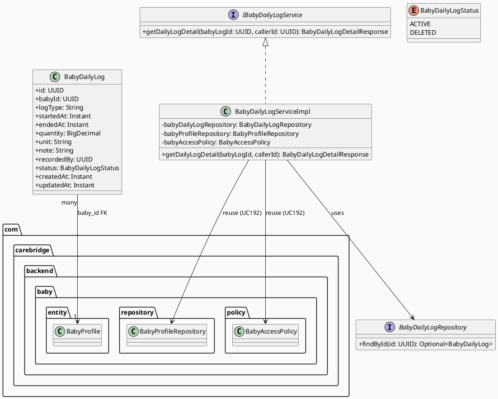
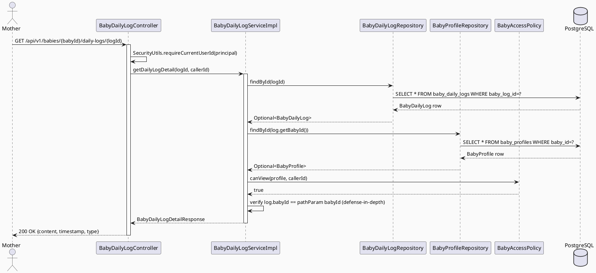
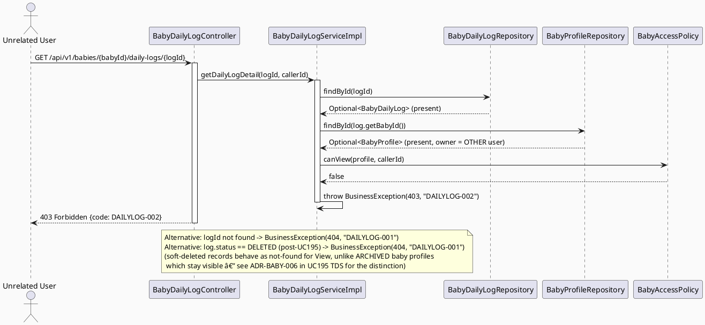

# ENGINEERING DOCUMENTATION STANDARD (EDS) v2.0
# Technical Design Specification — UC-194 View Baby Daily Log Detail

| Field | Value |
|-------|-------|
| **Document ID** | `CB-BABY-IMP-003` |
| **Version** | `1.0` |
| **Date** | `2026-07-03` |
| **Status** | `Partially Implemented` |
| **Document Owner** | `TV2-Bách` |
| **Author** | `AI Agent` |
| **Reviewed by** | `[Tech Lead]` |
| **DPO Sign-off** | `[ ] Pending` |
| **Approved by** | `TV2-Bách` |
| **Last Review** | `2026-07-03` |
| **Based on EDS** | `v2.0` |

---

## CHANGELOG

| Ngày | Người thực hiện | Nội dung thay đổi |
|------|-----------------|-------------------|
| 2026-07-10 | AI Agent | Implementation status updated to Partially Implemented: targeted baby/carejourney backend tests PASS; full regression remains blocked by non-baby Family/Exercise/Auth/Triage failures. |
| 2026-07-03 | AI Agent | Tạo tài liệu lần đầu cho UC-194 View Baby Daily Log Detail |

---

## MỤC LỤC

1. [Tổng quan Module](#1-tổng-quan-module)
2. [Ma trận Truy vết](#2-ma-trận-truy-vết-traceability-matrix)
3. [Architecture Decision Records](#3-architecture-decision-records-adr)
4. [Non-Functional Requirements & SLA](#4-non-functional-requirements--sla)
5. [Static Modeling](#5-static-modeling-mô-hình-tĩnh)
6. [Dynamic Modeling](#6-dynamic-modeling-mô-hình-động)
7. [Domain Event Catalog](#7-domain-event-catalog)
8. [Interface Specification](#8-interface-specification-đặc-tả-giao-diện)
9. [API Specification](#9-api-specification)
10. [Bảng mã lỗi](#10-bảng-mã-lỗi-error-codes)
11. [Quy trình Triển khai](#11-quy-trình-triển-khai-step-by-step)
12. [Rollback & Incident Runbook](#12-rollback--incident-runbook)
13. [Kịch bản Kiểm thử Chi tiết](#13-kịch-bản-kiểm-thử-chi-tiết)
14. [Phương pháp Xác minh](#14-phương-pháp-xác-minh)
15. [Mẫu thử thực tế](#15-mẫu-thử-thực-tế-api-verification-samples)
16. [Authorization Matrix](#16-bảng-tổng-hợp-phân-quyền-authorization-matrix)
17. [AI Prompt Constraints (CASE 2.0)](#17-ai-prompt-constraints-case-20)

---

## 1. Tổng quan Module

| Field | Value |
|-------|-------|
| **Module Name** | `ViewBabyDailyLogDetail` |
| **Bounded Context** | `baby` (reuse — same bounded context as UC192 `BabyController`/`BabyServiceImpl`, NOT the empty `babyCare` stub folder) |
| **UC ID** | `UC-194` |
| **SRS Reference** | `3.3.12.3` (`02_Requirements/SRS/3_Functional_Specification.md` lines 4175-4194) |
| **Primary Actor** | `Mother (ROLE_MOTHER)` |
| **Platform** | `Mobile App` |
| **Priority** | `Medium` |
| **Sprint** | `Sprint 4 — Device Sync And Care Edge Cases` |
| **Owner** | `TV2-Bách` |
| **Data Classification** | `Sensitive-PII` (infant health/feeding/sleep data) |
| **Compliance Scope** | `BR-RBAC, BR-PRIVACY, BR-SAFETY` |
| **Upstream Dependencies** | `baby (BabyProfile, BabyAccessPolicy — UC192)`, `auth`, `baby_daily_logs` table |
| **Downstream Consumers** | `Baby Daily Log List (future UC)`, `UC195 Delete Baby Daily Log` |

**Mô tả:** Hiển thị chi tiết đầy đủ (content, timestamp, type) cho MỘT bản ghi nhật ký hằng ngày của baby (`baby_daily_logs`). Chỉ Mother là owner của baby profile liên quan mới được xem — ownership resolved qua chain `baby_daily_logs.baby_id → baby_profiles.owner_user_id`, tái sử dụng `BabyAccessPolicy` đã có từ UC192. Đây là greenfield code: KHÔNG có `BabyDailyLog` entity/controller/service nào tồn tại trong codebase hiện tại (xác nhận qua RG-3 bên dưới).

---

## 2. Ma trận Truy vết (Traceability Matrix)

| Requirement ID | Loại | Mô tả | Thành phần Code | Compliance Target | ADR liên quan |
|----------------|------|-------|-----------------|-------------------|---------------|
| UC-194 | Use Case | Mother xem chi tiết 1 baby daily log | `BabyDailyLogController.getDailyLogDetail()` | BR-RBAC | ADR-BABY-004 |
| BR-RBAC | Business Rule | Chỉ owner của baby profile mới xem được log | `BabyDailyLogServiceImpl.getDailyLogDetail()` + `BabyAccessPolicy.canView()` (reused from UC192) | BR-RBAC | ADR-BABY-004 |
| BR-PRIVACY | Business Rule | Response chỉ trả field liên quan (content/timestamp/type) — minimum-necessary | `BabyDailyLogDetailResponse` DTO | BR-PRIVACY | ADR-BABY-004 |
| BR-SAFETY | Business Rule | Log content là mô tả sinh hoạt (feeding/sleep/diaper), không được diễn giải thành chẩn đoán y tế | `BabyDailyLogDetailResponse` — không có trường `diagnosis`/`interpretation` | BR-SAFETY | ADR-BABY-005 |

---

## 3. Architecture Decision Records (ADR)

### ADR-BABY-004 — Ownership Chain Reuse cho Baby Daily Log Access

| Field | Value |
|-------|-------|
| **Status** | `Accepted` |
| **Deciders** | `TV2-Bách, AI Agent` |
| **Date** | `2026-07-03` |
| **Supersedes** | — |

#### Bối cảnh (Context)
`baby_daily_logs` không có `owner_user_id` trực tiếp — chỉ có `baby_id` (FK → `baby_profiles.baby_id`). UC192 đã thiết lập `BabyAccessPolicy.canView(BabyProfile, callerId)` để kiểm tra ownership + care group membership (ACCEPTED). Cần quyết định: viết lại logic ownership riêng cho daily log, hay tái sử dụng policy đã có.

#### Các phương án đã xem xét (Options Considered)

| Phương án | Mô tả | Ưu điểm | Nhược điểm |
|-----------|-------|----------|------------|
| A | Viết `BabyDailyLogAccessPolicy` riêng, duplicate logic ownership | Isolation module | Trùng lặp code, dễ lệch pha khi UC192 policy thay đổi |
| B | Load `BabyProfile` qua `baby_id`, tái sử dụng `BabyAccessPolicy.canView()` hiện có | Nhất quán 100% với UC192, một nguồn sự thật duy nhất cho access rule | Thêm 1 query `BabyProfileRepository.findById()` mỗi request |

#### Quyết định (Decision)
Chọn **Phương án B**. `BabyDailyLogServiceImpl` inject `BabyProfileRepository` và `BabyAccessPolicy` (cả hai đã tồn tại từ UC192), load `BabyProfile` bằng `dailyLog.getBabyId()`, sau đó gọi `accessPolicy.canView(profile, callerId)` y hệt UC192.

#### Hệ quả (Consequences)

**Tích cực:**
- Một policy duy nhất cho toàn bộ `baby` bounded context — sửa 1 nơi, áp dụng mọi UC.
- Giảm rủi ro IDOR do logic phân mảnh.

**Tiêu cực / Trade-offs:**
- Thêm 1 round-trip DB để load `BabyProfile` — chấp nhận được vì NFR p99 < 300ms.

**Compliance Impact:**
- Củng cố BR-RBAC bằng cách tránh duplicate/divergent authorization logic (OWASP A01:2021 — Broken Access Control mitigation).

---

### ADR-BABY-005 — Read-Only, No New Domain Event cho View (nhưng có Audit Log tuỳ chọn)

| Field | Value |
|-------|-------|
| **Status** | `Accepted` |
| **Date** | `2026-07-03` |

#### Bối cảnh (Context)
UC192 (`getBabyProfile`) là read-only, KHÔNG emit audit event (Constraint C4 trong TDS UC192 §17.2: "Read-only endpoint — KHÔNG có side effects"). Cần quyết định UC194 có nên khác đi, vì đây là dữ liệu sức khoẻ trẻ sơ sinh (Sensitive-PII) — có cần audit trail cho việc "ai đã xem log nào" không.

#### Quyết định (Decision)
Giữ nhất quán với UC192: **KHÔNG bắt buộc audit event cho việc xem** (view baby daily log không side-effect, không thay đổi state). Domain event `BabyDailyLogViewed` được **thiết kế nhưng KHÔNG kích hoạt mặc định** trong lần triển khai đầu — đánh dấu `Open` trong Domain Event Catalog (§7) để Tech Lead quyết định có bật audit-on-read hay không (trade-off giữa audit trail đầy đủ và write-amplification trên bảng audit_logs cho một hành động đọc tần suất cao).

#### Hệ quả (Consequences)

**Tích cực:** Nhất quán API pattern, không tăng tải ghi DB cho thao tác đọc tần suất cao (Frequency of Use = Frequent theo SRS).

**Tiêu cực / Trade-offs:** Nếu sau này cần audit "ai xem log nào" cho compliance investigation, phải bổ sung sau — đã note `Open` item.

---

## 4. Non-Functional Requirements & SLA

### 4.1. Performance & Availability

| Category | Requirement | Target SLA | Measurement Method | Compliance Basis |
|----------|-------------|------------|---------------------|------------------|
| Latency (p99) | GET response | `< 200ms` | k6 load test | — |
| Availability | Uptime | `99.9%` | Uptime monitor | — |

### 4.2. Data Integrity & Retention

| Category | Requirement | Target | Verification Method | Compliance Basis |
|----------|-------------|--------|---------------------|------------------|
| Consistency | `baby_id` FK luôn resolve được `BabyProfile` | 100% | FK constraint `baby_daily_logs_baby_id_fkey` | — |

### 4.3. Security

| Category | Requirement | Target | Verification Method | Compliance Basis |
|----------|-------------|--------|---------------------|------------------|
| Access control | IDOR guard — ownership chain qua `baby_id` | 100% requests kiểm tra | `BabyAccessPolicy.canView()` reuse | BR-RBAC |
| Encryption in transit | TLS | TLS 1.3+ | SSL Labs scan | — |

### 4.4. Scalability & Capacity Planning

Dự kiến tải: mỗi Mother xem trung bình 5-20 daily logs/ngày qua danh sách trước khi mở detail. Endpoint là single-row lookup theo PK (`baby_log_id`) — không cần pagination hay caching riêng ở giai đoạn này.

---

## 5. Static Modeling (Mô hình Tĩnh)

### 5.1. Class Diagram (PlantUML)



### 5.2. Data Structure (Flyway SQL Migration)

> **CareBridge rule:** `V1__init_schema.sql` là baseline oracle. `baby_daily_logs` đã tồn tại (xem trích dẫn dưới) nhưng KHÔNG có `status` column → UC195 cần soft-delete nên bổ sung migration mới (xem UC195 TDS §5.2 cho migration `V20260707110000`). UC194 (view) KHÔNG cần thay đổi schema — chỉ cần đọc, nhưng SERVICE của UC194 **phải lọc `status <> 'DELETED'`** sau khi migration UC195 chạy, để đảm bảo record đã soft-delete không hiển thị lại được (404) — coupling này được ghi nhận trong §3 ADR-BABY-004 companion.

**Existing schema (V1__init_schema.sql, dòng 621-633) — KHÔNG thay đổi bởi UC194:**
```sql
CREATE TABLE public.baby_daily_logs (
    baby_log_id uuid        NOT NULL DEFAULT gen_random_uuid(),
    baby_id     uuid        NOT NULL,
    log_type    varchar(30) NOT NULL,
    started_at  timestamptz,
    ended_at    timestamptz,
    quantity    numeric,
    unit        varchar(20),
    note        text,
    recorded_by uuid,
    created_at  timestamptz NOT NULL DEFAULT now(),
    updated_at  timestamptz NOT NULL DEFAULT now()
);
-- PK: baby_log_id
-- FK: baby_id -> baby_profiles(baby_id)
-- FK: recorded_by -> users(user_id)
-- INDEX: idx_baby_daily_logs_baby_id, idx_baby_daily_logs_started_at
```

> **Gap ghi nhận (RG-6):** `log_type` là `varchar(30)` KHÔNG có DB `CHECK` constraint ràng buộc enum — giống style của `baby_profiles.status` (varchar app-level enum, không DB CHECK). Vocabulary chính xác (feeding/sleep/diaper/...) KHÔNG được định nghĩa ở bất kỳ đâu trong SRS, migration, hay code hiện có → đánh dấu **Open Item** (xem §Open Items cuối tài liệu). Đề xuất: entity dùng `String logType` (KHÔNG `@Enumerated`) cho đến khi vocabulary được Product xác nhận, tránh hard-code enum sai.

> **UC194 KHÔNG tạo migration mới** — chỉ đọc dữ liệu hiện có. Nếu UC195 được implement trước/song song, cột `status` sẽ được thêm bởi UC195's migration; UC194 service phải cộng thêm điều kiện lọc `status != DELETED` khi entity có field đó (xem Interface Specification §8.1 ghi chú `@since UC195`).

---

## 6. Dynamic Modeling (Mô hình Động)

### 6.1. Sequence Diagram — Happy Path (PlantUML)



### 6.2. Sequence Diagram — Error Path (PlantUML)



---

## 7. Domain Event Catalog

### 7.1. Events Published (Phát ra)

| Event Name | Trigger | Publisher | Subscriber(s) | Payload Schema | Async? |
|------------|---------|-----------|---------------|----------------|--------|
| `BabyDailyLogViewed` | (Open — NOT activated by default, xem ADR-BABY-005) | `BabyDailyLogServiceImpl` | `audit` (future) | `BabyDailyLogViewedEvent.java` | Yes (nếu bật) |

### 7.2. Events Consumed (Tiêu thụ)

Không có — module này không tiêu thụ event nào.

### 7.3. Payload Schema (dự phòng nếu ADR-BABY-005 được đảo ngược)

```java
// BabyDailyLogViewedEvent.java — NOT wired by default (Open item)
public record BabyDailyLogViewedEvent(
    UUID    eventId,
    String  eventType,       // "BabyDailyLogViewed"
    Instant occurredAt,
    String  version,         // "1.0"
    Payload payload,
    Metadata metadata
) {
    public record Payload(
        UUID babyLogId,
        UUID babyId,
        UUID viewedByUserId
    ) {}

    public record Metadata(
        UUID   correlationId,
        String causedBy
    ) {}
}
```

---

## 8. Interface Specification (Đặc tả Giao diện)

### 8.1. Service Interface

```java
// BabyDailyLogDetailResponse.java — Output DTO
// @version 1.0
public class BabyDailyLogDetailResponse {
    private UUID id;
    private UUID babyId;
    private String logType;        // free-text/varchar; known values per UC34 ADR-BABY-007: FEEDING, SLEEP, DIAPER, FEVER, VOMITING, MEDICINE
    private Instant startedAt;
    private Instant endedAt;       // nullable
    private BigDecimal quantity;   // nullable
    private String unit;           // nullable
    private String note;           // maps to SRS "content"
    private UUID recordedBy;
    private Instant createdAt;
    private Instant updatedAt;
}

// IBabyDailyLogService.java — Service Contract
// @version 1.0
public interface IBabyDailyLogService {
    /**
     * @throws com.carebridge.backend.common.exception.BusinessException (DAILYLOG-001/404)
     *         khi babyLogId không tồn tại, HOẶC record đã soft-deleted (status=DELETED, @since UC195)
     * @throws com.carebridge.backend.common.exception.BusinessException (DAILYLOG-002/403)
     *         khi caller không phải owner/accepted care group member của baby liên quan
     */
    BabyDailyLogDetailResponse getDailyLogDetail(UUID babyLogId, UUID callerId);
}
```

### 8.2. Entity & Repository Interface

```java
// BabyDailyLog.java — new entity, package com.carebridge.backend.baby.entity
// @version 1.0
@Entity
@Table(name = "baby_daily_logs")
public class BabyDailyLog {
    @Id
    @GeneratedValue(strategy = GenerationType.UUID)
    @Column(name = "baby_log_id", updatable = false, nullable = false)
    private UUID id;

    @Column(name = "baby_id", nullable = false)
    private UUID babyId;

    @Column(name = "log_type", nullable = false, length = 30)
    private String logType;   // NOT @Enumerated — read path stays permissive (see OI-1); write-side vocabulary defined by UC34 ADR-BABY-007

    @Column(name = "started_at")
    private Instant startedAt;

    @Column(name = "ended_at")
    private Instant endedAt;

    @Column(name = "quantity")
    private BigDecimal quantity;

    @Column(name = "unit", length = 20)
    private String unit;

    @Column(name = "note")
    private String note;

    @Column(name = "recorded_by")
    private UUID recordedBy;

    // @since UC195 migration V20260707110000 — nullable until that migration lands;
    // UC194 read path must null-check and treat legacy NULL as ACTIVE (backward compatible default).
    @Enumerated(EnumType.STRING)
    @Column(name = "status", length = 20)
    private BabyDailyLogStatus status;

    @CreationTimestamp
    @Column(name = "created_at", nullable = false, updatable = false)
    private Instant createdAt;

    @UpdateTimestamp
    @Column(name = "updated_at", nullable = false)
    private Instant updatedAt;
}

// BabyDailyLogRepository.java
// @version 1.0
public interface BabyDailyLogRepository extends JpaRepository<BabyDailyLog, UUID> {
    // findById() inherited from JpaRepository is sufficient for UC194.
}
```

---

## 9. API Specification

### 9.1. Endpoints Table

| Method | Path | Auth Level | Required Roles | Rate Limit | Idempotent? |
|--------|------|------------|----------------|------------|-------------|
| `GET` | `/api/v1/babies/{babyId}/daily-logs/{logId}` | JWT Bearer | `ROLE_MOTHER` | 300/min | Yes |

> **Path design note:** URL nests under `/api/v1/babies/{babyId}/...` để nhất quán với `BabyController`'s `/api/v1/babies` base path (UC192 convention). `babyId` trong path được dùng CHỈ để định tuyến REST — service **KHÔNG được tin `babyId` từ path** cho authorization; ownership check luôn dựa trên `babyDailyLog.getBabyId()` đọc từ DB (Constraint C2 §17).

### 9.2. Request / Response Schemas

#### `GET /api/v1/babies/{babyId}/daily-logs/{logId}`

**Request Headers:**
```
Authorization: Bearer <JWT_TOKEN>
```

**Response — 200 OK:**
```json
{
  "success": true,
  "data": {
    "id": "550e8400-e29b-41d4-a716-446655440000",
    "babyId": "660e8400-e29b-41d4-a716-446655440001",
    "logType": "feeding",
    "startedAt": "2026-07-03T08:00:00.000Z",
    "endedAt": "2026-07-03T08:20:00.000Z",
    "quantity": 120,
    "unit": "ml",
    "note": "Bú bình đủ 120ml, không quấy khóc.",
    "recordedBy": "770e8400-e29b-41d4-a716-446655440002",
    "createdAt": "2026-07-03T08:21:00.000Z",
    "updatedAt": "2026-07-03T08:21:00.000Z"
  }
}
```

**Response — 403 Forbidden:**
```json
{
  "error": { "code": "DAILYLOG-002", "message": "Access denied to baby daily log" }
}
```

**Response — 404 Not Found:**
```json
{
  "error": { "code": "DAILYLOG-001", "message": "Baby daily log not found" }
}
```

---

## 10. Bảng mã lỗi (Error Codes)

> Prefix `DAILYLOG-` dùng riêng cho `baby_daily_logs` module để tránh đụng với `BABY-xxx` (baby profile) đã cấp phát ở UC192 (`BABY-001` 404, `BABY-003` 403 — xác nhận từ code thực tế `BabyServiceImpl.java`). **(Cập nhật 2026-07-03):** TDS UC192 §9-10 từng ghi nhầm `BABY-002/BABY-004`; đã được sửa lại khớp code thật. Xem OI-3 (đã đóng) và Test-Spec Logic Issue L1.

| Code | HTTP Status | Message (EN) | Message (VI) | Trigger Condition |
|------|-------------|--------------|--------------|-------------------|
| `DAILYLOG-001` | 404 | Baby daily log not found | Không tìm thấy nhật ký hằng ngày | `babyLogId` không tồn tại HOẶC record có `status=DELETED` (post-UC195) HOẶC `babyId` FK không resolve được `BabyProfile` (orphan — treat as 404, defense-in-depth) |
| `DAILYLOG-002` | 403 | Access denied to baby daily log | Không đủ quyền truy cập nhật ký | Caller không phải owner và không phải ACCEPTED care group member của baby liên quan |
| `DAILYLOG-005` | 500 | Internal error | Lỗi hệ thống | Unexpected DB error |

---

## 11. Quy trình Triển khai (Step-by-Step)

### 11.1. Prerequisites
- [ ] TDS này được Approved
- [ ] UC195 migration (nếu triển khai song song) đã review để tránh xung đột cột `status`
- [ ] `BabyAccessPolicy`, `BabyProfileRepository` (UC192) đã có sẵn trong `main` — xác nhận (đã có)

### 11.2. Pre-Migration Checklist
- Không áp dụng — UC194 không có migration riêng (đọc dữ liệu hiện có + optional `status` column từ UC195).

### 11.3. Implementation Steps

#### Chặng 1 — Entity + Repository
Tạo `BabyDailyLog.java`, `BabyDailyLogStatus.java` (enum ACTIVE/DELETED, dùng cho tương thích UC195), `BabyDailyLogRepository.java` trong `com.carebridge.backend.baby.{entity,repository}`.

#### Chặng 2 — Service + DTO
Tạo `IBabyDailyLogService.java`, `BabyDailyLogServiceImpl.java`, `BabyDailyLogDetailResponse.java` trong `com.carebridge.backend.baby.{service, service.impl, dto}`. Inject `BabyDailyLogRepository`, `BabyProfileRepository`, `BabyAccessPolicy` (2 cái sau tái sử dụng nguyên vẹn từ UC192 — KHÔNG tạo bean mới).

#### Chặng 3 — Controller
Thêm `BabyDailyLogController.java` (`@RestController`, base path `/api/v1/babies/{babyId}/daily-logs`), method `getDailyLogDetail`.

#### Chặng 4 — Verification sau deploy
```bash
curl -X GET https://[host]/api/v1/babies/[babyId]/daily-logs/[logId] \
  -H "Authorization: Bearer [JWT_MOTHER_TOKEN]"
# Expected: 200 with content/timestamp/type
```

### 11.4. Deployment Checklist
- [ ] `./mvnw test` xanh
- [ ] Response không chứa `diagnosis`/`interpretation`/`condition` field (BR-SAFETY)
- [ ] IDOR test (non-owner → 403) pass

---

## 12. Rollback & Incident Runbook

### 12.1. Điều kiện kích hoạt Rollback

| Điều kiện | Ngưỡng | Người quyết định |
|-----------|--------|------------------|
| Error rate tăng đột biến | > 5% trong 5 phút | On-call Engineer |
| IDOR phát hiện qua pentest/report | Bất kỳ case nào | Tech Lead + DPO |

### 12.2. Rollback Procedure

```bash
# Không có migration mới cho UC194 — rollback chỉ cần revert code deploy
kubectl rollout undo deployment/carebridge-api
kubectl rollout status deployment/carebridge-api
curl -X GET https://[host]/api/v1/health
```

### 12.3. Notification Protocol

| Thời điểm | Người nhận | Kênh |
|-----------|------------|------|
| Ngay khi phát hiện IDOR | On-call + DPO | Slack `#incident` + Email |

---

## 13. Kịch bản Kiểm thử Chi tiết

> **Policy (EDS v2.0):** Mọi test scenario dùng dữ liệu `SYNTHETIC`.

```gherkin
Feature: View Baby Daily Log Detail
  Background:
    Given test data classification: SYNTHETIC
    And MOTHER-001 là owner của BABY-001
    And LOG-001 thuộc BABY-001 với logType=feeding, note="Bú bình 120ml"

  Scenario: Owner xem chi tiết log → 200
    When getDailyLogDetail(LOG-001, MOTHER-001)
    Then response 200 với content, timestamp, type đầy đủ

  Scenario: Care group member (ACCEPTED) xem log → 200
    Given MOTHER-002 là ACCEPTED member trong care group của BABY-001
    When getDailyLogDetail(LOG-001, MOTHER-002)
    Then response 200

  Scenario: Non-owner, non-member → 403
    Given MOTHER-003 KHÔNG liên quan BABY-001
    When getDailyLogDetail(LOG-001, MOTHER-003)
    Then throws BusinessException DAILYLOG-002 (403)

  Scenario: Log không tồn tại → 404
    When getDailyLogDetail(NONEXISTENT, MOTHER-001)
    Then throws BusinessException DAILYLOG-001 (404)

  Scenario: Log đã soft-deleted (post-UC195) → 404
    Given LOG-002 thuá»™c BABY-001 vá»›i status=DELETED
    When getDailyLogDetail(LOG-002, MOTHER-001)
    Then throws BusinessException DAILYLOG-001 (404)

  Scenario: Response không chứa diagnosis/medical interpretation
    When getDailyLogDetail(LOG-001, MOTHER-001)
    Then response KHÔNG chứa "diagnosis", "interpretation", "condition"
```

---

## 14. Phương pháp Xác minh

### 14.1. Database Inspection

```sql
-- Verify log exists and belongs to expected baby
SELECT baby_log_id, baby_id, log_type, started_at, note
FROM baby_daily_logs WHERE baby_log_id = '[logId]';

-- Verify ownership chain
SELECT bp.owner_user_id
FROM baby_daily_logs bdl
JOIN baby_profiles bp ON bp.baby_id = bdl.baby_id
WHERE bdl.baby_log_id = '[logId]';
```

### 14.2. Access Policy Verification

```bash
curl -X GET https://[host]/api/v1/babies/[babyId]/daily-logs/[logId] \
  -H "Authorization: Bearer [OWNER_JWT]"
# Expected: 200

curl -X GET https://[host]/api/v1/babies/[babyId]/daily-logs/[logId] \
  -H "Authorization: Bearer [UNRELATED_USER_JWT]"
# Expected: 403
```

---

## 15. Mẫu thử thực tế (API Verification Samples)

### 15.1. Happy Path

```bash
curl -X GET https://[host]/api/v1/babies/[babyId]/daily-logs/[logId] \
  -H "Authorization: Bearer [JWT_MOTHER_TOKEN]"
# Expected: 200 {id, babyId, logType, startedAt, note, ...}
```

### 15.2. Error Paths

```bash
# Non-existent log -> 404
curl -X GET https://[host]/api/v1/babies/[babyId]/daily-logs/non-existent-uuid \
  -H "Authorization: Bearer [JWT_MOTHER_TOKEN]"

# Unrelated user -> 403
curl -X GET https://[host]/api/v1/babies/[babyId]/daily-logs/[logId] \
  -H "Authorization: Bearer [OTHER_USER_JWT]"

# No JWT -> 401
curl -X GET https://[host]/api/v1/babies/[babyId]/daily-logs/[logId]
```

---

## 16. Bảng tổng hợp phân quyền (Authorization Matrix)

| Endpoint | `GUEST` | `MOTHER (owner)` | `MOTHER (care member, ACCEPTED)` | `EXPERT` | `ADMIN` |
|----------|---------|-------------------|-----------------------------------|----------|---------|
| `GET /api/v1/babies/{babyId}/daily-logs/{logId}` | ❌ (401) | ✅ | ✅ | ❌ (403) | ✅ All |

**Chú thích:**
- Owner: `baby_profiles.owner_user_id` == JWT subject (via `baby_daily_logs.baby_id` FK)
- Care member: `care_group_members.invite_status = ACCEPTED` cho group của owner (reuse `BabyAccessPolicy`)
- Expert: không có quyền xem trực tiếp, chỉ qua consultation sharing (ngoài phạm vi UC194)

---

## 17. AI Prompt Constraints (CASE 2.0)

### 17.1 Constraint Summary Table

| # | Constraint | Source | Last Verified |
|---|-----------|--------|---------------|
| C1 | `BabyDailyLogServiceImpl` PHẢI load `BabyProfile` qua `dailyLog.getBabyId()` rồi gọi `BabyAccessPolicy.canView()` đã có từ UC192 — KHÔNG viết logic ownership mới | ADR-BABY-004 | 2026-07-03 |
| C2 | `babyId` trong URL path CHỈ dùng để routing — authorization luôn dựa trên `babyDailyLog.getBabyId()` đọc từ DB, KHÔNG tin path param | ADR-BABY-004, BR-RBAC | 2026-07-03 |
| C3 | Nếu `status=DELETED` (post-UC195), trả 404 (`DAILYLOG-001`) — KHÔNG trả 403 hay lộ thông tin đã xoá | ADR trong UC195 TDS §3 | 2026-07-03 |
| C4 | Read-only endpoint — KHÔNG audit event mặc định (nhất quán UC192); `BabyDailyLogViewed` là Open item, chưa kích hoạt | ADR-BABY-005 | 2026-07-03 |
| C5 | Response DTO KHÔNG chứa trường `diagnosis`/`interpretation`/`condition` — chỉ content/timestamp/type theo SRS 3.3.12.3 | BR-SAFETY | 2026-07-03 |

### 17.2 Constraint Injection Block

```
[CONSTRAINT BLOCK — Module: ViewBabyDailyLogDetail (CB-BABY-IMP-003)]
1. BabyDailyLogServiceImpl PHẢI: load BabyProfile qua dailyLog.getBabyId(), gọi BabyAccessPolicy.canView(profile, callerId) — TÁI SỬ DỤNG class có sẵn từ UC192, KHÔNG viết policy mới — ADR-BABY-004
2. babyId trong URL path KHÔNG được dùng để authorization — chỉ dùng để route; ownership check luôn dựa trên dữ liệu đọc từ DB — BR-RBAC
3. status=DELETED (nếu có, post-UC195 migration) PHẢI trả 404 DAILYLOG-001, KHÔNG lộ log đã xoá dưới bất kỳ hình thức nào
4. Read-only — KHÔNG side effect DB write, KHÔNG audit event mặc định — nhất quán UC192 pattern
5. Response DTO KHÔNG chứa diagnosis/interpretation/condition — chỉ id, babyId, logType, startedAt, endedAt, quantity, unit, note, recordedBy, timestamps — BR-SAFETY

[CONTEXT BLOCK]
- Bounded Context: baby (reuse UC192 package — com.carebridge.backend.baby)
- Data Classification: Sensitive-PII
- Error codes: §10 Error Codes Table (prefix DAILYLOG-, KHÔNG trùng BABY-xxx)
- Auth matrix: §16 Authorization Matrix
- Reused classes: BabyProfileRepository, BabyAccessPolicy (từ UC192 — KHÔNG tạo bản sao)
```

### 17.3 Constraint Quality Checklist

- [x] Mỗi constraint traceable về ADR hoặc BR cụ thể
- [x] Không có constraint generic
- [x] Constraint block có ≥ 3 constraints cụ thể

### 17.4 Anti-Pattern Detection

| AP-ID | Anti-Pattern | Dấu hiệu | Hành động |
|-------|-------------|-----------|----------|
| AP-AI-001 | Unconstrained Gen | Code không match constraint C1-C5 | Reject — inject lại constraints |
| AP-AI-003 | Implicit Decision | Code viết `BabyDailyLogAccessPolicy` mới thay vì tái sử dụng `BabyAccessPolicy` | Reject — vi phạm ADR-BABY-004 |
| AP-AI-005 | Hallucinated Contract | Code import class không có trong §8 | Reject — verify contract |

---

## PHỤ LỤC

### A. Glossary

| Thuật ngữ | Định nghĩa |
|-----------|------------|
| BabyDailyLog | Bản ghi nhật ký sinh hoạt hằng ngày của baby (feeding/sleep/diaper/...) |
| Ownership Chain | Chuỗi resolve quyền sở hữu: `baby_daily_logs.baby_id → baby_profiles.owner_user_id` |
| IDOR | Insecure Direct Object Reference — truy cập trái phép bằng cách đoán/thay đổi ID |

### B. Tài liệu tham chiếu

| Document | Path |
|----------|------|
| UC192 TDS (Approved, shipped code reference) | `04_Implement/UC192_ViewBabyProfile/UC192_ViewBabyProfile_TDS.md` |
| UC195 TDS (companion — soft-delete migration) | `04_Implement/UC195_DeleteBabyDailyLog/UC195_DeleteBabyDailyLog_TDS.md` |
| EDS v2.0 Template | `08_References/Template/PHASE-3_TDS.md` |
| Schema baseline | `05_Development/CareBridgeAPI/src/main/resources/db/migration/V1__init_schema.sql` |

---

## Open Items (chưa resolve — cần Tech Lead / Product xác nhận trước khi Approve)

| # | Item | Mô tả | Đề xuất tạm thời |
|---|------|-------|-------------------|
| OI-1 | ~~`log_type` enum vocabulary~~ **RESOLVED (2026-07-03)** | Ban đầu tưởng không có tài liệu nào định nghĩa `log_type`. Rà soát lại phát hiện sibling spec `UC34_AddFeedingSleepDiaperLog` (ADR-BABY-007) đã định nghĩa vocabulary cho đúng cột `baby_daily_logs.log_type` này: `FEEDING, SLEEP, DIAPER, FEVER, VOMITING, MEDICINE` (validated qua `BABY-033` ở write path). Cột vẫn là `varchar(30)` không CHECK constraint ở DB. | UC194 là read-only nên vẫn giữ `String` (không `@Enumerated`) ở entity — không reject giá trị lạ khi đọc, để không vỡ nếu có dữ liệu cũ/hợp lệ khác nằm ngoài whitelist. Whitelist enforcement thuộc trách nhiệm write path (UC34), không phải UC194. |
| OI-2 | `BabyDailyLogViewed` audit event | ADR-BABY-005 để ngỏ việc có nên audit-on-read cho dữ liệu sức khoẻ trẻ sơ sinh hay không. | Không kích hoạt mặc định; revisit nếu compliance yêu cầu. |
| OI-3 | ~~Mismatch mã lỗi UC192 tài liệu vs code~~ **RESOLVED (2026-07-03)** | TDS UC192 §9-10 từng ghi `BABY-002/BABY-004`, code thực tế dùng `BABY-003/BABY-001`. UC194 dùng prefix `DAILYLOG-` riêng nên không bị ảnh hưởng trực tiếp. TDS UC192 đã được sửa lại khớp code thật (`BABY-001`=404, `BABY-003`=403) trong toàn bộ bảng mã lỗi, JSON examples và Gherkin scenarios. | Đã đóng — không cần hành động thêm. |

---

*EDS v2.1 — Tích hợp CASE 2.0 AI Prompt Constraints (§17).*
