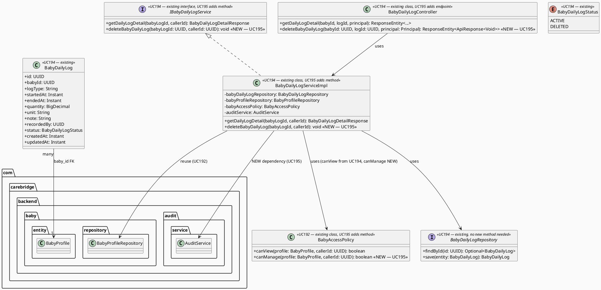
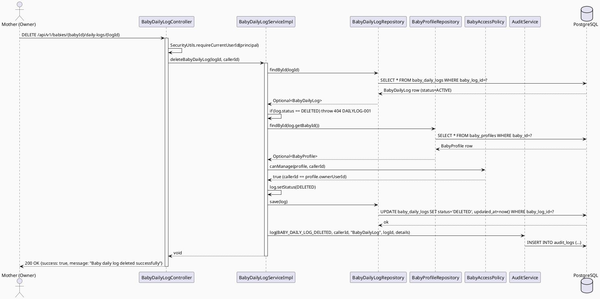
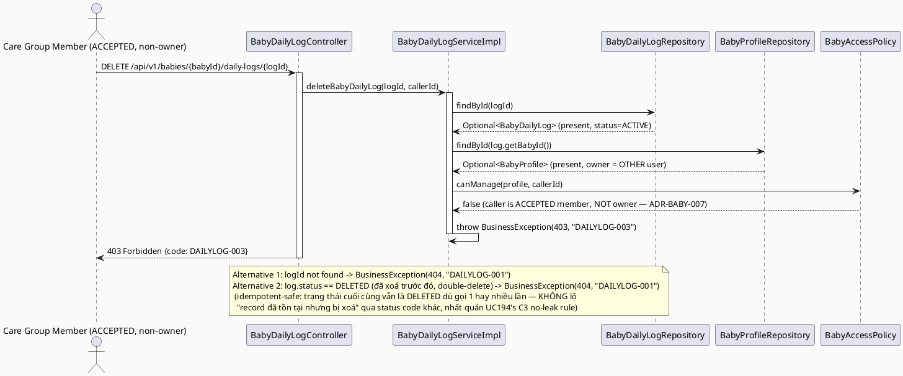

# ENGINEERING DOCUMENTATION STANDARD (EDS) v2.0
# Technical Design Specification — UC-195 Delete Baby Daily Log

| Field | Value |
|-------|-------|
| **Document ID** | `CB-BABY-IMP-004` |
| **Version** | `1.0` |
| **Date** | `2026-07-03` |
| **Status** | `Draft` |
| **Document Owner** | `TV2-Bách` |
| **Author** | `AI Agent` |
| **Reviewed by** | `[Tech Lead]` |
| **DPO Sign-off** | `[ ] Pending` |
| **Approved by** | `[Principal Architect]` |
| **Last Review** | `2026-07-03` |
| **Based on EDS** | `v2.0` |

---

## CHANGELOG

| Ngày | Người thực hiện | Nội dung thay đổi |
|------|-----------------|-------------------|
| 2026-07-03 | AI Agent | Tạo tài liệu lần đầu cho UC-195 Delete Baby Daily Log — extends UC194's `BabyDailyLog*` classes |

---

## MỤC LỤC

1. [Tổng quan Module](#1-tổng-quan-module)
2. [Ma trận Truy vết](#2-ma-trận-truy-vết-traceability-matrix)
3. [Architecture Decision Records](#3-architecture-decision-records-adr)
4. [Non-Functional Requirements & SLA](#4-non-functional-requirements--sla)
5. [Static Modeling](#5-static-modeling-mô-hình-tĩnh)
6. [Dynamic Modeling](#6-dynamic-modeling-mô-hình-động)
7. [Domain Event Catalog](#7-domain-event-catalog)
8. [Interface Specification](#8-interface-specification-đặc-tả-giao-diện)
9. [API Specification](#9-api-specification)
10. [Bảng mã lỗi](#10-bảng-mã-lỗi-error-codes)
11. [Quy trình Triển khai](#11-quy-trình-triển-khai-step-by-step)
12. [Rollback & Incident Runbook](#12-rollback--incident-runbook)
13. [Kịch bản Kiểm thử Chi tiết](#13-kịch-bản-kiểm-thử-chi-tiết)
14. [Phương pháp Xác minh](#14-phương-pháp-xác-minh)
15. [Mẫu thử thực tế](#15-mẫu-thử-thực-tế-api-verification-samples)
16. [Authorization Matrix](#16-bảng-tổng-hợp-phân-quyền-authorization-matrix)
17. [AI Prompt Constraints (CASE 2.0)](#17-ai-prompt-constraints-case-20)

---

## 1. Tổng quan Module

| Field | Value |
|-------|-------|
| **Module Name** | `DeleteBabyDailyLog` |
| **Bounded Context** | `baby` (SAME context as UC192 `BabyController`/`BabyServiceImpl` and UC194 `BabyDailyLogController`/`BabyDailyLogServiceImpl` — NOT the empty `babyCare` stub folder) |
| **UC ID** | `UC-195` |
| **SRS Reference** | `3.3.12.4` (`02_Requirements/SRS/3_Functional_Specification.md` lines 4196-4215) |
| **Primary Actor** | `Mother (ROLE_MOTHER)` |
| **Platform** | `Mobile App` |
| **Priority** | `Medium` |
| **Frequency of Use** | `Occasional` (per SRS Table 217, lower than UC194's `Frequent`) |
| **Sprint** | `Sprint 4 — Device Sync And Care Edge Cases` |
| **Owner** | `TV2-Bách` |
| **Data Classification** | `Sensitive-PII` (infant health/feeding/sleep data) |
| **Compliance Scope** | `BR-RBAC, BR-PRIVACY, BR-SAFETY` |
| **Upstream Dependencies** | `baby (BabyProfile, BabyAccessPolicy, BabyProfileRepository — UC192)`, `UC194 (BabyDailyLog entity, BabyDailyLogRepository, BabyDailyLogServiceImpl, BabyDailyLogController — SAME classes, EXTENDED here)`, `auth`, `audit (AuditService, AuditAction)` |
| **Downstream Consumers** | `UC194 View Baby Daily Log Detail (must filter status=DELETED as 404 — coupling documented in UC194 TDS §5.2)`, `Baby Daily Log List (future UC)` |

**Mô tả:** Mother xoá mềm (soft-delete) một bản ghi `baby_daily_logs` do chính họ nhập. Đây **KHÔNG phải greenfield code** — UC195 **EXTENDS** các class đã được UC194 thiết kế (`BabyDailyLog` entity, `BabyDailyLogStatus` enum, `BabyDailyLogRepository`, `IBabyDailyLogService`/`BabyDailyLogServiceImpl`, `BabyDailyLogController`) bằng cách thêm **method mới** `deleteBabyDailyLog()` vào các class đó. UC195 cũng là bên chịu trách nhiệm tạo migration bổ sung cột `status` cho `baby_daily_logs` — gap đã được UC194's TDS (§5.2) xác định nhưng cố ý để ngỏ cho UC195 xử lý, tránh 2 UC cùng tạo 2 migration trùng lặp cho cùng 1 cột.

---

## 2. Ma trận Truy vết (Traceability Matrix)

| Requirement ID | Loại | Mô tả | Thành phần Code | Compliance Target | ADR liên quan |
|----------------|------|-------|-----------------|-------------------|---------------|
| UC-195 | Use Case | Mother xoá mềm 1 baby daily log | `BabyDailyLogController.deleteBabyDailyLog()` (NEW method trên existing controller) | BR-RBAC | ADR-BABY-006 |
| BR-RBAC | Business Rule | Chỉ OWNER của baby profile (không phải care group member) mới được xoá | `BabyAccessPolicy.canManage()` (NEW method, EXTENDS UC192's existing class) | BR-RBAC | ADR-BABY-007 |
| BR-PRIVACY | Business Rule | Soft-delete (KHÔNG physical DELETE) — giữ dữ liệu cho retention/audit theo PDPA | `BabyDailyLog.status = DELETED` via `BabyDailyLogRepository.save()` | BR-PRIVACY | ADR-BABY-006 |
| BR-SAFETY | Business Rule | Xoá dữ liệu sinh hoạt không phải là "xoá bằng chứng y tế" — record vẫn truy vết được qua audit log cho compliance investigation | `AuditService.log(BABY_DAILY_LOG_DELETED, ...)` | BR-SAFETY | ADR-BABY-008 |

---

## 3. Architecture Decision Records (ADR)

### ADR-BABY-006 — Soft-Delete Semantics cho `baby_daily_logs` (companion migration cho UC194)

| Field | Value |
|-------|-------|
| **Status** | `Accepted` |
| **Deciders** | `TV2-Bách, AI Agent` |
| **Date** | `2026-07-03` |
| **Supersedes** | — |

#### Bối cảnh (Context)
UC194's TDS (`CB-BABY-IMP-003` §5.2) đã xác nhận `baby_daily_logs` (V1__init_schema.sql, dòng 621-633) KHÔNG có cột `status`, và đã pre-thiết kế entity `BabyDailyLog` với field `status: BabyDailyLogStatus` (enum `ACTIVE`/`DELETED`, nullable cho tới khi migration này chạy) — chính là companion migration đó. Quyết định tại đây: xoá vật lý (hard DELETE) hay xoá mềm (soft-delete)?

#### Các phương án đã xem xét (Options Considered)

| Phương án | Mô tả | Ưu điểm | Nhược điểm |
|-----------|-------|----------|------------|
| A | Hard DELETE — `DELETE FROM baby_daily_logs WHERE baby_log_id=?` | Đơn giản, không cần cột mới | Vi phạm PDPA retention/audit requirement cho Sensitive-PII; không thể phục hồi nhầm lẫn; phá vỡ FK integrity nếu có bảng khác reference log này trong tương lai |
| B | Soft-delete qua cột `status VARCHAR(20) DEFAULT 'ACTIVE'`, giá trị `DELETED` khi xoá (giống pattern `V20260627100200__add_maternal_metric_status.sql` cho `maternal_health_metrics`, cũng do TV2-Bách sở hữu) | Nhất quán với pattern soft-delete đã có trong codebase (UC-187/188); giữ dữ liệu cho audit/DPO investigation; đúng như UC194 TDS đã pre-thiết kế field `status` trên entity | Cần lọc `status <> 'DELETED'` ở MỌI query đọc (đã note trong UC194 TDS, giờ chính thức activate) |

#### Quyết định (Decision)
Chọn **Phương án B**, đúng như UC194's TDS đã dự đoán. Migration mới: `V20260707111000__add_baby_daily_log_status.sql`, thêm cột `status VARCHAR(20) NOT NULL DEFAULT 'ACTIVE'` + index `idx_baby_daily_logs_status`, **mirror chính xác pattern** của `V20260627100200__add_maternal_metric_status.sql`.

#### Hệ quả (Consequences)

**Tích cực:**
- Dữ liệu không bị mất vĩnh viễn — hỗ trợ DPO investigation, dispute resolution.
- Nhất quán 100% với UC194's entity design (không cần sửa `BabyDailyLog.java` đã spec, chỉ activate field `status` không còn nullable-by-default).
- Nhất quán với pattern soft-delete hiện có trong `maternal_health_metrics` — cùng người sở hữu module (TV2-Bách), giảm rủi ro lệch convention.

**Tiêu cực / Trade-offs:**
- Bảng `baby_daily_logs` sẽ tích luỹ dữ liệu DELETED theo thời gian — chấp nhận được ở giai đoạn hiện tại; retention/purge job là Open Item (xem cuối tài liệu).

**Compliance Impact:**
- Củng cố BR-PRIVACY: dữ liệu sức khoẻ trẻ sơ sinh không bị xoá không thể phục hồi mà không qua audit trail.

---

### ADR-BABY-007 — Ownership Check cho Delete: Owner-Only (KHÔNG mở rộng cho Care Group Member)

| Field | Value |
|-------|-------|
| **Status** | `Accepted` |
| **Deciders** | `TV2-Bách, AI Agent` |
| **Date** | `2026-07-03` |
| **Supersedes** | — |

#### Bối cảnh (Context)
UC194's ADR-BABY-004 tái sử dụng `BabyAccessPolicy.canView()` — cho phép cả OWNER và ACCEPTED care group member xem log. UC195 là hành động **destructive** (xoá dữ liệu, dù là soft-delete). SRS mô tả UC-195 là "Soft-deletes a **Mother-entered** baby daily log record" — nhấn mạnh quyền sở hữu của người nhập liệu. Cần quyết định: dùng lại `canView()` (rủi ro: care group member có thể xoá log không phải do họ nhập) hay tạo rule chặt hơn?

#### Các phương án đã xem xét (Options Considered)

| Phương án | Mô tả | Ưu điểm | Nhược điểm |
|-----------|-------|----------|------------|
| A | Tái sử dụng `canView()` y hệt UC194 — OWNER hoặc ACCEPTED care member đều xoá được | Code tối giản, nhất quán tuyệt đối với UC194 | Vi phạm least-privilege (BR-RBAC): 1 care member (vd: người thân được mời) có thể xoá dữ liệu do Mother hoặc member khác nhập, không có concept "chỉ xoá cái mình tạo" |
| B | Thêm method mới `canManage(BabyProfile, callerId)` vào `BabyAccessPolicy` (EXTEND class hiện có, KHÔNG tạo class mới) — trả `true` CHỈ khi `profile.getOwnerUserId().equals(callerId)` | Đúng với ngữ nghĩa "Mother-entered" trong SRS; giảm blast radius của thao tác xoá; vẫn tái sử dụng chain ownership-resolution pattern (load `BabyProfile` qua `baby_id`) đã có từ UC192/UC194 — chỉ khác ở *mức độ chặt* của check, không phải *cách* resolve ownership | Thêm 1 method vào `BabyAccessPolicy` — cần review kỹ để không phá `canView()` hiện có (chỉ ADD, không sửa signature cũ) |

#### Quyết định (Decision)
Chọn **Phương án B**. `BabyAccessPolicy` (class hiện có từ UC192, đã dùng lại ở UC194) được **EXTEND** thêm method `canManage(BabyProfile profile, UUID callerId): boolean`, dùng riêng cho các thao tác ghi/xoá (write operations) trên baby data thuộc bounded context này. `canView()` giữ nguyên, KHÔNG bị sửa đổi — đảm bảo UC192/UC194 không bị ảnh hưởng (backward compatible extension).

#### Hệ quả (Consequences)

**Tích cực:**
- Nguyên tắc least-privilege được tôn trọng cho thao tác destructive.
- `BabyAccessPolicy` trở thành single source of truth cho CẢ hai mức quyền (view vs manage) trong bounded context `baby` — không phân mảnh logic ra class mới.

**Tiêu cực / Trade-offs:**
- Care group member (kể cả ACCEPTED) không thể xoá log hộ Mother dù có thể cần trong một số tình huống thực tế (vd: bố xoá log do mẹ nhập nhầm) — ghi nhận là Open Item, có thể cần vote/permission model tinh vi hơn (`permission_json` trên `care_group_members` — hiện chưa có vocabulary xác định) trong tương lai.

**Compliance Impact:**
- Củng cố BR-RBAC (OWASP A01:2021 — Broken Access Control mitigation), nhất quán với UC194's ADR-BABY-004 methodology (reuse-then-extend) nhưng áp dụng mức quyền khác cho hành động khác.

---

### ADR-BABY-008 — Audit Event BẮT BUỘC cho Delete (khác với UC194's Read-Only "No Audit")

| Field | Value |
|-------|-------|
| **Status** | `Accepted` |
| **Date** | `2026-07-03` |

#### Bối cảnh (Context)
UC194's ADR-BABY-005 quyết định KHÔNG audit hành động xem (read-only, high-frequency, no side effect). UC195 là hành động WRITE (thay đổi state từ ACTIVE → DELETED) trên dữ liệu Sensitive-PII — khác biệt căn bản về rủi ro và tần suất (Occasional, không phải Frequent).

#### Quyết định (Decision)
**Bắt buộc** emit audit event thông qua `AuditService.log(AuditAction.BABY_DAILY_LOG_DELETED, callerId, "BabyDailyLog", babyLogId.toString(), details)` — pattern giống hệt `BabyServiceImpl.createBabyProfile()` (dùng `AuditAction.BABY_PROFILE_CREATED`). Cần thêm 1 hằng số enum mới `BABY_DAILY_LOG_DELETED` vào `com.carebridge.backend.audit.entity.AuditAction` (file hiện có, CHỈ thêm 1 dòng — không refactor enum hiện tại, tuân thủ Delivery Rules "smallest scoped change").

#### Hệ quả (Consequences)

**Tích cực:** Đầy đủ audit trail cho thao tác xoá dữ liệu sức khoẻ trẻ sơ sinh — hỗ trợ DPO investigation, dispute resolution nếu Mother khiếu nại dữ liệu bị mất.

**Tiêu cực / Trade-offs:** Thêm 1 write vào `audit_logs` mỗi lần xoá — chấp nhận được vì `Frequency of Use = Occasional`.

---

## 4. Non-Functional Requirements & SLA

### 4.1. Performance & Availability

| Category | Requirement | Target SLA | Measurement Method | Compliance Basis |
|----------|-------------|------------|---------------------|------------------|
| Latency (p99) | DELETE response | `< 300ms` (bao gồm audit write) | k6 load test | — |
| Availability | Uptime | `99.9%` | Uptime monitor | — |

### 4.2. Data Integrity & Retention

| Category | Requirement | Target | Verification Method | Compliance Basis |
|----------|-------------|--------|---------------------|------------------|
| Consistency | Sau delete, `status='DELETED'`, KHÔNG mất `baby_id`/`note`/`recorded_by` (soft-delete, không xoá dữ liệu) | 100% | DB assertion sau delete | BR-PRIVACY |
| Idempotency | Gọi delete lần 2 trên record đã DELETED → 404 (không lỗi 500, không lộ trạng thái đã xoá theo cách khác) | 100% | Integration test | BR-SAFETY |
| Audit completeness | Mỗi lần xoá thành công → đúng 1 `audit_logs` entry `BABY_DAILY_LOG_DELETED` | 100% | DB assertion trên `audit_logs` | BR-SAFETY |

### 4.3. Security

| Category | Requirement | Target | Verification Method | Compliance Basis |
|----------|-------------|--------|---------------------|------------------|
| Access control | IDOR guard — CHỈ owner (không phải care member) qua `BabyAccessPolicy.canManage()` | 100% requests kiểm tra | Unit + integration test | BR-RBAC |
| Encryption in transit | TLS | TLS 1.3+ | SSL Labs scan | — |

### 4.4. Scalability & Capacity Planning

Tải dự kiến thấp (`Frequency of Use = Occasional` theo SRS Table 217) — không cần rate-limit đặc biệt ngoài mức chung 60/min cho mutating endpoint (theo convention `PATCH` trong template §9.1).

---

## 5. Static Modeling (Mô hình Tĩnh)

### 5.1. Class Diagram (PlantUML) — Existing (UC194) vs New (UC195)



**RG-3 — Danh sách method hiện có (UC194) vs method mới (UC195), tránh trùng lặp:**

| Class | Method (UC194 — EXISTING, không sửa) | Method (UC195 — NEW, thêm vào) |
|-------|----------------------------------------|----------------------------------|
| `BabyDailyLogController` | `getDailyLogDetail(babyId, logId, principal)` | `deleteBabyDailyLog(babyId, logId, principal)` |
| `IBabyDailyLogService` / `BabyDailyLogServiceImpl` | `getDailyLogDetail(babyLogId, callerId)` | `deleteBabyDailyLog(babyLogId, callerId)` |
| `BabyDailyLogRepository` | `findById(id)` (kế thừa `JpaRepository`) | Không cần method mới — `save(entity)` (kế thừa sẵn) đủ để persist `status=DELETED` |
| `BabyAccessPolicy` | `canView(profile, callerId)` (từ UC192) | `canManage(profile, callerId)` (NEW) |
| `BabyDailyLog` entity, `BabyDailyLogStatus` enum | Toàn bộ field đã spec ở UC194 | Không thêm field — chỉ **activate** cột `status` (migration UC195 tạo) |

> **CASE 2.0 Constraint:** KHÔNG tạo `BabyDailyLogController`/`BabyDailyLogServiceImpl`/`BabyDailyLogRepository` mới — bắt buộc `implements`/mở rộng file UC194 đã thiết kế tại `com.carebridge.backend.baby.{controller,service,service.impl,repository}`.

### 5.2. Data Structure (Flyway SQL Migration)

> **CareBridge rule:** `V1__init_schema.sql` là baseline oracle; hiện tại (xác nhận lại qua Read trực tiếp) `baby_daily_logs` (dòng 621-633) **KHÔNG có cột `status`** — đúng như UC194's TDS đã ghi nhận. UC195 là bên chính thức lấp gap này.

**Migration mới — `V20260707111000__add_baby_daily_log_status.sql`:**

```sql
-- UC-195: DeleteBabyDailyLog — soft-delete support (companion to UC194's pre-designed `status` field)
-- Mirrors V20260627100200__add_maternal_metric_status.sql pattern (same owner: TV2-Bách)
ALTER TABLE public.baby_daily_logs
    ADD COLUMN IF NOT EXISTS status VARCHAR(20) NOT NULL DEFAULT 'ACTIVE';

CREATE INDEX IF NOT EXISTS idx_baby_daily_logs_status ON public.baby_daily_logs(status);
```

> **Version note:** `V20260707111000` nằm trong sub-range `110000`-series đã được UC194's TDS dành riêng cho companion migration này (xem UC194 TDS §5.2, §11.1 checklist item "UC195 migration ... đã review"). KHÔNG dùng `090000`/`100000`/`120000`/`130000` (các range đã dùng bởi các UC khác).

> **Không cần** thêm `deleted_at TIMESTAMPTZ` — pattern hiện có trong codebase (`maternal_health_metrics`) chỉ dùng `status` đơn thuần, KHÔNG có timestamp riêng cho soft-delete. Thời điểm xoá được suy ra từ `updated_at` (đã có sẵn, cập nhật tự động khi `save()`).

**Existing schema (V1__init_schema.sql, dòng 621-633) — trạng thái TRƯỚC migration này (KHÔNG chỉnh sửa migration đã apply):**
```sql
CREATE TABLE public.baby_daily_logs (
    baby_log_id uuid        NOT NULL DEFAULT gen_random_uuid(),
    baby_id     uuid        NOT NULL,
    log_type    varchar(30) NOT NULL,
    started_at  timestamptz,
    ended_at    timestamptz,
    quantity    numeric,
    unit        varchar(20),
    note        text,
    recorded_by uuid,
    created_at  timestamptz NOT NULL DEFAULT now(),
    updated_at  timestamptz NOT NULL DEFAULT now()
);
```

---

## 6. Dynamic Modeling (Mô hình Động)

### 6.1. Sequence Diagram — Happy Path (PlantUML)



### 6.2. Sequence Diagram — Error Path (PlantUML)



---

## 7. Domain Event Catalog

### 7.1. Events Published (Phát ra)

| Event Name | Trigger | Publisher | Subscriber(s) | Payload Schema | Async? |
|------------|---------|-----------|---------------|----------------|--------|
| `BabyDailyLogDeleted` | Soft-delete thành công (`status` chuyển `ACTIVE` → `DELETED`) | `BabyDailyLogServiceImpl` | `audit` (qua `AuditService.log`, đồng bộ trong cùng transaction) | `BabyDailyLogDeletedEvent.java` | No (đồng bộ, trong cùng `@Transactional`, khác UC194's optional async design) |

### 7.2. Events Consumed (Tiêu thụ)

Không có — module này không tiêu thụ event nào.

### 7.3. Payload Schema

```java
// BabyDailyLogDeletedEvent.java — documented for future async audit/notification consumers;
// v1.0 implementation calls AuditService.log() directly (synchronous), matching UC192's
// createBabyProfile() pattern — NOT a Spring ApplicationEvent publisher in this iteration.
public record BabyDailyLogDeletedEvent(
    UUID    eventId,
    String  eventType,       // "BabyDailyLogDeleted"
    Instant occurredAt,
    String  version,         // "1.0"
    Payload payload,
    Metadata metadata
) {
    public record Payload(
        UUID babyLogId,
        UUID babyId,
        UUID deletedByUserId
    ) {}

    public record Metadata(
        UUID   correlationId,
        String causedBy
    ) {}
}
```

---

## 8. Interface Specification (Đặc tả Giao diện)

### 8.1. Service Interface

```java
// IBabyDailyLogService.java — EXISTING interface (UC194), method ADDED here (UC195)
// @version 1.1 (bumped from UC194's 1.0 — additive change, non-breaking)
public interface IBabyDailyLogService {
    // --- UC194 — existing, unchanged ---
    BabyDailyLogDetailResponse getDailyLogDetail(UUID babyLogId, UUID callerId);

    // --- UC195 — NEW ---
    /**
     * Soft-deletes a baby daily log (status ACTIVE -> DELETED). Idempotent-safe: repeat calls
     * on an already-deleted record return 404 (DAILYLOG-001), not a distinct "already deleted" code.
     * @throws com.carebridge.backend.common.exception.BusinessException (DAILYLOG-001/404)
     *         khi babyLogId không tồn tại HOẶC record đã status=DELETED
     * @throws com.carebridge.backend.common.exception.BusinessException (DAILYLOG-003/403)
     *         khi caller không phải OWNER của baby profile liên quan (ADR-BABY-007 — stricter
     *         than getDailyLogDetail's canView(), care group members are NOT permitted)
     */
    void deleteBabyDailyLog(UUID babyLogId, UUID callerId);
}
```

### 8.2. Entity & Repository Interface

```java
// BabyDailyLog.java — EXISTING entity (UC194), com.carebridge.backend.baby.entity — NO field changes.
// The `status` field designed by UC194 (nullable placeholder) becomes fully backed by DB column
// after this UC's migration (V20260707111000) runs — no Java code change needed on the entity itself.

// BabyDailyLogRepository.java — EXISTING (UC194), com.carebridge.backend.baby.repository — NO new
// query method needed. save() (inherited from JpaRepository) persists the status transition.
public interface BabyDailyLogRepository extends JpaRepository<BabyDailyLog, UUID> {
    // findById() and save() inherited from JpaRepository are sufficient for UC195.
}

// BabyAccessPolicy.java — EXISTING class (UC192), com.carebridge.backend.baby.policy — method ADDED.
// @version 1.1
@Component
@RequiredArgsConstructor
public class BabyAccessPolicy {

    private final CareGroupMemberRepository memberRepository;

    // --- UC192 — existing, unchanged ---
    public boolean canView(BabyProfile profile, UUID callerId) {
        if (profile.getOwnerUserId().equals(callerId)) {
            return true;
        }
        return memberRepository.existsByCareGroupIdAndUserIdAndInviteStatus(
                profile.getId(), callerId, InviteStatus.ACCEPTED);
    }

    // --- UC195 — NEW ---
    /**
     * Stricter than canView(): ONLY the baby profile owner may perform write/destructive
     * operations (delete). ADR-BABY-007 — care group members (even ACCEPTED) are excluded.
     */
    public boolean canManage(BabyProfile profile, UUID callerId) {
        return profile.getOwnerUserId().equals(callerId);
    }
}
```

### 8.3. Audit Enum Extension (prerequisite code change, outside `baby` package)

```java
// com.carebridge.backend.audit.entity.AuditAction — EXISTING file, ONE constant ADDED at end
// (append-only edit, does not reorder or remove existing constants — smallest scoped change)
public enum AuditAction {
    // ... all existing UC192-and-earlier constants unchanged ...
    NOTIFICATIONS_READ,
    BABY_DAILY_LOG_DELETED   // NEW — UC195
}
```

---

## 9. API Specification

### 9.1. Endpoints Table

| Method | Path | Auth Level | Required Roles | Rate Limit | Idempotent? |
|--------|------|------------|----------------|------------|-------------|
| `DELETE` | `/api/v1/babies/{babyId}/daily-logs/{logId}` | JWT Bearer | `ROLE_MOTHER` (owner only) | 60/min | Yes (soft-delete; repeat calls return 404, no unsafe side effect) |

> **Path design note:** Nested under `BabyDailyLogController`'s EXISTING base path `/api/v1/babies/{babyId}/daily-logs` (UC194 convention) — new `@DeleteMapping("/{logId}")` method on the SAME controller class. `babyId` in path is routing-only; authorization is based on `babyDailyLog.getBabyId()` read from DB (reuse of UC194's Constraint C2).

### 9.2. Request / Response Schemas

#### `DELETE /api/v1/babies/{babyId}/daily-logs/{logId}`

**Request Headers:**
```
Authorization: Bearer <JWT_TOKEN>
```

**Response — 200 OK:**
```json
{
  "success": true,
  "message": "Baby daily log deleted successfully",
  "data": null
}
```

**Response — 403 Forbidden:**
```json
{
  "error": { "code": "DAILYLOG-003", "message": "Only the baby profile owner can delete this daily log" }
}
```

**Response — 404 Not Found:**
```json
{
  "error": { "code": "DAILYLOG-001", "message": "Baby daily log not found" }
}
```

---

## 10. Bảng mã lỗi (Error Codes)

> Tiếp tục prefix `DAILYLOG-` do UC194 khởi tạo — UC195 REUSE `DAILYLOG-001` (mở rộng trigger condition) và THÊM `DAILYLOG-003` (mã 403 riêng cho delete, phân biệt với `DAILYLOG-002` là 403 của view).

| Code | HTTP Status | Message (EN) | Message (VI) | Trigger Condition | Nguồn |
|------|-------------|--------------|--------------|-------------------|-------|
| `DAILYLOG-001` | 404 | Baby daily log not found | Không tìm thấy nhật ký hằng ngày | `babyLogId` không tồn tại HOẶC `status=DELETED` (đã xoá trước đó — idempotent 404, KHÔNG mã riêng) HOẶC `babyId` FK orphan | UC194 (reused, trigger mở rộng bởi UC195) |
| `DAILYLOG-002` | 403 | Access denied to baby daily log | Không đủ quyền truy cập nhật ký | (View only) Caller không phải owner/ACCEPTED care member | UC194 (unchanged) |
| `DAILYLOG-003` | 403 | Only the baby profile owner can delete this daily log | Chỉ chủ sở hữu hồ sơ bé mới được xoá nhật ký | (Delete only) Caller KHÔNG phải `profile.ownerUserId` — kể cả khi là ACCEPTED care member (ADR-BABY-007) | **NEW — UC195** |
| `DAILYLOG-005` | 500 | Internal error | Lỗi hệ thống | Unexpected DB error (bao gồm audit write failure — xem §12 rollback) | UC194 (reused) |

---

## 11. Quy trình Triển khai (Step-by-Step)

### 11.1. Prerequisites
- [ ] TDS này được Approved
- [ ] UC194's TDS/code (nếu implement song song hoặc trước) đã có `BabyDailyLog`, `BabyDailyLogStatus`, `BabyDailyLogRepository`, `IBabyDailyLogService`, `BabyDailyLogServiceImpl`, `BabyDailyLogController` — UC195 EXTENDS các file này, không tạo mới
- [ ] `BabyAccessPolicy`, `BabyProfileRepository` (UC192) đã có sẵn trong `main` — xác nhận (đã có, verified qua Read trực tiếp)

### 11.2. Pre-Migration Checklist
- [ ] Backup DB staging trước khi chạy `V20260707111000__add_baby_daily_log_status.sql`
- [ ] Xác nhận KHÔNG có migration nào khác trong khoảng `V20260707100000`-`V20260707120000` xung đột tên cột `status` trên `baby_daily_logs`
- [ ] Migration test trên staging trước khi merge

### 11.3. Implementation Steps

#### Chặng 1 — Migration
Tạo `V20260707111000__add_baby_daily_log_status.sql` (xem §5.2). Chạy `./mvnw flyway:migrate`.

#### Chặng 2 — Audit Enum
Thêm `BABY_DAILY_LOG_DELETED` vào cuối `com.carebridge.backend.audit.entity.AuditAction` (append-only, xem §8.3).

#### Chặng 3 — Policy Extension
Thêm method `canManage(BabyProfile, UUID)` vào `BabyAccessPolicy.java` hiện có (KHÔNG sửa `canView()`).

#### Chặng 4 — Service + Interface
Thêm `deleteBabyDailyLog(UUID, UUID)` vào `IBabyDailyLogService` và implement trong `BabyDailyLogServiceImpl` — inject thêm `AuditService` (nếu chưa có từ UC194's constructor).

#### Chặng 5 — Controller
Thêm `@DeleteMapping("/{logId}")` method `deleteBabyDailyLog` vào `BabyDailyLogController` hiện có.

#### Chặng 6 — Verification sau deploy
```bash
curl -X DELETE https://[host]/api/v1/babies/[babyId]/daily-logs/[logId] \
  -H "Authorization: Bearer [JWT_MOTHER_OWNER_TOKEN]"
# Expected: 200 {"success": true, "message": "Baby daily log deleted successfully"}

curl -X GET https://[host]/api/v1/babies/[babyId]/daily-logs/[logId] \
  -H "Authorization: Bearer [JWT_MOTHER_OWNER_TOKEN]"
# Expected: 404 DAILYLOG-001 (confirms UC194's read path filters DELETED)
```

### 11.4. Deployment Checklist
- [ ] `./mvnw test` xanh (bao gồm UC194's existing tests — không regress)
- [ ] IDOR test (ACCEPTED care member → 403 DAILYLOG-003) pass
- [ ] Double-delete test (gọi delete 2 lần) → lần 2 trả 404, không 500
- [ ] `audit_logs` chứa đúng 1 entry `BABY_DAILY_LOG_DELETED` sau mỗi lần xoá thành công
- [ ] UC194's `getDailyLogDetail` trả 404 cho record đã DELETED (regression check)

---

## 12. Rollback & Incident Runbook

### 12.1. Điều kiện kích hoạt Rollback

| Điều kiện | Ngưỡng | Người quyết định |
|-----------|--------|------------------|
| Error rate tăng đột biến | > 5% trong 5 phút | On-call Engineer |
| Soft-delete không nhất quán (status không đổi sau 200 OK) | Bất kỳ case nào | Tech Lead |
| IDOR phát hiện (care member xoá được log không phải của họ) | Bất kỳ case nào | Tech Lead + DPO |

### 12.2. Rollback Procedure

```bash
# Bước 1: Revert migration (dev/staging only — KHÔNG chạy trên production đã có dữ liệu status)
psql -h $DB_HOST -U $DB_USER -d $DB_NAME \
  -c "ALTER TABLE public.baby_daily_logs DROP COLUMN IF EXISTS status;"
psql -h $DB_HOST -U $DB_USER -d $DB_NAME \
  -c "DELETE FROM flyway_schema_history WHERE version = '20260707111000';"

# Bước 2: Re-deploy phiên bản trước (revert BabyDailyLogController/ServiceImpl/AccessPolicy changes)
kubectl rollout undo deployment/carebridge-api
kubectl rollout status deployment/carebridge-api
curl -X GET https://[host]/api/v1/health
```

> **Cảnh báo:** Nếu production đã có record `status='DELETED'`, KHÔNG drop cột `status` — sẽ mất thông tin đã xoá logic. Chỉ rollback code (controller/service), giữ nguyên migration.

### 12.3. Notification Protocol

| Thời điểm | Người nhận | Kênh |
|-----------|------------|------|
| Ngay khi phát hiện IDOR trên delete | On-call + DPO | Slack `#incident` + Email |

---

## 13. Kịch bản Kiểm thử Chi tiết

> **Policy (EDS v2.0):** Mọi test scenario dùng dữ liệu `SYNTHETIC`.

```gherkin
Feature: Delete Baby Daily Log
  Background:
    Given test data classification: SYNTHETIC
    And MOTHER-001 là owner của BABY-001
    And LOG-001 thuộc BABY-001 với status=ACTIVE, logType=feeding

  Scenario: Owner xoá log → 200, status chuyển DELETED
    When deleteBabyDailyLog(LOG-001, MOTHER-001)
    Then response 200 với message "Baby daily log deleted successfully"
    And LOG-001.status == DELETED trong DB
    And audit_logs chứa 1 entry BABY_DAILY_LOG_DELETED cho LOG-001

  Scenario: Care group member (ACCEPTED, không phải owner) xoá log → 403
    Given MOTHER-002 là ACCEPTED member trong care group của BABY-001
    When deleteBabyDailyLog(LOG-001, MOTHER-002)
    Then throws BusinessException DAILYLOG-003 (403)
    And LOG-001.status vẫn là ACTIVE (không có side effect)

  Scenario: Non-owner, non-member → 403
    Given MOTHER-003 KHÔNG liên quan BABY-001
    When deleteBabyDailyLog(LOG-001, MOTHER-003)
    Then throws BusinessException DAILYLOG-003 (403)

  Scenario: Log không tồn tại → 404
    When deleteBabyDailyLog(NONEXISTENT, MOTHER-001)
    Then throws BusinessException DAILYLOG-001 (404)

  Scenario: Double-delete (log đã DELETED) → 404, idempotent-safe
    Given LOG-002 thuộc BABY-001 với status=DELETED (đã xoá trước đó)
    When deleteBabyDailyLog(LOG-002, MOTHER-001)
    Then throws BusinessException DAILYLOG-001 (404)
    And KHÔNG throw 500, KHÔNG tạo thêm audit_logs entry

  Scenario: Sau khi xoá, UC194's getDailyLogDetail cũng trả 404 (regression/coupling check)
    When deleteBabyDailyLog(LOG-001, MOTHER-001)
    And getDailyLogDetail(LOG-001, MOTHER-001)
    Then getDailyLogDetail throws BusinessException DAILYLOG-001 (404)
```

---

## 14. Phương pháp Xác minh

### 14.1. Database Inspection

```sql
-- Verify soft-delete applied correctly
SELECT baby_log_id, baby_id, status, updated_at
FROM baby_daily_logs WHERE baby_log_id = '[logId]';
-- Expected: status = 'DELETED', updated_at = thời điểm gọi delete

-- Verify audit trail
SELECT action, actor_user_id, resource_type, resource_id, created_at
FROM audit_logs
WHERE action = 'BABY_DAILY_LOG_DELETED' AND resource_id = '[logId]'
ORDER BY created_at DESC LIMIT 1;
```

### 14.2. Access Policy Verification

```bash
curl -X DELETE https://[host]/api/v1/babies/[babyId]/daily-logs/[logId] \
  -H "Authorization: Bearer [OWNER_JWT]"
# Expected: 200

curl -X DELETE https://[host]/api/v1/babies/[babyId]/daily-logs/[logId2] \
  -H "Authorization: Bearer [CARE_MEMBER_ACCEPTED_JWT]"
# Expected: 403 DAILYLOG-003 (NOT DAILYLOG-002 — distinct code confirms ADR-BABY-007 applied)
```

---

## 15. Mẫu thử thực tế (API Verification Samples)

### 15.1. Happy Path

```bash
curl -X DELETE https://[host]/api/v1/babies/[babyId]/daily-logs/[logId] \
  -H "Authorization: Bearer [JWT_MOTHER_OWNER_TOKEN]"
# Expected: 200 {success: true, message: "Baby daily log deleted successfully"}
```

### 15.2. Error Paths

```bash
# Non-existent log -> 404
curl -X DELETE https://[host]/api/v1/babies/[babyId]/daily-logs/non-existent-uuid \
  -H "Authorization: Bearer [JWT_MOTHER_TOKEN]"

# Care group member (non-owner) -> 403 DAILYLOG-003
curl -X DELETE https://[host]/api/v1/babies/[babyId]/daily-logs/[logId] \
  -H "Authorization: Bearer [CARE_MEMBER_JWT]"

# No JWT -> 401
curl -X DELETE https://[host]/api/v1/babies/[babyId]/daily-logs/[logId]

# Double-delete -> 404 on second call
curl -X DELETE https://[host]/api/v1/babies/[babyId]/daily-logs/[logId] \
  -H "Authorization: Bearer [JWT_MOTHER_OWNER_TOKEN]"
curl -X DELETE https://[host]/api/v1/babies/[babyId]/daily-logs/[logId] \
  -H "Authorization: Bearer [JWT_MOTHER_OWNER_TOKEN]"
# Expected 2nd call: 404 DAILYLOG-001
```

---

## 16. Bảng tổng hợp phân quyền (Authorization Matrix)

| Endpoint | `GUEST` | `MOTHER (owner)` | `MOTHER (care member, ACCEPTED)` | `EXPERT` | `ADMIN` |
|----------|---------|-------------------|-----------------------------------|----------|---------|
| `DELETE /api/v1/babies/{babyId}/daily-logs/{logId}` | ❌ (401) | ✅ | ❌ (403 DAILYLOG-003 — ADR-BABY-007) | ❌ (403) | ❌ (out of scope for UC195 — admin-initiated erasure, if required by PDPA subject-access-request, is handled by a separate admin/DPO tooling flow, not this consumer endpoint) |

**Chú thích:**
- Owner: `baby_profiles.owner_user_id` == JWT subject (via `baby_daily_logs.baby_id` FK) — CHỈ owner, khác với UC194's view matrix (owner + ACCEPTED member đều xem được).
- Care member: dù `ACCEPTED`, KHÔNG có quyền xoá — chỉ có quyền xem (`canView`), theo ADR-BABY-007.
- Admin: không có route xoá trực tiếp qua endpoint này; đánh dấu Open Item nếu Product yêu cầu admin override sau này.

---

## 17. AI Prompt Constraints (CASE 2.0)

### 17.1 Constraint Summary Table

| # | Constraint | Source | Last Verified |
|---|-----------|--------|---------------|
| C1 | `deleteBabyDailyLog()` PHẢI thêm vào EXISTING `BabyDailyLogController`/`BabyDailyLogServiceImpl`/`IBabyDailyLogService` (UC194's classes) — TUYỆT ĐỐI KHÔNG tạo class song song (vd: `BabyDailyLogDeleteController`) | RG-3, CASE 2.0 §5.1 constraint | 2026-07-03 |
| C2 | Ownership check PHẢI dùng `BabyAccessPolicy.canManage()` (NEW method, owner-only) — KHÔNG dùng `canView()` cho delete | ADR-BABY-007 | 2026-07-03 |
| C3 | `babyId` trong URL path CHỈ dùng để routing — authorization luôn dựa trên `babyDailyLog.getBabyId()` đọc từ DB, KHÔNG tin path param (kế thừa UC194's C2) | ADR-BABY-004 (UC194), BR-RBAC | 2026-07-03 |
| C4 | Xoá PHẢI là soft-delete (`status = DELETED` qua `save()`) — TUYỆT ĐỐI KHÔNG gọi `repository.delete()`/`deleteById()` (hard DELETE) | ADR-BABY-006 | 2026-07-03 |
| C5 | Mỗi lần xoá thành công PHẢI emit `AuditService.log(BABY_DAILY_LOG_DELETED, ...)` trong CÙNG transaction (đồng bộ, không async) | ADR-BABY-008 | 2026-07-03 |
| C6 | Record `status=DELETED` khi bị xoá lần nữa PHẢI trả 404 `DAILYLOG-001` (idempotent-safe), KHÔNG trả mã lỗi riêng "already deleted" — tránh leak thông tin trạng thái | ADR-BABY-006, UC194's C3 no-leak rule | 2026-07-03 |

### 17.2 Constraint Injection Block

```
[CONSTRAINT BLOCK — Module: DeleteBabyDailyLog (CB-BABY-IMP-004)]
1. deleteBabyDailyLog() PHẢI được thêm vào file EXISTING BabyDailyLogController.java / BabyDailyLogServiceImpl.java / IBabyDailyLogService.java (đã tạo bởi UC194) — KHÔNG tạo controller/service/repository mới cho delete — CASE 2.0 duplication guard
2. Ownership check PHẢI dùng BabyAccessPolicy.canManage(profile, callerId) — method MỚI, owner-only, KHÁC với canView() (view cho phép cả care member) — ADR-BABY-007
3. babyId trong URL path KHÔNG được dùng để authorization — chỉ dùng để route; ownership check luôn dựa trên dailyLog.getBabyId() đọc từ DB — BR-RBAC
4. Xoá PHẢI là soft-delete: set entity.status = BabyDailyLogStatus.DELETED rồi gọi repository.save() — TUYỆT ĐỐI KHÔNG gọi delete()/deleteById() — ADR-BABY-006, BR-PRIVACY
5. Sau khi soft-delete thành công, PHẢI gọi AuditService.log(AuditAction.BABY_DAILY_LOG_DELETED, callerId, "BabyDailyLog", babyLogId.toString(), details) trong cùng @Transactional method — ADR-BABY-008, BR-SAFETY
6. Double-delete (record đã status=DELETED) PHẢI trả BusinessException(404, DAILYLOG-001) — KHÔNG trả 409/410 hay mã riêng — ADR-BABY-006

[CONTEXT BLOCK]
- Bounded Context: baby (reuse UC192/UC194 package — com.carebridge.backend.baby)
- Data Classification: Sensitive-PII
- Error codes: §10 Error Codes Table (DAILYLOG-001 reused+extended, DAILYLOG-003 NEW)
- Auth matrix: §16 Authorization Matrix (owner-only — stricter than UC194's view matrix)
- Reused classes: BabyDailyLog, BabyDailyLogStatus, BabyDailyLogRepository, IBabyDailyLogService, BabyDailyLogServiceImpl, BabyDailyLogController (UC194); BabyProfileRepository, BabyAccessPolicy (UC192, canManage() extended here); AuditService, AuditAction (audit module, BABY_DAILY_LOG_DELETED constant added)
- Migration: V20260707111000__add_baby_daily_log_status.sql (§5.2) — companion to UC194's pre-designed status field
```

### 17.3 Constraint Quality Checklist

- [x] Mỗi constraint traceable về ADR hoặc BR cụ thể
- [x] Không có constraint generic
- [x] Constraint block có ≥ 3 constraints cụ thể
- [x] Constraint C1 explicitly forbids parallel-class duplication (CASE 2.0 RG-3 requirement)

### 17.4 Anti-Pattern Detection

| AP-ID | Anti-Pattern | Dấu hiệu | Hành động |
|-------|-------------|-----------|----------|
| AP-AI-001 | Unconstrained Gen | Code không match constraint C1-C6 | Reject — inject lại constraints |
| AP-AI-003 | Implicit Decision | Code viết `BabyDailyLogAccessPolicy` mới thay vì extend `BabyAccessPolicy`, hoặc dùng `canView()` thay vì `canManage()` | Reject — vi phạm ADR-BABY-007 |
| AP-AI-005 | Hallucinated Contract | Code import class không có trong §8, hoặc gọi `repository.delete()` (hard DELETE) | Reject — verify contract, vi phạm ADR-BABY-006 |

---

## PHỤ LỤC

### A. Glossary

| Thuật ngữ | Định nghĩa |
|-----------|------------|
| BabyDailyLog | Bản ghi nhật ký sinh hoạt hằng ngày của baby (feeding/sleep/diaper/...) — entity thiết kế bởi UC194 |
| Soft-delete | Đánh dấu record là đã xoá qua cột `status`, KHÔNG xoá vật lý khỏi DB |
| canManage | Method mới trên `BabyAccessPolicy` — kiểm tra quyền thao tác ghi/xoá, chặt hơn `canView` |
| IDOR | Insecure Direct Object Reference — truy cập trái phép bằng cách đoán/thay đổi ID |

### B. Tài liệu tham chiếu

| Document | Path |
|----------|------|
| UC194 TDS (companion, EXTENDED bởi UC195) | `04_Implement/UC194_ViewBabyDailyLogDetail/UC194_ViewBabyDailyLogDetail_TDS.md` |
| UC192 TDS (Approved, shipped code reference cho `BabyAccessPolicy`) | `04_Implement/UC192_ViewBabyProfile/UC192_ViewBabyProfile_TDS.md` |
| Soft-delete precedent (UC-187/188, same owner) | `05_Development/CareBridgeAPI/src/main/resources/db/migration/V20260627100200__add_maternal_metric_status.sql` |
| EDS v2.0 Template | `08_References/Template/PHASE-3_TDS.md` |
| Schema baseline | `05_Development/CareBridgeAPI/src/main/resources/db/migration/V1__init_schema.sql` |

---

## Open Items (chưa resolve — cần Tech Lead / Product xác nhận trước khi Approve)

| # | Item | Mô tả | Đề xuất tạm thời |
|---|------|-------|-------------------|
| OI-1 | Care group member không xoá được log của Mother | ADR-BABY-007 chọn owner-only; trong thực tế bố/người thân (ACCEPTED member) có thể cần xoá log nhập nhầm | Giữ owner-only ở v1.0; revisit nếu Product xác nhận cần permission model chi tiết hơn (`permission_json` trên `care_group_members` hiện chưa có vocabulary) |
| OI-2 | Không có retention/purge job cho record `status=DELETED` | Dữ liệu DELETED tích luỹ vô hạn trong `baby_daily_logs` | Ngoài phạm vi UC195; đề xuất PDPA retention policy job riêng (theo dõi ở module `audit`/`account`) |
| OI-3 | ADMIN không có quyền xoá qua endpoint này | Có thể cần cho compliance/erasure request xử lý bởi DPO | Out of scope UC195; nếu cần, xử lý qua admin tooling riêng (tương tự `UC114_ManageUserAccounts`) |
| OI-4 (kế thừa từ UC194 OI-3) | ~~Mismatch mã lỗi UC192 tài liệu vs code~~ **RESOLVED (2026-07-03)** | UC195 dùng prefix `DAILYLOG-` riêng, không bị ảnh hưởng trực tiếp. TDS UC192 đã được sửa khớp code thật (`BABY-001`=404, `BABY-003`=403); UC194 OI-3 đã đóng. | Đã đóng — không cần hành động thêm. |

---

*EDS v2.1 — Tích hợp CASE 2.0 AI Prompt Constraints (§17).*
