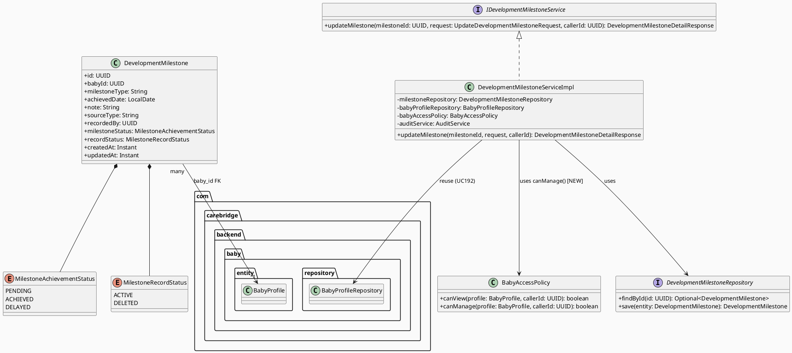

# ENGINEERING DOCUMENTATION STANDARD (EDS) v2.0
# Technical Design Specification — UC-196 Update Development Milestone

| Field | Value |
|-------|-------|
| **Document ID** | `CB-BABY-IMP-004` |
| **Version** | `1.0` |
| **Date** | `2026-07-03` |
| **Status** | `Partially Implemented` |
| **Document Owner** | `TV2-Bách` |
| **Author** | `AI Agent` |
| **Reviewed by** | `[Tech Lead]` |
| **DPO Sign-off** | `[ ] Pending` |
| **Approved by** | `TV2-Bách` |
| **Last Review** | `2026-07-03` |
| **Based on EDS** | `v2.0` |

---

## CHANGELOG

| Ngày | Người thực hiện | Nội dung thay đổi |
|------|-----------------|-------------------|
| 2026-07-10 | AI Agent | Implementation status updated to Partially Implemented: targeted baby/carejourney backend tests PASS; full regression remains blocked by non-baby Family/Exercise/Auth/Triage failures. |
| 2026-07-03 | AI Agent | Tạo tài liệu lần đầu cho UC-196 Update Development Milestone |

---

## MỤC LỤC

1. [Tổng quan Module](#1-tổng-quan-module)
2. [Ma trận Truy vết](#2-ma-trận-truy-vết-traceability-matrix)
3. [Architecture Decision Records](#3-architecture-decision-records-adr)
4. [Non-Functional Requirements & SLA](#4-non-functional-requirements--sla)
5. [Static Modeling](#5-static-modeling-mô-hình-tĩnh)
6. [Dynamic Modeling](#6-dynamic-modeling-mô-hình-động)
7. [Domain Event Catalog](#7-domain-event-catalog)
8. [Interface Specification](#8-interface-specification-đặc-tả-giao-diện)
9. [API Specification](#9-api-specification)
10. [Bảng mã lỗi](#10-bảng-mã-lỗi-error-codes)
11. [Quy trình Triển khai](#11-quy-trình-triển-khai-step-by-step)
12. [Rollback & Incident Runbook](#12-rollback--incident-runbook)
13. [Kịch bản Kiểm thử Chi tiết](#13-kịch-bản-kiểm-thử-chi-tiết)
14. [Phương pháp Xác minh](#14-phương-pháp-xác-minh)
15. [Mẫu thử thực tế](#15-mẫu-thử-thực-tế-api-verification-samples)
16. [Bảng tổng hợp phân quyền](#16-bảng-tổng-hợp-phân-quyền-authorization-matrix)
17. [AI Prompt Constraints (CASE 2.0)](#17-ai-prompt-constraints-case-20)

---

## 1. Tổng quan Module

| Field | Value |
|-------|-------|
| **Module Name** | `UpdateDevelopmentMilestone` |
| **Bounded Context** | `baby` (reuse — same bounded context as UC192 `BabyController`/`BabyServiceImpl`/`BabyAccessPolicy`, and UC194's `BabyDailyLog` sibling classes) |
| **UC ID** | `UC-196` |
| **SRS Reference** | `3.3.12.5` (`02_Requirements/SRS/3_Functional_Specification.md` lines 4217-4236) |
| **Primary Actor** | `Mother (ROLE_MOTHER)` |
| **Platform** | `Mobile App` |
| **Priority** | `Medium` |
| **Sprint** | `Sprint 4 — Device Sync And Care Edge Cases` |
| **Owner** | `TV2-Bách` |
| **Data Classification** | `Sensitive-PII` (infant developmental/health data) |
| **Compliance Scope** | `BR-RBAC, BR-PRIVACY` |
| **Upstream Dependencies** | `baby (BabyProfile, BabyAccessPolicy — UC192)`, `auth`, `development_milestones` table |
| **Downstream Consumers** | `UC197 Delete Development Milestone`, `Development Milestone Timeline (future UC)` |

**Mô tả:** Cho phép Mother cập nhật `achieved_date`, `note`, hoặc trạng thái tiến triển (achievement status) của MỘT development milestone (`development_milestones`) đã ghi nhận cho baby của mình. Ownership resolved qua chain `development_milestones.baby_id → baby_profiles.owner_user_id`. Đây là greenfield code: KHÔNG có `DevelopmentMilestone` entity/controller/service nào tồn tại trong codebase hiện tại (xác nhận qua RG-3 §3 ADR-BABY-006 bên dưới). Bảng `development_milestones` hiện tại **KHÔNG có cột `status` nào cả** — cần migration mới, và quyết định thiết kế quan trọng nhất của tài liệu này là phân biệt rõ hai khái niệm "status" khác nhau (xem ADR-BABY-006).

---

## 2. Ma trận Truy vết (Traceability Matrix)

| Requirement ID | Loại | Mô tả | Thành phần Code | Compliance Target | ADR liên quan |
|----------------|------|-------|-----------------|-------------------|---------------|
| UC-196 | Use Case | Mother cập nhật date/notes/status của 1 development milestone | `DevelopmentMilestoneController.updateMilestone()` | BR-RBAC | ADR-BABY-007 |
| BR-RBAC | Business Rule | Chỉ owner của baby profile (strict — không care group member) mới update được | `DevelopmentMilestoneServiceImpl.updateMilestone()` + `BabyAccessPolicy.canManage()` (new method) | BR-RBAC | ADR-BABY-007 |
| BR-PRIVACY | Business Rule | Response chỉ trả field liên quan — minimum-necessary | `DevelopmentMilestoneDetailResponse` DTO | BR-PRIVACY | ADR-BABY-006 |
| — | Design Decision | `milestone_status` (achievement) và `record_status` (soft-delete) PHẢI là 2 cột độc lập | `DevelopmentMilestone` entity — 2 enum fields riêng biệt | Data Integrity | ADR-BABY-006 |

---

## 3. Architecture Decision Records (ADR)

### ADR-BABY-006 — Achievement-Status vs Soft-Delete-Status Disambiguation ⭐ MANDATORY

| Field | Value |
|-------|-------|
| **Status** | `Accepted` |
| **Deciders** | `TV2-Bách, AI Agent` |
| **Date** | `2026-07-03` |
| **Supersedes** | — |

#### Bối cảnh (Context)

SRS §3.3.12.5 mô tả UC-196: "Updates date, notes, **or status** for a development milestone." SRS §3.3.12.6 mô tả UC-197: "**Soft-deletes** a Mother-recorded development milestone." Đọc lướt qua, cả hai UC đều động đến khái niệm "status" của cùng một bảng `development_milestones`, dẫn đến rủi ro nhầm lẫn nghiêm trọng: nếu implement bằng **một cột `status` duy nhất** (giống pattern UC194/UC195 dùng cho `baby_daily_logs.status` ACTIVE/DELETED), thì UC-196 update "status" (vd: đổi milestone từ "chưa đạt" sang "đã đạt") sẽ **vô tình ghi đè** giá trị soft-delete marker, hoặc ngược lại UC-197 xoá mềm sẽ phá huỷ thông tin tiến triển milestone mà Mother đã ghi nhận.

**RG-3 xác nhận (Research Gate):**
```bash
grep -rn "development_milestones\|DevelopmentMilestone" 05_Development/CareBridgeAPI/src/main/java
# 0 kết quả — KHÔNG có Java mapping nào tồn tại. Entity/Repository/Service/Controller là greenfield.
```

**Schema thực tế (`V1__init_schema.sql` dòng 635-645) — KHÔNG có cột `status`:**
```sql
CREATE TABLE public.development_milestones (
    milestone_id   uuid        NOT NULL DEFAULT gen_random_uuid(),
    baby_id        uuid        NOT NULL,
    milestone_type varchar(80) NOT NULL,
    achieved_date  date,
    note           text,
    source_type    varchar(30),
    recorded_by    uuid,
    created_at     timestamptz NOT NULL DEFAULT now(),
    updated_at     timestamptz NOT NULL DEFAULT now()
);
-- PK: milestone_id
-- FK: baby_id -> baby_profiles(baby_id); recorded_by -> users(user_id)
-- INDEX: idx_development_milestones_baby_id
```
Không có bất kỳ cột `status` nào — cả achievement-status lẫn soft-delete marker đều **thiếu hoàn toàn**. Đây là gap thật sự (không phải tài liệu sai), cần một migration mới bổ sung **HAI cột độc lập**.

#### Các phương án đã xem xét (Options Considered)

| Phương án | Mô tả | Ưu điểm | Nhược điểm |
|-----------|-------|----------|------------|
| A | Một cột `status` duy nhất, dùng chung giá trị enum mở rộng (vd: `PENDING`, `ACHIEVED`, `DELAYED`, `DELETED`) — giống style `baby_daily_logs` (UC194/195) | Ít cột hơn, đơn giản schema | **Conflict nghiêm trọng**: UC-196 set status=`ACHIEVED` và UC-197 set status=`DELETED` ghi đè lẫn nhau — không thể vừa biết milestone đã đạt hay chưa, vừa biết record có bị xoá hay không, cùng lúc. Vi phạm nguyên tắc Single Responsibility per column. |
| B | Hai cột độc lập: `milestone_status` (achievement progress: `PENDING`/`ACHIEVED`/`DELAYED`) và `record_status` (lifecycle: `ACTIVE`/`DELETED`) | Tách biệt hoàn toàn 2 khái niệm nghiệp vụ khác nhau — UC-196 CHỈ được ghi vào `milestone_status`, UC-197 CHỈ được ghi vào `record_status`. Dễ audit, dễ test độc lập, không có write-conflict giữa 2 UC. | Thêm 1 cột so với phương án A; cần migration mới rõ ràng hơn. |

#### Quyết định (Decision)

Chọn **Phương án B**. Bổ sung migration `V20260707120000__add_development_milestone_status_columns.sql` thêm HAI cột độc lập vào `development_milestones`:

```sql
-- UC-196 Update Development Milestone / UC-197 Delete Development Milestone
-- Tách biệt 2 khái niệm "status" khác nhau hoàn toàn trên development_milestones:
--   milestone_status = achievement progress (PENDING/ACHIEVED/DELAYED) — CHỈ mutate bởi UC-196
--   record_status    = soft-delete lifecycle (ACTIVE/DELETED)          — CHỈ mutate bởi UC-197
-- Hai cột này PHẢI độc lập tuyệt đối — xem ADR-BABY-006, UC196 TDS §3.

ALTER TABLE public.development_milestones
    ADD COLUMN IF NOT EXISTS milestone_status VARCHAR(20) NOT NULL DEFAULT 'ACHIEVED';

ALTER TABLE public.development_milestones
    ADD COLUMN IF NOT EXISTS record_status VARCHAR(20) NOT NULL DEFAULT 'ACTIVE';

CREATE INDEX IF NOT EXISTS idx_development_milestones_record_status
    ON public.development_milestones USING btree (record_status);
```

**Backfill rationale cho DEFAULT:** Các record hiện có trong DB đều được ghi nhận kèm `achieved_date` (theo mô tả nghiệp vụ hiện tại — Mother ghi milestone sau khi xảy ra), nên default `milestone_status = 'ACHIEVED'` là an toàn cho backfill. `record_status = 'ACTIVE'` là default chuẩn cho mọi soft-delete pattern trong CareBridge (xem `V20260627100200__add_maternal_metric_status.sql` — cùng convention `DEFAULT 'ACTIVE'`).

**Quy tắc code bắt buộc (enforced ở Service layer, KHÔNG chỉ ở DB):**
1. `DevelopmentMilestoneServiceImpl.updateMilestone()` (UC-196) chỉ được phép ghi vào field `milestoneStatus` của entity — **KHÔNG BAO GIỜ** được set `recordStatus`.
2. `DevelopmentMilestoneServiceImpl.deleteMilestone()` (UC-197, xem TDS riêng) chỉ được phép ghi vào field `recordStatus` (set `DELETED`) — **KHÔNG BAO GIỜ** được đổi `milestoneStatus`.
3. Cả hai method PHẢI kiểm tra `recordStatus == ACTIVE` trước khi cho phép thao tác — nếu `recordStatus == DELETED`, trả `404 MILESTONE-001` (record coi như không tồn tại), **không phân biệt** đó là do đã bị UC-197 xoá trước đó hay do input sai.

#### Hệ quả (Consequences)

**Tích cực:**
- Loại bỏ hoàn toàn khả năng UC-196 vô tình "hồi sinh" một record đã bị soft-delete, hoặc UC-197 vô tình xoá mất lịch sử tiến triển milestone.
- Hai UC có thể được test, deploy, và audit độc lập mà không sợ side-effect chéo.
- Nhất quán với nguyên tắc Single Responsibility áp dụng ở cấp độ column.

**Tiêu cực / Trade-offs:**
- Thêm 1 cột so với phương án tối giản — chấp nhận được, chi phí storage không đáng kể.
- Developer PHẢI nhớ dùng đúng field — giảm thiểu rủi ro bằng cách đặt tên rõ ràng (`milestoneStatus` vs `recordStatus`, không dùng tên chung `status`) và bằng unit test disambiguation bắt buộc (xem Test-Spec §MILESTONE-UPD-TC-DISAMB).

**Compliance Impact:**
- Củng cố BR-PRIVACY: dữ liệu sức khoẻ phát triển của trẻ không bị mất hoặc sai lệch do nhầm lẫn logic — giảm rủi ro data integrity incident cần báo cáo.

---

### ADR-BABY-007 — Strict Ownership (KHÔNG Care-Group) cho Milestone Mutation

| Field | Value |
|-------|-------|
| **Status** | `Accepted` |
| **Deciders** | `TV2-Bách, AI Agent` |
| **Date** | `2026-07-03` |
| **Supersedes** | — |

#### Bối cảnh (Context)

`BabyAccessPolicy.canView()` (UC192, đã ship) cho phép **cả owner LẪN care group member (ACCEPTED)** xem baby profile — và UC194 đã tái sử dụng y hệt cho việc xem `baby_daily_logs`. Tuy nhiên, SRS §3.3.12.5/3.3.12.6 xác định rõ **Primary Actor = Mother** (không có Secondary Actor), và mô tả "Mother-recorded development milestone" — ngụ ý quyền **sửa/xoá** nên hẹp hơn quyền **xem**. Nếu tái sử dụng nguyên `canView()` cho UC-196/UC-197, một Family member chỉ được mời xem (ACCEPTED nhưng không phải owner) sẽ có thể sửa/xoá dữ liệu milestone của Mother khác — vi phạm nguyên tắc least-privilege và tạo lỗ hổng IDOR-adjacent (Broken Access Control — quyền ghi bị cấp quá rộng).

#### Các phương án đã xem xét (Options Considered)

| Phương án | Mô tả | Ưu điểm | Nhược điểm |
|-----------|-------|----------|------------|
| A | Tái sử dụng nguyên `BabyAccessPolicy.canView()` cho cả UC-196/UC-197 | Tối giản, không sửa code UC192 | Cấp quyền ghi quá rộng cho care group member — vi phạm least-privilege, không khớp SRS Primary Actor |
| B | Viết `DevelopmentMilestoneAccessPolicy` riêng, duplicate ownership check | Isolation module | Trùng lặp logic ownership đã có trong `BabyAccessPolicy`, dễ lệch pha |
| C | Bổ sung method mới `canManage(BabyProfile, callerId)` vào `BabyAccessPolicy` hiện có — strict ownership only (không check care group) | Một class duy nhất cho toàn bộ authorization logic của bounded context `baby`; thay đổi additive, KHÔNG sửa `canView()` hiện có (không breaking UC192/UC194); rõ ràng phân biệt "quyền xem" vs "quyền sửa" | Thêm 1 method vào class đã Approved — cần review kỹ để không phá vỡ hợp đồng cũ |

#### Quyết định (Decision)

Chọn **Phương án C**. Bổ sung method mới vào `BabyAccessPolicy` (additive, không sửa `canView()` hiện có):

```java
// Bổ sung vào com.carebridge.backend.baby.policy.BabyAccessPolicy (file đã tồn tại từ UC192)
/**
 * Returns true CHỈ KHI caller là account owner của baby profile — strict ownership,
 * KHÔNG chấp nhận care group member dù ACCEPTED. Dùng cho các thao tác MUTATION
 * (update/delete) trên dữ liệu do Mother tự ghi nhận — khác với canView() vốn cho phép
 * cả care group member xem. ADR-BABY-007.
 */
public boolean canManage(BabyProfile profile, UUID callerId) {
    return profile.getOwnerUserId().equals(callerId);
}
```

`DevelopmentMilestoneServiceImpl` gọi `babyAccessPolicy.canManage(profile, callerId)` (KHÔNG gọi `canView()`) cho cả `updateMilestone()` và `deleteMilestone()`.

#### Hệ quả (Consequences)

**Tích cực:**
- Care group member (kể cả ACCEPTED) không thể sửa/xoá milestone của Mother khác — đúng nguyên tắc least-privilege.
- Một class `BabyAccessPolicy` duy nhất chứa toàn bộ authorization logic — không phân mảnh.
- Không breaking change cho UC192/UC194 (chỉ thêm method mới).

**Tiêu cực / Trade-offs:**
- UC194's `ADR-BABY-004` pattern (reuse `canView()`) KHÔNG áp dụng trực tiếp cho UC196/UC197 — cần lưu ý khi review để tránh nhầm lẫn giữa 2 pattern (view vs manage) trong cùng bounded context. Ghi chú rõ trong Constraint Block §17.

**Compliance Impact:**
- Củng cố BR-RBAC (OWASP A01:2021 — Broken Access Control mitigation) bằng cách thu hẹp đúng phạm vi quyền ghi theo SRS Primary Actor.

---

## 4. Non-Functional Requirements & SLA

### 4.1. Performance & Availability

| Category | Requirement | Target SLA | Measurement Method | Compliance Basis |
|----------|-------------|------------|---------------------|------------------|
| Latency (p99) | PATCH response | `< 300ms` | k6 load test | — |
| Availability | Uptime | `99.9%` | Uptime monitor | — |

### 4.2. Data Integrity & Retention

| Category | Requirement | Target | Verification Method | Compliance Basis |
|----------|-------------|--------|---------------------|------------------|
| Consistency | `milestone_status` và `record_status` độc lập tuyệt đối | 100% — không lần update nào ghi chéo cột | Unit test disambiguation (§13) | ADR-BABY-006 |
| Consistency | `baby_id` FK luôn resolve được `BabyProfile` | 100% | FK constraint `development_milestones_baby_id_fkey` | — |

### 4.3. Security

| Category | Requirement | Target | Verification Method | Compliance Basis |
|----------|-------------|--------|---------------------|------------------|
| Access control | Strict ownership guard (không care group) | 100% requests kiểm tra qua `canManage()` | Unit + security test | BR-RBAC, ADR-BABY-007 |
| Encryption in transit | TLS | TLS 1.3+ | SSL Labs scan | — |

### 4.4. Scalability & Capacity Planning

Tải dự kiến thấp: mỗi baby thường có < 50 milestone record trong 2 năm đầu đời, update tần suất "Regular" theo SRS (không phải "Frequent"). Endpoint single-row PATCH theo PK — không cần pagination/caching riêng.

---

## 5. Static Modeling (Mô hình Tĩnh)

### 5.1. Class Diagram (PlantUML)



### 5.2. Data Structure (Flyway SQL Migration)

> **CareBridge rule:** `V1__init_schema.sql` là baseline oracle. `development_milestones` đã tồn tại (dòng 635-645) nhưng KHÔNG có bất kỳ cột status nào → migration mới bắt buộc.

Tạo file: `05_Development/CareBridgeAPI/src/main/resources/db/migration/V20260707120000__add_development_milestone_status_columns.sql`

```sql
-- UC-196 Update Development Milestone / UC-197 Delete Development Milestone
-- Xem ADR-BABY-006 (UC196 TDS §3) cho lý do tách 2 cột độc lập.
ALTER TABLE public.development_milestones
    ADD COLUMN IF NOT EXISTS milestone_status VARCHAR(20) NOT NULL DEFAULT 'ACHIEVED';

ALTER TABLE public.development_milestones
    ADD COLUMN IF NOT EXISTS record_status VARCHAR(20) NOT NULL DEFAULT 'ACTIVE';

CREATE INDEX IF NOT EXISTS idx_development_milestones_record_status
    ON public.development_milestones USING btree (record_status);
```

> **Quy tắc đặt tên:** snake_case cho SQL DDL — nhất quán với toàn bộ `V1__init_schema.sql`.
> **Migration version:** `V20260707120000` — theo dải version được chỉ định cho batch này (`V20260707120000`+, tránh dải `090000/100000/110000/130000` đã dùng cho batch khác).

---

## 6. Dynamic Modeling (Mô hình Động)

### 6.1. Sequence Diagram — Happy Path (PlantUML)


### 6.2. Sequence Diagram — Error Path (PlantUML)

```plantuml
@startuml UpdateDevelopmentMilestone_ErrorPath
skinparam backgroundColor #FAFAFA
actor "Care Group Member (ACCEPTED, non-owner)" as Client
participant "DevelopmentMilestoneController" as Controller
participant "DevelopmentMilestoneServiceImpl" as Service
participant "DevelopmentMilestoneRepository" as MRepo
participant "BabyProfileRepository" as PRepo
participant "BabyAccessPolicy" as Policy

Client -> Controller : PATCH /api/v1/babies/{babyId}/milestones/{milestoneId}
activate Controller
Controller -> Service : updateMilestone(milestoneId, request, callerId)
activate Service
Service -> MRepo : findById(milestoneId)
MRepo --> Service : Optional<DevelopmentMilestone> (present, recordStatus=ACTIVE)
Service -> PRepo : findById(milestone.getBabyId())
PRepo --> Service : Optional<BabyProfile> (present, owner = OTHER user)
Service -> Policy : canManage(profile, callerId)
Policy --> Service : false
Service -> Service : throw BusinessException(403, "MILESTONE-002")
deactivate Service
Controller --> Client : 403 Forbidden {code: MILESTONE-002}
deactivate Controller

note over Service
  Alternative: milestoneId not found -> BusinessException(404, "MILESTONE-001")
  Alternative: recordStatus == DELETED (post-UC197) -> BusinessException(404, "MILESTONE-001")
  Alternative: empty request body -> BusinessException(400, "MILESTONE-003")
  Alternative: status=ACHIEVED but achievedDate null (existing AND new) -> BusinessException(400, "MILESTONE-003")
  IMPORTANT: canManage() dùng strict ownership — care group member ACCEPTED
  vẫn bị 403 ở đây, khác với canView() ở UC192/UC194 (ADR-BABY-007)
end note
@enduml
```



### 6.3. State Machine — `milestoneStatus` (achievement progress)

```plantuml
@startuml UpdateDevelopmentMilestone_StateMachine
skinparam backgroundColor #FAFAFA
skinparam StateBackgroundColor #D5E8F0
skinparam StateBorderColor #2E75B6

[*] --> PENDING : milestone tạo mới, chưa có achievedDate

PENDING --> ACHIEVED : Mother set achievedDate + status=ACHIEVED (UC-196)
PENDING --> DELAYED  : Mother set status=DELAYED (UC-196)
DELAYED --> ACHIEVED : Mother set achievedDate + status=ACHIEVED (UC-196)
ACHIEVED --> PENDING : Mother sửa lại nếu ghi nhầm (UC-196, edge case)

note right of ACHIEVED
  Invariant: milestoneStatus KHÔNG BAO GIỜ được set
  bởi UC-197 (Delete) — chỉ UC-196 được ghi field này.
  ADR-BABY-006.
end note

@enduml
```



> **⚠️ Invariant bất biến:** `recordStatus` (ACTIVE/DELETED) là một FSM hoàn toàn tách biệt, chỉ chuyển `ACTIVE → DELETED` một chiều, và chỉ được thao tác bởi UC-197 (xem UC197 TDS §6.3). Không có transition nào giữa `milestoneStatus` và `recordStatus`.

---

## 7. Domain Event Catalog

### 7.1. Events Published (Phát ra)

| Event Name | Trigger | Publisher | Subscriber(s) | Payload Schema | Async? |
|------------|---------|-----------|---------------|----------------|--------|
| `DevelopmentMilestoneUpdated` | Sau khi `updateMilestone()` commit thành công | `DevelopmentMilestoneServiceImpl` | `audit` | `DevelopmentMilestoneUpdatedEvent.java` | No (đồng bộ, nhất quán với `AuditService.log()` pattern hiện có trong `BabyServiceImpl`) |

### 7.2. Events Consumed (Tiêu thụ)

Không có — module này không tiêu thụ event nào.

### 7.3. Payload Schema

```java
// DevelopmentMilestoneUpdatedEvent.java
public record DevelopmentMilestoneUpdatedEvent(
    UUID    eventId,
    String  eventType,       // "DevelopmentMilestoneUpdated"
    Instant occurredAt,
    String  version,         // "1.0"
    Payload payload,
    Metadata metadata
) {
    public record Payload(
        UUID   milestoneId,
        UUID   babyId,
        String oldMilestoneStatus,  // nullable nếu status không đổi
        String newMilestoneStatus,  // nullable nếu status không đổi
        UUID   updatedByUserId
    ) {}

    public record Metadata(
        UUID   correlationId,
        String causedBy
    ) {}
}
```

> **Ghi chú triển khai:** Ở lần triển khai đầu, event này được emit thông qua `AuditService.log(AuditAction.DEVELOPMENT_MILESTONE_UPDATED, ...)` (cần bổ sung giá trị enum mới `DEVELOPMENT_MILESTONE_UPDATED` vào `AuditAction.java` hiện có — additive change, không sửa giá trị cũ). Việc phát Spring `ApplicationEvent` riêng là **Open item** — xem Open Items cuối tài liệu.

---

## 8. Interface Specification (Đặc tả Giao diện)

### 8.1. Service Interface

```java
// UpdateDevelopmentMilestoneRequest.java — Input DTO
// @version 1.0
public class UpdateDevelopmentMilestoneRequest {
    @PastOrPresent
    private LocalDate achievedDate;    // optional — null nếu không đổi
    @Size(max = 2000)
    private String note;               // optional — null nếu không đổi
    private MilestoneAchievementStatus status; // optional — PENDING/ACHIEVED/DELAYED, null nếu không đổi
    // getters/setters; @AssertTrue custom validator: at-least-one-field-present
}

// DevelopmentMilestoneDetailResponse.java — Output DTO
public class DevelopmentMilestoneDetailResponse {
    private UUID id;
    private UUID babyId;
    private String milestoneType;
    private LocalDate achievedDate;
    private String note;
    private String sourceType;
    private UUID recordedBy;
    private String status;       // maps to entity.milestoneStatus — KHÔNG lộ recordStatus ra response
    private Instant createdAt;
    private Instant updatedAt;
}

// IDevelopmentMilestoneService.java — Service Contract
// @version 1.0
public interface IDevelopmentMilestoneService {
    /**
     * @throws BusinessException (MILESTONE-001/404) khi milestoneId không tồn tại,
     *         HOẶC recordStatus == DELETED (post-UC197, treat as not-found — ADR-BABY-006)
     * @throws BusinessException (MILESTONE-002/403) khi caller không phải account owner
     *         (canManage() strict ownership — ADR-BABY-007)
     * @throws BusinessException (MILESTONE-003/400) khi request rỗng (0 field) HOẶC
     *         status=ACHIEVED mà achievedDate (cũ lẫn mới) đều null
     */
    DevelopmentMilestoneDetailResponse updateMilestone(
            UUID milestoneId, UpdateDevelopmentMilestoneRequest request, UUID callerId);
}
```

### 8.2. Entity & Repository Interface

```java
// DevelopmentMilestone.java — new entity, package com.carebridge.backend.baby.entity
// @version 1.0
@Entity
@Table(name = "development_milestones")
public class DevelopmentMilestone {
    @Id
    @GeneratedValue(strategy = GenerationType.UUID)
    @Column(name = "milestone_id", updatable = false, nullable = false)
    private UUID id;

    @Column(name = "baby_id", nullable = false)
    private UUID babyId;

    @Column(name = "milestone_type", nullable = false, length = 80)
    private String milestoneType;   // known values per UC37 ADR-BABY-007-001: ROLLING, CRAWLING, WALKING, SPEAKING, TEETHING, WEANING, FIRST_SMILE, SITTING, STANDING (validated BABY-063 on write); String, NOT @Enumerated — update path stays permissive, same rationale as UC194 OI-1

    @Column(name = "achieved_date")
    private LocalDate achievedDate;

    @Column(name = "note")
    private String note;

    @Column(name = "source_type", length = 30)
    private String sourceType;

    @Column(name = "recorded_by")
    private UUID recordedBy;

    // ADR-BABY-006: achievement progress — CHỈ mutate bởi UC-196
    @Enumerated(EnumType.STRING)
    @Column(name = "milestone_status", nullable = false, length = 20)
    private MilestoneAchievementStatus milestoneStatus;

    // ADR-BABY-006: soft-delete lifecycle — CHỈ mutate bởi UC-197
    @Enumerated(EnumType.STRING)
    @Column(name = "record_status", nullable = false, length = 20)
    private MilestoneRecordStatus recordStatus;

    @CreationTimestamp
    @Column(name = "created_at", nullable = false, updatable = false)
    private Instant createdAt;

    @UpdateTimestamp
    @Column(name = "updated_at", nullable = false)
    private Instant updatedAt;
}

// MilestoneAchievementStatus.java
public enum MilestoneAchievementStatus { PENDING, ACHIEVED, DELAYED }

// MilestoneRecordStatus.java
public enum MilestoneRecordStatus { ACTIVE, DELETED }

// DevelopmentMilestoneRepository.java
// @version 1.0
public interface DevelopmentMilestoneRepository extends JpaRepository<DevelopmentMilestone, UUID> {
    // findById() kế thừa từ JpaRepository là đủ cho UC196/UC197 (single-row lookup theo PK).
}
```

---

## 9. API Specification

### 9.1. Endpoints Table

| Method | Path | Auth Level | Required Roles | Rate Limit | Idempotent? |
|--------|------|------------|----------------|------------|-------------|
| `PATCH` | `/api/v1/babies/{babyId}/milestones/{milestoneId}` | JWT Bearer | `ROLE_MOTHER` | 60/min | Yes |

> **Path design note:** Nhất quán với `BabyController`'s `/api/v1/babies` base path (UC192) và `BabyDailyLogController`'s nested pattern (UC194). `babyId` trong path CHỈ dùng để routing — service KHÔNG tin `babyId` từ path cho authorization; ownership check luôn dựa trên `milestone.getBabyId()` đọc từ DB.

### 9.2. Request / Response Schemas

#### `PATCH /api/v1/babies/{babyId}/milestones/{milestoneId}`

**Request Headers:**
```
Authorization: Bearer <JWT_TOKEN>
Content-Type: application/json
```

**Request Body (partial — mọi field optional, tối thiểu 1 field):**
```json
{
  "achievedDate": "2026-07-01",
  "note": "Bé đã biết bò thành thạo",
  "status": "ACHIEVED"
}
```

**Response — 200 OK:**
```json
{
  "success": true,
  "data": {
    "id": "550e8400-e29b-41d4-a716-446655440000",
    "babyId": "660e8400-e29b-41d4-a716-446655440001",
    "milestoneType": "crawling",
    "achievedDate": "2026-07-01",
    "note": "Bé đã biết bò thành thạo",
    "sourceType": "manual",
    "recordedBy": "770e8400-e29b-41d4-a716-446655440002",
    "status": "ACHIEVED",
    "createdAt": "2026-06-20T08:00:00.000Z",
    "updatedAt": "2026-07-03T10:15:00.000Z"
  }
}
```

**Response — 400 Bad Request:**
```json
{
  "error": { "code": "MILESTONE-003", "message": "At least one field (achievedDate, note, status) must be provided, and status=ACHIEVED requires achievedDate" }
}
```

**Response — 403 Forbidden:**
```json
{
  "error": { "code": "MILESTONE-002", "message": "Access denied to update this development milestone" }
}
```

**Response — 404 Not Found:**
```json
{
  "error": { "code": "MILESTONE-001", "message": "Development milestone not found" }
}
```

---

## 10. Bảng mã lỗi (Error Codes)

> Prefix `MILESTONE-` dùng riêng cho `development_milestones` module — tránh đụng `BABY-xxx` (UC192) và `DAILYLOG-xxx` (UC194).

| Code | HTTP Status | Message (EN) | Message (VI) | Trigger Condition |
|------|-------------|--------------|--------------|-------------------|
| `MILESTONE-001` | 404 | Development milestone not found | Không tìm thấy mốc phát triển | `milestoneId` không tồn tại HOẶC `recordStatus = DELETED` (post-UC197) HOẶC `baby_id` FK không resolve được `BabyProfile` (orphan, defense-in-depth) |
| `MILESTONE-002` | 403 | Access denied to update this development milestone | Không đủ quyền cập nhật mốc phát triển | Caller KHÔNG phải account owner (`canManage()` false — strict, kể cả care group ACCEPTED member) |
| `MILESTONE-003` | 400 | Invalid update request | Yêu cầu cập nhật không hợp lệ | Request rỗng (0 field) HOẶC `status=ACHIEVED` mà `achievedDate` (cũ và mới) đều null HOẶC `status` không thuộc enum hợp lệ |
| `MILESTONE-004` | 500 | Internal error | Lỗi hệ thống | Unexpected DB error |

---

## 11. Quy trình Triển khai (Step-by-Step)

### 11.1. Prerequisites
- [ ] TDS này (UC196) và TDS UC197 (companion) đều Approved
- [ ] `BabyProfileRepository`, `BabyAccessPolicy` (UC192) đã có sẵn trong `main`

### 11.2. Pre-Migration Checklist
- [ ] Backup DB dev/staging trước khi chạy `V20260707120000`
- [ ] Xác nhận UC197 KHÔNG chạy migration riêng trùng cột (UC197 tái sử dụng chung migration này — xem UC197 TDS §5.2)

### 11.3. Implementation Steps

#### Chặng 1 — Migration
Tạo `V20260707120000__add_development_milestone_status_columns.sql` (§5.2). Chạy `./mvnw flyway:migrate`.

#### Chặng 2 — Entity + Enums + Repository
Tạo `DevelopmentMilestone.java`, `MilestoneAchievementStatus.java`, `MilestoneRecordStatus.java`, `DevelopmentMilestoneRepository.java` trong `com.carebridge.backend.baby.{entity,repository}`.

#### Chặng 3 — Policy extension
Bổ sung method `canManage(BabyProfile, UUID)` vào `BabyAccessPolicy.java` hiện có (KHÔNG sửa `canView()`).

#### Chặng 4 — Service + DTO
Tạo `IDevelopmentMilestoneService.java`, `DevelopmentMilestoneServiceImpl.java`, `UpdateDevelopmentMilestoneRequest.java`, `DevelopmentMilestoneDetailResponse.java` trong `com.carebridge.backend.baby.{service, service.impl, dto}`.

#### Chặng 5 — Controller
Tạo `DevelopmentMilestoneController.java` (`@RestController`, base path `/api/v1/babies/{babyId}/milestones`), method `updateMilestone` (`@PatchMapping("/{milestoneId}")`).

#### Chặng 6 — Audit
Bổ sung `DEVELOPMENT_MILESTONE_UPDATED` vào `AuditAction.java` (additive).

#### Chặng 7 — Verification sau deploy
```bash
curl -X PATCH https://[host]/api/v1/babies/[babyId]/milestones/[milestoneId] \
  -H "Authorization: Bearer [JWT_MOTHER_TOKEN]" \
  -H "Content-Type: application/json" \
  -d '{"status": "ACHIEVED", "achievedDate": "2026-07-01"}'
# Expected: 200 with status=ACHIEVED
```

### 11.4. Deployment Checklist
- [ ] `./mvnw test` xanh
- [ ] Disambiguation test PASS: update status KHÔNG đổi `record_status` trong DB
- [ ] IDOR test (non-owner, kể cả care group ACCEPTED → 403) pass

---

## 12. Rollback & Incident Runbook

### 12.1. Điều kiện kích hoạt Rollback

| Điều kiện | Ngưỡng | Người quyết định |
|-----------|--------|------------------|
| Error rate tăng đột biến | > 5% trong 5 phút | On-call Engineer |
| Phát hiện `milestone_status` và `record_status` bị ghi chéo (data corruption) | Bất kỳ case nào | Tech Lead + DPO |

### 12.2. Rollback Procedure

```bash
# Rollback migration (dev/staging only)
psql -h $DB_HOST -U $DB_USER -d $DB_NAME \
  -c "ALTER TABLE development_milestones DROP COLUMN IF EXISTS milestone_status;"
psql -h $DB_HOST -U $DB_USER -d $DB_NAME \
  -c "ALTER TABLE development_milestones DROP COLUMN IF EXISTS record_status;"
psql -h $DB_HOST -U $DB_USER -d $DB_NAME \
  -c "DELETE FROM flyway_schema_history WHERE version = '20260707120000';"

kubectl rollout undo deployment/carebridge-api
kubectl rollout status deployment/carebridge-api
curl -X GET https://[host]/api/v1/health
```

> ⚠️ **Cảnh báo:** KHÔNG chạy `DROP COLUMN` trên production nếu UC197 đã deploy song song và có dữ liệu `record_status = DELETED` — sẽ mất thông tin xoá mềm. Coordinate rollback giữa UC196/UC197 trước khi thực thi.

### 12.3. Notification Protocol

| Thời điểm | Người nhận | Kênh |
|-----------|------------|------|
| Ngay khi phát hiện data corruption giữa 2 cột status | Tech Lead + DPO | Slack `#incident` + Email |

---

## 13. Kịch bản Kiểm thử Chi tiết

> **Policy (EDS v2.0):** Mọi test scenario dùng dữ liệu `SYNTHETIC`.

```gherkin
Feature: Update Development Milestone
  Background:
    Given test data classification: SYNTHETIC
    And MOTHER-001 là owner của BABY-001
    And MILESTONE-001 thuá»™c BABY-001 vá»›i milestoneStatus=PENDING, recordStatus=ACTIVE

  Scenario: Owner cập nhật status → ACHIEVED (kèm achievedDate) → 200
    When updateMilestone(MILESTONE-001, {status: ACHIEVED, achievedDate: 2026-07-01}, MOTHER-001)
    Then response 200 vá»›i status=ACHIEVED, achievedDate=2026-07-01

  Scenario: Owner cập nhật chỉ note → 200
    When updateMilestone(MILESTONE-001, {note: "cập nhật ghi chú"}, MOTHER-001)
    Then response 200, milestoneStatus không đổi

  Scenario: Care group member (ACCEPTED, non-owner) → 403
    Given MOTHER-002 là ACCEPTED member trong care group của BABY-001 (không phải owner)
    When updateMilestone(MILESTONE-001, {note: "x"}, MOTHER-002)
    Then throws BusinessException MILESTONE-002 (403)

  Scenario: Non-owner, non-member → 403
    Given MOTHER-003 KHÔNG liên quan BABY-001
    When updateMilestone(MILESTONE-001, {note: "x"}, MOTHER-003)
    Then throws BusinessException MILESTONE-002 (403)

  Scenario: Milestone không tồn tại → 404
    When updateMilestone(NONEXISTENT, {note: "x"}, MOTHER-001)
    Then throws BusinessException MILESTONE-001 (404)

  Scenario: Milestone đã soft-deleted (post-UC197) → 404
    Given MILESTONE-002 thuá»™c BABY-001 vá»›i recordStatus=DELETED
    When updateMilestone(MILESTONE-002, {note: "x"}, MOTHER-001)
    Then throws BusinessException MILESTONE-001 (404)

  Scenario: Request rỗng → 400
    When updateMilestone(MILESTONE-001, {}, MOTHER-001)
    Then throws BusinessException MILESTONE-003 (400)

  Scenario: status=ACHIEVED không có achievedDate (cũ lẫn mới đều null) → 400
    Given MILESTONE-003 thuá»™c BABY-001 vá»›i achievedDate=null, milestoneStatus=PENDING
    When updateMilestone(MILESTONE-003, {status: ACHIEVED}, MOTHER-001)
    Then throws BusinessException MILESTONE-003 (400)

  Scenario: [DISAMBIGUATION — CRITICAL] Update status KHÔNG đụng đến recordStatus
    When updateMilestone(MILESTONE-001, {status: DELAYED}, MOTHER-001)
    Then DB row có milestone_status=DELAYED VÀ record_status vẫn=ACTIVE (không đổi)
```

---

## 14. Phương pháp Xác minh

### 14.1. Database Inspection

```sql
-- Verify milestone exists and belongs to expected baby
SELECT milestone_id, baby_id, milestone_type, achieved_date, note, milestone_status, record_status
FROM development_milestones WHERE milestone_id = '[milestoneId]';

-- Verify ownership chain
SELECT bp.owner_user_id
FROM development_milestones dm
JOIN baby_profiles bp ON bp.baby_id = dm.baby_id
WHERE dm.milestone_id = '[milestoneId]';

-- [DISAMBIGUATION CHECK] Verify record_status untouched after status update
SELECT milestone_status, record_status, updated_at
FROM development_milestones WHERE milestone_id = '[milestoneId]';
-- Expected: record_status = 'ACTIVE' (unless UC197 was separately invoked)
```

### 14.2. Access Policy Verification

```bash
curl -X PATCH https://[host]/api/v1/babies/[babyId]/milestones/[milestoneId] \
  -H "Authorization: Bearer [OWNER_JWT]" -H "Content-Type: application/json" \
  -d '{"status":"ACHIEVED","achievedDate":"2026-07-01"}'
# Expected: 200

curl -X PATCH https://[host]/api/v1/babies/[babyId]/milestones/[milestoneId] \
  -H "Authorization: Bearer [CARE_GROUP_MEMBER_JWT]" -H "Content-Type: application/json" \
  -d '{"note":"x"}'
# Expected: 403 (strict ownership — different from UC192/UC194 canView() behavior)
```

---

## 15. Mẫu thử thực tế (API Verification Samples)

### 15.1. Happy Path

```bash
curl -X PATCH https://[host]/api/v1/babies/[babyId]/milestones/[milestoneId] \
  -H "Authorization: Bearer [JWT_MOTHER_TOKEN]" -H "Content-Type: application/json" \
  -d '{"status":"ACHIEVED","achievedDate":"2026-07-01","note":"Bé đã biết bò"}'
# Expected: 200 {id, babyId, milestoneType, achievedDate, status: "ACHIEVED", ...}
```

### 15.2. Error Paths

```bash
# Empty body -> 400
curl -X PATCH https://[host]/api/v1/babies/[babyId]/milestones/[milestoneId] \
  -H "Authorization: Bearer [JWT_MOTHER_TOKEN]" -H "Content-Type: application/json" -d '{}'

# Non-existent milestone -> 404
curl -X PATCH https://[host]/api/v1/babies/[babyId]/milestones/non-existent-uuid \
  -H "Authorization: Bearer [JWT_MOTHER_TOKEN]" -H "Content-Type: application/json" -d '{"note":"x"}'

# Care group member (ACCEPTED, non-owner) -> 403
curl -X PATCH https://[host]/api/v1/babies/[babyId]/milestones/[milestoneId] \
  -H "Authorization: Bearer [CARE_GROUP_MEMBER_JWT]" -H "Content-Type: application/json" -d '{"note":"x"}'

# No JWT -> 401
curl -X PATCH https://[host]/api/v1/babies/[babyId]/milestones/[milestoneId]
```

---

## 16. Bảng tổng hợp phân quyền (Authorization Matrix)

| Endpoint | `GUEST` | `MOTHER (owner)` | `MOTHER (care member, ACCEPTED)` | `EXPERT` | `ADMIN` |
|----------|---------|-------------------|-----------------------------------|----------|---------|
| `PATCH /api/v1/babies/{babyId}/milestones/{milestoneId}` | ❌ (401) | ✅ | ❌ (403) | ❌ (403) | ✅ All |

**Chú thích:**
- Owner: `baby_profiles.owner_user_id` == JWT subject (via `development_milestones.baby_id` FK) — kiểm tra bằng `canManage()` **strict** (ADR-BABY-007).
- Care member (kể cả ACCEPTED): **KHÔNG** được sửa — khác với UC192/UC194 vốn cho phép xem. Đây là khác biệt cố ý, có ADR.
- Expert: không có quyền, ngoài phạm vi UC.

---

## 17. AI Prompt Constraints (CASE 2.0)

### 17.1 Constraint Summary Table

| # | Constraint | Source | Last Verified |
|---|-----------|--------|---------------|
| C1 | `DevelopmentMilestoneServiceImpl.updateMilestone()` CHỈ được ghi vào field `milestoneStatus` — TUYỆT ĐỐI KHÔNG được set `recordStatus` | ADR-BABY-006 | 2026-07-03 |
| C2 | Authorization PHẢI dùng `BabyAccessPolicy.canManage()` (strict ownership) — KHÔNG dùng `canView()` (vốn cho phép care group member) | ADR-BABY-007 | 2026-07-03 |
| C3 | Nếu `recordStatus == DELETED`, trả 404 `MILESTONE-001` — KHÔNG trả 403, KHÔNG cho phép "hồi sinh" record đã xoá mềm qua update | ADR-BABY-006 | 2026-07-03 |
| C4 | `babyId` trong URL path CHỈ dùng để routing — authorization luôn dựa trên `milestone.getBabyId()` đọc từ DB | BR-RBAC | 2026-07-03 |
| C5 | Request rỗng (0 field) hoặc `status=ACHIEVED` thiếu `achievedDate` (cả cũ và mới) PHẢI reject 400 `MILESTONE-003` | SRS §3.3.12.5 | 2026-07-03 |

### 17.2 Constraint Injection Block

```
[CONSTRAINT BLOCK — Module: UpdateDevelopmentMilestone (CB-BABY-IMP-004)]
1. updateMilestone() CHỈ ghi vào entity field milestoneStatus — KHÔNG BAO GIỜ set recordStatus — ADR-BABY-006
2. Authorization dùng babyAccessPolicy.canManage(profile, callerId) — strict ownership, KHÔNG dùng canView() — ADR-BABY-007
3. recordStatus == DELETED -> 404 MILESTONE-001 (record coi như không tồn tại, không "hồi sinh" được qua update)
4. babyId trong URL path KHÔNG dùng cho authorization — chỉ dùng để route; ownership dựa trên dữ liệu đọc từ DB
5. Request rỗng hoặc status=ACHIEVED thiếu achievedDate -> 400 MILESTONE-003

[CONTEXT BLOCK]
- Bounded Context: baby (reuse UC192/UC194 package — com.carebridge.backend.baby)
- Data Classification: Sensitive-PII
- Error codes: §10 Error Codes Table (prefix MILESTONE-, KHÔNG trùng BABY-xxx/DAILYLOG-xxx)
- Auth matrix: §16 Authorization Matrix
- Reused classes: BabyProfileRepository (UC192); BabyAccessPolicy.canView() giữ nguyên, CHỈ thêm method canManage() mới
- Companion: UC197 Delete Development Milestone dùng chung entity/migration, xem UC197 TDS
```

### 17.3 Constraint Quality Checklist

- [x] Mỗi constraint traceable về ADR hoặc BR cụ thể
- [x] Không có constraint generic
- [x] Constraint block có ≥ 3 constraints cụ thể

### 17.4 Anti-Pattern Detection

| AP-ID | Anti-Pattern | Dấu hiệu | Hành động |
|-------|-------------|-----------|----------|
| AP-AI-001 | Unconstrained Gen | Code không match constraint C1-C5 | Reject — inject lại constraints |
| AP-AI-003 | Implicit Decision | Code dùng 1 cột `status` chung thay vì 2 cột tách biệt | Reject — vi phạm ADR-BABY-006 |
| AP-AI-005 | Hallucinated Contract | Code import class không có trong §8 | Reject — verify contract |

---

## PHỤ LỤC

### A. Glossary (Thuật ngữ)

| Thuật ngữ | Định nghĩa |
|-----------|------------|
| DevelopmentMilestone | Bản ghi mốc phát triển của baby (vd: biết bò, biết đi, mọc răng) |
| `milestoneStatus` (achievement) | Trạng thái tiến triển của milestone: PENDING/ACHIEVED/DELAYED — mutate bởi UC-196 |
| `recordStatus` (lifecycle) | Trạng thái vòng đời record: ACTIVE/DELETED (soft-delete) — mutate CHỈ bởi UC-197 |
| `canManage()` | Method mới trong `BabyAccessPolicy` — strict ownership check cho mutation, khác `canView()` |

### B. Tài liệu tham chiếu

| Document | Path |
|----------|------|
| UC192 TDS (Approved, shipped code reference) | `04_Implement/UC192_ViewBabyProfile/UC192_ViewBabyProfile_TDS.md` |
| UC194 TDS (companion pattern reference — ownership chain, soft-delete precedent) | `04_Implement/UC194_ViewBabyDailyLogDetail/UC194_ViewBabyDailyLogDetail_TDS.md` |
| UC197 TDS (companion — soft-delete, cùng migration) | `04_Implement/UC197_DeleteDevelopmentMilestone/UC197_DeleteDevelopmentMilestone_TDS.md` |
| EDS v2.0 Template | `08_References/Template/PHASE-3_TDS.md` |
| Schema baseline | `05_Development/CareBridgeAPI/src/main/resources/db/migration/V1__init_schema.sql` |

---

## Open Items (chưa resolve — cần Tech Lead / Product xác nhận trước khi Approve)

| # | Item | Mô tả | Đề xuất tạm thời |
|---|------|-------|-------------------|
| OI-1 | ~~`milestone_type` enum vocabulary~~ **RESOLVED (2026-07-03)** | Ban đầu tưởng không có tài liệu nào định nghĩa vocabulary. Rà soát lại phát hiện sibling spec `UC37_RecordDevelopmentMilestone` (ADR-BABY-007-001) đã định nghĩa cho đúng cột `development_milestones.milestone_type` này: `ROLLING, CRAWLING, WALKING, SPEAKING, TEETHING, WEANING, FIRST_SMILE, SITTING, STANDING` (validated qua `BABY-063` ở write path). Cột vẫn là `varchar(80)` không CHECK constraint ở DB. | Dùng `String` (không `@Enumerated`) ở entity cho update path — nhất quán với UC194 OI-1 (permissive read/update, whitelist enforcement thuộc UC37). |
| OI-2 | `DevelopmentMilestoneUpdated` Spring `ApplicationEvent` riêng | Hiện chỉ emit qua `AuditService.log()`, chưa có event bus riêng cho consumer khác (vd: timeline aggregator). | Không kích hoạt mặc định; revisit nếu có downstream consumer cụ thể. |
| OI-3 | `milestoneStatus` default cho record MỚI (không phải backfill) | DTO validation có nên bắt buộc `status` khi tạo mới milestone (ngoài phạm vi UC196, thuộc UC "Create Development Milestone" chưa có trong batch này)? | Ngoài phạm vi UC196/UC197 — ghi nhận cho future UC "CreateDevelopmentMilestone". |

---

*EDS v2.1 — Tích hợp CASE 2.0 AI Prompt Constraints (§17).*
