# ENGINEERING DOCUMENTATION STANDARD (EDS) v2.0
# Technical Design Specification — UC-197 Delete Development Milestone

| Field | Value |
|-------|-------|
| **Document ID** | `CB-BABY-IMP-005` |
| **Version** | `1.0` |
| **Date** | `2026-07-03` |
| **Status** | `Partially Implemented` |
| **Document Owner** | `TV2-Bách` |
| **Author** | `AI Agent` |
| **Reviewed by** | `[Tech Lead]` |
| **DPO Sign-off** | `[ ] Pending` |
| **Approved by** | `TV2-Bách` |
| **Last Review** | `2026-07-03` |
| **Based on EDS** | `v2.0` |

---

## CHANGELOG

| Ngày | Người thực hiện | Nội dung thay đổi |
|------|-----------------|-------------------|
| 2026-07-10 | AI Agent | Implementation status updated to Partially Implemented: targeted baby/carejourney backend tests PASS; full regression remains blocked by non-baby Family/Exercise/Auth/Triage failures. |
| 2026-07-03 | AI Agent | Tạo tài liệu lần đầu cho UC-197 Delete Development Milestone |

---

## MỤC LỤC

1. [Tổng quan Module](#1-tổng-quan-module)
2. [Ma trận Truy vết](#2-ma-trận-truy-vết-traceability-matrix)
3. [Architecture Decision Records](#3-architecture-decision-records-adr)
4. [Non-Functional Requirements & SLA](#4-non-functional-requirements--sla)
5. [Static Modeling](#5-static-modeling-mô-hình-tĩnh)
6. [Dynamic Modeling](#6-dynamic-modeling-mô-hình-động)
7. [Domain Event Catalog](#7-domain-event-catalog)
8. [Interface Specification](#8-interface-specification-đặc-tả-giao-diện)
9. [API Specification](#9-api-specification)
10. [Bảng mã lỗi](#10-bảng-mã-lỗi-error-codes)
11. [Quy trình Triển khai](#11-quy-trình-triển-khai-step-by-step)
12. [Rollback & Incident Runbook](#12-rollback--incident-runbook)
13. [Kịch bản Kiểm thử Chi tiết](#13-kịch-bản-kiểm-thử-chi-tiết)
14. [Phương pháp Xác minh](#14-phương-pháp-xác-minh)
15. [Mẫu thử thực tế](#15-mẫu-thử-thực-tế-api-verification-samples)
16. [Bảng tổng hợp phân quyền](#16-bảng-tổng-hợp-phân-quyền-authorization-matrix)
17. [AI Prompt Constraints (CASE 2.0)](#17-ai-prompt-constraints-case-20)

---

## 1. Tổng quan Module

| Field | Value |
|-------|-------|
| **Module Name** | `DeleteDevelopmentMilestone` |
| **Bounded Context** | `baby` (reuse — cùng bounded context với UC192/UC194/UC196; dùng chung entity `DevelopmentMilestone` với UC196) |
| **UC ID** | `UC-197` |
| **SRS Reference** | `3.3.12.6` (`02_Requirements/SRS/3_Functional_Specification.md` lines 4238-4257) |
| **Primary Actor** | `Mother (ROLE_MOTHER)` |
| **Platform** | `Mobile App` |
| **Priority** | `Medium` |
| **Sprint** | `Sprint 4 — Device Sync And Care Edge Cases` |
| **Owner** | `TV2-Bách` |
| **Data Classification** | `Sensitive-PII` (infant developmental/health data) |
| **Compliance Scope** | `BR-RBAC, BR-PRIVACY` |
| **Upstream Dependencies** | `baby (BabyProfile, BabyAccessPolicy — UC192)`, `auth`, `development_milestones` table, `DevelopmentMilestone` entity (UC196, shared) |
| **Downstream Consumers** | `Development Milestone Timeline (future UC)` |

**Mô tả:** Cho phép Mother **soft-delete** MỘT development milestone (`development_milestones`) do chính mình ghi nhận. Sau khi xoá mềm, record vẫn tồn tại trong DB (không hard-delete — phục vụ audit/retention) nhưng bị ẩn khỏi mọi read/update path (coi như 404). Ownership resolved qua chain `development_milestones.baby_id → baby_profiles.owner_user_id`, dùng `BabyAccessPolicy.canManage()` (method mới, bổ sung ở UC196 — xem ADR-BABY-007). Đây là greenfield code, dùng chung entity/repository/migration với UC196 (companion feature) — **KHÔNG** tạo migration hay entity trùng lặp.

> ⭐ **Companion document:** Tài liệu này PHỤ THUỘC vào UC196 TDS (`04_Implement/UC196_UpdateDevelopmentMilestone/UC196_UpdateDevelopmentMilestone_TDS.md`) cho: migration `V20260707120000`, entity `DevelopmentMilestone`, enums `MilestoneAchievementStatus`/`MilestoneRecordStatus`, và `BabyAccessPolicy.canManage()`. ADR-BABY-006 (disambiguation) và ADR-BABY-007 (strict ownership) được định nghĩa ĐẦY ĐỦ trong UC196 TDS §3 — tài liệu này chỉ tóm tắt và bổ sung ADR riêng cho hành vi xoá.

---

## 2. Ma trận Truy vết (Traceability Matrix)

| Requirement ID | Loại | Mô tả | Thành phần Code | Compliance Target | ADR liên quan |
|----------------|------|-------|-----------------|-------------------|---------------|
| UC-197 | Use Case | Mother soft-delete 1 development milestone | `DevelopmentMilestoneController.deleteMilestone()` | BR-RBAC | ADR-BABY-008 |
| BR-RBAC | Business Rule | Chỉ owner (strict — không care group member) mới xoá được | `DevelopmentMilestoneServiceImpl.deleteMilestone()` + `BabyAccessPolicy.canManage()` (reuse từ UC196) | BR-RBAC | ADR-BABY-007 (UC196) |
| BR-PRIVACY | Business Rule | Xoá mềm — KHÔNG hard-delete — phục vụ audit/retention | `recordStatus = DELETED`, row vẫn tồn tại trong DB | BR-PRIVACY | ADR-BABY-008 |
| — | Design Decision | `deleteMilestone()` CHỈ được ghi `recordStatus`, TUYỆT ĐỐI KHÔNG đụng `milestoneStatus` | `DevelopmentMilestoneServiceImpl.deleteMilestone()` | Data Integrity | ADR-BABY-006 (UC196) |

---

## 3. Architecture Decision Records (ADR)

### ADR-BABY-006 (tham chiếu từ UC196) — Achievement-Status vs Soft-Delete-Status Disambiguation

> **Xem đầy đủ tại:** UC196 TDS §3, ADR-BABY-006.

**Tóm tắt áp dụng cho UC197:** `deleteMilestone()` CHỈ được phép set `recordStatus = DELETED` trên entity `DevelopmentMilestone` — **TUYỆT ĐỐI KHÔNG** được đọc/ghi field `milestoneStatus` dưới bất kỳ hình thức nào (kể cả để "dọn dẹp" hay "reset" giá trị). Sau khi xoá mềm, `milestoneStatus` giữ nguyên giá trị cuối cùng trước khi xoá — đây là dữ liệu lịch sử cần bảo toàn cho mục đích audit (Mother có thể yêu cầu khôi phục dữ liệu theo policy retention, dù chức năng "khôi phục" chưa nằm trong phạm vi UC197 — xem Open Items).

### ADR-BABY-007 (tham chiếu từ UC196) — Strict Ownership cho Mutation

> **Xem đầy đủ tại:** UC196 TDS §3, ADR-BABY-007.

**Tóm tắt áp dụng cho UC197:** `deleteMilestone()` dùng `babyAccessPolicy.canManage(profile, callerId)` (strict ownership — method mới bổ sung ở UC196) — **KHÔNG** dùng `canView()`. Care group member (kể cả ACCEPTED) không được xoá milestone của Mother khác.

---

### ADR-BABY-008 — Soft-Delete Idempotency & Row Retention Guard (UC197-specific)

| Field | Value |
|-------|-------|
| **Status** | `Accepted` |
| **Deciders** | `TV2-Bách, AI Agent` |
| **Date** | `2026-07-03` |
| **Supersedes** | — |

#### Bối cảnh (Context)

Hai câu hỏi thiết kế riêng cho hành vi xoá cần quyết định: (1) Xoá một milestone **đã bị xoá mềm từ trước** nên trả về gì — 404 (record coi như không tồn tại) hay 409 Conflict (đã ở trạng thái đích) hay 204 No Content (idempotent no-op)? (2) Endpoint xoá có nên **hard-delete** row khỏi DB không, hay luôn giữ lại (soft-delete only, nhất quán append-only pattern của các module PII khác trong CareBridge)?

#### Các phương án đã xem xét (Options Considered)

| Phương án | Mô tả | Ưu điểm | Nhược điểm |
|-----------|-------|----------|------------|
| A | Hard-delete row khỏi DB (`DELETE FROM development_milestones WHERE ...`) | Đơn giản, giải phóng storage | Mất vĩnh viễn lịch sử phát triển của trẻ — vi phạm BR-PRIVACY retention, không thể audit, không nhất quán với pattern soft-delete `ACTIVE/DELETED` đã dùng cho `baby_daily_logs` (UC194/195) và `maternal_health_metrics` |
| B | Soft-delete (set `record_status = DELETED`), row vẫn tồn tại | Nhất quán với pattern đã có trong CareBridge; audit-friendly; hỗ trợ khôi phục trong tương lai nếu cần | Row "rác" tích luỹ theo thời gian — chấp nhận được vì mỗi baby chỉ có vài chục milestone |
| Cho double-delete: A2 | Trả `409 Conflict` nếu milestone đã DELETED | Ngữ nghĩa REST chuẩn (resource ở trạng thái không hợp lệ cho action) | Không nhất quán với pattern UC194 companion (`status=DELETED → 404`, không phải 409) — gây khó đoán cho client |
| Cho double-delete: B2 | Trả `404 Not Found` nếu milestone đã DELETED (coi như không tồn tại) | Nhất quán 100% với UC194's documented pattern ("soft-deleted records behave as not-found for View... unlike ARCHIVED baby profiles") — áp dụng tương tự cho Delete: xoá cái "không tồn tại" (theo góc nhìn API) → 404 | Client có thể maskề nhầm "chưa từng tồn tại" với "đã xoá" — chấp nhận được vì đây đúng là ý định bảo mật (không lộ trạng thái đã xoá cho caller không phải chủ sở hữu) |

#### Quyết định (Decision)

Chọn **Phương án B** (soft-delete, không hard-delete) kết hợp **B2** (double-delete → 404, không 409). Lý do: nhất quán tuyệt đối với pattern đã thiết lập ở UC194/UC195 companion cho `baby_daily_logs` — "soft-deleted records behave as not-found," tránh việc hệ thống có 2 ngữ nghĩa khác nhau cho cùng một khái niệm "record đã xoá" giữa 2 module trong cùng bounded context `baby`.

```java
// DevelopmentMilestoneServiceImpl.deleteMilestone() — pseudocode quyết định
DevelopmentMilestone milestone = milestoneRepository.findById(milestoneId)
        .filter(m -> m.getRecordStatus() == MilestoneRecordStatus.ACTIVE) // đã DELETED -> coi như không tìm thấy
        .orElseThrow(() -> new BusinessException(404, "MILESTONE-001", "..."));

BabyProfile profile = babyProfileRepository.findById(milestone.getBabyId())
        .orElseThrow(() -> new BusinessException(404, "MILESTONE-001", "..."));

if (!babyAccessPolicy.canManage(profile, callerId)) {
    throw new BusinessException(403, "MILESTONE-002", "...");
}

milestone.setRecordStatus(MilestoneRecordStatus.DELETED); // CHỈ field này
// milestone.setMilestoneStatus(...) -- TUYỆT ĐỐI KHÔNG được gọi ở đây
milestoneRepository.save(milestone);
```

#### Hệ quả (Consequences)

**Tích cực:**
- Nhất quán tuyệt đối giữa `baby_daily_logs` (UC194/195) và `development_milestones` (UC196/197) cho hành vi "đã xoá mềm → 404".
- Không mất dữ liệu — hỗ trợ audit/investigation, tuân thủ BR-PRIVACY retention.
- Idempotent về mặt hiệu ứng cuối (double-delete không gây lỗi 500, chỉ 404 — an toàn cho client retry).

**Tiêu cực / Trade-offs:**
- Không có endpoint "khôi phục" (`un-delete`) trong phạm vi UC197 — nếu Mother xoá nhầm, cần liên hệ support (ngoài phạm vi UC hiện tại — ghi vào Open Items).
- Table `development_milestones` sẽ tích luỹ record `DELETED` theo thời gian — chấp nhận được ở quy mô dữ liệu hiện tại (vài chục record/baby).

**Compliance Impact:**
- Củng cố BR-PRIVACY: dữ liệu sức khoẻ trẻ em không bị xoá vĩnh viễn ngoài ý muốn — hỗ trợ nghĩa vụ lưu trữ tối thiểu theo chính sách CareBridge.

---

## 4. Non-Functional Requirements & SLA

### 4.1. Performance & Availability

| Category | Requirement | Target SLA | Measurement Method | Compliance Basis |
|----------|-------------|------------|---------------------|------------------|
| Latency (p99) | DELETE response | `< 250ms` | k6 load test | — |
| Availability | Uptime | `99.9%` | Uptime monitor | — |

### 4.2. Data Integrity & Retention

| Category | Requirement | Target | Verification Method | Compliance Basis |
|----------|-------------|--------|---------------------|------------------|
| Retention | Soft-delete only — row vẫn tồn tại sau xoá | 100% — không hard-delete nào được thực thi | DB row count trước/sau không đổi | ADR-BABY-008, BR-PRIVACY |
| Consistency | `deleteMilestone()` KHÔNG đụng `milestoneStatus` | 100% | Unit test disambiguation (§13) | ADR-BABY-006 |

### 4.3. Security

| Category | Requirement | Target | Verification Method | Compliance Basis |
|----------|-------------|--------|---------------------|------------------|
| Access control | Strict ownership guard (không care group) | 100% requests kiểm tra qua `canManage()` | Unit + security test | BR-RBAC, ADR-BABY-007 |
| Encryption in transit | TLS | TLS 1.3+ | SSL Labs scan | — |

### 4.4. Scalability & Capacity Planning

Tải thấp, "Occasional" theo SRS Frequency of Use. Endpoint single-row soft-delete theo PK — không cần batch delete hay caching riêng.

---

## 5. Static Modeling (Mô hình Tĩnh)

### 5.1. Class Diagram (PlantUML)


### 5.2. Data Structure (Flyway SQL Migration)

> ⭐ **KHÔNG tạo migration mới cho UC197.** Cột `record_status` (dùng để soft-delete) đã được thêm bởi migration `V20260707120000__add_development_milestone_status_columns.sql` — được sở hữu và mô tả đầy đủ tại **UC196 TDS §5.2**, vì cả hai cột (`milestone_status` cho UC196, `record_status` cho UC197) được thêm CÙNG một migration để tránh 2 migration đụng độ trên cùng bảng.

**Trích dẫn (không thay đổi bởi UC197):**
```sql
ALTER TABLE public.development_milestones
    ADD COLUMN IF NOT EXISTS milestone_status VARCHAR(20) NOT NULL DEFAULT 'ACHIEVED'; -- owned by UC196
ALTER TABLE public.development_milestones
    ADD COLUMN IF NOT EXISTS record_status VARCHAR(20) NOT NULL DEFAULT 'ACTIVE';      -- owned by UC197
CREATE INDEX IF NOT EXISTS idx_development_milestones_record_status
    ON public.development_milestones USING btree (record_status);
```

> **Gap ghi nhận:** Nếu UC196 chưa deploy khi UC197 được implement (thứ tự ngược), migration `V20260707120000` vẫn PHẢI được tạo trước — UC197 không tự tạo migration riêng để tránh 2 file cùng thêm cột trùng tên (Flyway sẽ lỗi nếu 2 migration độc lập cùng target 1 cột).

---

## 6. Dynamic Modeling (Mô hình Động)

### 6.1. Sequence Diagram — Happy Path (PlantUML)

```plantuml
@startuml DeleteDevelopmentMilestone_HappyPath
skinparam backgroundColor #FAFAFA
actor "Mother (owner)" as Client
participant "DevelopmentMilestoneController" as Controller
participant "DevelopmentMilestoneServiceImpl" as Service
participant "DevelopmentMilestoneRepository" as MRepo
participant "BabyProfileRepository" as PRepo
participant "BabyAccessPolicy" as Policy
participant "AuditService" as Audit
database "PostgreSQL" as DB

Client -> Controller : DELETE /api/v1/babies/{babyId}/milestones/{milestoneId}
activate Controller
Controller -> Controller : SecurityUtils.requireCurrentUserId(principal)
Controller -> Service : deleteMilestone(milestoneId, callerId)
activate Service

Service -> MRepo : findById(milestoneId)
MRepo -> DB : SELECT * FROM development_milestones WHERE milestone_id=?
DB --> MRepo : DevelopmentMilestone row (recordStatus=ACTIVE)
MRepo --> Service : Optional<DevelopmentMilestone>

Service -> Service : verify recordStatus == ACTIVE (else -> 404 MILESTONE-001)

Service -> PRepo : findById(milestone.getBabyId())
PRepo -> DB : SELECT * FROM baby_profiles WHERE baby_id=?
DB --> PRepo : BabyProfile row
PRepo --> Service : Optional<BabyProfile>

Service -> Policy : canManage(profile, callerId)
Policy --> Service : true

Service -> Service : milestone.setRecordStatus(DELETED)\n(milestoneStatus KHÔNG đụng — ADR-BABY-006)
Service -> MRepo : save(milestone)
MRepo -> DB : UPDATE development_milestones\nSET record_status='DELETED', updated_at=now()\nWHERE milestone_id=?
DB --> MRepo : updated row
MRepo --> Service : DevelopmentMilestone

Service -> Audit : log(DEVELOPMENT_MILESTONE_DELETED, callerId, milestoneId)
Service --> Controller : void
deactivate Service
Controller --> Client : 200 OK {message: "deleted"}
deactivate Controller
@enduml
```



### 6.2. Sequence Diagram — Error Path (PlantUML)

```plantuml
@startuml DeleteDevelopmentMilestone_ErrorPath
skinparam backgroundColor #FAFAFA
actor "Mother (owner) — double delete attempt" as Client
participant "DevelopmentMilestoneController" as Controller
participant "DevelopmentMilestoneServiceImpl" as Service
participant "DevelopmentMilestoneRepository" as MRepo

Client -> Controller : DELETE /api/v1/babies/{babyId}/milestones/{milestoneId}\n(second call, already deleted)
activate Controller
Controller -> Service : deleteMilestone(milestoneId, callerId)
activate Service
Service -> MRepo : findById(milestoneId)
MRepo --> Service : Optional<DevelopmentMilestone> (present, recordStatus=DELETED)
Service -> Service : recordStatus != ACTIVE -> throw BusinessException(404, "MILESTONE-001")
deactivate Service
Controller --> Client : 404 Not Found {code: MILESTONE-001}
deactivate Controller

note over Service
  Alternative: care group member (ACCEPTED, non-owner) -> canManage() false -> 403 MILESTONE-002
  Alternative: milestoneId not found at all -> 404 MILESTONE-001
  ADR-BABY-008: double-delete trả 404 (KHÔNG 409) — nhất quán với UC194/195 pattern
end note
@enduml
```

### 6.3. State Machine — `recordStatus` (soft-delete lifecycle)

```plantuml
@startuml DeleteDevelopmentMilestone_StateMachine
skinparam backgroundColor #FAFAFA
skinparam StateBackgroundColor #D5E8F0
skinparam StateBorderColor #2E75B6

[*] --> ACTIVE : milestone tạo mới (default)

ACTIVE --> DELETED : Mother xoá mềm (UC-197)\nrecord_status = 'DELETED', updated_at = now()

note right of DELETED
  Invariant: DELETED là trạng thái CUỐI (terminal) —
  KHÔNG có transition DELETED -> ACTIVE trong phạm vi
  UC197 (không có "undo"/"restore" endpoint).
  Row vẫn tồn tại vật lý trong DB (soft-delete, ADR-BABY-008).
end note

note right of ACTIVE
  Invariant: recordStatus KHÔNG BAO GIỜ được set
  bởi UC-196 (Update) — chỉ UC-197 được ghi field này.
  ADR-BABY-006.
end note

@enduml
```



> **⚠️ Invariant bất biến:** `milestoneStatus` (FSM riêng, xem UC196 TDS §6.3) hoàn toàn độc lập với `recordStatus` — không có transition chéo giữa 2 FSM.

---

## 7. Domain Event Catalog

### 7.1. Events Published (Phát ra)

| Event Name | Trigger | Publisher | Subscriber(s) | Payload Schema | Async? |
|------------|---------|-----------|---------------|----------------|--------|
| `DevelopmentMilestoneDeleted` | Sau khi `deleteMilestone()` commit thành công (`recordStatus → DELETED`) | `DevelopmentMilestoneServiceImpl` | `audit` | `DevelopmentMilestoneDeletedEvent.java` | No (đồng bộ qua `AuditService.log()`, nhất quán pattern hiện có) |

### 7.2. Events Consumed (Tiêu thụ)

Không có.

### 7.3. Payload Schema

```java
// DevelopmentMilestoneDeletedEvent.java
public record DevelopmentMilestoneDeletedEvent(
    UUID    eventId,
    String  eventType,       // "DevelopmentMilestoneDeleted"
    Instant occurredAt,
    String  version,         // "1.0"
    Payload payload,
    Metadata metadata
) {
    public record Payload(
        UUID milestoneId,
        UUID babyId,
        UUID deletedByUserId,
        Instant deletedAt
    ) {}

    public record Metadata(
        UUID   correlationId,
        String causedBy
    ) {}
}
```

---

## 8. Interface Specification (Đặc tả Giao diện)

### 8.1. Service Interface

```java
// IDevelopmentMilestoneService.java — bổ sung method vào interface đã tạo ở UC196
// @version 1.1 (breaking? NO — additive method)
public interface IDevelopmentMilestoneService {
    // ... updateMilestone() từ UC196 giữ nguyên ...

    /**
     * Soft-deletes a development milestone (sets recordStatus = DELETED).
     * Row is NEVER hard-deleted (ADR-BABY-008).
     * @throws BusinessException (MILESTONE-001/404) khi milestoneId không tồn tại,
     *         HOẶC recordStatus đã là DELETED (double-delete treated as not-found)
     * @throws BusinessException (MILESTONE-002/403) khi caller không phải account owner
     *         (canManage() strict ownership — ADR-BABY-007)
     */
    void deleteMilestone(UUID milestoneId, UUID callerId);
}
```

### 8.2. Entity & Repository Interface

> Entity `DevelopmentMilestone`, enums `MilestoneAchievementStatus`/`MilestoneRecordStatus`, và `DevelopmentMilestoneRepository` được định nghĩa ĐẦY ĐỦ tại **UC196 TDS §8.2** — UC197 KHÔNG tạo bản sao. Repository method `findById()` kế thừa từ `JpaRepository` là đủ (đã dùng chung ở UC196).

---

## 9. API Specification

### 9.1. Endpoints Table

| Method | Path | Auth Level | Required Roles | Rate Limit | Idempotent? |
|--------|------|------------|----------------|------------|-------------|
| `DELETE` | `/api/v1/babies/{babyId}/milestones/{milestoneId}` | JWT Bearer | `ROLE_MOTHER` | 30/min | Yes (idempotent về hiệu ứng cuối — double-delete → 404, không side-effect thêm) |

> **Path design note:** Cùng resource path với UC196's `PATCH`. `babyId` trong path CHỈ dùng routing — authorization luôn dựa trên `milestone.getBabyId()` đọc từ DB.

### 9.2. Request / Response Schemas

#### `DELETE /api/v1/babies/{babyId}/milestones/{milestoneId}`

**Request Headers:**
```
Authorization: Bearer <JWT_TOKEN>
```

**Response — 200 OK:**
```json
{
  "success": true,
  "message": "Development milestone deleted successfully",
  "data": null
}
```

**Response — 403 Forbidden:**
```json
{
  "error": { "code": "MILESTONE-002", "message": "Access denied to delete this development milestone" }
}
```

**Response — 404 Not Found:**
```json
{
  "error": { "code": "MILESTONE-001", "message": "Development milestone not found" }
}
```

---

## 10. Bảng mã lỗi (Error Codes)

> Dùng chung prefix `MILESTONE-` với UC196 — cùng module `development_milestones`.

| Code | HTTP Status | Message (EN) | Message (VI) | Trigger Condition |
|------|-------------|--------------|--------------|-------------------|
| `MILESTONE-001` | 404 | Development milestone not found | Không tìm thấy mốc phát triển | `milestoneId` không tồn tại HOẶC `recordStatus` đã là `DELETED` (double-delete, ADR-BABY-008) HOẶC `baby_id` FK không resolve được `BabyProfile` |
| `MILESTONE-002` | 403 | Access denied to delete this development milestone | Không đủ quyền xoá mốc phát triển | Caller KHÔNG phải account owner (`canManage()` false — strict) |
| `MILESTONE-004` | 500 | Internal error | Lỗi hệ thống | Unexpected DB error |

---

## 11. Quy trình Triển khai (Step-by-Step)

### 11.1. Prerequisites
- [ ] TDS này (UC197) và TDS UC196 (companion) đều Approved
- [ ] Migration `V20260707120000` (sở hữu bởi UC196) đã chạy thành công
- [ ] `DevelopmentMilestone` entity, `DevelopmentMilestoneRepository`, `BabyAccessPolicy.canManage()` (UC196) đã có trong codebase

### 11.2. Pre-Migration Checklist
- Không áp dụng — UC197 KHÔNG có migration riêng (dùng chung `V20260707120000` với UC196, xem §5.2).

### 11.3. Implementation Steps

#### Chặng 1 — Service method (thêm vào class đã có từ UC196)
Thêm method `deleteMilestone(UUID, UUID)` vào `DevelopmentMilestoneServiceImpl.java` (class đã tồn tại từ UC196 — KHÔNG tạo Impl mới).

#### Chặng 2 — Controller method (thêm vào class đã có từ UC196)
Thêm method `deleteMilestone` (`@DeleteMapping("/{milestoneId}")`) vào `DevelopmentMilestoneController.java` (đã tồn tại từ UC196).

#### Chặng 3 — Audit
Bổ sung `DEVELOPMENT_MILESTONE_DELETED` vào `AuditAction.java` (additive, cùng đợt với `DEVELOPMENT_MILESTONE_UPDATED` của UC196).

#### Chặng 4 — Verification sau deploy
```bash
curl -X DELETE https://[host]/api/v1/babies/[babyId]/milestones/[milestoneId] \
  -H "Authorization: Bearer [JWT_MOTHER_TOKEN]"
# Expected: 200 {"message": "Development milestone deleted successfully"}

# Verify soft-delete (not hard-delete)
psql -c "SELECT milestone_id, record_status FROM development_milestones WHERE milestone_id='[milestoneId]'"
# Expected: 1 row returned, record_status = 'DELETED'
```

### 11.4. Deployment Checklist
- [ ] `./mvnw test` xanh
- [ ] Disambiguation test PASS: delete KHÔNG đổi `milestone_status` trong DB
- [ ] Row count verification: xoá KHÔNG giảm `COUNT(*)` của bảng `development_milestones`
- [ ] IDOR test (non-owner, kể cả care group ACCEPTED → 403) pass
- [ ] Double-delete test: gọi DELETE 2 lần liên tiếp → lần 2 trả 404 (không 500, không side-effect)

---

## 12. Rollback & Incident Runbook

### 12.1. Điều kiện kích hoạt Rollback

| Điều kiện | Ngưỡng | Người quyết định |
|-----------|--------|------------------|
| Error rate tăng đột biến | > 5% trong 5 phút | On-call Engineer |
| Phát hiện hard-delete xảy ra ngoài ý muốn (row count giảm) | Bất kỳ case nào | Tech Lead + DPO |

### 12.2. Rollback Procedure

```bash
# Không có migration riêng cho UC197 (dùng chung V20260707120000 với UC196)
# Rollback chỉ cần revert code deploy
kubectl rollout undo deployment/carebridge-api
kubectl rollout status deployment/carebridge-api
curl -X GET https://[host]/api/v1/health

# Nếu cần "khôi phục" record đã bị soft-delete nhầm do bug (data recovery, KHÔNG phải rollback code):
psql -h $DB_HOST -U $DB_USER -d $DB_NAME \
  -c "UPDATE development_milestones SET record_status='ACTIVE' WHERE milestone_id='[affectedId]';"
# ⚠️ Thao tác thủ công — CHỈ thực hiện dưới sự giám sát Tech Lead + ghi vào incident log
```

### 12.3. Notification Protocol

| Thời điểm | Người nhận | Kênh |
|-----------|------------|------|
| Ngay khi phát hiện hard-delete ngoài ý muốn | Tech Lead + DPO | Slack `#incident` + Email |

---

## 13. Kịch bản Kiểm thử Chi tiết

> **Policy (EDS v2.0):** Mọi test scenario dùng dữ liệu `SYNTHETIC`.

```gherkin
Feature: Delete Development Milestone
  Background:
    Given test data classification: SYNTHETIC
    And MOTHER-001 là owner của BABY-001
    And MILESTONE-001 thuá»™c BABY-001 vá»›i milestoneStatus=ACHIEVED, recordStatus=ACTIVE

  Scenario: Owner xoá mềm milestone → 200
    When deleteMilestone(MILESTONE-001, MOTHER-001)
    Then response 200
    And DB row MILESTONE-001 vẫn tồn tại (COUNT không giảm)
    And record_status = 'DELETED'

  Scenario: [DISAMBIGUATION — CRITICAL] Xoá KHÔNG đụng milestoneStatus
    When deleteMilestone(MILESTONE-001, MOTHER-001)
    Then DB row có milestone_status vẫn = 'ACHIEVED' (giữ nguyên, không bị reset)
    And record_status = 'DELETED'

  Scenario: Care group member (ACCEPTED, non-owner) → 403
    Given MOTHER-002 là ACCEPTED member trong care group của BABY-001 (không phải owner)
    When deleteMilestone(MILESTONE-001, MOTHER-002)
    Then throws BusinessException MILESTONE-002 (403)

  Scenario: Non-owner, non-member → 403
    Given MOTHER-003 KHÔNG liên quan BABY-001
    When deleteMilestone(MILESTONE-001, MOTHER-003)
    Then throws BusinessException MILESTONE-002 (403)

  Scenario: Milestone không tồn tại → 404
    When deleteMilestone(NONEXISTENT, MOTHER-001)
    Then throws BusinessException MILESTONE-001 (404)

  Scenario: Double-delete (đã DELETED từ trước) → 404
    Given MILESTONE-002 thuá»™c BABY-001 vá»›i recordStatus=DELETED
    When deleteMilestone(MILESTONE-002, MOTHER-001)
    Then throws BusinessException MILESTONE-001 (404)
    And không có side-effect nào khác (idempotent — DB không đổi thêm)

  Scenario: Xoá KHÔNG hard-delete row
    Given development_milestones có N rows trước khi gọi deleteMilestone
    When deleteMilestone(MILESTONE-001, MOTHER-001)
    Then COUNT(*) FROM development_milestones vẫn = N (không giảm)
```

---

## 14. Phương pháp Xác minh

### 14.1. Database Inspection

```sql
-- Verify soft-delete applied (row still present)
SELECT milestone_id, baby_id, milestone_status, record_status, updated_at
FROM development_milestones WHERE milestone_id = '[milestoneId]';
-- Expected: 1 row, record_status = 'DELETED', milestone_status UNCHANGED

-- Verify NOT hard-deleted (row count unchanged before/after)
SELECT COUNT(*) FROM development_milestones WHERE baby_id = '[babyId]';

-- Verify ownership chain
SELECT bp.owner_user_id
FROM development_milestones dm
JOIN baby_profiles bp ON bp.baby_id = dm.baby_id
WHERE dm.milestone_id = '[milestoneId]';
```

### 14.2. Access Policy Verification

```bash
curl -X DELETE https://[host]/api/v1/babies/[babyId]/milestones/[milestoneId] \
  -H "Authorization: Bearer [OWNER_JWT]"
# Expected: 200

curl -X DELETE https://[host]/api/v1/babies/[babyId]/milestones/[milestoneId] \
  -H "Authorization: Bearer [CARE_GROUP_MEMBER_JWT]"
# Expected: 403

# Double-delete
curl -X DELETE https://[host]/api/v1/babies/[babyId]/milestones/[milestoneId] \
  -H "Authorization: Bearer [OWNER_JWT]"
# Expected: 404 (second call)
```

---

## 15. Mẫu thử thực tế (API Verification Samples)

### 15.1. Happy Path

```bash
curl -X DELETE https://[host]/api/v1/babies/[babyId]/milestones/[milestoneId] \
  -H "Authorization: Bearer [JWT_MOTHER_TOKEN]"
# Expected: 200 {"success": true, "message": "Development milestone deleted successfully"}
```

### 15.2. Error Paths

```bash
# Non-existent milestone -> 404
curl -X DELETE https://[host]/api/v1/babies/[babyId]/milestones/non-existent-uuid \
  -H "Authorization: Bearer [JWT_MOTHER_TOKEN]"

# Care group member (ACCEPTED, non-owner) -> 403
curl -X DELETE https://[host]/api/v1/babies/[babyId]/milestones/[milestoneId] \
  -H "Authorization: Bearer [CARE_GROUP_MEMBER_JWT]"

# Double-delete -> 404 second time
curl -X DELETE https://[host]/api/v1/babies/[babyId]/milestones/[milestoneId] \
  -H "Authorization: Bearer [JWT_MOTHER_TOKEN]"
curl -X DELETE https://[host]/api/v1/babies/[babyId]/milestones/[milestoneId] \
  -H "Authorization: Bearer [JWT_MOTHER_TOKEN]"

# No JWT -> 401
curl -X DELETE https://[host]/api/v1/babies/[babyId]/milestones/[milestoneId]
```

---

## 16. Bảng tổng hợp phân quyền (Authorization Matrix)

| Endpoint | `GUEST` | `MOTHER (owner)` | `MOTHER (care member, ACCEPTED)` | `EXPERT` | `ADMIN` |
|----------|---------|-------------------|-----------------------------------|----------|---------|
| `DELETE /api/v1/babies/{babyId}/milestones/{milestoneId}` | ❌ (401) | ✅ | ❌ (403) | ❌ (403) | ✅ All |

**Chú thích:**
- Owner: `baby_profiles.owner_user_id` == JWT subject (via `development_milestones.baby_id` FK) — `canManage()` strict (ADR-BABY-007).
- Care member (kể cả ACCEPTED): KHÔNG được xoá — cùng nguyên tắc với UC196.
- Expert: không có quyền, ngoài phạm vi UC.

---

## 17. AI Prompt Constraints (CASE 2.0)

### 17.1 Constraint Summary Table

| # | Constraint | Source | Last Verified |
|---|-----------|--------|---------------|
| C1 | `deleteMilestone()` CHỈ được ghi vào field `recordStatus` — TUYỆT ĐỐI KHÔNG đụng `milestoneStatus` | ADR-BABY-006 | 2026-07-03 |
| C2 | Xoá LUÔN LUÔN là soft-delete (`recordStatus = DELETED`) — TUYỆT ĐỐI KHÔNG dùng `repository.delete()`/hard-delete | ADR-BABY-008 | 2026-07-03 |
| C3 | Authorization PHẢI dùng `BabyAccessPolicy.canManage()` (strict ownership) — KHÔNG dùng `canView()` | ADR-BABY-007 | 2026-07-03 |
| C4 | Double-delete (record đã `DELETED`) trả 404 `MILESTONE-001` — KHÔNG trả 409, KHÔNG trả 500 | ADR-BABY-008 | 2026-07-03 |
| C5 | KHÔNG tạo migration mới cho UC197 — dùng chung `V20260707120000` với UC196 (cột `record_status` đã có sẵn) | UC196 TDS §5.2 | 2026-07-03 |

### 17.2 Constraint Injection Block

```
[CONSTRAINT BLOCK — Module: DeleteDevelopmentMilestone (CB-BABY-IMP-005)]
1. deleteMilestone() CHỈ ghi vào entity field recordStatus (=DELETED) — TUYỆT ĐỐI KHÔNG đụng milestoneStatus — ADR-BABY-006
2. Xoá LUÔN là soft-delete — KHÔNG BAO GIỜ gọi repository.delete()/deleteById() — chỉ save() với recordStatus=DELETED — ADR-BABY-008
3. Authorization dùng babyAccessPolicy.canManage(profile, callerId) — strict ownership, KHÔNG dùng canView() — ADR-BABY-007
4. recordStatus đã là DELETED (double-delete) -> 404 MILESTONE-001, KHÔNG 409/500
5. KHÔNG tạo file migration mới — reuse V20260707120000 đã tạo bởi UC196 (cột record_status)

[CONTEXT BLOCK]
- Bounded Context: baby (reuse UC192/UC194/UC196 package — com.carebridge.backend.baby)
- Data Classification: Sensitive-PII
- Error codes: §10 Error Codes Table (dùng chung prefix MILESTONE- với UC196)
- Auth matrix: §16 Authorization Matrix
- Reused classes: DevelopmentMilestone entity, DevelopmentMilestoneRepository, BabyAccessPolicy.canManage() (TẤT CẢ từ UC196 — không tạo bản sao)
- Companion: UC196 Update Development Milestone — method deleteMilestone() thêm vào CÙNG class DevelopmentMilestoneServiceImpl/Controller đã tồn tại
```

### 17.3 Constraint Quality Checklist

- [x] Mỗi constraint traceable về ADR hoặc BR cụ thể
- [x] Không có constraint generic
- [x] Constraint block có ≥ 3 constraints cụ thể

### 17.4 Anti-Pattern Detection

| AP-ID | Anti-Pattern | Dấu hiệu | Hành động |
|-------|-------------|-----------|----------|
| AP-AI-001 | Unconstrained Gen | Code không match constraint C1-C5 | Reject — inject lại constraints |
| AP-AI-003 | Implicit Decision | Code gọi `repository.delete()` (hard-delete) thay vì soft-delete, hoặc tạo migration mới trùng cột | Reject — vi phạm ADR-BABY-008 |
| AP-AI-005 | Hallucinated Contract | Code import class không có trong §8/UC196 §8.2 | Reject — verify contract |

---

## PHỤ LỤC

### A. Glossary (Thuật ngữ)

| Thuật ngữ | Định nghĩa |
|-----------|------------|
| Soft-delete | Đánh dấu record là "đã xoá" qua cột trạng thái (`record_status = DELETED`) mà không xoá vật lý khỏi DB |
| Hard-delete | Xoá vật lý row khỏi DB (`DELETE FROM ...`) — KHÔNG dùng cho module này |
| Double-delete | Gọi delete lần thứ 2 trên cùng record đã bị soft-delete từ trước |
| `recordStatus` | Trạng thái vòng đời record (ACTIVE/DELETED) — tách biệt hoàn toàn khỏi `milestoneStatus` (achievement) |

### B. Tài liệu tham chiếu

| Document | Path |
|----------|------|
| UC196 TDS (companion — sở hữu entity/migration/canManage(), ADR-BABY-006/007 đầy đủ) | `04_Implement/UC196_UpdateDevelopmentMilestone/UC196_UpdateDevelopmentMilestone_TDS.md` |
| UC192 TDS (Approved, shipped code reference) | `04_Implement/UC192_ViewBabyProfile/UC192_ViewBabyProfile_TDS.md` |
| UC194 TDS (soft-delete "treat as 404" precedent) | `04_Implement/UC194_ViewBabyDailyLogDetail/UC194_ViewBabyDailyLogDetail_TDS.md` |
| EDS v2.0 Template | `08_References/Template/PHASE-3_TDS.md` |
| Schema baseline | `05_Development/CareBridgeAPI/src/main/resources/db/migration/V1__init_schema.sql` |

---

## Open Items (chưa resolve — cần Tech Lead / Product xác nhận trước khi Approve)

| # | Item | Mô tả | Đề xuất tạm thời |
|---|------|-------|-------------------|
| OI-1 | "Undo delete" / restore endpoint | UC197 không định nghĩa cách khôi phục milestone đã xoá nhầm qua API — chỉ có thao tác thủ công DB (§12.2) | Ngoài phạm vi UC197 — ghi nhận cho future UC "RestoreDevelopmentMilestone" nếu Product yêu cầu |
| OI-2 | Row retention/cleanup policy cho record `DELETED` lâu năm | Chưa có job dọn dẹp/archival cho record soft-delete tích luỹ lâu dài | Theo dõi tăng trưởng bảng; đề xuất archival job nếu > 6 tháng và > 10K rows |
| OI-3 | Thứ tự triển khai UC196/UC197 | Nếu UC197 được code trước UC196 (song song), migration `V20260707120000` cần coordinate để tránh 2 PR cùng tạo file trùng tên | Coordinate qua PR review — chỉ 1 PR được tạo file migration, PR còn lại rebase |

---

*EDS v2.1 — Tích hợp CASE 2.0 AI Prompt Constraints (§17).*
