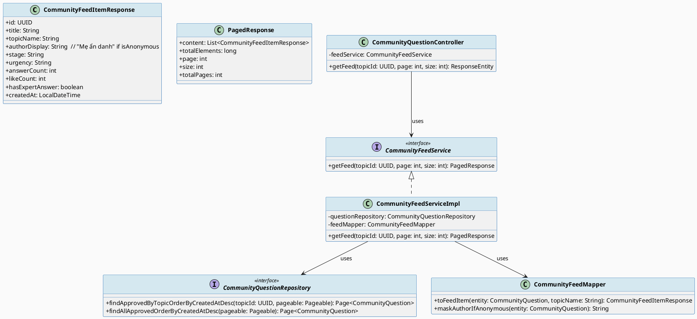
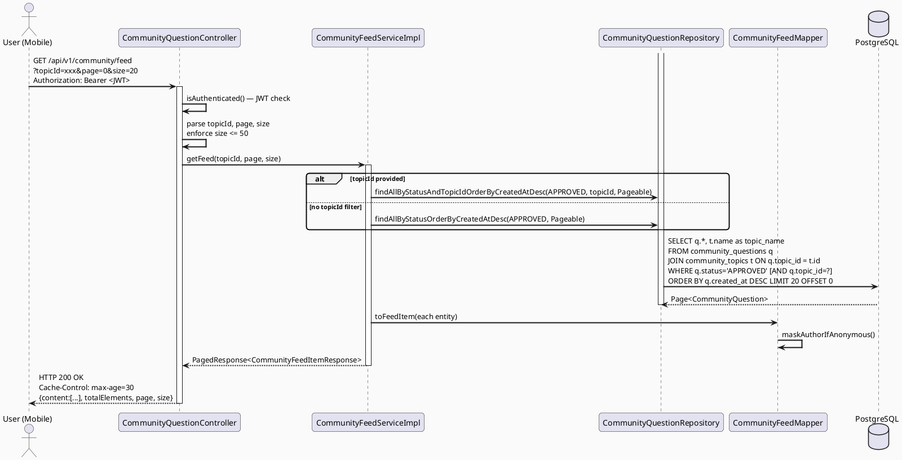
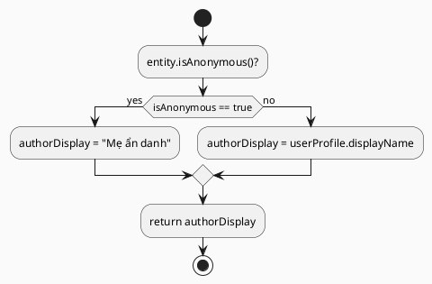

# ENGINEERING DOCUMENTATION STANDARD (EDS) v2.0
# Technical Design Specification — UC-198 View Community Feed

| Field              | Value                                   |
| ------------------ | --------------------------------------- |
| **Document ID**    | `CB-COMMUNITY-IMP-004`                  |
| **Version**        | `1.0`                                   |
| **Date**           | `2026-06-23`                            |
| **Status**         | `Approved`                              |
| **Document Owner** | `HuyND`                                 |
| **Author**         | `AI Agent — Winston (System Architect)` |
| **Reviewed by**    | `[Tech Lead]`                           |
| **DPO Sign-off**   | `[ ] Pending`                           |
| **Approved by**    | `[Principal Architect]`                 |
| **Last Review**    | `2026-06-23`                            |
| **Based on EDS**   | `v2.0`                                  |

---

## CHANGELOG

| Ngày       | Người thực hiện    | Nội dung thay đổi                                                                  |
| ---------- | ------------------ | ---------------------------------------------------------------------------------- |
| 2026-06-23 | AI Agent — Winston | Tạo tài liệu lần đầu cho UC-198 View Community Feed                               |
| 2026-06-24 | AI Agent — Amelia  | Implement: CommunityFeedService, CommunityFeedMapper, CommunityFeedController; 14 tests GREEN |

---

## MỤC LỤC

1. [Tổng quan Module](#1-tổng-quan-module)
2. [Ma trận Truy vết](#2-ma-trận-truy-vết)
3. [Architecture Decision Records](#3-architecture-decision-records)
4. [Non-Functional Requirements & SLA](#4-non-functional-requirements--sla)
5. [Static Modeling](#5-static-modeling-mô-hình-tĩnh)
6. [Dynamic Modeling](#6-dynamic-modeling-mô-hình-động)
7. [Domain Event Catalog](#7-domain-event-catalog)
8. [Interface Specification](#8-interface-specification-đặc-tả-giao-diện)
9. [API Specification](#9-api-specification)
10. [Bảng mã lỗi](#10-bảng-mã-lỗi-error-codes)
11. [Quy trình Triển khai](#11-quy-trình-triển-khai-step-by-step)
12. [Rollback & Incident Runbook](#12-rollback--incident-runbook)
13. [Kịch bản Kiểm thử Chi tiết](#13-kịch-bản-kiểm-thử-chi-tiết)
14. [Phương pháp Xác minh](#14-phương-pháp-xác-minh)
15. [Mẫu thử thực tế](#15-mẫu-thử-thực-tế-api-verification-samples)
16. [Bảng tổng hợp phân quyền](#16-bảng-tổng-hợp-phân-quyền-authorization-matrix)
17. [AI Prompt Constraints](#17-ai-prompt-constraints-case-20)

---

## 1. Tổng quan Module

| Field                     | Value                                                                   |
| ------------------------- | ----------------------------------------------------------------------- |
| **Module Name**           | `ViewCommunityFeed`                                                     |
| **Bounded Context**       | `community`                                                             |
| **UC ID**                 | `UC-198`                                                                |
| **SRS Reference**         | `3.3.13.1`                                                              |
| **Primary Actor**         | `User (any authenticated role)`                                         |
| **Platform**              | `Mobile App (Flutter)`                                                  |
| **Data Classification**   | `Internal`                                                              |
| **Compliance Scope**      | `BR-RBAC`                                                               |
| **Upstream Dependencies** | `security (JWT), community.CommunityQuestion, community.CommunityTopic` |
| **Downstream Consumers**  | `Mobile App home feed display`                                          |

**Mô tả:** Hiển thị danh sách câu hỏi cộng đồng đã được duyệt (APPROVED) theo chủ đề và thời gian giảm dần. Hỗ trợ lọc theo topicId và phân trang. Trường `authorDisplay` ẩn tên tác giả khi `isAnonymous=true`.

---

## 2. Ma trận Truy vết (Traceability Matrix)

| Requirement ID | Loại          | Mô tả yêu cầu                                   | Thành phần Code                         | Compliance Target | ADR liên quan |
| -------------- | ------------- | ----------------------------------------------- | --------------------------------------- | ----------------- | ------------- |
| UC-198         | Use Case      | Hiển thị community feed                         | `CommunityQuestionController.getFeed()` | BR-RBAC           | ADR-COM-009   |
| BR-RBAC        | Business Rule | Authenticated users only                        | `@PreAuthorize("isAuthenticated()")`    | RBAC              | ADR-COM-009   |
| BR-COM-012     | Business Rule | Chỉ hiển thị APPROVED questions                 | `WHERE status = 'APPROVED'`             | Moderation        | ADR-COM-009   |
| BR-COM-013     | Business Rule | Sắp xếp theo createdAt DESC                     | `ORDER BY created_at DESC`              | UX                | ADR-COM-009   |
| BR-PRIVACY     | Business Rule | isAnonymous=true → authorDisplay = "Mẹ ẩn danh" | `CommunityFeedMapper.maskAuthor()`      | Privacy           | ADR-COM-002   |
| BR-COM-014     | Business Rule | Phân trang mặc định page=0, size=20, max=50     | `Pageable`                              | Performance       | ADR-COM-010   |

---

## 3. Architecture Decision Records (ADR)

### ADR-COM-009 — Feed chỉ hiển thị APPROVED questions, sắp xếp theo thời gian mới nhất

| Field      | Value        |
| ---------- | ------------ |
| **Status** | `Accepted`   |
| **Date**   | `2026-06-23` |

#### Quyết định (Decision)
Feed query: `WHERE status = 'APPROVED' ORDER BY created_at DESC`. Không áp dụng thuật toán ranking phức tạp ở MVP — chronological feed đơn giản và dễ kiểm thử.

---

### ADR-COM-010 — Feed pagination max size=50 (stricter than search)

| Field      | Value        |
| ---------- | ------------ |
| **Status** | `Accepted`   |
| **Date**   | `2026-06-23` |

#### Quyết định (Decision)
Feed size mặc định 20, max 50 (stricter than search's 100) vì feed bao gồm body preview và nhiều metadata hơn — larger payload per item.

---

## 4. Non-Functional Requirements & SLA

### 4.1. Performance & Availability

| Category   | Requirement                  | Target SLA         | Measurement Method          |
| ---------- | ---------------------------- | ------------------ | --------------------------- |
| Latency    | Feed API response (p99)      | `< 300ms`          | k6 load test                |
| Cache      | Response cacheable (30s TTL) | Read-through cache | Redis or HTTP cache headers |
| Throughput | Concurrent feed requests     | `1000 req/s`       | Load test                   |

### 4.2. Caching Strategy

Feed is read-heavy (frequent, same result for all users). Cache with `Cache-Control: max-age=30` HTTP header at MVP. Future: Redis cache per topicId + page.

---

## 5. Static Modeling (Mô hình Tĩnh)

### 5.1. Class Diagram (PlantUML)



### 5.2. Repository Query

```java
package com.carebridge.backend.community.repository;

import com.carebridge.backend.community.entity.CommunityQuestion;
import org.springframework.data.domain.Page;
import org.springframework.data.domain.Pageable;
import org.springframework.data.jpa.repository.JpaRepository;
import org.springframework.data.jpa.repository.Query;
import org.springframework.data.repository.query.Param;
import java.util.UUID;

public interface CommunityQuestionRepository extends JpaRepository<CommunityQuestion, UUID> {

    // Feed — all topics
    Page<CommunityQuestion> findAllByStatusOrderByCreatedAtDesc(
        QuestionStatus status, Pageable pageable);

    // Feed — filtered by topic
    Page<CommunityQuestion> findAllByStatusAndTopicIdOrderByCreatedAtDesc(
        QuestionStatus status, UUID topicId, Pageable pageable);
}
```

---

## 6. Dynamic Modeling (Mô hình Động)

### 6.1. Sequence Diagram — Happy Path (PlantUML)



### 6.2. Author Masking Logic



---

## 7. Domain Event Catalog

Feed là read-only — không phát ra domain events.

---

## 8. Interface Specification (Đặc tả Giao diện)

### 8.1. Service Interface

```java
package com.carebridge.backend.community.service;

import com.carebridge.backend.community.dto.response.CommunityFeedItemResponse;
import com.carebridge.backend.common.response.PagedResponse;
import java.util.UUID;

/**
 * @version 1.0
 */
public interface CommunityFeedService {

    /**
     * Returns paginated community feed of APPROVED questions ordered by newest first.
     * @param topicId optional topic filter (null = all topics)
     * @param page    page number (0-based)
     * @param size    page size (1–50)
     * @return PagedResponse with CommunityFeedItemResponse items
     */
    PagedResponse<CommunityFeedItemResponse> getFeed(UUID topicId, int page, int size);
}
```

### 8.2. Response DTO

```java
package com.carebridge.backend.community.dto.response;

import java.time.LocalDateTime;
import java.util.UUID;

public record CommunityFeedItemResponse(
    UUID id,
    String title,
    String topicName,
    String authorDisplay,    // "Mẹ ẩn danh" if isAnonymous, else displayName
    String stage,
    String urgency,
    int answerCount,
    int likeCount,
    boolean hasExpertAnswer,
    LocalDateTime createdAt
) {}
```

---

## 9. API Specification

### 9.1. Endpoints Table

| Method | Path                     | Auth Level | Required Roles    | Rate Limit | Idempotent? |
| ------ | ------------------------ | ---------- | ----------------- | ---------- | ----------- |
| `GET`  | `/api/v1/community/feed` | JWT Bearer | Any authenticated | 500/min    | Yes         |

### 9.2. Request / Response Schemas

**Query Parameters:**
- `topicId` (optional): UUID — filter by topic
- `page` (optional, default=0): integer >= 0
- `size` (optional, default=20, max=50): integer 1–50

**Response — 200 OK:**
```json
{
  "content": [
    {
      "id": "550e8400-e29b-41d4-a716-446655440000",
      "title": "Thai nhi 28 tuần đạp nhiều ban đêm có bình thường không?",
      "topicName": "Thai kỳ",
      "authorDisplay": "Nguyễn Lan Anh",
      "stage": "PREGNANCY",
      "urgency": "NORMAL",
      "answerCount": 5,
      "likeCount": 12,
      "hasExpertAnswer": true,
      "createdAt": "2026-06-23T10:00:00.000Z"
    },
    {
      "id": "660e8400-e29b-41d4-a716-446655440001",
      "title": "Bé 3 tháng hay quấy đêm phải làm sao?",
      "topicName": "Chăm sóc bé",
      "authorDisplay": "Mẹ ẩn danh",
      "stage": "BABY_CARE",
      "urgency": "URGENT",
      "answerCount": 8,
      "likeCount": 20,
      "hasExpertAnswer": false,
      "createdAt": "2026-06-22T14:00:00.000Z"
    }
  ],
  "totalElements": 85,
  "page": 0,
  "size": 20,
  "totalPages": 5
}
```

---

## 10. Bảng mã lỗi (Error Codes)

| Code      | HTTP Status | Message (EN)            | Message (VI)         | Trigger Condition                    |
| --------- | ----------- | ----------------------- | -------------------- | ------------------------------------ |
| `COM-001` | 400         | Validation failed       | Dữ liệu không hợp lệ | size > 50 hoặc page < 0              |
| `COM-004` | 401         | Authentication required | Yêu cầu đăng nhập    | JWT missing/invalid                  |
| `COM-003` | 404         | Topic not found         | Chủ đề không tồn tại | topicId provided nhưng không tồn tại |
| `COM-005` | 500         | Internal server error   | Lỗi hệ thống         | DB error                             |

---

## 11. Quy trình Triển khai (Step-by-Step)

### 11.1. Prerequisites

- [ ] ADR-COM-009, ADR-COM-010 đã Accepted
- [ ] community_questions table (UC-54) đã tồn tại
- [ ] community_topics table (UC-109) đã tồn tại

### 11.2. Implementation Steps

#### Chặng 1 — Backend Implementation (no new migration needed)

```
1. dto/response/CommunityFeedItemResponse.java (record)
2. repository/CommunityQuestionRepository.java — add findAllByStatus* methods
3. service/CommunityFeedService.java (interface)
4. service/CommunityFeedServiceImpl.java
5. mapper/CommunityFeedMapper.java (with maskAuthorIfAnonymous)
6. controller/CommunityQuestionController.java — add getFeed() GET /feed endpoint
```

#### Chặng 2 — Verification

```bash
curl -X GET "https://[host]/api/v1/community/feed?page=0&size=20" \
  -H "Authorization: Bearer [USER_JWT]"
# Expected: 200 OK, content sorted by createdAt DESC, anonymous authors masked

curl -X GET "https://[host]/api/v1/community/feed?topicId=[TOPIC_ID]&page=0&size=10" \
  -H "Authorization: Bearer [USER_JWT]"
# Expected: 200 OK, only questions in that topic
```

---

## 12. Rollback & Incident Runbook

### 12.1. Điều kiện kích hoạt Rollback

| Điều kiện                     | Ngưỡng   | Người quyết định |
| ----------------------------- | -------- | ---------------- |
| Feed latency p99 > 1s         | 5 phút   | On-call Engineer |
| Anonymous author name leaking | Any case | Tech Lead + DPO  |

### 12.2. Rollback Procedure

```bash
kubectl rollout undo deployment/carebridge-api
# No DB migration for feed endpoint — rollback is service-only
```

---

## 13. Kịch bản Kiểm thử Chi tiết

### 13.1. Unit Tests

#### TC-UNIT-001 — Feed trả về APPROVED questions theo thời gian mới nhất

```gherkin
Feature: UC-198 View Community Feed
  Background:
    Given test data classification: SYNTHETIC

  Scenario: Fetch feed without topic filter — newest first
    Given repository mock trả về [Q3 (newest), Q2, Q1 (oldest)], all APPROVED
    When getFeed(topicId=null, page=0, size=20) được gọi
    Then response.content có đúng 3 items
    And content[0].createdAt > content[1].createdAt > content[2].createdAt

  Scenario: Anonymous question → authorDisplay = "Mẹ ẩn danh"
    Given repository trả về question với isAnonymous=true, authorName="Nguyễn Thị A"
    When getFeed() được gọi
    Then response.content[0].authorDisplay = "Mẹ ẩn danh"
    And response.content[0] KHÔNG chứa tên thật "Nguyễn Thị A"

  Scenario: Non-anonymous question → authorDisplay = real name
    Given repository trả về question với isAnonymous=false, displayName="Trần Thị B"
    When getFeed() được gọi
    Then response.content[0].authorDisplay = "Trần Thị B"
```

#### TC-UNIT-002 — topicId filter gọi đúng repository method

```gherkin
  Scenario: topicId provided — gọi filtered repository method
    Given topicId = "topic-001"
    When getFeed(topicId="topic-001", page=0, size=20)
    Then questionRepository.findAllByStatusAndTopicIdOrderByCreatedAtDesc() được gọi với topicId
    And questionRepository.findAllByStatusOrderByCreatedAtDesc() KHÔNG được gọi

  Scenario: topicId null — gọi all-topic repository method
    When getFeed(topicId=null, page=0, size=20)
    Then questionRepository.findAllByStatusOrderByCreatedAtDesc() được gọi
    And topicId-filtered method KHÔNG được gọi
```

### 13.2. Integration Tests

#### TC-INT-001 — Feed full stack

```gherkin
  Scenario: GET /api/v1/community/feed trả về APPROVED questions mới nhất
    Given 3 APPROVED questions, 1 PENDING question
    And câu hỏi APPROVED được tạo lần lượt Q1 → Q2 → Q3
    When GET /api/v1/community/feed
    Then response.content.length() = 3
    And content[0] = Q3 (newest)
    And PENDING question KHÔNG có trong response

  Scenario: isAnonymous masking trong real response
    Given 1 question có isAnonymous=true, authorId="user-001" (displayName="Trần Thị A")
    When GET /api/v1/community/feed
    Then response.content[?(@.id == q.id)].authorDisplay = "Mẹ ẩn danh"
    And response không chứa "Trần Thị A"
```

### 13.3. Security Tests

#### TC-SEC-001 — Unauthenticated → 401

```gherkin
  Scenario: Không có JWT
    When GET /api/v1/community/feed
    Then response status = 401
```

#### TC-SEC-002 — Author PII không lộ khi isAnonymous=true

```gherkin
  Scenario: Anonymous author PII không xuất hiện trong response body
    Given question.isAnonymous = true, authorId = "user-pii-001"
    When GET /api/v1/community/feed
    Then response body KHÔNG chứa authorId "user-pii-001"
    And response body KHÔNG chứa tên thật của user-pii-001
    And authorDisplay = "Mẹ ẩn danh"
```

---

## 14. Phương pháp Xác minh

### 14.1. Database Inspection

```sql
-- Verify feed chỉ lấy APPROVED
SELECT COUNT(*) FROM community_questions WHERE status != 'APPROVED';
-- Compare với totalElements từ API — should be less

-- Verify ordering
SELECT id, created_at FROM community_questions WHERE status = 'APPROVED'
ORDER BY created_at DESC LIMIT 5;
-- First row phải match content[0] trong API response
```

### 14.2. Privacy Verification

```bash
# Check anonymous question trong response — KHÔNG có tên thật
curl -X GET "https://[host]/api/v1/community/feed" \
  -H "Authorization: Bearer [USER_JWT]" | jq '.content[] | select(.authorDisplay == "Mẹ ẩn danh")'
# Verify không có authorId field trong result
```

---

## 15. Mẫu thử thực tế (API Verification Samples)

### 15.1. Happy Path

```bash
# Feed tất cả topics
curl -X GET "https://[host]/api/v1/community/feed?page=0&size=20" \
  -H "Authorization: Bearer [USER_JWT]"

# Feed theo topic
curl -X GET "https://[host]/api/v1/community/feed?topicId=3fa85f64-5717-4562-b3fc-2c963f66afa6&page=0&size=10" \
  -H "Authorization: Bearer [USER_JWT]"
```

### 15.2. Error Paths

```bash
# size > 50 → 400
curl -X GET "https://[host]/api/v1/community/feed?size=100" \
  -H "Authorization: Bearer [USER_JWT]"

# Không có JWT → 401
curl -X GET "https://[host]/api/v1/community/feed"
```

---

## 16. Bảng tổng hợp phân quyền (Authorization Matrix)

| Endpoint                     | `UNAUTHENTICATED` | `MOTHER` | `EXPERT` | `MODERATOR` | `ADMIN` |
| ---------------------------- | ----------------- | -------- | -------- | ----------- | ------- |
| `GET /api/v1/community/feed` | ❌ (401)           | ✅        | ✅        | ✅           | ✅       |

---

## 17. AI Prompt Constraints (CASE 2.0)

### 17.1 Constraint Summary Table

| #   | Constraint                                                                                                       | Source                    | Last Verified |
| --- | ---------------------------------------------------------------------------------------------------------------- | ------------------------- | ------------- |
| C1  | Feed query PHẢI filter `status = APPROVED` — KHÔNG hiển thị PENDING/HIDDEN/LOCKED                                | `ADR-COM-009`             | `2026-06-23`  |
| C2  | Feed PHẢI sắp xếp `ORDER BY created_at DESC` — newest first                                                      | `ADR-COM-009, BR-COM-013` | `2026-06-23`  |
| C3  | `CommunityFeedMapper.maskAuthorIfAnonymous()` PHẢI trả `"Mẹ ẩn danh"` khi `isAnonymous=true` — không lộ tên thật | `ADR-COM-002, BR-PRIVACY` | `2026-06-23`  |
| C4  | `size` max = 50 cho feed endpoint — cap hoặc reject > 50                                                         | `ADR-COM-010`             | `2026-06-23`  |
| C5  | `@PreAuthorize("isAuthenticated()")` — bất kỳ authenticated role                                                 | `BR-RBAC`                 | `2026-06-23`  |

### 17.2 Constraint Injection Block

```
[CONSTRAINT BLOCK — Module: ViewCommunityFeed]
1. Feed query PHẢI include WHERE status = 'APPROVED' + ORDER BY created_at DESC.
2. CommunityFeedMapper.maskAuthorIfAnonymous() PHẢI check isAnonymous field. Nếu true → return "Mẹ ẩn danh". Không return null.
3. Feed max size = 50 (không phải 100 như search). Enforce tại controller/service.
4. Empty feed → 200 OK với content:[]. Không 404.
5. @PreAuthorize("isAuthenticated()") tại controller getFeed().
```

### 17.3 Anti-Pattern Detection

| AP-ID     | Anti-Pattern          | Dấu hiệu                                         | Hành động   |
| --------- | --------------------- | ------------------------------------------------ | ----------- |
| AP-AI-001 | Unconstrained Gen     | Feed query không ORDER BY created_at DESC        | Reject — C2 |
| AP-AI-003 | Implicit Decision     | Mapper không mask anonymous author               | Reject — C3 |
| AP-AI-005 | Hallucinated Contract | Code gọi RecommendationService không có trong §8 | Reject      |

### 17.4 Anti-Pattern Detection

| AP-ID | Anti-Pattern | Dấu hiệu | Hành động |
|-------|-------------|-----------|----------|
| AP-AI-001 | Unconstrained Gen | Code không match constraint C1-C5 | Reject — inject lại constraints |
| AP-AI-003 | Implicit Decision | Code assume architecture không có ADR | Reject — viết ADR trước |
| AP-AI-005 | Hallucinated Contract | Code import không có trong §8 | Reject — verify contract |

---

## PHỤ LỤC

### A. Glossary (Thuật ngữ)

| Thuật ngữ | Định nghĩa |
|-----------|------------|
| Community Feed | Danh sách câu hỏi cộng đồng đã duyệt, sắp xếp theo thời gian mới nhất |
| authorDisplay | Tên hiển thị tác giả — masked thành "Me an danh" khi isAnonymous=true |
| Cursor Pagination | Phân trang dựa trên cursor (createdAt) thay vì offset — tối ưu performance |

### B. Tài liệu tham chiếu

| Document | Path |
|----------|------|
| EDS v2.0 Template | `08_References/Template/PHASE-3_TDS.md` |

---

*EDS v2.1 — Tích hợp CASE 2.0 AI Prompt Constraints (§17).*
