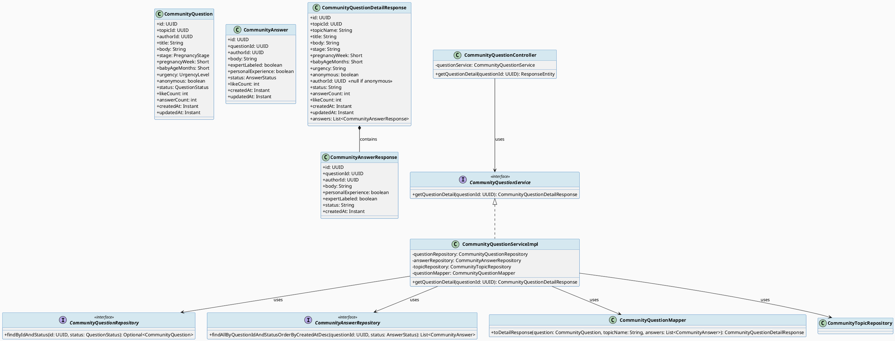
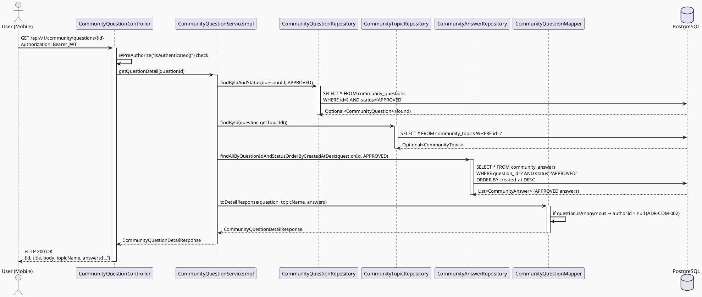
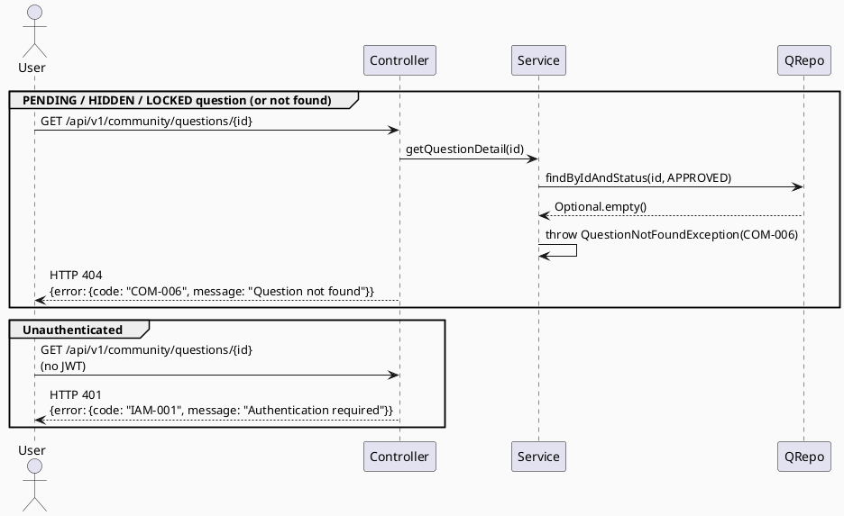

# ENGINEERING DOCUMENTATION STANDARD (EDS) v2.0
# Technical Design Specification — UC-199 View Community Question Detail

| Field              | Value                             |
| ------------------ | --------------------------------- |
| **Document ID**    | `CB-COMMUNITY-IMP-010`            |
| **Version**        | `1.0`                             |
| **Date**           | `2026-06-29`                      |
| **Status**         | `Approved`                        |
| **Document Owner** | `HuyND`                           |
| **Author**         | `AI Agent`                        |
| **Reviewed by**    | `[Tech Lead]`                     |
| **DPO Sign-off**   | `[ ] Pending`                     |
| **Approved by**    | `[Principal Architect]`           |
| **Last Review**    | `2026-06-29`                      |
| **Based on EDS**   | `v2.0`                            |

---

## CHANGELOG

| Ngày       | Người thực hiện | Nội dung thay đổi                                                          |
| ---------- | --------------- | -------------------------------------------------------------------------- |
| 2026-06-29 | AI Agent        | Tạo tài liệu lần đầu cho UC-199 View Community Question Detail             |
| 2026-06-29 | AI Agent — Amelia (Dev Agent) | Implemented CommunityQuestionDetailResponse DTO, getQuestionDetail service, toDetailResponse mapper, GET /api/v1/community/questions/{id} endpoint; 7 tests passing | Implemented |
| 2026-07-03 | AI Agent — Claude (Audit Pass) | Two fixes: (1) `getQuestionDetail()` gained a `currentUserId` param and now scopes PENDING-question visibility to the author only — previously ANY authenticated user could open ANY other user's PENDING question by ID directly, bypassing the feed's per-author visibility rule (see UC-198 changelog); APPROVED questions unaffected. (2) response now carries the viewer's `isBookmarked` and per-answer `liked`/`likeCount` (see UC-58/UC-59 changelogs) instead of always defaulting false/zero. |

---

## MỤC LỤC

1. [Tổng quan Module](#1-tổng-quan-module)
2. [Ma trận Truy vết](#2-ma-trận-truy-vết)
3. [Architecture Decision Records](#3-architecture-decision-records)
4. [Non-Functional Requirements & SLA](#4-non-functional-requirements--sla)
5. [Static Modeling](#5-static-modeling-mô-hình-tĩnh)
6. [Dynamic Modeling](#6-dynamic-modeling-mô-hình-động)
7. [Domain Event Catalog](#7-domain-event-catalog)
8. [Interface Specification](#8-interface-specification-đặc-tả-giao-diện)
9. [API Specification](#9-api-specification)
10. [Bảng mã lỗi](#10-bảng-mã-lỗi-error-codes)
11. [Quy trình Triển khai](#11-quy-trình-triển-khai-step-by-step)
12. [Rollback & Incident Runbook](#12-rollback--incident-runbook)
13. [Kịch bản Kiểm thử Chi tiết](#13-kịch-bản-kiểm-thử-chi-tiết)
14. [Phương pháp Xác minh](#14-phương-pháp-xác-minh)
15. [Mẫu thử thực tế](#15-mẫu-thử-thực-tế-api-verification-samples)
16. [Bảng tổng hợp phân quyền](#16-bảng-tổng-hợp-phân-quyền-authorization-matrix)
17. [AI Prompt Constraints](#17-ai-prompt-constraints-case-20)

---

## 1. Tổng quan Module

| Field                     | Value                                                                                             |
| ------------------------- | ------------------------------------------------------------------------------------------------- |
| **Module Name**           | `ViewCommunityQuestionDetail`                                                                     |
| **Bounded Context**       | `community`                                                                                       |
| **UC ID**                 | `UC-199`                                                                                          |
| **SRS Reference**         | `3.3.13.2`                                                                                        |
| **Primary Actor**         | `Any authenticated user`                                                                          |
| **Platform**              | `Mobile App (Flutter) + Web`                                                                      |
| **Data Classification**   | `Internal` (community content); `PII` — author identity subject to anonymity masking             |
| **Compliance Scope**      | `ADR-COM-002 (anonymous masking), BR-RBAC`                                                        |
| **Upstream Dependencies** | `community.CommunityQuestion, community.CommunityAnswer, community.CommunityTopic, security (JWT)` |
| **Downstream Consumers**  | `Mobile App question detail screen, Web community page`                                           |

**Mô tả:** Cho phép người dùng đã đăng nhập xem chi tiết một câu hỏi cộng đồng cùng với danh sách câu trả lời đã được phê duyệt. Endpoint mới: `GET /api/v1/community/questions/{id}`. Chỉ trả về câu hỏi có `status=APPROVED`. Áp dụng anonymous masking (ADR-COM-002): khi `question.isAnonymous=true` thì `authorId=null` trong response.

---

## 2. Ma trận Truy vết (Traceability Matrix)

| Requirement ID | Loại          | Mô tả yêu cầu                                         | Thành phần Code                                              | Compliance Target | ADR liên quan |
| -------------- | ------------- | ----------------------------------------------------- | ------------------------------------------------------------ | ----------------- | ------------- |
| UC-199         | Use Case      | View detail of a community question with answers      | `CommunityQuestionController.getQuestionDetail()`            | BR-RBAC           | ADR-COM-011   |
| BR-COM-017     | Business Rule | Only APPROVED questions visible to authenticated users | `questionRepository.findByIdAndStatus(id, APPROVED)`        | Moderation        | ADR-COM-011   |
| ADR-COM-002    | ADR           | Anonymous masking: authorId=null when isAnonymous=true | `CommunityQuestionMapper.toDetailResponse()`                | Privacy           | ADR-COM-002   |
| BR-COM-018     | Business Rule | Answers included must have status=APPROVED only       | `answerRepository.findAllByQuestionIdAndStatusOrderByCreatedAtDesc()` | Moderation | ADR-COM-012 |
| BR-COM-019     | Business Rule | topicName batch-fetched to avoid N+1                  | `topicRepository.findById()` called once per question       | Performance       | ADR-COM-013   |
| BR-RBAC        | Business Rule | isAuthenticated() required                            | `@PreAuthorize("isAuthenticated()")`                        | RBAC              | —             |
| COM-006        | Error Code    | Question not found or not APPROVED → 404              | `QuestionNotFoundException`                                 | —                 | ADR-COM-011   |

---

## 3. Architecture Decision Records (ADR)

### ADR-COM-011 — Only APPROVED questions visible via detail endpoint

| Field      | Value        |
| ---------- | ------------ |
| **Status** | `Accepted`   |
| **Date**   | `2026-06-29` |

#### Bối cảnh (Context)
The detail endpoint must not leak PENDING, HIDDEN, or LOCKED questions to regular users. Consistent with existing UC-162 behavior where only APPROVED questions appear in search.

#### Quyết định (Decision)
`questionRepository.findByIdAndStatus(id, QuestionStatus.APPROVED)` is used. If the question is not found with that status, throw `QuestionNotFoundException` with HTTP 404. This prevents status-probing attacks (leaking whether a question exists in PENDING state).

#### Hệ quả (Consequences)

**Tích cực:**
- Consistent with search endpoint behavior (both show only APPROVED).
- No status enumeration via 403 vs 404 responses.

**Tiêu cực / Trade-offs:**
- HIDDEN questions return 404 (not 403). This is intentional for privacy.

---

### ADR-COM-002 — Anonymous masking: authorId=null in response when isAnonymous=true

| Field      | Value                           |
| ---------- | ------------------------------- |
| **Status** | `Accepted` *(pre-existing ADR)* |
| **Date**   | `2026-06-29`                    |

#### Quyết định (Decision)
When `CommunityQuestion.isAnonymous = true`, the response DTO must set `authorId = null`. This masking happens in the mapper layer, not the service or controller. The raw entity always stores `authorId`; only the response omits it.

---

### ADR-COM-012 — Only APPROVED answers are included in question detail

| Field      | Value        |
| ---------- | ------------ |
| **Status** | `Accepted`   |
| **Date**   | `2026-06-29` |

#### Quyết định (Decision)
PENDING answers are not shown to regular users. The answer repository method filters `status = APPROVED` explicitly. This aligns with the moderation workflow: answers are visible only after moderator approval.

---

### ADR-COM-013 — topicName fetched via single repository call (no N+1)

| Field      | Value        |
| ---------- | ------------ |
| **Status** | `Accepted`   |
| **Date**   | `2026-06-29` |

#### Quyết định (Decision)
`topicRepository.findById(question.getTopicId())` is called once. Since this endpoint returns a single question, one additional topic lookup is acceptable. A JOIN query alternative was considered but rejected to preserve layer separation (question service → topic repository is a cross-domain dependency already present in `CommunityFeedServiceImpl`).

---

## 4. Non-Functional Requirements & SLA

### 4.1. Performance & Availability

| Category   | Requirement                  | Target SLA  | Measurement Method |
| ---------- | ---------------------------- | ----------- | ------------------ |
| Latency    | Question detail (p99)        | `< 300ms`   | k6 load test       |
| Availability | Uptime                     | `99.9%`     | Monitor            |
| Throughput | Concurrent detail requests   | `300 req/s` | Load test          |

### 4.2. Privacy

`authorId` masking is enforced in mapper (not configurable at runtime). DPO review required if masking logic changes.

---

## 5. Static Modeling (Mô hình Tĩnh)

### 5.1. Class Diagram (PlantUML)



### 5.2. Data Structure

**No new migration required.** UC-199 adds:
- One new DTO class: `CommunityQuestionDetailResponse`
- One new repository method on `CommunityAnswerRepository`
- One new mapper method on `CommunityQuestionMapper`
- One new service method on `CommunityQuestionService` + `CommunityQuestionServiceImpl`
- One new controller endpoint

```java
// New method added to CommunityAnswerRepository:
List<CommunityAnswer> findAllByQuestionIdAndStatusOrderByCreatedAtDesc(
    UUID questionId, AnswerStatus status);
```

---

## 6. Dynamic Modeling (Mô hình Động)

### 6.1. Sequence Diagram — Happy Path (PlantUML)



### 6.2. Sequence Diagram — Error Paths (PlantUML)



### 6.3. Anonymous Masking State

| `question.isAnonymous` | `authorId` in response |
| ---------------------- | ---------------------- |
| `false`                | UUID (actual authorId) |
| `true`                 | `null`                 |

---

## 7. Domain Event Catalog

UC-199 is a read-only operation — no domain events are published or consumed.

---

## 8. Interface Specification (Đặc tả Giao diện)

### 8.1. New DTO: CommunityQuestionDetailResponse

```java
package com.carebridge.backend.community.dto.response;

import java.time.Instant;
import java.util.List;
import java.util.UUID;
import lombok.Data;

@Data
public class CommunityQuestionDetailResponse {
    private UUID id;
    private UUID topicId;
    private String topicName;         // fetched from CommunityTopic
    private String title;
    private String body;
    private String stage;             // PregnancyStage.name()
    private Short pregnancyWeek;
    private Short babyAgeMonths;
    private String urgency;           // UrgencyLevel.name()
    private boolean anonymous;
    private UUID authorId;            // null if anonymous (ADR-COM-002)
    private String status;            // QuestionStatus.name()
    private int answerCount;          // from entity (DB-maintained counter)
    private int likeCount;
    private Instant createdAt;
    private Instant updatedAt;
    private List<CommunityAnswerResponse> answers; // APPROVED answers only
}
```

### 8.2. Service Interface (updated)

```java
package com.carebridge.backend.community.service;

import com.carebridge.backend.community.dto.response.CommunityQuestionDetailResponse;
import java.util.UUID;

/**
 * @version 1.1
 * @breaking-change Added getQuestionDetail() method
 */
public interface CommunityQuestionService {

    /**
     * Returns full details of an APPROVED community question, including APPROVED answers.
     * @param questionId UUID of the question
     * @return CommunityQuestionDetailResponse with answers list
     * @throws QuestionNotFoundException (COM-006, HTTP 404) when question not found or status != APPROVED
     */
    CommunityQuestionDetailResponse getQuestionDetail(UUID questionId);

    // ... existing methods (createQuestion, editQuestion, etc.)
}
```

### 8.3. Repository Interface (new method on CommunityAnswerRepository)

```java
package com.carebridge.backend.community.repository;

import com.carebridge.backend.community.entity.CommunityAnswer;
import com.carebridge.backend.community.entity.AnswerStatus;
import java.util.Collection;
import java.util.List;
import java.util.Set;
import java.util.UUID;

public interface CommunityAnswerRepository extends JpaRepository<CommunityAnswer, UUID> {

    // Existing:
    Set<UUID> findQuestionIdsWithExpertAnswer(Collection<UUID> questionIds);

    // New for UC-199:
    List<CommunityAnswer> findAllByQuestionIdAndStatusOrderByCreatedAtDesc(
        UUID questionId, AnswerStatus status);
}
```

### 8.4. Mapper Method (new on CommunityQuestionMapper)

```java
// In CommunityQuestionMapper:

/**
 * Maps a question entity + resolved topic name + resolved answers to the detail response.
 * Anonymous masking applied here (ADR-COM-002).
 */
public CommunityQuestionDetailResponse toDetailResponse(
        CommunityQuestion question,
        String topicName,
        List<CommunityAnswer> approvedAnswers) {

    CommunityQuestionDetailResponse resp = new CommunityQuestionDetailResponse();
    resp.setId(question.getId());
    resp.setTopicId(question.getTopicId());
    resp.setTopicName(topicName);
    resp.setTitle(question.getTitle());
    resp.setBody(question.getBody());
    resp.setStage(question.getStage() != null ? question.getStage().name() : null);
    resp.setPregnancyWeek(question.getPregnancyWeek());
    resp.setBabyAgeMonths(question.getBabyAgeMonths());
    resp.setUrgency(question.getUrgency() != null ? question.getUrgency().name() : null);
    resp.setAnonymous(question.isAnonymous());
    resp.setAuthorId(question.isAnonymous() ? null : question.getAuthorId()); // ADR-COM-002
    resp.setStatus(question.getStatus().name());
    resp.setAnswerCount(question.getAnswerCount());
    resp.setLikeCount(question.getLikeCount());
    resp.setCreatedAt(question.getCreatedAt());
    resp.setUpdatedAt(question.getUpdatedAt());
    resp.setAnswers(approvedAnswers.stream().map(this::toAnswerResponse).toList());
    return resp;
}
```

### 8.5. Controller Endpoint (new)

```java
// In CommunityQuestionController:

@GetMapping("/{id}")
@PreAuthorize("isAuthenticated()")
public ResponseEntity<ApiResponse<CommunityQuestionDetailResponse>> getQuestionDetail(
        @PathVariable UUID id) {
    return ResponseEntity.ok(
        ApiResponse.success(questionService.getQuestionDetail(id)));
}
```

---

## 9. API Specification

### 9.1. Endpoints Table

| Method | Path                                  | Auth Level | Required Roles    | Rate Limit | Idempotent? |
| ------ | ------------------------------------- | ---------- | ----------------- | ---------- | ----------- |
| `GET`  | `/api/v1/community/questions/{id}`    | JWT Bearer | Any authenticated | 300/min    | Yes         |

### 9.2. Request / Response Schemas

#### `GET /api/v1/community/questions/{id}`

**Path Parameter:** `id` — UUID of the community question

**Request Headers:**
```
Authorization: Bearer <JWT_TOKEN>
```

**Response — 200 OK (APPROVED question):**
```json
{
  "data": {
    "id": "550e8400-e29b-41d4-a716-446655440000",
    "topicId": "3fa85f64-5717-4562-b3fc-2c963f66afa6",
    "topicName": "Thai kỳ",
    "title": "Thai nhi 28 tuần đạp nhiều ban đêm có bình thường không?",
    "body": "Bé nhà mình đạp rất mạnh từ 10pm đến 2am...",
    "stage": "PREGNANCY",
    "pregnancyWeek": 28,
    "babyAgeMonths": null,
    "urgency": "NORMAL",
    "anonymous": false,
    "authorId": "a1b2c3d4-0000-0000-0000-000000000001",
    "status": "APPROVED",
    "answerCount": 3,
    "likeCount": 12,
    "createdAt": "2026-06-01T10:00:00.000Z",
    "updatedAt": "2026-06-01T10:00:00.000Z",
    "answers": [
      {
        "id": "b2c3d4e5-0000-0000-0000-000000000001",
        "questionId": "550e8400-e29b-41d4-a716-446655440000",
        "authorId": "c3d4e5f6-0000-0000-0000-000000000001",
        "body": "Bình thường bé ơi, bé đang tập luyện...",
        "personalExperience": true,
        "expertLabeled": false,
        "status": "APPROVED",
        "createdAt": "2026-06-01T11:00:00.000Z"
      }
    ]
  }
}
```

**Response — 200 OK (anonymous question):**
```json
{
  "data": {
    "id": "...",
    "anonymous": true,
    "authorId": null,
    "..."
  }
}
```

**Response — 404 Not Found (PENDING/HIDDEN/LOCKED or non-existent):**
```json
{
  "error": {
    "code": "COM-006",
    "message": "Question not found or not accessible"
  }
}
```

**Response — 401 (No JWT):**
```json
{
  "error": {
    "code": "IAM-001",
    "message": "Authentication required"
  }
}
```

---

## 10. Bảng mã lỗi (Error Codes)

| Code      | HTTP Status | Message (EN)                        | Trigger Condition                                                              |
| --------- | ----------- | ----------------------------------- | ------------------------------------------------------------------------------ |
| `COM-006` | 404         | Question not found or not accessible | `findByIdAndStatus(id, APPROVED)` returns empty (not found OR status != APPROVED) |
| `IAM-001` | 401         | Authentication required             | No JWT or expired JWT                                                          |

---

## 11. Quy trình Triển khai (Step-by-Step)

### 11.1. Prerequisites

- [ ] ADR-COM-011, ADR-COM-012, ADR-COM-013 đã Accepted
- [ ] `community_questions`, `community_answers`, `community_topics` tables tồn tại
- [ ] `CommunityQuestionController`, `CommunityQuestionService` đã tồn tại
- [ ] `CommunityQuestionMapper`, `CommunityAnswerRepository` đã tồn tại

### 11.2. Pre-Migration Checklist

> **No migration needed.** UC-199 introduces no schema changes.

### 11.3. Implementation Steps

#### Chặng 1 — Create `CommunityQuestionDetailResponse` DTO

Tạo file: `src/main/java/com/carebridge/backend/community/dto/response/CommunityQuestionDetailResponse.java` (xem §8.1).

#### Chặng 2 — Add new query method to `CommunityAnswerRepository`

Thêm `findAllByQuestionIdAndStatusOrderByCreatedAtDesc()` vào `CommunityAnswerRepository.java` (xem §8.3).

#### Chặng 3 — Update `CommunityQuestionService` interface

Thêm `getQuestionDetail(UUID questionId)` vào `CommunityQuestionService.java` (xem §8.2).

#### Chặng 4 — Implement `getQuestionDetail()` in `CommunityQuestionServiceImpl`

```java
@Override
public CommunityQuestionDetailResponse getQuestionDetail(UUID questionId) {
    // Step 1: Fetch APPROVED question (throws if not found or wrong status)
    CommunityQuestion question = questionRepository
        .findByIdAndStatus(questionId, QuestionStatus.APPROVED)
        .orElseThrow(() -> new QuestionNotFoundException(questionId));

    // Step 2: Fetch topic name (single lookup — ADR-COM-013)
    String topicName = topicRepository.findById(question.getTopicId())
        .map(CommunityTopic::getName)
        .orElse(null);

    // Step 3: Fetch APPROVED answers only (ADR-COM-012)
    List<CommunityAnswer> answers = answerRepository
        .findAllByQuestionIdAndStatusOrderByCreatedAtDesc(questionId, AnswerStatus.APPROVED);

    // Step 4: Map to response (mapper handles anonymous masking — ADR-COM-002)
    return questionMapper.toDetailResponse(question, topicName, answers);
}
```

#### Chặng 5 — Add `toDetailResponse()` to `CommunityQuestionMapper` (xem §8.4)

#### Chặng 6 — Add `GET /{id}` endpoint to `CommunityQuestionController` (xem §8.5)

#### Chặng 7 — Verification

```bash
# APPROVED question
curl -X GET "http://localhost:8080/api/v1/community/questions/{APPROVED_ID}" \
  -H "Authorization: Bearer [USER_JWT]"
# Expected: 200 OK, full detail with answers

# PENDING question
curl -X GET "http://localhost:8080/api/v1/community/questions/{PENDING_ID}" \
  -H "Authorization: Bearer [USER_JWT]"
# Expected: 404 COM-006

# No JWT
curl -X GET "http://localhost:8080/api/v1/community/questions/{APPROVED_ID}"
# Expected: 401 IAM-001
```

### 11.4. Deployment Checklist

- [ ] No migration to apply
- [ ] `./mvnw compile` với 0 errors
- [ ] `./mvnw test` — tất cả unit tests xanh
- [ ] Smoke test: GET /api/v1/community/questions/{known APPROVED id} → 200
- [ ] Verify anonymous masking: GET question where isAnonymous=true → authorId=null

---

## 12. Rollback & Incident Runbook

### 12.1. Rollback Procedure

No migration to roll back. Revert the modified/created files:

```bash
git checkout -- src/main/java/com/carebridge/backend/community/dto/response/CommunityQuestionDetailResponse.java
git checkout -- src/main/java/com/carebridge/backend/community/repository/CommunityAnswerRepository.java
git checkout -- src/main/java/com/carebridge/backend/community/service/CommunityQuestionService.java
git checkout -- src/main/java/com/carebridge/backend/community/service/CommunityQuestionServiceImpl.java
git checkout -- src/main/java/com/carebridge/backend/community/mapper/CommunityQuestionMapper.java
git checkout -- src/main/java/com/carebridge/backend/community/controller/CommunityQuestionController.java
kubectl rollout undo deployment/carebridge-api
```

---

## 13. Kịch bản Kiểm thử Chi tiết

### 13.1. Unit Tests

#### TC-UNIT-001 — Happy path: APPROVED question with 2 APPROVED answers

```gherkin
Feature: UC-199 View Community Question Detail
  Background:
    Given test data classification: SYNTHETIC

  Scenario: APPROVED question with 2 APPROVED answers returns 200 with all fields
    Given questionRepository returns an APPROVED question
    And topicRepository returns the matching topic
    And answerRepository returns 2 APPROVED answers
    When getQuestionDetail(questionId) is called
    Then response has title, body, topicName, stage, urgency populated
    And response.answers.size() = 2
    And all answers have status = "APPROVED"
```

#### TC-UNIT-002 — Anonymous question: authorId=null in response

```gherkin
  Scenario: Anonymous question masks authorId
    Given question has isAnonymous = true and authorId = [some UUID]
    When getQuestionDetail(questionId) is called
    Then response.authorId = null
    And response.anonymous = true
```

#### TC-UNIT-003 — PENDING answers excluded from response

```gherkin
  Scenario: PENDING answers are not included
    Given question is APPROVED
    And answerRepository mock returns 2 APPROVED answers (PENDING answers excluded by query filter)
    When getQuestionDetail(questionId) is called
    Then response.answers.size() = 2
    And the PENDING answer mock is not in the result
```

#### TC-UNIT-004 — PENDING question → 404 QuestionNotFoundException

```gherkin
  Scenario: PENDING question not accessible
    Given questionRepository.findByIdAndStatus(id, APPROVED) returns Optional.empty()
    When getQuestionDetail(questionId) is called
    Then QuestionNotFoundException is thrown
    And exception maps to HTTP 404 with error code COM-006
```

#### TC-UNIT-005 — HIDDEN question → 404

```gherkin
  Scenario: HIDDEN question not accessible
    Given a question with status=HIDDEN exists
    And questionRepository.findByIdAndStatus(id, APPROVED) returns Optional.empty()
    When getQuestionDetail(questionId) is called
    Then QuestionNotFoundException is thrown (HTTP 404 COM-006)
```

#### TC-UNIT-006 — LOCKED question → 404

```gherkin
  Scenario: LOCKED question not accessible
    Given a question with status=LOCKED exists
    And questionRepository.findByIdAndStatus(id, APPROVED) returns Optional.empty()
    When getQuestionDetail(questionId) is called
    Then QuestionNotFoundException is thrown (HTTP 404 COM-006)
```

#### TC-UNIT-007 — Question with no answers returns empty answers list

```gherkin
  Scenario: APPROVED question with no answers
    Given question is APPROVED
    And answerRepository returns empty list
    When getQuestionDetail(questionId) is called
    Then response.answers = []
    And response.answerCount matches the entity's answerCount field (DB-maintained)
```

#### TC-UNIT-008 — Unauthenticated request → 401

```gherkin
  Scenario: No JWT → 401
    Given no Authorization header in request
    When GET /api/v1/community/questions/{id} is called
    Then response status = 401
    And controller method is never invoked (@PreAuthorize blocks it)
```

### 13.2. Integration Tests

#### TC-INT-001 — Save APPROVED question + 2 APPROVED + 1 PENDING answer, verify only 2 returned

```gherkin
  Scenario: GET question detail with mixed answer statuses
    Given PostgreSQL Testcontainers running
    And 1 APPROVED question is saved
    And 2 APPROVED answers are saved for that question
    And 1 PENDING answer is saved for that question
    When GET /api/v1/community/questions/{id} with valid JWT
    Then response status = 200
    And response.answers.length = 2
    And PENDING answer is NOT in response.answers
    And response.topicName is populated
    And response.title matches the saved question title
```

### 13.3. Security Tests

#### TC-SEC-001 — Unauthenticated request → 401

```gherkin
  Scenario: No JWT → 401
    Given no Authorization header
    When GET /api/v1/community/questions/{id}
    Then response status = 401
```

#### TC-SEC-002 — Status probing: PENDING question returns 404 (not 403)

```gherkin
  Scenario: User cannot discover existence of PENDING question
    Given a PENDING question with known ID exists
    When authenticated user calls GET /api/v1/community/questions/{pendingId}
    Then response status = 404 (not 403 — no status disclosure)
```

---

## 14. Phương pháp Xác minh

### 14.1. Database Inspection

```sql
-- Verify only APPROVED question is returned
SELECT status FROM community_questions WHERE id = '[test-id]';
-- Expected: APPROVED

-- Verify PENDING answers not returned
SELECT COUNT(*) FROM community_answers
WHERE question_id = '[test-id]' AND status = 'PENDING';
-- Count > 0 proves they exist but should not appear in API response

-- Verify anonymous masking (check entity vs response)
SELECT author_id, is_anonymous FROM community_questions WHERE id = '[anon-id]';
-- author_id is set; API response must return authorId=null
```

---

## 15. Mẫu thử thực tế (API Verification Samples)

### 15.1. Happy Path — APPROVED question

```bash
curl -X GET "http://localhost:8080/api/v1/community/questions/550e8400-e29b-41d4-a716-446655440000" \
  -H "Authorization: Bearer [USER_JWT]"
# Expected: 200 OK, full detail including answers array
```

### 15.2. Error — PENDING / non-existent question

```bash
curl -X GET "http://localhost:8080/api/v1/community/questions/00000000-0000-0000-0000-000000000000" \
  -H "Authorization: Bearer [USER_JWT]"
# Expected: 404 { "error": { "code": "COM-006" } }
```

### 15.3. Error — Unauthenticated

```bash
curl -X GET "http://localhost:8080/api/v1/community/questions/550e8400-e29b-41d4-a716-446655440000"
# Expected: 401 IAM-001
```

---

## 16. Bảng tổng hợp phân quyền (Authorization Matrix)

| Endpoint                                    | `UNAUTHENTICATED` | `MOTHER` | `EXPERT` | `MODERATOR` | `SYSTEM_ADMIN` |
| ------------------------------------------- | ----------------- | -------- | -------- | ----------- | -------------- |
| `GET /api/v1/community/questions/{id}`      | ❌ (401)           | ✅        | ✅        | ✅           | ✅              |

**Notes:**
- All authenticated roles see the same response for APPROVED questions.
- PENDING/HIDDEN/LOCKED questions return 404 for all roles through this endpoint (moderation is handled via a separate moderation API, not this endpoint).

---

## 17. AI Prompt Constraints (CASE 2.0)

### 17.1 Constraint Summary Table

| #   | Constraint                                                                                                        | Source        | Last Verified |
| --- | ----------------------------------------------------------------------------------------------------------------- | ------------- | ------------- |
| C1  | Only APPROVED questions accessible — use `findByIdAndStatus(id, APPROVED)` — throw QuestionNotFoundException for any other status | `ADR-COM-011` | `2026-06-29` |
| C2  | Anonymous masking in MAPPER only: `authorId = question.isAnonymous() ? null : question.getAuthorId()`            | `ADR-COM-002` | `2026-06-29`  |
| C3  | Only APPROVED answers included: `findAllByQuestionIdAndStatusOrderByCreatedAtDesc(questionId, APPROVED)`          | `ADR-COM-012` | `2026-06-29`  |
| C4  | topicName fetched via single `topicRepository.findById()` — no JOIN in question query                             | `ADR-COM-013` | `2026-06-29`  |
| C5  | `@PreAuthorize("isAuthenticated()")` at controller method — any authenticated role                                | `BR-RBAC`     | `2026-06-29`  |
| C6  | `QuestionNotFoundException` returns HTTP 404 COM-006 — not 403 (status probing prevention)                       | `ADR-COM-011` | `2026-06-29`  |
| C7  | No audit log required for read operations                                                                         | Internal      | `2026-06-29`  |

### 17.2 Constraint Injection Block

```
[CONSTRAINT BLOCK — Module: ViewCommunityQuestionDetail]
Theo TDS CB-COMMUNITY-IMP-010:

1. (C1) MUST use questionRepository.findByIdAndStatus(id, QuestionStatus.APPROVED). If empty → throw QuestionNotFoundException (COM-006, 404). NEVER return 403.
2. (C2) Anonymous masking MUST happen in mapper: if (question.isAnonymous()) { resp.setAuthorId(null); } — do NOT check this in service or controller.
3. (C3) Answer query MUST filter AnswerStatus.APPROVED — use findAllByQuestionIdAndStatusOrderByCreatedAtDesc(questionId, AnswerStatus.APPROVED).
4. (C4) topicName: call topicRepository.findById(question.getTopicId()) once. Do NOT modify the question JPQL to JOIN topics — keep separation.
5. (C5) Controller method MUST have @PreAuthorize("isAuthenticated()").
6. (C6) Empty answers list → return response with answers:[], do NOT throw exception.
7. (C7) No audit log call needed for GET question detail.

[CONTEXT BLOCK]
- Bounded Context: community
- Data Classification: Internal + PII (authorId masking)
- Existing interfaces: §8 Service Interface + §8.2–8.5
- Error codes: §10 Error Codes Table
- Auth matrix: §16 Authorization Matrix
```

### 17.3 Constraint Quality Checklist

- [ ] Mỗi constraint traceable về ADR hoặc BR cụ thể
- [ ] Không có constraint generic
- [ ] Constraint block reference §8 Interface
- [ ] Constraint block reference §16 Auth Matrix

### 17.4 Anti-Pattern Detection

| AP-ID     | Anti-Pattern          | Dấu hiệu                                                 | Hành động           |
| --------- | --------------------- | -------------------------------------------------------- | ------------------- |
| AP-AI-001 | Unconstrained Gen     | Returns PENDING questions; no status filter              | Reject — enforce C1 |
| AP-AI-003 | Implicit Decision     | authorId masking done in service, not mapper             | Reject — enforce C2 |
| AP-AI-005 | Hallucinated Contract | Code imports `CommunityFeedService` for topic name lookup | Reject — use C4     |

---

## PHỤ LỤC

### A. Glossary

| Thuật ngữ        | Định nghĩa                                                                     |
| ---------------- | ------------------------------------------------------------------------------ |
| Anonymous masking | Hiding the authorId in the response when the question was posted anonymously   |
| expertLabeled    | Flag on CommunityAnswer indicating the answer was marked by an expert          |
| COM-006          | Error code for "Question not found or not accessible via this endpoint"        |
| Status probing   | Attack technique where different error codes (403 vs 404) reveal entity existence |

### B. Tài liệu tham chiếu

| Document                  | Path                                                |
| ------------------------- | --------------------------------------------------- |
| EDS v2.0 Template         | `08_References/Template/PHASE-3_TDS.md`             |
| UC-162 TDS (Search)       | `04_Implement/UC162_SearchCommunityQuestions/`      |
| UC-54 TDS (CreateQuestion)| `04_Implement/UC54_CreateCommunityQuestion/`        |
| UC-56 TDS (PostAnswer)    | `04_Implement/UC56_PostCommunityAnswer/`            |

---

*EDS v2.1 — CB-COMMUNITY-IMP-010 — UC-199 View Community Question Detail*
