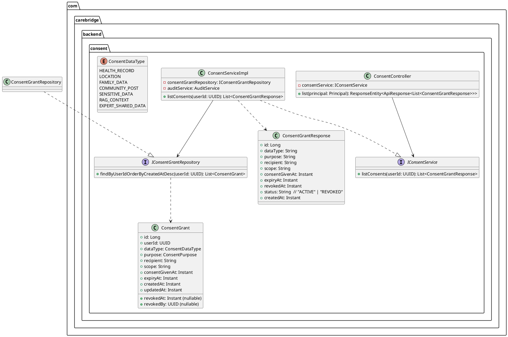
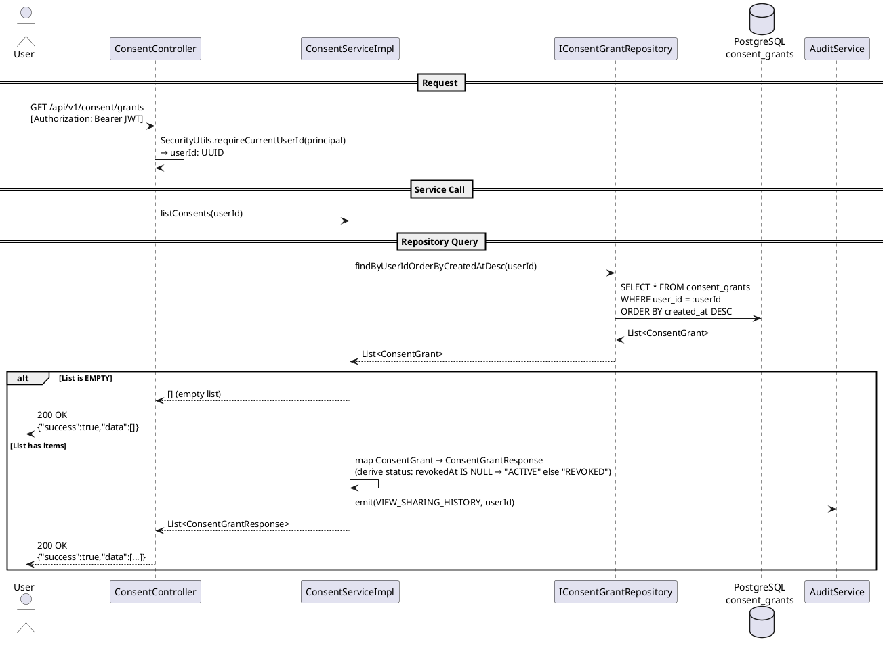

# Technical Design Specification (TDS)
## UC19 — View Sharing History

| Field | Value |
|---|---|
| **Document ID** | CB-CONSENT-IMP-019 |
| **Version** | 1.0 |
| **Date** | 2026-06-26 |
| **Status** | Implemented |
| **Document Owner** | PhuongNT |
| **Author** | AI Agent |
| **Based on EDS** | v2.0 |
| **SRS Reference** | SRS 3.1.1.19 |
| **Related UC** | UC19 — View Sharing History |

---

## 1. Tổng Quan (Overview)

### 1.1 Mục Tiêu (Objective)

UC19 cho phép người dùng đã xác thực xem toàn bộ lịch sử các lần chia sẻ dữ liệu (consent grants) của họ, bao gồm cả các grants còn hiệu lực (active) và đã bị thu hồi (revoked).

**SRS 3.1.1.19**: "View Sharing History — Displays granted permissions, recipients, timestamps, and status history."

### 1.2 Bounded Context

- **Domain**: `consent`
- **Package root**: `com.carebridge.backend.consent`

### 1.3 Phạm Vi (Scope)

| Item | Bao gồm (In Scope) |
|---|---|
| Endpoint | `GET /api/v1/consent/grants` — **ĐÃ TỒN TẠI** |
| Dữ liệu trả về | Tất cả grants (active + revoked) của userId từ JWT |
| Sắp xếp | `createdAt DESC` |
| Phân trang | Không cần (max ~100 consents per user lifetime) |
| Viết mới code | Không — endpoint đã tồn tại |

### 1.4 Actors

| Actor | Platform | Vai trò |
|---|---|---|
| User (authenticated) | App / Web | Xem lịch sử chia sẻ của chính mình |

---

## 2. Traceability

| Business Rule ID | Nội dung | Ràng buộc triển khai |
|---|---|---|
| BR-CONSENT-020 | Own data only | `userId` phải lấy từ JWT Principal, không từ request param |
| BR-CONSENT-021 | Include revoked grants for history | `revokedAt IS NOT NULL` records phải được trả về |
| BR-CONSENT-022 | Audit VIEW_SHARING_HISTORY | `AuditService.emit(VIEW_SHARING_HISTORY, userId)` phải được gọi |

---

## 3. Architectural Decision Records (ADRs)

### ADR-CONSENT-019-001: Trả về tất cả grants, bao gồm grants đã thu hồi

**Ngữ cảnh**: Một số hệ thống chỉ trả về active grants để đơn giản hoá.

**Quyết định**: Trả về tất cả grants (active + revoked) cho người dùng.

**Lý do**: Tính minh bạch và yêu cầu audit — người dùng có quyền biết dữ liệu của họ đã từng được chia sẻ với ai, ngay cả khi đã thu hồi. Đây là yêu cầu bảo vệ dữ liệu cá nhân.

**Hệ quả**: Response size có thể lớn hơn nhưng không đáng kể (max ~100 items/user lifetime).

---

### ADR-CONSENT-019-002: Không phân trang (No Pagination)

**Ngữ cảnh**: Có thể phân trang để giảm payload.

**Quyết định**: Không áp dụng phân trang cho endpoint này.

**Lý do**: Số lượng consents per user trong vòng đời là hữu hạn và nhỏ (~100 records). Thêm phân trang sẽ làm phức tạp client-side logic mà không có lợi ích thực tế.

**Hệ quả**: Nếu tương lai có user với >500 grants, cần xem xét lại ADR này.

---

## 4. Non-Functional Requirements (NFR)

| NFR | Giá trị | Ghi chú |
|---|---|---|
| Latency P95 | < 200ms | Read-only, single-table query |
| Operation type | Read-only | Không ghi dữ liệu, chỉ audit log |
| Availability | 99.9% | Phụ thuộc DB availability |
| PII | userId, recipient là dữ liệu nhạy cảm | Không log trong application logs |
| Security | JWT required | 401 nếu không có token hợp lệ |

---

## 5. Static Modeling

### 5.1 Class Diagram



### 5.2 Entity Field Summary

| Field | Type | Nullable | Ghi chú |
|---|---|---|---|
| `id` | Long | No | PK |
| `userId` | UUID | No | FK to users |
| `dataType` | ConsentDataType | No | Enum |
| `purpose` | ConsentPurpose | No | Enum |
| `recipient` | String | No | Tổ chức/cá nhân nhận data |
| `scope` | String | No | Phạm vi chia sẻ |
| `consentGivenAt` | Instant | No | Thời điểm đồng ý |
| `expiryAt` | Instant | Yes | Thời điểm hết hạn |
| `revokedAt` | Instant | Yes | Null = active |
| `revokedBy` | UUID | Yes | Null = chưa bị thu hồi |
| `createdAt` | Instant | No | Audit timestamp |
| `updatedAt` | Instant | No | Audit timestamp |

---

## 6. Dynamic Modeling

### 6.1 Sequence Diagram — GET /api/v1/consent/grants



---

## 7. Domain Events

| Event | Published? | Ghi chú |
|---|---|---|
| `VIEW_SHARING_HISTORY` | Audit log only | Read-only operation — không publish domain event, chỉ audit |

Không có domain event được publish. Chỉ ghi audit log thông qua `AuditService.emit()`.

---

## 8. Interface Definitions

### 8.1 Service Interface

```java
package com.carebridge.backend.consent.service;

import java.util.List;
import java.util.UUID;

public interface IConsentService {

    /**
     * Trả về toàn bộ consent grants (active + revoked) của userId,
     * sắp xếp theo createdAt DESC.
     *
     * @param userId UUID lấy từ JWT principal (không từ request param)
     * @return List<ConsentGrantResponse> — empty list nếu không có grant nào
     */
    List<ConsentGrantResponse> listConsents(UUID userId);
}
```

### 8.2 Repository Interface

```java
package com.carebridge.backend.consent.repository;

import com.carebridge.backend.consent.entity.ConsentGrant;
import org.springframework.data.jpa.repository.JpaRepository;
import java.util.List;
import java.util.UUID;

public interface IConsentGrantRepository extends JpaRepository<ConsentGrant, Long> {

    /**
     * Tìm tất cả grants của user, sắp xếp createdAt DESC.
     * Bao gồm cả revoked grants (revokedAt IS NOT NULL).
     */
    List<ConsentGrant> findByUserIdOrderByCreatedAtDesc(UUID userId);
}
```

### 8.3 DTO

```java
// ConsentGrantResponse.java
public class ConsentGrantResponse {
    private Long id;
    private String dataType;      // ConsentDataType.name()
    private String purpose;       // ConsentPurpose.name()
    private String recipient;
    private String scope;
    private Instant consentGivenAt;
    private Instant expiryAt;
    private Instant revokedAt;    // null nếu ACTIVE
    private String status;        // "ACTIVE" | "REVOKED"
    private Instant createdAt;
}
```

---

## 9. API Specification

### 9.1 Endpoint

| Property | Value |
|---|---|
| **Method** | `GET` |
| **Path** | `/api/v1/consent/grants` |
| **Auth** | Bearer JWT (required) |
| **Response** | `200 OK` with `ApiResponse<List<ConsentGrantResponse>>` |

### 9.2 Response Schema

```json
{
  "success": true,
  "message": "OK",
  "data": [
    {
      "id": 1,
      "dataType": "HEALTH_RECORD",
      "purpose": "TREATMENT",
      "recipient": "Dr. Nguyen Van A",
      "scope": "read",
      "consentGivenAt": "2026-01-10T08:00:00Z",
      "expiryAt": "2026-07-10T08:00:00Z",
      "revokedAt": null,
      "status": "ACTIVE",
      "createdAt": "2026-01-10T08:00:00Z"
    },
    {
      "id": 2,
      "dataType": "LOCATION",
      "purpose": "SAFETY_MONITORING",
      "recipient": "Family Member App",
      "scope": "read",
      "consentGivenAt": "2025-12-01T10:00:00Z",
      "expiryAt": "2026-06-01T10:00:00Z",
      "revokedAt": "2026-03-15T14:30:00Z",
      "status": "REVOKED",
      "createdAt": "2025-12-01T10:00:00Z"
    }
  ]
}
```

### 9.3 Empty Response

```json
{
  "success": true,
  "message": "OK",
  "data": []
}
```

---

## 10. Error Codes

| Error Code | HTTP Status | Điều kiện | Response body |
|---|---|---|---|
| `CONSENT-020` | 401 Unauthorized | Không có JWT hoặc JWT không hợp lệ | `{"success":false,"code":"CONSENT-020","message":"Authentication required"}` |

---

## 11. Implementation Notes

### 11.1 Trạng thái hiện tại

Endpoint `GET /api/v1/consent/grants` **đã tồn tại** trong codebase. Không cần viết code mới cho UC19.

### 11.2 Kiểm tra cần thiết

Xác nhận rằng implementation hiện tại:
- [ ] Lấy `userId` từ JWT (không từ request parameter)
- [ ] Bao gồm revoked grants trong kết quả
- [ ] Sắp xếp theo `createdAt DESC`
- [ ] Gọi `AuditService.emit()` với event `VIEW_SHARING_HISTORY`

### 11.3 Nếu cần sửa

Nếu implementation hiện tại không đáp ứng một trong các điều kiện trên, cập nhật theo logic sau:

```java
@GetMapping
public ResponseEntity<ApiResponse<List<ConsentGrantResponse>>> list(Principal principal) {
    UUID userId = SecurityUtils.requireCurrentUserId(principal);
    List<ConsentGrantResponse> grants = consentService.listConsents(userId);
    return ResponseEntity.ok(ApiResponse.success(grants));
}

// Service:
@Override
@Transactional(readOnly = true)
public List<ConsentGrantResponse> listConsents(UUID userId) {
    List<ConsentGrant> grants = consentGrantRepository
        .findByUserIdOrderByCreatedAtDesc(userId);
    auditService.emit(AuditEventType.VIEW_SHARING_HISTORY, userId);
    return grants.stream()
        .map(this::toResponse)
        .collect(Collectors.toList());
}

private ConsentGrantResponse toResponse(ConsentGrant grant) {
    ConsentGrantResponse r = new ConsentGrantResponse();
    // map fields...
    r.setStatus(grant.getRevokedAt() == null ? "ACTIVE" : "REVOKED");
    return r;
}
```

---

## 12. Rollback Plan

| Scenario | Rollback Action |
|---|---|
| Endpoint đã tồn tại, không có thay đổi | N/A — không có gì cần rollback |
| Nếu có sửa code | Revert commit bằng `git revert <commit-hash>` |
| Flyway migration | Không có migration mới cho UC19 |

---

## 13. Test Scenarios Summary

| TC ID | Loại | Mô tả | Kết quả mong đợi |
|---|---|---|---|
| CONSENT-TC-019-001 | Unit | Happy path — user có grants | 200 với list grants (active + revoked) |
| CONSENT-TC-019-002 | Unit | User không có grants | 200 với empty array |
| CONSENT-TC-019-003 | Unit | Không hiển thị grants của user khác | Chỉ grants của userId từ JWT |
| CONSENT-TC-019-004 | Unit | Không có JWT | 401 CONSENT-020 |
| CONSENT-TC-019-INT-001 | Integration | DB count khớp response | count(DB) == response.data.length |

---

## 14. Verification

### 14.1 SQL Verification Queries

```sql
-- Kiểm tra tổng số grants của một user (active + revoked)
SELECT COUNT(*) FROM consent_grants WHERE user_id = '<test-user-uuid>';

-- Kiểm tra grants active
SELECT COUNT(*) FROM consent_grants 
WHERE user_id = '<test-user-uuid>' AND revoked_at IS NULL;

-- Kiểm tra grants revoked
SELECT COUNT(*) FROM consent_grants 
WHERE user_id = '<test-user-uuid>' AND revoked_at IS NOT NULL;

-- Xác minh thứ tự sắp xếp
SELECT id, created_at FROM consent_grants 
WHERE user_id = '<test-user-uuid>'
ORDER BY created_at DESC;
```

### 14.2 Acceptance Criteria

- [ ] `GET /api/v1/consent/grants` trả về 200 với tất cả grants của user (active + revoked)
- [ ] Grants của user khác không xuất hiện trong response
- [ ] Thứ tự là `createdAt DESC`
- [ ] Trả về 200 với `data: []` khi user không có grants
- [ ] Trả về 401 khi không có JWT

---

## 15. API Samples

### 15.1 cURL — Happy Path

```bash
curl -X GET "https://api.carebridge.vn/api/v1/consent/grants" \
  -H "Authorization: Bearer <JWT_TOKEN>" \
  -H "Content-Type: application/json"
```

### 15.2 cURL — No Auth

```bash
curl -X GET "https://api.carebridge.vn/api/v1/consent/grants"
# Response: 401 Unauthorized
```

---

## 16. Authorization Matrix

| Role | Access | Ghi chú |
|---|---|---|
| AUTHENTICATED_USER | ✅ Allowed | Xem grants của chính mình |
| GUEST (no JWT) | ❌ Denied | 401 CONSENT-020 |
| ADMIN | ✅ Allowed | Có JWT hợp lệ — xem grants của chính mình |
| Xem grants của user khác | ❌ Denied | userId luôn lấy từ JWT |

---

## 17. CASE 2.0 Critical Constraints

| Constraint ID | Mô tả | Cách kiểm tra |
|---|---|---|
| C1 | `userId` filter phải lấy từ JWT — không bao giờ để client chỉ định userId qua query param | Inspect `SecurityUtils.requireCurrentUserId(principal)` call |
| C2 | Revoked grants (revokedAt IS NOT NULL) phải được bao gồm trong response — không filter out | Unit test CONSENT-TC-019-001 verify revoked records present |

---

*End of UC19 TDS — CB-CONSENT-IMP-019 v1.0*
