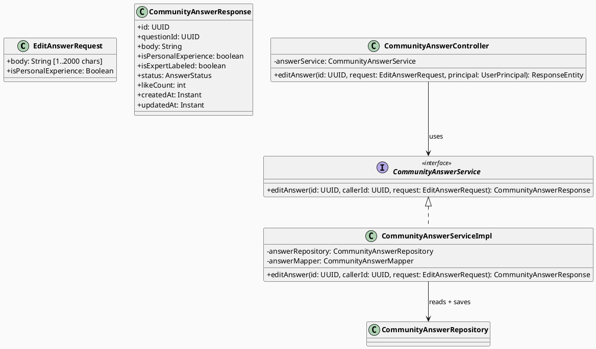
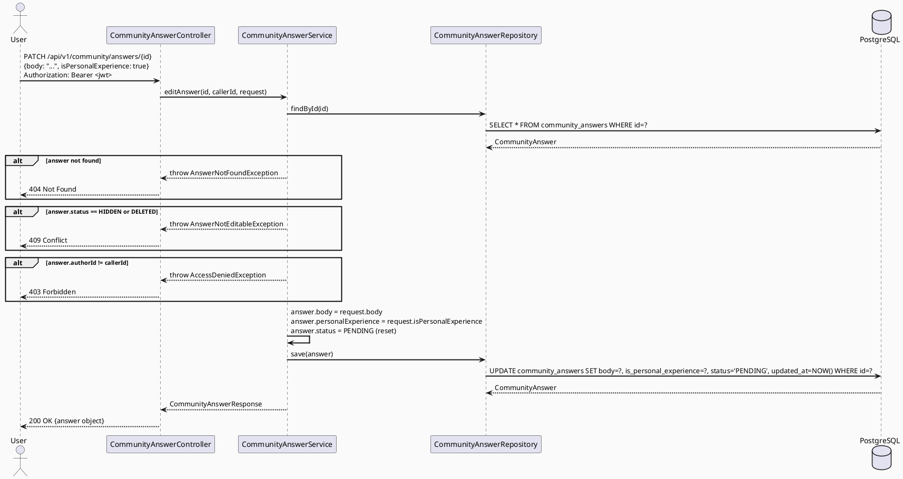

# ENGINEERING DOCUMENTATION STANDARD (EDS) v2.0
# Technical Design Specification — UC-200 Edit Own Answer

| Field              | Value                                       |
| ------------------ | ------------------------------------------- |
| **Document ID**    | `CB-COMMUNITY-IMP-008`                      |
| **Version**        | `1.0`                                       |
| **Date**           | `2026-07-01`                                |
| **Status**         | `Approved`                                  |
| **Document Owner** | `HuyND`                                     |
| **Author**         | `AI Agent — Winston (System Architect)`     |
| **Reviewed by**    | `[x] HuyND — Approved`                      |
| **DPO Sign-off**   | `[ ] Pending`                               |
| **Approved by**    | `HuyND`                                     |
| **Last Review**    | `2026-07-01`                                |
| **Based on EDS**   | `v2.0`                                      |

---

## CHANGELOG

| Ngày       | Người thực hiện                       | Nội dung thay đổi                             |
| ---------- | ------------------------------------- | --------------------------------------------- |
| 2026-07-01 | AI Agent — Winston (System Architect) | Tạo tài liệu lần đầu cho UC-200 Edit Own Answer |
| 2026-07-01 | AI Agent — Amelia (Dev Agent) | Implemented: `EditAnswerRequest` DTO, `AnswerNotEditableException` (COM-013), `CommunityAnswerServiceImpl.editAnswer()`, `PATCH /api/v1/community/questions/{questionId}/answers/{id}` (nested under questionId, differs from the flat path originally drafted in §9 — see note there), mobile `editAnswer()` wired into question detail screen via edit dialog. Tests passing (`CommunityAnswerServiceImplTest`, `CommunityAnswerControllerTest`). Status=Approved. |

---

## MỤC LỤC

1. [Tổng quan Module](#1-tổng-quan-module)
2. [Ma trận Truy vết (Traceability Matrix)](#2-ma-trận-truy-vết-traceability-matrix)
3. [Architecture Decision Records (ADR)](#3-architecture-decision-records-adr)
4. [Non-Functional Requirements & SLA](#4-non-functional-requirements--sla)
5. [Static Modeling (Mô hình Tĩnh)](#5-static-modeling-mô-hình-tĩnh)
6. [Dynamic Modeling (Mô hình Động)](#6-dynamic-modeling-mô-hình-động)
7. [Domain Event Catalog](#7-domain-event-catalog)
8. [Interface Specification (Đặc tả Giao diện)](#8-interface-specification-đặc-tả-giao-diện)
9. [API Specification](#9-api-specification)
10. [Bảng mã lỗi (Error Codes)](#10-bảng-mã-lỗi-error-codes)
11. [Quy trình Triển khai (Step-by-Step)](#11-quy-trình-triển-khai-step-by-step)
12. [Rollback & Incident Runbook](#12-rollback--incident-runbook)
13. [Kịch bản Kiểm thử Chi tiết](#13-kịch-bản-kiểm-thử-chi-tiết)
14. [Phương pháp Xác minh](#14-phương-pháp-xác-minh)
15. [Mẫu thử thực tế (API Verification Samples)](#15-mẫu-thử-thực-tế-api-verification-samples)
16. [Bảng tổng hợp phân quyền (Authorization Matrix)](#16-bảng-tổng-hợp-phân-quyền-authorization-matrix)
17. [AI Prompt Constraints (CASE 2.0)](#17-ai-prompt-constraints-case-20)

---

## 1. Tổng quan Module

| Field                     | Value                                                                  |
| ------------------------- | ---------------------------------------------------------------------- |
| **Module Name**           | `EditOwnAnswer`                                                        |
| **Bounded Context**       | `community`                                                            |
| **UC ID**                 | `UC-200`                                                               |
| **SRS Reference**         | `3.3.13.3`                                                             |
| **Primary Actor**         | `Authenticated User (any role) — owner of answer`                     |
| **Platform**              | `Mobile App (Flutter) + Backend (Spring Boot)`                        |
| **Data Classification**   | `Internal`                                                             |
| **Compliance Scope**      | `BR-RBAC`                                                              |
| **Upstream Dependencies** | `security (JWT), community (CommunityAnswer entity)`                  |
| **Downstream Consumers**  | `community question detail (UC-58), moderation queue`                 |

**Mô tả:** Cho phép người dùng chỉnh sửa câu trả lời của chính mình trong cộng đồng, với điều kiện câu trả lời không bị khóa (status != HIDDEN). Sau khi chỉnh sửa, status được reset về `PENDING` để câu trả lời được re-moderation trước khi hiển thị lại công khai.

**Current state:** `CommunityAnswerController` chỉ có `POST /api/v1/community/answers` (tạo câu trả lời). Endpoint `PATCH /api/v1/community/answers/{id}` chưa tồn tại. `CommunityQuestionController` có `PATCH /{id}` cho edit question làm pattern tham khảo.

---

## 2. Ma trận Truy vết (Traceability Matrix)

| Requirement ID | Loại          | Mô tả yêu cầu                                                       | Thành phần Code                                           | Compliance Target | ADR liên quan |
| -------------- | ------------- | -------------------------------------------------------------------- | --------------------------------------------------------- | ----------------- | ------------- |
| UC-200         | Use Case      | User chỉnh sửa câu trả lời của mình khi chưa bị khóa               | `CommunityAnswerController.editAnswer()`                 | BR-RBAC           | ADR-COM-200-1 |
| BR-RBAC        | Business Rule | Chỉ tác giả của answer mới được chỉnh sửa                           | Ownership check trong service                            | RBAC              | ADR-COM-200-1 |
| BR-COM-200-1   | Business Rule | Không chỉnh sửa được answer có status = HIDDEN                      | Status guard trong service                               | Moderation        | ADR-COM-200-2 |
| BR-COM-200-2   | Business Rule | Sau khi edit, status reset về PENDING để re-moderation              | `answer.setStatus(PENDING)` sau update                   | Content quality   | ADR-COM-200-2 |
| BR-COM-200-3   | Business Rule | Chỉ `body` và `isPersonalExperience` được phép chỉnh sửa           | Partial update DTO — không thể thay đổi questionId/authorId | Data integrity | ADR-COM-200-1 |
| BR-COM-200-4   | Business Rule | `is_expert_labeled` không bao giờ bị reset bởi author edit         | `expertLabeled` field ignored trong edit request          | Moderation        | ADR-COM-200-1 |

---

## 3. Architecture Decision Records (ADR)

### ADR-COM-200-1 — Owner-only PATCH với MODERATOR không cần bypass cho edit

| Field      | Value        |
| ---------- | ------------ |
| **Status** | `Accepted`   |
| **Date**   | `2026-07-01` |

#### Bối cảnh (Context)
UC-200 chỉ nói "author can edit own answer when not locked". MODERATOR không cần edit nội dung của user — họ sử dụng moderation workflow riêng. Ownership check là strict: chỉ `authorId == callerId`.

#### Quyết định (Decision)
Service kiểm tra `answer.authorId == jwt.userId`. Không có MODERATOR bypass cho edit operation. MODERATOR có flow riêng để approve/hide answers.

---

### ADR-COM-200-2 — Status reset về PENDING sau edit

| Field      | Value        |
| ---------- | ------------ |
| **Status** | `Accepted`   |
| **Date**   | `2026-07-01` |

#### Bối cảnh (Context)
Nếu answer đang ở status APPROVED và user edit nội dung, nội dung mới chưa được moderator review. Cần đưa answer về PENDING để đảm bảo content quality.

#### Các phương án đã xem xét (Options Considered)

| Phương án | Mô tả | Ưu điểm | Nhược điểm |
|-----------|-------|----------|------------|
| A | Reset status về PENDING sau edit | An toàn — nội dung mới được review | User thấy answer bị "ẩn" tạm thời sau edit |
| B | Giữ nguyên status | Không tốn thời gian review | Nội dung xấu có thể tồn tại sau edit |

#### Quyết định (Decision)
**Phương án A** — Reset về PENDING để đảm bảo content moderation pipeline. Đây là yêu cầu standard cho community health platform.

---

## 4. Non-Functional Requirements & SLA

### 4.1. Performance & Availability

| Category | Requirement           | Target SLA |
| -------- | --------------------- | ---------- |
| Latency  | PATCH answer (p99)    | `< 200ms`  |

### 4.2. Security

| Category      | Requirement                    | Verification                  |
| ------------- | ------------------------------ | ----------------------------- |
| Authorization | Owner-only edit                | Unit test ownership check     |
| Field guard   | expertLabeled not modifiable   | Test: send expertLabeled=true |

---

## 5. Static Modeling (Mô hình Tĩnh)

### 5.1. Planned File Paths

| File | Change Type | Notes |
|------|-------------|-------|
| `community/dto/request/EditAnswerRequest.java` | Create | `{body: String, isPersonalExperience: Boolean}` |
| `community/dto/response/CommunityAnswerResponse.java` | Verify/Modify | Ensure includes all fields |
| `community/service/CommunityAnswerService.java` | Modify | Add `editAnswer(id, callerId, request)` |
| `community/service/CommunityAnswerServiceImpl.java` | Create/Modify | Implement editAnswer |
| `community/controller/CommunityAnswerController.java` | Modify | Add `@PatchMapping("/{id}")` |
| `community/mapper/CommunityAnswerMapper.java` | Modify | Add `updateEntityFromRequest()` |

### 5.2. Class Diagram (PlantUML)



### 5.3. Schema / Migration Delta

**No migration required.** `community_answers` table already has all needed columns. Status reset to PENDING is an application-level operation.

> **Note:** Migration `V20260701000002__add_deleted_status_community.sql` (from UC-170/UC-201) also adds `DELETED` to `community_answers_status_check`. This migration must be applied before UC-201 implementation but does not block UC-200.

---

## 6. Dynamic Modeling (Mô hình Động)

### 6.1. Sequence Diagram — Edit Answer (Happy Path)



### 6.2. Status Invariants

- `expertLabeled` flag is **never modified** by this endpoint.
- `questionId` and `authorId` are **never modified** by this endpoint.
- Status always resets to `PENDING` regardless of previous status (PENDING or APPROVED).
- An answer with status `HIDDEN` or `DELETED` cannot be edited.

---

## 7. Domain Event Catalog

| Event | Publisher | Consumer | Payload | Trigger |
|-------|-----------|----------|---------|---------|
| `AnswerEdited` | `CommunityAnswerServiceImpl` | Moderation queue (future) | `{answerId, authorId, editedAt}` | Answer edited by author |

> **MVP note:** Event publishing is out of scope. Moderation queue will poll `status = PENDING` to find edited answers.

---

## 8. Interface Specification (Đặc tả Giao diện)

```java
package com.carebridge.backend.community.service;

import com.carebridge.backend.community.dto.request.EditAnswerRequest;
import com.carebridge.backend.community.dto.response.CommunityAnswerResponse;
import java.util.UUID;

public interface CommunityAnswerService {
    // ... existing methods ...

    /**
     * Edit body and isPersonalExperience of own answer.
     * Resets status to PENDING for re-moderation.
     * @throws AnswerNotFoundException if answer does not exist
     * @throws AnswerNotEditableException if answer.status == HIDDEN or DELETED
     * @throws AccessDeniedException if caller is not the author
     */
    CommunityAnswerResponse editAnswer(UUID answerId, UUID callerId, EditAnswerRequest request);
}
```

---

## 9. API Specification

### PATCH /api/v1/community/questions/{questionId}/answers/{id}

> **Implementation note (2026-07-01):** actual path is nested under `questions/{questionId}` rather than the flat path drafted above, to match `CommunityAnswerController`'s existing `@RequestMapping("/api/v1/community/questions/{questionId}/answers")` base (used by UC-56 POST). Lookup is by `answerId` only; `questionId` is not cross-checked. Minor REST-hygiene note, not a security concern — answer IDs are unguessable UUIDs.

| Field       | Value                                               |
| ----------- | --------------------------------------------------- |
| **Method**  | `PATCH`                                             |
| **Path**    | `/api/v1/community/questions/{questionId}/answers/{id}` |
| **Auth**    | `Bearer JWT` (required)                             |
| **Roles**   | Any authenticated user (ownership enforced in svc)  |

**Path Parameters:**

| Parameter | Type   | Required | Description      |
| --------- | ------ | -------- | ---------------- |
| `id`      | `UUID` | Yes      | ID of the answer |

**Request Body:** `application/json`

```json
{
  "body": "Updated answer text (1-2000 characters)",
  "isPersonalExperience": true
}
```

| Field                | Type      | Required | Validation             |
| -------------------- | --------- | -------- | ---------------------- |
| `body`               | `String`  | Yes      | 1–2000 characters      |
| `isPersonalExperience` | `Boolean` | Yes    | true or false          |

**Success Response:** `200 OK`

```json
{
  "id": "uuid",
  "questionId": "uuid",
  "body": "Updated answer text",
  "isPersonalExperience": true,
  "isExpertLabeled": false,
  "status": "PENDING",
  "likeCount": 0,
  "createdAt": "2026-07-01T00:00:00Z",
  "updatedAt": "2026-07-01T00:05:00Z"
}
```

**Error Responses:**

| HTTP Status | Error Code               | Condition                                    |
| ----------- | ------------------------ | -------------------------------------------- |
| `400`       | `VALIDATION_ERROR`       | Body blank or > 2000 chars                   |
| `401`       | `AUTH_REQUIRED`          | No JWT token                                 |
| `403`       | `FORBIDDEN`              | Caller is not the answer author              |
| `404`       | `ANSWER_NOT_FOUND`       | Answer ID does not exist                     |
| `409`       | `ANSWER_NOT_EDITABLE`    | Answer status is HIDDEN or DELETED           |

---

## 10. Bảng mã lỗi (Error Codes)

| Error Code             | HTTP Status | Message (EN)                              | Condition                         |
| ---------------------- | ----------- | ----------------------------------------- | --------------------------------- |
| `ANSWER_NOT_FOUND`     | `404`       | Community answer not found                | No row with given UUID            |
| `ANSWER_NOT_EDITABLE`  | `409`       | This answer cannot be edited              | status = HIDDEN or DELETED        |
| `FORBIDDEN`            | `403`       | You do not own this answer                | authorId != callerId              |

---

## 11. Quy trình Triển khai (Step-by-Step)

1. **DTO:** Create `EditAnswerRequest.java` with `body` (@NotBlank, @Size(max=2000)) and `isPersonalExperience`
2. **Service interface:** Add `editAnswer()` to `CommunityAnswerService`
3. **Service impl:** Implement in `CommunityAnswerServiceImpl` with ownership check, status guard, and PENDING reset
4. **Mapper:** Add `updateEntityFromRequest()` to `CommunityAnswerMapper`
5. **Controller:** Add `@PatchMapping("/{id}")` to `CommunityAnswerController`
6. **Tests:** Write unit + integration tests as per Test-Spec
7. **Mobile:** Add `editAnswer(id, body, isPersonalExperience)` to `community_service.dart`

---

## 12. Rollback & Incident Runbook

### Rollback Procedure
Git revert the added endpoint. No schema migration to rollback.

### Incident Triggers
- `expertLabeled` being reset → verify mapper does not touch this field
- Edited answer showing as APPROVED → verify status reset to PENDING in service
- 403 on own answer → verify JWT userId matches authorId extraction

---

## 13. Kịch bản Kiểm thử Chi tiết

> Detailed test cases are in `UC200_EditOwnAnswer_Test-Spec.md`.

| TC ID    | Scenario                                         | Expected Result                     |
| -------- | ------------------------------------------------ | ----------------------------------- |
| TC-200-1 | Author edits own APPROVED answer                 | 200, status resets to PENDING       |
| TC-200-2 | Author edits own PENDING answer                  | 200, status stays PENDING           |
| TC-200-3 | Attempt edit HIDDEN answer                       | 409 Conflict                        |
| TC-200-4 | Non-owner attempts edit                          | 403 Forbidden                       |
| TC-200-5 | Edit with blank body                             | 400 Bad Request                     |
| TC-200-6 | Edit with body > 2000 chars                      | 400 Bad Request                     |
| TC-200-7 | Edit non-existent answer ID                      | 404 Not Found                       |
| TC-200-8 | Unauthenticated request                          | 401 Unauthorized                    |
| TC-200-9 | Attempt to change expertLabeled via edit         | 200, expertLabeled unchanged        |

---

## 14. Phương pháp Xác minh

| Verification Method   | Tool                     | Target                              |
| --------------------- | ------------------------ | ----------------------------------- |
| Unit test (service)   | JUnit 5 + Mockito        | Ownership, status guard, PENDING reset |
| Controller test       | @WebMvcTest + MockMvc    | HTTP 200/400/403/404/409 responses  |
| Integration test      | Testcontainers + @SpringBootTest | DB update, status correctly persisted |

---

## 15. Mẫu thử thực tế (API Verification Samples)

```bash
# Happy path — edit own answer
curl -X PATCH http://localhost:8080/api/v1/community/answers/{id} \
  -H "Authorization: Bearer $MOTHER_TOKEN" \
  -H "Content-Type: application/json" \
  -d '{"body":"Updated answer","isPersonalExperience":true}'
# Expected: 200 {"status":"PENDING",...}

# Attempt edit other user's answer
curl -X PATCH http://localhost:8080/api/v1/community/answers/{id} \
  -H "Authorization: Bearer $OTHER_TOKEN" \
  -H "Content-Type: application/json" \
  -d '{"body":"Hack","isPersonalExperience":false}'
# Expected: 403 Forbidden
```

---

## 16. Bảng tổng hợp phân quyền (Authorization Matrix)

| Role            | Edit own answer | Edit other's answer | Notes                    |
| --------------- | --------------- | ------------------- | ------------------------ |
| `MOTHER`        | ✅ Yes          | ❌ 403              | Ownership enforced       |
| `EXPERT`        | ✅ Yes          | ❌ 403              |                          |
| `PARTNER`       | ✅ Yes          | ❌ 403              |                          |
| `FAMILY`        | ✅ Yes          | ❌ 403              |                          |
| `MODERATOR`     | ✅ Yes          | ❌ 403              | Mods use moderation flow |
| Unauthenticated | ❌ 401          | ❌ 401              |                          |

---

## 17. AI Prompt Constraints (CASE 2.0)

### Constraint Summary Table

| ID   | Constraint                                              | Source           |
| ---- | ------------------------------------------------------- | ---------------- |
| C1   | Never auto-approve this TDS                             | EDS v2.0 §1      |
| C2   | Status must reset to PENDING after any successful edit  | ADR-COM-200-2    |
| C3   | `expertLabeled` field must never be modifiable via PATCH| BR-COM-200-4     |
| C4   | Only author can edit — no MODERATOR bypass              | ADR-COM-200-1    |
| C5   | HIDDEN answer cannot be edited                          | BR-COM-200-1     |

### Anti-Pattern Detection

| AP-ID | Anti-Pattern                           | Signal                               | Check | Gate  |
| ----- | -------------------------------------- | ------------------------------------ | ----- | ----- |
| AP-1  | Status not reset after edit            | answer.status unchanged after PATCH  | [ ]   | CG-2  |
| AP-2  | expertLabeled can be set via API       | Request body accepts expertLabeled   | [ ]   | CG-2  |
| AP-3  | No ownership check                     | Service skips `authorId` compare     | [ ]   | CG-1  |
| AP-4  | HIDDEN answer can be edited            | Missing status guard                 | [ ]   | CG-1  |
