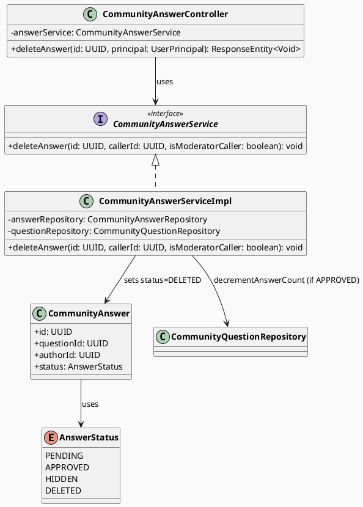
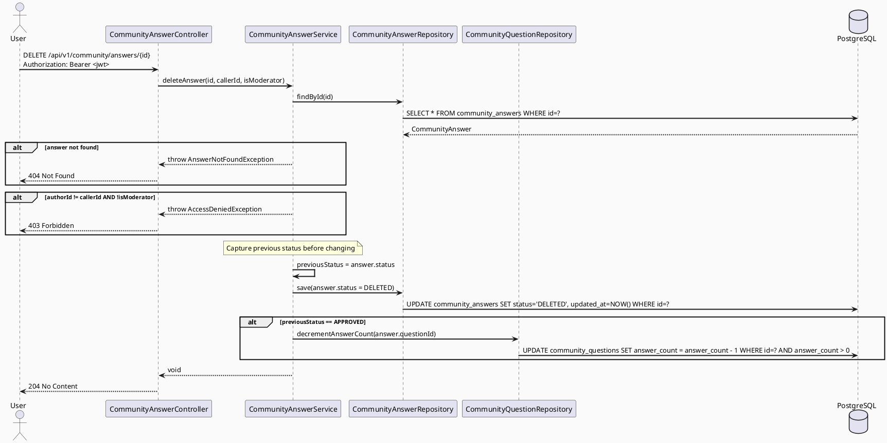

# ENGINEERING DOCUMENTATION STANDARD (EDS) v2.0
# Technical Design Specification — UC-201 Delete Own Answer

| Field              | Value                                       |
| ------------------ | ------------------------------------------- |
| **Document ID**    | `CB-COMMUNITY-IMP-009`                      |
| **Version**        | `1.0`                                       |
| **Date**           | `2026-07-01`                                |
| **Status**         | `Approved`                                  |
| **Document Owner** | `HuyND`                                     |
| **Author**         | `AI Agent — Winston (System Architect)`     |
| **Reviewed by**    | `[x] HuyND — Approved`                      |
| **DPO Sign-off**   | `[ ] Pending`                               |
| **Approved by**    | `HuyND`                                     |
| **Last Review**    | `2026-07-01`                                |
| **Based on EDS**   | `v2.0`                                      |

---

## CHANGELOG

| Ngày       | Người thực hiện                       | Nội dung thay đổi                               |
| ---------- | ------------------------------------- | ----------------------------------------------- |
| 2026-07-01 | AI Agent — Winston (System Architect) | Tạo tài liệu lần đầu cho UC-201 Delete Own Answer |
| 2026-07-01 | AI Agent — Amelia (Dev Agent) | Implemented: `AnswerStatus.DELETED`, `CommunityQuestionRepository.decrementAnswerCount()`, `CommunityAnswerServiceImpl.deleteAnswer()`, `DELETE /api/v1/community/questions/{questionId}/answers/{id}` (nested path — see UC200 TDS §9 note, same reasoning), mobile `deleteAnswer()` wired into question detail screen. TC-201-1..8 passing; TC-201-9 (answer_count never negative under real DB) not yet covered by an integration test — tracked as remaining work in the Test-Spec. Status=Approved for the implemented scope. |

---

## MỤC LỤC

1. [Tổng quan Module](#1-tổng-quan-module)
2. [Ma trận Truy vết (Traceability Matrix)](#2-ma-trận-truy-vết-traceability-matrix)
3. [Architecture Decision Records (ADR)](#3-architecture-decision-records-adr)
4. [Non-Functional Requirements & SLA](#4-non-functional-requirements--sla)
5. [Static Modeling (Mô hình Tĩnh)](#5-static-modeling-mô-hình-tĩnh)
6. [Dynamic Modeling (Mô hình Động)](#6-dynamic-modeling-mô-hình-động)
7. [Domain Event Catalog](#7-domain-event-catalog)
8. [Interface Specification (Đặc tả Giao diện)](#8-interface-specification-đặc-tả-giao-diện)
9. [API Specification](#9-api-specification)
10. [Bảng mã lỗi (Error Codes)](#10-bảng-mã-lỗi-error-codes)
11. [Quy trình Triển khai (Step-by-Step)](#11-quy-trình-triển-khai-step-by-step)
12. [Rollback & Incident Runbook](#12-rollback--incident-runbook)
13. [Kịch bản Kiểm thử Chi tiết](#13-kịch-bản-kiểm-thử-chi-tiết)
14. [Phương pháp Xác minh](#14-phương-pháp-xác-minh)
15. [Mẫu thử thực tế (API Verification Samples)](#15-mẫu-thử-thực-tế-api-verification-samples)
16. [Bảng tổng hợp phân quyền (Authorization Matrix)](#16-bảng-tổng-hợp-phân-quyền-authorization-matrix)
17. [AI Prompt Constraints (CASE 2.0)](#17-ai-prompt-constraints-case-20)

---

## 1. Tổng quan Module

| Field                     | Value                                                                  |
| ------------------------- | ---------------------------------------------------------------------- |
| **Module Name**           | `DeleteOwnAnswer`                                                      |
| **Bounded Context**       | `community`                                                            |
| **UC ID**                 | `UC-201`                                                               |
| **SRS Reference**         | `3.3.13.4`                                                             |
| **Primary Actor**         | `Authenticated User (any role) — owner of answer`                     |
| **Platform**              | `Mobile App (Flutter) + Backend (Spring Boot)`                        |
| **Data Classification**   | `Internal`                                                             |
| **Compliance Scope**      | `BR-RBAC`                                                              |
| **Upstream Dependencies** | `security (JWT), community (CommunityAnswer entity, CommunityQuestion entity)` |
| **Downstream Consumers**  | `community question detail (UC-58), answer count on question`          |

**Mô tả:** Cho phép người dùng xóa (mềm) câu trả lời của chính mình trong cộng đồng theo community policy. Xóa mềm bằng cách chuyển `status = DELETED`. Khi đó `answer_count` trên parent question sẽ được giảm đi 1 (nếu answer trước đó ở trạng thái APPROVED). Câu trả lời bị DELETED vẫn tồn tại trong DB để audit.

**Current state:** `CommunityAnswerController` chỉ có `POST /api/v1/community/answers`. Endpoint `DELETE /api/v1/community/answers/{id}` chưa tồn tại.

**Migration dependency:** Dùng chung migration `V20260701000002__add_deleted_status_community.sql` với UC-170. Migration này cần được apply trước khi implement UC-201.

---

## 2. Ma trận Truy vết (Traceability Matrix)

| Requirement ID | Loại          | Mô tả yêu cầu                                                             | Thành phần Code                                           | Compliance Target | ADR liên quan |
| -------------- | ------------- | -------------------------------------------------------------------------- | --------------------------------------------------------- | ----------------- | ------------- |
| UC-201         | Use Case      | User xóa mềm câu trả lời của mình theo community policy                   | `CommunityAnswerController.deleteAnswer()`               | BR-RBAC           | ADR-COM-201-1 |
| BR-RBAC        | Business Rule | Chỉ tác giả của answer mới được xóa                                       | Ownership check trong service                            | RBAC              | ADR-COM-201-1 |
| BR-COM-201-1   | Business Rule | Xóa mềm: status chuyển sang DELETED, không xóa vật lý                    | `AnswerStatus.DELETED` + service                         | Audit trail       | ADR-COM-201-2 |
| BR-COM-201-2   | Business Rule | answer_count trên parent question giảm khi APPROVED answer bị DELETED     | `questionRepository.decrementAnswerCount(questionId)`    | Data integrity    | ADR-COM-201-3 |
| BR-COM-201-3   | Business Rule | Answer với status HIDDEN cũng có thể bị xóa bởi author                   | Không có status guard (bất kỳ status != DELETED là được) | User rights       | ADR-COM-201-1 |
| BR-COM-201-4   | Business Rule | DELETED answer không hiển thị trong question detail                       | Answer query filter `status != DELETED`                  | Data integrity    | ADR-COM-201-2 |

---

## 3. Architecture Decision Records (ADR)

### ADR-COM-201-1 — Author-only delete, MODERATOR bypass allowed

| Field      | Value        |
| ---------- | ------------ |
| **Status** | `Accepted`   |
| **Date**   | `2026-07-01` |

#### Quyết định (Decision)
Service kiểm tra `answer.authorId == jwt.userId` **OR** caller có role `MODERATOR`. MODERATOR có thể xóa answer của bất kỳ user nào cho moderation purposes.

---

### ADR-COM-201-2 — Soft delete với DELETED status (chia sẻ với UC-170)

| Field      | Value        |
| ---------- | ------------ |
| **Status** | `Accepted`   |
| **Date**   | `2026-07-01` |

#### Quyết định (Decision)
Dùng `DELETED` status (thêm vào `AnswerStatus` enum + alter `community_answers_status_check` CHECK constraint). Migration `V20260701000002__add_deleted_status_community.sql` xử lý cả `community_questions` và `community_answers` trong cùng một lần.

---

### ADR-COM-201-3 — Decrement answer_count chỉ khi answer trước đó là APPROVED

| Field      | Value        |
| ---------- | ------------ |
| **Status** | `Accepted`   |
| **Date**   | `2026-07-01` |

#### Bối cảnh (Context)
`answer_count` trên `community_questions` phản ánh số câu trả lời đã được moderation approve và hiển thị. Nếu user xóa answer đang ở PENDING (chưa approve), `answer_count` không thay đổi vì answer đó chưa được đếm.

#### Quyết định (Decision)
`answer_count` chỉ được decrement nếu `answer.status == APPROVED` trước khi xóa. Nếu status là PENDING hoặc HIDDEN → không decrement.

---

## 4. Non-Functional Requirements & SLA

### 4.1. Performance & Availability

| Category  | Requirement                     | Target SLA |
| --------- | ------------------------------- | ---------- |
| Latency   | DELETE answer (p99)             | `< 200ms`  |
| Integrity | answer_count decrement atomic   | 100%       |

### 4.2. Security

| Category      | Requirement              | Verification                  |
| ------------- | ------------------------ | ----------------------------- |
| Authorization | Owner-only or MODERATOR  | Unit test ownership check     |

---

## 5. Static Modeling (Mô hình Tĩnh)

### 5.1. Planned File Paths

| File | Change Type | Notes |
|------|-------------|-------|
| `community/entity/AnswerStatus.java` | Modify | Add `DELETED` value |
| `community/service/CommunityAnswerService.java` | Modify | Add `deleteAnswer(id, callerId, isModerator)` |
| `community/service/CommunityAnswerServiceImpl.java` | Modify | Implement deleteAnswer |
| `community/controller/CommunityAnswerController.java` | Modify | Add `@DeleteMapping("/{id}")` |
| `community/repository/CommunityQuestionRepository.java` | Modify | Add `decrementAnswerCount(questionId)` |
| `db/migration/V20260701000002__add_deleted_status_community.sql` | Shared | Same migration as UC-170 |

### 5.2. Class Diagram (PlantUML)



### 5.3. Schema / Migration Delta

**Migration shared with UC-170:** `V20260701000002__add_deleted_status_community.sql`

The same migration alters both `community_questions_status_check` and `community_answers_status_check` to include `DELETED`. See UC-170 TDS §5.3 for the SQL.

**Repository addition required:**

```java
// CommunityQuestionRepository addition
@Modifying
@Query("UPDATE CommunityQuestion q SET q.answerCount = q.answerCount - 1 WHERE q.id = :questionId AND q.answerCount > 0")
void decrementAnswerCount(@Param("questionId") UUID questionId);
```

---

## 6. Dynamic Modeling (Mô hình Động)

### 6.1. Sequence Diagram — Delete Answer (Happy Path)



### 6.2. Invariants

- `answer_count` is only decremented when the deleted answer was `APPROVED`.
- No count change for PENDING or HIDDEN deletions.
- Idempotency: deleting an already-DELETED answer returns 204 (no-op).

---

## 7. Domain Event Catalog

| Event | Publisher | Consumer | Payload | Trigger |
|-------|-----------|----------|---------|---------|
| `AnswerDeleted` | `CommunityAnswerServiceImpl` | (future: feed cache) | `{answerId, questionId, authorId, deletedAt}` | Answer soft-deleted |

> **MVP note:** Event publishing is out of scope.

---

## 8. Interface Specification (Đặc tả Giao diện)

```java
package com.carebridge.backend.community.service;

import java.util.UUID;

public interface CommunityAnswerService {
    // ... existing methods ...

    /**
     * Soft-deletes a community answer by setting status = DELETED.
     * Decrements parent question's answer_count if the deleted answer was APPROVED.
     * @throws AnswerNotFoundException if answer does not exist
     * @throws AccessDeniedException if caller is not owner and not MODERATOR
     */
    void deleteAnswer(UUID answerId, UUID callerId, boolean isModeratorCaller);
}
```

---

## 9. API Specification

### DELETE /api/v1/community/questions/{questionId}/answers/{id}

> **Implementation note (2026-07-01):** nested under `questions/{questionId}` rather than the flat path drafted above — same reasoning as UC-200 TDS §9 (matches `CommunityAnswerController`'s existing base mapping).

| Field           | Value                                               |
| --------------- | --------------------------------------------------- |
| **Method**      | `DELETE`                                            |
| **Path**        | `/api/v1/community/questions/{questionId}/answers/{id}` |
| **Auth**        | `Bearer JWT` (required)                             |
| **Roles**       | Any authenticated user (ownership enforced in svc)  |
| **Idempotency** | Yes — deleting already-DELETED answer returns 204   |

**Path Parameters:**

| Parameter | Type   | Required | Description      |
| --------- | ------ | -------- | ---------------- |
| `id`      | `UUID` | Yes      | ID of the answer |

**Request Body:** None

**Success Response:** `204 No Content`

**Error Responses:**

| HTTP Status | Error Code         | Condition                             |
| ----------- | ------------------ | ------------------------------------- |
| `401`       | `AUTH_REQUIRED`    | No JWT token                          |
| `403`       | `FORBIDDEN`        | Caller is not owner and not MODERATOR |
| `404`       | `ANSWER_NOT_FOUND` | Answer ID does not exist              |

---

## 10. Bảng mã lỗi (Error Codes)

| Error Code         | HTTP Status | Message (EN)                | Condition               |
| ------------------ | ----------- | --------------------------- | ----------------------- |
| `ANSWER_NOT_FOUND` | `404`       | Community answer not found  | No row with given UUID  |
| `FORBIDDEN`        | `403`       | You do not own this answer  | Not owner / not mod     |

---

## 11. Quy trình Triển khai (Step-by-Step)

1. **Migration:** Ensure `V20260701000002__add_deleted_status_community.sql` is applied (shared with UC-170)
2. **Enum:** Add `DELETED` to `AnswerStatus.java`
3. **Repository:** Add `decrementAnswerCount()` to `CommunityQuestionRepository`
4. **Service interface:** Add `deleteAnswer()` to `CommunityAnswerService`
5. **Service impl:** Implement in `CommunityAnswerServiceImpl` — capture previous status, set DELETED, decrement if APPROVED
6. **Controller:** Add `@DeleteMapping("/{id}")` to `CommunityAnswerController`
7. **Answer query filter:** Verify existing answer list queries filter `status != DELETED`
8. **Tests:** Write unit + integration tests as per Test-Spec
9. **Mobile:** Add `deleteAnswer(id)` to `community_service.dart`

---

## 12. Rollback & Incident Runbook

### Rollback Procedure
Git revert the added endpoint. Migration rollback is shared with UC-170 (see UC-170 TDS §12).

### Incident Triggers
- `answer_count` goes negative → verify `AND answer_count > 0` guard in decrementAnswerCount query
- Deleted answer still showing → verify answer list query filters `status != DELETED`
- 500 on delete → verify migration V20260701000002 was applied

---

## 13. Kịch bản Kiểm thử Chi tiết

> Detailed test cases are in `UC201_DeleteOwnAnswer_Test-Spec.md`.

| TC ID    | Scenario                                           | Expected Result                          |
| -------- | -------------------------------------------------- | ---------------------------------------- |
| TC-201-1 | Author deletes own APPROVED answer                 | 204, status=DELETED, answer_count--      |
| TC-201-2 | Author deletes own PENDING answer                  | 204, status=DELETED, answer_count unchanged |
| TC-201-3 | Author deletes own HIDDEN answer                   | 204, status=DELETED, answer_count unchanged |
| TC-201-4 | Non-owner attempts delete                          | 403 Forbidden                            |
| TC-201-5 | MODERATOR deletes other user's answer              | 204, status=DELETED                      |
| TC-201-6 | Delete non-existent answer ID                      | 404 Not Found                            |
| TC-201-7 | Unauthenticated request                            | 401 Unauthorized                         |
| TC-201-8 | Already-DELETED answer (idempotency)               | 204 No Content                           |
| TC-201-9 | answer_count never goes negative                   | answer_count stays 0 on double-delete    |

---

## 14. Phương pháp Xác minh

| Verification Method   | Tool                     | Target                                   |
| --------------------- | ------------------------ | ---------------------------------------- |
| Unit test (service)   | JUnit 5 + Mockito        | Ownership, decrement logic, idempotency  |
| Controller test       | @WebMvcTest + MockMvc    | HTTP 204/403/404/401 responses           |
| Integration test      | Testcontainers + @SpringBootTest | Migration, DB state, answer_count |

---

## 15. Mẫu thử thực tế (API Verification Samples)

```bash
# Happy path — delete own APPROVED answer
curl -X DELETE http://localhost:8080/api/v1/community/answers/{id} \
  -H "Authorization: Bearer $MOTHER_TOKEN"
# Expected: 204 No Content

# Verify answer_count decremented
curl http://localhost:8080/api/v1/community/questions/{questionId} \
  -H "Authorization: Bearer $MOTHER_TOKEN"
# Expected: answerCount is 1 less than before
```

---

## 16. Bảng tổng hợp phân quyền (Authorization Matrix)

| Role            | DELETE own answer | DELETE other's answer | Notes                        |
| --------------- | ----------------- | --------------------- | ---------------------------- |
| `MOTHER`        | ✅ Yes            | ❌ 403                | Ownership enforced           |
| `EXPERT`        | ✅ Yes            | ❌ 403                |                              |
| `PARTNER`       | ✅ Yes            | ❌ 403                |                              |
| `FAMILY`        | ✅ Yes            | ❌ 403                |                              |
| `MODERATOR`     | ✅ Yes            | ✅ Yes (bypass)       | Moderation authority         |
| `SYSTEM_ADMIN`  | ✅ Yes            | ✅ Yes (bypass)       |                              |
| Unauthenticated | ❌ 401            | ❌ 401                |                              |

---

## 17. AI Prompt Constraints (CASE 2.0)

### Constraint Summary Table

| ID   | Constraint                                              | Source           |
| ---- | ------------------------------------------------------- | ---------------- |
| C1   | Never auto-approve this TDS                             | EDS v2.0 §1      |
| C2   | Soft-delete only — no physical DELETE from DB           | BR-COM-201-1     |
| C3   | Decrement answer_count only if previous status = APPROVED | ADR-COM-201-3  |
| C4   | answer_count must never go negative                     | Data integrity   |
| C5   | Migration V20260701000002 must be applied first         | Schema dependency|

### Anti-Pattern Detection

| AP-ID | Anti-Pattern                           | Signal                              | Check | Gate  |
| ----- | -------------------------------------- | ----------------------------------- | ----- | ----- |
| AP-1  | Hard delete (physical DELETE SQL)      | `repository.delete()` call          | [ ]   | CG-2  |
| AP-2  | No ownership check                     | Service skips `authorId` compare    | [ ]   | CG-2  |
| AP-3  | Always decrement answer_count          | No check of previous status         | [ ]   | CG-2  |
| AP-4  | answer_count goes negative             | No `AND answer_count > 0` guard     | [ ]   | CG-2  |
