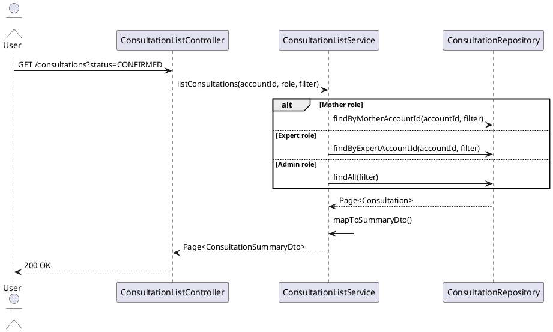

# ENGINEERING DOCUMENTATION STANDARD (EDS) v2.0
# UC-202 View Consultation List

| Field | Value |
|-------|-------|
| **Document ID** | `CB-CON-IMP-003` |
| **Version** | `1.0` |
| **Date** | `2026-06-26` |
| **Status** | `Draft` |
| **Author** | `AI Agent` |
| **Based on EDS** | `v2.0` |

---

## CHANGELOG

| Ngày | Người thực hiện | Nội dung thay đổi |
|------|-----------------|-------------------|
| 2026-06-26 | AI Agent | Khởi tạo TDS cho UC-202 |

---

## MỤC LỤC

1. [Tổng quan Module](#1-tổng-quan-module)
2. [Ma trận Truy vết](#2-ma-trận-truy-vết-traceability-matrix)
3. [Architecture Decision Records (ADR)](#3-architecture-decision-records-adr)
4. [Non-Functional Requirements & SLA](#4-non-functional-requirements--sla)
5. [Static Modeling](#5-static-modeling)
6. [Dynamic Modeling](#6-dynamic-modeling)
7. [Domain Event Catalog](#7-domain-event-catalog)
8. [Interface Specification](#8-interface-specification)
9. [API Specification](#9-api-specification)
10. [Bảng mã lỗi](#10-bảng-mã-lỗi)
11. [Quy trình Triển khai](#11-quy-trình-triển-khai-step-by-step)
12. [Rollback & Incident Runbook](#12-rollback--incident-runbook)
13. [Kịch bản Kiểm thử Chi tiết](#13-kịch-bản-kiểm-thử-chi-tiết)
14. [Phương pháp Xác minh](#14-phương-pháp-xác-minh)
15. [Mẫu thử thực tế](#15-mẫu-thử-thực-tế-api-verification-samples)
16. [Bảng tổng hợp phân quyền](#16-bảng-tổng-hợp-phân-quyền-authorization-matrix)
17. [AI Prompt Constraints](#17-ai-prompt-constraints-case-20)

---

## 1. Tổng quan Module

| Field | Value |
|-------|-------|
| **Module Name** | `ViewConsultationList` |
| **Bounded Context** | `consultation` |
| **Data Classification** | `PII` |
| **Upstream Dependencies** | `consultations table` |
| **Downstream Consumers** | `consultation detail view` |

**Mô tả:** Mother hoặc Expert xem danh sách phiên tư vấn của mình (upcoming, pending, completed, cancelled, no-show). Mỗi actor chỉ thấy consultations mà mình tham gia. Có thể lọc theo status.

---

## 2. Ma trận Truy vết (Traceability Matrix)

| Requirement ID | Loại | Mô tả | Thành phần Code | Compliance Target | ADR liên quan |
|----------------|------|-------|-----------------|-------------------|---------------|
| UC-202 | Use Case | Xem danh sách phiên tư vấn theo role | `ConsultationListController`, `ConsultationListService` | BR-RBAC | ADR-CON-006 |
| BR-SCOPED | Business Rule | Mother/Expert chỉ thấy consultation của mình | `ConsultationListService` | BR-PRIVACY | ADR-CON-006 |
| BR-ADMIN-ALL | Business Rule | Admin thấy tất cả consultations | `ConsultationListService` | BR-RBAC | ADR-CON-006 |
| BR-FILTER | Business Rule | Lọc theo status, sorted by scheduled_at DESC | `ConsultationListService` | BR-UX | — |

---

## 3. Architecture Decision Records (ADR)

### ADR-CON-006 — Participant-scoped consultation query

| Field | Value |
|-------|-------|
| **Status** | `Accepted` |
| **Date** | `2026-06-26` |

#### Quyết định
- ROLE_MOTHER: `WHERE mother_account_id = callerAccountId`
- ROLE_EXPERT: `WHERE expert_profile.account_id = callerAccountId`
- ROLE_ADMIN: unrestricted
- Không bao giờ trả về consultations của người khác trong cùng một query.
- Sorted by `scheduled_at DESC`.

---

## 4. Non-Functional Requirements & SLA

### 4.1. Performance & Availability

| Category | Requirement | Target SLA |
|----------|-------------|------------|
| Latency | API response — list consultations (p99) | < 300ms |
| Availability | Uptime (monthly) | 99.9% |
| Pagination | Default page size / max | 20 / 50 |

### 4.2. Security

| Category | Requirement | Target |
|----------|-------------|--------|
| Access control | Role-scoped data access | Least privilege (§16) |
| Data isolation | Mother/Expert see own data only | BR-PRIVACY |

---

## 5. Static Modeling

> Class diagram tham chiếu §8 Interface Specification.

### 5.1. Key DTOs

- `ConsultationListFilter` — query parameters (status, page, size)
- `ConsultationSummaryDto` — result item (id, expertName/motherName, scheduledAt, status, modality)

---

## 6. Dynamic Modeling

### 6.1. View Consultation List Sequence



---

## 7. Domain Event Catalog

### 7.1. Events Published

| Event Name | Trigger | Publisher | Async? |
|------------|---------|-----------|--------|
| — | Read-only list endpoint — no domain events | — | — |

### 7.2. Events Consumed

| Event Name | Source | Handler | Action |
|------------|--------|---------|--------|
| — | — | — | — |

---

## 8. Interface Specification

```java
public class ConsultationListFilter {
    private ConsultationStatus status;  // optional
    private Integer page;
    private Integer size; // max 50
}

public interface IConsultationListService {
    Page<ConsultationSummaryDto> listConsultations(UUID callerAccountId,
                                                    String callerRole,
                                                    ConsultationListFilter filter);
}

public class ConsultationSummaryDto {
    private UUID consultationId;
    private String counterpartName;  // expert displayName or mother's display name
    private ConsultationStatus status;
    private ConsultationModalityType modality;
    private Instant scheduledAt;
    private Integer durationMinutes;
    private Long feeVnd;
}
```

---

## 9. API Specification

| Method | Path | Auth | Required Roles |
|--------|------|------|----------------|
| `GET` | `/api/v1/consultations` | JWT Bearer | `ROLE_MOTHER`, `ROLE_EXPERT` |

**Query params:** `status`, `page`, `size`

**GET — 200 OK:**
```json
{
  "content": [
    {
      "consultationId": "uuid",
      "counterpartName": "Dr. Nguyen Van A",
      "status": "CONFIRMED",
      "modality": "VIDEO",
      "scheduledAt": "2026-07-01T10:00:00Z",
      "feeVnd": 200000
    }
  ],
  "totalElements": 10
}
```

---

## 10. Bảng mã lỗi

| Code | HTTP | Trigger |
|------|------|---------|
| `CON-007` | 400 | Invalid status filter value |
| `CON-008` | 401 | Unauthenticated |

---

## 11. Quy trình Triển khai (Step-by-Step)

### 11.1. Prerequisites

- [ ] consultations table tồn tại (V31)
- [ ] expert_profiles table tồn tại (V28)

### 11.2. Pre-Migration Checklist

Không có migration mới — read-only list endpoint.

### 11.3. Implementation Steps

#### Chặng 1 — Implement scoped query per role

```java
public Page<ConsultationListItem> getConsultations(UUID callerAccountId, String callerRole,
        ConsultationStatus statusFilter, Pageable pageable) {
    if ("ROLE_MOTHER".equals(callerRole)) {
        return consultationRepo.findByMotherAccountId(callerAccountId, statusFilter, pageable);
    } else if ("ROLE_EXPERT".equals(callerRole)) {
        UUID expertProfileId = profileRepo.findByAccountId(callerAccountId)
            .map(ExpertProfile::getId).orElseThrow();
        return consultationRepo.findByExpertProfileId(expertProfileId, statusFilter, pageable);
    }
    return consultationRepo.findAll(statusFilter, pageable); // ADMIN
}
```

#### Chặng 2 — Mapper (PII masked)

```java
// ConsultationListItem: id, counterpartName, status, scheduledAt, feeVnd
// NO email, NO phone, NO accountId
```

### 11.4. Deployment Checklist

- [ ] Test MOTHER → only own consultations
- [ ] Test EXPERT → only own consultations
- [ ] Test filter by status
- [ ] Verify no email/phone in response

---

## 12. Rollback & Incident Runbook

### 12.1. Điều kiện kích hoạt Rollback

| Điều kiện | Ngưỡng | Người quyết định |
|-----------|--------|------------------|
| User thấy consultations của người khác | Bất kỳ | Tech Lead + DPO |

### 12.2. Rollback Procedure

```bash
kubectl rollout undo deployment/carebridge-api
```

---

## 13. Kịch bản Kiểm thử Chi tiết

```gherkin
Feature: View Consultation List
  Scenario: Mother sees own only
    Given MOTHER-001 có 2 consultations, MOTHER-002 có 1
    When getConsultations(MOTHER-001, ROLE_MOTHER)
    Then response.totalElements == 2

  Scenario: Expert sees own only
    Given EXPERT-001 có 3 consultations
    When getConsultations(EXPERT-001.accountId, ROLE_EXPERT)
    Then response.totalElements == 3

  Scenario: Filter by status
    When getConsultations(status=CONFIRMED) → only CONFIRMED

  Scenario: No email in response
    Then response items KHÔNG chứa email

  Scenario: Empty → 200
    Then response 200, content=[]
```

---

## 14. Phương pháp Xác minh

```sql
SELECT id, mother_account_id FROM consultations WHERE mother_account_id = '<uuid>';
```

---

## 15. Mẫu thử thực tế (API Verification Samples)

```bash
curl -X GET "https://[host]/api/v1/consultations?status=CONFIRMED&page=0&size=20" \
  -H "Authorization: Bearer <MOTHER_JWT>"
# Expected 200: { "content": [...], "totalElements": N }
```

---

## 16. Bảng tổng hợp phân quyền (Authorization Matrix)

| Endpoint | `ROLE_MOTHER` | `ROLE_EXPERT` | `ROLE_ADMIN` |
|----------|---------------|---------------|--------------|
| `GET /consultations` | ✅ Own | ✅ Own | ✅ All |

---

## 17. AI Prompt Constraints (CASE 2.0)

### 17.1 Constraint Summary Table

| # | Constraint | Source |
|---|-----------|--------|
| C1 | MOTHER: filter by mother_account_id = callerAccountId | ADR-CON-006 |
| C2 | EXPERT: join expert_profiles WHERE account_id = callerAccountId | ADR-CON-006 |
| C3 | NEVER return other users' consultations | ADR-CON-006 |
| C4 | counterpartName = displayName — NOT email/phone | BR-PRIVACY |
| C5 | Sort by scheduled_at DESC by default | ADR-CON-006 |

### 17.2 Constraint Injection Block

```
[CONSTRAINT BLOCK — Module: ViewConsultationList (CB-CON-IMP-003)]
1. (C1) Mother: WHERE mother_account_id = JWT accountId.
2. (C2) Expert: JOIN expert_profiles WHERE account_id = JWT accountId.
3. (C3) KHÔNG BAO GIỜ trả consultations của user khác.
4. (C4) counterpartName dùng displayName — KHÔNG email/phone.
5. (C5) Default sort: scheduled_at DESC.
```

### 17.3 Constraint Quality Checklist

- [x] Mỗi constraint traceable về ADR-CON-006 hoặc BR-PRIVACY
- [x] Constraint block có ≥ 5 constraints

### 17.4 Anti-Pattern Detection

| AP-ID | Anti-Pattern | Hành động |
|-------|-------------|----------|
| AP-AI-001 | Load all rồi filter Java | Reject — C3, data leak |
| AP-AI-003 | Include email trong counterpart | Reject — C4/BR-PRIVACY |

---

## PHỤ LỤC

### A. Glossary

| Thuật ngữ | Định nghĩa |
|-----------|------------|
| Scoped query | Query scoped theo role: Mother/Expert thấy own, Admin thấy all |

### B. Tài liệu tham chiếu

| Document | Path |
|----------|------|
| EDS v2.0 Template | `08_References/Template/PHASE-3_TDS.md` |

---

*EDS v2.1 — Tích hợp CASE 2.0 AI Prompt Constraints (§17).*
