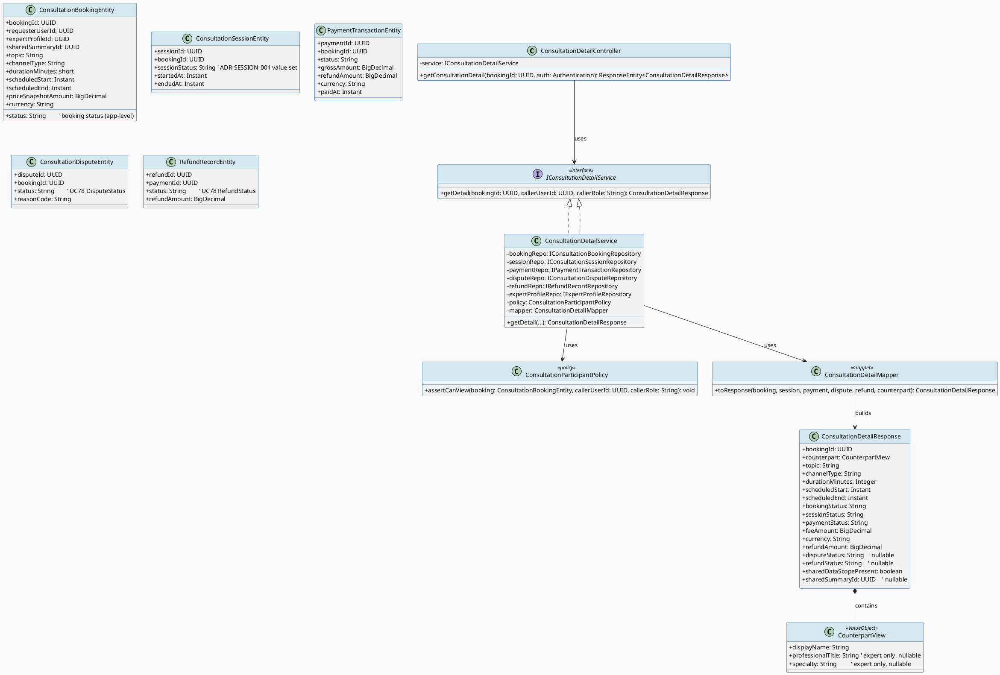
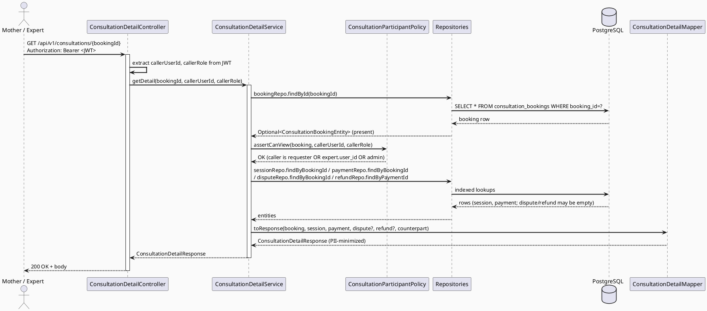
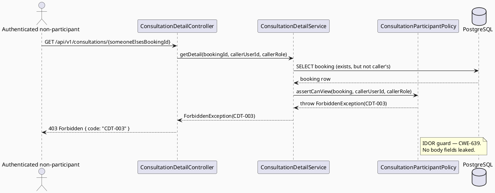
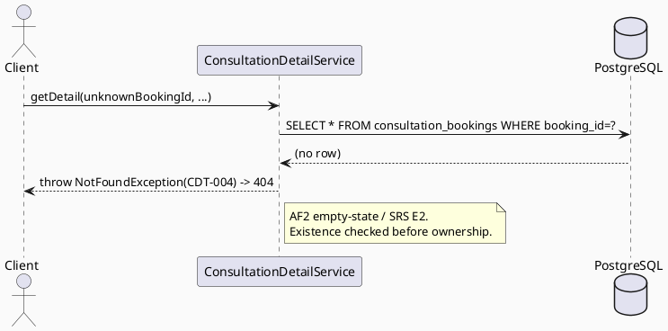
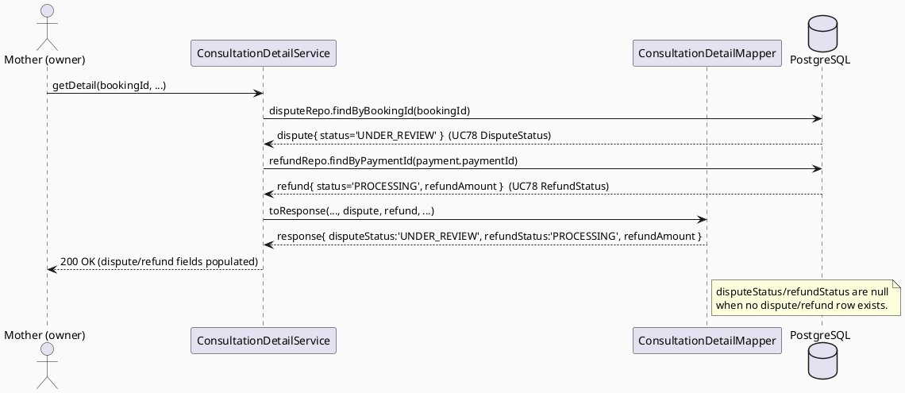

# ENGINEERING DOCUMENTATION STANDARD (EDS) v2.0
# UC-203 View Consultation Detail

| Field | Value |
|-------|-------|
| **Document ID** | `CB-CON-IMP-004` |
| **Version** | `1.0` |
| **Date** | `2026-07-03` |
| **Status** | `Draft` |
| **Document Owner** | `LamVH — Consultation Domain Lead` |
| **Author** | `AI Agent — Technical Architect` |
| **Reviewed by** | `[Tech Lead] — Pending` |
| **DPO Sign-off** | `[ ] Pending` *(module surfaces PII — counterpart identity + shared-data scope)* |
| **Approved by** | `[Principal Architect] — Pending` |
| **Last Review** | `2026-07-03` |
| **Based on EDS** | `v2.0` |

---

## CHANGELOG

> **Policy 4.4 — Immutable History:** Không bao giờ xóa thông tin cũ.

| Ngày | Người thực hiện | Nội dung thay đổi |
|------|-----------------|-------------------|
| 2026-07-03 | AI Agent | Khởi tạo TDS cho UC-203 View Consultation Detail (read-only, ownership-scoped single-record view) |

---

## MỤC LỤC

1. [Tổng quan Module](#1-tổng-quan-module)
2. [Ma trận Truy vết](#2-ma-trận-truy-vết-traceability-matrix)
3. [Architecture Decision Records (ADR)](#3-architecture-decision-records-adr)
4. [Non-Functional Requirements & SLA](#4-non-functional-requirements--sla)
5. [Static Modeling](#5-static-modeling-mô-hình-tĩnh)
6. [Dynamic Modeling](#6-dynamic-modeling-mô-hình-động)
7. [Domain Event Catalog](#7-domain-event-catalog)
8. [Interface Specification](#8-interface-specification-đặc-tả-giao-diện)
9. [API Specification](#9-api-specification)
10. [Bảng mã lỗi](#10-bảng-mã-lỗi-error-codes)
11. [Quy trình Triển khai](#11-quy-trình-triển-khai-step-by-step)
12. [Rollback & Incident Runbook](#12-rollback--incident-runbook)
13. [Kịch bản Kiểm thử Chi tiết](#13-kịch-bản-kiểm-thử-chi-tiết)
14. [Phương pháp Xác minh](#14-phương-pháp-xác-minh)
15. [Mẫu thử thực tế](#15-mẫu-thử-thực-tế-api-verification-samples)
16. [Bảng tổng hợp phân quyền](#16-bảng-tổng-hợp-phân-quyền-authorization-matrix)
17. [AI Prompt Constraints (CASE 2.0)](#17-ai-prompt-constraints-case-20)

---

## 1. Tổng quan Module

> Displays, for **one** consultation booking, the expert/user identity, scheduled time, modality (channel), booking + session status, fee, and shared-data scope. Read-only. Combines data from four tables for a single `booking_id` and enforces strict participant ownership (IDOR guard).

| Field | Value |
|-------|-------|
| **Module Name** | `ViewConsultationDetail` |
| **Bounded Context** | `consultation` |
| **Data Classification** | `PII` (counterpart identity + shared-data scope reference; no health payload rendered here) |
| **Compliance Scope** | `PDPA` (BR-PRIVACY minimum-necessary), `BR-RBAC`, `BR-CONSULTATION` (auditable lifecycle state surfaced read-only) |
| **Upstream Dependencies** | `consultation_bookings`, `consultation_sessions`, `payment_transactions`, `consultation_disputes`, `refund_records`, `expert_profiles`, `users` |
| **Downstream Consumers** | Web screen `CB-060 Consultation Detail`; Mobile equivalent `CB-060` (detail-view fields only) |

**Mô tả:** Actor (Mother — the booking requester, or the assigned Verified Expert, or Admin) opens the detail of a specific booking by `bookingId`. The system verifies the caller is a participant of that booking, assembles a read-only DTO, and returns it. No state is mutated. SRS UC-203 (§3.3.14.2, Table 225): "Displays expert or user, time, modality, status, fee, and shared-data scope."

**Related-but-out-of-scope (same CB-060 screen, separate UCs):** UC-94/95/96/97 (join/manage session, write summary), UC-204 Reschedule, UC-205 Cancel, UC-206 Complete, UC-207 No-show, UC-208 View Summary. Those are action buttons/flows on the shared screen and are **not** part of UC-203 (read-only detail assembly only).

---

## 2. Ma trận Truy vết (Traceability Matrix)

| Requirement ID | Loại (BR/ADR/US) | Mô tả yêu cầu | Thành phần Code | Compliance Target | ADR liên quan |
|----------------|------------------|---------------|-----------------|-------------------|---------------|
| UC-203 | Use Case | View consultation detail (expert/user, time, modality, status, fee, shared-data scope) — SRS §3.3.14.2 | `ConsultationDetailController`, `ConsultationDetailService` | BR-RBAC | ADR-CDT-001 |
| BR-RBAC | Business Rule | Actor may access only functions/data allowed by role & scope (SRS UC-203 Business Rules) | `ConsultationDetailService`, `ConsultationParticipantPolicy` | BR-RBAC | ADR-CDT-001 |
| BR-PRIVACY | Business Rule | Health/family data follows minimum-necessary; never expose counterpart PII beyond display identity | `ConsultationDetailMapper`, `ConsultationDetailResponse` | PDPA | ADR-CDT-002 |
| BR-CONSULTATION | Business Rule | Booking/payment/dispute/refund lifecycle state surfaced from an auditable source of truth (read-only) | `ConsultationDetailService` | BR-CONSULTATION | ADR-CDT-003 |
| E1 (SRS UC-203) | Exception | Access denied when unauthenticated / unauthorized / outside permitted data scope | `ConsultationParticipantPolicy` → `CDT-002/CDT-003` | BR-RBAC | ADR-CDT-001 |
| AF2 (SRS UC-203) | Alternative Flow | No matching data → clear result state (here: not-found for unknown bookingId) → `CDT-004` | `ConsultationDetailService` | — | ADR-CDT-001 |
| ADR-SESSION-001 | Decision (upstream, UC95) | `session_status` value set surfaced in detail | `ConsultationDetailMapper` | BR-CONSULTATION | ADR-SESSION-001 |
| ADR-DISPUTE-* (UC78) | Decision (upstream, UC78) | Dispute/refund status enums surfaced when present | `ConsultationDetailMapper` | BR-CONSULTATION | UC78 TDS §8 |
| SCHEMA-AUTH | Decision | Model against real split-table schema, not UC75's invented unified `consultations` table | All entities | — | ADR-CDT-003 |

---

## 3. Architecture Decision Records (ADR)

### ADR-CDT-001 — Single-record participant ownership check (IDOR guard)

| Field | Value |
|-------|-------|
| **Status** | `Accepted` |
| **Deciders** | `AI Agent (Technical Architect)`, `Consultation Domain Lead` |
| **Date** | `2026-07-03` |
| **Supersedes** | — *(extends the participant-scoped-query pattern of UC-202 `ADR-CON-006` to a detail-by-ID endpoint)* |

#### Bối cảnh (Context)
UC-202 (`ADR-CON-006`) scopes a **list** query so each actor sees only their own rows. UC-203 is a **detail-by-ID** endpoint: the `bookingId` is supplied by the caller. Unlike a list, a naive implementation (`findById` → return) exposes an **IDOR** (Insecure Direct Object Reference, CWE-639): any authenticated user could read any booking by guessing/enumerating IDs, leaking counterpart PII and financial data. SRS UC-203 Exception E1 mandates access denial when the actor is "outside the permitted data scope."

#### Các phương án đã xem xét (Options Considered)

| Phương án | Mô tả | Ưu điểm | Nhược điểm |
|-----------|-------|----------|------------|
| A | `findById` then return, rely on frontend to hide | + Trivial | - IDOR; direct BR-RBAC / E1 violation. Rejected. |
| B | Ownership predicate enforced in **service layer** after fetch: caller must be `requester_user_id` OR the `user_id` of `expert_profiles` linked to `booking.expert_profile_id` OR Admin | + Explicit, testable, single choke-point; mirrors UC-202 role logic | - One extra lookup (expert_profile → user_id) for the expert path |
| C | Scoped repository query (`findByIdAndParticipant`) that returns empty for non-participants | + No separate fetch; collapses not-found and forbidden | - Cannot distinguish 403 vs 404; harder to audit "denied" vs "absent" |

#### Quyết định (Decision)
Chọn **Phương án B**. A dedicated `ConsultationParticipantPolicy.assertCanView(booking, callerUserId, callerRole)` is the single choke-point. Ownership rule (against real schema):
- **ROLE_MOTHER**: `booking.requester_user_id == callerUserId`.
- **ROLE_EXPERT**: `expertProfileRepo.findById(booking.expertProfileId).userId == callerUserId`.
- **ROLE_ADMIN / SYSTEM_ADMIN**: unrestricted.
- Any other caller (authenticated but not a participant) → `403 CDT-003`.
- Unknown `bookingId` → `404 CDT-004` (checked **before** ownership, see trade-off).

#### Hệ quả (Consequences)
**Tích cực:**
- Closes IDOR at a single, unit-testable policy method; satisfies E1 / BR-RBAC.
- Consistent with the sibling family (UC-202 `ADR-CON-006`, UC-78 `DISP-004` 403-for-non-owner).

**Tiêu cực / Trade-offs:**
- Returning `404` for unknown IDs but `403` for existing-not-owned IDs technically reveals *existence* of a booking to a non-owner. This matches the established sibling convention (UC-78 returns `403 DISP-004` for existing-not-owner) and is accepted for consistency. `Open` follow-up: if enumeration hardening is later required batch-wide, switch both to `404`. Non-blocking for this UC.
- Expert path costs one extra `expert_profiles` lookup — negligible (indexed PK).

**Compliance Impact:** Directly enforces BR-RBAC and PDPA minimum-necessary at the data-access boundary.

---

### ADR-CDT-002 — Counterpart PII minimization in the detail DTO

| Field | Value |
|-------|-------|
| **Status** | `Accepted` |
| **Deciders** | `AI Agent (Technical Architect)`, `DPO (pending sign-off)` |
| **Date** | `2026-07-03` |

#### Bối cảnh (Context)
The detail view shows "expert or user" identity. The counterpart's row in `users`/`expert_profiles` contains email, phone, and other PII not needed to render a detail card. BR-PRIVACY requires minimum-necessary exposure.

#### Quyết định (Decision)
The `ConsultationDetailResponse` exposes for the counterpart **only**: display name, and (for expert) `professionalTitle` + `specialty`. It **never** contains counterpart email, phone, raw `user_id`/`account_id`, or health payload. The "shared-data scope" is surfaced as the **presence/reference** of `shared_summary_id` (a boolean `sharedDataScopePresent` + the summary id when the viewer is entitled), **not** the health-summary contents (viewing contents is UC-208's scope, gated separately).

#### Hệ quả (Consequences)
**Tích cực:** No counterpart PII leak; DTO discipline identical to UC-202.
**Tiêu cực:** Mapper must be hand-verified to never serialize entity fields directly (never expose JPA entities — CareBridge rule).
**Compliance Impact:** PDPA minimum-necessary satisfied.

---

### ADR-CDT-003 — Model against the real split-table schema (resolve UC75 contradiction)

| Field | Value |
|-------|-------|
| **Status** | `Accepted` |
| **Deciders** | `AI Agent (Technical Architect)`, `Principal Architect (pending)` |
| **Date** | `2026-07-03` |

#### Bối cảnh (Context)
Sibling **Draft** TDS `UC75_BookPrivateConsultation` invented a **unified** `consultations` table with a single `consultation_status` enum (`PENDING_PAYMENT → CONFIRMED → IN_SESSION → COMPLETED`, alt `CANCELLED/NO_SHOW/DISPUTED`). The **applied** schema `V1__init_schema.sql` (lines ~876–1000) instead defines **separate** tables: `consultation_bookings` (with its own `status`), `consultation_sessions` (`session_status`), `payment_transactions` (`status`), `consultation_disputes` (`status`), `refund_records` (`status`) — five independent status columns, all application-level (no DB `CHECK`).

#### Các phương án đã xem xét (Options Considered)

| Phương án | Mô tả | Ưu điểm | Nhược điểm |
|-----------|-------|----------|------------|
| A | Follow UC75's unified `consultations` model | + Single status to render | - Does not exist in the applied DB; would require inventing a migration; contradicts CLAUDE.md "current code and migrations override historical design notes". Rejected. |
| B | Model against the real split schema; render each status from its owning table | + Matches applied DB; zero schema change | - Detail DTO must aggregate several status fields |

#### Quyết định (Decision)
Chọn **Phương án B**. Priority order: **applied schema (`V1__init_schema.sql`) > unapproved draft spec (UC75)**. The detail response therefore carries distinct fields: `bookingStatus` (from `consultation_bookings.status`), `sessionStatus` (from `consultation_sessions.session_status`, per ADR-SESSION-001 value set), `paymentStatus` (from `payment_transactions.status`), and optional `disputeStatus`/`refundStatus` (from `consultation_disputes`/`refund_records`, enums owned by UC78). **No unified `consultation_status` enum is introduced.**

#### Hệ quả (Consequences)
**Tích cực:** Implementation compiles against the real DB; no migration needed; no drift from UC75.
**Tiêu cực:** Consumers (UI) must understand the multi-status model — documented in §9 response schema.
**Compliance Impact:** None (read-only). Preserves BR-CONSULTATION auditable state by reading each canonical source.

> **Superseded/contradiction note:** UC75's unified `consultations`/`consultation_status` model is **not** adopted here. This is a resolved contradiction — see §2 SCHEMA-AUTH row and Test-Spec §2 L1.

---

## 4. Non-Functional Requirements & SLA

### 4.1. Performance & Availability

| Category | Requirement | Target SLA | Measurement Method | Compliance Basis |
|----------|-------------|------------|---------------------|------------------|
| Latency | `GET /consultations/{id}` (p99) | `< 300ms` | k6 / Spring Actuator timer | — |
| Availability | Uptime (monthly) | `99.9%` | Uptime monitor | — |
| Query cost | Bounded fan-out | ≤ 5 indexed single-row lookups per request | Query plan review | — |

### 4.2. Data Integrity & Retention

| Category | Requirement | Target | Verification Method | Compliance Basis |
|----------|-------------|--------|---------------------|------------------|
| Read-only | Zero mutation on this path | No `INSERT/UPDATE/DELETE` | Code review + `@Transactional(readOnly=true)` | BR-CONSULTATION |
| Source of truth | Each status read from its owning table | 100% | §14 SQL cross-check | BR-CONSULTATION |

### 4.3. Security

| Category | Requirement | Target | Verification Method | Compliance Basis |
|----------|-------------|--------|---------------------|------------------|
| Access control | Participant-only (IDOR guard) | Least privilege (§16) | Auth Matrix + CDT-TC-003/004 | BR-RBAC / PDPA |
| PII minimization | No counterpart email/phone/health payload in response | 0 leaks | Serialization assertion (CDT-TC-006) | BR-PRIVACY / PDPA |
| Encryption in transit | All endpoints | TLS 1.3+ | SSL scan | PDPA |

### 4.4. Scalability & Capacity Planning
Read-only, per-record lookup keyed by indexed PKs/FKs (`booking_id` PK; `idx_consultation_bookings_*`, `idx_payment_transactions_booking_id`, `idx_consultation_disputes_booking_id`). Scales horizontally with the API tier; no write contention. Expected load bounded by consultation volume (Frequent per SRS, but single-record) — no dedicated caching required in the 12-month horizon.

---

## 5. Static Modeling (Mô hình Tĩnh)

### 5.1. Class Diagram (PlantUML)



### 5.2. Planned File Paths (no implementation code here)

```
05_Development/CareBridgeAPI/src/main/java/com/carebridge/backend/consultation/
├── controller/ConsultationDetailController.java
├── service/IConsultationDetailService.java
├── service/ConsultationDetailService.java
├── policy/ConsultationParticipantPolicy.java
├── mapper/ConsultationDetailMapper.java
├── dto/response/ConsultationDetailResponse.java
├── dto/response/CounterpartView.java
├── entity/ConsultationBookingEntity.java            (reused if already present)
├── entity/ConsultationSessionEntity.java            (reused)
├── entity/PaymentTransactionEntity.java             (reused)
├── entity/ConsultationDisputeEntity.java            (reused)
├── entity/RefundRecordEntity.java                   (reused)
└── repository/{IConsultationBookingRepository, IConsultationSessionRepository,
                IPaymentTransactionRepository, IConsultationDisputeRepository,
                IRefundRecordRepository, IExpertProfileRepository}.java  (reused)
```

> There is **no request DTO** — the only input is the `bookingId` path variable + JWT identity. Package convention: `com.carebridge.backend.consultation.{controller,service,repository,entity,dto.request,dto.response,mapper,policy}` (see §17 C5).

### 5.3. Data Structure (Flyway SQL Migration)

**Not applicable — no schema change required.** All source tables (`consultation_bookings`, `consultation_sessions`, `payment_transactions`, `consultation_disputes`, `refund_records`, `expert_profiles`, `users`) and indices (`idx_consultation_bookings_*`, `idx_payment_transactions_booking_id`, `idx_consultation_disputes_booking_id`) already exist in the baseline `V1__init_schema.sql`. This is a pure read-only feature over existing schema.

---

## 6. Dynamic Modeling (Mô hình Động)

### 6.1. Sequence — Happy Path (owner views detail)



### 6.2. Sequence — Ownership Denied (non-participant → 403)



### 6.3. Sequence — Not Found (unknown bookingId → 404)



### 6.4. Sequence — Dispute/Refund Status Surfaced



### 6.5. State Machine

**Not applicable — this feature mutates no state.** The status *values* it renders are owned by other UCs' state machines: `session_status` by UC-95 `ADR-SESSION-001` (`WAITING → IN_SESSION → COMPLETED | NO_SHOW | CANCELLED`), dispute/refund status by UC-78. UC-203 only reads and displays them.

---

## 7. Domain Event Catalog

**Not applicable.** UC-203 is a read-only detail endpoint; it publishes and consumes **no** domain events (no state change to announce). Audit of *read access* to PII, if required by policy, is handled by the cross-cutting access-audit interceptor (out of scope for this UC); no new event contract is defined here.

### 7.1. Events Published
| Event Name | Trigger | Publisher | Subscriber(s) | Payload | Async? |
|------------|---------|-----------|---------------|---------|--------|
| — | Read-only detail endpoint — no domain events | — | — | — | — |

### 7.2. Events Consumed
| Event Name | Source | Handler | Action |
|------------|--------|---------|--------|
| — | — | — | — |

---

## 8. Interface Specification (Đặc tả Giao diện)

```java
// ConsultationDetailResponse.java — Output DTO
// @version 1.0
public class ConsultationDetailResponse {
    private UUID bookingId;
    private CounterpartView counterpart;   // display identity only (ADR-CDT-002)
    private String topic;
    private String channelType;            // modality, from consultation_bookings.channel_type
    private Integer durationMinutes;
    private Instant scheduledStart;
    private Instant scheduledEnd;
    private String bookingStatus;          // consultation_bookings.status (app-level)
    private String sessionStatus;          // consultation_sessions.session_status (ADR-SESSION-001), nullable if no session row
    private String paymentStatus;          // payment_transactions.status, nullable if no payment row
    private BigDecimal feeAmount;          // price_snapshot_amount
    private String currency;
    private BigDecimal refundAmount;       // payment_transactions.refund_amount (0 if none)
    private String disputeStatus;          // consultation_disputes.status (UC78 DisputeStatus), nullable
    private String refundStatus;           // refund_records.status (UC78 RefundStatus), nullable
    private boolean sharedDataScopePresent;// true when booking.shared_summary_id != null
    private UUID sharedSummaryId;          // reference only; contents gated by UC-208. nullable
    // getters only — immutable response
}

// CounterpartView.java — Value Object (no counterpart PII beyond identity)
public class CounterpartView {
    private String displayName;
    private String professionalTitle;      // expert only, nullable
    private String specialty;              // expert only, nullable
}

// IConsultationDetailService.java — Service Contract
// @version 1.0
public interface IConsultationDetailService {
    /**
     * Assemble the read-only detail view for one booking.
     * @throws NotFoundException  (CDT-004) when bookingId does not exist
     * @throws ForbiddenException (CDT-003) when caller is authenticated but not a participant
     */
    ConsultationDetailResponse getDetail(UUID bookingId, UUID callerUserId, String callerRole);
}

// ConsultationParticipantPolicy.java — reusable domain rule (IDOR guard, ADR-CDT-001)
public class ConsultationParticipantPolicy {
    /**
     * @throws ForbiddenException (CDT-003) when caller is neither the booking requester,
     *         the assigned expert's user, nor an admin.
     */
    void assertCanView(ConsultationBookingEntity booking, UUID callerUserId, String callerRole);
}
```

### 8.2. Repository Interfaces (read-only projections; reused where they already exist)

```java
// @version 1.0 — no delete/update on this path
public interface IConsultationBookingRepository extends JpaRepository<ConsultationBookingEntity, UUID> {
    Optional<ConsultationBookingEntity> findById(UUID bookingId);
}
public interface IConsultationSessionRepository extends JpaRepository<ConsultationSessionEntity, UUID> {
    Optional<ConsultationSessionEntity> findByBookingId(UUID bookingId);
}
public interface IPaymentTransactionRepository extends JpaRepository<PaymentTransactionEntity, UUID> {
    Optional<PaymentTransactionEntity> findByBookingId(UUID bookingId);
}
public interface IConsultationDisputeRepository extends JpaRepository<ConsultationDisputeEntity, UUID> {
    Optional<ConsultationDisputeEntity> findFirstByBookingIdOrderBySubmittedAtDesc(UUID bookingId);
}
public interface IRefundRecordRepository extends JpaRepository<RefundRecordEntity, UUID> {
    Optional<RefundRecordEntity> findFirstByPaymentIdOrderByRequestedAtDesc(UUID paymentId);
}
public interface IExpertProfileRepository extends JpaRepository<ExpertProfileEntity, UUID> {
    Optional<ExpertProfileEntity> findById(UUID expertProfileId); // to resolve expert user_id for ownership
}
```

---

## 9. API Specification

### 9.1. Endpoints Table

| Method | Path | Auth Level | Required Roles | Rate Limit | Idempotent? |
|--------|------|------------|----------------|------------|-------------|
| `GET` | `/api/v1/consultations/{bookingId}` | JWT Bearer | `ROLE_MOTHER`, `ROLE_EXPERT`, `ROLE_SYSTEM_ADMIN` | 300/min | Yes (read-only) |

### 9.2. Request / Response Schemas

#### `GET /api/v1/consultations/{bookingId}`

**Path variable:** `bookingId` — UUID. No request body.

**Response — 200 OK (owner, with dispute+refund present):**
```json
{
  "bookingId": "550e8400-e29b-41d4-a716-446655440000",
  "counterpart": {
    "displayName": "Dr. Nguyen Van A",
    "professionalTitle": "Pediatrician",
    "specialty": "Pediatrics"
  },
  "topic": "Infant feeding guidance",
  "channelType": "VIDEO",
  "durationMinutes": 30,
  "scheduledStart": "2026-07-05T10:00:00Z",
  "scheduledEnd": "2026-07-05T10:30:00Z",
  "bookingStatus": "CONFIRMED",
  "sessionStatus": "COMPLETED",
  "paymentStatus": "PAID",
  "feeAmount": 200000,
  "currency": "VND",
  "refundAmount": 0,
  "disputeStatus": "UNDER_REVIEW",
  "refundStatus": "PROCESSING",
  "sharedDataScopePresent": true,
  "sharedSummaryId": "11111111-1111-1111-1111-111111111111"
}
```

**Response — 200 OK (owner, no dispute/refund, no shared summary):**
```json
{
  "bookingId": "550e8400-e29b-41d4-a716-446655440000",
  "counterpart": { "displayName": "Tran Thi B", "professionalTitle": null, "specialty": null },
  "topic": "Sleep routine",
  "channelType": "CHAT",
  "durationMinutes": 20,
  "scheduledStart": "2026-07-05T14:00:00Z",
  "scheduledEnd": "2026-07-05T14:20:00Z",
  "bookingStatus": "PENDING_PAYMENT",
  "sessionStatus": "WAITING",
  "paymentStatus": "PENDING",
  "feeAmount": 120000,
  "currency": "VND",
  "refundAmount": 0,
  "disputeStatus": null,
  "refundStatus": null,
  "sharedDataScopePresent": false,
  "sharedSummaryId": null
}
```

**Response — 403 Forbidden (non-participant, IDOR guard):**
```json
{ "error": { "code": "CDT-003", "message": "You are not a participant of this consultation" } }
```

**Response — 404 Not Found (unknown bookingId):**
```json
{ "error": { "code": "CDT-004", "message": "Consultation not found" } }
```

**Response — 400 Bad Request (malformed bookingId):**
```json
{ "error": { "code": "CDT-001", "message": "Invalid booking id format" } }
```

---

## 10. Bảng mã lỗi (Error Codes)

> Prefix `CDT-` (Consultation DeTail). Chosen to avoid collision with `CON-0xx` (UC-202), `DISP-0xx` (UC-78), `SES-0xx` (UC-95), `SUMW-0xx`.

| Code | HTTP Status | Message (EN) | Message (VI) | Trigger Condition |
|------|-------------|--------------|--------------|-------------------|
| `CDT-001` | 400 | Invalid booking id format | Định dạng mã lịch tư vấn không hợp lệ | Path variable is not a valid UUID |
| `CDT-002` | 401 | Authentication required | Yêu cầu đăng nhập | Missing/invalid JWT |
| `CDT-003` | 403 | Not a participant of this consultation | Bạn không thuộc phiên tư vấn này | Booking exists but caller is not requester/expert/admin (IDOR guard, ADR-CDT-001) |
| `CDT-004` | 404 | Consultation not found | Không tìm thấy phiên tư vấn | No `consultation_bookings` row for the given bookingId |
| `CDT-500` | 500 | Internal error | Lỗi hệ thống | Unexpected server/persistence failure |

---

## 11. Quy trình Triển khai (Step-by-Step)

### 11.1. Prerequisites
- [ ] ADR-CDT-001, ADR-CDT-002, ADR-CDT-003 Accepted (§3).
- [ ] DPO sign-off (module surfaces counterpart identity — PII).
- [ ] UC-202 consultation entities/repositories present (reused).

### 11.2. Pre-Migration Checklist
**Not applicable — no migration.** Read-only over existing `V1__init_schema.sql` tables. No `pg_dump`/rollback-script prerequisite for schema.

### 11.3. Implementation Steps

#### Chặng 1 — Read-only entities & repositories
Reuse/confirm JPA entities mapping `consultation_bookings`, `consultation_sessions`, `payment_transactions`, `consultation_disputes`, `refund_records`, `expert_profiles`. Add finder methods listed in §8.2. No `@Modifying` queries.

#### Chặng 2 — `ConsultationParticipantPolicy` (IDOR guard)
Implement `assertCanView` per ADR-CDT-001. This is the single security choke-point — unit-tested first (Red Gate).

#### Chặng 3 — `ConsultationDetailService`
`@Transactional(readOnly = true)`. Order: `findById` → (throw CDT-004 if absent) → `assertCanView` (throw CDT-003) → fetch session/payment/dispute/refund → resolve counterpart display identity → `mapper.toResponse`.

#### Chặng 4 — `ConsultationDetailMapper` (PII minimization)
Build `ConsultationDetailResponse` field-by-field. Never serialize an entity. `disputeStatus`/`refundStatus` null when absent. `sharedDataScopePresent = booking.sharedSummaryId != null`.

#### Chặng 5 — `ConsultationDetailController`
Extract `callerUserId`/`callerRole` from `Authentication`; delegate to service; map exceptions to §10 codes. No business logic in controller.

#### Chặng 6 — Verification
```bash
curl -X GET https://[host]/api/v1/consultations/<bookingId> -H "Authorization: Bearer <OWNER_JWT>"
# Expected: 200 + PII-minimized body
```

### 11.4. Deployment Checklist
- [ ] Owner (mother) sees own booking detail.
- [ ] Assigned expert sees the same booking detail.
- [ ] Non-participant → 403 CDT-003.
- [ ] Unknown id → 404 CDT-004.
- [ ] Response contains no counterpart email/phone.
- [ ] Dispute/refund fields populated only when rows exist.

---

## 12. Rollback & Incident Runbook

### 12.1. Điều kiện kích hoạt Rollback

| Điều kiện | Ngưỡng | Người quyết định |
|-----------|--------|------------------|
| Non-participant able to read a booking (IDOR) | Any single occurrence | Tech Lead + DPO |
| Counterpart PII (email/phone) present in response | Any single occurrence | Tech Lead + DPO |
| Error rate spike | > 5% trong 5 phút | On-call Engineer |
| Latency p99 | > 2x baseline | On-call Engineer |

### 12.2. Rollback Procedure
```bash
# No migration to revert (read-only feature). Roll back code only.
kubectl rollout undo deployment/carebridge-api
kubectl rollout status deployment/carebridge-api
curl -X GET https://[host]/api/v1/health   # expect {"status":"ok"}
```

### 12.3. Notification Protocol

| Thời điểm | Người nhận | Kênh | Template |
|-----------|------------|------|----------|
| Ngay khi phát hiện | On-call team | Slack `#incident` | "IDOR/PII leak in consultation detail: [mô tả]" |
| Trong 30 phút | DPO | Email | *(Bắt buộc nếu PII exposed — PDPA)* |

### 12.4. Post-Incident Review (PIR)
Complete PIR within 48h: Timeline, Root Cause (5 Whys), Impact (how many bookings/records exposed, was PII read by a non-owner?), Remediation, Prevention (add regression test on the policy).

---

## 13. Kịch bản Kiểm thử Chi tiết

> Full case list in `UC203_ViewConsultationDetail_Test-Spec.md`. Summary here.

```gherkin
Feature: View Consultation Detail
  Background:
    Given test data classification: SYNTHETIC

  Scenario: Owner mother views detail (happy path)
    Given a booking B1 whose requester_user_id = MOTHER-001
    When MOTHER-001 GET /consultations/B1
    Then 200 and bookingId == B1 and counterpart is the expert display identity

  Scenario: Assigned expert views detail
    Given B1.expert_profile_id -> expert_profiles.user_id = EXPERT-USER-001
    When EXPERT-USER-001 GET /consultations/B1
    Then 200 and counterpart is the mother's display name only

  Scenario: Non-participant denied (IDOR)
    Given booking B1 belongs to MOTHER-001 / EXPERT-001
    When MOTHER-999 GET /consultations/B1
    Then 403 with code CDT-003

  Scenario: Unknown booking
    When owner GET /consultations/<random-uuid>
    Then 404 with code CDT-004

  Scenario: Dispute + refund surfaced
    Given B1 has a dispute UNDER_REVIEW and a refund PROCESSING
    When owner GET /consultations/B1
    Then disputeStatus == 'UNDER_REVIEW' and refundStatus == 'PROCESSING'

  Scenario: No counterpart PII leaked
    Then serialized response contains no '@' and no 'email'/'phone' keys

  Scenario: Multi-status model (no unified enum)
    Then response carries bookingStatus, sessionStatus, paymentStatus as distinct fields
```

---

## 14. Phương pháp Xác minh

### 14.1. Database Inspection
> **Oracle rule:** Every asserted table/column traces to `V1__init_schema.sql`.

```sql
-- Booking + owner
SELECT booking_id, requester_user_id, expert_profile_id, status, channel_type,
       price_snapshot_amount, currency, shared_summary_id
FROM consultation_bookings WHERE booking_id = '<uuid>';

-- Expert ownership resolution
SELECT ep.user_id FROM expert_profiles ep
JOIN consultation_bookings b ON b.expert_profile_id = ep.expert_profile_id
WHERE b.booking_id = '<uuid>';

-- Session / payment / dispute / refund status sources
SELECT session_status FROM consultation_sessions WHERE booking_id = '<uuid>';
SELECT status, refund_amount FROM payment_transactions WHERE booking_id = '<uuid>';
SELECT status FROM consultation_disputes WHERE booking_id = '<uuid>' ORDER BY submitted_at DESC LIMIT 1;
SELECT r.status FROM refund_records r
  JOIN payment_transactions p ON p.payment_id = r.payment_id
  WHERE p.booking_id = '<uuid>' ORDER BY r.requested_at DESC LIMIT 1;
```

### 14.2. Manual Steps
1. Log in as `mother@carebridge.dev`, open a known booking → verify 200 + own detail.
2. Log in as `expert@carebridge.dev`, open the same booking (if assigned) → verify 200.
3. Log in as a different mother → attempt the same bookingId → verify 403 CDT-003.
4. Random UUID → verify 404 CDT-004.
5. Inspect JSON — confirm no `email`/`phone` keys, no `@` substring.

---

## 15. Mẫu thử thực tế (API Verification Samples)

### 15.1. Happy Path
```bash
curl -X GET "https://[host]/api/v1/consultations/550e8400-e29b-41d4-a716-446655440000" \
  -H "Authorization: Bearer <MOTHER_JWT>" \
  -H "X-Correlation-Id: $(uuidgen)"
# Expected 200 with PII-minimized ConsultationDetailResponse
```

### 15.2. Error Paths
```bash
# Non-participant -> 403
curl -X GET "https://[host]/api/v1/consultations/<someoneElsesBookingId>" \
  -H "Authorization: Bearer <OTHER_MOTHER_JWT>"
# Expected 403: { "error": { "code": "CDT-003" } }

# Unknown id -> 404
curl -X GET "https://[host]/api/v1/consultations/00000000-0000-0000-0000-0000000000ff" \
  -H "Authorization: Bearer <MOTHER_JWT>"
# Expected 404: { "error": { "code": "CDT-004" } }

# No JWT -> 401
curl -X GET "https://[host]/api/v1/consultations/550e8400-e29b-41d4-a716-446655440000"
# Expected 401: { "error": { "code": "CDT-002" } }
```

---

## 16. Bảng tổng hợp phân quyền (Authorization Matrix)

| Endpoint | `GUEST` | `ROLE_MOTHER` | `ROLE_EXPERT` | `ROLE_SYSTEM_ADMIN` |
|----------|---------|---------------|---------------|---------------------|
| `GET /api/v1/consultations/{bookingId}` | ❌ (401 CDT-002) | ✅ Own (as requester) | ✅ Own (as assigned expert) | ✅ All |

**Chú thích:** `Own` = only bookings where the caller is the `requester_user_id` (mother) or the `user_id` behind `expert_profile_id` (expert). Non-participant of any role → 403 CDT-003.

---

## 17. AI Prompt Constraints (CASE 2.0)

### 17.1 Constraint Summary Table

| # | Constraint | Source (ADR/BR) | Last Verified |
|---|-----------|-----------------|---------------|
| C1 | MUST enforce `ConsultationParticipantPolicy.assertCanView` before returning any field — caller ∈ {requester_user_id, expert_profiles.user_id of booking.expert_profile_id, admin} | `ADR-CDT-001` | `2026-07-03` |
| C2 | MUST NOT expose counterpart email/phone/raw ids/health payload; counterpart = displayName (+ title/specialty for expert) only | `ADR-CDT-002` / `BR-PRIVACY` | `2026-07-03` |
| C3 | MUST model against the real split schema (separate `status`, `session_status`, payment/dispute/refund statuses); MUST NOT introduce a unified `consultations` table or `consultation_status` enum | `ADR-CDT-003` (V1__init_schema.sql ~876-1000) | `2026-07-03` |
| C4 | Identity/role from JWT `Authentication`; MUST NOT trust any caller-supplied user id | `ADR-CDT-001` / `BR-RBAC` | `2026-07-03` |
| C5 | Layering: Controller = mapping only; Service = `@Transactional(readOnly=true)` + policy + assembly; Policy = ownership rule; Mapper = DTO build. Package `com.carebridge.backend.consultation.{controller,service,repository,entity,dto.request,dto.response,mapper,policy}` | `CLAUDE.md` architecture rules | `2026-07-03` |
| C6 | Existence checked before ownership: unknown id → 404 CDT-004; existing-not-owned → 403 CDT-003 | `ADR-CDT-001` | `2026-07-03` |

### 17.2 Constraint Injection Block (Copy-Paste)

```
[CONSTRAINT BLOCK — Module: ViewConsultationDetail (CB-CON-IMP-004)]
Theo TDS CB-CON-IMP-004 và ADR-CDT-001/002/003:
1. (C1) Enforce ConsultationParticipantPolicy.assertCanView BEFORE returning data.
   Caller must be booking.requester_user_id OR expert_profiles.user_id of
   booking.expert_profile_id OR an admin. Non-participant -> 403 CDT-003.
2. (C2) NEVER expose counterpart email/phone/raw ids/health payload.
   counterpart = displayName (+ professionalTitle/specialty for expert) only.
3. (C3) Model against the REAL split schema (V1__init_schema.sql ~876-1000):
   distinct bookingStatus, sessionStatus, paymentStatus, disputeStatus, refundStatus.
   Do NOT invent a unified `consultations` table or `consultation_status` enum (reject UC75 model).
4. (C4) Identity from JWT only. Never trust a caller-supplied user id.
5. (C5) Controller mapping-only; Service readOnly transaction + policy + assembly.
6. (C6) Unknown bookingId -> 404 CDT-004; existing-not-owned -> 403 CDT-003.

[CONTEXT BLOCK]
- Bounded Context: consultation
- Data Classification: PII
- Compliance: PDPA / BR-RBAC / BR-PRIVACY / BR-CONSULTATION
- Interfaces: §8; Error codes: §10; Auth matrix: §16
- No schema change (read-only over existing tables).

[TASK BLOCK]
Implement GET /api/v1/consultations/{bookingId} satisfying constraints above.
Output must conform to §8 Interface Spec; tests must cover §13 / Test-Spec.
```

### 17.3 Constraint Quality Checklist
- [x] Mỗi constraint traceable về ADR-CDT-00x hoặc BR/CLAUDE.md.
- [x] Không có constraint generic.
- [x] Mỗi constraint có `Last Verified` ≤ 2 sprints (2026-07-03).
- [x] Constraint block có ≥ 3 constraints cụ thể (6).
- [x] Reference §8 Interface + §16 Auth Matrix.

### 17.4 Anti-Pattern Detection

| AP-ID | Anti-Pattern | Dấu hiệu | Hành động |
|-------|-------------|-----------|----------|
| AP-AI-001 | Unconstrained Gen | `findById` returned directly with no `assertCanView` | Reject — IDOR, violates C1 |
| AP-AI-003 | Implicit Decision | Code introduces a unified `consultations`/`consultation_status` (UC75 model) | Reject — violates C3/ADR-CDT-003 |
| AP-AI-005 | Hallucinated Contract | Response serializes a JPA entity or a counterpart `email`/`phone` field | Reject — violates C2, no such contract in §8 |

---

## PHỤ LỤC

### A. Glossary

| Thuật ngữ | Định nghĩa |
|-----------|------------|
| IDOR | Insecure Direct Object Reference (CWE-639) — reading another user's record by supplying its id |
| Participant | The booking requester (mother) or the assigned expert's user; the only non-admin callers allowed to view |
| Shared-data scope | Presence of `consultation_bookings.shared_summary_id` — a reference to a shared health summary; contents gated by UC-208 |
| Multi-status model | Distinct status columns per table (booking/session/payment/dispute/refund), per the applied schema |

### B. Tài liệu tham chiếu

| Document | Path |
|----------|------|
| Applied schema (authority) | `05_Development/CareBridgeAPI/src/main/resources/db/migration/V1__init_schema.sql` (~876-1000, 1636-1646, 1823-1887) |
| SRS UC-203 | `02_Requirements/SRS/3_Functional_Specification.md` §3.3.14.2 (Table 225) |
| Sibling TDS (list) | `04_Implement/UC202_ViewConsultationList/UC202_ViewConsultationList_TDS.md` (ADR-CON-006) |
| Session lifecycle | `04_Implement/UC95_ManageConsultationSession/UC95_ManageConsultationSession_TDS.md` (ADR-SESSION-001) |
| Dispute/refund enums | `04_Implement/UC78_SubmitDisputeOrRefundRequest/UC78_SubmitDisputeOrRefundRequest_TDS.md` |
| EDS Template | `08_References/Template/PHASE-3_TDS.md` |

---

*EDS v2.1 — Tích hợp CASE 2.0 AI Prompt Constraints (§17). Status: Draft.*
