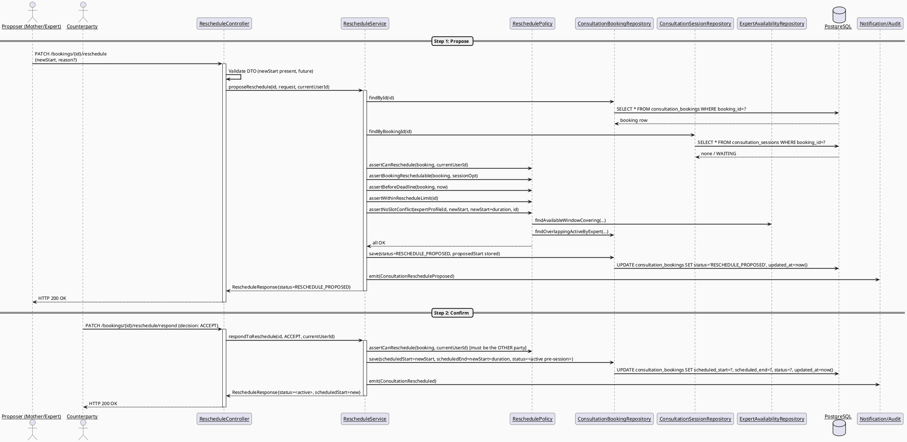
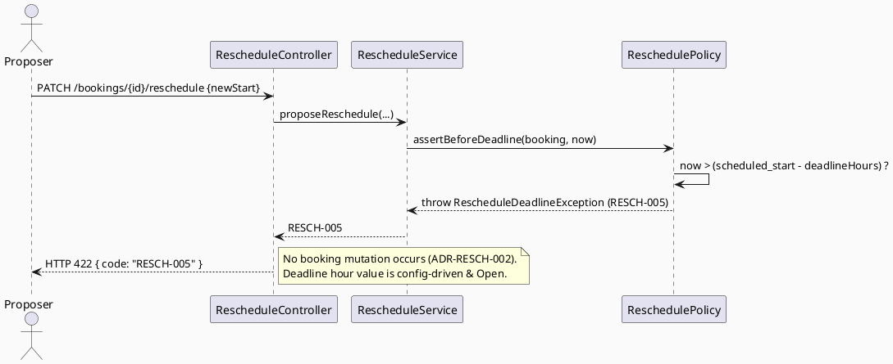
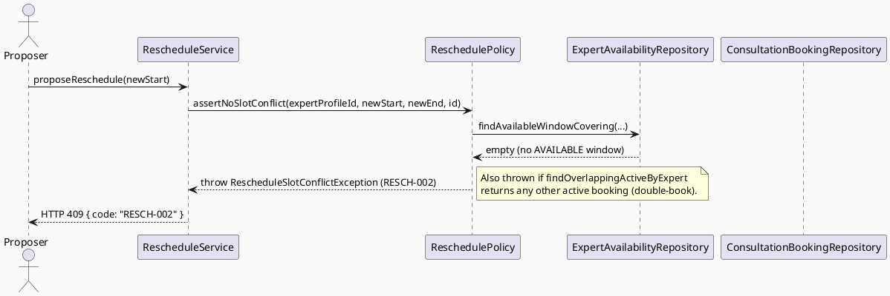
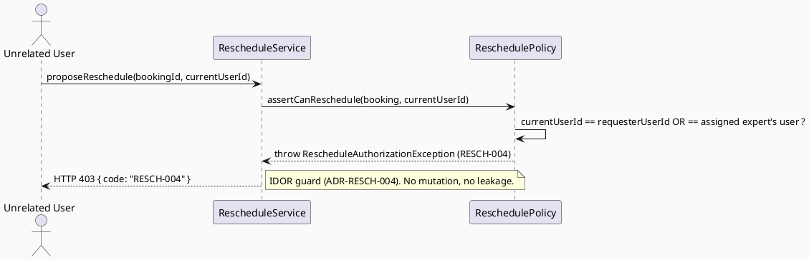
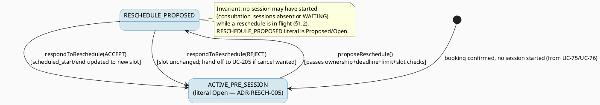

# ENGINEERING DOCUMENTATION STANDARD (EDS) v2.0
# UC-204 — Reschedule Consultation — Technical Design Specification

| Field | Value |
|-------|-------|
| **Document ID** | `CB-CONSULTATION-IMP-204` |
| **Version** | `1.0` |
| **Date** | `2026-07-03` |
| **Status** | `Draft` |
| **Document Owner** | `TV4-Lâm` |
| **Author** | `AI Agent (Technical Architect)` |
| **Reviewed by** | `[Tech Lead — Pending]` |
| **DPO Sign-off** | `[ ] Pending` *(booking scheduling touches consultation-context PII — see §1)* |
| **Approved by** | `[Principal Architect — Pending]` |
| **Last Review** | `2026-07-03` |
| **Based on EDS** | `v2.0` |

---

## CHANGELOG

> **Policy 4.4 — Immutable History:** Không bao giờ xóa thông tin cũ.

| Ngày | Người thực hiện | Nội dung thay đổi |
|------|-----------------|-------------------|
| 2026-07-03 | AI Agent — Technical Architect | Tạo tài liệu lần đầu (Draft) cho UC-204 Reschedule Consultation. Model against real split schema (`consultation_bookings` vs `consultation_sessions`); resolved schema-authority contradiction vs sibling UC75 draft (ADR-RESCH-006). |

---

## MỤC LỤC

1. [Tổng quan Module](#1-tổng-quan-module)
2. [Ma trận Truy vết (Traceability Matrix)](#2-ma-trận-truy-vết-traceability-matrix)
3. [Architecture Decision Records (ADR)](#3-architecture-decision-records-adr)
4. [Non-Functional Requirements & SLA](#4-non-functional-requirements--sla)
5. [Static Modeling (Mô hình Tĩnh)](#5-static-modeling-mô-hình-tĩnh)
6. [Dynamic Modeling (Mô hình Động)](#6-dynamic-modeling-mô-hình-động)
7. [Domain Event Catalog](#7-domain-event-catalog)
8. [Interface Specification (Đặc tả Giao diện)](#8-interface-specification-đặc-tả-giao-diện)
9. [API Specification](#9-api-specification)
10. [Bảng mã lỗi (Error Codes)](#10-bảng-mã-lỗi-error-codes)
11. [Quy trình Triển khai (Step-by-Step)](#11-quy-trình-triển-khai-step-by-step)
12. [Rollback & Incident Runbook](#12-rollback--incident-runbook)
13. [Kịch bản Kiểm thử Chi tiết](#13-kịch-bản-kiểm-thử-chi-tiết)
14. [Phương pháp Xác minh](#14-phương-pháp-xác-minh)
15. [Mẫu thử thực tế (API Verification Samples)](#15-mẫu-thử-thực-tế-api-verification-samples)
16. [Bảng tổng hợp phân quyền (Authorization Matrix)](#16-bảng-tổng-hợp-phân-quyền-authorization-matrix)
17. [AI Prompt Constraints (CASE 2.0)](#17-ai-prompt-constraints-case-20)

---

## 1. Tổng quan Module

| Field | Value |
|-------|-------|
| **Module Name** | `Consultation — Reschedule` |
| **Bounded Context** | `Consultation` (package `com.carebridge.backend.consultation`) |
| **Function ID / UC** | `SRS §3.3.14.3 Reschedule Consultation` / `UC-204` |
| **Primary Actor** | Mother (booking requester) **or** Verified Expert (assigned expert) — either party may propose |
| **Secondary Actor** | None (SRS Table 226 — "Secondary Actors: None"; no money moves on the free reschedule path — see ADR-RESCH-008) |
| **Platform** | Web (Expert Portal — CB-187) + Mobile (Mother CB-187, Expert CB-183) |
| **Priority** | Medium (SRS Table 226) |
| **Frequency of Use** | Regular (SRS Table 226) |
| **Data Classification** | `PII` (booking schedule + consultation-context linkage; no health-summary body mutated by this UC) |
| **Compliance Scope** | `PDPA (Luật 91/2025)`, internal `BR-RBAC`, `BR-CONSULTATION` |
| **Upstream Dependencies** | `Book Private Consultation (UC-75)` — creates the `consultation_bookings` row this UC mutates; `expert_availability` (slot source); `View Consultation Detail (UC-203)` (reschedule entry point on CB-060 detail screen) |
| **Downstream Consumers** | Notification service (both parties on propose/confirm/reject), `Cancel Consultation (UC-205)` (reject → cancel+refund path is UC-205's responsibility, out of scope here), `View Consultation List (UC-202)` / `Detail (UC-203)` (read updated `scheduled_start`/`scheduled_end`) |

**Mô tả:** Mother hoặc Verified Expert đề xuất một khung giờ mới (`scheduled_start`/`scheduled_end`) cho một booking chưa bắt đầu, trước hạn chót (deadline) cho phép và trong giới hạn số lần đổi lịch. Bên còn lại phải xác nhận đồng ý thì lịch mới có hiệu lực (two-step propose → confirm). UC này **chỉ mutate `consultation_bookings`** (`scheduled_start`, `scheduled_end`, có thể `availability_id`, và `status` để đánh dấu trạng thái chờ xác nhận) — **không** tạo/ghi `consultation_sessions`, **không** thực hiện giao dịch tiền (VNPay) trên luồng đổi lịch miễn phí.

### 1.1 Scope Statement — Mutates an existing booking row only

UC-204 does **not** create bookings, sessions, payments, or refunds. It performs
a guarded in-place update of an existing `consultation_bookings` row plus
publication of domain events. The backend package
`com.carebridge.backend.consultation` currently contains placeholder `.gitkeep`
files only; this TDS designs UC-204 against the **schema contract already applied
in `V1__init_schema.sql`** (verified line ranges cited throughout).

### 1.2 Boundary with the Session lifecycle (cross-cutting decision reused)

Reschedule is only valid **before a session exists**. Per the confirmed
cross-cutting decision for the UC203→UC210 batch, session lifecycle state is
owned by UC-95 `ADR-SESSION-001`; UC-204 treats the boundary as: **a booking is
reschedulable only while no `consultation_sessions` row exists for it (the
`consultation_sessions.booking_id` UNIQUE FK — `V1__init_schema.sql` L1527-1528
— means at most one session per booking), or a session row exists but
`session_status = 'WAITING'` and has not `started_at`.** Once `started_at` is
set / status is `IN_SESSION`/`COMPLETED`, reschedule is rejected (`RESCH-007`).

---

## 2. Ma trận Truy vết (Traceability Matrix)

> **Policy:** Không viết code nếu không biết code đó phục vụ Rule nào.

| Requirement ID | Loại (BR/ADR/US) | Mô tả yêu cầu | Thành phần Code | Compliance Target | ADR liên quan |
|----------------|------------------|---------------|-----------------|-------------------|---------------|
| UC-204 (SRS §3.3.14.3, Table 226) | Use Case | Propose and confirm a new time slot before the allowed deadline | `RescheduleController.PATCH /reschedule`, `RescheduleService.proposeReschedule()` | BR-CONSULTATION | ADR-RESCH-001 |
| BR-RBAC (SRS Table 226) | Business Rule | Users may access only functions allowed by role/permission scope | `ReschedulePolicy.assertCanReschedule()` | Authorization | ADR-RESCH-004 |
| BR-CONSULTATION (SRS Table 226) | Business Rule | Booking/payment/dispute/refund/pricing actions keep an auditable lifecycle state | `ConsultationBookingEntity.status` transitions, event emission | PDPA / BR-AUDIT | ADR-RESCH-001, ADR-RESCH-005 |
| UI oracle CB-187 (web) — "Cần sự xác nhận đồng ý từ khách hàng" | Design Rule | The counterparty must confirm the proposed new slot before it takes effect | `RescheduleService.respondToReschedule()` | BR-CONSULTATION | ADR-RESCH-001 |
| UI oracle CB-187 (web) — "Chỉ được đổi tối đa 1 lần miễn phí" | Design Rule | At most 1 free reschedule per booking | `ReschedulePolicy.assertWithinRescheduleLimit()` | BR-CONSULTATION | ADR-RESCH-003 |
| SRS description — "before the allowed deadline" | Business Rule | Reschedule not permitted after the deadline relative to `scheduled_start` | `ReschedulePolicy.assertBeforeDeadline()` | BR-CONSULTATION | ADR-RESCH-002 |
| SRS E2 (conflicting data rejected) | Exception Flow | New slot must not conflict with expert availability/other bookings | `ReschedulePolicy.assertNoSlotConflict()` | BR-CONSULTATION | ADR-RESCH-007 |
| Cross-cutting §1.2 (session boundary) | Constraint | Reschedule blocked once a session has started | `ReschedulePolicy.assertBookingReschedulable()` | BR-CONSULTATION | ADR-RESCH-004 |
| Schema: `consultation_bookings` (`V1__init_schema.sql` L876-896) | Schema Contract | `scheduled_start`/`scheduled_end`/`status`/`availability_id` persistence | `ConsultationBookingEntity` | — | ADR-RESCH-006 |
| Schema-authority contradiction vs UC75 draft `consultations` table | Resolved Conflict | Model against real split schema, not the invented unified table | Entities mirror `consultation_bookings`/`consultation_sessions` | — | ADR-RESCH-006 |

---

## 3. Architecture Decision Records (ADR)

### ADR-RESCH-001 — Reschedule is a two-step propose → confirm workflow (counterparty must accept)

| Field | Value |
|-------|-------|
| **Status** | `Accepted` *(backed by UI oracle + SRS description wording)* |
| **Deciders** | `AI Agent — derived from SRS §3.3.14.3 + CB-187 web mockup oracle` |
| **Date** | `2026-07-03` |

#### Bối cảnh (Context)
SRS §3.3.14.3 description states the actor **"Proposes and confirms a new time
slot before the allowed deadline."** The web mockup **CB-187 (Expert Portal)**
policy panel states explicitly: **"Cần sự xác nhận đồng ý từ khách hàng"** (the
customer's agreement/confirmation is required) and **"Nếu khách hàng từ chối,
lịch cũ sẽ bị hủy và hoàn tiền"** (if the customer refuses, the old booking is
cancelled and refunded). This is authoritative design evidence that reschedule
is **not unilateral**: the proposing party suggests a slot, and the counterparty
must accept before `scheduled_start`/`scheduled_end` become the new effective
time.

#### Các phương án đã xem xét (Options Considered)

| Phương án | Mô tả | Ưu điểm | Nhược điểm |
|-----------|-------|----------|------------|
| A | Unilateral reschedule — proposer changes the slot immediately, counterparty just notified | Simplest UX | Contradicts CB-187 "Cần sự xác nhận đồng ý từ khách hàng" and SRS "Proposes and confirms"; one party could unilaterally move the other's calendar |
| B | **Two-step: proposer creates a pending proposal; counterparty accepts (new slot applied) or rejects (proposal void; old slot kept; rejection may hand off to UC-205 cancel+refund)** | Matches SRS + UI oracle; consent-preserving; auditable | Adds a proposal/response state; needs a status marker on the booking |
| C | Two-step but auto-accept after a timeout | Fewer stalled proposals | Timeout value not in any source — would be invented; rejected |

#### Quyết định (Decision)
Chọn **Phương án B**. Reschedule is modeled as `proposeReschedule()` (creates a
pending proposal, booking enters a reschedule-pending state) followed by
`respondToReschedule(accept|reject)` by the counterparty. On **accept**, the
booking's `scheduled_start`/`scheduled_end` (and `availability_id` if a
distinct slot is chosen) are updated and status returns to the active
pre-session state. On **reject**, the proposal is voided and the booking keeps
its original slot; the cancel-and-refund handoff described by CB-187 is
delegated to **UC-205 Cancel Consultation** (explicitly out of scope here).

#### Hệ quả (Consequences)
**Tích cực:** Preserves both parties' consent over their calendars; matches the
approved UI; produces an auditable propose/accept/reject trail (BR-CONSULTATION).
**Tiêu cực / Trade-offs:** Requires a reschedule-pending status marker on the
booking whose exact enum literal is **Open** (see ADR-RESCH-005). A proposal
with no response can stall — a reminder/expiry mechanism is a follow-up, not
designed here.
**Compliance Impact:** Supports consent-preserving scheduling; no PII exposure change.

---

### ADR-RESCH-002 — Reschedule deadline is enforced, but the exact threshold value is `Open`

| Field | Value |
|-------|-------|
| **Status** | `Proposed` *(the deadline check is mandated; the numeric threshold is not stated in any authoritative source)* |
| **Deciders** | `AI Agent (proposal only) — pending Product/Tech Lead sign-off` |
| **Date** | `2026-07-03` |

#### Bối cảnh (Context)
SRS §3.3.14.3 requires the new slot be confirmed **"before the allowed
deadline."** Neither the SRS boilerplate, the UI mockups (CB-187/CB-183), nor
`V1__init_schema.sql` state the deadline **value** (e.g., "N hours before
`scheduled_start`"). Inventing a specific number would violate the "never invent
requirements/SLAs" rule.

#### Các phương án đã xem xét (Options Considered)

| Phương án | Mô tả | Ưu điểm | Nhược điểm |
|-----------|-------|----------|------------|
| A | No deadline enforcement | Simple | Directly contradicts SRS "before the allowed deadline" |
| B | **Enforce a deadline check with a configurable threshold `reschedule.deadline-hours`; leave the concrete value `Open` (config-driven, default proposed as a placeholder pending sign-off)** | Honors SRS; value externalized so Product can set it without a code change | Tests must treat the boundary as a parameter, not a hard-coded literal, until confirmed |
| C | Reuse `cancellation_policy_snapshot` text on the booking as the deadline source | Data already snapshotted at booking time | That column is free `text` with no parsed deadline field; parsing an unspecified format is speculative — rejected |

#### Quyết định (Decision)
Chọn **Phương án B**. `ReschedulePolicy.assertBeforeDeadline(booking, now)`
rejects (`RESCH-005`) when `now` is later than
`scheduled_start − rescheduleDeadline`. The threshold is injected from
configuration key `carebridge.consultation.reschedule.deadline-hours`. **The
concrete hour value is `Open` — MUST be confirmed by Product before
implementation.** Tests parameterize the boundary (see Test-Spec) and do not
assert a specific invented number.

#### Hệ quả (Consequences)
**Tích cực:** SRS deadline rule is honored without fabricating a value.
**Tiêu cực / Trade-offs:** Until the value is signed off, the boundary test is
data-driven, not a fixed assertion.
**Compliance Impact:** None material.

---

### ADR-RESCH-003 — At most one free reschedule per booking; reschedule-count source is an `Open` schema gap

| Field | Value |
|-------|-------|
| **Status** | `Proposed` *(count limit is a UI oracle; the persistence mechanism to count is a genuine schema gap)* |
| **Deciders** | `AI Agent (proposal only) — pending Product/Tech Lead sign-off` |
| **Date** | `2026-07-03` |

#### Bối cảnh (Context)
CB-187 (web) policy panel states **"Chỉ được đổi tối đa 1 lần miễn phí"** (only
1 free reschedule allowed). However, `consultation_bookings`
(`V1__init_schema.sql` L876-896) has **no `reschedule_count` column** and there
is no other authoritative counter. Enforcing "max 1" therefore requires either
deriving the count from an audit/event trail or adding a column.

#### Các phương án đã xem xét (Options Considered)

| Phương án | Mô tả | Ưu điểm | Nhược điểm |
|-----------|-------|----------|------------|
| A | Add `reschedule_count SMALLINT NOT NULL DEFAULT 0` to `consultation_bookings` via a new Flyway migration | Simple, atomic increment guard | Schema change to an existing table for a Sprint feature; needs migration approval; column absent from current baseline |
| B | **Derive the count from a durable reschedule-history source (audit log / `ConsultationRescheduled` events) and enforce app-side** | No schema change; keeps immutable history | Requires the audit/event store to be queryable and reliable before the limit can be trusted |
| C | Do not enforce the limit for MVP; log a warning only | Fastest | Contradicts an explicit approved-UI policy line |

#### Quyết định (Decision)
**Deferred / `Open`.** The "max 1" rule is real (UI oracle), but the counting
mechanism is unresolved and MUST be signed off before implementation. The TDS
records both viable mechanisms (A: new column; B: event/audit-derived).
`ReschedulePolicy.assertWithinRescheduleLimit(bookingId)` is specified as the
enforcement seam; its data source is bound at implementation time once the
mechanism is chosen. **No migration is created in this TDS** (Option A's
migration is proposed only — see §5.3). Marked `Open` in the Consistency Gate.

#### Hệ quả (Consequences)
**Tích cực:** The enforcement point is defined now; the storage decision is
isolated behind one policy method.
**Tiêu cực / Trade-offs:** Until resolved, the limit cannot be reliably enforced;
the limit test is written against the chosen seam and skipped/pending until the
mechanism is confirmed.
**Compliance Impact:** None material.

---

### ADR-RESCH-004 — Authorization + reschedulable-state precondition

| Field | Value |
|-------|-------|
| **Status** | `Accepted` |
| **Deciders** | `AI Agent — derived from schema FKs + BR-RBAC + cross-cutting session boundary` |
| **Date** | `2026-07-03` |

#### Bối cảnh (Context)
`consultation_bookings.requester_user_id` (FK → `users`, L1823-1824) identifies
the Mother; `consultation_bookings.expert_profile_id` (FK → `expert_profiles`,
L1826-1827) identifies the expert. BR-RBAC requires scoped access. The session
boundary (§1.2) requires that reschedule be blocked once a session has started.

#### Các phương án đã xem xét (Options Considered)

| Phương án | Mô tả | Ưu điểm | Nhược điểm |
|-----------|-------|----------|------------|
| A | Any authenticated user can reschedule any booking | Simple | IDOR; violates BR-RBAC |
| B | **Only the booking's `requester_user_id` (Mother) or the assigned expert (resolved via `expert_profile_id → expert_profiles.account_id/user`) may reschedule, and only while the booking is in a reschedulable pre-session state** | Matches schema FK semantics; consent-preserving; blocks post-session edits | Requires a policy check + a session-existence lookup per request |

#### Quyết định (Decision)
Chọn **Phương án B**. `ReschedulePolicy.assertCanReschedule(booking, currentUserId)`
verifies the caller is the booking's requester **or** the assigned expert
(non-participants → `RESCH-004` / 403). `ReschedulePolicy.assertBookingReschedulable(booking)`
verifies the booking is in an active pre-session state and has **no started
session** (`consultation_sessions` row absent, or present with
`session_status='WAITING'` and null `started_at`) and is not `CANCELLED`/
`COMPLETED`/`NO_SHOW` → else `RESCH-007` / 409.

#### Hệ quả (Consequences)
**Tích cực:** Prevents cross-account reschedule (IDOR) and unsafe post-session edits.
**Tiêu cực / Trade-offs:** One extra session-existence read per request (negligible).
**Compliance Impact:** Satisfies BR-RBAC; minimum-necessary access.

---

### ADR-RESCH-005 — Reschedule-pending booking status literal is application-level and currently `Open`

| Field | Value |
|-------|-------|
| **Status** | `Proposed` *(the enum literal is an AI proposal; booking status values beyond the schema default `PENDING_PAYMENT` are unconfirmed in any authoritative source)* |
| **Deciders** | `AI Agent (proposal only)` |
| **Date** | `2026-07-03` |

#### Bối cảnh (Context)
`consultation_bookings.status` is `varchar(30) NOT NULL DEFAULT 'PENDING_PAYMENT'`
(`V1__init_schema.sql` L893) with **no DB CHECK constraint** — consistent with
the codebase's deliberate application-level-enum pattern (same posture as UC78
`ADR-DISPUTE-004`). The two-step reschedule (ADR-RESCH-001) needs a marker for
"a reschedule has been proposed and is awaiting the counterparty's response."
No authoritative source enumerates the full booking status set beyond the
default `PENDING_PAYMENT`.

#### Các phương án đã xem xét (Options Considered)

| Phương án | Mô tả | Ưu điểm | Nhược điểm |
|-----------|-------|----------|------------|
| A | Add a DB CHECK constraint enumerating all booking statuses | Strong DB guarantee | Breaks the established no-CHECK pattern on consultation tables; needs migration; enum set is unknown |
| B | **Application-level status literal (proposed `RESCHEDULE_PROPOSED`), no schema change; `status` stays free `varchar(30)`** | Matches existing pattern; no migration; extensible | App-layer enforcement only; the literal name needs sign-off |
| C | Store proposal state in a side table instead of on `status` | Keeps `status` untouched | New table for one flag — over-engineered for MVP |

#### Quyết định (Decision)
Chọn **Phương án B** with a **`Proposed`** literal `RESCHEDULE_PROPOSED`
(app-level). On accept, status returns to the prior active pre-session literal;
on reject, it reverts to the pre-proposal literal. **Because the authoritative
booking status enum is undocumented, the exact set of literals
(`RESCHEDULE_PROPOSED` and the "active pre-session" literal it returns to) is
marked `Open` and MUST be reconciled with the booking-lifecycle owner (UC-75)
before implementation.** This TDS proposes the literal as a Draft decision
needing sign-off — it does **not** invent a full booking status enum.

#### Hệ quả (Consequences)
**Tích cực:** No schema change; consistent with codebase pattern.
**Tiêu cực / Trade-offs:** The literal is unconfirmed; a mismatch with UC-75's
eventual enum requires a TDS revision.
**Compliance Impact:** None material.

---

### ADR-RESCH-006 — Schema-authority resolution: model against the REAL split schema, not the UC75 draft's unified `consultations` table

| Field | Value |
|-------|-------|
| **Status** | `Accepted` |
| **Deciders** | `AI Agent — per CareBridge rule "current code and migrations override historical design notes"` |
| **Date** | `2026-07-03` |

#### Bối cảnh (Context)
The sibling **Draft** TDS `UC75_BookPrivateConsultation` models a **unified**
`consultations` table with a single `consultation_status` enum
(`PENDING_PAYMENT → CONFIRMED → IN_SESSION → COMPLETED`, alt
`CANCELLED/NO_SHOW/DISPUTED`). The **applied** schema
`V1__init_schema.sql` instead **splits** the domain into two tables:
`consultation_bookings` (with its own `status varchar(30) DEFAULT 'PENDING_PAYMENT'`,
L876-896) and `consultation_sessions` (with a separate `session_status
varchar(30) DEFAULT 'WAITING'`, L898-909, `booking_id` UNIQUE FK). These are
contradictory models for the same domain.

#### Các phương án đã xem xét (Options Considered)

| Phương án | Mô tả | Ưu điểm | Nhược điểm |
|-----------|-------|----------|------------|
| A | Follow UC75 draft's unified `consultations`/`consultation_status` model | Consistent with the sibling draft narrative | Contradicts the applied schema; UC75 is an **unapproved** Draft; would design against a table that does not exist |
| B | **Follow the applied `V1__init_schema.sql` split model (`consultation_bookings` + `consultation_sessions`)** | Matches the real migration; aligns with CareBridge rule "current code and migrations override historical design notes" and standard DB-conflict priority (applied schema > unapproved draft) | Requires explicitly deviating from the sibling draft (documented here) |

#### Quyết định (Decision)
Chọn **Phương án B**. UC-204 mutates **only** `consultation_bookings.scheduled_start`,
`.scheduled_end`, optionally `.availability_id`, and `.status`. It does **NOT**
reference a unified `consultations` table or a `consultation_status` enum. The
session boundary is read from `consultation_sessions` (separate table/column).
**Winning source: `V1__init_schema.sql` L876-909 (booking/session split).** The
UC75 draft's unified model is treated as superseded historical design for the
purpose of this feature.

#### Hệ quả (Consequences)
**Tích cực:** Code will compile against the real schema; no phantom table.
**Tiêu cực / Trade-offs:** Divergence from the UC75 draft must be reconciled when
UC-75 is revised; flagged as a cross-doc consistency item.
**Compliance Impact:** None.

---

### ADR-RESCH-007 — New-slot conflict validation against expert availability and other bookings

| Field | Value |
|-------|-------|
| **Status** | `Accepted` |
| **Deciders** | `AI Agent — derived from SRS E2 + expert_availability/booking schema` |
| **Date** | `2026-07-03` |

#### Bối cảnh (Context)
SRS Exception E2 requires "Invalid, missing, expired, or conflicting data is
rejected." A new slot must not (a) fall outside an `AVAILABLE`
`expert_availability` window for the expert (`V1__init_schema.sql` L817-826,
`status DEFAULT 'AVAILABLE'`), nor (b) overlap another active
`consultation_bookings` row for the same `expert_profile_id`
(index `idx_consultation_bookings_scheduled_start` L1639 supports the range read).

#### Các phương án đã xem xét (Options Considered)

| Phương án | Mô tả | Ưu điểm | Nhược điểm |
|-----------|-------|----------|------------|
| A | Trust client-selected slot without server validation | Simple | Allows double-booking / unavailable slots — violates E2 |
| B | **Server validates: new `[scheduled_start, scheduled_end)` fits an `AVAILABLE` expert_availability window and does not overlap the expert's other active bookings** | Prevents conflicts; matches schema | Requires two range queries per proposal |

#### Quyết định (Decision)
Chọn **Phương án B**. `ReschedulePolicy.assertNoSlotConflict(expertProfileId,
newStart, newEnd, excludingBookingId)` rejects with `RESCH-002` (409) when the
requested window is not covered by an `AVAILABLE` availability window or
overlaps another active booking of the same expert (excluding the booking being
rescheduled). New `scheduled_end` is derived as `newStart + duration_minutes`
using the booking's existing `duration_minutes` (never client-supplied) to keep
duration immutable across reschedule.

#### Hệ quả (Consequences)
**Tích cực:** No double-booking; respects expert availability.
**Tiêu cực / Trade-offs:** Two range reads per proposal (indexed, cheap).
**Compliance Impact:** None material.

---

### ADR-RESCH-008 — The free-reschedule path performs NO money movement (no VNPay call)

| Field | Value |
|-------|-------|
| **Status** | `Accepted` |
| **Deciders** | `AI Agent — derived from UI oracle "1 lần miễn phí" + cross-cutting decision #2` |
| **Date** | `2026-07-03` |

#### Bối cảnh (Context)
Cross-cutting decision #2 for the batch routes any VNPay refund through UC-78's
`VnPayGatewayClient`, but notes it is likely NOT relevant to plain reschedule.
CB-187 confirms the first reschedule is **free** ("1 lần miễn phí"). The only
money-movement branch (`"Nếu khách hàng từ chối… hoàn tiền"` — reject → refund)
is a **cancellation** outcome owned by **UC-205**, not by the reschedule action
itself.

#### Quyết định (Decision)
Chọn: UC-204 makes **no** payment/refund calls. `price_snapshot_amount`,
`commission_rate_snapshot`, `price_locked_at`, and `expert_price_id` on the
booking are **not modified** by reschedule (the price is locked at booking
time). If a future "reschedule fee" business rule emerges (none found in any
source — **Open**), it would route through UC-78's `VnPayGatewayClient`; that is
out of scope here.

#### Hệ quả (Consequences)
**Tích cực:** Keeps UC-204 free of financial side effects; simpler, safer.
**Tiêu cực / Trade-offs:** Reject → refund handoff must be wired to UC-205 (follow-up).
**Compliance Impact:** No financial-safety surface added by this UC.

---

## 4. Non-Functional Requirements & SLA

> No SRS/BR source specifies numeric SLA targets for UC-204. Values below are
> **Open — proposed defaults** consistent with the template baseline and the
> sibling UC-202/UC-78 TDS; must be confirmed by Tech Lead before binding.

### 4.1. Performance & Availability

| Category | Requirement | Target SLA | Measurement Method | Compliance Basis |
|----------|-------------|------------|---------------------|------------------|
| Latency | `PATCH …/reschedule` p99 (propose; includes 2 range reads) | `< 400ms` *(Open — proposed)* | API test timing | — |
| Latency | `PATCH …/reschedule/respond` p99 | `< 300ms` *(Open — proposed)* | API test timing | — |
| Availability | Uptime (monthly) | `99.9%` *(Open — proposed)* | Uptime monitor | — |

### 4.2. Data Integrity & Retention

| Category | Requirement | Target | Verification Method | Compliance Basis |
|----------|-------------|--------|---------------------|------------------|
| Durability | No lost reschedule update | RPO = 0 (single-row transactional UPDATE) | Transaction log | BR-CONSULTATION |
| Atomicity | Slot-conflict check + status transition + slot write in one transaction | 100% | Integration test (Testcontainers) | BR-CONSULTATION |
| Auditability | Every propose/accept/reject emits a domain event | 100% | Event/audit inspection (§14) | BR-CONSULTATION |

### 4.3. Security

| Category | Requirement | Target | Verification Method | Compliance Basis |
|----------|-------------|--------|---------------------|------------------|
| Access control | Participant-scoped (requester or assigned expert only) | Least privilege (§16) | Auth Matrix + 403 test | BR-RBAC |
| Transport | All endpoints over TLS | TLS 1.2+ (platform default) | Infra config | — |
| No entity leakage | Responses are DTOs, never JPA entities | 100% | Code review / mapper test | `CLAUDE.md` Delivery Rules |

### 4.4. Scalability & Capacity Planning

SRS marks UC-204 "Frequency of Use: Regular" — moderate volume, well below
booking-creation volume. The two range reads per proposal are backed by
`idx_consultation_bookings_scheduled_start` (L1639),
`idx_consultation_bookings_expert_profile_id` (L1637), and
`idx_expert_availability_start_at` (L1635). No special scaling design needed
beyond standard Spring Boot request handling.

---

## 5. Static Modeling (Mô hình Tĩnh)

### 5.1. Component Responsibilities & Planned File Paths

| Layer | File Path | Responsibility |
|-------|-----------|----------------|
| Controller | `src/main/java/com/carebridge/backend/consultation/controller/RescheduleController.java` | HTTP mapping, DTO validation only |
| Service | `src/main/java/com/carebridge/backend/consultation/service/RescheduleService.java` | Propose/respond workflow, policy delegation, event emission, transaction boundary |
| Repository | `src/main/java/com/carebridge/backend/consultation/repository/ConsultationBookingRepository.java` | `consultation_bookings` read + guarded status/slot UPDATE (shared contract with UC-75; interface owned by booking module) |
| Repository | `src/main/java/com/carebridge/backend/consultation/repository/ConsultationSessionRepository.java` | Read-only existence/status check for the session boundary (§1.2) |
| Repository | `src/main/java/com/carebridge/backend/consultation/repository/ExpertAvailabilityRepository.java` | Availability-window lookup for slot-conflict check |
| Entity | `src/main/java/com/carebridge/backend/consultation/entity/ConsultationBookingEntity.java` | JPA mapping for `consultation_bookings` |
| Entity | `src/main/java/com/carebridge/backend/consultation/entity/ConsultationSessionEntity.java` | JPA mapping for `consultation_sessions` (read-only in this UC) |
| Entity | `src/main/java/com/carebridge/backend/consultation/entity/ExpertAvailabilityEntity.java` | JPA mapping for `expert_availability` (read-only in this UC) |
| DTO | `src/main/java/com/carebridge/backend/consultation/dto/request/ProposeRescheduleRequest.java` | Inbound: new slot + optional reason |
| DTO | `src/main/java/com/carebridge/backend/consultation/dto/request/RescheduleResponseRequest.java` | Inbound: accept/reject decision |
| DTO | `src/main/java/com/carebridge/backend/consultation/dto/response/RescheduleResponse.java` | Outbound: booking id, from/to slots, status |
| Mapper | `src/main/java/com/carebridge/backend/consultation/mapper/RescheduleMapper.java` | Entity ↔ DTO, never expose entity |
| Policy | `src/main/java/com/carebridge/backend/consultation/policy/ReschedulePolicy.java` | Ownership (ADR-RESCH-004), deadline (ADR-RESCH-002), limit (ADR-RESCH-003), state (ADR-RESCH-004), slot-conflict (ADR-RESCH-007) |
| Web | `05_Development/CareBridgeWebApp/src/features/consultation/RescheduleConsultation.tsx` | Expert Portal reschedule UI (CB-187) |
| Mobile Model | `05_Development/CareBridgeMobileApp/lib/features/consultation/models/reschedule.dart` | Reschedule DTO mirror |
| Mobile Screen | `05_Development/CareBridgeMobileApp/lib/features/consultation/screens/reschedule_consultation_screen.dart` | Mother/Expert reschedule UI (CB-187/CB-183) |

### 5.2. Class Diagram (PlantUML)

```plantuml
@startuml UC204_Reschedule_ClassDiagram
skinparam classAttributeIconSize 0
skinparam classFontStyle bold
skinparam backgroundColor #FAFAFA
skinparam ArrowColor #555555
skinparam ClassBorderColor #2E75B6
skinparam ClassHeaderBackgroundColor #D5E8F0

' === ENTITIES (mirror V1__init_schema.sql — split model, ADR-RESCH-006) ===
class ConsultationBookingEntity {
  + bookingId: UUID
  + requesterUserId: UUID
  + expertProfileId: UUID
  + availabilityId: UUID
  + expertPriceId: UUID
  + topic: String
  + channelType: String
  + durationMinutes: short
  + scheduledStart: Instant
  + scheduledEnd: Instant
  + priceSnapshotAmount: BigDecimal
  + cancellationPolicySnapshot: String
  + status: String
  + createdAt: Instant
  + updatedAt: Instant
  ' UC-204 mutates ONLY: scheduledStart, scheduledEnd, availabilityId, status
}

class ConsultationSessionEntity {
  + sessionId: UUID
  + bookingId: UUID
  + startedAt: Instant
  + sessionStatus: String
  ' read-only in UC-204 — session boundary (§1.2)
}

class ExpertAvailabilityEntity {
  + availabilityId: UUID
  + expertProfileId: UUID
  + startAt: Instant
  + endAt: Instant
  + channelType: String
  + status: String
  ' read-only in UC-204 — slot-conflict source (ADR-RESCH-007)
}

' === VALUE OBJECTS (application-level, no DB CHECK) ===
enum RescheduleDecision <<ValueObject>> {
  ACCEPT
  REJECT
}

note top of RescheduleDecision
  Booking status literal RESCHEDULE_PROPOSED
  is Proposed/Open (ADR-RESCH-005) — not a
  confirmed enum; booking status set is
  undocumented beyond default PENDING_PAYMENT.
end note

' === SERVICE ===
interface IRescheduleService <<interface>> {
  + proposeReschedule(bookingId: UUID, request: ProposeRescheduleRequest, currentUserId: UUID): RescheduleResponse
  + respondToReschedule(bookingId: UUID, request: RescheduleResponseRequest, currentUserId: UUID): RescheduleResponse
}

class RescheduleService implements IRescheduleService {
  - bookingRepository: ConsultationBookingRepository
  - sessionRepository: ConsultationSessionRepository
  - availabilityRepository: ExpertAvailabilityRepository
  - reschedulePolicy: ReschedulePolicy
  - eventPublisher: ApplicationEventPublisher
}

' === POLICY ===
class ReschedulePolicy {
  + assertCanReschedule(booking, currentUserId): void
  + assertBookingReschedulable(booking, sessionOpt): void
  + assertBeforeDeadline(booking, now): void
  + assertWithinRescheduleLimit(bookingId): void
  + assertNoSlotConflict(expertProfileId, newStart, newEnd, excludingBookingId): void
}

' === REPOSITORIES ===
interface ConsultationBookingRepository <<interface>> {
  + findById(id: UUID): Optional<ConsultationBookingEntity>
  + save(entity: ConsultationBookingEntity): ConsultationBookingEntity
  + findOverlappingActiveByExpert(expertProfileId: UUID, start: Instant, end: Instant, excludingBookingId: UUID): List<ConsultationBookingEntity>
}

interface ConsultationSessionRepository <<interface>> {
  + findByBookingId(bookingId: UUID): Optional<ConsultationSessionEntity>
}

interface ExpertAvailabilityRepository <<interface>> {
  + findAvailableWindowCovering(expertProfileId: UUID, start: Instant, end: Instant, channelType: String): Optional<ExpertAvailabilityEntity>
}

' === RELATIONSHIPS ===
RescheduleService --> ConsultationBookingRepository : uses
RescheduleService --> ConsultationSessionRepository : reads (session boundary)
RescheduleService --> ExpertAvailabilityRepository : reads (slot check)
RescheduleService --> ReschedulePolicy : uses
ConsultationBookingEntity "1" -- "0..1" ConsultationSessionEntity : booking_id UNIQUE FK

@enduml
```



### 5.3. Data Structure — Schema/Migration Details

> **CareBridge rule:** `V1__init_schema.sql` and approved Flyway migrations are
> the primary source of truth. ERD is supporting context only.

**No new migration is required for the core reschedule flow.** UC-204 reuses
existing columns on `consultation_bookings` (`V1__init_schema.sql` L876-896):

```sql
-- consultation_bookings (V1__init_schema.sql L876-896) — RELEVANT COLUMNS ONLY
-- (UC-204 mutates scheduled_start, scheduled_end, availability_id, status)
--   availability_id   uuid                              -- FK -> expert_availability (L1829-1830)
--   duration_minutes  smallint     NOT NULL             -- used to derive new scheduled_end (immutable duration)
--   scheduled_start   timestamptz  NOT NULL             -- MUTATED on accept
--   scheduled_end     timestamptz  NOT NULL             -- MUTATED on accept (= new start + duration_minutes)
--   status            varchar(30)  NOT NULL DEFAULT 'PENDING_PAYMENT'  -- MUTATED (RESCHEDULE_PROPOSED — Proposed/Open, ADR-RESCH-005)
-- PK: booking_id (L1422-1423)
-- Index used: idx_consultation_bookings_scheduled_start (L1639),
--             idx_consultation_bookings_expert_profile_id (L1637),
--             idx_consultation_bookings_status (L1638)

-- consultation_sessions (V1__init_schema.sql L898-909) — READ ONLY in UC-204
-- consultation_sessions_booking_id_key UNIQUE (booking_id) (L1527-1528) => <=1 session per booking

-- expert_availability (V1__init_schema.sql L817-826) — READ ONLY in UC-204
--   start_at / end_at / status DEFAULT 'AVAILABLE' — slot-conflict source (ADR-RESCH-007)
```

**Genuine gap identified (Open — flag for sign-off, NOT resolved in this TDS):**
`consultation_bookings` has **no `reschedule_count` column** to enforce the
UI-mandated "max 1 free reschedule" (ADR-RESCH-003). Two resolutions exist; the
choice is `Open`:

```sql
-- PROPOSED (Open — NOT created by this TDS; requires Tech Lead approval).
-- Only needed IF ADR-RESCH-003 Option A (column-based counting) is chosen.
-- Migration file (IF approved): V{n}__add_booking_reschedule_count.sql
-- ALTER TABLE public.consultation_bookings
--   ADD COLUMN reschedule_count smallint NOT NULL DEFAULT 0;
-- (Option B — derive from audit/event trail — needs no migration.)
```

**No CHECK constraint is added** for the `RESCHEDULE_PROPOSED` status literal —
consistent with the codebase's established no-CHECK, app-level-enum pattern on
consultation-domain tables (ADR-RESCH-005). **No sync action needed for
`V1__init_schema.sql`** since no migration is created in this TDS iteration.

---

## 6. Dynamic Modeling (Mô hình Động)

### 6.1. Sequence Diagram — Happy Path: Propose then Confirm



### 6.2. Sequence Diagram — Error Path: Deadline Exceeded



### 6.3. Sequence Diagram — Error Path: Slot Conflict



### 6.4. Sequence Diagram — Error Path: Ownership Denied



### 6.5. State Machine — Booking status across reschedule (bắt buộc)



**⚠️ Invariant bất biến:**
1. `scheduled_end` is ALWAYS recomputed as `newStart + duration_minutes`; `duration_minutes` is NEVER changed by reschedule (ADR-RESCH-007).
2. `scheduled_start`/`scheduled_end` are applied ONLY on `respondToReschedule(ACCEPT)` — a proposal alone never changes the effective slot (ADR-RESCH-001).
3. Reschedule is rejected once a session has started (`consultation_sessions.started_at` set / not `WAITING`) — §1.2 boundary (`RESCH-007`).
4. Price/commission snapshot columns are NEVER modified by reschedule (ADR-RESCH-008).

---

## 7. Domain Event Catalog

> Naming convention `[Entity][PastTenseVerb]`, matching UC-78 (`DisputeSubmitted`,
> `DisputeResolved`) and the UC-75/UC-96 catalog style.

### 7.1. Events Published (Phát ra)

| Event Name | Trigger | Publisher | Subscriber(s) | Payload Schema | Async? |
|------------|---------|-----------|---------------|----------------|--------|
| `ConsultationRescheduleProposed` | A valid reschedule proposal is created (booking → `RESCHEDULE_PROPOSED`) | `RescheduleService` | Notification service (alert counterparty), Audit log | `ConsultationRescheduleProposed.java` | Yes |
| `ConsultationRescheduled` | Counterparty accepts; `scheduled_start`/`scheduled_end` updated | `RescheduleService` | Notification service (both parties), Audit log, calendar/read-model refresh (UC-202/203) | `ConsultationRescheduled.java` | Yes |
| `ConsultationRescheduleRejected` | Counterparty rejects the proposal | `RescheduleService` | Notification service, Audit log, `Cancel Consultation (UC-205)` (may initiate cancel+refund per CB-187 — out of scope consumer) | `ConsultationRescheduleRejected.java` | Yes |

### 7.2. Events Consumed (Tiêu thụ)

| Event Name | Source | Handler | Action thực hiện |
|------------|--------|---------|------------------|
| — | — | — | UC-204 consumes no domain events; it is triggered by synchronous API calls only. |

### 7.3. Payload Schema

```java
// ConsultationRescheduleProposed.java
public record ConsultationRescheduleProposed(
    UUID    eventId,
    String  eventType,        // "ConsultationRescheduleProposed"
    Instant occurredAt,
    String  version,          // "1.0"
    Payload payload,
    Metadata metadata
) implements ApplicationEvent {
    public record Payload(
        UUID    bookingId,
        UUID    proposedBy,        // requesterUserId or expert's user id
        Instant previousStart,
        Instant proposedStart,
        Instant proposedEnd,       // proposedStart + duration_minutes
        String  reason             // optional (CB-183/CB-187 "Không bắt buộc")
    ) {}
    public record Metadata(UUID correlationId, String causedBy) {}
}

// ConsultationRescheduled.java
public record ConsultationRescheduled(
    UUID    eventId,
    String  eventType,        // "ConsultationRescheduled"
    Instant occurredAt,
    String  version,
    Payload payload,
    Metadata metadata
) implements ApplicationEvent {
    public record Payload(
        UUID    bookingId,
        UUID    confirmedBy,       // the counterparty who accepted
        Instant previousStart,
        Instant newStart,
        Instant newEnd
    ) {}
    public record Metadata(UUID correlationId, String causedBy) {}
}

// ConsultationRescheduleRejected.java
public record ConsultationRescheduleRejected(
    UUID    eventId,
    String  eventType,        // "ConsultationRescheduleRejected"
    Instant occurredAt,
    String  version,
    Payload payload,
    Metadata metadata
) implements ApplicationEvent {
    public record Payload(
        UUID    bookingId,
        UUID    rejectedBy,
        Instant proposedStart,     // the slot that was declined
        String  reason             // optional
    ) {}
    public record Metadata(UUID correlationId, String causedBy) {}
}
```

---

## 8. Interface Specification (Đặc tả Giao diện)

> **Policy (EDS v2.0):** Mỗi interface khai báo `@version`. Breaking change → ADR mới.

### 8.1. Service Interface

```java
// ProposeRescheduleRequest.java — Input DTO
// @version 1.0
public class ProposeRescheduleRequest {
    @NotNull
    @Future                              // new start must be in the future
    private Instant newStart;            // duration is derived from booking.durationMinutes (NEVER client-supplied)

    private UUID availabilityId;         // optional — the expert_availability window chosen (validated in policy)

    @Size(max = 500)
    private String reason;               // optional — CB-183/CB-187 "Lý do đổi lịch (Không bắt buộc)"
    // getters / setters / @Valid
}

// RescheduleResponseRequest.java — Input DTO
// @version 1.0
public class RescheduleResponseRequest {
    @NotNull
    private RescheduleDecision decision; // ACCEPT | REJECT

    @Size(max = 500)
    private String reason;               // optional (mainly for REJECT)
    // getters / setters
}

// RescheduleResponse.java — Output DTO
public class RescheduleResponse {
    private UUID bookingId;
    private Instant previousStart;
    private Instant scheduledStart;      // effective start (unchanged until ACCEPT)
    private Instant scheduledEnd;
    private String status;               // RESCHEDULE_PROPOSED | <active pre-session literal> (Open — ADR-RESCH-005)
    private Instant updatedAt;
    // getters / setters — NEVER expose the JPA entity
}

// IRescheduleService.java — Service Contract
// @version 1.0
public interface IRescheduleService {
    /**
     * Creates a reschedule proposal for a booking the caller participates in.
     * @throws RescheduleAuthorizationException (RESCH-004) caller is neither requester nor assigned expert
     * @throws BookingNotFoundException          (RESCH-003) bookingId does not exist
     * @throws RescheduleStateException          (RESCH-007) booking not in a reschedulable pre-session state
     * @throws RescheduleDeadlineException       (RESCH-005) now is past the allowed deadline (ADR-RESCH-002)
     * @throws RescheduleLimitException          (RESCH-006) reschedule limit reached (ADR-RESCH-003)
     * @throws RescheduleSlotConflictException   (RESCH-002) new slot unavailable / overlaps another booking
     * @throws RescheduleValidationException     (RESCH-001) newStart missing / not in the future
     */
    RescheduleResponse proposeReschedule(UUID bookingId, ProposeRescheduleRequest request, UUID currentUserId);

    /**
     * The counterparty accepts or rejects a pending reschedule proposal.
     * @throws RescheduleAuthorizationException (RESCH-004) responder is not the counterparty
     * @throws BookingNotFoundException          (RESCH-003) bookingId does not exist
     * @throws RescheduleStateException          (RESCH-008) no pending proposal / already responded (idempotency guard)
     */
    RescheduleResponse respondToReschedule(UUID bookingId, RescheduleResponseRequest request, UUID currentUserId);
}
```

### 8.2. Repository Interface

```java
// ConsultationBookingRepository.java
// @version 1.0
public interface ConsultationBookingRepository extends JpaRepository<ConsultationBookingEntity, UUID> {

    Optional<ConsultationBookingEntity> findById(UUID bookingId);

    @Query("""
           SELECT b FROM ConsultationBookingEntity b
           WHERE b.expertProfileId = :expertProfileId
             AND b.bookingId <> :excludingBookingId
             AND b.status NOT IN ('CANCELLED','COMPLETED','NO_SHOW')
             AND b.scheduledStart < :end AND b.scheduledEnd > :start
           """)
    List<ConsultationBookingEntity> findOverlappingActiveByExpert(UUID expertProfileId,
            Instant start, Instant end, UUID excludingBookingId);
    // NOTE: status literals in the NOT IN clause are Open (ADR-RESCH-005) —
    // reconcile with UC-75 booking-lifecycle owner before implementation.
    // Slot/status writes go through save() with an explicit status transition only.
}

// ConsultationSessionRepository.java
// @version 1.0
public interface ConsultationSessionRepository extends JpaRepository<ConsultationSessionEntity, UUID> {
    Optional<ConsultationSessionEntity> findByBookingId(UUID bookingId); // booking_id is UNIQUE
}

// ExpertAvailabilityRepository.java
// @version 1.0
public interface ExpertAvailabilityRepository extends JpaRepository<ExpertAvailabilityEntity, UUID> {
    @Query("""
           SELECT a FROM ExpertAvailabilityEntity a
           WHERE a.expertProfileId = :expertProfileId
             AND a.status = 'AVAILABLE'
             AND a.channelType = :channelType
             AND a.startAt <= :start AND a.endAt >= :end
           """)
    Optional<ExpertAvailabilityEntity> findAvailableWindowCovering(UUID expertProfileId,
            Instant start, Instant end, String channelType);
}
```

---

## 9. API Specification

### 9.1. Endpoints Table

| Method | Path | Auth Level | Required Roles | Rate Limit | Idempotent? |
|--------|------|------------|----------------|------------|-------------|
| `PATCH` | `/api/v1/consultations/bookings/{bookingId}/reschedule` | JWT Bearer | `MOTHER` (requester) or `EXPERT` (assigned) | 30/min | No (each call creates/replaces the pending proposal) |
| `PATCH` | `/api/v1/consultations/bookings/{bookingId}/reschedule/respond` | JWT Bearer | `MOTHER` or `EXPERT` (must be the counterparty) | 30/min | Yes (a second identical response after a terminal decision → `RESCH-008`, no double effect) |

> Method choice: `PATCH` (partial update of an existing booking resource),
> consistent with the template's `PATCH …/:id` idempotent-update row and UC-78's
> resolve-endpoint shape. No `POST` (no new resource created — the booking
> already exists).

### 9.2. Request / Response Schemas

#### `PATCH /api/v1/consultations/bookings/{bookingId}/reschedule` — Propose new slot

**Request Body:**
```json
{
  "newStart": "2026-10-18T09:00:00.000Z",
  "availabilityId": "8f14e45f-ceea-467a-9e6b-1a2b3c4d5e6f",
  "reason": "Xin đổi sang buổi sáng thứ 4."
}
```

**Response — 200 OK (proposal created):**
```json
{
  "bookingId": "3fa85f64-5717-4562-b3fc-2c963f66afa6",
  "previousStart": "2026-10-15T09:00:00.000Z",
  "scheduledStart": "2026-10-15T09:00:00.000Z",
  "scheduledEnd": "2026-10-15T09:45:00.000Z",
  "status": "RESCHEDULE_PROPOSED",
  "updatedAt": "2026-07-03T02:00:00.000Z"
}
```
> Note: `scheduledStart` remains the ORIGINAL slot until the counterparty accepts
> (ADR-RESCH-001 / Invariant 2). The proposed slot travels in the emitted event
> and in the client-side proposal view.

**Response — 422 Unprocessable (deadline exceeded):**
```json
{ "error": { "code": "RESCH-005", "message": "Reschedule window has closed for this consultation" } }
```

**Response — 409 Conflict (slot conflict):**
```json
{ "error": { "code": "RESCH-002", "message": "The selected time is not available for this expert" } }
```

**Response — 403 Forbidden (not a participant):**
```json
{ "error": { "code": "RESCH-004", "message": "You are not authorized to reschedule this consultation" } }
```

#### `PATCH /api/v1/consultations/bookings/{bookingId}/reschedule/respond` — Accept/Reject

**Request Body:**
```json
{ "decision": "ACCEPT" }
```

**Response — 200 OK (accepted; new slot applied):**
```json
{
  "bookingId": "3fa85f64-5717-4562-b3fc-2c963f66afa6",
  "previousStart": "2026-10-15T09:00:00.000Z",
  "scheduledStart": "2026-10-18T09:00:00.000Z",
  "scheduledEnd": "2026-10-18T09:45:00.000Z",
  "status": "CONFIRMED",
  "updatedAt": "2026-07-03T02:05:00.000Z"
}
```
> `"CONFIRMED"` shown as the illustrative active pre-session literal — the exact
> literal is `Open` (ADR-RESCH-005), pending UC-75 reconciliation.

**Response — 409 Conflict (no pending proposal / already responded):**
```json
{ "error": { "code": "RESCH-008", "message": "There is no pending reschedule proposal to respond to" } }
```

---

## 10. Bảng mã lỗi (Error Codes)

> Prefix `RESCH-` — verified non-colliding with `CON-0xx` (UC-202), `DISP-0xx`
> (UC-78), `SES-0xx`, `SUMW-0xx`, `CDT-0xx` already in use.

| Code | HTTP Status | Message (EN) | Message (VI) | Trigger Condition |
|------|-------------|--------------|--------------|-------------------|
| `RESCH-001` | 400 | Validation failed | Dữ liệu không hợp lệ | `newStart` missing / not in the future / malformed body |
| `RESCH-002` | 409 | The selected time is not available | Khung giờ đã chọn không khả dụng | New slot not covered by an `AVAILABLE` expert_availability window, or overlaps another active booking of the expert (ADR-RESCH-007) |
| `RESCH-003` | 404 | Booking not found | Không tìm thấy lịch tư vấn | `bookingId` does not exist |
| `RESCH-004` | 403 | Insufficient permissions | Không đủ quyền | Caller is neither the booking's `requester_user_id` nor the assigned expert (ADR-RESCH-004) |
| `RESCH-005` | 422 | Reschedule window has closed | Đã quá hạn cho phép đổi lịch | `now` is later than `scheduled_start − deadline` (ADR-RESCH-002; deadline value `Open`) |
| `RESCH-006` | 409 | Reschedule limit reached | Đã hết số lần đổi lịch cho phép | Booking already reached the max free reschedule count (ADR-RESCH-003; counting mechanism `Open`) |
| `RESCH-007` | 409 | Consultation cannot be rescheduled in its current state | Không thể đổi lịch ở trạng thái hiện tại | Session already started / booking is `CANCELLED`/`COMPLETED`/`NO_SHOW` / not a reschedulable pre-session state (ADR-RESCH-004, §1.2) |
| `RESCH-008` | 409 | No pending reschedule proposal | Không có đề xuất đổi lịch đang chờ | `respond` called when no proposal is pending, or the proposal was already accepted/rejected (idempotency guard) |
| `RESCH-500` | 500 | Internal error | Lỗi hệ thống | Unexpected failure |

---

## 11. Quy trình Triển khai (Step-by-Step)

### 11.1. Prerequisites

- [ ] **BLOCKING (Open):** Booking-lifecycle owner (UC-75) confirms the active pre-session status literal(s) and the `RESCHEDULE_PROPOSED` literal (ADR-RESCH-005).
- [ ] **BLOCKING (Open):** Product confirms the deadline value `carebridge.consultation.reschedule.deadline-hours` (ADR-RESCH-002).
- [ ] **BLOCKING (Open):** Product confirms the reschedule-count mechanism (column vs event-derived — ADR-RESCH-003).
- [ ] `consultation_bookings`, `consultation_sessions`, `expert_availability` tables exist (already applied in `V1__init_schema.sql`).
- [ ] Principal Architect approves this TDS.

### 11.2. Pre-Migration Checklist

- [ ] **N/A for core flow** — no new migration required (see §5.3).
- [ ] IF ADR-RESCH-003 Option A (`reschedule_count` column) is approved: back up DB, run the proposed migration on staging ≥ 24h, test rollback.

### 11.3. Implementation Steps

#### Chặng 1 — Entities + Repositories
Create `ConsultationBookingEntity` (full 1:1 mapping to `consultation_bookings`),
read-only `ConsultationSessionEntity` and `ExpertAvailabilityEntity`, and the
three repository interfaces (§8.2). No migration.

#### Chặng 2 — Policy + Service
Implement `ReschedulePolicy` (five assertions), then `RescheduleService`
(`proposeReschedule`, `respondToReschedule`) with a single `@Transactional`
boundary per operation and event emission. Bind the `Open` seams (deadline
config, count source, status literals) once sign-off lands.

#### Chặng 3 — Controller + Web/Mobile
Wire `RescheduleController`, then `RescheduleConsultation.tsx` (web CB-187) and
`reschedule_consultation_screen.dart` (mobile CB-187/CB-183).

#### Chặng 4 — Verification sau deploy

```bash
curl -X GET https://[host]/api/v1/health
# Expected: {"status": "ok"}
```

### 11.4. Deployment Checklist

- [ ] `./mvnw test` green (unit + integration)
- [ ] `scheduled_end` always equals `newStart + duration_minutes` after accept (Invariant 1)
- [ ] Reschedule of a booking with a started session → `RESCH-007`
- [ ] No price/commission snapshot columns mutated (Invariant 4)
- [ ] Error rate < 1% in first 10 minutes
- [ ] `ConsultationRescheduled` audit event emitted on accept

---

## 12. Rollback & Incident Runbook

### 12.1. Điều kiện kích hoạt Rollback

| Điều kiện | Ngưỡng | Người quyết định |
|-----------|--------|------------------|
| Error rate tăng đột biến | > 5% trong 5 phút | On-call Engineer |
| Reschedule applied without counterparty accept | Bất kỳ case nào (consent violation) | Tech Lead |
| Double-booking created (slot conflict guard failed) | Bất kỳ case nào | Tech Lead |
| Price/commission snapshot mutated by reschedule | Bất kỳ case nào | Tech Lead + Finance |

### 12.2. Rollback Procedure

```bash
# No new migration in baseline scope — code-only rollback:
git checkout -- 05_Development/CareBridgeAPI/src/main/java/com/carebridge/backend/consultation/
git checkout -- 05_Development/CareBridgeWebApp/src/features/consultation/
git checkout -- 05_Development/CareBridgeMobileApp/lib/features/consultation/

# IF the optional reschedule_count migration (§5.3) was applied:
psql -h $DB_HOST -U $DB_USER -d $DB_NAME \
  -c "ALTER TABLE public.consultation_bookings DROP COLUMN IF EXISTS reschedule_count;"
psql -h $DB_HOST -U $DB_USER -d $DB_NAME \
  -c "DELETE FROM flyway_schema_history WHERE version = '{n}';"

kubectl rollout undo deployment/carebridge-api
kubectl rollout status deployment/carebridge-api
```

### 12.3. Notification Protocol

| Thời điểm | Người nhận | Kênh | Template |
|-----------|------------|------|----------|
| Consent-violation reschedule detected | On-call + Tech Lead | Slack `#incident` | "🚨 Reschedule applied without counterparty accept — booking [id]" |
| Double-booking detected | On-call + affected expert | Slack + Email | "⚠️ Overlapping bookings for expert [id] after reschedule" |

### 12.4. Post-Incident Review (PIR)

Standard PIR within 48h for any consent-violation or double-booking incident:
Timeline, Root Cause (5 Whys), Impact (affected bookings), Remediation, Prevention.

---

## 13. Kịch bản Kiểm thử Chi tiết

> Detailed test cases live in `UC204_RescheduleConsultation_Test-Spec.md`.
> This section references condition IDs only.

| Condition Ref | Summary |
|----------------|---------|
| TC-COND-001 | Happy path — Mother proposes, Expert accepts → slot updated, `ConsultationRescheduled` emitted |
| TC-COND-002 | Happy path — Expert proposes, Mother accepts |
| TC-COND-003 | Deadline exceeded → `RESCH-005`, no mutation |
| TC-COND-004 | Slot conflict (no AVAILABLE window / overlap) → `RESCH-002` |
| TC-COND-005 | Ownership denied — non-participant → `RESCH-004` |
| TC-COND-006 | Booking not found → `RESCH-003` |
| TC-COND-007 | Booking already CANCELLED/COMPLETED or session started → `RESCH-007` |
| TC-COND-008 | Reschedule limit reached → `RESCH-006` (pending count-mechanism sign-off) |
| TC-COND-009 | Idempotency — respond twice / no pending proposal → `RESCH-008`, single effect |

---

## 14. Phương pháp Xác minh

### 14.1. Database Inspection

```sql
-- Verify the slot changed ONLY after accept, and end = start + duration
SELECT booking_id, scheduled_start, scheduled_end, duration_minutes, status, updated_at
FROM consultation_bookings
WHERE booking_id = '[uuid]';
-- Expect: scheduled_end - scheduled_start == duration_minutes (Invariant 1)

-- Verify no session had started when reschedule was applied (§1.2)
SELECT session_id, booking_id, started_at, session_status
FROM consultation_sessions
WHERE booking_id = '[uuid]';
-- Expect: no row, or started_at IS NULL and session_status='WAITING'

-- Verify price snapshot NOT mutated (Invariant 4)
SELECT price_snapshot_amount, commission_rate_snapshot, price_locked_at
FROM consultation_bookings WHERE booking_id = '[uuid]';
-- Expect: unchanged from booking-creation values
```

### 14.2. Log / Audit Verification

```bash
kubectl logs -l app=carebridge-api | grep '"eventType":"ConsultationRescheduled"' | head -5
kubectl logs -l app=carebridge-api | grep '"eventType":"ConsultationRescheduleProposed"' | head -5
# Verify both parties' user ids appear in previousStart/newStart payload; no PII beyond ids
```

---

## 15. Mẫu thử thực tế (API Verification Samples)

### 15.1. Happy Path

```bash
# Step 1 — Mother proposes a new slot
curl -X PATCH https://[host]/api/v1/consultations/bookings/{bookingId}/reschedule \
  -H "Authorization: Bearer [JWT — mother@carebridge.dev]" \
  -H "Content-Type: application/json" \
  -H "X-Correlation-Id: $(uuidgen)" \
  -d '{ "newStart": "2026-10-18T09:00:00.000Z", "reason": "Xin đổi sang sáng thứ 4" }'
# Expected 200: status "RESCHEDULE_PROPOSED"

# Step 2 — Expert accepts
curl -X PATCH https://[host]/api/v1/consultations/bookings/{bookingId}/reschedule/respond \
  -H "Authorization: Bearer [JWT — expert@carebridge.dev]" \
  -H "Content-Type: application/json" \
  -d '{ "decision": "ACCEPT" }'
# Expected 200: scheduledStart updated to 2026-10-18T09:00:00Z
```

### 15.2. Error Paths

```bash
# Non-participant proposes → 403 RESCH-004
curl -X PATCH https://[host]/api/v1/consultations/bookings/{othersBookingId}/reschedule \
  -H "Authorization: Bearer [JWT — unrelated mother]" \
  -H "Content-Type: application/json" \
  -d '{ "newStart": "2026-10-18T09:00:00.000Z" }'

# Past-deadline proposal → 422 RESCH-005 (see §10)
# Unavailable slot → 409 RESCH-002 (see §10)
```

---

## 16. Bảng tổng hợp phân quyền (Authorization Matrix)

> **Least Privilege.** Only booking participants may act; `Own` = participant of the target booking.

| Endpoint | `GUEST` | `MOTHER` (requester) | `MOTHER` (other) | `EXPERT` (assigned) | `EXPERT` (other) | `SYSTEM_ADMIN` |
|----------|---------|----------------------|-------------------|----------------------|-------------------|-----------------|
| `PATCH /bookings/{id}/reschedule` | ❌ | ✅ Own | ❌ (`RESCH-004`) | ✅ Own | ❌ (`RESCH-004`) | ❌ *(not an actor in SRS Table 226 — no admin reschedule)* |
| `PATCH /bookings/{id}/reschedule/respond` | ❌ | ✅ Own (as counterparty) | ❌ (`RESCH-004`) | ✅ Own (as counterparty) | ❌ (`RESCH-004`) | ❌ |

**Chú thích:**
- ✅ = Được phép; ❌ = Bị từ chối (403). `Own` = participant of the target booking.
- SRS Table 226 lists only Mother and Verified Expert as actors — **no admin reschedule path** is defined; SYSTEM_ADMIN is denied here (admin no-show handling is UC-207, a different UC).
- The responder must be the party who did **not** propose (enforced in `assertCanReschedule` at respond time).

---

## 17. AI Prompt Constraints (CASE 2.0)

### 17.1 Constraint Summary Table

| # | Constraint | Source (ADR/BR) | Last Verified |
|---|-----------|-----------------|---------------|
| C1 | Model against the REAL split schema: mutate ONLY `consultation_bookings` (`scheduled_start`, `scheduled_end`, optional `availability_id`, `status`). NEVER reference a unified `consultations` table or `consultation_status` enum. | `ADR-RESCH-006` / `V1__init_schema.sql` L876-909 | `2026-07-03` |
| C2 | Reschedule is two-step: `proposeReschedule` then `respondToReschedule`. The effective `scheduled_start`/`scheduled_end` change ONLY on `ACCEPT`. A proposal alone never mutates the slot. | `ADR-RESCH-001` | `2026-07-03` |
| C3 | Only the booking's `requester_user_id` or the assigned expert may act; the responder must be the OTHER party; reschedule blocked once a session has started (`consultation_sessions` present & not `WAITING`). | `ADR-RESCH-004` / `BR-RBAC` | `2026-07-03` |
| C4 | `scheduled_end` = `newStart + duration_minutes`; `duration_minutes` and all price/commission snapshot columns are NEVER modified by reschedule. NO VNPay/payment call. | `ADR-RESCH-007`, `ADR-RESCH-008` | `2026-07-03` |
| C5 | Use `com.carebridge.backend.consultation` package layout exactly (`controller/service/repository/entity/dto.request/dto.response/mapper/policy`); never expose JPA entities — map through `RescheduleMapper` DTOs. | `CLAUDE.md` Architecture / Delivery Rules | `2026-07-03` |
| C6 | Deadline threshold (`reschedule.deadline-hours`), reschedule-count mechanism, and the `RESCHEDULE_PROPOSED`/active-status literals are `Open` — do NOT hard-code invented values; bind from config / confirmed enum after sign-off. | `ADR-RESCH-002`, `ADR-RESCH-003`, `ADR-RESCH-005` | `2026-07-03` |

> ⚠️ **`Last Verified` > 2 sprints → constraint cần được re-verify trước khi inject.**

### 17.2 Constraint Injection Block (Copy-Paste vào AI Prompt)

```
[CONSTRAINT BLOCK — Module: Consultation Reschedule (UC-204 / CB-CONSULTATION-IMP-204)]
Theo TDS CB-CONSULTATION-IMP-204 và các ADR liên quan:

1. (C1) Model theo schema THẬT đã tách bảng: chỉ mutate consultation_bookings
   (scheduled_start, scheduled_end, availability_id?, status). TUYỆT ĐỐI KHÔNG
   dùng bảng gộp `consultations` hay enum `consultation_status` (đó là draft UC75 sai).
2. (C2) Reschedule 2 bước: proposeReschedule -> respondToReschedule. Khung giờ
   hiệu lực CHỈ đổi khi ACCEPT; chỉ đề xuất thì KHÔNG đổi slot.
3. (C3) CHỈ requester_user_id hoặc expert được gán mới được thao tác; người phản hồi
   phải là bên CÒN LẠI; chặn reschedule khi session đã bắt đầu.
4. (C4) scheduled_end = newStart + duration_minutes; KHÔNG đổi duration_minutes hay
   các cột snapshot giá/hoa hồng; KHÔNG gọi VNPay.
5. (C5) Dùng đúng package com.carebridge.backend.consultation; KHÔNG trả JPA entity —
   map qua RescheduleMapper/DTO.
6. (C6) deadline-hours, cơ chế đếm số lần, và literal trạng thái là Open —
   KHÔNG hard-code giá trị tự bịa; bind từ config/enum đã ký duyệt.

[CONTEXT BLOCK]
- Bounded Context: Consultation
- Data Classification: PII
- Compliance: PDPA (Luật 91/2025), BR-RBAC, BR-CONSULTATION
- Existing interfaces: §8 Service Interface + §8.2 Repository Interface
- Error codes: §10 Error Codes Table (RESCH-0xx)
- Auth matrix: §16 Authorization Matrix

[TASK BLOCK]
Implement {feature/method} thỏa mãn constraints trên.
Output phải tuân thủ §8 Interface Specification.
Tests phải cover §13 Test Scenarios (see Test-Spec document).
```

### 17.3 Constraint Quality Checklist

- [x] Mỗi constraint traceable về ADR hoặc BR cụ thể
- [x] Không có constraint generic
- [x] Mỗi constraint có `Last Verified` date ≤ 2 sprints
- [x] Constraint block có ≥ 3 constraints cụ thể
- [x] Constraint block reference §8 Interface
- [x] Constraint block reference §16 Auth Matrix

### 17.4 Anti-Pattern Detection (cho AI-Generated Code từ Block này)

| AP-ID | Anti-Pattern | Dấu hiệu | Hành động |
|-------|-------------|-----------|----------|
| AP-AI-001 | Unconstrained Gen | Code không match bất kỳ constraint C1-C6 nào | Reject — inject lại constraints |
| AP-AI-003 | Implicit Decision | Code assumes a unified `consultations` table or a hard-coded deadline number not in §3 ADR | Reject — viết/không dùng ADR trước |
| AP-AI-005 | Hallucinated Contract | Code imports a `Consultation` entity / `consultation_status` enum / VNPay class not declared in §8 | Reject — verify contract existence |
| AP-CB-204 *(project-specific)* | **Unilateral reschedule** | `scheduled_start`/`scheduled_end` mutated inside `proposeReschedule` without a counterparty `ACCEPT` | Reject — violates ADR-RESCH-001 / Invariant 2 |

---

## PHỤ LỤC

### A. Glossary

| Thuật ngữ | Định nghĩa |
|-----------|------------|
| Reschedule proposal | A pending request to change a booking's slot, awaiting counterparty acceptance (ADR-RESCH-001) |
| Counterparty | The booking participant who did not propose the reschedule and must accept/reject it |
| Session boundary | The rule that reschedule is only valid before a `consultation_sessions` row has started (§1.2) |
| IDOR | Insecure Direct Object Reference — accessing another user's resource by manipulating an ID |
| Open item | A decision with no authoritative source; must be signed off before implementation |

### B. Tài liệu tham chiếu

| Document | Link / Path |
|----------|-------------|
| SRS §3.3.14.3 (UC-204) | `02_Requirements/SRS/3_Functional_Specification.md` L4389-4408 (Table 226) |
| Schema source of truth | `05_Development/CareBridgeAPI/src/main/resources/db/migration/V1__init_schema.sql` L817-826 (expert_availability), L876-909 (booking/session split), L1527-1528 (session UNIQUE), L1635-1639 (indices), L1823-1836 (FKs) |
| UI oracle (web, Expert Portal) | `03_Design/UI_UX/WebAppScreen/CB-187 Reschedule Consultation (UC-204)/code.html` |
| UI oracle (mobile) | `03_Design/UI_UX/MobileAppScreen/CB-187 …/code.html`, `CB-183 …/code.html` |
| Sibling draft (contradicted — ADR-RESCH-006) | `04_Implement/UC75_BookPrivateConsultation/UC75_BookPrivateConsultation_TDS.md` |
| Read-model conventions | `04_Implement/UC202_ViewConsultationList/UC202_ViewConsultationList_TDS.md` |
| ADR/error-code style reference | `04_Implement/UC78_SubmitDisputeOrRefundRequest/UC78_SubmitDisputeOrRefundRequest_TDS.md` |
| CareBridge project rules | `CLAUDE.md` |

---

*TDS UC-204 v1.0 — Draft. Requires Product/Tech Lead sign-off on the Open items
(deadline value ADR-RESCH-002, reschedule-count mechanism ADR-RESCH-003, booking
status literals ADR-RESCH-005) before Status may change to Approved.*
