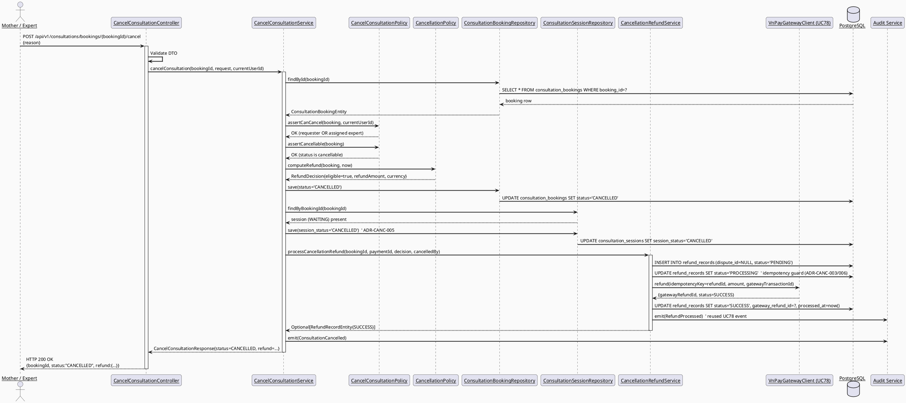
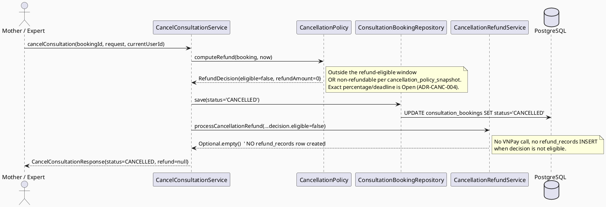
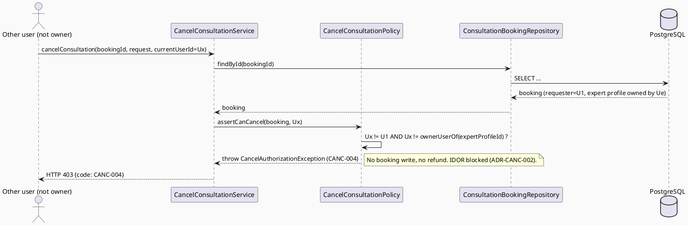
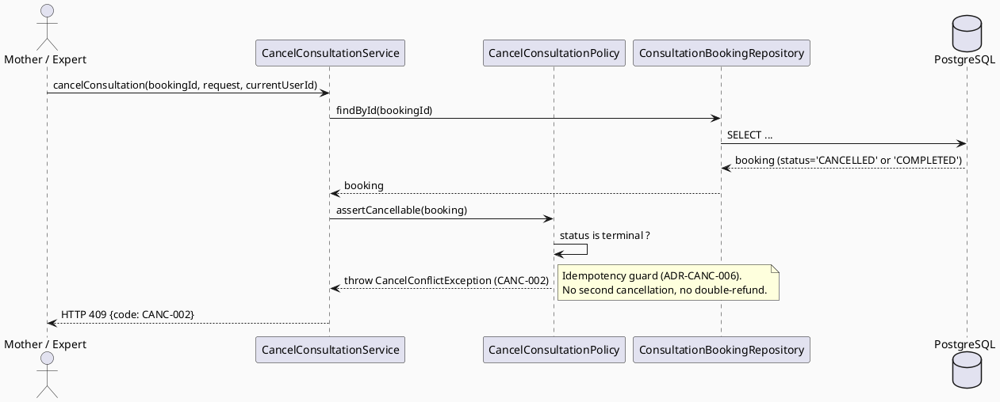
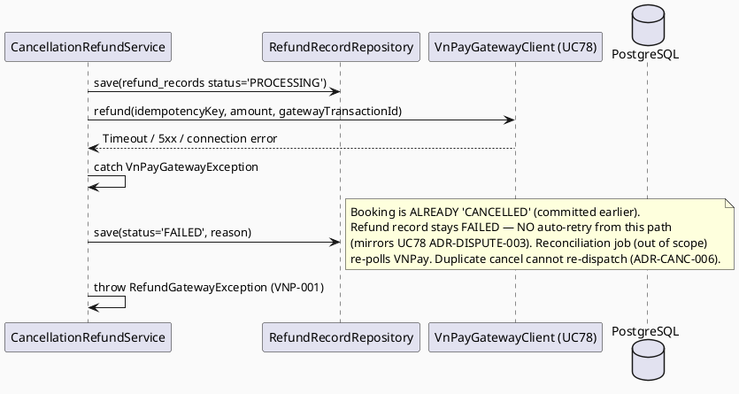
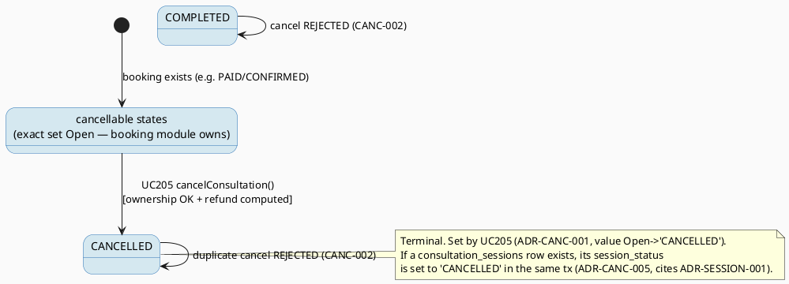
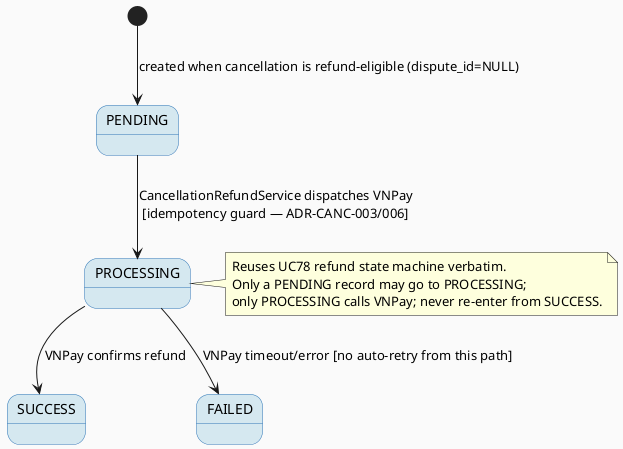

# ENGINEERING DOCUMENTATION STANDARD (EDS) v2.0
# UC205 — Cancel Consultation — Technical Design Specification

| Field | Value |
|-------|-------|
| **Document ID** | `CB-CONSULTATION-IMP-205` |
| **Version** | `1.0` |
| **Date** | `2026-07-03` |
| **Status** | `Draft` |
| **Document Owner** | `TV4-Lâm` |
| **Author** | `AI Agent (Technical Architect)` |
| **Reviewed by** | `[Tech Lead — Pending]` |
| **DPO Sign-off** | `[ ] Pending` *(cancellation triggers a financial refund side-effect + touches booking/payment PII scope — see §1)* |
| **Approved by** | `[Principal Architect — Pending]` |
| **Last Review** | `2026-07-03` |
| **Based on EDS** | `v2.0` |

---

## CHANGELOG

> **Policy 4.4 — Immutable History:** Không bao giờ xóa thông tin cũ.

| Ngày | Người thực hiện | Nội dung thay đổi |
|------|-----------------|-------------------|
| 2026-07-03 | AI Agent — Technical Architect | Tạo tài liệu lần đầu (Draft) cho UC205 Cancel Consultation |

---

## MỤC LỤC

1. [Tổng quan Module](#1-tổng-quan-module)
2. [Ma trận Truy vết (Traceability Matrix)](#2-ma-trận-truy-vết-traceability-matrix)
3. [Architecture Decision Records (ADR)](#3-architecture-decision-records-adr)
4. [Non-Functional Requirements & SLA](#4-non-functional-requirements--sla)
5. [Static Modeling (Mô hình Tĩnh)](#5-static-modeling-mô-hình-tĩnh)
6. [Dynamic Modeling (Mô hình Động)](#6-dynamic-modeling-mô-hình-động)
7. [Domain Event Catalog](#7-domain-event-catalog)
8. [Interface Specification (Đặc tả Giao diện)](#8-interface-specification-đặc-tả-giao-diện)
9. [API Specification](#9-api-specification)
10. [Bảng mã lỗi (Error Codes)](#10-bảng-mã-lỗi-error-codes)
11. [Quy trình Triển khai (Step-by-Step)](#11-quy-trình-triển-khai-step-by-step)
12. [Rollback & Incident Runbook](#12-rollback--incident-runbook)
13. [Kịch bản Kiểm thử Chi tiết](#13-kịch-bản-kiểm-thử-chi-tiết)
14. [Phương pháp Xác minh](#14-phương-pháp-xác-minh)
15. [Mẫu thử thực tế (API Verification Samples)](#15-mẫu-thử-thực-tế-api-verification-samples)
16. [Bảng tổng hợp phân quyền (Authorization Matrix)](#16-bảng-tổng-hợp-phân-quyền-authorization-matrix)
17. [AI Prompt Constraints (CASE 2.0)](#17-ai-prompt-constraints-case-20)

---

## 1. Tổng quan Module

| Field | Value |
|-------|-------|
| **Module Name** | `Consultation — Cancel Consultation` |
| **Bounded Context** | `Consultation` (package `com.carebridge.backend.consultation`) |
| **Function ID / UC** | `3.3.14.4 Cancel Consultation` / `UC-205` (SRS §3.3.14.4, L4410-4429) |
| **Primary Actor** | Mother (booking requester) **OR** Verified Expert (assigned to the booking) — either may cancel |
| **Secondary Actor** | VNPay Payment Gateway (for the policy-driven auto-refund side-effect) |
| **Platform** | Mobile App (Flutter) + Web App (cancel entry point on Consultation Detail) |
| **Priority** | Medium (per SRS) |
| **Frequency of Use** | Regular (per SRS) |
| **Sprint / Owner** | UC203→UC210 consultation-lifecycle batch — TV4-Lâm |
| **Data Classification** | `Sensitive-PII` (booking topic, payment amount, refund amount, cancellation reason; indirectly linked to health-consultation context) |
| **Compliance Scope** | `PDPA (Luật 91/2025)`, internal `BR-RBAC`, `BR-CONSULTATION` |
| **Upstream Dependencies** | `Book Private Consultation (UC-75)`, `Pay Consultation Fee (UC-76)` populate `consultation_bookings` + `payment_transactions`; `Join Consultation Session (UC-77/UC-95)` may create a `consultation_sessions` row — **prerequisite write-paths are OUT OF SCOPE for this TDS (schema-contract only, see §1.2)** |
| **Downstream Consumers** | Notification service (cancellation notice to counter-party), Commission/Settlement reversal (`commission_records` — out of scope consumer), the shared refund dispatch mechanism reused from UC78 (`VnPayGatewayClient`, `refund_records`) |

### 1.1 Scope Statement — Greenfield within an existing schema contract

This use case is greenfield at the code level (the `com.carebridge.backend.consultation`
package contains placeholder `.gitkeep` files only). However, the PostgreSQL
schema in `V1__init_schema.sql` already models the full domain
(`consultation_bookings`, `consultation_sessions`, `payment_transactions`,
`refund_records`). This TDS therefore designs UC205 **against the schema
contract only** and against the interfaces already designed by the sibling
UC78 TDS (`VnPayGatewayClient`, `RefundRecordEntity`, the
`PENDING→PROCESSING→{SUCCESS|FAILED}` refund state machine), which UC205 reuses
verbatim rather than re-inventing.

### 1.2 Entry-Criteria Blocker (Open — MUST be resolved before implementation)

> ⚠️ **UC205 cannot be implemented standalone.** It requires:
> - A booking creation/lifecycle service (UC-75/UC-76) that populates
>   `consultation_bookings` with real `requester_user_id`, `expert_profile_id`,
>   `status`, `scheduled_start`, `price_snapshot_amount`,
>   `cancellation_policy_snapshot`, and links a `payment_transactions` row.
> - The UC78 refund infrastructure (`VnPayGatewayClient` interface + `RefundService`
>   state machine) to exist as a stable contract, since UC205's auto-refund
>   **reuses** it (ADR-CANC-003).
> - The UC95 session lifecycle (`consultation_sessions.session_status` +
>   ADR-SESSION-001) to exist so the session-cascade (ADR-CANC-005) can set
>   `session_status='CANCELLED'`.
>
> **Marked `Open` — Product/Tech Lead must confirm booking/payment/session/UC78-refund
> services are implemented and stable before UC205 Sprint work starts.**

---

## 2. Ma trận Truy vết (Traceability Matrix)

> **Policy:** Không viết code nếu không biết code đó phục vụ Rule nào.

| Requirement ID | Loại (BR/ADR/US) | Mô tả yêu cầu | Thành phần Code | Compliance Target | ADR liên quan |
|----------------|------------------|---------------|-----------------|-------------------|---------------|
| UC-205 (SRS §3.3.14.4) | Use Case | "Cancels a session according to deadline, fee, and reason policy." | `CancelConsultationController.POST /cancel`, `CancelConsultationService.cancelConsultation()` | BR-CONSULTATION | ADR-CANC-001, ADR-CANC-004 |
| BR-RBAC | Business Rule | Users may access only functions allowed by role/permission scope | `CancelConsultationPolicy.assertCanCancel()` | Authorization | ADR-CANC-002 |
| BR-CONSULTATION | Business Rule | Booking, payment, dispute, refund, pricing actions keep an auditable lifecycle state | `ConsultationBookingEntity.status`, `RefundRecordEntity.status`, audit log emission | PDPA / BR-AUDIT | ADR-CANC-001, ADR-CANC-003, ADR-CANC-005 |
| SRS E3 (external/network/server failure — retry guidance, no duplicate unsafe action) | Exception Flow | VNPay refund failure/timeout on cancellation must not double-refund | `CancellationRefundService` idempotency via `refund_records.status` | BR-CONSULTATION | ADR-CANC-003, ADR-CANC-006 |
| SRS AF1 (actor cancels; returns to safe state) | Alternative Flow | Confirmation dialog + "Quay lại" (back) without side-effect (client-side) | Mobile/Web confirmation sheet (CB-165) | — | — |
| Schema: `consultation_bookings.status`, `cancellation_policy_snapshot`, `payment_transactions`, `refund_records` (`V1__init_schema.sql` L876-1000) | Schema Contract | Booking cancel + refund lifecycle persistence | `ConsultationBookingEntity`, `RefundRecordEntity` | — | — |
| ADR-SESSION-001 (UC95) | Cross-Document | Terminal `session_status='CANCELLED'` when booking cancelled before join | `ConsultationSessionEntity.sessionStatus` | BR-CONSULTATION | ADR-CANC-005 |
| UC75 unified-`consultations`-table contradiction | Resolved Conflict | Sibling UC75 Draft invented a `consultations` table/`consultation_status` enum that does NOT exist; UC205 uses the real split-table schema | `ConsultationBookingEntity` maps `consultation_bookings` (NOT a `consultations` table) | — | ADR-CANC-001 |
| Entry-Criteria Blocker (§1.2) | Open Item | Booking/Payment/Session/UC78-refund services must exist first | N/A — blocking dependency | — | — |

---

## 3. Architecture Decision Records (ADR)

### ADR-CANC-001 — Cancelled booking status target value = `CANCELLED` (on the real `consultation_bookings.status` column)

| Field | Value |
|-------|-------|
| **Status** | `Proposed` *(exact string value needs Product/Tech Lead sign-off — SRS does not name it)* |
| **Deciders** | `AI Agent (proposal only) — pending TV4-Lâm / Tech Lead confirmation` |
| **Date** | `2026-07-03` |
| **Supersedes** | — |

#### Bối cảnh (Context)
`consultation_bookings.status` is `varchar(30) NOT NULL DEFAULT 'PENDING_PAYMENT'`
(`V1__init_schema.sql` L893) with **no DB `CHECK` constraint** (verified — no
CHECK on any consultation-domain table; application-level enum is the
established pattern). SRS UC-205 says only "Cancels a session according to
deadline, fee, and reason policy" and never names the resulting status value.
The sibling UC75 Draft TDS proposed `CANCELLED` as an alternative-flow status
name (on its own — see §2 contradiction — WRONG unified table, but the *string*
`CANCELLED` is a reasonable naming precedent). Consistency with the confirmed
`session_status='CANCELLED'` terminal value in ADR-SESSION-001 (UC95) argues for
the same word on the booking status column.

> **⚠️ MANDATORY DEVIATION FLAGGED (resolved contradiction):** The sibling Draft
> `UC75_BookPrivateConsultation_TDS` invented a **unified `consultations` table**
> with a `consultation_status` enum. That table does **not** exist in the applied
> schema. The real, applied model is a **split-table design**:
> `consultation_bookings` (with its own `status` column), a separate
> `consultation_sessions` (`session_status`), separate `payment_transactions`
> (`status`), and `refund_records` (`status`) — see `V1__init_schema.sql`
> L876-1000. Per the CareBridge project rule *"Current code and migrations
> override historical design notes"* (`CLAUDE.md` → Read On Demand), **UC205 uses
> the real split-table schema and mutates `consultation_bookings.status`, NOT a
> non-existent `consultations.consultation_status`.**

#### Các phương án đã xem xét (Options Considered)

| Phương án | Mô tả | Ưu điểm | Nhược điểm |
|-----------|-------|----------|------------|
| A | Use `'CANCELLED'` on `consultation_bookings.status` | Consistent with ADR-SESSION-001's `session_status='CANCELLED'`; matches UC75 alt-flow naming; intuitive for audit | Value not confirmed in SRS — a proposal |
| B | Use `'CANCELED'` (US single-L) or `'CANCELLED_BY_USER'`/`'CANCELLED_BY_EXPERT'` distinct values | Distinguishes canceller | No SRS basis for splitting; more enum values to reconcile with sibling specs; who-cancelled is already captured by an audit event (§7) not the status |
| C | Add a DB `CHECK` constraint enumerating booking statuses now | DB-level guarantee | New migration on a table referenced by multiple sibling TDS; not a genuine gap — app-level enum is the established pattern (no CHECK exists on any consultation table); rejected |

#### Quyết định (Decision)
Chọn **Phương án A** — set `consultation_bookings.status = 'CANCELLED'` at the
application layer (no migration, no CHECK). **This is a proposal — the exact
string value must be confirmed by Product/Tech Lead before implementation**
(the `Open` item is the *value*, not the *mechanism*). Who cancelled (Mother vs
Expert) is recorded via the `ConsultationCancelled` domain event metadata
(`causedBy`), not by branching the status string.

#### Hệ quả (Consequences)
**Tích cực:** Single canonical terminal value; consistent with ADR-SESSION-001; no schema change.
**Tiêu cực / Trade-offs:** App-level only — a direct SQL write could bypass the enum (accepted; same posture as every other status column in this schema).
**Compliance Impact:** Supports BR-CONSULTATION auditable lifecycle.

---

### ADR-CANC-002 — Ownership authorization: only the booking's requester Mother OR its assigned Verified Expert may cancel

| Field | Value |
|-------|-------|
| **Status** | `Accepted` |
| **Deciders** | `AI Agent — derived directly from schema + BR-RBAC` |
| **Date** | `2026-07-03` |

#### Bối cảnh (Context)
`consultation_bookings.requester_user_id` (`uuid NOT NULL`, FK to `users`, L1824)
identifies the Mother; `consultation_bookings.expert_profile_id` (`uuid NOT NULL`,
FK to `expert_profiles`, L1827) identifies the expert side. SRS UC-205 Primary
Actor is "Mother, Verified Expert" (either), and Exception E1 requires denial
when the actor is "outside the permitted data scope". This is the same IDOR
class handled by UC202's ownership guard (`ADR-CON-006`).

#### Các phương án đã xem xét (Options Considered)

| Phương án | Mô tả | Ưu điểm | Nhược điểm |
|-----------|-------|----------|------------|
| A | Any authenticated Mother/Expert may cancel any booking | Simple | Violates BR-RBAC; allows cross-account cancellation abuse (IDOR) |
| B | **Only the booking's `requester_user_id` (Mother) OR the user owning `expert_profile_id` (Expert) may cancel; enforced server-side in `CancelConsultationPolicy`** | Matches schema FK semantics; prevents IDOR; supports "either actor may cancel" per SRS | Requires resolving `expert_profile_id → owning user_id` (one extra lookup) |

#### Quyết định (Decision)
Chọn **Phương án B**. `CancelConsultationPolicy.assertCanCancel(booking, currentUserId)`
must confirm `currentUserId == booking.requesterUserId` **OR** `currentUserId ==
ownerUserOf(booking.expertProfileId)`. Anyone else receives `403` (`CANC-004`).
The exact mapping `expert_profile_id → user_id` is owned by the expert-profile
module; UC205 consumes it read-only (interface only).

#### Hệ quả (Consequences)
**Tích cực:** Prevents IDOR / cross-tenant cancellation.
**Tiêu cực / Trade-offs:** One extra read to resolve expert ownership (negligible).
**Compliance Impact:** Satisfies BR-RBAC.

---

### ADR-CANC-003 — Dual-trigger refund model: `refund_records` rows originate from TWO distinct triggers, both reusing UC78's `VnPayGatewayClient` + state machine

| Field | Value |
|-------|-------|
| **Status** | `Accepted` *(mechanism); refund policy numbers are `Open` — see ADR-CANC-004)* |
| **Deciders** | `AI Agent — derived from SRS (VNPay secondary actor for UC-205) + UC78 refund design + nullable refund_records.dispute_id` |
| **Date** | `2026-07-03` |

#### Bối cảnh (Context)
SRS lists **VNPay Payment Gateway as a Secondary Actor for UC-205** (§3.3.14.4,
L4415), meaning cancellation may trigger an automatic refund. `refund_records.dispute_id`
is **nullable** (`V1__init_schema.sql` L989) and `refund_records.approved_by` is
**nullable** (L990) — so a refund row can legitimately exist **without** a
dispute and **without** a manual admin approval. This is exactly the
cancellation case, and it is architecturally distinct from UC-210's
dispute-triggered manual refund (where `dispute_id` is set and `approved_by` is
an admin). Both, however, use the identical VNPay call path and the identical
`refund_records` lifecycle designed in UC78.

#### Các phương án đã xem xét (Options Considered)

| Phương án | Mô tả | Ưu điểm | Nhược điểm |
|-----------|-------|----------|------------|
| A | Route cancellation refunds through UC-210's manual dispute-approval path (create a synthetic dispute) | One code path | Semantically wrong — no dispute exists; pollutes `consultation_disputes`; requires an admin to approve an automatic policy refund (defeats the point) |
| B | **Two distinct creation triggers, one shared dispatch mechanism.** (a) UC-205 auto cancellation-policy refund: `refund_records` row with `dispute_id = NULL`, `approved_by = NULL` (or system), created automatically by `CancellationRefundService` when the cancellation is within the refund-eligible window. (b) UC-210 manual dispute refund: `dispute_id` set, `approved_by` = admin. **Both reuse UC78's `VnPayGatewayClient` interface and the `PENDING→PROCESSING→{SUCCESS\|FAILED}` state machine with idempotency via `refund_records.status`.** | Matches nullable-`dispute_id` schema; correct semantics; zero duplication of the VNPay/state-machine logic; clear authorization difference (policy-automatic vs admin-manual) | Requires the UC78 refund dispatch logic to be reusable (a shared `RefundDispatchService` or an added method) — a refactor coordination item |
| C | Duplicate the VNPay call + state machine inside a cancellation-only service | Independent | Violates DRY; two idempotency implementations to keep in sync — double-refund risk if they diverge; rejected |

#### Quyết định (Decision)
Chọn **Phương án B**. UC205's cancellation auto-refund creates a `refund_records`
row with `dispute_id = NULL` and dispatches it through the **same**
`VnPayGatewayClient` interface and the **same** state machine defined in UC78
(`ADR-DISPUTE-003`). The idempotency guard is identical: a record already
`PROCESSING`/`SUCCESS` is never re-sent to VNPay. The distinction between the two
triggers is: **creation trigger + authorization** (UC-205 = automatic, driven by
cancellation policy, no admin; UC-210 = manual, admin-approved), **not** the
dispatch mechanism. `VnPayGatewayClient` is **referenced, not redefined** (see
§8).

> **Implementation coordination note (Open):** The reusable dispatch logic should
> live in a shared component (either refactor UC78's `RefundService` into a
> `RefundDispatchService`, or add a `processCancellationRefund(...)` method that
> reuses the same private dispatch routine). The exact refactor shape is an
> `Open` coordination item with the UC78 owner — but `VnPayGatewayClient` itself
> MUST NOT be forked.

#### Hệ quả (Consequences)
**Tích cực:** Correct semantics for no-dispute refunds; single VNPay/idempotency implementation; auditable.
**Tiêu cực / Trade-offs:** Requires cross-spec coordination on where the shared dispatch code lives.
**Compliance Impact:** Reduces financial-safety/double-refund risk (CLAUDE.md payment mandate).

---

### ADR-CANC-004 — Refund amount is derived from `cancellation_policy_snapshot` + cancellation timing; exact percentages/deadlines are `Open` (NOT invented)

| Field | Value |
|-------|-------|
| **Status** | `Proposed` *(mechanism accepted; exact fee/deadline/percentage numbers are `Open` — SRS does not quantify them)* |
| **Deciders** | `AI Agent (proposal only)` |
| **Date** | `2026-07-03` |

#### Bối cảnh (Context)
SRS UC-205 Description: *"Cancels a session according to **deadline, fee, and
reason policy**"* — it asserts a policy exists but gives **no numbers** (no
deadline hours, no fee percentage, no refund schedule). The schema, however,
provides the authoritative per-booking source: `consultation_bookings.cancellation_policy_snapshot`
is a `text` column (`V1__init_schema.sql` L891) snapshotted **at booking time**,
plus `price_snapshot_amount` (L888) and `scheduled_start` (L886). The mobile
mockup CB-165 (`03_Design/UI_UX/MobileAppScreen/CB-165...`) shows an
**illustrative** example — "hoàn lại 100% phí tư vấn … do hủy trước 24 giờ so với
giờ hẹn" — but this is UI placeholder copy, **not** a normative business rule and
must not be hard-coded as the policy.

#### Các phương án đã xem xét (Options Considered)

| Phương án | Mô tả | Ưu điểm | Nhược điểm |
|-----------|-------|----------|------------|
| A | Hard-code "24h → 100% refund, else 0%" from the mockup | Fast | Invents a business rule not in SRS; mockup copy is illustrative; brittle |
| B | **Compute refund from `cancellation_policy_snapshot` (parsed) + `(scheduled_start − now)` + `price_snapshot_amount`; the concrete percentage/deadline schedule is read from the snapshot, not hard-coded** | Uses the real per-booking authority; policy can change over time without breaking historical bookings; no invented numbers | Requires the snapshot's exact format/schema — currently `Open` |
| C | Always refund 100% | Simple, user-friendly | No SRS basis; ignores the "fee" the SRS explicitly mentions; financial risk |

#### Quyết định (Decision)
Chọn **Phương án B**. `CancellationPolicy.computeRefund(booking, cancelledAt)`
returns a `RefundDecision{eligible, refundAmount, currency}` derived from the
booking's `cancellation_policy_snapshot`, the time-to-appointment
(`scheduled_start − cancelledAt`), and `price_snapshot_amount`. **The exact
policy schema (JSON? tiered percentages? deadline hours?) and the exact
percentage/fee-forfeiture numbers are `Open` and MUST be confirmed with Product
before implementation — this TDS designs the *mechanism*, not the numbers.** The
UI (CB-165) displays the computed `refundAmount` for confirmation before the
actor confirms (matches the mockup's "bạn sẽ được hoàn lại …" line).

**Open sub-items:**
- Exact format of `cancellation_policy_snapshot` (free text vs JSON) — `Open`.
- Deadline threshold(s) and refund percentage tiers — `Open` (SRS silent; mockup illustrative only).
- Whether an expert-initiated cancellation always refunds 100% (no fault to Mother) vs. follows the same tiered policy — `Open` (design the branch; do not fix the number).
- Whether a cancellation reason is required and whether reason affects the refund ("reason policy") — `Open`.

#### Hệ quả (Consequences)
**Tích cực:** No invented numbers; policy authority is the per-booking snapshot; historically stable.
**Tiêu cực / Trade-offs:** Cannot be implemented until the snapshot format + numbers are confirmed (blocking `Open`).
**Compliance Impact:** Auditable, per-booking policy provenance.

---

### ADR-CANC-005 — Session cascade: if a `consultation_sessions` row exists at cancellation time, set `session_status='CANCELLED'` per ADR-SESSION-001 (do not redefine)

| Field | Value |
|-------|-------|
| **Status** | `Accepted` *(cites the confirmed ADR-SESSION-001 terminal value)* |
| **Deciders** | `AI Agent — derived from ADR-SESSION-001 (UC95)` |
| **Date** | `2026-07-03` |

#### Bối cảnh (Context)
Cancellation normally happens **before/instead of** a session occurring, so a
`consultation_sessions` row often does not exist yet. But `consultation_sessions.booking_id`
is UNIQUE (`V1__init_schema.sql` L1528) and a row may already exist in `WAITING`
state if the session was pre-provisioned. ADR-SESSION-001 (UC95 TDS §3) already
**confirms** the terminal value: *"CANCELLED — terminal. Set when the underlying
booking is cancelled before [any join]."* UC205 must not redefine this — it is a
consumer of the UC95-owned session lifecycle.

#### Quyết định (Decision)
If (and only if) a `consultation_sessions` row exists for the booking and is in a
non-terminal state (`WAITING`/`IN_SESSION`), UC205 sets `session_status='CANCELLED'`
in the same transaction as the booking cancellation. If no session row exists,
no session write occurs. UC205 **cites** ADR-SESSION-001 for the value and the
allowed transition; it does not own or restate the session state machine.

#### Hệ quả (Consequences)
**Tích cực:** Consistent terminal session state; no orphaned live session.
**Tiêu cực / Trade-offs:** Cross-module transaction touches a UC95-owned table (read/write coordination — acceptable, same bounded context/package).
**Compliance Impact:** Auditable session lifecycle.

---

### ADR-CANC-006 — Idempotent cancellation: an already-terminal booking is rejected, and a duplicate cancel must never double-refund

| Field | Value |
|-------|-------|
| **Status** | `Accepted` |
| **Deciders** | `AI Agent — derived from SRS E3 + CLAUDE.md payment-safety mandate` |
| **Date** | `2026-07-03` |

#### Bối cảnh (Context)
SRS Exception E3 requires "no duplicate unsafe action". A user (or a retrying
client) could submit two cancel requests. Two hazards: (1) transitioning an
already-`CANCELLED`/`COMPLETED` booking again; (2) creating a **second**
`refund_records` row → double refund.

#### Quyết định (Decision)
Two guards, both required:
1. **Booking-state guard:** `cancelConsultation` rejects (`CANC-002`, 409) if
   `booking.status` is already terminal (`CANCELLED`, `COMPLETED`, and any other
   non-cancellable state — exact non-cancellable set is `Open`, pending
   booking-lifecycle confirmation). Only a cancellable state may transition to
   `CANCELLED`.
2. **Refund idempotency guard (reuses ADR-CANC-003 / UC78 ADR-DISPUTE-003):**
   before creating a cancellation `refund_records` row, check no
   non-`FAILED` refund already exists for the booking's `payment_id`; and once a
   refund is `PROCESSING`/`SUCCESS` it is never re-dispatched to VNPay.

#### Hệ quả (Consequences)
**Tích cực:** No double-cancel, no double-refund.
**Tiêu cực / Trade-offs:** Requires a lookup of existing refund state per payment before dispatch.
**Compliance Impact:** Financial-safety (CLAUDE.md).

---

## 4. Non-Functional Requirements & SLA

> No SRS/BR source specifies numeric SLA targets for UC205. Values below are
> **`Open` — proposed defaults**, consistent with the sibling UC78 TDS baseline;
> must be confirmed by Tech Lead before being treated as binding.

### 4.1. Performance & Availability

| Category | Requirement | Target SLA | Measurement Method | Compliance Basis |
|----------|-------------|------------|---------------------|------------------|
| Latency | `POST /cancel` p99 (booking status write + refund-record creation; VNPay dispatch may be async) | `< 500ms` *(Open — proposed)* | API test timing | — |
| Availability | Dependent on booking/payment/UC78-refund services (§1.2 blocker) | N/A until dependencies implemented | — | — |

### 4.2. Data Integrity & Retention

| Category | Requirement | Target | Verification Method | Compliance Basis |
|----------|-------------|--------|---------------------|------------------|
| Durability | No booking/refund state loss | RPO = 0 (single DB transaction for status + session + refund-record creation) | Transaction log | BR-CONSULTATION |
| Atomicity | Booking→CANCELLED, session→CANCELLED, refund-record creation happen in one transaction; VNPay dispatch is a separate committed step | 100% | Integration test | BR-CONSULTATION |
| Consistency | At most one non-`FAILED` cancellation refund per payment | 100% (service-level guard, ADR-CANC-006) | Reconciliation query | BR-CONSULTATION |

### 4.3. Security

| Category | Requirement | Target | Verification Method | Compliance Basis |
|----------|-------------|--------|---------------------|------------------|
| Access control | Role + ownership scoped (requester Mother or assigned Expert only) | Least privilege | Auth Matrix (§16) | BR-RBAC |
| Transport | All endpoints over TLS | TLS 1.2+ (platform default) | Infra config | — |
| Secrets | VNPay merchant secret/API key | Never logged; stored in `.env`/secret manager (existing pattern) | Log grep | BR-PRIVACY |

### 4.4. Scalability & Capacity Planning

Cancellation frequency is "Regular" per SRS but bounded by booking volume. No
special scaling design beyond standard Spring Boot request handling. The VNPay
refund dispatch reuses UC78's mechanism and its (out-of-scope) reconciliation
job for stuck `PROCESSING` records.

---

## 5. Static Modeling (Mô hình Tĩnh)

### 5.1. Component Responsibilities & Planned File Paths

| Layer | File Path | Responsibility |
|-------|-----------|----------------|
| Controller | `src/main/java/com/carebridge/backend/consultation/controller/CancelConsultationController.java` | HTTP mapping, DTO validation only |
| Service | `src/main/java/com/carebridge/backend/consultation/service/CancelConsultationService.java` | Cancellation workflow: ownership delegation, state guard, session cascade, refund trigger, event emission |
| Service | `src/main/java/com/carebridge/backend/consultation/service/CancellationRefundService.java` | Creates the cancellation `refund_records` row (`dispute_id=NULL`) and dispatches via the **shared** UC78 refund mechanism (`VnPayGatewayClient`) — ADR-CANC-003 |
| Policy | `src/main/java/com/carebridge/backend/consultation/policy/CancelConsultationPolicy.java` | Ownership check (ADR-CANC-002), booking-state guard (ADR-CANC-006) |
| Policy | `src/main/java/com/carebridge/backend/consultation/policy/CancellationPolicy.java` | `computeRefund(booking, cancelledAt)` from `cancellation_policy_snapshot` (ADR-CANC-004) |
| Repository | `src/main/java/com/carebridge/backend/consultation/repository/ConsultationBookingRepository.java` | Read/update `consultation_bookings` (shared interface w/ booking module) |
| Repository | `src/main/java/com/carebridge/backend/consultation/repository/ConsultationSessionRepository.java` | Read/update `consultation_sessions.session_status` (shared w/ UC95) |
| Repository | `src/main/java/com/carebridge/backend/consultation/repository/PaymentTransactionRepository.java` | Read `payment_transactions` for refund basis (shared w/ UC76/UC78) |
| Repository | `src/main/java/com/carebridge/backend/consultation/repository/RefundRecordRepository.java` | Persistence for `refund_records` (shared w/ UC78) |
| Entity | `src/main/java/com/carebridge/backend/consultation/entity/ConsultationBookingEntity.java` | JPA mapping for `consultation_bookings` |
| Entity | `src/main/java/com/carebridge/backend/consultation/entity/ConsultationSessionEntity.java` | JPA mapping for `consultation_sessions` (owned by UC95; referenced) |
| Entity | `src/main/java/com/carebridge/backend/consultation/entity/RefundRecordEntity.java` | JPA mapping for `refund_records` (owned by UC78; referenced) |
| Reused Interface | `src/main/java/com/carebridge/backend/consultation/service/VnPayGatewayClient.java` | **Reused from UC78 — NOT redefined here** (ADR-CANC-003) |
| DTO | `src/main/java/com/carebridge/backend/consultation/dto/request/CancelConsultationRequest.java` | Inbound payload (cancellation reason) |
| DTO | `src/main/java/com/carebridge/backend/consultation/dto/response/CancelConsultationResponse.java` | Outbound payload (booking status + refund summary) |
| Mapper | `src/main/java/com/carebridge/backend/consultation/mapper/CancelConsultationMapper.java` | Entity ↔ DTO, never expose entity |
| Mobile Repository | `05_Development/CareBridgeMobileApp/lib/features/consultation/repositories/cancel_consultation_repository.dart` | API client for cancel |
| Mobile Screen | `05_Development/CareBridgeMobileApp/lib/features/consultation/screens/cancel_consultation_confirmation.dart` | Confirmation sheet (CB-165) |
| Web | `05_Development/CareBridgeWebApp/src/features/consultation/` (cancel entry on Consultation Detail CB-060) | Cancel entry point + confirmation |

### 5.2. Class Diagram (PlantUML)

```plantuml
@startuml UC205_Cancel_ClassDiagram
skinparam classAttributeIconSize 0
skinparam classFontStyle bold
skinparam backgroundColor #FAFAFA
skinparam ArrowColor #555555
skinparam ClassBorderColor #2E75B6
skinparam ClassHeaderBackgroundColor #D5E8F0

' === ENTITIES (mirror V1__init_schema.sql — split-table, NOT a unified consultations table) ===
class ConsultationBookingEntity {
  + bookingId: UUID
  + requesterUserId: UUID
  + expertProfileId: UUID
  + expertPriceId: UUID
  + sharedSummaryId: UUID
  + topic: String
  + channelType: String
  + durationMinutes: short
  + scheduledStart: Instant
  + scheduledEnd: Instant
  + priceSnapshotAmount: BigDecimal
  + commissionRateSnapshot: BigDecimal
  + currency: String
  + cancellationPolicySnapshot: String
  + status: String
  + createdAt: Instant
  + updatedAt: Instant
}

class ConsultationSessionEntity {
  + sessionId: UUID
  + bookingId: UUID
  + sessionStatus: String
  + startedAt: Instant
  + endedAt: Instant
}

class RefundRecordEntity {
  + refundId: UUID
  + paymentId: UUID
  + disputeId: UUID
  + approvedBy: UUID
  + refundAmount: BigDecimal
  + currency: String
  + reason: String
  + gatewayRefundId: String
  + status: String
  + requestedAt: Instant
  + processedAt: Instant
}

' === VALUE OBJECTS ===
enum BookingStatus <<ValueObject>> {
  PENDING_PAYMENT
  ' ... other lifecycle values owned by booking module (Open)
  CANCELLED
  COMPLETED
}

enum RefundStatus <<ValueObject>> {
  PENDING
  PROCESSING
  SUCCESS
  FAILED
}

class RefundDecision <<ValueObject>> {
  + eligible: boolean
  + refundAmount: BigDecimal
  + currency: String
}

' === SERVICES ===
interface ICancelConsultationService <<interface>> {
  + cancelConsultation(bookingId: UUID, request: CancelConsultationRequest, currentUserId: UUID): CancelConsultationResponse
}

class CancelConsultationService implements ICancelConsultationService {
  - bookingRepository: ConsultationBookingRepository
  - sessionRepository: ConsultationSessionRepository
  - cancelPolicy: CancelConsultationPolicy
  - cancellationPolicy: CancellationPolicy
  - cancellationRefundService: ICancellationRefundService
  - eventPublisher: ApplicationEventPublisher
  + cancelConsultation(...): CancelConsultationResponse
}

interface ICancellationRefundService <<interface>> {
  + processCancellationRefund(bookingId: UUID, paymentId: UUID, decision: RefundDecision, cancelledBy: UUID): Optional<RefundRecordEntity>
}

class CancellationRefundService implements ICancellationRefundService {
  - refundRepository: RefundRecordRepository
  - paymentRepository: PaymentTransactionRepository
  - vnPayGatewayClient: VnPayGatewayClient
  - eventPublisher: ApplicationEventPublisher
  + processCancellationRefund(...): Optional<RefundRecordEntity>
}

' === REUSED FROM UC78 (referenced, not redefined) ===
interface VnPayGatewayClient <<interface, reused-UC78>> {
  + refund(idempotencyKey: UUID, amount: BigDecimal, gatewayTransactionId: String): VnPayRefundResult
}

' === POLICY ===
class CancelConsultationPolicy {
  + assertCanCancel(booking: ConsultationBookingEntity, currentUserId: UUID): void
  + assertCancellable(booking: ConsultationBookingEntity): void
}

class CancellationPolicy {
  + computeRefund(booking: ConsultationBookingEntity, cancelledAt: Instant): RefundDecision
}

' === REPOSITORIES ===
interface ConsultationBookingRepository <<interface>> {
  + findById(id: UUID): Optional<ConsultationBookingEntity>
  + save(entity: ConsultationBookingEntity): ConsultationBookingEntity
}

interface RefundRecordRepository <<interface>> {
  + findByPaymentId(paymentId: UUID): List<RefundRecordEntity>
  + save(entity: RefundRecordEntity): RefundRecordEntity
}

' === RELATIONSHIPS ===
CancelConsultationService --> ConsultationBookingRepository : uses
CancelConsultationService --> ConsultationSessionRepository : uses (cascade — ADR-CANC-005)
CancelConsultationService --> CancelConsultationPolicy : uses
CancelConsultationService --> CancellationPolicy : uses
CancelConsultationService --> ICancellationRefundService : triggers auto-refund
CancellationRefundService --> RefundRecordRepository : uses
CancellationRefundService --> VnPayGatewayClient : dispatches (reused UC78)
CancellationService_note .. RefundRecordEntity
ConsultationBookingEntity "1" *-- "0..1" ConsultationSessionEntity : may have
ConsultationBookingEntity --> BookingStatus : status (app-level)
RefundRecordEntity --> RefundStatus : status (app-level)
CancellationPolicy ..> RefundDecision : produces

@enduml
```



### 5.3. Data Structure — Schema/Migration Details

> **CareBridge rule:** `V1__init_schema.sql` and approved Flyway migrations are
> the primary source of truth. ERD is supporting context only.

**No new migration is required for UC205.** All needed tables/columns already
exist. UC205 only performs `UPDATE` on existing columns and `INSERT` into
`refund_records`:

```sql
-- consultation_bookings (V1__init_schema.sql L876-896) — relevant columns
-- status                       varchar(30)  NOT NULL DEFAULT 'PENDING_PAYMENT'  (L893) -> set to 'CANCELLED'
-- cancellation_policy_snapshot text                                            (L891) -> READ for refund calc
-- price_snapshot_amount        numeric      NOT NULL                            (L888) -> refund basis
-- scheduled_start              timestamptz  NOT NULL                            (L886) -> deadline calc
-- requester_user_id / expert_profile_id     NOT NULL                     (L878/879) -> ownership
-- PK booking_id (L1422-1423); FK requester_user_id->users (L1823-1824),
--    expert_profile_id->expert_profiles (L1826-1827)
-- Index: idx_consultation_bookings_status (L1638)

-- consultation_sessions (V1__init_schema.sql L898-909)
-- session_status varchar(30) NOT NULL DEFAULT 'WAITING' (L904) -> set to 'CANCELLED' if row exists (ADR-CANC-005)
-- booking_id UNIQUE (L1527-1528) -> at most one session per booking
-- FK booking_id->consultation_bookings (L1838-1839)

-- payment_transactions (V1__init_schema.sql L923-939)
-- status varchar(30) NOT NULL DEFAULT 'PENDING' (L934), refund_amount, gross_amount, gateway_transaction_id
-- FK booking_id->consultation_bookings (L1847-1848)
-- Index: idx_payment_transactions_booking_id (L1641)

-- refund_records (V1__init_schema.sql L986-1000) — INSERT target for cancellation refund
-- dispute_id  uuid (NULLABLE, L989) -> NULL for a cancellation-triggered refund (ADR-CANC-003)
-- approved_by uuid (NULLABLE, L990) -> NULL/system for automatic policy refund
-- status varchar(30) NOT NULL DEFAULT 'PENDING' (L995)
-- FK payment_id->payment_transactions (L1877-1878), dispute_id->consultation_disputes (L1880-1881)
```

**Genuine gap identified (Open — non-blocking, same finding as UC78 §5.3):**
`refund_records` has no explicit index on `payment_id`/`dispute_id` (FK only).
UC205's `findByPaymentId` idempotency lookup would benefit from
`idx_refund_records_payment_id`. Recommend the **same** follow-up migration UC78
already proposes (do NOT create a second, conflicting one):

```sql
-- PROPOSED (Open — shared with UC78 §5.3; requires Tech Lead approval; NOT created by this TDS)
-- CREATE INDEX idx_refund_records_payment_id ON public.refund_records(payment_id);
```

**Schema-change conclusion:** UC205 requires **no schema change**. No new
migration file is created by this TDS.

---

## 6. Dynamic Modeling (Mô hình Động)

### 6.1. Sequence Diagram — Happy Path A: Cancel within refund window (auto-refund created)



### 6.2. Sequence Diagram — Happy Path B: Cancel outside window (no refund)



### 6.3. Sequence Diagram — Error Path: Ownership denied (403 CANC-004)



### 6.4. Sequence Diagram — Error Path: Already-terminal booking (409 CANC-002)



### 6.5. Sequence Diagram — Error Path: VNPay refund timeout/failure (503 VNP-001)



### 6.6. State Machine — Booking status (UC205 relevant transitions)





**⚠️ Invariant bất biến:**
1. A booking may transition to `CANCELLED` only from a cancellable (non-terminal) state (ADR-CANC-006).
2. At most one non-`FAILED` cancellation `refund_records` row exists per `payment_id` (ADR-CANC-006).
3. A cancellation refund always has `dispute_id = NULL` (ADR-CANC-003) — distinguishing it from a UC-210 dispute refund.
4. If a `consultation_sessions` row exists at cancellation, its `session_status` becomes `CANCELLED` (ADR-CANC-005, per ADR-SESSION-001).
5. `VnPayGatewayClient` is reused from UC78 unchanged — never forked or redefined.

---

## 7. Domain Event Catalog

### 7.1. Events Published (Phát ra)

| Event Name | Trigger | Publisher | Subscriber(s) | Payload Schema | Async? |
|------------|---------|-----------|---------------|----------------|--------|
| `ConsultationCancelled` | A booking is successfully cancelled | `CancelConsultationService` | Notification service (notify counter-party), Commission/Settlement reversal (out-of-scope consumer), Audit log | `ConsultationCancelled.java` | Yes |
| `RefundProcessed` *(reused from UC78 §7)* | Cancellation refund reaches terminal VNPay result (`SUCCESS`/`FAILED`) | `CancellationRefundService` | Commission/Settlement recalculation (out of scope), Notification service, Audit log | `RefundProcessed.java` *(UC78-owned schema — reused)* | Yes |

### 7.2. Events Consumed (Tiêu thụ)

| Event Name | Source | Handler | Action thực hiện |
|------------|--------|---------|------------------|
| `ConsultationCancelled` | Internal (same module) | Notification handler (out of scope) | Notify the counter-party (Mother↔Expert) of the cancellation |
| `ConsultationCancelled` | Internal | Commission-reversal handler (out of scope consumer) | Reverse/adjust `commission_records` for the cancelled booking's payment |

### 7.3. Payload Schema

```java
// ConsultationCancelled.java
public record ConsultationCancelled(
    UUID    eventId,          // UUID.randomUUID() — dedupe
    String  eventType,        // "ConsultationCancelled"
    Instant occurredAt,       // Instant.now()
    String  version,          // "1.0"
    Payload payload,
    Metadata metadata
) implements ApplicationEvent {

    public record Payload(
        UUID       bookingId,
        UUID       requesterUserId,
        UUID       expertProfileId,
        String     previousStatus,     // booking status before cancellation
        String     newStatus,          // "CANCELLED" (ADR-CANC-001, value Open)
        boolean    sessionCascaded,    // true if a session row was set to CANCELLED
        boolean    refundEligible,     // decision from CancellationPolicy
        BigDecimal refundAmount,       // 0 if not eligible
        UUID       refundId            // null if no refund created
    ) {}

    public record Metadata(
        UUID   correlationId,
        String causedBy                // userId of the canceller (Mother or Expert)
    ) {}
}

// RefundProcessed.java — REUSED verbatim from UC78 §7.3 (not redefined here).
// For a cancellation-triggered refund, payload.disputeId is NULL.
```

---

## 8. Interface Specification (Đặc tả Giao diện)

> **Policy (EDS v2.0):** Mỗi interface phải khai báo `@version`. `VnPayGatewayClient`
> is **reused from UC78 §8** and MUST NOT be redefined here (ADR-CANC-003).

### 8.1. Service Interface

```java
// CancelConsultationRequest.java — Input DTO
// @version 1.0
public class CancelConsultationRequest {
    // Whether a reason is REQUIRED is Open (SRS mentions a "reason policy" but
    // does not mandate it). Proposed: optional free-text, max 1000 chars.
    @Size(max = 1000)
    private String reason;          // ADR-CANC-004 (reason-policy Open)
    // getters / setters / @Valid annotations
}

// CancelConsultationResponse.java — Output DTO
public class CancelConsultationResponse {
    private UUID    bookingId;
    private String  status;         // "CANCELLED" (ADR-CANC-001)
    private Instant cancelledAt;
    private RefundSummary refund;   // null when not refund-eligible (Happy Path B)

    public static class RefundSummary {
        private UUID       refundId;
        private BigDecimal refundAmount;
        private String     currency;
        private String     status;   // PENDING | PROCESSING | SUCCESS | FAILED
    }
    // getters / setters — never expose entity internals
}

// ICancelConsultationService.java — Service Contract
// @version 1.0
public interface ICancelConsultationService {
    /**
     * Cancels a booking owned by the current user (requester Mother OR assigned Expert).
     * Sets booking status to CANCELLED, cascades session_status to CANCELLED if a
     * session row exists, and — if the cancellation is refund-eligible per the
     * cancellation policy — creates and dispatches a policy-driven auto-refund
     * (dispute_id = NULL) via the shared VNPay refund mechanism.
     * @throws CancelAuthorizationException (CANC-004) if currentUserId is neither requester nor assigned expert
     * @throws CancelConflictException (CANC-002) if booking is already in a terminal/non-cancellable state
     * @throws BookingNotFoundException (CANC-003) if bookingId does not exist
     * @throws CancelValidationException (CANC-001) if request payload invalid
     * @throws RefundGatewayException (VNP-001) if the VNPay refund dispatch fails (booking stays CANCELLED; refund record FAILED)
     */
    CancelConsultationResponse cancelConsultation(UUID bookingId,
                                                  CancelConsultationRequest request,
                                                  UUID currentUserId);
}

// ICancellationRefundService.java — Service Contract
// @version 1.0
// Reuses UC78's VnPayGatewayClient + refund_records state machine (ADR-CANC-003).
public interface ICancellationRefundService {
    /**
     * Creates a cancellation-triggered refund (dispute_id = NULL) and dispatches it
     * through VnPayGatewayClient using the PENDING->PROCESSING->{SUCCESS|FAILED}
     * state machine with idempotency via refund_records.status.
     * Returns Optional.empty() when the RefundDecision is not eligible (no row, no VNPay call).
     * Idempotent: if a non-FAILED refund already exists for the payment, returns it without re-dispatching.
     * @throws RefundGatewayException (VNP-001) on VNPay failure/timeout
     */
    Optional<RefundRecordEntity> processCancellationRefund(UUID bookingId,
                                                           UUID paymentId,
                                                           RefundDecision decision,
                                                           UUID cancelledBy);
}

// RefundDecision.java — Value Object produced by CancellationPolicy (ADR-CANC-004)
public record RefundDecision(boolean eligible, BigDecimal refundAmount, String currency) {}

// VnPayGatewayClient.java — REUSED FROM UC78 §8 (shown for reference ONLY — do not redefine)
// public interface VnPayGatewayClient {
//     VnPayRefundResult refund(UUID idempotencyKey, BigDecimal amount, String gatewayTransactionId);
// }
```

### 8.2. Repository Interface

```java
// ConsultationBookingRepository.java
// @version 1.0
public interface ConsultationBookingRepository extends JpaRepository<ConsultationBookingEntity, UUID> {
    Optional<ConsultationBookingEntity> findById(UUID bookingId);
    // Status transition via save() (JPA managed) — no delete() exposed.
}

// ConsultationSessionRepository.java  (shared w/ UC95 — referenced)
// @version 1.0
public interface ConsultationSessionRepository extends JpaRepository<ConsultationSessionEntity, UUID> {
    Optional<ConsultationSessionEntity> findByBookingId(UUID bookingId);
}

// RefundRecordRepository.java  (shared w/ UC78 — referenced)
// @version 1.0
public interface RefundRecordRepository extends JpaRepository<RefundRecordEntity, UUID> {
    List<RefundRecordEntity> findByPaymentId(UUID paymentId); // idempotency lookup (ADR-CANC-006)
    // No delete() — refund records are an immutable audit trail once created.
}
```

---

## 9. API Specification

### 9.1. Endpoints Table

| Method | Path | Auth Level | Required Roles | Rate Limit | Idempotent? |
|--------|------|------------|----------------|------------|-------------|
| `POST` | `/api/v1/consultations/bookings/{bookingId}/cancel` | JWT Bearer | `MOTHER` (booking requester) **or** `EXPERT` (assigned) | 20/min | Effectively yes — second call on a `CANCELLED` booking returns `409 CANC-002` (ADR-CANC-006), never double-refunds |

### 9.2. Request / Response Schemas

#### `POST /api/v1/consultations/bookings/{bookingId}/cancel` — Cancel consultation

**Request Body:**
```json
{
  "reason": "Con bị ốm, không thể tham gia đúng giờ."
}
```

**Response — 200 OK (Happy Path A — refund created):**
```json
{
  "bookingId": "3fa85f64-5717-4562-b3fc-2c963f66afa6",
  "status": "CANCELLED",
  "cancelledAt": "2026-07-03T08:00:00.000Z",
  "refund": {
    "refundId": "550e8400-e29b-41d4-a716-446655440000",
    "refundAmount": 350000,
    "currency": "VND",
    "status": "SUCCESS"
  }
}
```
> Note: `refundAmount` `350000` is illustrative (matches CB-165 mockup) — the
> actual value is computed from `cancellation_policy_snapshot` (ADR-CANC-004),
> exact policy numbers `Open`.

**Response — 200 OK (Happy Path B — outside window, no refund):**
```json
{
  "bookingId": "3fa85f64-5717-4562-b3fc-2c963f66afa6",
  "status": "CANCELLED",
  "cancelledAt": "2026-07-03T08:00:00.000Z",
  "refund": null
}
```

**Response — 403 Forbidden (not owner):**
```json
{ "error": { "code": "CANC-004", "message": "You are not authorized to cancel this consultation" } }
```

**Response — 409 Conflict (already terminal):**
```json
{ "error": { "code": "CANC-002", "message": "This consultation cannot be cancelled in its current state" } }
```

**Response — 503 Service Unavailable (VNPay refund failure):**
```json
{ "error": { "code": "VNP-001", "message": "VNPay refund gateway unavailable or timed out; the booking is cancelled and the refund will be retried" } }
```

---

## 10. Bảng mã lỗi (Error Codes)

> Prefix `CANC-` for Cancel Consultation. `VNP-001` is **referenced from UC78**
> (shared VNPay gateway failure code — not redefined). Prefix chosen to avoid
> collision with `CON-0xx`/`DISP-0xx`/`SES-0xx`/`SUMW-0xx`/`CDT-0xx`/`RESCH-0xx`.

| Code | HTTP Status | Message (EN) | Message (VI) | Trigger Condition |
|------|-------------|--------------|--------------|-------------------|
| `CANC-001` | 400 | Validation failed | Dữ liệu không hợp lệ | `reason` exceeds max length / malformed payload |
| `CANC-002` | 409 | Consultation cannot be cancelled in its current state | Không thể hủy lịch tư vấn ở trạng thái hiện tại | Booking is already `CANCELLED`/`COMPLETED` or otherwise non-cancellable (exact set `Open`) — ADR-CANC-006 |
| `CANC-003` | 404 | Booking not found | Không tìm thấy lịch tư vấn | `bookingId` does not exist |
| `CANC-004` | 403 | Insufficient permissions | Không đủ quyền | Current user is neither the booking's `requester_user_id` nor the assigned expert — ADR-CANC-002 |
| `CANC-005` | 409 | A refund is already in progress for this booking | Đã có yêu cầu hoàn tiền đang xử lý cho lịch này | Duplicate cancel while a non-`FAILED` refund already exists — ADR-CANC-006 idempotency |
| `CANC-006` | 400 | Consultation not eligible for cancellation (wrong booking status) | Lịch chưa đủ điều kiện để hủy | Booking in a state where cancellation is meaningless (e.g. still `PENDING_PAYMENT`) — **Open: exact eligible-status set pending booking-lifecycle confirmation** |
| `VNP-001` *(ref UC78)* | 503 | VNPay refund gateway unavailable or timed out | Cổng thanh toán VNPay không khả dụng hoặc quá thời gian chờ | VNPay refund call fails/times out (ADR-CANC-003, mirrors UC78 ADR-DISPUTE-003) |
| `CANC-500` | 500 | Internal error | Lỗi hệ thống | Unexpected failure |

---

## 11. Quy trình Triển khai (Step-by-Step)

### 11.1. Prerequisites

- [ ] **BLOCKING:** Booking service (UC-75/UC-76) implemented; `consultation_bookings` rows carry real `requester_user_id`, `expert_profile_id`, `status`, `scheduled_start`, `price_snapshot_amount`, `cancellation_policy_snapshot`, and a linked `payment_transactions` row
- [ ] **BLOCKING:** UC78 refund infrastructure (`VnPayGatewayClient` + refund state machine / shared dispatch component) implemented and stable
- [ ] **BLOCKING:** UC95 session lifecycle implemented (`consultation_sessions.session_status`, ADR-SESSION-001)
- [ ] ADR-CANC-001 (booking status value), ADR-CANC-004 (refund policy format + numbers) confirmed by Product/Tech Lead — currently `Proposed`/`Open`
- [ ] DPO review (cancellation reason + refund amount are PII-adjacent) — sign-off pending
- [ ] Principal Architect approves this TDS

### 11.2. Pre-Migration Checklist

- [ ] **N/A** — no new migration required (§5.3). No `V{n}__` file is created by UC205.

### 11.3. Implementation Steps

#### Chặng 1 — Entities + Repositories
Create/confirm `ConsultationBookingEntity`, reference `ConsultationSessionEntity`
(UC95-owned) and `RefundRecordEntity` (UC78-owned) JPA mappings — all 1:1 to
existing schema (§5.3). No migration.

#### Chặng 2 — Policies
Implement `CancelConsultationPolicy` (ownership ADR-CANC-002 + state guard
ADR-CANC-006) and `CancellationPolicy.computeRefund` (ADR-CANC-004 — **blocked on
`Open` policy-format/numbers confirmation**).

#### Chặng 3 — Services
Implement `CancelConsultationService` (workflow + session cascade + event) and
`CancellationRefundService` (reuses `VnPayGatewayClient` + refund state machine —
coordinate with UC78 owner on shared dispatch component, ADR-CANC-003).

#### Chặng 4 — Controller + Clients
Wire `CancelConsultationController`, then Mobile
`cancel_consultation_confirmation.dart` (CB-165) and Web cancel entry point on
Consultation Detail (CB-060).

#### Chặng 5 — Verification sau deploy
```bash
curl -X GET https://[host]/api/v1/health
# Expected: {"status": "ok"}
```

### 11.4. Deployment Checklist

- [ ] `./mvnw test` green
- [ ] Health check 200
- [ ] Error rate < 1% in first 10 minutes
- [ ] Audit log emits `ConsultationCancelled` in correct format
- [ ] No duplicate `refund_records` per payment (reconciliation query, §14.1)
- [ ] No VNPay secret in logs

---

## 12. Rollback & Incident Runbook

### 12.1. Điều kiện kích hoạt Rollback

| Điều kiện | Ngưỡng | Người quyết định |
|-----------|--------|------------------|
| Error rate tăng đột biến | > 5% trong 5 phút | On-call Engineer |
| Duplicate cancellation refund detected | Any single occurrence | Tech Lead + DPO (financial incident) |
| Booking cancelled but refund silently lost (no `refund_records` row for eligible cancel) | Any case | Tech Lead |

### 12.2. Rollback Procedure

```bash
# No new migration in scope — code-only rollback:
git checkout -- 05_Development/CareBridgeAPI/src/main/java/com/carebridge/backend/consultation/
git checkout -- 05_Development/CareBridgeAPI/src/test/java/com/carebridge/backend/consultation/
git checkout -- 05_Development/CareBridgeMobileApp/lib/features/consultation/
git checkout -- 05_Development/CareBridgeWebApp/src/features/consultation/

# Re-deploy previous version
kubectl rollout undo deployment/carebridge-api
kubectl rollout status deployment/carebridge-api
curl -X GET https://[host]/api/v1/health
```

### 12.3. Notification Protocol

| Thời điểm | Người nhận | Kênh | Template |
|-----------|------------|------|----------|
| Ngay khi phát hiện duplicate refund | On-call + Finance + DPO | Slack `#incident` + Email | "🚨 Duplicate cancellation refund detected for booking [id]" |

### 12.4. Post-Incident Review (PIR)

Standard PIR within 48h for any financial-safety incident (duplicate refund,
unauthorized cancellation, lost eligible refund). Include Timeline, Root Cause
(5 Whys), Impact, Remediation, Prevention.

---

## 13. Kịch bản Kiểm thử Chi tiết

> Detailed test cases live in `UC205_CancelConsultation_Test-Spec.md`. This
> section references condition IDs only.

| Condition Ref | Summary |
|----------------|---------|
| TC-COND-001 | Happy path A — owner cancels within window, refund created (SUCCESS) |
| TC-COND-002 | Happy path B — cancel outside window, no refund created |
| TC-COND-003 | Ownership denied — non-owner → 403 `CANC-004` |
| TC-COND-004 | Already-terminal booking → 409 `CANC-002` |
| TC-COND-005 | Expert (assigned) can cancel own booking |
| TC-COND-006 | Session cascade — existing session set to `CANCELLED` |
| TC-COND-007 | VNPay refund timeout/failure → `VNP-001`, refund `FAILED`, booking stays `CANCELLED` |
| TC-COND-008 | Refund idempotency — duplicate cancel does not double-refund |
| TC-COND-009 | Cancellation refund row has `dispute_id = NULL` (dual-trigger discriminator) |
| TC-COND-010 | `ConsultationCancelled` event emitted with correct payload |
| TC-COND-011 | Booking not found → 404 `CANC-003` |
| TC-COND-012 | Unauthenticated → 401 |
| TC-COND-013 | E2E — full cancel API flow via Testcontainers |
| TC-COND-014 | Response never leaks raw entity fields |

---

## 14. Phương pháp Xác minh

### 14.1. Database Inspection

```sql
-- Booking transitioned to CANCELLED
SELECT booking_id, status, updated_at FROM consultation_bookings WHERE booking_id = '[uuid]';
-- Expected: status = 'CANCELLED'

-- Session cascaded (if a row exists)
SELECT session_id, session_status FROM consultation_sessions WHERE booking_id = '[uuid]';
-- Expected: session_status = 'CANCELLED' (or no row)

-- Cancellation refund has dispute_id NULL (dual-trigger discriminator)
SELECT refund_id, payment_id, dispute_id, status FROM refund_records
WHERE payment_id = (SELECT payment_id FROM payment_transactions WHERE booking_id = '[uuid]');
-- Expected: dispute_id IS NULL for a cancellation refund

-- No duplicate refund per payment
SELECT payment_id, COUNT(*) FROM refund_records
WHERE status <> 'FAILED' GROUP BY payment_id HAVING COUNT(*) > 1;
-- Expected: no rows
```

### 14.2. Log / Audit Verification

```bash
kubectl logs -l app=carebridge-api | grep '"eventType":"ConsultationCancelled"' | head -5
kubectl logs -l app=carebridge-api | grep -i "vnpay" | grep -i "secret\|apikey"
# Expected: no secret values in logs
```

### 14.3. Tool-based Verification

```bash
# Verify JWT actor (canceller) claims
echo "[JWT_TOKEN]" | cut -d'.' -f2 | base64 -d | jq .
```

---

## 15. Mẫu thử thực tế (API Verification Samples)

### 15.1. Happy Path

```bash
curl -X POST https://[host]/api/v1/consultations/bookings/{bookingId}/cancel \
  -H "Authorization: Bearer [JWT_TOKEN — mother@carebridge.dev]" \
  -H "Content-Type: application/json" \
  -H "X-Correlation-Id: $(uuidgen)" \
  -d '{ "reason": "Con bị ốm, không thể tham gia đúng giờ." }'
```

**Expected Response (200):** see §9.2 (Happy Path A or B depending on window).

### 15.2. Error Paths

```bash
# Non-owner attempts cancellation → 403
curl -X POST https://[host]/api/v1/consultations/bookings/{otherUsersBookingId}/cancel \
  -H "Authorization: Bearer [JWT_TOKEN — different user]" \
  -H "Content-Type: application/json" \
  -d '{"reason":"test"}'
```
**Expected Response (403):** `CANC-004` (see §10).

```bash
# Cancel an already-cancelled booking → 409
curl -X POST https://[host]/api/v1/consultations/bookings/{cancelledBookingId}/cancel \
  -H "Authorization: Bearer [JWT_TOKEN — owner]" \
  -H "Content-Type: application/json" \
  -d '{"reason":"test"}'
```
**Expected Response (409):** `CANC-002`.

---

## 16. Bảng tổng hợp phân quyền (Authorization Matrix)

| Endpoint | `GUEST` | `MOTHER` (non-owner) | `MOTHER` (requester) | `EXPERT` (non-assigned) | `EXPERT` (assigned) | `SYSTEM_ADMIN` |
|----------|---------|----------------------|----------------------|--------------------------|----------------------|-----------------|
| `POST /consultations/bookings/{id}/cancel` | ❌ (401) | ❌ (`CANC-004`) | ✅ Own | ❌ (`CANC-004`) | ✅ Assigned | ❌ *(admin cancellation is a separate concern — Open, not in UC205 scope)* |

**Chú thích:**
- ✅ = Được phép; ❌ = Bị từ chối; `Own` = only the booking's requester; `Assigned` = only the expert on that booking.
- SYSTEM_ADMIN cancellation authority is **Open** — SRS UC-205 primary actors are only Mother and Verified Expert; admin-initiated cancellation (if any) is out of UC205 scope.

---

## 17. AI Prompt Constraints (CASE 2.0)

### 17.1 Constraint Summary Table

| # | Constraint | Source (ADR/BR) | Last Verified |
|---|-----------|-----------------|---------------|
| C1 | Use the REAL split-table schema: mutate `consultation_bookings.status` (→`CANCELLED`), NOT a non-existent unified `consultations` table/`consultation_status` enum invented by the UC75 Draft | `ADR-CANC-001` / `V1__init_schema.sql` L876-896 | `2026-07-03` |
| C2 | Only the booking's `requester_user_id` (Mother) OR the user owning `expert_profile_id` (assigned Expert) may cancel — enforced in `CancelConsultationPolicy`; never trust client-supplied identity beyond JWT `sub` | `ADR-CANC-002` / `BR-RBAC` | `2026-07-03` |
| C3 | Cancellation auto-refund MUST reuse UC78's `VnPayGatewayClient` + `refund_records` `PENDING→PROCESSING→{SUCCESS\|FAILED}` state machine with idempotency via `refund_records.status`; create the row with `dispute_id = NULL`; NEVER fork/redefine `VnPayGatewayClient`; NEVER re-dispatch a `PROCESSING`/`SUCCESS` refund | `ADR-CANC-003` / `ADR-CANC-006` | `2026-07-03` |
| C4 | Refund amount MUST be computed from `cancellation_policy_snapshot` + timing + `price_snapshot_amount` — do NOT hard-code percentages/deadlines (mockup CB-165 copy is illustrative only); exact numbers are `Open` | `ADR-CANC-004` | `2026-07-03` |
| C5 | If a `consultation_sessions` row exists, set `session_status = 'CANCELLED'` per ADR-SESSION-001 (UC95) — do NOT redefine the session state machine; use `com.carebridge.backend.consultation` package layout (`controller/service/repository/entity/dto/mapper/policy`); never expose JPA entities in responses | `ADR-CANC-005` / `CLAUDE.md` Architecture + Delivery Rules | `2026-07-03` |

> ⚠️ **`Last Verified` > 2 sprints → constraint cần được re-verify trước khi inject.**

### 17.2 Constraint Injection Block (Copy-Paste vào AI Prompt)

```
[CONSTRAINT BLOCK — Module: Cancel Consultation (UC205)]
Theo TDS CB-CONSULTATION-IMP-205 và các ADR liên quan:

1. (C1) Dùng schema split-table THỰC TẾ: cập nhật consultation_bookings.status thành 'CANCELLED'.
   KHÔNG dùng bảng 'consultations'/enum 'consultation_status' (bảng này KHÔNG tồn tại — do UC75 Draft bịa ra).
2. (C2) CHỈ requester_user_id (Mother) HOẶC user sở hữu expert_profile_id (Expert được gán) mới được hủy;
   kiểm tra trong CancelConsultationPolicy; không tin danh tính client ngoài JWT `sub`.
3. (C3) Auto-refund khi hủy PHẢI tái sử dụng VnPayGatewayClient + state machine refund_records của UC78
   (PENDING->PROCESSING->{SUCCESS|FAILED}), idempotent qua refund_records.status; tạo row với dispute_id = NULL;
   KHÔNG fork/định nghĩa lại VnPayGatewayClient; KHÔNG gọi lại VNPay cho refund đã PROCESSING/SUCCESS.
4. (C4) Số tiền hoàn PHẢI tính từ cancellation_policy_snapshot + thời điểm + price_snapshot_amount —
   KHÔNG hard-code phần trăm/deadline (copy trong mockup CB-165 chỉ minh họa); con số cụ thể là Open.
5. (C5) Nếu có row consultation_sessions, đặt session_status = 'CANCELLED' theo ADR-SESSION-001 (UC95);
   dùng đúng package com.carebridge.backend.consultation; KHÔNG trả JPA entity trực tiếp.

[CONTEXT BLOCK]
- Bounded Context: Consultation
- Data Classification: Sensitive-PII
- Compliance: PDPA (Luật 91/2025), BR-RBAC, BR-CONSULTATION
- Existing interfaces: §8 Service Interface + §8.2 Repository Interface (VnPayGatewayClient reused from UC78 §8)
- Error codes: §10 Error Codes Table
- Auth matrix: §16 Authorization Matrix

[TASK BLOCK]
Implement {feature/method} thỏa mãn constraints trên.
Output phải tuân thủ §8 Interface Specification.
Tests phải cover §13 Test Scenarios (see Test-Spec document).
```

### 17.3 Constraint Quality Checklist

- [x] Mỗi constraint traceable về ADR hoặc BR cụ thể
- [x] Không có constraint generic
- [x] Mỗi constraint có `Last Verified` date ≤ 2 sprints
- [x] Constraint block có ≥ 3 constraints cụ thể
- [x] Constraint block reference §8 Interface
- [x] Constraint block reference §16 Auth Matrix

### 17.4 Anti-Pattern Detection (cho AI-Generated Code từ Block này)

| AP-ID | Anti-Pattern | Dấu hiệu | Hành động |
|-------|-------------|-----------|----------|
| AP-AI-001 | Unconstrained Gen | Code không match bất kỳ constraint C1-C5 nào | Reject — inject lại constraints |
| AP-AI-003 | Implicit Decision | Code assumes hard-coded refund percentages/deadline not in an ADR | Reject — numbers are `Open` (ADR-CANC-004), viết/confirm ADR trước |
| AP-AI-005 | Hallucinated Contract | Code redefines `VnPayGatewayClient` or references a `consultations` table | Reject — reuse UC78 interface; use split-table schema |
| AP-CB-003 *(project-specific)* | **Double-refund on duplicate cancel** | A second cancel produces a second `refund_records` row / second VNPay call | Reject — violates ADR-CANC-006 idempotency guard |
| AP-CB-004 *(project-specific)* | **Wrong-table write** | Code writes to a `consultations`/`consultation_status` target | Reject — violates ADR-CANC-001 (real split-table schema) |

---

## PHỤ LỤC

### A. Glossary

| Thuật ngữ | Định nghĩa |
|-----------|------------|
| IDOR | Insecure Direct Object Reference — accessing another user's resource by manipulating an ID |
| Idempotent | An operation that yields the same result no matter how many times it is safely repeated |
| Dual-trigger refund | A `refund_records` row can originate from either a UC-205 cancellation (dispute_id NULL) or a UC-210 dispute approval (dispute_id set); both share one dispatch mechanism (ADR-CANC-003) |
| Cancellation policy snapshot | `consultation_bookings.cancellation_policy_snapshot` — the per-booking policy text captured at booking time, authoritative source for refund computation (ADR-CANC-004) |
| PDPA | Vietnam Personal Data Protection regulation (Luật 91/2025 context in this repo) |

### B. Tài liệu tham chiếu

| Document | Link / Path |
|----------|-------------|
| SRS §3.3.14.4 (UC-205) | `02_Requirements/SRS/3_Functional_Specification.md` L4410-4429 |
| Schema source of truth | `05_Development/CareBridgeAPI/src/main/resources/db/migration/V1__init_schema.sql` L876-1000, L1422-1444, L1527-1528, L1636-1643, L1823-1884 |
| UC78 refund design (VnPayGatewayClient, refund state machine — reused) | `04_Implement/UC78_SubmitDisputeOrRefundRequest/UC78_SubmitDisputeOrRefundRequest_TDS.md` §5-8, ADR-DISPUTE-003 |
| ADR-SESSION-001 (session terminal `CANCELLED`) | `04_Implement/UC95_ManageConsultationSession/UC95_ManageConsultationSession_TDS.md` §3 |
| UC202 ownership/DTO conventions | `04_Implement/UC202_ViewConsultationList/UC202_ViewConsultationList_TDS.md` |
| UC75 contradiction (unified `consultations` table — WRONG) | `04_Implement/UC75_BookPrivateConsultation/UC75_BookPrivateConsultation_TDS.md` (superseded by real schema per ADR-CANC-001) |
| Cancel confirmation mockup (Mobile) | `03_Design/UI_UX/MobileAppScreen/CB-165 Cancel Consultation Confirmation (UC-205)/code.html` |
| Cancel entry point (Consultation Detail) | `03_Design/UI_UX/WebAppScreen/CB-060 Consultation Detail (...)/code.html` |
| CareBridge project rules | `CLAUDE.md` |

---

*TDS UC205 v1.0 — Draft. Requires Product/Tech Lead sign-off on ADR-CANC-001 (booking status value) and ADR-CANC-004 (refund policy format + exact numbers) before Status may change to Approved. Schema-change conclusion: no migration required.*
