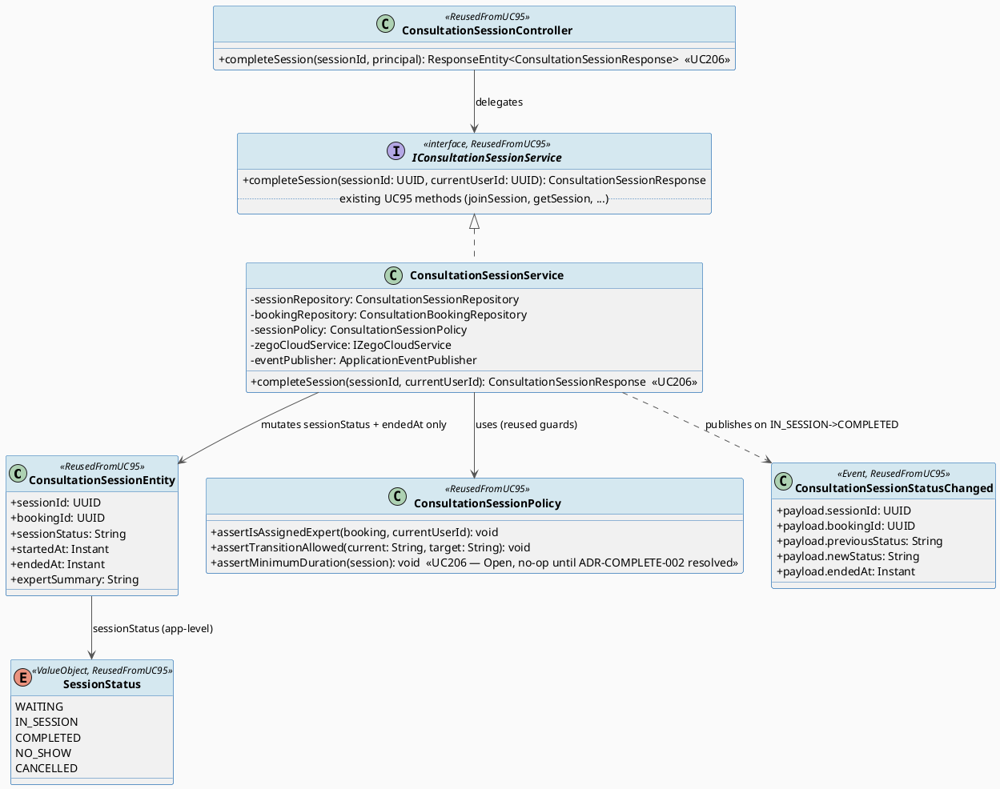
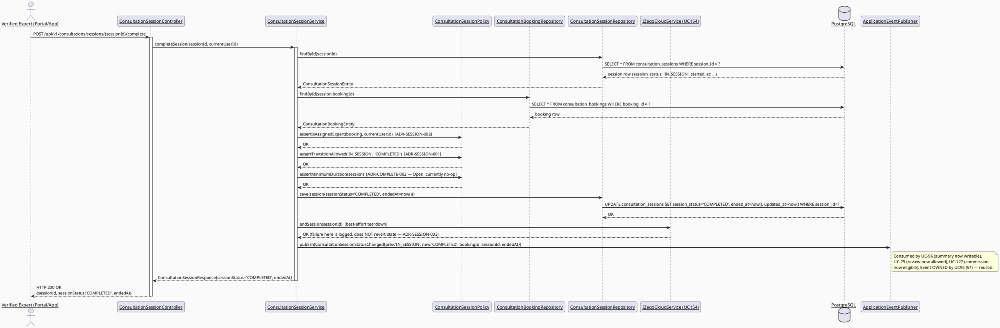
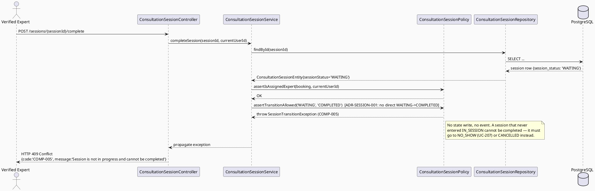
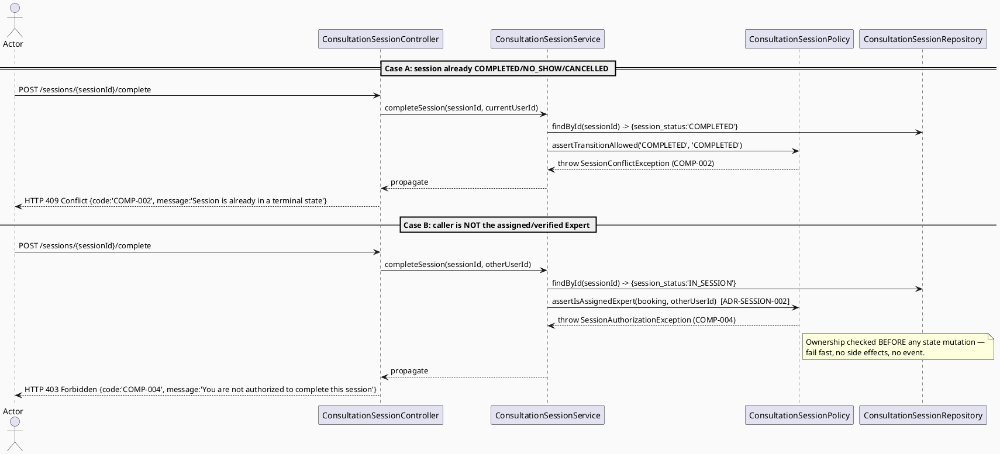
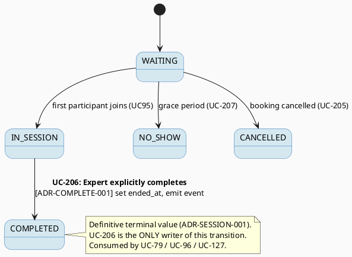

# ENGINEERING DOCUMENTATION STANDARD (EDS) v2.0
# UC206 — Complete Consultation — Technical Design Specification

| Field | Value |
|-------|-------|
| **Document ID** | `CB-CONSULTATION-IMP-206` |
| **Version** | `1.0` |
| **Date** | `2026-07-03` |
| **Status** | `Draft` |
| **Document Owner** | `TV4-Lâm` |
| **Author** | `AI Agent (Technical Architect + Test Designer)` |
| **Reviewed by** | `[Tech Lead — Pending]` |
| **DPO Sign-off** | `[ ] Pending` *(completion unlocks downstream summary/review/commission flows that touch health-context + payment data — see §1)* |
| **Approved by** | `[Principal Architect — Pending]` |
| **Last Review** | `2026-07-03` |
| **Based on EDS** | `v2.0` |

---

## CHANGELOG

> **Policy 4.4 — Immutable History:** Không bao giờ xóa thông tin cũ. Mọi thay đổi phải ghi vào bảng này.

| Ngày | Người thực hiện | Nội dung thay đổi |
|------|-----------------|-------------------|
| 2026-07-03 | AI Agent — Technical Architect | Tạo tài liệu lần đầu (Draft) cho UC206 |

---

## MỤC LỤC

1. [Tổng quan Module](#1-tổng-quan-module)
2. [Ma trận Truy vết (Traceability Matrix)](#2-ma-trận-truy-vết-traceability-matrix)
3. [Architecture Decision Records (ADR)](#3-architecture-decision-records-adr)
4. [Non-Functional Requirements & SLA](#4-non-functional-requirements--sla)
5. [Static Modeling (Mô hình Tĩnh)](#5-static-modeling-mô-hình-tĩnh)
6. [Dynamic Modeling (Mô hình Động)](#6-dynamic-modeling-mô-hình-động)
7. [Domain Event Catalog](#7-domain-event-catalog)
8. [Interface Specification (Đặc tả Giao diện)](#8-interface-specification-đặc-tả-giao-diện)
9. [API Specification](#9-api-specification)
10. [Bảng mã lỗi (Error Codes)](#10-bảng-mã-lỗi-error-codes)
11. [Quy trình Triển khai (Step-by-Step)](#11-quy-trình-triển-khai-step-by-step)
12. [Rollback & Incident Runbook](#12-rollback--incident-runbook)
13. [Kịch bản Kiểm thử Chi tiết](#13-kịch-bản-kiểm-thử-chi-tiết)
14. [Phương pháp Xác minh](#14-phương-pháp-xác-minh)
15. [Mẫu thử thực tế (API Verification Samples)](#15-mẫu-thử-thực-tế-api-verification-samples)
16. [Bảng tổng hợp phân quyền (Authorization Matrix)](#16-bảng-tổng-hợp-phân-quyền-authorization-matrix)
17. [AI Prompt Constraints (CASE 2.0)](#17-ai-prompt-constraints-case-20)

---

## 1. Tổng quan Module

> UC-206 Complete Consultation là **một transition cụ thể** của state machine phiên tư vấn do UC95 sở hữu: `IN_SESSION → COMPLETED`. Nó KHÔNG tạo entity/service mới — nó dùng lại `ConsultationSessionEntity`/`ConsultationSessionService` của UC95 và chỉ bổ sung logic nghiệp vụ đặc thù cho hành động "hoàn tất" (ai được kích hoạt, side-effect nào phát ra khi session đạt `COMPLETED`).

| Field | Value |
|-------|-------|
| **Module Name** | `Consultation — Session Completion` |
| **Bounded Context** | `Consultation` (package `com.carebridge.backend.consultation`) |
| **Function ID / UC** | `3.3.14.5 Complete Consultation` / `UC-206` (SRS L4431-4450, Table 228) |
| **Primary Actor** | Verified Expert (SRS L4436 — Primary Actor, no Secondary Actors) |
| **Secondary Actor** | None (SRS L4436) |
| **Platform** | **Expert App / Portal** (SRS L4447: "Platform: Expert App/Portal") — Web (React+TS+Vite) + Mobile (Flutter, mockup CB-185) |
| **Priority** | Medium (SRS L4444) |
| **Frequency of Use** | Regular (SRS L4445) |
| **Sprint / Owner** | Sprint 4 "Real Providers And Admin Polish" — TV4-Lâm |
| **Data Classification** | `Confidential` (session metadata; completion is the fan-out trigger that unlocks `Sensitive-PII` summary content (UC-96) and payment/commission reconciliation (UC-127)) |
| **Compliance Scope** | `PDPA (Luật 91/2025)`, internal `BR-RBAC`, `BR-CONSULTATION` (exactly the two Business Rules SRS L4446 lists for UC-206 — NOT BR-SAFETY/BR-PRIVACY, which SRS lists for UC-207 No-show, not for UC-206) |
| **Upstream Dependencies** | `UC-95 Manage Consultation Session` (owns `ConsultationSessionEntity`, `ConsultationSessionService`, the session state machine `ADR-SESSION-001`, the ownership check `ADR-SESSION-002`, and the `ConsultationSessionStatusChanged` domain event — UC-206 reuses ALL of these, does not redefine them) |
| **Downstream Consumers** | `UC-96 Write Consultation Summary` (may write `expert_summary` only after `session_status='COMPLETED'` — ADR-SUMMARY-001), `UC-79 Review Expert After Consultation` (Mother may review only after completion — ADR-REVIEW-001), `UC-127 Calculate Revenue and Commission` (commission becomes eligible — `commission_records.eligible_at`/`settlement_status`), Notification service |

### 1.1 Scope Statement — A single transition on an existing schema + service contract

UC-206 is greenfield code within the same package as UC95/UC96
(`com.carebridge.backend.consultation` currently holds placeholder files
only). It does **not** introduce a new table, entity, repository, or service
class. It mutates exactly two existing columns of `consultation_sessions`
(`session_status`, `ended_at`) via UC95's `ConsultationSessionService`, and
publishes UC95's already-defined `ConsultationSessionStatusChanged` event.
The persistence target already exists (`V1__init_schema.sql` L898-909,
verified — see §5.3). This TDS designs only the completion-specific business
logic and its API surface.

### 1.2 Relationship to UC95 `endSession` — Cross-Document Reconciliation (Open follow-up)

`UC95_ManageConsultationSession_TDS.md` §8.1 already sketches a method
`endSession(UUID sessionId, UUID currentUserId)` performing the identical
`IN_SESSION → COMPLETED` transition (UC95 §6.2, §6.4). **UC-206 is the
use-case-level owner of this completion action** — the SRS defines it as a
first-class use case ("UC-206 Complete Consultation") whose Description
(L4438) is "Ends the session and changes status for summary, review, and
reconciliation," i.e. the *downstream fan-out* that UC95's terse `endSession`
sketch did not enumerate.

To avoid two divergent methods/endpoints for one transition, this TDS:
- Names the canonical method **`completeSession(...)`** (aligned with the
  use-case name), added to UC95's **existing** `IConsultationSessionService`
  interface (§8.1) — NOT a new service.
- Recommends UC95's sketched `endSession(...)` be treated as the **same
  operation** and converge on `completeSession(...)`. Both UC95 and UC206 are
  `Draft`; this is a naming reconciliation, not a design conflict.
- **Marked `Open` cross-document follow-up (§2):** Tech Lead to confirm the
  single canonical name (`completeSession`) and single canonical path
  (`POST .../complete`) before implementation, so UC95's §8.1/§9.1 text is
  updated to match rather than shipping a duplicate `endSession`/`/end`.

### 1.3 Session state machine — Reused verbatim from UC95, NOT redefined here

The session lifecycle enum and its transitions are owned by
`UC95_ManageConsultationSession_TDS.md §ADR-SESSION-001`:

```
SessionStatus { WAITING, IN_SESSION, COMPLETED, NO_SHOW, CANCELLED }
terminal states: COMPLETED, NO_SHOW, CANCELLED
no direct WAITING → COMPLETED transition (must pass through IN_SESSION)
```

UC-206 implements **only** the edge `IN_SESSION → COMPLETED`. It cites
`ADR-SESSION-001` (state machine), `ADR-SESSION-002` (`assertIsAssignedExpert`
ownership), and `ADR-SESSION-003` (ZegoCloud failure must not mutate
`session_status`) as authoritative external decisions (still `Draft` upstream
— expected/normal, not a blocker). It adds only `ADR-COMPLETE-001`
(completion trigger + side-effect fan-out) and `ADR-COMPLETE-002`
(minimum-elapsed-duration — `Open`).

### 1.4 UI-sourced note — Post-completion obligations (informational, not a hard SRS rule)

Mobile mockup `CB-185 Complete Consultation Confirmation (UC-206)` shows the
confirmation bottom-sheet ("Hoàn tất tư vấn") with: patient identity
("Bệnh nhân"), session duration ("Thời lượng — 45 phút"), an informational
banner ("Sau khi hoàn tất, bạn cần gửi tóm tắt buổi tư vấn cho bệnh nhân
trong vòng 24 giờ. Quá trình thanh toán sẽ được thực hiện sau đó."), and two
actions **HOÀN TẤT** (Complete) / **QUAY LẠI** (Back). This corroborates the
downstream fan-out (summary → payment/reconciliation). The **"within 24
hours" summary-submission window is a UI copy element, not an SRS/BR-stated
enforceable deadline** — it is therefore recorded as `Open` (not implemented
as a hard timer in this TDS; no SRS/BR source defines a 24h enforcement
rule). Web entry point is `CB-060 Consultation Detail` (shared multi-UC
screen; the "Complete" action lives on the Expert-side detail view).

---

## 2. Ma trận Truy vết (Traceability Matrix)

| Requirement ID | Loại (BR/ADR/US) | Mô tả yêu cầu | Thành phần Code | Compliance Target | ADR liên quan |
|----------------|------------------|---------------|-----------------|-------------------|---------------|
| UC-206 (SRS §3.3.14.5, L4431-4450) | Use Case | "Ends the session and changes status for summary, review, and reconciliation" | `ConsultationSessionController.completeSession`, `ConsultationSessionService.completeSession` | BR-CONSULTATION | ADR-COMPLETE-001 |
| BR-RBAC (SRS L4446) | Business Rule | Users may access only functions allowed by role/permission scope | `ConsultationSessionPolicy.assertIsAssignedExpert()` (reused) | Authorization | ADR-SESSION-002 (reused) |
| BR-CONSULTATION (SRS L4446) | Business Rule | Booking/session actions keep an auditable lifecycle state | `ConsultationSessionEntity.sessionStatus`, `ConsultationSessionStatusChanged` emission | PDPA / BR-AUDIT | ADR-SESSION-001 (reused), ADR-COMPLETE-001 |
| SRS E1 (L4443) | Exception Flow | Access denied when unauthenticated/unauthorized/out of scope | `assertIsAssignedExpert()` → `COMP-004` | BR-RBAC | ADR-SESSION-002 (reused) |
| SRS E2 (L4443) | Exception Flow | Invalid/conflicting data rejected with action-level message | State-transition guard → `COMP-005` / `COMP-002` | BR-CONSULTATION | ADR-SESSION-001 (reused), ADR-COMPLETE-001 |
| SRS E3 (L4443) | Exception Flow | External/network/server failure → retry guidance, no duplicate unsafe action | `completeSession()` DB-failure handling → `COMP-500`; ZegoCloud teardown failure must not block state (ADR-SESSION-003) | BR-CONSULTATION | ADR-SESSION-003 (reused) |
| ADR-SESSION-001 (UC95, reused) | External Decision | State machine; `'COMPLETED'` is definitive terminal value; no direct `WAITING→COMPLETED` | `ConsultationSessionPolicy.assertTransitionAllowed('IN_SESSION','COMPLETED')` | BR-CONSULTATION | — |
| ADR-SESSION-002 (UC95, reused) | External Decision | Only assigned, verified Expert may act on the session | `ConsultationSessionPolicy.assertIsAssignedExpert()` | BR-RBAC | — |
| ADR-SESSION-003 (UC95, reused) | External Decision | ZegoCloud failure must NOT mutate `session_status` | `completeSession()` teardown ordering (persist state first, then best-effort Zego teardown) | BR-CONSULTATION | — |
| ADR-COMPLETE-001 (new) | Decision | Only the assigned verified Expert may complete an `IN_SESSION` session; completion sets `ended_at`, emits event unlocking UC-79/UC-96/UC-127 | `ConsultationSessionService.completeSession()` | BR-CONSULTATION | — |
| ADR-COMPLETE-002 (new, Open) | Decision | Whether a minimum elapsed session duration is required before completion | `ConsultationSessionPolicy.assertMinimumDuration()` *(Open — not implemented until confirmed)* | — | — |
| Schema: `consultation_sessions` (`V1__init_schema.sql` L898-909) | Schema Contract | Completion mutates `session_status`, `ended_at` only | `ConsultationSessionEntity` (reused from UC95) | — | — |
| `ConsultationSessionStatusChanged` (UC95 §7, reused) | Reused Contract | Event carrying old/new status + booking_id + session_id, consumed by UC-79/UC-96/UC-127 | `ConsultationSessionStatusChanged.java` (owned by UC95) | BR-AUDIT | ADR-SESSION-001 |
| §1.2 Naming reconciliation | Cross-Document / Open | Converge UC95 `endSession`/`/end` with UC206 `completeSession`/`/complete` | `IConsultationSessionService` | — | ADR-COMPLETE-001 |
| §1.4 24h summary window | Open Item | UI copy only; not an enforced deadline in this TDS | N/A | — | — |

---

## 3. Architecture Decision Records (ADR)

> **Reused external decisions (cited, NOT redefined here):**
> `ADR-SESSION-001` (session state machine + definitive `'COMPLETED'` terminal
> value), `ADR-SESSION-002` (`assertIsAssignedExpert` ownership), and
> `ADR-SESSION-003` (ZegoCloud failure must not mutate `session_status`) are
> all owned by `UC95_ManageConsultationSession_TDS.md §3` (status `Accepted`
> within that TDS, whole TDS still `Draft` — expected). UC-206 depends on them
> verbatim. Only the two ADRs below are new to UC-206.

### ADR-COMPLETE-001 — Completion trigger, guard, and downstream side-effect fan-out

| Field | Value |
|-------|-------|
| **Status** | `Accepted` *(within this Draft TDS — pending Tech Lead sign-off)* |
| **Deciders** | `AI Agent (proposal) — pending TV4-Lâm / Tech Lead confirmation` |
| **Date** | `2026-07-03` |
| **Supersedes** | Formalizes and takes ownership of the `IN_SESSION → COMPLETED` transition that UC95 §8.1 sketched as `endSession(...)` (see §1.2 — naming reconciliation, both Draft) |

#### Bối cảnh (Context)
SRS UC-206 (L4438): "Ends the session and changes status for summary, review,
and reconciliation." The session state machine (`ADR-SESSION-001`) already
defines `IN_SESSION → COMPLETED` as the only edge into `COMPLETED` and marks
`'COMPLETED'` as the definitive terminal value that UC-96 (summary
eligibility) and UC-79 (review eligibility) read. UC-206 must define: (a) who
may trigger it, (b) what state guard applies, (c) exactly which fields change,
(d) what side effects fire, and (e) idempotency/repeat behavior — without
re-deciding the state machine itself.

#### Các phương án đã xem xét (Options Considered)

| Phương án | Mô tả | Ưu điểm | Nhược điểm |
|-----------|-------|----------|------------|
| A | Completion is inferred automatically from ZegoCloud room teardown / both-parties-left webhook | No explicit Expert action needed | Violates `ADR-SESSION-003` (disconnect must NOT auto-transition); a flaky network drop would wrongly mark the session complete; SRS names an explicit actor-initiated use case, not an automated one |
| B | **Only the assigned, verified Expert explicitly completes an `IN_SESSION` session via `completeSession()`. It sets `session_status='COMPLETED'`, `ended_at=now()`, persists FIRST, THEN best-effort ZegoCloud teardown, THEN emits `ConsultationSessionStatusChanged{previous:'IN_SESSION', new:'COMPLETED'}`. The event unlocks UC-96 (summary), UC-79 (review), UC-127 (commission eligibility). Repeat calls on an already-terminal session are rejected (`COMP-002`), not silently re-applied.** | Matches SRS actor + description exactly; reuses `ADR-SESSION-001/002/003`; a single explicit, auditable trigger; clean precondition for all three downstream consumers | Requires the Expert to take an explicit action (acceptable — mockup CB-185 shows exactly this confirmation step) |
| C | Allow completion from any non-terminal state (including `WAITING`) as a convenience | Fewer error paths | Directly violates `ADR-SESSION-001` invariant (no direct `WAITING→COMPLETED`); would let an Expert "complete" a session that never actually started, corrupting review/commission downstream |

#### Quyết định (Decision)
Chọn **Phương án B**. `completeSession(sessionId, currentUserId)`:
1. Loads the session; `404 COMP-003` if absent.
2. `ConsultationSessionPolicy.assertIsAssignedExpert(booking, currentUserId)`
   (reused `ADR-SESSION-002`) — `403 COMP-004` if not the assigned, verified
   Expert.
3. `ConsultationSessionPolicy.assertTransitionAllowed(current, 'COMPLETED')`
   (reused `ADR-SESSION-001`): if current is a terminal state → `409 COMP-002`;
   if current is `WAITING` (not yet started) → `409 COMP-005`; only
   `IN_SESSION` proceeds.
4. Sets `session_status='COMPLETED'`, `ended_at=now()`; persists via the
   existing `ConsultationSessionService`/repository (scoped update — never
   touches `expert_summary`, which is UC-96's exclusive write scope).
5. Best-effort `IZegoCloudService.endSession(sessionId)` teardown; a teardown
   failure is logged but does **not** revert the persisted `COMPLETED` state
   (ordering enforces `ADR-SESSION-003`: the realtime layer never gates the
   authoritative lifecycle state).
6. Publishes `ConsultationSessionStatusChanged` (UC95-owned event, §7) —
   consumers UC-79/UC-96/UC-127 gate their eligibility on `newStatus='COMPLETED'`.

#### Hệ quả (Consequences)

**Tích cực:** One explicit, auditable completion trigger; downstream fan-out (summary/review/commission) has a single unambiguous precondition; reuses the whole UC95 state-machine + ownership + failure-safety surface with zero duplication.
**Tiêu cực / Trade-offs:** Completion is manual (no auto-complete) — acceptable and SRS-aligned. An abandoned `IN_SESSION` session with no explicit completion falls to UC-207 No-show / a reconciliation job (out of scope here, per `ADR-SESSION-003`).
**Compliance Impact:** Supports BR-CONSULTATION auditable-lifecycle requirement; enforces BR-RBAC via reused ownership check.

---

### ADR-COMPLETE-002 — Minimum elapsed session duration before completion (Open)

| Field | Value |
|-------|-------|
| **Status** | `Proposed` *(Open — no source value; blocked pending Product/Tech Lead input)* |
| **Deciders** | `Product / Tech Lead — pending` |
| **Date** | `2026-07-03` |

#### Bối cảnh (Context)
A theoretical abuse vector: an Expert joins (`WAITING → IN_SESSION`) and
immediately completes (`IN_SESSION → COMPLETED`) within seconds, unlocking
commission/review for a consultation that never meaningfully occurred. A
minimum-elapsed-time guard (e.g. "cannot complete within N seconds/minutes of
`started_at`") would mitigate this.

#### Các phương án đã xem xét (Options Considered)

| Phương án | Mô tả | Ưu điểm | Nhược điểm |
|-----------|-------|----------|------------|
| A | Enforce a hard minimum duration `N` before `completeSession()` is allowed | Deters instant-complete abuse | **No SRS/BR/mockup source specifies any value for `N`** — inventing a number would violate the "never invent requirements/SLAs" rule; a wrong value could block legitimate short consultations |
| B | **Do not enforce a minimum duration in this TDS. Record the risk and mark the value `Open`. The mockup CB-185 displays elapsed duration ("45 phút") informationally only — no source ties completion eligibility to a duration threshold.** | Faithful to sources; avoids fabricating a business rule; abuse is separately deterrable via dispute (UC-78/UC-209) and audit trail | The instant-complete vector remains open until Product decides |

#### Quyết định (Decision)
Chọn **Phương án B**. **No minimum-duration guard is implemented.** The SRS
(L4431-4450) states no such rule; the mockup shows duration for display only.
`ConsultationSessionPolicy.assertMinimumDuration()` is specified as an
**Open, not-yet-implemented** hook: if Product later defines a threshold, it
plugs in here without altering the completion flow. Until then, completion is
allowed at any elapsed time ≥ 0 from `started_at`.

#### Hệ quả (Consequences)

**Tích cực:** No invented business rule; sources honored; abuse mitigations (dispute + audit) already exist elsewhere.
**Tiêu cực / Trade-offs:** Instant-complete abuse vector remains until Product provides a value — accepted, tracked as `Open`.
**Compliance Impact:** None until a value is defined.

---

## 4. Non-Functional Requirements & SLA

> No SRS/BR source specifies numeric SLA targets for UC-206. Values below are
> **Open — proposed defaults**, must be confirmed by Tech Lead.

### 4.1. Performance & Availability

| Category | Requirement | Target SLA | Measurement Method | Compliance Basis |
|----------|-------------|------------|---------------------|------------------|
| Latency | `POST /sessions/{id}/complete` p99 (state write + event publish; excludes best-effort async ZegoCloud teardown) | `< 400ms` *(Open — proposed)* | Manual/API test timing | — |
| Availability | Dependent on UC-95 session service being implemented (§11.1) | N/A until dependency implemented | — | — |
| Event fan-out | `ConsultationSessionStatusChanged` delivered to UC-79/UC-96/UC-127 consumers | Async, best-effort (Spring `ApplicationEventPublisher`) | Log inspection (§14.2) | BR-AUDIT |

### 4.2. Data Integrity & Retention

| Category | Requirement | Target | Verification Method | Compliance Basis |
|----------|-------------|--------|---------------------|------------------|
| Durability | No lost completion transition | RPO = 0 | Transaction log | BR-CONSULTATION |
| Consistency | `session_status` reaches `'COMPLETED'` and `ended_at` set atomically in one transaction; event emitted only after commit | 100% (service-level, `@Transactional`) | Reconciliation query (§14.1) | ADR-COMPLETE-001 |
| Integrity | `consultation_sessions.session_status` has **no `CHECK` constraint** (schema gap, see §5.3) — enum enforced app-level | 100% app-level enforcement | Policy code review + TC | ADR-SESSION-001 |

### 4.3. Security

| Category | Requirement | Target | Verification Method | Compliance Basis |
|----------|-------------|--------|---------------------|------------------|
| Access control | Role-based, ownership-scoped | Least privilege (only the assigned, verified Expert may complete their own session) | Auth Matrix (§16) | BR-RBAC / ADR-SESSION-002 |
| Auditability | Every completion emits an auditable event with old/new status | 100% | Log inspection (§14.2) | BR-CONSULTATION |

### 4.4. Scalability & Capacity Planning

SRS marks UC-206 "Frequency of Use: Regular" (L4445). Completion volume tracks
completed-booking volume; a single-row status update plus one event publish
requires no special scaling beyond standard Spring Boot request handling at
current expected scale.

> **Known NFR risk (repeated from UC78's TDS observation):** there is **no
> index on `consultation_sessions.session_status`** (schema indices
> `V1__init_schema.sql` ~L1636-1646 do not include it). UC-206's own write path
> keys on `session_id` (the PK), so it is unaffected. This is flagged only
> because downstream consumers (UC-79/UC-96/UC-127) or a future no-show
> reconciliation job that scans `WHERE session_status = ...` would benefit from
> such an index. **UC-206 does NOT add a migration for this** — if/when a
> scanning consumer needs it, the exact Flyway file would be
> `V{next}__add_index_consultation_sessions_session_status.sql` (next
> unused version number to be confirmed against the migration folder at
> implementation time; no collision may be introduced). Out of scope for
> UC-206; recorded as an `Open` NFR note only.

---

## 5. Static Modeling (Mô hình Tĩnh)

### 5.1. Component Responsibilities & Planned File Paths

| Layer | File Path | Responsibility |
|-------|-----------|----------------|
| Controller | `src/main/java/com/carebridge/backend/consultation/controller/ConsultationSessionController.java` *(reused from UC95 — UC-206 adds ONE handler: `completeSession`)* | HTTP mapping + DTO validation only for `POST /sessions/{id}/complete` |
| Service | `src/main/java/com/carebridge/backend/consultation/service/ConsultationSessionService.java` *(reused from UC95 — UC-206 adds ONE method: `completeSession`)* | Completion workflow: guard → mutate `session_status`/`ended_at` → best-effort Zego teardown → emit event |
| Repository | `src/main/java/com/carebridge/backend/consultation/repository/ConsultationSessionRepository.java` *(reused from UC95)* | Persistence for `consultation_sessions` (scoped update of lifecycle fields) |
| Repository | `src/main/java/com/carebridge/backend/consultation/repository/ConsultationBookingRepository.java` *(reused from UC78/79/95, interface only)* | Read-only lookup for the ownership check |
| Entity | `src/main/java/com/carebridge/backend/consultation/entity/ConsultationSessionEntity.java` *(reused from UC95 — NOT redefined)* | JPA mapping for `consultation_sessions` |
| Policy | `src/main/java/com/carebridge/backend/consultation/policy/ConsultationSessionPolicy.java` *(reused from UC95 — UC-206 uses `assertIsAssignedExpert`, `assertTransitionAllowed`; adds Open hook `assertMinimumDuration`)* | Ownership + state-transition guard |
| DTO | `src/main/java/com/carebridge/backend/consultation/dto/response/ConsultationSessionResponse.java` *(reused from UC95)* | Outbound payload for the completed session |
| Mapper | `src/main/java/com/carebridge/backend/consultation/mapper/ConsultationSessionMapper.java` *(reused from UC95)* | Entity ↔ DTO, never expose entity |
| Event | `src/main/java/com/carebridge/backend/consultation/event/ConsultationSessionStatusChanged.java` *(owned by UC95 — reused, NOT redefined)* | Domain event published on the `IN_SESSION → COMPLETED` transition |
| Web Service | `05_Development/CareBridgeWebApp/src/features/consultationManagement/services/consultationSessionApi.ts` *(reused from UC95 — adds `completeSession` mutation)* | API client (TanStack Query mutation hook) |
| Web Component | `05_Development/CareBridgeWebApp/src/features/consultationManagement/components/CompleteConsultationDialog.tsx` | Confirmation dialog (CB-060 Expert detail entry point) |
| Mobile | `05_Development/CareBridgeMobileApp/lib/features/consultation/presentation/complete_consultation_sheet.dart` | Confirmation bottom-sheet (mockup CB-185) |

### 5.2. Class Diagram (PlantUML)

> Reuses `ConsultationSessionEntity`, `ConsultationSessionService`,
> `ConsultationSessionPolicy`, `ConsultationSessionStatusChanged` from UC95.
> Only the `completeSession(...)` method + controller handler are new.



### 5.3. Data Structure — Schema/Migration Details

> **CareBridge rule:** `V1__init_schema.sql` and approved Flyway migrations are
> the primary source of truth. ERD is supporting context only.

**No new migration is required.** UC-206 mutates two existing columns of an
existing table (`V1__init_schema.sql` L898-909, verified):

```sql
-- consultation_sessions (V1__init_schema.sql L898-909)
CREATE TABLE public.consultation_sessions (
    session_id            uuid         NOT NULL DEFAULT gen_random_uuid(),
    booking_id            uuid         NOT NULL,
    communication_room_id varchar(255),
    started_at            timestamptz,
    ended_at              timestamptz,   -- UC-206 sets = now() on completion
    session_status        varchar(30)  NOT NULL DEFAULT 'WAITING',  -- UC-206 sets = 'COMPLETED'
    expert_summary        text,          -- NOT touched by UC-206 (UC-96's exclusive scope)
    technical_log_json    jsonb,
    created_at            timestamptz  NOT NULL DEFAULT now(),
    updated_at            timestamptz  NOT NULL DEFAULT now()
);
-- PK: session_id (~L1425-1426); UNIQUE: booking_id (~L1527-1528);
-- FK: booking_id -> consultation_bookings (~L1838-1839)
```

**Schema facts / gaps relevant to UC-206 (all `Open`/`known`, none blocking,
NO migration proposed):**
1. **No `CHECK` constraint on `session_status`** — enum enforced app-level in
   `ConsultationSessionPolicy` (consistent with `ADR-SESSION-001` Option B and
   the deliberate no-DB-CHECK convention across every consultation-domain
   status column). UC-206 must not add a DB CHECK constraint.
2. **No index on `session_status`** — see §4.4 known NFR risk. UC-206's write
   keys on the PK, unaffected. No migration added by UC-206.
3. Real booking status lives on `consultation_bookings.status` (L893,
   `varchar(30) DEFAULT 'PENDING_PAYMENT'`) — a **separate** column from
   `session_status`. UC-206 does **not** assume any unified `consultations`
   table (that was UC75's Draft deviation, which does not match this schema).

**No sync action needed for `V1__init_schema.sql`.**

---

## 6. Dynamic Modeling (Mô hình Động)

### 6.1. Sequence Diagram — Happy Path: Expert Completes an IN_SESSION Session (PlantUML)



### 6.2. Sequence Diagram — Error: Wrong State (WAITING, not started) → Rejected (PlantUML)



### 6.3. Sequence Diagram — Error: Already Terminal + Ownership Denied (PlantUML)



### 6.4. State Machine — Reused from UC95 (UC-206 owns ONE edge)

> UC-206 does **not** own a state machine. It implements the single edge
> highlighted below, from UC95's `ADR-SESSION-001` machine
> (`UC95_ManageConsultationSession_TDS.md §6.4`).



**⚠️ Invariant bất biến (UC-206-specific, atop UC95's invariants):**
1. `completeSession()` sets `'COMPLETED'` **only** from a current
   `session_status == 'IN_SESSION'` — never from `WAITING` (→ `COMP-005`) nor
   from any terminal state (→ `COMP-002`). Reuses `ADR-SESSION-001`.
2. Completion mutates **only** `session_status` and `ended_at` (+ `updated_at`)
   — never `expert_summary` (UC-96's scope) nor `started_at`.
3. A ZegoCloud teardown failure during completion **never** reverts or blocks
   the persisted `COMPLETED` state (`ADR-SESSION-003`).
4. The `ConsultationSessionStatusChanged` event is published **only after** the
   DB transaction commits, and carries `previousStatus='IN_SESSION'`,
   `newStatus='COMPLETED'`.
5. Only the assigned, `verification_status='VERIFIED'` Expert may complete
   (`ADR-SESSION-002`).

---

## 7. Domain Event Catalog

> UC-206 **reuses** the `ConsultationSessionStatusChanged` event defined and
> owned by `UC95_ManageConsultationSession_TDS.md §7` — it does **not** define
> a new event. UC-96 already documents this exact event (payload
> `newStatus='COMPLETED'`) as its informational upstream dependency
> (`UC96 §7.2`), so the contract below matches what UC-96 expects verbatim.

### 7.1. Events Published (Phát ra)

| Event Name | Trigger | Publisher | Subscriber(s) | Payload Schema | Async? |
|------------|---------|-----------|---------------|----------------|--------|
| `ConsultationSessionStatusChanged` (with `payload.newStatus='COMPLETED'`) | `completeSession()` commits the `IN_SESSION → COMPLETED` transition | `ConsultationSessionService` (UC-206 code path) | `UC-96` (summary-eligibility gate), `UC-79` (review-eligibility gate), `UC-127` (commission-eligibility: `commission_records.eligible_at`/`settlement_status`), Notification service, Audit log | `ConsultationSessionStatusChanged.java` (owned by UC95) | Yes |

### 7.2. Events Consumed (Tiêu thụ)

| Event Name | Source | Handler | Action thực hiện |
|------------|--------|---------|------------------|
| *(None)* | — | — | UC-206 reads session/booking state synchronously at request time; it consumes no external event. |

### 7.3. Payload Schema (reused from UC95 — shown for reference, NOT redefined)

```java
// ConsultationSessionStatusChanged.java  (OWNED BY UC95 — reused verbatim)
public record ConsultationSessionStatusChanged(
    UUID    eventId,
    String  eventType,       // "ConsultationSessionStatusChanged"
    Instant occurredAt,
    String  version,         // "1.0"
    Payload payload,
    Metadata metadata
) implements ApplicationEvent {

    public record Payload(
        UUID    sessionId,
        UUID    bookingId,
        String  previousStatus,  // UC-206 completion: "IN_SESSION"
        String  newStatus,       // UC-206 completion: "COMPLETED"
        Instant startedAt,       // carried through (nullable)
        Instant endedAt          // UC-206 completion: now()
    ) {}

    public record Metadata(
        UUID   correlationId,
        String causedBy          // the completing Expert's userId
    ) {}
}
```

> **Consumer contract note (UC-96/UC-79/UC-127):** each downstream consumer
> gates its action on `payload.newStatus == "COMPLETED"`. UC-96 re-reads
> `session_status` synchronously at summary-write time (per `UC96 §7.2`) rather
> than reacting to the event; the event still serves the audit trail and
> notification fan-out. UC-127 keys commission eligibility off the same
> `COMPLETED` transition (persisted to `commission_records.eligible_at`, out of
> scope here).

---

## 8. Interface Specification (Đặc tả Giao diện)

> UC-206 adds **one method** to UC95's **existing** `IConsultationSessionService`
> — it does NOT redefine the whole service. Only the `completeSession(...)`
> signature + its DTO are specified here; all other methods remain as UC95 §8.1
> defines them.

### 8.1. Service Interface (delta only)

```java
// ConsultationSessionResponse.java — Output DTO (REUSED from UC95 §8.1)
// public class ConsultationSessionResponse {
//     private UUID sessionId; private UUID bookingId; private String communicationRoomId;
//     private String sessionStatus;  // "COMPLETED" after UC-206
//     private Instant startedAt; private Instant endedAt;
// }

// IConsultationSessionService.java — Service Contract (UC-206 ADDS this method)
// @version 1.1  (adds completeSession; supersedes UC95 §8.1 sketch of endSession — §1.2)
public interface IConsultationSessionService {

    // ... existing UC95 methods (joinSession, getSession, listAssignedSessions, ...) ...

    /**
     * Completes an in-progress consultation session (UC-206).
     * Transitions session_status IN_SESSION -> COMPLETED, sets ended_at = now(),
     * best-effort ZegoCloud teardown, and publishes ConsultationSessionStatusChanged,
     * unlocking UC-96 (summary), UC-79 (review), UC-127 (commission eligibility).
     *
     * @throws SessionNotFoundException       (COMP-003) if sessionId does not exist
     * @throws SessionAuthorizationException  (COMP-004) if currentUserId is not the assigned, verified Expert
     * @throws SessionConflictException       (COMP-002) if session is already in a terminal state
     * @throws SessionTransitionException     (COMP-005) if session is not currently IN_SESSION (e.g. WAITING)
     */
    ConsultationSessionResponse completeSession(UUID sessionId, UUID currentUserId);
}
```

### 8.2. Repository Interface (reused from UC95 — no new method required)

```java
// ConsultationSessionRepository.java  (REUSED from UC95 §8.2)
// @version 1.0
public interface ConsultationSessionRepository extends JpaRepository<ConsultationSessionEntity, UUID> {

    Optional<ConsultationSessionEntity> findById(UUID sessionId);

    // UC-206 persists the completed session via the standard JpaRepository.save()
    // through UC95's ConsultationSessionService (which already guards the transition).
    // No new @Modifying query is introduced — the entity save() path already exists.
    // Completion touches ONLY sessionStatus + endedAt + updatedAt; never expertSummary.
}
```

---

## 9. API Specification

### 9.1. Endpoints Table

| Method | Path | Auth Level | Required Roles | Rate Limit | Idempotent? |
|--------|------|------------|----------------|------------|-------------|
| `POST` | `/api/v1/consultations/sessions/{sessionId}/complete` | JWT Bearer | `EXPERT` (assigned, verified only) | 20/min | No — repeat call on an already-`COMPLETED` session returns `409 COMP-002` (not a silent 200) |

> **§1.2 reconciliation:** this canonical path supersedes UC95's sketched
> `POST /sessions/{id}/end`; converge on `/complete` (Open — Tech Lead confirm).

### 9.2. Request / Response Schemas

#### `POST /api/v1/consultations/sessions/{sessionId}/complete` — Expert completes the session

**Request Body:** *(none — the session is identified by the path; no body fields
required. An optional idempotency/confirmation header may be added later, out
of scope.)*

**Response — 200 OK (Happy Path):**
```json
{
  "sessionId": "9f8e7d6c-1234-4a5b-8c9d-0e1f2a3b4c5d",
  "bookingId": "3fa85f64-5717-4562-b3fc-2c963f66afa6",
  "communicationRoomId": "9f8e7d6c-1234-4a5b-8c9d-0e1f2a3b4c5d",
  "sessionStatus": "COMPLETED",
  "startedAt": "2026-07-03T10:00:00.000Z",
  "endedAt": "2026-07-03T10:45:00.000Z"
}
```

**Response — 409 Conflict (Not currently IN_SESSION — e.g. still WAITING):**
```json
{
  "error": {
    "code": "COMP-005",
    "message": "Session is not in progress and cannot be completed"
  }
}
```

**Response — 409 Conflict (Already terminal):**
```json
{
  "error": {
    "code": "COMP-002",
    "message": "Session is already in a terminal state"
  }
}
```

**Response — 403 Forbidden (Not the assigned, verified Expert):**
```json
{
  "error": {
    "code": "COMP-004",
    "message": "You are not authorized to complete this session"
  }
}
```

**Response — 404 Not Found:**
```json
{
  "error": {
    "code": "COMP-003",
    "message": "Session not found"
  }
}
```

---

## 10. Bảng mã lỗi (Error Codes)

> Prefix `COMP-` is unique to UC-206 completion logic — it does not collide with
> `CON-0xx`, `DISP-0xx`, `SES-0xx`, `SUMW-0xx`, `CDT-0xx`, `RESCH-0xx`, or
> `CANC-0xx` already in use. Where a case is functionally identical to a shared
> UC95 session error, the `SES-` equivalent is cross-referenced.

| Code | HTTP Status | Message (EN) | Message (VI) | Trigger Condition | Shared UC95 equiv |
|------|-------------|--------------|--------------|-------------------|-------------------|
| `COMP-002` | 409 | Session is already in a terminal state | Phiên tư vấn đã ở trạng thái kết thúc | Complete attempted on `COMPLETED`/`NO_SHOW`/`CANCELLED` session | `SES-002` (same semantics) |
| `COMP-003` | 404 | Session not found | Không tìm thấy phiên tư vấn | `sessionId` does not exist | `SES-003` |
| `COMP-004` | 403 | You are not authorized to complete this session | Bạn không có quyền hoàn tất phiên tư vấn này | Caller is not the assigned, verified Expert (ADR-SESSION-002) | `SES-004` |
| `COMP-005` | 409 | Session is not in progress and cannot be completed | Phiên tư vấn chưa diễn ra, không thể hoàn tất | `session_status != 'IN_SESSION'` (e.g. `WAITING`) — no direct `WAITING→COMPLETED` (ADR-SESSION-001) | `SES-006` (invalid transition) |
| `COMP-500` | 500 | Internal error | Lỗi hệ thống | Unexpected failure during the completion transaction (E3 — retry safe, transition is idempotent per `sessionId`) | `SES-500` |

> `COMP-001` (400 validation) is intentionally omitted from the active set: the
> completion request has no body to validate beyond the path `sessionId` (a
> malformed UUID path yields a framework-level 400 before reaching the service).
> Reserved for future use if a request body is added.

---

## 11. Quy trình Triển khai (Step-by-Step)

### 11.1. Prerequisites

- [ ] **BLOCKING:** UC-95 (`Manage Consultation Session`) implemented — `ConsultationSessionEntity`, `ConsultationSessionService`, `ConsultationSessionPolicy`, and the `ConsultationSessionStatusChanged` event must exist (UC-206 extends them)
- [ ] **BLOCKING:** Sessions can reach `session_status='IN_SESSION'` (UC-95 join flow) so there is a valid source state to complete from
- [ ] §1.2 naming reconciliation confirmed by Tech Lead (`completeSession`/`/complete` canonical; UC95's `endSession`/`/end` updated to match)
- [ ] `ADR-COMPLETE-001` confirmed by Product/Tech Lead (currently `Accepted` within this Draft TDS)
- [ ] `ADR-COMPLETE-002` (minimum duration) decision from Product — currently `Open`; default is no enforcement
- [ ] DPO review — completion unlocks downstream `Sensitive-PII` summary (UC-96) + payment/commission (UC-127) flows
- [ ] Principal Architect approves this TDS

### 11.2. Pre-Migration Checklist

- [ ] **N/A** — no new migration required (see §5.3). Uses existing `session_status` + `ended_at` columns.

### 11.3. Implementation Steps

#### Chặng 1 — Service method
Add `completeSession(UUID, UUID)` to the **existing**
`IConsultationSessionService` + `ConsultationSessionService` (UC95). Reuse
`ConsultationSessionPolicy.assertIsAssignedExpert()` and
`assertTransitionAllowed()`. Add the `assertMinimumDuration()` hook as a
current no-op (ADR-COMPLETE-002 `Open`). Wrap in `@Transactional`; publish the
event after commit.

#### Chặng 2 — Controller handler
Add the `POST /sessions/{sessionId}/complete` handler to the **existing**
`ConsultationSessionController` — thin delegate, no business logic.

#### Chặng 3 — Web + Mobile
Web: add a `completeSession` mutation to `consultationSessionApi.ts` and a
`CompleteConsultationDialog.tsx` on the CB-060 Expert detail screen. Mobile:
`complete_consultation_sheet.dart` per mockup CB-185 (patient, duration,
"summary within 24h" info banner, HOÀN TẤT / QUAY LẠI).

#### Chặng 4 — Verification sau deploy

```bash
curl -X GET https://[host]/api/v1/health
# Expected: {"status": "ok"}
```

### 11.4. Deployment Checklist

- [ ] `./mvnw test` green
- [ ] `npm run test:run` green (Web); `flutter test` green (Mobile)
- [ ] Error rate < 1% in first 10 minutes
- [ ] Audit log emits `ConsultationSessionStatusChanged` with `newStatus='COMPLETED'` in correct format
- [ ] Verify completion is rejected for any non-`IN_SESSION` state
- [ ] Verify `expert_summary` is never mutated by the completion path
- [ ] Verify a ZegoCloud teardown failure does not revert `COMPLETED`

---

## 12. Rollback & Incident Runbook

### 12.1. Điều kiện kích hoạt Rollback

| Điều kiện | Ngưỡng | Người quyết định |
|-----------|--------|------------------|
| Error rate tăng đột biến | > 5% trong 5 phút | On-call Engineer |
| Session completed while not `IN_SESSION` (transition-guard bypass) | Any single occurrence | Tech Lead (data-integrity incident) |
| Non-assigned Expert able to complete a session | Any single occurrence | Tech Lead (security incident) |
| Completion path observed mutating `expert_summary`/`started_at` | Any single occurrence | Tech Lead (architecture-boundary violation) |
| `ConsultationSessionStatusChanged` not emitted on a successful completion | Any single occurrence | On-call Engineer (breaks UC-79/96/127 fan-out) |

### 12.2. Rollback Procedure

```bash
# No new migration in scope — code-only rollback:
git checkout -- 05_Development/CareBridgeAPI/src/main/java/com/carebridge/backend/consultation/
git checkout -- 05_Development/CareBridgeWebApp/src/features/consultationManagement/
git checkout -- 05_Development/CareBridgeMobileApp/lib/features/consultation/
kubectl rollout undo deployment/carebridge-api
```

### 12.3. Notification Protocol

| Thời điểm | Người nhận | Kênh | Template |
|-----------|------------|------|----------|
| Ngay khi phát hiện transition-guard bypass or IDOR | On-call + Tech Lead | Slack `#incident` | "🚨 Session completion state-machine/authorization violation for session [id]" |

### 12.4. Post-Incident Review (PIR)

Standard PIR within 48h for any data-integrity or authorization incident (5 Whys, impact, remediation, prevention).

---

## 13. Kịch bản Kiểm thử Chi tiết

> Detailed test cases live in `UC206_CompleteConsultation_Test-Spec.md`.

| Condition Ref | Summary |
|----------------|---------|
| TC-COND-001 | Happy path — assigned verified Expert completes IN_SESSION session → COMPLETED, `ended_at` set |
| TC-COND-002 | Wrong-state rejection — complete attempted from WAITING → 409 (`COMP-005`) |
| TC-COND-003 | Wrong-state rejection — complete attempted on already-terminal session → 409 (`COMP-002`) |
| TC-COND-004 | Ownership denied — non-assigned Expert → 403 (`COMP-004`) |
| TC-COND-005 | Ownership denied — assigned but unverified Expert → 403 (`COMP-004`) |
| TC-COND-006 | `ConsultationSessionStatusChanged` emitted with `previousStatus='IN_SESSION'`, `newStatus='COMPLETED'` |
| TC-COND-007 | Completion does NOT mutate `expert_summary`/`started_at` (boundary — downstream write scope) |
| TC-COND-008 | ZegoCloud teardown failure does not revert persisted `COMPLETED` (ADR-SESSION-003) |
| TC-COND-009 | Session not found → 404 (`COMP-003`) |
| TC-COND-010 | Downstream eligibility unlocked — UC-96/UC-79/UC-127 gate passes only after COMPLETED (boundary) |

---

## 14. Phương pháp Xác minh

### 14.1. Database Inspection

```sql
-- Verify completion result
SELECT session_id, session_status, started_at, ended_at, expert_summary
FROM consultation_sessions
WHERE session_id = '[uuid]';
-- Expected: session_status='COMPLETED', ended_at IS NOT NULL, expert_summary unchanged

-- Verify only valid session_status values appear (app-level enum enforcement)
SELECT DISTINCT session_status FROM consultation_sessions
WHERE session_status NOT IN ('WAITING','IN_SESSION','COMPLETED','NO_SHOW','CANCELLED');
-- Expected: 0 rows

-- Verify no session was completed directly from WAITING (integrity check via event log)
-- cross-reference ConsultationSessionStatusChanged.previousStatus for each COMPLETED transition
```

### 14.2. Log / Audit Verification

```bash
kubectl logs -l app=carebridge-api | grep '"eventType":"ConsultationSessionStatusChanged"' | grep '"newStatus":"COMPLETED"' | head -5

# Verify no PII/health-context leak in completion logs
kubectl logs -l app=carebridge-api | grep -i "expert_summary\|message_body"
# Expected: no summary/message content in logs
```

---

## 15. Mẫu thử thực tế (API Verification Samples)

### 15.1. Happy Path

```bash
curl -X POST https://[host]/api/v1/consultations/sessions/{sessionId}/complete \
  -H "Authorization: Bearer [JWT_TOKEN — expert@carebridge.dev]" \
  -H "X-Correlation-Id: $(uuidgen)"
```

**Expected Response (200):** see §9.2 (`sessionStatus: "COMPLETED"`, `endedAt` set).

### 15.2. Error Paths

```bash
# Complete a WAITING (never-started) session → 409 COMP-005
curl -X POST https://[host]/api/v1/consultations/sessions/{waitingSessionId}/complete \
  -H "Authorization: Bearer [JWT_TOKEN]"
```

**Expected Response (409):** see `COMP-005` in §10.

```bash
# Non-assigned Expert → 403 COMP-004
curl -X POST https://[host]/api/v1/consultations/sessions/{sessionId}/complete \
  -H "Authorization: Bearer [JWT_TOKEN — other-expert]"
```

**Expected Response (403):** see `COMP-004` in §10.

---

## 16. Bảng tổng hợp phân quyền (Authorization Matrix)

| Endpoint | `GUEST` | `MOTHER` | `EXPERT` (non-assigned) | `EXPERT` (assigned, unverified) | `EXPERT` (assigned, verified) | `SYSTEM_ADMIN` |
|----------|---------|----------|--------------------------|----------------------------------|-------------------------------|-----------------|
| `POST /sessions/{id}/complete` | ❌ | ❌ *(SRS L4436: Primary Actor is Verified Expert only; Mother does not complete)* | ❌ (`COMP-004`) | ❌ (`COMP-004`) | ✅ | ❌ *(SRS lists no admin actor for UC-206; admin-forced completion is out of scope — no-show/dispute handled by UC-207/UC-209)* |

**Chú thích:**
- ✅ = Được phép; ❌ = Bị từ chối (403); ownership scoped to the Expert whose `expert_profiles.user_id == currentUserId` for the booking's `expert_profile_id`.
- SYSTEM_ADMIN is intentionally ❌ here: SRS UC-206 (L4436) names only the Verified Expert. This differs from UC-207 (No-show), which SRS L4457 explicitly grants to "Verified Expert, System Admin" — that admin capability belongs to UC-207, not UC-206.

---

## 17. AI Prompt Constraints (CASE 2.0)

### 17.1 Constraint Summary Table

| # | Constraint | Source (ADR/BR) | Last Verified |
|---|-----------|-----------------|---------------|
| C1 | `completeSession()` MUST set `session_status='COMPLETED'` ONLY from a current `IN_SESSION` state — never from `WAITING` (→ `COMP-005`) or any terminal state (→ `COMP-002`); reuse UC95's `assertTransitionAllowed` | `ADR-SESSION-001` (reused) / `ADR-COMPLETE-001` | `2026-07-03` |
| C2 | Only the assigned, `verification_status='VERIFIED'` Expert (`expert_profiles.user_id == currentUserId`) may complete; reuse UC95's `assertIsAssignedExpert` — do NOT reimplement the ownership check | `ADR-SESSION-002` (reused) / `BR-RBAC` | `2026-07-03` |
| C3 | Completion MUST mutate ONLY `session_status`, `ended_at`, `updated_at` — never `expert_summary` (UC-96 scope) nor `started_at` | `§6.4 invariant 2` / `ADR-COMPLETE-001` | `2026-07-03` |
| C4 | A ZegoCloud teardown failure MUST NOT revert or block the persisted `COMPLETED` state — persist state first, best-effort teardown after, log failures | `ADR-SESSION-003` (reused) | `2026-07-03` |
| C5 | Publish the UC95-owned `ConsultationSessionStatusChanged` event (`previousStatus='IN_SESSION'`, `newStatus='COMPLETED'`) ONLY after the DB transaction commits — do NOT define a new event type | `§7` / `ADR-COMPLETE-001` | `2026-07-03` |
| C6 | Do NOT auto-complete a session from a disconnect/webhook — completion is an explicit Expert action only | `ADR-SESSION-003` (reused) / `ADR-COMPLETE-001` | `2026-07-03` |
| C7 | Do NOT enforce a minimum session duration — `ADR-COMPLETE-002` is `Open`; `assertMinimumDuration()` is a no-op until Product provides a value (never invent one) | `ADR-COMPLETE-002` (Open) | `2026-07-03` |
| C8 | Use `com.carebridge.backend.consultation.{controller,service,repository,entity,dto.request,dto.response,mapper,policy}` exactly; extend UC95's existing `ConsultationSessionService`/`ConsultationSessionController` — do NOT create a new service/entity; never expose `ConsultationSessionEntity` in responses | `CLAUDE.md` / `§8` | `2026-07-03` |

### 17.2 Constraint Injection Block (Copy-Paste vào AI Prompt)

```
[CONSTRAINT BLOCK — Module: Consultation Session Completion (UC206)]
Theo TDS CB-CONSULTATION-IMP-206 và các ADR liên quan (reuse UC95 ADR-SESSION-001/002/003):

1. (C1) completeSession() CHỈ set session_status='COMPLETED' từ trạng thái
   IN_SESSION — KHÔNG từ WAITING (COMP-005) hay terminal (COMP-002).
2. (C2) CHỈ Expert được gán và đã VERIFIED mới được complete; dùng lại
   assertIsAssignedExpert của UC95 — KHÔNG tự viết lại.
3. (C3) Completion CHỈ ghi session_status, ended_at, updated_at — KHÔNG
   BAO GIỜ ghi expert_summary (thuộc UC-96) hay started_at.
4. (C4) Lỗi teardown ZegoCloud KHÔNG được revert/chặn trạng thái COMPLETED
   đã lưu — lưu state trước, teardown best-effort sau.
5. (C5) Publish event ConsultationSessionStatusChanged (của UC95) với
   previousStatus='IN_SESSION', newStatus='COMPLETED' SAU khi commit —
   KHÔNG định nghĩa event mới.
6. (C6) KHÔNG tự động complete từ disconnect/webhook — chỉ hành động
   tường minh của Expert.
7. (C7) KHÔNG enforce thời lượng tối thiểu — ADR-COMPLETE-002 đang Open;
   assertMinimumDuration() là no-op cho đến khi Product cung cấp giá trị.
8. (C8) Dùng đúng package com.carebridge.backend.consultation; MỞ RỘNG
   ConsultationSessionService/Controller của UC95 — KHÔNG tạo service/entity
   mới; KHÔNG trả JPA entity trực tiếp.

[CONTEXT BLOCK]
- Bounded Context: Consultation
- Data Classification: Confidential (unlocks Sensitive-PII downstream)
- Compliance: PDPA (Luật 91/2025), BR-RBAC, BR-CONSULTATION
- Existing interfaces: §8 (extends UC95's IConsultationSessionService)
- Error codes: §10 (COMP-0xx)
- Auth matrix: §16
- Reused decisions: UC95 ADR-SESSION-001/002/003, UC95 ConsultationSessionStatusChanged event

[TASK BLOCK]
Implement completeSession(...) thỏa mãn constraints trên.
Output phải tuân thủ §8 Interface Specification.
Tests phải cover §13 Test Scenarios (see Test-Spec document).
```

### 17.3 Constraint Quality Checklist

- [x] Mỗi constraint traceable về ADR hoặc BR cụ thể
- [x] Không có constraint generic
- [x] Mỗi constraint có `Last Verified` date ≤ 2 sprints
- [x] Constraint block có ≥ 3 constraints cụ thể
- [x] Constraint block reference §8 Interface
- [x] Constraint block reference §16 Auth Matrix

### 17.4 Anti-Pattern Detection (cho AI-Generated Code từ Block này)

| AP-ID | Anti-Pattern | Dấu hiệu | Hành động |
|-------|-------------|-----------|----------|
| AP-AI-001 | Unconstrained Gen | Code không match bất kỳ constraint C1-C8 nào | Reject — inject lại constraints |
| AP-AI-003 | Implicit Decision | Code assumes a terminal value other than `'COMPLETED'`, or invents a minimum-duration number | Reject — violates ADR-SESSION-001 / ADR-COMPLETE-002 Open |
| AP-AI-005 | Hallucinated Contract | Code defines a NEW event/service/entity instead of reusing UC95's `ConsultationSessionStatusChanged`/`ConsultationSessionService`/`ConsultationSessionEntity` | Reject — must extend UC95 (§1.1, §8) |
| AP-CB-201 *(project-specific)* | **Auto-completing session on disconnect** | `session_status='COMPLETED'` set from a ZegoCloud webhook/disconnect callback without an explicit `completeSession()` call | Reject — violates C6 / ADR-SESSION-003 |
| AP-CB-202 *(project-specific)* | **Completion mutating summary/other lifecycle fields** | `completeSession()` also writes `expert_summary`/`started_at` | Reject — violates C3, crosses into UC-96/UC-95 write scope |
| AP-CB-203 *(project-specific)* | **Realtime layer gating authoritative state** | ZegoCloud teardown failure reverts/blocks the persisted `COMPLETED` | Reject — violates C4 / ADR-SESSION-003 |

---

## PHỤ LỤC

### A. Glossary

| Thuật ngữ | Định nghĩa |
|-----------|------------|
| Completion transition | The `IN_SESSION → COMPLETED` edge of UC95's session state machine, owned/triggered by UC-206 |
| Downstream fan-out | The set of consumers unlocked by completion: UC-96 (summary), UC-79 (review), UC-127 (commission) |
| Terminal state | A `session_status` from which no further transition is allowed (`COMPLETED`, `NO_SHOW`, `CANCELLED`) |
| Best-effort teardown | A ZegoCloud room-close call whose failure is logged but never affects the authoritative persisted state |
| PDPA | Vietnam Personal Data Protection regulation (Luật 91/2025 context in this repo) |

### B. Tài liệu tham chiếu

| Document | Path |
|----------|------|
| SRS §3.3.14.5 (UC-206) | `02_Requirements/SRS/3_Functional_Specification.md` L4431-4450 (Table 228) |
| Schema source of truth | `05_Development/CareBridgeAPI/src/main/resources/db/migration/V1__init_schema.sql` L898-909 (consultation_sessions), L893 (consultation_bookings.status), indices ~L1636-1646, FKs ~L1838-1839 |
| Upstream owner — session state machine, ownership, event | `04_Implement/UC95_ManageConsultationSession/UC95_ManageConsultationSession_TDS.md` §ADR-SESSION-001/002/003, §7 |
| Downstream consumer — summary eligibility gate | `04_Implement/UC96_WriteConsultationSummary/UC96_WriteConsultationSummary_TDS.md` §ADR-SUMMARY-001, §7.2 |
| Sibling — review eligibility gate | `04_Implement/UC79_ReviewExpertAfterConsultation/UC79_ReviewExpertAfterConsultation_TDS.md` §ADR-REVIEW-001 |
| Web entry point mockup | `03_Design/UI_UX/WebAppScreen/CB-060 Consultation Detail (...)/code.html` |
| Mobile confirmation mockup | `03_Design/UI_UX/MobileAppScreen/CB-185 Complete Consultation Confirmation (UC-206)/code.html` |
| CareBridge project rules | `CLAUDE.md` |

---

*TDS UC206 v1.0 — Draft. Implements the `IN_SESSION → COMPLETED` transition
(UC-206) atop UC95's session module. Reuses ADR-SESSION-001/002/003 and the
`ConsultationSessionStatusChanged` event verbatim. Requires Tech Lead sign-off
on the §1.2 naming reconciliation (`completeSession`/`/complete` vs UC95's
sketched `endSession`/`/end`) and on ADR-COMPLETE-001 before Status may change
to Approved. ADR-COMPLETE-002 (minimum duration) remains `Open`. No schema
change required.*
