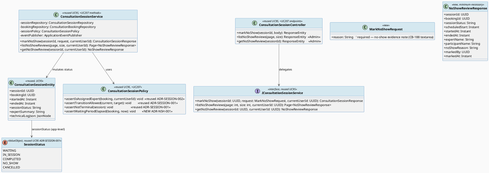
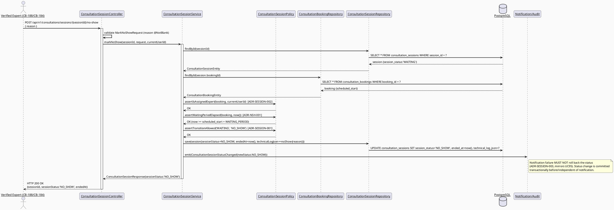
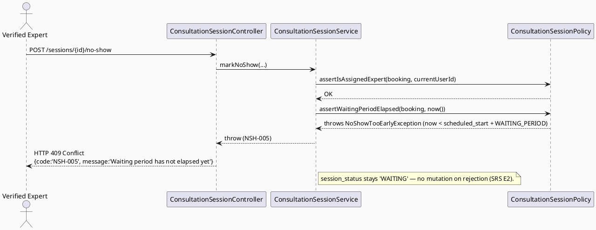
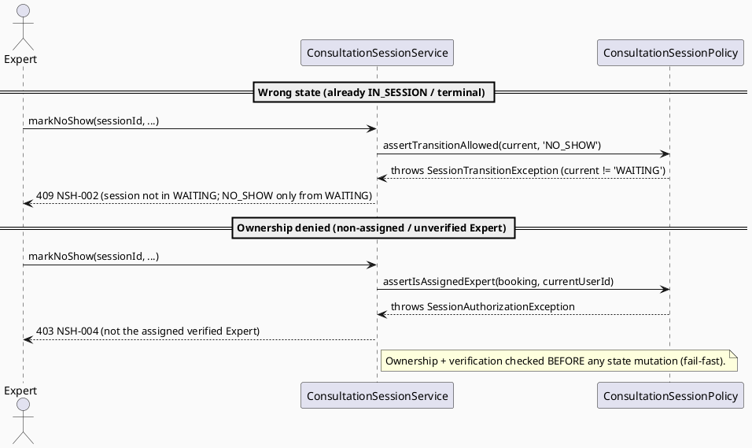
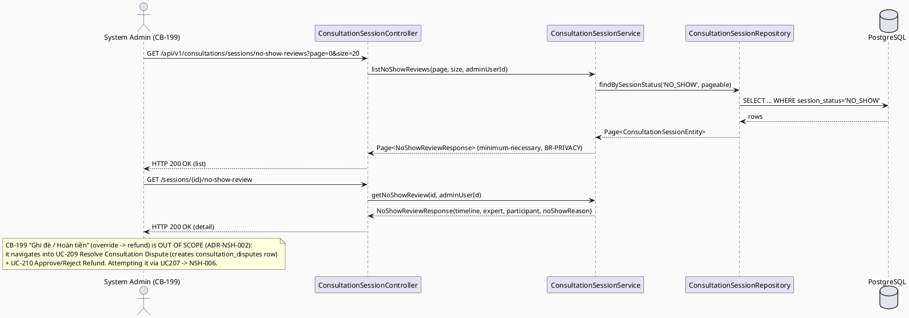
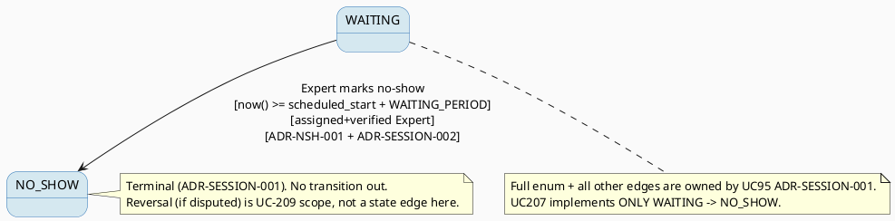

# ENGINEERING DOCUMENTATION STANDARD (EDS) v2.0
# UC207 — Mark Consultation No-show — Technical Design Specification

| Field | Value |
|-------|-------|
| **Document ID** | `CB-CONSULTATION-IMP-207` |
| **Version** | `1.0` |
| **Date** | `2026-07-03` |
| **Status** | `Draft` |
| **Document Owner** | `TV4-Lâm` |
| **Author** | `AI Agent (Technical Architect)` |
| **Reviewed by** | `[Tech Lead — Pending]` |
| **DPO Sign-off** | `[ ] Pending` *(no-show marking touches booking/participation + health-context session evidence — see §1)* |
| **Approved by** | `[Principal Architect — Pending]` |
| **Last Review** | `2026-07-03` |
| **Based on EDS** | `v2.0` |

---

## CHANGELOG

> **Policy 4.4 — Immutable History:** Không bao giờ xóa thông tin cũ.

| Ngày | Người thực hiện | Nội dung thay đổi |
|------|-----------------|-------------------|
| 2026-07-03 | AI Agent — Technical Architect | Tạo tài liệu lần đầu (Draft) cho UC207 — implements the `WAITING → NO_SHOW` transition owned by UC95 ADR-SESSION-001 |

---

## MỤC LỤC

1. [Tổng quan Module](#1-tổng-quan-module)
2. [Ma trận Truy vết (Traceability Matrix)](#2-ma-trận-truy-vết-traceability-matrix)
3. [Architecture Decision Records (ADR)](#3-architecture-decision-records-adr)
4. [Non-Functional Requirements & SLA](#4-non-functional-requirements--sla)
5. [Static Modeling (Mô hình Tĩnh)](#5-static-modeling-mô-hình-tĩnh)
6. [Dynamic Modeling (Mô hình Động)](#6-dynamic-modeling-mô-hình-động)
7. [Domain Event Catalog](#7-domain-event-catalog)
8. [Interface Specification (Đặc tả Giao diện)](#8-interface-specification-đặc-tả-giao-diện)
9. [API Specification](#9-api-specification)
10. [Bảng mã lỗi (Error Codes)](#10-bảng-mã-lỗi-error-codes)
11. [Quy trình Triển khai (Step-by-Step)](#11-quy-trình-triển-khai-step-by-step)
12. [Rollback & Incident Runbook](#12-rollback--incident-runbook)
13. [Kịch bản Kiểm thử Chi tiết](#13-kịch-bản-kiểm-thử-chi-tiết)
14. [Phương pháp Xác minh](#14-phương-pháp-xác-minh)
15. [Mẫu thử thực tế (API Verification Samples)](#15-mẫu-thử-thực-tế-api-verification-samples)
16. [Bảng tổng hợp phân quyền (Authorization Matrix)](#16-bảng-tổng-hợp-phân-quyền-authorization-matrix)
17. [AI Prompt Constraints (CASE 2.0)](#17-ai-prompt-constraints-case-20)

---

## 1. Tổng quan Module

| Field | Value |
|-------|-------|
| **Module Name** | `Consultation — Mark No-show` |
| **Bounded Context** | `Consultation` (package `com.carebridge.backend.consultation`) |
| **Function ID / UC** | `3.3.14.6 Mark Consultation No-show` / `UC-207` (SRS L4452-4471, Table 229) |
| **Primary Actor** | Verified Expert (marks the **other party — the Mother/participant** as absent), System Admin (reviews/audits the no-show marking) |
| **Secondary Actor** | None (SRS: "Secondary Actors — None") |
| **Platform** | **Expert/Admin** — Mobile (Expert App, CB-184) + Web (Expert Portal CB-060/CB-188; Admin Portal CB-199) |
| **Priority** | Medium (SRS §3.3.14.6) |
| **Sprint / Owner** | Sprint 4 "Real Providers And Admin Polish" — TV4-Lâm |
| **Data Classification** | `Confidential` (participation/no-show evidence, session timestamps). The no-show note (`expert_summary`-adjacent) may reference health-context — `Sensitive-PII`-adjacent |
| **Compliance Scope** | `PDPA (Luật 91/2025)`, `BR-RBAC`, `BR-PRIVACY`, `BR-SAFETY`, `BR-CONSULTATION` (all four cited in SRS Table 229) |
| **Upstream Dependencies** | `UC-95 Manage Consultation Session` (owns the `session_status` state machine — **this TDS implements one of its transitions**, does NOT re-own it); `Book Private Consultation (UC-75/76)` (booking must exist, `scheduled_start` present) |
| **Downstream Consumers** | `UC-209 Resolve Consultation Dispute` (a disputed no-show becomes a `consultation_disputes` row — see §1.4 boundary), `UC-210 Approve or Reject Refund`, Notification service, Audit log |

### 1.1 Scope Statement — Greenfield within an existing schema contract

Same greenfield posture as sibling consultation-domain TDS (UC78, UC79, UC95):
the backend `com.carebridge.backend.consultation` package currently holds only
placeholder files. The schema (`consultation_bookings`,
`consultation_sessions` — `V1__init_schema.sql` L876-909) already models the
session domain, including `session_status varchar(30) NOT NULL DEFAULT
'WAITING'`. This TDS designs UC207 as a **thin transition slice** on top of the
UC95-owned session lifecycle: it adds the specific `WAITING → NO_SHOW`
transition (Expert-initiated) plus an Admin read/audit review surface. It
reuses `ConsultationSessionEntity`, `ConsultationSessionService`,
`ConsultationSessionPolicy`, and `ConsultationSessionRepository` from UC95 —
it does **not** create parallel entities/repositories.

### 1.2 Relationship to UC95 (session lifecycle owner) — explicit boundary

`UC95_ManageConsultationSession_TDS.md` §ADR-SESSION-001 is the **definitive
owner** of the session state machine:

```
SessionStatus { WAITING, IN_SESSION, COMPLETED, NO_SHOW, CANCELLED }
terminal: COMPLETED, NO_SHOW, CANCELLED
edge implemented by THIS TDS: WAITING --> NO_SHOW
```

UC95 §6.4 already declares the edge `WAITING → NO_SHOW` ("`expert_joined_at`
still null 15 min past `scheduled_start`") and originally framed it as an
**automatic reconciliation** transition (ADR-SESSION-003). **UC207 is the
explicit, actor-initiated counterpart of that same transition**: instead of a
background reconciliation job silently flipping the status, the **assigned
Expert explicitly marks the absent participant** (the Mother) as a no-show
through a confirmation screen (CB-184 mobile / CB-188 web), and a **System
Admin can review/audit** the marking (CB-199). This TDS **cites ADR-SESSION-001,
ADR-SESSION-002, ADR-SESSION-003 verbatim as authoritative** and adds only
the new decisions strictly local to UC207 (ADR-NSH-001 waiting-period
threshold, ADR-NSH-002 admin-review scope). It never redefines the enum or the
ownership rule.

### 1.3 Open reconciliation — "who is absent" vs. UC95 state machine

The UI mockups (CB-188, CB-199) show the **Mother/participant ("Bệnh nhân")**
being marked absent, while CB-199's system timeline depicts the **Expert
having joined first** (13:58) before the grace period expires (14:15). Under
UC95 ADR-SESSION-001, the *first* successful join (by either party) transitions
`WAITING → IN_SESSION`; therefore, if the Expert joins first, the session is no
longer `WAITING` and the pure `WAITING → NO_SHOW` edge would not fire.

**This is an Open cross-document reconciliation item — flagged, NOT resolved
here (UC95 owns the state machine):**
- **`Open-NSH-1`** — Does a no-show marking require the session to still be
  `WAITING` (no one joined), or must UC95 add an `IN_SESSION → NO_SHOW` edge to
  cover the "Expert present, participant absent" case shown in CB-199? This TDS
  implements strictly the **confirmed** `WAITING → NO_SHOW` edge per the
  batch-level cross-cutting decision, and marks the IN_SESSION-with-one-party
  variant as an Open item for the UC95 owner. It does **not** unilaterally add a
  new edge (would violate "cite ADR-SESSION-001, don't redefine").

### 1.4 Dispute boundary — no-show disputed by the Mother flows to UC-209 (out of scope)

CB-199's Admin decision panel offers three actions: **"Xác nhận Vắng mặt"**
(uphold/confirm the no-show — in scope for UC207 as an audit annotation),
**"Ghi đè / Hợp lệ (Hoàn tiền)"** (override the no-show as invalid → trigger
refund), and **"Đóng"** (close/review later). The **override-and-refund action
is dispute resolution** and is therefore **out of scope for UC207**: a no-show
contested by the Mother becomes a `consultation_disputes` row
(`V1__init_schema.sql` L969-984) handled by **UC-78 Submit Dispute / UC-209
Resolve Consultation Dispute / UC-210 Approve or Reject Refund**. UC207 designs
only (a) the Expert's `WAITING → NO_SHOW` marking and (b) the Admin's
read/audit + uphold annotation. The reversal/refund path is a documented
boundary handed to UC-209 (see ADR-NSH-002).

---

## 2. Ma trận Truy vết (Traceability Matrix)

| Requirement ID | Loại (BR/ADR/US) | Mô tả yêu cầu | Thành phần Code | Compliance Target | ADR liên quan |
|----------------|------------------|---------------|-----------------|-------------------|---------------|
| UC-207 (SRS §3.3.14.6, L4452-4471) | Use Case | "Records no-show after the waiting period and session-status evidence" | `ConsultationSessionController.markNoShow`, `ConsultationSessionService.markNoShow` | BR-CONSULTATION | ADR-NSH-001 |
| BR-RBAC (SRS Table 229) | Business Rule | Users may access only functions allowed by role/permission scope | `ConsultationSessionPolicy.assertIsAssignedExpert()`, `@PreAuthorize` Admin tier | Authorization | ADR-SESSION-002 (reused), ADR-NSH-002 |
| BR-CONSULTATION (SRS Table 229) | Business Rule | Booking/session actions keep an auditable lifecycle state | `ConsultationSessionEntity.sessionStatus`, `ConsultationSessionStatusChanged` event | PDPA / BR-AUDIT | ADR-SESSION-001 (reused) |
| BR-PRIVACY (SRS Table 229) | Business Rule | Health/family data follows consent, purpose, minimum-necessary access | Admin review DTO exposes minimum-necessary fields only (§9.2) | PDPA | ADR-NSH-002 |
| BR-SAFETY (SRS Table 229) | Business Rule | Guidance must be non-diagnostic, escalation-aware | No AI/medical decision in this flow — marking is a lifecycle/administrative action only | BR-SAFETY | — |
| SRS E1 (access denied — unauthenticated/unauthorized/out of scope) | Exception Flow | Non-assigned Expert / non-Admin rejected | `ConsultationSessionPolicy.assertIsAssignedExpert()` | BR-RBAC | ADR-SESSION-002 (reused) |
| SRS E2 (invalid/conflicting data rejected) | Exception Flow | Marking a non-`WAITING` or too-early session rejected | `ConsultationSessionPolicy.assertTransitionAllowed()`, waiting-period guard | BR-CONSULTATION | ADR-NSH-001 |
| Session state machine `WAITING → NO_SHOW` | ADR (reused) | Terminal `NO_SHOW` value + allowed edge | `ConsultationSessionPolicy` (owned by UC95) | BR-CONSULTATION | **ADR-SESSION-001 (UC95 — external/reused, cited verbatim)** |
| Ownership: assigned verified Expert only | ADR (reused) | Only assigned Expert may mark no-show | `ConsultationSessionPolicy.assertIsAssignedExpert()` | BR-RBAC | **ADR-SESSION-002 (UC95 — external/reused)** |
| No state mutation on external failure | ADR (reused) | Notification failure must not corrupt `session_status` | `ConsultationSessionService.markNoShow()` guard | BR-CONSULTATION | **ADR-SESSION-003 (UC95 — external/reused)** |
| Waiting-period threshold (minutes) | ADR (new) | No-show allowed only after threshold past `scheduled_start` | `ConsultationSessionPolicy.assertWaitingPeriodElapsed()` | BR-CONSULTATION | ADR-NSH-001 |
| Admin-review scope | ADR (new) | Admin gets read/audit + uphold only; override/refund → UC-209 | `ConsultationSessionController` admin endpoints | BR-RBAC / BR-PRIVACY | ADR-NSH-002 |
| Schema: `consultation_sessions` (`V1__init_schema.sql` L898-909) | Schema Contract | Session lifecycle persistence (mutated by this TDS) | `ConsultationSessionEntity` | — | — |
| Dispute boundary (§1.4) | Cross-Document | Disputed no-show → `consultation_disputes` handled by UC-78/UC-209 | N/A — boundary only | BR-CONSULTATION | ADR-NSH-002 |
| Waiting-period minutes value | Open Item | Exact grace minutes not quantified by SRS | `Open-NSH-2` | — | ADR-NSH-001 |
| IN_SESSION-vs-WAITING no-show scenario | Open Item | UI implies expert-joined-then-absent; UC95 owns any new edge | `Open-NSH-1` | — | ADR-SESSION-001 |

---

## 3. Architecture Decision Records (ADR)

> **Reused (external, authoritative) ADRs — cited verbatim, NOT redefined here:**
> - **ADR-SESSION-001** (UC95) — `SessionStatus { WAITING, IN_SESSION, COMPLETED, NO_SHOW, CANCELLED }`; `NO_SHOW` is a terminal state; the `WAITING → NO_SHOW` edge is the one this TDS implements. Application-level enum, **no DB CHECK constraint** (deliberate project pattern).
> - **ADR-SESSION-002** (UC95) — ownership via `ConsultationSessionPolicy.assertIsAssignedExpert(booking, currentUserId)`: `expert_profiles.user_id == currentUserId` for the booking's `expert_profile_id` AND `verification_status == 'VERIFIED'`.
> - **ADR-SESSION-003** (UC95) — external-service/timeout safety: an external failure (here: notification dispatch) must **not** mutate `session_status`; no duplicate unsafe action (SRS E3).
>
> The two ADRs below are **new and strictly local to UC207**.

### ADR-NSH-001 — Waiting-period threshold as the timing oracle for a no-show

| Field | Value |
|-------|-------|
| **Status** | `Proposed` *(waiting-period minutes are `Open` — see decision)* |
| **Deciders** | `AI Agent (proposal) — pending TV4-Lâm / Tech Lead confirmation` |
| **Date** | `2026-07-03` |

#### Bối cảnh (Context)
SRS UC-207 description: **"Records no-show after the waiting period and
session-status evidence."** The SRS **does not quantify** the waiting period.
Two existing sources in the repo already use a concrete figure: UC95
ADR-SESSION-003 ("`expert_joined_at` still null **15 minutes** past
`consultation_bookings.scheduled_start`") and the CB-199 UI mockup timeline
("Khách hàng không kết nối sau **15 phút**" / "Grace Period"). A no-show must
not be markable before the waiting period elapses, or an Expert could
prematurely deny a participant who is merely a few minutes late.

#### Các phương án đã xem xét (Options Considered)

| Phương án | Mô tả | Ưu điểm | Nhược điểm |
|-----------|-------|----------|------------|
| A | Allow marking no-show at any time after `scheduled_start` (no minimum wait) | Simplest | Punishes a participant 30s late; contradicts "after the waiting period" wording; unfair |
| B | **Gate on `now() >= scheduled_start + WAITING_PERIOD`, using `scheduled_start` (and null `started_at`/no participant join) as the timing oracle; make `WAITING_PERIOD` a single named, configurable constant. Adopt 15 minutes as the proposed default reused from UC95 ADR-SESSION-003 + CB-199, but flag the exact number `Open` because the SRS does not quantify it** | Matches SRS "after the waiting period"; reuses the only concrete figure already established in the codebase; single configurable source of truth; safe timing oracle | Requires config plumbing; exact value still needs Product sign-off |
| C | Hard-code a different arbitrary value (e.g. 10 min) | — | Invents a number with no source; diverges from UC95/CB-199 — rejected |

#### Quyết định (Decision)
Chọn **Phương án B**. The no-show mark is permitted only when
`Instant.now() >= booking.scheduledStart + WAITING_PERIOD` **and** the session
is still `WAITING` per ADR-SESSION-001 (`started_at IS NULL`, i.e. the
participant has not joined). `WAITING_PERIOD` is a single named constant
(proposed `PT15M`), sourced as a reuse of UC95 ADR-SESSION-003 / CB-199.

> **`Open-NSH-2` — the exact minutes are NOT confirmed by the SRS.** The value
> `15 minutes` is a **proposed reuse**, not an SRS-quantified requirement.
> Product/Tech Lead must confirm before implementation. Tests assert the
> *mechanism* (before threshold → rejected; after threshold → allowed) against
> the configured constant, not a hard-coded literal (see Test-Spec L-item and
> Boundary Value Analysis).

#### Hệ quả (Consequences)
**Tích cực:** Enforces fairness ("after the waiting period"); one configurable
source; reuses the established 15-min figure rather than inventing one.
**Tiêu cực / Trade-offs:** Exact minutes remain Open until Product sign-off;
the timing oracle relies on `scheduled_start` being accurate (guaranteed
`NOT NULL` by schema L886).
**Compliance Impact:** Supports BR-CONSULTATION auditable-lifecycle; the
threshold + evidence note together form the "session-status evidence" the SRS
requires.

---

### ADR-NSH-002 — Admin-review scope: read/audit + uphold only; override/refund delegated to UC-209

| Field | Value |
|-------|-------|
| **Status** | `Proposed` |
| **Deciders** | `AI Agent — derived from CB-199 mockup + SRS actor "System Admin" + UC-209 boundary` |
| **Date** | `2026-07-03` |

#### Bối cảnh (Context)
SRS lists **System Admin** as a primary actor of UC-207, and CB-199
("Consultation No-show Review") gives the Admin three buttons: **Confirm
no-show (uphold)**, **Override/Valid → Refund**, **Close**. The override→refund
button reverses a no-show and issues money back — that is **dispute
resolution**, which the SRS assigns to a *separate* use case, **UC-209 Resolve
Consultation Dispute** (SRS §3.3.14.8, primary actor System Admin) and **UC-210
Approve or Reject Refund**. UC207 must not duplicate dispute/refund logic.

#### Các phương án đã xem xét (Options Considered)

| Phương án | Mô tả | Ưu điểm | Nhược điểm |
|-----------|-------|----------|------------|
| A | UC207 implements the full CB-199 panel including override→refund | Single screen delivers everything | Duplicates UC-209/UC-210 dispute+refund logic; violates single-responsibility and BR-CONSULTATION auditable dispute lifecycle; scope creep |
| B | **UC207 admin surface = read/audit list + detail + an "uphold" audit annotation only. The override→refund action opens/updates a `consultation_disputes` record and is handled by UC-209/UC-210 (out of scope here). UC207 exposes the review data (minimum-necessary per BR-PRIVACY) and records the uphold decision; the refund/reversal is a documented hand-off** | Clean boundary; no duplicate money-moving logic; respects SRS UC decomposition; BR-PRIVACY minimum-necessary | The CB-199 override button is only partially "owned" by UC207 (it navigates into the UC-209 flow) |

#### Quyết định (Decision)
Chọn **Phương án B**. UC207 Admin scope:
- `GET .../no-show-reviews` — list of `NO_SHOW` sessions pending/available for
  admin review (minimum-necessary fields).
- `GET .../{sessionId}/no-show-review` — detail (booking facts, system
  timeline from `started_at`/`ended_at` + `technical_log_json`, the Expert's
  no-show note, any participant statement).
- **Uphold** = an audit annotation confirming the `NO_SHOW` marking stands (no
  status change; NO_SHOW is already terminal).
- **Override → Refund is OUT OF SCOPE**: it is delegated to UC-209 (creates/updates
  a `consultation_disputes` row) + UC-210. UC207 returns `NSH-006` (see §10)
  when an override is attempted through the UC207 surface, directing the caller
  to the dispute flow.

> **`Open-NSH-3` — admin-review scope depth.** Whether "uphold" needs its own
> persisted audit row (vs. relying on the generic audit log) is `Open` pending
> confirmation of the audit-storage strategy for the consultation domain.

#### Hệ quả (Consequences)
**Tích cực:** No duplicated refund/dispute logic; clear UC-209/UC-210 boundary;
BR-PRIVACY minimum-necessary honored in the review DTO.
**Tiêu cực / Trade-offs:** The Admin "override" click is a cross-UC navigation,
not a single-endpoint action — must be clearly documented for the frontend.
**Compliance Impact:** Preserves the auditable dispute lifecycle (BR-CONSULTATION)
by keeping reversals inside the dispute domain.

---

## 4. Non-Functional Requirements & SLA

> The SRS specifies no numeric SLA for UC-207. Values below are **Open —
> proposed defaults**, aligned with UC95 §4, pending Tech Lead confirmation.

### 4.1. Performance & Availability

| Category | Requirement | Target SLA | Measurement Method | Compliance Basis |
|----------|-------------|------------|---------------------|------------------|
| Latency | `POST .../{id}/no-show` p99 | `< 300ms` *(Open — proposed)* | Manual/API test timing | — |
| Latency | `GET .../no-show-reviews` (Admin list) p99 | `< 400ms` *(Open — proposed)* | Manual/API test timing | — |
| Availability | Dependent on booking service (§1.1) | Inherits platform target (UC95 §4: 99.9% monthly) | Uptime monitor | — |

### 4.2. Data Integrity & Retention

| Category | Requirement | Target | Verification Method | Compliance Basis |
|----------|-------------|--------|---------------------|------------------|
| Durability | No session record loss on status change | RPO = 0 | Transaction log | BR-CONSULTATION |
| Retention | No-show marking + evidence note retained for audit/dispute window | Indefinite (no DELETE path exposed) | DB inspection | PDPA / BR-CONSULTATION |
| Consistency | `session_status` transitions only via the §6.4 edge (`WAITING → NO_SHOW`) | 100% (service-level enforcement) | Reconciliation query (§14.1) | ADR-SESSION-001 |
| Terminality | `NO_SHOW` is terminal — no transition out of it | 100% | Policy guard `assertNotTerminal` | ADR-SESSION-001 |

### 4.3. Security

| Category | Requirement | Target | Verification Method | Compliance Basis |
|----------|-------------|--------|---------------------|------------------|
| Access control (Expert) | Only assigned, verified Expert may mark no-show | Least privilege / ownership-scoped | Auth Matrix (§16) | BR-RBAC / ADR-SESSION-002 |
| Access control (Admin) | System-wide review tier, read + uphold only | Least privilege | Auth Matrix (§16) | BR-RBAC / ADR-NSH-002 |
| Data minimization | Admin review DTO exposes minimum-necessary fields | No raw health-record content surfaced | DTO field review | BR-PRIVACY |
| Encryption in transit | All endpoints | TLS 1.3+ | SSL scan | PDPA Art. security |

### 4.4. Scalability & Capacity Planning

SRS marks UC-207 "Frequency of Use: Regular." No-show volume is a small
fraction of booking volume; no special scaling design required beyond standard
Spring Boot request handling. Admin review list should paginate
(standard `page`/`size`).

---

## 5. Static Modeling (Mô hình Tĩnh)

### 5.1. Component Responsibilities & Planned File Paths

> **Reuse note:** entities/repository/policy/service below are **owned by
> UC95** (`CB-CONSULTATION-IMP-095 §5.1`). UC207 adds only the **methods/endpoints
> listed in bold** and the DTOs/web files for the no-show flow. Do NOT create
> parallel `NoShowEntity`/`NoShowService` classes (AP-CB-201).

| Layer | File Path | Responsibility (UC207 delta in **bold**) |
|-------|-----------|-------------------------------------------|
| Controller | `src/main/java/com/carebridge/backend/consultation/controller/ConsultationSessionController.java` | **Adds** `POST /{id}/no-show` (Expert), `GET /no-show-reviews` + `GET /{id}/no-show-review` (Admin) |
| Service | `src/main/java/com/carebridge/backend/consultation/service/ConsultationSessionService.java` | **Adds** `markNoShow(...)`, `listNoShowReviews(...)`, `getNoShowReview(...)` |
| Policy | `src/main/java/com/carebridge/backend/consultation/policy/ConsultationSessionPolicy.java` | Reuses `assertIsAssignedExpert`, `assertTransitionAllowed`, `assertNotTerminal`; **adds** `assertWaitingPeriodElapsed(booking, now)` |
| Repository | `src/main/java/com/carebridge/backend/consultation/repository/ConsultationSessionRepository.java` | Reused (UC95-owned); **adds** `findBySessionStatus('NO_SHOW')` query for the admin list |
| Repository | `src/main/java/com/carebridge/backend/consultation/repository/ConsultationBookingRepository.java` | Reused read-only lookups (ownership + `scheduled_start`) |
| Entity | `src/main/java/com/carebridge/backend/consultation/entity/ConsultationSessionEntity.java` | Reused (UC95-owned) — no new column |
| DTO (request) | `src/main/java/com/carebridge/backend/consultation/dto/request/MarkNoShowRequest.java` | **New** — inbound no-show evidence note |
| DTO (response) | `src/main/java/com/carebridge/backend/consultation/dto/response/ConsultationSessionResponse.java` | Reused (UC95-owned) — returns `sessionStatus='NO_SHOW'` |
| DTO (response) | `src/main/java/com/carebridge/backend/consultation/dto/response/NoShowReviewResponse.java` | **New** — admin review detail (minimum-necessary) |
| Mapper | `src/main/java/com/carebridge/backend/consultation/mapper/ConsultationSessionMapper.java` | Reused; **adds** `toNoShowReviewResponse(...)` |
| Web Model | `05_Development/CareBridgeWebApp/src/features/consultationManagement/models/noShow.ts` | **New** — Zod schema mirror |
| Web Service | `05_Development/CareBridgeWebApp/src/features/consultationManagement/services/noShowApi.ts` | **New** — TanStack Query hooks |
| Web Page (Expert) | `05_Development/CareBridgeWebApp/src/features/consultationManagement/components/MarkNoShowDialog.tsx` | **New** — CB-188 confirmation modal |
| Web Page (Admin) | `05_Development/CareBridgeWebApp/src/features/admin/pages/NoShowReviewPage.tsx` | **New** — CB-199 review screen |
| Mobile (Expert) | `05_Development/CareBridgeMobileApp/lib/features/consultation/mark_no_show_confirmation.dart` | **New** — CB-184 confirmation |

### 5.2. Class Diagram (PlantUML)



### 5.3. Data Structure — Schema/Migration Details

> **CareBridge rule:** `V1__init_schema.sql` and approved Flyway migrations are
> the primary source of truth. ERD is supporting context only.

**No new migration is required.** UC207 mutates only the existing
`consultation_sessions.session_status` column (`WAITING → NO_SHOW`) and reads
`consultation_bookings.scheduled_start`:

```sql
-- consultation_sessions (V1__init_schema.sql L898-909) — mutated column only:
--   session_status varchar(30) NOT NULL DEFAULT 'WAITING'  ->  set to 'NO_SHOW'
--   ended_at       timestamptz                              ->  set to now() on marking
-- consultation_bookings (V1__init_schema.sql L876-896) — read only:
--   scheduled_start timestamptz NOT NULL  (timing oracle, ADR-NSH-001)
```

**Storage of the no-show evidence note (`Open-NSH-4`):** the SRS requires
"session-status evidence" and CB-188/CB-199 both show a required note. There is
**no dedicated `no_show_reason` column** in `consultation_sessions`. Options
(no migration decided here — flagged Open):
1. Reuse the existing `expert_summary text` column to hold the no-show note
   (semantically overloaded but avoids a migration), **or**
2. Append the note into `technical_log_json jsonb` as a structured entry
   (e.g. `{"noShow":{"reason":"...","markedBy":"...","markedAt":"..."}}`), **or**
3. Add a future migration for a dedicated column (out of scope for Sprint 4).

**Proposed default (pending confirmation): option 2** — write the no-show
evidence into `technical_log_json` as a structured, append-only entry, keeping
`expert_summary` reserved for UC96 (Write Consultation Summary). **No migration
added silently.**

**Known already-flagged gaps (repeat, do NOT silently fix):**
- No `CHECK` constraint on `session_status` — application-level enum only
  (deliberate; ADR-SESSION-001).
- **No index on `session_status`** — the admin `findBySessionStatus('NO_SHOW')`
  list query is unindexed. Volume is low (no-shows are rare), so acceptable for
  Sprint 4; flagged as a known gap, **no index migration added here**.

No sync action needed for `V1__init_schema.sql`.

---

## 6. Dynamic Modeling (Mô hình Động)

### 6.1. Sequence Diagram — Happy Path: Expert marks participant no-show after waiting period



### 6.2. Sequence Diagram — Error: waiting period not yet elapsed (too-early rejection)



### 6.3. Sequence Diagram — Error: wrong state (not WAITING) & ownership denied



### 6.4. Sequence Diagram — Admin review / audit (read-only + uphold; override → UC-209)



### 6.5. State Machine — the single edge implemented by UC207



**⚠️ Invariant bất biến:**
1. `session_status` may transition to `NO_SHOW` **only** from `WAITING`
   (ADR-SESSION-001); never from `IN_SESSION`/`COMPLETED`/`CANCELLED` (see
   `Open-NSH-1` for the UI-implied IN_SESSION variant — deferred to UC95).
2. `NO_SHOW` is terminal — no transition out of it via UC207 (reversal = UC-209).
3. Only the assigned, verified Expert may mark no-show (ADR-SESSION-002).
4. The mark is permitted only after `now() >= scheduled_start + WAITING_PERIOD`
   (ADR-NSH-001).
5. A notification/audit dispatch failure must never roll back a committed
   `NO_SHOW` transition (ADR-SESSION-003); conversely, a rejected mark never
   mutates status (SRS E2).

---

## 7. Domain Event Catalog

### 7.1. Events Published (Phát ra)

| Event Name | Trigger | Publisher | Subscriber(s) | Payload Schema | Async? |
|------------|---------|-----------|---------------|----------------|--------|
| `ConsultationSessionStatusChanged` | `WAITING → NO_SHOW` transition (§6.1) | `ConsultationSessionService` | Notification service, Audit log, UC-209 dispute-eligibility check (future consumer), UC-210 refund eligibility | `ConsultationSessionStatusChanged.java` | Yes |

> **Consistency note:** this is the **same event name/schema as UC95 and UC206**
> (`ConsultationSessionStatusChanged`), differing only by `payload.newStatus`
> value (`NO_SHOW` here vs `COMPLETED` for UC206). Do not introduce a new
> `NoShowMarked` event (AP-CB-202) — reuse the shared event for one lifecycle
> stream.

### 7.2. Events Consumed (Tiêu thụ)

| Event Name | Source | Handler | Action thực hiện |
|------------|--------|---------|------------------|
| *(None)* | — | — | UC207 reads booking/session state synchronously at request time; it consumes no external event. |

### 7.3. Payload Schema

```java
// ConsultationSessionStatusChanged.java  (SHARED with UC95/UC206 — do not fork)
public record ConsultationSessionStatusChanged(
    UUID    eventId,
    String  eventType,       // "ConsultationSessionStatusChanged"
    Instant occurredAt,
    String  version,         // "1.0"
    Payload payload,
    Metadata metadata
) implements ApplicationEvent {

    public record Payload(
        UUID    sessionId,
        UUID    bookingId,
        String  previousStatus, // "WAITING"
        String  newStatus,      // "NO_SHOW"  <-- UC207-specific value
        Instant startedAt,      // nullable (null for a no-show — participant never joined)
        Instant endedAt         // set to now() at marking
    ) {}

    public record Metadata(
        UUID   correlationId,
        String causedBy         // userId of the marking Expert (or admin for future review actions)
    ) {}
}
```

---

## 8. Interface Specification (Đặc tả Giao diện)

### 8.1. Service Interface

```java
// MarkNoShowRequest.java — Input DTO
// @version 1.0
public class MarkNoShowRequest {
    @NotBlank(message = "reason is required")   // CB-188/CB-199: required evidence note
    @Size(max = 2000)
    private String reason;
    // getters / setters / @Valid annotations
}

// NoShowReviewResponse.java — Output DTO (Admin review; minimum-necessary, BR-PRIVACY)
public class NoShowReviewResponse {
    private UUID sessionId;
    private UUID bookingId;
    private String sessionStatus;      // "NO_SHOW"
    private Instant scheduledStart;
    private Instant startedAt;          // nullable
    private Instant endedAt;
    private String expertName;
    private String participantName;
    private String noShowReason;        // from technical_log_json (Open-NSH-4)
    private UUID markedBy;
    private Instant markedAt;
    // getters / setters — NO raw health-record content exposed
}

// IConsultationSessionService.java — Service Contract (UC207 additive methods only)
// @version 1.1  (adds no-show methods to the UC95 interface; non-breaking)
public interface IConsultationSessionService {

    /**
     * Assigned, verified Expert marks the absent participant as a no-show.
     * Transition WAITING -> NO_SHOW (ADR-SESSION-001), permitted only after the
     * waiting period (ADR-NSH-001).
     * @throws SessionNotFoundException        (NSH-003) if sessionId does not exist
     * @throws SessionAuthorizationException   (NSH-004) if caller is not the assigned, verified Expert
     * @throws NoShowTooEarlyException         (NSH-005) if now() < scheduled_start + WAITING_PERIOD
     * @throws SessionTransitionException      (NSH-002) if session_status != 'WAITING'
     */
    ConsultationSessionResponse markNoShow(UUID sessionId, MarkNoShowRequest request, UUID currentUserId);

    /**
     * System Admin lists NO_SHOW sessions for review/audit (minimum-necessary).
     * @throws SessionAuthorizationException (NSH-004) if caller lacks the SYSTEM_ADMIN tier
     */
    Page<NoShowReviewResponse> listNoShowReviews(int page, int size, UUID currentUserId);

    /**
     * System Admin views one no-show review (booking facts + timeline + note).
     * @throws SessionNotFoundException (NSH-003) if not found or not NO_SHOW
     */
    NoShowReviewResponse getNoShowReview(UUID sessionId, UUID currentUserId);
}
```

### 8.2. Repository Interface

```java
// ConsultationSessionRepository.java  (UC95-owned; UC207 adds one query)
// @version 1.1
public interface ConsultationSessionRepository extends JpaRepository<ConsultationSessionEntity, UUID> {

    Optional<ConsultationSessionEntity> findById(UUID sessionId);

    // UC207: admin no-show review list (NOTE: session_status is unindexed — §5.3 known gap)
    Page<ConsultationSessionEntity> findBySessionStatus(String sessionStatus, Pageable pageable);

    // No delete() — status transitions via @Modifying UPDATE only, guarded by policy.
}
```

---

## 9. API Specification

### 9.1. Endpoints Table

| Method | Path | Auth Level | Required Roles | Rate Limit | Idempotent? |
|--------|------|------------|----------------|------------|-------------|
| `POST` | `/api/v1/consultations/sessions/{sessionId}/no-show` | JWT Bearer | `EXPERT` (assigned, verified) | 20/min | No (rejected if already NO_SHOW → NSH-002) |
| `GET` | `/api/v1/consultations/sessions/no-show-reviews` | JWT Bearer | `SYSTEM_ADMIN` | 120/min | Yes |
| `GET` | `/api/v1/consultations/sessions/{sessionId}/no-show-review` | JWT Bearer | `SYSTEM_ADMIN` | 300/min | Yes |

### 9.2. Request / Response Schemas

#### `POST /api/v1/consultations/sessions/{sessionId}/no-show` — Expert marks no-show

**Request Body:**
```json
{ "reason": "Called the participant 3 times, no answer; not online 15 min past start." }
```

**Response — 200 OK (Happy Path):**
```json
{
  "sessionId": "9f8e7d6c-1234-4a5b-8c9d-0e1f2a3b4c5d",
  "bookingId": "3fa85f64-5717-4562-b3fc-2c963f66afa6",
  "sessionStatus": "NO_SHOW",
  "startedAt": null,
  "endedAt": "2026-07-03T14:15:00.000Z"
}
```

**Response — 409 Conflict (waiting period not elapsed):**
```json
{ "error": { "code": "NSH-005", "message": "Waiting period has not elapsed yet" } }
```

**Response — 409 Conflict (session not in WAITING):**
```json
{ "error": { "code": "NSH-002", "message": "Session is not in WAITING state; no-show can only be marked from WAITING" } }
```

**Response — 403 Forbidden (not assigned/verified Expert):**
```json
{ "error": { "code": "NSH-004", "message": "You are not authorized to mark this session as no-show" } }
```

#### `GET /api/v1/consultations/sessions/no-show-reviews` — Admin list

**Response — 200 OK:**
```json
{
  "content": [
    {
      "sessionId": "9f8e7d6c-1234-4a5b-8c9d-0e1f2a3b4c5d",
      "bookingId": "3fa85f64-5717-4562-b3fc-2c963f66afa6",
      "sessionStatus": "NO_SHOW",
      "scheduledStart": "2026-07-03T14:00:00.000Z",
      "startedAt": null,
      "endedAt": "2026-07-03T14:15:00.000Z",
      "expertName": "Dr. Nguyễn Văn A",
      "participantName": "Trần Thị B",
      "noShowReason": "No answer, not online 15 min past start.",
      "markedBy": "b1a2...",
      "markedAt": "2026-07-03T14:15:00.000Z"
    }
  ],
  "page": 0, "size": 20, "totalElements": 1
}
```

> **BR-PRIVACY:** the review DTO carries only booking/participation facts +
> the no-show note — no raw health-record content. The override→refund action
> (CB-199) is **not** an endpoint here; it navigates into UC-209 (ADR-NSH-002).

---

## 10. Bảng mã lỗi (Error Codes)

> Prefix `NSH-` (no collision with `CON-/DISP-/SES-/SUMW-/CDT-/RESCH-/CANC-/COMP-`).
> `SES-00x` cross-references note where the semantics are identical to UC95's.

| Code | HTTP Status | Message (EN) | Message (VI) | Trigger Condition | Cross-ref |
|------|-------------|--------------|--------------|-------------------|-----------|
| `NSH-001` | 400 | Validation failed | Dữ liệu không hợp lệ | `reason` blank/missing or > 2000 chars | — |
| `NSH-002` | 409 | Session not in WAITING state | Phiên không ở trạng thái chờ | `session_status != 'WAITING'` (e.g. IN_SESSION/terminal) — no-show only from WAITING | ≡ `SES-006` (invalid transition) / `SES-002` (terminal) |
| `NSH-003` | 404 | Session not found | Không tìm thấy phiên tư vấn | `sessionId` does not exist (or not NO_SHOW for review) | ≡ `SES-003` |
| `NSH-004` | 403 | Insufficient permissions | Không đủ quyền | Not the assigned verified Expert (mark) / not SYSTEM_ADMIN (review) | ≡ `SES-004` |
| `NSH-005` | 409 | Waiting period has not elapsed | Chưa hết thời gian chờ | `now() < scheduled_start + WAITING_PERIOD` (ADR-NSH-001) | — (UC207-specific) |
| `NSH-006` | 409 | Override handled by dispute resolution | Ghi đè do xử lý khiếu nại | Admin attempts override/refund via UC207 — delegate to UC-209/UC-210 (ADR-NSH-002) | boundary → UC-209 |
| `NSH-500` | 500 | Internal error | Lỗi hệ thống | Unexpected failure | ≡ `SES-500` |

---

## 11. Quy trình Triển khai (Step-by-Step)

### 11.1. Prerequisites

- [ ] **BLOCKING:** UC-95 session lifecycle (`ConsultationSessionEntity`,
  `ConsultationSessionService`, `ConsultationSessionPolicy`, repository) implemented
  — UC207 extends these, does not recreate them.
- [ ] **BLOCKING:** Booking service produces `consultation_bookings` with real
  `expert_profile_id` and `scheduled_start`.
- [ ] ADR-SESSION-001/002/003 (UC95) confirmed (currently Draft upstream — expected/normal, non-blocking for spec authoring).
- [ ] ADR-NSH-001 waiting-period minutes confirmed by Product (`Open-NSH-2`).
- [ ] ADR-NSH-002 admin-review scope + UC-209 boundary confirmed.
- [ ] `Open-NSH-4` no-show-note storage decision confirmed (proposed: `technical_log_json`).
- [ ] DPO review for the no-show note (may reference health context).
- [ ] Principal Architect approves this TDS.

### 11.2. Pre-Migration Checklist

- [ ] **N/A** — no new migration required (see §5.3).

### 11.3. Implementation Steps

#### Chặng 1 — Policy guard + Service method
Add `ConsultationSessionPolicy.assertWaitingPeriodElapsed(booking, now)`
(ADR-NSH-001); implement `ConsultationSessionService.markNoShow(...)` reusing
`assertIsAssignedExpert` (ADR-SESSION-002) + `assertTransitionAllowed('WAITING','NO_SHOW')`
(ADR-SESSION-001), writing the note to `technical_log_json`, emitting
`ConsultationSessionStatusChanged`.

#### Chặng 2 — Admin review read methods
Implement `listNoShowReviews`/`getNoShowReview` + `findBySessionStatus` query +
`toNoShowReviewResponse` mapper (minimum-necessary fields, BR-PRIVACY).

#### Chặng 3 — Controller + Web/Mobile
Wire `POST /{id}/no-show` (Expert, `@PreAuthorize` EXPERT) and the two Admin GET
endpoints (`@PreAuthorize` SYSTEM_ADMIN). Build CB-188 `MarkNoShowDialog.tsx`,
CB-199 `NoShowReviewPage.tsx`, CB-184 mobile confirmation. The CB-199 override
button links to the UC-209 dispute flow (not a UC207 endpoint).

#### Chặng 4 — Verification sau deploy
```bash
curl -X GET https://[host]/api/v1/health   # Expected: {"status":"ok"}
```

### 11.4. Deployment Checklist
- [ ] `./mvnw test` green
- [ ] `npm run test:run` green (Web)
- [ ] `ConsultationSessionStatusChanged` emits with `newStatus:"NO_SHOW"`
- [ ] No no-show markable before the configured waiting period
- [ ] Admin review DTO carries no raw health-record content (BR-PRIVACY)

---

## 12. Rollback & Incident Runbook

### 12.1. Điều kiện kích hoạt Rollback

| Điều kiện | Ngưỡng | Người quyết định |
|-----------|--------|------------------|
| Error rate spike | > 5% trong 5 phút | On-call Engineer |
| No-show markable before waiting period (guard bypass) | Any occurrence | Tech Lead (data-integrity/fairness incident) |
| Non-assigned Expert able to mark no-show | Any occurrence | Tech Lead (security incident) |
| `session_status` set to `NO_SHOW` from a non-`WAITING` state | Any occurrence | Tech Lead |

### 12.2. Rollback Procedure

```bash
# No new migration in baseline scope — code-only rollback:
git checkout -- 05_Development/CareBridgeAPI/src/main/java/com/carebridge/backend/consultation/
git checkout -- 05_Development/CareBridgeWebApp/src/features/consultationManagement/
git checkout -- 05_Development/CareBridgeWebApp/src/features/admin/pages/NoShowReviewPage.tsx
git checkout -- 05_Development/CareBridgeMobileApp/lib/features/consultation/
kubectl rollout undo deployment/carebridge-api
```

> **Data remediation:** if a wrongful `NO_SHOW` was persisted, do NOT reverse
> it silently — route through UC-209 dispute resolution to preserve the
> auditable lifecycle (BR-CONSULTATION).

### 12.3. Notification Protocol

| Thời điểm | Người nhận | Kênh | Template |
|-----------|------------|------|----------|
| Ngay khi phát hiện guard bypass / IDOR | On-call + Tech Lead | Slack `#incident` | "🚨 UC207 no-show guard/authorization violation for session [id]" |

### 12.4. Post-Incident Review (PIR)
Standard PIR within 48h for any data-integrity or authorization incident.

---

## 13. Kịch bản Kiểm thử Chi tiết

> Detailed test cases live in `UC207_MarkConsultationNoShow_Test-Spec.md`.

| Condition Ref | Summary |
|----------------|---------|
| TC-COND-001 | Happy path — assigned verified Expert marks WAITING session past waiting period → NO_SHOW + event |
| TC-COND-002 | Too-early — waiting period not elapsed → 409 (`NSH-005`), status unchanged |
| TC-COND-003 | Wrong state — session not WAITING (IN_SESSION/terminal) → 409 (`NSH-002`) |
| TC-COND-004 | Ownership — non-assigned Expert → 403 (`NSH-004`) |
| TC-COND-005 | Ownership — unverified assigned Expert → 403 (`NSH-004`) |
| TC-COND-006 | Validation — blank `reason` → 400 (`NSH-001`) |
| TC-COND-007 | Admin lists NO_SHOW reviews (minimum-necessary) → 200 |
| TC-COND-008 | Non-admin (Expert/Mother) hits admin review → 403 (`NSH-004`) |
| TC-COND-009 | Event payload correctness — `previousStatus="WAITING"`, `newStatus="NO_SHOW"` |
| TC-COND-010 | Boundary — marking at threshold-1min rejected, threshold+1min allowed |
| TC-COND-011 | Session not found → 404 (`NSH-003`) |
| TC-COND-012 | Notification failure does not roll back committed NO_SHOW (integration) |

---

## 14. Phương pháp Xác minh

### 14.1. Database Inspection

```sql
SELECT session_id, booking_id, session_status, started_at, ended_at, technical_log_json
FROM consultation_sessions WHERE session_id = '[uuid]';

-- Verify only valid session_status values appear
SELECT DISTINCT session_status FROM consultation_sessions
WHERE session_status NOT IN ('WAITING','IN_SESSION','COMPLETED','NO_SHOW','CANCELLED');
-- Expected: 0 rows

-- Verify no NO_SHOW was set on a session whose participant had joined (started_at NOT NULL)
-- (relative to Open-NSH-1 — should be 0 rows under the confirmed WAITING->NO_SHOW edge)
SELECT session_id FROM consultation_sessions
WHERE session_status = 'NO_SHOW' AND started_at IS NOT NULL;
```

### 14.2. Log / Audit Verification

```bash
kubectl logs -l app=carebridge-api | grep '"eventType":"ConsultationSessionStatusChanged"' \
  | grep '"newStatus":"NO_SHOW"' | head -5
```

---

## 15. Mẫu thử thực tế (API Verification Samples)

### 15.1. Happy Path
```bash
curl -X POST https://[host]/api/v1/consultations/sessions/{sessionId}/no-show \
  -H "Authorization: Bearer [JWT — expert@carebridge.dev]" \
  -H "Content-Type: application/json" \
  -d '{"reason":"No answer, not online 15 min past start."}'
```
**Expected (200):** see §9.2 (`sessionStatus:"NO_SHOW"`).

### 15.2. Error Paths
```bash
# Too early → 409 NSH-005
curl -X POST https://[host]/api/v1/consultations/sessions/{sessionId}/no-show \
  -H "Authorization: Bearer [JWT]" -H "Content-Type: application/json" \
  -d '{"reason":"x"}'

# Admin review list
curl -X GET "https://[host]/api/v1/consultations/sessions/no-show-reviews?page=0&size=20" \
  -H "Authorization: Bearer [JWT — admin@carebridge.dev]"
```

---

## 16. Bảng tổng hợp phân quyền (Authorization Matrix)

> Two distinct rows for the two distinct actions: Expert **mark** vs Admin **review**.

| Endpoint | `GUEST` | `MOTHER` | `EXPERT` (non-assigned) | `EXPERT` (assigned, unverified) | `EXPERT` (assigned, verified) | `SYSTEM_ADMIN` |
|----------|---------|----------|--------------------------|----------------------------------|-------------------------------|-----------------|
| `POST /sessions/{id}/no-show` (mark) | ❌ | ❌ | ❌ (`NSH-004`) | ❌ (`NSH-004`) | ✅ (own booking, past waiting period) | ❌ *(Admin does not mark; Admin reviews)* |
| `GET /sessions/no-show-reviews` (review list) | ❌ | ❌ | ❌ (`NSH-004`) | ❌ (`NSH-004`) | ❌ (`NSH-004`) | ✅ All |
| `GET /sessions/{id}/no-show-review` (review detail) | ❌ | ❌ | ❌ (`NSH-004`) | ❌ (`NSH-004`) | ❌ (`NSH-004`) | ✅ All |

**Chú thích:** ✅ = allowed; ❌ = 403. Expert acts (marks); Admin reviews/audits.
The override→refund reversal is **not** in this matrix — it is a UC-209 endpoint
(ADR-NSH-002).

---

## 17. AI Prompt Constraints (CASE 2.0)

### 17.1 Constraint Summary Table

| # | Constraint | Source (ADR/BR) | Last Verified |
|---|-----------|-----------------|---------------|
| C1 | Implement ONLY the `WAITING → NO_SHOW` transition; reuse UC95's `SessionStatus` enum and state machine — never redefine the enum or add a new edge (e.g. IN_SESSION→NO_SHOW) inside UC207 | `ADR-SESSION-001` (UC95, reused) | `2026-07-03` |
| C2 | Only the assigned, `verification_status='VERIFIED'` Expert (`expert_profiles.user_id == currentUserId`) may mark no-show — call `ConsultationSessionPolicy.assertIsAssignedExpert()` before any mutation | `ADR-SESSION-002` (UC95, reused) / `BR-RBAC` | `2026-07-03` |
| C3 | Reject the mark unless `now() >= scheduled_start + WAITING_PERIOD` (a single named configurable constant, proposed `PT15M`, value `Open`) — do NOT hard-code a bare literal in business logic | `ADR-NSH-001` | `2026-07-03` |
| C4 | A notification/audit failure MUST NOT roll back a committed `NO_SHOW`; a rejected mark MUST NOT mutate `session_status` | `ADR-SESSION-003` (UC95, reused) / SRS E2 | `2026-07-03` |
| C5 | Admin surface is READ/AUDIT + uphold only. The override→refund action is UC-209/UC-210 (dispute resolution) — do NOT implement refund/reversal in UC207; return `NSH-006` if attempted | `ADR-NSH-002` | `2026-07-03` |
| C6 | Reuse the shared `ConsultationSessionStatusChanged` event (do NOT invent `NoShowMarked`); set `payload.newStatus="NO_SHOW"` | `§7.1` | `2026-07-03` |
| C7 | Use `com.carebridge.backend.consultation.{controller,service,repository,entity,dto.request,dto.response,mapper,policy}` exactly; never expose `ConsultationSessionEntity` in responses; Admin review DTO is minimum-necessary (BR-PRIVACY) | `CLAUDE.md` / `BR-PRIVACY` | `2026-07-03` |

### 17.2 Constraint Injection Block (Copy-Paste vào AI Prompt)

```
[CONSTRAINT BLOCK — Module: Mark Consultation No-show (UC207)]
Theo TDS CB-CONSULTATION-IMP-207 và các ADR liên quan:

1. (C1) Implement CHỈ transition WAITING -> NO_SHOW. Reuse enum SessionStatus và
   state machine của UC95 (ADR-SESSION-001). KHÔNG redefine enum, KHÔNG thêm edge mới.
2. (C2) CHỈ Expert được gán + VERIFIED (expert_profiles.user_id == currentUserId)
   mới được mark no-show. Gọi assertIsAssignedExpert() TRƯỚC mọi mutation.
3. (C3) Reject nếu now() < scheduled_start + WAITING_PERIOD (hằng số cấu hình,
   đề xuất PT15M, giá trị Open). KHÔNG hard-code literal trong business logic.
4. (C4) Lỗi notification/audit KHÔNG rollback NO_SHOW đã commit; mark bị reject
   KHÔNG được đổi session_status.
5. (C5) Màn Admin chỉ READ/AUDIT + uphold. Override -> refund thuộc UC-209/UC-210,
   KHÔNG implement ở UC207 (trả NSH-006 nếu bị gọi).
6. (C6) Reuse event ConsultationSessionStatusChanged (KHÔNG tạo NoShowMarked);
   newStatus="NO_SHOW".
7. (C7) Dùng đúng package com.carebridge.backend.consultation; KHÔNG trả JPA entity;
   Admin review DTO minimum-necessary (BR-PRIVACY).

[CONTEXT BLOCK]
- Bounded Context: Consultation
- Data Classification: Confidential (no-show note is Sensitive-PII-adjacent)
- Compliance: PDPA (Luật 91/2025), BR-RBAC, BR-PRIVACY, BR-SAFETY, BR-CONSULTATION
- Existing interfaces: §8 Service Interface + §8.2 Repository Interface
- Error codes: §10 Error Codes Table
- Auth matrix: §16 Authorization Matrix
- Reused (do NOT redefine): ConsultationSessionEntity/Service/Policy/Repository (UC95),
  ADR-SESSION-001/002/003 (UC95)

[TASK BLOCK]
Implement {feature/method} thỏa mãn constraints trên.
Output phải tuân thủ §8 Interface Specification.
Tests phải cover §13 Test Scenarios (see Test-Spec document).
```

### 17.3 Constraint Quality Checklist
- [x] Mỗi constraint traceable về ADR hoặc BR cụ thể
- [x] Không có constraint generic
- [x] Mỗi constraint có `Last Verified` date ≤ 2 sprints
- [x] Constraint block có ≥ 3 constraints cụ thể
- [x] Constraint block reference §8 Interface
- [x] Constraint block reference §16 Auth Matrix

### 17.4 Anti-Pattern Detection (cho AI-Generated Code từ Block này)

| AP-ID | Anti-Pattern | Dấu hiệu | Hành động |
|-------|-------------|-----------|----------|
| AP-AI-001 | Unconstrained Gen | Code không match bất kỳ constraint C1-C7 nào | Reject — inject lại constraints |
| AP-AI-003 | Implicit Decision | Code assumes a terminal value/edge not in ADR-SESSION-001 | Reject — cite UC95 ADR |
| AP-AI-005 | Hallucinated Contract | Code imports a service/type not in §8 | Reject — verify contract existence |
| AP-CB-201 *(project-specific)* | **Parallel no-show entity** | New `NoShowEntity`/`NoShowService`/`NoShowRepository` created instead of reusing UC95 `ConsultationSession*` | Reject — must extend UC95 components (§5.1) |
| AP-CB-202 *(project-specific)* | **Forked lifecycle event** | New `NoShowMarked` event instead of shared `ConsultationSessionStatusChanged` | Reject — violates C6 |
| AP-CB-203 *(project-specific)* | **Refund/reversal in UC207** | UC207 code issues refunds or reverses NO_SHOW instead of delegating to UC-209/UC-210 | Reject — violates C5/ADR-NSH-002 |
| AP-CB-204 *(project-specific)* | **Hard-coded grace literal** | `plusMinutes(15)` inline in service without a named configurable constant | Reject — violates C3 (value is Open) |

---

## PHỤ LỤC

### A. Glossary

| Thuật ngữ | Định nghĩa |
|-----------|------------|
| No-show | A booked consultation where a party (here: the Mother/participant) fails to join within the waiting period, marked by the assigned Expert |
| Waiting period | Configurable interval after `scheduled_start` before a no-show may be marked (proposed `PT15M`, value `Open` — ADR-NSH-001) |
| Terminal state | A `session_status` from which no transition is allowed (`COMPLETED`, `NO_SHOW`, `CANCELLED`) |
| Uphold | Admin audit action confirming a no-show marking stands (no status change; NO_SHOW already terminal) |
| Override → refund | Admin action reversing a no-show and issuing a refund — **out of scope (UC-209/UC-210)** |
| PDPA | Vietnam Personal Data Protection regulation (Luật 91/2025 context) |

### B. Tài liệu tham chiếu

| Document | Path |
|----------|------|
| SRS §3.3.14.6 (UC-207, Table 229) | `02_Requirements/SRS/3_Functional_Specification.md` L4452-4471 |
| Session lifecycle owner (authoritative, reused) | `04_Implement/UC95_ManageConsultationSession/UC95_ManageConsultationSession_TDS.md` §ADR-SESSION-001/002/003 |
| Dispute/refund boundary | `04_Implement/UC78_SubmitDisputeOrRefundRequest/UC78_SubmitDisputeOrRefundRequest_TDS.md`; SRS UC-209 §3.3.14.8, UC-210 §3.3.14.9 |
| Schema source of truth | `05_Development/CareBridgeAPI/src/main/resources/db/migration/V1__init_schema.sql` L876-909 (tables), L1636-1646 (indices), L1823-1887 (FKs), L969-984 (`consultation_disputes`) |
| UI — Expert mark (mobile / web) | `03_Design/UI_UX/MobileAppScreen/CB-184 Mark No-show Confirmation (UC-207)/code.html`; `03_Design/UI_UX/WebAppScreen/CB-188 Mark No-show Confirmation (UC-207)/code.html` |
| UI — Consultation Detail entry point | `03_Design/UI_UX/WebAppScreen/CB-060 Consultation Detail (...)/code.html` |
| UI — Admin review | `03_Design/UI_UX/WebAppScreen/CB-199 Consultation No-show Review (UC-207)/code.html` |
| CareBridge project rules | `CLAUDE.md` |

---

*TDS UC207 v1.0 — Draft. Implements the `WAITING → NO_SHOW` transition owned by
UC95 ADR-SESSION-001 (cited verbatim, not re-owned). Open items: `Open-NSH-1`
(IN_SESSION-vs-WAITING no-show — UC95 owner), `Open-NSH-2` (exact waiting-period
minutes — SRS does not quantify; proposed 15), `Open-NSH-3` (audit-storage
depth), `Open-NSH-4` (no-show note column). No schema change required. Requires
Product/Tech Lead sign-off on ADR-NSH-001/002 before Status may change to
Approved.*
