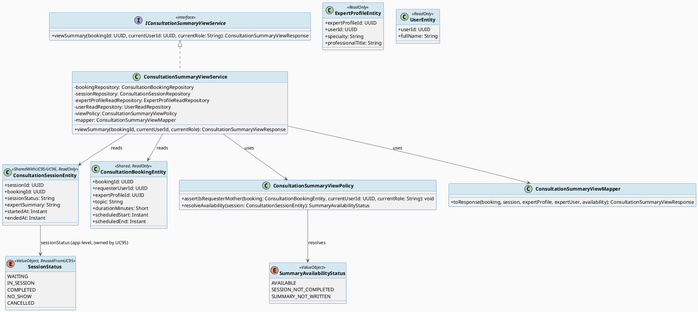
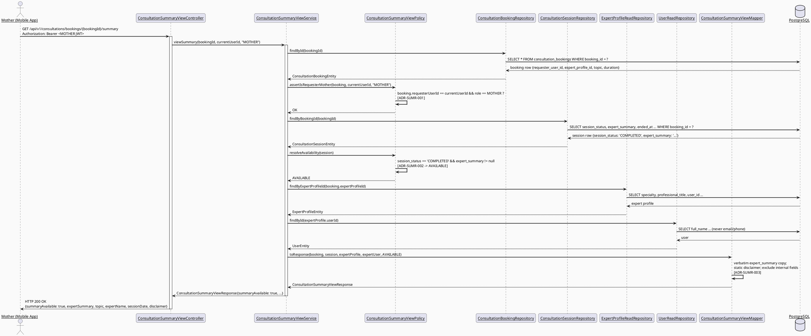
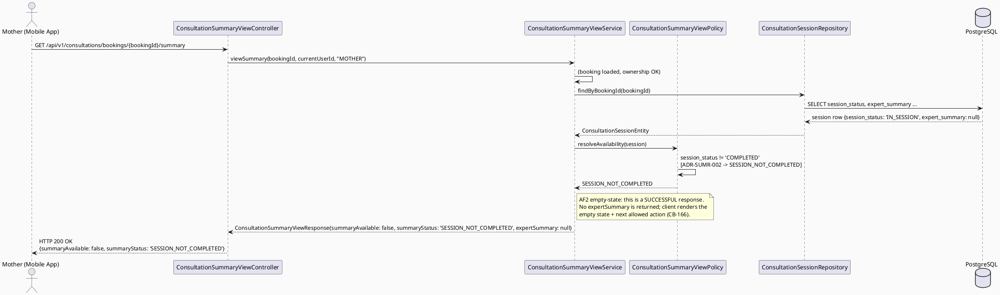
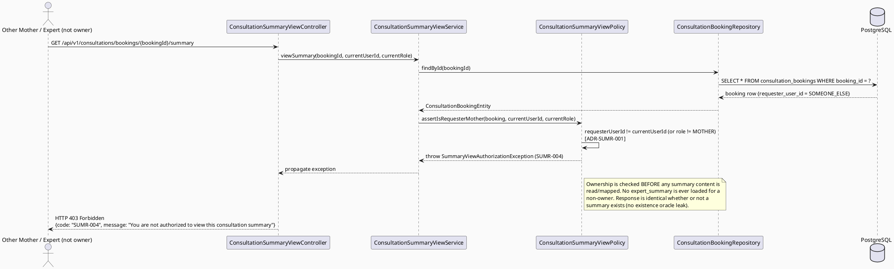
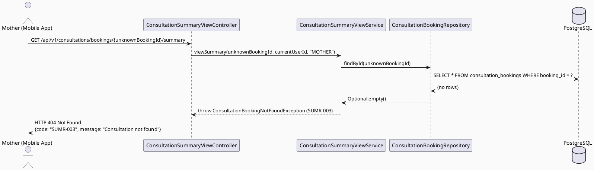

# ENGINEERING DOCUMENTATION STANDARD (EDS) v2.0
# UC-208 — View Consultation Summary — Technical Design Specification

| Field | Value |
|-------|-------|
| **Document ID** | `CB-CONSULTATION-IMP-208` |
| **Version** | `1.0` |
| **Date** | `2026-07-03` |
| **Status** | `Draft` |
| **Document Owner** | `TV4-Lâm` |
| **Author** | `AI Agent (Technical Architect)` |
| **Reviewed by** | `[Tech Lead — Pending]` |
| **DPO Sign-off** | `[ ] Pending` *(read exposure of expert-authored, health-adjacent guidance content about a named Mother — see §1)* |
| **Approved by** | `[Principal Architect — Pending]` |
| **Last Review** | `2026-07-03` |
| **Based on EDS** | `v2.0` |

---

## CHANGELOG

> **Policy 4.4 — Immutable History:** Không bao giờ xóa thông tin cũ.

| Ngày | Người thực hiện | Nội dung thay đổi |
|------|-----------------|-------------------|
| 2026-07-03 | AI Agent — Technical Architect | Tạo tài liệu lần đầu (Draft) cho UC-208 (read side of `expert_summary`, Mother-only) |

---

## MỤC LỤC

1. [Tổng quan Module](#1-tổng-quan-module)
2. [Ma trận Truy vết (Traceability Matrix)](#2-ma-trận-truy-vết-traceability-matrix)
3. [Architecture Decision Records (ADR)](#3-architecture-decision-records-adr)
4. [Non-Functional Requirements & SLA](#4-non-functional-requirements--sla)
5. [Static Modeling (Mô hình Tĩnh)](#5-static-modeling-mô-hình-tĩnh)
6. [Dynamic Modeling (Mô hình Động)](#6-dynamic-modeling-mô-hình-động)
7. [Domain Event Catalog](#7-domain-event-catalog)
8. [Interface Specification (Đặc tả Giao diện)](#8-interface-specification-đặc-tả-giao-diện)
9. [API Specification](#9-api-specification)
10. [Bảng mã lỗi (Error Codes)](#10-bảng-mã-lỗi-error-codes)
11. [Quy trình Triển khai (Step-by-Step)](#11-quy-trình-triển-khai-step-by-step)
12. [Rollback & Incident Runbook](#12-rollback--incident-runbook)
13. [Kịch bản Kiểm thử Chi tiết](#13-kịch-bản-kiểm-thử-chi-tiết)
14. [Phương pháp Xác minh](#14-phương-pháp-xác-minh)
15. [Mẫu thử thực tế (API Verification Samples)](#15-mẫu-thử-thực-tế-api-verification-samples)
16. [Bảng tổng hợp phân quyền (Authorization Matrix)](#16-bảng-tổng-hợp-phân-quyền-authorization-matrix)
17. [AI Prompt Constraints (CASE 2.0)](#17-ai-prompt-constraints-case-20)

---

## 1. Tổng quan Module

| Field | Value |
|-------|-------|
| **Module Name** | `Consultation — View Consultation Summary (read side)` |
| **Bounded Context** | `Consultation` (package `com.carebridge.backend.consultation`) |
| **Function ID / UC** | `3.3.14.7 View Consultation Summary` / `UC-208` (SRS L4473-4492, Table 230) |
| **Primary Actor** | Mother (the booking's requester) |
| **Secondary Actor** | None (SRS "Secondary Actors: None") |
| **Platform** | **Mobile App** — Flutter/Dart (SRS "Other Information: Platform: Mobile App"); a summary block on the Web Consultation Detail screen (CB-060) consumes the same read model |
| **Priority** | Medium (SRS) |
| **Frequency of Use** | Frequent (SRS) |
| **Sprint / Owner** | Sprint 4 batch (UC203→UC210) — TV4-Lâm |
| **Data Classification** | `PII` (health-adjacent guidance content about a named Mother; treated as at least PII, possibly Sensitive-PII — same classification family as UC96's write side which classified the field `Sensitive-PII`) |
| **Compliance Scope** | `PDPA (Luật 91/2025)`, internal `BR-RBAC`, `BR-CONSULTATION` |
| **Upstream Dependencies** | `UC-96 Write Consultation Summary` — owns/writes `consultation_sessions.expert_summary`; `UC-95 Manage Consultation Session` — owns the `session_status` state machine (`ADR-SESSION-001`), which gates visibility |
| **Downstream Consumers** | `CB-166 Consultation Summary` mobile screen; `CB-060 Consultation Detail` web summary block; `UC-79 Review Expert After Consultation` (the summary screen offers a rating shortcut — see CB-166 mockup — but UC-208 does not itself write a review) |

### 1.1 Scope Statement — Read side of an existing schema field (no new schema)

UC-208 is the **read side** of `consultation_sessions.expert_summary`, the
exact column whose **write side is owned by UC-96** (`ADR-SUMMARY-001`,
`CB-CONSULTATION-IMP-096`). This TDS does **not** redefine the field, its
safe-language constraints, or the completion gate — it **reuses** them:

- Field name/semantics: `consultation_sessions.expert_summary text`
  (`V1__init_schema.sql` L898-909) — the same column UC-96 writes.
- Visibility gate: summary is exposed only once
  `session_status = 'COMPLETED'` — the terminal value **confirmed by UC-95
  `ADR-SESSION-001`** and reused verbatim by UC-96 `ADR-SUMMARY-001`. UC-208
  reuses it a third time; it introduces **no** new terminal-value string.
- Content-safety: the "safe next steps" content-safety constraint is an
  **upstream (UC-96) writer obligation** (`ADR-SUMMARY-002`, BR-SAFETY).
  UC-208 documents it as a **read-side invariant it relies on** and adds a
  read-path boundary rule (`ADR-SUMR-003`): the read API returns stored
  content **verbatim** and never synthesizes, alters, augments, or strips
  the summary or its disclaimers.

Same greenfield posture as the sibling consultation-domain TDS batch
(UC202/UC95/UC96): backend `com.carebridge.backend.consultation` holds
placeholder files; the mobile `consultation` feature folder is
placeholder-only. No new entity or migration is required.

### 1.2 Actor Scope — Mother-only (confirmed from SRS, not assumed)

SRS Table 230 (UC-208): **Primary Actor = Mother; Secondary Actors = None;
Platform = Mobile App.** UC-208 is therefore a **Mother-only** read endpoint
scoped to the Mother who was the booking's requester
(`consultation_bookings.requester_user_id`). Expert and System Admin are
**not** actors of UC-208 and receive `403` (`SUMR-004`) on this endpoint.
(The Expert/Admin technical read of the same field, if needed, is the
session-keyed `GET` that UC-96 §9.1 sketches — see `ADR-SUMR-004` for the
deliberate endpoint separation.)

### 1.3 Read-side content-safety assumption/invariant (relies on UC-96)

CLAUDE.md: "AI provides guidance only; never diagnose, prescribe, or delay
emergency routing." SRS UC-208 description: "Displays the expert-written
summary and **safe next steps** after the session." The content-safety
guarantee (summary must be non-diagnostic/non-prescriptive) is **generated
and enforced upstream by UC-96** (`ADR-SUMMARY-002`, BR-SAFETY). UC-208's
own obligation is narrower but explicit: as a documented data boundary, the
read API **must not add, remove, or mutate** any part of the stored summary
or its safety disclaimers on the read path (`ADR-SUMR-003`, §17 C4). This is
tested (`SUMR-TC-008`) to prove the read path never injects unsafe content.

---

## 2. Ma trận Truy vết (Traceability Matrix)

| Requirement ID | Loại (BR/ADR/US) | Mô tả yêu cầu | Thành phần Code | Compliance Target | ADR liên quan |
|----------------|------------------|---------------|-----------------|-------------------|---------------|
| UC-208 (SRS §3.3.14.7, L4473-4492) | Use Case | "Displays the expert-written summary and safe next steps after the session" for the Mother | `ConsultationSummaryViewController`, `ConsultationSummaryViewService` | BR-CONSULTATION | ADR-SUMR-002 |
| BR-RBAC | Business Rule | Users may access only functions allowed by role/permission scope; Mother-only | `ConsultationSummaryViewPolicy.assertIsRequesterMother()` | Authorization | ADR-SUMR-001 |
| BR-CONSULTATION | Business Rule | Booking/session actions keep an auditable lifecycle state; visibility follows completion | `ConsultationSummaryViewService` (completion gate read) | PDPA / BR-AUDIT | ADR-SUMR-002 |
| SRS E1 (Access denied outside data scope) | Exception Flow | IDOR / non-owner Mother / non-Mother role denied | `ConsultationSummaryViewPolicy.assertIsRequesterMother()` | BR-RBAC | ADR-SUMR-001 |
| SRS AF2 (empty state with next allowed action) | Alternative Flow | Summary not yet available → empty-state, not an error | `ConsultationSummaryViewService` (availability flag) | BR-UX | ADR-SUMR-002 |
| CLAUDE.md — "AI provides guidance only; never diagnose, prescribe" | Project Rule | Read path must not inject/alter/strip content or disclaimers | `ConsultationSummaryViewMapper` (verbatim mapping, no enrichment of clinical text) | BR-SAFETY | ADR-SUMR-003 |
| UC-95 `ADR-SESSION-001` (reused) | Cross-Document | Confirms terminal `session_status='COMPLETED'` gating visibility | `ConsultationSummaryViewService` | BR-CONSULTATION | ADR-SUMR-002 |
| UC-96 `ADR-SUMMARY-001/002` (reused) | Cross-Document | Owns write + content-safety of `expert_summary`; UC-208 reads it | `ConsultationSessionRepository` (shared, read-only) | BR-SAFETY | ADR-SUMR-003 |
| Schema: `consultation_sessions.expert_summary`, `consultation_bookings.requester_user_id/topic` (`V1__init_schema.sql` L876-909) | Schema Contract | Read query target + ownership + context fields | `ConsultationSessionEntity`, `ConsultationBookingEntity` | — | — |
| Never expose internal fields (`technical_log_json`, `communication_room_id`) | Privacy Rule | Read model excludes internal-only fields | `ConsultationSummaryViewResponse` (whitelist DTO) | PDPA | ADR-SUMR-003 |

---

## 3. Architecture Decision Records (ADR)

### ADR-SUMR-001 — Mother-only, requester-scoped read (single-record IDOR guard)

| Field | Value |
|-------|-------|
| **Status** | `Accepted` *(extends UC202 `ADR-CON-006` scoped-query pattern for a single record, restricted to Mother-only per SRS Table 230)* |
| **Deciders** | `AI Agent — derived from SRS Table 230 (Primary Actor = Mother) + BR-RBAC` |
| **Date** | `2026-07-03` |

#### Bối cảnh (Context)
UC-202 (`ADR-CON-006`) established a participant-scoped **list** query
(Mother sees own, Expert sees own, Admin sees all). UC-208 is a **single
record** read whose SRS actor list is narrower: **Mother only** (Table 230:
Primary Actor = Mother, Secondary Actors = None). Exposing another Mother's
summary — or exposing it to an Expert/Admin through this Mother-facing
endpoint — would violate BR-RBAC and SRS Exception E1 ("Access is denied
when the actor is ... outside the permitted data scope").

#### Các phương án đã xem xét (Options Considered)

| Phương án | Mô tả | Ưu điểm | Nhược điểm |
|-----------|-------|----------|------------|
| A | Any authenticated user with the `sessionId`/`bookingId` may read | Simple | Classic IDOR (CWE-639); leaks health-adjacent PII to any caller |
| B | **Only the Mother whose `user_id == consultation_bookings.requester_user_id` for the linked booking may read; all other roles/users → `403` (`SUMR-004`)** | Matches SRS Table 230 exactly; reuses UC202's scoped-query discipline for a single record; least privilege | One ownership lookup per request (negligible) |
| C | Mother owner + Expert (assigned) + Admin may read (as UC-96 §9.1 sketched for the session-keyed GET) | Broader reuse | Contradicts UC-208's SRS actor list (Mother-only); mixes UC-96's technical read into a Mother-facing screen; rejected — kept separate via `ADR-SUMR-004` |

#### Quyết định (Decision)
Chọn **Phương án B**. `ConsultationSummaryViewPolicy.assertIsRequesterMother(booking, currentUserId)`
verifies `booking.requesterUserId == currentUserId` **and** the caller's role
is `MOTHER`. Any mismatch → `403` (`SUMR-004`). Ownership is checked
**before** any summary content is read or mapped.

#### Hệ quả (Consequences)
**Tích cực:** Prevents IDOR; matches SRS actor scope exactly; consistent with UC202's scoping discipline.
**Tiêu cực / Trade-offs:** Expert/Admin cannot use this specific endpoint — intentional; they use UC-96's session-keyed read (`ADR-SUMR-004`).
**Compliance Impact:** Satisfies BR-RBAC, PDPA minimum-necessary access, SRS E1.

---

### ADR-SUMR-002 — Visibility gated on `COMPLETED`; "not yet available" returns 200 empty-state, not 404

| Field | Value |
|-------|-------|
| **Status** | `Accepted` *(reuses UC-95 `ADR-SESSION-001` / UC-96 `ADR-SUMMARY-001` `'COMPLETED'` value — no new terminal value)* |
| **Deciders** | `AI Agent — derived from SRS description ("after the session") + AF2 (empty state)` |
| **Date** | `2026-07-03` |

#### Bối cảnh (Context)
SRS UC-208 description: "Displays the expert-written summary ... **after the
session**." The summary is meaningful only once the session has completed and
the Expert has written it (UC-96). Two "not-ready" states exist: (a) session
not yet `COMPLETED`; (b) session `COMPLETED` but `expert_summary` still
`NULL` (Expert has not written it yet). SRS AF2 explicitly prescribes an
**empty state with the next allowed action**, not an error, for "no matching
data available." A hard `404` would misrepresent a valid, owned booking as
"not found" and break the mobile empty-state UX (CB-166).

#### Các phương án đã xem xét (Options Considered)

| Phương án | Mô tả | Ưu điểm | Nhược điểm |
|-----------|-------|----------|------------|
| A | Return `404` when summary not yet available | Simple | Conflates "not found" with "not ready"; contradicts AF2's empty-state; confusing for an owned booking |
| B | **Return `200 OK` with `summaryAvailable=false` + a `summaryStatus` reason (`SESSION_NOT_COMPLETED` / `SUMMARY_NOT_WRITTEN`) and `expertSummary=null`; return `200` with `summaryAvailable=true` + content once `COMPLETED` and written** | Implements AF2 empty-state precisely; one stable contract the client renders as either summary or empty-state; testable reasons | Client must branch on the flag (trivial) |
| C | Return `204 No Content` when not ready | Semantically "empty" | Loses the ability to carry the reason + booking context needed to render CB-166's empty state and next-action button |

#### Quyết định (Decision)
Chọn **Phương án B**. Reachability/ownership errors remain true errors
(`404 SUMR-003` when the booking/session does not exist; `403 SUMR-004` when
not owner/not Mother). "Not yet available" is a **successful** `200` response
with `summaryAvailable=false` and an explicit `summaryStatus`. The
`'COMPLETED'` gate value is reused verbatim from UC-95 `ADR-SESSION-001`.

#### Hệ quả (Consequences)
**Tích cực:** Matches SRS AF2; single stable read contract; explicit, testable "not-ready" reasons.
**Tiêu cực / Trade-offs:** `summaryAvailable=false` is not an HTTP error, so monitoring must not alert on it — documented in §12.
**Compliance Impact:** BR-CONSULTATION lifecycle-aware visibility; no new terminal value introduced.

---

### ADR-SUMR-003 — Read-path safety boundary: return content verbatim; never synthesize, alter, or strip

| Field | Value |
|-------|-------|
| **Status** | `Accepted` |
| **Deciders** | `AI Agent — derived from CLAUDE.md safety mandate + UC-96 ADR-SUMMARY-002 upstream ownership` |
| **Date** | `2026-07-03` |

#### Bối cảnh (Context)
Content-safety of the summary ("safe next steps", non-diagnostic,
non-prescriptive) is **generated and enforced upstream in UC-96**
(`ADR-SUMMARY-002`). UC-208 must not become a second, uncontrolled place
where clinical content is produced or modified. A read endpoint that
concatenated AI-generated "advice", auto-translated, summarized, or stripped
a stored safety disclaimer would reintroduce exactly the diagnostic/
prescriptive risk CLAUDE.md forbids — on the read path this time.

#### Các phương án đã xem xét (Options Considered)

| Phương án | Mô tả | Ưu điểm | Nhược điểm |
|-----------|-------|----------|------------|
| A | Read endpoint may post-process/enrich the summary (e.g. AI-augment "next steps", auto-summarize) | "Nicer" output | Produces clinical content outside UC-96's governed write path; violates CLAUDE.md guidance-only mandate |
| B | **Read endpoint returns `expert_summary` byte-for-byte as stored; the safety disclaimer is a fixed, static, non-clinical UI string (not derived from summary content); internal fields are excluded via a whitelist DTO** | No clinical content produced on read; auditable; the stored text is the single source of truth | None material |

#### Quyết định (Decision)
Chọn **Phương án B**. `ConsultationSummaryViewMapper` copies
`expert_summary` verbatim into `ConsultationSummaryViewResponse.expertSummary`
with no transformation. The `disclaimer` field is a **fixed static string**
(guidance-only notice), independent of summary content. `technical_log_json`
and `communication_room_id` are never mapped. Any diagnostic/prescriptive
concern about the *content itself* is UC-96's responsibility, not UC-208's.

#### Hệ quả (Consequences)
**Tích cực:** Read path cannot inject unsafe/diagnostic content; deterministic, auditable output.
**Tiêu cực / Trade-offs:** No read-time "enhancement" of summaries — intentional.
**Compliance Impact:** Upholds CLAUDE.md guidance-only mandate on the read boundary; PDPA data-minimization (whitelist DTO).

---

### ADR-SUMR-004 — Dedicated Mother read-model endpoint, separate from UC-96's session-keyed GET

| Field | Value |
|-------|-------|
| **Status** | `Accepted` |
| **Deciders** | `AI Agent — reconciliation with UC-96 §9.1 GET sketch` |
| **Date** | `2026-07-03` |

#### Bối cảnh (Context)
UC-96 §9.1 sketched a minimal session-keyed `GET
/api/v1/consultations/sessions/{sessionId}/summary` returning only summary
text to `EXPERT`/`MOTHER`/`SYSTEM_ADMIN`. UC-208's SRS scope is different: a
**Mother-only**, **enriched** summary view (topic, expert name/specialty,
session date/duration, summary content, "safe next steps", disclaimer, rating
shortcut — CB-166). Overloading one endpoint for both a minimal technical
read and a rich Mother screen would blur ownership and role scope.

#### Quyết định (Decision)
UC-208 owns a **distinct, booking-keyed** Mother read-model endpoint:
`GET /api/v1/consultations/bookings/{bookingId}/summary`. Keying on
`bookingId` matches how a Mother identifies a consultation (from the UC-202
list) and maps directly to the ownership field
`consultation_bookings.requester_user_id`. UC-96's session-keyed GET remains
the Expert/Admin technical read of the raw field; the two are complementary,
non-colliding paths (distinct base segment `bookings/` vs `sessions/`), and
use **distinct error prefixes** (`SUMR-` read/Mother vs `SUMW-` write/Expert).

#### Hệ quả (Consequences)
**Tích cực:** No path/role collision; each endpoint has a single clear owner and audience; enriched read model isolated from the write module.
**Tiêu cực / Trade-offs:** Two read paths exist for the same underlying field — acceptable; they serve different actors and shapes. Flagged as a coordination note for Tech Lead (Open — confirm UC-96's GET stays Expert/Admin-only to avoid duplicating the Mother path).
**Compliance Impact:** Clean least-privilege boundaries.

---

## 4. Non-Functional Requirements & SLA

> No SRS/BR source specifies numeric SLA targets for UC-208. Values below are
> **Open — proposed defaults**, consistent with UC-202, to be confirmed by
> Tech Lead. UC-208 is a pure read; no write SLAs apply.

### 4.1. Performance & Availability

| Category | Requirement | Target SLA | Measurement Method | Compliance Basis |
|----------|-------------|------------|---------------------|------------------|
| Latency | `GET .../bookings/{id}/summary` p99 | `< 300ms` *(Open — proposed, aligns with UC-202)* | Manual/API timing, k6 | — |
| Availability | Read endpoint uptime (monthly) | `99.9%` *(Open — proposed)* | Uptime monitor | — |
| Payload size | Single record (summary + context) | Small (< 16 KB typical) | Response inspection | — |

### 4.2. Data Integrity & Retention

| Category | Requirement | Target | Verification Method | Compliance Basis |
|----------|-------------|--------|---------------------|------------------|
| Read consistency | Returns latest persisted `expert_summary` (no cache staleness beyond request) | Read-your-writes at request scope | DB inspection | BR-CONSULTATION |
| No mutation | Endpoint performs zero writes | 0 write statements | Code review + test (`SUMR-TC-007`) | BR-CONSULTATION |
| Retention | Not applicable — UC-208 reads existing records; retention owned by UC-96/UC-95 | N/A (superseded upstream) | — | PDPA |

### 4.3. Security

| Category | Requirement | Target | Verification Method | Compliance Basis |
|----------|-------------|--------|---------------------|------------------|
| Access control | Mother-only, requester-scoped | Least privilege (§16) | Auth Matrix + `SUMR-TC-002/003` | BR-RBAC |
| Data minimization | Internal fields never exposed | Whitelist DTO (no `technical_log_json`, `communication_room_id`, email, phone) | `SUMR-TC-007` | PDPA |
| Read-path safety | No content synthesis/alteration on read | Verbatim mapping | `SUMR-TC-008` | BR-SAFETY / CLAUDE.md |
| Transport | TLS in transit | TLS 1.2+ | Platform config | PDPA |

### 4.4. Scalability & Capacity Planning

SRS marks UC-208 "Frequency of Use: Frequent." Read volume tracks Mother
consultation-history views. A single indexed lookup by `booking_id`
(PK/FK-backed) plus small joins for context; no special scaling design
required at current expected scale beyond standard Spring Boot request
handling. Read-replica routing/caching is Open — not required for baseline.

---

## 5. Static Modeling (Mô hình Tĩnh)

### 5.1. Component Responsibilities & Planned File Paths

| Layer | File Path | Responsibility |
|-------|-----------|----------------|
| Controller | `src/main/java/com/carebridge/backend/consultation/controller/ConsultationSummaryViewController.java` | HTTP mapping for `GET .../bookings/{bookingId}/summary`, path-var validation only |
| Service | `src/main/java/com/carebridge/backend/consultation/service/ConsultationSummaryViewService.java` | Read workflow: load booking → ownership check → load session → completion/availability decision → assemble read model |
| Repository | `src/main/java/com/carebridge/backend/consultation/repository/ConsultationBookingRepository.java` | **Read-only, shared** — `findById(bookingId)` for ownership + topic/duration context (interface shared with UC78/79/94/95/96) |
| Repository | `src/main/java/com/carebridge/backend/consultation/repository/ConsultationSessionRepository.java` | **Read-only, shared with UC95/UC96** — `findByBookingId(bookingId)` to read `session_status` + `expert_summary` (UC-208 adds no write method) |
| Repository | `src/main/java/com/carebridge/backend/consultation/repository/ExpertProfileReadRepository.java` | **Read-only** — expert display context (`specialty`, `professional_title`, `user_id`) for the booking's `expert_profile_id` |
| Repository | `src/main/java/com/carebridge/backend/consultation/repository/UserReadRepository.java` | **Read-only** — `full_name` for the expert's `user_id` (never email/phone) |
| DTO | `src/main/java/com/carebridge/backend/consultation/dto/response/ConsultationSummaryViewResponse.java` | Outbound read model — whitelist fields only |
| Mapper | `src/main/java/com/carebridge/backend/consultation/mapper/ConsultationSummaryViewMapper.java` | Entity(s) → DTO, verbatim summary copy, never expose entities/internal fields |
| Policy | `src/main/java/com/carebridge/backend/consultation/policy/ConsultationSummaryViewPolicy.java` | Ownership check (ADR-SUMR-001), completion/availability decision (ADR-SUMR-002) |
| Mobile Model | `05_Development/CareBridgeMobileApp/lib/features/consultation/models/consultation_summary_view.dart` | Response DTO mirror (JSON deserialization) |
| Mobile Service | `05_Development/CareBridgeMobileApp/lib/features/consultation/services/consultation_summary_api.dart` | API client (GET) |
| Mobile Screen | `05_Development/CareBridgeMobileApp/lib/features/consultation/screens/consultation_summary_screen.dart` | CB-166 screen — renders summary + guidance + disclaimer, or empty-state when `summaryAvailable=false` |

### 5.2. Class Diagram (PlantUML)



### 5.3. Data Structure — Schema/Migration Details

> **CareBridge rule:** `V1__init_schema.sql` and approved Flyway migrations
> are the primary source of truth. ERD is supporting context only.

**No new migration is required. UC-208 is read-only over existing tables.**
The read touches these columns (all verified in `V1__init_schema.sql`):

```sql
-- consultation_sessions (L898-909) — read expert_summary + session_status
CREATE TABLE public.consultation_sessions (
    session_id            uuid         NOT NULL DEFAULT gen_random_uuid(),
    booking_id            uuid         NOT NULL,
    communication_room_id varchar(255),          -- INTERNAL ONLY — never exposed by UC-208
    started_at            timestamptz,
    ended_at              timestamptz,
    session_status        varchar(30)  NOT NULL DEFAULT 'WAITING',  -- app-level enum, no DB CHECK (deliberate)
    expert_summary        text,                  -- UC-208 read target (nullable; NULL => SUMMARY_NOT_WRITTEN)
    technical_log_json    jsonb,                 -- INTERNAL ONLY — never exposed by UC-208
    created_at            timestamptz  NOT NULL DEFAULT now(),
    updated_at            timestamptz  NOT NULL DEFAULT now()
);

-- consultation_bookings (L876-896) — ownership + context
CREATE TABLE public.consultation_bookings (
    booking_id         uuid         NOT NULL DEFAULT gen_random_uuid(),
    requester_user_id  uuid         NOT NULL,     -- OWNERSHIP field (ADR-SUMR-001)
    expert_profile_id  uuid         NOT NULL,     -- -> expert_profiles for expert name/specialty
    topic              varchar(500),              -- context: consultation topic
    duration_minutes   smallint     NOT NULL,     -- context: duration
    scheduled_start    timestamptz  NOT NULL,     -- context: session date fallback
    scheduled_end      timestamptz  NOT NULL
    -- (other columns omitted — not read by UC-208)
);

-- expert_profiles (L786-800): specialty, professional_title, user_id
-- users (L532-544): full_name (NEVER email/phone)
```

**Notes (consistent with the schema's established conventions):**
1. `session_status` and all status fields are **application-level enums with
   no DB `CHECK` constraint** — the deliberate project pattern. UC-208
   compares against the literal `'COMPLETED'` (reused from UC-95
   `ADR-SESSION-001`); it never assumes DB enforcement.
2. `expert_summary` is nullable with no length/format constraint — UC-208
   treats `NULL` as `SUMMARY_NOT_WRITTEN` (ADR-SUMR-002).
3. No index is strictly required beyond the existing `booking_id` FK/PK
   backing; add `idx_consultation_sessions_booking_id` **only if** a query
   plan review shows a need (Open — non-blocking, not part of baseline
   scope, would be a separate migration if ever approved).

**No sync action needed for `V1__init_schema.sql`.**

---

## 6. Dynamic Modeling (Mô hình Động)

### 6.1. Sequence Diagram — Happy Path: Owner Mother views summary after COMPLETED (PlantUML)



### 6.2. Sequence Diagram — Not Yet Available (200 empty-state, not error) (PlantUML)



### 6.3. Sequence Diagram — Ownership Denied: non-owner / non-Mother (PlantUML)



### 6.4. Sequence Diagram — Booking / Session Not Found (PlantUML)



### 6.5. State Notes — No dedicated state machine (reuses UC-95's session state machine)

UC-208 owns **no** state machine. It **reads** the `session_status` state
machine owned and confirmed by UC-95 (`ADR-SESSION-001`) and derives a
read-only availability decision (`ADR-SUMR-002`) without changing any state.

**⚠️ Invariant bất biến:**
1. UC-208 performs **zero writes** — no column of any table is mutated.
2. `expert_summary` content is returned **verbatim**; the read path never
   synthesizes, augments, or strips content or disclaimers (ADR-SUMR-003).
3. Summary content is exposed **only** when `session_status == 'COMPLETED'`
   **and** `expert_summary != null`; otherwise `summaryAvailable=false`
   (ADR-SUMR-002) — never leak an in-progress/blank summary.
4. Only the booking's requester Mother may read (ADR-SUMR-001); ownership is
   asserted before any summary content is loaded.
5. Internal-only fields (`technical_log_json`, `communication_room_id`) and
   other-user PII (email, phone) are **never** included in the response.

---

## 7. Domain Event Catalog

> **Not applicable — UC-208 is a pure read.** It publishes and consumes **no**
> domain events, because it performs no state transition. This section is
> retained (not deleted) per EDS policy and marked Not applicable with reason.

### 7.1. Events Published (Phát ra)

| Event Name | Trigger | Publisher | Subscriber(s) | Payload Schema | Async? |
|------------|---------|-----------|---------------|----------------|--------|
| — | Read-only endpoint — no state change, no domain event | — | — | — | — |

### 7.2. Events Consumed (Tiêu thụ)

| Event Name | Source | Handler | Action thực hiện |
|------------|--------|---------|------------------|
| — | UC-208 re-reads `session_status`/`expert_summary` synchronously at request time; it does not react to events | — | — |

### 7.3. Payload Schema

Not applicable — no event payload.

> **PDPA read-access audit (Open — optional, non-domain-event):** SRS POST-3
> ("Sensitive actions are recorded for audit ... where required") may justify
> a lightweight PII **read-access** audit-log entry (who viewed which
> booking's summary, when). This would be an audit-log write (not a domain
> event) via the existing audit mechanism. Flagged **Open** for DPO/Tech Lead
> decision; **non-blocking** for baseline read functionality.

---

## 8. Interface Specification (Đặc tả Giao diện)

### 8.1. Service Interface

```java
// ConsultationSummaryViewResponse.java — Output DTO (whitelist; dto.response package)
// @version 1.0
public class ConsultationSummaryViewResponse {
    private UUID    bookingId;
    private UUID    sessionId;
    private String  topic;              // consultation_bookings.topic
    private String  expertName;         // users.full_name (NEVER email/phone)
    private String  expertSpecialty;    // expert_profiles.specialty
    private Instant sessionDate;        // consultation_sessions.ended_at (fallback: bookings.scheduled_start)
    private Integer durationMinutes;    // consultation_bookings.duration_minutes
    private boolean summaryAvailable;   // ADR-SUMR-002
    private String  summaryStatus;      // AVAILABLE | SESSION_NOT_COMPLETED | SUMMARY_NOT_WRITTEN
    private String  expertSummary;      // consultation_sessions.expert_summary, VERBATIM; null when !summaryAvailable
    private String  disclaimer;         // fixed static guidance-only notice (ADR-SUMR-003) — NOT derived from content
    // NEVER include: technical_log_json, communication_room_id, expert/mother email or phone
    // getters / setters — NEVER expose entities directly
}

// IConsultationSummaryViewService.java — Service Contract
// @version 1.0
public interface IConsultationSummaryViewService {
    /**
     * Returns the consultation summary read model for the booking, only for the
     * booking's requester Mother. Summary content is present only when the linked
     * session is COMPLETED and expert_summary is non-null; otherwise summaryAvailable=false.
     * @throws ConsultationBookingNotFoundException (SUMR-003) if bookingId (or its session) does not exist
     * @throws SummaryViewAuthorizationException   (SUMR-004) if caller is not the requester Mother
     */
    ConsultationSummaryViewResponse viewSummary(UUID bookingId, UUID currentUserId, String currentRole);
}
```

### 8.2. Repository Interface

```java
// ConsultationSessionRepository.java (shared with UC95/UC96 — UC-208 uses read methods only)
// @version 1.0
public interface ConsultationSessionRepository extends JpaRepository<ConsultationSessionEntity, UUID> {
    Optional<ConsultationSessionEntity> findByBookingId(UUID bookingId);   // read-only for UC-208
    // UC-208 adds NO @Modifying methods — write scope stays with UC95/UC96.
}

// ConsultationBookingRepository.java (shared, read-only for UC-208)
// @version 1.0
public interface ConsultationBookingRepository extends JpaRepository<ConsultationBookingEntity, UUID> {
    Optional<ConsultationBookingEntity> findById(UUID bookingId);
}

// ExpertProfileReadRepository.java — read-only expert display context
// @version 1.0
public interface ExpertProfileReadRepository extends JpaRepository<ExpertProfileEntity, UUID> {
    Optional<ExpertProfileEntity> findByExpertProfileId(UUID expertProfileId);
}

// UserReadRepository.java — read-only expert display name (full_name only)
// @version 1.0
public interface UserReadRepository extends JpaRepository<UserEntity, UUID> {
    Optional<UserEntity> findById(UUID userId);
}
```

---

## 9. API Specification

### 9.1. Endpoints Table

| Method | Path | Auth Level | Required Roles | Rate Limit | Idempotent? |
|--------|------|------------|----------------|------------|-------------|
| `GET` | `/api/v1/consultations/bookings/{bookingId}/summary` | JWT Bearer | `MOTHER` (booking requester only) | 300/min | Yes (read-only) |

> Endpoint keyed by `bookingId` (ADR-SUMR-004), distinct from UC-96's
> session-keyed `GET .../sessions/{sessionId}/summary` (Expert/Admin technical
> read). Prefix `SUMR-` (read) is distinct from UC-96's `SUMW-` (write).

### 9.2. Request / Response Schemas

#### `GET /api/v1/consultations/bookings/{bookingId}/summary` — View summary (Mother)

**Response — 200 OK (Available):**
```json
{
  "bookingId": "3fa85f64-5717-4562-b3fc-2c963f66afa6",
  "sessionId": "9f8e7d6c-1234-4a5b-8c9d-0e1f2a3b4c5d",
  "topic": "Dinh dưỡng tháng cuối thai kỳ",
  "expertName": "BS. Lê Thị Mai",
  "expertSpecialty": "Chuyên khoa Sản - Dinh dưỡng",
  "sessionDate": "2026-06-30T09:45:00.000Z",
  "durationMinutes": 45,
  "summaryAvailable": true,
  "summaryStatus": "AVAILABLE",
  "expertSummary": "We discussed third-trimester nutrition and mild heartburn. Recommended next steps: smaller, more frequent meals; sleep on the left side; and keep the routine week-36 antenatal check-up.",
  "disclaimer": "This summary reflects general guidance from your consultation and is not a medical diagnosis or prescription. For urgent or worsening symptoms, seek in-person medical care."
}
```

**Response — 200 OK (Not yet available — session not completed):**
```json
{
  "bookingId": "3fa85f64-5717-4562-b3fc-2c963f66afa6",
  "sessionId": "9f8e7d6c-1234-4a5b-8c9d-0e1f2a3b4c5d",
  "topic": "Dinh dưỡng tháng cuối thai kỳ",
  "expertName": "BS. Lê Thị Mai",
  "expertSpecialty": "Chuyên khoa Sản - Dinh dưỡng",
  "sessionDate": null,
  "durationMinutes": 45,
  "summaryAvailable": false,
  "summaryStatus": "SESSION_NOT_COMPLETED",
  "expertSummary": null,
  "disclaimer": "This summary reflects general guidance from your consultation and is not a medical diagnosis or prescription. For urgent or worsening symptoms, seek in-person medical care."
}
```

**Response — 200 OK (Completed but not yet written):**
```json
{
  "bookingId": "3fa85f64-5717-4562-b3fc-2c963f66afa6",
  "sessionId": "9f8e7d6c-1234-4a5b-8c9d-0e1f2a3b4c5d",
  "topic": "Dinh dưỡng tháng cuối thai kỳ",
  "expertName": "BS. Lê Thị Mai",
  "expertSpecialty": "Chuyên khoa Sản - Dinh dưỡng",
  "sessionDate": "2026-06-30T09:45:00.000Z",
  "durationMinutes": 45,
  "summaryAvailable": false,
  "summaryStatus": "SUMMARY_NOT_WRITTEN",
  "expertSummary": null,
  "disclaimer": "This summary reflects general guidance from your consultation and is not a medical diagnosis or prescription. For urgent or worsening symptoms, seek in-person medical care."
}
```

**Response — 403 Forbidden (Not the requester Mother / non-Mother role):**
```json
{
  "error": {
    "code": "SUMR-004",
    "message": "You are not authorized to view this consultation summary"
  }
}
```

**Response — 404 Not Found (Unknown booking):**
```json
{
  "error": {
    "code": "SUMR-003",
    "message": "Consultation not found"
  }
}
```

---

## 10. Bảng mã lỗi (Error Codes)

| Code | HTTP Status | Message (EN) | Message (VI) | Trigger Condition |
|------|-------------|--------------|--------------|-------------------|
| `SUMR-001` | 400 | Invalid request | Yêu cầu không hợp lệ | `bookingId` path variable is malformed / not a UUID |
| `SUMR-003` | 404 | Consultation not found | Không tìm thấy phiên tư vấn | `bookingId` (or its linked session) does not exist |
| `SUMR-004` | 403 | You are not authorized to view this consultation summary | Bạn không có quyền xem tóm tắt này | Caller is not the booking's requester Mother, or role ≠ MOTHER (ADR-SUMR-001) |
| `SUMR-500` | 500 | Internal error | Lỗi hệ thống | Unexpected failure |

> **Note:** "Summary not yet available" is **not** an error — it is a `200 OK`
> with `summaryAvailable=false` (ADR-SUMR-002). It intentionally has no
> `SUMR-` error code.

---

## 11. Quy trình Triển khai (Step-by-Step)

### 11.1. Prerequisites

- [ ] UC-95 (`session_status` state machine) and UC-96 (`expert_summary` write) implemented — UC-208 has nothing meaningful to read otherwise (a booking with no COMPLETED/written session simply returns `summaryAvailable=false`, so this is a **data prerequisite for meaningful output**, not a hard code blocker)
- [ ] ADR-SUMR-001..004 confirmed by Tech Lead (currently `Accepted` by this TDS — pending sign-off)
- [ ] DPO review for read exposure of health-adjacent guidance content — sign-off pending
- [ ] Principal Architect approves this TDS

### 11.2. Pre-Migration Checklist

- [ ] **N/A — no new migration** (read-only over existing tables, see §5.3)

### 11.3. Implementation Steps

#### Chặng 1 — Read repositories + entities
Reuse the **existing** `ConsultationSessionRepository`/`ConsultationBookingRepository`
(add read-only `findByBookingId`/`findById` if not already present); add
read-only `ExpertProfileReadRepository`, `UserReadRepository`. Reuse the
shared entities — **do not** duplicate `ConsultationSessionEntity`/
`ConsultationBookingEntity`.

#### Chặng 2 — Policy + Service + Mapper
Implement `ConsultationSummaryViewPolicy` (ownership §ADR-SUMR-001,
availability §ADR-SUMR-002), `ConsultationSummaryViewMapper` (verbatim copy,
whitelist, static disclaimer §ADR-SUMR-003), `ConsultationSummaryViewService`
(read workflow).

#### Chặng 3 — Controller + Mobile
Wire `ConsultationSummaryViewController`, then the mobile
`consultation_summary_api.dart` client + `consultation_summary_screen.dart`
(CB-166) rendering summary/guidance/disclaimer or empty-state.

#### Chặng 4 — Verification sau deploy

```bash
curl -X GET https://[host]/api/v1/health
# Expected: {"status": "ok"}
```

### 11.4. Deployment Checklist

- [ ] `./mvnw test` green
- [ ] `flutter test` green (Mobile)
- [ ] Owner Mother receives summary when COMPLETED + written
- [ ] Non-owner / non-Mother receives `403` (`SUMR-004`)
- [ ] Not-yet-available returns `200` with `summaryAvailable=false` (not `404`)
- [ ] Response never contains `technical_log_json`, `communication_room_id`, email, or phone
- [ ] `expert_summary` returned byte-for-byte (no read-path transformation)

---

## 12. Rollback & Incident Runbook

### 12.1. Điều kiện kích hoạt Rollback

| Điều kiện | Ngưỡng | Người quyết định |
|-----------|--------|------------------|
| A Mother can view another user's summary (IDOR) | Any single occurrence | Tech Lead + DPO (privacy incident) |
| Internal field (`technical_log_json`/`communication_room_id`) or PII (email/phone) leaked in response | Any single occurrence | Tech Lead + DPO |
| Non-COMPLETED / unwritten summary content exposed | Any single occurrence | Tech Lead |
| Error rate spike | > 5% in 5 min | On-call Engineer |

> **Not a rollback trigger:** a high count of `summaryAvailable=false`
> responses — that is a normal, successful empty-state (ADR-SUMR-002).
> Monitoring must not alert on it as an error.

### 12.2. Rollback Procedure

```bash
# Read-only, no migration — code-only rollback:
git checkout -- 05_Development/CareBridgeAPI/src/main/java/com/carebridge/backend/consultation/
git checkout -- 05_Development/CareBridgeMobileApp/lib/features/consultation/
kubectl rollout undo deployment/carebridge-api
```

### 12.3. Notification Protocol

| Thời điểm | Người nhận | Kênh | Template |
|-----------|------------|------|----------|
| On any IDOR/PII-leak detection | On-call + Tech Lead + DPO | Slack `#incident` + Email | "🚨 UC-208 summary read exposed data outside owner scope for booking [id]" |

### 12.4. Post-Incident Review (PIR)

Standard PIR within 48h for any authorization or PII-exposure incident
(root cause via 5 Whys, affected users, remediation, prevention).

---

## 13. Kịch bản Kiểm thử Chi tiết

> Detailed test cases live in `UC208_ViewConsultationSummary_Test-Spec.md`.

| Condition Ref | Summary |
|----------------|---------|
| TC-COND-001 | Happy path — owner Mother views summary after session COMPLETED + written → 200, `summaryAvailable=true`, content + context present |
| TC-COND-002 | Ownership violation (IDOR) — different Mother (not requester) → 403 (`SUMR-004`) |
| TC-COND-003 | Role violation — Expert/other role on this Mother-only endpoint → 403 (`SUMR-004`) |
| TC-COND-004 | Not available — session not COMPLETED (`IN_SESSION`) → 200, `summaryAvailable=false`, `SESSION_NOT_COMPLETED`, `expertSummary=null` |
| TC-COND-005 | Not available — COMPLETED but `expert_summary=null` → 200, `summaryAvailable=false`, `SUMMARY_NOT_WRITTEN` |
| TC-COND-006 | Booking/session not found → 404 (`SUMR-003`) |
| TC-COND-007 | Response never includes internal-only fields or other-user PII (whitelist DTO) |
| TC-COND-008 | Read-path safety — `expert_summary` returned verbatim; no injection/alteration/stripping of content or disclaimer |
| TC-COND-009 | Context correctness — `expertName` from `users.full_name` (never email/phone); `topic` from booking; `sessionDate` from session |
| TC-COND-010 | Integration (Testcontainers) — enriched read model + ownership isolation + not-available flag over real DB |
| TC-COND-011 | Mobile widget — CB-166 renders summary/guidance/disclaimer; renders empty-state when `summaryAvailable=false` |

---

## 14. Phương pháp Xác minh

### 14.1. Database Inspection

```sql
-- Confirm the read source values behind a 200 (Available) response
SELECT s.session_id, s.session_status, s.expert_summary,
       b.requester_user_id, b.topic, b.duration_minutes
FROM consultation_sessions s
JOIN consultation_bookings b ON b.booking_id = s.booking_id
WHERE b.booking_id = '[uuid]';
-- Expected for AVAILABLE: session_status = 'COMPLETED' AND expert_summary IS NOT NULL

-- Confirm no write occurred (updated_at unchanged by a read)
SELECT session_id, updated_at FROM consultation_sessions WHERE booking_id = '[uuid]';
```

### 14.2. Response Field Whitelist Verification

```bash
# Confirm internal/PII fields are absent from the JSON response
curl -s -X GET https://[host]/api/v1/consultations/bookings/[bookingId]/summary \
  -H "Authorization: Bearer [MOTHER_JWT]" \
  | jq 'keys'
# Expected keys: bookingId, sessionId, topic, expertName, expertSpecialty,
#   sessionDate, durationMinutes, summaryAvailable, summaryStatus, expertSummary, disclaimer
# MUST NOT contain: technicalLogJson, communicationRoomId, email, phone
```

### 14.3. Read-Path Verbatim Verification

```bash
# The returned expertSummary must byte-for-byte equal the stored column value
psql -c "SELECT expert_summary FROM consultation_sessions WHERE booking_id='[uuid]'"
# Compare against response.expertSummary — must be identical (ADR-SUMR-003)
```

---

## 15. Mẫu thử thực tế (API Verification Samples)

### 15.1. Happy Path

```bash
curl -X GET "https://[host]/api/v1/consultations/bookings/[bookingId]/summary" \
  -H "Authorization: Bearer [JWT_TOKEN — mother@carebridge.dev]"
```
**Expected Response (200, Available):** see §9.2.

### 15.2. Not Yet Available

```bash
curl -X GET "https://[host]/api/v1/consultations/bookings/[inProgressBookingId]/summary" \
  -H "Authorization: Bearer [JWT_TOKEN — mother@carebridge.dev]"
```
**Expected Response (200, `summaryAvailable=false`, `SESSION_NOT_COMPLETED`):** see §9.2.

### 15.3. Ownership Denied

```bash
curl -X GET "https://[host]/api/v1/consultations/bookings/[someoneElsesBookingId]/summary" \
  -H "Authorization: Bearer [JWT_TOKEN — different mother]"
```
**Expected Response (403):** see `SUMR-004` in §10.

### 15.4. Not Found

```bash
curl -X GET "https://[host]/api/v1/consultations/bookings/00000000-0000-0000-0000-000000000000/summary" \
  -H "Authorization: Bearer [JWT_TOKEN — mother@carebridge.dev]"
```
**Expected Response (404):** see `SUMR-003` in §10.

---

## 16. Bảng tổng hợp phân quyền (Authorization Matrix)

| Endpoint | `GUEST` | `MOTHER` (booking requester) | `MOTHER` (other) | `EXPERT` | `SYSTEM_ADMIN` |
|----------|---------|-------------------------------|-------------------|----------|-----------------|
| `GET /consultations/bookings/{id}/summary` | ❌ (401) | ✅ Own | ❌ (`SUMR-004`) | ❌ (`SUMR-004`) | ❌ (`SUMR-004`) |

**Chú thích:**
- ✅ = Được phép; ❌ = Bị từ chối; `Own` = chỉ booking mà `requester_user_id` = chính mình.
- Expert/Admin denial is intentional: UC-208 is **Mother-only** per SRS Table
  230. The Expert/Admin technical read of the same field, if needed, is
  UC-96's session-keyed `GET` (ADR-SUMR-004) — a separate endpoint outside
  UC-208's scope.

---

## 17. AI Prompt Constraints (CASE 2.0)

### 17.1 Constraint Summary Table

| # | Constraint | Source (ADR/BR) | Last Verified |
|---|-----------|-----------------|---------------|
| C1 | Only the booking's requester Mother (`consultation_bookings.requester_user_id == currentUserId` AND role == `MOTHER`) may read; all else → 403 (`SUMR-004`). Ownership is checked BEFORE any summary content is loaded | `ADR-SUMR-001` / `BR-RBAC` | `2026-07-03` |
| C2 | Expose `expert_summary` content ONLY when `session_status == 'COMPLETED'` (the value confirmed by UC-95 `ADR-SESSION-001`, reused verbatim) AND `expert_summary != null`; otherwise return `200` with `summaryAvailable=false` + `summaryStatus` — never `404`, never leak in-progress/blank content | `ADR-SUMR-002` | `2026-07-03` |
| C3 | This endpoint performs ZERO writes — no column of any table may be mutated (no `@Modifying`, no `save()` of a mutated entity) | `§6.5 invariant 1` | `2026-07-03` |
| C4 | Return `expert_summary` VERBATIM; NEVER synthesize, AI-generate, summarize, translate, augment, or strip summary content or the safety disclaimer on the read path. The `disclaimer` is a fixed static string, not derived from content. Content-safety is UC-96's upstream responsibility | `ADR-SUMR-003` / `CLAUDE.md` | `2026-07-03` |
| C5 | Response DTO is a WHITELIST — never include `technical_log_json`, `communication_room_id`, or any email/phone; expert name comes only from `users.full_name` | `ADR-SUMR-003` / `PDPA` | `2026-07-03` |
| C6 | Use `com.carebridge.backend.consultation.{controller,service,repository,entity,dto.response,mapper,policy}` package layout exactly; never expose JPA entities in responses; reuse shared `ConsultationSessionEntity`/`ConsultationBookingEntity`, do not duplicate them | `CLAUDE.md` | `2026-07-03` |

### 17.2 Constraint Injection Block (Copy-Paste vào AI Prompt)

```
[CONSTRAINT BLOCK — Module: View Consultation Summary (UC-208)]
Theo TDS CB-CONSULTATION-IMP-208 và các ADR liên quan:

1. (C1) CHỈ Mother là requester của booking (requester_user_id == currentUserId
   VÀ role == MOTHER) mới được đọc; còn lại -> 403 (SUMR-004). Kiểm tra ownership
   TRƯỚC khi load bất kỳ nội dung summary nào.
2. (C2) CHỈ trả nội dung expert_summary khi session_status == 'COMPLETED'
   (giá trị UC-95 ADR-SESSION-001 đã xác nhận) VÀ expert_summary != null;
   ngược lại trả 200 với summaryAvailable=false + summaryStatus — KHÔNG 404,
   KHÔNG lộ nội dung khi phiên chưa hoàn thành/chưa viết.
3. (C3) Endpoint này KHÔNG ghi gì cả — không mutate bất kỳ cột nào.
4. (C4) Trả expert_summary NGUYÊN VĂN; KHÔNG BAO GIỜ tự sinh, tóm tắt, dịch,
   thêm hay lược bỏ nội dung summary hoặc disclaimer trên read path. Disclaimer
   là chuỗi tĩnh cố định. Content-safety thuộc trách nhiệm upstream của UC-96.
5. (C5) DTO là WHITELIST — KHÔNG bao gồm technical_log_json,
   communication_room_id, email, hay phone; tên expert chỉ lấy từ users.full_name.
6. (C6) Dùng đúng package com.carebridge.backend.consultation; KHÔNG trả JPA
   entity; TÁI SỬ DỤNG entity/repository dùng chung, KHÔNG nhân bản.

[CONTEXT BLOCK]
- Bounded Context: Consultation
- Data Classification: PII (health-adjacent)
- Compliance: PDPA (Luật 91/2025), BR-RBAC, BR-CONSULTATION, BR-SAFETY
- Existing interfaces: §8 Service Interface + §8.2 Repository Interface
- Error codes: §10 Error Codes Table
- Auth matrix: §16 Authorization Matrix
- Upstream contract: UC-95 session state machine + UC-96 write side (do not redefine)

[TASK BLOCK]
Implement viewSummary(...) thỏa mãn constraints trên.
Output phải tuân thủ §8 Interface Specification.
Tests phải cover §13 Test Scenarios (see Test-Spec document).
```

### 17.3 Constraint Quality Checklist

- [x] Mỗi constraint traceable về ADR hoặc BR cụ thể
- [x] Không có constraint generic
- [x] Mỗi constraint có `Last Verified` date ≤ 2 sprints
- [x] Constraint block có ≥ 3 constraints cụ thể (6)
- [x] Constraint block reference §8 Interface
- [x] Constraint block reference §16 Auth Matrix

### 17.4 Anti-Pattern Detection (cho AI-Generated Code từ Block này)

| AP-ID | Anti-Pattern | Dấu hiệu | Hành động |
|-------|-------------|-----------|----------|
| AP-AI-001 | Unconstrained Gen | Code không match bất kỳ constraint C1-C6 nào | Reject — inject lại constraints |
| AP-AI-003 | Implicit Decision | Code assumes a different completion terminal value than `'COMPLETED'`, or returns `404` for not-yet-available | Reject — violates C2/ADR-SUMR-002 |
| AP-AI-005 | Hallucinated Contract | Code duplicates `ConsultationSessionEntity`/`ConsultationBookingEntity` or invents a `consultations` unified table | Reject — reuse shared entities; the real schema has separate `consultation_bookings`/`consultation_sessions` |
| AP-CB-201 *(project-specific)* | **Read path synthesizing/altering clinical content** | Any code that AI-generates, summarizes, translates, or strips `expert_summary`/disclaimer on read | Reject — violates C4/ADR-SUMR-003; content is verbatim, safety is UC-96's job |
| AP-CB-202 *(project-specific)* | **PII/internal-field leak** | DTO or mapper includes `technical_log_json`, `communication_room_id`, email, or phone | Reject — violates C5/PDPA whitelist |
| AP-CB-203 *(project-specific)* | **IDOR / broadened scope** | Ownership check skipped, applied after content load, or Expert/Admin allowed on this endpoint | Reject — violates C1/ADR-SUMR-001 |
| AP-CB-204 *(project-specific)* | **Read causing a write** | Any `@Modifying`/`save()` in the read path (e.g. "mark as viewed" mutation) | Reject — violates C3; a read-access audit (if added) is a separate audit-log write, not a mutation of consultation tables |

---

## PHỤ LỤC

### A. Glossary

| Thuật ngữ | Định nghĩa |
|-----------|------------|
| Read model | A DTO shaped for a specific screen, assembled read-only from one or more entities |
| Availability flag | `summaryAvailable` boolean + `summaryStatus` reason distinguishing "ready" from "not-yet-ready" without an HTTP error (ADR-SUMR-002) |
| IDOR | Insecure Direct Object Reference (CWE-639) — accessing another user's record via a guessed/enumerated id |
| Verbatim mapping | Copying a stored value into a DTO with no transformation (ADR-SUMR-003) |
| PDPA | Vietnam Personal Data Protection regulation (Luật 91/2025 context in this repo) |

### B. Tài liệu tham chiếu

| Document | Path |
|----------|------|
| SRS §3.3.14.7 (UC-208, Table 230) | `02_Requirements/SRS/3_Functional_Specification.md` L4473-4492 |
| Schema source of truth | `05_Development/CareBridgeAPI/src/main/resources/db/migration/V1__init_schema.sql` L532-544 (users), L786-800 (expert_profiles), L876-909 (bookings/sessions) |
| Upstream write side of `expert_summary` | `04_Implement/UC96_WriteConsultationSummary/UC96_WriteConsultationSummary_TDS.md` (`ADR-SUMMARY-001/002`) |
| Session state machine / confirmed terminal value | `04_Implement/UC95_ManageConsultationSession/UC95_ManageConsultationSession_TDS.md` §ADR-SESSION-001 |
| Sibling read-model / ownership conventions | `04_Implement/UC202_ViewConsultationList/UC202_ViewConsultationList_TDS.md` (`ADR-CON-006`) |
| Mobile mockup | `03_Design/UI_UX/MobileAppScreen/CB-166 Consultation Summary (UC-208)/code.html` |
| Web mockup (summary block) | `03_Design/UI_UX/WebAppScreen/CB-060 Consultation Detail/code.html` |
| CareBridge project rules | `CLAUDE.md` |

---

*TDS UC-208 v1.0 — Draft. Read side of `consultation_sessions.expert_summary`
(UC-96 owns the write + content-safety). Mother-only, requester-scoped,
zero-write. No schema change required. Requires Tech Lead / Principal
Architect / DPO sign-off before Status may change to Approved.*
