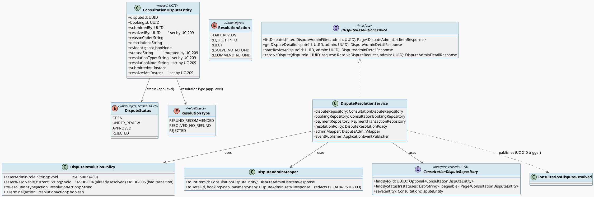
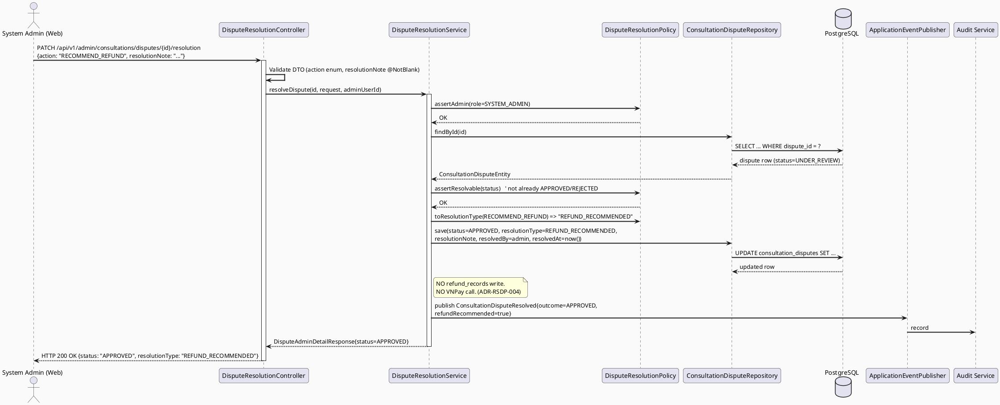
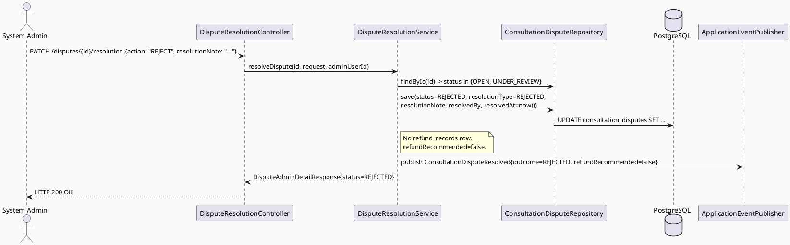
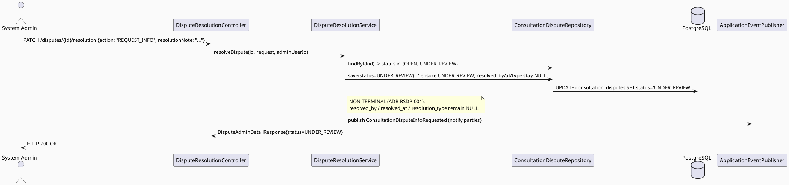
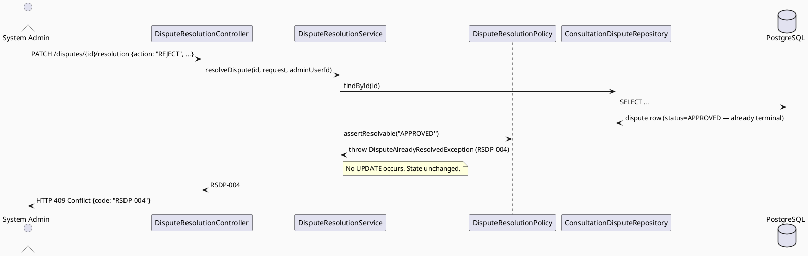
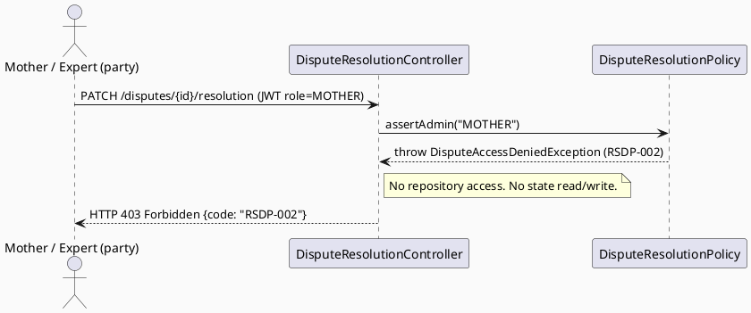
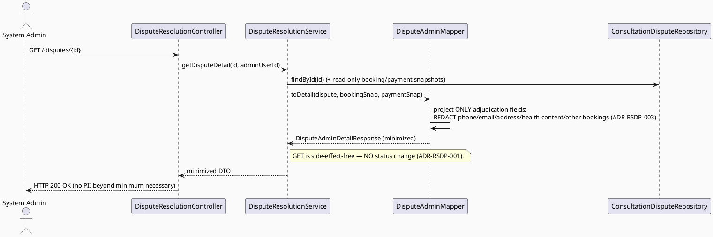
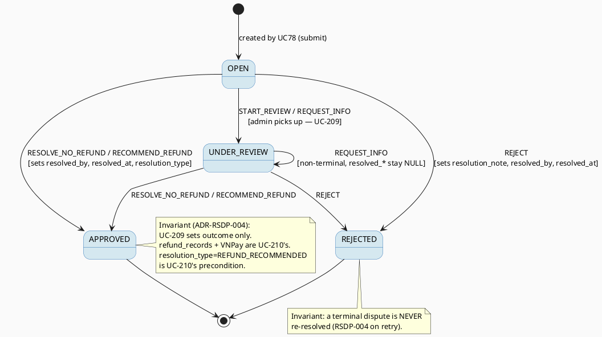

# ENGINEERING DOCUMENTATION STANDARD (EDS) v2.0
# UC-209 — Resolve Consultation Dispute — Technical Design Specification

| Field | Value |
|-------|-------|
| **Document ID** | `CB-CONSULTATION-IMP-209` |
| **Version** | `1.0` |
| **Date** | `2026-07-03` |
| **Status** | `Draft` |
| **Document Owner** | `TV4-Lâm` |
| **Author** | `AI Agent (Technical Architect)` |
| **Reviewed by** | `[Tech Lead — Pending]` |
| **DPO Sign-off** | `[ ] Pending` *(admin reviews both-parties' dispute data incl. PII — see §1, ADR-RSDP-003)* |
| **Approved by** | `[Principal Architect — Pending]` |
| **Last Review** | `2026-07-03` |
| **Based on EDS** | `v2.0` |

---

## CHANGELOG

> **Policy 4.4 — Immutable History:** Không bao giờ xóa thông tin cũ.

| Ngày | Người thực hiện | Nội dung thay đổi |
|------|-----------------|-------------------|
| 2026-07-03 | AI Agent — Technical Architect | Tạo tài liệu lần đầu (Draft) cho UC-209 — dispute **resolution** side (owns `OPEN → UNDER_REVIEW → {APPROVED\|REJECTED}` transitions deferred by UC78 as "future admin-side spec") |

---

## MỤC LỤC

1. [Tổng quan Module](#1-tổng-quan-module)
2. [Ma trận Truy vết (Traceability Matrix)](#2-ma-trận-truy-vết-traceability-matrix)
3. [Architecture Decision Records (ADR)](#3-architecture-decision-records-adr)
4. [Non-Functional Requirements & SLA](#4-non-functional-requirements--sla)
5. [Static Modeling (Mô hình Tĩnh)](#5-static-modeling-mô-hình-tĩnh)
6. [Dynamic Modeling (Mô hình Động)](#6-dynamic-modeling-mô-hình-động)
7. [Domain Event Catalog](#7-domain-event-catalog)
8. [Interface Specification (Đặc tả Giao diện)](#8-interface-specification-đặc-tả-giao-diện)
9. [API Specification](#9-api-specification)
10. [Bảng mã lỗi (Error Codes)](#10-bảng-mã-lỗi-error-codes)
11. [Quy trình Triển khai (Step-by-Step)](#11-quy-trình-triển-khai-step-by-step)
12. [Rollback & Incident Runbook](#12-rollback--incident-runbook)
13. [Kịch bản Kiểm thử Chi tiết](#13-kịch-bản-kiểm-thử-chi-tiết)
14. [Phương pháp Xác minh](#14-phương-pháp-xác-minh)
15. [Mẫu thử thực tế (API Verification Samples)](#15-mẫu-thử-thực-tế-api-verification-samples)
16. [Bảng tổng hợp phân quyền (Authorization Matrix)](#16-bảng-tổng-hợp-phân-quyền-authorization-matrix)
17. [AI Prompt Constraints (CASE 2.0)](#17-ai-prompt-constraints-case-20)

---

## 1. Tổng quan Module

| Field | Value |
|-------|-------|
| **Module Name** | `Consultation — Resolve Dispute (Admin)` |
| **Bounded Context** | `Consultation` (package `com.carebridge.backend.consultation`) |
| **Function ID / UC** | `3.3.14.8 Resolve Consultation Dispute` / `UC-209` (SRS L4494-4513) |
| **Primary Actor** | System Admin (only) |
| **Secondary Actor** | None (SRS L4499) |
| **Platform** | Admin Portal (Web — React + TypeScript + Vite) |
| **Priority** | Medium (SRS L4507) |
| **Frequency of Use** | Occasional (SRS L4508) |
| **Sprint / Owner** | Consultation batch UC203→UC210 — TV4-Lâm |
| **Data Classification** | `Sensitive-PII` (dispute description, both-parties' identities, session evidence, payment amount) |
| **Compliance Scope** | `PDPA (Luật 91/2025)`, internal `BR-RBAC`, `BR-PRIVACY`, `BR-CONSULTATION` |
| **Upstream Dependencies** | `UC78 Submit Dispute` (creates `consultation_disputes` rows in `OPEN`), Booking/Payment/Session read models — **schema-contract only** |
| **Downstream Consumers** | **UC-210 Approve or Reject Refund** (consumes `ConsultationDisputeResolved` + reads `status=APPROVED` / `resolution_type=REFUND_RECOMMENDED` as its precondition), Notification service, Audit log |

### 1.1 Scope Statement — Resolution side of the dispute lifecycle

UC78 (`CB-CONSULTATION-IMP-078`) explicitly **defers the admin-side resolution
workflow** to a future spec: *"the actual **admin-side resolve/approve endpoint**
is a separate use case, not covered by UC78 ... should be tracked as a follow-up
spec (e.g., a future `UC-Admin-ResolveDispute`)"* (UC78 TDS §3, ADR-DISPUTE-001
Consequences). **This TDS is that spec.** UC78 only ever creates disputes in the
`OPEN` state; **UC-209 owns the `OPEN → UNDER_REVIEW → {APPROVED | REJECTED}`
transitions** on top of UC78's proposed ADRs (`ADR-DISPUTE-001..004`), which are
cited here as authoritative and reused — **not redefined**.

UC-209 mutates an **existing** `consultation_disputes` row: it sets
`resolved_by`, `resolution_type`, `resolution_note`, `resolved_at`, and
`status` — the four columns that stay `NULL` until this feature runs
(`V1__init_schema.sql` L969-984; verified §5.3).

### 1.2 Explicit Scope Boundary — UC-209 vs. UC-210 (Confirmed cross-cutting decision)

> ⚠️ **This boundary was confirmed by the user for the whole UC203→UC210 batch
> and is reused verbatim. It is the single most important design constraint of
> this document — see ADR-RSDP-004.**

- **UC-209 (this spec) decides the dispute OUTCOME only** — approve the dispute
  claim (optionally with a *refund recommendation* flag, per the CB-200 mockup's
  "Đề xuất Hoàn tiền" button) or reject it. It sets the `consultation_disputes`
  row to `APPROVED`/`REJECTED` with `resolution_type`.
- **UC-209 does NOT create `refund_records` rows, does NOT call VNPay, and does
  NOT approve any refund amount.** That is **UC-210 Approve or Reject Refund's
  exclusive responsibility** (a separate sibling spec drafted in parallel).
- A dispute resolved as `APPROVED` with `resolution_type = REFUND_RECOMMENDED`
  is the **precondition / trigger input** UC-210 checks before an admin may
  approve a `refund_records` row. UC-209 signals this both by persisting that
  state and by publishing `ConsultationDisputeResolved` (payload carries
  `refundRecommended = true`).
- UC-209 depends on UC78's `VnPayGatewayClient` **interface only for type
  reference / package cohesion**; it never invokes it. Refund calls remain the
  path defined by UC78's `IRefundService` and orchestrated by UC-210.

### 1.3 Entry-Criteria dependency (Open — non-blocking to design, blocking to implement)

UC-209 requires that **UC78 dispute-submission code exists** so `consultation_disputes`
rows in `OPEN` are actually produced, and that the booking/payment/session read
models (UC202/UC203 conventions) are available to build the data-minimized admin
detail view. As with UC78, these are **schema-contract stable** but code-wise
still greenfield (`com.carebridge.backend.consultation` is placeholder-only per
UC78 §1.1). **Marked `Open` — Tech Lead must confirm UC78 + read models are
implemented before UC-209 Sprint work starts.**

---

## 2. Ma trận Truy vết (Traceability Matrix)

| Requirement ID | Loại (BR/ADR/US) | Mô tả yêu cầu | Thành phần Code | Compliance Target | ADR liên quan |
|----------------|------------------|---------------|-----------------|-------------------|---------------|
| UC-209 (SRS §3.3.14.8) | Use Case | Admin reviews minimum-necessary data + both parties' responses and decides the dispute outcome | `DisputeResolutionController`, `DisputeResolutionService.resolveDispute()` | BR-CONSULTATION | ADR-RSDP-001, ADR-RSDP-002 |
| BR-RBAC (SRS L4509) | Business Rule | Only `SYSTEM_ADMIN` may resolve; parties (Mother/Expert) cannot | `DisputeResolutionPolicy.assertAdmin()` | Authorization | ADR-DISPUTE-002 (reused), ADR-RSDP-004 |
| BR-PRIVACY | Business Rule | Admin sees **"minimum necessary data"** (SRS L4501) — redact irrelevant PII | `DisputeAdminMapper` (data-minimized DTO) | PDPA | ADR-RSDP-003 |
| BR-CONSULTATION (SRS L4509) | Business Rule | Dispute lifecycle keeps auditable state; resolution is append-of-status + audit event | `ConsultationDisputeEntity.status/resolutionType/resolvedBy/resolvedAt`, `ConsultationDisputeResolved` event | PDPA / BR-AUDIT | ADR-DISPUTE-001 (reused) |
| ADR-DISPUTE-001 (UC78 — **reused, Proposed**) | Decision | Refunds require manual admin approval before any VNPay call | UC-209 sets APPROVED outcome; **refund call itself is UC-210** | BR-CONSULTATION | — |
| ADR-DISPUTE-002 (UC78 — **reused, Accepted**) | Decision | Ownership/authorization; extended here: resolution actor = admin, not the party | `DisputeResolutionPolicy` | BR-RBAC | — |
| ADR-DISPUTE-003 (UC78 — **reused, Accepted**) | Decision | VNPay refund idempotency via `refund_records.status` | **Not exercised by UC-209** (no VNPay call) — honored by UC-210 | BR-CONSULTATION | — |
| ADR-DISPUTE-004 (UC78 — **reused, Proposed**) | Decision | `reason_code` taxonomy `EXPERT_ABSENT\|SCOPE_VIOLATION\|TECHNICAL_ISSUE\|OTHER` | Read-only in admin view (set by UC78) | — | — |
| CB-200 mockup (resolution workspace) | UI Oracle | Resolution options: request-info / reject / recommend-refund / resolve, each requires rationale | `ResolveDisputeRequest.action` + `resolutionNote` | — | ADR-RSDP-001, ADR-RSDP-002 |
| CB-093 mockup (dispute list) | UI Oracle | List filtered by dispute status; columns case/user/expert/category/status/refund | `DisputeResolutionController.GET /disputes` | — | — |
| Schema: `consultation_disputes` (`V1__init_schema.sql` L969-984) | Schema Contract | Resolution persistence (`resolved_by`, `resolution_type`, `resolution_note`, `resolved_at`, `status`) | `ConsultationDisputeEntity` | — | — |
| Entry-Criteria (§1.3) | Open Item | UC78 + read models must exist first | N/A — blocking dependency | — | — |

---

## 3. Architecture Decision Records (ADR)

> **Reused ADRs (do NOT redefine — authoritative source is UC78 TDS `CB-CONSULTATION-IMP-078` §3):**
> `ADR-DISPUTE-001` (Proposed — refunds require manual admin approval before any VNPay call),
> `ADR-DISPUTE-002` (Accepted — only the booking's `requester_user_id` may submit a dispute),
> `ADR-DISPUTE-003` (Accepted — VNPay refund idempotency via `refund_records.status`),
> `ADR-DISPUTE-004` (Proposed — `reason_code` taxonomy).
> UC-209 adds only the **resolution-specific** decisions below.

### ADR-RSDP-001 — State-machine mapping of CB-200 resolution options; "request-info" is a non-terminal action; GET detail is side-effect-free

| Field | Value |
|-------|-------|
| **Status** | `Proposed` *(needs Product/Tech Lead sign-off — SRS is silent on sub-states; mapping derived from CB-200 mockup)* |
| **Deciders** | `AI Agent (proposal) — pending TV4-Lâm / Tech Lead` |
| **Date** | `2026-07-03` |

#### Bối cảnh (Context)
UC78 defines the dispute status enum `OPEN → UNDER_REVIEW → {APPROVED | REJECTED}`
but creates disputes only in `OPEN`. The CB-200 mockup's sticky action bar shows
**four** resolution controls plus a header "Đưa ra Quyết định" / "Tạm hoãn". These
must be mapped onto the existing 4-state enum without inventing new DB statuses
(schema has no CHECK constraint but the enum is fixed by UC78). The open question:
is "Yêu cầu thêm thông tin" (request-info) a new dispute status, a sub-state, or a
side-channel action?

#### Các phương án đã xem xét (Options Considered)

| Phương án | Mô tả | Ưu điểm | Nhược điểm |
|-----------|-------|----------|------------|
| A | Add a new `AWAITING_INFO` dispute status | Explicit | Invents a status not in UC78's enum; breaks UC-210's precondition matching; schema/enum drift |
| B | **request-info is a NON-terminal action: it ensures status = `UNDER_REVIEW`, records the request via an event/notification, and leaves `resolved_by`/`resolved_at`/`resolution_type` NULL. Terminal decisions (resolve/reject) set those fields. Opening the detail (`GET`) causes NO state change; `OPEN → UNDER_REVIEW` happens on an explicit "start review" action.** | Stays within UC78's 4-state enum; keeps `GET` idempotent/safe (REST + data-minimization); auditable | "request more info" message body has no dedicated table in schema (tracked as Open) |
| C | Auto-transition `OPEN → UNDER_REVIEW` on first admin GET | Fewer clicks | Side effects on a GET violate REST/idempotency; makes read-only inspection mutate state; complicates data-minimization audit |

#### Quyết định (Decision)
Chọn **Phương án B**. Mapping (oracle = CB-200 sticky bar + header):
- **"Đưa ra Quyết định" / start review** → `START_REVIEW`: `OPEN → UNDER_REVIEW` (sets nothing else). Idempotent if already `UNDER_REVIEW`.
- **"Yêu cầu thêm TT" (request more info)** → `REQUEST_INFO`: ensures `UNDER_REVIEW`; emits `ConsultationDisputeInfoRequested`; **non-terminal** — `resolved_by`/`resolved_at`/`resolution_type` stay NULL.
- **"Từ chối" (reject)** → `REJECT`: `{OPEN|UNDER_REVIEW} → REJECTED`.
- **"Giải quyết" (resolve, uphold without refund)** → `RESOLVE_NO_REFUND`: `{OPEN|UNDER_REVIEW} → APPROVED`.
- **"Đề xuất Hoàn tiền" (recommend refund)** → `RECOMMEND_REFUND`: `{OPEN|UNDER_REVIEW} → APPROVED` **with** `resolution_type = REFUND_RECOMMENDED` (trigger for UC-210).

`GET` list/detail endpoints are read-only and never mutate status.

#### Hệ quả (Consequences)
**Tích cực:** No new statuses; UC78 enum preserved; `GET` stays safe; clean UC-210 precondition.
**Tiêu cực / Trade-offs:** "request more info" message content has no schema home — the current schema has **no dispute-messages table**. UC-209 stores only the fact of the request (event/notification); the message body persistence is **Open** (recommend a follow-up, not created here). The messages/evidence shown in CB-200 are **read-only** from existing session/evidence data (`evidence_json`, session chat owned by the communication domain — out of scope).
**Compliance Impact:** Side-effect-free reads support minimum-necessary/auditable access.

---

### ADR-RSDP-002 — `resolution_type` taxonomy (application-level enum; NO DB CHECK constraint)

| Field | Value |
|-------|-------|
| **Status** | `Proposed` *(taxonomy values are an AI-derived mapping from the CB-200 mockup — needs Product sign-off)* |
| **Deciders** | `AI Agent (proposal only)` |
| **Date** | `2026-07-03` |

#### Bối cảnh (Context)
`consultation_disputes.resolution_type` is `varchar(30)` with **no CHECK
constraint** in `V1__init_schema.sql` (verified §5.3 — consistent with the
deliberate CareBridge pattern of app-level enum validation on free `varchar`
columns; same posture as ADR-DISPUTE-004). UC-210 needs a machine-readable
signal to know whether a refund is recommended.

#### Quyết định (Decision)
Chọn application-level enum, DB column stays free `varchar(30)` (**no new
migration**). Fixed taxonomy (values map 1:1 to CB-200 buttons):

| `resolution_type` | Dispute `status` | `refundRecommended` (event flag) | CB-200 button (oracle) |
|-------------------|------------------|----------------------------------|------------------------|
| `REFUND_RECOMMENDED` | `APPROVED` | `true` | "Đề xuất Hoàn tiền" |
| `RESOLVED_NO_REFUND` | `APPROVED` | `false` | "Giải quyết" |
| `REJECTED` | `REJECTED` | `false` | "Từ chối" |
| *(none — NULL)* | `UNDER_REVIEW` | n/a | "Yêu cầu thêm TT" / "Đưa ra Quyết định" (non-terminal) |

**UC-210's precondition** = `status == APPROVED AND resolution_type == REFUND_RECOMMENDED`.

#### Hệ quả (Consequences)
**Tích cực:** No schema change; clear, reportable outcomes; unambiguous UC-210 trigger.
**Tiêu cực / Trade-offs:** DB does not enforce the taxonomy (accepted — same risk posture as every other free `varchar` in this domain).
**Compliance Impact:** None material.

---

### ADR-RSDP-003 — Data-minimization admin DTO (redact PII not needed to adjudicate)

| Field | Value |
|-------|-------|
| **Status** | `Accepted` *(directly mandated by SRS "minimum necessary data" + BR-PRIVACY)* |
| **Deciders** | `AI Agent — derived from SRS L4501 + BR-PRIVACY` |
| **Date** | `2026-07-03` |

#### Bối cảnh (Context)
SRS UC-209 Description: *"Reviews **minimum necessary data**, both parties'
responses, and decides the dispute outcome"* (L4501). BR-PRIVACY: *"health and
family data must follow consent, purpose, and **minimum-necessary access** rules"*.
The admin adjudicates conduct/timeliness/scope — they do **not** need either
party's full contact details, health-record content, unrelated bookings, or
financial history beyond the single disputed transaction.

#### Quyết định (Decision)
`DisputeAdminMapper` projects a **data-minimized** DTO. **Included** (needed to
adjudicate, oracle = CB-200 panels): dispute core (`disputeId`, `bookingId`,
`reasonCode`, `description`, `status`, `submittedAt`), booking snapshot (modality,
scheduled time, session status), payment snapshot (masked transaction ref,
amount, currency, hold/escrow status, gateway = VNPay), both parties' **display
name + masked ID + role label only**, session-conduct evidence relevant to the
dispute (`evidence_json` + session-timeline events), policy references. **Redacted
/ never exposed**: phone, email, address, full health-record content, other
bookings, other transactions, raw internal user rows, raw `submitted_by`/`resolved_by`
UUIDs beyond what the admin context already owns.

#### Hệ quả (Consequences)
**Tích cực:** Satisfies SRS "minimum necessary" + BR-PRIVACY; reduces PII blast radius.
**Tiêu cực / Trade-offs:** Admin needing more context must use a separate, audited PII-access flow (out of scope).
**Compliance Impact:** Directly supports PDPA minimum-necessary access.

---

### ADR-RSDP-004 — UC-209/UC-210 scope boundary: UC-209 sets outcome only; never creates `refund_records` or calls VNPay

| Field | Value |
|-------|-------|
| **Status** | `Accepted` *(confirmed cross-cutting decision for the UC203→UC210 batch — user-approved)* |
| **Deciders** | `Product/Tech Lead (confirmed) — transcribed by AI Agent` |
| **Date** | `2026-07-03` |

#### Bối cảnh (Context)
Both UC-209 and UC-210 touch the dispute/refund domain and the same
`consultation_disputes` table. Without a hard boundary, an implementer could make
UC-209 create a `refund_records` row or call VNPay on "recommend refund",
duplicating UC-210 and re-introducing the auto-refund anti-pattern UC78's
ADR-DISPUTE-001 forbids.

#### Các phương án đã xem xét (Options Considered)

| Phương án | Mô tả | Ưu điểm | Nhược điểm |
|-----------|-------|----------|------------|
| A | UC-209 creates the `refund_records` row on "recommend refund" | One click to refund | Duplicates UC-210; violates ADR-DISPUTE-001 (admin must still approve the refund *amount*); double-ownership of `refund_records` |
| B | **UC-209 only sets dispute `status=APPROVED` + `resolution_type=REFUND_RECOMMENDED` and publishes `ConsultationDisputeResolved`. UC-210 reads that state/event as its precondition and owns all `refund_records` creation + VNPay calls.** | Clean single-writer for `refund_records`; preserves ADR-DISPUTE-001 human gate; matches SRS (UC-210 = "Approve or Reject Refund") | Two admin steps (resolve dispute, then approve refund) |

#### Quyết định (Decision)
Chọn **Phương án B**. UC-209 **never** writes `refund_records`, **never**
constructs/invokes `VnPayGatewayClient`, and **never** calls UC78's
`IRefundService`. Its only refund-related output is the `REFUND_RECOMMENDED`
outcome + event. An automated test asserts `verifyNoInteractions` on the refund
repository and VNPay client (see Test-Spec `RSDP-TC-015`).

#### Hệ quả (Consequences)
**Tích cực:** Single-writer discipline for `refund_records`; ADR-DISPUTE-001 gate intact; unambiguous for implementers reading both specs.
**Tiêu cực / Trade-offs:** Requires UC-210 to exist before an approved-with-refund dispute produces money movement (by design).
**Compliance Impact:** Preserves financial-safety human gate (CLAUDE.md payment mandate).

---

## 4. Non-Functional Requirements & SLA

> No SRS/BR source specifies numeric SLA targets for UC-209. Values below are
> **Open — proposed defaults** consistent with UC202/UC78; confirm with Tech Lead.

### 4.1. Performance & Availability

| Category | Requirement | Target SLA | Measurement Method | Compliance Basis |
|----------|-------------|------------|---------------------|------------------|
| Latency | `GET /disputes` list (p99) | `< 300ms` *(Open — proposed)* | API test timing | — |
| Latency | `PATCH /disputes/{id}/resolution` (p99) | `< 500ms` *(Open — proposed)* | API test timing | — |
| Availability | Admin portal endpoints uptime | `99.9%` *(Open — proposed)* | Uptime monitor | — |
| Pagination | List default / max page size | `20 / 50` (reuse UC202 §4.1) | Config review | — |

### 4.2. Data Integrity & Retention

| Category | Requirement | Target | Verification Method | Compliance Basis |
|----------|-------------|--------|---------------------|------------------|
| Durability | No lost resolution decision | RPO = 0 (single PostgreSQL transaction) | Transaction log | BR-CONSULTATION |
| Consistency | A terminal dispute has non-null `resolved_by` + `resolved_at` + `resolution_type` | 100% (service-layer invariant) | Reconciliation query (§14.1) | BR-CONSULTATION |
| Immutability | A terminal dispute (`APPROVED`/`REJECTED`) is never re-resolved | Enforced by state-transition guard (RSDP-004) | State-machine test | BR-CONSULTATION |
| Retention | Dispute/resolution audit trail | Indefinite (status-only updates, no DELETE) | DB inspection | PDPA |

### 4.3. Security

| Category | Requirement | Target | Verification Method | Compliance Basis |
|----------|-------------|--------|---------------------|------------------|
| Access control | `SYSTEM_ADMIN` only for all UC-209 endpoints | Least privilege | Auth Matrix (§16) | BR-RBAC |
| Data minimization | Admin DTO redacts non-adjudication PII | No phone/email/health content in response | DTO test `RSDP-TC-010` | BR-PRIVACY, PDPA |
| Transport | All endpoints over TLS | TLS 1.2+ (platform default) | Infra config | — |
| Audit | Every resolution recorded with actor + timestamp | 100% via `ConsultationDisputeResolved` + `resolved_by`/`resolved_at` | Log/DB inspection | BR-CONSULTATION |

### 4.4. Scalability & Capacity Planning

SRS marks UC-209 "Frequency of Use: **Occasional**" (L4508). Dispute-resolution
volume is very low; standard Spring Boot request handling suffices. No caching or
special scaling design required.

---

## 5. Static Modeling (Mô hình Tĩnh)

### 5.1. Component Responsibilities & Planned File Paths

> Reuses UC78's `ConsultationDisputeEntity` and `ConsultationDisputeRepository`
> (adds admin query methods). Adds resolution-specific controller/service/policy/
> mapper/DTOs. Package: `com.carebridge.backend.consultation.*`.

| Layer | File Path | Responsibility |
|-------|-----------|----------------|
| Controller | `src/main/java/com/carebridge/backend/consultation/controller/DisputeResolutionController.java` | HTTP mapping + DTO validation for admin list/detail/review/resolution endpoints |
| Service | `src/main/java/com/carebridge/backend/consultation/service/DisputeResolutionService.java` | Resolution workflow, state-transition orchestration, event emission (impl of `IDisputeResolutionService`) |
| Policy | `src/main/java/com/carebridge/backend/consultation/policy/DisputeResolutionPolicy.java` | Admin-only RBAC (ADR-RSDP-004 / ADR-DISPUTE-002 reused); state-transition validation (ADR-RSDP-001); `resolution_type` taxonomy (ADR-RSDP-002) |
| Mapper | `src/main/java/com/carebridge/backend/consultation/mapper/DisputeAdminMapper.java` | Data-minimized entity → DTO projection (ADR-RSDP-003); never leak entity |
| Repository | `src/main/java/com/carebridge/backend/consultation/repository/ConsultationDisputeRepository.java` | **Reused from UC78**; add `findByStatusIn(...)` + paged admin query |
| Repository (read-only) | `src/main/java/com/carebridge/backend/consultation/repository/ConsultationBookingRepository.java`, `PaymentTransactionRepository` | Read snapshots for the admin detail view (interfaces owned by prerequisite modules) |
| Entity | `src/main/java/com/carebridge/backend/consultation/entity/ConsultationDisputeEntity.java` | **Reused from UC78** (JPA mapping for `consultation_disputes`) |
| DTO (in) | `src/main/java/com/carebridge/backend/consultation/dto/request/ResolveDisputeRequest.java` | Inbound resolution decision `{action, resolutionNote}` |
| DTO (out) | `src/main/java/com/carebridge/backend/consultation/dto/response/DisputeAdminListItemResponse.java` | List row (case/user/expert/category/status/refund) — CB-093 columns |
| DTO (out) | `src/main/java/com/carebridge/backend/consultation/dto/response/DisputeAdminDetailResponse.java` | Data-minimized detail (CB-200 panels) |
| Event | `src/main/java/com/carebridge/backend/consultation/event/ConsultationDisputeResolved.java` | Published on terminal resolution — **UC-210 trigger** |
| Event | `src/main/java/com/carebridge/backend/consultation/event/ConsultationDisputeUnderReview.java` | Published on `OPEN → UNDER_REVIEW` |
| Event | `src/main/java/com/carebridge/backend/consultation/event/ConsultationDisputeInfoRequested.java` | Published on `REQUEST_INFO` (notify parties) |
| Web | `05_Development/CareBridgeWebApp/src/features/consultation/disputes/DisputeListPage.tsx` | CB-093 admin list view |
| Web | `05_Development/CareBridgeWebApp/src/features/consultation/disputes/DisputeResolutionWorkspace.tsx` | CB-200 resolution workspace |

### 5.2. Class Diagram (PlantUML)



### 5.3. Data Structure — Schema/Migration Details

> **CareBridge rule:** `V1__init_schema.sql` and approved Flyway migrations are
> the primary source of truth.

**No new migration is required.** UC-209 only writes existing columns of
`consultation_disputes` that stay NULL until resolution. Verified against
`V1__init_schema.sql` L969-984:

```sql
-- consultation_disputes (V1__init_schema.sql L969-984) — columns UC-209 mutates marked (*)
CREATE TABLE public.consultation_disputes (
    dispute_id      uuid        NOT NULL DEFAULT gen_random_uuid(),
    booking_id      uuid        NOT NULL,
    submitted_by    uuid        NOT NULL,
    resolved_by     uuid,                                   -- (*) set to admin userId on resolution
    reason_code     varchar(50),                            -- read-only (set by UC78)
    description     text,                                   -- read-only (set by UC78)
    evidence_json   jsonb,                                  -- read-only (evidence from UC78)
    status          varchar(30) NOT NULL DEFAULT 'OPEN',    -- (*) OPEN -> UNDER_REVIEW -> {APPROVED|REJECTED}
    resolution_type varchar(30),                            -- (*) REFUND_RECOMMENDED|RESOLVED_NO_REFUND|REJECTED
    resolution_note text,                                   -- (*) mandatory rationale (CB-200 "Lý do xử lý (Bắt buộc)")
    submitted_at    timestamptz NOT NULL DEFAULT now(),
    resolved_at     timestamptz,                            -- (*) set to now() on terminal resolution
    created_at      timestamptz NOT NULL DEFAULT now(),
    updated_at      timestamptz NOT NULL DEFAULT now()
);
-- FK: resolved_by -> users (V1__init_schema.sql L1874-1875). ALL status/type fields are
-- application-level only (NO DB CHECK constraint) — deliberate pattern; UC-209 does NOT add one.
```

**Confirmed: no schema change needed.** `resolved_by`, `resolution_type`,
`resolution_note`, `resolved_at`, and `status` all already exist. UC-209 does
**not** touch `refund_records` (that is UC-210's table — ADR-RSDP-004). No sync
action needed for `V1__init_schema.sql`.

---

## 6. Dynamic Modeling (Mô hình Động)

### 6.1. Sequence — Happy Path: Resolve to APPROVED with Refund Recommendation (trigger for UC-210)



### 6.2. Sequence — Happy Path: Resolve to REJECTED



### 6.3. Sequence — Side-action: Request More Info (non-terminal)



### 6.4. Sequence — Error Path: Wrong-state (already resolved)



### 6.5. Sequence — Error Path: Non-admin denied



### 6.6. Sequence — Data-minimization redaction on GET detail



### 6.7. State Machine — Dispute Status (UC-209 owns these transitions)



**⚠️ Invariant bất biến:**
1. A terminal dispute (`APPROVED`/`REJECTED`) can never transition again — resolving it again returns `RSDP-004`.
2. A terminal resolution MUST set all of `resolved_by`, `resolved_at`, `resolution_type` in one transaction; `REQUEST_INFO`/`START_REVIEW` MUST leave them NULL.
3. UC-209 MUST NOT write `refund_records` or invoke VNPay (ADR-RSDP-004).
4. `resolution_note` is mandatory for every action (CB-200 "Lý do xử lý (Bắt buộc)") — blank → `RSDP-006`.

---

## 7. Domain Event Catalog

### 7.1. Events Published (Phát ra)

| Event Name | Trigger | Publisher | Subscriber(s) | Payload Schema | Async? |
|------------|---------|-----------|---------------|----------------|--------|
| `ConsultationDisputeResolved` | Terminal resolution (`APPROVED`/`REJECTED`) | `DisputeResolutionService` | **UC-210 Approve/Reject Refund** (precondition trigger), Notification service, Audit log | `ConsultationDisputeResolved.java` | Yes |
| `ConsultationDisputeUnderReview` | `OPEN → UNDER_REVIEW` (START_REVIEW) | `DisputeResolutionService` | Notification (parties: "under review"), Audit log | `ConsultationDisputeUnderReview.java` | Yes |
| `ConsultationDisputeInfoRequested` | `REQUEST_INFO` action | `DisputeResolutionService` | Notification (parties: "provide more info"), Audit log | `ConsultationDisputeInfoRequested.java` | Yes |

> **Note:** `ConsultationDisputeResolved` supersedes UC78's tentatively-named
> `DisputeResolved` (UC78 §7.1 flagged the resolution event contract as
> "owned here since UC78 defines the dispute lifecycle"). UC-209 finalizes the
> event on the resolution side with an explicit `refundRecommended` flag for
> UC-210. Naming aligned to `[Entity][PastTenseVerb]` per EDS §7.

### 7.2. Events Consumed (Tiêu thụ)

| Event Name | Source | Handler | Action thực hiện |
|------------|--------|---------|------------------|
| *(none)* | — | — | UC-209 originates the resolution; it reads existing `OPEN` disputes created by UC78 directly via repository, not via an event. |

### 7.3. Payload Schema

```java
// ConsultationDisputeResolved.java — THE UC-210 TRIGGER
public record ConsultationDisputeResolved(
    UUID    eventId,          // UUID.randomUUID() — dedupe
    String  eventType,        // "ConsultationDisputeResolved"
    Instant occurredAt,       // Instant.now()
    String  version,          // "1.0"
    Payload payload,
    Metadata metadata
) implements ApplicationEvent {

    public record Payload(
        UUID    disputeId,
        UUID    bookingId,
        UUID    paymentId,          // nullable — snapshot of the disputed payment (for UC-210 lookup)
        UUID    resolvedBy,         // admin userId
        String  outcome,            // "APPROVED" | "REJECTED"
        String  resolutionType,     // "REFUND_RECOMMENDED" | "RESOLVED_NO_REFUND" | "REJECTED"
        boolean refundRecommended,  // true iff resolutionType == "REFUND_RECOMMENDED" — UC-210 precondition
        String  resolutionNote,
        Instant resolvedAt
    ) {}

    public record Metadata(
        UUID   correlationId,
        String causedBy            // admin userId
    ) {}
}

// ConsultationDisputeUnderReview.java
public record ConsultationDisputeUnderReview(
    UUID eventId, String eventType, Instant occurredAt, String version,
    Payload payload, Metadata metadata
) implements ApplicationEvent {
    public record Payload(UUID disputeId, UUID bookingId, UUID reviewedBy) {}
    public record Metadata(UUID correlationId, String causedBy) {}
}

// ConsultationDisputeInfoRequested.java
public record ConsultationDisputeInfoRequested(
    UUID eventId, String eventType, Instant occurredAt, String version,
    Payload payload, Metadata metadata
) implements ApplicationEvent {
    public record Payload(UUID disputeId, UUID bookingId, UUID requestedBy, String note) {}
    public record Metadata(UUID correlationId, String causedBy) {}
}
```

---

## 8. Interface Specification (Đặc tả Giao diện)

### 8.1. Service Interface

```java
// ResolveDisputeRequest.java — Input DTO
// @version 1.0
public class ResolveDisputeRequest {
    @NotBlank
    @Pattern(regexp = "START_REVIEW|REQUEST_INFO|REJECT|RESOLVE_NO_REFUND|RECOMMEND_REFUND")
    private String action;          // ADR-RSDP-001 action set (maps to CB-200 buttons)

    @NotBlank                       // CB-200 "Lý do xử lý (Bắt buộc)" — blank => RSDP-006
    @Size(max = 2000)
    private String resolutionNote;
    // getters / setters / @Valid
}

// DisputeAdminFilter.java — list query params
// @version 1.0
public class DisputeAdminFilter {
    private List<String> statuses;  // default ["OPEN","UNDER_REVIEW"] (CB-093 pending/investigating)
    private String search;          // case id / user (CB-093 search box)
    private int page = 0;
    private int size = 20;          // max 50 (reuse UC202 §4.1)
}

// DisputeAdminListItemResponse.java — Output DTO (CB-093 columns)
public class DisputeAdminListItemResponse {
    private UUID disputeId;
    private String caseRef;          // display case id
    private String clientDisplayName;   // minimized (ADR-RSDP-003)
    private String expertDisplayName;   // minimized
    private String category;            // reasonCode label
    private String status;              // OPEN | UNDER_REVIEW | APPROVED | REJECTED
    private String refundOutcome;       // "NOT_DECIDED" | "REFUND_RECOMMENDED" | ... (display)
    private Instant submittedAt;
    // getters / setters
}

// DisputeAdminDetailResponse.java — Output DTO (CB-200 panels; DATA-MINIMIZED)
public class DisputeAdminDetailResponse {
    private UUID disputeId;
    private UUID bookingId;
    private String reasonCode;
    private String description;
    private String status;
    private String resolutionType;      // nullable until terminal
    private String resolutionNote;      // nullable until set
    private Instant submittedAt;
    private Instant resolvedAt;         // nullable
    private PartySummary client;        // {displayName, maskedId, roleLabel} — NO phone/email/health
    private PartySummary expert;        // {displayName, maskedId, roleLabel}
    private BookingSnapshot booking;    // {modality, scheduledAt, sessionStatus}
    private PaymentSnapshot payment;    // {maskedTxnRef, amount, currency, holdStatus, gateway}
    private List<EvidenceItem> evidence;// session-conduct evidence only (from evidence_json)
    private List<PolicyRef> policyRefs; // CB-200 policy references
    // getters / setters — NEVER expose raw entity or redacted PII
}

// IDisputeResolutionService.java — Service Contract
// @version 1.0
public interface IDisputeResolutionService {
    /** List disputes for admin triage (CB-093). ADMIN only.
     *  @throws DisputeAccessDeniedException (RSDP-002) if caller is not SYSTEM_ADMIN */
    Page<DisputeAdminListItemResponse> listDisputes(DisputeAdminFilter filter, UUID adminUserId);

    /** Data-minimized detail (CB-200). Side-effect-free (ADR-RSDP-001).
     *  @throws DisputeAccessDeniedException (RSDP-002); @throws DisputeNotFoundException (RSDP-003) */
    DisputeAdminDetailResponse getDisputeDetail(UUID disputeId, UUID adminUserId);

    /** OPEN -> UNDER_REVIEW. Idempotent if already UNDER_REVIEW.
     *  @throws RSDP-002; RSDP-003; @throws DisputeAlreadyResolvedException (RSDP-004) if terminal */
    DisputeAdminDetailResponse startReview(UUID disputeId, UUID adminUserId);

    /** Apply a resolution action. Terminal actions set resolved_by/at/type; REQUEST_INFO does not.
     *  UC-209 sets OUTCOME only — never creates refund_records / never calls VNPay (ADR-RSDP-004).
     *  @throws RSDP-002 (non-admin); RSDP-003 (not found); RSDP-004 (already resolved);
     *          RSDP-005 (invalid transition); RSDP-006 (blank rationale) */
    DisputeAdminDetailResponse resolveDispute(UUID disputeId, ResolveDisputeRequest request, UUID adminUserId);
}
```

### 8.2. Repository Interface

```java
// ConsultationDisputeRepository.java  (REUSED from UC78 — admin methods added here)
// @version 1.1  (additive; non-breaking to UC78)
public interface ConsultationDisputeRepository extends JpaRepository<ConsultationDisputeEntity, UUID> {

    Optional<ConsultationDisputeEntity> findById(UUID disputeId);

    // Admin triage list (CB-093) — filtered by lifecycle status
    Page<ConsultationDisputeEntity> findByStatusIn(Collection<String> statuses, Pageable pageable);

    // Status transitions via save() on a managed entity (append-of-status; no delete()).
}
```

---

## 9. API Specification

### 9.1. Endpoints Table

| Method | Path | Auth Level | Required Roles | Rate Limit | Idempotent? |
|--------|------|------------|----------------|------------|-------------|
| `GET` | `/api/v1/admin/consultations/disputes` | JWT Bearer | `SYSTEM_ADMIN` | 300/min | Yes |
| `GET` | `/api/v1/admin/consultations/disputes/{disputeId}` | JWT Bearer | `SYSTEM_ADMIN` | 300/min | Yes |
| `PATCH` | `/api/v1/admin/consultations/disputes/{disputeId}/review` | JWT Bearer | `SYSTEM_ADMIN` | 60/min | Yes (idempotent transition to UNDER_REVIEW) |
| `PATCH` | `/api/v1/admin/consultations/disputes/{disputeId}/resolution` | JWT Bearer | `SYSTEM_ADMIN` | 60/min | No (terminal actions once only) |

> **Refund creation / VNPay call is NOT here** — that is UC-210
> (`POST .../refunds/{id}/approval`), a separate spec (ADR-RSDP-004).

### 9.2. Request / Response Schemas

#### `PATCH /api/v1/admin/consultations/disputes/{disputeId}/resolution`

**Request Body:**
```json
{
  "action": "RECOMMEND_REFUND",
  "resolutionNote": "Expert joined 15 minutes late and disabled camera mid-session; violates CS-04 and CS-12. Refund recommended."
}
```

**Response — 200 OK (APPROVED with refund recommendation):**
```json
{
  "disputeId": "550e8400-e29b-41d4-a716-446655440000",
  "bookingId": "3fa85f64-5717-4562-b3fc-2c963f66afa6",
  "reasonCode": "EXPERT_ABSENT",
  "status": "APPROVED",
  "resolutionType": "REFUND_RECOMMENDED",
  "resolutionNote": "Expert joined 15 minutes late ...",
  "submittedAt": "2026-07-01T07:00:00.000Z",
  "resolvedAt": "2026-07-03T02:30:00.000Z"
}
```

**Response — 200 OK (REJECTED):**
```json
{
  "disputeId": "550e8400-e29b-41d4-a716-446655440000",
  "status": "REJECTED",
  "resolutionType": "REJECTED",
  "resolutionNote": "Session logs show expert present throughout; claim not substantiated.",
  "resolvedAt": "2026-07-03T02:35:00.000Z"
}
```

**Response — 400 Bad Request (blank rationale):**
```json
{ "error": { "code": "RSDP-006", "message": "Resolution rationale is required" } }
```

**Response — 403 Forbidden (non-admin):**
```json
{ "error": { "code": "RSDP-002", "message": "Only a System Admin may resolve consultation disputes" } }
```

**Response — 409 Conflict (already resolved):**
```json
{ "error": { "code": "RSDP-004", "message": "Dispute has already been resolved and cannot be resolved again" } }
```

#### `GET /api/v1/admin/consultations/disputes?statuses=OPEN,UNDER_REVIEW&page=0&size=20`

**Response — 200 OK (data-minimized list, CB-093):**
```json
{
  "content": [
    {
      "disputeId": "550e8400-e29b-41d4-a716-446655440000",
      "caseRef": "C-8472",
      "clientDisplayName": "Nguyễn Thị M.",
      "expertDisplayName": "Bs. Lê Văn A.",
      "category": "EXPERT_ABSENT",
      "status": "OPEN",
      "refundOutcome": "NOT_DECIDED",
      "submittedAt": "2026-07-01T07:00:00.000Z"
    }
  ],
  "page": 0, "size": 20, "totalElements": 12
}
```

---

## 10. Bảng mã lỗi (Error Codes)

> Prefix `RSDP-` (Resolve DisPute) — distinct module surface from UC78's `DISP-`
> (submit side), following the domain convention of module-scoped prefixes
> (e.g. `SES-`/`SUMW-` both touch `consultation_sessions`).

| Code | HTTP Status | Message (EN) | Message (VI) | Trigger Condition |
|------|-------------|--------------|--------------|-------------------|
| `RSDP-001` | 400 | Validation failed | Dữ liệu không hợp lệ | `action` not in the allowed set / malformed request body |
| `RSDP-002` | 403 | Only a System Admin may resolve consultation disputes | Chỉ Quản trị viên hệ thống mới được xử lý tranh chấp | Caller is not `SYSTEM_ADMIN` (e.g. Mother/Expert party) |
| `RSDP-003` | 404 | Dispute not found | Không tìm thấy tranh chấp | `disputeId` does not exist — **identical case to UC78 `DISP-003`** (cross-reference; distinct prefix because distinct module surface) |
| `RSDP-004` | 409 | Dispute has already been resolved | Tranh chấp đã được xử lý, không thể xử lý lại | Dispute `status` is already terminal (`APPROVED`/`REJECTED`) |
| `RSDP-005` | 409 | Invalid dispute state transition | Chuyển trạng thái tranh chấp không hợp lệ | Requested action not allowed from current status (defensive; e.g. `START_REVIEW` on a terminal dispute) |
| `RSDP-006` | 400 | Resolution rationale is required | Bắt buộc nhập lý do xử lý | `resolutionNote` blank (CB-200 mandatory field) |
| `RSDP-500` | 500 | Internal error | Lỗi hệ thống | Unexpected failure |

> **Cross-reference:** the "dispute-not-found" condition is behaviorally identical
> to UC78 `DISP-003`; UC-209 surfaces it as `RSDP-003` because error codes are
> module-scoped. `VNP-001`/refund error codes are **out of scope** (UC-210 owns them).

---

## 11. Quy trình Triển khai (Step-by-Step)

### 11.1. Prerequisites

- [ ] **BLOCKING (Open §1.3):** UC78 dispute-submission implemented (produces `OPEN` disputes) and booking/payment read models available
- [ ] ADR-DISPUTE-001, ADR-DISPUTE-004 confirmed by Product/Tech Lead (still `Proposed` in UC78) — reused here
- [ ] ADR-RSDP-001, ADR-RSDP-002 confirmed by Product/Tech Lead (`Proposed`)
- [ ] DPO review for admin exposure of both-parties' dispute data (ADR-RSDP-003) — sign-off pending
- [ ] Principal Architect approves this TDS

### 11.2. Pre-Migration Checklist

- [ ] **N/A** — no new migration required (§5.3). UC-209 writes only existing NULL columns of `consultation_disputes`.

### 11.3. Implementation Steps

#### Chặng 1 — Reuse UC78 entity/repository
Reuse `ConsultationDisputeEntity` and `ConsultationDisputeRepository` (add
`findByStatusIn`). No new entity, no migration.

#### Chặng 2 — Policy + Service + Mapper
Implement `DisputeResolutionPolicy` (admin RBAC + state-transition guard +
taxonomy), `DisputeResolutionService` (list/detail/startReview/resolveDispute +
event emission), `DisputeAdminMapper` (data-minimized projection — ADR-RSDP-003).
Assert **no** `refund_records`/`VnPayGatewayClient` reference in this feature.

#### Chặng 3 — Controller + Web
Wire `DisputeResolutionController`, then Web `DisputeListPage.tsx` (CB-093) +
`DisputeResolutionWorkspace.tsx` (CB-200).

#### Chặng 4 — Verification sau deploy
```bash
curl -X GET https://[host]/api/v1/health
# Expected: {"status": "ok"}
```

### 11.4. Deployment Checklist

- [ ] `./mvnw test` green (incl. `RSDP-TC-015` scope-boundary guard)
- [ ] Health check 200; error rate < 1% in first 10 minutes
- [ ] Audit log emits `ConsultationDisputeResolved` on resolution
- [ ] No PII beyond minimum-necessary in admin responses/logs

---

## 12. Rollback & Incident Runbook

### 12.1. Điều kiện kích hoạt Rollback

| Điều kiện | Ngưỡng | Người quyết định |
|-----------|--------|------------------|
| Error rate tăng đột biến | > 5% trong 5 phút | On-call Engineer |
| Dispute resolved without audit event | Any single occurrence | Tech Lead |
| PII over-exposure in admin DTO (redaction regression) | Any single occurrence | Tech Lead + DPO |
| A resolution wrote to `refund_records` (scope-boundary breach) | Any single occurrence | Tech Lead (financial-safety incident) |

### 12.2. Rollback Procedure

```bash
# No migration in scope — code-only rollback:
git checkout -- 05_Development/CareBridgeAPI/src/main/java/com/carebridge/backend/consultation/
git checkout -- 05_Development/CareBridgeWebApp/src/features/consultation/disputes/
# Note: disputes already resolved remain resolved (append-of-status; no data rollback needed).
# If a scope-boundary breach created refund_records, escalate to UC-210/Finance — do NOT self-delete.
```

### 12.3. Notification Protocol

| Thời điểm | Người nhận | Kênh | Template |
|-----------|------------|------|----------|
| Ngay khi phát hiện PII over-exposure | On-call + DPO | Slack `#incident` + Email | "🚨 Dispute admin DTO leaked non-minimal PII for dispute [id]" |
| Ngay khi phát hiện scope-boundary breach | On-call + Finance + Tech Lead | Slack `#incident` | "🚨 UC-209 wrote refund_records (should be UC-210 only) — dispute [id]" |

### 12.4. Post-Incident Review (PIR)

Standard PIR within 48h for any PII over-exposure or scope-boundary breach.

---

## 13. Kịch bản Kiểm thử Chi tiết

> Detailed test cases live in `UC209_ResolveConsultationDispute_Test-Spec.md`.
> This section references condition IDs only.

| Condition Ref | Summary |
|---------------|---------|
| TC-COND-001 | Happy — resolve to APPROVED with refund recommendation (RECOMMEND_REFUND) |
| TC-COND-002 | Happy — resolve to APPROVED no refund (RESOLVE_NO_REFUND) |
| TC-COND-003 | Happy — reject (REJECTED) |
| TC-COND-004 | Start review OPEN → UNDER_REVIEW |
| TC-COND-005 | Request-info side action — non-terminal, resolved_* stay NULL |
| TC-COND-006 | Wrong-state — resolving an already-resolved dispute → RSDP-004 |
| TC-COND-007 | Blank rationale → RSDP-006 |
| TC-COND-008 | Non-admin (Mother/Expert) denied → RSDP-002 (403) |
| TC-COND-009 | Unauthenticated → 401 |
| TC-COND-010 | Data-minimization / PII redaction assertion on admin detail DTO |
| TC-COND-011 | `ConsultationDisputeResolved` payload — refundRecommended=true for UC-210 |
| TC-COND-012 | `ConsultationDisputeResolved` payload — refundRecommended=false (reject/no-refund) |
| TC-COND-013 | Boundary — resolutionNote length (2000/2001) |
| TC-COND-014 | Dispute not found → RSDP-003 (cross-ref DISP-003) |
| TC-COND-015 | Scope boundary — never writes refund_records / never calls VNPay |
| TC-COND-016 | List returns only OPEN/UNDER_REVIEW; admin-only |
| TC-COND-017 | E2E — resolve-to-APPROVED via MockMvc + Testcontainers, DB row updated |

---

## 14. Phương pháp Xác minh

### 14.1. Database Inspection

```sql
-- Verify resolution persisted correctly
SELECT dispute_id, status, resolution_type, resolution_note, resolved_by, resolved_at
FROM consultation_disputes
WHERE dispute_id = '[uuid]';

-- Invariant: a terminal dispute has all resolution fields set
SELECT dispute_id FROM consultation_disputes
WHERE status IN ('APPROVED','REJECTED')
  AND (resolved_by IS NULL OR resolved_at IS NULL OR resolution_type IS NULL);
-- Expected: no rows

-- Scope-boundary check: UC-209 must NOT have created refund rows (that is UC-210)
SELECT r.refund_id FROM refund_records r
JOIN consultation_disputes d ON d.dispute_id = r.dispute_id
WHERE d.resolved_at = '[uc209_resolution_time]';
-- Expected during UC-209-only deploy: no rows (refunds appear only after UC-210 runs)
```

### 14.2. Log / Audit Verification

```bash
kubectl logs -l app=carebridge-api | grep '"eventType":"ConsultationDisputeResolved"' | head -5
# Verify no PII leak in admin responses/logs
kubectl logs -l app=carebridge-api | grep -iE "phone|email|health_record|address"
# Expected: no dispute-admin PII in logs
```

---

## 15. Mẫu thử thực tế (API Verification Samples)

### 15.1. Happy Path

```bash
# Resolve dispute -> APPROVED with refund recommendation (trigger for UC-210)
curl -X PATCH https://[host]/api/v1/admin/consultations/disputes/{disputeId}/resolution \
  -H "Authorization: Bearer [JWT — admin@carebridge.dev]" \
  -H "Content-Type: application/json" \
  -H "X-Correlation-Id: $(uuidgen)" \
  -d '{
    "action": "RECOMMEND_REFUND",
    "resolutionNote": "Expert late 15m + camera off mid-session; CS-04/CS-12 violated. Refund recommended."
  }'
```

**Expected Response (200):** see §9.2 (`status:"APPROVED"`, `resolutionType:"REFUND_RECOMMENDED"`).

### 15.2. Error Paths

```bash
# Non-admin (Mother) attempts to resolve -> 403 RSDP-002
curl -X PATCH https://[host]/api/v1/admin/consultations/disputes/{disputeId}/resolution \
  -H "Authorization: Bearer [JWT — mother@carebridge.dev]" \
  -H "Content-Type: application/json" \
  -d '{"action": "REJECT", "resolutionNote": "test"}'

# Blank rationale -> 400 RSDP-006
curl -X PATCH https://[host]/api/v1/admin/consultations/disputes/{disputeId}/resolution \
  -H "Authorization: Bearer [JWT — admin@carebridge.dev]" \
  -H "Content-Type: application/json" \
  -d '{"action": "REJECT", "resolutionNote": ""}'
```

---

## 16. Bảng tổng hợp phân quyền (Authorization Matrix)

> Least Privilege. UC-209 is a **System-Admin-only** use case (SRS L4499/L4509);
> the parties (Mother/Expert) can only *view* their own dispute status via read
> views (UC-203 etc.), never resolve.

| Endpoint | `GUEST` | `MOTHER` (party) | `EXPERT` (party) | `MODERATOR` | `SYSTEM_ADMIN` |
|----------|---------|------------------|------------------|-------------|-----------------|
| `GET /admin/consultations/disputes` | ❌ | ❌ (`RSDP-002`) | ❌ (`RSDP-002`) | ❌ *(Open — see note)* | ✅ |
| `GET /admin/consultations/disputes/{id}` | ❌ | ❌ (`RSDP-002`) | ❌ (`RSDP-002`) | ❌ *(Open)* | ✅ |
| `PATCH /admin/consultations/disputes/{id}/review` | ❌ | ❌ | ❌ | ❌ *(Open)* | ✅ |
| `PATCH /admin/consultations/disputes/{id}/resolution` | ❌ | ❌ (`RSDP-002`) | ❌ (`RSDP-002`) | ❌ *(Open)* | ✅ |

**Chú thích:**
- ✅ = Được phép; ❌ = Bị từ chối (403 `RSDP-002`).
- **Open — MODERATOR scope:** SRS names the actor strictly as "System Admin" (L4499). Whether `MODERATOR` should also resolve disputes is **not stated** in the SRS; conservatively denied here. Flag for Product confirmation. (UC78 §16 left the resolution endpoint role scope "Open — deferred to a future admin-side spec"; UC-209 resolves it to `SYSTEM_ADMIN`-only per SRS, with MODERATOR left Open.)

---

## 17. AI Prompt Constraints (CASE 2.0)

### 17.1 Constraint Summary Table

| # | Constraint | Source (ADR/BR) | Last Verified |
|---|-----------|-----------------|---------------|
| C1 | UC-209 sets the dispute OUTCOME only — it MUST NOT create `refund_records`, MUST NOT construct/call `VnPayGatewayClient`, and MUST NOT call UC78's `IRefundService`. Refund creation/VNPay is UC-210's exclusive job. | `ADR-RSDP-004` | `2026-07-03` |
| C2 | Only `SYSTEM_ADMIN` may call any UC-209 endpoint; enforce in `DisputeResolutionPolicy.assertAdmin`. Parties (Mother/Expert) get `403 RSDP-002`. | `ADR-DISPUTE-002` (reused) / `BR-RBAC` | `2026-07-03` |
| C3 | A terminal dispute (`APPROVED`/`REJECTED`) MUST NOT be re-resolved (`RSDP-004`); terminal actions set `resolved_by`+`resolved_at`+`resolution_type` atomically; `REQUEST_INFO`/`START_REVIEW` leave them NULL. | `ADR-RSDP-001` | `2026-07-03` |
| C4 | The admin DTO MUST be data-minimized (no phone/email/address/health content/other bookings) per SRS "minimum necessary data" + BR-PRIVACY; map via `DisputeAdminMapper`, never expose the JPA entity. | `ADR-RSDP-003` / `BR-PRIVACY` / `CLAUDE.md` | `2026-07-03` |
| C5 | Use package `com.carebridge.backend.consultation.{controller,service,repository,entity,dto.request,dto.response,mapper,policy,event}`. Reuse UC78's `ConsultationDisputeEntity`/`ConsultationDisputeRepository`; do not duplicate them. `resolution_type` ∈ `{REFUND_RECOMMENDED, RESOLVED_NO_REFUND, REJECTED}` validated app-side (no DB CHECK). | `CLAUDE.md` Architecture / `ADR-RSDP-002` | `2026-07-03` |

### 17.2 Constraint Injection Block (Copy-Paste vào AI Prompt)

```
[CONSTRAINT BLOCK — Module: Consultation Resolve Dispute (UC-209)]
Theo TDS CB-CONSULTATION-IMP-209 và các ADR liên quan (reuse ADR-DISPUTE-001..004 của UC78):

1. (C1) UC-209 CHỈ quyết định KẾT QUẢ tranh chấp. TUYỆT ĐỐI KHÔNG tạo refund_records,
   KHÔNG gọi VnPayGatewayClient, KHÔNG gọi IRefundService. Việc hoàn tiền/VNPay là của UC-210.
2. (C2) CHỈ SYSTEM_ADMIN được gọi endpoint UC-209 — kiểm tra trong DisputeResolutionPolicy;
   Mother/Expert nhận 403 RSDP-002.
3. (C3) Tranh chấp đã ở trạng thái cuối (APPROVED/REJECTED) KHÔNG được xử lý lại (RSDP-004);
   hành động cuối set resolved_by+resolved_at+resolution_type trong 1 transaction;
   REQUEST_INFO/START_REVIEW để chúng NULL.
4. (C4) DTO cho admin PHẢI tối giản dữ liệu (không lộ phone/email/địa chỉ/nội dung hồ sơ sức khỏe/
   booking khác) theo "minimum necessary data" + BR-PRIVACY; map qua DisputeAdminMapper, không trả entity.
5. (C5) Dùng đúng package com.carebridge.backend.consultation.{controller,service,repository,entity,
   dto.request,dto.response,mapper,policy,event}. Tái sử dụng ConsultationDisputeEntity/Repository của UC78.
   resolution_type ∈ {REFUND_RECOMMENDED, RESOLVED_NO_REFUND, REJECTED} (validate app-level, không thêm DB CHECK).

[CONTEXT BLOCK]
- Bounded Context: Consultation
- Data Classification: Sensitive-PII
- Compliance: PDPA (Luật 91/2025), BR-RBAC, BR-PRIVACY, BR-CONSULTATION
- Existing interfaces: §8 Service + §8.2 Repository
- Error codes: §10 (RSDP-0xx)
- Auth matrix: §16 (SYSTEM_ADMIN only)

[TASK BLOCK]
Implement {feature/method} thỏa mãn constraints trên.
Output phải tuân thủ §8 Interface Specification.
Tests phải cover §13 Test Scenarios (see Test-Spec document).
```

### 17.3 Constraint Quality Checklist

- [x] Mỗi constraint traceable về ADR hoặc BR cụ thể
- [x] Không có constraint generic
- [x] Mỗi constraint có `Last Verified` date ≤ 2 sprints
- [x] Constraint block có ≥ 3 constraints cụ thể
- [x] Constraint block reference §8 Interface
- [x] Constraint block reference §16 Auth Matrix

### 17.4 Anti-Pattern Detection (cho AI-Generated Code từ Block này)

| AP-ID | Anti-Pattern | Dấu hiệu | Hành động |
|-------|-------------|-----------|----------|
| AP-AI-001 | Unconstrained Gen | Code không match bất kỳ constraint C1-C5 nào | Reject — inject lại constraints |
| AP-AI-003 | Implicit Decision | Code assumes a new dispute status or auto-refund not in §3 ADR | Reject — viết ADR trước |
| AP-AI-005 | Hallucinated Contract | Code imports a refund/VNPay type into UC-209 | Reject — that belongs to UC-210 |
| AP-CB-003 *(project-specific)* | **Scope-boundary breach** | UC-209 code writes `refund_records` or calls `VnPayGatewayClient`/`IRefundService` | Reject — violates ADR-RSDP-004; asserted by `RSDP-TC-015` |
| AP-CB-004 *(project-specific)* | **PII over-exposure** | Admin DTO includes phone/email/health content/other bookings | Reject — violates ADR-RSDP-003; asserted by `RSDP-TC-010` |

---

## PHỤ LỤC

### A. Glossary

| Thuật ngữ | Định nghĩa |
|-----------|------------|
| Data minimization | Exposing only the fields strictly necessary for the task (SRS "minimum necessary data" / PDPA) |
| Terminal state | A dispute status (`APPROVED`/`REJECTED`) that can never transition again |
| Refund recommendation | An `APPROVED` outcome with `resolution_type=REFUND_RECOMMENDED` — the precondition UC-210 checks |
| Scope boundary | The hard line (ADR-RSDP-004) separating UC-209 (outcome) from UC-210 (refund/VNPay) |

### B. Tài liệu tham chiếu

| Document | Link / Path |
|----------|-------------|
| SRS §3.3.14.8 (UC-209) | `02_Requirements/SRS/3_Functional_Specification.md` L4494-4513 |
| SRS §3.3.14.9 (UC-210 — sibling boundary) | `02_Requirements/SRS/3_Functional_Specification.md` L4515-4534 |
| UC78 TDS (authoritative for ADR-DISPUTE-001..004) | `04_Implement/UC78_SubmitDisputeOrRefundRequest/UC78_SubmitDisputeOrRefundRequest_TDS.md` |
| UC202 TDS (DTO/ownership conventions) | `04_Implement/UC202_ViewConsultationList/UC202_ViewConsultationList_TDS.md` |
| Schema source of truth | `05_Development/CareBridgeAPI/src/main/resources/db/migration/V1__init_schema.sql` L969-984, L1874-1875 |
| CB-200 mockup (resolution workspace) | `03_Design/UI_UX/WebAppScreen/CB-200 Resolve Consultation Dispute (UC-209)/code.html` |
| CB-093 mockup (dispute list) | `03_Design/UI_UX/WebAppScreen/CB-093 Consultation Disputes (UC-209)/code.html` |
| CareBridge project rules | `CLAUDE.md` |

---

*TDS UC-209 v1.0 — Draft. Reuses UC78 ADR-DISPUTE-001..004 (do not redefine). Owns
the `OPEN → UNDER_REVIEW → {APPROVED|REJECTED}` transitions. Requires Product/Tech
Lead sign-off on ADR-RSDP-001/002 (and reused ADR-DISPUTE-001/004) before Status
may change to Approved. No schema change required.*
