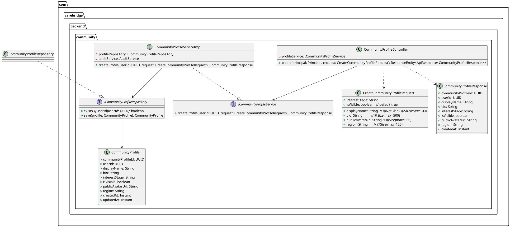
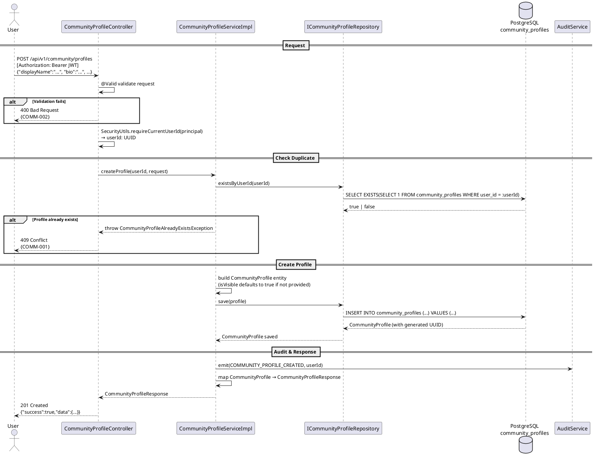

# Technical Design Specification (TDS)
## UC20 — Create Community Profile

| Field | Value |
|---|---|
| **Document ID** | CB-COMMUNITY-IMP-020 |
| **Version** | 1.0 |
| **Date** | 2026-06-26 |
| **Status** | Approved |
| **Document Owner** | PhuongNT |
| **Author** | AI Agent |
| **Based on EDS** | v2.0 |
| **SRS Reference** | SRS 3.1.1.20 |
| **Related UC** | UC20 — Create Community Profile |

---

## CHANGELOG

| Ngày | Người thực hiện | Nội dung thay đổi |
|---|---|---|
| 2026-06-26 | AI Agent | Tạo tài liệu lần đầu cho UC20 Create Community Profile |
| 2026-07-04 | AI Agent | Approved by user — proceeding to implementation |

---

## 1. Tổng Quan (Overview)

### 1.1 Mục Tiêu (Objective)

UC20 cho phép người dùng đã xác thực tạo một hồ sơ cộng đồng (Community Profile) hiển thị công khai trong cộng đồng CareBridge. Profile bao gồm display name, avatar, interest stage (giai đoạn thai kỳ/chăm sóc), và cài đặt hiển thị.

**SRS 3.1.1.20**: "Create Community Profile — Creates a public community display name, avatar, interest stage, and visibility options."

### 1.2 Bounded Context

- **Domain**: `community`
- **Package root**: `com.carebridge.backend.community`

### 1.3 Phạm Vi (Scope)

| Item | Trạng thái |
|---|---|
| Endpoint POST /api/v1/community/profiles | **MỚI** — cần tạo |
| CommunityProfile entity | **MỚI** — cần tạo |
| CommunityProfileController | **MỚI** — cần tạo |
| ICommunityProfileService + impl | **MỚI** — cần tạo |
| ICommunityProfileRepository | **MỚI** — cần tạo |
| CreateCommunityProfileRequest DTO | **MỚI** — cần tạo |
| CommunityProfileResponse DTO | **MỚI** — cần tạo |
| DB Table `community_profiles` | **ĐÃ TỒN TẠI** (V1 migration) |

### 1.4 Actors

| Actor | Platform | Vai trò |
|---|---|---|
| User (authenticated) | App / Web | Tạo profile cộng đồng của chính mình |

---

## 2. Traceability

| Business Rule ID | Nội dung | Ràng buộc triển khai |
|---|---|---|
| BR-COMM-001 | One profile per user — unique constraint | Check `existsByUserId(userId)` trước khi insert; nếu exists → 409 COMM-001 |
| BR-COMM-002 | display_name max 100 chars | `@NotBlank @Size(max=100)` trên `displayName` field |
| BR-COMM-003 | interest_stage must be valid enum | Validate giá trị thuộc allowed values nếu provided |
| BR-COMM-004 | Emit COMMUNITY_PROFILE_CREATED audit | `AuditService.emit(COMMUNITY_PROFILE_CREATED, userId)` |

---

## 3. Architectural Decision Records (ADRs)

### ADR-COMM-020-001: Bảng `community_profiles` tách biệt khỏi bảng `users`

**Ngữ cảnh**: Có thể store community profile info trực tiếp trong bảng `users`.

**Quyết định**: Dùng bảng riêng `community_profiles` có FK đến `users`.

**Lý do**: Privacy by design — không phải tất cả user data đều nên hiển thị công khai. Bảng `users` chứa email, phone, medical info — đây là thông tin nhạy cảm. Tách bảng giúp rõ ràng về boundary giữa private identity và public community identity.

**Hệ quả**: JOIN query khi cần display community profile kèm user info; overhead nhỏ nhưng đổi lại có privacy boundary rõ ràng.

---

### ADR-COMM-020-002: `is_visible` default là `true` — Opt-out model

**Ngữ cảnh**: Có thể default là `false` và yêu cầu user chủ động bật.

**Quyết định**: Default `is_visible = true` khi tạo profile.

**Lý do**: Mục tiêu của tính năng là kết nối cộng đồng. Default visible = true khuyến khích tham gia. User có thể ẩn sau khi tạo (UC21). Opt-out model phổ biến hơn opt-in cho social features.

**Hệ quả**: User mới tạo profile sẽ visible ngay. Cần đảm bảo user biết điều này qua UI.

---

## 4. Non-Functional Requirements (NFR)

| NFR | Giá trị | Ghi chú |
|---|---|---|
| Latency P95 | < 300ms | Write operation — bao gồm constraint check + insert |
| Operation type | Write + Audit | Transaction required |
| PII classification | `bio` có thể chứa PII | Không log bio trong application logs |
| Public data | `publicAvatarUrl`, `displayName` | Sẽ visible publicly nếu is_visible=true |
| Idempotency | Không idempotent | Duplicate request → 409 (not 201) |

---

## 5. Static Modeling

### 5.1 Class Diagram



### 5.2 Database Table — `community_profiles`

```sql
-- Đã tồn tại trong V1 migration, KHÔNG tạo mới
CREATE TABLE public.community_profiles (
    community_profile_id uuid NOT NULL DEFAULT gen_random_uuid(),
    bio                  varchar(500),
    created_at           timestamptz NOT NULL,
    display_name         varchar(100),
    interest_stage       varchar(30),  -- PRE_PREGNANCY, PREGNANCY, POSTPARTUM, BABY_CARE
    is_visible           boolean,
    public_avatar_url    varchar(500),
    region               varchar(120),
    updated_at           timestamptz,
    user_id              uuid          -- FK to users
);
```

---

## 6. Dynamic Modeling

### 6.1 Sequence Diagram — POST /api/v1/community/profiles



---

## 7. Domain Events

| Event | Published | Trigger |
|---|---|---|
| `COMMUNITY_PROFILE_CREATED` | Audit log via `AuditService` | Khi profile được tạo thành công |

```java
// Audit emission example:
auditService.emit(AuditEventType.COMMUNITY_PROFILE_CREATED, userId,
    Map.of("communityProfileId", savedProfile.getCommunityProfileId().toString()));
```

---

## 8. Interface Definitions

### 8.1 Request DTO

```java
package com.carebridge.backend.community.dto;

import jakarta.validation.constraints.NotBlank;
import jakarta.validation.constraints.Size;

public class CreateCommunityProfileRequest {

    @NotBlank(message = "Display name is required")
    @Size(max = 100, message = "Display name must not exceed 100 characters")
    private String displayName;

    @Size(max = 500, message = "Bio must not exceed 500 characters")
    private String bio;

    /** nullable — PRE_PREGNANCY, PREGNANCY, POSTPARTUM, BABY_CARE, etc. */
    private String interestStage;

    /** Default: true (opt-out model) */
    private boolean isVisible = true;

    @Size(max = 500)
    private String publicAvatarUrl;

    @Size(max = 120)
    private String region;

    // Getters + setters
}
```

### 8.2 Response DTO

```java
package com.carebridge.backend.community.dto;

import java.time.Instant;
import java.util.UUID;

public class CommunityProfileResponse {
    private UUID communityProfileId;
    private UUID userId;
    private String displayName;
    private String bio;
    private String interestStage;
    private boolean isVisible;
    private String publicAvatarUrl;
    private String region;
    private Instant createdAt;
    // Getters + setters
}
```

### 8.3 Service Interface

```java
package com.carebridge.backend.community.service;

import java.util.UUID;

public interface ICommunityProfileService {

    /**
     * Tạo community profile mới cho user.
     * Ném CommunityProfileAlreadyExistsException nếu profile đã tồn tại (409).
     *
     * @param userId  UUID từ JWT Principal — không từ request body
     * @param request Dữ liệu profile từ client
     * @return CommunityProfileResponse profile đã được tạo
     */
    CommunityProfileResponse createProfile(UUID userId, CreateCommunityProfileRequest request);
}
```

### 8.4 Repository Interface

```java
package com.carebridge.backend.community.repository;

import com.carebridge.backend.community.entity.CommunityProfile;
import org.springframework.data.jpa.repository.JpaRepository;
import java.util.UUID;

public interface ICommunityProfileRepository extends JpaRepository<CommunityProfile, UUID> {

    boolean existsByUserId(UUID userId);

    java.util.Optional<CommunityProfile> findByUserId(UUID userId);
}
```

---

## 9. API Specification

### 9.1 Endpoint

| Property | Value |
|---|---|
| **Method** | `POST` |
| **Path** | `/api/v1/community/profiles` |
| **Auth** | Bearer JWT (required) |
| **Content-Type** | `application/json` |
| **Response** | `201 Created` với `ApiResponse<CommunityProfileResponse>` |

### 9.2 Request Body

```json
{
  "displayName": "MẹBầuHạnhPhúc",
  "bio": "Mẹ bầu 26 tuần, yêu thích chia sẻ kinh nghiệm thai kỳ.",
  "interestStage": "PREGNANCY",
  "isVisible": true,
  "publicAvatarUrl": "https://storage.carebridge.vn/avatars/user-20.jpg",
  "region": "Hà Nội, Việt Nam"
}
```

### 9.3 Response — 201 Created

```json
{
  "success": true,
  "message": "Community profile created successfully",
  "data": {
    "communityProfileId": "a1b2c3d4-e5f6-7890-abcd-ef1234567890",
    "userId": "00000000-0000-0000-0000-000000000020",
    "displayName": "MẹBầuHạnhPhúc",
    "bio": "Mẹ bầu 26 tuần, yêu thích chia sẻ kinh nghiệm thai kỳ.",
    "interestStage": "PREGNANCY",
    "isVisible": true,
    "publicAvatarUrl": "https://storage.carebridge.vn/avatars/user-20.jpg",
    "region": "Hà Nội, Việt Nam",
    "createdAt": "2026-06-26T10:00:00Z"
  }
}
```

---

## 10. Error Codes

| Error Code | HTTP Status | Điều kiện | Response |
|---|---|---|---|
| `COMM-001` | 409 Conflict | Profile đã tồn tại cho userId này | `{"success":false,"code":"COMM-001","message":"Community profile already exists for this user"}` |
| `COMM-002` | 400 Bad Request | `displayName` trống hoặc > 100 chars | `{"success":false,"code":"COMM-002","message":"Display name is required and must not exceed 100 characters"}` |
| `IAM-001` | 401 Unauthorized | Không có JWT hoặc JWT không hợp lệ | `{"success":false,"code":"IAM-001","message":"Authentication required"}` |

---

## 11. Implementation Plan

### 11.1 Files Cần Tạo

```
com.carebridge.backend.community/
├── entity/
│   └── CommunityProfile.java          (JPA entity mapping community_profiles)
├── dto/
│   ├── CreateCommunityProfileRequest.java
│   └── CommunityProfileResponse.java
├── repository/
│   └── ICommunityProfileRepository.java
├── service/
│   ├── ICommunityProfileService.java
│   └── impl/
│       └── CommunityProfileServiceImpl.java
├── controller/
│   └── CommunityProfileController.java
└── exception/
    └── CommunityProfileAlreadyExistsException.java
```

### 11.2 Entity Implementation

```java
@Entity
@Table(name = "community_profiles")
public class CommunityProfile {

    @Id
    @GeneratedValue(strategy = GenerationType.UUID)
    @Column(name = "community_profile_id")
    private UUID communityProfileId;

    @Column(name = "user_id", nullable = false, unique = true)
    private UUID userId;

    @Column(name = "display_name", length = 100)
    private String displayName;

    @Column(name = "bio", length = 500)
    private String bio;

    @Column(name = "interest_stage", length = 30)
    private String interestStage;

    @Column(name = "is_visible")
    private boolean isVisible = true;

    @Column(name = "public_avatar_url", length = 500)
    private String publicAvatarUrl;

    @Column(name = "region", length = 120)
    private String region;

    @Column(name = "created_at", nullable = false, updatable = false)
    private Instant createdAt;

    @Column(name = "updated_at")
    private Instant updatedAt;

    @PrePersist
    void prePersist() {
        this.createdAt = Instant.now();
        this.updatedAt = Instant.now();
    }
}
```

### 11.3 Service Implementation

```java
@Service
@Transactional
public class CommunityProfileServiceImpl implements ICommunityProfileService {

    private final ICommunityProfileRepository profileRepository;
    private final AuditService auditService;

    @Override
    public CommunityProfileResponse createProfile(UUID userId,
                                                   CreateCommunityProfileRequest request) {
        if (profileRepository.existsByUserId(userId)) {
            throw new CommunityProfileAlreadyExistsException(
                "Community profile already exists for user: " + userId);
        }

        CommunityProfile profile = new CommunityProfile();
        profile.setUserId(userId);
        profile.setDisplayName(request.getDisplayName());
        profile.setBio(request.getBio());
        profile.setInterestStage(request.getInterestStage());
        profile.setVisible(request.isVisible());  // default true
        profile.setPublicAvatarUrl(request.getPublicAvatarUrl());
        profile.setRegion(request.getRegion());

        CommunityProfile saved = profileRepository.save(profile);
        auditService.emit(AuditEventType.COMMUNITY_PROFILE_CREATED, userId);

        return toResponse(saved);
    }
}
```

### 11.4 Controller Implementation

```java
@RestController
@RequestMapping("/api/v1/community/profiles")
public class CommunityProfileController {

    private final ICommunityProfileService profileService;

    @PostMapping
    public ResponseEntity<ApiResponse<CommunityProfileResponse>> create(
            Principal principal,
            @Valid @RequestBody CreateCommunityProfileRequest request) {

        UUID userId = SecurityUtils.requireCurrentUserId(principal);
        CommunityProfileResponse response = profileService.createProfile(userId, request);
        return ResponseEntity.status(HttpStatus.CREATED)
            .body(ApiResponse.success(response));
    }
}
```

---

## 12. Rollback Plan

| Scenario | Action |
|---|---|
| Bug sau khi deploy | `git revert <commit-hash>` và redeploy |
| Data inconsistency | DELETE FROM community_profiles WHERE user_id = '<affected-uuid>' |
| DB migration | Không có migration mới — table đã tồn tại |

---

## 13. Test Scenarios Summary

| TC ID | Loại | Mô tả | Kết quả mong đợi |
|---|---|---|---|
| COMM-TC-020-001 | Unit | Create valid profile | 201 với profile data |
| COMM-TC-020-002 | Unit | Duplicate profile cùng userId | 409 COMM-001 |
| COMM-TC-020-003 | Unit | displayName trống | 400 COMM-002 |
| COMM-TC-020-004 | Unit | Không có JWT | 401 IAM-001 |
| COMM-TC-020-INT-001 | Integration | DB có row mới với userId đúng | DB count tăng 1 |

---

## 14. Verification

### 14.1 SQL Verification

```sql
-- Xác minh profile được tạo
SELECT * FROM community_profiles WHERE user_id = '<test-user-uuid>';

-- Xác minh unique constraint (chỉ 1 row per user)
SELECT COUNT(*) FROM community_profiles WHERE user_id = '<test-user-uuid>';
-- Expected: 1

-- Xác minh is_visible default
SELECT is_visible FROM community_profiles WHERE user_id = '<test-user-uuid>';
-- Expected: true
```

### 14.2 Acceptance Criteria

- [ ] POST `/api/v1/community/profiles` với valid data → 201 với profile
- [ ] `userId` trong DB là từ JWT (không từ request body)
- [ ] `is_visible = true` khi không gửi field này
- [ ] Duplicate request (cùng userId) → 409 COMM-001
- [ ] Empty `displayName` → 400 COMM-002
- [ ] No JWT → 401

---

## 15. API Samples

### 15.1 cURL — Happy Path

```bash
curl -X POST "https://api.carebridge.vn/api/v1/community/profiles" \
  -H "Authorization: Bearer <JWT_TOKEN>" \
  -H "Content-Type: application/json" \
  -d '{
    "displayName": "MẹBầuHạnhPhúc",
    "bio": "Mẹ bầu 26 tuần",
    "interestStage": "PREGNANCY",
    "isVisible": true
  }'
```

### 15.2 cURL — Duplicate → 409

```bash
# Gọi lần thứ 2 với cùng JWT
curl -X POST "https://api.carebridge.vn/api/v1/community/profiles" \
  -H "Authorization: Bearer <SAME_JWT_TOKEN>" \
  -H "Content-Type: application/json" \
  -d '{"displayName": "AnotherName"}'
# Response: 409 {"code":"COMM-001",...}
```

---

## 16. Authorization Matrix

| Role | Access | Ghi chú |
|---|---|---|
| MOTHER | ✅ Allowed | Can create own profile |
| EXPERT | ✅ Allowed | Can create own profile |
| ADMIN | ✅ Allowed | Can create own profile |
| GUEST (no JWT) | ❌ Denied | 401 IAM-001 |
| Tạo profile cho user khác | ❌ Denied | userId luôn từ JWT |

---

## 17. CASE 2.0 Critical Constraints

| Constraint ID | Mô tả | Cách kiểm tra |
|---|---|---|
| C1 | Check không có profile tồn tại trước khi tạo — `existsByUserId(userId)` | Unit test COMM-TC-020-002 |
| C2 | `userId` phải lấy từ JWT, không từ request body | Inspect controller — không có `userId` trong DTO |
| C3 | Emit audit event `COMMUNITY_PROFILE_CREATED` sau khi tạo | Verify `auditService.emit()` call trong unit test |
| C4 | `is_visible` default là `true` khi không được cung cấp | Unit test COMM-TC-020-001, assert isVisible=true |

---

*End of UC20 TDS — CB-COMMUNITY-IMP-020 v1.0*
