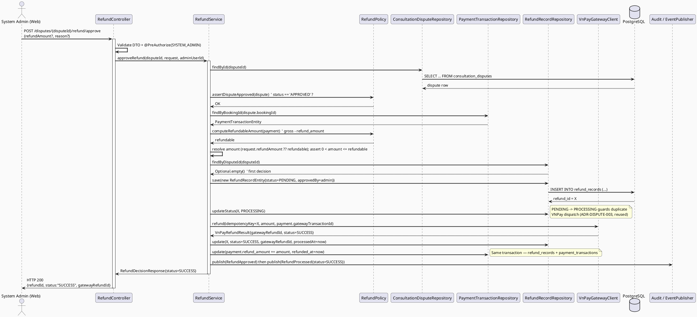
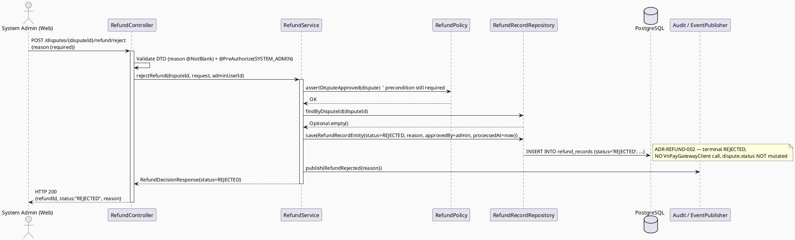
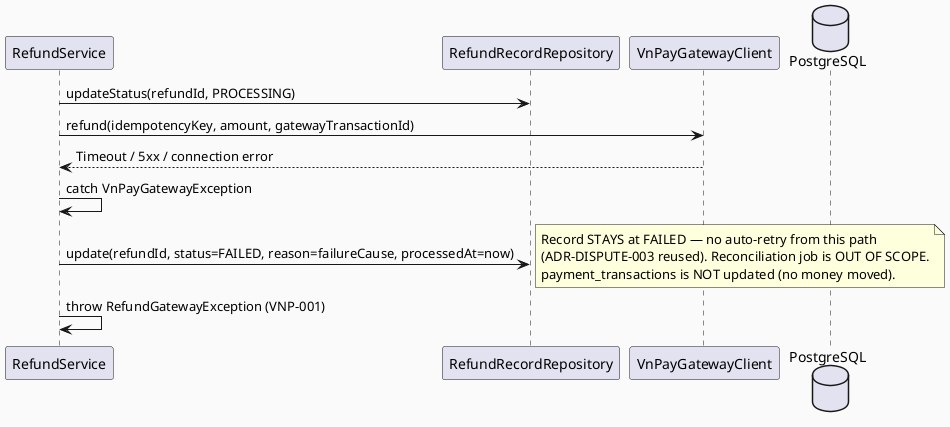
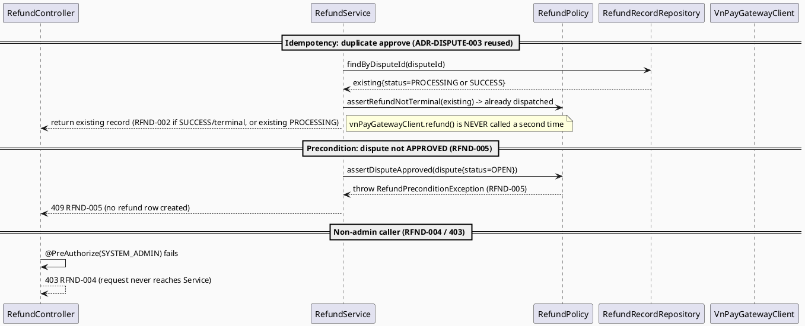
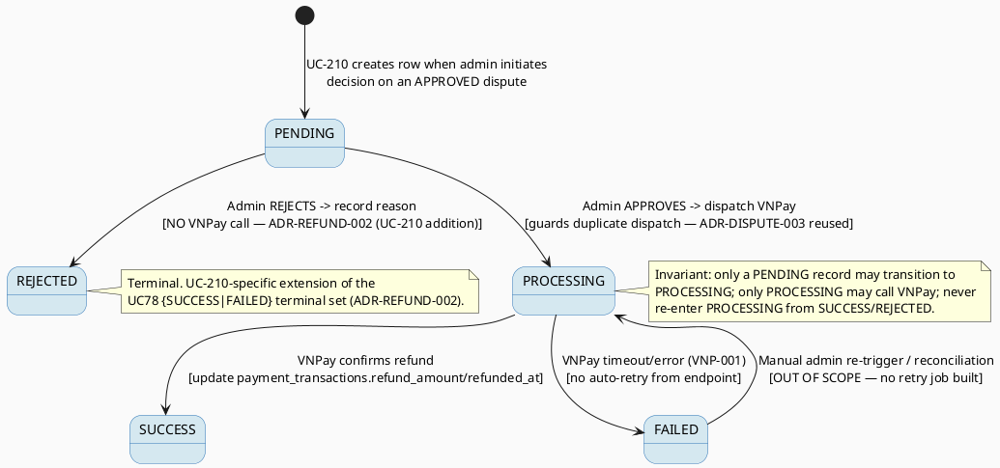

# ENGINEERING DOCUMENTATION STANDARD (EDS) v2.0
# UC210 — Approve or Reject Refund — Technical Design Specification

| Field | Value |
|-------|-------|
| **Document ID** | `CB-CONSULTATION-IMP-210` |
| **Version** | `1.0` |
| **Date** | `2026-07-03` |
| **Status** | `Draft` |
| **Document Owner** | `TV4-Lâm` |
| **Author** | `AI Agent (Technical Architect + Test Designer)` |
| **Reviewed by** | `[Tech Lead — Pending]` |
| **DPO Sign-off** | `[ ] Pending` *(financial + PII-adjacent scope — refund amount, dispute context — see §1)* |
| **Approved by** | `[Principal Architect — Pending]` |
| **Last Review** | `2026-07-03` |
| **Based on EDS** | `v2.0` |

---

## CHANGELOG

> **Policy 4.4 — Immutable History:** Không bao giờ xóa thông tin cũ.

| Ngày | Người thực hiện | Nội dung thay đổi |
|------|-----------------|-------------------|
| 2026-07-03 | AI Agent — Technical Architect | Tạo tài liệu lần đầu (Draft) cho UC-210 Approve or Reject Refund |

---

## MỤC LỤC

1. [Tổng quan Module](#1-tổng-quan-module)
2. [Ma trận Truy vết (Traceability Matrix)](#2-ma-trận-truy-vết-traceability-matrix)
3. [Architecture Decision Records (ADR)](#3-architecture-decision-records-adr)
4. [Non-Functional Requirements & SLA](#4-non-functional-requirements--sla)
5. [Static Modeling (Mô hình Tĩnh)](#5-static-modeling-mô-hình-tĩnh)
6. [Dynamic Modeling (Mô hình Động)](#6-dynamic-modeling-mô-hình-động)
7. [Domain Event Catalog](#7-domain-event-catalog)
8. [Interface Specification (Đặc tả Giao diện)](#8-interface-specification-đặc-tả-giao-diện)
9. [API Specification](#9-api-specification)
10. [Bảng mã lỗi (Error Codes)](#10-bảng-mã-lỗi-error-codes)
11. [Quy trình Triển khai (Step-by-Step)](#11-quy-trình-triển-khai-step-by-step)
12. [Rollback & Incident Runbook](#12-rollback--incident-runbook)
13. [Kịch bản Kiểm thử Chi tiết](#13-kịch-bản-kiểm-thử-chi-tiết)
14. [Phương pháp Xác minh](#14-phương-pháp-xác-minh)
15. [Mẫu thử thực tế (API Verification Samples)](#15-mẫu-thử-thực-tế-api-verification-samples)
16. [Bảng tổng hợp phân quyền (Authorization Matrix)](#16-bảng-tổng-hợp-phân-quyền-authorization-matrix)
17. [AI Prompt Constraints (CASE 2.0)](#17-ai-prompt-constraints-case-20)

---

## 1. Tổng quan Module

> UC-210 là **admin-side, financial** use case: một System Admin phê duyệt hoặc từ chối
> yêu cầu hoàn tiền phát sinh từ một khiếu nại (dispute) đã được **UC-209 Resolve
> Consultation Dispute** quyết định là `APPROVED`. Khi phê duyệt, UC-210 tạo và điều
> phối lời gọi hoàn tiền thực tế qua VNPay; khi từ chối, UC-210 ghi nhận lý do từ chối
> vào audit trail mà không gọi VNPay.

| Field | Value |
|-------|-------|
| **Module Name** | `Consultation — Refund Approval` |
| **Bounded Context** | `Consultation` (package `com.carebridge.backend.consultation`) |
| **Function ID / UC** | `3.3.14.9 Approve or Reject Refund` / `UC-210` |
| **Primary Actor** | System Admin (Admin Portal) |
| **Secondary Actor** | VNPay Payment Gateway (refund-processing counterparty) |
| **Platform** | Web — Admin Portal (React + TypeScript + Vite) |
| **Priority** | Medium (SRS §3.3.14.9) |
| **Frequency of Use** | Occasional (SRS §3.3.14.9) |
| **Sprint / Owner** | Consultation batch UC203→UC210 — TV4-Lâm |
| **Data Classification** | `Confidential` (refund amount, gateway transaction id, commission/settlement impact, admin actor identity; indirectly linked to health-consultation dispute context) |
| **Compliance Scope** | `PDPA (Luật 91/2025)`, internal `BR-RBAC`, `BR-CONSULTATION` |
| **Upstream Dependencies** | **UC-209 Resolve Consultation Dispute** (sets `consultation_disputes.status = 'APPROVED'` — the refund-eligibility oracle; separate sibling spec), Payment capture (`payment_transactions` populated with paid state — UC-76 / `3.1.2.1`, out of scope) |
| **Downstream Consumers** | Commission recalculation (`commission_records.refund_amount` / `settlement_status`), Settlement recalculation (`settlement_records.refund_amount`), Notification service (out-of-scope consumers of `RefundProcessed`/`RefundRejected` events) |

### 1.1 Scope Statement — Greenfield code against an existing schema contract

This module is **greenfield at the code level**. The backend package
`com.carebridge.backend.consultation` contains only placeholders; the
PostgreSQL schema already models the full refund domain in
`V1__init_schema.sql` (`refund_records`, `payment_transactions`,
`commission_records`, `settlement_records`, `consultation_disputes`). This TDS
designs UC-210 **as if** the dispute-resolution (UC-209) and payment-capture
prerequisites already exist and expose the schema states this TDS reads (see
§1.2 blocker).

### 1.2 Entry-Criteria Blocker (Open — MUST be resolved before implementation)

> ⚠️ **UC-210 CANNOT be implemented standalone.** It requires:
> - **UC-209 Resolve Consultation Dispute** implemented and able to set
>   `consultation_disputes.status = 'APPROVED'` (optionally with a
>   "recommend-refund" flag). UC-209 is the **sole authority** on the dispute
>   outcome; UC-210 only reads it as a precondition (see §3 ADR-REFUND-001 and
>   the explicit boundary statement in §1.3).
> - Payment capture service that has populated `payment_transactions` with a
>   `SUCCESS`/paid state and a real `gateway_transaction_id` (needed for the
>   VNPay refund call).
>
> **Marked `Open` — Product/Tech Lead must confirm UC-209 and payment-capture
> services are implemented and stable before UC-210 Sprint work starts.**

### 1.3 Explicit Scope Boundary — UC-209 vs UC-210

> This boundary is a **confirmed cross-cutting decision** for the UC203→UC210
> batch and is restated here verbatim to prevent scope overlap.

| Concern | Owner | Notes |
|---------|-------|-------|
| Deciding the **dispute outcome** (`consultation_disputes.status → APPROVED / REJECTED`, resolution note, "recommend-refund" flag) | **UC-209** (separate sibling spec) | UC-210 **never** mutates `consultation_disputes.status`; it treats `status='APPROVED'` as a read-only precondition oracle. |
| Creating the `refund_records` row (`status='PENDING'`) once a dispute is `APPROVED` with a refund recommendation | **UC-210** (this spec) | UC-209 does **not** write `refund_records`. |
| The admin's **final approve/reject decision on the refund itself** (may differ from the dispute outcome — e.g. dispute `APPROVED` but the specific refund amount rejected for a separate reason) | **UC-210** (this spec) | Confirmed by CB-202 mockup showing a separate refund-reject-with-reason action. |
| `PENDING → PROCESSING` transition + `VnPayGatewayClient.refund(...)` call | **UC-210** (this spec) | Reuses UC78 `VnPayGatewayClient` interface + idempotency guard (ADR-DISPUTE-003). |
| Handling the VNPay response → `SUCCESS` / `FAILED` terminal state | **UC-210** (this spec) | Reuses UC78 refund state machine. |

---

## 2. Ma trận Truy vết (Traceability Matrix)

> Ánh xạ: [Mã yêu cầu] → [Thành phần Code] → [Mục tiêu Tuân thủ].

| Requirement ID | Loại (BR/ADR/US) | Mô tả yêu cầu | Thành phần Code | Compliance Target | ADR liên quan |
|----------------|------------------|---------------|-----------------|-------------------|---------------|
| UC-210 (SRS §3.3.14.9) | Use Case | "Approves or rejects refund according to dispute outcome and transaction status" | `RefundController.POST /refund/approve`, `.../refund/reject`; `RefundService.approveRefund()/rejectRefund()` | BR-CONSULTATION | ADR-REFUND-001 |
| UC-210 Precondition PRE-3 | Precondition | Actor authenticated + has required role (System Admin) | `RefundPolicy.assertIsSystemAdmin()` | BR-RBAC | ADR-REFUND-001 |
| UC-210 Precondition PRE-4 | Precondition | Required reference data exists (dispute `APPROVED`, payment paid) | `RefundPolicy.assertDisputeApproved()` | BR-CONSULTATION | ADR-REFUND-001 |
| BR-RBAC | Business Rule | Only System Admin may approve/reject refunds | `RefundPolicy.assertIsSystemAdmin()`, Spring Security `@PreAuthorize` | Authorization | ADR-REFUND-001 |
| BR-CONSULTATION | Business Rule | Refund actions keep an auditable lifecycle state | `RefundRecordEntity.status`, `approved_by`, `requested_at`, `processed_at`; `RefundProcessed`/`RefundRejected` events | PDPA / BR-AUDIT | ADR-REFUND-002 |
| SRS UC-210 E3 (external service failure — retry guidance, no duplicate unsafe action) | Exception Flow | VNPay refund timeout/failure must not double-refund | `RefundService.approveRefund()` idempotency guard on `refund_records.status` | BR-CONSULTATION | ADR-DISPUTE-003 *(reused)* |
| Reused: VNPay refund via `VnPayGatewayClient` + PENDING→PROCESSING→{SUCCESS\|FAILED} state machine | Decision (external) | Refund gateway idempotency + manual-approval-before-call | `RefundService`, `VnPayGatewayClient` | BR-CONSULTATION | ADR-DISPUTE-001, ADR-DISPUTE-003 *(both reused from UC78)* |
| Rejected-refund persistence as terminal `REJECTED` row | Decision | Store reject reason + audit without VNPay call | `RefundService.rejectRefund()` | BR-AUDIT | ADR-REFUND-002 |
| Partial vs full refund policy | Open Item | Exact partial-refund policy undefined in SRS | `RefundPolicy.computeRefundableAmount()` | — | ADR-REFUND-003 |
| Schema: `refund_records`, `payment_transactions`, `commission_records`, `settlement_records`, `consultation_disputes` (`V1__init_schema.sql` L876-1015, FKs L1868-1890) | Schema Contract | Refund lifecycle + settlement-impact persistence | `RefundRecordEntity`, `PaymentTransactionEntity` (read/write), read-only `ConsultationDisputeEntity` | — | — |
| UC-209 boundary (§1.3) | Scope Guard | UC-210 must not mutate dispute outcome | `RefundService` (no write to `consultation_disputes.status`) | — | ADR-REFUND-001 |

---

## 3. Architecture Decision Records (ADR)

### ADR-DISPUTE-001 *(REUSED from UC78 — not re-decided here)* — Refunds require manual admin approval before any VNPay call

| Field | Value |
|-------|-------|
| **Status** | `Proposed` *(owned by UC78 `CB-CONSULTATION-IMP-078`; UC-210 is the concrete admin-side realization of this ADR's scope)* |
| **Deciders** | `Per UC78 — pending Product/Tech Lead confirmation` |
| **Date** | `2026-07-02` (origin) |

**Reuse note:** UC78 established that "refunds require manual admin/moderator
approval before any VNPay refund API call is made." UC-210 **is** that approval
step. This TDS does not re-open the decision; it implements the human gate as
the `RefundController` approve/reject endpoints restricted to System Admin.
See UC78 TDS §3 ADR-DISPUTE-001 for the full context/options/consequences.

---

### ADR-DISPUTE-003 *(REUSED from UC78 — not re-decided here)* — VNPay refund idempotency via `refund_records.status` guard

| Field | Value |
|-------|-------|
| **Status** | `Accepted` *(owned by UC78)* |
| **Deciders** | `Per UC78` |
| **Date** | `2026-07-02` (origin) |

**Reuse note:** Before calling VNPay, `RefundService` MUST verify
`refund_records.status = 'PENDING'`, transition to `PROCESSING` in the same
transaction that dispatches the VNPay call, and only a `PENDING → PROCESSING`
transition may trigger a VNPay call. A record already `PROCESSING`/`SUCCESS`
MUST NOT be re-submitted (returns the existing record). On VNPay timeout, the
record moves to `FAILED`; **no auto-retry** occurs from the endpoint — a
reconciliation job (out of scope, follow-up) must reconcile. `FAILED →
PROCESSING` is only reachable via manual admin re-trigger/reconciliation
(explicitly out of scope — no retry job is built here). See UC78 TDS §3
ADR-DISPUTE-003.

---

### ADR-REFUND-001 — The refund approve/reject decision is a distinct authority from the dispute outcome; precondition is `dispute.status = 'APPROVED'`

| Field | Value |
|-------|-------|
| **Status** | `Proposed` *(SRS text does not explicitly separate "dispute outcome" from "refund decision"; separation is derived from the schema shape + UI mockups CB-201/CB-202 — needs Product sign-off)* |
| **Deciders** | `AI Agent (proposal only) — pending TV4-Lâm / Tech Lead confirmation` |
| **Date** | `2026-07-03` |
| **Supersedes** | — |

#### Bối cảnh (Context)
The schema separates two lifecycles: `consultation_disputes.status`
(OPEN → … → APPROVED/REJECTED, owned by UC-209) and `refund_records.status`
(PENDING → PROCESSING → SUCCESS/FAILED, owned by UC-210). `refund_records`
carries its **own** `approved_by` (nullable `uuid` FK → `users`,
`V1__init_schema.sql` L990, FK L1883-1884) distinct from
`consultation_disputes.resolved_by`. The CB-202 mockup shows an admin can
**reject the refund** with a dedicated reason even though the dispute detail is
already under review — i.e. the refund decision is not mechanically identical to
the dispute outcome. SRS §3.3.14.9 Description: *"Approves or rejects refund
according to dispute outcome and transaction status"* — the refund decision is
conditioned on, but not equal to, the dispute outcome.

#### Các phương án đã xem xét (Options Considered)

| Phương án | Mô tả | Ưu điểm | Nhược điểm |
|-----------|-------|----------|------------|
| A | Auto-issue refund the moment UC-209 marks dispute `APPROVED` (no separate admin refund step) | Fewer clicks | Violates ADR-DISPUTE-001 human gate; removes the admin's ability to reject/adjust the refund independently; contradicts CB-201/CB-202 confirmation modals |
| B | **Separate admin refund decision; precondition `dispute.status='APPROVED'`; UC-210 owns `refund_records` creation + approve/reject** | Matches schema (`refund_records.approved_by`), matches UI mockups, preserves financial human gate, keeps UC-209/UC-210 boundary clean | One extra admin action; requires an explicit precondition check |
| C | Merge refund decision into UC-209 | Single screen | Breaks the confirmed batch boundary (§1.3); UC-209 would then own VNPay calls, contradicting its "outcome-only" scope |

#### Quyết định (Decision)
Chọn **Phương án B**. `RefundPolicy.assertDisputeApproved(dispute)` MUST verify
`consultation_disputes.status = 'APPROVED'` before any refund approve/reject is
allowed; otherwise `RFND-005` (409). The oracle for "refund-eligible" is
UC-209's `ConsultationDisputeResolved` event / `consultation_disputes.status`
field. UC-210 **never** writes `consultation_disputes.status`. **Proposal —
requires Product/Tech Lead sign-off** because SRS does not literally state the
two-authority separation.

#### Hệ quả (Consequences)
**Tích cực:** Clean separation of concerns; auditable, independent refund
authorization; no money leaves the platform without a System-Admin action.
**Tiêu cực / Trade-offs:** Extra admin step; a "recommend-refund" flag from
UC-209 is desirable but its exact field is **Open** (UC-209 spec owns it) — for
UC-210 the binding precondition is simply `status='APPROVED'`.
**Compliance Impact:** Supports BR-RBAC + BR-CONSULTATION auditable lifecycle.

---

### ADR-REFUND-002 — A rejected refund is persisted as a `refund_records` row with terminal application-level status `REJECTED`

| Field | Value |
|-------|-------|
| **Status** | `Proposed` *(SRS is silent on where a refund rejection is stored; derived from schema audit columns + CB-202 mockup)* |
| **Deciders** | `AI Agent (proposal only)` |
| **Date** | `2026-07-03` |

#### Bối cảnh (Context)
When an admin **rejects** a refund (CB-202), there is a rejection reason that
"will be shown directly to the user" and the action "does not erase the
dispute." We need a durable, auditable home for: the reject reason, the admin
identity, and the timestamp — without calling VNPay. `refund_records` already
has `reason text` (L993), `approved_by uuid` (L990), `processed_at timestamptz`
(L997), and a free `status varchar(30)` with **no DB CHECK constraint**
(verified — `refund_records` has no CHECK in `V1__init_schema.sql`).

#### Các phương án đã xem xét (Options Considered)

| Phương án | Mô tả | Ưu điểm | Nhược điểm |
|-----------|-------|----------|------------|
| A | Store nothing / only log to `audit_logs` | No new refund row | Not queryable per dispute; weak refund-decision audit trail; loses reject reason linkage to `refund_records` |
| B | Reuse a `FAILED` status for rejections | No new enum value | Conflates gateway failure (VNP-001) with human rejection — corrupts reporting and the state machine semantics |
| C | **Create a `refund_records` row with terminal `status='REJECTED'` (app-level enum), `reason`=reject reason, `approved_by`=admin, `processed_at`=now(); no VNPay call** | Auditable, queryable, distinguishes human-reject from gateway-fail, no schema change | Extends UC78's `{SUCCESS\|FAILED}` terminal set with a UC-210-specific `REJECTED` terminal (documented here) |

#### Quyết định (Decision)
Chọn **Phương án C**. Refund status taxonomy for UC-210 (application-level,
validated in service/DTO layer — **no DB CHECK added**, consistent with the
codebase's existing no-CHECK posture on consultation-domain tables):
`PENDING`, `PROCESSING`, `SUCCESS`, `FAILED` (all reused from UC78) **plus**
`REJECTED` (new terminal, reachable only via `PENDING → REJECTED` on admin
reject). No VNPay call occurs on the reject path. No new Flyway migration is
required.

#### Hệ quả (Consequences)
**Tích cực:** Full audit trail for both approve and reject; reject reason stored
on the record shown to the user; clean separation from gateway failure.
**Tiêu cực / Trade-offs:** UC-210 extends the UC78 refund state machine with one
terminal state — must be kept consistent if UC78 is later implemented (flagged
in §6.5 state machine).
**Compliance Impact:** Strengthens BR-CONSULTATION auditable lifecycle.

---

### ADR-REFUND-003 — Refund amount: full-refund mechanism designed; partial-refund policy left `Open`

| Field | Value |
|-------|-------|
| **Status** | `Proposed` *(partial-refund percentages/thresholds are NOT in SRS — must not be invented)* |
| **Deciders** | `AI Agent (proposal only)` |
| **Date** | `2026-07-03` |

#### Bối cảnh (Context)
`payment_transactions.refund_amount` (`numeric DEFAULT 0`, L931) and
`commission_records.refund_amount` / `settlement_records.refund_amount` are
**cumulative** columns, structurally allowing multiple/partial refunds per
payment. However, SRS §3.3.14.9 does not define any partial-refund policy,
percentages, or cancellation-window rules. CB-201 shows a single "Số tiền hoàn
trả" (refund amount) sourced from the **locked payment**, plus a settlement
impact note ("commission 150,000 ₫ deducted from the partner's next settlement
period"). The `dispute_id` FK on `refund_records` is nullable, meaning a
sibling non-dispute refund path (e.g. UC-205 cancellation-policy refund) also
exists — but UC-210 handles only the **dispute-originated** path where
`dispute_id` IS set.

#### Các phương án đã xem xét (Options Considered)

| Phương án | Mô tả | Ưu điểm | Nhược điểm |
|-----------|-------|----------|------------|
| A | Invent a partial-refund percentage policy | "Complete" | Fabricates an unapproved business rule — forbidden |
| B | **Support full refund correctly now; accept an optional explicit `refundAmount` in the approve request bounded by `refundable = payment.gross_amount - payment.refund_amount`; leave the exact partial-vs-full *policy* `Open`** | No invented policy; mechanism handles full refund and is partial-ready; bounded by an oracle (schema columns) | Admins can technically enter a partial amount before policy is ratified — mitigated by the `refundable` upper bound + audit |
| C | Hard-block any amount ≠ full | Simple | Contradicts the cumulative-column schema design; would need rework once partial policy lands |

#### Quyết định (Decision)
Chọn **Phương án B**. `RefundPolicy.computeRefundableAmount(payment)` returns
`payment.gross_amount − payment.refund_amount` (already-refunded subtracted).
The approve request's `refundAmount` is **optional**; when omitted it defaults
to the full `refundable` amount. Any supplied amount MUST satisfy
`0 < refundAmount ≤ refundable`, else `RFND-006` (422). **The exact
partial-refund *policy* (when partial is allowed, at what percentage) is
`Open`** and must be defined by Product before partial refunds are used in
production; the *mechanism* here supports full refund correctly and is
partial-capable.

#### Hệ quả (Consequences)
**Tích cực:** No invented policy; correct full-refund behavior; cumulative
tracking honored.
**Tiêu cực / Trade-offs:** Partial refunds are mechanically possible before
policy ratification — bounded and audited, flagged `Open`.
**Compliance Impact:** None material beyond audit.

---

## 4. Non-Functional Requirements & SLA

> No SRS/BR source specifies numeric SLA targets for UC-210. Values below are
> **Open — proposed defaults**, consistent with the TDS template baseline;
> must be confirmed by Tech Lead before being treated as binding.

### 4.1. Performance & Availability

| Category | Requirement | Target SLA | Measurement Method | Compliance Basis |
|----------|-------------|------------|---------------------|------------------|
| Latency | `POST /refund/reject` p99 (no gateway call) | `< 500ms` *(Open — proposed)* | API test timing | — |
| Latency | `POST /refund/approve` p99 (includes synchronous VNPay refund call) | `< 3000ms` *(Open — proposed, gateway-bound)* | API test timing | — |
| Availability | Dependent on UC-209 + payment services (§1.2 blocker) and VNPay uptime | N/A until dependencies implemented | — | — |

### 4.2. Data Integrity & Retention

| Category | Requirement | Target | Verification Method | Compliance Basis |
|----------|-------------|--------|---------------------|------------------|
| Durability | No refund record loss | RPO = 0 (PostgreSQL transaction) | Transaction log | BR-CONSULTATION |
| Consistency | At most one non-`REJECTED`/`FAILED` refund per dispute reaches a paying state | 100% (service-level guard + `dispute_id` linkage) | Reconciliation query (§14.1) | BR-CONSULTATION |
| Consistency | On `SUCCESS`, `payment_transactions.refund_amount`/`refunded_at` updated atomically with `refund_records` | 100% (same transaction) | DB inspection | BR-CONSULTATION |
| Retention | Refund decision audit trail (approve + reject) | Indefinite (append/status-only; no DELETE path exposed) | DB inspection | PDPA |

### 4.3. Security

| Category | Requirement | Target | Verification Method | Compliance Basis |
|----------|-------------|--------|---------------------|------------------|
| Access control | Role-based | System Admin only (least privilege) | Auth Matrix (§16) | BR-RBAC |
| Transport | All endpoints over TLS | TLS 1.2+ (platform default) | Existing infra config | — |
| Secrets | VNPay merchant secret / API key | Never logged; stored in `.env`/secret manager per existing CareBridge pattern | Log grep for secret patterns | — |
| Audit | Every approve/reject records `approved_by`, `requested_at`, `processed_at` | 100% | DB inspection | BR-CONSULTATION |

### 4.4. Scalability & Capacity Planning

SRS marks UC-210 "Frequency of Use: Occasional." No special scaling design
needed beyond standard Spring Boot request handling. The synchronous VNPay call
on approve should use a bounded connect/read timeout to avoid thread exhaustion
(timeout value **Open — proposed 10s**, confirm with Tech Lead / VNPay SDK).

---

## 5. Static Modeling (Mô hình Tĩnh)

### 5.1. Component Responsibilities & Planned File Paths

| Layer | File Path | Responsibility |
|-------|-----------|----------------|
| Controller | `src/main/java/com/carebridge/backend/consultation/controller/RefundController.java` | HTTP mapping, DTO validation, `@PreAuthorize` admin gate only |
| Service | `src/main/java/com/carebridge/backend/consultation/service/RefundService.java` | Approve/reject workflow, refund state machine, VNPay orchestration, event emission |
| Repository | `src/main/java/com/carebridge/backend/consultation/repository/RefundRecordRepository.java` | Persistence for `refund_records` |
| Repository | `src/main/java/com/carebridge/backend/consultation/repository/PaymentTransactionRepository.java` | Read + `refund_amount`/`refunded_at` update on `payment_transactions` (shared with payment module — interface here) |
| Repository | `src/main/java/com/carebridge/backend/consultation/repository/ConsultationDisputeRepository.java` | **Read-only** lookups for the `APPROVED` precondition (shared with UC-209 — never written by UC-210) |
| Entity | `src/main/java/com/carebridge/backend/consultation/entity/RefundRecordEntity.java` | JPA mapping for `refund_records` |
| Entity | `src/main/java/com/carebridge/backend/consultation/entity/PaymentTransactionEntity.java` | JPA mapping for `payment_transactions` |
| Gateway | `src/main/java/com/carebridge/backend/consultation/service/gateway/VnPayGatewayClient.java` | **REUSED interface from UC78** — VNPay refund abstraction (stub pending real SDK wiring) |
| DTO | `src/main/java/com/carebridge/backend/consultation/dto/request/ApproveRefundRequest.java` | Inbound approve payload |
| DTO | `src/main/java/com/carebridge/backend/consultation/dto/request/RejectRefundRequest.java` | Inbound reject payload |
| DTO | `src/main/java/com/carebridge/backend/consultation/dto/response/RefundDecisionResponse.java` | Outbound approve/reject result |
| DTO | `src/main/java/com/carebridge/backend/consultation/dto/response/RefundPreviewResponse.java` | Outbound preview (refundable amount + settlement impact) |
| Mapper | `src/main/java/com/carebridge/backend/consultation/mapper/RefundMapper.java` | Entity ↔ DTO, never expose entity |
| Policy | `src/main/java/com/carebridge/backend/consultation/policy/RefundPolicy.java` | Admin RBAC (ADR-REFUND-001), dispute-approved precondition, refundable-amount computation (ADR-REFUND-003), terminal-state guard |
| Web page | `05_Development/CareBridgeWebApp/src/features/consultation/refund/ApproveRefundModal.tsx` | CB-201 confirmation modal |
| Web page | `05_Development/CareBridgeWebApp/src/features/consultation/refund/RejectRefundModal.tsx` | CB-202 confirmation modal |

### 5.2. Class Diagram (PlantUML)

```plantuml
@startuml UC210_Refund_ClassDiagram
skinparam classAttributeIconSize 0
skinparam classFontStyle bold
skinparam backgroundColor #FAFAFA
skinparam ArrowColor #555555
skinparam ClassBorderColor #2E75B6
skinparam ClassHeaderBackgroundColor #D5E8F0

' === ENTITIES (mirror V1__init_schema.sql) ===
class RefundRecordEntity {
  + refundId: UUID
  + paymentId: UUID
  + disputeId: UUID
  + approvedBy: UUID
  + refundAmount: BigDecimal
  + currency: String
  + reason: String
  + gatewayRefundId: String
  + status: String
  + requestedAt: Instant
  + processedAt: Instant
  + createdAt: Instant
  + updatedAt: Instant
}

class PaymentTransactionEntity {
  + paymentId: UUID
  + bookingId: UUID
  + payerUserId: UUID
  + gatewayName: String
  + gatewayTransactionId: String
  + grossAmount: BigDecimal
  + gatewayFee: BigDecimal
  + refundAmount: BigDecimal
  + netPaidAmount: BigDecimal
  + currency: String
  + status: String
  + paidAt: Instant
  + refundedAt: Instant
}

class ConsultationDisputeEntity <<read-only for UC210>> {
  + disputeId: UUID
  + bookingId: UUID
  + status: String
  + resolutionType: String
}

' === VALUE OBJECTS ===
enum RefundStatus <<ValueObject>> {
  PENDING
  PROCESSING
  SUCCESS
  FAILED
  REJECTED
}

enum RefundDecision <<ValueObject>> {
  APPROVE
  REJECT
}

' === GATEWAY (REUSED from UC78) ===
interface VnPayGatewayClient <<interface>> <<reused-UC78>> {
  + refund(idempotencyKey: UUID, amount: BigDecimal, gatewayTransactionId: String): VnPayRefundResult
}

class VnPayRefundResult <<ValueObject>> {
  + gatewayRefundId: String
  + status: String
}

' === SERVICE ===
interface IRefundService <<interface>> {
  + getRefundPreview(disputeId: UUID, adminUserId: UUID): RefundPreviewResponse
  + approveRefund(disputeId: UUID, request: ApproveRefundRequest, adminUserId: UUID): RefundDecisionResponse
  + rejectRefund(disputeId: UUID, request: RejectRefundRequest, adminUserId: UUID): RefundDecisionResponse
}

class RefundService implements IRefundService {
  - refundRepository: RefundRecordRepository
  - paymentRepository: PaymentTransactionRepository
  - disputeRepository: ConsultationDisputeRepository
  - refundPolicy: RefundPolicy
  - vnPayGatewayClient: VnPayGatewayClient
  - eventPublisher: ApplicationEventPublisher
  + getRefundPreview(...): RefundPreviewResponse
  + approveRefund(...): RefundDecisionResponse
  + rejectRefund(...): RefundDecisionResponse
}

' === POLICY ===
class RefundPolicy {
  + assertIsSystemAdmin(role: String): void
  + assertDisputeApproved(dispute: ConsultationDisputeEntity): void
  + assertRefundNotTerminal(refund: RefundRecordEntity): void
  + computeRefundableAmount(payment: PaymentTransactionEntity): BigDecimal
}

' === REPOSITORIES ===
interface RefundRecordRepository <<interface>> {
  + findById(id: UUID): Optional<RefundRecordEntity>
  + findByDisputeId(disputeId: UUID): Optional<RefundRecordEntity>
  + save(entity: RefundRecordEntity): RefundRecordEntity
}

interface PaymentTransactionRepository <<interface>> {
  + findById(id: UUID): Optional<PaymentTransactionEntity>
  + findByBookingId(bookingId: UUID): Optional<PaymentTransactionEntity>
  + save(entity: PaymentTransactionEntity): PaymentTransactionEntity
}

' === RELATIONSHIPS ===
RefundService --> RefundRecordRepository : uses
RefundService --> PaymentTransactionRepository : uses
RefundService ..> ConsultationDisputeRepository : reads (precondition only)
RefundService --> RefundPolicy : uses
RefundService --> VnPayGatewayClient : uses (approve path)
RefundRecordEntity --> RefundStatus : status (app-level)
RefundRecordEntity "0..1" --> "1" PaymentTransactionEntity : refunds
RefundRecordEntity "0..1" --> "1" ConsultationDisputeEntity : originates from (dispute_id)

@enduml
```



### 5.3. Data Structure — Schema/Migration Details

> **CareBridge rule:** `V1__init_schema.sql` and approved Flyway migrations are
> the primary source of truth.

**No new migration is required for UC-210.** All tables already exist and are
sufficient (`V1__init_schema.sql`, verified line numbers):

```sql
-- refund_records (V1__init_schema.sql L986-1000) — UC-210 creates/mutates
CREATE TABLE public.refund_records (
    refund_id         uuid        NOT NULL DEFAULT gen_random_uuid(),
    payment_id        uuid        NOT NULL,   -- FK -> payment_transactions (L1877-1878)
    dispute_id        uuid,                   -- FK -> consultation_disputes (L1880-1881); SET for UC-210
    approved_by       uuid,                   -- FK -> users (L1883-1884); admin actor
    refund_amount     numeric     NOT NULL,
    currency          varchar(10) NOT NULL DEFAULT 'VND',
    reason            text,                    -- approve note OR reject reason (ADR-REFUND-002)
    gateway_refund_id varchar(255),           -- from VnPayRefundResult
    status            varchar(30) NOT NULL DEFAULT 'PENDING', -- app-level enum, NO DB CHECK
    requested_at      timestamptz NOT NULL DEFAULT now(),
    processed_at      timestamptz,
    created_at        timestamptz NOT NULL DEFAULT now(),
    updated_at        timestamptz NOT NULL DEFAULT now()
);

-- payment_transactions (V1__init_schema.sql L923-939) — updated on refund SUCCESS
--   set refund_amount (cumulative), refunded_at, optionally status.
-- commission_records (L941-955): refund_amount, settlement_status — SETTLEMENT IMPACT consumer (downstream event)
-- settlement_records (L1002-1015): refund_amount, status            — SETTLEMENT IMPACT consumer (downstream event)
-- consultation_disputes (L969-984): status='APPROVED' READ-ONLY precondition (owned by UC-209)
```

**Settlement-impact note (CB-201 "Tác động đến đối soát"):** the mockup's
"commission 150,000 ₫ deducted from the partner's next settlement" maps to
`commission_records.refund_amount` / `settlement_status` and
`settlement_records.refund_amount`. **UC-210 does NOT recompute settlement
itself** — it emits `RefundProcessed` (§7) and the commission/settlement
recalculation module (out of scope consumer) adjusts those rows. The preview
endpoint MAY read `commission_records` (via `payment_id`, UNIQUE FK L1531-1532)
to *display* the impact figure, but does not mutate it.

**No CHECK constraints** exist on `refund_records`/`payment_transactions`
(verified) — status enums are enforced application-level only (deliberate
codebase pattern; do not add DB CHECK). **No sync action needed for
`V1__init_schema.sql`.**

---

## 6. Dynamic Modeling (Mô hình Động)

### 6.1. Sequence Diagram — Happy Path: Approve Refund → VNPay SUCCESS



### 6.2. Sequence Diagram — Happy Path: Reject Refund (no VNPay call)



### 6.3. Sequence Diagram — Error Path: VNPay Refund Timeout/Failure (VNP-001)



### 6.4. Sequence Diagram — Guard Paths: idempotency, precondition, non-admin



### 6.5. State Machine — Refund Status (bắt buộc)



**⚠️ Invariant bất biến:**
1. A refund approve/reject is allowed only when the linked `consultation_disputes.status = 'APPROVED'` (ADR-REFUND-001). UC-210 never mutates `consultation_disputes.status`.
2. A `refund_records.status` transition to `PROCESSING` may occur only once per `PENDING` state; only `PROCESSING` may call VNPay (idempotency, ADR-DISPUTE-003 reused).
3. On `REJECTED`, no `VnPayGatewayClient` call occurs and `payment_transactions` is not touched (ADR-REFUND-002).
4. `payment_transactions.refund_amount`/`refunded_at` are updated only on a `SUCCESS` refund, atomically with the `refund_records` row.

---

## 7. Domain Event Catalog

### 7.1. Events Published (Phát ra)

| Event Name | Trigger | Publisher | Subscriber(s) | Payload Schema | Async? |
|------------|---------|-----------|---------------|----------------|--------|
| `RefundApproved` | Admin approves; refund row created + about to dispatch VNPay | `RefundService` | Notification service, Audit log | `RefundApproved.java` | Yes |
| `RefundProcessed` | Terminal VNPay result (`SUCCESS`/`FAILED`) reached | `RefundService` | Commission/Settlement recalculation (adjust `commission_records`/`settlement_records`), Notification service, Audit log | `RefundProcessed.java` *(payload shape reused from UC78 §7.3)* | Yes |
| `RefundRejected` | Admin rejects the refund (terminal `REJECTED`) | `RefundService` | Notification service (reason shown to user), Audit log | `RefundRejected.java` | Yes |

### 7.2. Events Consumed (Tiêu thụ)

| Event Name | Source | Handler | Action thực hiện |
|------------|--------|---------|------------------|
| `ConsultationDisputeResolved` (payload.resolutionType = APPROVED, refund recommended) | **UC-209** (sibling spec) | *(no synchronous handler in UC-210)* — UC-210 reads `consultation_disputes.status='APPROVED'` at request time as the precondition oracle. Event is the trigger for the admin to open the CB-201/CB-202 screen. | Enables the admin refund-decision UI; UC-210 does not auto-create the refund row from this event (admin action required — ADR-DISPUTE-001 reused) |

### 7.3. Payload Schema

```java
// RefundApproved.java
public record RefundApproved(
    UUID eventId, String eventType, Instant occurredAt, String version,
    Payload payload, Metadata metadata
) implements ApplicationEvent {
    public record Payload(
        UUID refundId, UUID disputeId, UUID paymentId,
        BigDecimal refundAmount, UUID approvedBy
    ) {}
    public record Metadata(UUID correlationId, String causedBy /* adminUserId */) {}
}

// RefundProcessed.java  (payload shape reused from UC78 TDS §7.3)
public record RefundProcessed(
    UUID eventId, String eventType, Instant occurredAt, String version,
    Payload payload, Metadata metadata
) implements ApplicationEvent {
    public record Payload(
        UUID refundId, UUID disputeId, UUID paymentId,
        BigDecimal refundAmount,
        String status,          // "SUCCESS" | "FAILED"
        String gatewayRefundId
    ) {}
    public record Metadata(UUID correlationId, String causedBy /* adminUserId */) {}
}

// RefundRejected.java
public record RefundRejected(
    UUID eventId, String eventType, Instant occurredAt, String version,
    Payload payload, Metadata metadata
) implements ApplicationEvent {
    public record Payload(
        UUID refundId, UUID disputeId, UUID paymentId,
        String reason,          // shown to the user (CB-202)
        UUID rejectedBy
    ) {}
    public record Metadata(UUID correlationId, String causedBy /* adminUserId */) {}
}
```

---

## 8. Interface Specification (Đặc tả Giao diện)

### 8.1. Service Interface

```java
// ApproveRefundRequest.java — Input DTO   @version 1.0
public class ApproveRefundRequest {
    @DecimalMin(value = "0.01", inclusive = true)
    private BigDecimal refundAmount;   // OPTIONAL — defaults to full refundable (ADR-REFUND-003)

    @Size(max = 2000)
    private String reason;             // OPTIONAL admin note
    // getters / setters
}

// RejectRefundRequest.java — Input DTO   @version 1.0
public class RejectRefundRequest {
    @NotBlank
    @Size(max = 2000)
    private String reason;             // REQUIRED — shown to user (CB-202)
    // getters / setters
}

// RefundDecisionResponse.java — Output DTO
public class RefundDecisionResponse {
    private UUID refundId;
    private UUID disputeId;
    private UUID paymentId;
    private BigDecimal refundAmount;
    private String currency;
    private String status;            // PENDING | PROCESSING | SUCCESS | FAILED | REJECTED
    private String gatewayRefundId;   // null unless SUCCESS
    private String reason;            // approve note or reject reason
    private Instant requestedAt;
    private Instant processedAt;
    // getters / setters — never expose raw entity
}

// RefundPreviewResponse.java — Output DTO (CB-201 pre-confirmation)
public class RefundPreviewResponse {
    private UUID disputeId;
    private UUID paymentId;
    private BigDecimal grossAmount;
    private BigDecimal alreadyRefunded;   // payment_transactions.refund_amount
    private BigDecimal refundableAmount;  // gross - alreadyRefunded (ADR-REFUND-003)
    private String currency;
    private String gatewayName;           // "VNPAY"
    private BigDecimal commissionImpact;  // display-only from commission_records (may be null)
    private String disputeStatus;         // must be "APPROVED" to enable actions
    // getters / setters
}

// IRefundService.java — Service Contract   @version 1.0
public interface IRefundService {
    /**
     * Returns the pre-confirmation preview for the CB-201/CB-202 screen.
     * @throws RefundNotFoundException (RFND-003) if dispute/payment not found
     * @throws RefundAuthorizationException (RFND-004) if caller is not System Admin
     */
    RefundPreviewResponse getRefundPreview(UUID disputeId, UUID adminUserId);

    /**
     * Approves the refund: creates PENDING row, transitions to PROCESSING,
     * calls VnPayGatewayClient, reaches SUCCESS/FAILED. Idempotent per dispute
     * (ADR-DISPUTE-003) — a second call for an already PROCESSING/SUCCESS refund
     * does NOT re-call VNPay.
     * @throws RefundPreconditionException (RFND-005) if dispute.status != APPROVED
     * @throws RefundValidationException  (RFND-006) if refundAmount out of (0, refundable]
     * @throws RefundConflictException    (RFND-002) if a terminal refund already exists
     * @throws RefundGatewayException     (VNP-001)  on VNPay failure/timeout
     * @throws RefundAuthorizationException (RFND-004) if not System Admin
     */
    RefundDecisionResponse approveRefund(UUID disputeId, ApproveRefundRequest request, UUID adminUserId);

    /**
     * Rejects the refund: persists a terminal REJECTED refund_records row with
     * the reason; NO VNPay call; does NOT mutate consultation_disputes.status
     * (ADR-REFUND-002 / boundary §1.3).
     * @throws RefundPreconditionException (RFND-005) if dispute.status != APPROVED
     * @throws RefundConflictException    (RFND-002) if a terminal refund already exists
     * @throws RefundAuthorizationException (RFND-004) if not System Admin
     */
    RefundDecisionResponse rejectRefund(UUID disputeId, RejectRefundRequest request, UUID adminUserId);
}

// VnPayGatewayClient.java — REUSED interface from UC78 (do NOT redefine a new client)   @version 1.0
// Shape per UC78 TDS §5.2/§6.2: refund(idempotencyKey, amount, gatewayTransactionId) -> {gatewayRefundId, status}
public interface VnPayGatewayClient {
    /**
     * Dispatches a refund to VNPay. The idempotencyKey MUST be the
     * refund_records.refund_id (ADR-DISPUTE-003) so retries never double-refund.
     * @throws VnPayGatewayException on timeout / 5xx / connection error (surfaced as VNP-001)
     */
    VnPayRefundResult refund(UUID idempotencyKey, BigDecimal amount, String gatewayTransactionId);
}

// VnPayRefundResult.java — value object (reused from UC78)
public record VnPayRefundResult(String gatewayRefundId, String status /* "SUCCESS" | "FAILED" */) {}
```

### 8.2. Repository Interface

```java
// RefundRecordRepository.java   @version 1.0
public interface RefundRecordRepository extends JpaRepository<RefundRecordEntity, UUID> {
    Optional<RefundRecordEntity> findById(UUID refundId);
    Optional<RefundRecordEntity> findByDisputeId(UUID disputeId);
    // No delete() — refund records are an immutable audit trail; status transitions via UPDATE only.
}

// PaymentTransactionRepository.java   @version 1.0
public interface PaymentTransactionRepository extends JpaRepository<PaymentTransactionEntity, UUID> {
    Optional<PaymentTransactionEntity> findById(UUID paymentId);
    Optional<PaymentTransactionEntity> findByBookingId(UUID bookingId);
    // Refund SUCCESS updates refund_amount (cumulative) + refunded_at via save().
}

// ConsultationDisputeRepository.java   @version 1.0 — READ-ONLY use in UC-210
public interface ConsultationDisputeRepository extends JpaRepository<ConsultationDisputeEntity, UUID> {
    Optional<ConsultationDisputeEntity> findById(UUID disputeId);
    // UC-210 MUST NOT write consultation_disputes (owned by UC-209).
}
```

---

## 9. API Specification

### 9.1. Endpoints Table

| Method | Path | Auth Level | Required Roles | Rate Limit | Idempotent? |
|--------|------|------------|----------------|------------|-------------|
| `GET` | `/api/v1/consultations/disputes/{disputeId}/refund/preview` | JWT Bearer | `SYSTEM_ADMIN` | 120/min | Yes |
| `POST` | `/api/v1/consultations/disputes/{disputeId}/refund/approve` | JWT Bearer | `SYSTEM_ADMIN` | 20/min | Yes *(idempotent via refund state guard — ADR-DISPUTE-003)* |
| `POST` | `/api/v1/consultations/disputes/{disputeId}/refund/reject` | JWT Bearer | `SYSTEM_ADMIN` | 20/min | Yes *(second reject on a terminal refund → RFND-002)* |

### 9.2. Request / Response Schemas

#### `GET /api/v1/consultations/disputes/{disputeId}/refund/preview`

**Response — 200 OK:**
```json
{
  "disputeId": "3fa85f64-5717-4562-b3fc-2c963f66afa6",
  "paymentId": "7b1c2d3e-4f56-7890-ab12-cd34ef567890",
  "grossAmount": 1250000,
  "alreadyRefunded": 0,
  "refundableAmount": 1250000,
  "currency": "VND",
  "gatewayName": "VNPAY",
  "commissionImpact": 150000,
  "disputeStatus": "APPROVED"
}
```

#### `POST /api/v1/consultations/disputes/{disputeId}/refund/approve`

**Request Body:**
```json
{ "refundAmount": 1250000, "reason": "Service not delivered; partner cancelled." }
```

**Response — 200 OK (Happy Path):**
```json
{
  "refundId": "550e8400-e29b-41d4-a716-446655440000",
  "disputeId": "3fa85f64-5717-4562-b3fc-2c963f66afa6",
  "paymentId": "7b1c2d3e-4f56-7890-ab12-cd34ef567890",
  "refundAmount": 1250000,
  "currency": "VND",
  "status": "SUCCESS",
  "gatewayRefundId": "VNP-REF-000123",
  "reason": "Service not delivered; partner cancelled.",
  "requestedAt": "2026-07-03T08:00:00.000Z",
  "processedAt": "2026-07-03T08:00:02.100Z"
}
```

**Response — 409 Conflict (dispute not APPROVED):**
```json
{ "error": { "code": "RFND-005", "message": "Refund cannot be processed — dispute is not APPROVED" } }
```

**Response — 503 (VNPay failure/timeout):**
```json
{ "error": { "code": "VNP-001", "message": "VNPay refund gateway unavailable or timed out" } }
```

#### `POST /api/v1/consultations/disputes/{disputeId}/refund/reject`

**Request Body:**
```json
{ "reason": "Evidence shows service was delivered per commitment; policy denies refund." }
```

**Response — 200 OK:**
```json
{
  "refundId": "660e8400-e29b-41d4-a716-446655440111",
  "disputeId": "3fa85f64-5717-4562-b3fc-2c963f66afa6",
  "paymentId": "7b1c2d3e-4f56-7890-ab12-cd34ef567890",
  "refundAmount": 0,
  "currency": "VND",
  "status": "REJECTED",
  "gatewayRefundId": null,
  "reason": "Evidence shows service was delivered per commitment; policy denies refund.",
  "requestedAt": "2026-07-03T08:05:00.000Z",
  "processedAt": "2026-07-03T08:05:00.050Z"
}
```

**Response — 400 (missing reject reason):**
```json
{ "error": { "code": "RFND-001", "message": "Validation failed", "details": [ { "field": "reason", "message": "reason is required" } ] } }
```

---

## 10. Bảng mã lỗi (Error Codes)

> Prefix `RFND-` (unique — does not collide with `CON-/DISP-/SES-/SUMW-/CDT-/RESCH-/CANC-/COMP-/NSH-/SUMR-/RSDP-`). `VNP-001` is **reused from UC78 — not redefined here**.

| Code | HTTP Status | Message (EN) | Message (VI) | Trigger Condition |
|------|-------------|--------------|--------------|-------------------|
| `RFND-001` | 400 | Validation failed | Dữ liệu không hợp lệ | Missing reject `reason`, malformed body |
| `RFND-002` | 409 | Refund already decided | Yêu cầu hoàn tiền đã được xử lý | A terminal refund (`SUCCESS`/`FAILED`/`REJECTED`) or in-flight `PROCESSING` already exists for the dispute |
| `RFND-003` | 404 | Dispute / payment / refund not found | Không tìm thấy khiếu nại / giao dịch / hoàn tiền | `disputeId`/linked payment not found |
| `RFND-004` | 403 | Insufficient permissions | Không đủ quyền | Caller is not `SYSTEM_ADMIN` |
| `RFND-005` | 409 | Refund not allowed — dispute not APPROVED | Không thể hoàn tiền — khiếu nại chưa được duyệt | `consultation_disputes.status != 'APPROVED'` (precondition, ADR-REFUND-001; oracle owned by UC-209) |
| `RFND-006` | 422 | Refund amount out of range | Số tiền hoàn vượt quá số hợp lệ | `refundAmount` ≤ 0 or > refundable (`gross_amount − refund_amount`) (ADR-REFUND-003) |
| `VNP-001` | 503 | VNPay refund gateway unavailable or timed out | Cổng thanh toán VNPay không khả dụng hoặc quá thời gian chờ | VNPay refund call fails/times out (**reused from UC78** ADR-DISPUTE-003) |
| `RFND-500` | 500 | Internal error | Lỗi hệ thống | Unexpected failure |

---

## 11. Quy trình Triển khai (Step-by-Step)

### 11.1. Prerequisites

- [ ] **BLOCKING:** UC-209 implemented — can set `consultation_disputes.status='APPROVED'` (§1.2)
- [ ] **BLOCKING:** Payment capture populates `payment_transactions` with a paid state + real `gateway_transaction_id`
- [ ] ADR-REFUND-001/002/003 confirmed by Product/Tech Lead (currently `Proposed`)
- [ ] ADR-DISPUTE-001 (UC78) confirmed (currently `Proposed`)
- [ ] `VnPayGatewayClient` real VNPay refund SDK wiring available OR a stub is acceptable for this iteration (no VNPay integration exists in the repo yet — this + UC78 are the first)
- [ ] DPO review (financial data + dispute context) — sign-off pending
- [ ] Principal Architect approves this TDS

### 11.2. Pre-Migration Checklist

- [ ] **N/A** — no new migration required (see §5.3). All columns already exist in `V1__init_schema.sql`.

### 11.3. Implementation Steps

#### Chặng 1 — Entities + Repositories
Create `RefundRecordEntity`, `PaymentTransactionEntity` mapped 1:1 to existing
schema (§5.3); read-only `ConsultationDisputeEntity`. No migration.

#### Chặng 2 — Policy + Service + Gateway
Implement `RefundPolicy` (admin RBAC, `APPROVED` precondition, refundable-amount,
terminal guard), `RefundService` (approve/reject workflow + state machine),
and wire the **reused** `VnPayGatewayClient` interface (stub behind the
interface — pending real VNPay SDK wiring, exactly as UC78 §11.3 Chặng 2).

#### Chặng 3 — Controller + Web
Wire `RefundController` (`@PreAuthorize("hasRole('SYSTEM_ADMIN')")`), then the
CB-201 `ApproveRefundModal.tsx` + CB-202 `RejectRefundModal.tsx`.

#### Chặng 4 — Verification sau deploy
```bash
curl -X GET https://[host]/api/v1/health
# Expected: {"status": "ok"}
```

### 11.4. Deployment Checklist

- [ ] `./mvnw test` green
- [ ] Error rate < 1% in first 10 minutes
- [ ] Audit log emits `RefundApproved`/`RefundProcessed`/`RefundRejected` in correct format
- [ ] No VNPay secret/API key present in logs
- [ ] No duplicate refund per dispute (reconciliation query §14.1 returns 0 rows)

---

## 12. Rollback & Incident Runbook

### 12.1. Điều kiện kích hoạt Rollback

| Điều kiện | Ngưỡng | Người quyết định |
|-----------|--------|------------------|
| Error rate spike | > 5% trong 5 phút | On-call Engineer |
| Duplicate refund detected | Any single occurrence | Tech Lead + DPO/Finance (financial incident) |
| VNPay success but DB update failed (money moved, record not `SUCCESS`) | Any single occurrence | Tech Lead + Finance |
| UC-210 mutated `consultation_disputes.status` (boundary violation) | Any single occurrence | Tech Lead |

### 12.2. Rollback Procedure

```bash
# No new migration in scope — code-only rollback:
git checkout -- 05_Development/CareBridgeAPI/src/main/java/com/carebridge/backend/consultation/
git checkout -- 05_Development/CareBridgeWebApp/src/features/consultation/refund/
```

**VNPay-succeeded-but-DB-failed reconciliation (consistent with UC78 "no
auto-retry, reconciliation flagged as follow-up, not built"):** If
`VnPayGatewayClient.refund()` returned `SUCCESS` but the subsequent
`refund_records`/`payment_transactions` update failed, the refund_id (used as
the VNPay idempotency key) allows a **manual** operator to re-query VNPay by
that key and reconcile the DB to `SUCCESS`. **Do NOT blindly re-call
`approve`** — the idempotency guard will either return the existing record or,
if the record is stuck `PROCESSING`, require the (out-of-scope) reconciliation
job. Building an automated reconciliation/retry job is **explicitly out of
scope** (follow-up item).

### 12.3. Notification Protocol

| Thời điểm | Người nhận | Kênh | Template |
|-----------|------------|------|----------|
| On duplicate/mismatched refund detection | On-call + Finance + DPO | Slack `#incident` + Email | "🚨 Refund inconsistency for dispute [id] / refund [refundId]" |

### 12.4. Post-Incident Review (PIR)

Standard PIR within 48h for any financial-safety incident (duplicate refund,
VNPay/DB mismatch, unauthorized refund action).

---

## 13. Kịch bản Kiểm thử Chi tiết

> Detailed test cases live in `UC210_ApproveOrRejectRefund_Test-Spec.md`.
> This section references condition IDs only.

| Condition Ref | Summary |
|----------------|---------|
| TC-COND-001 | Happy approve — APPROVED dispute → refund `SUCCESS`, `payment_transactions` updated |
| TC-COND-002 | Happy reject — terminal `REJECTED` row, reason stored, no VNPay call |
| TC-COND-003 | Precondition fail — dispute not APPROVED → `RFND-005`, no refund row, no VNPay call |
| TC-COND-004 | VNPay timeout/5xx → refund `FAILED`, `VNP-001`, no auto-retry, payment untouched |
| TC-COND-005 | Idempotency — duplicate approve does not double-call VNPay |
| TC-COND-006 | Non-admin caller → `403` / `RFND-004` |
| TC-COND-007 | Audit fields — `approved_by`, `requested_at`, `processed_at` populated on both paths |
| TC-COND-008 | Refund amount out of range → `RFND-006`; full-refund default when amount omitted |
| TC-COND-009 | Boundary invariant — UC-210 never mutates `consultation_disputes.status` |
| TC-COND-010 | E2E approve flow via MockMvc + Testcontainers + WireMock VNPay |

---

## 14. Phương pháp Xác minh

### 14.1. Database Inspection

```sql
-- Refund record after decision
SELECT refund_id, dispute_id, payment_id, approved_by, refund_amount,
       status, gateway_refund_id, requested_at, processed_at
FROM refund_records WHERE dispute_id = '[uuid]';

-- Payment updated only on SUCCESS
SELECT payment_id, refund_amount, refunded_at, status
FROM payment_transactions WHERE payment_id = '[uuid]';

-- No duplicate paying refund per dispute
SELECT dispute_id, COUNT(*) FROM refund_records
WHERE status IN ('PENDING','PROCESSING','SUCCESS')
GROUP BY dispute_id HAVING COUNT(*) > 1;
-- Expected: no rows

-- Boundary check: dispute status unchanged by UC-210 (still owned by UC-209)
SELECT status FROM consultation_disputes WHERE dispute_id = '[uuid]';
```

### 14.2. Log / Audit Verification

```bash
kubectl logs -l app=carebridge-api | grep '"eventType":"RefundProcessed"' | head -5
kubectl logs -l app=carebridge-api | grep -i "vnpay" | grep -i "secret\|apikey"
# Expected: no secret values in logs
```

---

## 15. Mẫu thử thực tế (API Verification Samples)

### 15.1. Happy Path — Approve

```bash
curl -X POST https://[host]/api/v1/consultations/disputes/{disputeId}/refund/approve \
  -H "Authorization: Bearer [JWT — admin@carebridge.dev]" \
  -H "Content-Type: application/json" \
  -d '{ "refundAmount": 1250000, "reason": "Service not delivered." }'
```
**Expected (200):** see §9.2 (`status:"SUCCESS"`).

### 15.2. Happy Path — Reject

```bash
curl -X POST https://[host]/api/v1/consultations/disputes/{disputeId}/refund/reject \
  -H "Authorization: Bearer [JWT — admin@carebridge.dev]" \
  -H "Content-Type: application/json" \
  -d '{ "reason": "Policy denies refund; service delivered." }'
```
**Expected (200):** `status:"REJECTED"`.

### 15.3. Error Path — Non-admin

```bash
curl -X POST https://[host]/api/v1/consultations/disputes/{disputeId}/refund/approve \
  -H "Authorization: Bearer [JWT — mother@carebridge.dev]" \
  -H "Content-Type: application/json" -d '{}'
```
**Expected (403):** `RFND-004`.

---

## 16. Bảng tổng hợp phân quyền (Authorization Matrix)

> **Least Privilege.** UC-210 is a financial, irreversible action — System Admin only.

| Endpoint | `GUEST` | `MOTHER` | `EXPERT` | `MODERATOR` | `CONTENT_ADMIN` | `SYSTEM_ADMIN` |
|----------|---------|----------|----------|-------------|-----------------|----------------|
| `GET /disputes/{id}/refund/preview` | ❌ | ❌ | ❌ | ❌ | ❌ | ✅ |
| `POST /disputes/{id}/refund/approve` | ❌ | ❌ | ❌ | ❌ | ❌ | ✅ |
| `POST /disputes/{id}/refund/reject` | ❌ | ❌ | ❌ | ❌ | ❌ | ✅ |

**Chú thích:** ✅ = allowed; ❌ = denied (`RFND-004` / 403). SRS §3.3.14.9
Primary Actor = **System Admin** only; `MODERATOR` may resolve disputes (UC-209)
but is **not** authorized for the financial refund decision here (BR-RBAC,
least-privilege). Role scope beyond `SYSTEM_ADMIN` is intentionally closed —
if Product later wants `MODERATOR` to approve refunds, that requires a new ADR.

---

## 17. AI Prompt Constraints (CASE 2.0)

### 17.1 Constraint Summary Table

| # | Constraint | Source (ADR/BR) | Last Verified |
|---|-----------|-----------------|---------------|
| C1 | A refund approve/reject is allowed ONLY when `consultation_disputes.status = 'APPROVED'`; UC-210 MUST NOT mutate `consultation_disputes.status` (owned by UC-209) | `ADR-REFUND-001` / boundary §1.3 | `2026-07-03` |
| C2 | VNPay refund calls MUST go through the **reused** `VnPayGatewayClient` interface (do NOT invent a new client) and be idempotent via `refund_records.status` PENDING→PROCESSING guard; never re-call VNPay for `PROCESSING`/`SUCCESS` | `ADR-DISPUTE-003` (reused UC78) | `2026-07-03` |
| C3 | Reject persists a `refund_records` row with terminal app-level `status='REJECTED'` + `reason` + `approved_by`; NO VNPay call; NO DB CHECK constraint added | `ADR-REFUND-002` | `2026-07-03` |
| C4 | Only `SYSTEM_ADMIN` may call approve/reject/preview; enforce via `@PreAuthorize` + `RefundPolicy.assertIsSystemAdmin` | `BR-RBAC` / `ADR-REFUND-001` | `2026-07-03` |
| C5 | Use `com.carebridge.backend.consultation.{controller,service,repository,entity,dto.request,dto.response,mapper,policy}`; never expose JPA entities — map via `RefundMapper`/DTOs | `CLAUDE.md` Architecture / Delivery Rules | `2026-07-03` |
| C6 | Do NOT invent a partial-refund policy/percentage; refundable = `gross_amount − refund_amount`; full-refund is the default when `refundAmount` omitted | `ADR-REFUND-003` (partial policy `Open`) | `2026-07-03` |

### 17.2 Constraint Injection Block (Copy-Paste vào AI Prompt)

```
[CONSTRAINT BLOCK — Module: Consultation Refund Approval (UC-210)]
Theo TDS CB-CONSULTATION-IMP-210 và các ADR liên quan:

1. (C1) CHỈ approve/reject refund khi consultation_disputes.status='APPROVED';
   TUYỆT ĐỐI KHÔNG sửa consultation_disputes.status (thuộc UC-209).
2. (C2) Gọi VNPay refund QUA interface VnPayGatewayClient tái sử dụng từ UC78;
   idempotent bằng guard refund_records.status PENDING->PROCESSING; KHÔNG gọi lại
   VNPay cho record đã PROCESSING/SUCCESS.
3. (C3) Reject tạo refund_records status='REJECTED' + reason + approved_by, KHÔNG gọi VNPay.
4. (C4) CHỈ SYSTEM_ADMIN được gọi; enforce @PreAuthorize + RefundPolicy.
5. (C5) Đúng package com.carebridge.backend.consultation.*; KHÔNG trả JPA entity trực tiếp.
6. (C6) KHÔNG bịa policy hoàn tiền một phần; refundable = gross_amount - refund_amount;
   mặc định hoàn toàn bộ khi refundAmount không được cung cấp.

[CONTEXT BLOCK]
- Bounded Context: Consultation
- Data Classification: Confidential
- Compliance: PDPA (Luật 91/2025), BR-RBAC, BR-CONSULTATION
- Existing interfaces: §8 Service Interface + §8.2 Repository Interface (VnPayGatewayClient reused from UC78)
- Error codes: §10 (RFND-0xx; VNP-001 reused)
- Auth matrix: §16 (SYSTEM_ADMIN only)

[TASK BLOCK]
Implement {feature/method} thỏa mãn constraints trên.
Output phải tuân thủ §8 Interface Specification.
Tests phải cover §13 Test Scenarios (see Test-Spec document).
```

### 17.3 Constraint Quality Checklist

- [x] Mỗi constraint traceable về ADR hoặc BR cụ thể
- [x] Không có constraint generic
- [x] Mỗi constraint có `Last Verified` date ≤ 2 sprints
- [x] Constraint block có ≥ 3 constraints cụ thể
- [x] Constraint block reference §8 Interface
- [x] Constraint block reference §16 Auth Matrix

### 17.4 Anti-Pattern Detection (cho AI-Generated Code từ Block này)

| AP-ID | Anti-Pattern | Dấu hiệu | Hành động |
|-------|-------------|-----------|----------|
| AP-AI-001 | Unconstrained Gen | Code không match C1-C6 | Reject — inject lại constraints |
| AP-AI-003 | Implicit Decision | Code assumes an auto-refund or a partial-refund percentage not in §3 ADR | Reject — viết ADR trước |
| AP-AI-005 | Hallucinated Contract | Code invents a new VNPay client instead of reusing `VnPayGatewayClient`, or imports a type not in §8 | Reject — verify contract existence |
| AP-CB-001 *(project-specific)* | **Approving refund without the APPROVED-dispute gate** | `approveRefund` calls VNPay without `RefundPolicy.assertDisputeApproved` | Reject — violates ADR-REFUND-001 |
| AP-CB-003 *(project-specific)* | **UC-210 mutating dispute outcome** | Any write to `consultation_disputes.status` | Reject — violates boundary §1.3 (UC-209 owns it) |

---

## PHỤ LỤC

### A. Glossary

| Thuật ngữ | Định nghĩa |
|-----------|------------|
| Idempotency key | The `refund_records.refund_id` passed to VNPay so retries never double-refund |
| Refundable amount | `payment_transactions.gross_amount − payment_transactions.refund_amount` (cumulative) |
| Settlement impact | Adjustment to `commission_records`/`settlement_records.refund_amount` when a refund succeeds (recomputed by a downstream consumer, not UC-210) |
| Dispute-originated refund | A refund where `refund_records.dispute_id` IS set (UC-210 scope), vs the nullable-`dispute_id` cancellation-policy refund (UC-205, separate) |

### B. Tài liệu tham chiếu

| Document | Link / Path |
|----------|-------------|
| SRS §3.3.14.9 | `02_Requirements/SRS/3_Functional_Specification.md` L4515-4534 |
| UC78 (reused ADRs + `VnPayGatewayClient`) | `04_Implement/UC78_SubmitDisputeOrRefundRequest/UC78_SubmitDisputeOrRefundRequest_TDS.md` |
| UC126 (VNPay IPN pattern reference) | `04_Implement/UC126_ProcessPaymentTransaction/` |
| UC-209 Resolve Consultation Dispute (sibling — dispute outcome oracle) | SRS §3.3.14.8 L4494-4513 |
| Schema source of truth | `05_Development/CareBridgeAPI/src/main/resources/db/migration/V1__init_schema.sql` L876-1015, L1868-1890 |
| UI mockups | `03_Design/UI_UX/WebAppScreen/CB-201 Approve Refund Confirmation (UC-210)/`, `CB-202 Reject Refund Confirmation (UC-210)/` |
| CareBridge project rules | `CLAUDE.md` |

### C. Consistency Gate (CG-1..CG-9) — self-check

| Gate | Check | Result |
|------|-------|--------|
| CG-1 | Every SRS UC-210 element (actor, precondition, exception E3) mapped in §2 | ✅ |
| CG-2 | Every ADR has a `Status`; reused ADRs marked as reused, not re-decided | ✅ |
| CG-3 | Every schema claim cites `V1__init_schema.sql` line numbers | ✅ |
| CG-4 | Error prefix `RFND-` unique; `VNP-001` reused not redefined | ✅ |
| CG-5 | `VnPayGatewayClient` reused from UC78 (not reinvented); confirmed absent in code | ✅ |
| CG-6 | UC-209/UC-210 boundary explicit (§1.3, C1, AP-CB-003) | ✅ |
| CG-7 | No production code written; specs only | ✅ |
| CG-8 | Status = `Draft` | ✅ |
| CG-9 | No schema change required; reuses existing columns | ✅ |

---

*TDS UC-210 v1.0 — Draft. Requires Product/Tech Lead sign-off on ADR-REFUND-001/002/003 (and reused ADR-DISPUTE-001) before Status may change to Approved. Partial-refund policy is an Open item (ADR-REFUND-003).*
