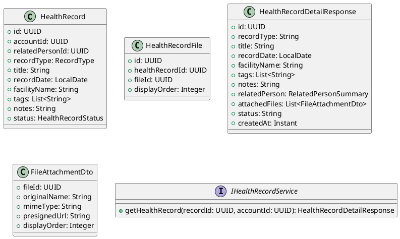
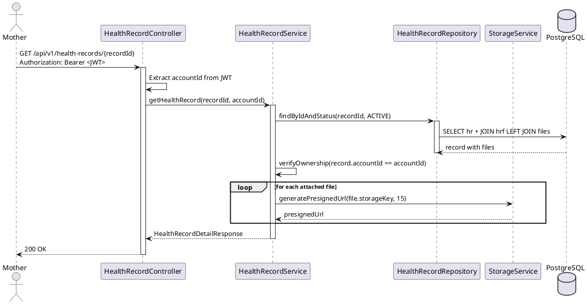
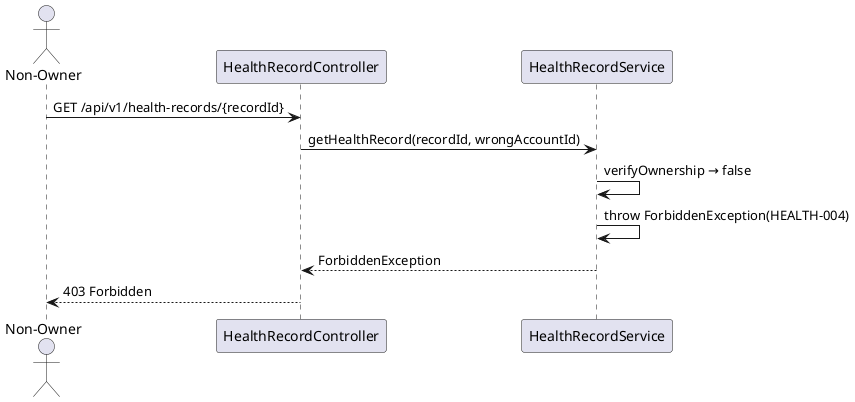

# ENGINEERING DOCUMENTATION STANDARD (EDS) v2.0
# Technical Design Specification — UC-211 View Health Record Detail

| Field | Value |
|-------|-------|
| **Document ID** | `CB-HEALTH-IMP-003` |
| **Version** | `1.0` |
| **Date** | `2026-06-26` |
| **Status** | `Implemented` |
| **Document Owner** | `PhuongNT` |
| **Author** | `AI Agent` |
| **Reviewed by** | `[Tech Lead]` |
| **DPO Sign-off** | `[ ] Pending` |
| **Approved by** | `[Principal Architect]` |
| **Last Review** | `2026-06-26` |
| **Based on EDS** | `v2.0` |

---

## CHANGELOG

| Ngày | Người thực hiện | Nội dung thay đổi |
|------|-----------------|-------------------|
| 2026-07-05 | AI Agent — Amelia (Dev Agent) | Phase 3 completion — added HR-TC-004 (presigned URL TTL) + HR-TC-005 (no diagnosis) tests; all 5 UC211 unit tests GREEN |
| 2026-06-27 | AI Agent — Amelia (Dev Agent) | Implementation completed — service, controller, tests 🟢 GREEN (45/45) |
| 2026-06-26 | AI Agent | Tạo tài liệu lần đầu cho UC-211 View Health Record Detail |

---

## MỤC LỤC

1. [Tổng quan Module](#1-tổng-quan-module)
2. [Ma trận Truy vết](#2-ma-trận-truy-vết-traceability-matrix)
3. [Architecture Decision Records (ADR)](#3-architecture-decision-records-adr)
4. [Non-Functional Requirements & SLA](#4-non-functional-requirements--sla)
5. [Static Modeling](#5-static-modeling-mô-hình-tĩnh)
6. [Dynamic Modeling](#6-dynamic-modeling-mô-hình-động)
7. [Domain Event Catalog](#7-domain-event-catalog)
8. [Interface Specification](#8-interface-specification-đặc-tả-giao-diện)
9. [API Specification](#9-api-specification)
10. [Bảng mã lỗi](#10-bảng-mã-lỗi-error-codes)
11. [Quy trình Triển khai](#11-quy-trình-triển-khai-step-by-step)
12. [Rollback & Incident Runbook](#12-rollback--incident-runbook)
13. [Kịch bản Kiểm thử Chi tiết](#13-kịch-bản-kiểm-thử-chi-tiết)
14. [Phương pháp Xác minh](#14-phương-pháp-xác-minh)
15. [Mẫu thử thực tế (API Verification Samples)](#15-mẫu-thử-thực-tế-api-verification-samples)
16. [Bảng tổng hợp phân quyền (Authorization Matrix)](#16-bảng-tổng-hợp-phân-quyền-authorization-matrix)
17. [AI Prompt Constraints (CASE 2.0)](#17-ai-prompt-constraints-case-20)

---

## 1. Tổng quan Module

| Field | Value |
|-------|-------|
| **Module Name** | `ViewHealthRecordDetail` |
| **Bounded Context** | `health` |
| **UC ID** | `UC-211` |
| **SRS Reference** | `3.3.15.1` |
| **Primary Actor** | `Mother (ROLE_MOTHER)` |
| **Platform** | `Mobile App` |
| **Data Classification** | `Sensitive-PII` |
| **Compliance Scope** | `BR-RBAC, BR-PRIVACY, BR-SAFETY, PDPA` |
| **Upstream Dependencies** | `auth, health_records table, files table` |
| **Downstream Consumers** | `file viewer (UC-168), expert consultation sharing` |

**Mô tả:** Hiển thị đầy đủ metadata, nguồn, ngày, người liên quan, ghi chú và danh sách files đính kèm của một health record. Hệ thống **KHÔNG** được đưa ra chẩn đoán từ dữ liệu hiển thị (BR-SAFETY). Files được trả về với presigned URL TTL 15 phút.

---

## 2. Ma trận Truy vết (Traceability Matrix)

| Requirement ID | Loại | Mô tả | Thành phần Code | Compliance Target | ADR liên quan |
|----------------|------|-------|-----------------|-------------------|---------------|
| UC-211 | Use Case | Mother xem chi tiết health record | `HealthRecordController.getRecord()` | BR-RBAC | ADR-HEALTH-003 |
| BR-HEALTH-020 | Business Rule | Chỉ owner xem được | `HealthRecordAccessPolicy.canView()` | BR-PRIVACY | ADR-HEALTH-003 |
| BR-HEALTH-021 | Business Rule | File URLs phải là presigned với TTL 15 phút | `StorageService.generatePresignedUrl(15)` | BR-PRIVACY | ADR-FILE-004 |
| BR-SAFETY-001 | Business Rule | Response không chứa medical interpretation | Response mapping policy | BR-SAFETY | — |

---

## 3. Architecture Decision Records (ADR)

### ADR-HEALTH-003 — Owner-only access cho health records

| Field | Value |
|-------|-------|
| **Status** | `Accepted` |
| **Deciders** | `Tech Lead` |
| **Date** | `2026-06-26` |

#### Bối cảnh
Health records chứa Sensitive-PII (kết quả xét nghiệm, siêu âm). Cần kiểm soát chặt ai được xem.

#### Quyết định
Chỉ `record.accountId == callerAccountId` mới được xem chi tiết. Care group members không được xem health records của người khác trong nhóm (riêng tư theo từng cá nhân).

#### Hệ quả
- Tích cực: Bảo vệ mạnh mẽ dữ liệu sức khỏe cá nhân
- Compliance: Phù hợp PDPA và BR-PRIVACY

---

## 4. Non-Functional Requirements & SLA

### 4.1. Performance & Availability

| Category | Requirement | Target SLA | Measurement Method | Compliance Basis |
|----------|-------------|------------|---------------------|------------------|
| Latency | GET response (includes presigned URL gen, p99) | `< 400ms` | k6 load test | — |
| Availability | Uptime (monthly) | `99.9%` | Uptime monitor | — |

### 4.2. Security

| Category | Requirement | Target | Verification Method | Compliance Basis |
|----------|-------------|--------|---------------------|------------------|
| File URL | Presigned URL only — no direct storage URL | 100% | Response schema review | BR-PRIVACY |
| Safety | No diagnosis in response | 100% | Response schema review | BR-SAFETY |

---

## 5. Static Modeling (Mô hình Tĩnh)

### 5.1. Class Diagram (PlantUML)



---

## 6. Dynamic Modeling (Mô hình Động)

### 6.1. Sequence Diagram — Happy Path (PlantUML)



### 6.2. Sequence Diagram — Error Path



---

## 7. Domain Event Catalog

### 7.1. Events Published (Phát ra)

| Event Name | Trigger | Publisher | Subscriber(s) | Async? |
|------------|---------|-----------|---------------|--------|
| — | Read-only endpoint — không phát sự kiện | — | — | — |

### 7.2. Events Consumed (Tiêu thụ)

| Event Name | Source | Handler | Action thực hiện |
|------------|--------|---------|------------------|
| `HealthRecordCreated` | `HealthRecordService` | — | Tạo row trong health_records (ngoài scope UC-211) |
| `FileUploaded` | `FileService` | — | Tạo health_record_files link (ngoài scope) |

---

## 8. Interface Specification (Đặc tả Giao diện)

### 8.1. Service Interface

```java
// HealthRecordDetailResponse.java
// @version 1.0
public class HealthRecordDetailResponse {
    private UUID id;
    private String recordType;
    private String title;
    private LocalDate recordDate;
    private String facilityName;
    private List<String> tags;
    private String notes;
    private String status;
    private List<FileAttachmentDto> attachedFiles;
    private Instant createdAt;
    // NO diagnosis, NO medical interpretation — BR-SAFETY-001
}

// FileAttachmentDto.java
public class FileAttachmentDto {
    private UUID fileId;
    private String originalName;
    private String mimeType;
    private String presignedUrl;    // 15 min TTL — never direct storage URL
    private Integer displayOrder;
}

// IHealthRecordService.java (addition)
// @version 1.0
public interface IHealthRecordService {
    /**
     * @throws NotFoundException (HEALTH-008) khi record không tồn tại hoặc ARCHIVED
     * @throws ForbiddenException (HEALTH-004) khi caller không phải owner
     */
    HealthRecordDetailResponse getHealthRecord(UUID recordId, UUID accountId);
}
```

### 8.2. Repository Interface

```java
// IHealthRecordRepository.java
// @version 1.0
public interface IHealthRecordRepository extends JpaRepository<HealthRecord, UUID> {
    Optional<HealthRecord> findByIdAndStatus(UUID id, HealthRecordStatus status);
}
```

---

## 9. API Specification

### 9.1. Endpoints Table

| Method | Path | Auth Level | Required Roles | Rate Limit | Idempotent? |
|--------|------|------------|----------------|------------|-------------|
| `GET` | `/api/v1/health-records/{recordId}` | JWT Bearer | `ROLE_MOTHER` | 100/min | Yes |

### 9.2. Request / Response Schemas

**Response — 200 OK:**
```json
{
  "id": "uuid-v4",
  "recordType": "LAB_RESULT",
  "title": "Blood Test Q2 2026",
  "recordDate": "2026-06-15",
  "facilityName": "FV Hospital",
  "tags": ["blood", "routine"],
  "notes": "All normal",
  "status": "ACTIVE",
  "attachedFiles": [
    {
      "fileId": "file-uuid",
      "originalName": "blood_test.pdf",
      "mimeType": "application/pdf",
      "presignedUrl": "https://storage/signed?X-Amz-Expires=900",
      "displayOrder": 0
    }
  ],
  "createdAt": "2026-06-26T00:00:00.000Z"
}
```

**Response — 403 Forbidden:**
```json
{
  "error": { "code": "HEALTH-004", "message": "Insufficient permissions" }
}
```

**Response — 404 Not Found:**
```json
{
  "error": { "code": "HEALTH-008", "message": "Health record not found" }
}
```

---

## 10. Bảng mã lỗi (Error Codes)

| Code | HTTP Status | Message (EN) | Message (VI) | Trigger Condition |
|------|-------------|--------------|--------------|-------------------|
| `HEALTH-004` | 403 | Insufficient permissions | Không đủ quyền | Caller không phải owner |
| `HEALTH-008` | 404 | Health record not found | Không tìm thấy hồ sơ sức khỏe | ID không tồn tại hoặc đã ARCHIVED |
| `HEALTH-009` | 500 | Storage error | Lỗi lưu trữ | Presigned URL generation failed |

---

## 11. Quy trình Triển khai (Step-by-Step)

### 11.1. Prerequisites

- [ ] Tables `health_records`, `health_record_files`, `files` đã tồn tại
- [ ] `StorageService` đã configured với cloud storage credentials
- [ ] JWT filter đã configured trong Spring Security

### 11.2. Pre-Migration Checklist

Không áp dụng — UC-211 là read-only endpoint, không có schema change.

### 11.3. Implementation Steps

#### Chặng 1 — Implement Repository query

```java
Optional<HealthRecord> findByIdAndStatus(UUID id, HealthRecordStatus status);
// ARCHIVED records trả về empty → NotFoundException (HEALTH-008)
```

#### Chặng 2 — Implement Service

```java
@Override
public HealthRecordDetailResponse getHealthRecord(UUID recordId, UUID accountId) {
    HealthRecord record = healthRecordRepo.findByIdAndStatus(recordId, HealthRecordStatus.ACTIVE)
        .orElseThrow(() -> new NotFoundException("HEALTH-008"));
    if (!record.getAccountId().equals(accountId)) {
        throw new ForbiddenException("HEALTH-004");
    }
    List<FileAttachmentDto> files = record.getFiles().stream()
        .map(f -> new FileAttachmentDto(
            f.getFileId(), f.getOriginalName(), f.getMimeType(),
            storageService.generatePresignedUrl(f.getStorageKey(), 15),
            f.getDisplayOrder()
        ))
        .collect(Collectors.toList());
    return mapper.toResponse(record, files);
}
```

#### Chặng 3 — Implement Controller

```java
@GetMapping("/api/v1/health-records/{recordId}")
public ResponseEntity<HealthRecordDetailResponse> getRecord(
    @PathVariable UUID recordId,
    @AuthenticationPrincipal JwtUser jwtUser
) {
    return ResponseEntity.ok(healthRecordService.getHealthRecord(recordId, jwtUser.getAccountId()));
}
```

#### Chặng 4 — Verification sau deploy

```bash
curl -X GET https://[host]/api/v1/health
# Expected: {"status": "ok"}
```

### 11.4. Deployment Checklist

- [ ] Health check endpoint trả về 200
- [ ] Test GET với owner → 200 với presigned URLs
- [ ] Test GET với non-owner → 403
- [ ] Test presigned URL TTL = 15 min (kiểm tra X-Amz-Expires=900)

---

## 12. Rollback & Incident Runbook

### 12.1. Điều kiện kích hoạt Rollback

| Điều kiện | Ngưỡng | Người quyết định |
|-----------|--------|------------------|
| Error rate tăng đột biến | > 5% trong 5 phút | On-call Engineer |
| Latency p99 vượt ngưỡng | > 1s | On-call Engineer |
| Presigned URL expose direct storage path | Bất kỳ case nào | Tech Lead + DPO |
| Response chứa medical diagnosis | Bất kỳ case nào | Tech Lead + DPO |

### 12.2. Rollback Procedure

Không có DB migration cho UC-211 → chỉ rollback code:

```bash
# Re-deploy phiên bản cũ
kubectl rollout undo deployment/carebridge-api
kubectl rollout status deployment/carebridge-api
curl -X GET https://[host]/api/v1/health
```

### 12.3. Notification Protocol

| Thời điểm | Người nhận | Kênh | Template |
|-----------|------------|------|----------|
| Ngay khi phát hiện | On-call team | Slack `#incident` | "🚨 UC-211 health record incident" |
| Nếu Sensitive-PII bị leak | DPO | Email | Bắt buộc — PDPA |

---

## 13. Kịch bản Kiểm thử Chi tiết

> **Policy (EDS v2.0):** Mọi test scenario dùng dữ liệu `SYNTHETIC`.

### 13.1. Unit Tests

#### TC-UNIT-001 — Owner views own record → 200

```gherkin
Feature: View Health Record Detail
  Background:
    Given test data classification: SYNTHETIC
    And ACC-001 là owner của record HR-001 (status=ACTIVE)

  Scenario: Happy path → 200 with presigned URLs
    Given HR-001 có 2 files đính kèm
    When getHealthRecord(HR-001, ACC-001) được gọi
    Then response trả về HealthRecordDetailResponse
    And response.attachedFiles.length == 2
    And mỗi file có presignedUrl không null
    And storageService.generatePresignedUrl được gọi với TTL=15
```

#### TC-UNIT-002 — Non-owner → 403

```gherkin
  Scenario: Non-owner → 403
    Given ACC-002 KHÔNG phải owner của HR-001
    When getHealthRecord(HR-001, ACC-002) được gọi
    Then throws ForbiddenException với code HEALTH-004
```

#### TC-UNIT-003 — Archived record → 404

```gherkin
  Scenario: ARCHIVED record → 404
    Given HR-002 có status=ARCHIVED
    When getHealthRecord(HR-002, ACC-001) được gọi
    Then throws NotFoundException với code HEALTH-008
```

#### TC-UNIT-004 — Response không chứa diagnosis

```gherkin
  Scenario: Response has no medical diagnosis
    When getHealthRecord(HR-001, ACC-001) được gọi
    Then response JSON KHÔNG chứa "diagnosis"
    And response JSON KHÔNG chứa "prescription"
    And response JSON KHÔNG chứa "treatment"
```

### 13.2. Integration Tests

#### TC-INT-001 — Presigned URLs có TTL đúng

```gherkin
  Scenario: Presigned URL TTL = 15 min
    Given test data classification: SYNTHETIC
    When getHealthRecord() được gọi với record có files
    Then verify(storageService).generatePresignedUrl(anyString(), eq(15))
```

### 13.3. E2E / Security Tests

```gherkin
  Scenario: Owner gọi API → 200
    Given ACC-001 có JWT hợp lệ, là owner của HR-001
    When GET /api/v1/health-records/HR-001
    Then response status là 200
    And response chứa attachedFiles với presignedUrl

  Scenario: No JWT → 401
    When GET /api/v1/health-records/HR-001 không có JWT
    Then response status là 401
```

---

## 14. Phương pháp Xác minh

### 14.1. Database Inspection

```sql
-- Verify record tồn tại và status đúng
SELECT id, account_id, status, record_type FROM health_records WHERE id = '<uuid>';

-- Verify files được link đúng
SELECT hrf.file_id, f.storage_key FROM health_record_files hrf
JOIN files f ON hrf.file_id = f.id
WHERE hrf.health_record_id = '<uuid>';
```

### 14.2. Log / Audit Verification

```bash
# Verify không có medical diagnosis trong log
kubectl logs -l app=carebridge-api | grep -i "diagnosis\|prescription"
# Expected: No output

# Verify StorageService được gọi với TTL=15
kubectl logs -l app=carebridge-api | grep "generatePresignedUrl" | grep "ttl=15"
```

---

## 15. Mẫu thử thực tế (API Verification Samples)

### 15.1. Happy Path

```bash
curl -X GET https://[host]/api/v1/health-records/HR-UUID \
  -H "Authorization: Bearer <OWNER_JWT>" \
  -H "X-Correlation-Id: $(uuidgen)"
```

**Expected Response (200):**
```json
{
  "id": "HR-UUID",
  "recordType": "LAB_RESULT",
  "title": "Blood Test Q2 2026",
  "status": "ACTIVE",
  "attachedFiles": [
    { "fileId": "file-uuid", "presignedUrl": "https://storage/signed?...", "displayOrder": 0 }
  ]
}
```

### 15.2. Error Paths

```bash
# Non-owner → 403
curl -X GET https://[host]/api/v1/health-records/HR-UUID \
  -H "Authorization: Bearer <OTHER_USER_JWT>"
# Expected: 403 { "error": { "code": "HEALTH-004" } }
```

---

## 16. Bảng tổng hợp phân quyền (Authorization Matrix)

| Endpoint | `GUEST` | `MOTHER (owner)` | `EXPERT` | `ADMIN` |
|----------|---------|------------------|----------|---------|
| `GET /api/v1/health-records/:id` | ❌ | ✅ Own | ❌ | ✅ All |

---

## 17. AI Prompt Constraints (CASE 2.0)

### 17.1 Constraint Summary Table

| # | Constraint | Source (ADR/BR) | Last Verified |
|---|-----------|-----------------|---------------|
| C1 | `verifyOwnership()` PHẢI throw 403 nếu `caller != record.accountId` — KHÔNG check bằng URL path | ADR-HEALTH-003 | 2026-06-26 |
| C2 | File URLs PHẢI là presigned với TTL=15 min — KHÔNG bao giờ direct storage URL | ADR-FILE-004 | 2026-06-26 |
| C3 | Response KHÔNG được chứa `diagnosis`, `prescription`, hay medical interpretation | BR-SAFETY-001 | 2026-06-26 |
| C4 | ARCHIVED records (status=ARCHIVED) trả về 404 — KHÔNG hiển thị archived data | BR-HEALTH-021 | 2026-06-26 |
| C5 | `accountId` lấy từ JWT SecurityContext — KHÔNG từ URL path | BR-RBAC | 2026-06-26 |

### 17.2 Constraint Injection Block (Copy-Paste vào AI Prompt)

```
[CONSTRAINT BLOCK — Module: ViewHealthRecordDetail (CB-HEALTH-IMP-003)]
Theo TDS CB-HEALTH-IMP-003 và các ADR liên quan:

1. (C1 — ADR-HEALTH-003) verifyOwnership(): record.accountId phải == JWT accountId; 403 nếu không khớp.
2. (C2 — ADR-FILE-004) StorageService.generatePresignedUrl(key, 15) — TTL=15 phút, KHÔNG dùng direct URL.
3. (C3 — BR-SAFETY-001) HealthRecordDetailResponse KHÔNG có field diagnosis, prescription, treatment.
4. (C4 — BR-HEALTH-021) findByIdAndStatus(id, ACTIVE): ARCHIVED → 404 HEALTH-008.
5. (C5 — BR-RBAC) accountId từ JWT SecurityContext.getAuthentication(), không từ @PathVariable.

[CONTEXT BLOCK]
- Bounded Context: health
- Data Classification: Sensitive-PII
- Compliance: PDPA, BR-SAFETY
- Existing interfaces: §8 Service Interface
- Error codes: HEALTH-004 (403), HEALTH-008 (404)
- Auth matrix: §16
```

### 17.3 Constraint Quality Checklist

- [x] Mỗi constraint traceable về ADR hoặc BR cụ thể
- [x] Không có constraint generic
- [x] Constraint block có ≥ 5 constraints cụ thể

### 17.4 Anti-Pattern Detection

| AP-ID | Anti-Pattern | Dấu hiệu | Hành động |
|-------|-------------|-----------|----------|
| AP-AI-001 | Unconstrained Gen | Code trả về direct storage URL thay vì presigned | Reject — C2 violation |
| AP-AI-003 | Implicit Decision | Response có "diagnosis" field | Reject — C3/BR-SAFETY violation |
| AP-AI-005 | Hallucinated Contract | Code gọi StorageService method không có trong §8 | Reject — verify contract |

---

## PHỤ LỤC

### A. Glossary (Thuật ngữ)

| Thuật ngữ | Định nghĩa |
|-----------|------------|
| Presigned URL | URL có chữ ký thời gian giới hạn cho phép truy cập file mà không cần credentials |
| TTL | Time-To-Live — thời gian hiệu lực của presigned URL (15 phút) |
| ARCHIVED | Trạng thái health record đã bị archive — không xóa, chỉ ẩn khỏi view |
| BR-SAFETY | Business Rule: hệ thống không được đưa ra chẩn đoán y tế |
| Sensitive-PII | PII đặc biệt nhạy cảm: kết quả xét nghiệm, hình ảnh y tế |

### B. Tài liệu tham chiếu

| Document | Link / Path |
|----------|-------------|
| PDPA Vietnam | [Link] |
| EDS v2.0 Template | `08_References/Template/PHASE-3_TDS.md` |
| StorageService | `05_Development/CareBridgeAPI/src/main/java/com/carebridge/storage/` |

---

*EDS v2.1 — Tích hợp CASE 2.0 AI Prompt Constraints (§17).*
