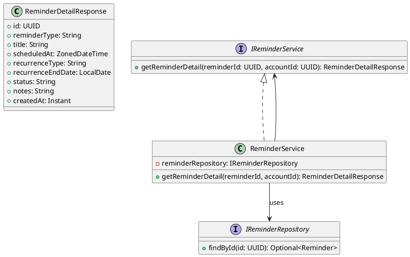
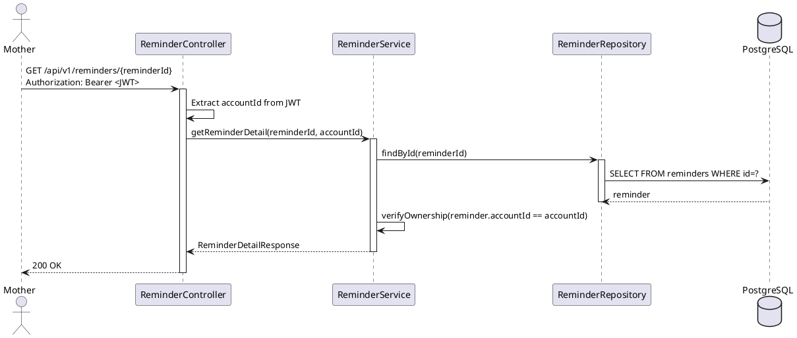
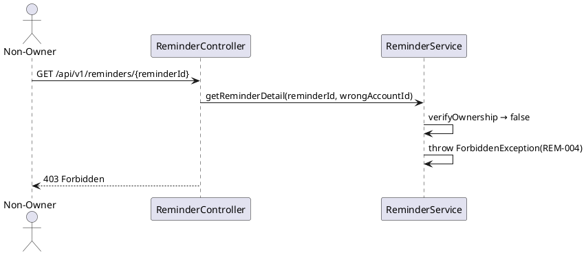

# ENGINEERING DOCUMENTATION STANDARD (EDS) v2.0
# Technical Design Specification — UC-212 View Reminder Detail

| Field | Value |
|-------|-------|
| **Document ID** | `CB-REM-IMP-002` |
| **Version** | `1.0` |
| **Date** | `2026-06-26` |
| **Status** | `Approved` |
| **Document Owner** | `PhuongNT` |
| **Author** | `AI Agent` |
| **Reviewed by** | `[Tech Lead]` |
| **DPO Sign-off** | `[ ] Pending` |
| **Approved by** | `[Principal Architect]` |
| **Last Review** | `2026-06-26` |
| **Based on EDS** | `v2.0` |

---

## CHANGELOG

| Ngày | Người thực hiện | Nội dung thay đổi |
|------|-----------------|-------------------|
| 2026-06-27 | AI Agent — Amelia (Dev Agent) | Implementation completed — service, controller, tests 🟢 GREEN (45/45) |
| 2026-06-26 | AI Agent | Tạo tài liệu lần đầu cho UC-212 View Reminder Detail |

---

## MỤC LỤC

1. [Tổng quan Module](#1-tổng-quan-module)
2. [Ma trận Truy vết](#2-ma-trận-truy-vết-traceability-matrix)
3. [Architecture Decision Records (ADR)](#3-architecture-decision-records-adr)
4. [Non-Functional Requirements & SLA](#4-non-functional-requirements--sla)
5. [Static Modeling](#5-static-modeling-mô-hình-tĩnh)
6. [Dynamic Modeling](#6-dynamic-modeling-mô-hình-động)
7. [Domain Event Catalog](#7-domain-event-catalog)
8. [Interface Specification](#8-interface-specification-đặc-tả-giao-diện)
9. [API Specification](#9-api-specification)
10. [Bảng mã lỗi](#10-bảng-mã-lỗi-error-codes)
11. [Quy trình Triển khai](#11-quy-trình-triển-khai-step-by-step)
12. [Rollback & Incident Runbook](#12-rollback--incident-runbook)
13. [Kịch bản Kiểm thử Chi tiết](#13-kịch-bản-kiểm-thử-chi-tiết)
14. [Phương pháp Xác minh](#14-phương-pháp-xác-minh)
15. [Mẫu thử thực tế (API Verification Samples)](#15-mẫu-thử-thực-tế-api-verification-samples)
16. [Bảng tổng hợp phân quyền (Authorization Matrix)](#16-bảng-tổng-hợp-phân-quyền-authorization-matrix)
17. [AI Prompt Constraints (CASE 2.0)](#17-ai-prompt-constraints-case-20)

---

## 1. Tổng quan Module

| Field | Value |
|-------|-------|
| **Module Name** | `ViewReminderDetail` |
| **Bounded Context** | `reminder` |
| **UC ID** | `UC-212` |
| **SRS Reference** | `3.3.16.1` |
| **Primary Actor** | `Mother (ROLE_MOTHER)` |
| **Secondary Actors** | `Firebase Cloud Messaging` |
| **Platform** | `Mobile App` |
| **Data Classification** | `PII` |
| **Compliance Scope** | `BR-RBAC, BR-SAFETY, PDPA` |
| **Upstream Dependencies** | `auth, reminders table` |
| **Downstream Consumers** | `reminder actions (complete/skip/delete)` |

**Mô tả:** Hiển thị chi tiết reminder: loại (APPOINTMENT/MEDICATION/VACCINATION), recurrence config, scheduled time, trạng thái hiện tại (PENDING/COMPLETED/SKIPPED/CANCELLED), và ghi chú. Chỉ owner của reminder mới được xem. Hệ thống **KHÔNG** đề xuất liều thuốc hay xác nhận chẩn đoán (BR-SAFETY).

---

## 2. Ma trận Truy vết (Traceability Matrix)

| Requirement ID | Loại | Mô tả | Thành phần Code | Compliance Target | ADR liên quan |
|----------------|------|-------|-----------------|-------------------|---------------|
| UC-212 | Use Case | Mother xem chi tiết reminder | `ReminderController.getReminderDetail()` | BR-RBAC | ADR-REM-002 |
| BR-REM-010 | Business Rule | Chỉ owner xem được reminder | `ReminderAccessPolicy.canView()` | BR-PRIVACY | ADR-REM-002 |
| BR-SAFETY-002 | Business Rule | Response không đề xuất liều thuốc hay xác nhận chẩn đoán | Response mapping policy | BR-SAFETY | — |

---

## 3. Architecture Decision Records (ADR)

### ADR-REM-002 — Owner-only access cho reminders

| Field | Value |
|-------|-------|
| **Status** | `Accepted` |
| **Deciders** | `Tech Lead` |
| **Date** | `2026-06-26` |

#### Bối cảnh
Reminders chứa thông tin sức khỏe cá nhân (lịch uống thuốc, lịch tái khám). Cần xác định rõ phạm vi chia sẻ.

#### Các phương án đã xem xét

| Phương án | Mô tả | Ưu điểm | Nhược điểm |
|-----------|-------|----------|------------|
| A | Care group members có thể xem reminder của nhau | Tiện cho gia đình hỗ trợ | Lộ thông tin medication nhạy cảm |
| B | Chỉ owner mới xem được reminder | An toàn hơn | Gia đình không hỗ trợ lịch uống thuốc |

#### Quyết định
Chọn **Phương án B**: Reminders là private data của Mother. Không chia sẻ với care group members. Expert không được xem.

#### Hệ quả
- Tích cực: Bảo vệ thông tin medication cá nhân
- Compliance: Phù hợp PDPA

---

## 4. Non-Functional Requirements & SLA

### 4.1. Performance & Availability

| Category | Requirement | Target SLA | Measurement Method | Compliance Basis |
|----------|-------------|------------|---------------------|------------------|
| Latency | GET response (p99) | `< 150ms` | k6 load test | — |
| Availability | Uptime (monthly) | `99.9%` | Uptime monitor | — |

### 4.3. Security

| Category | Requirement | Target | Verification Method | Compliance Basis |
|----------|-------------|--------|---------------------|------------------|
| Access control | Owner-only | 100% | Auth Matrix §16 | BR-RBAC |
| Safety | No medication advice in response | 100% | Response schema | BR-SAFETY |

---

## 5. Static Modeling (Mô hình Tĩnh)

### 5.1. Class Diagram (PlantUML)



---

## 6. Dynamic Modeling (Mô hình Động)

### 6.1. Sequence Diagram — Happy Path (PlantUML)



### 6.2. Sequence Diagram — Error Path



---

## 7. Domain Event Catalog

### 7.1. Events Published (Phát ra)

| Event Name | Trigger | Publisher | Subscriber(s) | Async? |
|------------|---------|-----------|---------------|--------|
| — | Read-only endpoint — không phát sự kiện | — | — | — |

### 7.2. Events Consumed (Tiêu thụ)

| Event Name | Source | Handler | Action thực hiện |
|------------|--------|---------|------------------|
| `ReminderCreated` | `ReminderService` | — | Tạo row trong reminders (ngoài scope UC-212) |

---

## 8. Interface Specification (Đặc tả Giao diện)

### 8.1. Service Interface

```java
// ReminderDetailResponse.java
// @version 1.0
public class ReminderDetailResponse {
    private UUID id;
    private String reminderType;    // APPOINTMENT, MEDICATION, VACCINATION
    private String title;
    private ZonedDateTime scheduledAt;
    private String recurrenceType;  // NONE, DAILY, WEEKLY, MONTHLY
    private LocalDate recurrenceEndDate;
    private String status;          // PENDING, COMPLETED, SKIPPED, CANCELLED
    private String notes;
    private Instant createdAt;
    // NO medication dosage, NO medical advice — BR-SAFETY-002
}

// IReminderService.java (addition)
// @version 1.0
public interface IReminderService {
    /**
     * @throws NotFoundException (REM-006) khi reminder không tồn tại
     * @throws ForbiddenException (REM-004) khi caller không phải owner
     */
    ReminderDetailResponse getReminderDetail(UUID reminderId, UUID accountId);
}
```

### 8.2. Repository Interface

```java
// IReminderRepository.java
// @version 1.0
public interface IReminderRepository extends JpaRepository<Reminder, UUID> {
    Optional<Reminder> findById(UUID id);
    // Cancelled reminders vẫn viewable — không filter by status ở đây
}
```

---

## 9. API Specification

### 9.1. Endpoints Table

| Method | Path | Auth Level | Required Roles | Rate Limit | Idempotent? |
|--------|------|------------|----------------|------------|-------------|
| `GET` | `/api/v1/reminders/{reminderId}` | JWT Bearer | `ROLE_MOTHER` | 100/min | Yes |

### 9.2. Request / Response Schemas

**Response — 200 OK:**
```json
{
  "id": "uuid-v4",
  "reminderType": "APPOINTMENT",
  "title": "OB-GYN Checkup Week 28",
  "scheduledAt": "2026-07-15T09:00:00+07:00",
  "recurrenceType": "NONE",
  "recurrenceEndDate": null,
  "status": "PENDING",
  "notes": "Bring ultrasound results",
  "createdAt": "2026-06-26T00:00:00.000Z"
}
```

**Response — 403 Forbidden:**
```json
{
  "error": { "code": "REM-004", "message": "Insufficient permissions" }
}
```

---

## 10. Bảng mã lỗi (Error Codes)

| Code | HTTP Status | Message (EN) | Message (VI) | Trigger Condition |
|------|-------------|--------------|--------------|-------------------|
| `REM-004` | 403 | Insufficient permissions | Không đủ quyền | Caller không phải owner của reminder |
| `REM-006` | 404 | Reminder not found | Không tìm thấy nhắc nhở | ID không tồn tại |

---

## 11. Quy trình Triển khai (Step-by-Step)

### 11.1. Prerequisites

- [ ] Table `reminders` đã tồn tại
- [ ] JWT filter đã configured

### 11.2. Pre-Migration Checklist

Không áp dụng — UC-212 là read-only endpoint, không có schema change.

### 11.3. Implementation Steps

#### Chặng 1 — Implement Service

```java
@Override
public ReminderDetailResponse getReminderDetail(UUID reminderId, UUID accountId) {
    Reminder reminder = reminderRepository.findById(reminderId)
        .orElseThrow(() -> new NotFoundException("REM-006"));
    if (!reminder.getAccountId().equals(accountId)) {
        throw new ForbiddenException("REM-004");
    }
    // Note: CANCELLED reminders are still viewable — ADR-REM-002
    return mapper.toResponse(reminder);
}
```

#### Chặng 2 — Implement Controller

```java
@GetMapping("/api/v1/reminders/{reminderId}")
public ResponseEntity<ReminderDetailResponse> getReminderDetail(
    @PathVariable UUID reminderId,
    @AuthenticationPrincipal JwtUser jwtUser
) {
    return ResponseEntity.ok(reminderService.getReminderDetail(reminderId, jwtUser.getAccountId()));
}
```

### 11.4. Deployment Checklist

- [ ] Health check endpoint trả về 200
- [ ] Test GET PENDING reminder → 200
- [ ] Test GET CANCELLED reminder → 200 (still visible)
- [ ] Test GET với non-owner → 403
- [ ] Response không chứa medication dosage

---

## 12. Rollback & Incident Runbook

### 12.1. Điều kiện kích hoạt Rollback

| Điều kiện | Ngưỡng | Người quyết định |
|-----------|--------|------------------|
| Error rate > 5% | 5 phút | On-call Engineer |
| Response chứa medication advice | Bất kỳ case | Tech Lead + DPO |

### 12.2. Rollback Procedure

Không có DB migration — chỉ rollback code:

```bash
kubectl rollout undo deployment/carebridge-api
kubectl rollout status deployment/carebridge-api
curl -X GET https://[host]/api/v1/health
```

### 12.3. Notification Protocol

| Thời điểm | Người nhận | Kênh |
|-----------|------------|------|
| Khi phát hiện | On-call team | Slack `#incident` |
| Nếu PII bị leak | DPO | Email |

---

## 13. Kịch bản Kiểm thử Chi tiết

> **Policy (EDS v2.0):** Mọi test scenario dùng dữ liệu `SYNTHETIC`.

### 13.1. Unit Tests

#### TC-UNIT-001 — Owner xem PENDING reminder → 200

```gherkin
Feature: View Reminder Detail
  Background:
    Given test data classification: SYNTHETIC
    And ACC-001 là owner của REM-001 (status=PENDING)

  Scenario: Owner views PENDING reminder → 200
    When getReminderDetail(REM-001, ACC-001) được gọi
    Then response trả về ReminderDetailResponse
    And response.status == "PENDING"
    And response.reminderType không null
```

#### TC-UNIT-002 — CANCELLED reminder vẫn viewable

```gherkin
  Scenario: CANCELLED reminder → 200 (still viewable)
    Given REM-002 có status=CANCELLED
    When getReminderDetail(REM-002, ACC-001) được gọi
    Then response status HTTP là 200
    And response.status == "CANCELLED"
```

#### TC-UNIT-003 — Non-owner → 403

```gherkin
  Scenario: Non-owner → 403
    Given ACC-002 KHÔNG phải owner của REM-001
    When getReminderDetail(REM-001, ACC-002) được gọi
    Then throws ForbiddenException với code REM-004
```

#### TC-UNIT-004 — Not found → 404

```gherkin
  Scenario: Reminder không tồn tại → 404
    When getReminderDetail(NONEXISTENT-UUID, ACC-001) được gọi
    Then throws NotFoundException với code REM-006
```

#### TC-UNIT-005 — Response không chứa medication dosage

```gherkin
  Scenario: Response has no medication dosage
    When getReminderDetail(REM-001, ACC-001) được gọi
    Then response JSON KHÔNG chứa "dosage"
    And response JSON KHÔNG chứa "prescription"
    And response JSON KHÔNG chứa "diagnos"
```

### 13.2. Integration Tests

#### TC-INT-001 — Full flow với DB

```gherkin
  Scenario: Service + Repository phối hợp đúng
    Given test data classification: SYNTHETIC
    And DB có REM-001 với status=PENDING, accountId=ACC-001
    When getReminderDetail(REM-001, ACC-001) được gọi
    Then reminderRepository.findById(REM-001) được gọi 1 lần
    And response.status == "PENDING"
```

### 13.3. E2E Tests

```gherkin
  Scenario: GET reminder → 200
    Given ACC-001 có JWT hợp lệ, là owner của REM-001
    When GET /api/v1/reminders/REM-001
    Then response status là 200

  Scenario: No JWT → 401
    When GET /api/v1/reminders/REM-001 không có JWT
    Then response status là 401
```

---

## 14. Phương pháp Xác minh

### 14.1. Database Inspection

```sql
-- Verify reminder tồn tại
SELECT id, account_id, reminder_type, status FROM reminders WHERE id = '<uuid>';

-- Verify CANCELLED reminders vẫn trong DB
SELECT COUNT(*) FROM reminders WHERE status = 'CANCELLED';
```

### 14.2. Log / Audit Verification

```bash
# Verify không có medication advice trong log
kubectl logs -l app=carebridge-api | grep -i "dosage\|prescription"
# Expected: No output
```

---

## 15. Mẫu thử thực tế (API Verification Samples)

### 15.1. Happy Path

```bash
curl -X GET https://[host]/api/v1/reminders/REM-UUID \
  -H "Authorization: Bearer <OWNER_JWT>" \
  -H "X-Correlation-Id: $(uuidgen)"
```

**Expected Response (200):**
```json
{
  "id": "REM-UUID",
  "reminderType": "APPOINTMENT",
  "title": "OB-GYN Checkup",
  "scheduledAt": "2026-07-15T09:00:00+07:00",
  "status": "PENDING"
}
```

### 15.2. Error Paths

```bash
# Non-owner → 403
curl -X GET https://[host]/api/v1/reminders/REM-UUID \
  -H "Authorization: Bearer <OTHER_JWT>"
# Expected: 403 {"error": {"code": "REM-004"}}
```

---

## 16. Bảng tổng hợp phân quyền (Authorization Matrix)

| Endpoint | `GUEST` | `MOTHER (owner)` | `EXPERT` | `ADMIN` |
|----------|---------|------------------|----------|---------|
| `GET /api/v1/reminders/:id` | ❌ | ✅ Own | ❌ | ✅ All |

---

## 17. AI Prompt Constraints (CASE 2.0)

### 17.1 Constraint Summary Table

| # | Constraint | Source (ADR/BR) | Last Verified |
|---|-----------|-----------------|---------------|
| C1 | `verifyOwnership()` PHẢI throw REM-004 nếu `caller != reminder.accountId` | ADR-REM-002 | 2026-06-26 |
| C2 | Response KHÔNG được chứa `dosage`, `prescription`, hay medication advice | BR-SAFETY-002 | 2026-06-26 |
| C3 | CANCELLED reminders vẫn viewable — KHÔNG throw 404 cho CANCELLED | ADR-REM-002 | 2026-06-26 |
| C4 | `accountId` lấy từ JWT SecurityContext — KHÔNG từ URL | BR-RBAC | 2026-06-26 |
| C5 | Read-only endpoint — KHÔNG có side effects | — | 2026-06-26 |

### 17.2 Constraint Injection Block (Copy-Paste vào AI Prompt)

```
[CONSTRAINT BLOCK — Module: ViewReminderDetail (CB-REM-IMP-002)]
Theo TDS CB-REM-IMP-002 và các ADR liên quan:

1. (C1 — ADR-REM-002) verifyOwnership(): reminder.accountId phải == JWT accountId; throw REM-004 nếu không.
2. (C2 — BR-SAFETY-002) ReminderDetailResponse KHÔNG có field dosage, prescription, medical advice.
3. (C3 — ADR-REM-002) CANCELLED reminders vẫn được trả về 200 — không filter CANCELLED.
4. (C4 — BR-RBAC) accountId từ JWT SecurityContext, không từ URL path hay body.
5. (C5) GET-only endpoint — không emit events, không audit log.

[CONTEXT BLOCK]
- Bounded Context: reminder
- Data Classification: PII
- Compliance: PDPA, BR-SAFETY
- Error codes: REM-004 (403), REM-006 (404)
- Auth matrix: §16
```

### 17.3 Constraint Quality Checklist

- [x] Mỗi constraint traceable về ADR hoặc BR cụ thể
- [x] Không có constraint generic
- [x] Constraint block có ≥ 5 constraints cụ thể

### 17.4 Anti-Pattern Detection

| AP-ID | Anti-Pattern | Dấu hiệu | Hành động |
|-------|-------------|-----------|----------|
| AP-AI-001 | Unconstrained Gen | Code filter CANCELLED reminders → 404 | Reject — C3 violation |
| AP-AI-003 | Implicit Decision | Response có "dosage" field | Reject — C2/BR-SAFETY violation |
| AP-AI-005 | Hallucinated Contract | Code dùng method không có trong §8 | Reject — verify contract |

---

## PHỤ LỤC

### A. Glossary (Thuật ngữ)

| Thuật ngữ | Định nghĩa |
|-----------|------------|
| Reminder | Nhắc nhở lịch uống thuốc, tái khám, hoặc tiêm chủng |
| Recurrence | Cấu hình lặp lại: NONE, DAILY, WEEKLY, MONTHLY |
| CANCELLED | Trạng thái đã hủy — vẫn viewable (không bị xóa) |
| BR-SAFETY | Business Rule: hệ thống không được đưa ra tư vấn y tế |

### B. Tài liệu tham chiếu

| Document | Link / Path |
|----------|-------------|
| PDPA Vietnam | [Link] |
| EDS v2.0 Template | `08_References/Template/PHASE-3_TDS.md` |
| ReminderRepository | `05_Development/CareBridgeAPI/src/main/java/com/carebridge/reminder/` |

---

*EDS v2.1 — Tích hợp CASE 2.0 AI Prompt Constraints (§17).*
