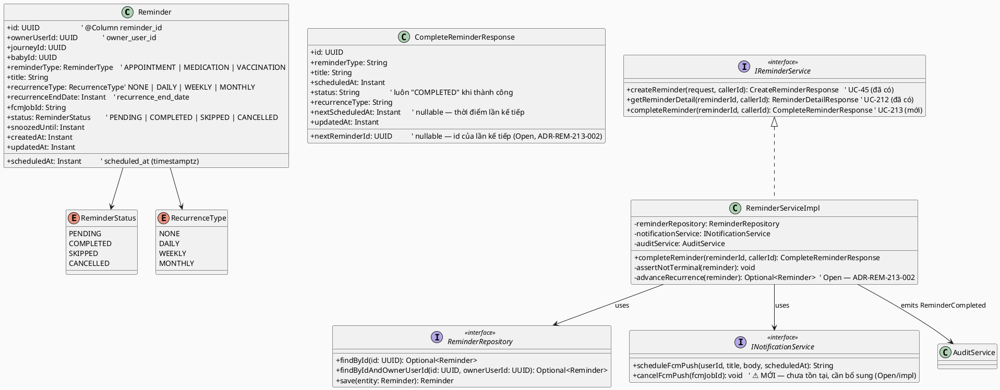
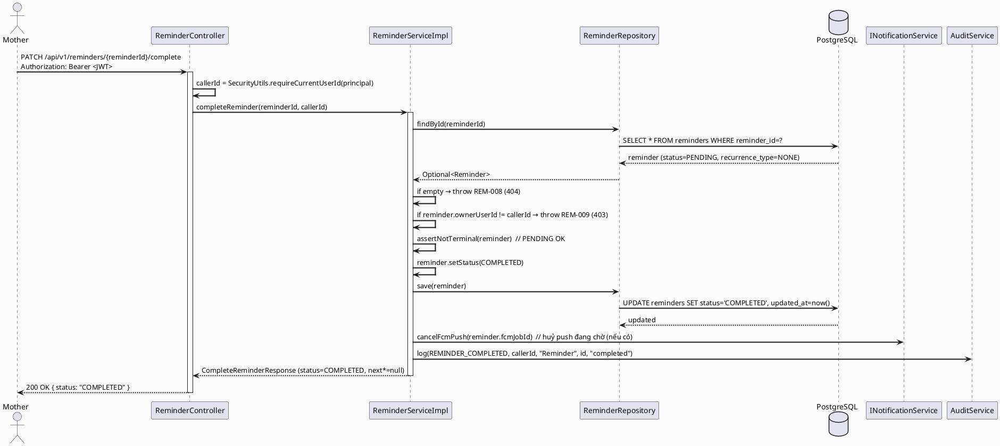
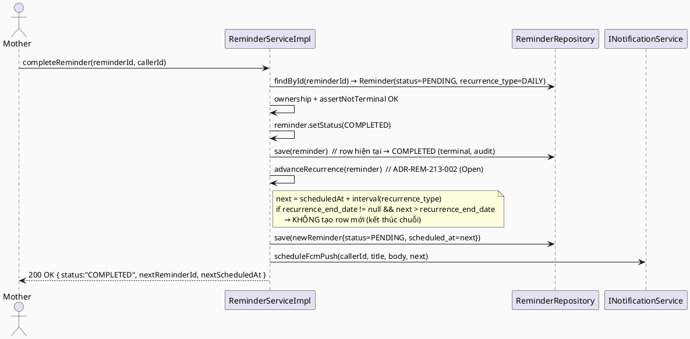
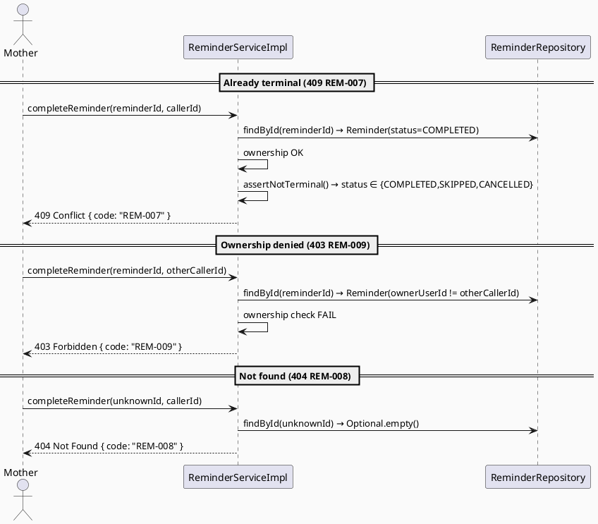
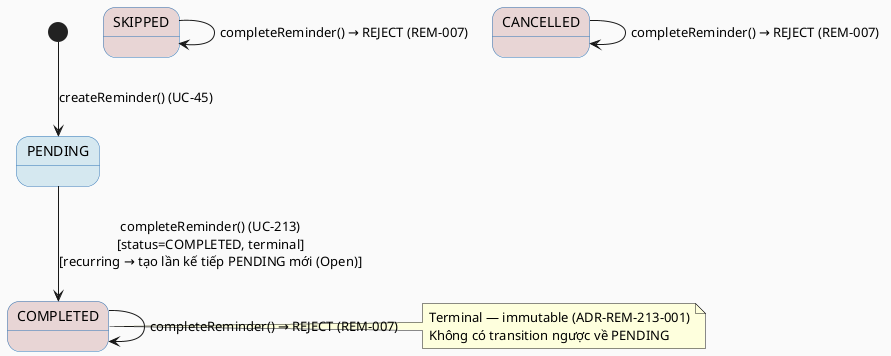

# ENGINEERING DOCUMENTATION STANDARD (EDS) v2.0
# Technical Design Specification — UC-213 Complete Reminder

| Field | Value |
|-------|-------|
| **Document ID** | `CB-REM-IMP-213` |
| **Version** | `1.0` |
| **Date** | `2026-07-03` |
| **Status** | `Approved` |
| **Document Owner** | `PhuongNT` |
| **Author** | `AI Agent` |
| **Reviewed by** | `[Tech Lead]` |
| **DPO Sign-off** | `[ ] Pending` |
| **Approved by** | `TV2-Bách` |
| **Last Review** | `2026-07-03` |
| **Based on EDS** | `v2.0` |

---

## CHANGELOG

> **Policy 4.4 — Immutable History:** Không bao giờ xóa thông tin cũ. Mọi thay đổi phải ghi vào bảng này.

| Ngày | Người thực hiện | Nội dung thay đổi |
|------|-----------------|-------------------|
| 2026-07-03 | AI Agent | Tạo tài liệu lần đầu cho UC-213 Complete Reminder (Status = Draft, chưa implement) |

---

## MỤC LỤC

1. [Tổng quan Module](#1-tổng-quan-module)
2. [Ma trận Truy vết](#2-ma-trận-truy-vết-traceability-matrix)
3. [Architecture Decision Records (ADR)](#3-architecture-decision-records-adr)
4. [Non-Functional Requirements & SLA](#4-non-functional-requirements--sla)
5. [Static Modeling](#5-static-modeling-mô-hình-tĩnh)
6. [Dynamic Modeling](#6-dynamic-modeling-mô-hình-động)
7. [Domain Event Catalog](#7-domain-event-catalog)
8. [Interface Specification](#8-interface-specification-đặc-tả-giao-diện)
9. [API Specification](#9-api-specification)
10. [Bảng mã lỗi](#10-bảng-mã-lỗi-error-codes)
11. [Quy trình Triển khai](#11-quy-trình-triển-khai-step-by-step)
12. [Rollback & Incident Runbook](#12-rollback--incident-runbook)
13. [Kịch bản Kiểm thử Chi tiết](#13-kịch-bản-kiểm-thử-chi-tiết)
14. [Phương pháp Xác minh](#14-phương-pháp-xác-minh)
15. [Mẫu thử thực tế (API Verification Samples)](#15-mẫu-thử-thực-tế-api-verification-samples)
16. [Bảng tổng hợp phân quyền (Authorization Matrix)](#16-bảng-tổng-hợp-phân-quyền-authorization-matrix)
17. [AI Prompt Constraints (CASE 2.0)](#17-ai-prompt-constraints-case-20)

---

## 1. Tổng quan Module

> Mother đánh dấu một reminder là đã hoàn thành. Nếu reminder là recurring, hệ thống cập nhật/ tạo lần nhắc kế tiếp theo cấu hình lặp (nếu áp dụng).

| Field | Value |
|-------|-------|
| **Module Name** | `CompleteReminder` |
| **Bounded Context** | `reminder` |
| **UC ID** | `UC-213` |
| **SRS Reference** | `§3.3.16.2` (Table 235) |
| **Primary Actor** | `Mother (ROLE_MOTHER)` |
| **Secondary Actors** | `Firebase Cloud Messaging (FCM)` |
| **Platform** | `Mobile App` |
| **Data Classification** | `PII` |
| **Compliance Scope** | `BR-RBAC` (SRS §3.3.16.2), `BR-SAFETY` (kế thừa từ UC-212), `PDPA` |
| **Upstream Dependencies** | `auth (JWT), reminders table (đã tồn tại), INotificationService (FCM)` |
| **Downstream Consumers** | `audit, notification (FCM cancellation), UC-212 ViewReminderDetail, UC-49 ViewTodayTasks` |

**Mô tả:** Theo SRS §3.3.16.2, UC-213 "Marks a reminder as completed and updates the next recurrence if applicable." Cụ thể: chuyển `status` của reminder từ `PENDING → COMPLETED` (trạng thái terminal). Chỉ **owner** của reminder mới được complete (kế thừa `ADR-REM-002`). Với reminder **non-recurring** (`recurrence_type = NONE`/null): chỉ set `status = COMPLETED`. Với reminder **recurring**: ngoài việc đánh dấu row hiện tại `COMPLETED`, hệ thống dự kiến tạo một lần nhắc kế tiếp — **cơ chế chính xác đang `Open`** (xem `ADR-REM-213-002`). Hệ thống **KHÔNG** đề xuất liều thuốc, chẩn đoán, hay tư vấn y tế trong response (BR-SAFETY, kế thừa `BR-SAFETY-002` của UC-212).

> **Ghi chú Greenfield:** Ở thời điểm viết tài liệu, package `com.carebridge.backend.reminder` mới chỉ có `POST /api/v1/reminders` (UC-45) và `GET /api/v1/reminders/{reminderId}` (UC-212). **Chưa có** endpoint complete/skip/delete/update. Entity `Reminder`, enum `ReminderStatus`, và bảng `reminders` đã tồn tại và PHẢI được tái sử dụng nguyên trạng.

---

## 2. Ma trận Truy vết (Traceability Matrix)

| Requirement ID | Loại (BR/ADR/US) | Mô tả yêu cầu | Thành phần Code | Compliance Target | ADR liên quan |
|----------------|------------------|---------------|-----------------|-------------------|---------------|
| UC-213 | Use Case | Mother đánh dấu reminder hoàn thành; cập nhật lần nhắc kế tiếp nếu áp dụng | `ReminderController.completeReminder()` → `ReminderServiceImpl.completeReminder()` | BR-RBAC | ADR-REM-213-001 |
| BR-RBAC | Business Rule (SRS §3.3.16.2) | Chỉ owner mới complete được reminder của mình | Ownership check trong Service (findById → so sánh `ownerUserId`) | BR-PRIVACY | ADR-REM-002 |
| BR-REM-213-001 | Business Rule (dẫn xuất) | `PENDING → COMPLETED` là transition terminal; reminder đã terminal (COMPLETED/SKIPPED/CANCELLED) không thể complete lại | `ReminderServiceImpl.assertNotTerminal()` | Data Integrity | ADR-REM-213-001 |
| BR-REM-213-002 | Business Rule (dẫn xuất, **Open**) | Recurring reminder: tạo lần nhắc kế tiếp từ `recurrence_type`/`recurrence_end_date` | `ReminderServiceImpl.advanceRecurrence()` | Data Integrity | ADR-REM-213-002 (Proposed) |
| BR-SAFETY-002 | Business Rule (kế thừa UC-212) | Response KHÔNG chứa dosage/prescription/diagnosis | `CompleteReminderResponse` mapping | BR-SAFETY | — |
| ADR-REM-002 | Decision (kế thừa UC-212) | Reminders là private data của Mother — owner-only | Ownership check | PDPA | ADR-REM-002 |

---

## 3. Architecture Decision Records (ADR)

> UC-213 **tái sử dụng** hai quyết định đã có (`ADR-REM-002` ownership, và tinh thần terminal-state của `ADR-REM-STATE-001`), và **đề xuất mới** một quyết định về cơ chế recurrence (`ADR-REM-213-002`, đang `Open`).

### ADR-REM-002 — Owner-only access cho reminders *(REUSED — không định nghĩa lại)*

| Field | Value |
|-------|-------|
| **Status** | `Accepted` (nguồn: `04_Implement/UC212_ViewReminderDetail/UC212_ViewReminderDetail_TDS.md §3`) |
| **Áp dụng cho UC-213** | Chỉ `reminders.owner_user_id == caller` mới được complete reminder. Non-owner → 403 (`REM-009`). Đây là cùng một pattern đã implement và test 45/45 xanh ở UC-212. |

> **Không tái định nghĩa.** UC-213 chỉ tham chiếu và áp dụng. Chi tiết context/options/consequences xem TDS UC-212.

### ADR-REM-213-001 — `COMPLETED` là trạng thái terminal (reuse terminal-state discipline)

| Field | Value |
|-------|-------|
| **Status** | `Accepted` |
| **Deciders** | `AI Agent → [Tech Lead pending]` |
| **Date** | `2026-07-03` |
| **Supersedes** | — |
| **Prior art** | `ADR-REM-STATE-001` (UC-48, hiện là Draft chưa implement) — tinh thần "COMPLETED/SKIPPED là terminal, immutable" được tái sử dụng như một **concept**, không phụ thuộc vào việc UC-48 có được implement hay không. |

#### Bối cảnh (Context)
Reminder về thuốc, tiêm chủng, lịch hẹn sau khi được đánh dấu COMPLETED phản ánh hành động thực tế của người dùng và là một phần của lịch sử chăm sóc / audit trail. Cần xác định COMPLETED có thể bị đảo ngược hay không.

#### Các phương án đã xem xét (Options Considered)

| Phương án | Mô tả | Ưu điểm | Nhược điểm |
|-----------|-------|----------|------------|
| A | Cho phép undo COMPLETED về PENDING | Linh hoạt UX (nút "Hoàn tác" trong mockup) | Phá vỡ audit trail; mâu thuẫn với SRS "marks as completed" |
| B | COMPLETED là terminal, immutable | Audit trail toàn vẹn; logic đơn giản; đồng nhất với UC-48 | Muốn re-schedule phải dựa vào lần nhắc kế tiếp (recurrence) hoặc tạo reminder mới |

#### Quyết định (Decision)
Chọn **Phương án B**: `COMPLETED` là trạng thái terminal. Reminder đang ở `COMPLETED`, `SKIPPED`, hoặc `CANCELLED` (tức đã terminal) **không thể** được complete lại → ném `REM-007` (409).

> **Ghi chú về nút "Hoàn tác" trong UI mockup** (`CB-273/code.html`): nút này chỉ là hành vi **client-side** (ẩn toast trước khi request commit trong prototype) — **không** phải một server capability. Server không cung cấp undo cho UC-213. Nếu sản phẩm thật sự cần undo, đó là một UC riêng cần ADR mới. → Đánh dấu **out-of-scope** cho UC-213.

#### Hệ quả (Consequences)
**Tích cực:** Audit trail y tế rõ ràng; không có transition ngược; nhất quán với terminal-state discipline.
**Trade-offs:** UX không có undo phía server — giảm thiểu bằng confirmation dialog phía client trước khi complete.
**Compliance Impact:** Phù hợp PDPA (bảo toàn lịch sử xử lý dữ liệu sức khỏe).

### ADR-REM-213-002 — Cơ chế "cập nhật lần nhắc kế tiếp" khi complete reminder recurring *(PROPOSED — OPEN, cần Tech Lead sign-off)*

| Field | Value |
|-------|-------|
| **Status** | `Proposed` — **OPEN** |
| **Deciders** | `[Tech Lead — pending]` |
| **Date** | `2026-07-03` |

#### Bối cảnh (Context)
SRS §3.3.16.2 nói complete "updates the next recurrence if applicable" nhưng **không** mô tả cơ chế. Bảng `reminders` chỉ có **một row cho mỗi reminder** (không có bảng occurrence-history riêng), kèm `recurrence_rule varchar(100)` (V1 — **không được entity map**), và `recurrence_type` (enum `NONE/DAILY/WEEKLY/MONTHLY`) + `recurrence_end_date` (được entity map, thêm bởi migration `V20260627100300`). Cần chọn cơ chế "advance recurrence".

> **Fidelity note:** Entity `Reminder` map field `recurrenceType` (enum `RecurrenceType`) và `recurrenceEndDate` (`Instant`), **không** map cột `recurrence_rule`. Do đó thuật toán tính lần kế tiếp dựa trên **`recurrence_type` enum** (deterministic), không dùng chuỗi `recurrence_rule` (format của nó không được document ở bất kỳ đâu trong repo → **Open**).

#### Các phương án đã xem xét (Options Considered)

| Phương án | Mô tả | Ưu điểm | Nhược điểm |
|-----------|-------|----------|------------|
| (a) | Đánh dấu row hiện tại `COMPLETED` (giữ lại cho audit) **VÀ tạo một row `reminders` mới** cho lần kế tiếp (`scheduled_at` tính từ `recurrence_type`, tôn trọng `recurrence_end_date`) | Audit trail đầy đủ (mỗi lần hoàn thành là một record); nhất quán terminal-state | Sinh nhiều row; cần logic tính ngày + schedule FCM mới |
| (b) | Đẩy `scheduled_at` của **cùng row** về phía trước, **không** set `COMPLETED` cho reminder recurring | Ít row hơn | Mâu thuẫn SRS "marks a reminder as completed"; mất lịch sử từng lần hoàn thành |

#### Quyết định (Decision — Proposed)
**Khuyến nghị Phương án (a)** — bảo toàn audit trail và nhất quán với `ADR-REM-213-001` (terminal-state). Thuật toán đề xuất (Proposed, cần sign-off):
```
if (recurrenceType == null || recurrenceType == NONE) → không tạo lần kế tiếp.
else:
  next = advance(scheduledAt, recurrenceType)
     DAILY   → scheduledAt + 1 ngày
     WEEKLY  → scheduledAt + 7 ngày
     MONTHLY → scheduledAt + 1 tháng   // ⚠️ OPEN: cộng "1 tháng" trên Instant cần một timezone
  if (recurrenceEndDate != null && next.isAfter(recurrenceEndDate)) → không tạo lần kế tiếp.
  else → INSERT reminders row mới {status=PENDING, scheduled_at=next, copy owner/journey/baby/type/title/recurrence_*} + schedule FCM mới.
```

#### Hệ quả & Open Items
**Open-1 (thuật toán):** Cơ chế create-new-row vs mutate-same-row (a) vs (b) — **cần Tech Lead sign-off** trước khi implement.
**Open-2 (MONTHLY + timezone):** `scheduled_at` là `Instant` (UTC). Cộng "1 tháng" cần một zone (giả định `Asia/Ho_Chi_Minh`?) — **không được document** → Open.
**Open-3 (`recurrence_rule`):** Cột `recurrence_rule` tồn tại trong V1 nhưng không được entity map; nếu sau này dùng RRULE (iCal), format cần được đặc tả → Open.
> Cho tới khi Open-1..3 được chốt, **path recurring của UC-213 chỉ được implement ở mức tối thiểu an toàn** (set `COMPLETED` cho row hiện tại), và việc tạo lần kế tiếp được gate sau sign-off. Test cho path recurring (§13) được đánh dấu phụ thuộc Open item.

---

## 4. Non-Functional Requirements & SLA

### 4.1. Performance & Availability

| Category | Requirement | Target SLA | Measurement Method | Compliance Basis |
|----------|-------------|------------|---------------------|------------------|
| Latency | PATCH complete response (p99) | `< 300ms` | k6 load test | — |
| Availability | Uptime (monthly) | `99.9%` | Uptime monitor | — |

> Non-recurring: một `UPDATE`. Recurring (khi Open items chốt): một `UPDATE` + một `INSERT` + một FCM schedule — vẫn trong ngân sách 300ms p99.

### 4.2. Data Integrity & Retention

| Category | Requirement | Target | Verification Method | Compliance Basis |
|----------|-------------|--------|---------------------|------------------|
| Terminal immutability | COMPLETED/SKIPPED/CANCELLED không thể complete lại | App-layer enforce | Unit test `REM213-TC-004/005/006` | Data Integrity |
| Atomicity | Set COMPLETED + tạo lần kế tiếp trong một transaction | `@Transactional` | Integration test | GDPR/PDPA Art. tương đương 5.1(f) |
| Audit | Ghi event `ReminderCompleted` mỗi lần complete | 100% | Log/audit inspection | PDPA |

### 4.3. Security

| Category | Requirement | Target | Verification Method | Compliance Basis |
|----------|-------------|--------|---------------------|------------------|
| Access control | Owner-only (kế thừa ADR-REM-002) | 100% | Auth Matrix §16 | BR-RBAC |
| Identity source | `callerId` từ JWT `Principal`, không từ URL/body | 100% | Code review + test | BR-RBAC |
| Safety | Không medication advice trong response | 100% | Response schema | BR-SAFETY |
| Encryption in transit | Tất cả endpoints | TLS 1.3+ | SSL scan | GDPR Art. 32 tương đương |

### 4.4. Scalability & Capacity Planning
Complete là thao tác tần suất "Regular" (SRS §3.3.16.2). Ước tính tải thấp (hàng ngày mỗi Mother vài lần). Không cần caching riêng; đi qua cùng index `idx_reminders_owner_user_id` / PK `reminder_id`.

---

## 5. Static Modeling (Mô hình Tĩnh)

### 5.1. Class Diagram (PlantUML)



### 5.2. Data Structure (Flyway SQL Migration)

> **Kết luận về schema-change: KHÔNG cần migration mới cho hành vi cốt lõi của UC-213.** Bảng `reminders` (nguồn: `V1__init_schema.sql` dòng 715–728 + `V20260627100300__add_reminder_columns.sql`) đã đủ cột. UC-213 chỉ `UPDATE reminders SET status='COMPLETED'` (và, nếu Open-1 chốt Phương án (a), `INSERT` một row mới cùng cấu trúc).

```sql
-- Tham chiếu (source of truth) — KHÔNG tạo lại:
-- V1__init_schema.sql:
CREATE TABLE public.reminders (
    reminder_id     uuid         NOT NULL DEFAULT gen_random_uuid(),  -- PK
    owner_user_id   uuid         NOT NULL,                            -- FK users; ownership
    journey_id      uuid,                                            -- FK mother_journeys
    baby_id         uuid,                                            -- FK baby_profiles
    reminder_type   varchar(50)  NOT NULL,
    title           varchar(255) NOT NULL,
    scheduled_at    timestamptz  NOT NULL,
    recurrence_rule varchar(100),                                    -- V1; entity KHÔNG map (Open-3)
    status          varchar(20)  NOT NULL DEFAULT 'PENDING',         -- PENDING|COMPLETED|SKIPPED|CANCELLED
    snoozed_until   timestamptz,
    created_at      timestamptz  NOT NULL DEFAULT now(),
    updated_at      timestamptz  NOT NULL DEFAULT now()
);
-- V20260627100300__add_reminder_columns.sql (đã áp dụng):
ALTER TABLE reminders
    ADD COLUMN IF NOT EXISTS recurrence_type     VARCHAR(30),        -- NONE|DAILY|WEEKLY|MONTHLY
    ADD COLUMN IF NOT EXISTS recurrence_end_date TIMESTAMPTZ,
    ADD COLUMN IF NOT EXISTS fcm_job_id          VARCHAR(255);
```

> **Open (nếu cần audit action mới):** `AuditAction` enum hiện chỉ có `REMINDER_CREATED`. Việc ghi `ReminderCompleted` cần **thêm giá trị enum `REMINDER_COMPLETED`** (thay đổi code Java, không phải schema). Đánh dấu là bước implement, không phải migration.

---

## 6. Dynamic Modeling (Mô hình Động)

### 6.1. Sequence Diagram — Happy Path: Complete non-recurring reminder



### 6.2. Sequence Diagram — Happy Path: Complete recurring reminder *(Phương án (a), Open)*



### 6.3. Sequence Diagram — Error Path: Already-terminal & Ownership-denied



### 6.4. State Machine — Reminder Status (phạm vi UC-213)



> **⚠️ Invariant bất biến:**
> - `COMPLETED`, `SKIPPED`, `CANCELLED` là terminal — `completeReminder()` trên các trạng thái này luôn ném `REM-007`.
> - `owner_user_id`, `reminder_type` không bao giờ bị thay đổi bởi UC-213.
> - Row `COMPLETED` không bao giờ bị xoá — giữ cho audit (append-friendly).

---

## 7. Domain Event Catalog

### 7.1. Events Published (Phát ra)

| Event Name | Trigger | Publisher | Subscriber(s) | Payload Schema | Async? |
|------------|---------|-----------|---------------|----------------|--------|
| `ReminderCompleted` | `status` chuyển `PENDING → COMPLETED` | `ReminderServiceImpl` | `AuditService` (ghi audit), `NotificationService` (huỷ FCM push đang chờ của occurrence này) | `ReminderCompleted.java` | No (đồng bộ) |
| `ReminderCreated` | (Chỉ khi Phương án (a), Open) tạo row lần kế tiếp của recurring reminder | `ReminderServiceImpl` | `AuditService`, `NotificationService` (schedule FCM mới) | (tái sử dụng của UC-45) | No |

> **Ghi chú triển khai thực tế:** Ở codebase hiện tại, UC-45 không phát ApplicationEvent riêng mà gọi trực tiếp `auditService.log(AuditAction.REMINDER_CREATED, ...)`. UC-213 theo cùng phong cách: gọi `auditService.log(AuditAction.REMINDER_COMPLETED, ...)` — trong đó `REMINDER_COMPLETED` là **giá trị enum mới cần bổ sung** (hiện `AuditAction` chỉ có `REMINDER_CREATED`). Payload record dưới đây mô tả **hợp đồng logic** của event, không bắt buộc là một class ApplicationEvent nếu đội chọn giữ style gọi trực tiếp.

### 7.2. Events Consumed (Tiêu thụ)

| Event Name | Source | Handler | Action thực hiện |
|------------|--------|---------|------------------|
| — | — | — | UC-213 không tiêu thụ event nào. |

### 7.3. Payload Schema

```java
// ReminderCompleted.java — hợp đồng logic của domain event
public record ReminderCompleted(
    UUID    eventId,          // UUID.randomUUID() — deduplicate
    String  eventType,        // "ReminderCompleted"
    Instant occurredAt,       // Instant.now()
    String  version,          // "1.0"
    Payload payload,
    Metadata metadata
) {
    public record Payload(
        UUID    reminderId,       // reminder vừa hoàn thành
        UUID    ownerUserId,      // owner (từ JWT)
        String  previousStatus,   // "PENDING"
        String  newStatus,        // "COMPLETED"
        String  fcmJobId,         // job push bị huỷ (nullable)
        UUID    nextReminderId    // id lần kế tiếp — nullable (Open: ADR-REM-213-002)
    ) {}
    public record Metadata(
        UUID   correlationId,
        String causedBy           // userId
    ) {}
}
```

---

## 8. Interface Specification (Đặc tả Giao diện)

### 8.1. Service Interface

```java
// CompleteReminderResponse.java — Output DTO
// @version 1.0
public class CompleteReminderResponse {
    private UUID    id;
    private String  reminderType;      // APPOINTMENT | MEDICATION | VACCINATION
    private String  title;
    private Instant scheduledAt;
    private String  status;            // luôn "COMPLETED" khi 200
    private String  recurrenceType;    // NONE | DAILY | WEEKLY | MONTHLY (nullable)
    private UUID    nextReminderId;    // nullable — lần kế tiếp (Open, ADR-REM-213-002)
    private Instant nextScheduledAt;   // nullable
    private Instant updatedAt;
    // NO dosage, NO prescription, NO diagnosis — BR-SAFETY-002
    // getters / builder
}

// IReminderService.java — bổ sung method (interface đã tồn tại)
// @version 1.1  (thêm completeReminder; không phá vỡ chữ ký cũ)
public interface IReminderService {
    // ... createReminder(...) (UC-45), getReminderDetail(...) (UC-212) — giữ nguyên ...

    /**
     * Đánh dấu reminder là COMPLETED (terminal). Nếu recurring và Open-1 chốt Phương án (a),
     * tạo lần nhắc kế tiếp theo recurrence_type/recurrence_end_date.
     * @throws BusinessException (REM-008/404) khi reminder không tồn tại
     * @throws BusinessException (REM-009/403) khi caller không phải owner
     * @throws BusinessException (REM-007/409) khi reminder đã ở trạng thái terminal
     * @throws BusinessException (REM-010/500) khi tạo lần kế tiếp thất bại (chỉ path recurring, Open)
     */
    CompleteReminderResponse completeReminder(UUID reminderId, UUID callerId);
}
```

### 8.2. Repository Interface

```java
// ReminderRepository.java — TÁI SỬ DỤNG, không thêm method mới bắt buộc
// @version 1.0
public interface ReminderRepository extends JpaRepository<Reminder, UUID> {
    Optional<Reminder> findById(UUID id);                                  // đã có
    Optional<Reminder> findByIdAndOwnerUserId(UUID id, UUID ownerUserId);  // đã có
    // UC-213 dùng findById() rồi kiểm tra ownership thủ công để phân biệt 404 (REM-008) vs 403 (REM-009),
    // đồng nhất với pattern của getReminderDetail() (UC-212).
    // save() kế thừa từ JpaRepository — dùng cho UPDATE COMPLETED và INSERT lần kế tiếp.
}

// INotificationService.java — cần BỔ SUNG một method (hiện chỉ có scheduleFcmPush)
public interface INotificationService {
    String scheduleFcmPush(UUID userId, String title, String body, Instant scheduledAt); // đã có
    void   cancelFcmPush(String fcmJobId);  // ⚠️ MỚI — huỷ push đang chờ khi complete (impl, không phải schema)
}
```

---

## 9. API Specification

### 9.1. Endpoints Table

| Method | Path | Auth Level | Required Roles | Rate Limit | Idempotent? |
|--------|------|------------|----------------|------------|-------------|
| `PATCH` | `/api/v1/reminders/{reminderId}/complete` | JWT Bearer | `ROLE_MOTHER` (owner) | 60/min | Có (theo trạng thái — gọi lại reminder đã COMPLETED → 409 `REM-007`, không thay đổi state) |

> Chọn `PATCH` (mutate một phần trạng thái reminder), nhất quán với đề xuất PATCH của UC-48.

### 9.2. Request / Response Schemas

#### `PATCH /api/v1/reminders/{reminderId}/complete`

**Request Body:** _(không có — reminderId lấy từ path, callerId từ JWT)_
```json
{}
```

**Response — 200 OK (non-recurring):**
```json
{
  "success": true,
  "message": "Reminder completed successfully",
  "data": {
    "id": "550e8400-e29b-41d4-a716-446655440000",
    "reminderType": "MEDICATION",
    "title": "Uống thuốc huyết áp",
    "scheduledAt": "2026-07-03T01:00:00Z",
    "status": "COMPLETED",
    "recurrenceType": "NONE",
    "nextReminderId": null,
    "nextScheduledAt": null,
    "updatedAt": "2026-07-03T01:15:00Z"
  }
}
```

**Response — 200 OK (recurring DAILY — Phương án (a), Open):**
```json
{
  "success": true,
  "data": {
    "id": "550e8400-e29b-41d4-a716-446655440000",
    "status": "COMPLETED",
    "recurrenceType": "DAILY",
    "nextReminderId": "7c9e6679-7425-40de-944b-e07fc1f90ae7",
    "nextScheduledAt": "2026-07-04T01:00:00Z",
    "updatedAt": "2026-07-03T01:15:00Z"
  }
}
```

**Response — 409 Conflict (đã terminal):**
```json
{ "success": false, "error": { "code": "REM-007", "message": "Reminder is already in a terminal state and cannot be completed" } }
```

**Response — 403 Forbidden (không phải owner):**
```json
{ "success": false, "error": { "code": "REM-009", "message": "You are not the owner of this reminder" } }
```

**Response — 404 Not Found:**
```json
{ "success": false, "error": { "code": "REM-008", "message": "Reminder not found" } }
```

> **Ghi chú "Người nhận" trong UI mockup** (`CB-273/code.html` hiển thị "Bà Nội"): bảng `reminders` **không có** cột recipient/shared-with. `baby_profiles.nickname` tồn tại nhưng "Bà Nội" (bà) không phải baby nickname. Do đó **response KHÔNG có field recipient**. Đây là **display context của prototype** — đánh dấu **Open/out-of-scope**; không phát minh cột mới.

---

## 10. Bảng mã lỗi (Error Codes)

> **Tiền tố `REM-` là prefix thật đã wired trong code** (`REM-001/004/006` đang chạy). UC-213 được phân bổ **`REM-007` → `REM-010`** theo quyết định batch (tránh va chạm với sibling agents: UC-214 dùng REM-011..014, UC-215 dùng REM-015..018). Họ prefix `REMINDER-` (chỉ có trong Draft UC-46/47/48, **chưa bao giờ wired**) KHÔNG được dùng.

| Code | HTTP Status | Message (EN) | Message (VI) | Trigger Condition |
|------|-------------|--------------|--------------|-------------------|
| `REM-007` | 409 | Reminder is already in a terminal state and cannot be completed | Nhắc nhở đã kết thúc, không thể hoàn thành lại | `status` ∈ {COMPLETED, SKIPPED, CANCELLED} khi gọi complete |
| `REM-008` | 404 | Reminder not found | Không tìm thấy nhắc nhở | `reminderId` không tồn tại |
| `REM-009` | 403 | You are not the owner of this reminder | Bạn không phải chủ sở hữu nhắc nhở này | `caller != reminder.owner_user_id` |
| `REM-010` | 500 | Failed to generate the next recurrence | Không thể tạo lần nhắc kế tiếp | (Chỉ path recurring — Open) lỗi khi advance recurrence/schedule FCM lần kế tiếp |

> **Ghi chú nhất quán (Open, cần Tech Lead chốt):** `REM-008` (404) và `REM-009` (403) mang cùng ngữ nghĩa với `REM-006`/`REM-004` của UC-212. Chúng được cấp mã riêng theo phân bổ batch để tránh va chạm khi các agent song song sửa cùng file. Việc **hợp nhất** về `REM-004/REM-006` là một quyết định consolidation cho Tech Lead sau khi cả batch REM merge.

---

## 11. Quy trình Triển khai (Step-by-Step)

### 11.1. Prerequisites
- [ ] `ADR-REM-213-001` (terminal-state) được Accepted.
- [ ] `ADR-REM-213-002` (recurrence mechanism) được **Tech Lead sign-off** — **BẮT BUỘC trước khi implement path recurring**. Path non-recurring có thể implement trước.
- [ ] Bảng `reminders` đã tồn tại (V1 + V20260627100300) — xác nhận.
- [ ] JWT filter + `SecurityUtils.requireCurrentUserId` hoạt động (đã có ở UC-45/212).

### 11.2. Pre-Migration Checklist
- [x] **Không cần migration mới** — kết luận §5.2. (Nếu cần index bổ sung cho query lần kế tiếp — hiện chưa cần.)

### 11.3. Implementation Steps

#### Chặng 1 — DTO + mở rộng interface
- Tạo `CompleteReminderResponse` (§8.1). Thêm `completeReminder(...)` vào `IReminderService`.
- Bổ sung `AuditAction.REMINDER_COMPLETED` (enum Java).
- Bổ sung `INotificationService.cancelFcmPush(String fcmJobId)` + impl.

#### Chặng 2 — Service (non-recurring trước)
```java
@Override
public CompleteReminderResponse completeReminder(UUID reminderId, UUID callerId) {
    Reminder r = reminderRepository.findById(reminderId)
        .orElseThrow(() -> new BusinessException(HttpStatus.NOT_FOUND, "REM-008", "Reminder not found"));
    if (!r.getOwnerUserId().equals(callerId)) {
        throw new BusinessException(HttpStatus.FORBIDDEN, "REM-009", "You are not the owner of this reminder");
    }
    if (r.getStatus() != ReminderStatus.PENDING) { // COMPLETED/SKIPPED/CANCELLED đều terminal
        throw new BusinessException(HttpStatus.CONFLICT, "REM-007",
            "Reminder is already in a terminal state and cannot be completed");
    }
    r.setStatus(ReminderStatus.COMPLETED);
    reminderRepository.save(r);
    if (r.getFcmJobId() != null) notificationService.cancelFcmPush(r.getFcmJobId());
    auditService.log(AuditAction.REMINDER_COMPLETED, callerId, "Reminder", r.getId().toString(), "completed");
    // Chặng 3 (Open): advanceRecurrence(r) → nextReminderId/nextScheduledAt
    return CompleteReminderResponse.builder()./* map */build();
}
```

#### Chặng 3 — Recurrence advancement *(GATE: chỉ sau `ADR-REM-213-002` sign-off)*
Implement `advanceRecurrence()` theo thuật toán Proposed (§3). Bọc trong cùng `@Transactional`. Xử lý MONTHLY/timezone (Open-2) theo quyết định sign-off.

#### Chặng 4 — Controller
```java
@PatchMapping("/{reminderId}/complete")
@PreAuthorize("hasRole('MOTHER')")
public ResponseEntity<ApiResponse<CompleteReminderResponse>> completeReminder(
        @PathVariable UUID reminderId, Principal principal) {
    var callerId = SecurityUtils.requireCurrentUserId(principal);
    return ResponseEntity.ok(ApiResponse.success(
        reminderService.completeReminder(reminderId, callerId), "Reminder completed successfully"));
}
```

#### Chặng 5 — Verification sau deploy
```bash
curl -X GET https://[host]/actuator/health   # Expected: {"status":"UP"}
```

### 11.4. Deployment Checklist
- [ ] Test complete PENDING non-recurring → 200, DB status=COMPLETED.
- [ ] Test complete đã COMPLETED → 409 REM-007.
- [ ] Test non-owner → 403 REM-009.
- [ ] Test not found → 404 REM-008.
- [ ] Audit log chứa `REMINDER_COMPLETED`.
- [ ] Response không chứa dosage/prescription/diagnosis.
- [ ] (Nếu Chặng 3 bật) recurring DAILY → tạo lần kế tiếp; recurring vượt `recurrence_end_date` → không tạo.

---

## 12. Rollback & Incident Runbook

### 12.1. Điều kiện kích hoạt Rollback

| Điều kiện | Ngưỡng | Người quyết định |
|-----------|--------|------------------|
| Error rate tăng đột biến | > 5% trong 5 phút | On-call Engineer |
| Latency p99 vượt ngưỡng | > 2x baseline (>600ms) | On-call Engineer |
| Reminder bị COMPLETED sai (không phải owner) | Bất kỳ case nào | Tech Lead + DPO |
| Recurring tạo trùng/thừa row lần kế tiếp | Bất kỳ case nào | Tech Lead |

### 12.2. Rollback Procedure
```bash
# Không có migration mới → chỉ rollback code.
kubectl rollout undo deployment/carebridge-api
kubectl rollout status deployment/carebridge-api
curl -X GET https://[host]/actuator/health

# Nếu Phương án (a) đã tạo row lần kế tiếp lỗi, dọn thủ công (dev/staging, có DPO duyệt trên prod):
# psql -c "DELETE FROM reminders WHERE created_at > '<deploy_ts>' AND status='PENDING' AND <điều kiện nhận dạng>;"
```

### 12.3. Notification Protocol

| Thời điểm | Người nhận | Kênh | Template |
|-----------|------------|------|----------|
| Ngay khi phát hiện | On-call team | Slack `#incident` | "🚨 UC-213 Complete Reminder incident: [mô tả]" |
| Trong 30 phút | DPO | Email | *(Bắt buộc nếu PII/health data bị ảnh hưởng)* |

### 12.4. Post-Incident Review (PIR)
Hoàn thành PIR trong 48 giờ: Timeline, Root Cause (5 Whys), Impact (số reminder bị ảnh hưởng, có PII exposure?), Remediation, Prevention.

---

## 13. Kịch bản Kiểm thử Chi tiết

> Chi tiết test cases (ID, oracle, severity) nằm ở `UC213_CompleteReminder_Test-Spec.md`. Phần này tóm tắt Gherkin. Test data: `SYNTHETIC`.

### 13.1. Unit Tests
```gherkin
Feature: Complete Reminder (UC-213)
  Background:
    Given test data classification: SYNTHETIC
    And ACC-001 là owner của REM-001 (status=PENDING, recurrence_type=NONE)

  Scenario: Owner completes non-recurring PENDING reminder → 200 COMPLETED   # REM213-TC-001
    When completeReminder(REM-001, ACC-001) được gọi
    Then response.status == "COMPLETED"
    And DB reminders.status = 'COMPLETED'
    And không có row reminders mới được tạo

  Scenario: Owner completes recurring DAILY reminder → tạo lần kế tiếp        # REM213-TC-002 (Open)
    Given REM-050 status=PENDING, recurrence_type=DAILY, không có recurrence_end_date
    When completeReminder(REM-050, ACC-001) được gọi
    Then REM-050.status = 'COMPLETED'
    And một row PENDING mới có scheduled_at = old + 1 ngày

  Scenario: Recurring nhưng lần kế tiếp vượt recurrence_end_date → không tạo   # REM213-TC-003 (Open)
    Given REM-051 recurrence_type=DAILY, recurrence_end_date < old+1 ngày
    When completeReminder(REM-051, ACC-001)
    Then REM-051.status='COMPLETED' và KHÔNG có row mới

  Scenario: Complete reminder đã COMPLETED → 409                             # REM213-TC-004
    Given REM-002 status=COMPLETED
    When completeReminder(REM-002, ACC-001)
    Then throws BusinessException code REM-007 (409)

  Scenario: Complete reminder đã SKIPPED → 409                               # REM213-TC-005
  Scenario: Complete reminder đã CANCELLED → 409                             # REM213-TC-006
  Scenario: Non-owner completes → 403                                        # REM213-TC-007
    Given ACC-002 không phải owner của REM-001
    Then throws BusinessException code REM-009 (403)
  Scenario: Complete non-existent reminder → 404                            # REM213-TC-008
    Then throws BusinessException code REM-008 (404)
  Scenario: ReminderCompleted audit + FCM cancel                            # REM213-TC-009
    Then auditService.log(REMINDER_COMPLETED, ...) gọi 1 lần
    And notificationService.cancelFcmPush(fcmJobId) gọi 1 lần
  Scenario: Response không chứa medication advice                          # REM213-TC-010
    Then JSON KHÔNG chứa "dosage" | "prescription" | "diagnos"
```

### 13.2. Integration Tests
```gherkin
  Scenario: Full complete flow với Testcontainers                          # REM213-TC-INT-001
    Given PostgreSQL container + Flyway migration applied
    And REM-001 status=PENDING, owner_user_id=ACC-001 đã seed
    When completeReminder(REM-001, ACC-001)
    Then reminders.status='COMPLETED', updated_at refreshed
```

### 13.3. E2E / Security Tests
```gherkin
  Scenario: No JWT → 401                                                    # REM213-TC-SEC-001
    When PATCH /api/v1/reminders/REM-001/complete không có JWT
    Then response 401
  Scenario: ROLE_EXPERT → 403                                              # REM213-TC-SEC-002
    Given JWT ROLE_EXPERT
    Then response 403 (chặn bởi @PreAuthorize hasRole('MOTHER'))
```

---

## 14. Phương pháp Xác minh

### 14.1. Database Inspection
> **Oracle rule:** Mọi assertion về cột/type/constraint truy về `V1__init_schema.sql` + `V20260627100300`.

```sql
-- Verify COMPLETED sau khi complete
SELECT reminder_id, status, updated_at FROM reminders WHERE reminder_id = '<uuid>';
-- Expected: status='COMPLETED'

-- Verify terminal immutability (không đảo về PENDING)
SELECT reminder_id, status FROM reminders WHERE reminder_id='<uuid>' AND status='COMPLETED';

-- Verify recurring tạo lần kế tiếp (Phương án a, Open)
SELECT reminder_id, status, scheduled_at FROM reminders
WHERE owner_user_id='<uuid>' AND reminder_type='MEDICATION' ORDER BY scheduled_at;
```

### 14.2. Log / Audit Verification
```bash
kubectl logs -l app=carebridge-api | grep 'REMINDER_COMPLETED' | head -5
# Verify không có PII/medication advice
kubectl logs -l app=carebridge-api | grep -i "dosage\|prescription\|password\|secret"
# Expected: No output
```

### 14.3. Tool-based Verification
```bash
echo "[JWT_TOKEN]" | cut -d'.' -f2 | base64 -d | jq .   # verify sub/role claims
openssl s_client -connect [host]:443 -tls1_3 2>&1 | grep "Protocol"   # TLSv1.3
```

---

## 15. Mẫu thử thực tế (API Verification Samples)

### 15.1. Happy Path
```bash
curl -X PATCH https://[host]/api/v1/reminders/550e8400-e29b-41d4-a716-446655440000/complete \
  -H "Authorization: Bearer [JWT_MOTHER_OWNER]" \
  -H "X-Correlation-Id: $(uuidgen)"
```
**Expected (200):**
```json
{ "success": true, "data": { "id": "550e8400-e29b-41d4-a716-446655440000", "status": "COMPLETED", "nextReminderId": null } }
```

### 15.2. Error Paths
```bash
# Đã COMPLETED → 409
curl -X PATCH https://[host]/api/v1/reminders/[completed-id]/complete -H "Authorization: Bearer [JWT_MOTHER_OWNER]"
# Expected: 409 {"error":{"code":"REM-007"}}

# Non-owner → 403
curl -X PATCH https://[host]/api/v1/reminders/[other-id]/complete -H "Authorization: Bearer [JWT_OTHER_MOTHER]"
# Expected: 403 {"error":{"code":"REM-009"}}

# No JWT → 401
curl -X PATCH https://[host]/api/v1/reminders/[id]/complete
# Expected: 401
```

---

## 16. Bảng tổng hợp phân quyền (Authorization Matrix)

| Endpoint | `GUEST` | `MOTHER (owner)` | `MOTHER (non-owner)` | `EXPERT` | `ADMIN` | `SYSTEM` |
|----------|---------|------------------|----------------------|----------|---------|----------|
| `PATCH /api/v1/reminders/{id}/complete` | ❌ (401) | ✅ Own | ❌ (403 REM-009) | ❌ (403) | ✅ All | ✅ |

**Chú thích:** ✅ = Được phép · ❌ = Từ chối · `Own` = chỉ reminder của chính mình. `@PreAuthorize("hasRole('MOTHER')")` chặn EXPERT/GUEST; ownership check trong Service chặn non-owner Mother.

---

## 17. AI Prompt Constraints (CASE 2.0)

### 17.1 Constraint Summary Table

| # | Constraint | Source (ADR/BR) | Last Verified |
|---|-----------|-----------------|---------------|
| C1 | Ownership: nếu `reminder.ownerUserId != callerId` → throw `REM-009` (403). `callerId` từ JWT `Principal`, KHÔNG từ path/body | `ADR-REM-002`, BR-RBAC | `2026-07-03` |
| C2 | Terminal guard: nếu `status ∈ {COMPLETED, SKIPPED, CANCELLED}` → throw `REM-007` (409). Chỉ `PENDING` mới complete được | `ADR-REM-213-001` | `2026-07-03` |
| C3 | Set `status = COMPLETED` (KHÔNG xoá row), lưu qua `reminderRepository.save()`; huỷ FCM job đang chờ qua `cancelFcmPush(fcmJobId)` | `ADR-REM-213-001` | `2026-07-03` |
| C4 | Ghi audit `AuditAction.REMINDER_COMPLETED` (giá trị enum MỚI cần thêm) sau khi save | PDPA, §7 | `2026-07-03` |
| C5 | `CompleteReminderResponse` KHÔNG chứa dosage/prescription/diagnosis; KHÔNG có field recipient (schema không hỗ trợ) | `BR-SAFETY-002`, §9 Open note | `2026-07-03` |
| C6 | Recurrence advancement (`advanceRecurrence`) là path **Open** — CHỈ implement sau `ADR-REM-213-002` sign-off; KHÔNG tự phát minh RRULE parsing từ `recurrence_rule` | `ADR-REM-213-002` (Proposed) | `2026-07-03` |

> ⚠️ `Last Verified` > 2 sprints → re-verify trước khi inject.

### 17.2 Constraint Injection Block (Copy-Paste vào AI Prompt)

```
[CONSTRAINT BLOCK — Module: CompleteReminder (CB-REM-IMP-213)]
Theo TDS CB-REM-IMP-213 và các ADR liên quan:

1. (C1 — ADR-REM-002/BR-RBAC) Ownership: reminder.ownerUserId phải == callerId (từ JWT Principal); nếu không → REM-009 (403). Không lấy id từ path/body.
2. (C2 — ADR-REM-213-001) Chỉ status=PENDING mới complete được; COMPLETED/SKIPPED/CANCELLED → REM-007 (409). Không tồn tại → REM-008 (404).
3. (C3 — ADR-REM-213-001) set status=COMPLETED (không xoá row) + save; gọi cancelFcmPush(fcmJobId) nếu có.
4. (C4 — PDPA) auditService.log(AuditAction.REMINDER_COMPLETED, callerId, "Reminder", id, "completed") — thêm giá trị enum REMINDER_COMPLETED.
5. (C5 — BR-SAFETY-002) CompleteReminderResponse KHÔNG có dosage/prescription/diagnosis và KHÔNG có recipient field.
6. (C6 — ADR-REM-213-002 Proposed/OPEN) KHÔNG implement recurrence advancement cho tới khi Tech Lead sign-off; không parse recurrence_rule.

[CONTEXT BLOCK]
- Bounded Context: reminder
- Data Classification: PII
- Compliance: BR-RBAC, BR-SAFETY, PDPA
- Existing interfaces: §8 (IReminderService, ReminderRepository, INotificationService)
- Error codes: §10 (REM-007..010)
- Auth matrix: §16

[TASK BLOCK]
Implement completeReminder(UUID reminderId, UUID callerId) thoả C1–C6.
Path non-recurring trước; path recurring gate sau ADR-REM-213-002.
Output tuân thủ §8; tests cover §13 và Test-Spec.
```

### 17.3 Constraint Quality Checklist
- [x] Mỗi constraint traceable về ADR/BR cụ thể
- [x] Không có constraint generic
- [x] Mỗi constraint có `Last Verified` ≤ 2 sprints
- [x] Constraint block có ≥ 3 constraints cụ thể
- [x] Constraint block reference §8 Interface
- [x] Constraint block reference §16 Auth Matrix

### 17.4 Anti-Pattern Detection

| AP-ID | Anti-Pattern | Dấu hiệu | Hành động |
|-------|-------------|-----------|----------|
| AP-AI-001 | Unconstrained Gen | Code không check terminal state trước khi set COMPLETED | Reject — thêm C2 guard |
| AP-AI-003 | Implicit Decision | Code tự parse `recurrence_rule` / tự chọn mutate-same-row | Reject — vi phạm C6/ADR-REM-213-002 Open |
| AP-AI-003b | Implicit Decision | Response thêm field "recipient"/"Người nhận" | Reject — schema không hỗ trợ (§9 Open) |
| AP-AI-005 | Hallucinated Contract | Import `ReminderStatus.SNOOZED` (không tồn tại) hoặc method ngoài §8 | Reject — verify contract |

---

## PHỤ LỤC

### A. Glossary (Thuật ngữ)

| Thuật ngữ | Định nghĩa |
|-----------|------------|
| Terminal state | Trạng thái cuối: COMPLETED, SKIPPED, CANCELLED — không thể chuyển tiếp |
| Recurrence advancement | Tạo/đẩy lần nhắc kế tiếp cho recurring reminder khi complete |
| Occurrence | Một lần xuất hiện của reminder recurring (một row `reminders`) |
| BR-SAFETY | Hệ thống không đưa ra chẩn đoán/liều thuốc/tư vấn y tế |
| Open item | Quyết định/thuật toán chưa chốt, cần Tech Lead sign-off |

### B. Tài liệu tham chiếu

| Document | Link / Path |
|----------|-------------|
| SRS §3.3.16.2 Complete Reminder | `02_Requirements/SRS/3_Functional_Specification.md` (Table 235) |
| UC-212 TDS (primary reference) | `04_Implement/UC212_ViewReminderDetail/UC212_ViewReminderDetail_TDS.md` |
| UC-45 TDS | `04_Implement/UC45_CreateAppointmentReminder/UC45_CreateAppointmentReminder_TDS.md` |
| UC-48 TDS (terminal-state prior art, Draft) | `04_Implement/UC48_UpdateOrSnoozeReminder/UC48_UpdateOrSnoozeReminder_TDS.md` |
| Reminder entity / repository / service | `05_Development/CareBridgeAPI/src/main/java/com/carebridge/backend/reminder/` |
| Schema source of truth | `.../db/migration/V1__init_schema.sql` (715–728), `V20260627100300__add_reminder_columns.sql` |
| UI mockup (UC-213) | `03_Design/UI_UX/MobileAppScreen/CB-273 Complete Reminder (UC-213)/code.html` |
| EDS v2.0 Template | `08_References/Template/PHASE-3_TDS.md` |

---

## 21. Implementation Sync

| Date | Status | Notes |
|---|---|---|
| 2026-07-10 | `Partially Implemented` | Backend path implemented for owner-only `PATCH /api/v1/reminders/{reminderId}/complete`, PENDING→COMPLETED terminal guard, FCM job cancel via existing `cancelFcmJob`, and `AuditAction.REMINDER_COMPLETED`. Recurrence materialization remains out of scope because ADR-REM-213-002 is Open. Targeted reminder tests pass; full regression remains red due unrelated existing family/exercise/auth integration failures. |

*EDS v2.1 — Tích hợp CASE 2.0 AI Prompt Constraints (§17). Status: Draft — chưa Approved, chưa implement.*
