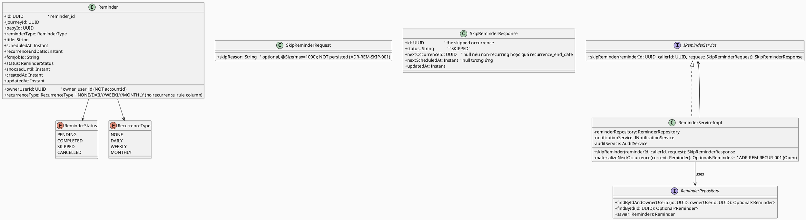
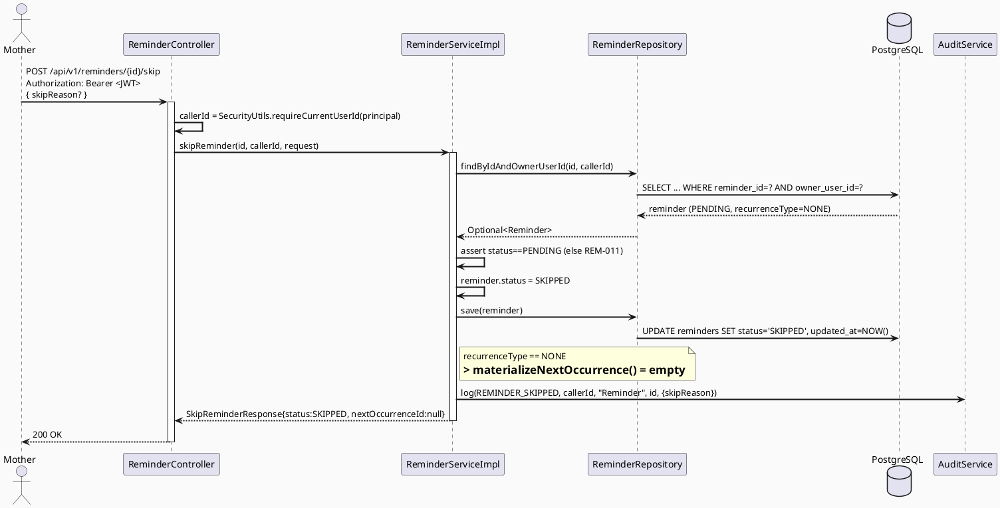
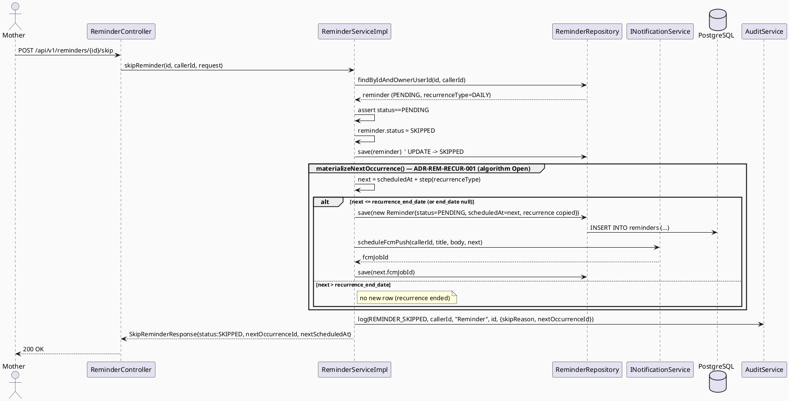
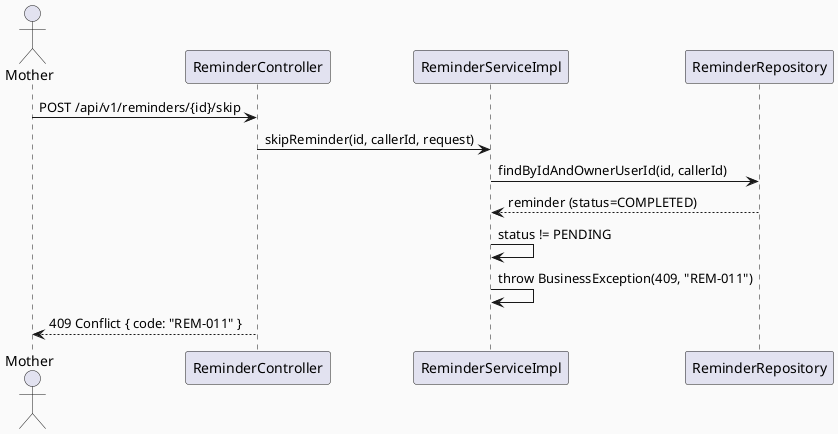
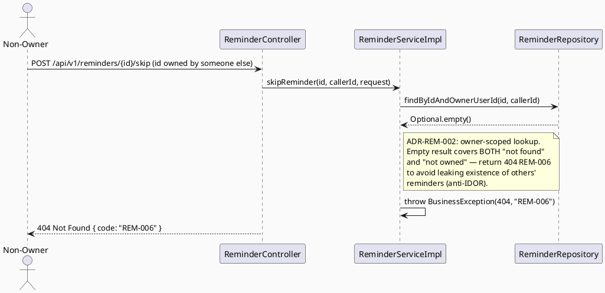
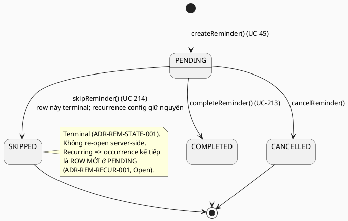

# ENGINEERING DOCUMENTATION STANDARD (EDS) v2.0
# Technical Design Specification — UC-214 Skip Reminder

| Field | Value |
|-------|-------|
| **Document ID** | `CB-REM-IMP-004` |
| **Version** | `1.0` |
| **Date** | `2026-07-03` |
| **Status** | `Draft` |
| **Document Owner** | `PhuongNT` |
| **Author** | `AI Agent` |
| **Reviewed by** | `[Tech Lead]` |
| **DPO Sign-off** | `[ ] Pending` |
| **Approved by** | `[Principal Architect]` |
| **Last Review** | `2026-07-03` |
| **Based on EDS** | `v2.0` |

---

## CHANGELOG

> **Policy 4.4 — Immutable History:** Không bao giờ xóa thông tin cũ. Mọi thay đổi phải ghi vào bảng này.

| Ngày | Người thực hiện | Nội dung thay đổi |
|------|-----------------|-------------------|
| 2026-07-03 | AI Agent | Tạo tài liệu lần đầu cho UC-214 Skip Reminder (Draft) |

---

## MỤC LỤC

1. [Tổng quan Module](#1-tổng-quan-module)
2. [Ma trận Truy vết](#2-ma-trận-truy-vết-traceability-matrix)
3. [Architecture Decision Records (ADR)](#3-architecture-decision-records-adr)
4. [Non-Functional Requirements & SLA](#4-non-functional-requirements--sla)
5. [Static Modeling](#5-static-modeling-mô-hình-tĩnh)
6. [Dynamic Modeling](#6-dynamic-modeling-mô-hình-động)
7. [Domain Event Catalog](#7-domain-event-catalog)
8. [Interface Specification](#8-interface-specification-đặc-tả-giao-diện)
9. [API Specification](#9-api-specification)
10. [Bảng mã lỗi](#10-bảng-mã-lỗi-error-codes)
11. [Quy trình Triển khai](#11-quy-trình-triển-khai-step-by-step)
12. [Rollback & Incident Runbook](#12-rollback--incident-runbook)
13. [Kịch bản Kiểm thử Chi tiết](#13-kịch-bản-kiểm-thử-chi-tiết)
14. [Phương pháp Xác minh](#14-phương-pháp-xác-minh)
15. [Mẫu thử thực tế (API Verification Samples)](#15-mẫu-thử-thực-tế-api-verification-samples)
16. [Bảng tổng hợp phân quyền (Authorization Matrix)](#16-bảng-tổng-hợp-phân-quyền-authorization-matrix)
17. [AI Prompt Constraints (CASE 2.0)](#17-ai-prompt-constraints-case-20)

---

## 1. Tổng quan Module

> Cho phép Mother bỏ qua **một lần xuất hiện (occurrence)** của reminder mà **không xóa cấu hình recurrence**. Nếu reminder có lặp lại, các lần nhắc nhở tiếp theo trong lịch trình không bị ảnh hưởng.

| Field | Value |
|-------|-------|
| **Module Name** | `SkipReminder` |
| **Bounded Context** | `reminder` |
| **UC ID** | `UC-214` |
| **SRS Reference** | `§3.3.16.3 Skip Reminder` |
| **Primary Actor** | `Mother (ROLE_MOTHER)` |
| **Secondary Actors** | `Firebase Cloud Messaging (FCM)` |
| **Platform** | `Mobile App` |
| **Priority / Frequency** | `Medium / Regular` (SRS) |
| **Data Classification** | `PII` |
| **Compliance Scope** | `BR-RBAC, BR-SAFETY, PDPA` |
| **Upstream Dependencies** | `auth (JWT), reminders table, notification (FCM), audit` |
| **Downstream Consumers** | `reminder detail (UC-212), notification delivery, audit trail` |

**Mô tả:** Mother chọn "Bỏ qua lần này" trên một reminder đang `PENDING`. Hệ thống chuyển **chính occurrence đó** sang trạng thái `SKIPPED` (terminal cho row hiện tại), giữ nguyên cấu hình `recurrence_type` / `recurrence_end_date`. Nếu reminder là recurring và chưa quá `recurrence_end_date`, hệ thống materialize **occurrence kế tiếp** thành một row `reminders` mới ở trạng thái `PENDING` (xem ADR-REM-RECUR-001 — cơ chế tính toán còn `Open`). Hệ thống **KHÔNG** đề xuất liều thuốc, chẩn đoán, hay trì hoãn định tuyến khẩn cấp (BR-SAFETY).

---

## 2. Ma trận Truy vết (Traceability Matrix)

> Ánh xạ: [Mã yêu cầu] → [Thành phần Code] → [Mục tiêu Tuân thủ].

| Requirement ID | Loại | Mô tả yêu cầu | Thành phần Code | Compliance Target | ADR liên quan |
|----------------|------|---------------|-----------------|-------------------|---------------|
| UC-214 | Use Case | Mother bỏ qua một occurrence của reminder | `ReminderController.skipReminder()` | BR-RBAC | ADR-REM-STATE-001 |
| BR-REM-020 | Business Rule | Chỉ owner mới được skip reminder của mình | `ReminderRepository.findByIdAndOwnerUserId()` | BR-PRIVACY | ADR-REM-002 |
| BR-REM-021 | Business Rule | Skip chuyển `PENDING → SKIPPED`; các trạng thái terminal khác bị từ chối (409) | `ReminderServiceImpl.skipReminder()` | Data Integrity | ADR-REM-STATE-001 |
| BR-REM-022 | Business Rule | Skip **không** xóa `recurrence_type`/`recurrence_end_date`; occurrence kế tiếp được materialize (nếu recurring & còn hạn) | `ReminderServiceImpl.materializeNextOccurrence()` | Data Integrity | ADR-REM-RECUR-001 |
| BR-REM-023 | Business Rule | `skipReason` (optional) **không** được persist vào bảng `reminders` (không có column); chỉ ghi vào audit details | Request DTO + `AuditService.log()` | PDPA | ADR-REM-SKIP-001 |
| BR-SAFETY-002 | Business Rule | Response/audit không đề xuất liều thuốc hay xác nhận chẩn đoán | Response mapping policy | BR-SAFETY | — |

---

## 3. Architecture Decision Records (ADR)

### ADR-REM-002 — Owner-only access cho reminders *(reused — do NOT redefine)*

| Field | Value |
|-------|-------|
| **Status** | `Accepted` |
| **Source** | `CB-REM-IMP-002 §3 (UC-212)` |
| **Date** | `2026-06-26` |

> Reminders là private health data của Mother. Chỉ `reminder.owner_user_id == caller` mới được xem hoặc mutate (skip/complete/cancel). Không chia sẻ với care group members hay Expert. UC-214 **tái sử dụng nguyên trạng** quyết định này cho thao tác skip: từ chối `REM-004 / 403` nếu caller không phải owner. Chi tiết đầy đủ xem TDS CB-REM-IMP-002.

---

### ADR-REM-STATE-001 — Terminal-state convention cho reminder occurrences *(shared reminder-batch ADR)*

| Field | Value |
|-------|-------|
| **Status** | `Proposed` |
| **Deciders** | `Tech Lead` |
| **Date** | `2026-07-03` |
| **Applies to** | `UC-213 (Complete), UC-214 (Skip), UC-cancel` |

#### Bối cảnh (Context)
`ReminderStatus` (code thực tế) có 4 giá trị: `PENDING, COMPLETED, SKIPPED, CANCELLED`. Cần một quy ước nhất quán về việc trạng thái nào là **terminal** (không thể chuyển tiếp) để các UC mutate (complete/skip/cancel) không xung đột và giữ được audit trail. UC-213 (Complete Reminder) là sibling được draft song song và chia sẻ ADR này (nếu UC-213 tồn tại vào thời điểm review, phải giữ cùng ID và nội dung).

#### Các phương án đã xem xét (Options Considered)

| Phương án | Mô tả | Ưu điểm | Nhược điểm |
|-----------|-------|----------|------------|
| A | `COMPLETED`, `SKIPPED`, `CANCELLED` là terminal; chỉ `PENDING` mới mutate được. Row cũ được giữ nguyên (append-only tinh thần) | Audit rõ ràng, không mất lịch sử, đơn giản | Recurring cần cơ chế materialize occurrence mới (xem ADR-REM-RECUR-001) |
| B | Cho phép re-open (SKIPPED → PENDING) qua Undo | Hỗ trợ nút "Hoàn tác" ở UI mockup | Phức tạp, mơ hồ về audit, không có yêu cầu SRS |

#### Quyết định (Decision)
Chọn **Phương án A**: `COMPLETED / SKIPPED / CANCELLED` là **terminal**. Skip chỉ hợp lệ khi occurrence đang `PENDING`. Skip trên row đã terminal → `REM-011 / 409 Conflict`. Row bị skip **không bị xóa** — giữ lại phục vụ audit.

> **Ghi chú về nút "Hoàn tác" ở UI mockup** (`code.html`, `undoSkip()`): mockup có nút "Hoàn tác". Quyết định A coi SKIPPED là terminal (không re-open server-side). Undo do đó chỉ là **client-side optimistic UI** trong khoảng grace-period trước khi request skip thực sự được gửi — hoặc là một UC riêng chưa được định nghĩa trong SRS. **`Open`** — cần Tech Lead xác nhận ngữ nghĩa Undo trước khi Approved.

#### Hệ quả (Consequences)
**Tích cực:** Audit trail đầy đủ; ngữ nghĩa trạng thái nhất quán toàn batch reminder.
**Trade-offs:** Recurring reminders cần cơ chế materialize occurrence kế tiếp — đẩy sang ADR-REM-RECUR-001.
**Compliance Impact:** Phù hợp PDPA (không mất dữ liệu health-related).

---

### ADR-REM-RECUR-001 — Cơ chế materialize occurrence kế tiếp khi skip/complete *(recurrence mechanism — Open)*

| Field | Value |
|-------|-------|
| **Status** | `Proposed` — cơ chế tính toán còn `Open` |
| **Deciders** | `Tech Lead, Principal Architect` |
| **Date** | `2026-07-03` |

#### Bối cảnh (Context)
SRS §3.3.16.3 quy định skip "without deleting the recurrence configuration" — bỏ qua MỘT occurrence không được dừng các lần nhắc nhở tiếp theo. UI mockup xác nhận: "Chỉ lần này" + "Các lần nhắc nhở tiếp theo trong lịch trình sẽ không thay đổi" + hiển thị "Lần nhắc kế tiếp: Mai, 08:30".

**Sự thật về schema hiện tại (code ground truth):** Entity `Reminder` **KHÔNG** có column `recurrence_rule`. Recurrence được biểu diễn bằng `recurrence_type` (enum `NONE/DAILY/WEEKLY/MONTHLY`) + `recurrence_end_date` (`Instant`, nullable). UC-45 (Create) hiện chỉ lưu **một row** với `recurrence_type`; **không** có scheduler/cơ chế nào materialize các occurrence tương lai được tìm thấy trong codebase. Do đó "occurrence kế tiếp" là **chưa được hiện thực ở bất kỳ đâu**.

#### Các phương án đã xem xét (Options Considered)

| Phương án | Mô tả | Ưu điểm | Nhược điểm |
|-----------|-------|----------|------------|
| A | Khi skip một recurring occurrence: đánh dấu row hiện tại `SKIPPED` (terminal) + INSERT một row `reminders` MỚI ở `PENDING` với `scheduled_at` = occurrence kế tiếp tính từ `recurrence_type`, sao chép nguyên `recurrence_type`/`recurrence_end_date`, schedule FCM mới | Giữ audit từng occurrence; nhất quán terminal-state | Cần thuật toán tính "next occurrence" (chưa được document) |
| B | Một-row: skip chỉ set `SKIPPED`, một scheduler ngoài scope re-fire dựa trên `recurrence_type` | Ít row hơn | Mâu thuẫn terminal-state (row terminal lại re-fire); scheduler chưa tồn tại |

#### Quyết định (Decision)
Chọn **Phương án A** làm hướng thiết kế (materialize row kế tiếp). **NHƯNG** thuật toán tính `scheduled_at` của occurrence kế tiếp là **`Open`** và phải được Tech Lead chốt trước khi Approved, vì các điểm sau **không được document ở bất kỳ nguồn nào**:

- **`Open-1`:** Bước nhảy chính xác cho mỗi `recurrence_type` (giả định trực giác: `DAILY`=+1 ngày, `WEEKLY`=+7 ngày, `MONTHLY`=+1 tháng calendar) — chưa có nguồn xác nhận.
- **`Open-2`:** Xử lý timezone / giờ-trong-ngày. `scheduled_at` lưu dạng `Instant` (UTC); mockup hiển thị theo giờ địa phương ("08:30"). Cách bảo toàn giờ-trong-ngày qua DST/timezone chưa được định nghĩa.
- **`Open-3`:** Xử lý biên `MONTHLY` cho ngày 29–31 (vd 31/01 → tháng 2).
- **`Open-4`:** Điều kiện dừng: nếu occurrence kế tiếp > `recurrence_end_date` thì **không** tạo row mới. `recurrence_end_date` là `Instant` — so sánh theo mốc thời gian nào (đầu ngày / cuối ngày) chưa rõ.

> ⚠️ **Không được bịa (invent) thuật toán recurrence trong lúc implement.** Nếu các Open trên chưa được chốt, phần materialize occurrence kế tiếp phải được **feature-flag OFF** và skip chỉ set `SKIPPED` (an toàn, không mất recurrence config). Xem C-guard trong §17.

#### Hệ quả (Consequences)
**Tích cực:** Thiết kế skip không phá vỡ recurrence config; đường tiến hoá rõ ràng.
**Trade-offs:** Occurrence-materialization bị chặn sau các Open item → có thể ship skip cơ bản (set `SKIPPED`) trước, materialization sau.
**Compliance Impact:** Không.

---

### ADR-REM-SKIP-001 — `skipReason` được nhận nhưng KHÔNG persist *(skip-reason — Open)*

| Field | Value |
|-------|-------|
| **Status** | `Proposed` — cần Tech Lead xác nhận |
| **Deciders** | `Tech Lead, DPO` |
| **Date** | `2026-07-03` |

#### Bối cảnh (Context)
UI mockup (`CB-274`) có textarea optional: "Lý do bỏ qua (không bắt buộc)" (`id="skip-reason"`, placeholder "Ví dụ: Đã uống sớm hơn, Hết thuốc..."). **Bảng `reminders` KHÔNG có column `skip_reason`** (xác nhận qua entity `Reminder.java` và các migration đã áp dụng). Không được tự ý thêm column mà không có migration + DPO sign-off.

#### Các phương án đã xem xét (Options Considered)

| Phương án | Mô tả | Ưu điểm | Nhược điểm |
|-----------|-------|----------|------------|
| A | API DTO nhận `skipReason` (optional, có `@Size` max-length); **không** persist vào `reminders`; ghi vào `audit` details (`AuditService.log(... details)`) | Không cần schema change; giữ được lý do cho audit | `skipReason` có thể chứa PII → audit phải được xử lý theo PDPA |
| B | Bỏ hoàn toàn `skipReason` (không nhận ở API) | Đơn giản nhất | Mất thông tin UI mockup mong muốn |
| C | Thêm column `skip_reason` + Flyway migration | Persist đầy đủ | Cần migration + DPO sign-off; ngoài scope batch hiện tại |

#### Quyết định (Decision)
Chọn **Phương án A** (đề xuất): API chấp nhận `skipReason` optional, validate độ dài (`REM-012` nếu vượt max), **không** ghi vào bảng `reminders`, chỉ đưa vào `AuditService.log(...)` details. **`Open`** — cần Tech Lead + DPO xác nhận rằng ghi `skipReason` vào audit là chấp nhận được về PDPA trước khi chuyển Approved. Nếu bị từ chối, fallback sang **Phương án B** (drop `skipReason`).

#### Hệ quả (Consequences)
**Tích cực:** Không thay đổi schema; khớp UI.
**Trade-offs:** `skipReason` là free-text người dùng → rủi ro PII trong audit log; cần review DPO.
**Compliance Impact:** PDPA — audit details có thể chứa PII, phải nằm trong phạm vi retention/audit đã được duyệt.

> *(Không xóa ADR cũ. Các ADR mới được đề xuất ở trạng thái `Proposed` — không được set Accepted khi tài liệu còn `Draft`.)*

---

## 4. Non-Functional Requirements & SLA

### 4.1. Performance & Availability

| Category | Requirement | Target SLA | Measurement Method | Compliance Basis |
|----------|-------------|------------|---------------------|------------------|
| Latency | POST skip response (p99) | `< 300ms` *(kế thừa mặc định module reminder; `Open` — chưa có SLA riêng trong SRS)* | k6 load test | — |
| Availability | Uptime (monthly) | `99.9%` | Uptime monitor | — |

> ⚠️ SRS §3.3.16.3 **không** quy định SLA riêng cho Skip. Giá trị trên kế thừa mặc định module reminder (tham chiếu UC-212/UC-45) và được đánh dấu `Open` cho tới khi Tech Lead xác nhận.

### 4.2. Data Integrity & Retention

| Category | Requirement | Target | Verification Method | Compliance Basis |
|----------|-------------|--------|---------------------|------------------|
| Preservation | Row bị skip không bị xóa | 100% | DB inspection (§14) | PDPA |
| Config integrity | `recurrence_type`/`recurrence_end_date` không bị null-hóa khi skip | 100% | DB inspection (§14) | Data Integrity |

### 4.3. Security

| Category | Requirement | Target | Verification Method | Compliance Basis |
|----------|-------------|--------|---------------------|------------------|
| Access control | Owner-only skip | 100% | Auth Matrix §16 | BR-RBAC |
| IDOR protection | Không skip được reminder của người khác qua ID | 100% | Security TC (§13) | BR-RBAC / CWE-639 |
| Safety | Không medication advice trong response/audit | 100% | Response schema (§8) | BR-SAFETY |

### 4.4. Scalability & Capacity Planning

Skip là thao tác write đơn lẻ trên một row (+ tối đa một INSERT nếu materialize occurrence kế tiếp). Không có concern scale đặc biệt so với baseline reminder module.

---

## 5. Static Modeling (Mô hình Tĩnh)

### 5.1. Class Diagram (PlantUML)



### 5.2. Data Structure (Flyway SQL Migration)

> **Kết luận schema-change:** **KHÔNG cần migration mới cho UC-214.** Bảng `reminders` đã có đủ mọi column cần thiết (`status`, `recurrence_type`, `recurrence_end_date`, `owner_user_id`, `updated_at`). Skip chỉ `UPDATE reminders SET status='SKIPPED'` và (tuỳ chọn) `INSERT` một row occurrence kế tiếp. Column `skip_reason` **không** được thêm (ADR-REM-SKIP-001). Nguồn xác thực: entity `Reminder.java` + migration `V20260627100300__add_reminder_columns.sql` (đã áp dụng).

> **Lưu ý về audit action:** Enum `AuditAction` (ground truth) hiện chỉ có `REMINDER_CREATED`. Implementation cần **thêm giá trị `REMINDER_SKIPPED`** vào `com.carebridge.backend.audit.entity.AuditAction`. Đây là thay đổi code (Java enum), **không** phải schema/Flyway migration.

---

## 6. Dynamic Modeling (Mô hình Động)

### 6.1. Sequence Diagram — Happy Path (Non-Recurring)



### 6.2. Sequence Diagram — Happy Path (Recurring, materialize next occurrence)



### 6.3. Sequence Diagram — Error Path (Already Terminal)



### 6.4. Sequence Diagram — Error Path (Ownership Denied / Not Found)



> **Ghi chú anti-IDOR (`Open`):** UC-212 hiện dùng `findById` rồi so `ownerUserId` và trả `REM-004 / 403` cho non-owner. UC-214 đề xuất dùng `findByIdAndOwnerUserId` (đã có sẵn trong repo) và trả `REM-006 / 404` cho cả not-found lẫn not-owned để **không lộ sự tồn tại** reminder của người khác (CWE-639). Chọn giữa 403 (nhất quán UC-212) vs 404 (an toàn hơn) là **`Open`** — cần Tech Lead chốt. Test-Spec cover cả hai qua oracle riêng.

### 6.5. State Machine — Reminder occurrence



> **⚠️ Invariant bất biến:**
> - INV-1: Chỉ `PENDING` mới có thể chuyển sang `SKIPPED`. Mọi transition khác → `REM-011`.
> - INV-2: Skip **không bao giờ** null-hóa hay xóa `recurrence_type` / `recurrence_end_date` của row bị skip.
> - INV-3: Skip **không bao giờ** xóa (DELETE) row — chỉ UPDATE `status`.

---

## 7. Domain Event Catalog

### 7.1. Events Published (Phát ra)

| Event Name | Trigger | Publisher | Subscriber(s) | Payload Schema | Async? |
|------------|---------|-----------|---------------|----------------|--------|
| `ReminderSkipped` | Occurrence chuyển sang `SKIPPED` thành công | `ReminderServiceImpl` | `AuditService` (log `REMINDER_SKIPPED`) | `ReminderSkipped.java` (xem §7.3) | No |

> **Hiện thực tối thiểu:** Batch reminder hiện dùng `AuditService.log(...)` trực tiếp (không phải event bus). `ReminderSkipped` được mô hình hoá như domain event nhưng implementation ban đầu là một lời gọi `auditService.log(AuditAction.REMINDER_SKIPPED, ...)` đồng bộ (nhất quán với UC-45 `REMINDER_CREATED`). Nếu về sau có event bus, payload dưới đây là hợp đồng.

### 7.2. Events Consumed (Tiêu thụ)

| Event Name | Source | Handler | Action thực hiện |
|------------|--------|---------|------------------|
| — | — | — | UC-214 không consume event nào |

### 7.3. Payload Schema

```java
// ReminderSkipped.java
public record ReminderSkipped(
    UUID    eventId,          // UUID.randomUUID() — deduplicate
    String  eventType,        // "ReminderSkipped"
    Instant occurredAt,       // Instant.now()
    String  version,          // "1.0"
    Payload payload,
    Metadata metadata
) {
    public record Payload(
        UUID    reminderId,        // occurrence bị skip
        UUID    ownerUserId,       // chủ sở hữu
        String  reminderType,      // APPOINTMENT/MEDICATION/VACCINATION
        String  recurrenceType,    // NONE/DAILY/WEEKLY/MONTHLY
        UUID    nextOccurrenceId,  // null nếu không materialize
        Instant nextScheduledAt    // null tương ứng
        // KHÔNG chứa skipReason ở payload sự kiện (PDPA) — chỉ audit details, ADR-REM-SKIP-001
    ) {}

    public record Metadata(
        UUID   correlationId,
        String causedBy            // ownerUserId (Mother thực hiện skip)
    ) {}
}
```

---

## 8. Interface Specification (Đặc tả Giao diện)

### 8.1. Service Interface

```java
// SkipReminderRequest.java — Input DTO
// @version 1.0
public class SkipReminderRequest {
    // Optional; UI "Lý do bỏ qua (không bắt buộc)". KHÔNG persist vào reminders (ADR-REM-SKIP-001).
    @Size(max = 1000, message = "REM-012")
    private String skipReason;
    // getters / setters
}

// SkipReminderResponse.java — Output DTO
// @version 1.0
public class SkipReminderResponse {
    private UUID    id;               // occurrence vừa bị skip
    private String  status;          // "SKIPPED"
    private UUID    nextOccurrenceId; // null nếu non-recurring hoặc recurrence đã kết thúc
    private Instant nextScheduledAt;  // null tương ứng
    private Instant updatedAt;
    // NO dosage, NO prescription, NO medical advice — BR-SAFETY-002
}

// IReminderService.java (addition)
// @version 1.1  (thêm skipReminder — non-breaking, chỉ add method)
public interface IReminderService {
    /**
     * Bỏ qua một occurrence của reminder (UC-214).
     * @throws BusinessException (REM-006 / 404) khi reminder không tồn tại HOẶC không thuộc caller
     * @throws BusinessException (REM-011 / 409) khi occurrence không ở trạng thái PENDING (đã terminal)
     * @throws BusinessException (REM-012 / 400) khi skipReason vượt quá độ dài cho phép
     * @throws BusinessException (REM-013 / 422) khi recurrenceType không hỗ trợ materialize (Open)
     */
    SkipReminderResponse skipReminder(UUID reminderId, UUID callerId, SkipReminderRequest request);
}
```

### 8.2. Repository Interface

```java
// ReminderRepository.java — đã tồn tại; KHÔNG cần method mới
// @version 1.0
public interface ReminderRepository extends JpaRepository<Reminder, UUID> {
    Optional<Reminder> findByIdAndOwnerUserId(UUID id, UUID ownerUserId); // dùng cho ownership-scoped lookup
    Optional<Reminder> findById(UUID id);
    // save() kế thừa từ JpaRepository — dùng cho UPDATE status và INSERT occurrence kế tiếp
    // KHÔNG có delete — skip chỉ UPDATE/INSERT (INV-3)
}
```

---

## 9. API Specification

### 9.1. Endpoints Table

| Method | Path | Auth Level | Required Roles | Rate Limit | Idempotent? |
|--------|------|------------|----------------|------------|-------------|
| `POST` | `/api/v1/reminders/{reminderId}/skip` | JWT Bearer | `ROLE_MOTHER` | 60/min *(`Open` — chưa có nguồn)* | No *(lần 2 → 409 REM-011)* |

### 9.2. Request / Response Schemas

#### `POST /api/v1/reminders/{reminderId}/skip`

**Request Body (optional):**
```json
{
  "skipReason": "Đã uống sớm hơn"
}
```

**Response — 200 OK (Non-Recurring):**
```json
{
  "id": "550e8400-e29b-41d4-a716-446655440000",
  "status": "SKIPPED",
  "nextOccurrenceId": null,
  "nextScheduledAt": null,
  "updatedAt": "2026-07-03T01:30:00.000Z"
}
```

**Response — 200 OK (Recurring, next occurrence materialized):**
```json
{
  "id": "550e8400-e29b-41d4-a716-446655440000",
  "status": "SKIPPED",
  "nextOccurrenceId": "550e8400-e29b-41d4-a716-446655440111",
  "nextScheduledAt": "2026-07-04T01:30:00.000Z",
  "updatedAt": "2026-07-03T01:30:00.000Z"
}
```

**Response — 409 Conflict (đã terminal):**
```json
{ "error": { "code": "REM-011", "message": "Reminder is not in a skippable state" } }
```

**Response — 404 Not Found (không tồn tại / không thuộc caller):**
```json
{ "error": { "code": "REM-006", "message": "Reminder not found" } }
```

**Response — 400 Bad Request (skipReason quá dài):**
```json
{ "error": { "code": "REM-012", "message": "skipReason exceeds maximum length" } }
```

---

## 10. Bảng mã lỗi (Error Codes)

> Tiền tố module: **`REM-`** (xác nhận qua code thực tế: `REM-001`, `REM-004`, `REM-006` đang dùng). UC-214 giới thiệu **`REM-011` → `REM-014`** (dải phân bổ tránh xung đột với sibling: UC-213 = REM-007..010, UC-215 = REM-015..018).

| Code | HTTP Status | Message (EN) | Message (VI) | Trigger Condition |
|------|-------------|--------------|--------------|-------------------|
| `REM-011` | 409 | Reminder is not in a skippable state | Nhắc nhở không ở trạng thái có thể bỏ qua | Occurrence không `PENDING` (đã `COMPLETED`/`SKIPPED`/`CANCELLED`) — INV-1 |
| `REM-012` | 400 | skipReason exceeds maximum length | Lý do bỏ qua vượt quá độ dài cho phép | `skipReason` > 1000 ký tự (ADR-REM-SKIP-001) |
| `REM-013` | 422 | Unsupported recurrence for next occurrence | Không hỗ trợ tính occurrence kế tiếp | `recurrenceType` không materialize được (ADR-REM-RECUR-001 — `Open`) |
| `REM-014` | 500 | Skip processing failed | Xử lý bỏ qua thất bại | Lỗi hệ thống khi UPDATE/INSERT hoặc hủy/tạo FCM job |
| `REM-006` *(reused)* | 404 | Reminder not found | Không tìm thấy nhắc nhở | ID không tồn tại HOẶC không thuộc caller (ownership-scoped lookup) |
| `REM-004` *(reused)* | 403 | Insufficient permissions | Không đủ quyền | *(chỉ dùng nếu Tech Lead chọn phương án 403 thay vì 404 cho non-owner — §6.4 Open)* |

---

## 11. Quy trình Triển khai (Step-by-Step)

### 11.1. Prerequisites

- [ ] ADR-REM-STATE-001, ADR-REM-RECUR-001, ADR-REM-SKIP-001 được chuyển `Accepted` (hiện `Proposed`)
- [ ] Các Open item (§3, §6.4) được Tech Lead chốt
- [ ] Table `reminders` đã tồn tại với `status`, `recurrence_type`, `recurrence_end_date` (đã có)

### 11.2. Pre-Migration Checklist

**Không áp dụng — UC-214 KHÔNG có schema change.** (Chỉ thêm Java enum `AuditAction.REMINDER_SKIPPED`, không phải migration.)

### 11.3. Implementation Steps

#### Chặng 1 — Thêm audit action + DTOs

```java
// AuditAction.java — thêm giá trị mới
REMINDER_SKIPPED,

// SkipReminderRequest.java, SkipReminderResponse.java — xem §8.1
```

#### Chặng 2 — Service: skipReminder()

```java
@Override
public SkipReminderResponse skipReminder(UUID reminderId, UUID callerId, SkipReminderRequest request) {
    // ADR-REM-002: ownership-scoped lookup (không lộ reminder người khác)
    Reminder reminder = reminderRepository.findByIdAndOwnerUserId(reminderId, callerId)
        .orElseThrow(() -> new BusinessException(HttpStatus.NOT_FOUND, "REM-006", "Reminder not found"));

    // INV-1 / ADR-REM-STATE-001: chỉ PENDING mới skip được
    if (reminder.getStatus() != ReminderStatus.PENDING) {
        throw new BusinessException(HttpStatus.CONFLICT, "REM-011",
            "Reminder is not in a skippable state");
    }

    // INV-2/INV-3: chỉ set status, giữ recurrence config, không DELETE
    reminder.setStatus(ReminderStatus.SKIPPED);
    reminderRepository.save(reminder);

    // ADR-REM-RECUR-001 (Open): materialize occurrence kế tiếp nếu recurring & còn hạn
    // NOTE: nếu Open-1..Open-4 chưa chốt => giữ feature-flag OFF, trả nextOccurrenceId=null
    Optional<Reminder> next = materializeNextOccurrence(reminder);

    // ADR-REM-SKIP-001: skipReason chỉ vào audit details, KHÔNG vào bảng reminders
    auditService.log(AuditAction.REMINDER_SKIPPED, callerId, "Reminder",
        reminder.getId().toString(), Map.of(
            "skipReason", request != null ? request.getSkipReason() : null,
            "nextOccurrenceId", next.map(r -> r.getId().toString()).orElse(null)));

    return SkipReminderResponse.builder()
        .id(reminder.getId())
        .status(reminder.getStatus().name())
        .nextOccurrenceId(next.map(Reminder::getId).orElse(null))
        .nextScheduledAt(next.map(Reminder::getScheduledAt).orElse(null))
        .updatedAt(reminder.getUpdatedAt())
        .build();
}
```

#### Chặng 3 — Controller

```java
// UC214: Skip reminder occurrence
@PostMapping("/{reminderId}/skip")
@PreAuthorize("hasRole('MOTHER')")
public ResponseEntity<ApiResponse<SkipReminderResponse>> skipReminder(
        @PathVariable UUID reminderId,
        @Valid @RequestBody(required = false) SkipReminderRequest request,
        Principal principal) {
    var callerId = SecurityUtils.requireCurrentUserId(principal);
    var response = reminderService.skipReminder(reminderId, callerId,
            request != null ? request : new SkipReminderRequest());
    return ResponseEntity.ok(ApiResponse.success(response, "Reminder skipped"));
}
```

#### Chặng 4 — Verification sau deploy

```bash
curl -X POST https://[host]/api/v1/reminders/{id}/skip \
  -H "Authorization: Bearer <MOTHER_JWT>" -H "Content-Type: application/json" -d '{}'
# Expected: 200 { "status": "SKIPPED" }
```

### 11.4. Deployment Checklist

- [ ] Skip PENDING non-recurring → 200, DB `status='SKIPPED'`
- [ ] Skip PENDING recurring → 200, row cũ `SKIPPED`, (nếu flag ON) row mới `PENDING`
- [ ] Skip already-terminal → 409 REM-011
- [ ] Non-owner / not-found → 404 REM-006 (hoặc 403 REM-004 theo quyết định §6.4)
- [ ] `recurrence_type`/`recurrence_end_date` của row bị skip KHÔNG bị null-hóa
- [ ] Response/audit không chứa medication dosage

---

## 12. Rollback & Incident Runbook

### 12.1. Điều kiện kích hoạt Rollback

| Điều kiện | Ngưỡng | Người quyết định |
|-----------|--------|------------------|
| Error rate tăng đột biến | > 5% trong 5 phút | On-call Engineer |
| Skip xóa nhầm recurrence config (INV-2 vi phạm) | Bất kỳ case | Tech Lead |
| Materialize tạo row sai thời điểm (recurrence bug) | Bất kỳ case | Tech Lead |

### 12.2. Rollback Procedure

**Không có DB migration** — chỉ rollback code:

```bash
# Revert implementation
git checkout -- 05_Development/CareBridgeAPI/src/main/java/com/carebridge/backend/reminder/
git checkout -- 05_Development/CareBridgeAPI/src/main/java/com/carebridge/backend/audit/entity/AuditAction.java

# Re-deploy phiên bản cũ
kubectl rollout undo deployment/carebridge-api
kubectl rollout status deployment/carebridge-api
curl -X GET https://[host]/api/v1/health   # Expected: {"status":"ok"}
```

> ⚠️ Nếu feature-flag materialize đã ON và đã tạo row occurrence kế tiếp sai, cần data-remediation thủ công (xoá các row PENDING vừa tạo sai) — Tech Lead + DPO quyết định.

### 12.3. Notification Protocol

| Thời điểm | Người nhận | Kênh |
|-----------|------------|------|
| Khi phát hiện | On-call team | Slack `#incident` |
| Nếu PII (skipReason) bị leak trong log | DPO | Email |

### 12.4. Post-Incident Review (PIR)

Hoàn thành PIR trong 48 giờ: Timeline, Root Cause (5 Whys), Impact, Remediation, Prevention.

---

## 13. Kịch bản Kiểm thử Chi tiết

> **Policy (EDS v2.0):** Mọi test dùng dữ liệu `SYNTHETIC`. Không dùng Production PII.

### 13.1. Unit Tests

#### TC-UNIT-001 — Owner skip PENDING non-recurring → SKIPPED

```gherkin
Feature: Skip Reminder
  Background:
    Given test data classification: SYNTHETIC
    And ownerUserId=U-001 là chủ của REM-001 (status=PENDING, recurrenceType=NONE)

  Scenario: Owner skips a one-off reminder
    When skipReminder(REM-001, U-001, {}) được gọi
    Then reminder.status == SKIPPED
    And response.nextOccurrenceId == null
    And recurrence_type của REM-001 KHÔNG bị null-hóa
```

#### TC-UNIT-002 — Owner skip PENDING recurring (DAILY) → SKIPPED + occurrence kế tiếp

```gherkin
  Scenario: Owner skips a recurring occurrence
    Given REM-002 (status=PENDING, recurrenceType=DAILY, recurrence_end_date=null)
    When skipReminder(REM-002, U-001, {}) được gọi (feature-flag materialize ON)
    Then REM-002.status == SKIPPED
    And một row mới status=PENDING được tạo với scheduled_at = old + 1 day  # Open-1
    And response.nextOccurrenceId != null
```

#### TC-UNIT-003 — Skip recurring đã quá recurrence_end_date → SKIPPED, KHÔNG tạo row mới

```gherkin
  Scenario: Recurrence already ended
    Given REM-003 (PENDING, recurrenceType=DAILY, recurrence_end_date đã qua)
    When skipReminder(REM-003, U-001, {}) được gọi
    Then REM-003.status == SKIPPED
    And KHÔNG có row mới nào được tạo
    And response.nextOccurrenceId == null
```

#### TC-UNIT-004 — Non-owner → từ chối (404 REM-006 hoặc 403 REM-004)

```gherkin
  Scenario: Non-owner attempts skip
    Given REM-001 thuộc U-001; caller = U-999
    When skipReminder(REM-001, U-999, {}) được gọi
    Then throws BusinessException REM-006 (404)  # theo §6.4 (Open: hoặc REM-004/403)
    And REM-001.status vẫn == PENDING (không side effect)
```

#### TC-UNIT-005 — Not found → 404 REM-006

```gherkin
  Scenario: Reminder không tồn tại
    When skipReminder(NONEXISTENT-UUID, U-001, {}) được gọi
    Then throws BusinessException REM-006 (404)
```

#### TC-UNIT-006 — Skip already-SKIPPED → 409 REM-011

```gherkin
  Scenario: Double skip rejected
    Given REM-004 (status=SKIPPED)
    When skipReminder(REM-004, U-001, {}) được gọi
    Then throws BusinessException REM-011 (409)
```

#### TC-UNIT-007 — Skip already-COMPLETED → 409 REM-011

```gherkin
  Scenario: Skip a completed reminder rejected
    Given REM-005 (status=COMPLETED)
    When skipReminder(REM-005, U-001, {}) được gọi
    Then throws BusinessException REM-011 (409)
```

#### TC-UNIT-008 — skipReason optional được nhận, KHÔNG persist vào reminders

```gherkin
  Scenario: skipReason goes to audit only
    Given REM-001 (PENDING)
    When skipReminder(REM-001, U-001, {skipReason:"Đã uống sớm hơn"}) được gọi
    Then reminder được set SKIPPED
    And AuditService.log(REMINDER_SKIPPED,...) chứa skipReason trong details
    And KHÔNG có column/field reminders nào lưu skipReason
```

#### TC-UNIT-009 — skipReason vượt max length → 400 REM-012

```gherkin
  Scenario: Oversized skipReason
    When skipReminder(REM-001, U-001, {skipReason: 1001-char-string})
    Then validation fails với REM-012 (400)
```

#### TC-UNIT-010 — Response/audit không chứa medication dosage (BR-SAFETY)

```gherkin
  Scenario: No medical advice in output
    When skipReminder(REM-001, U-001, {}) được gọi
    Then response JSON KHÔNG chứa "dosage" | "prescription" | "diagnos"
```

### 13.2. Integration Tests

#### TC-INT-001 — Full flow POST /skip trên recurring reminder (Testcontainers)

```gherkin
  Scenario: Skip recurring persists both rows
    Given DB có REM-002 (PENDING, DAILY, owner=U-001)
    When POST /api/v1/reminders/REM-002/skip với JWT của U-001
    Then response 200, status=SKIPPED
    And DB: REM-002.status == 'SKIPPED'
    And (flag ON) DB có đúng 1 row PENDING mới cùng owner_user_id, recurrence_type='DAILY'
```

### 13.3. E2E / Security Tests

#### TC-E2E-001 — Skip qua API

```gherkin
  Scenario: Happy path over HTTP
    Given U-001 có JWT hợp lệ, là owner của REM-001 (PENDING)
    When POST /api/v1/reminders/REM-001/skip
    Then response 200, body.status == "SKIPPED"

  Scenario: No JWT → 401
    When POST /api/v1/reminders/REM-001/skip không có JWT
    Then response 401

  Scenario: IDOR — skip reminder của người khác
    Given U-999 (JWT hợp lệ) và REM-001 thuộc U-001
    When POST /api/v1/reminders/REM-001/skip với JWT U-999
    Then response 404 (REM-006), REM-001.status vẫn PENDING
```

---

## 14. Phương pháp Xác minh

### 14.1. Database Inspection

```sql
-- Verify occurrence bị skip
SELECT reminder_id, owner_user_id, status, recurrence_type, recurrence_end_date, updated_at
FROM reminders WHERE reminder_id = '<uuid>';
-- Expected: status='SKIPPED', recurrence_type KHÔNG null (nếu vốn recurring)

-- Verify occurrence kế tiếp được tạo (nếu recurring, flag ON)
SELECT reminder_id, status, scheduled_at, recurrence_type
FROM reminders
WHERE owner_user_id = '<uuid>' AND status = 'PENDING' AND recurrence_type = 'DAILY'
ORDER BY scheduled_at DESC;

-- Verify KHÔNG có row nào bị DELETE (INV-3): so số row trước/sau
SELECT COUNT(*) FROM reminders WHERE owner_user_id = '<uuid>';
```

### 14.2. Log / Audit Verification

```bash
# Audit event REMINDER_SKIPPED được ghi
kubectl logs -l app=carebridge-api | grep '"REMINDER_SKIPPED"' | head -5

# Không có medication advice trong log
kubectl logs -l app=carebridge-api | grep -i "dosage\|prescription"
# Expected: No output
```

---

## 15. Mẫu thử thực tế (API Verification Samples)

### 15.1. Happy Path

```bash
# Skip a reminder (optional reason)
curl -X POST https://[host]/api/v1/reminders/550e8400-e29b-41d4-a716-446655440000/skip \
  -H "Authorization: Bearer <MOTHER_JWT>" \
  -H "Content-Type: application/json" \
  -H "X-Correlation-Id: $(uuidgen)" \
  -d '{ "skipReason": "Đã uống sớm hơn" }'
```

**Expected Response (200):**
```json
{
  "id": "550e8400-e29b-41d4-a716-446655440000",
  "status": "SKIPPED",
  "nextOccurrenceId": null,
  "nextScheduledAt": null,
  "updatedAt": "2026-07-03T01:30:00.000Z"
}
```

### 15.2. Error Paths

```bash
# Already terminal → 409
curl -X POST https://[host]/api/v1/reminders/<COMPLETED_ID>/skip \
  -H "Authorization: Bearer <MOTHER_JWT>" -d '{}'
# Expected: 409 {"error":{"code":"REM-011"}}

# Non-owner / not found → 404
curl -X POST https://[host]/api/v1/reminders/<OTHER_USER_REMINDER>/skip \
  -H "Authorization: Bearer <MOTHER_JWT>" -d '{}'
# Expected: 404 {"error":{"code":"REM-006"}}

# No JWT → 401
curl -X POST https://[host]/api/v1/reminders/<ID>/skip -d '{}'
# Expected: 401
```

---

## 16. Bảng tổng hợp phân quyền (Authorization Matrix)

| Endpoint | `GUEST` | `MOTHER (owner)` | `MOTHER (non-owner)` | `EXPERT` | `ADMIN` |
|----------|---------|------------------|----------------------|----------|---------|
| `POST /api/v1/reminders/:id/skip` | ❌ 401 | ✅ Own | ❌ 404 (REM-006) | ❌ 403 | ✅ All *(admin skip là `Open` — chưa có yêu cầu SRS)* |

**Chú thích:**
- ✅ = Được phép · ❌ = Bị từ chối · `Own` = chỉ với reminder của chính mình
- Enforcement: `@PreAuthorize("hasRole('MOTHER')")` (role gate) + ownership-scoped `findByIdAndOwnerUserId` (row gate) — ADR-REM-002.

---

## 17. AI Prompt Constraints (CASE 2.0)

### 17.1 Constraint Summary Table

| # | Constraint | Source (ADR/BR) | Last Verified |
|---|-----------|-----------------|---------------|
| C1 | Lookup PHẢI dùng `findByIdAndOwnerUserId(reminderId, callerId)`; empty → `REM-006/404`. KHÔNG lộ reminder người khác | ADR-REM-002 | 2026-07-03 |
| C2 | Skip chỉ hợp lệ khi `status == PENDING`; ngược lại throw `REM-011/409`. KHÔNG re-open terminal | ADR-REM-STATE-001 / BR-REM-021 | 2026-07-03 |
| C3 | Skip chỉ `UPDATE status='SKIPPED'`; KHÔNG null-hóa `recurrence_type`/`recurrence_end_date`; KHÔNG DELETE row | BR-REM-022 / INV-2 / INV-3 | 2026-07-03 |
| C4 | `skipReason` KHÔNG được persist vào `reminders` (không có column); chỉ vào `AuditService.log(... details)` | ADR-REM-SKIP-001 / BR-REM-023 | 2026-07-03 |
| C5 | `callerId` lấy từ `SecurityUtils.requireCurrentUserId(principal)` (JWT), KHÔNG từ URL/body | BR-RBAC | 2026-07-03 |
| C6 | Materialize occurrence kế tiếp: nếu thuật toán recurrence (Open-1..Open-4) CHƯA chốt → feature-flag OFF, trả `nextOccurrenceId=null`. KHÔNG bịa thuật toán | ADR-REM-RECUR-001 | 2026-07-03 |
| C7 | Response/audit KHÔNG chứa `dosage`, `prescription`, medical advice | BR-SAFETY-002 | 2026-07-03 |

### 17.2 Constraint Injection Block (Copy-Paste vào AI Prompt)

```
[CONSTRAINT BLOCK — Module: SkipReminder (CB-REM-IMP-004)]
Theo TDS CB-REM-IMP-004 và các ADR liên quan:

1. (C1 — ADR-REM-002) Dùng reminderRepository.findByIdAndOwnerUserId(reminderId, callerId);
   Optional.empty() => throw BusinessException(NOT_FOUND, "REM-006", ...). Không dùng findById rồi để lộ.
2. (C2 — ADR-REM-STATE-001) Nếu reminder.getStatus() != PENDING => throw BusinessException(CONFLICT, "REM-011", ...).
3. (C3 — INV-2/INV-3) Chỉ setStatus(SKIPPED) rồi save(); KHÔNG chạm recurrence_type/recurrence_end_date; KHÔNG delete().
4. (C4 — ADR-REM-SKIP-001) skipReason chỉ đưa vào auditService.log(REMINDER_SKIPPED, ... details); KHÔNG lưu vào entity Reminder.
5. (C5 — BR-RBAC) callerId = SecurityUtils.requireCurrentUserId(principal); không lấy từ path/body.
6. (C6 — ADR-REM-RECUR-001) materializeNextOccurrence: nếu Open-1..Open-4 chưa chốt, giữ flag OFF và trả null; KHÔNG tự bịa bước nhảy recurrence.
7. (C7 — BR-SAFETY-002) SkipReminderResponse không có field dosage/prescription/medical advice.

[CONTEXT BLOCK]
- Bounded Context: reminder
- Data Classification: PII
- Compliance: PDPA, BR-SAFETY, BR-RBAC
- Existing interfaces: §8 Service Interface + §8.2 Repository Interface (ReminderRepository đã có findByIdAndOwnerUserId)
- Error codes: §10 (REM-011..014 mới; REM-004/REM-006 reused)
- Auth matrix: §16
- Ground truth: entity Reminder dùng ownerUserId/scheduledAt(Instant); AuditAction cần thêm REMINDER_SKIPPED

[TASK BLOCK]
Implement IReminderService.skipReminder(reminderId, callerId, request) + endpoint POST /api/v1/reminders/{id}/skip
thỏa mãn C1–C7. Output tuân thủ §8. Tests cover §13.
```

### 17.3 Constraint Quality Checklist

- [x] Mỗi constraint traceable về ADR hoặc BR cụ thể
- [x] Không có constraint generic
- [x] Mỗi constraint có `Last Verified` ≤ 2 sprints
- [x] Constraint block có ≥ 3 constraints cụ thể
- [x] Reference §8 Interface + §16 Auth Matrix

### 17.4 Anti-Pattern Detection

| AP-ID | Anti-Pattern | Dấu hiệu | Hành động |
|-------|-------------|-----------|----------|
| AP-AI-001 | Unconstrained Gen | Code cho phép skip khi status != PENDING | Reject — C2 violation |
| AP-AI-003 | Implicit Decision | Code tự bịa thuật toán recurrence (vd hard-code +1 day) khi Open chưa chốt | Reject — C6/ADR-REM-RECUR-001 |
| AP-AI-003b | Implicit Decision | Code thêm column `skip_reason` / migration không được duyệt | Reject — C4/ADR-REM-SKIP-001 |
| AP-AI-005 | Hallucinated Contract | Code dùng `accountId` hay method không có trong §8 | Reject — ground truth dùng `ownerUserId` |

---

## PHỤ LỤC

### A. Glossary (Thuật ngữ)

| Thuật ngữ | Định nghĩa |
|-----------|------------|
| Skip | Bỏ qua MỘT occurrence của reminder mà không xóa cấu hình recurrence |
| Occurrence | Một lần xuất hiện cụ thể của reminder (một row `reminders`) |
| Terminal state | Trạng thái không thể chuyển tiếp: COMPLETED/SKIPPED/CANCELLED (ADR-REM-STATE-001) |
| Materialize | Tạo một row `reminders` mới cho occurrence kế tiếp của recurring reminder |
| Open item | Điểm thiết kế chưa có nguồn xác thực; cần Tech Lead chốt trước khi Approved |

### B. Tài liệu tham chiếu

| Document | Link / Path |
|----------|-------------|
| SRS §3.3.16.3 Skip Reminder | `02_Requirements/SRS/3_Functional_Specification.md` (~line 4605) |
| UC-45 Create Reminder TDS | `04_Implement/UC45_CreateAppointmentReminder/UC45_CreateAppointmentReminder_TDS.md` (CB-REM-IMP-001) |
| UC-212 View Reminder Detail TDS | `04_Implement/UC212_ViewReminderDetail/UC212_ViewReminderDetail_TDS.md` (CB-REM-IMP-002) |
| Reminder entity (ground truth) | `05_Development/CareBridgeAPI/src/main/java/com/carebridge/backend/reminder/entity/Reminder.java` |
| ReminderRepository (ground truth) | `05_Development/CareBridgeAPI/src/main/java/com/carebridge/backend/reminder/repository/ReminderRepository.java` |
| Migration (reminder columns) | `05_Development/CareBridgeAPI/src/main/resources/db/migration/V20260627100300__add_reminder_columns.sql` |
| UI/UX Mockup CB-274 | `03_Design/UI_UX/MobileAppScreen/CB-274 Skip Reminder (UC-214)/code.html` |
| EDS v2.0 Template | `08_References/Template/PHASE-3_TDS.md` |

---

*EDS v2.1 — Tích hợp CASE 2.0 AI Prompt Constraints (§17). Status: Draft — không được implement khi các ADR còn `Proposed` và Open item chưa chốt.*
