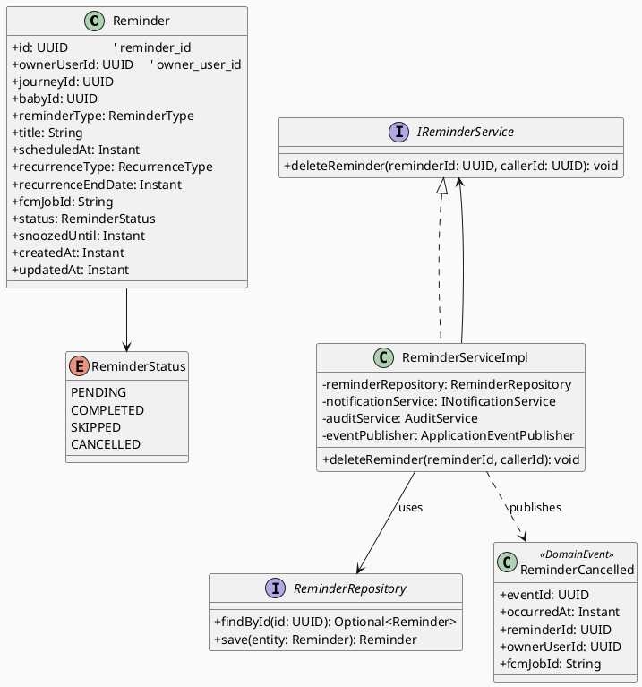
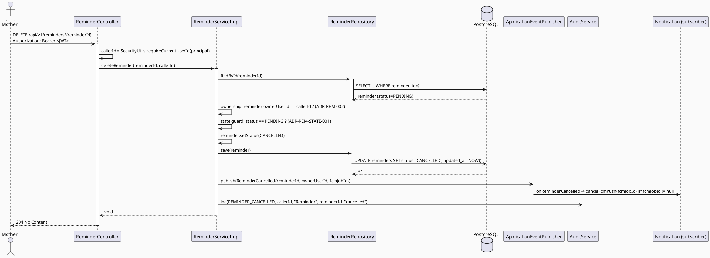
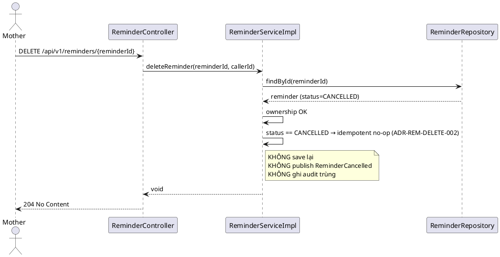
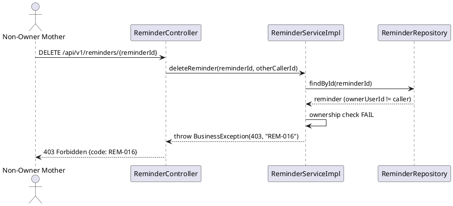
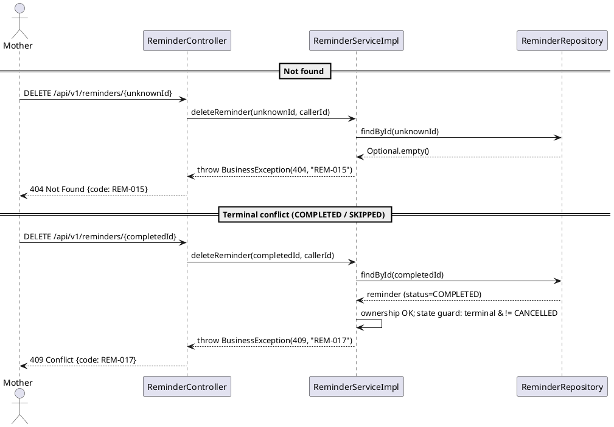
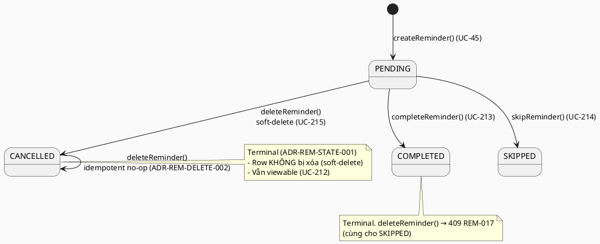

# ENGINEERING DOCUMENTATION STANDARD (EDS) v2.0
# Technical Design Specification — UC-215 Delete Reminder

| Field | Value |
|-------|-------|
| **Document ID** | `CB-REM-IMP-005` |
| **Version** | `1.0` |
| **Date** | `2026-07-03` |
| **Status** | `Draft` |
| **Document Owner** | `PhuongNT` |
| **Author** | `AI Agent` |
| **Reviewed by** | `[Tech Lead]` |
| **DPO Sign-off** | `[ ] Pending` |
| **Approved by** | `[Principal Architect]` |
| **Last Review** | `2026-07-03` |
| **Based on EDS** | `v2.0` |

---

## CHANGELOG

> **Policy 4.4 — Immutable History:** Không bao giờ xóa thông tin cũ. Mọi thay đổi phải ghi vào bảng này.

| Ngày | Người thực hiện | Nội dung thay đổi |
|------|-----------------|-------------------|
| 2026-07-03 | AI Agent | Tạo tài liệu lần đầu cho UC-215 Delete Reminder (soft-delete via CANCELLED) |

---

## MỤC LỤC

1. [Tổng quan Module](#1-tổng-quan-module)
2. [Ma trận Truy vết (Traceability Matrix)](#2-ma-trận-truy-vết-traceability-matrix)
3. [Architecture Decision Records (ADR)](#3-architecture-decision-records-adr)
4. [Non-Functional Requirements & SLA](#4-non-functional-requirements--sla)
5. [Static Modeling](#5-static-modeling-mô-hình-tĩnh)
6. [Dynamic Modeling](#6-dynamic-modeling-mô-hình-động)
7. [Domain Event Catalog](#7-domain-event-catalog)
8. [Interface Specification](#8-interface-specification-đặc-tả-giao-diện)
9. [API Specification](#9-api-specification)
10. [Bảng mã lỗi](#10-bảng-mã-lỗi-error-codes)
11. [Quy trình Triển khai](#11-quy-trình-triển-khai-step-by-step)
12. [Rollback & Incident Runbook](#12-rollback--incident-runbook)
13. [Kịch bản Kiểm thử Chi tiết](#13-kịch-bản-kiểm-thử-chi-tiết)
14. [Phương pháp Xác minh](#14-phương-pháp-xác-minh)
15. [Mẫu thử thực tế (API Verification Samples)](#15-mẫu-thử-thực-tế-api-verification-samples)
16. [Bảng tổng hợp phân quyền (Authorization Matrix)](#16-bảng-tổng-hợp-phân-quyền-authorization-matrix)
17. [AI Prompt Constraints (CASE 2.0)](#17-ai-prompt-constraints-case-20)

---

## 1. Tổng quan Module

> Mother xóa (disable) một reminder mà chính mình đã tạo. Thao tác được hiện thực dưới dạng **soft-delete** — chuyển `status` sang `CANCELLED` thay vì `DELETE FROM reminders` — để bảo toàn audit trail theo BR-PRIVACY.

| Field | Value |
|-------|-------|
| **Module Name** | `DeleteReminder` |
| **Bounded Context** | `reminder` |
| **UC ID** | `UC-215` |
| **SRS Reference** | `3.3.16.4` (Table 237) |
| **Primary Actor** | `Mother (ROLE_MOTHER)` |
| **Secondary Actors** | `Firebase Cloud Messaging (FCM)` |
| **Platform** | `Mobile App` |
| **Priority / Frequency** | `Medium` / `Occasional` (SRS Table 237) |
| **Data Classification** | `PII` |
| **Compliance Scope** | `BR-RBAC, BR-PRIVACY, PDPA` |
| **Upstream Dependencies** | `auth (JWT), reminders table` |
| **Downstream Consumers** | `notification (FCM job cancellation), audit` |

**Mô tả (SRS):** "Deletes or disables a Mother-created reminder." Chỉ owner của reminder mới được xóa. Xóa một reminder đang `PENDING` sẽ chuyển nó sang trạng thái terminal `CANCELLED` và hủy FCM push job đang chờ (nếu có). Hệ thống **KHÔNG** đưa ra tư vấn y tế trong bất kỳ response nào (BR-SAFETY — kế thừa từ toàn bộ reminder context).

> **Lưu ý so với UC-213/UC-214:** UC-215 có thêm **BR-PRIVACY** (ngoài BR-RBAC). BR-PRIVACY yêu cầu "health and family data must follow consent, purpose, and minimum-necessary access rules" và (Assumptions) "CareBridge retains data according to privacy and audit policies". Đây là cơ sở trực tiếp cho quyết định soft-delete (§3 ADR-REM-DELETE-001).

---

## 2. Ma trận Truy vết (Traceability Matrix)

| Requirement ID | Loại (BR/ADR/US) | Mô tả yêu cầu | Thành phần Code | Compliance Target | ADR liên quan |
|----------------|------------------|---------------|-----------------|-------------------|---------------|
| UC-215 | Use Case | Mother xóa/disable reminder của mình | `ReminderController.deleteReminder()` | BR-RBAC | ADR-REM-DELETE-001 |
| BR-RBAC | Business Rule | Users chỉ truy cập chức năng theo role/scope | `@PreAuthorize("hasRole('MOTHER')")` + ownership check | BR-RBAC | ADR-REM-002 |
| BR-PRIVACY | Business Rule | Health data theo consent/purpose/minimum-necessary + retention audit | `ReminderService.deleteReminder()` (soft-delete) | BR-PRIVACY, PDPA | ADR-REM-DELETE-001 |
| BR-REM-020 | Business Rule | Chỉ owner (`owner_user_id == caller`) được xóa reminder | `ReminderService.deleteReminder()` ownership guard | BR-RBAC, BR-PRIVACY | ADR-REM-002 |
| BR-REM-021 | Business Rule | `CANCELLED` là trạng thái terminal — không transition tiếp | `ReminderService` state guard | Data Integrity | ADR-REM-STATE-001 |
| BR-REM-022 | Business Rule | Delete lại reminder đã `CANCELLED` là idempotent success (no-op) | `ReminderService.deleteReminder()` | — | ADR-REM-DELETE-002 |
| BR-REM-023 | Business Rule | Hủy FCM job đang chờ khi cancel reminder | `ReminderCancelled` event → `INotificationService.cancelFcmPush()` | — | ADR-REM-DELETE-003 |

---

## 3. Architecture Decision Records (ADR)

### ADR-REM-002 — Owner-only access cho reminders *(reuse — xem CB-REM-IMP-002)*

| Field | Value |
|-------|-------|
| **Status** | `Accepted` |
| **Deciders** | `Tech Lead` |
| **Date** | `2026-06-26` |

> Kế thừa nguyên trạng từ UC-212 (`CB-REM-IMP-002 §3`). Reminders là private data của Mother; không chia sẻ với care group; Expert không được truy cập. UC-215 **tái sử dụng** quyết định này để ràng buộc rằng chỉ `owner_user_id == caller` mới được xóa reminder. Không định nghĩa lại — chỉ trích dẫn.

---

### ADR-REM-STATE-001 — Terminal-state convention cho ReminderStatus *(shared reminder convention)*

| Field | Value |
|-------|-------|
| **Status** | `Accepted` |
| **Deciders** | `Tech Lead` |
| **Date** | `2026-06-27` |

#### Bối cảnh
Enum `ReminderStatus` thực tế (mã nguồn `reminder/entity/ReminderStatus.java`) gồm `PENDING, COMPLETED, SKIPPED, CANCELLED`. Các UC hành động trên reminder (UC-213 Complete, UC-214 Skip, UC-215 Delete) cần một quy ước chung về việc trạng thái nào là terminal để tránh ghi đè lịch sử hoàn thành/bỏ qua.

#### Quyết định
`COMPLETED`, `SKIPPED`, và `CANCELLED` là **terminal**. Một khi reminder ở trạng thái terminal, **không** có transition nào rời khỏi trạng thái đó (append-only spirit đối với kết quả cuối cùng). Chỉ `PENDING` mới transition được sang một trong ba terminal states. Đây cùng nguyên tắc mà UC-213/UC-214 áp dụng (state machine tại `CB-REM-IMP-001 §6.3`).

#### Hệ quả
- **Tích cực:** Bảo toàn lịch sử — một reminder đã `COMPLETED` không thể bị "delete" thành `CANCELLED`, tránh mất dữ liệu completion mà báo cáo/tuân thủ dựa vào.
- **Trade-off:** Mother không thể "xóa" một reminder đã COMPLETED/SKIPPED khỏi hệ thống qua endpoint này (sẽ nhận 409 — REM-017). Việc ẩn khỏi danh sách UI (archive) là mối quan tâm khác, **Open** cho product (§ Open Items).

---

### ADR-REM-DELETE-001 — Soft-delete reminder qua `status = CANCELLED` (Proposed)

| Field | Value |
|-------|-------|
| **Status** | `Proposed` — cần Tech Lead sign-off |
| **Deciders** | `Tech Lead (pending), Principal Architect (pending)` |
| **Date** | `2026-07-03` |

#### Bối cảnh (Context)
SRS mô tả UC-215 là "Deletes or disables a Mother-created reminder" và bổ sung **BR-PRIVACY** ("health and family data must follow consent, purpose, and minimum-necessary access rules") cùng Assumption "CareBridge retains data according to privacy and audit policies". Reminders chứa dữ liệu sức khỏe (lịch thuốc, tái khám). Cần chọn cơ chế xóa vừa đáp ứng ý định người dùng vừa giữ được audit trail cho retention/tuân thủ. Enum `ReminderStatus` thực tế **đã có sẵn** giá trị `CANCELLED`, và cột `status` là `VARCHAR(20)` (không phải DB enum type) — nên không cần thay đổi schema để hiện thực soft-delete.

#### Các phương án đã xem xét (Options Considered)

| Phương án | Mô tả | Ưu điểm | Nhược điểm |
|-----------|-------|----------|------------|
| A | Hard delete: `DELETE FROM reminders WHERE reminder_id=?` | + Đơn giản; + Giải phóng dung lượng | - Mất audit trail (BR-PRIVACY retention vi phạm); - Không truy vết được lịch sử cho báo cáo; - UC-212 giả định "CANCELLED reminders vẫn viewable" sẽ mất ý nghĩa |
| B | Soft-delete: `status → CANCELLED`, giữ nguyên row | + Bảo toàn audit trail (BR-PRIVACY); + Tận dụng `CANCELLED` đã tồn tại — **không cần migration**; + Nhất quán với UC-212 (CANCELLED vẫn viewable) | - Row vẫn chiếm dung lượng; - Cần lọc CANCELLED khỏi các list "active" ở tầng đọc |
| C | Thêm cột `deleted_at` (soft-delete kiểu tombstone riêng) | + Tách biệt "deleted" khỏi "cancelled" | - **Cần Flyway migration mới**; - Nhân đôi ngữ nghĩa với `CANCELLED` sẵn có → phức tạp thừa |

#### Quyết định (Decision)
Chọn **Phương án B**: hiện thực Delete Reminder như **soft-delete** bằng cách set `status = CANCELLED`. Không hard-delete. Không thêm cột mới. Cơ sở: (1) BR-PRIVACY + Assumption về retention/audit; (2) giá trị `CANCELLED` đã tồn tại trong enum thực tế; (3) cột `status` là VARCHAR → không cần migration; (4) nhất quán với UC-212 vốn giả định CANCELLED vẫn xem được.

#### Hệ quả (Consequences)
**Tích cực:**
- Audit trail được bảo toàn — đáp ứng BR-PRIVACY retention và cho phép reconciliation với completion/skip history của các reminder khác.
- **Không cần schema change** (xem §5.2 và § Schema-change conclusion).

**Tiêu cực / Trade-offs:**
- Các endpoint "list active reminders" (ngoài scope UC-215) phải lọc `status != CANCELLED`. Giảm thiểu: ghi rõ trong §5.2 note; là trách nhiệm của UC list tương ứng.

**Compliance Impact:**
- PDPA: dữ liệu vẫn được giữ theo purpose retention; không xóa cứng dữ liệu sức khỏe khỏi audit scope.

> **Status = Proposed**: đây là quyết định thực chất, có hệ quả, cần **Tech Lead sign-off** trước khi implement (§11 Prerequisites). Cơ chế bản thân (CANCELLED) đã cụ thể — **không** để Open.

---

### ADR-REM-DELETE-002 — Idempotent re-delete (already-CANCELLED → success no-op)

| Field | Value |
|-------|-------|
| **Status** | `Proposed` — cần Tech Lead sign-off |
| **Deciders** | `Tech Lead (pending)` |
| **Date** | `2026-07-03` |

#### Bối cảnh
Client (mobile) có thể gọi DELETE hai lần (double-tap, retry sau timeout mạng). Cần quyết định hành vi khi target reminder **đã** ở `CANCELLED`.

#### Các phương án đã xem xét

| Phương án | Mô tả | Ưu điểm | Nhược điểm |
|-----------|-------|----------|------------|
| A | Trả lỗi 409 "already cancelled" | + Rõ ràng trạng thái đã terminal | - UX xấu cho thao tác delete; - Vi phạm tính idempotent kỳ vọng của HTTP DELETE (RFC 9110 §9.2.2) |
| B | Idempotent success — no-op, trả `204 No Content` | + An toàn với retry; + Đúng ngữ nghĩa idempotent của DELETE; + UX tốt | - Không phân biệt được "vừa xóa" với "đã xóa từ trước" (chấp nhận được cho delete) |

#### Quyết định
Chọn **Phương án B**: DELETE trên một reminder đã `CANCELLED` trả về **`204 No Content`** (idempotent success), **không** phát lại event `ReminderCancelled`, **không** ghi audit trùng. Đây là design choice của tác giả, phù hợp ngữ nghĩa idempotent của HTTP DELETE.

#### Hệ quả
- Tích cực: retry-safe; đúng chuẩn REST.
- Trade-off: audit chỉ ghi 1 lần (ở lần cancel đầu). Chấp nhận được — không mất thông tin.

---

### ADR-REM-DELETE-003 — Hủy FCM job qua domain event `ReminderCancelled`

| Field | Value |
|-------|-------|
| **Status** | `Proposed` — cần Tech Lead sign-off |
| **Deciders** | `Tech Lead (pending)` |
| **Date** | `2026-07-03` |

#### Bối cảnh
Reminder `PENDING` có thể có `fcm_job_id` trỏ tới một scheduled push job (đặt khi tạo — UC-45). Khi cancel reminder, push đó không nên gửi nữa. Cần một cơ chế hủy job có độ decoupling hợp lý giữa `reminder` và `notification` context.

#### Các phương án đã xem xét

| Phương án | Mô tả | Ưu điểm | Nhược điểm |
|-----------|-------|----------|------------|
| A | Gọi thẳng `notificationService.cancelFcmPush()` synchronous trong `deleteReminder()` | + Đơn giản; + Nhất quán với create (scheduleFcmPush là synchronous) | - Coupling chặt reminder→notification; - Lỗi FCM có thể chặn cancel |
| B | Phát domain event `ReminderCancelled`; notification context subscribe và hủy job | + Decoupled; + Cancel reminder thành công độc lập với FCM; + Dễ mở rộng subscriber (audit, analytics) | - Cần event infra (Spring `ApplicationEventPublisher`) |

#### Quyết định
Chọn **Phương án B**: sau khi soft-delete thành công, `ReminderService` publish `ReminderCancelled` (§7). Notification context tiêu thụ event và gọi `INotificationService.cancelFcmPush(fcmJobId)` nếu `fcmJobId != null`.

#### Hệ quả
- Tích cực: cancel reminder không phụ thuộc vào FCM khả dụng; audit/analytics có thể subscribe thêm.
- **Trade-off / OPEN:** Method `cancelFcmPush(String fcmJobId)` **chưa tồn tại** trong `INotificationService` (hiện chỉ có `scheduleFcmPush`, dù javadoc của nó ghi "return FCM job ID **for later cancellation**"). Cơ chế hủy job ở tầng FCM/scheduler thực tế là **Open** (xem § Open Items) — hiện `DummyNotificationService` trả `"dummy-job-id"` và chưa có scheduler thật để hủy. Contract `cancelFcmPush` được **đề xuất** ở đây (§8); implementation thật để Open.

---

## 4. Non-Functional Requirements & SLA

### 4.1. Performance & Availability

| Category | Requirement | Target SLA | Measurement Method | Compliance Basis |
|----------|-------------|------------|---------------------|------------------|
| Latency | DELETE response (p99) | `< 200ms` | k6 load test | — |
| Availability | Uptime (monthly) | `99.9%` | Uptime monitor | — |

> Frequency of Use = **Occasional** (SRS Table 237) → không đặt throughput cao; không có SLA riêng ngoài baseline. Không phát minh SLA không có trong nguồn.

### 4.2. Data Integrity & Retention

| Category | Requirement | Target | Verification Method | Compliance Basis |
|----------|-------------|--------|---------------------|------------------|
| Retention | Reminder row giữ lại sau delete (soft-delete) | Row tồn tại với `status=CANCELLED` | DB inspection §14.1 | BR-PRIVACY, PDPA |
| Audit | Ghi `REMINDER_CANCELLED` audit event | 1 event / lần cancel đầu tiên | Audit log §14.2 | BR-PRIVACY, POST-3 |
| Consistency | Idempotent re-delete không tạo audit trùng | Đúng 1 audit event | Audit log | ADR-REM-DELETE-002 |

### 4.3. Security

| Category | Requirement | Target | Verification Method | Compliance Basis |
|----------|-------------|--------|---------------------|------------------|
| Access control | Owner-only delete | 100% | Auth Matrix §16 | BR-RBAC, ADR-REM-002 |
| Encryption in transit | Endpoint qua TLS | TLS 1.2+ | Infra baseline | PDPA |

### 4.4. Scalability & Capacity Planning

> Tải dự kiến thấp (Occasional). Soft-delete chỉ là 1 UPDATE + 1 event publish. Không cần chiến lược scale riêng.

---

## 5. Static Modeling (Mô hình Tĩnh)

### 5.1. Class Diagram (PlantUML)



### 5.2. Data Structure (Flyway SQL Migration)

> **Kết luận schema change: KHÔNG cần migration mới cho UC-215.**
> - Bảng `reminders` đã tồn tại (UC-45) với cột `status VARCHAR(20) NOT NULL DEFAULT 'PENDING'` (map từ `@Enumerated(EnumType.STRING)` — xem `reminder/entity/Reminder.java`).
> - Giá trị `CANCELLED` **đã có** trong enum `ReminderStatus` (mã nguồn thực tế). Vì `status` là `VARCHAR` (không phải Postgres enum type), không cần `ALTER TYPE ... ADD VALUE`.
> - Soft-delete chỉ là `UPDATE reminders SET status='CANCELLED', updated_at=NOW() WHERE reminder_id=?`.

**Thay đổi non-schema cần có (code-only, không phải Flyway):**
- Thêm giá trị `REMINDER_CANCELLED` vào enum Java `com.carebridge.backend.audit.entity.AuditAction` (hiện chỉ có `REMINDER_CREATED`). Đây là thay đổi code Java, **không** phải schema migration (audit_log lưu action dạng string).

```sql
-- KHÔNG có file migration mới. Tham chiếu để verify (read-only):
-- Cột status đã tồn tại từ baseline reminders (UC-45).
-- Soft-delete DML (chạy bởi JPA save, không phải migration):
--   UPDATE reminders SET status = 'CANCELLED', updated_at = NOW()
--   WHERE reminder_id = :reminderId AND owner_user_id = :callerId;
```

> **Quy tắc đặt tên:** column dùng snake_case (`reminder_id`, `owner_user_id`, `fcm_job_id`) — khớp với entity thực tế.

---

## 6. Dynamic Modeling (Mô hình Động)

### 6.1. Sequence Diagram — Happy Path (delete PENDING reminder)



### 6.2. Sequence Diagram — Already-CANCELLED (idempotent no-op)



### 6.3. Sequence Diagram — Ownership denied (403)



### 6.4. Sequence Diagram — Not found (404) & Terminal conflict (409)



### 6.5. State Machine — ReminderStatus (UC-215 view)



> **⚠️ Invariant bất biến:**
> - I1: Delete **không bao giờ** thực hiện `DELETE FROM reminders` (soft-delete only) — ADR-REM-DELETE-001.
> - I2: Chỉ `PENDING` mới chuyển sang `CANCELLED`; `COMPLETED`/`SKIPPED` → 409 — ADR-REM-STATE-001.
> - I3: `owner_user_id != caller` → 403, không được lộ chi tiết reminder — ADR-REM-002.

---

## 7. Domain Event Catalog

### 7.1. Events Published (Phát ra)

| Event Name | Trigger | Publisher | Subscriber(s) | Payload Schema | Async? |
|------------|---------|-----------|---------------|----------------|--------|
| `ReminderCancelled` | Reminder chuyển PENDING→CANCELLED thành công (lần đầu) | `ReminderServiceImpl` | Notification context (FCM cancel); Audit (optional) | `ReminderCancelled.java` | Yes (after-commit khuyến nghị) |

### 7.2. Events Consumed (Tiêu thụ)

| Event Name | Source | Handler | Action thực hiện |
|------------|--------|---------|------------------|
| `ReminderCancelled` | `reminder` context | `ReminderCancelledNotificationHandler` (notification context) | Nếu `fcmJobId != null` → `INotificationService.cancelFcmPush(fcmJobId)`. **Mechanism thật: Open** (xem ADR-REM-DELETE-003) |

### 7.3. Payload Schema

```java
// ReminderCancelled.java
public record ReminderCancelled(
    UUID    eventId,      // UUID.randomUUID() — dedupe
    Instant occurredAt,   // Instant.now()
    String  version,      // "1.0"
    UUID    reminderId,   // reminder_id vừa cancel
    UUID    ownerUserId,  // owner_user_id (== caller)
    String  fcmJobId      // nullable — job cần hủy nếu có
) {}
```

---

## 8. Interface Specification (Đặc tả Giao diện)

### 8.1. Service Interface

```java
// IReminderService.java (addition — @version 1.2)
public interface IReminderService {

    // ... createReminder(...) (UC-45), getReminderDetail(...) (UC-212) — không đổi ...

    /**
     * UC-215 — Soft-delete (disable) a Mother-created reminder by setting status = CANCELLED.
     * Idempotent: deleting an already-CANCELLED reminder is a no-op success.
     *
     * @param reminderId id của reminder cần xóa
     * @param callerId   owner_user_id lấy từ JWT SecurityContext
     * @throws com.carebridge.backend.common.exception.BusinessException
     *         (REM-015/404) khi reminder không tồn tại;
     *         (REM-016/403) khi caller không phải owner;
     *         (REM-017/409) khi reminder ở terminal COMPLETED/SKIPPED.
     */
    void deleteReminder(UUID reminderId, UUID callerId);
}
```

### 8.2. Repository Interface

```java
// ReminderRepository.java (không thêm method mới — dùng lại findById + save)
// @version 1.0
public interface ReminderRepository extends JpaRepository<Reminder, UUID> {
    Optional<Reminder> findByIdAndOwnerUserId(UUID id, UUID ownerUserId); // sẵn có
    Optional<Reminder> findById(UUID id);                                 // sẵn có — dùng để phân biệt 404 vs 403
    // save(reminder) kế thừa từ JpaRepository — dùng cho soft-delete UPDATE
    // KHÔNG dùng deleteById() — soft-delete only (ADR-REM-DELETE-001)
}
```

### 8.3. Notification Interface (PROPOSED — cancel side effect)

```java
// INotificationService.java (addition — @version 1.1) — PROPOSED
public interface INotificationService {
    String scheduleFcmPush(UUID userId, String title, String body, Instant scheduledAt); // sẵn có

    /**
     * PROPOSED (ADR-REM-DELETE-003): hủy một scheduled FCM push job.
     * @param fcmJobId id trả về từ scheduleFcmPush.
     * NOTE: Cơ chế hủy job ở tầng FCM/scheduler thực tế là OPEN — hiện chưa có scheduler thật.
     */
    void cancelFcmPush(String fcmJobId);
}
```

---

## 9. API Specification

### 9.1. Endpoints Table

| Method | Path | Auth Level | Required Roles | Rate Limit | Idempotent? |
|--------|------|------------|----------------|------------|-------------|
| `DELETE` | `/api/v1/reminders/{reminderId}` | JWT Bearer | `ROLE_MOTHER` (owner) | 30/min | Yes (ADR-REM-DELETE-002) |

> **Chọn HTTP verb — `DELETE` (không `PATCH`):** Ý định người dùng là "xóa reminder"; UI (`CB-167 Reminder Detail`) có nút "Xóa". HTTP `DELETE` là verb tự nhiên nhất và **idempotent** theo RFC 9110 §9.2.2, khớp hoàn hảo với ADR-REM-DELETE-002 (re-delete = no-op success). Dù server hiện thực soft-delete (set CANCELLED), verb `DELETE` vẫn đúng về ngữ nghĩa ý định. `PATCH /reminders/{id}` với body `{status:"CANCELLED"}` đã được cân nhắc nhưng bị loại vì lộ chi tiết cơ chế nội bộ ra API contract và cho phép client set trạng thái tùy ý (rủi ro).

> **Response body:** Trả **`204 No Content`** (không body) cho cả happy-path và idempotent no-op — chuẩn REST cho delete không có payload. (Cân nhắc thay thế: `200 OK` + `ApiResponse<Void>` để đồng nhất envelope house-style; nếu Tech Lead yêu cầu đồng nhất envelope thì dùng phương án này — ghi là lựa chọn nhỏ, không phải Open.)

### 9.2. Request / Response Schemas

#### `DELETE /api/v1/reminders/{reminderId}` — Xóa (disable) reminder

**Request:** không body. Path param `reminderId` (UUID). Header `Authorization: Bearer <JWT>`.

**Response — 204 No Content (Happy Path & Idempotent no-op):** không body.

**Response — 403 Forbidden (không phải owner):**
```json
{ "success": false, "error": { "code": "REM-016", "message": "Access denied to reminder" } }
```

**Response — 404 Not Found:**
```json
{ "success": false, "error": { "code": "REM-015", "message": "Reminder not found" } }
```

**Response — 409 Conflict (terminal COMPLETED/SKIPPED):**
```json
{ "success": false, "error": { "code": "REM-017", "message": "Reminder is in a terminal state and cannot be deleted" } }
```

> Hình dạng error envelope tuân theo `common.exception.BusinessException` + global handler hiện có (mã `REM-004/REM-006` của UC-212 dùng cùng cơ chế).

---

## 10. Bảng mã lỗi (Error Codes)

> Tiền tố `REM-`. UC-215 được cấp phát **REM-015 → REM-018** (tránh trùng UC-213 = REM-007..010, UC-214 = REM-011..014 đang implement song song).

| Code | HTTP Status | Message (EN) | Message (VI) | Trigger Condition |
|------|-------------|--------------|--------------|-------------------|
| `REM-015` | 404 | Reminder not found | Không tìm thấy nhắc nhở | `reminderId` không tồn tại |
| `REM-016` | 403 | Access denied to reminder | Không đủ quyền với nhắc nhở | `owner_user_id != caller` (ADR-REM-002) |
| `REM-017` | 409 | Reminder is in a terminal state and cannot be deleted | Nhắc nhở đã ở trạng thái kết thúc, không thể xóa | Target `status ∈ {COMPLETED, SKIPPED}` (ADR-REM-STATE-001) |
| `REM-018` | 500 | Reminder deletion failed | Xóa nhắc nhở thất bại | Lỗi DB khi UPDATE, hoặc lỗi không mong đợi trong flow cancel |

> **Note (reconcile):** REM-015 (404) và REM-016 (403) là bản UC-215 của mẫu 404/403 mà UC-212 hiện dùng qua REM-006/REM-004. Việc cấp mã riêng tuân theo scheme phân bổ đã duyệt cho batch (tránh va chạm khi các UC anh em implement song song). Tech Lead có thể hợp nhất về REM-006/REM-004 khi implement nếu muốn — đưa vào § Open Items như một quyết định nhỏ chờ xác nhận. Idempotent re-delete (`CANCELLED → CANCELLED`) **không** phải lỗi → 204, không có mã.

---

## 11. Quy trình Triển khai (Step-by-Step)

### 11.1. Prerequisites

- [ ] **ADR-REM-DELETE-001/002/003** được Tech Lead chuyển `Proposed → Accepted`.
- [ ] Bảng `reminders` đã tồn tại (UC-45) — đã thỏa.
- [ ] JWT filter + `SecurityUtils.requireCurrentUserId` sẵn có — đã thỏa.
- [ ] Xác nhận cách hợp nhất/giữ riêng REM-015/016 vs REM-004/006 (§10 note).

### 11.2. Pre-Migration Checklist

> **Không áp dụng** — UC-215 **không có** Flyway migration (soft-delete dùng cột `status` sẵn có; `CANCELLED` đã tồn tại trong enum). Chỉ thêm giá trị enum Java `AuditAction.REMINDER_CANCELLED` (code-only).

### 11.3. Implementation Steps

#### Chặng 1 — Thêm audit action (code-only)
Thêm `REMINDER_CANCELLED` vào `com.carebridge.backend.audit.entity.AuditAction`.

#### Chặng 2 — Định nghĩa domain event
Tạo `ReminderCancelled` record (§7.3) trong `reminder` context.

#### Chặng 3 — Service
```java
@Override
public void deleteReminder(UUID reminderId, UUID callerId) {
    Reminder reminder = reminderRepository.findById(reminderId)
        .orElseThrow(() -> new BusinessException(HttpStatus.NOT_FOUND, "REM-015",
            "Reminder not found: " + reminderId));

    // ADR-REM-002 — owner-only
    if (!reminder.getOwnerUserId().equals(callerId)) {
        throw new BusinessException(HttpStatus.FORBIDDEN, "REM-016",
            "Access denied to reminder");
    }

    // ADR-REM-DELETE-002 — idempotent no-op
    if (reminder.getStatus() == ReminderStatus.CANCELLED) {
        return;
    }

    // ADR-REM-STATE-001 — COMPLETED/SKIPPED are terminal
    if (reminder.getStatus() != ReminderStatus.PENDING) {
        throw new BusinessException(HttpStatus.CONFLICT, "REM-017",
            "Reminder is in a terminal state and cannot be deleted");
    }

    // ADR-REM-DELETE-001 — soft-delete
    reminder.setStatus(ReminderStatus.CANCELLED);
    reminderRepository.save(reminder);

    // ADR-REM-DELETE-003 — publish event (subscriber cancels FCM job)
    eventPublisher.publishEvent(new ReminderCancelled(
        UUID.randomUUID(), Instant.now(), "1.0",
        reminder.getId(), reminder.getOwnerUserId(), reminder.getFcmJobId()));

    // BR-PRIVACY / POST-3 — audit
    auditService.log(AuditAction.REMINDER_CANCELLED, callerId,
        "Reminder", reminder.getId().toString(), "cancelled");
}
```

#### Chặng 4 — Controller
```java
@DeleteMapping("/{reminderId}")
@PreAuthorize("hasRole('MOTHER')")
public ResponseEntity<Void> deleteReminder(
        @PathVariable UUID reminderId, Principal principal) {
    var callerId = SecurityUtils.requireCurrentUserId(principal);
    reminderService.deleteReminder(reminderId, callerId);
    return ResponseEntity.noContent().build(); // 204
}
```

#### Chặng 5 — Notification subscriber (FCM cancel — mechanism Open)
`@EventListener` trong notification context gọi `cancelFcmPush(fcmJobId)` khi `fcmJobId != null`.

### 11.4. Deployment Checklist

- [ ] DELETE PENDING reminder của owner → 204, DB `status=CANCELLED`.
- [ ] DELETE lại reminder đã CANCELLED → 204 (no-op, không audit trùng).
- [ ] DELETE reminder của người khác → 403 REM-016.
- [ ] DELETE reminder không tồn tại → 404 REM-015.
- [ ] DELETE reminder COMPLETED/SKIPPED → 409 REM-017.
- [ ] Row **không** bị xóa cứng (SELECT vẫn thấy).
- [ ] Audit log có `REMINDER_CANCELLED`.

---

## 12. Rollback & Incident Runbook

### 12.1. Điều kiện kích hoạt Rollback

| Điều kiện | Ngưỡng | Người quyết định |
|-----------|--------|------------------|
| Error rate DELETE | > 5% trong 5 phút | On-call Engineer |
| Reminder bị hard-delete ngoài ý muốn (mất row) | Bất kỳ case | Tech Lead + DPO |
| Audit log ngừng ghi REMINDER_CANCELLED | > 1 phút | On-call Engineer |

### 12.2. Rollback Procedure

> Không có DB migration → chỉ rollback code. Không cần revert schema.

```bash
# Revert code cho UC-215
git checkout -- 05_Development/CareBridgeAPI/src/main/java/com/carebridge/backend/reminder/
# (bao gồm controller DELETE, service.deleteReminder, event, subscriber)
git checkout -- 05_Development/CareBridgeAPI/src/main/java/com/carebridge/backend/audit/entity/AuditAction.java

# Re-deploy phiên bản trước
kubectl rollout undo deployment/carebridge-api
kubectl rollout status deployment/carebridge-api
curl -X GET https://[host]/api/v1/health   # Expected: 200
```

> **Data note:** Reminder đã bị set CANCELLED trong lúc lỗi có thể revert thủ công về PENDING nếu cần: `UPDATE reminders SET status='PENDING' WHERE reminder_id='<id>'` (chỉ khi xác nhận cancel sai). Vì soft-delete không mất row nên rủi ro mất dữ liệu = 0.

### 12.3. Notification Protocol

| Thời điểm | Người nhận | Kênh |
|-----------|------------|------|
| Ngay khi phát hiện | On-call team | Slack `#incident` |
| Nếu phát hiện hard-delete/mất dữ liệu PII | DPO | Email (PDPA) |

### 12.4. Post-Incident Review (PIR)
Hoàn thành PIR trong 48 giờ: Timeline, Root Cause (5 Whys), Impact (số reminder bị cancel sai), Remediation, Prevention.

---

## 13. Kịch bản Kiểm thử Chi tiết

> Mọi scenario dùng dữ liệu `SYNTHETIC`. Không dùng Production PII.

### 13.1. Unit Tests

#### TC-UNIT-001 — Owner xóa PENDING reminder → CANCELLED
```gherkin
Feature: Delete Reminder
  Background:
    Given test data classification: SYNTHETIC
    And USER-001 là owner của REM-001 (status=PENDING)

  Scenario: Owner deletes PENDING reminder → soft-delete
    When deleteReminder(REM-001, USER-001) được gọi
    Then reminder.status trở thành CANCELLED
    And reminderRepository.save() được gọi đúng 1 lần
    And KHÔNG gọi deleteById()
    And event ReminderCancelled được publish
    And audit log chứa REMINDER_CANCELLED
```

#### TC-UNIT-002 — Idempotent: xóa reminder đã CANCELLED → no-op
```gherkin
  Scenario: Re-delete CANCELLED reminder → idempotent success
    Given REM-002 có status=CANCELLED, owner=USER-001
    When deleteReminder(REM-002, USER-001) được gọi
    Then không throw
    And reminderRepository.save() KHÔNG được gọi
    And event ReminderCancelled KHÔNG được publish
    And KHÔNG ghi audit trùng
```

#### TC-UNIT-003 — Non-owner → 403 REM-016
```gherkin
  Scenario: Non-owner deletes → 403
    Given REM-001 thuộc USER-001
    When deleteReminder(REM-001, USER-999) được gọi
    Then throws BusinessException với code REM-016 (403)
    And reminder.status vẫn PENDING (không đổi)
```

#### TC-UNIT-004 — Not found → 404 REM-015
```gherkin
  Scenario: Reminder không tồn tại → 404
    When deleteReminder(UNKNOWN-UUID, USER-001) được gọi
    Then throws BusinessException với code REM-015 (404)
```

#### TC-UNIT-005 — COMPLETED → 409 REM-017 (terminal)
```gherkin
  Scenario: Delete COMPLETED reminder → conflict
    Given REM-003 có status=COMPLETED, owner=USER-001
    When deleteReminder(REM-003, USER-001) được gọi
    Then throws BusinessException với code REM-017 (409)
    And reminder.status vẫn COMPLETED
```

#### TC-UNIT-006 — SKIPPED → 409 REM-017 (terminal)
```gherkin
  Scenario: Delete SKIPPED reminder → conflict
    Given REM-004 có status=SKIPPED, owner=USER-001
    When deleteReminder(REM-004, USER-001) được gọi
    Then throws BusinessException với code REM-017 (409)
```

#### TC-UNIT-007 — FCM job cancel được trigger qua event
```gherkin
  Scenario: PENDING reminder có fcmJobId → event mang fcmJobId
    Given REM-005 status=PENDING, fcmJobId="job-abc", owner=USER-001
    When deleteReminder(REM-005, USER-001) được gọi
    Then event ReminderCancelled.fcmJobId == "job-abc"
```

### 13.2. Integration Tests

#### TC-INT-001 — Full flow với DB (soft-delete, row còn tồn tại)
```gherkin
  Scenario: Service + Repository — row không bị xóa cứng
    Given DB có REM-001 status=PENDING owner=USER-001
    When deleteReminder(REM-001, USER-001) được gọi
    Then SELECT reminder_id=REM-001 vẫn trả về 1 row
    And row.status == 'CANCELLED'
    And updated_at được cập nhật mới hơn created_at
```

### 13.3. E2E / Security Tests

```gherkin
  Scenario: DELETE reminder của owner → 204
    Given USER-001 có JWT hợp lệ, là owner REM-001 (PENDING)
    When DELETE /api/v1/reminders/REM-001
    Then response status là 204

  Scenario: DELETE không có JWT → 401
    When DELETE /api/v1/reminders/REM-001 không có Authorization header
    Then response status là 401

  Scenario: IDOR — DELETE reminder người khác → 403
    Given USER-999 (không phải owner) có JWT hợp lệ
    When DELETE /api/v1/reminders/REM-001
    Then response status là 403, code REM-016
    And REM-001.status không đổi (vẫn PENDING)
```

---

## 14. Phương pháp Xác minh

### 14.1. Database Inspection
> **Oracle rule:** mọi assertion về persistence trace về `reminders` table thực tế (cột `status VARCHAR(20)`, `owner_user_id`, `updated_at`).

```sql
-- Verify soft-delete: row vẫn tồn tại với status CANCELLED
SELECT reminder_id, owner_user_id, status, updated_at
FROM reminders WHERE reminder_id = '<uuid>';
-- Expected: 1 row, status = 'CANCELLED'

-- Verify KHÔNG hard-delete: count không giảm sau khi delete
SELECT COUNT(*) FROM reminders WHERE reminder_id = '<uuid>';
-- Expected: 1
```

### 14.2. Log / Audit Verification
```bash
# Verify audit REMINDER_CANCELLED
kubectl logs -l app=carebridge-api | grep 'REMINDER_CANCELLED' | head -5

# Verify idempotent re-delete KHÔNG tạo audit trùng (đếm = 1)
# (chạy delete 2 lần rồi đếm audit entry cho reminder_id đó)
```

---

## 15. Mẫu thử thực tế (API Verification Samples)

### 15.1. Happy Path
```bash
# DELETE reminder (owner) → 204
curl -i -X DELETE https://[host]/api/v1/reminders/<REMINDER_UUID> \
  -H "Authorization: Bearer <OWNER_MOTHER_JWT>" \
  -H "X-Correlation-Id: $(uuidgen)"
# Expected: HTTP/1.1 204 No Content

# DELETE lại (idempotent) → 204 lần nữa
curl -i -X DELETE https://[host]/api/v1/reminders/<REMINDER_UUID> \
  -H "Authorization: Bearer <OWNER_MOTHER_JWT>"
# Expected: HTTP/1.1 204 No Content
```

### 15.2. Error Paths
```bash
# Non-owner → 403 REM-016
curl -i -X DELETE https://[host]/api/v1/reminders/<REMINDER_UUID> \
  -H "Authorization: Bearer <OTHER_MOTHER_JWT>"
# Expected: 403 {"error":{"code":"REM-016"}}

# Not found → 404 REM-015
curl -i -X DELETE https://[host]/api/v1/reminders/00000000-0000-0000-0000-0000000000ff \
  -H "Authorization: Bearer <OWNER_MOTHER_JWT>"
# Expected: 404 {"error":{"code":"REM-015"}}

# No JWT → 401
curl -i -X DELETE https://[host]/api/v1/reminders/<REMINDER_UUID>
# Expected: 401
```

---

## 16. Bảng tổng hợp phân quyền (Authorization Matrix)

| Endpoint | `GUEST` | `MOTHER (owner)` | `MOTHER (non-owner)` | `EXPERT` | `ADMIN` |
|----------|---------|------------------|----------------------|----------|---------|
| `DELETE /api/v1/reminders/:id` | ❌ (401) | ✅ Own | ❌ (403 REM-016) | ❌ (403) | ❌ *(không trong scope UC-215)* |

**Chú thích:**
- ✅ = Được phép; ❌ = Từ chối.
- `Own` = chỉ với reminder có `owner_user_id == caller`.
- ADMIN không được cấp quyền delete reminder trong UC-215 (SRS chỉ định Primary Actor = Mother). Không phát minh quyền ADMIN.

---

## 17. AI Prompt Constraints (CASE 2.0)

### 17.1 Constraint Summary Table

| # | Constraint | Source (ADR/BR) | Last Verified |
|---|-----------|-----------------|---------------|
| C1 | Delete PHẢI soft-delete: `status = CANCELLED`. TUYỆT ĐỐI KHÔNG gọi `deleteById()` / `DELETE FROM reminders` | ADR-REM-DELETE-001, BR-PRIVACY | 2026-07-03 |
| C2 | Ownership: throw REM-016 (403) nếu `reminder.ownerUserId != callerId`; `callerId` lấy từ JWT SecurityContext, KHÔNG từ path/body | ADR-REM-002, BR-RBAC | 2026-07-03 |
| C3 | Idempotent: reminder đã `CANCELLED` → return no-op (204), KHÔNG save, KHÔNG publish event, KHÔNG audit trùng | ADR-REM-DELETE-002 | 2026-07-03 |
| C4 | Terminal guard: `COMPLETED`/`SKIPPED` → throw REM-017 (409); chỉ `PENDING` mới cancel được | ADR-REM-STATE-001 | 2026-07-03 |
| C5 | Sau soft-delete thành công: publish `ReminderCancelled` (mang `fcmJobId`) + audit `AuditAction.REMINDER_CANCELLED` | ADR-REM-DELETE-003, BR-PRIVACY | 2026-07-03 |

> ⚠️ `Last Verified` > 2 sprints → re-verify trước khi inject.

### 17.2 Constraint Injection Block (Copy-Paste vào AI Prompt)

```
[CONSTRAINT BLOCK — Module: DeleteReminder (CB-REM-IMP-005)]
Theo TDS CB-REM-IMP-005 và các ADR liên quan:

1. (C1 — ADR-REM-DELETE-001) deleteReminder() PHẢI soft-delete: reminder.setStatus(CANCELLED) + save(). CẤM deleteById()/DELETE FROM reminders.
2. (C2 — ADR-REM-002 / BR-RBAC) throw BusinessException(403,"REM-016") nếu reminder.ownerUserId != callerId. callerId từ SecurityUtils.requireCurrentUserId(principal), KHÔNG từ path/body.
3. (C3 — ADR-REM-DELETE-002) status==CANCELLED → return ngay (no-op 204). Không save, không publish, không audit.
4. (C4 — ADR-REM-STATE-001) status ∈ {COMPLETED,SKIPPED} → throw BusinessException(409,"REM-017"). Chỉ PENDING mới cancel.
5. (C5 — ADR-REM-DELETE-003) sau save: eventPublisher.publishEvent(ReminderCancelled{...fcmJobId}) + auditService.log(REMINDER_CANCELLED,...).

[CONTEXT BLOCK]
- Bounded Context: reminder
- Data Classification: PII
- Compliance: BR-RBAC, BR-PRIVACY, PDPA
- Existing interfaces: §8 (IReminderService, ReminderRepository); INotificationService.cancelFcmPush = PROPOSED
- Error codes: §10 (REM-015..018)
- Auth matrix: §16
- NO Flyway migration (CANCELLED đã tồn tại; status là VARCHAR). Thêm AuditAction.REMINDER_CANCELLED (code-only).

[TASK BLOCK]
Implement deleteReminder(UUID reminderId, UUID callerId) + DELETE /api/v1/reminders/{reminderId} thỏa constraints trên.
Output tuân thủ §8. Tests cover §13.
```

### 17.3 Constraint Quality Checklist
- [x] Mỗi constraint traceable về ADR/BR cụ thể
- [x] Không có constraint generic
- [x] Constraint block có ≥ 5 constraints cụ thể
- [x] Reference §8 Interface + §16 Auth Matrix

### 17.4 Anti-Pattern Detection (cho AI-Generated Code)

| AP-ID | Anti-Pattern | Dấu hiệu | Hành động |
|-------|-------------|-----------|----------|
| AP-AI-001 | Unconstrained Gen | Code gọi `deleteById()` / hard delete | Reject — vi phạm C1/ADR-REM-DELETE-001 |
| AP-AI-003 | Implicit Decision | Code cho phép cancel COMPLETED/SKIPPED (không 409) | Reject — vi phạm C4/ADR-REM-STATE-001 |
| AP-AI-005 | Hallucinated Contract | Code import/gọi FCM cancel method chưa tồn tại như thể đã có | Reject — `cancelFcmPush` là PROPOSED, mechanism Open (§8.3) |

---

## PHỤ LỤC

### A. Glossary
| Thuật ngữ | Định nghĩa |
|-----------|------------|
| Soft-delete | Đánh dấu record là đã xóa (status=CANCELLED) thay vì xóa vật lý |
| CANCELLED | Trạng thái terminal — reminder đã bị disable/xóa, vẫn giữ row cho audit |
| Terminal state | Trạng thái không có transition rời khỏi (COMPLETED/SKIPPED/CANCELLED) |
| Idempotent | Gọi nhiều lần cho cùng kết quả — re-delete = 204 no-op |
| BR-PRIVACY | Health/family data theo consent, purpose, minimum-necessary + retention audit |
| fcmJobId | ID job push FCM đã schedule, cần hủy khi cancel reminder |

### B. Open Items

| # | Open Item | Lý do | Owner đề xuất |
|---|-----------|-------|---------------|
| O1 | Cơ chế **hủy FCM scheduled job** thực tế (`cancelFcmPush` implementation) | Chưa có scheduler thật; `scheduleFcmPush` hiện trả dummy id; javadoc nói "for later cancellation" nhưng method cancel chưa tồn tại | Notification team |
| O2 | Consolidate REM-015/REM-016 vs REM-004/REM-006 hiện có | Quyết định phong cách mã lỗi (cấp riêng theo batch scheme vs reuse) | Tech Lead |
| O3 | Archive/ẩn reminder COMPLETED/SKIPPED khỏi UI list | UC-215 chặn delete terminal (409); nhu cầu "dọn danh sách" là UC/khác | Product |
| O4 | ADR-REM-DELETE-001/002/003 đang `Proposed` — cần sign-off | Quyết định thực chất có hệ quả | Tech Lead / Principal Architect |

### C. Tài liệu tham chiếu
| Document | Path |
|----------|------|
| EDS v2.0 Template | `08_References/Template/PHASE-3_TDS.md` |
| UC-212 TDS (ADR-REM-002 reuse) | `04_Implement/UC212_ViewReminderDetail/UC212_ViewReminderDetail_TDS.md` |
| UC-45 TDS (state machine, error prefix) | `04_Implement/UC45_CreateAppointmentReminder/UC45_CreateAppointmentReminder_TDS.md` |
| SRS §3.3.16.4 (Table 237) | `02_Requirements/SRS/3_Functional_Specification.md` |
| Reminder entity / repo / service | `05_Development/CareBridgeAPI/src/main/java/com/carebridge/backend/reminder/` |
| UI/UX — Reminder Detail (nút "Xóa") | `03_Design/UI_UX/MobileAppScreen/CB-167 Reminder Detail/code.html` |

---

*EDS v2.1 — Tích hợp CASE 2.0 AI Prompt Constraints (§17). Status: Draft.*
