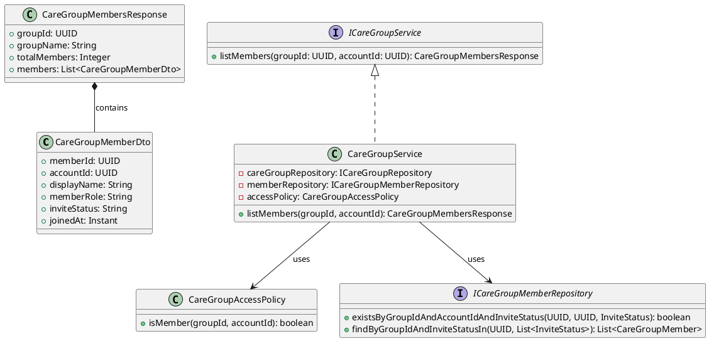
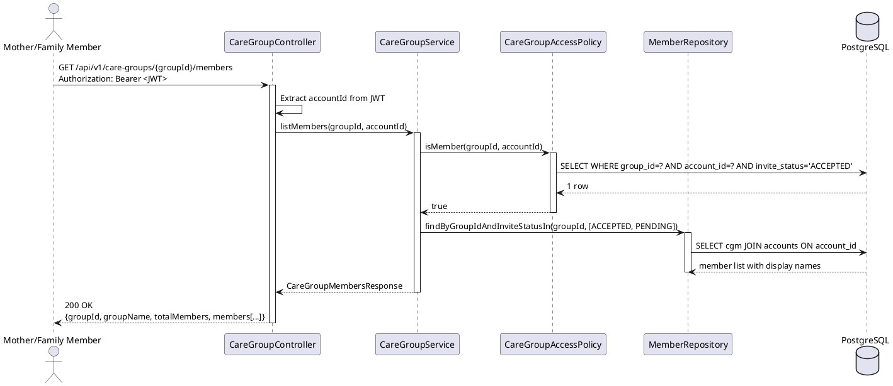
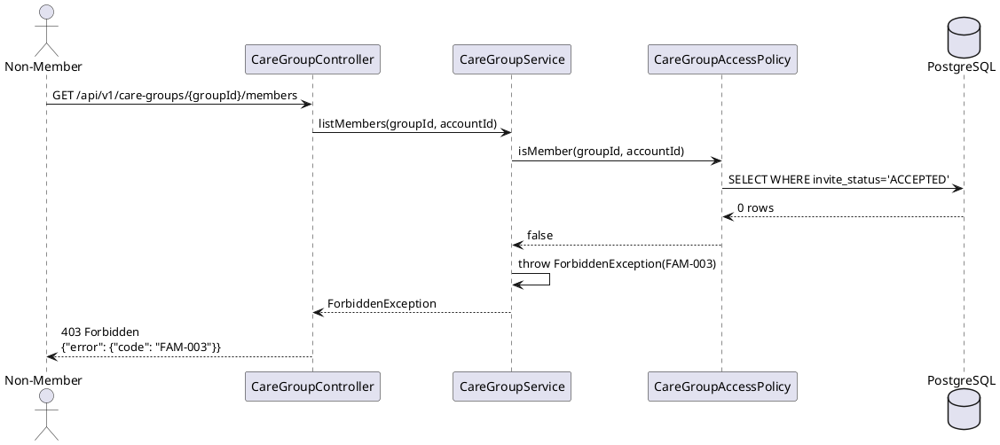

# ENGINEERING DOCUMENTATION STANDARD (EDS) v2.0
# Technical Design Specification — UC-216 View Care Group Members

| Field | Value |
|-------|-------|
| **Document ID** | `CB-FAM-IMP-002` |
| **Version** | `1.0` |
| **Date** | `2026-06-26` |
| **Status** | `Draft` |
| **Document Owner** | `PhuongNT` |
| **Author** | `AI Agent` |
| **Reviewed by** | `[Tech Lead]` |
| **DPO Sign-off** | `[ ] Pending` |
| **Approved by** | `[Principal Architect]` |
| **Last Review** | `2026-06-26` |
| **Based on EDS** | `v2.0` |

---

## CHANGELOG

| Ngày | Người thực hiện | Nội dung thay đổi |
|------|-----------------|-------------------|
| 2026-06-26 | AI Agent | Tạo tài liệu lần đầu cho UC-216 View Care Group Members |

---

## MỤC LỤC

1. [Tổng quan Module](#1-tổng-quan-module)
2. [Ma trận Truy vết](#2-ma-trận-truy-vết-traceability-matrix)
3. [Architecture Decision Records (ADR)](#3-architecture-decision-records-adr)
4. [Non-Functional Requirements & SLA](#4-non-functional-requirements--sla)
5. [Static Modeling](#5-static-modeling-mô-hình-tĩnh)
6. [Dynamic Modeling](#6-dynamic-modeling-mô-hình-động)
7. [Domain Event Catalog](#7-domain-event-catalog)
8. [Interface Specification](#8-interface-specification-đặc-tả-giao-diện)
9. [API Specification](#9-api-specification)
10. [Bảng mã lỗi](#10-bảng-mã-lỗi-error-codes)
11. [Quy trình Triển khai](#11-quy-trình-triển-khai-step-by-step)
12. [Rollback & Incident Runbook](#12-rollback--incident-runbook)
13. [Kịch bản Kiểm thử Chi tiết](#13-kịch-bản-kiểm-thử-chi-tiết)
14. [Phương pháp Xác minh](#14-phương-pháp-xác-minh)
15. [Mẫu thử thực tế (API Verification Samples)](#15-mẫu-thử-thực-tế-api-verification-samples)
16. [Bảng tổng hợp phân quyền (Authorization Matrix)](#16-bảng-tổng-hợp-phân-quyền-authorization-matrix)
17. [AI Prompt Constraints (CASE 2.0)](#17-ai-prompt-constraints-case-20)

---

## 1. Tổng quan Module

| Field | Value |
|-------|-------|
| **Module Name** | `ViewCareGroupMembers` |
| **Bounded Context** | `family` |
| **UC ID** | `UC-216` |
| **SRS Reference** | `3.3.17.1` |
| **Primary Actor** | `Mother, Family Member` |
| **Secondary Actors** | `Firebase Cloud Messaging` |
| **Platform** | `Mobile App` |
| **Data Classification** | `PII` |
| **Compliance Scope** | `BR-RBAC, BR-PRIVACY, PDPA` |
| **Upstream Dependencies** | `auth, care_groups table, care_group_members table, accounts` |
| **Downstream Consumers** | `invitation management, family task assignment` |

**Mô tả:** Hiển thị danh sách thành viên trong care group: tên hiển thị, role (OWNER/MEMBER/VIEWER), trạng thái lời mời (ACCEPTED/PENDING/REVOKED). Chỉ members của group mới được xem. REVOKED members bị loại khỏi kết quả trả về.

---

## 2. Ma trận Truy vết (Traceability Matrix)

| Requirement ID | Loại | Mô tả | Thành phần Code | Compliance Target | ADR liên quan |
|----------------|------|-------|-----------------|-------------------|---------------|
| UC-216 | Use Case | Xem thành viên care group | `CareGroupController.listMembers()` | BR-RBAC | ADR-FAM-002 |
| BR-FAM-010 | Business Rule | Chỉ members của group mới xem được | `CareGroupAccessPolicy.isMember()` | BR-PRIVACY | ADR-FAM-002 |
| BR-FAM-011 | Business Rule | REVOKED members không hiển thị trong list | `status filter: ACCEPTED, PENDING only` | Data Integrity | — |
| BR-PRIVACY-002 | Business Rule | Chỉ show display name — không show email/phone của members | Response mapping | PDPA | — |

---

## 3. Architecture Decision Records (ADR)

### ADR-FAM-002 — Member-only visibility cho care group data

| Field | Value |
|-------|-------|
| **Status** | `Accepted` |
| **Deciders** | `Tech Lead` |
| **Date** | `2026-06-26` |

#### Bối cảnh
Care group chứa thông tin gia đình nhạy cảm. Cần xác định rõ ai được phép xem danh sách thành viên.

#### Các phương án đã xem xét

| Phương án | Mô tả | Ưu điểm | Nhược điểm |
|-----------|-------|----------|------------|
| A | Bất kỳ ACCEPTED/PENDING member đều xem được | Đơn giản | PENDING invitees thấy thông tin nhạy cảm trước khi chấp nhận |
| B | Chỉ ACCEPTED members mới xem được member list | An toàn hơn | Phức tạp hơn |

#### Quyết định
Chọn **Phương án B**: Chỉ accounts có `invite_status = ACCEPTED` trong `care_group_members` mới được xem thành viên group. Pending invitees không được xem member list.

#### Hệ quả

**Tích cực:**
- Bảo vệ thông tin thành viên trước khi họ chính thức join group
- Tuân thủ nguyên tắc least privilege

**Tiêu cực / Trade-offs:**
- PENDING invitees cần UI riêng để xem thông tin lời mời

**Compliance Impact:**
- Phù hợp PDPA về bảo vệ thông tin cá nhân

---

## 4. Non-Functional Requirements & SLA

### 4.1. Performance & Availability

| Category | Requirement | Target SLA | Measurement Method | Compliance Basis |
|----------|-------------|------------|---------------------|------------------|
| Latency | API response (p99) | `< 200ms` | k6 load test | — |
| Availability | Uptime (monthly) | `99.9%` | Uptime monitor | — |
| Max members | Display limit | 20 members per group | Product requirement | — |

### 4.2. Data Integrity & Retention

| Category | Requirement | Target | Verification Method | Compliance Basis |
|----------|-------------|--------|---------------------|------------------|
| Durability | Read-only endpoint, no write | N/A | — | — |
| Retention | Care group audit log | 7 năm | DB backup | PDPA |

### 4.3. Security

| Category | Requirement | Target | Verification Method | Compliance Basis |
|----------|-------------|--------|---------------------|------------------|
| Access control | ACCEPTED-only visibility | 100% | Auth Matrix §16 | PDPA |
| PII masking | No email/phone in response | 100% | Response schema | BR-PRIVACY-002 |

---

## 5. Static Modeling (Mô hình Tĩnh)

### 5.1. Class Diagram (PlantUML)



### 5.2. Data Structure

Module này không tạo migration mới — sử dụng tables `care_groups` và `care_group_members` đã có sẵn.

```sql
-- Tham chiếu (đã tồn tại)
-- care_groups(id, name, created_by, ...)
-- care_group_members(id, group_id, account_id, member_role, invite_status, joined_at, ...)
-- accounts(id, display_name, ...)

-- Query pattern:
SELECT cgm.id, cgm.account_id, a.display_name, cgm.member_role, cgm.invite_status, cgm.joined_at
FROM care_group_members cgm
JOIN accounts a ON cgm.account_id = a.id
WHERE cgm.group_id = :groupId
  AND cgm.invite_status IN ('ACCEPTED', 'PENDING')
ORDER BY cgm.joined_at ASC;
```

---

## 6. Dynamic Modeling (Mô hình Động)

### 6.1. Sequence Diagram — Happy Path (PlantUML)



### 6.2. Sequence Diagram — Error Path



---

## 7. Domain Event Catalog

### 7.1. Events Published (Phát ra)

| Event Name | Trigger | Publisher | Subscriber(s) | Async? |
|------------|---------|-----------|---------------|--------|
| — | Read-only endpoint — không phát sự kiện | — | — | — |

### 7.2. Events Consumed (Tiêu thụ)

| Event Name | Source | Handler | Action thực hiện |
|------------|--------|---------|------------------|
| `MemberInvited` | `InvitationService` | — | Tạo record PENDING trong care_group_members (ngoài scope UC-216) |
| `InvitationAccepted` | `InvitationService` | — | Cập nhật invite_status → ACCEPTED (ngoài scope UC-216) |
| `MemberRevoked` | `CareGroupService` | — | Cập nhật invite_status → REVOKED (ngoài scope UC-216) |

---

## 8. Interface Specification (Đặc tả Giao diện)

### 8.1. Service Interface

```java
// CareGroupMembersResponse.java
// @version 1.0
public class CareGroupMembersResponse {
    private UUID groupId;
    private String groupName;
    private Integer totalMembers;
    private List<CareGroupMemberDto> members;
    // getters / setters
}

// CareGroupMemberDto.java
public class CareGroupMemberDto {
    private UUID memberId;          // care_group_members.id
    private UUID accountId;
    private String displayName;     // from accounts table — NOT email/phone
    private String memberRole;      // OWNER, MEMBER, VIEWER
    private String inviteStatus;    // ACCEPTED, PENDING (không bao giờ REVOKED)
    private Instant joinedAt;       // null nếu PENDING
    // getters / setters
}

// ICareGroupService.java (phần bổ sung cho UC-216)
// @version 1.0
public interface ICareGroupService {
    /**
     * Lấy danh sách thành viên của care group.
     * Chỉ accounts có invite_status=ACCEPTED mới được gọi.
     * @throws NotFoundException (FAM-005) khi group không tồn tại
     * @throws ForbiddenException (FAM-003) khi caller không phải ACCEPTED member
     */
    CareGroupMembersResponse listMembers(UUID groupId, UUID accountId);
}
```

### 8.2. Repository Interface

```java
// ICareGroupMemberRepository.java
// @version 1.0
public interface ICareGroupMemberRepository extends JpaRepository<CareGroupMember, UUID> {

    boolean existsByGroupIdAndAccountIdAndInviteStatus(
        UUID groupId, UUID accountId, InviteStatus status
    );

    List<CareGroupMember> findByGroupIdAndInviteStatusIn(
        UUID groupId, List<InviteStatus> statuses
    );
}
```

---

## 9. API Specification

### 9.1. Endpoints Table

| Method | Path | Auth Level | Required Roles | Rate Limit | Idempotent? |
|--------|------|------------|----------------|------------|-------------|
| `GET` | `/api/v1/care-groups/{groupId}/members` | JWT Bearer | `ROLE_MOTHER` | 60/min | Yes |

### 9.2. Request / Response Schemas

#### `GET /api/v1/care-groups/{groupId}/members`

**Response — 200 OK (Happy Path):**
```json
{
  "groupId": "group-uuid",
  "groupName": "My Pregnancy Team",
  "totalMembers": 3,
  "members": [
    {
      "memberId": "member-uuid-1",
      "accountId": "account-uuid-1",
      "displayName": "Nguyen Thi A",
      "memberRole": "OWNER",
      "inviteStatus": "ACCEPTED",
      "joinedAt": "2026-06-26T00:00:00.000Z"
    },
    {
      "memberId": "member-uuid-2",
      "accountId": "account-uuid-2",
      "displayName": "Tran Van B",
      "memberRole": "MEMBER",
      "inviteStatus": "PENDING",
      "joinedAt": null
    }
  ]
}
```

**Response — 403 Forbidden:**
```json
{
  "error": {
    "code": "FAM-003",
    "message": "Not a group member"
  }
}
```

**Response — 404 Not Found:**
```json
{
  "error": {
    "code": "FAM-005",
    "message": "Care group not found"
  }
}
```

---

## 10. Bảng mã lỗi (Error Codes)

| Code | HTTP Status | Message (EN) | Message (VI) | Trigger Condition |
|------|-------------|--------------|--------------|-------------------|
| `FAM-003` | 403 | Not a group member | Không phải thành viên của nhóm | Caller không có invite_status=ACCEPTED |
| `FAM-005` | 404 | Care group not found | Không tìm thấy nhóm | groupId không tồn tại trong DB |
| `FAM-006` | 500 | Internal error | Lỗi hệ thống | Lỗi DB không xác định |

---

## 11. Quy trình Triển khai (Step-by-Step)

### 11.1. Prerequisites

- [ ] Tables `care_groups`, `care_group_members`, `accounts` đã tồn tại
- [ ] `InviteStatus` enum đã được định nghĩa
- [ ] JWT filter đã configured trong Spring Security
- [ ] Không cần migration mới cho UC-216

### 11.2. Pre-Migration Checklist

Không áp dụng — UC-216 là read-only endpoint, không có schema change.

### 11.3. Implementation Steps

#### Chặng 1 — Tạo Repository method

```java
// Trong ICareGroupMemberRepository.java — thêm method:
boolean existsByGroupIdAndAccountIdAndInviteStatus(
    UUID groupId, UUID accountId, InviteStatus status);

List<CareGroupMember> findByGroupIdAndInviteStatusIn(
    UUID groupId, List<InviteStatus> statuses);
```

#### Chặng 2 — Tạo CareGroupAccessPolicy

```java
@Component
public class CareGroupAccessPolicy {
    private final ICareGroupMemberRepository memberRepository;

    public boolean isMember(UUID groupId, UUID accountId) {
        return memberRepository.existsByGroupIdAndAccountIdAndInviteStatus(
            groupId, accountId, InviteStatus.ACCEPTED
        );
    }
}
```

#### Chặng 3 — Implement Service

```java
@Override
public CareGroupMembersResponse listMembers(UUID groupId, UUID accountId) {
    CareGroup group = careGroupRepository.findById(groupId)
        .orElseThrow(() -> new NotFoundException("FAM-005"));
    if (!accessPolicy.isMember(groupId, accountId)) {
        throw new ForbiddenException("FAM-003");
    }
    List<CareGroupMember> members = memberRepository.findByGroupIdAndInviteStatusIn(
        groupId, List.of(InviteStatus.ACCEPTED, InviteStatus.PENDING)
    );
    return mapper.toResponse(group, members);
}
```

#### Chặng 4 — Implement Controller

```java
@GetMapping("/api/v1/care-groups/{groupId}/members")
public ResponseEntity<CareGroupMembersResponse> listMembers(
    @PathVariable UUID groupId,
    @AuthenticationPrincipal JwtUser jwtUser
) {
    return ResponseEntity.ok(careGroupService.listMembers(groupId, jwtUser.getAccountId()));
}
```

#### Chặng 5 — Verification sau deploy

```bash
curl -X GET https://[host]/api/v1/health
# Expected: {"status": "ok"}
```

### 11.4. Deployment Checklist

- [ ] Health check endpoint trả về 200
- [ ] Không có migration mới cần chạy
- [ ] Log không chứa email/phone của members
- [ ] Thử GET với PENDING invitee account → phải nhận 403

---

## 12. Rollback & Incident Runbook

### 12.1. Điều kiện kích hoạt Rollback

| Điều kiện | Ngưỡng | Người quyết định |
|-----------|--------|------------------|
| Error rate tăng đột biến | > 5% trong 5 phút | On-call Engineer |
| Latency p99 vượt ngưỡng | > 500ms | On-call Engineer |
| PII leak (email/phone trong response) | Bất kỳ case nào | Tech Lead + DPO |

### 12.2. Rollback Procedure

Không có DB migration cho UC-216 → rollback chỉ cần revert code:

```bash
# Bước 1: Re-deploy phiên bản cũ
kubectl rollout undo deployment/carebridge-api

# Bước 2: Verify rollback thành công
kubectl rollout status deployment/carebridge-api
curl -X GET https://[host]/api/v1/health

# Bước 3: Smoke test
curl -X GET https://[host]/api/v1/care-groups/{groupId}/members \
  -H "Authorization: Bearer <valid_member_token>"
# Expected: 200 OK
```

### 12.3. Notification Protocol

| Thời điểm | Người nhận | Kênh | Template |
|-----------|------------|------|----------|
| Ngay khi phát hiện | On-call team | Slack `#incident` | "🚨 UC-216 incident: [mô tả]" |
| Nếu PII bị leak | DPO | Email | Bắt buộc — PDPA Art. 37 |

### 12.4. Post-Incident Review (PIR)

> Bắt buộc hoàn thành trong vòng 48 giờ sau khi resolve incident.

- **Timeline:** Diễn biến chi tiết
- **Root Cause:** 5 Whys analysis
- **Impact:** Số users bị ảnh hưởng, có PII bị lộ không?
- **Prevention:** Action items để tránh tái diễn

---

## 13. Kịch bản Kiểm thử Chi tiết

> **Policy (EDS v2.0):** Mọi test scenario dùng dữ liệu `SYNTHETIC`.

### 13.1. Unit Tests

#### TC-UNIT-001 — ACCEPTED member xem được member list

```gherkin
Feature: View Care Group Members
  Background:
    Given test data classification: SYNTHETIC
    And care group CG-001 tồn tại
    And ACC-001 có invite_status=ACCEPTED trong CG-001

  Scenario: ACCEPTED member views member list → 200
    Given 3 members: 1 ACCEPTED (owner), 1 ACCEPTED, 1 PENDING
    When listMembers(CG-001, ACC-001) được gọi
    Then response trả về 3 members (2 ACCEPTED + 1 PENDING)
    And response KHÔNG chứa members có invite_status=REVOKED
```

**Hàm được test:** `CareGroupService.listMembers()`
**Invariant:** REVOKED members không được xuất hiện trong kết quả

#### TC-UNIT-002 — PENDING invitee → 403

```gherkin
  Scenario: PENDING invitee cannot view member list
    Given ACC-002 có invite_status=PENDING trong CG-001
    When listMembers(CG-001, ACC-002) được gọi
    Then throws ForbiddenException với code FAM-003
```

#### TC-UNIT-003 — Non-member → 403

```gherkin
  Scenario: Non-member → 403
    Given ACC-003 KHÔNG có bất kỳ record nào trong CG-001
    When listMembers(CG-001, ACC-003) được gọi
    Then throws ForbiddenException với code FAM-003
```

#### TC-UNIT-004 — Response không chứa PII

```gherkin
  Scenario: Response shows displayName but NOT email/phone
    Given ACCEPTED member ACC-001 có email="test@example.com", phone="0901234567"
    When listMembers(CG-001, ACC-001) được gọi
    Then response JSON KHÔNG chứa "@"
    And response JSON KHÔNG chứa "phone"
    And response JSON KHÔNG chứa "email"
    And response JSON chứa "displayName"
```

### 13.2. Integration Tests

#### TC-INT-001 — Full flow với DB

```gherkin
  Scenario: Service + Repository phối hợp đúng
    Given test data classification: SYNTHETIC
    And database có CG-001 với 2 ACCEPTED members và 1 REVOKED member
    When CareGroupService.listMembers(CG-001, ACCEPTED_MEMBER_ID) được gọi
    Then memberRepository.findByGroupIdAndInviteStatusIn được gọi với statuses=[ACCEPTED, PENDING]
    And database query KHÔNG include REVOKED records
```

### 13.3. E2E / Security Tests

#### TC-E2E-001 — Luồng hoàn chỉnh qua API

```gherkin
  Scenario: OWNER gọi API → 200
    Given test data classification: SYNTHETIC
    And ACC-OWNER có JWT hợp lệ, invite_status=ACCEPTED, memberRole=OWNER
    When GET /api/v1/care-groups/{groupId}/members được gọi với:
      | Header        | Value              |
      | Authorization | Bearer <jwt_token> |
    Then response status là 200
    And response chứa members list
    And response KHÔNG chứa email hoặc phone

  Scenario: Gọi không có JWT → 401
    When GET /api/v1/care-groups/{groupId}/members không có Authorization header
    Then response status là 401
```

---

## 14. Phương pháp Xác minh

### 14.1. Database Inspection

```sql
-- Verify REVOKED members không có trong response (kiểm tra filter logic)
SELECT account_id, invite_status
FROM care_group_members
WHERE group_id = '<groupId>'
ORDER BY invite_status;
-- REVOKED rows phải bị filter ra bởi service

-- Verify ACCEPTED member count
SELECT COUNT(*) FROM care_group_members
WHERE group_id = '<groupId>' AND invite_status = 'ACCEPTED';
```

### 14.2. Log / Audit Verification

```bash
# Verify không có PII trong log
kubectl logs -l app=carebridge-api | grep -i "email\|phone\|@"
# Expected: No output liên quan đến member data

# Verify access control log
kubectl logs -l app=carebridge-api | grep "FAM-003" | head -5
```

### 14.3. Tool-based Verification

```bash
# Verify JWT claims
echo "<JWT_TOKEN>" | cut -d'.' -f2 | base64 -d | jq '.sub, .roles'
# Expected: accountId và ROLE_MOTHER

# Verify TLS
openssl s_client -connect [host]:443 -tls1_3 2>&1 | grep "Protocol"
```

---

## 15. Mẫu thử thực tế (API Verification Samples)

### 15.1. Happy Path

```bash
# GET danh sách members (ACCEPTED member)
curl -X GET https://[host]/api/v1/care-groups/CG-001/members \
  -H "Authorization: Bearer <ACCEPTED_MEMBER_JWT>" \
  -H "X-Correlation-Id: $(uuidgen)"
```

**Expected Response (200):**
```json
{
  "groupId": "CG-001",
  "groupName": "My Pregnancy Team",
  "totalMembers": 2,
  "members": [
    {
      "memberId": "mem-uuid-1",
      "accountId": "acc-uuid-1",
      "displayName": "Nguyen Thi A",
      "memberRole": "OWNER",
      "inviteStatus": "ACCEPTED",
      "joinedAt": "2026-06-26T00:00:00.000Z"
    }
  ]
}
```

### 15.2. Error Paths

```bash
# PENDING invitee → 403
curl -X GET https://[host]/api/v1/care-groups/CG-001/members \
  -H "Authorization: Bearer <PENDING_INVITEE_JWT>"
```

**Expected Response (403):**
```json
{
  "error": {
    "code": "FAM-003",
    "message": "Not a group member"
  }
}
```

```bash
# Group not found → 404
curl -X GET https://[host]/api/v1/care-groups/NONEXISTENT/members \
  -H "Authorization: Bearer <VALID_JWT>"
```

**Expected Response (404):**
```json
{
  "error": {
    "code": "FAM-005",
    "message": "Care group not found"
  }
}
```

---

## 16. Bảng tổng hợp phân quyền (Authorization Matrix)

> Nguyên tắc **Least Privilege**: Chỉ ACCEPTED members và Admin được xem.

| Endpoint | `GUEST` | `MOTHER (ACCEPTED)` | `MOTHER (PENDING)` | `EXPERT` | `ADMIN` |
|----------|---------|---------------------|---------------------|----------|---------|
| `GET /api/v1/care-groups/:id/members` | ❌ | ✅ Own group | ❌ | ❌ | ✅ All |

**Chú thích:**
- ✅ = Được phép
- ❌ = Bị từ chối (403)
- `Own group` = Chỉ group mà họ là ACCEPTED member

---

## 17. AI Prompt Constraints (CASE 2.0)

### 17.1 Constraint Summary Table

| # | Constraint | Source (ADR/BR) | Last Verified |
|---|-----------|-----------------|---------------|
| C1 | `isMember()` PHẢI check `invite_status='ACCEPTED'` — KHÔNG phải PENDING hay REVOKED | ADR-FAM-002 | 2026-06-26 |
| C2 | Response chỉ được include `displayName` — KHÔNG email, phone, hay raw accountId trong user-facing field | BR-PRIVACY-002 | 2026-06-26 |
| C3 | Filter members theo `invite_status IN ('ACCEPTED', 'PENDING')` — REVOKED phải bị loại | BR-FAM-011 | 2026-06-26 |
| C4 | `accountId` lấy từ JWT SecurityContext — KHÔNG từ URL path hay request body | BR-RBAC | 2026-06-26 |
| C5 | Read-only endpoint — KHÔNG có side effects, không ghi audit log | — | 2026-06-26 |

### 17.2 Constraint Injection Block (Copy-Paste vào AI Prompt)

```
[CONSTRAINT BLOCK — Module: ViewCareGroupMembers (CB-FAM-IMP-002)]
Theo TDS CB-FAM-IMP-002 và các ADR liên quan:

1. (C1 — ADR-FAM-002) isMember() check phải dùng invite_status='ACCEPTED' — KHÔNG phải PENDING.
2. (C2 — BR-PRIVACY-002) CareGroupMemberDto chỉ được chứa displayName, KHÔNG có email/phone/raw accountId trong response.
3. (C3 — BR-FAM-011) Query filter: invite_status IN ('ACCEPTED', 'PENDING') — REVOKED bị loại hoàn toàn.
4. (C4 — BR-RBAC) accountId extract từ JWT SecurityContext.getAuthentication(), không nhận từ URL.
5. (C5) GET-only endpoint — không emit events, không audit log.

[CONTEXT BLOCK]
- Bounded Context: family
- Data Classification: PII
- Compliance: PDPA
- Existing interfaces: §8 Service Interface + Repository Interface
- Error codes: FAM-003 (403), FAM-005 (404)
- Auth matrix: §16

[TASK BLOCK]
Implement CareGroupService.listMembers() thỏa mãn constraints trên.
Output phải tuân thủ §8 Interface Specification.
Tests phải cover §13 Test Scenarios.
```

### 17.3 Constraint Quality Checklist

- [x] Mỗi constraint traceable về ADR hoặc BR cụ thể
- [x] Không có constraint generic
- [x] Mỗi constraint có `Last Verified` date
- [x] Constraint block có ≥ 5 constraints cụ thể
- [x] Constraint block reference §8 Interface
- [x] Constraint block reference §16 Auth Matrix

### 17.4 Anti-Pattern Detection

| AP-ID | Anti-Pattern | Dấu hiệu | Hành động |
|-------|-------------|-----------|----------|
| AP-AI-001 | Unconstrained Gen | Code không check invite_status='ACCEPTED' | Reject — inject lại C1 |
| AP-AI-003 | Implicit Decision | Code expose email/phone trong response | Reject — C2 violation |
| AP-AI-005 | Hallucinated Contract | Code import ICareGroupService method không có trong §8 | Reject — verify contract |

---

## PHỤ LỤC

### A. Glossary (Thuật ngữ)

| Thuật ngữ | Định nghĩa |
|-----------|------------|
| Care Group | Nhóm gia đình gồm mẹ và các thành viên hỗ trợ (chồng, bố mẹ, bác sĩ gia đình) |
| InviteStatus | Trạng thái lời mời: ACCEPTED (đã chấp nhận), PENDING (đang chờ), REVOKED (bị thu hồi) |
| MemberRole | Vai trò trong nhóm: OWNER (người tạo), MEMBER (thành viên), VIEWER (chỉ xem) |
| PII | Personally Identifiable Information — thông tin nhận dạng cá nhân |
| Least Privilege | Nguyên tắc cấp quyền tối thiểu cần thiết |
| Append-only | Chiến lược không UPDATE/DELETE, chỉ INSERT và đổi status |

### B. Tài liệu tham chiếu

| Document | Link / Path |
|----------|-------------|
| PDPA Vietnam | [Link] |
| BR-RBAC Policy | `05_Development/CareBridgeAPI/src/main/java/com/carebridge/policy/` |
| EDS v2.0 Template | `08_References/Template/PHASE-3_TDS.md` |
| CASE 2.0 Methodology | `08_References/` |

---

*EDS v2.1 — Tích hợp CASE 2.0 AI Prompt Constraints (§17).*
